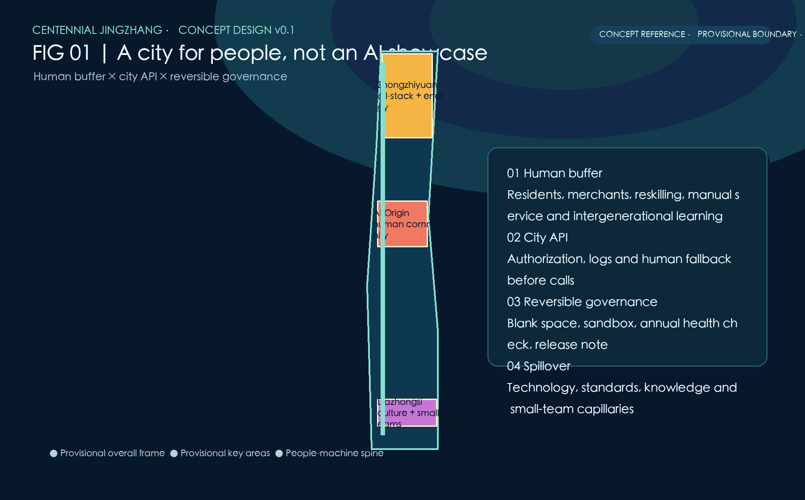
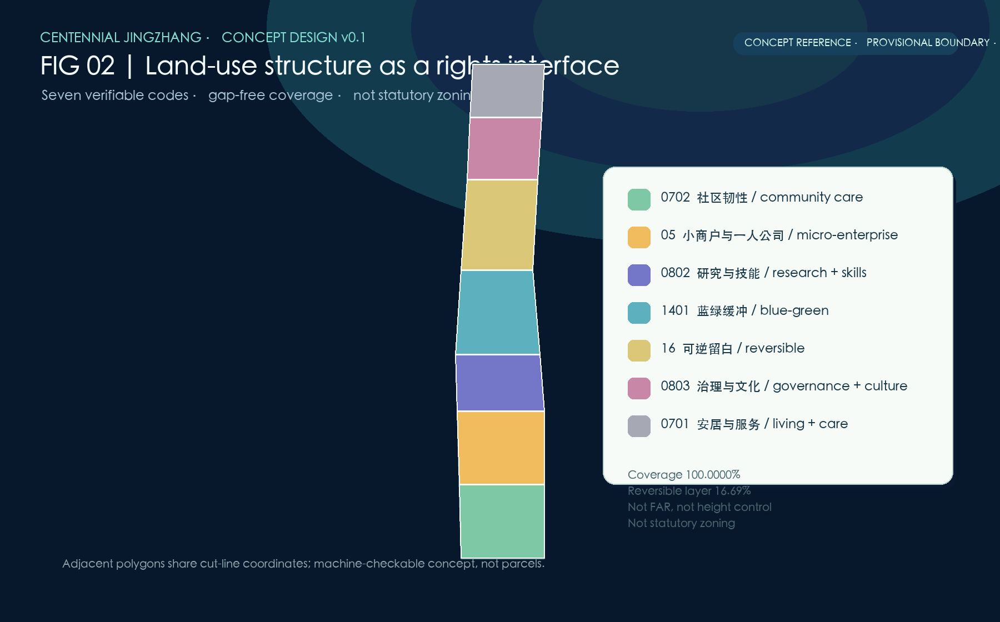
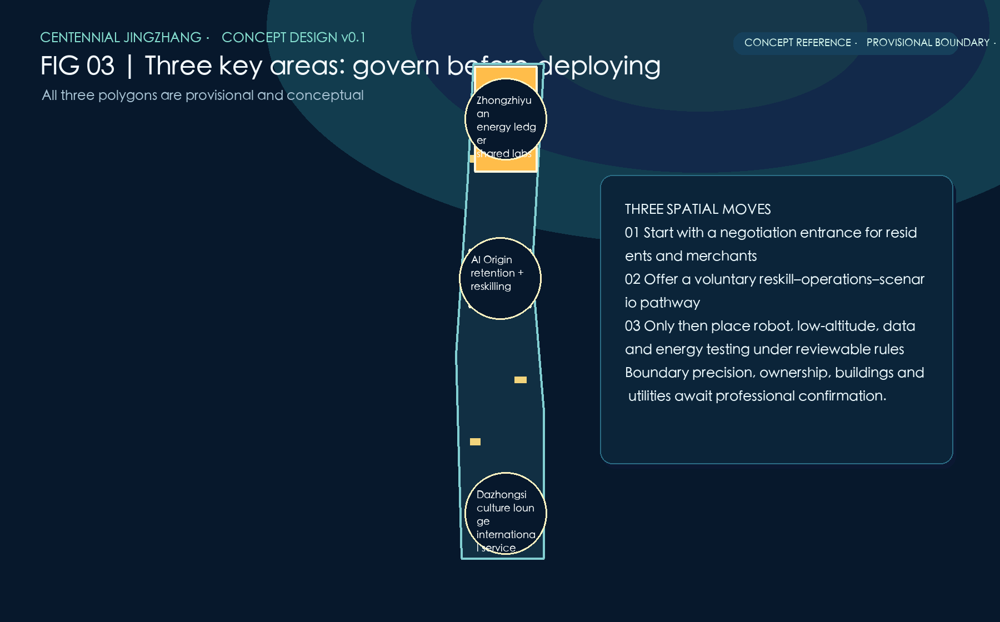
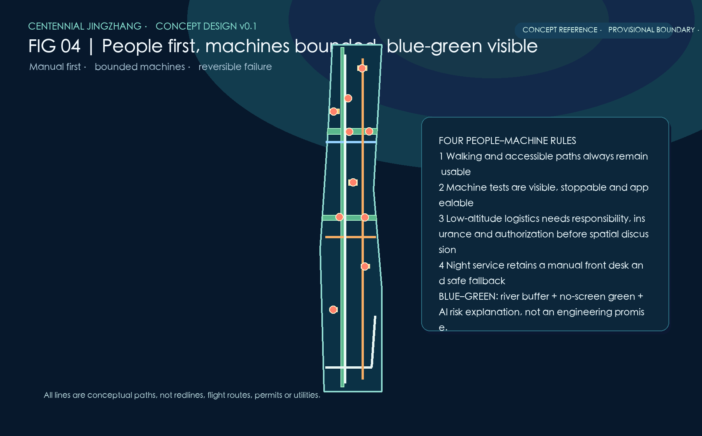
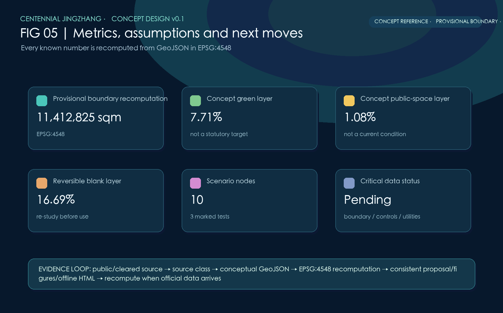

# From an AI Showcase to a City for People in the AI Era

This is a conceptual reference proposal for professional deepening. It does not claim approval, statutory controls, construction feasibility, investments, confirmed enterprises, or implemented services. The Chinese proposal is the formal primary text.

## Design Basis and Source List

The submission uses the local announcement and taskbook snapshots, source registry, allowed design space, standards, code lists and public sources. `usable_for_formal` evidence is kept distinct from `background_only` context and `provisional_only` geometry. The latter is never promoted into a formal redline. [source:OFFICIAL-ANNOUNCEMENT]

The only submitted site geometry is a repository-provided rough provisional polygon. It is explicitly marked `official_boundary=false` and `geometry_role=provisional_constraint`; all areas are EPSG:4548 recomputations for this package only. [data:geometry/site_boundary.geojson#PROV-SITE-001]

## Three-Level Scope Framework

The coordinated research frame, overall design frame and three key areas are treated as different evidence resolutions. The broader research frame supports regional innovation discussion; the overall frame organizes conceptual layers; the key areas host scenario relationships. None substitutes for an official boundary. [depth:three_level_scope_framework]

The package asks for more authoritative geometry, control-plan, survey, ownership, hydrology, utilities, transport and heritage inputs before any professional statutory use. [standard:MOHURD-CONTROL-DETAILED-PLANNING]

## Coordinated Research Area: Industry and Future City Research

One belt, three nodes and two wings connect social infrastructure, research, cultural life, municipal service and regional spillover. Technology, standards, knowledge and small-team support are described as mechanisms to study, not promised outcomes. [source:AGENT-TASKBOOK]

Helsinki 3D, Amsterdam TADA, Barcelona Digital City and Singapore Seniors Go Digital are comparison references only. They inform open-city models, data rights and inclusion; they do not prove local adoption. [source:CASE-AMSTERDAM-TADA]

## Overall Design Area: Urban Renewal and Regulatory-Plan-Level Urban Design

The design overlays a human buffer layer, a governed city API layer and reversible space. Community retention, small-business negotiation, skills transition, manual service, intergenerational learning and night-time care constitute the first layer. [depth:overall_spatial_structure]

The API layer requires authorization, minimal necessity, audit logs and human fallback before any agent call. Public testing for low-speed robots or low-altitude logistics is a sandbox proposition requiring safety, insurance, responsibility and data review. [data:geometry/constraints.geojson#SCN-07]

## Detailed Design of Key Areas

Zhongzhiyuan is a conceptual all-stack innovation, energy-accounting and governance setting; the AI Origin Community links resident retention, skills, manual front desks and shared learning; Dazhongsi connects culture, small teams and international soft services. [data:geometry/key_areas.geojson#PROV-KEY-001]

All three polygons are provisional, so their locations only communicate relationships between scenarios and public space. Their exact extent, area and land rights require official data and professional verification. [source:BOUNDARY-PROVISIONAL]

## AI Innovation Ecosystem, Personas, and AI+ Scenarios

Five core personas are residents, workers facing task transition, older adults, night-working AI workers, and students/small teams. The proposal refuses to turn residents into passive visitors to an AI showcase. [source:IMF-AI-JOBS-2024]

Ten concept cards span community retention, small-business matching, reskilling, intergenerational navigation, manual night service, municipal API governance, robot testing, low-altitude logistics rules, flood simulation and energy-heat ledgers. Three are explicitly testing scenarios, not deployments. [metric:scenario_node_count]

## Land Use, Building Scale, and Retain-Renovate-Demolish Strategy

Seven MNR-compatible land-use codes cover the submitted provisional boundary without gaps or overlaps. Their labels communicate a concept structure rather than statutory land designation. [standard:MNR-LAND-USE-CLASSIFICATION-GUIDE]

Five footprint diagrams are activity carriers only. They carry no FAR, height, total floor area, engineering, demolition, retention or construction instruction. Decisions on alteration require legal process, resident and merchant engagement, accessibility, cultural and climate assessment. [depth:retain_renovate_demolish]

## Transport, Rail, Municipal Infrastructure, and Public Services

Mobility follows people first, machines bounded and failure reversible. The diagram proposes manual alternatives, accessible walking, night service and clearly governed mixed-use tests, never a road redline or operating permit. [data:geometry/roads.geojson#MOBILITY-04]

Municipal agents and the digital twin remain research interfaces pending authorization. No real city data, station throughput, parking capacity, utility capacity or flight corridor is claimed. [depth:municipal_new_infrastructure]

## Blue-Green Network, Public Space, and Urban Character

The Xiaoyue River wing is represented as a conceptual interface between flood-risk visibility, no-screen green space, public observation and slow movement. AI flood simulation is an explanatory tool and cannot replace hydrological or drainage engineering. [depth:blue_green_public_space]

The concept-layer green and public-space ratios are derived from geometry and are not current conditions or statutory targets. Architecture is deliberately shown as low-claim activity footprints, leaving form, height and heritage control for licensed professionals. [metric:green_ratio]

## Renewal Projects, Implementation Policy, and Phasing

Five reversible project families are proposed: community retention, reskilling, manual-first services, embodied-AI public tests and energy/data ledgers. They start with rights, responsibility, safety and withdrawal conditions, not with construction packages. [depth:renewal_project_list]

Version 0.1 collects evidence and needs; version 0.2 tests limited sandboxes with human fallback; version 0.3 publishes annual health checks, public feedback and release notes. This is governance sequencing, not a construction timetable or budget commitment. [data:geometry/phasing.geojson#PHASE-01]

## Metrics, Area Recalculation, and Compliance Matrix

Known spatial metrics are recomputed in EPSG:4548 from GeoJSON. The submitted provisional area is 11,412,825.386 sqm; green and public-space values are concept-layer calculations. FAR and building height remain explicitly unknown. [metric:site_area_sqm]

The compliance matrix covers all announcement 1.3/1.4/1.5 tasks and agent.1–agent.6. The standards matrix covers every mandatory local standard snapshot, while the design-depth matrix marks all required items complete as evidence-bounded concept deliverables. [standard:PROJECT-OFFICIAL-ANNOUNCEMENT]

## Risk, Copyright, and Compliance

Boundary uncertainty, data rights, climate, transport, energy and institutional responsibility are disclosed in assumptions rather than hidden behind imagery. No map may be used for statutory area, property, permit or engineering decisions. [depth:risk_missing_data]

All generated text, diagrams and geometry are CC BY 4.0. The offline visual pages use local files only and contain no CDN, remote image or remote data request. External sources are short factual or methodological references. [source:SOURCE-REGISTRY]

## References

- Official announcement and local reference snapshot. [source:OFFICIAL-ANNOUNCEMENT]
- Cleared agent taskbook and local reference snapshot. [source:AGENT-TASKBOOK]
- Source registry and provisional boundary basis. [source:BOUNDARY-PROVISIONAL]
- IMF, WEF, Beijing data-center policy and four international comparison cases: background context only. [source:WEF-FUTURE-JOBS-2025]

