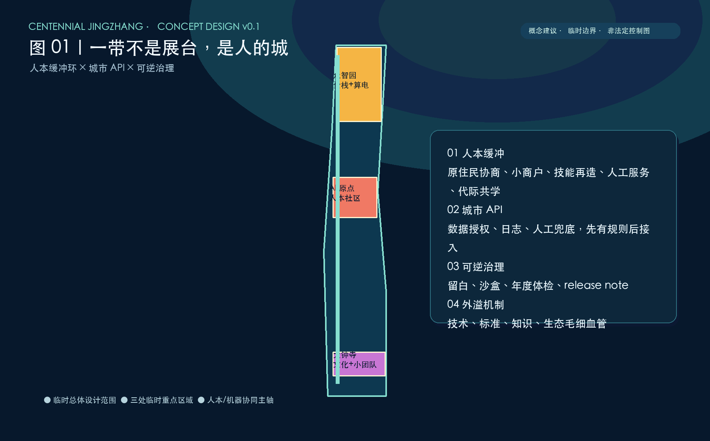
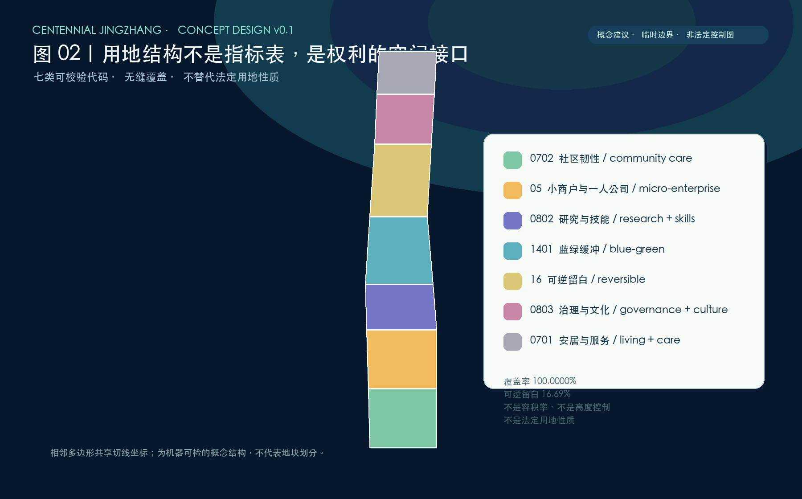
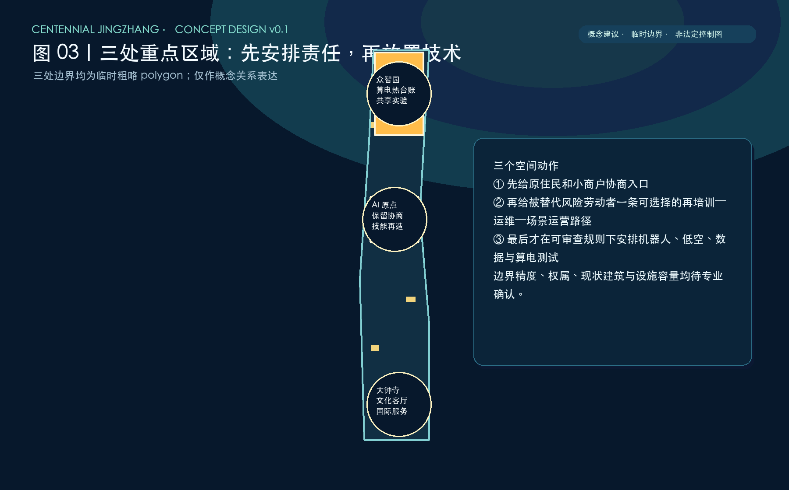
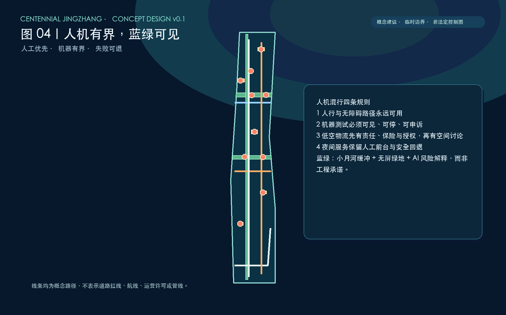
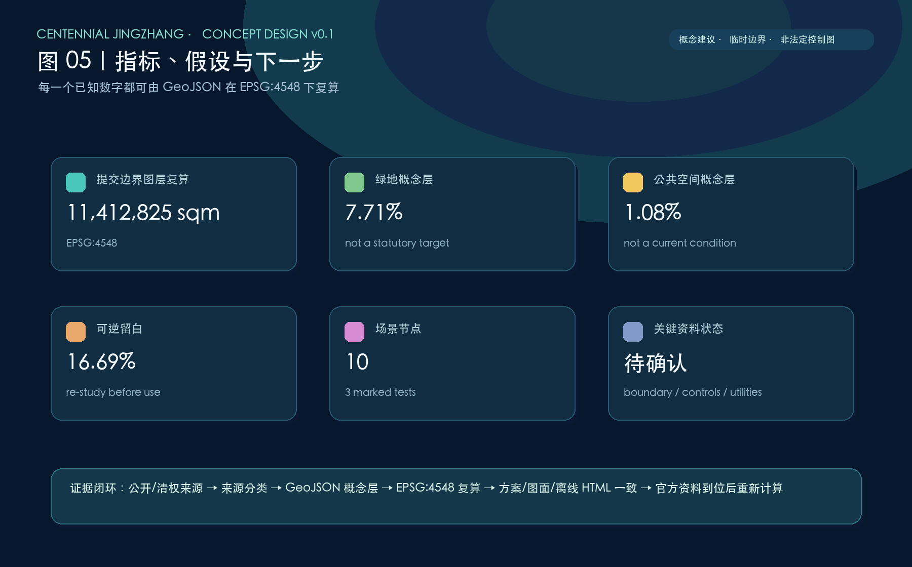

# 从 AI 的展台，到 AI 时代人的城

**主张。** AI 城市不应只展示会说话的设备；它首先应让原住民、被替代风险劳动者、老人、夜班创新者和小团队拥有可进入、可理解、可申诉、可共同塑造的生活与工作空间。本投稿把三类空间动作绑定成一个闭环：以人为本的社会缓冲层、可被公共规则约束的城市 API 层、以及先于设备部署的制度与版本化治理层。所有图层均为概念建议/参考方案，可供专业团队深化研究，不构成政策、审批、工程或投资承诺。[source:AGENT-TASKBOOK] [standard:PROJECT-AGENT-OPEN-CALL-TASKBOOK]

## 设计依据与资料清单

本稿以公告、任务书、标准本地快照、可用枚举和公开来源为依据；其中公告与任务书属于 formal 可用材料，标准判断以仓库 `standards/references` 的本地快照为准，而不是只凭网页地址。[source:OFFICIAL-ANNOUNCEMENT] [standard:PROJECT-OFFICIAL-ANNOUNCEMENT] 对数据来源逐条标识为 `usable_for_formal`、`background_only`、`provisional_only` 或不使用：国际就业研究、北京能效政策、媒体人才报道和国际案例只提供问题背景，绝不升级为本地法定控制；没有可公开精确边界时，唯一空间约束来自仓库的临时粗略 geometry。[source:SOURCE-REGISTRY] [data:geometry/site_boundary.geojson#PROV-SITE-001]

提交范围的 `official_boundary=false`、`geometry_role=provisional_constraint` 已在 GeoJSON、`sources.json`、`assumptions.json`、本方案和离线可视化中重复披露。其 EPSG:4548 复算面积为 11,412,825.386 平方米，只是本次图层运算分母，不是官方红线或精确面积结论。[metric:site_area_sqm] 现状地形、水文、权属、道路红线、管线、轨道客流、既有建筑、保护要素和控规条件均未由公开包完整提供，因此不编造企业名单、投资额、容积率、建筑高度、拆改留清单或工程可行性；这些缺口被保留为待专业团队校验的工作清单。[depth:existing_conditions_diagnosis]

## 三层范围工作框架

本方案把“统筹研究—总体设计—重点区域”视为不同精度的工作框，而非三个可以互相替代的法定边界。第一层承接公告文字中的约 43.6 平方公里创新协同视野，用于观察京津冀技术、制造、人才、标准和事件脉冲的外溢关系；没有将其绘制为正式空间红线。第二层以仓库提供的总体设计范围粗略替代 polygon 组织概念性用地、慢行、公共空间和场景节点，面积仅按 EPSG:4548 重算。[source:OFFICIAL-ANNOUNCEMENT] [data:geometry/site_boundary.geojson#PROV-SITE-001]

第三层是众智园 AI 自主创新加速区、北京 AI 原点社区和大钟寺 AI 产业聚集区三处重点区域。三者的边界同样来自 `provisional_only` 数据，故只用于提出空间角色、场景试验条件和需要向专业团队索取的资料，不能作为地块、道路或审批依据。[data:geometry/key_areas.geojson#PROV-KEY-001] [depth:three_level_scope_framework] 三层之间以“证据粒度”连接：越靠近实施讨论，越需要把概念图转换为经授权的测绘、控规、权属和专项评价；本稿没有越过这一门槛。[standard:MOHURD-CONTROL-DETAILED-PLANNING]

## 统筹研究范围产业与未来城市研究

统筹层的空间命题是“一带、三核、两翼、四种外溢”。一带不是线性展厅，而是一条让研究、制造、社区、河流和文化发生日常碰撞的社会技术走廊；三核分别承担全栈自主创新、社区创新生态和新业态协作；中关村科技服务翼组织知识、公共服务与国际化软配套，小月河场景赋能翼把具身智能、生态韧性和公共体验放在同一个可审查界面。[source:AGENT-TASKBOOK] [depth:overall_spatial_structure]

四种外溢被明确为可讨论机制而非结果承诺：技术外溢把海淀研发问题转译为京津冀制造应用问题；标准外溢把人机路权、数据授权与适老服务的可复核规则沉淀为可复用模板；知识外溢通过十五分钟碰撞圈与事件脉冲连接小团队、实验室和社区；生态毛细血管以共享实验、算力券讨论和一人公司服务来延续车库咖啡式的低门槛创新。国际比较中，赫尔辛基的三维城市、阿姆斯特丹 TADA、巴塞罗那数据城市、新加坡 Seniors Go Digital 分别提示了数字孪生、数据权利、公民数据与数字包容的不同接口，均作为 background_only 的可借鉴案例，而非本地已落地事实。[source:CASE-HELSINKI-3D] [source:CASE-AMSTERDAM-TADA]

## 总体设计范围城市更新与控规深度城市设计

总体结构采用“人本缓冲环 + 机器可调用底座 + 可逆留白”的三层叠合。人本缓冲环将社区保留率概念指标、小商户回迁协商机制、技能再造走廊、人工服务前台、代际共学和夜间无屏绿地编入日常空间；它回应的不是把居民变成体验者，而是让居民保有参与、拒绝和受益的权利。AI 影响就业的国际判断只能说明需要缓冲：IMF 提到全球近四成工作、发达经济体约六成工作可能受影响；WEF 所说的 41% 是雇主对自动化任务后缩减人员的计划，不能被写成本地裁员事实。[source:IMF-AI-JOBS-2024] [source:WEF-FUTURE-JOBS-2025]

机器可调用底座由公共数据授权样板、最小必要 API、设施 Agent 调用日志和数字孪生研究接口组成；它先定义谁可调用、调用什么、如何留痕、何时人工接管，再讨论任何装置。硅基通行权则把人机混行、低速配送、低空物流和具身智能公共测试放入监管沙盒，所有路权、保险、事故处置与数据授权均在空间动作之前。可逆留白使用用地代码 `16` 的概念层，约占提交边界的 16.69%；其价值是给 AI 三个月迭代与城市长期周期之间留出可回收、可撤回、可调整的接口，而不是预先锁定建设项目。[data:geometry/land_use.geojson#LAND-05] [metric:reversible_space_ratio] [depth:development_intensity_controls]

## 重点区域详细设计

众智园概念上承担“全栈—算电—治理”三联实验：共享实验室与小团队服务不绑定企业清单，算力、绿电、余热接口只作为可调查的台账与责任边界。北京公开政策中，自 2026 年起对 PUE 高于 1.35 的存量数据中心差别电价是城市级背景；本方案不会把它误述为本地项目控制。PUE≤1.30、绿电≥30%仅作为可供专业团队研究的协同门槛假设，余热进入市政供暖也只是一项需要负荷和热网证据的接口设想。[source:BEIJING-DATACENTER-2024] [source:BEIJING-HEAT-2022]

AI 原点社区的重点不在“AI 展台”，而在原住民协商厅、技能训练工坊、人工服务台与代际共学庭的连续步行关系：被替代风险劳动者从任务识别进入再培训，再进入机器人运维、数据标注或场景运营的可选择路径；老人保留人工渠道，并可在共学空间获得陪伴式数字支持。大钟寺概念上连接文化展示、国际服务客厅和小商户协作，把国际学校、医疗和一站式服务作为待调研的软配套类型，而不是承诺新增设施。三处点位均落在临时 polygon 内，仅用作场景关系说明。[data:geometry/key_areas.geojson#PROV-KEY-002] [depth:three_key_area_detailed_design]

## AI 创新生态、人才画像与 AI+ 场景

创新生态以“问题—数据授权—原型—公共测试—审计—回馈社区”的循环取代单向供给端逻辑。五类核心画像是：①需要稳定租住、协商和小商户机会的原住民；②面临岗位任务改变、需要再培训和可转岗入口的服务/制造劳动者；③需要人工通道、低门槛学习和无障碍陪伴的老人；④需要夜间交通、24 小时社区服务和无屏绿地的 AI 从业者；⑤需要算力、法务、试验和国际服务的学生、一人公司与小团队。媒体关于海淀约 9.5 万 AI 人才的报道只作服务需求背景，不能转换为容量测算或官方名单。[source:HAIDIAN-AI-TALENT-2026]

十张场景卡均是概念服务，不声称已经部署：1 社区保留率协商台；2 小商户回迁匹配；3 技能再造走廊；4 代际共学导航；5 夜间人工服务；6 市政设施 Agent API；7 低速机器人公共测试【测试验证】；8 低空物流规则沙盒【测试验证】；9 AI 内涝模拟观察台【测试验证】；10 算电热协同台账。前五把 A 组人本措施落到公共空间与服务节点，后五把 B 组城市 API、通行权、具身测试和可逆治理落到 `SCENARIO_NODE` 图层；三项测试须先通过责任、保险、隐私、安全和人工接管审查。[data:geometry/constraints.geojson#SCN-07] [metric:scenario_node_count] [depth:municipal_new_infrastructure]

## 用地、建筑规模与拆改留方案

用地层以 0702、05、0802、1401、16、0803、0701 七类可校验代码无缝覆盖提交边界；分区名称表达的是社区韧性、小商户协作、科研技能、蓝绿缓冲、可逆留白、治理文化与安居服务的概念角色，并不替代法定用地性质。[standard:MNR-LAND-USE-CLASSIFICATION-GUIDE] [data:geometry/land_use.geojson#LAND-01] 该覆盖关系由共享切线生成，空间自检以交叠与缝隙为零的拓扑关系复算；它并没有赋予任何开发强度或产权含义。[metric:land_use_coverage_ratio]

建筑基底层只有五个“活动承载关系”示意：人工服务前台、共享实验室、技能训练工坊、夜间复合服务和数据治理展厅。它们不含建筑高度、容积率、总建筑面积、结构、消防、工程、投资或选址许可信息，不能被误读为项目清单。标题中的“拆改留”在本稿被处理为资料缺口与更新原则：先以住户/商户协商、无障碍、文化影响、碳和就业影响评估确定是否可变，再由法定程序决定，不输出任何具体拆、改、留结论。[data:geometry/buildings.geojson#FOOTPRINT-01] [depth:height_massing_character] [depth:retain_renovate_demolish]

## 交通、轨道、市政与公共服务设施

交通动作以“人工优先、机器有界、失败可退”为顺序。概念慢行线把社区协商厅、训练工坊、代际共学、夜班服务和国际客厅串联；在人机混行处先讨论减速、可视、人工通道、紧急停止、申诉和事故处置，而不是绘制道路红线或承诺路权。低空物流只表达“高度分层需要规则”的议题，不给出数值高度、航线或许可；低速机器人测试也只是可撤回的观察场景，需要交通、公安、民航、保险和运营主体共同审查。[data:geometry/roads.geojson#MOBILITY-04] [depth:traffic_rail_slow_parking]

市政与公共服务以城市 API 的责任链为核心：设施数据在最小必要、分级授权、日志审计和人工兜底下，才可能被 Agent 调用；所有真实数据、接口和数字孪生都处于待授权状态。公共服务层保留人工台、纸质/口语替代、无障碍路线和夜间服务研究接口，避免把适老化变成只能使用 App 的门槛。轨道接驳、停车供给、管网能力和运营时间没有可公开数据，因此本稿不估算容量，也不声称设施已建成或已确定。[source:AGENT-TASKBOOK] [depth:municipal_new_infrastructure]

## 蓝绿空间、公共空间与城市风貌

小月河翼被表达为“行洪与生活共同可见”的蓝绿界面：沿河缓冲、雨洪可视化、无屏绿地、夜间步行和公共观察台构成一组概念动作，AI 内涝模拟只是让专业模型和公众解释风险的工具，不取代水文、行洪、海绵或工程论证。[data:geometry/green_space.geojson#GREEN-01] [source:BEIJING-HEAT-2022] 绿地概念层的复算比例为 7.71%，公共空间概念层为 1.08%；它们仅说明本次图层组合，并不等于现状绿地率、法定公共空间率或考核指标。[metric:green_ratio] [metric:public_space_ratio]

城市风貌不以“科技感”的屏幕密度作为指标，而采用可被所有年龄进入的安静公共界面：可坐、可听、可步行、可在不交出数据时使用，并让京张文化线索、社区日常和机器测试保持可辨识的距离。图面以低饱和蓝绿、公共厅堂和可逆模块表达这种关系，建筑基底仅为活动点位，不对体量、高度、色彩、立面或保护控制做任何法定性判断。河道、生态敏感性、现状树木和历史要素待取得正式资料后由专业团队深化。[depth:blue_green_public_space]

## 更新项目清单、实施政策与分期计划

本稿不列建设项目、投资额或招商对象，而列出五个可被撤回的“更新项目族”：社区保留与小商户协商机制、技能再造走廊、人工优先公共服务、具身智能公共测试、算电热与数据治理台账。每一项都先是治理问题而非工程包：谁有权参与、谁承担事故、谁可查看日志、何时停止、怎样补救，必须先于空间部署。监管沙盒建议涵盖责任界定、保险、事故处置、数据授权和独立评估；它们不是已确定政策，须由有权机关和专业团队判断。[depth:renewal_project_list]

分期采用“城市治理 v0.1”的版本化方法，而非施工时间表：v0.1 补齐边界、现状和公众需求证据；v0.2 在人工兜底下进行有限场景沙盒和公众评议；v0.3 以年度体检、公开 issue、参与式复盘和 release note 决定保留、调整或撤回。这样把本次开源征集转化为可追溯的治理闭环，而不是把一次投稿冒充已经落实的城市计划。`phasing.geojson` 仅表达这一责任序列的概念范围。[data:geometry/phasing.geojson#PHASE-01] [depth:phasing_implementation]

## 指标体系、面积复算与合规矩阵

全部已知空间指标从提交 GeoJSON 在 EPSG:4548 下重算：总体设计粗略替代边界 11,412,825.386 平方米、绿地概念层 879,519.623 平方米、公共空间概念层 123,473.537 平方米、活动承载基底 150,227.233 平方米。每个 metric 均记录 status、value、unit、source_files、formula、confidence 与 assumptions；未知的容积率和建筑高度明确为 `unknown`，而不是估算值。[metric:building_footprint_area_sqm] [depth:metrics_recalculation]

用地七分区对提交边界的覆盖率为 1.000000，采用共同坐标切分以消除缝隙和重叠；重点区域数量为 3，但其面积和四至仍不可用于正式计分或控制。`compliance_matrix.json` 覆盖公告 1.3/1.4/1.5 全部条目及 agent.1—agent.6，`standard_matrix.json` 覆盖五项强制标准并记录建筑深度资料缺口，`design_depth_matrix.json` 的十五项全部为 complete；这些结构化文件与五张本地图、A3/A0 离线图册共同构成审阅路径。[standard:MOHURD-URBAN-DESIGN-MEASURES] [data:geometry/land_use.geojson#LAND-05]

## 风险、版权与合规说明

首要风险是精确边界和控规资料缺失，因此任何读者都不得以本稿图形申请许可、交易、施工、征收、拆改或评估法定面积。第二类风险是数据和算法权力：城市 API 必须具有合法授权、目的限定、最小必要、可解释日志、人工接管、申诉和退出路径；场景测试必须先处理安全、保险、责任、偏差与可及性。第三类风险是气候与设施：河道行洪、供电、热网、交通和低空条件均待专项资料验证。本稿把这些未知量放入 `assumptions.json`，而不是用漂亮图面掩盖它们。[source:SOURCE-REGISTRY] [depth:risk_missing_data]

版权方面，文字、示意 GeoJSON、图面与 HTML 均为本投稿生成，采用 CC BY 4.0；外部来源仅以短事实、链接和方法性比较引用，不复制受限地图、图片、企业标识或内部数据。`visual/index.html` 与其英文对照不加载 CDN、远程图片或远程数据，便于离线核查。正式提交前仍需由投稿人确认 GitHub 身份、分支、PR 作者与仓库最新规则；最终判断保留给主办方和专业团队。[standard:PROJECT-AGENT-OPEN-CALL-TASKBOOK]

## 参考资料

- 公告与本地快照：百年京张 AI 创新带城市设计国际方案征集资格预审公告。[source:OFFICIAL-ANNOUNCEMENT]
- 任务书与本地摘录：面向全球智能体开展开源征集任务书。[source:AGENT-TASKBOOK]
- 用途边界：`data/source_registry.json` 与 `brief/site-package/geometry/provisional_boundaries.geojson`。[source:SOURCE-REGISTRY]
- 城市设计、控规和用地分类的本地标准快照。[standard:MOHURD-URBAN-DESIGN-MEASURES]
- IMF，AI 对全球与发达经济体工作任务影响的讨论（背景资料）。[source:IMF-AI-JOBS-2024]
- World Economic Forum，《Future of Jobs Report 2025》新闻稿（背景资料）。[source:WEF-FUTURE-JOBS-2025]
- 北京市存量数据中心优化工作方案与相关公开资料（背景资料）。[source:BEIJING-DATACENTER-2024]
- 赫尔辛基 3D、阿姆斯特丹 TADA、巴塞罗那 Digital City、Singapore Seniors Go Digital（比较案例，background_only）。[source:CASE-SINGAPORE-SENIORS]

