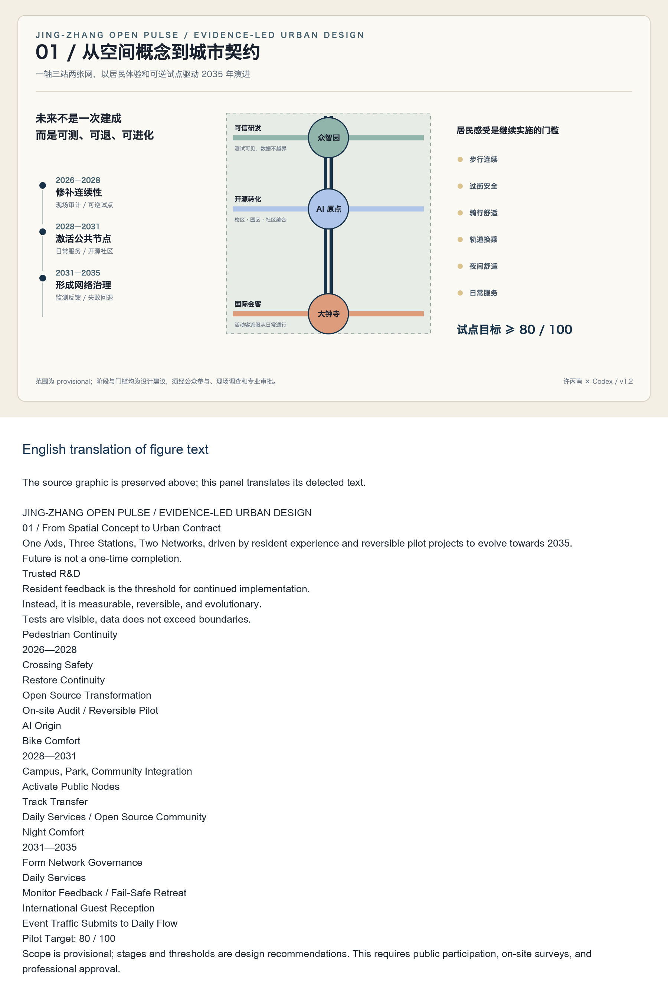
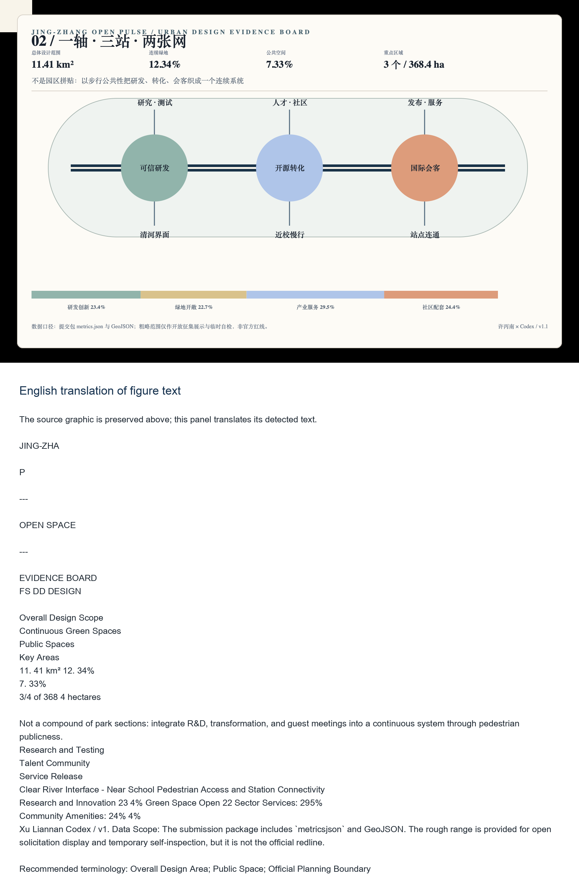
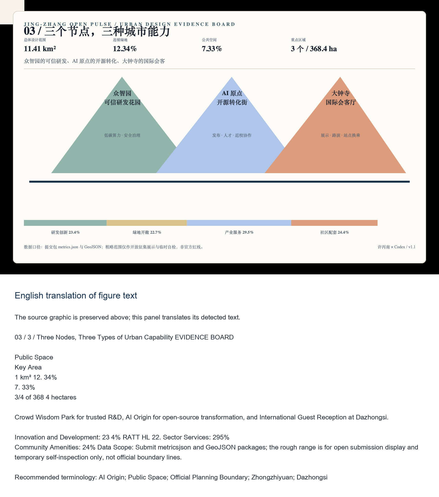
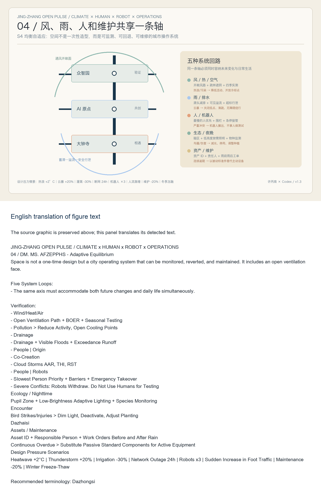
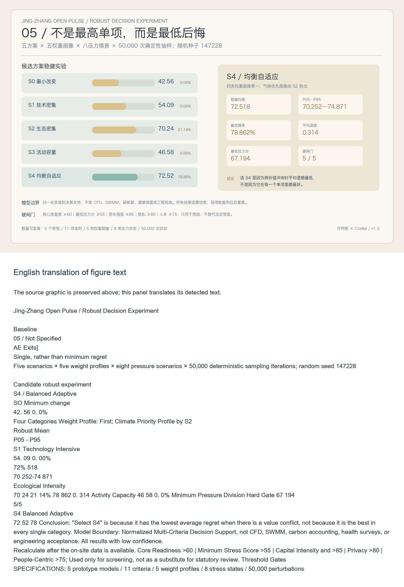

# Jing-Zhang Open Pulse: A Verifiable AI Innovation Public Corridor

## Design Basis and Source List

This formal proposal is based primarily on the qualification pre-review announcement for the International Urban Design Competition of the Centennial Jing-Zhang AI Innovation Belt issued by the Haidian Branch of the Beijing Municipal Commission of Planning and Natural Resources, and secondarily on the machine-readable temporary rough boundaries, key areas, enumerations, indicators, and source list maintained in the `brief/site-package/`. The AI agent must read `design_brief.json`, `allowed_design_space.json`, `sources.json`, `enums/`, `ranges/`, `schemas/`, `data/source_registry.json`, and `data/processed/agent_fact_pack.md` before generating the scheme. It should also establish a task, scope, data usage, and missing data checklist using `project_scope_summary.csv`, `agent_task_requirements.csv`, `source_use_matrix.csv`, and `missing_data_checklist.csv`. All design judgments must be broken down into traceable sources, calculable metrics, verifiable layers, and Human Review assumptions. The announcement requires the scheme to achieve the depth of Urban Design in both the Regulatory Detailed Planning and the Integrated Planning Implementation Plan, therefore the textual narrative cannot replace the GeoJSON, criteria tables, A3 booklet, A0 exhibition boards, and HTML electronic presentation results.

This section of the Evidence Chain cites [source:OFFICIAL-ANNOUNCEMENT], [source:AGENT-TASKBOOK], [source:SITE-PACKAGE], [source:SOURCE-REGISTRY], [source:PROCESSED-FACT-PACK], [source:BOUNDARY-SOURCE], [source:KEY-AREA-SOURCE], [standard:PROJECT-OFFICIAL-ANNOUNCEMENT], [standard:PROJECT-AGENT-OPEN-CALL-TASKBOOK], [standard:MOHURD-URBAN-DESIGN-MEASURES], [standard:MOHURD-CONTROL-DETAILED-PLANNING], [standard:MNR-LAND-USE-CLASSIFICATION-GUIDE] [standard:MOHURD-ARCH-DESIGN-DEPTH-2016] and [depth:existing_conditions_diagnosis], used to explain that the proposal is not an independent visionary text but is organized from the announcement, agent-oriented task statement, standards, boundaries, processing package, and data list.

The boundaries for the use of the registration form are as follows:

- data/source_registry.json Registers the purposes for which publicly available, clarificatory, and interim data are used.
- Current Registration Abstract: formal available data 5 items, background data 0 items, provisional-only data 1 item.
- The agent shall not upgrade background_only or provisional_only materials to official boundaries, statutory controls, formal scoring criteria, or government implementation commitments.

`data/processed/agent_fact_pack.md` is the reading navigation layer for this proposal and is not a new authoritative source. [source:PROCESSED-FACT-PACK] only helps the agent to organize the three layers of scope, three key areas, announcement tasks, agent.1-agent.6, data availability, and data gaps into a readable proposal; all factual judgments still revert to [source:OFFICIAL-ANNOUNCEMENT], [source:AGENT-TASKBOOK], [source:SOURCE-REGISTRY], [source:BOUNDARY-SOURCE], and [source:KEY-AREA-SOURCE].

This scaffold uses `brief/site-package/geometry/provisional_boundaries.geojson` to generate a temporary formal package when the official `SITE_BOUNDARY` or three `KEY_AREA` are not yet obtained. The `geometry/site_boundary.geojson` and `geometry/key_areas.geojson` in the submission package must both be marked as `provisional_constraint`, with `official_boundary=false`, and can only be used for concept generation, self-checking, visualization, and design discussions. They cannot be used as official redlines, approval references, or precise area references, nor can they serve as legal control conclusions. The absence of this organizational data gap does not prevent content scoring. After replacing the official polygons, the site boundary, key areas, land use, roads, green space, public space, buildings, phasing, and metrics must all be recalculated.

The assessable state generated by this scaffolding is: **Provisional Boundary, retaining accuracy alerts and awaiting recalculations after the formal data is released; content scoring is not blocked**. Therefore, the spatial structure, scenes, projects, and indicators in the main text are written according to the principle of being "discussable, reviewable, and recalculable after the Official Boundary is replaced"; when the official boundary and the key area polygon are updated, the agent must rerun the scaffolding, perform self-inspection, and generate the drawings/HTML, and cannot merely replace a single file.

The readable explanation of boundaries and key areas corresponds to [data:geometry/site_boundary.geojson#SITE-001], [data:geometry/key_areas.geojson#PROV-KEY-001] and [metric:site_area_sqm], [metric:key_area_count]. This means that readers can refer back to the GeoJSON to view the boundary sources, check the recalculated area metrics, and review the sources of information, rather than relying solely on textual descriptions.

## Three-Level Scope Framework

The proposal is organized according to the three levels defined in the announcement: the Coordinated Research Area focuses on the 43.6 square kilometers of AI industry ecosystem, strategic positioning, innovation chain, and future urban form; the Overall Design Area focuses on the 11.4 square kilometers of urban and industrial areas surrounding the Jing-Zhang heritage park within 1-2 kilometers, requiring the formation of an overall framework for Urban Renewal, industrial space layout, traffic and municipal support, and Urban Character control; the Key-Area Detailed Design Area focuses on 368.4 hectares of three detailed design regions, requiring the clarification of functional types, building scale, classification of demolish–renovate–retain strategy, Public Space connectivity, and traffic organization. The three layers of scope are mapped to `compliance_matrix.json` to ensure that the required tasks in sections 1.3, 1.4, and 1.5 of the announcement, as well as agent.1-agent.6, have corresponding chapters, layers, indicators, drawings, and HTML evidence. (Demolish–Renovate–Retain Strategy)

The depth items of the three-level work framework are constrained by [depth:three_level_scope_framework] and [depth:overall_spatial_structure], spatial evidence is based on [data:geometry/site_boundary.geojson#SITE-001] and [data:geometry/key_areas.geojson#PROV-KEY-001], tasks are based on [standard:PROJECT-OFFICIAL-ANNOUNCEMENT], and the scope index is navigated by the three-level scope table in [source:PROCESSED-FACT-PACK] `project_scope_summary.csv`.

Three-layer work is not a collection of disjointed drawings. Integrated research determines the industrial chain and urban form, and the overall design translates these determinations into the implementation of update projects, spatial structure, and facility bearing. Detailed design in key areas verifies the feasibility of specific plots, buildings, transportation, Public Spaces, and AI application scenarios. When generating a scheme, the agent must first lock the current submitted official or provisional boundaries and constraints before generating land use, buildings, roads, green spaces, public spaces, phased development, and AI service nodes. Finally, these layers are recalculated to explain which conclusions are still subject to the provisional boundary. Any areas, proportions, scales, or project quantities that cannot be recalculated from structured data must not be written into the formal conclusions.

The overall concept of this proposal is the "Jing-Zhang Smart Pulse Coexistence Belt": with the Jing-Zhang Heritage Park as the main axis of history and Public Space, the Zhongzhiyuan, Beijing AI Origin Community, and Dazhongsi serve as innovation anchor points, and universities, enterprises, communities, and rail transit stations form the daily network. This creates a spatial organization of "one belt, three cores, multiple point scenarios, and a composite ring of blue and green slow travel." Here, "one belt" is not an additional new red line drawn, but rather translates the three layers of scope in the announcement into a working method; "three cores" correspond to the three key areas; "multiple point scenarios" correspond to operational nodes for AI+ public services, industrial services, and urban life; and "composite ring" corresponds to the interlinking of slow travel, green spaces, public spaces, and activity routes.

| Level | Design Issue | Solution Approach | Data Focus |
| --- | --- | --- | --- |
| Coordinated Research Area | How should AI industry ecosystems and future urban forms be organized? | Establish an "academic source-innovation - open-source collaboration - enterprise transformation - public experience - international dissemination" innovation chain | compliance_matrix.json, standard_matrix.json |
| Overall Design Area | Industrial space, Urban Renewal, transportation and municipal facilities, and appearance and style how to be represented on the map | Land use, buildings, roads, green spaces, Public Spaces, and phased layers are expressed together. | [data:geometry/land_use.geojson#LU-001], [data:geometry/roads.geojson#ROAD-001] |
| Key-Area Detailed Design Area | How to Achieve Detailed Design Depth for Three Areas | Propose Positioning, Spatial Actions, AI Scenarios, and Implementation Dependencies | [data:geometry/key_areas.geojson#PROV-KEY-001], [data:geometry/key_areas.geojson#PROV-KEY-002], [data:geometry/key_areas.geojson#PROV-KEY-003] |

## Coordinated Research Area: Industry and Future City Research

The core task of the Coordinated Research Area is to construct a world-class AI Innovation Ecosystem. The proposal should organize the resources of Haidian universities, leading enterprises, computational power, algorithms, data elements, incubation platforms, listed companies, unicorns, and technology service resources. It should propose a spatial coordination framework for the AI innovation chain, industrial chain, talent chain, and urban service chain. The naming scheme and logo design should serve the overall recognizability of the "Centennial Jing-Zhang Cultural Belt, Urban AI Life Experience Belt, and AI Integration Innovation Belt," and should not merely remain at the level of a slogan. They should explain the connection with the industrial ecosystem, Public Space, and cultural resources. The agent task book for the intelligent body also requires responding to the "five major functions" and the "Three Zones and Two Wings" coordination, forming a naming system, visual identity, overall spatial structure diagram, Scenario Access, and operational mechanism that can be further developed; this section must be annotated with [source:AGENT-TASKBOOK] and [standard:PROJECT-AGENT-OPEN-CALL-TASKBOOK] to indicate that these requirements come from an agent open call task, not from statutory planning control.

Integrated research does not add pseudo-precise redlines; it ties together, through [standard:MOHURD-URBAN-DESIGN-MEASURES] requirements for Urban Character, Public Space, and building layout, [data:geometry/land_use.geojson#LU-001], [data:geometry/public_space.geojson#PUBLIC-001], and [depth:overall_spatial_structure], to explain how industrial strategies must ultimately be reflected in visible and verifiable spatial structures.

Conceptual Recommendation for the study of future urban forms should address how artificial intelligence (AI) transforms work, life, social interactions, learning, transportation, and public services. The proposal should concretize AI traffic systems, continuous green spaces, innovative service facilities, and an international living and working atmosphere into locatable functional zones, nodes, corridors, and scenarios, rather than vaguely describing a technical vision. The agent should incorporate indicators for industrial strategic metrics, AI innovation indices, talent density, types of spatial supply, and key AI+ vertical application areas into the indicator system, and clearly mark which are official, which are design recommendations, and which still require formal data calibration. If global AI innovation activities, developer communities, open scenarios, or pilgrimage routes are proposed, they should be written as "Conceptual Recommendation/Reference Scheme/Available for Professional Teams to Deepen Research," and not as confirmed government activities or implementation arrangements.

## Overall Design Area: Urban Renewal and Regulatory-Plan-Level Urban Design

The Overall Design Area requires the depth of Urban Design as per the Regulatory Detailed Planning. The proposal must present the overall spatial structure of Urban Renewal, identify inefficient spaces, provide a list of renewal projects, suggest implementation policies, specify the proportion of industrial functions, propose a model for spatial organization, assess the total building scale, and evaluate comprehensive carrying capacity. `geometry/land_use.geojson` should fully cover the design boundary with no overlaps, `geometry/buildings.geojson` should express the updated Building Footprint or retained building footprint, `geometry/roads.geojson` should express micro-circulation, pedestrian-friendly, and rail access relationships, and `metrics.json` should recalculate the core area, proportions, and layer counts.

This section breaks down the control planning depth content into reviewable objects: [standard:MOHURD-CONTROL-DETAILED-PLANNING] expresses the land use structure, [data:geometry/land_use.geojson#LU-001] expresses the land use structure, [data:geometry/buildings.geojson#BLDG-001] expresses the Building Footprint, [data:geometry/roads.geojson#ROAD-001] expresses traffic organization, [metric:building_footprint_area_sqm] is used to verify the building footprint area, [depth:land_use_layout] constrains the depth with [depth:development_intensity_controls].

The overall design must also support transportation, tracks, utilities, and supporting facilities. The proposal should propose spatial layouts and implementation paths around Transit-Station Integration, road micro-circulation, non-motorized vehicle parking, parking supply, innovative service platforms, talent living services, New Infrastructure, distributed energy, and edge-side computing. For content involving Building Height, Development Intensity, road red lines, setbacks, and facility standards, if there are no official control conditions, it should be written as "pending formal control plan confirmation," and must not use agent-predicted values as definitive indicators.

## Detailed Design of Key Areas

Detailed design for key areas is a mandatory option. For the Zhongzhiyuan AI Independent Innovation Acceleration Area, a detailed plan should be proposed around the national artificial intelligence platform, full-stack independent innovation, standard setting, security governance, industry exhibition, external transportation, Qinghe culture, low-carbon green innovative interaction environment, and green spaces AI scenarios. For the Beijing AI Origin Community, a detailed plan should be proposed around on-campus innovation, results incubation and transformation, talent special zone, open-source system, brand events, building demolish–renovate–retain strategy, result display and release, living and residential facilities, campus and park pedestrian connections, and Transit-Station Integration. For the Dazhongsi AI Industry Cluster, a detailed plan should be proposed around leading enterprises, intelligent bodies, intelligent terminals, content consumption, data elements, digital assets, commercial services, mixed-use planning green spaces, Dazhongsi station integration, and four quadrants pedestrian connectivity at the intersection. (Demolish–Renovate–Retain Strategy)

Three key areas detailed design must reference [data:geometry/key_areas.geojson#PROV-KEY-001], [data:geometry/key_areas.geojson#PROV-KEY-002], [data:geometry/key_areas.geojson#PROV-KEY-003], and be checked by [depth:three_key_area_detailed_design] to ensure they meet the depth of the Integrated Planning Implementation Plan. If only "creating demonstration areas" is described without evidence of functions, buildings, transportation, Public Spaces, and implementation projects, it should be considered incomplete.

Three key areas must appear in the `geometry/key_areas.geojson`. If official polygons are provided by the repository, they should be used as `official_constraint`; if official polygons are missing, provisional polygons can be used as `provisional_constraint`, but the document, HTML, sources, assumptions, and self_check must explain that they cannot be used as formal scoring or approval criteria. `compliance_matrix.json` should cover announcements 1.5.3.1, 1.5.3.2, and 1.5.3.3. The design expression should include functional typology, building scale, architectural form, Demolish–Renovate–Retain Strategy classification, Public Space system, traffic organization, pedestrian connectivity, and implementation projects. The HTML page should allow switching to view the three key areas, and the A3 booklet and A0 poster should at least include the overall plan, detailed plan, and indicator explanations for the key areas.

| Key Areas | Design Positioning | Spatial Actions | AI Industry and Operational Scenarios | Evidence Citation |
| --- | --- | --- | --- | --- |
| Zhongzhiyuan AI Independent Innovation Acceleration Area | Garden-Type Full-Stack Independent Innovation Street District | Enhance the Qinghe interface, industrial display, low-carbon innovative interaction, and external traffic organization; green spaces to carry open testing and display of standard governance | Autonomous model testing, standard-setting workshops, safety governance display, low-carbon computing experience | [data:geometry/key_areas.geojson#PROV-KEY-001], [depth:three_key_area_detailed_design] |
| Beijing AI Origin Community | On-Campus Type Technology Transfer and Talent Community | Integrate pedestrian-friendly connections within campuses, parks, and neighborhoods; supplement the provision of release venues, talent services, residential living, and open-source collaboration spaces. | Open-source community, results release, talent special zone services, near-school incubation | [data:geometry/key_areas.geojson#PROV-KEY-002], [source:AGENT-TASKBOOK] |
| Dazhongsi AI Industry Cluster | Urban-Type Intelligent Economy and International Exchange District | Around Dazhongsi station integration, quadrants-based pedestrian connectivity, commercial services, and updates to the public environment of key enterprises | Agents and Intelligent Terminals Display, Content Consumption, Data Elements, and International Roadshows | [data:geometry/key_areas.geojson#PROV-KEY-003], [metric:key_area_count] |

## AI Innovation Ecosystem, Personas, and AI+ Scenarios

The plan should establish a spatial demand profile for AI talent and enterprises, covering research and development offices, open-source collaboration, result dissemination, enterprise services, talent housing, social learning, consumption and living, sports and leisure, and international exchanges. AI+ scenarios should revolve around the announced directions of transportation, services, consumption, healthcare, education, law, and living services, forming industry development scenarios and AI-enabled urban functional scenarios. Each scenario should detail the service targets, spatial locations, data sources, privacy boundaries, Human Review mechanisms, and operational entities.

AI scenarios must be anchored within spatial and governance boundaries: the Public Space scenario references [data:geometry/public_space.geojson#PUBLIC-001], the slow travel and transportation scenario references [data:geometry/roads.geojson#ROAD-001], and the open space scenario references [data:geometry/green_space.geojson#GREEN-001] and [metric:public_space_ratio] and [metric:green_ratio]. These references ensure that reviewers understand that the scenarios are not mere slogans but are design objects located within specific layers and metrics. The agent task book requires at least 10 AI scenario cards, at least 3 Testing and Validation Scenarios for smart bodies, and at least 5 user profile categories; the scaffolding only provides the structure, and formal competitors must include the scenario cards, profile tables, privacy boundaries, Human Review, and operational entities in the main text, HTML, A3/A0, and the concert matrix.

| User Profile | Typical Needs | Spatial Response | Self-Check Boundary |
| --- | --- | --- | --- |
| Open Source Developer | Release, Collaborate, Test, Community Reputation | Origin Community Open Source Release Hall, Public Code Wall, Nighttime Collaboration Space | No personal behavior tracking; activity data only used for aggregate statistics |
| Founding Team | Low-Cost Office, Computing Power Entry Point, Product Test Bed | Zhongzhiyuan Shared Testing Ground, Edge Computing Power Service Point, Standard Governance Consultation | Computing Power and Data Services Require Separate Authorization |
| Key Corporate Visitors | Exhibitions, Business, International Reception, Talent Recruitment | Dazhongsi International Roadshow Living Room, Track Station Shuttle, Key Enterprise Surrounding Public Spaces | Corporate Identity and Case Studies Must Be Clear Rights |
| Surrounding Residents | Commuting, Leisure, Community Services, Low-Impact Updates | Jing-Zhang Heritage Park Pedestrian Loop, Community Services Embedded, Tiered Night Lighting and Activities | Do Not Use Resident Profiles for Commercial Recommendations |
| College Students and Faculty | Result Transfer, Cross-Institution Collaboration, Daily Slow Travel | Campus-Park Slow Travel Integration, Result Transfer Hub, AI Education Experience Point | Campus Data and Research Results Require Authorization |

| Scenario Card | Spatial Carrier | Design Description |
| --- | --- | --- |
| 01 Open Source Release Hall | Beijing AI Origin Community | Focused on universities, open-source communities, and startup teams, it provides a platform for result releases, code contribution displays, and small-scale showcase spaces |
| 02 Safety Governance Sandbox | Zhongzhiyuan | Translates the standard setting, security evaluation, and model red team testing into visitable, bookable, and regulatable exhibition and collaboration nodes |
| 03 Edge Side Computing Kiosks | Overall Design Area Node | Integrated with public services, enterprise services, and low-carbon energy strategies, serving as a prototype for New Infrastructure to be further developed |
| 04 AI Slow-Travel Navigation | Jing-Zhang Heritage Park Vitality Belt | Using explainable signage and low-intrusive sensing to help identify slow-travel breakpoints, congestion nodes, and accessibility needs |
| 05 Dazhongsi International Roadshow Living Room | Dazhongsi AI Industry Cluster | Serving the display, negotiation, media release, and international exchange for smart body, smart terminal, and content consumption enterprises |
| 06 Qinghe Low-Carbon Innovation Corridor | Zhongzhiyuan Along Qinghe River Interface | Integrating green spaces, rainwater management, pedestrian and bicycle paths, and AI demonstrations as the public living room of the park |
| 07 Near-School Technology Transfer Street | Beijing AI Origin Community | Focused on technology transfer from universities, organizing incubation, exhibition, legal, intellectual property, and investment and financing services |
| 08 Data Elements Living Room | Dazhongsi Area | With compliance, authorization, and auditability as prerequisites, this urban service interface showcases the flow of data elements and digital assets in the area. |
| 09 AI Life Service Sample Street | Intersection of Community and Commerce | Bringing AI+ scenarios such as healthcare, education, law, and life services to operational small-scale street spaces |
| 10 Global AI Activity Week Route | One Public Space System | Forming a walkable and shareable experience route from site culture, open-source community, industrial display to international showcase |

The AI governance recommendations generated by the Urban Agent must adhere to the principles of data minimization, open-source origins, explainability, and Human Review. The Urban Agent can assist in identifying pedestrian bottlenecks, Public Space heat maps, facility maintenance needs, business service demands, and activity safety risks, but it cannot replace planning approvals, generate unauthorized personal profiles, or claim official implementation commitments. All AI scenario nodes should be integrated into structured layers or grid arrays to facilitate reviewers in understanding their relationships with industry, space, and public interests.

## Land Use, Building Scale, and Retain-Renovate-Demolish Strategy

The Land-Use Plan should be expressed according to public standards such as land space investigation, planning, and use control classification, forming a complete, closed, and seamless land zone division. The architectural scheme should distinguish between retained, renovated, updated, newly constructed, or yet-to-be-confirmed objects, and clearly define the suggested levels for the Building Footprint, function, scale, appearance, roof, massing, and height control. If the current buildings, ownership, control plan, and engineering conditions are lacking, the scheme can only propose methods and a list for calibration, but cannot fabricate the Demolish–Renovate–Retain Strategy conclusions.

Land use classification is based on [standard:MNR-LAND-USE-CLASSIFICATION-GUIDE]. Building Height, massing, façade, and aesthetic controls are managed by [depth:height_massing_character], while the demolish–renovate–retain method is managed by [depth:retain_renovate_demolish]. The primary evidence for land use and buildings is [data:geometry/land_use.geojson#LU-001], [data:geometry/buildings.geojson#BLDG-001], and [metric:building_footprint_area_sqm]. (Demolish–Renovate–Retain Strategy)

The building scale and intensity metrics must be consistent with those in `metrics.json` and the layers. If the total building scale, Floor Area Ratio, Building Height, Building Coverage Ratio, green space ratio, setback, and building control lines lack official conditions, they should be listed as unknown or pending_control in the metric system, and must not be assigned fixed values to create a sense of precision. The A3 document should provide an updated project list and metric review table, while the A0 board should clearly express the key spatial structure and focal areas. The HTML page should offer an interactive view of the metrics and layers.

## Transport, Rail, Municipal Infrastructure, and Public Services

The core judgment for the traffic assessment is "the risk of insufficient continuity within the last 300 to 800 meters is higher where track resources are more abundant." An OSM background screening was conducted using a temporary scope and an 800-meter analysis buffer, identifying 16 unique station names, 189 annotated crossing nodes; the mapped pedestrian support lines, cycleway, and major road centerline density are approximately 16.53, 1.06, and 5.47 km/km², respectively. These low-confidence results are only used to determine the priority for on-site surveys and do not represent official station entrances, road rights-of-way, continuous cycling quality, or capacity conclusions. [source:OSM-TRANSPORT-CONTEXT] [metric:osm_mapped_station_names_within_800m_count] [metric:osm_mapped_crossing_count]

This round has corrected the directional errors in the spatial evidence from the previous version: the original `ROAD-001` was merely an approximately 1.1 km east-west line, which could not support a 9 km north-south innovation belt. v1.3 changed it to an approximately 9.60 km north-south public slow-moving main axis, and formed three east-west stitching side branches in Zhongzhiyuan, AI Origin, and Dazhongsi. The conceptual network totals approximately 13.01 km in length. [source:JINGZHANG-FUTURE-BELT-2026] [source:BEIJING-SLOW-MOBILITY] [data:geometry/roads.geojson#ROAD-001] [data:geometry/roads.geojson#ROAD-002] [data:geometry/roads.geojson#ROAD-003] [data:geometry/roads.geojson#ROAD-004] [metric:design_north_south_spine_length_m] [metric:design_east_west_connector_count] [metric:design_slow_mobility_network_length_m]

The main axis and branch lines express a network relationship, not new roads, red lines, or engineering alignments. The North Fifth Ring/Qinghe, campus-park-community interface, Dazhongsi station quadrants, North Third Ring—Jingbao Road—Zhi Chun Road, etc., must be separately analyzed for traffic, ownership, accessibility, and engineering arguments. Official public engagement materials have demonstrated the complexity of intersection types and land use conditions along the route, and it is not permissible to use a single conceptual diagram to replace professional judgment. [source:JINGZHANG-PUBLIC-FEEDBACK] [depth:traffic_rail_slow_parking]

The resident transportation experience is evaluated based on six criteria: continuous pedestrian access, safe crossing, comfortable cycling, convenient transit transfers, comfortable nighttime conditions, and a 15-minute daily service. Currently, there is a lack of local baseline data, so the satisfaction metric remains unknown; the pilot can only continue to be deepened after the stratified questionnaire reaches 80/100, the resident group shows no significant lag, and the slow-moving/active day tests are passed. [source:BEIJING-15-MINUTE-LIFE-CIRCLE] [metric:resident_transport_satisfaction_index]

The park registry indicates that it is open 24 hours a day and has no external parking facilities. This plan does not rely on the addition of a core parking facility as a prerequisite for attracting activities. Instead, it prioritizes public transit, walking and cycling, accessible shuttle services, and the use of external shared parking with reservation management. A complete assessment protocol, samples, thresholds, and failure rollback rules are available in `report/narrative.md`. [source:JINGZHANG-PARK-CATALOG]

Traffic and municipal professional depth are constrained by [depth:traffic_rail_slow_parking] and [depth:municipal_new_infrastructure], respectively; Public Space evidence references [data:geometry/public_space.geojson#PUBLIC-001] and [data:geometry/constraints.geojson#CONSTRAINTS]. Road right-of-way, station entrances, utilities, fire safety, parking, and event days are listed as conditions to be addressed, without dictating a definitive strategy.

Municipal and public service facilities should cover AI industry service facilities, innovation service platforms, talent living service facilities, New Infrastructure, distributed energy, edge-side computing power, and the integration with traditional municipal facilities. The plan should detail the facility standards, spatial layout, service radius, operational model, and Phased Implementation logic. When pipeline, energy, drainage, flood control, fire protection, and other engineering data are missing, they should be listed as formal deepening prerequisite conditions.

## City Resilience, Embodied Intelligence, and Lifecycle Iteration v1.3

This round views the future city as a coupled system of "people-environment-machines-assets," rather than a list of technological facilities. The Beijing Action Plan for Adapting to Climate Change clearly states that high temperatures, extreme precipitation, urban flooding, and droughts can affect public health, transportation, energy, water supply and drainage, and the city's lifelines. The Beijing Meteorological Data Platform has already provided climate standard values directory for Haidian from 1991 to 2020, as well as urban climate services related to ventilation, heat islands, and urban flooding. However, downloading the files requires a platform user key, and the current submission does not cite the values that have not yet been obtained. [source:BEIJING-CLIMATE-ADAPTATION-2024] [source:BEIJING-METEOROLOGICAL-OPEN-DATA] [assumption:A-METEOROLOGICAL-DATA-001]

Factor list covers eight interacting groups: climate hazards (heat waves, cold snaps, heavy rainfall, droughts, thunderstorms, snowmelt), air and microclimate (ventilation, heat islands, shading, PM2.5, dust, allergens), water and ecology (topography, pipe networks, soil infiltration, groundwater, water quality, biodiversity, bird strikes and dark skies), human experience (elderly, children, disabled, pregnant, night shift workers, noise, lighting, cognitive load, service accessibility and sense of belonging), embodied intelligence (mixed-use, emergency stops, remote operations, charging fire trucks, information security, appeals and accountability), lifelines (electricity, water, drainage, heating, communication, fire and emergency), construction and resources (retrofit reuse, materials, energy, carbon, and waste), and long-term operations (asset owners, inspections, cleaning, spare parts, budget, skills, work orders, updates, and decommissioning). [source:RESILIENT-CITY-INFRASTRUCTURE-2024] [source:BEIJING-ACCESSIBILITY-REGULATION] [source:BEIJING-BIRD-BIODIVERSITY-2024] [assumption:A-BIODIVERSITY-LIGHT-001]

### 1. Choose not the "highest individual" option, but the one with the lowest regret.

This round compares five clear orientations: S0 Minimal Change, S1 Technologically Intensive, S2 Ecologically Intensive, S3 Activity Capacity Intensive, and S4 Balanced Adaptation. The model uses 11 indicators (thermal comfort, flood resilience, air quality, human experience, robotics, privacy, biodiversity, maintenance, carbon, flexibility, cost efficiency), 5 categories of weight profiles (residents, climate, innovation, operations, balanced), and 8 pressure scenarios. It runs 50,000 Monte Carlo draws with a fixed seed of 147228, and explicitly incorporates uncertainty in the weights and indicator responses. [assumption:A-RESILIENCE-MCDA-001] [metric:resilience_v13_candidate_count] [metric:resilience_v13_monte_carlo_draws]

| Proposal | Main Advantages | Main Costs | Average Robustness Score | 5th Percentile | Winning Rate |
| --- | --- | --- | ---: | ---: | ---: |
| S0 Minimum Change | Low Capital Intensity, High Repurposing | Floods, Maintenance, Pedestrian and Vehicle Mixing, and Thermal Comfort Deficiencies | 42.559 | 40.365 | 0% |
| S1 Technically Intensive | Robotic Testing and Digital Foundation Strong | Privacy, Ecological Impact, Operational Complexity, and Offline Degradation Weak | 54.090 | 50.613 | 0% |
| S2 Ecological Density | Best in terms of Floods, Biodiversity, Heat, and Carbon Performance | High Activity Capacity, Human-Machine Separation, and Daily Maintenance Pressure | 70.242 | 66.812 | 21.138% |
| S3 Activity Intensity | High Capacity for Large Events and Logistics Turnover | Clear Hard Surface, Noise, Heat, Drainage, and Habitat Impacts | 46.579 | 42.994 | 0% |
| **S4 Balanced Adaptation** | **Human-Centric, Safety for Robots, Maintenance, Privacy, and Flexibility All Met** | **High Capital Intensity, Not as Competitive as S2 Under Pure Climate Weight** | **72.518** | **70.252** | **78.862%** |

S4's average regret value is only 0.314 points, the lowest design score among the eight categories of stress, at 67.194; it meets five preset screening thresholds: a minimum core indicator score of at least 60, a minimum stress score of at least 55, a capital intensity no higher than 85, a privacy score of at least 80, and a human experience score of at least 75. The climate priority profile is still won by S2, an important exception: S4 is a robust compromise across groups, not the best in every single category. [metric:resilience_v13_selected_mean_score] [metric:resilience_v13_selected_p05_score] [metric:resilience_v13_selected_win_rate] [metric:resilience_v13_selected_mean_regret] [metric:resilience_v13_selected_min_stress_score] [metric:resilience_v13_hard_gates_passed]

All scores are normalized comparative models, not on-site performance metrics. +2°C heat waves, +20% thunderstorms, a 30% reduction in irrigation water supply, a 24-hour power outage, a tripling of robot numbers, a sudden surge in event foot traffic, a 20% reduction in maintenance capacity, and winter freeze-thaw cycles are design stress tests, not meteorological predictions or approval standards. Formal deepening must replace normalized inputs with seasonal CFD, measured wind speeds/temperature and humidity/average radiation temperature, topography and network models, soil infiltration, water quality, acoustic and light environments, ecological baseline, energy consumption, asset costs, and real user testing. [assumption:A-CLIMATE-STRESS-001] [assumption:A-AIR-WIND-001] [assumption:A-DRAINAGE-SYSTEM-001]

### 2. S4 Balanced Adaptive Spatial Operating System

1. **Wind—Heat—Air:** The main axis and three branch lines preserve seasonal ventilation connections without forming fixed wind walls through continuous buildings, screens, or dense planting; shading is provided by a combination of trees, permeable canopies, and movable elements. Before any tree canopy, building, or activity facility is finalized, a comparison must be made regarding leaf presence/absence, typical wind directions, still air pollution, and heat wave conditions. The ventilation network in Beijing's Master Plan only supports city-wide principles, and this project cannot claim to be an official ventilation corridor. [source:BEIJING-VENTILATION-NETWORK-2035] [source:BEIJING-METEOROLOGICAL-OPEN-DATA]
2. **Rainfall—Drainage:** Adopt a five-stage chain of "source reduction—on-site detention—pipe network connection—overflow discharge—post-rain recovery." The annual runoff control rate of 75%—80% publicly disclosed by Haidian is only for screening purposes; the final indicators must be confirmed by specific zoning, topography, soil conditions, pipe networks, outfall conditions, and underground space conditions. Any underground space shall not be used as a flood refuge passage. [source:HAIDIAN-SPONGE-CITY-PLAN] [source:BEIJING-FLOOD-PLAN-2021-2025]
3. **Prioritize Human Experience:** Continuous barrier-free main chains, heatwave respite chains, and nighttime quiet chains take precedence over performance, delivery, and robot charging. Elderly people, children, wheelchair users/blind cane users/guide dog handlers, strollers, cyclists, and night shift workers must participate in route testing; high-scoring models cannot override real discomfort and complaints. [source:BEIJING-ACCESSIBILITY-REGULATION] [source:WHO-HEAT-HEALTH-2026] [assumption:A-HUMAN-EXPERIENCE-001]
4. **Embodied Intelligence Tiered Open Call:** Follow the sequence of "World Model Simulation—Closed Venue—Low-Speed Timed Geofencing—Limited Public Testing"; prioritize human safety, visible identity, emergency stop, manual override, appeal rights, and the option to withdraw. Both physical safety and GB/T 45502-2025 information security must be reviewed simultaneously; never treat residents and individuals with disabilities as free training data for robots. [source:BEIJING-EMBODIED-INTELLIGENCE-2025-2027] [source:SERVICE-ROBOT-INFOSEC-GB45502] [source:ISO-TR-4448-PUBLIC-MOBILE-ROBOTS] [assumption:A-EMBODIED-AI-SAFETY-001]
5. **Ecology and Nighttime:** Use native, multi-layered, drought-tolerant habitat structures, setting up discontinuous but connectable ecological "stepping stones"; conduct bird strike reviews for glass façades, and use dark sky, low-glare, and time-of-use lighting in ecologically sensitive sections. Do not claim species increases or ecological net gains until a baseline survey is conducted. [source:BEIJING-BIRD-BIODIVERSITY-2024] [source:BEIJING-LIGHTING-GUIDE-2025] [assumption:A-BIODIVERSITY-LIGHT-001]
6. **Preserve and Design:** Each tree pit, storm drain, permeable paving, seating, lighting, signage, sensor, and robot docking point must have an asset ID, responsible party, inspection trigger, spare parts, maintenance window, manual degradation path, and exit strategy before construction. If there are two consecutive overdue work orders or inability to obtain spare parts, prioritize the removal of complex equipment and replace it with passive, standardized, and replaceable components. [source:ASSET-MANAGEMENT-GBT33172] [source:RESILIENT-CITY-INFRASTRUCTURE-2024] [assumption:A-LIFECYCLE-MAINTENANCE-001]

### 3. Differential Stress Testing for Three Key Areas

- **Zhongzhiyuan:** Use Qinghe interface as a common experimental field for wind, water, low-carbon components, and embodied intelligent closed testing; first validate drainage, winter anti-slip, robot failure, and data security, then open for display.
- **AI Origin:** Focused on the shading of the nearby school district, nighttime learning, low noise levels, walking and cycling, and daily services; robots operate only during non-congested times and spaces that do not obstruct accessibility.
- **Dazhongsi:** Prioritize addressing the quadrants of the station, cloud burst water accumulation, event-related foot traffic, ride-hailing/delivery services, nighttime noise, and post-event recovery; ensure the capacity for large events accommodates residents returning home, fire safety, and rain and flood discharge.

The proposal does not predict a fixed 2035, but instead sets triggers: high-temperature warnings to reduce activities and open cooling points; heavy rainfall warnings to evacuate low-lying areas, pre-inspect stormwater inlets, and activate overflow measures; when the internet is cut off, robots stop autonomous movement, and public facilities maintain manual mode; once an unseizable, one-time blockage of the main chain or a serious near-miss event occurs, the robot scenario is paused; and if critical assets have no responsible person or are two consecutive times past due for maintenance, they are not allowed to expand. These triggers transform future changes into executable fallbacks, rather than a sci-fi effect.

### More rigorous Monte Carlo robustness checks

To avoid overfitting the solution with fixed weights, five design prototypes, S0-S4, were established. These were subjected to 50,000 deterministic Monte Carlo sampling runs under five categories of stakeholder weights, eight categories of stress states, and scoring noise. The random seed used was 147228. The S4 balanced adaptive solution won approximately 78.862% of the candidates, with an average regret of 0.314 points, but had a robust average score of 72.518, a P05 score of 70.252, and the lowest score among the eight stress categories was 67.194. This means it is a current low-regret candidate but has not yet met the higher goal of all uncertainty indicators being ≥90. [metric:resilience_v13_candidate_count] [metric:resilience_v13_monte_carlo_draws] [metric:resilience_v13_selected_mean_score] [metric:resilience_v13_selected_p05_score] [metric:resilience_v13_selected_win_rate] [metric:resilience_v13_selected_mean_regret] [metric:resilience_v13_selected_min_stress_score] [metric:resilience_v13_hard_gates_passed]

This review has locked the next round of optimization directions as follows: increase passive shading and repairable flood storage, reduce high sensor dependency, enhance offline operation and manual takeover, decouple activity capacity from quiet spaces, and establish asset redundancy and replacement standards. The Beijing public meteorological directory can serve as an entry for subsequent climate calibration, but the Haidian download file currently requires a platform user key, so the temperature, rainfall, wind speed, or humidity facts are not written as facts yet. [source:BEIJING-METEOROLOGICAL-OPEN-DATA] [assumption:A-METEOROLOGICAL-DATA-001]

The drainage objectives should align with the public background scope of the Haidian Sponge City Plan; the ventilation network can only serve as a background direction at the urban scale, and the temporary main axis should not be directly referred to as an official ventilation corridor. [source:HAIDIAN-SPONGE-CITY-PLAN] [source:BEIJING-VENTILATION-NETWORK-2035] [assumption:A-DRAINAGE-SYSTEM-001] [assumption:A-AIR-WIND-001]

The next round of embodied intelligence validation will simultaneously cover the Beijing Embodied Intelligence Action Plan, the service robot information security standard GB45502, and the entire lifecycle requirements for intelligent municipal infrastructure; robots cannot merely avoid physical obstacles but must also pass data security, offline operation, manual take-over, and accountability traceability tests. [source:BEIJING-EMBODIED-INTELLIGENCE-2025-2027] [source:SERVICE-ROBOT-INFOSEC-GB45502] [source:RESILIENT-CITY-INFRASTRUCTURE-2024] [assumption:A-EMBODIED-AI-SAFETY-001]

Preserve and assess the ecological elements using asset management, bird-friendly, and Beijing night lighting guidelines as reference points: critical infrastructure requires a responsibility chain and lifecycle maintenance records, while trees, glass, and lighting need bird and dark sky baselines; this plan does not document any species, glass collision rates, or nighttime illuminance as current conditions. [source:ASSET-MANAGEMENT-GBT33172] [source:BEIJING-BIRD-BIODIVERSITY-2024] [source:BEIJING-LIGHTING-GUIDE-2025] [assumption:A-LIFECYCLE-MAINTENANCE-001] [assumption:A-BIODIVERSITY-LIGHT-001]

Additional cross-evidence ties "high scores" to human health, public engagement, and sustainable operations: WHO regards air pollution, noise, heat islands, Blue-Green Spaces, mobility safety, and mental health as interlinked risks in urban planning; IPCC lists heat waves, extreme precipitation, heat islands, and infrastructure interdependencies as urban adaptation pressures; NIST and UN-Habitat's human-centered smart cities framework requires explainability, engagement, digital rights, fairness, interoperability, budgeting, and continuous monitoring. Therefore, the residents' survey, accessibility route testing, complaints/appeals, and annual reviews must not be replaced by "robotic efficiency." [source:WHO-URBAN-HEALTH-AND-GREEN] [source:IPCC-AR6-URBAN-RISK] [source:NIST-HUMAN-CENTERED-AI] [source:UN-HABITAT-PEOPLE-CENTRED-SMART-CITIES]

Public Spaces are provided as local interfaces for the Beijing walking and cycling standards to ensure continuity, and for the review and maintenance of streets; the water report requires forecasting, warning, storage, pre-rain cleaning, combined sewer rehabilitation, and emergency scheduling; the road maintenance scope incorporates patrol, facility records, flood response, bridge and tunnel equipment maintenance, and emergency handling into the operation and maintenance loop. [source:BEIJING-WALK-CYCLE-DB11-1761] [source:BEIJING-WATER-REPORT-2024] [source:BEIJING-ROAD-MAINTENANCE-2026]

The boundaries of embodied intelligence reference the risk reduction principles for mobile and assistive robots in ISO 13482 and the asset lifecycle management requirements in ISO 55001:2024: the former is used for testing boundaries, emergency stops, takeovers, and physical risks to humans and machines, while the latter is used for asset performance, risk, costs, operations, maintenance, and continuous improvement; neither is equivalent to the deployment authorization or local procurement standards for this project. [source:ISO-13482-SERVICE-ROBOT-SAFETY] [source:ISO-55001-2024]

## Blue-Green Network, Public Space, and Urban Character

The Blue-Green Space plan should be based on the Jing-Zhang Heritage Park Vitality Belt, integrating the travel needs of Qinghe, Xiaoyuehe, surrounding universities, enterprises, and communities, proposing a network of pedestrian paths, cycling paths, and green spaces that are north-south connected and east-west linked. The plan should identify pedestrian and cycling discontinuities, overpass nodes on the ring road, and landscape nodes at the southern and northern ends of the park, proposing a composite utilization strategy for parking, sports, innovative interactions, technology testing, application demonstrations, and public services.

Blue-green Public Spaces are reviewed by [depth:blue_green_public_space], with core evidence including [data:geometry/green_space.geojson#GREEN-001] and [data:geometry/public_space.geojson#PUBLIC-001], as well as [metric:green_ratio] and [metric:public_space_ratio]. The Urban Design Management Measures require a holistic approach to landscape appearance, public spaces, and building control, thus this section also references [standard:MOHURD-URBAN-DESIGN-MEASURES].

The urban design scheme should integrate the historical and cultural elements of the Jing-Zhang Railway, the innovation culture of Zhongguancun, and the AI innovation culture, utilizing cultural resources such as the Tsinghua Garden Railway Station and the Beijing Film Academy. It should propose the Urban Character, architectural style, roof forms, massing, facades, and guidelines for public art. The agent should also propose sign systems, cultural symbols, international communication narratives, AI pilgrimage landmarks, contribution walls, or honor display systems, but all brands, fonts, images, likenesses, and corporate logos must have clear rights sources. The control of the urban character should distinguish between official controls, design recommendations, and conditions to be confirmed, and no pseudo-precise control lines should be provided without cultural heritage or control plan justification.

## Renewal Projects, Implementation Policy, and Phasing

The implementation plan should form a reviewable list of renewal projects, detailing the project location, type, function, responsible party, prerequisite conditions, implementation phases, risks, and evaluation indicators. Policy recommendations should cover Urban Renewal integrated implementation, spatial supply, operational mechanisms, industrial services, public participation, data governance, and property rights coordination. `geometry/phasing.geojson` should express the phased scope, and `compliance_matrix.json` should link each task to the phases and drawings.

The project list and phased depth are managed by [depth:renewal_project_list] and [depth:phasing_implementation], respectively. The phased spatial evidence is [data:geometry/phasing.geojson#PHASE-001]. If there are no ownership, funding, implementation entity, and approval pathway issues, the plan must document these as implementation risks rather than commitments to be realized.

| Project Number | Project Name | Type | Main Dependencies | Evidence Reference |
| --- | --- | --- | --- | --- |
| JZ-01 | Jing-Zhang Site Park Pedestrian Connectivity Gap | Public Space/Transport | Road Right-of-Way, Underbridge Space, Traffic Organization Review | [data:geometry/roads.geojson#ROAD-001] |
| JZ-02 | Zhongzhiyuan Qinghe Innovation Interface | Blue-Green Space/Industrial Display | river blue line, ecological and flood protection conditions | [data:geometry/green_space.geojson#GREEN-001] |
| JZ-03 | Origin Community Near-School Conversion Street | Urban Renewal/Industrial Services | campus boundaries, ownership, first-floor uses | [data:geometry/buildings.geojson#BLDG-001] |
| JZ-04 | Dazhongsi Station Quadrant Pedestrian Connectivity | Transit-Oriented Development/Slow Zone | Transit Station, Road Intersection, Utility Infrastructure | [data:geometry/public_space.geojson#PUBLIC-001] |
| JZ-05 | AI Public Services and Edge Side Computing Nodes | New Infrastructure/Public Services | Energy, computing power, security, and operational entity | [data:geometry/constraints.geojson#CONSTRAINTS] |
| JZ-06 | Global AI Activity Week Public Route | Operations/Brand | Public Space Permits, Event Safety, Copyright Clearance | [data:geometry/phasing.geojson#PHASE-001] |

Phases should be distinguished from the 100-day design collection period: the collection period is the timeframe for submitting results, while the implementation phases are the path for advancing Urban Renewal and project construction. The proposal should outline a framework for recent pilot projects, mid-term updates, and long-term governance, and specify which elements can be initiated with lightweight facilities, operations, and service platforms, and which must wait for formal zoning, municipal, traffic, and ownership conditions to be confirmed. For the annual activity system, developer community operations, Scenario Access days, public experience routes, and international communication mechanisms, the text should detail the operational targets, frequency, responsibility boundaries, transformation pathways, and risks, and not merely include promotional slogans.

## Metrics, Area Recalculation, and Compliance Matrix

The indicator system should at least include the Overall Design Area area, key area area, ratio of green spaces and Public Spaces, Building Footprint, number of update projects, AI scenario nodes, slow travel connectivity indicators, industrial space indicators, talent service indicators, and self-inspection status. All known indicators must be recalculable from GeoJSON or a reliable source; unknown indicators must provide the reason and formal preconditions for submission. The results of `scripts/spatial_review.py` and `scripts/visual_review.py` are important evidence for the formal self-inspection.

The depth of metric recalculation is managed by [depth:metrics_recalculation]. This proposal explicitly references [metric:site_area_sqm], [metric:key_area_count], [metric:building_footprint_area_sqm], [metric:green_ratio], and [metric:public_space_ratio], and explains that these values come from [data:geometry/site_boundary.geojson#SITE-001], [data:geometry/key_areas.geojson#PROV-KEY-001], [data:geometry/buildings.geojson#BLDG-001], [data:geometry/green_space.geojson#GREEN-001], and [data:geometry/public_space.geojson#PUBLIC-001].

The Code Array is the main control file for task responsiveness. Each announcement task and agent_taskbook task must correspond to a report chapter, layer, metric, drawing, HTML page, source, assumptions, and check items. Failure to cover any of the optional tasks for announcements 1.3, 1.4, 1.5, or agent.1-agent.6 will result in the proposal not entering formal professional scoring.

During formal deepening, the agent should categorize each indicator into three classes: the first class consists of spatial metrics that can be recalculated directly from the submitted geometry, such as boundary area, green space ratio, Public Space ratio, Building Footprint area, and phased area; the second class consists of regulatory metrics that require support from official master plans or task book attachments, such as Floor Area Ratio, Building Height, Building Coverage Ratio, setback, road red line, and facility standards; the third class consists of performance metrics that require ongoing calibration with operational or industrial data, such as AI innovation index, talent density, industrial service satisfaction, walkability, participation in activities, and frequency of scene usage. These three classes of indicators should be entered into `metrics.json`, `assumptions.json`, and `compliance_matrix.json`, respectively, to avoid mistakenly writing operational vision as approved planning conditions.

## Risk, Copyright, and Compliance

### The spatial commitment of this plan: to replace "AI device show" with "verifiable public space"

This proposal defines the "Jing-Zhang Open Pulse" as a city-wide collaborative corridor with a heritage park as the public base, three key areas as innovation anchor points, and auditable Scenario Access as the operational mechanism. This submission is v1.3, which adds recalculable transportation networks, resident experience thresholds, climate—rainwater—embodied intelligence—maintenance pressure testing, and reversible pilot agreements. It continues to express spatial claims through an evidence-based display system that constrains data to inspire imagination. The logo direction is "parallel dual lines and open nodes": two lines of unequal width correspond to the century-old railway and ongoing iterative digital collaboration, while three nodes correspond to Zhongzhiyuan, AI Origin, and Dazhongsi. Only as a conceptual visual system, it should be further developed by a professional team for trademark, font, and accessibility review. [source:AGENT-TASKBOOK] [data:geometry/roads.geojson#ROAD-001]

Space-wise, it adopts "one axis, three stations, and two networks": one axis is the Jing-Zhang Cultural and Daily Slow Travel Axis; three stations are Zhongzhiyuan's trustworthy R&D and testing, AI Origin's open-source transformation and talent living, and Dazhongsi's industry release and international guest reception; two networks are the "slow travel interaction network" that connects green spaces and Public Spaces, and the "public service network" that links scene cards, Human Review, and data minimization. It does not propose new statutory roads, Floor Area Ratios, demolish-renovate-retain strategies, or engineering conclusions, but rather provides a professional team with a set of spatial-operational interfaces that can be recalculated once the official boundaries, control plans, and ownership data are in place. [depth:overall_spatial_structure] [metric:green_ratio] (Official Boundary) (Demolish–Renovate–Retain Strategy)

### Three areas for further design development

**Zhongzhiyuan: Trustworthy R&D Garden.** It is suggested to organize the open spaces along Qinghe River as an "evaluation visible, data invisible" R&D Garden: the public interface showcases model evaluation methods, standard workshops, and low-carbon computing power education; the testing of models, data, and equipment remains in the closed loop of reserved, desensitized, and human-reviewed appointments. The connection along the way should be made through rain garden stations, cycling stations, and small-scale discussion spaces, rather than relying on the premise of large-scale new construction. This action is based on the temporary key area shape and requires calibration with blue lines, ecology, flood prevention, transportation, and land ownership data. [data:geometry/key_areas.geojson#PROV-KEY-001] [depth:three_key_area_detailed_design] (Human Review)

**AI Origin: Open Source Transformation District.** Suggest treating the near-school pedestrian interface as the translation corridor for the outcome "From Academic Paper to Public Issue": establish an open-source release hall that can be booked, an intellectual property and compliance consultation desk, a showcase for university-enterprise projects, and an evening learning shared space. Architectural retention, renovation, updating, or new construction are all categories to be investigated, and this plan does not replace the current surveying, title verification, or approval judgment; the first-floor public nature and pedestrian continuity are the primary items to be reviewed in depth. [data:geometry/key_areas.geojson#PROV-KEY-002] [depth:retain_renovate_demolish]

**Dazhongsi: Urban-Level Showcase and Welcome Hub.** Suggest organizing the surrounding pedestrian connectivity, barrier-free transfers, smart terminal experiences, and international roadshows into a continuous street experience. Emphasize services that are walkable, short-term exhibitions, and multilingual signage, without framing "station-city integration" as an engineering promise. Four quadrants connectivity, event timing, fire evacuation, commercial, and traffic capacity all await verification with official and operational documentation. [data:geometry/key_areas.geojson#PROV-KEY-003] [depth:traffic_rail_slow_parking]

### Ten scene cards and governance boundaries

| Scenario | Location | Service Objectives and Public Value | Data and Human Boundaries |
| --- | --- | --- | --- |
| Open Source Release Hall | AI Origin | Public Exchange for Developers and Academic Achievements | Only authorized materials can be uploaded, activity records are not collected by default |
| Trusted Evaluation Sandbox (Testing) | Zhongzhiyuan | Startup Team Conduct Model Safety Evaluation | Desensitized Samples, Scheduled Access, Expert Review |
| Barrier-Free Slow Mobility Diagnosis (Testing) | Heritage Park Axis | Optimization for the Elderly, Young, and Mobility-Challenged | Public Observation and Manual Inspection, No Personal Tracking |
| Low-Carbon Computing Hub (Test) | Zhongzhiyuan - Origin Node | Explain the Relationship between Energy, Edge Computing Power, and Service Facilities | Not Connected to the Real Production System, Engineering Conditions Pending Verification |
| Community-Enterprise Transformation Living Room | AI Origin | Project Pitch, Intellectual Property, and Compliance Consultation | Contracts and Outcomes Not Entered into the Public System |
| AI Medical Navigation | Community Service Nodes | Provide non-diagnostic guidance for medical procedures | No patient records collected, staff present |
| AI Education Co-Creation Class | Higher Education Institution—Community Interface | Explanatory AI Literacy Activities for Residents | Minors' Information Managed by Guardians and Institutions |
| Legal and Administrative Navigation | Public Service Nodes | Provide a list of public procedures and materials | Explicitly state that legal advice is not provided, with a fallback to the manned window |
| Data Element Living Room | Dazhongsi | Display the Process of Compliant Data Flow | Only Use Public or De-Identified Demonstration Data |
| Global AI Activity Week Route | Three Stations and One Axis | Connecting Culture, Open Source, Industry, and Public Experience | Activities Subject to Separate Approval, Crowds and Safety Managed by Humans |

Five categories of profiles include open-source developers, startup teams, industrial visitors, surrounding residents, and university students; they are not automated decision-making targets based on individual profiles, but rather design perspectives for public services and space supply. All test scenarios are Conceptual Recommendations and must undergo professional, safe, privacy, and operational reviews before pilot testing. [source:AGENT-TASKBOOK] [depth:risk_missing_data]

### Cultural Narrative, Landmarks, and Long-Term Operations

Cultural narrative is not about portraying the railway as a backdrop for technology, but rather framing it within a tripartite experience of "Engineering Verification—Open Collaboration—Public Feedback": the rationality of the Jing-Zhang Railway's engineering, the innovation and autonomy of Zhongguancun, and the verifiable public nature of the AI era. It is suggested to set up three categories of non-showcase landmarks: **Centennial Engineering Problem Wall** (telling the story of problems and solutions with Qing Dynasty rights documentation), **Open Source Contribution Archive Corridor** (displaying records of projects that can be publicly verified), and **Urban Agent Responsibility Desk** (displaying the boundaries of scene data, complaint paths, and Human Review procedures). These are all conceptual nodes that need to be deepened after cultural heritage protection, public art management, and review of management and copyright. [source:AGENT-TASKBOOK] [data:geometry/public_space.geojson#PUBLIC-001]

Operational recommendations suggest forming an annual closed loop of "spring issue collection, summer Scenario Access, autumn developer week, and winter evidence review." Each event should retain open issues, evidence links, public feedback, and manual reviews, without creating performance based on attendance numbers or investment amounts. The developer community should focus on an open issue library, reproducible experiments, contributor attribution, and issue appeals. Scenario access should center on small-scale scheduled tests—third-party verification—public reviews. This is an operational prototype for negotiation between the organizing body, professional teams, and the community, and does not represent confirmed activities, funding, policies, or investment commitments. [source:AGENT-TASKBOOK] [depth:phasing_implementation] (Evidence Chain)

The proposal document can be submitted in Chinese or English; when English is the primary language, a full formal Chinese translation must be included in the same `proposal.md` file, and bilingual metadata must be set. All images, drawings, icons, data, and code assets must be documented in `sources.json` or `report/copyright_statement.md`, including their sources, licenses, and authorization status. HTML pages must not load remote scripts, remote map tiles, remote fonts, iframes, forms, or external APIs, and must not track the behavior of the reviewers.

Risks and data gaps are managed in the [depth:risk_missing_data] and cross-referenced with [data:geometry/constraints.geojson#CONSTRAINTS], [source:SITE-PACKAGE], [source:PROCESSED-FACT-PACK], and [standard:MOHURD-CONTROL-DETAILED-PLANNING]. The official boundary, key areas, control plans, roads, parcels, buildings, utilities, cultural heritage, and public service gaps listed in `missing_data_checklist.csv` must be included in the `assumptions.json`, self-check, and risk chapter. Any conclusions lacking official control plans, road boundaries, ownership, utilities, fire safety, or cultural heritage conditions must be downgraded to pending confirmation items.

This plan does not claim official approval, final zoning, ultimate land ownership, final construction scale, or guarantee of implementation. The AI agent is responsible for the facts, sources, copyright, spatial data, metrics, and expressions; maintainers and professional reviewers may reject or require revisions based on self-inspection results, spatial verification, and grid requirements.

## References

- brief/public-brief.md
- brief/site-package/design_brief.json
- brief/site-package/allowed_design_space.json
- brief/site-package/enums/
- brief/site-package/ranges/planning_limits.json
- data/processed/agent_fact_pack.md
- data/processed/project_scope_summary.csv
- data/processed/agent_task_requirements.csv
- data/processed/source_use_matrix.csv
- data/processed/missing_data_checklist.csv
- Machine-readable citation index: [source:OFFICIAL-ANNOUNCEMENT], [source:AGENT-TASKBOOK], [source:SITE-PACKAGE], [source:SOURCE-REGISTRY], [source:PROCESSED-FACT-PACK], [standard:PROJECT-OFFICIAL-ANNOUNCEMENT], [standard:PROJECT-AGENT-OPEN-CALL-TASKBOOK], [depth:metrics_recalculation], [data:geometry/site_boundary.geojson#SITE-001], [metric:site_area_sqm]
