# 京张共行环：企业—居民交通共益系统

> **一句话判断**：京张带的下一步不应是“再加一条未来道路”，而应把企业的到岗与装卸、居民的上学就医与回家、轨道换乘、路缘停车和维护投诉放进同一个可复算的交通操作系统，让每一项 AI 优化都先证明没有挤掉最慢的人。

本方案是一份独立的新投稿包，第一名项目 `zhongzhiyuan-autonomy-commons` 不在本目录中修改。方案提出“**一张时段路缘账本、两侧需求台账、三类接驳、四项服务水平、五道验证门**”：企业侧登记到岗、班车、货运和充电需求；居民侧登记不含个人轨迹的日常服务需求；空间侧用地铁—公交—自行车—步行/无障碍—汽车的多方式接驳链和可逆路缘窗口消化峰值，同时把跨边界对外通勤纳入 OD；未来空中出行仅保留一个有审批前置条件的实验接口。全部空间仍属于概念设计，官方边界、路权、交通量、权属和现场体验到位后才能复算，不把开放数据筛查写成现状容量。

## 一页执行摘要：先验收一条到站—到家链，再谈共享接驳扩展

普通人不是模型里的流量点，而是要在出门、换乘、受阻、求助和回家每一步都保有可理解的选择。第一个可逆试点只验收一条最小链：**选择公共/无障碍或人工路径 → 请求一项交通服务 → 在断网、雨雪、路缘冲突或错过衔接时触发人工/轨道公交接管 → 对不安全或不可达状态冻结预约并退出 → 由独立复核者回放证据后决定修复、扩展或撤回**。这不是现实运营承诺；当前 M-09 只在本地、无网络、无个人数据的合成桌面演练中复演 4 条请求，`performance_results=null`、`operational_status=not_authorized_not_run`。

| 步骤 | 普通人看到的空间/服务 | 必须留存的证据 | 失效即闭环的动作 |
| --- | --- | --- | --- |
| 1. 选择 | 站口导向、连续步行/轮椅路线、人工/电话/纸面入口与共享接驳候选并列展示 | 选择方式、服务窗口、无障碍需求类别和版本号；不留连续个人轨迹 | 数字入口不可用时保留人工等价路径；没有等价路径就不开放 |
| 2. 请求 | 公共交通换乘、班车/小巴候选、路缘装卸或社区日常服务台 | 请求 ID、服务对象分组、起止时间窗、责任人和替代路线 | 权属、责任人、容量或同意边界未知时只登记、不预约 |
| 3. 接管 | 错过衔接、断网、雨雪、无障碍受阻或路缘冲突后，现场人员指向轨道/公交或人工路线 | 触发事件、接管人、到达/转交时间、清场动作和投诉入口 | 冻结自动预约，优先人工/公共交通；无人可接管时停止服务 |
| 4. 退出 | 消息牌、人工窗口和纸面/电话申诉让人能改道、回家或取消 | 取消原因、替代路线、未解决项和 `not_authorized_not_run` 状态 | 消防、无障碍、隐私或安全硬门失败时不扩容、不写成达标 |
| 5. 复核 | 独立复核者回放一条到站—到家链，比较是否继续、修复或撤回 | 原始最小日志、分组结果、投诉关闭证据、版本和复核意见 | 证据缺失或最慢群体变差时回到 P0 调查与人工服务 |

这张表把设计图、路缘账本、M-09 回退桌演和 P0/P1/P2 分期接成同一个验收入口；4 条合成请求的 PASS 只证明状态机和回滚逻辑可重放，不证明真实客流、无障碍绩效、人员值守、公众接受或安全结果。

## 评审导览：七个维度从哪里开始读

下面是一张面向评审的导航表，不是正式评分表，也不把合成结果升级为现场证据。每一行只给出最短阅读入口、最强证据和必须保留的边界；完整结构化版本见 `visual/assets/review-evidence-index.json`。

| Rubric 维度 | 最短入口 | 评审先看什么 | 仍不能推出什么 |
| --- | --- | --- | --- |
| 任务书相关性 | 三层范围、`compliance_matrix.json` | 三层研究、三处重点区、AI+交通场景的交叉回接 | provisional 几何不是法定红线 |
| 原创性 | 一页执行摘要、责任—验收合同 | 时段路缘账本 + 企业—居民共益 + 可撤回人工回退链 | 角色不是已签合同或合作事实 |
| AI 与城市规划创新性 | network-flow / capacity-closure runner | 全量聚合网络流、容量闭合、空中候选硬阻断 | 合成压力、满意度和容量不是本地绩效 |
| 可实施性 | `responsibility-acceptance-contract.json`、M-09 contract | P0/P1/P2 角色、字段、阈值、停止与回滚 | 运营者、预算、采购、许可和班次仍待日期化证据 |
| 公共利益与包容性 | 一页执行摘要、M-09 evidence、`service-levels.json` | 无障碍/照护/夜班分组、非数字入口、公共路线和投诉回退 | 尚无居民样本、同意记录或现场可达性绩效 |
| 风险与合规意识 | network-flow、`assumptions.json`、`sources.json` | 空中候选 fail-closed、隐私最小化、provisional 与 not-authorized 边界 | 政策/论文不能替代专业审查、保险或许可 |
| 表达完整度 | 双语 proposal、离线 HTML、visual、manifest | 人读层、图板、JSON 审计层、图纸和 hash 的同包一致性 | 导航索引不代表官方评分、CI 通过或实施 |

这张表的作用是减少评审在长篇证据和重复边界声明之间来回寻找，不增加新的事实、指标或实施承诺 [data:visual/assets/review-evidence-index.json]。

## 读数标签和使用边界

这份方案把数字分成四类，先看标签，再看数值。

| 标签 | 读法 | 当前能说明什么 | 仍待补齐的内容 |
| --- | --- | --- | --- |
| ▲ 合成代理 | runner 在声明输入下的压力测试读数 | 可以复演、比较、发现瓶颈 | 现场 OD、班次、容量、体验和调查 |
| ◇ 设计闸门 | 试点前的停止或接受条件 | 可以约束何时停、何时回退 | 专业审查、责任主体和日期化基线 |
| ★ 文件已知值 | 能从本包文件回读的值 | 可以核对文件内部是否一致 | 不自动等于海淀现状 |
| ? 待正式数据补齐 | 当前不能可靠填写的字段 | 可以指出下一步调查对象 | 公开、授权或现场证据 |

文中的“综合出行压力代理分”对应模型字段 `satisfaction_proxy`。它只把时间、可靠性、可达性和冲突合成到一个比较刻度里，居民满意度、公众接受和现场绩效仍待正式数据补齐。claim-audit 会逐条检查 headline 数字是否带有这层说明，也会检查中英文正文是否指向同一份 runner [data:visual/assets/claim-audit.json]。

## 设计依据与资料清单

征集任务要求覆盖三层空间研究、三处重点区、AI+交通与产业生态，并交付可检查的图层、指标、图纸和视觉页 [source:OFFICIAL-ANNOUNCEMENT] [source:AGENT-TASKBOOK]。

本包沿用公开任务书的 provisional 工作底盘，但以交通运营为主题重做路网属性、指标、来源、图件和实施门槛；`geometry/site_boundary.geojson`、`geometry/key_areas.geojson` 都明确 `official_boundary=false`、`geometry_role=provisional_constraint`，不得解释为法定红线 [data:geometry/site_boundary.geojson#SITE-001] [data:geometry/key_areas.geojson#PROV-KEY-001]。

北京“十四五”交通规划将一小时门到门、轨道/公交/步行/自行车一体化、公交优先和智慧交通列为方向 [source:BEIJING-14TH-TRANSPORT-PLAN]。海淀区 2026—2027 年道路停车管理服务招标则把停车秩序、引导巡查、设备检查、异常处置、后台和“接诉即办”放进同一项服务，说明路缘不是一张静态地图，而是有责任主体和服务水平的资产 [source:HAIDIAN-ROAD-PARKING-TENDER-2026]。

海淀西北旺规划交通材料还要求轨道站点/交通枢纽、首层公共界面、换乘自行车停放、应急疏散和交通影响评价共同校核 [source:BEIJING-HAIDIAN-TRANSIT-HUB-PDF]。这些材料是政策和招标证据，不是本 provisional 范围的现状数据。

资料等级分为四类：`known` 是文件可回读的几何数值；`unknown` 是必须调查而不能猜的企业、居民、停车、换乘和投诉基线；`design_target` 是可逆试点的验收门槛；`blocked` 是没有权属、路权、责任人、无障碍等价服务或安全回退时不得扩容的状态。企业通勤研究支持班车、公共交通补贴、弹性工时和保证回家等需求管理工具，但也提醒 rideshare 和补贴的效果取决于工作密度、制度和分组行为 [source:EMPLOYER-TDM-LONGITUDINAL] [source:EMPLOYER-TDM-GUIDE]；不把论文中的效果百分比迁移成海淀结果。

## 三层范围工作框架

三层结构把“企业为什么要改”和“居民如何真正受益”接到同一条证据链上 [depth:three_level_scope_framework] [standard:PROJECT-OFFICIAL-ANNOUNCEMENT]。

1. **统筹层**：研究京张—海淀的轨道、公交、校园、园区、社区和生活服务如何形成多方式接驳；识别企业时间窗、居民时间窗和公共空间之间的冲突，不新增一条未经交通论证的道路。
2. **总体层**：用 `land_use`、`buildings`、`roads`、`green_space`、`public_space`、`constraints` 和 `phasing` 共同定义到站、到岗、到家和服务维护的空间关系；用时段状态而不是永久占用表达路缘。
3. **重点区层**：在众智园、AI 原点社区、大钟寺 AI 产业聚集区各做一组可逆试点，分别验证企业到岗、居民日常和轨道/路缘换乘。

三层共享同一 provisional 约 11.41 km² 工作范围，面积只作为设计比较值 [metric:site_area_sqm]。正式边界发布后，应锁定 revision，重算所有图层、路线、分区、图纸和指标；不得只替换一张效果图。

## 统筹研究范围产业与未来城市研究

### 企业侧：把“通勤”从人力成本变成可治理的服务

企业不再各自发班车、各自占用路缘，而是在不上传个人轨迹的前提下，按日/周提交聚合需求台账：班次窗口、员工总量区间、园区入口、货运/装卸窗口、访客峰值、夜班和应急需求。企业交通专员只看分组后的需求矩阵，平台输出公共交通接驳、拼车/班车、骑行停车、共享接驳和保证回家服务的组合建议。企业必须为使用的路缘窗口、人工引导、设备维护和投诉闭环承担成本与责任，不能把拥堵外包给社区。

### 居民侧：把“到达权”作为不可稀释的公共服务

居民台账只记录匿名化的服务类型和时间段，例如上学、就医、买菜、照护、夜班回家、轮椅通行和快递取件；不采集连续家庭轨迹。任何 AI 推荐都必须保留线下、电话、纸面或人工等价路径。居民不需要加入企业平台才能使用人行路、公共交通、无障碍路线或服务台。分组结果应按年龄、行动能力、照护负担、夜间出行和是否园区员工分别回读，不能只看全体平均值 [source:BEIJING-ACCESSIBILITY-REGULATION] [source:SHARED-MOBILITY-OECD]。

### 未来城市：受控的接驳，而不是无限增加车辆

自动驾驶或按需小巴只在获批、低速、有人值守的首末端场景作为 feeder；研究显示共享自动驾驶既可能补充也可能挤压公共交通，若不管理供给，车辆公里数可能上升 [source:SAV-TRANSIT-COMPETITION] [source:SAV-MICROTRANSIT]。本方案因此把轨道和公交作为骨架，把按需服务设为有容量、时窗和退出条件的补充，并以现场交通影响评价、公共交通客流和居民体验决定是否继续。

## 总体设计范围城市更新与控规深度城市设计

### 总体结构：一条共行环、三类接驳、四项服务水平

“共行环”不是新增封闭环路，而是把既有轨道/公交站点、企业入口、社区服务点、公园慢行和公共停车/装卸节点串成可辨认的转乘链。三类接驳为：

- **骨干接驳**：轨道与公交之间的稳定换乘，优先解决站口、过街、候车和自行车停放的连续性；
- **共享接驳**：企业合并需求后的定时班车、微循环小巴或共享出行，必须服务于骨干而不是与骨干抢客；
- **人本接驳**：无障碍步行、轮椅/照护者、儿童和夜班人工服务，任何数字服务失败都退回这条链。

### 五种地面方式与一个条件空中实验

“共行环”按方式分层，而不是把所有出行压成一条线：**地铁/轨道**承担跨区骨干和对外通勤的长距离段，**公交**补充站点覆盖和夜间/换乘弹性，**自行车**承担站点—园区/社区的首末端，**步行与轮椅**是所有方式的公共底座，**汽车**只在必要出行、停车、装卸、充电、接送和应急路径中被管理。企业班车、按需小巴和共享接驳必须先接入轨道/公交，不以新增车辆替代公共方式 [source:BEIJING-14TH-TRANSPORT-PLAN]。

未来空中出行只建立 `air-mobility-candidate` 关系节点：在没有空域、航路、适航、运行人、保险、气象、消防、噪声、应急和公众参与的书面复核前，不画可运营航线、不承诺起降场、不把论文方法写成许可。若未来进入实验，必须从地面换乘、步行/无障碍疏散和数据记录开始，并设置可撤回、低频、有人值守和天气取消条件 [source:BEIJING-LOW-AIR-ECONOMY-2024] [source:CAAC-UAV-REGULATION-2024]。

四项服务水平是：**到达连续**（人行/无障碍路线不被路缘打断）、**换乘可靠**（等待和衔接在可接受窗口内）、**路缘有序**（预约/装卸/停车按时间窗清场）、**申诉可闭环**（责任人、状态、限时和复核可见）。路缘管理研究指出，配送、网约车、共享出行和公共活动对同一空间的需求会冲突，公共部门与企业必须共同安排时间、责任和数据边界 [source:CURBSPACE-MANAGEMENT-2021]。

### 空间更新：先可逆，再固定

现阶段不提出新建桥隧、道路拓宽、停车供应量、建筑高度、容积率或投资额。先用标线/可移动设施、站口导向、遮雨座椅、连续坡道、自行车停放、企业班车候车位和路缘电子/纸面状态牌做 P0/P1 试点。只有当现场测绘、交通模型、消防、市政管线、产权、环境和公众参与均有书面证据，才进入固定工程。

用地和建筑关系回接至 `geometry/land_use.geojson`、`geometry/buildings.geojson`，所有面积属于概念量 [data:geometry/land_use.geojson#LU-001] [data:geometry/buildings.geojson#BUILD-001]。

设计深度与强度边界分别回接 [depth:land_use_layout] [depth:development_intensity_controls]。

## 重点区域详细设计

三处重点区不是三个孤立的“AI 地标”，而是同一条企业—居民出行链上的三种运营角色；重点区数量为三处，几何仍是 provisional [metric:key_area_count] [data:geometry/key_areas.geojson#PROV-KEY-001]。

| 重点区 | 主要需求 | 设计动作 | 首个可逆试点 | 不能越过的边界 |
| --- | --- | --- | --- | --- |
| 众智园 AI 自主创新加速区 | 企业到岗、班车合并、园区物流、访客峰值 | 入口前置“企业交通台账台”；把班车、骑行停车、装卸和消防净空分成状态层 | 仅在园区管理范围内做 2 个高峰时窗，比较合并班车/公共交通接驳与路缘冲突 | 不把企业需求变成社区禁停；无权属、无现场安全员不开放共享接驳 |
| 北京 AI 原点社区 | 上学、就医、买菜、照护、夜班和无障碍日常 | 以社区服务台、连续人行线、遮雨候车和非数字预约形成“人工优先环” | 对照人工/电话/纸面服务，审计轮椅、照护者和老年人完成同一条日常路线 | 不收集家庭连续轨迹；不以 App、企业账号或摄像头换取基本通行 |
| 大钟寺 AI 产业聚集区 | 轨道换乘、企业访客、停车装卸、活动日人流 | 站口—骑行停放—步行穿越—企业入口统一导向；路缘按分钟级窗口清场 | 在工作日高峰与活动日做轨道接驳、装卸和居民归家分流演练 | 不占消防/无障碍通道；共享自动驾驶不替代轨道，不承诺社会道路许可 |

每个重点区都要有企业责任人、社区/公共服务责任人、交通专业复核人和维护责任人，记录目标、输入、停止条件和回读证据；现阶段不声称已有合作方或运营许可 [depth:three_key_area_detailed_design] [source:HAIDIAN-ROAD-PARKING-TENDER-2026]。

## AI 创新生态、人才画像与 AI+ 场景

### 六类参与者与三项产业测试

参与者包括园区企业交通专员、居民/照护者、轮椅和助行器使用者、轨道公交运营者、物流/维护人员、学校与社区服务人员、夜班员工以及交通/隐私/消防专业人员。AI 的作用是聚合需求、发现冲突、解释方案和生成回退清单；它没有权力把公共路线永久锁定。

1. **MOB-T01 企业需求合并测试**：企业只提交分组时段和人数区间，系统比较班车、公共交通、骑行和步行组合；回读企业多方式出行比例、站口拥挤、路缘占用和居民投诉。没有同意和分组阈值时，状态为 `blocked`。
2. **MOB-T02 居民等价到达测试**：对同一条上学/就医/买菜/夜班回家链，同时提供 AI 推荐、人工窗口、电话和纸面方案；按行动能力和照护负担分组回读完成率、等待和拒绝率 [source:BEIJING-ACCESSIBILITY-REGULATION]。
3. **MOB-T03 路缘与断网回退测试**：在工作日高峰、活动日、雨雪和通信中断场景下，检验预约装卸清场、人工引导、轨道接驳和公共服务恢复。若没有人能接手，任何自动化接驳都不能扩容 [source:SAV-MICROTRANSIT]。

### 十张场景卡

`M-01` 企业合并班车；`M-02` 员工公共交通补贴；`M-03` 夜班保证回家；`M-04` 园区装卸预约；`M-05` 居民就医人工接驳；`M-06` 轮椅等价路线；`M-07` 轨道站最后 500 米；`M-08` 活动日人车分流；`M-09` 雨雪/断网服务降级；`M-10` 投诉—维修—复核闭环。每张卡必须绑定空间、责任人、输入数据、最小化规则、服务水平和停止条件；场景数量是设计清单，不是已发生的运营量 [source:EMPLOYER-TDM-GUIDE] [standard:PROJECT-AGENT-OPEN-CALL-TASKBOOK]。

## 用地、建筑规模与拆改留方案

交通优化首先消化既有城市结构，不以“未来通勤”掩盖开发强度。当前 `buildings` 图层只表达概念建筑足迹，建筑足迹约占 provisional 工作范围的 2.72%，该比例不是法定建筑密度 [metric:building_footprint_area_sqm] [metric:building_footprint_ratio]。AI 企业、社区服务、商业服务和公园绿地按既有图层做关系表达，不提出新增容积率或建筑高度承诺。

保留—更新—拆除的顺序为：保留既有公共服务、轨道站口、消防通道、连续人行空间和成熟树荫；可逆更新首层入口、候车、骑行停放、无障碍坡道、路缘信息牌和企业交通台；只有现场结构、权属、消防和交通评估共同证明必要时，才讨论小规模拆改。任何停车/装卸设施应先核对道路停车管理责任、设备巡检、异常处置和投诉闭环 [source:HAIDIAN-ROAD-PARKING-TENDER-2026] [depth:retain_renovate_demolish]。

## 交通、轨道、市政与公共服务设施

这是本方案的核心。现有概念网络包含一条南北关系线约 9.60 km、三条东西连接线，合计慢行关系线约 13.01 km；它们是网络设计长度，不是工程道路中心线，也不表示当前连续可走 [metric:design_north_south_spine_length_m] [metric:design_east_west_connector_count] [metric:design_slow_mobility_network_length_m]。正式交通深化必须对每条线逐段补：断面、信号配时、站口、过街、坡度、盲道、照明、树荫、停车/装卸、消防、排水、管线、产权和维护单位。

### 一张时段路缘账本

路缘单元采用 `open` 公共通行、`booked` 企业班车/接送、`service` 维护/装卸、`human-only` 无障碍与人工优先、`emergency` 应急五种状态。每次变更至少写入责任人、起止时间、服务对象、清场动作、替代路线和投诉入口。默认时间窗只是试验参数：早高峰、午间配送、放学/下班、夜间维护需先做人工计数与居民参与，再决定分钟级分配。企业获得的是可审计的短时服务，不是永久路权；居民获得的是不被预约切断的连续公共路线。

### 两侧需求台账与四项服务水平

企业侧按匿名分组提交人数区间、入口、班次、货运和充电需求；居民侧按服务类型提交时段、无障碍、照护和夜间需求。系统只输出聚合矩阵和冲突热区，原始记录应有目的限定、保留周期、删除责任和公开的算法说明 [source:CURBSPACE-MANAGEMENT-2021] [source:NIST-HUMAN-CENTERED-AI]。四项服务水平对应可测指标：到达连续看 `accessible_route_completion_ratio`；换乘可靠看 `first_last_mile_transfer_reliability`；路缘有序看 `curb_time_window_compliance_ratio` 与 `peak_curb_conflict_rate`；申诉闭环看 `mobility_service_complaint_closure_hours`。当前全部是 `unknown` 或 `design_target`，不写成已达标。

### 人员动线与综合模拟：先守硬门，再追整体效率

综合模拟把**人**放在网络中心：企业员工、居民、照护者、儿童、轮椅使用者、访客、物流/维护人员、夜班人员和应急响应者分别建 OD 与时间窗；不上传个人连续轨迹，采用分组需求、匿名计数和可回读版本。对外通勤不被截断在 provisional 边界内，P0 必须记录跨边界起讫、进出方向、地铁/公交/自行车/汽车/步行/班车方式、停车换乘和跨线衔接，形成 `external_commute_od_baseline` 与 `external_commute_generalized_cost_index` 的调查底稿。

仿真场景至少覆盖工作日早晚高峰、平峰、活动日、雨雪/高温、地铁或公交中断、道路/停车故障，以及未来空中实验的“仅地面接驳”和“天气取消”对照。地铁/公交输入班次、站口容量、候车与换乘缓冲；自行车输入停放、借还和人车冲突；汽车输入路口排队、停车、装卸、充电和应急净空；步行/轮椅输入断面、过街、坡度、照护停留和无障碍绕行。SUMO 可作为开放的多方式仿真底座，但本地信号、站点容量、自行车行为和人员动线必须用现场计数校准，不能直接把软件输出当成海淀绩效；参考公开的 activity/agent-based 多方式建模方法，正式校准还要同时回读方式份额、道路/路缘流量、门到门时间、距离和分组可达性 [source:SUMO-MULTIMODAL-DOCS] [source:ATOM-MULTIMODAL-ABM] [source:ACCESS-ACCESSIBILITY-ABM]。

优化采用“硬门优先、帕累托比较”：消防/应急、无障碍连续、安全、公共交通不被挤占、隐私和人工服务先判定；通过后再同时降低广义出行成本（步行、等待、车内、换乘、停车排队）、人员动线冲突、汽车行驶量与能耗，并观察最慢群体差距、对外通勤可靠性和 `mode_transfer_reliability`。输出是一组可解释的候选方案和 `multimodal_system_efficiency_index`，不是一个未经校准的“整体效率第一”结论 [metric:person_flow_conflict_rate] [metric:multimodal_system_efficiency_index]。

### 轨道、停车与市政接口

轨道/公交是骨干，企业班车和按需小巴只能把人送到骨干换乘；停车与装卸是受时间窗管理的服务，不以扩充车位解决全部需求；市政接口要把雨雪、积水、照明、充电、信息牌、排水和维修纳入同一资产清单。西北旺交通规划材料对枢纽、首层、换乘停车、应急疏散和交通影响评价的要求，正好构成本方案进入工程阶段前的检查表 [source:BEIJING-HAIDIAN-TRANSIT-HUB-PDF]。慢行系统工程和道路交通导改也应按正式项目流程另行论证 [source:HAIDIAN-SLOW-MOBILITY-TENDER-2022]。

空中出行实验若有机会，只能作为地面系统的受控附加层：先证明地铁/公交接驳、步行/轮椅路径、消防疏散、噪声与社区安静界面不被破坏，再审空域和运行许可；`air_ground_transfer_reliability`、吞吐、取消率、气象窗口、噪声、应急响应和保险责任目前均为 `unknown`。北京低空经济行动计划可作为设施协同的政策背景，民航无人驾驶航空器法规则构成安全、运行和责任的前置门槛，二者都不等于本项目获得飞行或建设许可 [source:BEIJING-LOW-AIR-ECONOMY-2024] [source:CAAC-UAV-REGULATION-2024] [source:UAM-BEIJING-MULTIMODAL-2024]。

### 设计场景综合模拟（透明沙盘，不是现状）

在现场 OD、站点容量、信号、人员动线和路缘计数到位前，先用 `visual/assets/movement-simulation.json` 做 1000 人归一化设计单位的可解释对比，并可用 `node visual/assets/run-mobility-simulation.js` 离线复核方式份额、服务供给和队列：S0 无协同高峰、S1 多方式与路缘协同、S2 受监管闸门阻断的空中候选、S3 极端天气地面回退。S1 只是在建议硬门筛查后暂选的设计候选；广义成本、换乘可靠性、人员冲突、汽车外来流入、最差群体差距和能耗都是示范输入，不是海淀现状。图件把“先过硬门、再做帕累托比较、最后用现场数据替换”的决策链公开 [metric:multimodal_system_efficiency_index] [metric:person_flow_conflict_rate] [standard:SUMO-MULTIMODAL-SIMULATION]。

模型对象也被显式拆开：1000 人设计单位包含居民 380、企业员工 450、照护者/儿童 60、访客 50、物流维护 40、夜班人员 20；网络侧把地铁列车（180 人/车、10 分钟间隔）、公交车辆（60 人/车、12 分钟间隔）、自行车停车、汽车路缘服务、步行/轮椅连续流和受阻断的空中候选分别作为服务对象。五条 `trip_leg_templates` 把对外企业通勤、居民日常服务、企业班车换乘、物流装卸和空中候选的地面回退写成可检查的人员动线。模型以 60 秒步长记录位置、方式、队列、车辆占用、换乘、路缘状态、冲突和无障碍标志，再输出各方式峰值排队、站点/车辆负荷、换乘等待、汽车路缘排队和最差群体差距；`model_analysis.derived_readouts` 里的数值是声明过输入后的合成敏感性分析，不是现场观测。评审可在离线环境运行 `node visual/assets/run-mobility-simulation.js`，重算方式份额、服务供给、队列和校准字段；该运行器不联网、不生成本地现状 [source:SUMO-MULTIMODAL-SIMULATION] [metric:mode_transfer_reliability]。

在这套归一化沙盘中，未协同高峰的汽车路缘峰值排队为 86 辆、站口闸机负荷为 1.05；多方式路缘协同候选为 0 辆和 0.88；极端天气地面回退为 47 辆和 0.96。它说明优先校准站口闸机、公交站容量、路缘服务和无障碍过街，而不是把“模型分数”直接当成建设结论。现场补齐有日期的跨边界 OD、班次、断面、停车、冲突和消防审查后，才允许替换设计输入并重新运行。

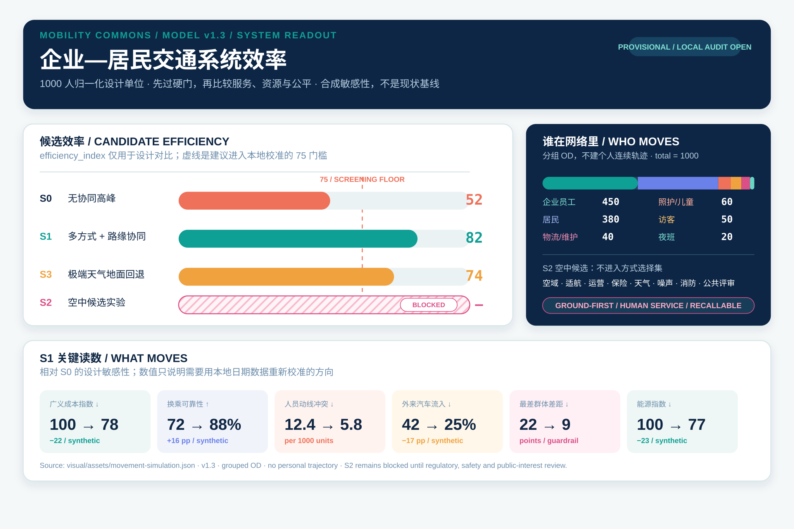

#### 区域人口规模综合模拟：把 312.2 万人的早高峰动线全部跑一遍

为回应“整体效率最高、满意度最高”的目标，新增 `visual/assets/regional-scale-commute.json` 与 `node visual/assets/run-regional-commute-simulation.js`。它以北京市官方资料披露的海淀区 2024 年末 312.2 万常住人口作为**规模覆盖参考**，将每一名合成代理处理一条早高峰动线：居住/边界 → 首公里 → 地铁/公交/骑行/步行无障碍/汽车/企业接驳 → 工作或服务目的地。这里的 3,122,000 是人口规模压力测试，不是工作人口、普查微观数据或本地 OD；企业员工、居民工作者、照护者/儿童、访客/服务、物流维护和夜班人员的比例都是待校准的情景权重 [source:HAIDIAN-POPULATION-2024]。

runner 实际循环处理全部 3,122,000 个合成代理，并只保留分组、区域、方式、路线模板、时间直方图、乘客公里、服务单元账本和总量校验；不落个人地址、雇主、身份或连续轨迹。B0 是集中到达的压力场景，O1/O2/O3/O4 是公共交通、慢行、公平和容量平衡的四组候选，R1 是地铁中断后的地面回退屏查。runner 对 O1/O2/O3/O4 都做 AM 全量回放，先执行包含峰值方式负荷 ≤1.35× 的硬门，再按“综合出行压力代理分最大 → 广义成本 → p90 → 冲突 → 外部汽车流入 → 车辆/服务公里”的字典序选择；当前合成输入下 O3 的纸面代理分最高，但自行车峰值负荷达 1.57×，因此被硬门排除，最终由 O4 容量平衡候选胜出。选中的 O4 随后再对全部 3,122,000 人做独立 PM 返程覆盖屏查，反向聚合工作/服务 → 居住路线；晚高峰 OD 仍待正式数据补齐。输出的“综合出行压力代理分”由时间、可靠性、可达性和冲突构成，居民调查结果仍待正式数据补齐。

在当前合成输入下，全量搜索选中的 O4 综合出行压力代理分为 54.67 → 66.44，广义成本代理为 60.34 → 49.44，p90 时间代理为 90 → 60 分钟，人流冲突代理为 5.74 → 3.13/千人，外部汽车流入为 26.95% → 8.47%，乘客公里代理为 34.86M → 28.40M，车辆/服务单元公里代理为 9.00M → 3.51M，峰值方式负荷由 1.57× 降至 1.21×。runner 的 `service_unit_ledger` 会逐方式列出地铁列次、公交发车、自行车槽位、连续无障碍服务槽位、汽车车辆等效和企业接驳车的所需单元、可用单元与负荷；这些是透明的合成服务屏查，实际车队、班次和运力仍待正式数据补齐。O1/O2/O3/O4 的候选排名、容量负荷和硬门结果都写入 runner 输出，避免把一个手选方案冒充“最优”；O3 的更高代理分只有在补足自行车容量后才可重新进入候选。上述读数只证明模型能在区域人口规模上守恒、回算和比较，海淀现状改善仍没有得到证明。居民调查结果仍待正式数据补齐，真正决策前还需补分时 OD、工作人口结构、站点/公交/路缘容量、分组方式份额、门到门 p50/p90、无障碍审计和车队/班次证据。

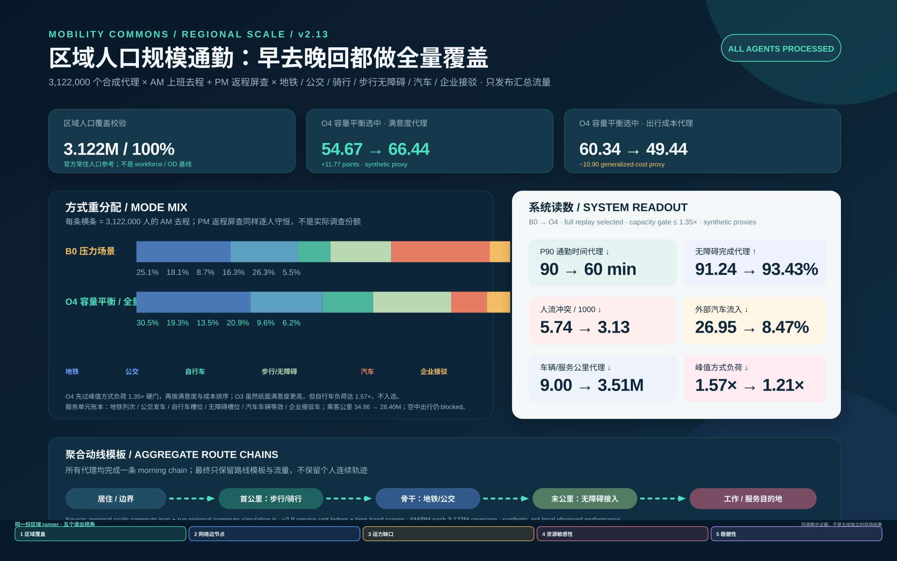

为了让群体代理分的差异不被总平均值遮住，新增群体—方式—运力证据板：O4 下居民工作者的综合出行压力代理分为 67.38，照护者/儿童为 67.24，夜班人员为 66.35，物流/维护为 57.21；无障碍完成代理按组保持在 92.87%—95.49% 的合成范围。右侧把地铁、公交、自行车、无障碍、汽车和企业接驳的服务单元负荷拆开，1.00× 是声明容量线，1.35× 是候选筛选闸门；O4 仍有 332,639 人次容量溢出代理，因此图板把“补班次/槽位、再谈扩展”作为下一步，容量压力保持可见。汽车方式份额从 B0 的 26.3% 降到 O4 的 9.6%，但物流/维护组仍有 75.8% 的汽车份额，居民通勤优化不能替代必要的服务车辆 [metric:resident_daily_trip_access_index] [metric:accessible_route_completion_ratio] [metric:peak_curb_conflict_rate]。

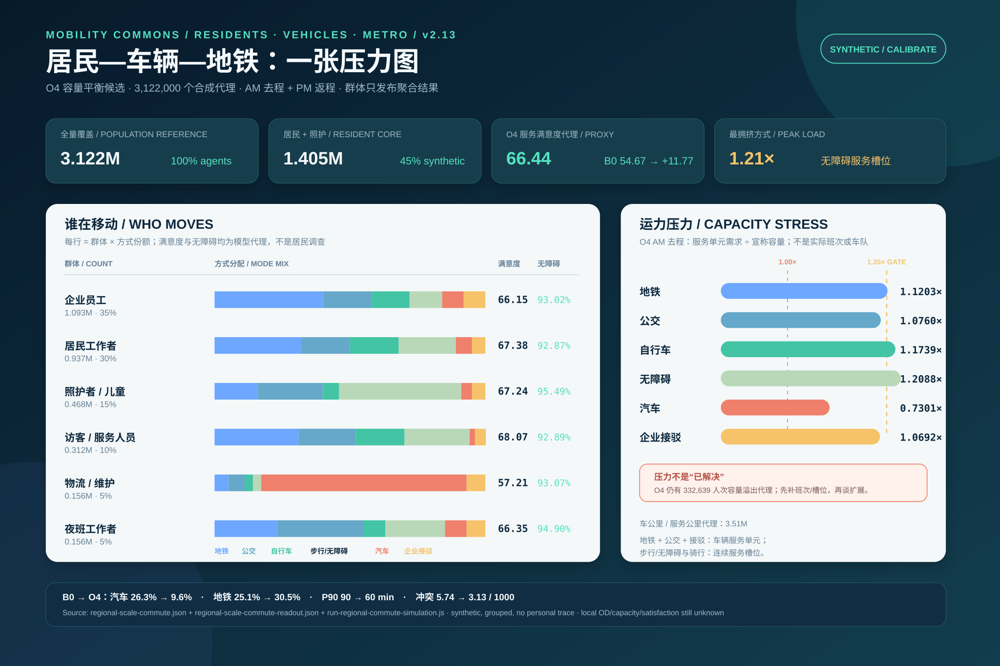

#### 相对资源压力：把人均公里、车辆服务和未知因素分开

为了不把“汽车减少”直接写成环境收益，本轮新增 `visual/assets/resource-pressure-screen.json`、`visual/assets/resource-pressure-readout.json` 和 `node visual/assets/run-resource-pressure-screen.js`。它把区域回放里的合成人均公里按方式拆开，再用外部方法参考中的相对 passenger-km 强度做敏感性账本：汽车归一为 1.00，轨道与公交保留参考强度，自行车/步行只按运行阶段屏查约定记为 0；企业接驳不套用汽车或公交系数，因燃料/电力、车队里程、载客率和路线未知而保持 `UNKNOWN` [source:EEA-GHG-PASSENGER-MODES] [source:NCHRP-2024-59-ENERGY]。

当前合成读数下，O4 的已知方式相对资源指数为 20.07M，B0 为 28.82M，变化为 −30.4%；O4 已知方式人均公里为 26.58M，另有 1.82M 企业接驳人均公里未计入该指数。车辆/服务公里代理由 9.00M 降至 3.51M，但这仍不是 kWh、MJ、gCO₂e、车队或环境绩效。这个屏查不参与 O1/O2/O3/O4 排名，也不能越过容量、无障碍、安全、隐私和人工服务硬门；下一步必须用日期化电力/燃料、载客率、15 分钟客流和生命周期边界替换外部因子。

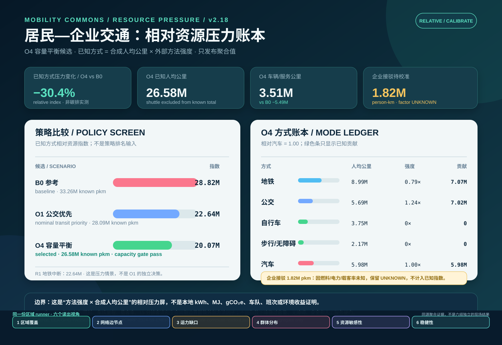

v2.13 不让一个名义场景的高分直接代表“稳健”。新增 `robustness_screen`，对 O1/O2/O3/O4 每个候选在名义地面协同、地铁中断 30 分钟、强天气限制骑行和多方式容量冲击四类场景下各做一次全量回放，共 16 次 × 3,122,000 个合成代理，只留聚合读数。当前声明输入下，O2 的最坏综合出行压力代理分为 49.37、最坏峰值方式负荷 1.6986×，三个压力门均通过；O4 仍是名义效率第一，但稳健筛选第二；O3 在容量冲击中达到 2.0159×，停止扩容。这个结果只是对扰动敏感性的透明排序，不改变 O4 的名义候选，也不构成本地韧性或实施选择；在日期化中断、天气、容量、无障碍和行为数据补齐前，任何失败都应停在校准 [source:EXACT-SO-TRANSIT-2025] [source:UAM-MULTIMODAL-RESILIENCE-2025] [source:TRANSPORT-EQUITY-ABM-2025]。

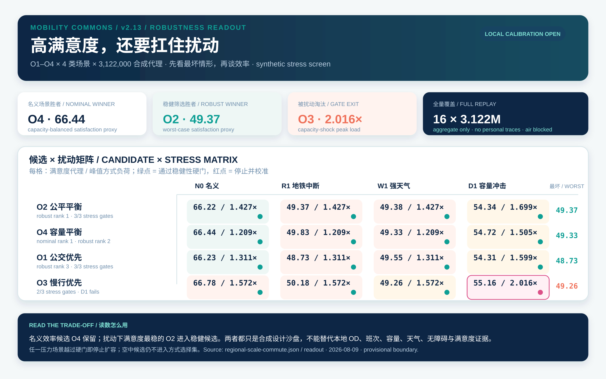

#### B1 企业到岗弹性：可解释的错峰敏感性

在不挪动居民、照护者/儿童、访客、物流维护和夜班人员需求的前提下，B1 只对 450 个企业员工设计单元做 20% 的弹性到岗敏感性，把 90 个设计单元从高峰移入更宽的到岗窗口。离线 runner 的合成读数为：总峰值排队 174 → 164，平均排队人分钟 75.7999 → 71.7917；汽车路缘峰值排队保持 60，未满足需求保持 89。地铁、公交负载下降只是这个声明输入下的压力变化，不是企业真实响应或海淀现状绩效；错峰方案还必须同时测量员工接受度、重排时间成本、公共交通班次匹配和分组方式份额，不能只看队列下降。正式使用前必须用有日期的企业分组 OD、方式份额、班次和站口计数替换输入 [source:MATRAM-ACTIVITY-ADAPTATION-2026] [metric:mode_transfer_reliability]。

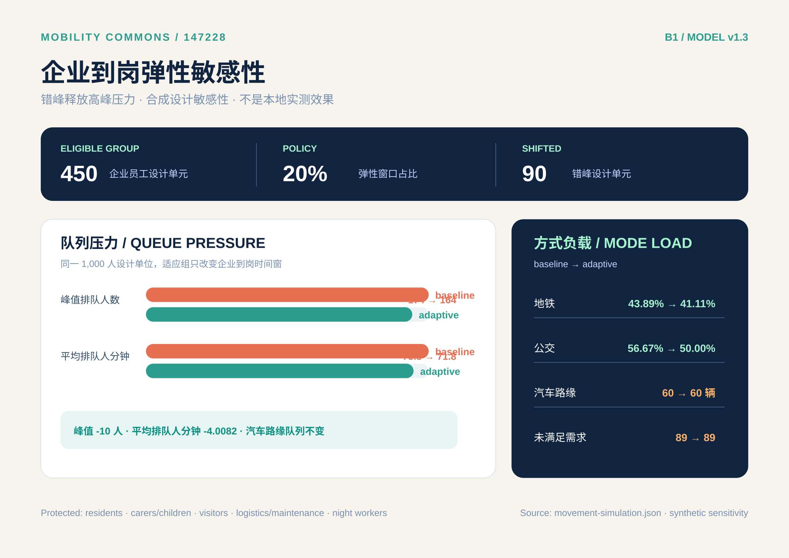

#### B2 方式与出发时刻选择：把对外通勤和人员动线放进同一张账

B1 只回答“企业到岗是否可以错峰”；B2 补上“人为什么选择某种方式和时刻”。每个分组候选同时计算门到门时间、到达时刻弹性、等待与换乘可靠性、站口拥挤、路缘/停车、费用/能耗和最慢群体差距，再按消防、无障碍、公共交通、隐私与人工服务五道硬门筛选。企业员工允许调整到岗窗口，居民、照护者、儿童、物流和夜班人员保留各自的活动链与人工回退；对外通勤以跨边界分组 OD 进入，绝不把个人轨迹作为优化变量 [source:JOINT-MODE-TIME-CROWDING-2020] [source:DTUE-PT-2025]。

这不是把论文系数直接搬进海淀，而是一个可校准的行为契约：先收集有日期的方式份额、分组出发时刻、班次/容量、站口和过街计数、路缘队列、门到门 p50/p90 与无障碍走行，再估计本地参数。灵活工作时间可能改变通勤出发分布，但弹性、晚到成本和照护约束必须分组验证，不能用一个平均值替代居民差异 [source:FLEXTIME-DEPARTURE-CHOICE-2013] [source:MATRAM-ACTIVITY-ADAPTATION-2026]。

本轮把 B2 进一步落到一个独立的 `departure_time_choice_screen`：仍对 3,122,000 个合成代理全量处理，但只允许企业员工进入提前 20 分钟的弹性窗口；居民、照护者/儿童、访客、物流维护和夜班人员不被模型强行错峰。B0 的首选窗口占 95%，O4 屏查变为提前 6.99%、首选 88.01%、夜班 5%，其中 218,266 个合成企业代理被标记为可调整，重排成本代理为 4.365M 人分钟，受保护群体移位为 0。这不是员工行为、到达分布或班次绩效观测，也不参与 O4 的策略排名；它只把“谁可以调整、谁不能被牺牲、重排成本如何记账”变成可复核的运营合同，待员工接受度、班次和 15 分钟容量数据补齐后再校准 [source:JOINT-MODE-TIME-CROWDING-2020] [source:DTUE-PT-2025]。

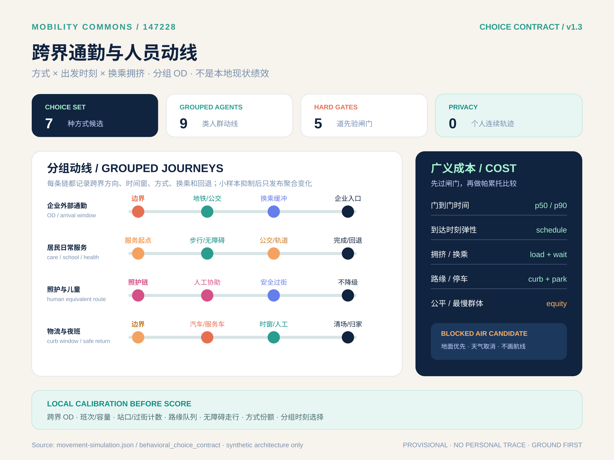

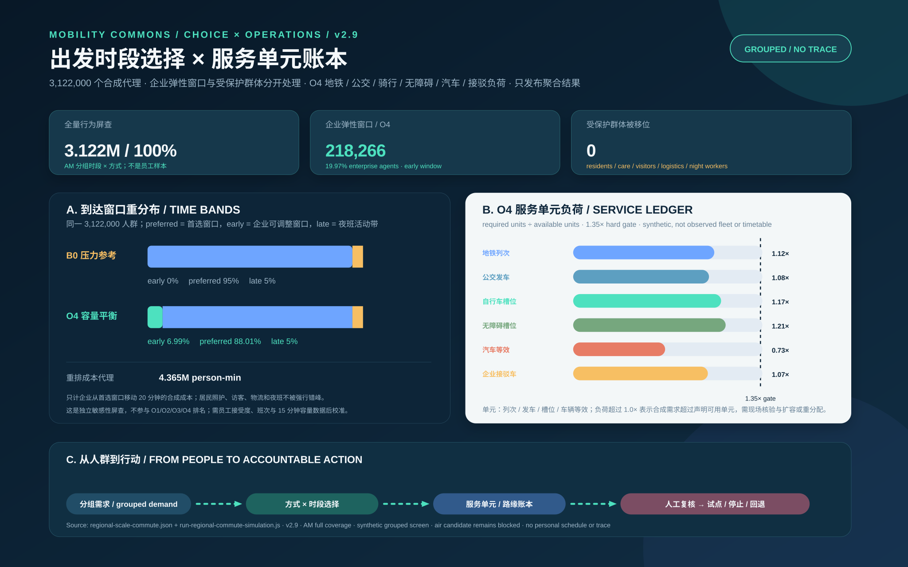

为避免把“方式级容量 ≤1.35×”误读成已经有可运行班次，v2.10 又把同一份分组出发时段需求展开为三个 15 分钟服务切片，按 FIFO 与剩余容量逐切片结转队列，分别记地铁列次、公交发车、自行车槽位、连续无障碍路径槽位、汽车车辆等效和企业接驳车的可用服务单元、上车量、失败上车尝试、切片后残余队列和队列人分钟代理。当前 O4 的独立合成运营屏查处理 3,122,000 人，服务切片峰值负荷 3.2431×，窗口末残余队列 452,668 人、队列人分钟代理 16.241M，运营门为**未通过**；这不是海淀实测，而是明确告诉运营者“不能把当前候选直接上线”，必须先补日期班次、站点/公交站/路缘容量、上车/拒载计数和无障碍服务容量。该屏查不参与 O1/O2/O3/O4 排名，论文只提供 capacity-constrained schedule-based assignment 的方法边界，不提供本地系数 [source:SCHEDULED-CAPACITY-TRANSIT-2012] [source:DYNAMIC-PT-CAPACITY-2024]。

v2.11 在这张时段账本上增加了一个独立的**有限回退屏查**：当主方式出现残余队列时，只把有声明上限的一部分需求尝试送入同一切片仍有余量的备选方式，并按企业员工、居民工作者、访客/服务、夜班等分组记录来源方式、目标方式、时段和人分钟成本代理。O4 在合成输入下有 68,814.9 人次发生 `地铁 → 汽车` 的有限回退，其中企业员工 28,354、访客/服务 40,460.9；窗口末残余队列从 v2.10 的 452,668 降至 383,853.1，回退成本代理为 550,519.2 人分钟，但 3.2431× 峰值和残余队列仍使运营门**未通过**。步行/无障碍不作为回退来源，所有分组回退比例和目标方式余量都通过守恒检查。它不是本地路线选择、乘客接受度或运营绩效，也不参与候选排名；正式使用前仍要补拒载转移、备选方式接受度、无障碍/照护约束、班次余量和方式对时间可靠性证据 [source:DYNAMIC-PT-CAPACITY-2024]。

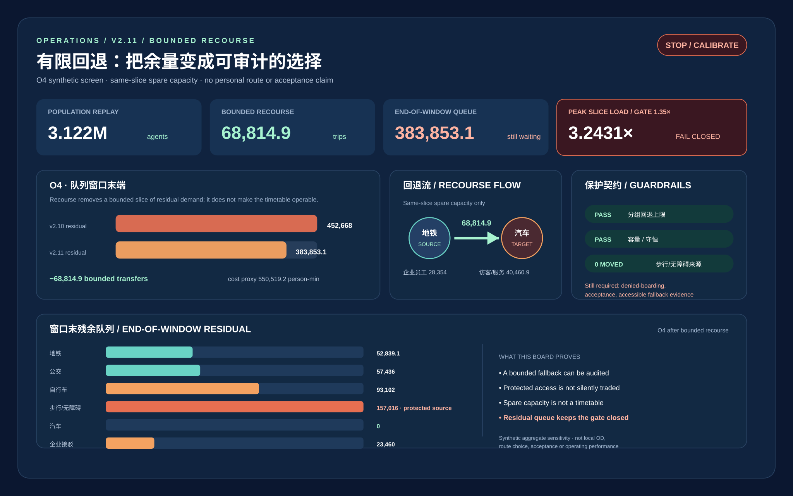

#### 运力缺口闭合屏：先算补多少，再谈扩展

为了把“运营门未通过”继续转成可执行的校准问题，本轮新增 `visual/assets/capacity-closure-screen.json` 和 `node visual/assets/run-capacity-closure-screen.js`。它沿用 O4 的 3,122,000 个合成代理、三段 15 分钟 FIFO 服务切片和 1.35× 峰值负荷门槛，对地铁、公交、自行车、步行/无障碍、汽车和企业接驳分别以 0.01× 步长扫描最小声明服务单元放大倍数；通过条件同时要求窗口末残余队列为 0、峰值负荷不超过 1.35×、全量代理守恒和空中候选继续阻断 [source:SCHEDULED-CAPACITY-TRANSIT-2012] [source:DYNAMIC-PT-CAPACITY-2024]。

在当前合成输入下，六种方式的最小放大倍数分别为地铁 1.17×、公交 1.12×、自行车 1.32×、步行/无障碍 1.34×、汽车 1.00×、企业接驳 1.16×；组合屏需要新增 301,925 个声明服务单元，最大方式峰值降至 1.2011×、残余队列为 0。这里的“服务单元”是模型内的合成列次/槽位/车辆等效，不是实际班次、车队、采购量、运营许可或居民绩效；这张图只回答“需要补哪些日期化证据和运力输入”，不自动推进 P1/P2。正式决策前必须用有日期的 OD、班次、容量、拒载、无障碍审计和责任运营者替换声明输入。

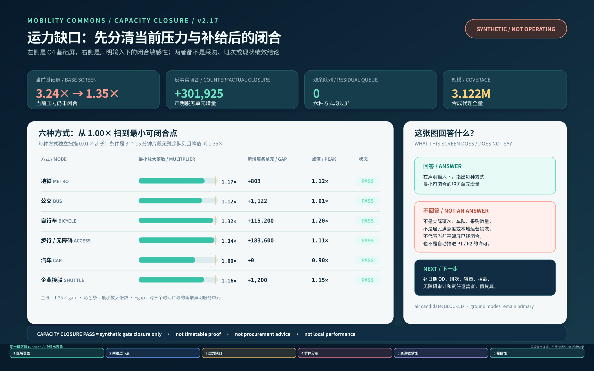

#### 网络级人员动线：把“谁经过哪里”变成可审计的边和节点

运力闭合回答“每种方式还要补多少服务单元”，但还不够回答“人具体经过哪些骨干、换乘节点和服务关口”。v2.19 新增 `visual/assets/network-flow-screen.json`、`visual/assets/network-flow-readout.json` 和 `node visual/assets/run-network-flow-screen.js`：它复用区域 runner 的同一套分组区间、来源/目的地 hash、企业员工外部通勤判定、O4 方式权重和企业错峰规则，只把每名合成代理的方式选择展开为显式路径，再即时归约为边、节点、时段、群体、OD 和车辆/服务等效账本。图中的网络是声明过的分析图，不是现状道路、轨道线位、站点容量或实时交通分配；无个人轨迹、住址、雇主或车辆标识被保存 [source:MATSIM-LARGE-SCALE-ABM] [source:MATSIM-BOOK-ACTIVITY-BASED]。

在当前合成输入下，O4 仍处理 3,122,000/3,122,000 人，方式人次为地铁 952,295、公交 602,547、自行车 422,597、步行/无障碍 652,746、汽车 299,361、企业接驳 192,454；首选时段 2,747,634 人。声明的最大边压力为 1.264×，低于 1.35× 网络筛查门；最热的边是“跨区→地铁骨干”1.264×，其次为“目的台账→物流维护关口”1.076×；大钟寺换乘节点为 1.555M 人流入、0.866×。作为对照，B0 集中到达参考在“管理路缘→目的台账”达到 1.6539×，网络门未通过，说明汽车路缘不是可以被总平均值藏掉的瓶颈。上述都只是合成屏查读数，不是海淀道路、站点、班次或满意度的观测结果；任何边/节点超过 1.35× 都应停在校准，而不是自动改写为“可运行”。

车辆/服务等效单独记账：O4 为地铁列车等效 5,291、公交车等效 10,042、汽车车辆等效 176,095、企业接驳车等效 8,019；自行车与步行/无障碍保留零车辆等效，避免把慢行需求折算成汽车。下一步必须用日期化 15 分钟 OD、地铁/公交班次与站点容量、路段/路缘/交叉口计数、连续无障碍审计、企业班车车队和责任运营者证据替换声明输入；这张屏查不改变 O4 的候选排名，也不推进 P1/P2 [source:SCHEDULED-CAPACITY-TRANSIT-2012] [source:DYNAMIC-PT-CAPACITY-2024]。

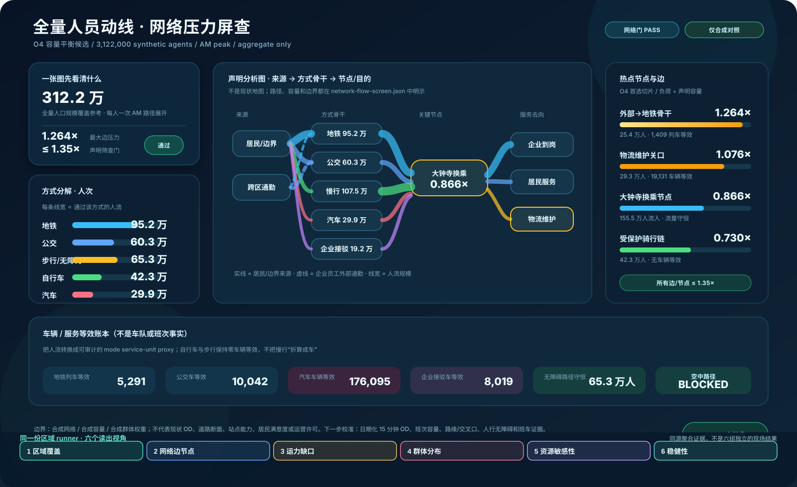

#### B3 中断、天气与最弱群体：效率必须能恢复

B2 解决“平时怎么选”，B3 继续问“地铁中断、恶劣天气或空中候选关闭时，谁还能到达、多久恢复”。运行器在 S1 地面优先候选上重算三种事件：无中断、地铁区段 30 分钟中断、强天气压低自行车并关闭空中候选。地铁中断把分组未满足需求按声明比例送入公交回退；强天气把自行车回退到公交，不把轮椅/照护路线交给不可达的个人轨迹。B3 输出受影响方式的回退覆盖率、队列人分钟、最弱群体差距代理分和恢复时间代理分，并把消防、无障碍、人工服务和空中运行闸门保留在前面 [source:UAM-MULTIMODAL-RESILIENCE-2025] [source:TRANSPORT-EQUITY-ABM-2025]。

在归一化设计单位中，地铁中断事件的地面回退覆盖率代理为 76.92%，强天气自行车回退覆盖率代理为 72.14%；最弱群体均为轮椅使用者，差距代理分分别为 12.1998 和 13.3571，恢复时间代理分别为 27.2997 和 30.0357 分钟。它们是透明合成压力测试，不是本地韧性或 p90 通勤事实，不能写成海淀事故处置。正式使用前必须用有日期的中断日志、天气取消记录、无障碍路线完成率和分组门到门 p90 替换。若回退覆盖率低于 70%、最弱群体差距代理超过 24 分或恢复代理超过 45 分钟，方案应停在重设计，不得用空中交通填补证据缺口 [source:MATRAM-ACTIVITY-ADAPTATION-2026] [source:UAM-TOD-VERTIPORT-2026]。

#### 恢复时间账本：把 TTR 从一行数字拆成七类人群

原有 B3 已经在 runner 内计算分组恢复时间，但如果只看总体结论，评审看不出谁在中断时最慢。本轮新增 `visual/assets/run-resilience-recovery-screen.js` 与 `visual/assets/resilience-recovery-readout.json`：它直接消费 `run-mobility-simulation.js` 的 B3 输出，按三种事件 × 七类人群重新排列，不改变需求权重、容量或回退比例。`R0` 例行运行的最慢恢复代理为企业员工 2.8419 分钟；`R1` 地铁区段中断 30 分钟的回退覆盖率为 76.92%，最慢群体为轮椅使用者、恢复代理 27.2997 分钟；`R2` 强天气下自行车转地面回退的覆盖率为 72.14%，轮椅使用者恢复代理为 30.0357 分钟。两类压力事件均在声明的 70% 回退覆盖和 45 分钟 TTR 闸门内，但这只说明合成屏查通过，不能写成海淀事故处置、无障碍审计、居民体验或本地 p90。

图板把 R1/R2 的轮椅使用者、照护者/儿童和夜班人员的差异直接放到同一矩阵；正式试点前必须用日期化中断日志、天气取消记录、分组门到门 p90 和连续无障碍路线完成率替换代理。任何一项超过闸门，都停在重设计；空中候选仍保持 `BLOCKED`，不用于填补地面证据缺口 [source:UAM-MULTIMODAL-RESILIENCE-2025] [source:TRANSPORT-EQUITY-ABM-2025]。

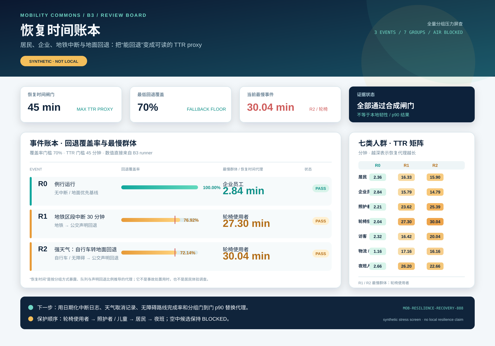

## 蓝绿空间、公共空间与城市风貌

蓝绿不是交通的装饰，而是连续到达链的遮阴、停歇、雨天回退和夜间安全界面。当前绿地比例约 12.34%，公共空间比例约 7.33%，由概念图层计算，不能推出生态、热舒适或排水绩效 [metric:green_ratio] [metric:public_space_ratio]。更新时优先让公共服务台、站口、候车、慢行和蓝绿边界共享遮雨、座椅、照明、饮水和无障碍信息；不得用树池、花箱或活动设施堵住轮椅转弯和消防。

蓝绿策略设置三条硬边界：雨天不把积水路径当接驳路线；热浪时提供人工服务和可休息的替代路径；暗夜和生态敏感时段降低不必要的灯光与设备活动。北京步行骑行标准、无障碍法规和海淀慢行工程提供连续性、设施和维护的政策依据 [standard:BEIJING-WALK-CYCLE-DB11-1761] [standard:BEIJING-ACCESSIBILITY-REGULATION] [source:BEIJING-SLOW-MOBILITY]。没有现场遮阴、热舒适、水风险、生态和照明数据时，相关指标保持 `unknown`。

## 更新项目清单、实施政策与分期计划

| 阶段 | 工作包 | 交付与验收 | 停止条件 |
| --- | --- | --- | --- |
| P0 读懂路缘 | 现场盘点、站口/过街/无障碍审计、企业和居民聚合台账、责任人登记 | 形成路缘资产表、路线障碍清单、隐私/申诉规则和基线版本号 | 权属、路权或人工等价服务不清，停在调查 |
| P1 合并需求 | 两个企业时窗、一个社区日常链、一个轨道换乘链的可逆试点 | 公开聚合的等待、完成、冲突、清场、投诉与维修记录 | 任一人群完成率明显下降、消防/无障碍受阻或投诉未闭环，回到人工 |
| P2 条件扩展 | 仅在批准范围内扩展共享接驳/按需小巴，更新工程和采购任务书 | 交通影响评价、安全/隐私/无障碍/生态复核、运营 SLA 与资金责任齐全 | 缺一项就不扩容，不用模型分数替代实测 |

### 责任—验收合同（设计目标，不是实施承诺）

每个阶段都由四类角色共同签字回读：交通与属地管理部门负责审批、路权和公共安全；企业交通专员与接驳运营者负责聚合需求、班次、装卸和成本；社区/居民代表、无障碍顾问与人工服务人员负责到达权、替代路线和申诉；维护、数据保护与独立复核人员负责资产状态、隐私、事件和证据留存。具体机构、合同关系和预算仍是 `unknown`，这里登记的是责任边界而不是合作事实。

每个阶段至少留存一份带日期的资产清单、需求版本、责任人、指标读数和停止决定：P0 的验收指标是 100% 重点资产有 ID、责任角色和人工替代入口；P1 按企业/居民/无障碍分组回读等待时长、路线完成率、路缘冲突率、投诉首响与关闭状态；P2 只有在交通影响评价、消防、无障碍、隐私、生态、保险、采购和维护证据齐全，且 `accessible_route_completion_ratio >= 0.95`、`curb_time_window_compliance_ratio >= 0.90`、投诉 24 小时内有状态更新时，才进入扩展评估。任一分组恶化、无证责任或硬门失败，责任人必须把服务切回公共交通/人工/电话与纸面入口，并记录复核日期；不得用综合模型分数替代实测或审批。

上述角色、字段、阶段阈值和人工回退已同步写入 `visual/assets/responsibility-acceptance-contract.json`；它只发布角色 × 阶段 × 分组 × 指标的聚合验收结构，不发布个人轨迹、企业身份或车辆标识。JSON 中的 `design_target` 是试点前置目标，不是当前达标结果。

实施—运营合同另以 `visual/assets/implementation-operation-contract.json` 登记 P0/P1/P2 的参与角色、验收指标、人工回退与停止/撤回条件。它是概念责任接口，不是已确定的机构、合同、资金、采购、许可或运营承诺；任一 `unknown` 基线、同意/责任边界缺失或硬门失败，都保持在调查/人工回退状态 [data:visual/assets/implementation-operation-contract.json] [depth:phasing_implementation]。

为把“人工回退”从叙述收敛成可复核的最小动作，本轮把既有 M-09 雨雪/断网服务降级卡做成离线桌面演练，而不是新增一个已运行场景。`visual/assets/mobility-tabletop-contract.json` 固定 4 条合成服务请求、4 个触发事件、6 项验收检查和 5 个可逆回滚步骤；`node visual/assets/run-mobility-tabletop.js --check` 只读回包内 fixture，不联网、不接触个人数据、不调用外部系统，也不产生持久化状态，并输出 `mobility-tabletop-evidence.json` 同构的聚合回读。当前演练为 4/4 请求保留人工或公共交通入口、预约冻结、6/6 检查通过、5/5 回滚步骤复演；`performance_results=null`、`operational_status=not_authorized_not_run`，因此 PASS 只证明状态、停止和回滚逻辑可检查，不推进 P1/P2，不证明真实值守、无障碍绩效、公众接受、服务可用性或安全 [data:visual/assets/mobility-tabletop-contract.json] [data:visual/assets/mobility-tabletop-evidence.json] [data:visual/assets/run-mobility-tabletop.js]。

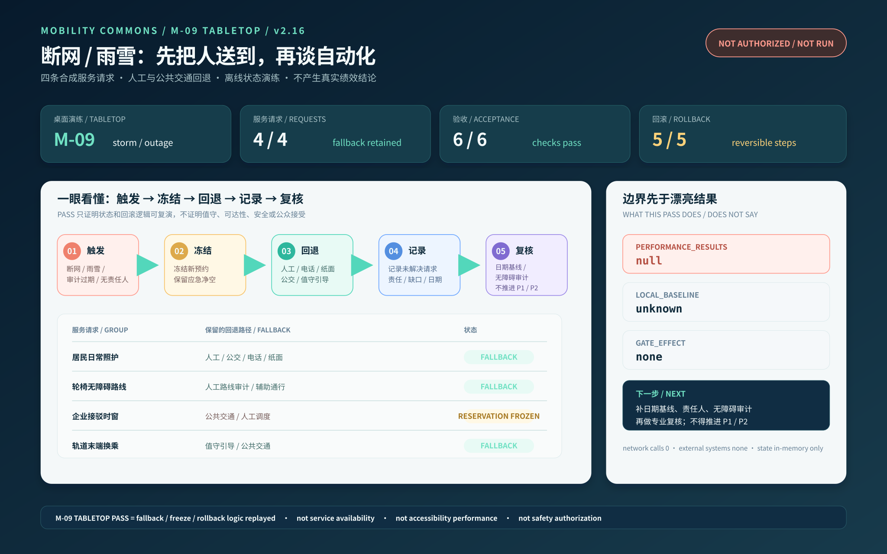

实施政策采用“登记—小试—复核—扩展/停止”循环。停车招标对巡查、设备和接诉即办的要求被转译为每个交通资产必须有 ID、状态、责任人、响应时间和关闭证据 [source:HAIDIAN-ROAD-PARKING-TENDER-2026] [depth:renewal_project_list] [depth:phasing_implementation]。企业签署的是可撤回的服务协议，居民保有公共路线和人工服务；任何 AI 建议都可由现场人员否决。

## 指标体系、面积复算与合规矩阵

### 当前可回读的底盘

当前可从 GeoJSON 回读的量为：provisional 工作范围面积 [metric:site_area_sqm]、三处重点区 [metric:key_area_count]。

建筑足迹及其比例 [metric:building_footprint_area_sqm] [metric:building_footprint_ratio]、绿地与公共空间比例 [metric:green_ratio] [metric:public_space_ratio] 也可回读，但都属于概念底盘。

设计关系线长度 [metric:design_north_south_spine_length_m] 只用于方案内比较；正式边界和专业资料到位后必须全量重算。

### 必须补齐的交通指标

企业通勤需求基线、对外通勤 OD、居民日常出行可达指数、企业多方式出行比例、分时停车占用、路缘时窗遵守率、首末端换乘可靠性、无障碍路线完成率、峰值路缘/人员动线冲突率、投诉闭环小时数、工作场所充电供需缺口、综合系统效率、方式换乘可靠性和空地接驳可靠性均为 `unknown`。

试点可以设置 `design_target`：无障碍路线完成率至少 0.95，首末端换乘可靠性至少 0.85 [metric:accessible_route_completion_ratio] [metric:first_last_mile_transfer_reliability]。

路缘时窗遵守率至少 0.90，投诉首响不超过 4 小时且 24 小时内给出责任/处理状态 [metric:curb_time_window_compliance_ratio] [metric:mobility_service_complaint_closure_hours]；这些目标是验收门槛，不是海淀现状或保证结果。

### 五道验证门与矩阵

1. **几何门**：官方边界、站口、道路、红线和权属可回读；
2. **需求门**：企业/居民聚合需求有同意、分组和时间版本；
3. **安全门**：交通、消防、无障碍、应急和极端天气测试通过；
4. **责任门**：运营方、维护方、采购、保险、数据和投诉 SLA 明确；
5. **公平门**：AI 推荐与人工/电话/纸面方案的分组结果不把最慢的人排除。

“整体效率最高”只有在五道门都通过后才有意义：先公开每种方式的输入、换乘链、人员动线瓶颈、对外通勤 OD、汽车外来流入和最差群体差距，再比较候选方案的广义成本与资源消耗。若硬门冲突，结果就是停止/回退，而不是用单一分数掩盖安全或公平损失 [standard:SUMO-MULTIMODAL-SIMULATION] [standard:LOW-AIR-REGULATORY-GATE] [depth:metrics_recalculation]。

`compliance_matrix.json` 覆盖公告与任务书的全部要求；`standard_matrix.json` 对应规划、步行骑行、无障碍、停车/资产运营、隐私和接驳研究；`design_depth_matrix.json` 将三层空间、三处重点区、交通/市政、更新分期、指标和风险绑定到正文、GeoJSON、图纸和自检 [standard:PROJECT-OFFICIAL-ANNOUNCEMENT] [standard:PROJECT-AGENT-OPEN-CALL-TASKBOOK]。

正式边界不清、交通基线不全或路权冲突时，提交保持 provisional，不把未知值填成模型预测 [depth:metrics_recalculation] [depth:risk_missing_data]。

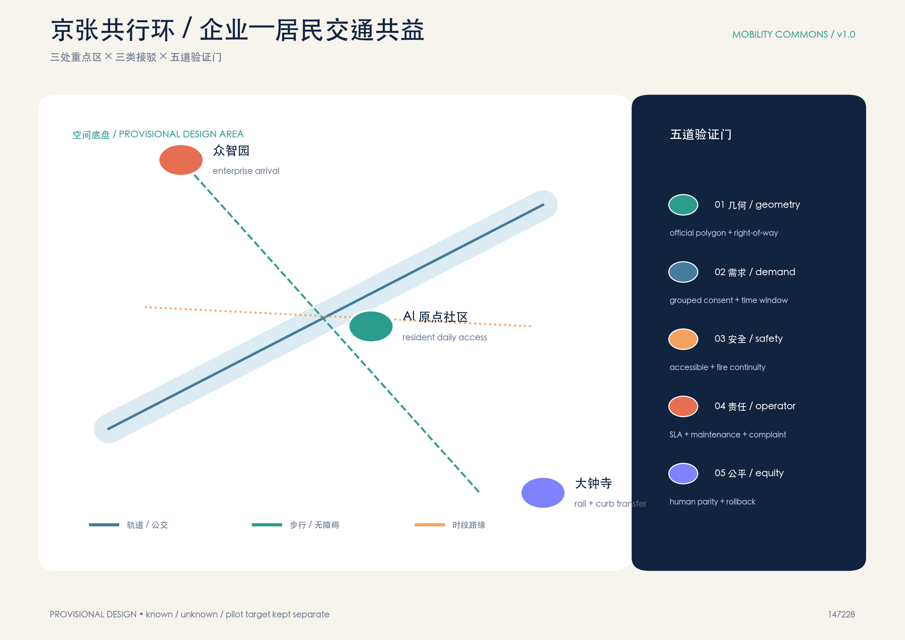
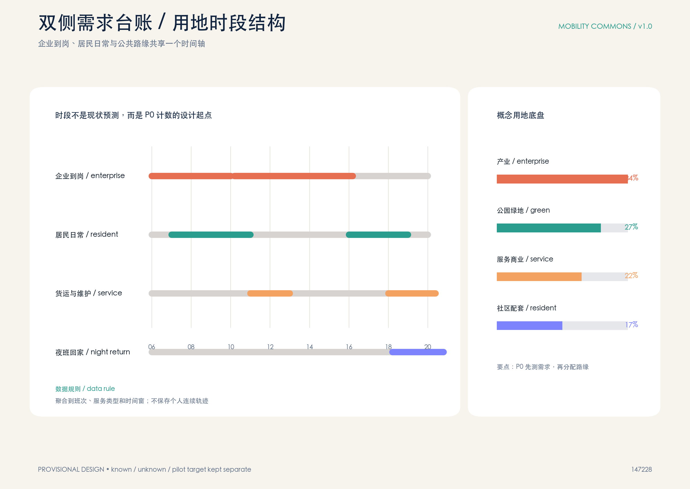
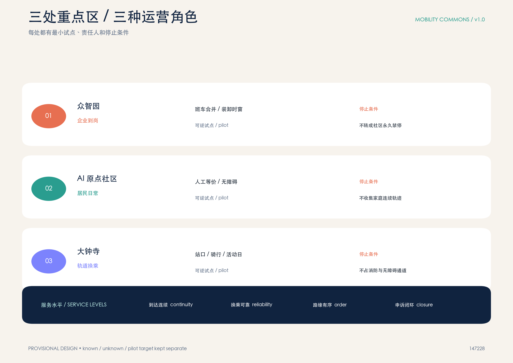
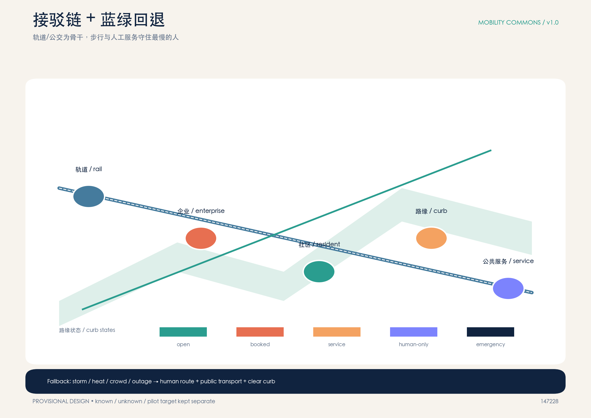
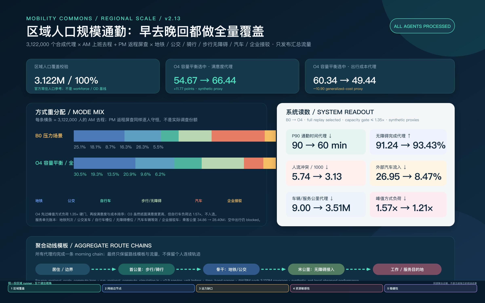

## 风险、版权与合规说明

本包不替代道路红线、交通影响评价、停车管理合同、消防审查、无障碍专项、施工图、运营许可、数据合规、保险或采购文件。最重要的风险不是“模型不够聪明”，而是企业需求挤占居民公共路线、按需车辆反而增加交通量、路缘状态无人维护、投诉没有责任人和低数字能力人群被排除。每个风险都有回退：人工服务、公共交通、纸面/电话入口、可移动设施撤场、停止预约、公开事件摘要和下一次复核日期 [source:SHARED-MOBILITY-OECD] [source:CURBSPACE-MANAGEMENT-2021]。

来源使用边界清楚区分：北京政府和招标文件用于政策/责任框架；论文用于方法与风险启发；OSM 和现有 provisional GeoJSON 仅用于背景筛查与设计关系。论文没有提供京张基线，停车招标的数量也不等于本方案范围内车位数量；任何企业名称、合作关系、车辆、站点容量、事故率、满意度和健康效果都不在本包中作事实主张。

## 参考资料

- `BEIJING-14TH-TRANSPORT-PLAN` 北京市“十四五”时期交通发展建设规划。
- `HAIDIAN-ROAD-PARKING-TENDER-2026` 2026—2027 年海淀区道路停车管理服务项目招标公告。
- `BEIJING-HAIDIAN-TRANSIT-HUB-PDF` 海淀西北旺镇控规交通枢纽与慢行接口材料。
- `HAIDIAN-SLOW-MOBILITY-TENDER-2022` 海淀区 2022 慢行系统完善工程公开采购材料。
- `EMPLOYER-TDM-LONGITUDINAL` Employer-based travel demand management longitudinal analysis。
- `EMPLOYER-TDM-GUIDE` Employer transportation demand management plan guide。
- `CURBSPACE-MANAGEMENT-2021` Public/private curbspace management challenges and opportunities。
- `SAV-TRANSIT-COMPETITION` Shared autonomous vehicles and public transit competition。
- `SAV-MICROTRANSIT` Shared autonomous vehicles in microtransit systems。
- `SHARED-MOBILITY-OECD` OECD shared-mobility transition policy report。
- `BEIJING-LOW-AIR-ECONOMY-2024` 北京低空经济行动计划，作为设施协同背景而非项目许可。
- `CAAC-UAV-REGULATION-2024` 民航无人驾驶航空器飞行管理法规，作为飞行安全与运行责任前置门槛。
- `SUMO-MULTIMODAL-DOCS` SUMO 官方多方式、行人、自行车和权限仿真文档。
- `MULTIMODAL-TRAFFIC-REALITY-2025` 多方式交通物理/虚拟仿真研究，方法参考而非本地校准结果。
- `UAM-BEIJING-MULTIMODAL-2024` 北京城市空中交通与地面方式衔接研究，方法参考而非本地部署许可。
- `UAM-PUBLIC-TRANSIT-2023` 空中交通与公共交通/步行接驳研究，方法参考而非本地需求证明。
- `JOINT-MODE-TIME-CROWDING-2020` 联合估计方式与出发时刻选择，纳入到达弹性、可靠性与公共交通拥挤；方法参考而非本地参数。
- `DTUE-PT-2025` 带硬容量约束的公共交通出发时刻选择均衡；方法参考而非本地运力结论。
- `FLEXTIME-DEPARTURE-CHOICE-2013` 灵活工作时间与通勤出发时刻关系；不转移其地区效应量。
- `UAM-TOD-VERTIPORT-2026` 以公共交通站点为基础的条件性空地衔接方法；不构成本地起降场或许可。
- `MATSIM-LARGE-SCALE-ABM` MATSim 官方大规模代理人、多方式交通仿真框架；只借鉴方法，不导入海淀结果。
- `MATSIM-BOOK-ACTIVITY-BASED` MATSim 方法书关于活动链、网络交互和迭代式交通仿真的说明；用于明确容量回放和校准边界。
- `ACTIVITY-BASED-DISAGGREGATE-2001` 活动模式、出行链、时段、目的地和方式选择模型；不转移其参数。
- `ACCEQ-DRT-2023` 面向可达性公平的需求响应式接驳配置方法；只作为未来边缘接驳候选的研究参考。
- `SCHEDULED-CAPACITY-TRANSIT-2012` 带显式车辆容量、出发时刻/站点/班次选择和剩余容量排队的时刻表交通分配方法；只用于定义服务时段账本的边界。
- `DYNAMIC-PT-CAPACITY-2024` 带拥挤、拒载、停站延误和乘客适应的容量可行公共交通动态分配方法；不转移参数或本地结果。
- `SIMMOBILITY-MULTISCALE-2017` 多尺度活动—代理—多方式交通仿真框架；只用于区分全量压力回放与本地校准输入。

**最终边界声明**：这是一个以企业—居民共益交通为核心的可审计概念与试验框架，不是政府批准规划、道路开放公告、停车许可、企业合作协议、交通容量证明、健康效果证明或建设承诺。第一名项目保持不变，本包只表达新的交通数据和运营方案。

## 三层范围工作框架（证据回读）

统筹层、总体层和重点区层共享 `site_boundary`、`key_areas`、`land_use`，避免企业方案、社区方案和图纸各画一套边界 [data:geometry/site_boundary.geojson#SITE-001] [data:geometry/key_areas.geojson#PROV-KEY-001] [data:geometry/land_use.geojson#LU-001]。

三类空间图层继续回接 `buildings`、`roads`、`green_space`、`public_space` [data:geometry/buildings.geojson#BUILD-001] [data:geometry/roads.geojson#ROAD-001] [data:geometry/green_space.geojson#GREEN-001]。

公共约束和分期回接 `public_space`、`constraints`、`phasing` [data:geometry/public_space.geojson#PUBLIC-001] [data:geometry/constraints.geojson#CONSTRAINT-001] [data:geometry/phasing.geojson#PHASE-001]。当前这些线面是概念关系，正式深化需要补站口、交通断面、信号、权属、管线、消防、排水、停车、班车和居民体验；任何服务水平指标都必须带日期、分组、时段、责任人和缺口 [depth:existing_conditions_diagnosis]。

## 统筹研究范围产业与未来城市研究（证据回读）

企业、居民、轨道公交运营者、社区服务和维护单位共同组成未来城市的交通生态；AI 只做聚合、解释、冲突发现和回退清单，公共权利仍由人和制度决定 [source:NIST-HUMAN-CENTERED-AI] [standard:PROJECT-AGENT-OPEN-CALL-TASKBOOK]。企业提供匿名聚合时段，居民保有不依赖 App 的人工入口，轨道/公交是骨干，按需车辆必须接受容量和停止条件约束。几何上，企业入口、社区服务点、站口和路缘状态回接 `key_areas`、`roads`、`public_space`，指标上把企业多方式出行、居民分组完成率和申诉闭环设为后续调查项；当前没有企业名单、协议、居民分层样本或运力基线，因此不能写“已经形成产业集群协同”或“居民满意度提升” [depth:overall_spatial_structure]。

## 总体设计范围城市更新与控规深度城市设计（证据回读）

总体设计用路缘时窗、换乘链和蓝绿回退界面把交通运营翻译为空间动作：首层入口、站口、候车、骑行停放、无障碍坡道、公共服务台和维护点优先可逆更新；建筑和用地只表达关系，不伪造 FAR、权属、工程量和投资 [data:geometry/land_use.geojson#LU-001] [data:geometry/buildings.geojson#BUILD-001] [data:geometry/public_space.geojson#PUBLIC-001]。

空间线位和面积需要同一版 boundary、同一投影和同一复算脚本；控规与建筑界面回接 [depth:height_massing_character] [standard:MOHURD-CONTROL-DETAILED-PLANNING]。交通容量、停车供应、站点设施和市政接口另行由专业团队确认；如果固定设施会侵占消防、无障碍或居民安静界面，则退回移动设施和人工服务 [depth:municipal_new_infrastructure]。

## 重点区域详细设计（证据回读）

众智园验证企业到岗和装卸，AI 原点社区验证居民日常和人工等价，大钟寺验证轨道换乘和活动日路缘；三处各有一个最小可逆试点和一组停止条件，而不是把“AI”作为统一答案 [data:geometry/key_areas.geojson#PROV-KEY-002] [data:geometry/roads.geojson#ROAD-002] [depth:three_key_area_detailed_design]。节点必须绑定运营责任、时间窗、清场、无障碍替代路线和投诉入口，不能把企业预约变成社区永久禁停，也不能把共享接驳当成无需许可的社会道路运营。

## AI 创新生态、人才画像与 AI+ 场景（证据回读）

场景以企业交通专员、居民/照护者、轨道运营者、维护人员和专业复核人共同测试；十张卡分别记录输入、输出、最小化、服务水平和回退。人才画像不是营销标签，而是分组验收责任：轮椅使用者看路线连续，夜班人员看回家可靠，维护人员看资产 ID 和清场权，企业看成本与投诉，居民看不交轨迹也能通行 [source:BEIJING-ACCESSIBILITY-REGULATION] [depth:three_key_area_detailed_design]。现阶段没有实际用户同意样本、运行日志或企业协定，所有场景仍是设计目标。

## 用地、建筑规模与拆改留方案（证据回读）

本包不改变第一名项目，也不在本方案中新增建筑红线。`land_use`、`buildings` 和 `public_space` 只提供交通服务点、入口和公共界面的概念支撑；可回读的建筑足迹指标不等于法定建筑覆盖率 [data:geometry/buildings.geojson#BUILD-001] [metric:building_footprint_ratio] [depth:retain_renovate_demolish]。拆改决策必须先有现状测绘、权属、结构、消防、地下管线和社区参与，任何“提升容量”的图示在这些条件缺失时都保持 provisional。

## 交通、轨道、市政与公共服务设施（证据回读）

交通层把 `roads` 当作关系图，把路缘状态、站口、公共服务和蓝绿回退当作运营对象 [data:geometry/roads.geojson#ROAD-001] [data:geometry/constraints.geojson#CONSTRAINT-001]。

三类接驳和四项 SLA 都须用人工计数、走行审计、交通模型、无障碍检查、消防核验和投诉日志逐项回读 [depth:traffic_rail_slow_parking] [source:BEIJING-14TH-TRANSPORT-PLAN]。当前不存在可直接引用的企业通勤量、居民 OD、停车占用、信号配时、站口客流、充电供需或投诉时长，因此指标保留 `unknown`；设计目标只用于设置试点停止线 [depth:metrics_recalculation]。

### 设计场景综合模拟（透明沙盘，不是现状）

在现场 OD、站点容量、信号、人员动线和路缘计数到位前，先用 `visual/assets/movement-simulation.json` 做 1000 人归一化设计单位的可解释对比：S0 无协同高峰、S1 多方式与路缘协同、S2 受监管闸门阻断的空中候选、S3 极端天气地面回退。`visual/assets/run-mobility-simulation.js` 是同一输入文件的无依赖确定性复核器；它只重算设计单位的队列和服务供给，不把论文参数或模型读数升级为海淀现状。S1 只是在建议硬门筛查后暂选的设计候选；广义成本、换乘可靠性、人员冲突、汽车外来流入、最差群体差距和能耗都是示范输入，不是海淀现状。图件把“先过硬门、再做帕累托比较、最后用现场数据替换”的决策链公开 [metric:multimodal_system_efficiency_index] [metric:person_flow_conflict_rate] [standard:SUMO-MULTIMODAL-SIMULATION]。

## 蓝绿空间、公共空间与城市风貌（证据回读）

蓝绿系统为交通提供遮雨、停歇、热浪回退和暗夜安全，但不自动等于健康收益或防洪能力。现有 `green_space`、`public_space` 和 `roads` 的交叠关系只支持候选路径识别 [data:geometry/green_space.geojson#GREEN-001] [data:geometry/public_space.geojson#PUBLIC-001]。

它不能代替树冠、坡度、热舒适、排水和生态现场数据 [depth:blue_green_public_space] [standard:BEIJING-WALK-CYCLE-DB11-1761]。

## 更新项目清单、实施政策与分期计划（证据回读）

P0 的核心交付是资产、需求、路缘、无障碍和投诉基线；P1 只做小规模可逆试验；P2 需要把采购、运营、维护、保险、隐私、交通和公平复核写成可执行条款 [data:geometry/phasing.geojson#PHASE-001] [depth:renewal_project_list] [depth:phasing_implementation]。实施主体、资金和 SLA 当前未知，不能把方案写成中标或建设承诺；每项新增设施都必须可撤回、可维护、可审计。

## 指标体系、面积复算与合规矩阵（证据回读）

指标分为文件可回读底盘、现场未知基线和试点目标三层；`metrics.json` 为唯一数值源，视觉页只展示其中的已知指标，其余以状态卡说明如何获取。五道验证门把几何、需求、安全、责任和公平串联 [metric:site_area_sqm] [metric:green_ratio] [metric:public_space_ratio]。

本次 schema 修复把 29 条记录统一放在 `metrics` 对象下，并将每条记录的 `status`、`value`、`unit`、`source_files`、`formula` 和 `confidence` 作为同一审计入口；离线检查结果为 11 条 `known`、18 条 `unknown`、无顶层游离指标、无状态/数值矛盾，摘要见 [data:visual/assets/metrics-schema-audit.json]，复核器为 [data:visual/assets/run-metrics-schema-audit.js]。这只证明结构和 `known`/`unknown` 的一致性，不证明现场交通绩效、运营结果或官方评分。

合规矩阵、标准矩阵、深度矩阵和 `self_check.json` 共同记录响应；任何未知指标都不通过改名、四舍五入或模拟结果变成已知 [depth:metrics_recalculation] [depth:risk_missing_data]。

## 风险、版权与合规说明（证据回读）

图件由本包脚本根据结构化数据生成，地图、边界、道路和建筑保持 provisional 或概念建议标识；论文、政府网页和招标文件只按来源说明用途。没有本地基线就保持 unknown，没有责任主体就停止试点，没有人工等价路径就不允许 AI 服务替代公共服务 [source:CURBSPACE-MANAGEMENT-2021] [source:SHARED-MOBILITY-OECD] [depth:risk_missing_data]。

## 参考资料（证据回读）

来源登记将官方政策、官方招标、论文方法、开放地图筛查和本包设计数据分开；访问日期、用途和不适用边界写在 `sources.json`，不以论文结论替代北京现场测量 [source:SOURCE-REGISTRY] [source:OSM-TRANSPORT-CONTEXT]。
