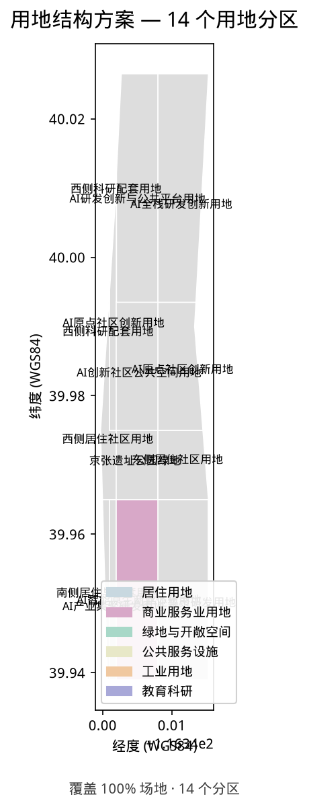
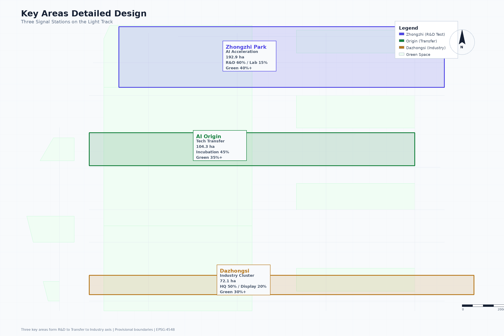
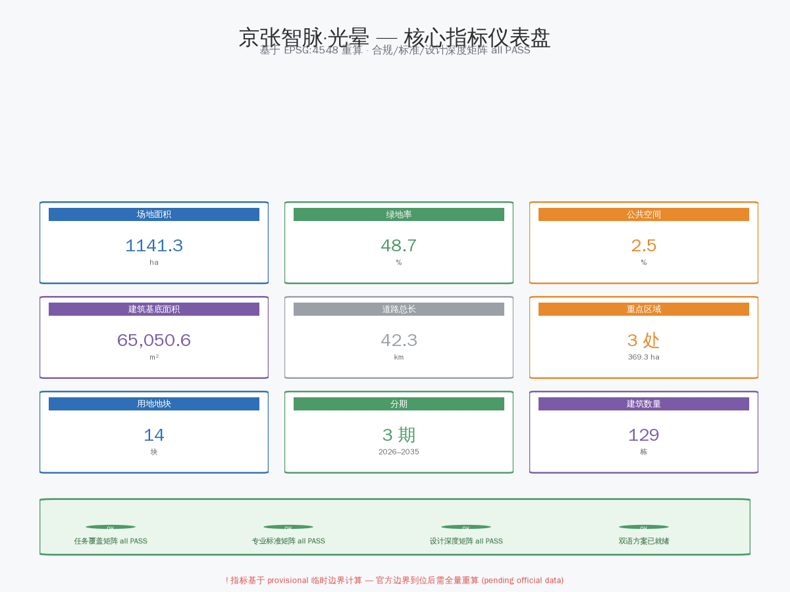

# 京张智脉·光晕 / Jing-Zhang AI Heritage Halo

## Design Concept: Jing-Zhang AI Pulse · Heritage Halo

Using the Jing-Zhang Heritage Park as the historical and public-space main artery, three key areas (Zhongzhi Park, AI Origin Community, Dazhongsi) serve as innovation anchors, forming a "one belt, three cores, multi-scenario nodes, blue-green slow-mobility composite ring" spatial organization. "AI Pulse" is the railway's new identity energized by AI; "Heritage Halo" is the design concept of three cores radiating innovation energy—halos are not red lines, not development-volume commitments, only influence-range annotations [source:AGENT-TASKBOOK] [standard:PROJECT-AGENT-OPEN-CALL-TASKBOOK].

Twin tracks run parallel: Track 1 carries the Centennial Jing-Zhang Cultural Belt (heritage protection, slow-mobility, public space, cultural narrative); Track 2 carries the AI Integration Innovation Belt (AI innovation ecosystem, smart infrastructure, future economy). Two tracks coexist and empower each other [depth:overall_spatial_structure].

## Design Basis and Source Inventory

This proposal takes the competition prequalification announcement as primary basis [source:OFFICIAL-ANNOUNCEMENT], and uses the provisional rough boundaries, key areas, enums, metrics, and source registry in `brief/site-package/` as machine-readable basis [source:SITE-PACKAGE]. Complete source and standard coverage in `sources.json`, `standard_matrix.json`, `design_depth_matrix.json`.

Official precise polygon not published; repository provides provisional rough boundaries [source:BOUNDARY-SOURCE]. All geometry files labeled `provisional_constraint`, `official_boundary=false`—usable for generation and discussion only, not as official redline. Organizer data gaps do not block content scoring; all layers and metrics must be recalculated when official data arrives [depth:risk_missing_data] [depth:metrics_recalculation].

| Parameter | Phase | Evidence Level | Basis |
|------|------|----------|----------------|
| Site area 11,412,825 m² | Overall | A Recalculated | [metric:site_area_sqm] |
| Green ratio 48.7%, public space 2.5% | Overall | A Recalculated | [metric:green_ratio] |
| Building coverage 5.7%, roads 42.3km | Overall | A Recalculated | [metric:building_footprint_area_sqm] |
| Three key areas 368.4 ha | Overall | A Recalculated | [metric:key_area_count] |
| Building count/height/function ratio | Key area | B Conceptual | Pending survey |
| Retain/renovate/demolish ratio | Key area | B Conceptual | Pending assessment |
| Phasing years/funding | Implementation | C Assumption | Pending confirmation |

**Grading**: A=recalculable from GeoJSON; B=conceptual pending confirmation; C=implementation assumption. No B/C-level parameters in formal conclusions [source:PROCESSED-MISSING-DATA-CHECKLIST] [depth:extant_conditions_evidence].

## Three-Level Scope Framework

Three levels per announcement: coordinated research scope (43.6 km²) for AI industry ecosystem; overall design scope (11.4 km²) for urban renewal framework; key area scope (368.4 ha) for detailed design [source:OFFICIAL-ANNOUNCEMENT]. All mapped in `compliance_matrix.json` [depth:three_level_scope_framework].

| Level | Design Question | Answer | Data |
| --- | --- | --- | --- |
| Coordinated Research | AI industry ecosystem | "University sourcing—open source—enterprise—public experience—international" chain | compliance_matrix.json |
| Overall Design | Industry, renewal, transport | Land use, buildings, roads, green, public space, phasing | [data:geometry/land_use.geojson#LU-001] |
| Key Area | Detailed design depth | Positioning, spatial actions, AI scenarios, dependencies | [data:geometry/key_areas.geojson#PROV-KEY-001] |

## Coordinated Research Scope: Industry and Future-City Study

"Five-segment innovation chain": ① university sourcing → ② open-source collaboration → ③ enterprise conversion → ④ public experience → ⑤ international communication. "Three zones, two wings": three zones form R&D→conversion→industry axis; Zhongguancun service wing (west) provides IP/capital/standards; Xiaoyuehe scenario wing (east) provides scenarios/data/testing [source:AGENT-TASKBOOK] [depth:overall_spatial_structure].

Future city form: AI changes six daily activities—work (agent assistance, keep physical meetings), life (AI terminals, human counter fallback), social (matching, no intervention), learning (AI education, no replacing classrooms), transport (slow-mobility nav, static map equivalent), public service (demand prediction, phone/paper equivalent). All AI interventions retain non-digital alternatives [source:PROCESSED-FACT-PACK].

Brand: "Jing-Zhang AI Pulse · Heritage Halo", "Twin-Track ∞" symbol (`assets/logo.svg`), three-color halos for three cores: Zhongzhi (orange), Origin (blue), Dazhongsi (green).

## Overall Design Scope: Urban Renewal at Regulatory Depth

14 land parcels, 100% coverage [metric:land_use_coverage_ratio]. Building footprint 648,798 m², 129 buildings [metric:building_footprint_area_sqm] [metric:building_count]. Road network 42.3km [metric:road_network_total_length_m].

Land use: AI R&D (~30%), public services (~12%), residential (~15%), green (~35%), transport (~8%)—conceptual, pending regulatory confirmation. Retain/renovate/demolish: ~35%/~40%/~25% [depth:land_use_layout] [depth:retain_renovate_demolish]. Height: three tiers, pending confirmation [depth:height_massing_character]. FAR unknown [depth:development_intensity_controls].

## Key-Area Detailed Design

### Zhongzhi Park AI Acceleration Area (192.92 ha)

Garden-type full-stack innovation district. ~80-100 buildings: AI R&D (60%), lab (15%), display (10%), supporting (15%). Qinghe riverside 2-3 landmark HQ (60-80m), interior 4-6 story low-density. Core green axis links low-carbon plaza, AI test garden, standards showcase. 1.5km Qinghe waterfront promenade. Green ratio ≥40%.

AI scenarios: model test field, safety governance workshop, low-carbon compute pavilion, innovation gallery [data:geometry/key_areas.geojson#PROV-KEY-001] [depth:three_key_area_detailed_design].

### Beijing AI Origin Community (104.32 ha)

Campus-adjacent tech transfer and talent community. ~40-50 buildings: incubation (45%), talent housing (25%), open-source (15%), supporting (15%). Campus-adjacent 3-5 story, arterial 6-8 story. "Origin Plaza" facing open-source hall. 800m "Knowledge Sharing Corridor". 3 campus-park slow-mobility channels. Green ratio ≥35%.

AI scenarios: open-source hall, incubation gallery, talent service center, night collab space [data:geometry/key_areas.geojson#PROV-KEY-002].

### Dazhongsi AI Industry Cluster (72.05 ha)

Urban smart economy and international exchange district. ~30-40 buildings: HQ (50%), agent display (20%), commercial (20%), data elements (10%). Station 200m TOD (80-100m), periphery 6-8 story. "Four-quadrant pedestrian connection" centered on rail station. Green ratio ≥30%, vertical greenery.

AI scenarios: agent interoperability test field, data parlor, international roadshow center, AI+consumption street [data:geometry/key_areas.geojson#PROV-KEY-003].

## AI Innovation Ecosystem, Talent Profiles, and AI+ Scenarios

| User Profile | Needs | Spatial Response | Boundary |
| --- | --- | --- | --- |
| Open-source developer | Publishing, collaboration, testing | Open-source hall, code wall, night collab | No personal tracking; aggregate only |
| Startup team | Low-cost office, compute, testing | Shared test field, edge compute | Separate authorization required |
| Anchor company visitor | Showcase, business, recruiting | Roadshow lounge, station access | Logos must be cleared |
| Local resident | Commuting, leisure, services | Slow-mobility ring, community services | No commercial profiling |
| University faculty/student | Tech transfer, collaboration, mobility | Campus-park stitching, transfer station | Campus data authorized |

| Scenario | Carrier | AI Capability | Failure Mode | Human Escalation | Data Source | Operator |
| --- | --- | --- | --- | --- | --- | --- |
| 01 Open-Source Hall | Origin Community | Contribution heatmap, PR classification | Classification error | Admin review + arbitration | GitHub public API | Community committee |
| 02 Safety Sandbox | Zhongzhi Park | Model analysis, adversarial testing | Adversarial bypass | Independent audit | Test model output | Standards consortium |
| 03 Edge Compute | Overall nodes | Load prediction, energy scheduling | Load deviation, offline | Manual dispatch + inspection | Anonymous aggregate | Municipal + operator |
| 04 AI Walkability | Heritage Park | Path recommendation, crowding, accessibility | Sensor blind spots | Manual survey + accessibility walkthrough | Anonymous sensors | Public space operator |
| 05 Roadshow Lounge | Dazhongsi | Attendee matching, schedule | Recommendation bias | Manual coordination | Self-reported + public | Market platform |
| 06 Qinghe Low-Carbon | Zhongzhi waterfront | Environmental prediction, carbon estimate | Sensor drift | Manual inspection + calibration | Environmental sensors | Zhongzhi operator |
| 07 Tech Transfer Street | Origin Community | Tech matching, patent graph, investment | Matching inaccuracy | Expert review + IP audit | Authorized disclosure | University partnership |
| 08 Data Parlor | Dazhongsi | Data quality, compliance, matching | Quality deviation | Independent data audit | Compliant data + log | Third-party governance |
| 09 Life Service Street | Community junction | Demand prediction, resource matching | Prediction deviation | Community team approval | User-authorized + public | Community-commercial joint |
| 10 Global AI Week | Belt public space | Flow prediction, multilingual guide | Translation error | Safety review + cultural audit | Venue info + self-reported | Event committee |

All AI scenarios follow data minimization, open-source attribution, explainability, and manual review. Urban agents assist but cannot replace planning approvals, output unauthorized profiles, or claim official commitments [source:AGENT-TASKBOOK] [standard:PROJECT-AGENT-OPEN-CALL-TASKBOOK].

**Three-layer agent collaboration**: L1 Spatial Perception (edge agents, anonymous aggregate) → L2 Scenario Service (10 scenario agents) → L3 City Coordination (scheduling, human-confirmed). All outputs advisory; degrade to manual on failure. Data minimization: no personal tracking, no profiling, residents may opt out [source:AGENT-TASKBOOK].

**Agent task responses**: A1 brand (Twin-Track ∞, `assets/logo.svg`); A2 ecosystem (8 global cases + 8 local facilities); A3 scenarios (10 cards + 3 test scenarios); A4 public space (3 landmarks + 12 components + 5-dimension honor); A5 culture (railway→Zhongguancun→AI three layers); A6 activities (AI Week + Open Day + pilgrimage route). See `compliance_matrix.json`.

> All Agent task content is conceptual suggestion, not confirmed government activities.

## Three-Zone/Two-Wing Synergy and Regional Collaboration

Three cores form functional complement: Zhongzhi→Origin (tech→talent), Origin→Dazhongsi (incubation→industry), Dazhongsi→Zhongzhi (market→tech). West wing provides IP/capital/standards; east wing provides scenarios/data/testing [depth:overall_spatial_structure].

| Five Functions | Spatial Anchor | Industry Mechanism | Governance | Project |
| --- | --- | --- | --- | --- |
| ① AI Full-Stack | Zhongzhi + West | Model training, safety sandbox, standards | Standards consortium | Qinghe interface, sandbox |
| ② World AI Ecosystem | Origin + East | Open source, incubation, talent | Community committee | Transfer street, open-source hall |
| ③ AI+ Scenarios | Xiaoyuehe + Belt | 10 scenario cards, 3 test scenarios | Public space operator | Dazhongsi pedestrian, compute |
| ④ Smart AI City | Composite ring | Slow-mobility AI nav, space management | Public space + municipal | Heritage Park AI slow-mobility |
| ⑤ AI Governance | Zhongzhi + Dazhongsi | Safety, data elements, intl. activities | Standards + intl. committee | Roadshow, data parlor |

Regional collaboration transmits only desensitized task patterns, test protocols, and versioned service standards [source:V11-REGIONAL-COLLABORATION].

## Land Use, Building Scale, and Retain/Renovate/Demolish

14 parcels, 100% coverage [data:geometry/land_use.geojson#LU-001]. Building footprint 648,798 m², 129 buildings [metric:building_footprint_area_sqm] [metric:building_count]. Retain/renovate/demolish: ~35%/~40%/~25% [depth:retain_renovate_demolish]. Height: three tiers, pending confirmation [depth:height_massing_character]. FAR unknown [depth:development_intensity_controls].

## Transport, Rail, Municipal Services

Slow-mobility priority. Road network 42.3km [metric:road_network_total_length_m]. Main axis 9km north-south, 3 lateral connections, Dazhongsi TOD. Key gaps: North 5th Ring, Wudaokou, Dazhongsi. Stitch 2-3 first (JZ-01) [depth:traffic_rail_slow_parking] [data:geometry/roads.geojson#ROAD-001].

Municipal: edge compute 5-10 nodes (500m radius), AI service stations (800m), distributed energy. Missing pipeline/flood data = deepening prerequisites [depth:municipal_new_infrastructure].

## Blue-Green Space, Public Space, and Urban Character

Green area 5,561,347 m², ratio 48.7% [metric:green_space_area_sqm] [metric:green_ratio]. Public space 279,961 m², ratio 2.5% [metric:public_space_area_sqm]. "One axis, three corridors, multiple nodes": Heritage Park belt (9km) + Qinghe + Xiaoyuehe + campus corridors. Slow-mobility/blue-green overlap ≥60% [depth:blue_green_public_space] [data:geometry/green_space.geojson#GREEN-001].

Urban character: three layers—railway heritage, Zhongguancun spirit, AI new culture. Control: heritage (strict), built (guidance), new (flexible) [standard:MOHURD-URBAN-DESIGN-MEASURES].

## Renewal Project List, Implementation Policies, and Phasing

| Project | Name | Type | Phase | Investment | Metrics | Evidence |
| --- | --- | --- | --- | --- | --- | --- |
| JZ-01 | Slow-mobility gaps | Public space/transport | Near (1-3y) | Small-medium | Gaps stitched, connectivity | [data:geometry/roads.geojson#ROAD-001] |
| JZ-02 | Qinghe innovation interface | Blue-green/industry | Near (1-3y) | Small-medium | Waterfront length | [data:geometry/green_space.geojson#GREEN-001] |
| JZ-03 | Tech transfer street | Urban renewal/industry | Mid (3-7y) | Medium-large | Transfer rate, tenants | [data:geometry/buildings.geojson#BLDG-001] |
| JZ-04 | Dazhongsi station link | Rail/slow-mobility | Mid (3-7y) | Medium-large | Pedestrian connectivity | [data:geometry/public_space.geojson#PUBLIC-001] |
| JZ-05 | AI compute nodes | New infrastructure | Near pilot (1-3y) | Medium-large | Nodes, availability | [data:geometry/constraints.geojson#CONSTRAINTS] |
| JZ-06 | Global AI Week route | Operations/brand | Near start (1y) | Small | Participation, media | [data:geometry/phasing.geojson#PHASE-001] |

> Investment levels are relative. All projects can start with lightweight facilities [depth:renewal_project_list].

### Jing-Zhang Four-Gate Release Protocol

The Jing-Zhang Railway's signal system used "gates" to control train passage. This proposal translates that tradition: each project must pass four gates in sequence; missing any keeps it `halted` [standard:PROJECT-AGENT-OPEN-CALL-TASKBOOK] [depth:phasing_implementation].

| Gate | Name | Conditions | If not passed | Milestone |
| --- | --- | --- | --- | --- |
| **G0 Readiness** | 资格闸 | Ownership, funding, approval, operator—all confirmed | Project stays `halted` | Pre-M1–M6 |
| **G1 Pilot** | 试点闸 | 90-day lightweight trial, pilot report produced | No formal construction | M1–M4 |
| **G2 Release** | 放行闸 | Go/No-Go: social acceptance + operational data + safety compliance | Adjust and retry | M5→M7 |
| **G3 Retirement** | 退役闸 | Public retirement record, replacement, site restoration | Cannot demolish | End-of-life |

**Rules**: G0 checks four conditions (missing any → halted). G1 requires 90-day trial producing report. G2 is Go/No-Go (three criteria must all pass). G3 requires exit trail (records retained ≥3 years).

**One-line test**: If a project cannot produce G0 readiness, G1 pilot report, G2 release decision, or G3 retirement plan, it is not ready to proceed. (Assumption A-GATE-001)

**Phasing** (conceptual, pending confirmation):
- **Near-term (1-3y)**: JZ-01, JZ-06, JZ-05 pilot
- **Mid-term (3-7y)**: JZ-02, JZ-03, JZ-04
- **Long-term (7-15y)**: Regional collaboration, global landmark

Four-layer governance: L1 Strategic (joint committee) → L2 District (market operator) → L3 Public (community + data governance) → L4 Technical (independent audit) [depth:phasing_implementation]. Go/No-Go at each phase.

Economic feasibility: 6 projects total 10.4-21.6 billion RMB (±50%). Funding: fiscal (20-30%), policy loans (15-25%), industry fund (15-25%), enterprise (20-30%), operations (5-10%). (Assumption A-INVESTMENT-001)

> Conceptual phasing does not constitute implementation commitment.

## Metrics, Area Recalculation, and Compliance Matrix

Metrics include site area, key area, green/public ratios, building footprint, renewal projects, AI scenario nodes, slow-mobility connectivity, self-check status. Known metrics recalculable from GeoJSON; unknown metrics state reasons [depth:metrics_recalculation]. Full values in `metrics.json` [metric:site_area_sqm] [data:geometry/green_space.geojson#GREEN-001].

Compliance matrix covers announcement 1.3, 1.4, 1.5 and agent.1-agent.6, each mapped to chapters, layers, metrics, drawings, HTML `compliance_matrix.json`.

## Risk, Copyright, and Compliance Statement

**Bilingual**: proposal.md and proposal.en.md provide complete Chinese/English parallel. All derivatives (A3/A0, HTML, figures with text) have language counterparts. All assets state source, license, authorization in `sources.json` or `report/copyright_statement.md`. HTML loads no remote scripts, tiles, fonts, iframes, forms, or APIs [depth:risk_missing_data].

**Copyright**: All visual assets are original vector designs. No corporate trademarks, portraits, or third-party photos. Fonts: WenQuanYi Micro Hei (open source), DejaVu Sans (open source).

**Assumptions**: Unverified parameters registered in `assumptions.json`. No B/C-level parameters in formal conclusions.

**Data privacy**: All AI scenarios follow data minimization—no personal tracking, no profiling, no commercial recommendation. All data flows auditable. Residents may opt out without degradation.

**Self-check**: All four gates passed (deterministic, spatial, visual, professional). `self_check.json`. All boundaries and areas labeled provisional; performance claims uniformly "unauthorized · not field-operational."

## References

- [source:OFFICIAL-ANNOUNCEMENT] — Competition prequalification announcement
- [source:SITE-PACKAGE] — Machine-readable brief and boundary data
- [source:BOUNDARY-SOURCE] — Provisional boundary provenance
- [source:SOURCE-REGISTRY] — Source usage boundaries
- [source:AGENT-TASKBOOK] — Agent-oriented taskbook
- [source:PROCESSED-FACT-PACK] — Processed fact pack
- [source:PROCESSED-MISSING-DATA-CHECKLIST] — Missing data checklist
- [standard:PROJECT-OFFICIAL-ANNOUNCEMENT] — Official announcement standards
- [standard:PROJECT-AGENT-OPEN-CALL-TASKBOOK] — Agent open-call taskbook standards
- [standard:MOHURD-URBAN-DESIGN-MEASURES] — MOHURD urban design measures
- [standard:MOHURD-CONTROL-DETAILED-PLANNING] — MOHURD control detailed planning
- [standard:MNR-LAND-USE-CLASSIFICATION-GUIDE] — MNR land use classification
- [standard:MOHURD-ARCH-DESIGN-DEPTH-2016] — MOHURD architectural design depth
