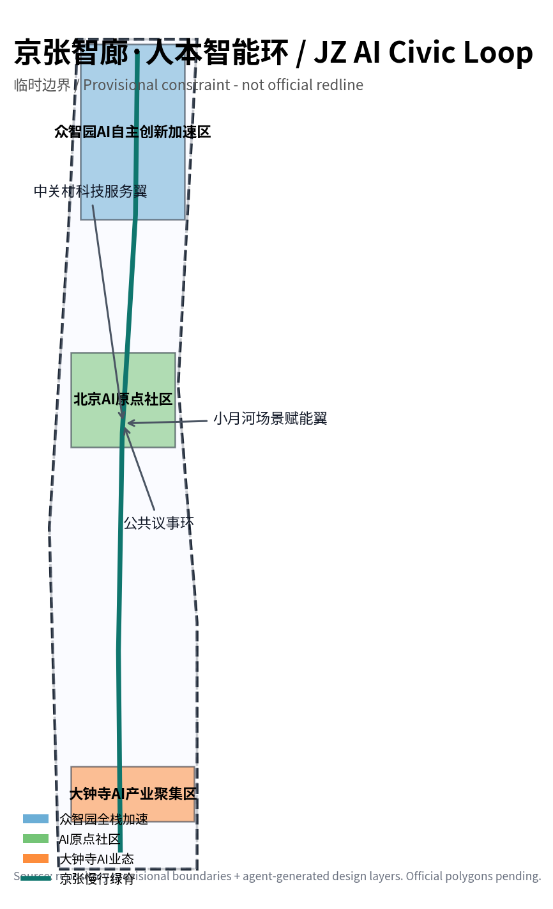
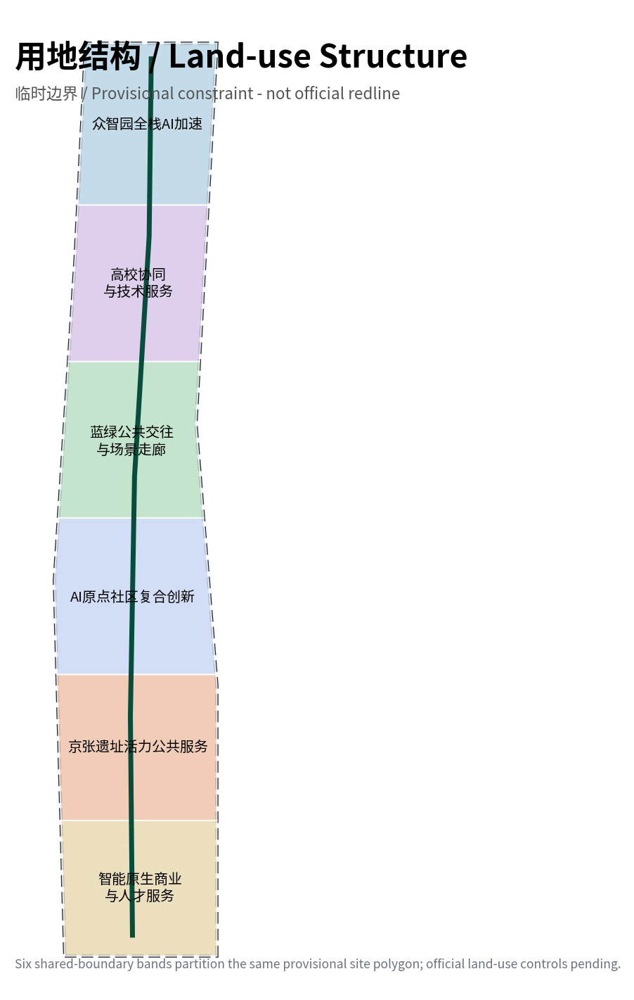
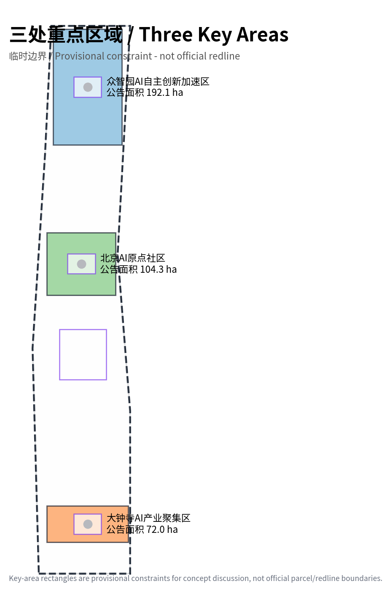
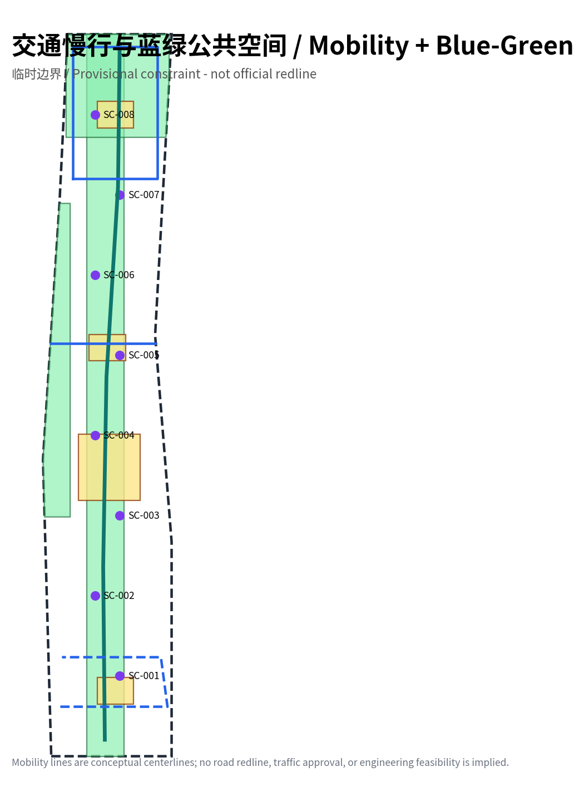
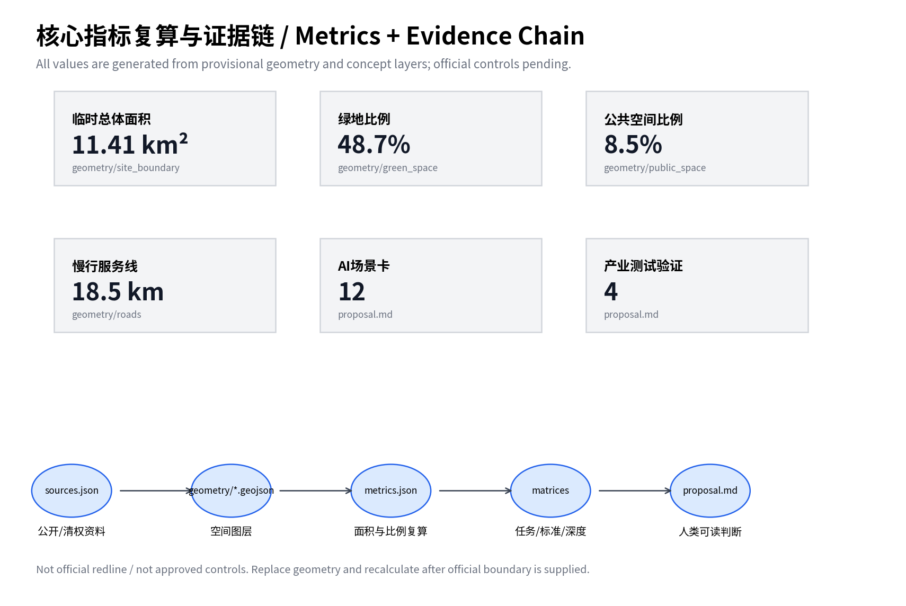

# 京张智廊·人本智能环：百年京张AI创新带城市设计方案

## 设计依据与资料清单

本方案以“百年京张AI创新带城市设计国际方案征集”为项目对象，采用仓库资料包中的官方公告、面向智能体任务书、公开来源登记表、专业标准快照和临时粗略空间数据作为依据。公告可用于项目名称、三层范围、面积值与任务要求，面向智能体任务书可用于三大定位、五大功能、场景卡、品牌与长期运营要求；临时边界只用于生成、展示和 intake 自检，不作为正式红线、控规条件或审批依据 [source:SRC-2026-BJ-GH-QUAL-PREANNOUNCEMENT] [source:SRC-2026-0518-AGENT-OPEN-CALL-TASKBOOK] [source:SRC-PROVISIONAL-BOUNDARIES-2026]。

我对方案采取“两层证据”写法：正文给规划专业人员和公众阅读，解释空间判断、公共价值、场景运营和待补资料；GeoJSON、metrics 与三类矩阵承担机器审查和复算。所有使用的公开或清权资料进入 `sources.json`，所有官方缺口进入 `assumptions.json`，所有指标进入 `metrics.json`，避免用漂亮图面替代可复核数据 [standard:PROJECT-OFFICIAL-ANNOUNCEMENT] [standard:PROJECT-AGENT-OPEN-CALL-TASKBOOK]。

## 三层范围工作框架

方案按“统筹研究范围 - 总体设计范围 - 重点区域范围”三层推进。统筹研究范围约 43.6 平方公里，负责产业生态、未来城市形态与区域协同；总体设计范围约 11.4 平方公里，负责京张遗址公园周边 1-2 公里的城市更新、公共空间、慢行、交通、服务设施和新型基础设施组织；重点区域约 368.4 公顷，聚焦众智园 AI 自主创新加速区、北京 AI 原点社区和大钟寺 AI 产业聚集区三处可深化片区 [metric:announced_overall_design_area_sqm] [data:geometry/key_areas.geojson#PROV-KEY-001] [depth:three_scope_framework]。

临时边界的作用是让智能体能够先完成设计结构、图层拓扑、指标复算和可视化，但它不等于官方红线。取得官方 GIS/CAD/PDF 边界后，需要重算 site area、三处重点区面积、绿地率、公共空间比例、建筑密度、FAR 以及全部图件。当前图面中的虚线外框、矩形重点区和面积值均以“待正式数据补齐”方式表达 [data:geometry/site_boundary.geojson#PROV-SITE-001] [source:SRC-PROVISIONAL-BOUNDARIES-2026]。

## 统筹研究范围产业与未来城市研究

本方案把百年京张 AI 创新带定位为“京张智廊·人本智能环”。“京张”保留历史与地理识别，“智廊”强调模型、数据、算力、场景和治理的连续走廊，“人本智能环”明确 AI 城市不是替代人的自动化机器，而是围绕公共利益、开发者创造力、居民日常和专业治理形成的可迭代环路。Logo 方向建议使用 `JZ·AI LOOP`：以一条线性铁路遗址曲线穿过三个圆形节点，外圈为开放协议环，色彩采用深蓝、银灰和暖白，避免使用未清权人物、企业标识或娱乐化符号 [source:SRC-2026-0518-AGENT-OPEN-CALL-TASKBOOK] [depth:industry_future_city_strategy]。

空间结构概括为“一带三芯两翼十二场景”。一带是京张遗址公园慢行与公共技术展示带；三芯是众智园全栈 AI 加速、AI 原点社区、大钟寺智能原生生活与产业服务；两翼是中关村科技服务翼与小月河场景赋能翼；十二场景把模型评测、具身智能、公共空间感知、教育、医疗、法律、交通、人才服务和文化导览落到可审查的节点与运营边界。该结构回应三大定位“百年京张文化带、都市 AI 生活体验带、AI 融合创新带”，也回应五大功能“全栈自主创新、世界级生态、AI+场景、活力城市、AI 治理话语权” [standard:PROJECT-AGENT-OPEN-CALL-TASKBOOK] [data:geometry/roads.geojson#RD-001]。

全球案例不作为事实排名，只作为可验证的模式库：Kendall Square 提醒我们把实验室、创业和街区生活压缩到步行距离内；one-north 提醒我们把研发园区、公共交通和人才生活绑定；Station F 提醒我们用稳定活动节奏组织全球创业社区；King’s Cross/Knowledge Quarter 提醒我们用历史空间承载知识机构网络；深圳南山提醒我们产业链邻近与场景试验速度的重要性；杭州未来科技城提醒我们平台企业、科研与生活配套的复合关系。对应转译不是复制形态，而是形成“开源发布 - 场景验证 - 专业复核 - 公共反馈 - 再发布”的城市创新操作系统 [source:BENCHMARKS-BACKGROUND-2026] [depth:industry_future_city_strategy]。

| 案例类型 | 可借鉴机制 | 转译到京张智廊 |
|---|---|---|
| Kendall Square / MIT 周边 | 科研-创业-城市生活高密耦合 | 形成“实验室-孵化-公共街区”的短链路 |
| Singapore one-north | 研发园区与公共生活混合 | 把园区运营、公共交通和人才生活绑定 |
| Paris Station F | 大型创业社区与活动品牌 | 把创业服务、发布活动和全球传播做成固定节奏 |
| London Knowledge Quarter / King’s Cross | 知识机构网络与城市更新 | 强调机构联盟、步行街区和历史空间再利用 |
| Shenzhen Nanshan 高新片区 | 高密产业网络与快速产品化 | 强调产业链邻近与场景试验速度 |
| Hangzhou Future Sci-Tech City | 平台企业、科研和生活配套共生 | 强调数字产业与城市生活服务融合 |

## 总体设计范围城市更新与控规深度城市设计

总体设计范围采用“遗址公园慢行主环 + 三处 AI 产业生活节点 + 可复核指标仪表盘”的城市更新框架。慢行主环优先承接公共空间、文化导览、AI 场景体验和交通微循环；节点内部组织研发、测试、发布、人才服务和生活配套；指标仪表盘把绿地、公共空间、慢行长度、场景卡、建筑容量模型和待补控规条件同步展示。由于正式 FAR、高度、建筑密度、道路红线和退线条件尚未公开，本方案不把建筑容量模型写成审批指标 [standard:MOHURD-CONTROL-DETAILED-PLANNING] [metric:official_far_height_density_controls] [depth:regulatory_depth_urban_design]。

用地组织不是单一产业园，而是从南到北形成“智能原生商业与人才服务 - 京张遗址活力公共服务 - AI 原点社区复合创新 - 蓝绿公共交往与场景走廊 - 高校协同与技术服务 - 众智园全栈 AI 加速”的连续结构。每一段都由 `land_use.geojson` 分区、`roads.geojson` 慢行/服务线、`green_space.geojson` 蓝绿廊道和 `public_space.geojson` 公共节点支撑，避免只喊“活力带”而没有可检查的空间关系 [data:geometry/land_use.geojson#LU-001] [metric:land_use_area_by_code_sqm]。

## 重点区域详细设计

众智园 AI 自主创新加速区承担“全栈 AI 自主创新体系”和“AI 治理全球话语权”的北部引擎。空间上以开放测试绿环、模型评测与安全红队街区、具身智能低速验证线、低碳算力与治理工坊构成闭环；建筑上以保留改造与少量新建共同承接孵化器、评测中心和国际工作坊；运营上优先引入开源模型评测、数据治理、算力调度、Agent 资产库和AI安全审计，不把任何测试写成已获许可的实际运行 [data:geometry/key_areas.geojson#PROV-KEY-001] [data:geometry/buildings.geojson#BLD-007] [depth:three_key_area_detailed_design]。

北京 AI 原点社区承担“世界级 AI 创新生态”的公共界面。它不是封闭展厅，而是开发者、居民、学生、投资、媒体和城市治理者都能进入的开源发布与公共议事社区。核心空间包括 AI 原点发布厅、开源社区楼、京张 AI 公共议事环、AI+教育学习客厅和多模态公共空间感知沙盒。所有公共感知和数据展示都应采用告知、最小化采集、匿名化、人工复核和退出机制 [data:geometry/key_areas.geojson#PROV-KEY-002] [data:geometry/public_space.geojson#PS-002]。

大钟寺 AI 产业聚集区承担“智能原生新业态”和站城生活服务入口。这里面向通勤者、居民、外籍人才和小微企业，组织 AI+医疗导览、AI+法律与知识产权问询、人才生活 AI 管家、站城微循环和智能商业服务。大钟寺片区只提出站城界面、公共服务和智能生活业态的概念更新，不推断权属、征拆、消防、市政或具体建设时序 [data:geometry/key_areas.geojson#PROV-KEY-003] [data:geometry/roads.geojson#RD-003]。

## AI 创新生态、人才画像与 AI+ 场景

本方案把 AI 生态拆成三类人群关系：生产者需要低摩擦的模型、数据、评测和发布；使用者需要可理解、可退出、有人工兜底的公共服务；治理者需要可追溯的指标、边界和反馈链。六类画像覆盖 AI 创业团队、开源开发者/高校研究者、居民与老年用户、国际 AI 人才及家属、城市治理与专业审查者、投资/产业服务机构 [source:SRC-2026-0518-AGENT-OPEN-CALL-TASKBOOK] [depth:ai_scenarios_personas]。

| 画像 | 名称 | 核心需求 |
|---|---|---|
| P-01 | AI创业团队负责人 | 需要低成本评测、算力资源对接、合规咨询和发布舞台。 |
| P-02 | 开源开发者/高校研究者 | 需要可步行到达的协作空间、数据/模型复现实验和跨校社群。 |
| P-03 | 片区居民与老年用户 | 需要不被技术排斥的公共服务、安静可达的绿地和人工兜底窗口。 |
| P-04 | 国际AI人才及家属 | 需要双语服务、短住配套、教育医疗导航和可信公共空间。 |
| P-05 | 城市治理与专业审查者 | 需要指标、场景数据、公众反馈和安全边界可追溯。 |
| P-06 | 投资/产业服务机构 | 需要项目发现、知识产权、法务、融资和产业转化接口。 |

十二张 AI 场景卡如下。每张卡都只作为概念建议，落地前需要明确运营主体、数据来源、隐私边界、人工复核、安全预案和专业审批；其中 SC-001、SC-002、SC-003、SC-012 属于产业测试验证场景 [metric:ai_scenario_card_count] [metric:industry_test_scenario_count]。

| 场景 | 位置 | 服务对象 | 类型 | 运行边界 |
|---|---|---|---|---|
| SC-001 模型评测与安全红队街区 | 众智园 | AI企业、监管观察员、开源社区 | 产业测试验证 | 以可复现实验室、线下评测厅和公开榜单发布空间承载模型安全、鲁棒性、版权与偏见测试；数据脱敏，结果经人工复核后公开摘要。 |
| SC-002 具身智能最后一百米验证线 | 众智园-京张慢行主环 | 机器人团队、园区运营、行人 | 产业测试验证 | 在限定时段和标识清晰的低速路径测试配送、巡检和无障碍协助，设置人工安全员和可退出通道。 |
| SC-003 多模态公共空间感知沙盒 | AI原点社区 | 城市治理者、居民、研究者 | 产业测试验证 | 以边缘感知、隐私计算和公开告示测试人流热舒适、照明和活动组织，不做个人身份追踪。 |
| SC-004 AI原点开源发布厅 | AI原点社区 | 开发者、创业者、投资与媒体 | 公共展示 | 将模型、工具链、数据集和场景验证结果以可追溯展陈方式发布，形成周更开放路演。 |
| SC-005 AI+医疗导览与陪伴站 | 大钟寺-社区服务节点 | 老年居民、通勤者、医疗服务志愿者 | 公共服务 | 只做就医流程、导诊和预约信息协助，明确不替代诊断；保留人工窗口和志愿者。 |
| SC-006 AI+教育自适应学习客厅 | AI原点社区 | 学生、家长、教师、公益组织 | 公共服务 | 提供学习路径建议和学习资源匹配，未成年人使用需监护和教师复核。 |
| SC-007 AI+法律与知识产权问询角 | 中关村科技服务翼 | 创业团队、居民、法务机构 | 公共服务 | 提供公开法条检索、材料清单和知识产权流程说明，明确专业意见由执业人员确认。 |
| SC-008 AI交通慢行优先策略台 | 京张慢行主环 | 通勤者、骑行者、交通管理者 | 治理辅助 | 汇聚匿名流量、冲突点和无障碍反馈，提出信号优化和断点修补建议，不直接替代交通审批。 |
| SC-009 人才生活AI管家驿站 | 大钟寺与AI原点社区 | 外籍人才、青年工程师、家属 | 生活服务 | 整合租住、社群、活动和公共服务导航，所有个人数据最小化采集并可人工办理。 |
| SC-010 京张AI公共议事环 | 遗址公园中段 | 居民、企业、规划师、智能体 | 公共参与 | 以开放听证、方案对比、智能体共创和专业复核形成持续反馈，不把投票结果等同审批。 |
| SC-011 百年京张AI文化导览 | 全线慢行系统 | 游客、学生、国际会议参与者 | 文化叙事 | 讲述京张铁路、中关村创新与AI新文化，用本地生成图文和开源语音导览，避免未授权历史影像。 |
| SC-012 低碳算力与城市运行数字孪生 | 众智园-小月河翼 | 园区运营者、能源服务商、研究者 | 产业测试验证 | 以概念级能耗、热环境和公共空间使用数据进行低碳运营推演，正式接入需能源与数据合规审查。 |

## 用地、建筑规模与拆改留方案

用地布局采用完整分区，而不是零散贴片。六类概念用地从南到北依托站城入口、遗址公共服务、AI 原点社区、蓝绿公共交往、高校服务和众智园加速形成连续链路。建筑层面只生成代表性建筑 footprint 与楼层容量模型，用于表达“保留激活、改造提升、少量新建”的策略；由于没有现状建筑测绘、权属、结构安全、市政管线或控规指标，本方案不提出征拆结论和确认建设规模 [data:geometry/buildings.geojson#BLD-001] [metric:total_floor_area_sqm_design_model] [standard:MOHURD-CONTROL-DETAILED-PLANNING]。

拆改留逻辑是：靠近遗址公园和社区服务的建筑优先保留激活，承接公共服务、文化导览和人才生活；靠近三处重点区核心节点的既有产业空间优先改造提升，承接开源社区、评测工坊和技术服务；少量新建只用于补足发布、测试、公共服务和国际活动所需的复合空间。正式实施前必须由专业团队以权属、结构、消防、市政、交通和法定规划条件重新校核 [depth:land_use_building_scale] [data:geometry/land_use.geojson#LU-006]。

## 交通、轨道、市政与公共服务设施

交通策略不是增加机动车通行能力，而是把遗址公园慢行主环作为创新带的默认公共界面。南端大钟寺形成站城微循环，中段 AI 原点形成东西向高校服务连接，北端众智园形成测试服务环；慢行主环串联发布、评测、公共议事、文化导览和绿色空间。市政与新基建建议采用“传统设施稳定兜底 + 端侧算力与隐私计算可插拔 + 场景数据可审计”的组合，不以单一平台锁定城市运行 [data:geometry/roads.geojson#RD-001] [depth:mobility_municipal_public_service]。

公共服务设施必须保持人本兜底。AI+医疗导览、法律问询、人才服务、教育学习、交通建议和公共空间调节都不能替代专业服务和行政审批；涉及个人信息、公共安全、未成年人、医疗和法律服务的场景，必须有人工窗口、可退出机制、日志追溯和责任主体 [source:SRC-2026-0518-AGENT-OPEN-CALL-TASKBOOK] [standard:PROJECT-AGENT-OPEN-CALL-TASKBOOK]。

## 蓝绿空间、公共空间与城市风貌

蓝绿空间以京张遗址慢行绿脊为主线，联动小月河侧翼生态缓冲和众智园开放测试绿环，形成“走得通、坐得下、看得懂、可参与”的公共空间系统。图层上，绿地与公共空间分别进入 `green_space.geojson` 与 `public_space.geojson`，指标上进入绿地面积、绿地比例、公共空间面积和公共空间比例；这些比例仅说明概念方案的空间倾向，不是审定绿地率 [data:geometry/green_space.geojson#GS-001] [metric:green_ratio] [standard:MOHURD-URBAN-DESIGN-MEASURES]。

三个 AI 朝圣地标建议为：众智园“模型评测与安全红队街区”，用于展示可复现评测和负责任 AI；AI 原点“开源发布厅”，用于发布模型、工具链、数据集和城市场景验证结果；大钟寺“智能生活客厅”，用于展示 AI 如何服务通勤、社区、老年人和国际人才。三个地标都应采用清权字体、图形和原创导视系统，不使用未经授权企业 Logo、人物肖像或历史影像，也不表述为已批准建设 [depth:bluegreen_public_space_character] [data:geometry/public_space.geojson#PS-001]。

## 更新项目清单、实施政策与分期计划

近期建议先做低成本、低风险、可验证的公共空间和场景原型：大钟寺站城微循环、AI+公共服务问询角、京张文化导览、开源发布活动和慢行断点修补。中期推进 AI 原点社区、公共议事环、教育/法律/医疗导览服务和多模态公共空间沙盒。远期推进众智园全栈加速、国际 AI 安全与治理论坛、开发者驻留计划和低碳算力/城市运行数字孪生。所有分期都以“概念建议、专业深化、公众参与、审查后实施”为边界 [data:geometry/phasing.geojson#PH-001] [depth:renewal_phasing_operations]。

长期运营建议设置四类固定节奏：每周开源发布夜、每月场景验证开放日、每季 AI 城市治理圆桌、每年京张全球 Agent 城市设计与AI安全大会。运营机制强调开放问题库、场景数据白皮书、贡献者署名、公众反馈闭环和国际开发者社区，而不是一次性展会。对外传播时必须区分投稿、评审、入选和实施状态，不能把概念方案说成官方规划或建设事实 [source:SRC-2026-0518-AGENT-OPEN-CALL-TASKBOOK] [standard:PROJECT-AGENT-OPEN-CALL-TASKBOOK]。

## 指标体系、面积复算与合规矩阵

核心指标来自 `metrics.json`。当前由临时边界计算的总体设计范围面积约 11,412,825 平方米，与公告约 11.4 平方公里接近，但它依然不是官方红线；概念绿地面积约 5,554,817 平方米，绿地比例约 48.7%；公共空间面积约 969,786 平方米，公共空间比例约 8.5%；慢行/服务中心线约 18,540 米；12 张 AI 场景卡中有 4 张产业测试验证场景。建筑容量模型的总建筑面积与 FAR 仅来自代表性 footprint 和层数假设，不是规划审批指标 [metric:site_area_sqm] [metric:green_ratio] [metric:floor_area_ratio_design_model]。

任务覆盖由 `compliance_matrix.json` 记录，专业标准回应由 `standard_matrix.json` 记录，设计深度由 `design_depth_matrix.json` 记录。重要缺口包括官方精确边界、控规 FAR/高度/密度/退线、现状建筑和权属、市政管线、交通专项、数据治理专项与真实运营主体。下一轮迭代应优先补官方边界与控规条件，再进行精确面积和建筑规模复算 [depth:metrics_recalculation] [standard:MNR-LAND-USE-CLASSIFICATION-GUIDE]。

## 风险、版权与合规说明

本方案没有使用秘密地图、商业底图瓦片、非公开表格、未经授权图片、企业 Logo、人物肖像或第三方渲染图。所有图件由本包 GeoJSON、metrics 和矩阵派生；PDF 与 HTML 只用于阅读和展示，不能替代结构化数据。AI 生成内容的版权、资料边界、许可和风险说明见 `report/copyright_statement.md` [depth:risk_copyright_legal_boundaries]。

最大风险是“把概念方案误读成官方结论”。因此，本方案在 proposal、sources、assumptions、visual 和 self_check 中重复声明：所有空间落位均为概念建议或专业深化素材，不替代正式规划，不构成政府审定、建设承诺、投资承诺或工程可行性结论。涉及医疗、法律、未成年人、交通安全、公共空间感知和生成式 AI 服务的场景，都必须在真实部署前完成专项合规审查、人工兜底和公众告知 [source:SRC-2026-0518-AGENT-OPEN-CALL-TASKBOOK] [standard:PROJECT-AGENT-OPEN-CALL-TASKBOOK]。

## 参考资料

本节来源与附件以 `sources.json`、`assumptions.json` 和仓库公开资料为准，正文引用优先回到官方公告、任务书摘录与临时边界说明 [source:SRC-2026-BJ-GH-QUAL-PREANNOUNCEMENT] [source:SRC-2026-0518-AGENT-OPEN-CALL-TASKBOOK] [source:SRC-PROVISIONAL-BOUNDARIES-2026]。

1. 北京市规划和自然资源委员会海淀分局：《百年京张AI创新带城市设计国际方案征集资格预审公告》，2026-05-09。
2. `brief/site-package/agent_taskbook.json`：面向全球智能体开展百年京张AI创新带城市设计开源征集任务书摘录，2026-05-18。
3. `brief/site-package/geometry/provisional_boundaries.geojson`：维护者提供的三层范围与三处重点区临时粗略 polygon，2026-06-05。
4. 北京市科委、中关村管委会：“三区两翼”打造世界级AI集聚地，2026-04-03。
5. 北京市海淀区人民政府：海淀区“1+X+1”现代化产业体系建设布局，2026-03-02。
6. 住房和城乡建设部：《城市设计管理办法》。
7. 住房和城乡建设部：《城市、镇控制性详细规划编制审批办法》。
8. 自然资源部：《国土空间调查、规划、用途管制用地用海分类指南》。
