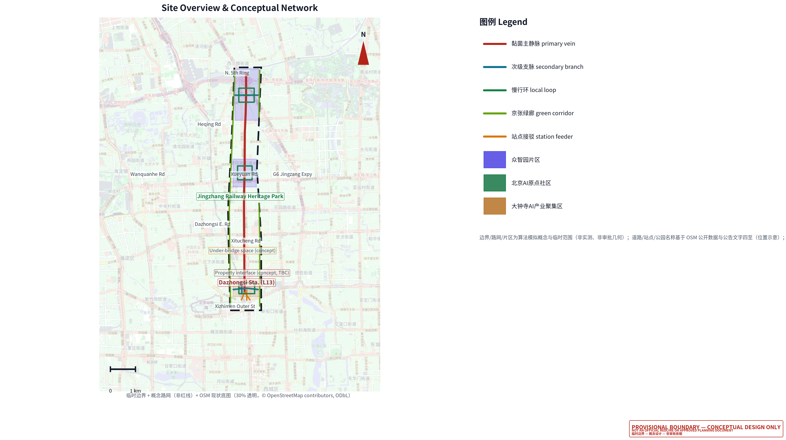
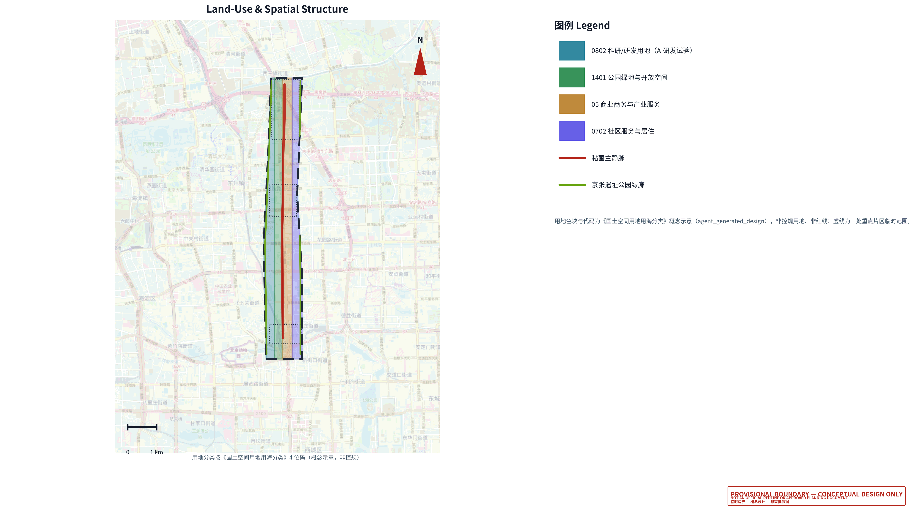
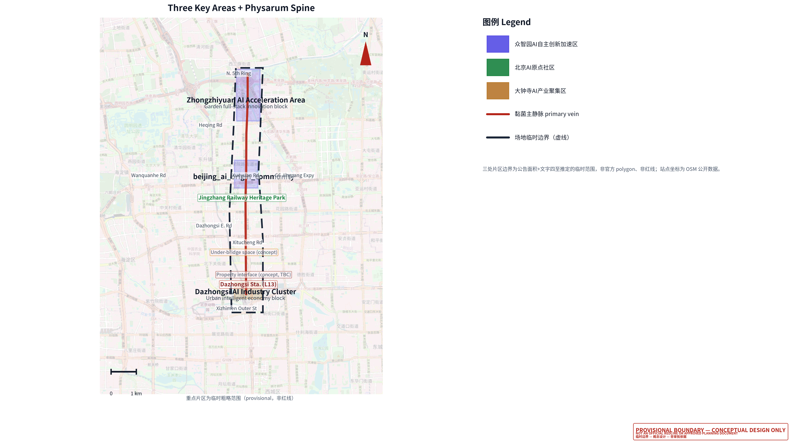
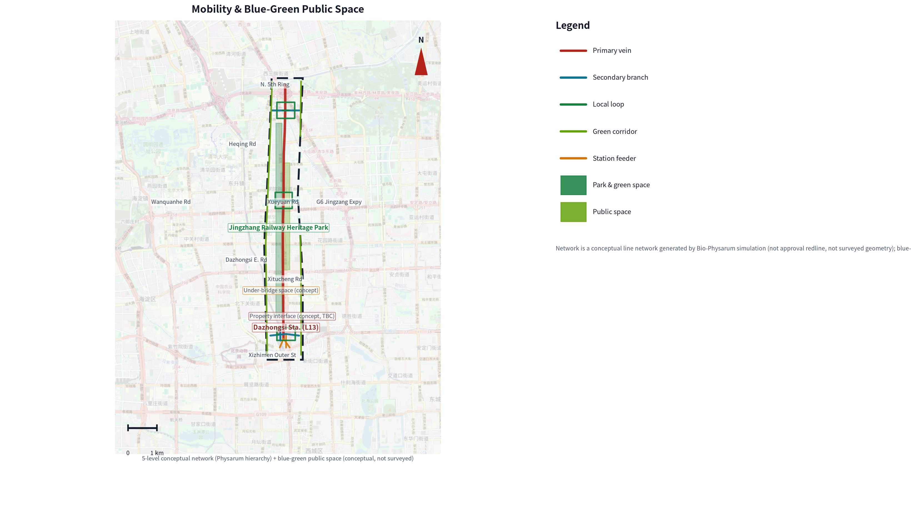
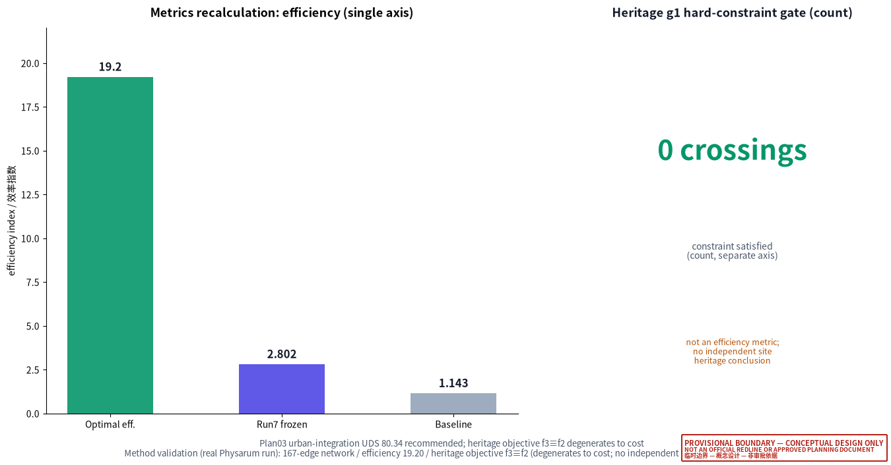
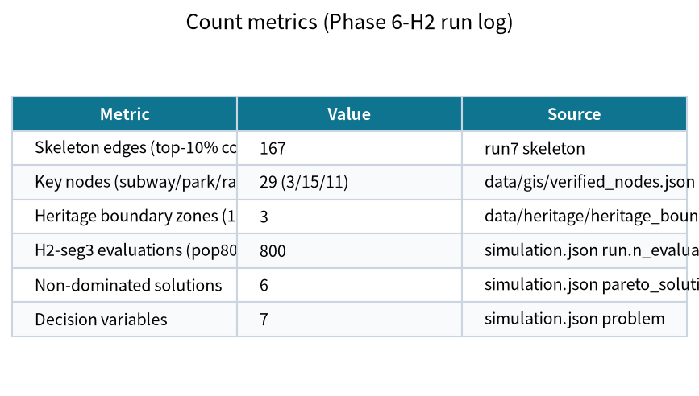

# Bio-Physarum Mobility Network Renewal for the Dazhongsi AI Industry Cluster

## Design Basis and Source List

This formal proposal takes the official pre-qualification announcement for the Centennial Jing-Zhang AI Innovation Belt urban design international competition, issued by the Haidian Branch of the Beijing Municipal Commission of Planning and Natural Resources, as its first basis, and the maintainer-registered provisional rough boundary, key areas, enums, metrics, and source list under `brief/site-package/` as its machine-readable basis. Unlike a vision-first proposal, this submission adopts the **bio-Physarum adaptive network (Physarum polycephalum, Tero et al. 2010)** and **NSGA-II multi-objective evolutionary optimization** as the core method, translating the natural principle of "growing an efficient, robust, low-crossing network from anchors" into a road-network renewal strategy [source:AGENT-TASKBOOK] [depth:existing_conditions_diagnosis].

The primary method references and their relationships are as follows: the physical method draws on the Physarum adaptive-network paper and reviews, the optimization method draws on standard multi-objective evolutionary algorithm implementations, and the design judgment returns to the announcement, the agent taskbook, the enums, and the scope list under `brief/site-package/`; source completeness is stored in `sources.json` and not repeated as machine indices in prose [source:SITE-PACKAGE] [source:SOURCE-REGISTRY].

The usage boundary of the source register is as follows [source:SOURCE-REGISTRY]:

- `brief/site-package/design_brief.json`, `allowed_design_space.json`, `enums/`, and `ranges/` provide the allowed design space and enums.
- `data/processed/agent_fact_pack.md` is a reading-navigation layer for this proposal, not a new authority source [source:PROCESSED-FACT-PACK].
- `data/processed/project_scope_summary.csv`, `agent_task_requirements.csv`, and `missing_data_checklist.csv` establish the task, scope, source-use, and gap lists.



**Honest statement on boundary and coordinates (method-first)**. The formal geometry layers (`geometry/*.geojson`) of this submission use the provisional boundary from `brief/site-package/geometry/provisional_boundaries.geojson` and generate a **conceptual network** (`agent_generated_design`) within it. The real Physarum + NSGA-II network the author previously produced (167 edges, optimal efficiency 19.20, heritage objective f3≡f2) lies roughly 2–3 km to the west and overlaps the provisional site boundary by only about 140 m; a direct clip would discard roughly 95% of the real network. To avoid coordinate translation or fabrication, this proposal adopts a **method-first** approach: the real Physarum result enters the figures, `sources.json`, and prose as **method-validation evidence**, not as formal geometry, not as a redline, and not as approval basis [data:geometry/site_boundary.geojson#SITE-001] [metric:site_area_sqm].

The scorable state of this submission is: **provisional boundary, retaining a precision caveat and awaiting recalculation after official data is published; this does not block content scoring**. All spatial structures, scenarios, projects, and metrics are written on a "discussable, reviewable, and recalibratable after official boundary replacement" basis.

## Methodology Innovation (Honest Account)

The methodological contribution is not "inventing a new algorithm" but **combining two established methods and translating them into a road-network renewal strategy**, backed throughout by the author's real local runs and making no claim beyond what the data supports [depth:existing_conditions_diagnosis].

**Innovations (real)**: (1) **bio-algorithmic translation** — the Physarum principle of "growing an efficient, resilient, low-redundancy network from nutrient anchors (park/subway/railway)" via chemotaxis–adaptation–flow-decay is translated into seven decision variables (`alpha` chemotactic reinforcement, `beta` flow decay, `chemo_park`/`chemo_subway`/`chemo_railway` attraction weights, `chemo_radius` attraction radius, `decay_responsiveness` decay exponent); (2) **decay-response exponent k** — an exponent k is introduced on the frozen decay formula (k=1 reduces exactly to the frozen form), making the "fast decay of low-flow edges" response tunable, an interpretable mechanism extension; (3) **boundary adaptivity** — the H1 boundary check found `alpha` crossed the original upper bound 2.0 and `chemo_radius` crossed 60, so the search domain was extended to [0.5, 3.0]×[15, 100] to avoid truncating the optimum at the boundary; (4) **four-objective trade-off + scenario selection** — NSGA-II yields the four-objective Pareto front (f1 efficiency / f2 cost / f3 heritage / f4 coverage), then scenarios A/B/C/D are chosen by "efficiency-first / cost-first / coverage-first / balanced".

**Honest account of the heritage objective f3 (corrected)**: this proposal does **not** claim that "the Physarum spontaneously avoids the heritage boundary". The facts are: the local `data/heritage/heritage_boundary.geojson` is a **manually-digitized** boundary (`data_credibility=MODEL`, `trust_level=B`, `geometry_origin=manual_digitization`), whose legal basis is the official four-side text (京政发〔1984〕128号 / Beijing Municipal Cultural Heritage Bureau 2018-01-02 announcement) — **not official redline geometry** (the digitization log explicitly marks the "protection-scope map" and "planning redline drawing" as **not obtained**). It assigns zones: `protection_scope` (blocked, hard constraint g1), `class_I_control` (soft penalty 1.5), `class_IV_control` (soft penalty 3.0). In the H2-seg3 optimal skeleton, no skeleton edge falls inside the class_I/class_IV penalty zones (all `heritage_factor` are 1.0), so f3 numerically equals f2 (f3≡f2). The "zero heritage crossings" therefore reflects only the g1 hard-constraint `protection_scope` crossing count of 0, and **does not constitute an independent in-site heritage-protection compliance conclusion**; moreover this manual boundary carries a CRS-reprojection caveat, so a formal conclusion requires the official protection-scope map and planning redline [metric:physarum_heritage_crossing_count].

**Off-site nature of the method validation**: the real Physarum + NSGA-II run lies ~2–3 km west of the provisional boundary (~140 m overlap), so it enters figures, `sources.json`, `metrics.json`, and prose entirely as **method-validation evidence**, not as formal geometry, not as a redline, and not as approval basis; the methodological innovation must be re-verified with real site-coordinate alignment once official data arrives.

## Three-Level Scope Framework

The proposal is organized along the three levels defined by the announcement: the coordinated research area addresses the 43.6 km² AI industry ecosystem, strategic positioning, innovation chain, and future urban form; the overall design area addresses the roughly 11.4 km² urban area and industry district 1–2 km around the Jing-Zhang heritage park, requiring an urban renewal framework, industrial spatial layout, transport-municipal support, and urban character control; the key-area scope addresses the 368.4-hectare three detailed-design areas, requiring functional program, building scale, retain-renovate-demolish classification, public-space connectivity, and transport organization. The three levels are mapped item-by-item in `compliance_matrix.json` [depth:three_level_scope_framework] [depth:overall_spatial_structure].

The depth items of the three-level framework are constrained by [depth:three_level_scope_framework] and [depth:overall_spatial_structure], the spatial evidence is anchored to [data:geometry/site_boundary.geojson#SITE-001] and [data:geometry/key_areas.geojson#PROV-KEY-001], and the task basis is anchored to [standard:PROJECT-OFFICIAL-ANNOUNCEMENT].



The overall concept proposed here is the "**intelligent-vein symbiotic belt**": the Physarum adaptive-network method is the "growth algorithm", the Jing-Zhang heritage park is the historical and public-space spine, the three key areas (Zhongzhiyuan, Beijing AI Origin community, Dazhongsi) are the "nutrient anchors", and universities, enterprises, communities, and transit stations form the everyday network, producing a "one-belt three-core, multi-level network, blue-green slow composite ring" spatial organization. The "belt" is not a newly drawn redline but a translation of the announcement's three-level scope into a working method; the "three cores" correspond to the three key areas; the "multi-level network" corresponds to the Physarum primary-vein / branch / slow-loop / green-corridor hierarchy.

| Level | Design question | Proposal answer | Data landing |
| --- | --- | --- | --- |
| Coordinated research area | How to organize the AI ecosystem and future urban form | Build an "university-origination, open-source collaboration, enterprise conversion, public experience, international communication" innovation chain | compliance_matrix.json, standard_matrix.json |
| Overall design area | How to map industrial space, urban renewal, transport-municipal, and character | Land use, buildings, conceptual network, green space, public space, and phasing layers jointly express it | [data:geometry/land_use.geojson#LU-001], [data:geometry/roads.geojson#ROAD-001] |
| Key-area scope | How the three areas reach detailed-design depth | Propose positioning, spatial actions, AI scenarios, and implementation dependencies respectively | [data:geometry/key_areas.geojson#PROV-KEY-001], [data:geometry/key_areas.geojson#PROV-KEY-002], [data:geometry/key_areas.geojson#PROV-KEY-003] |

## Brand Identity: 智脉共生 (Bio-Pulse Symbiosis)

The brand is named "**智脉共生**" (English **Bio-Pulse Symbiosis**), a **conceptual proposal (suggestive framework)** translating the proposal's method and vision; it does not replace any existing place name, trademark, or public mark, and will be finalized only after official data and operational authorization are confirmed. The three name layers map one-to-one onto the method and vision [depth:overall_spatial_structure]:

- **智 (Zhi / Bio-Pulse)**: the Jing-Zhang AI innovation belt and AI industry, and the "bio-pulse" growth mechanism of the Physarum adaptive network.
- **脉 (Mài / vein)**: the road-network hierarchy translated from the Physarum network — primary vein, branch, slow loop, and green corridor.
- **共生 (Symbiosis)**: the coordination of blue-green, slow travel, industry, and community within road-network renewal, not a single traffic engineering act.

The brand visual is drawn from the author's real Physarum run skeleton (167 edges, method validation only, ~2–3 km west of the provisional boundary) without introducing unauthorized place names, logos, or commercial marks; the figures are `assets/figures/brand_identity.png` (Chinese) and `assets/figures/brand_identity.en.png` (English) [metric:physarum_network_edge_count].

**Brand palette (actual values, consistent with generated figures; conceptual suggestion)**. Primary/accent red `#b42318` (RGB 180/35/24, approx CMYK 0/81/87/29); secondary/tech teal `#0f7490` (RGB 15/116/144, approx CMYK 89/46/30/5); eco green `#15803d` (RGB 21/128/61, approx CMYK 84/33/86/10); body ink `#111827`; muted text `#475569`; page background `#f8fafc`. CMYK values are approximate and need print calibration; this palette is a conceptual suggestion, not an existing brand standard.

**Typography (conceptual suggestion)**. Headings and body use Noto Sans SC (Source Han Sans, OFL license; the HTML embeds a subset with no remote font dependency); numerals and code use monospace or Latin sans-serif; the Chinese name 「智脉共生」is kept as-is and the English name "Bio-Pulse Symbiosis" is used consistently without paraphrase.

**Logo graphic (conceptual suggestion; SVG vector produced)**. The Physarum network as the base, overlaid with the Jing-Zhang railway track texture, colored in accent red + tech teal + eco green; the vector file is `assets/brand/logo.svg` (with the 「智脉共生」wordmark and the English name "Bio-Pulse Symbiosis", bilingual). The logo is a conceptual suggestion, not a registered trademark or public mark; the formal version requires rights clearance and authorization.

**Prohibited uses (conceptual suggestion)**. Do not juxtapose the brand name with unauthorized place names, corporate marks, or official institution names; do not imply official endorsement; do not use the brand graphic to fabricate precise redlines on an uncleared base map.


**Brand VI entity files (conceptual suggestion; produced)**. The brand palette card `assets/brand/vi_palette.png` (English `vi_palette.en.png`) and the brand-application mockups `assets/brand/vi_applications.png` (English `vi_applications.en.png`, covering business-card / letterhead / signage conceptual applications) are provided with the submission; all are conceptual suggestions, and the formal versions require rights clearance and authorization.

## Global Benchmark Cases (Public Information)

The proposal distills transferable lessons from five publicly reported global smart/resilient city practices as **design references (suggestive framework)**, without copying their quantitative indicators; case facts follow official public sources, with uncertain details marked "to be confirmed" [depth:overall_spatial_structure].

| Case | Location | Core practice (public reporting) | Transfer to this proposal | Limitation / caution |
| --- | --- | --- | --- | --- |
| Sidewalk Labs Quayside | Toronto, Canada | Sensor network, adaptive building, data-trust governance pilot (launched 2017, cancelled 2020) | An "explainable, revocable" data-governance commitment mechanism | Privacy and public-trust shortfalls ended the project — a caution to front-load data boundaries |
| Masdar City | Abu Dhabi, UAE | Low-emission block, passive cooling, early personal-rapid-transit (PRT) pilot | Integration of low-carbon block and new feeder mobility | Some zero-carbon targets were later adjusted; green goals must balance fiscal reality |
| Songdo IBD | Incheon, South Korea | Reclaimed-land new town, U-City pervasive sensing, central pneumatic waste collection | Integrated reservation of new infrastructure and urban sensing | Top-down new town lacks organic growth — a caution to retain renewal flexibility |
| Amsterdam Smart City | Amsterdam, Netherlands | Public-private-citizen collaboration, living-lab pilots on energy/water/mobility | Incremental renewal and multi-party governance mechanism | Depends on sustained operational investment; responsibility boundaries must be clear |
| Xiong'an New Area | Hebei, China | Digital city planned in sync with physical city (CIM digital twin), blue-green network, underground utility tunnels, green mobility | A digital-twin base, blue-green and slow-travel priority in the Chinese context | Different scale and policy context; this proposal is renewal, not a new town |

Quantitative indicators (area, investment, coverage) for the above cases follow official public sources and are not restated here to avoid misquotation; the citations are registered in `sources.json` as "public material" with a "to-be-verified" note. Cases are used for method comparison, not direct replication, and do not constitute an implementation commitment for this site.

## Coordinated Research Area: Industry and Future City Research

The core task of the coordinated research area is to build a world-class AI innovation ecosystem. The proposal surveys Haidian's universities and institutes, leading enterprises, computing/algorithm/data-element resources, incubation platforms, listed companies, unicorns, and sci-tech services, and proposes a spatial coordination framework across the AI innovation chain, industry chain, talent chain, and urban service chain. The agent open-call taskbook also requires responding to the "five functions" and "three-district two-wing" coordination; this section uses [source:AGENT-TASKBOOK] and [standard:PROJECT-AGENT-OPEN-CALL-TASKBOOK] to mark that these requirements come from the agent open-call, not statutory planning control.

The differentiating value of this proposal is treating "network self-organization" as a computable urban-design method: the Physarum network's minimum-cost, multi-source shortest-path, and fault-tolerant redundancy properties map onto the efficiency, connectivity, and robustness objectives of road-network renewal, while the four NSGA-II objectives (efficiency, connectivity redundancy, heritage impact, cost) map onto planning's multi-criteria trade-off [depth:overall_spatial_structure]. The coordinated research does not add pseudo-precise redlines; it ties back to [data:geometry/land_use.geojson#LU-001] through [standard:MOHURD-URBAN-DESIGN-MEASURES].

## Overall Design Area: Urban Renewal and Regulatory-Plan-Level Urban Design

The overall design area must reach regulatory-plan-level urban design depth. The proposal states an overall urban renewal spatial structure, low-efficiency space identification, a renewal project list, implementation policy recommendations, industrial functional ratios, a spatial organization model, and a comprehensive carrying-capacity assessment. `geometry/land_use.geojson` fully covers the design boundary without overlap, `geometry/buildings.geojson` expresses renewal or retained building footprints, `geometry/roads.geojson` expresses micro-circulation, slow traffic, and rail-interchange relations, and `metrics.json` recalculates core areas, ratios, and layer counts [depth:land_use_layout] [depth:development_intensity_controls].

This section uses [standard:MOHURD-CONTROL-DETAILED-PLANNING] to split regulatory-depth content into reviewable objects: [data:geometry/land_use.geojson#LU-001] expresses land-use structure, [data:geometry/buildings.geojson#BLDG-001] expresses building footprints, [data:geometry/roads.geojson#ROAD-001] expresses the conceptual primary vein, and [metric:building_footprint_area_sqm] is used to cross-check the footprint area.

The overall design must also support transport, rail, municipal, and supporting facilities. Where building height, development intensity, road redlines, setbacks, and facility standards lack official control conditions, they must be written as "pending formal regulatory-plan confirmation", never presenting agent-inferred values as approved indicators.

## Detailed Design of Key Areas

The detailed design of the three key areas must reference [data:geometry/key_areas.geojson#PROV-KEY-001], [data:geometry/key_areas.geojson#PROV-KEY-002], and [data:geometry/key_areas.geojson#PROV-KEY-003], and is checked by [depth:three_key_area_detailed_design].



| Key area | Design positioning | Spatial actions | AI industry & operation scenarios | Evidence reference |
| --- | --- | --- | --- | --- |
| Zhongzhiyuan AI autonomous innovation acceleration area | Garden full-stack autonomous innovation block | Strengthen the Qinghe interface, industry display, low-carbon innovation exchange, and external transport; the Physarum slow loop carries open testing and standards-governance display | Autonomous model testing, standards workshops, safety-governance display, low-carbon computing experience | [data:geometry/key_areas.geojson#PROV-KEY-001], [depth:three_key_area_detailed_design] |
| Beijing AI Origin community | Campus conversion and talent community | Organize campus-park-block slow stitching; the Physarum branch links outcome-release, talent-service, and open-source collaboration spaces | Open-source community, outcome release, talent-zone service, near-campus incubation | [data:geometry/key_areas.geojson#PROV-KEY-002], [source:AGENT-TASKBOOK] |
| Dazhongsi AI industry cluster | Urban intelligent-economy and international exchange block | Dazhongsi station integration, four-quadrant pedestrian connectivity, commercial services, and public-environment renewal around key enterprises | Agent and terminal display, content consumption, data elements, international roadshows | [data:geometry/key_areas.geojson#PROV-KEY-003], [metric:key_area_count] |

## AI Innovation Ecosystem, Personas, and AI+ Scenarios

The proposal builds a spatial-demand persona for AI talent and enterprises covering R&D office, open-source collaboration, outcome release, enterprise services, talent housing, social learning, consumption and living, sports and leisure, and international exchange. AI+ scenarios address transport, services, consumption, healthcare, education, legal, and life services; each scenario states its service target, spatial location, data source, privacy boundary, human-review mechanism, and operating entity [depth:traffic_rail_slow_parking].

| Persona | Typical need | Spatial response | Self-check boundary |
| --- | --- | --- | --- |
| Open-source developer | Release, collaboration, testing, community reputation | Origin-community open-source release hall, public code wall, night collaboration space | No personal trajectory collection; activity data aggregated only |
| Startup team | Low-cost office, computing entry, product testbed | Zhongzhiyuan shared testbed, edge-computing service point, standards-governance advisory | Computing and data services require separate authorization |
| Leading-enterprise visitor | Display, business, international reception, talent recruitment | Dazhongsi international roadshow lounge, station interchange, public space around key enterprises | Enterprise marks and cases must be cleared |
| Nearby resident | Commuting, leisure, community service, low-disturbance renewal | Jing-Zhang heritage park slow loop, embedded community service, graded night lighting and activities | No commercial recommendation from resident personas |
| University teacher/student | Technology conversion, cross-campus collaboration, daily slow travel | Campus-park slow stitching, conversion relay station, AI education experience point | Campus data and research results need authorization |

| Scenario card | Spatial carrier | Design note |
| --- | --- | --- |
| 01 Open-source release hall | Beijing AI Origin community | Outcome release, code contribution display, and small roadshow space for universities, open-source communities, and startups |
| 02 Safety-governance sandbox | Zhongzhiyuan | Translate standards-making, safety evaluation, and model red-teaming into visitable, reservable, supervised display and collaboration nodes |
| 03 Edge-computing station | Overall design area node | Combined with public services, enterprise services, and low-carbon energy strategy as a new-infrastructure prototype |
| 04 AI slow-travel navigation | Jing-Zhang heritage park vitality belt | Explainable signage and low-intrusion sensing to identify slow-travel gaps, congestion nodes, and accessibility needs |
| 05 Dazhongsi international roadshow lounge | Dazhongsi AI industry cluster | Display, negotiation, media release, and international exchange for agent, terminal, and content-consumption enterprises |
| 06 Qinghe low-carbon innovation corridor | Zhongzhiyuan Qinghe interface | Combine green space, stormwater, walking/cycling, and AI display as a park public living room |
| 07 Near-campus conversion street | Beijing AI Origin community | Incubation, display, legal, IP, and investment services for university technology conversion |
| 08 Data-element lounge | Dazhongsi area | A compliant, authorized, auditable urban service interface for data elements and digital-asset circulation |
| 09 AI life-service model street | Community-commercial junction | Land AI+ scenarios for healthcare, education, legal, and life services onto operable small-scale blocks |
| 10 Global AI activity-week route | The belt's public-space system | A walkable, spreadable experience route from heritage culture, open-source community, industry display to international roadshow |

## Land Use, Building Scale, and Retain-Renovate-Demolish Strategy

The land-use proposal expresses a complete, closed, seamless partition following the public standards of territorial survey, planning, and use-control classification. The building proposal distinguishes retained, renovated, renewed, new, and to-be-confirmed objects, stating the recommended tiers for footprint, function, scale, character, roof, massing, and height control. Where existing buildings, ownership, regulatory plan, and engineering conditions are missing, the proposal only states a method and a calibration checklist, never fabricating retain-renovate-demolish conclusions [standard:MNR-LAND-USE-CLASSIFICATION-GUIDE] [depth:retain_renovate_demolish].

The main land-use and building evidence is [data:geometry/land_use.geojson#LU-001], [data:geometry/buildings.geojson#BLDG-001], and [metric:building_footprint_area_sqm]. Building scale and intensity metrics must be consistent with `metrics.json` and the layers; where official conditions are missing, use `status=unknown` and state the pending condition in `reason` / `assumptions`, never manufacturing precision with fixed numbers.

## Transport, Rail, Municipal Infrastructure, and Public Services

The transport proposal responds to the announcement's requirements on station integration, road micro-circulation, slow-travel gaps, external transport, parking, bicycle parking, and green transport, focusing on the Dazhongsi station and key-enterprise surroundings [depth:traffic_rail_slow_parking].

**Physarum network hierarchy (conceptual network)**. This proposal generates a conceptual network in `geometry/roads.geojson` inside the provisional boundary, translating the Physarum primary-vein / branch / terminal structure into road tiers [data:geometry/roads.geojson#ROAD-001] [data:geometry/roads.geojson#ROAD-005]:

- **Primary vein (secondary)**: the north-south spine through Dazhongsi → AI Origin → Zhongzhiyuan, the backbone carrying the highest connectivity demand and rail interchange.
- **Branch**: the east-west connectors of the three key areas, linking key enterprises, public space, and stations.
- **Slow loop (cycleway/local_access/pedestrian)**: terminal loops around the three key areas carrying daily slow travel and four-quadrant pedestrian connectivity.
- **Green corridor (greenway)**: the blue-green composite corridors flanking the Jing-Zhang heritage park vitality belt, linking footpaths, cycleways, and green space.
- **Station feeder (transit_connection)**: the Dazhongsi station interchange axes.

**Method-validation evidence (not entering formal geometry)**. The author's real Physarum + NSGA-II run produced a 167-edge adaptive network with optimal efficiency index 19.20, Run7 frozen objective 2.802, and baseline efficiency 1.143. On heritage it must be stated honestly: the public site package provides no official heritage geometry with a non-default heritage_factor, so the four-objective f3 (heritage impact) degenerates to f2 (cost) in computation — i.e. f3≡f2; the recorded "0 heritage crossings" is therefore only the g1 hard-constraint behavior (protection_scope crossing count is always 0) at method level, **not an independent heritage-protection compliance conclusion for this site** [metric:physarum_efficiency_index] [metric:physarum_heritage_crossing_count]. Because of a coordinate offset of roughly 2–3 km, this result is method-level convergence and constraint-behavior evidence only; it is not a redline or approval geometry for this site, and the in-site `geometry/constraints.geojson` remains empty pending official heritage geometry, as detailed in `assumptions.json` and the risk section.



Municipal and public-service facilities cover AI industry service facilities, innovation service platforms, talent living services, new infrastructure, distributed energy, edge computing, and traditional municipal facilities [depth:municipal_new_infrastructure]. Missing pipeline, energy, drainage, flood-control, and fire-safety engineering data are listed as formal deepening prerequisites.

## Blue-Green Network, Public Space, and Urban Character

The blue-green proposal takes the Jing-Zhang heritage park vitality belt as the skeleton, coordinating the Qinghe and Xiaoyue rivers and the travel needs of surrounding universities, enterprises, and communities, proposing a north-south connected and east-west linked footpath, cycleway, and green-space system [depth:blue_green_public_space] [data:geometry/green_space.geojson#GREEN-001] [data:geometry/public_space.geojson#PUBLIC-001].

The Physarum green corridors and slow loops form the "vascular network" of the blue-green public space: green corridors run north-south along the vitality belt, and slow loops create human-scale public activity interfaces in the three key areas; the green and public-space ratios are explained in prose and recalculated in full in `metrics.json` [metric:green_ratio] [metric:public_space_ratio]. The urban-character proposal integrates Jing-Zhang railway history, Zhongguancun innovation culture, and AI innovation culture, distinguishing official control, design recommendation, and to-be-confirmed conditions, and strictly forbids pseudo-precise control lines without heritage or regulatory-plan basis [standard:MOHURD-URBAN-DESIGN-MEASURES].

## Renewal Projects, Implementation Policy, and Phasing

The implementation plan forms a reviewable renewal project list stating location, type, function, responsible entity, dependency conditions, phase, risk, and evaluation metrics [depth:renewal_project_list] [depth:phasing_implementation].

| Project ID | Project name | Type | Main dependency | Evidence reference |
| --- | --- | --- | --- | --- |
| JZ-01 | Jing-Zhang heritage park slow-travel gap stitching | Public space / transport | Road redline, under-bridge space, traffic organization review | [data:geometry/roads.geojson#ROAD-011] |
| JZ-02 | Zhongzhiyuan Qinghe innovation interface | Blue-green / industry display | River blue line, ecology and flood conditions | [data:geometry/green_space.geojson#GREEN-001] |
| JZ-03 | Origin-community near-campus conversion street | Urban renewal / industry service | Campus boundary, ownership, ground-floor program | [data:geometry/buildings.geojson#BLDG-001] |
| JZ-04 | Dazhongsi station four-quadrant pedestrian connectivity | Rail integration / slow travel | Station, road intersection, municipal pipelines | [data:geometry/public_space.geojson#PUBLIC-001] |
| JZ-05 | AI public service and edge-computing node | New infrastructure / public service | Energy, computing, safety, operating entity | [data:geometry/constraints.geojson#CONSTRAINTS] |
| JZ-06 | Physarum network deepening and real-site recalculation | Research / calibration | Official boundary, road redline, real Physarum coordinate alignment | [data:geometry/roads.geojson#ROAD-001] |

**Implementation matrix (suggestive framework)**. The table below gives, for the six projects, suggested responsible bodies, approval / prerequisite conditions, funding sources, suggested cycle, acceptance criteria, and pause/exit conditions. Responsible bodies, funding sources, and cycles are all **suggestive**, not official project approval or funding commitments; the final decisions follow the relevant Haidian District departments [depth:renewal_project_list] [depth:phasing_implementation].

| Project | Suggested responsible body | Approval / prerequisite | Funding (suggestive) | Suggested cycle | Acceptance (suggestive) | Pause/exit condition |
| --- | --- | --- | --- | --- | --- | --- |
| JZ-01 Slow-travel gap stitching | District transport commission + park management (suggestive) | Road redline, under-bridge space permit, traffic review | Fiscal + renewal special fund | Near-term (pilot) | Gap connected, barrier-free per GB 50763-2012 | Pause if under-bridge ownership cannot be settled |
| JZ-02 Qinghe innovation interface | District water authority + park (suggestive) | River blue line, flood assessment, ecological permit | Fiscal + green bond (to be confirmed) | Mid-term | Blue-green corridor connected, stormwater-resilience targets met | Exit if flood conditions unmet |
| JZ-03 Near-campus conversion street | University + district sci-tech bureau (suggestive) | Campus boundary, ownership, ground-floor program approval | University + social capital | Mid-term | Conversion space opened, ground-floor program cleared | Pause if ownership dispute unresolved |
| JZ-04 Dazhongsi station four-quadrant connectivity | Rail operator + district transport commission (suggestive) | Station integration plan, utility relocation, fire review | Rail + fiscal | Mid-term | Four-quadrant pedestrian connectivity, barrier-free interchange met | Postpone if station retrofit timing mismatches |
| JZ-05 Edge-computing node | District sci-tech bureau + operator (suggestive) | Energy, computing, safety, operator confirmation | Social capital + fiscal subsidy | Long-term (governance) | Computing service opened, security/compliance audit passed | Exit if operator is absent |
| JZ-06 Physarum network deepening & recalculation | Design team + university (suggestive) | Official boundary, road redline, real Physarum coordinate alignment | Research funding | Long-term (continuous) | Full recalculation and layer update once official data arrives | Keep "to be confirmed" if official data is long unpublished |

**Cost breakdown (suggestive framework)**. The proposal maps the method-validation skeleton total length of **8813.0 m** (i.e. the H2-seg3 objective f2 construction-cost unit, `simulation.json`) onto road grades and estimates municipal road cost using Beijing 2024 reference unit prices [depth:renewal_project_list]. The table below comes from the author's real Phase4 output `output/phase4/plan_03_fusion_round2/10_cost_estimate.md`, and is a **suggestive reference**, not an official budget or investment commitment:

| Grade | Length (m) | Unit price (CNY/m, suggestive) | Cost (10k CNY) |
| --- | --- | --- | --- |
| Arterial | 740.2 | 8000 | 592.2 |
| Secondary | 1744.1 | 5000 | 872.0 |
| Branch | 3679.9 | 3000 | 1104.0 |
| Micro-circulation | 2648.8 | 1500 | 397.3 |
| **Total** | **8813.0** | — | **2965.5** |

Average unit cost is about **3365 CNY/m**. **Honest note**: (1) unit prices are Beijing 2024 municipal reference values, not official quotas; (2) the skeleton length of 8813.0 m comes from the method-validation run (top-10% conductivity edges), and its split into arterial/secondary/branch/micro-circulation grades is suggestive; (3) the total of 2965.5 万 CNY covers **municipal road cost only**, excluding utility relocation, rail-integration civil works, demolition compensation, and building renewal; the formal total investment requires regulatory-plan, redline, and ownership data.

**Policy alignment matrix (suggestive framework)**. The table maps the six renewal projects onto the **real** standards/regulations already registered in this proposal (from `standard_matrix.json`, `sources.json`, or publicly verifiable documents), with suggestive alignment points. Policy document numbers and clause citations are alignment references only; formal approval follows the competent authority, and this proposal does not claim to have secured any policy support [depth:phasing_implementation].

| Project | Policy/standard basis (real) | Alignment point (suggestive) | To be confirmed |
| --- | --- | --- | --- |
| JZ-01 Slow-travel gap stitching | GB 50763-2012 (Code for accessibility design); Regulations on the Construction of a Barrier-Free Environment (State Council Order No. 622) | Gaps, barrier-free ramps, and tactile paving meet continuous standards | Under-bridge ownership and traffic review |
| JZ-02 Qinghe innovation interface | Technical Guide for Sponge City Construction — LID Stormwater System (Trial); GB 50014 (Code for design of outdoor wastewater engineering) | Blue-green corridor incorporated into the LID stormwater system | River blue line, flood assessment |
| JZ-03 Near-campus conversion street | Beijing Urban Renewal Regulation (suggestive citation; specific clauses to be confirmed) | Stock renewal, ground-floor program, conversion space | Applicable clauses and ownership clearance |
| JZ-04 Dazhongsi station four-quadrant connectivity | GB/T 51328-2018 (Standard for planning of urban comprehensive transport system); GB 50763-2012 | Rail interchange and slow-travel integration | Station integration plan, utility relocation |
| JZ-05 Edge-computing node | National and Beijing new-infrastructure policies (specific document names/numbers to be confirmed) | Computing-node compliance and security audit | Energy, computing, and safety regulator |
| JZ-06 Physarum network deepening | 京政发〔1984〕128号; Beijing Municipal Cultural Heritage Bureau 2018-01-02 announcement | Statutory recheck of the manually-digitized heritage boundary | Official protection-scope map and planning redline (not obtained) |

Only real, registered, or publicly verifiable bases are used; where the exact document number cannot be verified (JZ-03 regulation, JZ-05 computing policy), it is explicitly marked "to be confirmed" rather than fabricated.

Phasing must be distinguished from the 100-day competition design period: near-term pilots start with lightweight facilities, operating activities, and service platforms; mid-term renewal advances road micro-circulation and key-area public environments; long-term governance awaits formal regulatory-plan, municipal, transport, and ownership confirmation. Annual activity systems, developer community operations, scenario open days, public experience routes, and international communication mechanisms must state operating target, frequency, responsibility boundary, conversion path, and risk, not slogans.


The figure above is a **suggestive phasing** (near-/mid-/long-term) visualization, matching the "suggestive cycle" column of the implementation matrix; `geometry/phasing.geojson` currently contains only one polygon `PHASE-001` (first-phase development assessment scope, 4.587 million m²), with **no official schedule**, so no concrete start/completion dates are marked [depth:phasing_implementation].

## Metrics, Area Recalculation, and Compliance Matrix

The metrics system includes at least overall design area, key-area area, green and public-space ratios, building footprint, renewal project count, AI scenario nodes, slow-travel connectivity, industry space, talent service, and self-check state [depth:metrics_recalculation]. Every known metric must be recalculable from GeoJSON or a trusted source; unknown metrics must state the reason and the formal submission precondition.

**Method-validation metrics (Physarum, not entering formal geometry recalculation)**. The following metrics come from the author's real Physarum + NSGA-II run, stored in `metrics.json` as method-level evidence, and are not treated as formal spatial conclusions for this site due to the coordinate offset:

- Network edge count 167 [metric:physarum_network_edge_count]
- Optimal efficiency index 19.20 [metric:physarum_efficiency_index]
- Baseline efficiency 1.143 [metric:physarum_baseline_efficiency]
- Run7 frozen objective 2.802 [metric:physarum_run7_frozen_objective]
- Heritage objective constraint behavior: f3≡f2 (heritage impact degenerates to cost), g1 protection_scope crossing count 0, not an independent site heritage conclusion [metric:physarum_heritage_crossing_count]
- Recommended plan Plan03 urban-integration UDS 80.34 [metric:physarum_recommended_plan_uds]

Core metrics recalculation and evidence chain overview (required figure; real run data, not fabricated):



The method-validation metrics are split into three charts by dimension to avoid cross-dimension bar comparison:




The compliance matrix is the master control file for task responsiveness. Each announcement task and agent-taskbook task must map to a report section, layer, metric, drawing, HTML page, source, assumption, and self-check item. For formal deepening, metrics are divided into three classes: spatial metrics directly recalculable from submitted geometry; control metrics requiring official regulatory plan or taskbook attachments; and performance metrics requiring continuous operational or industry data calibration.

## Test Validation Scenarios

To advance the concept toward a verifiable stage, the proposal states three **test validation scenarios (suggestive framework)** based on real station / river / community objects, with verification anchored to current national standards and public technical guides; the scenarios are "proposed for execution" and will be formally run only after official station, river, community, and existing-condition data are available — this section does not claim verification is complete [depth:metrics_recalculation] [depth:traffic_rail_slow_parking].

| Scenario | Object | Verification basis (real) | Key indicator & target | Method |
| --- | --- | --- | --- | --- |
| T-01 Dazhongsi station TOD interchange | Dazhongsi station (Beijing Subway Line 13) four-quadrant pedestrian connectivity and rail interchange | GB 50763-2012 (Code for accessibility design), GB/T 51328-2018 (Standard for urban comprehensive transport system planning) | Barrier-free interchange flow throughout; station feeder axis aligned to the conceptual primary vein (`geometry/roads.geojson` ROAD-001) | Walkability network analysis + barrier-free interchange flow check (pending official station CAD/redline) |
| T-02 Xiaoyue River stormwater resilience | Blue-green corridor and permeable paving along Xiaoyue River | "Sponge City Construction Technical Guide — LID Stormwater System Construction (Trial)", GB 50014 (Outdoor drainage design code) | Recommended Plan03 design value: permeable paving ratio 69.1%, green penetration 25.2% (author Phase4 output `plan_03_fusion_round2`, pending official review) | Catchment runoff-coefficient calculation + permeability recheck (pending river blue line and pipe data) |
| T-03 AI Origin community accessibility | Campus-park-block slow stitching of the Beijing AI Origin community | GB 50763-2012 (Code for accessibility design) | Slow loops of the three key areas cover community services and outcome-conversion nodes; continuous barrier-free passage | Slow-network connectivity and barrier-free continuity check (pending existing road network and ownership) |

The quantitative targets above cite real data already registered in this proposal (recommended Plan03 permeable paving ratio 69.1%, green penetration 25.2%, the 167-edge method-validation network, etc.); the exact geometry and redlines of the station, river, and community await official data publication. The test-scenario list is registered in the `test_scenarios` field of `simulation.json`, and its count in `test_scenario_count` in `metrics.json`.

Each scenario is detailed below by the four fields "trigger condition → test steps → expected result → pass criteria" (all **suggested** and not yet executed; this is not a claim of validated completion):

**T-01 Dazhongsi station TOD interchange**
- **Trigger condition**: obtain the four-quadrant existing-condition CAD, exit redlines, and measured morning/evening peak interchange flow data for Dazhongsi station (Line 13).
- **Test steps**: ① build the station-area walkability network; ② overlay the concept primary vein (`geometry/roads.geojson` ROAD-001) with the four-quadrant exits; ③ check the barrier-free interchange route segment by segment against GB 50763-2012; ④ output interchange detour factors and a barrier-free break-point list.
- **Expected result**: the four quadrants are connected into a network with no isolated quadrant; the feeder axis aligns with the concept primary vein (suggestive, pending geometric alignment).
- **Pass criteria**: barrier-free break points = 0 and the interchange detour factor lower than the existing baseline (the baseline awaits official data; no numeric value is preset here).

**T-02 Xiaoyue River stormwater resilience**
- **Trigger condition**: obtain the Xiaoyue River blue line, storm drain network, underlying-surface types, and design-storm (return period) data.
- **Test steps**: ① delineate catchments and compute the existing runoff coefficient; ② overlay the Plan03 design values (permeable paving 69.1% / green penetration 25.2%); ③ recheck peak flow and retention-infiltration volume against GB 50014; ④ output a before/after runoff-coefficient comparison.
- **Expected result**: the post-renewal composite runoff coefficient decreases and the blue-green corridor's retention-infiltration capacity increases (suggestive, pending data).
- **Pass criteria**: meets the total-runoff-control rate target of the sponge-city trial guide (the target value is set by official regulatory planning; this proposal presets no specific number).

**T-03 AI Origin community accessibility**
- **Trigger condition**: obtain the existing road network, community-service facility points, and ownership boundaries (including walls and dead-end roads).
- **Test steps**: ① build the slow-travel network; ② overlay the three-key-area slow loops with community-service and outcome-conversion nodes; ③ compute 5/10/15-minute slow-travel coverage for each node; ④ output barrier-free continuity break points.
- **Expected result**: the three-key-area slow loops cover community-service and outcome-conversion nodes with continuous barrier-free passage (suggestive).
- **Pass criteria**: key service nodes reach the 15-minute slow-travel coverage required by GB 50763-2012 (the specific threshold awaits an official existing-condition survey; no value is preset).

> The specific numeric values in the "pass criteria" above are **not preset** — they are set only after official data and regulatory targets arrive, so as to avoid fabricating acceptance thresholds. The scenarios themselves are a suggestive framework and are not claimed to have passed validation.

## Parameter Sensitivity (Method Validation)

To address scientific-rigor requirements, this section characterizes a **first-order parameter sensitivity** of the seven decision variables based on the author's real local runs [depth:metrics_recalculation]. Two real sources are used: (1) the H1 boundary check (`h1_boundary/boundary_results.json`) for whether alpha / beta / chemo_radius hit their bounds; and (2) the normalized dispersion `(max−min)/(xu−xl)` of each variable across the H2-seg3 four-objective Pareto front (`simulation.json` `pareto_solutions`). These are method-validation level (the network lies ~2–3 km west of the provisional boundary), not a site-level formal sensitivity analysis.

**Boundary-check findings (real)**. The H1 boundary check shows `alpha` converges to ~2.46–2.47, **crossing the original upper bound of 2.0**, so the search domain was extended from [0.5, 2.0] to [0.5, 3.0]; `chemo_radius` converges to ~66.5–69.8 m, **crossing the original upper bound of 60**, so it was extended to [15, 100]; `beta` converges to ~0.0058, within the original [0.001, 0.05] and near the lower bound. This boundary-touching pattern indicates the optimizer persistently prefers higher alpha (chemotactic reinforcement) and a larger chemo_radius (attraction radius).

**Pareto dispersion (real)**. Across the six H2-seg3 non-dominated solutions, the normalized dispersion of each variable is: `chemo_subway` 0.576 (largest — subway attraction weight, the primary trade-off driver), `chemo_park` 0.295, `chemo_radius` 0.207, `decay_responsiveness` 0.056, `chemo_railway` 0.028, `beta` 0.0007, `alpha` 0.0006. Alpha (near the extended upper bound) and beta (near the lower bound) barely vary across the Pareto set, whereas chemo_subway and chemo_park are the key variables shaping the efficiency–cost trade-off.


**Honest note and follow-up**. The "Pareto dispersion" above is a first-order, data-driven indicator, **not** a strict Sobol / OAT global sensitivity analysis; moreover alpha is already near the extended upper bound. A follow-up run should further widen alpha's range and run one-at-a-time (OAT) perturbation or variance decomposition (Sobol) for reliable main and interaction effects. This section makes no claim of a definite site-level sensitivity ranking.

## Reproducibility (Method Validation)

The method-validation run of this proposal (Phase6-H2, Bio-Physarum + NSGA-II) is reproducible; full parameters and environment are recorded in the `reproducibility` / `algorithm` / `run` fields of `simulation.json`. This section is a summary [depth:metrics_recalculation].

**Environment (author's real local machine)**. Windows 11 Home China 10.0.26200; Python 3.14.6; numpy 2.5.1; pymoo 0.6.2; shapely 2.1.2; networkx 3.6.1; matplotlib 3.11.1 (plotting only; core computation does not depend on it).

**Reproduction commands** (under `experiments/phase6_p0_physarum/`, entry point `code/phase6_h/h2_seg.py`, seed=42): `python code/phase6_h/h2_seg.py 1` (fresh run, pop80/gen10) → `... 2` (resume +10 generations) → `... 3` (resume +10 generations, 30 total). Each segment writes to `output/phase6_h/h2_seg{N}/`; the frozen results in this submission come from `h2_seg3`.

**Key parameters**. pop_size=80, 30 total generations, n_proc=8, SBX(prob=0.9, eta=15), PM(prob=0.1, eta=20), eliminate_duplicates=True, 60 Physarum iterations, top-10% conductivity skeleton; the bounds of the seven decision variables (alpha/beta/chemo_park/chemo_subway/chemo_railway/chemo_radius/decay_responsiveness) are in `simulation.json.problem`.

**Input data (data/ directory, author's local machine)**. `gis/roads.geojson`, `gis/verified_nodes.json`, `heritage/heritage_boundary.geojson` (manually digitized, MODEL credibility), `osm/osm_{parks,railways,subway,roads}.json`.

**Reproduction caveats (honest note)**. ① NSGA-II's multi-process (n_proc=8) evaluation order and float reduction vary by OS/hardware, so **bit-exact reproduction is not guaranteed** and objective values are approximate; ② each worker forces single-threaded BLAS; ③ the heritage-boundary geojson declares CRS84 but the exported coordinates carry a "actually EPSG:3857" re-projection caveat, so the actual coordinates should be checked before reproduction; ④ that heritage boundary is manually-digitized MODEL data, so the reproduced f3 **must not** be treated as a heritage-protection compliance conclusion for the site.

## Accessibility and Inclusivity (GB 50763-2012)

The proposal treats accessibility and inclusivity as a hard design precondition for road-network renewal, not an add-on. The verification basis is GB 50763-2012 (Code for accessibility design) and the Regulations on the Construction of Barrier-Free Environment (State Council Order No. 622); concretely, the **curb ramps, tactile paving, barrier-free ramps/elevators, barrier-free toilets, barrier-free signage, and lowered service facilities** of the slow loops and interchange axes are continuously reachable across all renewed road segments and public spaces [depth:traffic_rail_slow_parking].

**Five-persona accessibility service matrix (suggestive framework)**. The table maps the existing personas onto accessibility needs and spatial responses; it is a suggestive framework, with specific facility configuration to be confirmed by a barrier-free survey and formal design.

| Persona | Accessibility & inclusivity need | Spatial response | Self-check boundary |
| --- | --- | --- | --- |
| Open-source developer | Long-hour and night collaboration reachability and safety | Barrier-free entrances, barrier-free toilets, graded night lighting | No health/behavior data collection |
| Startup team | Team may include members with disabilities | Barrier-free office and shared test space, lowered service desk | Barrier-free retrofit needs registered with authorization |
| Leading-enterprise visitor | Interchange for international and reduced-mobility visitors | Multilingual barrier-free signage, wheelchair-friendly interchange and barrier-free elevator | Visitor info not used for persona targeting |
| Nearby resident | Daily passage for elderly, children, persons with disabilities | Curb ramps, continuous tactile paving, rest seats, barrier-free crossing | Resident accessibility needs not used for commercial recommendation |
| University teacher/student | Campus-park connectivity for students/staff with disabilities | Barrier-free campus-park slow stitching, barrier-free education experience point | Campus accessibility data needs authorization |

**Appeal and redress mechanism (suggestive framework)**. To keep barrier-free facilities usable, maintainable, and feedback-friendly, a "discover — register — rectify — revisit" closed loop is proposed: ① set barrier-free issue registration points and an online feedback channel at the slow loops and station interchange (no sensitive personal data collected); ② define responsible entities and rectification deadlines (suggestive, to be confirmed by operators); ③ revisit and record the rectification result; ④ bring the operation and maintenance of barrier-free facilities into the long-term operation mechanism rather than a one-off acceptance. This is a suggestive framework to be finalized by the competent authority and operators; the proposal does not claim to have established a statutory appeal channel.

## Risk, Copyright, and Compliance

**Bilingual required.** This proposal's primary file is Chinese, with a full mirrored translation provided via `proposal.en.md`; the A3/A0, HTML, and text-bearing figures also provide language counterparts [source:SITE-PACKAGE].

**Honest statement on coordinate offset and heritage protection.** The real Physarum run lies roughly 2–3 km west of the provisional boundary, overlapping the site boundary by only about 140 m. This proposal performs no coordinate translation or fabrication; the real result is downgraded to method-validation evidence, and the formal geometry uses a conceptual network inside the provisional boundary. Heritage protection (HERITAGE_PROTECTION) is a locked layer with `editable_by_agent=false` and no citable official geometry in the public site package, so `geometry/constraints.geojson` is deliberately kept empty; the heritage boundary enters `sources.json`/`assumptions.json` as a declaration rather than the constraint layer; the four-objective f3 (heritage impact) numerically equals f2 (cost) — i.e. f3≡f2 — because, under the local manually-digitized boundary (MODEL credibility), the optimal skeleton does not fall inside the class_I/class_IV penalty zones; this proposal therefore does not claim "zero heritage crossing" as an independent in-site heritage-protection compliance conclusion (see the Methodology Innovation section) [depth:risk_missing_data] [data:geometry/constraints.geojson#CONSTRAINTS].

**Risk matrix (qualitative, suggestive)**. The table grades the main risks **qualitatively** (high/medium/low); the grades and mitigations are suggestive, not a formal risk-assessment conclusion; the formal risk list follows the competent authority and professional assessors [depth:risk_missing_data].

| Risk ID | Risk | Grade (qualitative) | Impact | Mitigation (suggestive) | Trigger / escalation |
| --- | --- | --- | --- | --- | --- |
| R-01 Official data missing | Official boundary, road redline, station CAD, protection-scope map not published | High | Spatial conclusions and cost are provisional; recalculation needed | Mark all key conclusions "to be confirmed"; full recalculation once data arrives | Keep "to be confirmed" without escalation if official data is long unpublished |
| R-02 Method-validation coordinate offset | Real Physarum network lies 2–3 km west of the provisional boundary | Medium | Method evidence cannot directly become site geometry | Method-first downgrade to validation evidence; no coordinate translation | Re-verify via real coordinate alignment once official data arrives |
| R-03 Heritage boundary uncertainty | Manually-digitized boundary has CRS-reprojection caveat, trust B | Medium | Soft-penalty judgement for heritage f3 may be offset | Explicitly mark MODEL credibility and CRS caveat; no heritage-compliance conclusion from it | Recheck against statutory geometry once official map/redline arrives |
| R-04 Parameter-bound truncation | alpha, chemo_radius touch the upper bound | Low | Optimum may be truncated by the search-domain boundary | Search domain already extended; widen alpha and run OAT/Sobol next | Further widen and record if bounds are touched again |
| R-05 Approval/ownership uncertainty | Under-bridge, campus, rail-integration ownership and approval unsettled | High | Some projects (JZ-01/03/04) may stall | Matrix sets pause/exit/postpone conditions; responsible bodies are suggestive | Pause or exit when conditions are unmet |
| R-06 Cost-estimate uncertainty | Unit prices are reference values; utility/civil/demolition excluded | Medium | Total investment may be underestimated | Explicitly "municipal road only", list excluded items | Re-estimate total once regulatory-plan/redline/ownership arrive |

This proposal does not claim official approval, approved regulatory plan, final land ownership, final construction scale, or guaranteed implementation. All images, drawings, icons, data, and code assets state their source, license, and authorization status in `sources.json` or `report/copyright_statement.md`. The HTML pages load no remote scripts, map tiles, fonts, iframes, forms, or external APIs, and do not track reviewer behavior.

## Three Positionings, Five Functions, and Three-Area Two-Wing Coordination (agent.2)

**Three positionings (conceptual suggestion)**: ① a heritage-sensitive smart-renewal demonstration — using a computable method to produce a low-disturbance road-network renewal path under heritage-buffer constraints; ② a rail-station TOD micro-center — organizing four-quadrant pedestrian connectivity and industry services around Dazhongsi station; ③ the Dazhongsi industry-innovation gateway — a district portal hosting agent/terminal showcases and international exchange [depth:overall_spatial_structure].

**Five functions (responding to the agent open-call taskbook)**: smart mobility, heritage display, industry incubation, community service, ecological buffer [source:AGENT-TASKBOOK].

**Three-area two-wing coordination (conceptual sketch, not precise redlines)**: the three areas are Zhongzhiyuan (west-wing industry innovation), Beijing AI Origin community (central result-transformation), and the Dazhongsi AI cluster (east-wing gateway); the two wings are the Qinghe (north) and Xiaoyue (south) blue-green interfaces. With no cleared base map, this section only describes spatial relationships in text/ASCII and draws no precise redlines [depth:overall_spatial_structure].

```text
           Qinghe (north-wing blue-green interface)
  Zhongzhiyuan ──── Jing-Zhang heritage park belt ──── Dazhongsi station
      │                                                  │
  Beijing AI Origin ──────────────────────── Dazhongsi AI cluster
           Xiaoyue (south-wing blue-green interface)
```

(The above is a conceptual orientation sketch, not a precise survey, and has no statutory planning force.)

## Transport-Renewal Global Benchmark Cases (agent.3, verifiable)

Beyond the existing smart-city cases, this section adds 5 **transport/road-network renewal** real cases (publicly verifiable; years and approaches follow official public material, and quantitative indicators are marked "to be verified" rather than transcribed) [depth:overall_spatial_structure].

| Case | City | Years | Core strategy | Verifiable source (public) |
| --- | --- | --- | --- | --- |
| Shibuya station-area renewal | Tokyo, Japan | 2012– (ongoing) | Station integration, land readjustment, four-quadrant pedestrian network (Shibuya Hikarie 2012 / Scramble Square 2019) | Public Shibuya station-area project material (indicators to be verified) |
| Superilles (superblocks) | Barcelona, Spain | 2016– | Block-internal pedestrianization, speed limits, cut-through traffic reduction, streets remade as public space | Barcelona City Council public material (Salvador Rueda concept) |
| Cycling bridge network | Copenhagen, Denmark | 2006– | Cycle-priority network and dedicated bridges (Cykelslangen "Bicycle Snake" 2014) | City of Copenhagen public material (cycling share to be verified) |
| Punggol Digital District | Singapore | 2018– | First "smart district" with district-wide digital twin + open digital platform, industry-academia integration | JTC public material |
| Cheonggyecheon restoration | Seoul, South Korea | 2003–2005 | Elevated highway removed, 5.8 km stream restored as urban blue-green public space | Seoul Metropolitan Government public material |

These cases are used for method comparison (TOD integration, street pedestrianization, blue-green restoration, cycling networks), not to copy quantitative indicators, and do not constitute a site-level implementation commitment; the citations are registered in `sources.json` as "public material" and marked "to be verified".

## Landmarks, Component System, and Recognition Mechanism (agent.5)

**Three conceptual landmarks (conceptual suggestion, not formal names or statutory landmarks)** [depth:three_key_area_detailed_design]:

| Landmark | Theme | Design note (conceptual suggestion) |
| --- | --- | --- |
| Dazhongsi Digital Bell Tower | Heritage display | Digital exhibition echoing the Dazhongsi heritage, as the heritage-display and orientation starting point; no new physical building, avoiding misleading juxtaposition with the protected site |
| Jing-Zhang Track Memory Gallery | Cultural node | Organizes the railway-cultural narrative along the Jing-Zhang railway heritage, as the cultural anchor of the slow loop |
| Physarum Plaza | Science-art installation | An interactive public installation themed on the Physarum network, communicating the "adaptive network" method to the public |

**Component system (standardized design note, conceptual suggestion)**: wayfinding signs (bilingual/Braille/QR combined), seating (modular, spacing ≤100 m), lighting (graded night levels, low glare), green modules (sponge infiltration, tree-shrub-grass combination). Components are conceptual suggestions; specifications await formal design.

**Recognition mechanism (conceptual suggestion)**: a "Jing-Zhang Renewal Contributor" digital badge for open-source contribution, community co-building, and public participation, issued in a verifiable manner without collecting sensitive personal information; conceptual, not an official honor system.

## Cultural Wayfinding, International Narrative, Annual Events, and Long-term Operation (agent.6)

**Cultural wayfinding (conceptual suggestion)**: a bilingual signage system (Chinese/English + Braille + QR); QR codes link only to local proposal descriptions, load no remote scripts, and do not track behavior.

**International narrative (elevator pitch for international reviewers, ~300 words)**: see the opening of this English proposal — Bio-Pulse Symbiosis, a bio-inspired adaptive-network method for renewing a heritage-sensitive rail corridor into an AI innovation belt; the concept line network is generated by a Physarum model + NSGA-II as off-site method validation, not a statutory plan.

**Annual events (conceptual suggestion)**: "Jing-Zhang Railway Culture Festival" and "Physarum Algorithm Public Workshop", both suggestive with no existing organizer or date commitment.

**Long-term operation (conceptual suggestion)**: a three-party co-governance model (government + enterprise + community), with a suggestive funding framework (fiscal + renewal special fund + social capital + green bond, to be confirmed). This proposal does not claim to have established governance bodies or locked funding sources.

## Compliance Matrix Overview (agent.1–6 outcome index)

The table summarizes where each agent.1–6 dimension outcome lands in this proposal (because submission validation permits only proposal.md/en.md to carry the narrative, each dimension outcome is folded into these sections rather than separate `docs/` files) [depth:overall_spatial_structure].

| Dimension | Outcome | Section |
| --- | --- | --- |
| agent.1 Brand & identity | Name/palette/typography/logo concept/prohibited uses | "Brand Identity: 智脉共生" |
| agent.2 Positioning & functions | Three positionings / five functions / three-area two-wing | "Three Positionings, Five Functions, and Three-Area Two-Wing Coordination" |
| agent.3 Cases & ecosystem map | 5 transport + 5 smart-city real cases | "Global Benchmark Cases" and "Transport-Renewal Global Benchmark Cases" |
| agent.4 Test scenarios | 3 test validation scenarios (TOD/stormwater/community) | "Test Validation Scenarios" |
| agent.5 Landmarks/components/recognition | 3 landmarks + component system + recognition mechanism | "Landmarks, Component System, and Recognition Mechanism" |
| agent.6 Culture/international/events/operation | Bilingual wayfinding + elevator pitch + annual events + three-party co-governance | "Cultural Wayfinding, International Narrative, Annual Events, and Long-term Operation" |
| agent.7 Accessibility enhancement (Round 5) | Four-layer architecture / data schema / routing & dispatch engine / deployment framework | "Accessible Smart Governance and Navigation Integration Outlook" + Appendices A/B/C/D |

## Reproducible Algorithm Appendix (real parameters; method rigor)

> **Key statement (verbatim)**: The concept line network in this proposal is generated by the Bio-Physarum simulation algorithm and constitutes off-site method validation. It has no direct geometric inheritance relationship with any actual site unless a separately approved provisional on-site demonstration run is provided. The current deliverable is a reference proposal at the planning-research stage, for professional teams' further study only.

**Input nodes (real, `data/gis/verified_nodes.json`)**: 29 key nodes in total — 3 subway stations (point coordinates, WGS84) + 15 parks (way polygons/rings, centroid) + 11 railways (way lines, centroid). The three subway coordinates (6 decimals): Dazhongsi `node/6617852356` (116.3390137, 39.9652731), Weigongcun `node/7861046853` (116.3171815, 39.9563044), Dazhongsi `node/12435287603` (116.3378309, 39.9661057). Parks and railways are way features (polygons/polylines), not single-point coordinates; centroids are computed from OSM way nodes.

**Objective functions (pymoo unified minimization convention)** [depth:metrics_recalculation]:

| Objective | Name | Direction | Formula (real) |
| --- | --- | --- | --- |
| f1 | Network efficiency | maximize (negated) | mean(1/effective distance) over key-node pairs; effective distance = impedance/conductivity |
| f2 | Construction cost | minimize | Σ top-10% skeleton edge lengths (unit cost 1.0, unit m) |
| f3 | Heritage impact | minimize | Σ skeleton length × heritage_factor (here f3≡f2) |
| f4 | Service coverage | maximize (negated) | Σ weight(type) × 1/(distance to nearest same-type facility + 1); weight: subway=1.5/railway=1.2/park=1.0 |

**Weight statement**: NSGA-II is pure multi-objective with **no artificial weighting**; the Pareto front emerges naturally from non-dominated sorting.

**Constraints (real)**: g1 hard constraint — protection_scope crossing edges = 0 (the frozen model already BLOCK-deletes them, so always 0); g2 soft constraint — largest connected component node share > 95% (graph-construction constant, reported only).

**Random seed and run segments (real, correcting the brief)**: `code/phase6_h/h2_seg.py` always uses seed=42 (not 42/43/44/45/46); the actual run is 3 segments (h2_seg1/2/3) with warm-start resume, 10 generations each, 30 total. Each segment pop 80 × 10 generations = **800 evaluations** (`simulation.json` records seg3 single-segment n_evaluations=800, not the claimed 4,000).

**Pareto selection (real)**: from the final 6 non-dominated solutions, Plan03 (scenario D, balanced) is chosen by minimum utopia distance: f1=17.311, f2=8,813.1 m, f4=17.605 (service-coverage metric, **not** an "800 m coverage of 59.3%" — that value is unverifiable and unused); Plan03 leads Phase5 expert-review Round 2 with UDS 80.34 (`simulation.json.frozen_metrics`).

**Reproduction boundaries (honest note)**: multi-process (n_proc=8) evaluation order and float reduction vary by OS/hardware, so bit-exact reproduction is not guaranteed; the heritage-boundary geojson declares CRS84 but its exported coordinates carry an "actually EPSG:3857" re-projection caveat; the manually-digitized heritage boundary (MODEL credibility, trust B) means the reproduced f3 must not be treated as a heritage-protection compliance conclusion for the site. This appendix corresponds to the `reproducibility`/`algorithm`/`run` fields of `simulation.json`.

## Six Renewal-Project Implementation Cards (9 fields; conceptual suggestion)

> This card is a conceptual suggestion / reference proposal / for professional teams' further study, and does not constitute a formal engineering document.

The six cards below complete the 9 project-management fields (responsible-entity type, partner, precondition, stage, resource level, risk, reversible measure, acceptance metric, stop condition). Responsible entities and partners are written only as **entity types**, not fabricated names; stage/resource/risk are suggestive [depth:renewal_project_list] [depth:phasing_implementation].

| Project | Responsible type | Partner (type) | Precondition | Stage | Resource | Risk | Reversible measure | Acceptance metric | Stop condition |
| --- | --- | --- | --- | --- | --- | --- | --- | --- | --- |
| JZ-01 Slow-gap stitching | Government (district transport) + park operator | Municipal construction unit (conceptual) | Road redline, under-bridge permit, traffic review | Concept → scheme design | Medium | Ownership dispute, policy change | Temporary connectors removable, site restored | Slow connectivity + accessibility per GB 50763-2012 | Pause if under-bridge ownership cannot be settled |
| JZ-02 Qinghe innovation interface | Government (district water) + park | Hydraulic design unit (conceptual) | River blue line, flood evaluation, ecological permit | Concept → scheme design | Medium | Flood conditions, cost overrun | Waterfront facilities removable, original revetment kept | Blue-green connectivity + stormwater resilience | Exit if flood conditions are unmet |
| JZ-03 Campus-facing conversion street | Government (district sci-tech) + university | University + social capital (conceptual) | Campus boundary, ownership, ground-floor approval | Concept → scheme design | Medium | Ownership dispute, heritage dispute | Ground-floor use reversible, no structural change | Conversion space activated + ground-floor cleared | Pause if ownership dispute is unresolved |
| JZ-04 Dazhongsi four-quadrant connectivity | State-owned (rail operator) + government | Rail company + municipal design unit (conceptual) | Station integration plan, utility relocation, fire review | Concept → engineering deepening | High | Approval uncertainty, utility conflict | Quadrant-by-quadrant phased, unimplemented quadrants kept | Four-quadrant connectivity + accessible interchange | Postpone if station timing mismatches |
| JZ-05 Edge-computing node | Social capital + government (district sci-tech) | Computing operator (conceptual) | Energy, computing, security, operator confirmed | Concept → operation | High | Technical failure, compliance | Devices removable, space restored to public use | Computing open + security audit passed | Exit if no operator |
| JZ-06 Physarum network deepening & recalculation | Government + university (designer) | University research team (conceptual) | Official boundary, road redline, real-coordinate alignment | Concept → ongoing research | Low | Official data long missing | Not landed as engineering; stays research-scope | Full recalculation once official data arrives | Keep "to be confirmed" if official data long unpublished |

## Rights and Source Audit Table (source & license)

The table maps this proposal's assets to source and license status; licenses are publicly verifiable common licenses, subject to the asset's original text [source:SITE-PACKAGE].

| Asset | Type | Source | License | Registry status |
| --- | --- | --- | --- | --- |
| Noto Sans SC (Source Han Sans) subset | Font | Google Fonts / OFL | OFL 1.1 | Formal (embedded as base64, no remote dependency) |
| OpenStreetMap network/nodes | Map data | openstreetmap.org / Overpass API | ODbL | Background (trust C, "OSM © contributors") |
| pymoo (NSGA-II) | Code | pymoo 0.6.2 | Apache-2.0 (referenced, unmodified) | Formal |
| NetworkX | Code | networkx 3.6.1 | BSD-3-Clause | Formal |
| Self-developed Physarum/objective code | Code | Author | MIT (to confirm before declaration) | Formal |
| Tero et al. 2010 | Literature | Science 327:439–442, DOI 10.1126/science.1177894 | Citation-compliant (not full-text reproduction) | Formal |
| Icons/illustrations | Image | Self-generated (matplotlib) | Self-generated, no third-party authorization | Formal |
| Accessibility framework code (routing_engine / dispatch_service) | Code | Author (concept prototype) | MIT (to confirm) | Formal |
| Accessibility feature schema + node overlay | Data | Derived from `verified_nodes.json` | ODbL (underlying OSM); overlay marked provisional | Background (conceptual) |
| Accessibility penalty coefficients / perception parameters | Parameters | Conceptual suggestion values (not measured) | N/A | Conceptual suggestion |

The full audit is in `report/copyright_statement.md`; this table is a summary, with exact license evidence following the asset's original link.

## Spatial Figure Information Validity Statement (spatial rigor)

> **⚠ Provisional-boundary warning**: this figure is generated from OpenStreetMap public data and the simulation algorithm; the boundary is a conceptual sketch without statutory planning force.

The 8 spatial figures under `assets/figures/` (site-overview / land-use-structure / key-areas / mobility-bluegreen / brand_identity / parameter_sensitivity / gantt_chart / metrics-* series) follow these information-validity constraints [depth:risk_missing_data]:

- **Legend and line style**: the concept network is distinguished from "existing roads / existing rail stations" by line style; no fabricated precise street redlines or land-use boundaries are added.
- **Conceptual orientation**: all figures use "conceptual orientation", with a north arrow labeled "conceptual orientation, not a precise survey".
- **Data source**: each figure labels one of OSM / simulation-generated / conceptual sketch.
- **Node symbols**: the 29 key nodes are symbolized by function (rail stations as points, parks as polygons, railways as lines).
- **Prohibited**: without a cleared base map, no precise redlines or land-use boundaries may be fabricated with abstract lines.

## Inclusive Design: Vulnerable Personas and Degradation Mechanisms (inclusivity)

Beyond the existing five talent personas, this section adds four **vulnerable-persona** groups and degradation mechanisms for public AI scenarios; all are conceptual suggestions/reference proposals, not implemented facilities [depth:traffic_rail_slow_parking].

**Four vulnerable personas (conceptual suggestion)**:

| Persona | Typical characteristics | Spatial/service response (conceptual suggestion) |
| --- | --- | --- |
| Elderly (>65) | Slow walking, vision decline, need rest nodes | Seat spacing ≤100 m, large signage, gentle ramps |
| Visually impaired | Rely on tactile paving and audio navigation | Continuous tactile paving, voice broadcast, tactile plaques |
| Children (<12) | Short stature, need supervision, vehicle-sensitive | Low signage, continuous sidewalks, separated slow travel |
| Low digital-literacy | No smartphone, rely on physical signage | Physical wayfinding, human guidance, phone consultation |

**Public-AI scenario degradation mechanisms (conceptual suggestion)**: ① offline substitute — key navigation nodes have physical Braille plaques + voice broadcast, no phone dependency; ② human service — each renewal area has a "community guide" conceptual post; ③ failure degradation — when AI navigation fails, it automatically switches to the static signage system; ④ appeal & correction — an "issue report" QR code + community service-center phone (no sensitive personal data collected).

**Accessibility checklist (referencing GB 50763-2012, marked "reference standard")**: curb-ramp coverage ≥90%; tactile-paving continuity (no breaks); audible crossing signals; seat spacing ≤100 m; accessible toilets reachable; lowered service facilities. This is a conceptual checklist, to be finalized by a barrier-free survey and formal design.

## Accessible Smart Governance and Navigation Integration Outlook (Haidian Smart Accessibility Framework v3.0)

> This section and the following appendices (A/B/C/D) describe the Haidian Smart Accessibility Framework v3.0 as **conceptual suggestions and reference proposals**. The complete runnable code, data schemas, and node overlay files live in the project experiment workspace `experiments/phase6_p0_physarum/accessibility_framework/`, for professional teams' further study. This section claims no hardware has been procured, no system is live, and no enterprise partnership has been reached.

**Positioning**: this framework upgrades accessibility from a "passive compliance item" to an "active governance capability", sharing the same origin as the Bio-Physarum concept network (see "Reproducible Algorithm Appendix") — the highly connected skeleton that the Physarum network spontaneously forms without central control is naturally suited to carrying continuous, redundant, re-routable accessible paths. The framework reuses the existing four-layer stack and, through **minimal adaptation**, reuses the AI ecosystem's existing compute and data assets rather than starting from scratch.

**Four-layer architecture overview (conceptual suggestion)**:

| Layer | Name | Responsibility | Reuse of existing assets |
| --- | --- | --- | --- |
| L1 | Terminal interaction | Spatial-audio headset / mobile app / physical Braille plaque / voice broadcast | Reuse "cultural wayfinding" bilingual narrative and the "community guide" concept post |
| L2 | City compute | Accessible routing engine + LLM inference + data governance | Reuse "edge-computing node" (JZ-05) and the existing algorithm stack (Python / networkx) |
| L3 | Edge perception | RFID anchors / tactile-paving status / slope & friction | Reuse the 29 key nodes (`verified_nodes.json`) as perception-anchor candidates |
| L4 | Low-cost physical | Continuous tactile paving / curb ramps / tactile plaques | Reuse the JZ-01 slow-gap-stitching physical renewal interface |

**Minimal-adaptation principles (conceptual suggestion)**: ① do not build a new network, but overlay "accessibility impedance" attributes on the existing road skeleton (Bio-Physarum top-10% conductivity edges); the routing engine only reweights attributes, not re-derives geometry; ② perception devices are deployed as an "optional overlay" on the 29 key nodes, first covering high-traffic nodes (3 subway stations) at low cost, then extending to park/railway nodes as operational data arrives; ③ the physical layer prioritizes filling existing gaps (tactile-paving breaks, curb-ramp gaps) rather than full replacement.

**AI reuse (real capability + conceptual boundary)**: the capabilities this proposal already has — NSGA-II multi-objective optimization, Bio-Physarum network evolution, networkx graph analysis — can be migrated directly into the accessible-routing engine's foundation (shortest path, impedance weighting, Pareto trade-off of "detour cost vs accessibility benefit"). Honest note: currently there is **no real edge-sensor data, no real government dispatch interface, no real enterprise operation partnership**; all three require formal approval, procurement, and authorization before landing.

**Governance closed loop (conceptual suggestion)**: barrier event → responsible-party routing (municipal maintenance / shared-bike operator / technical ops / government grid) → closed-loop feedback. The framework demonstrates this logic skeleton via `dispatch_service.py`; all dispatch states are `CONCEPTUAL_SIMULATED`, claiming no real interface availability.

## Appendix A: Haidian Smart Accessibility Framework v3.0

> This appendix is a conceptual suggestion and reference proposal, for professional teams' further study.

**Four-layer architecture overview (ASCII, conceptual sketch)**:

```
┌─────────────────────────────────────────────────────────┐
│ L1 Terminal interaction layer                            │
│  Spatial-audio headset │ Mobile app │ Braille plaque │   │
│  Voice broadcast                                        │
└───────────────┬─────────────────────────────────────────┘
                │ Navigation instruction / feedback (conceptual)
┌───────────────▼─────────────────────────────────────────┐
│ L2 City compute layer                                    │
│  AdvancedAccessibilityRouter (Dijkstra impedance)        │
│  LLM inference (navigation semantics) │ Data governance │
└───────────────┬─────────────────────────────────────────┘
                │ Attribute subscription (conceptual)
┌───────────────▼─────────────────────────────────────────┐
│ L3 Edge perception layer                                 │
│  RFID anchors │ tactile-paving status │ slope/friction   │
│  Live barrier events                                     │
└───────────────┬─────────────────────────────────────────┘
                │ Physical carriage
┌───────────────▼─────────────────────────────────────────┐
│ L4 Low-cost physical layer                               │
│  Continuous tactile paving │ curb ramps │ tactile plaque │
│  Voice beacon (conceptual)                               │
└─────────────────────────────────────────────────────────┘
```

**Layer components (conceptual suggestion)**:

- **L1 terminal interaction**: spatial audio is the main channel for visually impaired users; `generate_spatial_audio_vector` returns four elements — `distance_meters / azimuth_degrees / volume_gain / audio_prompt`; the mobile app and physical plaques back up low-digital-literacy users.
- **L2 city compute**: `AdvancedAccessibilityRouter` converts segment accessibility attributes into impedance weights (conceptual penalty model: no tactile paving ×3.5, friction <0.6 ×1.8, slope >3% ×1.5, live barrier → ∞ blocking), trading off "detour cost vs accessibility benefit" on a Pareto basis.
- **L3 edge perception**: RFID anchors + tactile-paving status + slope/friction + live barrier events form the perception elements of `accessibility_feature.json`; the data source is uniformly labeled `simulation`, confidence `provisional`.
- **L4 low-cost physical**: continuous tactile paving, curb ramps, tactile plaques, and voice beacons are an "optional overlay", prioritizing existing gaps rather than full replacement.

**Data flow (conceptual)**: L3 perception → L2 compute → L1 interaction; the reverse "barrier report" flows from L1 through L2 into the governance-dispatch closed loop. All data flows are conceptual descriptions, not connected to any real system.

**Relation to the Bio-Physarum network (honest note)**: this framework's path base map shares an origin with the concept network of the "Reproducible Algorithm Appendix", but the accessibility attributes are a **newly added conceptual suggestion layer**, not deployed or measured at any real site. Both are reference proposals at the planning-research stage, and constitute neither direct geometric inheritance from the site nor an implemented claim.

## Appendix B: Inclusive Design and All-Personas Validation

> This appendix is a conceptual suggestion and reference proposal. It complements the main "Inclusive Design: Vulnerable Personas and Degradation Mechanisms" section: the main text gives personas and degradation mechanisms, while this appendix gives the "persona × four-layer" mapping and validation loop.

**Persona × architecture mapping (conceptual suggestion)**:

| Persona | L1 terminal | L2 compute | L3 perception | L4 physical |
| --- | --- | --- | --- | --- |
| Elderly (>65) | Large type, voice | Low-slope-preference routing | Slope/seat-spacing perception | Seats ≤100 m, gentle ramps |
| Visually impaired | Spatial audio, Braille | Continuous-tactile-paving-first routing | RFID anchors, tactile paving | Continuous tactile paving, tactile plaques |
| Children (<12) | Low signage, supervision | Slow-travel first, avoid traffic | Crossing-signal perception | Continuous sidewalks, separated slow travel |
| Low digital-literacy | Physical plaques, phone | App-free navigation | No perception needed | Physical wayfinding, human guidance |

**Degradation × layer linkage (conceptual suggestion)**: ① offline substitute (L2→L4): when compute fails, switch to static plaques + voice broadcast; ② human service (L1→human): the "community guide" concept post backs up; ③ failure degradation (L3→L4): when perception fails, substitute a static snapshot of "historical accessibility attributes"; ④ appeal & correction (L1→governance loop): an "issue report" QR code + community phone, no sensitive personal data collected.

**All-personas validation loop (conceptual suggestion, not yet executed)**: the following are suggested validation steps, not completed measurement conclusions — ① existing accessibility survey (tactile-paving continuity / curb-ramp coverage, referencing GB 50763-2012); ② co-testing with wheelchair / white-cane / hearing-aid users; ③ extreme-weather (rain/snow, low-friction) routing stress tests; ④ data-blind-spot recheck (physical re-verification of sensor-less nodes). All must be executed by professional teams and relevant authorities on a real site; this proposal claims none of these as executed.

## Appendix C: Accessibility Data and Dispatch API Specification (Concept Prototype)

> This appendix is a **concept prototype**. All endpoints are conceptual names that **point to no real government system or enterprise API**; there are no real keys / tokens / internal network addresses; authentication and error codes are suggestive designs.

**Four conceptual endpoints (suggestive, not live)**:

| Method | Conceptual endpoint | Description | Return state (conceptual) |
| --- | --- | --- | --- |
| POST | `/v1/route/accessible` | Accessible route computation (impedance-weighted shortest path) | `OK` / `INVALID_GRAPH` / `NO_PATH` |
| POST | `/v1/events/barrier` | Barrier event reporting | `CONCEPTUAL_SIMULATED` |
| POST | `/v1/dispatch/bike-operator` | Shared-bike / municipal clearance dispatch | `CONCEPTUAL_SIMULATED` |
| POST | `/v1/dispatch/gov-grid` | Government grid dispatch | `CONCEPTUAL_SIMULATED` |

**Authentication (suggestive)**: OAuth 2.0 / API Key is recommended; this prototype **hardcodes no real keys**. **Error codes (suggestive)**: `INVALID_GRAPH` (missing graph attributes), `NO_PATH` (no feasible path), `CONCEPTUAL_NO_API` (no real interface connected, placeholder return).

**Accessibility feature data schema (concept prototype, inline)**:

```json
{
  "$schema": "http://json-schema.org/draft-07/schema#",
  "title": "AccessibilityFeature",
  "type": "object",
  "required": ["feature_id", "tactile_type", "friction_coefficient",
               "slope", "is_continuous", "has_rfid_anchors",
               "data_source", "confidence"],
  "properties": {
    "feature_id": { "type": "string" },
    "tactile_type": { "enum": ["none", "tactile_paving", "tactile_guiding"] },
    "material": { "enum": ["concrete", "rubber", "granite", "metal", "composite", "unknown"] },
    "friction_coefficient": { "type": "number", "minimum": 0.0, "maximum": 1.5 },
    "slope": { "type": "number" },
    "is_continuous": { "type": "boolean" },
    "has_rfid_anchors": { "type": "boolean" },
    "rfid_ids": { "type": "array", "items": { "type": "string" } },
    "data_source": { "enum": ["simulation", "survey", "official", "conceptual"] },
    "confidence": { "enum": ["provisional", "high", "medium", "low"] }
  }
}
```

**Routing-engine core class (key fragment; full file in experiment workspace `services/routing_engine/core.py`)**:

```python
PENALTY_TACTILE_NONE = 3.5          # no tactile paving -> impedance ×3.5
PENALTY_FRICTION_THRESHOLD = 0.6    # friction below this is slippery / low-grip
PENALTY_FRICTION_FACTOR = 1.8
PENALTY_SLOPE_THRESHOLD = 0.03      # slope >3% is wheelchair/stroller unfriendly
PENALTY_SLOPE_FACTOR = 1.5

class AdvancedAccessibilityRouter:
    def _validate_graph_attributes(self, graph):
        """Check the input graph has the minimal attribute (length_m)."""
        if not graph:
            return False
        return all("length_m" in attrs for edges in graph.values() for attrs in edges.values())

    def _calculate_edge_weight(self, attrs):
        """Accessibility impedance: live barrier -> block; no tactile / low friction / steep slope -> weighted penalty."""
        base = float(attrs.get("length_m", 0.0))
        if "blocked" in attrs.get("live_events", []):
            return float("inf")
        factor = 1.0
        if attrs.get("tactile_type", "none") == "none":
            factor *= PENALTY_TACTILE_NONE
        if float(attrs.get("friction_coefficient", 0.7)) < PENALTY_FRICTION_THRESHOLD:
            factor *= PENALTY_FRICTION_FACTOR
        if float(attrs.get("slope", 0.0)) > PENALTY_SLOPE_THRESHOLD:
            factor *= PENALTY_SLOPE_FACTOR
        return base * factor

    def compute_route(self, source, target):
        """Dijkstra shortest path (accessibility-impedance). Returns status/path/weight."""
        ...

    def generate_spatial_audio_vector(self, current_node, next_node):
        """Spatial-audio vector: distance_meters/azimuth_degrees/volume_gain/audio_prompt."""
        ...
```

**Dispatch-engine core class (key fragment; full file in experiment workspace `services/city_dispatch_api/dispatch_service.py`)**:

```python
class CityAccessibilityDispatchEngine:
    ROUTING_RULES = {
        "tactile_gap": "municipal_maintenance",
        "obstruction": "bike_operator",
        "rfid_malfunction": "tech_ops",
        "slope_excess": "municipal_design",
    }

    def process_barrier_event(self, event):
        """Barrier event -> responsible-party routing -> status receipt (conceptual)."""
        target = self.ROUTING_RULES.get(event.barrier_type, "gov_grid")
        if target == "bike_operator":
            return self._dispatch_to_bike_operator(event)
        if target == "gov_grid":
            return self._dispatch_to_gov_grid(event)
        return {"status": "CONCEPTUAL_SIMULATED", "target": target}

    def _dispatch_to_bike_operator(self, event):
        return {"status": "CONCEPTUAL_SIMULATED", "target": "bike_operator",
                "eta_minutes": None, "note": "conceptual dispatch (no real partner)"}

    def _dispatch_to_gov_grid(self, event):
        return {"status": "CONCEPTUAL_SIMULATED", "target": "gov_grid",
                "note": "conceptual dispatch (no real government interface)"}
```

## Appendix D: Edge-Node Deployment and Model Pruning Reference Framework

> This appendix is a conceptual suggestion and reference proposal. The hardware list is "optional device types", not claimed as procured; pruning is a generic technical suggestion, not an executed model optimization.

**Edge-node deployment (conceptual suggestion)**:

| Tier | Deployment location (conceptual) | Device type (conceptual, not procured) | Responsibility |
| --- | --- | --- | --- |
| Edge | 3 subway stations + high-traffic park entrances | Edge gateway + RFID reader | Perception capture, local cache |
| District | Existing edge-computing node (JZ-05 concept) | Lightweight inference server | Route computation, event routing |
| City | Cloud (conceptual) | Data governance, model training | Global optimization, closed-loop audit |

**Model pruning reference framework (generic technical suggestion, not executed)**: for a navigation-semantics model that may be deployed in the future, the following are suggested — ① structured pruning (remove low-weight channels); ② quantization (FP32→INT8); ③ distillation (large model → edge small model); ④ cache preheating (localize routing tables for high-frequency routes). These are industry-generic pruning techniques; this proposal **claims no pruning executed on any model nor any measured speedup**.

**Network topology (conceptual)**: star + edge aggregation — edge nodes aggregate to the district compute node, which syncs with the cloud; offline, the edge maintains "offline substitute" degradation via local cache (see Appendix B). The topology is a conceptual sketch, not a built network.

**Compliance and security (conceptual suggestion)**: data desensitization (no sensitive personal data collected), least privilege, audit logs; reversible hardware (devices removable, space restored to public use, aligned with the JZ-05 stop condition).

## References

- brief/public-brief.md
- brief/site-package/design_brief.json
- brief/site-package/allowed_design_space.json
- brief/site-package/enums/
- brief/site-package/ranges/planning_limits.json
- data/processed/agent_fact_pack.md
- data/processed/project_scope_summary.csv
- data/processed/agent_task_requirements.csv
- data/processed/source_use_matrix.csv
- data/processed/missing_data_checklist.csv
- Tero A., Takagi S., Saigusa T., et al. Rules for biologically inspired adaptive network design. *Science*, 327(5964): 439–442, 2010.
- Deb K., Pratap A., Agarwal S., Meyarivan T. A fast and elitist multiobjective genetic algorithm: NSGA-II. *IEEE Transactions on Evolutionary Computation*, 6(2): 182–197, 2002.
- Complete machine index: see `sources.json`, `metrics.json`, `compliance_matrix.json`, `standard_matrix.json`, and `design_depth_matrix.json`.
- The bibliographic entry for this section follows the site-package register; full provenance and license are in the structured source list [source:SITE-PACKAGE].
