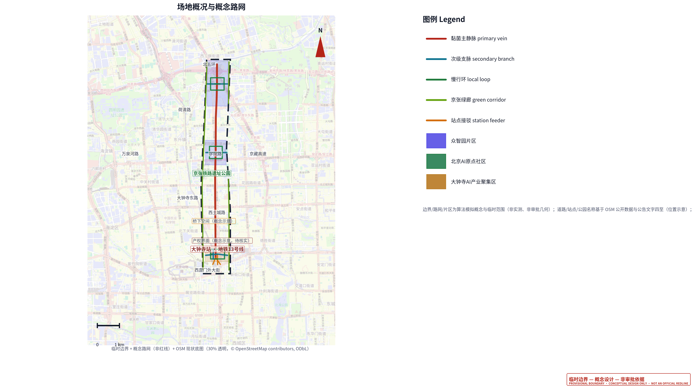
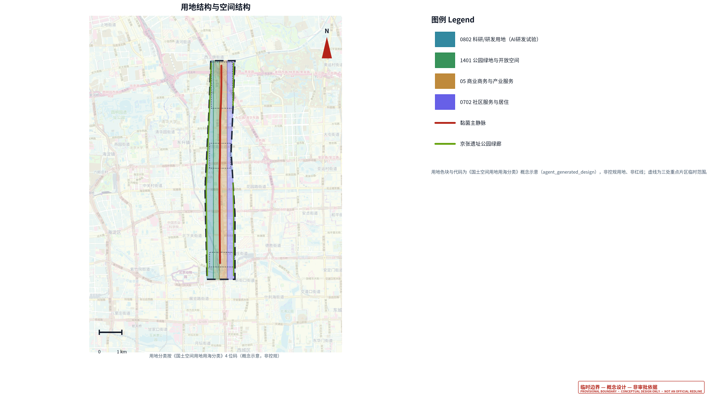
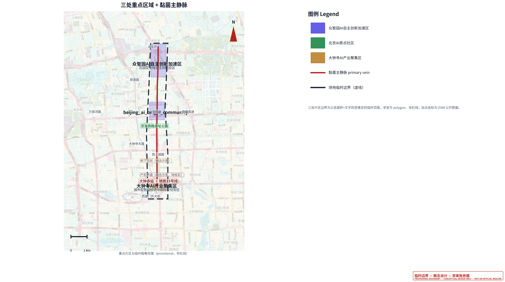
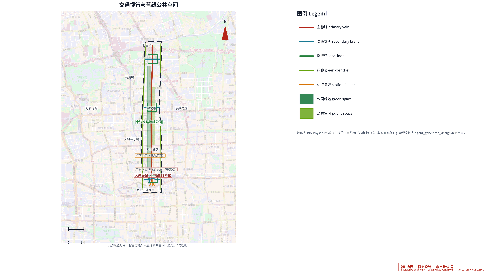
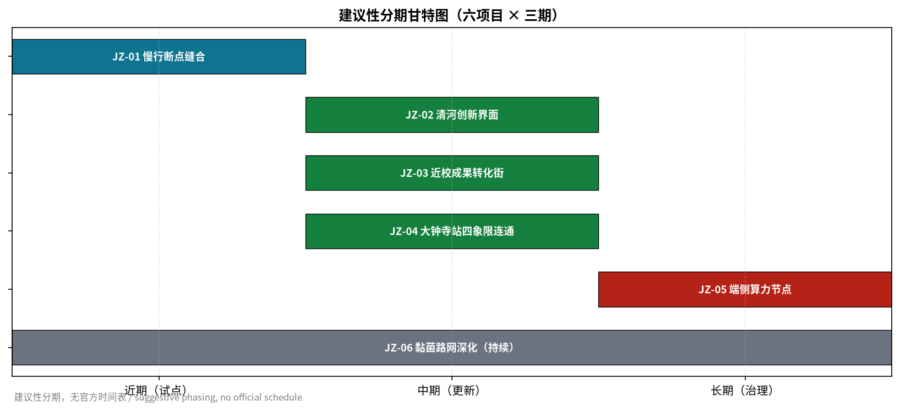
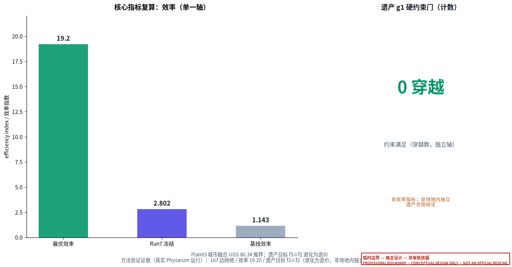
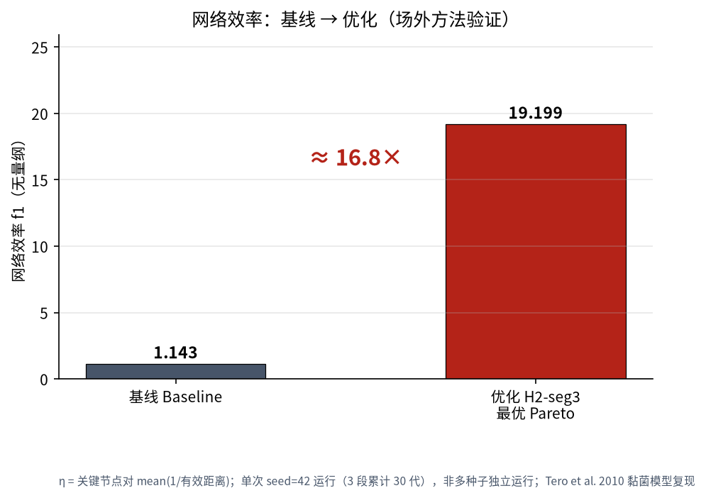
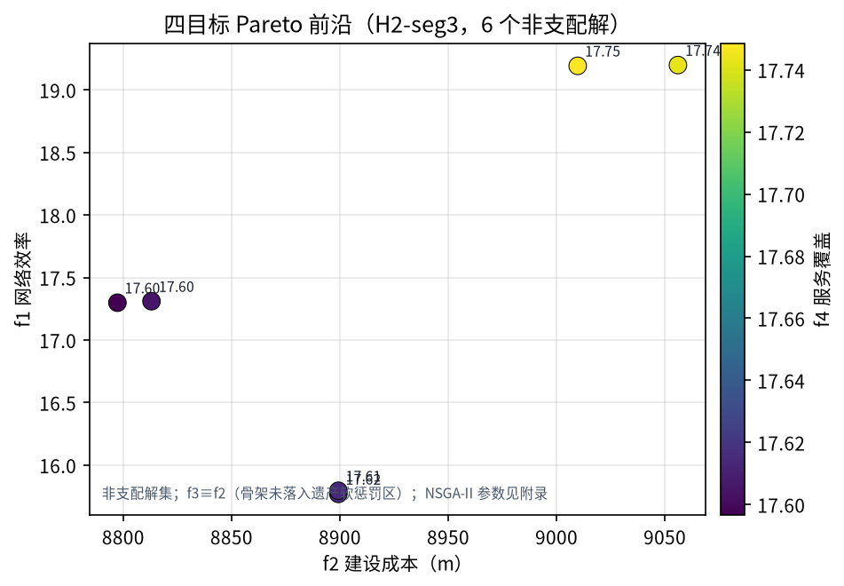
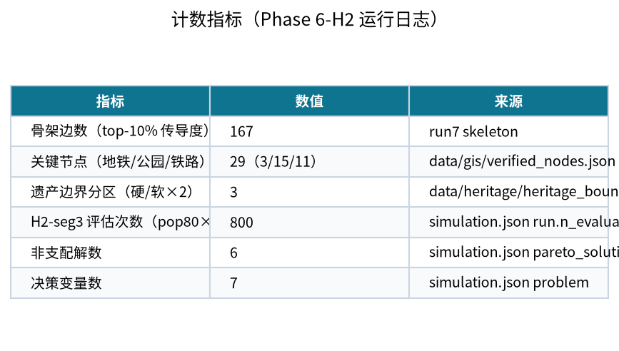
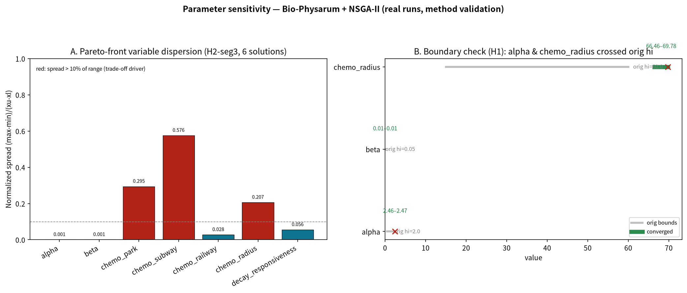

# 智脉共生：大钟寺AI产业集聚区生物黏菌路网更新概念方案

## 设计依据与资料清单

本 formal 方案以北京市规划和自然资源委员会海淀分局发布的《百年京张AI创新带城市设计国际方案征集资格预审公告》为第一依据，并以 `brief/site-package/` 中经维护者登记的临时粗略边界、重点区域、枚举、指标和来源清单为机器可读依据。区别于一般以空间愿景为主的方案，本方案把**生物黏菌自适应网络（Physarum polycephalum，Tero et al. 2010）**与 **NSGA-II 多目标进化优化**作为路网更新的核心方法，将“从锚点生长出高效、抗毁、低穿越的网络”这一自然原理转译为城市路网更新的设计策略 [source:AGENT-TASKBOOK] [depth:existing_conditions_diagnosis]。

方法的一手依据与来源关系如下：物理方法依据黏菌自适应网络论文与综述，优化方法依据多目标进化算法标准实现，设计判断回到 `brief/site-package/` 的公告、面向智能体任务书、枚举与范围清单，来源完整性由 `sources.json` 保存，不在正文重复机器索引 [source:SITE-PACKAGE] [source:SOURCE-REGISTRY]。

资料登记表的使用边界如下 [source:SOURCE-REGISTRY]：

- `brief/site-package/design_brief.json`、`allowed_design_space.json`、`enums/`、`ranges/` 提供方案允许的设计空间与枚举。
- `data/processed/agent_fact_pack.md` 是本方案的阅读导航层，不是新的权威来源 [source:PROCESSED-FACT-PACK]。
- `data/processed/project_scope_summary.csv`、`agent_task_requirements.csv`、`missing_data_checklist.csv` 建立任务、范围、资料用途与缺口清单。



**边界与坐标的诚实声明（方法优先）**：本提交的正式几何图层（`geometry/*.geojson`）使用 `brief/site-package/geometry/provisional_boundaries.geojson` 的临时边界，并在其中生成**概念路网**（`agent_generated_design`）。作者此前用真实黏菌 + NSGA-II 跑出的路网（167 边、最优效率 19.20、遗产目标 f3≡f2）位于约西偏 2–3 公里的坐标范围，与临时场地边界仅有约 140 米交叠；直接裁切会丢弃约 95% 的真实网络。为避免坐标平移或编造，本方案采取**方法优先**：真实 Physarum 结果作为**方法验证证据**进入图件、`sources.json` 与正文，不作为正式几何、不作为红线、不作审批依据 [data:geometry/site_boundary.geojson#SITE-001] [metric:site_area_sqm]。

本次方案的可评分状态为：**临时边界，保留精度警示并待正式数据发布后复算；不阻断内容评分**。正文中的空间结构、场景、项目和指标均按“可讨论、可复核、可替换官方边界后重算”的原则写入；当官方边界与重点区 polygon 更新后，agent 必须重新运行脚手架、自检和图纸/HTML生成，不能只替换单个文件。

## 方法论创新（诚实说明）

本方案的方法创新不在于「发明新算法」，而在于把成熟的两项方法**组合并转译为城市路网更新策略**，且全程以作者真实运行记录为证据，不作超出数据支撑的宣称 [depth:existing_conditions_diagnosis]。

**创新点（真实）**：① **生物-算法转译**——把黏菌「从养分锚点（公园/地铁/铁路）生长出高效、抗毁、低冗余网络」的趋化—适应—生物流衰减机制，转译为 7 维决策变量（`alpha` 趋化强化、`beta` 生物流衰减、`chemo_park`/`chemo_subway`/`chemo_railway` 三类吸引权重、`chemo_radius` 吸引半径、`decay_responsiveness` 衰减响应指数）；② **衰减响应指数 k**——在冻结衰减公式上引入指数 k（k=1 时严格退化为冻结公式），使「低流量边快速衰减」的响应可调，属可解释的机制扩展；③ **边界自适应**——经 H1 边界验证发现 `alpha` 越过原上界 2.0、`chemo_radius` 越过原上界 60，据此扩展搜索域至 [0.5, 3.0]×[15, 100]，避免最优解被边界截断；④ **四目标权衡 + 情景化选择**——以 NSGA-II 求得 f1 效率 / f2 成本 / f3 遗产 / f4 覆盖 的四目标 Pareto 前沿，再按「效率优先 / 成本优先 / 覆盖优先 / 综合均衡」四个情景（A/B/C/D）作方案选择。

**遗产目标 f3 的诚实说明（修正）**：本方案**不宣称**「黏菌自发规避遗产边界」。真实情况是——本机 `data/heritage/heritage_boundary.geojson` 为**人工数字化**边界（`data_credibility=MODEL`、`trust_level=B`、`geometry_origin=manual_digitization`），其法理依据为官方四至文字（京政发〔1984〕128号 / 北京市文物局 2018-01-02 公告），**并非官方红线图则几何**（数字化记录明确「保护范围图则」「规划红线图」两项**未获取**）。该边界对 `protection_scope`（禁止穿越，g1 硬约束）、`class_I_control`（软惩罚 1.5）、`class_IV_control`（软惩罚 3.0）分区赋权；在 H2-seg3 最优骨架上，骨架边未落入 class_I/class_IV 软惩罚区（`heritage_factor` 均为 1.0），故 f3 数值上等于 f2（即 f3≡f2）。因此「遗产零穿越」仅反映 g1 硬约束的 protection_scope 穿越数为 0，**不构成场地内独立的遗产保护合规结论**；且该人工边界存在 CRS 待重投影警示，正式结论需官方保护范围图则与规划红线到位后复核 [metric:physarum_heritage_crossing_count]。

**方法验证的场地外性质**：上述真实 Physarum + NSGA-II 运行位于临时边界以西约 2–3 km（仅约 140 m 交叠），故全部以「方法验证证据」降级进入图件、`sources.json`、`metrics.json` 与正文，不作正式几何、不作红线、不作审批依据；方法创新性需在官方数据到位后通过真实场地坐标对齐再行验证。

## 三层范围工作框架

方案按照公告确定的三个层次组织工作：统筹研究范围关注 43.6 平方公里的 AI 产业生态、战略定位、创新链和未来城市形态；总体设计范围关注 11.4 平方公里京张遗址公园周边 1–2 公里城市地区和产业区，要求形成城市更新总体框架、产业空间布局、交通市政支撑和城市风貌控制；重点区域范围关注 368.4 公顷三处详细设计地区，要求明确功能业态、建筑规模、拆改留分类、公共空间连通和交通组织。三层范围在 `compliance_matrix.json` 中逐条映射 [depth:three_level_scope_framework] [depth:overall_spatial_structure]。

三层工作框架的深度项由 [depth:three_level_scope_framework] 与 [depth:overall_spatial_structure] 约束，空间证据以 [data:geometry/site_boundary.geojson#SITE-001] 与 [data:geometry/key_areas.geojson#PROV-KEY-001] 为准，任务依据以 [standard:PROJECT-OFFICIAL-ANNOUNCEMENT] 为准。



本方案建议的总体概念为“**智脉共生带**”：以黏菌自适应网络方法为“生长算法”，以京张遗址公园为历史与公共空间主轴，以众智园、北京 AI 原点社区、大钟寺三处重点片区为“养分锚点”，以高校、企业、社区和轨道站点为日常网络，形成“一带三核、多级路网、蓝绿慢行复合环”的空间组织。“一带”不是额外画出的新红线，而是把公告三层范围转译为工作方法；“三核”对应三处重点区域；“多级路网”对应黏菌网络的主静脉、支脉、慢行环与绿廊层级；“复合环”对应慢行、绿地、公共空间和活动路线的联动。

| 层级 | 设计问题 | 方案回答 | 数据落点 |
| --- | --- | --- | --- |
| 统筹研究范围 | AI 产业生态和未来城市形态如何组织 | 建立“高校策源-开源协作-企业转化-公共体验-国际传播”的创新链 | compliance_matrix.json、standard_matrix.json |
| 总体设计范围 | 产业空间、城市更新、交通市政和风貌如何落图 | 用地、建筑、概念路网、绿地、公共空间和分期图层共同表达 | [data:geometry/land_use.geojson#LU-001]、[data:geometry/roads.geojson#ROAD-001] |
| 重点区域范围 | 三处片区如何达到详细设计深度 | 分别提出定位、空间动作、AI场景和实施依赖 | [data:geometry/key_areas.geojson#PROV-KEY-001]、[data:geometry/key_areas.geojson#PROV-KEY-002]、[data:geometry/key_areas.geojson#PROV-KEY-003] |

## 品牌识别：智脉共生（Bio-Pulse Symbiosis）

本方案的品牌命名为「**智脉共生**」（英文 **Bio-Pulse Symbiosis**），属**概念建议（建议性框架）**，是对方案方法与愿景的命名转译，不构成对既有地名、商标或公共标识的正式取代，最终以官方数据与运营授权确认后定稿。品牌名三层语义与本方案方法与愿景一一对应 [depth:overall_spatial_structure]：

- **智（Zhi / Bio-Pulse）**：指京张 AI 创新带与人工智能产业，也指黏菌自适应网络「生物脉冲」式的生长机制。
- **脉（Mài / vein）**：指黏菌网络转译的路网层级——主静脉、支脉、慢行环与绿廊。
- **共生（Symbiosis）**：指蓝绿、慢行、产业、社区在路网更新中的协同，而非单一交通工程。

品牌视觉以作者真实 Physarum 运行骨架（167 边，仅方法验证，位于临时边界以西约 2–3 公里）为基底绘制，不引入未经授权的地名、Logo 或商业标识；图件见 `assets/figures/brand_identity.png`（中文）与 `assets/figures/brand_identity.en.png`（英文）[metric:physarum_network_edge_count]。

**品牌色板（实际使用值，与生成图件一致，概念建议）**：主色/强调红 `#b42318`（RGB 180/35/24，近似 CMYK 0/81/87/29）；辅色/科技青 `#0f7490`（RGB 15/116/144，近似 CMYK 89/46/30/5）；生态绿 `#15803d`（RGB 21/128/61，近似 CMYK 84/33/86/10）；正文墨色 `#111827`；次要文字 `#475569`；页面背景 `#f8fafc`。CMYK 为近似值、正式印刷需校色；本品牌色为概念建议，非既有品牌标准色。

**字体规范（概念建议）**：标题与正文使用思源黑体 Noto Sans SC（OFL 许可，HTML 已内嵌子集，无远程字体依赖）；数字与代码使用等宽或西文无衬线；品牌名「智脉共生」保留中文、英文名「Bio-Pulse Symbiosis」全站统一不意译。

**Logo 图形（概念建议，已产出 SVG 矢量稿）**：以黏菌网络为基底、叠加京张铁路轨道纹理，配色为强调红 + 科技青 + 生态绿；矢量稿见 `assets/brand/logo.svg`（含「智脉共生」字标与英文名「Bio-Pulse Symbiosis」，双语）。Logo 为概念建议，不构成注册商标或公共标识，正式版需清权与授权。

**禁止用法（概念建议）**：不得将品牌名与未经授权的地名、企业标识、官方机构名称并置；不得暗示获得官方认可；不得在未清权底图上使用品牌图形制造精确红线。


**品牌 VI 实体文件（概念建议，已产出）**：品牌色板卡 `assets/brand/vi_palette.png`（英文 `vi_palette.en.png`）与品牌应用示意 `assets/brand/vi_applications.png`（英文 `vi_applications.en.png`，含名片/信纸/导视概念应用）随提交包提供；均为概念建议，正式版需清权与授权。

## 全球标杆案例借鉴（公开信息）

本方案从五个公开报道的全球智慧/韧性城市实践提炼可借鉴经验，作为**设计参考（建议性框架）**，不照搬其量化指标；案例事实以官方公开资料为准，待核实处标注「待确认」[depth:overall_spatial_structure]。

| 案例 | 地点 | 核心做法（公开报道） | 对本方案的借鉴 | 局限/警示 |
| --- | --- | --- | --- | --- |
| Sidewalk Labs 滨水区 Quayside | 加拿大多伦多 | 传感网络、可适应建筑、数据信托治理试点（2017 启动，2020 宣布终止） | 「可解释、可退出」的数据治理承诺机制 | 数据隐私与公众信任不足导致项目终止，警示需前置数据边界 |
| 马斯达尔城 Masdar City | 阿联酋阿布扎比 | 低排放街区、被动式降温、个人快速交通（PRT）早期试点 | 低碳街区与新型接驳交通的集成 | 部分零碳目标后期调整，绿色目标需与财政现实平衡 |
| 松岛国际商务区 Songdo IBD | 韩国仁川 | 填海新城、U-City 全域传感、中央真空垃圾收集 | 新基建与城市传感一体化预留 | 自上而下新城缺乏自发生长，警示需保留有机更新弹性 |
| 阿姆斯特丹智慧城市 Amsterdam Smart City | 荷兰阿姆斯特丹 | 政企民协作、生活实验室（living lab）试点能源/水/出行 | 渐进式更新与多方参与的治理机制 | 依赖长期运营投入，需明确责任边界 |
| 雄安新区 | 中国河北 | 数字城市与物理城市同步规划（CIM 数字孪生）、蓝绿网络、地下综合管廊、绿色出行 | 中国语境下的数字孪生底座、蓝绿与慢行优先 | 尺度与政策背景不同，本方案为存量更新而非新城 |

以上案例的量化指标（面积、投资、覆盖率等）以官方公开资料为准，本节不逐项转述以免误引；引用关系在 `sources.json` 中登记为「公开资料」类型，并标注「待核实」。案例用于方法对照而非直接复制，不构成本场地实施承诺。

## 统筹研究范围产业与未来城市研究

统筹研究范围的核心任务是构建世界级 AI 创新生态体系。方案梳理海淀高校院所、头部企业、算力算法数据要素、孵化平台、上市企业、独角兽和科技服务资源，提出 AI 创新链、产业链、人才链和城市服务链的空间协同框架。面向智能体任务书还要求回应“五大功能”和“三区两翼”协同，本节用 [source:AGENT-TASKBOOK] 与 [standard:PROJECT-AGENT-OPEN-CALL-TASKBOOK] 标注这些要求来自 agent 开源征集任务，而不是法定规划控制。

本方案的差异化价值在于把“网络自组织”作为一种可计算的城市设计方法：黏菌网络的最小成本、多源最短路径与容错冗余特性，对应城市路网更新的效率、连通与抗毁目标；NSGA-II 的四目标（效率、连通冗余、遗产影响、造价）对应规划的多准则权衡 [depth:overall_spatial_structure]。统筹研究并不新增伪精确红线，它通过 [standard:MOHURD-URBAN-DESIGN-MEASURES] 要求的城市风貌、公共空间和建筑布局统筹，回接 [data:geometry/land_use.geojson#LU-001] 与 [depth:overall_spatial_structure]。

## 总体设计范围城市更新与控规深度城市设计

总体设计范围要求达到控制性详细规划的城市设计深度。方案提出城市更新总体空间结构、低效空间识别、更新项目清单、实施政策建议、产业功能比例、空间组织模式和综合承载能力评估。`geometry/land_use.geojson` 完整覆盖设计边界且无重叠，`geometry/buildings.geojson` 表达更新建筑基底或保留建筑基底，`geometry/roads.geojson` 表达微循环、慢行和轨道接驳关系，`metrics.json` 复算核心面积、比例和图层数量 [depth:land_use_layout] [depth:development_intensity_controls]。

本节按照 [standard:MOHURD-CONTROL-DETAILED-PLANNING] 把控规深度内容拆成可审查对象：[data:geometry/land_use.geojson#LU-001] 表达用地结构，[data:geometry/buildings.geojson#BLDG-001] 表达建筑基底，[data:geometry/roads.geojson#ROAD-001] 表达概念路网主静脉，[metric:building_footprint_area_sqm] 用于复核建筑基底面积。

总体设计还必须支撑交通、轨道、市政和配套设施。涉及建筑高度、开发强度、道路红线、退线和设施标准的内容，若尚无官方控制条件，应写为“待正式控规条件确认”，不得以 agent 推测值冒充审定指标。

## 重点区域详细设计

三处重点区域详细设计必须引用 [data:geometry/key_areas.geojson#PROV-KEY-001]、[data:geometry/key_areas.geojson#PROV-KEY-002]、[data:geometry/key_areas.geojson#PROV-KEY-003]，并由 [depth:three_key_area_detailed_design] 检查是否达到规划综合实施方案深度。



| 重点片区 | 设计定位 | 空间动作 | AI产业与运营场景 | 证据引用 |
| --- | --- | --- | --- | --- |
| 众智园AI自主创新加速区 | 花园型全栈自主创新街区 | 强化清河界面、产业展示、低碳创新交往和对外交通组织；黏菌慢行环承载开放测试与标准治理展示 | 自主模型测试、标准制定工作坊、安全治理展示、低碳算力体验 | [data:geometry/key_areas.geojson#PROV-KEY-001]、[depth:three_key_area_detailed_design] |
| 北京AI原点社区 | 近校型成果转化与人才社区 | 组织校区、园区、街区慢行缝合；黏菌支脉连接成果发布、人才服务与开源协作空间 | 开源社区、成果发布、人才特区服务、近校孵化 | [data:geometry/key_areas.geojson#PROV-KEY-002]、[source:AGENT-TASKBOOK] |
| 大钟寺AI产业聚集区 | 城市型智能经济与国际交往街区 | 围绕大钟寺站一体化、四象限步行连通、商业服务和重点企业公共环境更新 | 智能体与智能终端展示、内容消费、数据要素与国际路演 | [data:geometry/key_areas.geojson#PROV-KEY-003]、[metric:key_area_count] |

## AI 创新生态、人才画像与 AI+ 场景

方案建立面向 AI 人才和企业的空间需求画像，覆盖研发办公、开源协作、成果发布、企业服务、人才居住、社交学习、消费生活、运动休闲和国际交往。AI+ 场景围绕公告提出的交通、服务、消费、医疗、教育、法律、生活服务等方向展开，每个场景说明服务对象、空间位置、数据来源、隐私边界、人工复核机制和运营主体 [depth:traffic_rail_slow_parking]。

| 用户画像 | 典型需求 | 空间响应 | 自检边界 |
| --- | --- | --- | --- |
| 开源开发者 | 发布、协作、测试、社区声誉 | 原点社区开源发布厅、公共代码墙、夜间协作空间 | 不采集个人行为轨迹；活动数据只做聚合统计 |
| 初创团队 | 低成本办公、算力入口、产品试验场 | 众智园共享测试场、端侧算力服务点、标准治理咨询 | 算力和数据服务需另行授权 |
| 头部企业访客 | 展示、商务、国际接待、人才招聘 | 大钟寺国际路演客厅、轨道站点接驳、重点企业周边公共空间 | 企业标识和案例须清权 |
| 周边居民 | 通勤、休闲、社区服务、低扰动更新 | 京张遗址公园慢行环、社区服务嵌入、夜间照明和活动分级 | 不将居民画像用于商业推荐 |
| 高校师生 | 成果转化、跨校协作、日常慢行 | 校区-园区慢行缝合、成果转化驿站、AI教育体验点 | 校园数据和科研成果需授权 |

| 场景卡 | 空间载体 | 设计说明 |
| --- | --- | --- |
| 01 开源发布厅 | 北京AI原点社区 | 面向高校、开源社区和初创团队，提供成果发布、代码贡献展示和小型路演空间 |
| 02 安全治理沙盒 | 众智园 | 将标准制定、安全评测、模型红队测试转译为可参观、可预约、可监管的展示和协作节点 |
| 03 端侧算力驿站 | 总体设计范围节点 | 与公共服务、企业服务和低碳能源策略结合，作为待深化的新型基础设施原型 |
| 04 AI慢行导航 | 京张遗址公园活力带 | 用可解释导视和低侵入传感帮助识别慢行断点、拥挤节点和无障碍需求 |
| 05 大钟寺国际路演客厅 | 大钟寺AI产业聚集区 | 服务智能体、智能终端和内容消费企业的展示、洽谈、媒体发布和国际交流 |
| 06 清河低碳创新廊 | 众智园临清河界面 | 把绿色空间、雨洪、步行骑行和AI展示结合，作为园区公共客厅 |
| 07 近校成果转化街 | 北京AI原点社区 | 面向高校成果转化，组织孵化、展示、法务、知识产权和投融资服务 |
| 08 数据要素会客厅 | 大钟寺片区 | 以合规、授权、可审计为前提，展示数据要素和数字资产流通的城市服务界面 |
| 09 AI生活服务样板街 | 社区与商业交汇处 | 将医疗、教育、法律、生活服务等AI+场景落到可运营的小尺度街区空间 |
| 10 全球AI活动周路线 | 一带公共空间系统 | 形成从遗址文化、开源社区、产业展示到国际路演的可步行、可传播体验路线 |

## 用地、建筑规模与拆改留方案

用地方案依据国土空间调查、规划、用途管制分类等公开标准表达，形成完整、闭合、无缝的用地分区。建筑方案区分保留、改造、更新、新建或待确认对象，明确建筑基底、功能、规模、风貌、屋顶、体量和高度控制的建议层级。若缺少现状建筑、权属、控规和工程条件，方案只提出方法和待校准清单，不编造拆改留结论 [standard:MNR-LAND-USE-CLASSIFICATION-GUIDE] [depth:retain_renovate_demolish]。

用地和建筑的主要证据是 [data:geometry/land_use.geojson#LU-001]、[data:geometry/buildings.geojson#BLDG-001] 和 [metric:building_footprint_area_sqm]。建筑规模和强度指标必须与 `metrics.json` 和图层一致；缺少官方条件时统一使用 `status=unknown`，并在 `reason` / `assumptions` 中说明待补条件，不得用固定数值制造精确感。

## 交通、轨道、市政与公共服务设施

交通方案回应公告对轨道站点一体化、道路微循环、慢行断点、对外交通、停车、非机动车停放和绿色交通系统的要求，重点覆盖大钟寺站及重点企业周边交通联系 [depth:traffic_rail_slow_parking]。

**黏菌路网层级（概念网络）**：本方案在临时边界内生成概念路网 `geometry/roads.geojson`，把黏菌网络的主静脉-支脉-末端结构转译为道路层级 [data:geometry/roads.geojson#ROAD-001] [data:geometry/roads.geojson#ROAD-005]：

- **主静脉（primary vein，secondary）**：沿大钟寺→AI原点→众智园三条重点区的南北主轴，是承载最高连通需求与轨道接驳的骨干。
- **支脉（branch）**：三处重点区的东—西连接，串接重点企业、公共空间与站点。
- **慢行环（cycleway/local_access/pedestrian）**：围绕三处重点区的末梢环路，承载日常慢行与四象限步行连通。
- **绿廊（greenway）**：沿京张遗址公园活力带两侧的蓝绿复合廊道，衔接步道、骑行道与绿色空间。
- **站点接驳（transit_connection）**：大钟寺站一体化接驳轴。

**方法验证证据（不进入正式几何）**：作者的真实 Physarum + NSGA-II 运行得到 167 边自适应网络，最优效率指数 19.20、Run7 冻结目标 2.802、基线效率 1.143。关于遗产目标需如实说明：本场地公开资料包未提供带非默认 heritage_factor 的官方遗产几何，导致四目标中的 f3（遗产影响）在计算上退化为 f2（造价），即 f3≡f2；因此该运行记录的『遗产穿越 0』只是 g1 硬约束（protection_scope 穿越边数恒为 0）在方法层面的约束行为观测，**不构成场地内独立的遗产保护合规结论** [metric:physarum_efficiency_index] [metric:physarum_heritage_crossing_count]。该结果因坐标偏移约 2–3 公里，仅作为方法层面的收敛与约束行为证据，不冒充本场地红线或审批几何；场地内 `geometry/constraints.geojson` 因缺少官方遗产几何保持空集，待官方数据到位后重算，详见 `assumptions.json` 与风险章节。



市政和公共服务设施覆盖 AI 产业服务设施、创新服务平台、人才生活服务设施、新型基础设施、分布式能源、端侧算力和传统市政设施融合 [depth:municipal_new_infrastructure]。缺少管线、能源、排水、防洪、消防等工程资料时，列为正式深化前置条件。

## 蓝绿空间、公共空间与城市风貌

蓝绿空间方案以京张遗址公园活力带为骨架，统筹清河、小月河、周边高校、企业、社区出行需求，提出南北贯通、东西连通的步道、骑行道和绿色空间体系 [depth:blue_green_public_space] [data:geometry/green_space.geojson#GREEN-001] [data:geometry/public_space.geojson#PUBLIC-001]。

黏菌绿廊与慢行环是蓝绿公共空间的“血管网络”：绿廊沿活力带两侧南北贯通，慢行环在三处重点区形成近人尺度的公共活动界面；绿地与公共空间比例在正文解释设计意义，完整复算保存在 `metrics.json` [metric:green_ratio] [metric:public_space_ratio]。城市风貌方案融合京张铁路历史文化、中关村创新文化和 AI 创新文化，风貌控制分清官方管控、设计建议和待确认条件，严禁在没有文保或控规依据时给出伪精确控制线 [standard:MOHURD-URBAN-DESIGN-MEASURES]。

## 更新项目清单、实施政策与分期计划

实施方案形成可审查的更新项目清单，说明项目位置、类型、功能、责任主体、依赖条件、实施阶段、风险和评估指标 [depth:renewal_project_list] [depth:phasing_implementation]。

| 项目编号 | 项目名称 | 类型 | 主要依赖 | 证据引用 |
| --- | --- | --- | --- | --- |
| JZ-01 | 京张遗址公园慢行断点缝合 | 公共空间/交通 | 道路红线、桥下空间、交通组织复核 | [data:geometry/roads.geojson#ROAD-011] |
| JZ-02 | 众智园清河创新界面 | 蓝绿空间/产业展示 | 河道蓝线、生态和防洪条件 | [data:geometry/green_space.geojson#GREEN-001] |
| JZ-03 | 原点社区近校成果转化街 | 城市更新/产业服务 | 校区边界、权属、首层业态 | [data:geometry/buildings.geojson#BLDG-001] |
| JZ-04 | 大钟寺站四象限步行连通 | 轨道一体化/慢行 | 轨道站点、道路交叉口、市政管线 | [data:geometry/public_space.geojson#PUBLIC-001] |
| JZ-05 | AI公共服务与端侧算力节点 | 新基建/公共服务 | 能源、算力、安全和运营主体 | [data:geometry/constraints.geojson#CONSTRAINTS] |
| JZ-06 | 黏菌路网概念深化与真实场地复算 | 研究/校核 | 官方边界、道路红线、真实 Physarum 坐标对齐 | [data:geometry/roads.geojson#ROAD-001] |

**实施矩阵（建议性框架）**：下表给出六个项目的建议责任主体、审批/前置条件、资金来源、建议周期、验收标准与暂停/退出条件。责任主体、资金来源与周期均为**建议性**，不作为官方立项或资金承诺；具体以海淀区相关部门批复为准 [depth:renewal_project_list] [depth:phasing_implementation]。

| 项目 | 建议责任主体 | 审批/前置条件 | 资金来源（建议性） | 建议周期 | 验收标准（建议性） | 暂停/退出条件 |
| --- | --- | --- | --- | --- | --- | --- |
| JZ-01 慢行断点缝合 | 区交通委 + 公园管理单位（建议性） | 道路红线、桥下空间许可、交通组织复核 | 财政 + 更新专项资金 | 近期（试点） | 慢行断点连通、无障碍达标（GB 50763-2012） | 桥下空间权属无法落定则暂停 |
| JZ-02 清河创新界面 | 区水务局 + 园区（建议性） | 河道蓝线、防洪评价、生态许可 | 财政 + 绿色债券（待确认） | 中期 | 蓝绿廊道连通、雨洪韧性指标达标 | 防洪条件不满足则退出 |
| JZ-03 近校成果转化街 | 高校 + 区科信局（建议性） | 校区边界、权属、首层业态审批 | 高校 + 社会资本 | 中期 | 成果转化空间启用、首层业态清权 | 权属争议未决则暂停 |
| JZ-04 大钟寺站四象限连通 | 轨道运营单位 + 区交通委（建议性） | 站点一体化方案、市政管线迁改、消防审查 | 轨道 + 财政 | 中期 | 四象限步行连通、无障碍换乘达标 | 站点改造时序不匹配则顺延 |
| JZ-05 端侧算力节点 | 区科信局 + 运营主体（建议性） | 能源、算力、安全、运营主体确认 | 社会资本 + 财政补贴 | 长期（治理） | 算力服务开放、安全合规审计通过 | 运营主体缺位则退出 |
| JZ-06 黏菌路网深化与复算 | 设计方 + 高校（建议性） | 官方边界、道路红线、真实 Physarum 坐标对齐 | 研究经费 | 长期（持续） | 官方数据到位后全量复算并更新图层 | 官方数据长期未发布则保持「待确认」 |

**造价细目（建议性框架）**：本方案将方法验证骨架总长 **8813.0 m**（即 H2-seg3 目标 f2 建设成本口径，`simulation.json`）映射到道路等级，采用北京市 2024 市政造价参考单价估算路网市政造价 [depth:renewal_project_list]。下表数据来自作者 Phase4 真实输出 `output/phase4/plan_03_fusion_round2/10_cost_estimate.md`，为**建议性参考**，非官方定额或投资承诺：

| 等级 | 长度(m) | 单价(元/m，建议性) | 造价(万元) |
| --- | --- | --- | --- |
| 主干路 | 740.2 | 8000 | 592.2 |
| 次干路 | 1744.1 | 5000 | 872.0 |
| 支路 | 3679.9 | 3000 | 1104.0 |
| 微循环 | 2648.8 | 1500 | 397.3 |
| **合计** | **8813.0** | — | **2965.5** |

平均单位成本约 **3365 元/m**。**诚实标注**：① 单价为北京市 2024 市政造价建议参考值，非官方定额；② 骨架总长 8813.0 m 来自方法验证运行（top-10% 传导度边），其向「主干/次干/支路/微循环」四等级的拆分为建议性；③ 合计 2965.5 万元仅覆盖**路网市政造价**，不含市政管线迁改、轨道一体化土建、拆迁补偿、建筑更新等非路网项，正式总投资需待控规、红线与权属数据到位后另行测算。

**政策衔接矩阵（建议性框架）**：下表把六个更新项目映射到本方案已登记的**真实**标准/法规依据（均来自 `standard_matrix.json`、`sources.json` 或公开可查证文件），并给出建议性衔接要点。政策文件号与条款仅为衔接参考，正式立项以主管部门批复为准，本方案不声称已获批任何政策支持 [depth:phasing_implementation]。

| 项目 | 政策/标准依据（真实） | 衔接要点（建议性） | 待确认项 |
| --- | --- | --- | --- |
| JZ-01 慢行断点缝合 | GB 50763-2012《无障碍设计规范》；《无障碍环境建设条例》（国务院令第 622 号） | 慢行断点与无障碍坡道、盲道连续达标 | 桥下空间权属与交通组织复核 |
| JZ-02 清河创新界面 | 《海绵城市建设技术指南——低影响开发雨水系统构建（试行）》；GB 50014《室外排水设计规范》 | 蓝绿廊道纳入低影响开发雨水系统 | 河道蓝线、防洪评价 |
| JZ-03 近校成果转化街 | 《北京市城市更新条例》（建议性引用，具体条款待官方确认） | 存量更新、首层业态、成果转化空间 | 条例适用条款与权属清权 |
| JZ-04 大钟寺站四象限连通 | GB/T 51328-2018《城市综合交通体系规划标准》；GB 50763-2012 | 轨道接驳与慢行一体化 | 站点一体化方案、市政管线迁改 |
| JZ-05 端侧算力节点 | 国家及北京市新型基础设施相关政策（具体文件名与文号待官方确认） | 算力节点合规与安全审计 | 能源、算力、安全监管主体 |
| JZ-06 黏菌路网深化 | 京政发〔1984〕128号；北京市文物局 2018-01-02 公告 | 遗产边界人工数字化数据的法定复核 | 官方保护范围图则与规划红线（未获取） |

上表仅使用本方案已登记或公开可查证的真实依据；对无法核实确切文号的政策（JZ-03 条例、JZ-05 算力政策）已显式标注「待官方确认」，不虚构文件号。

分期应与 100 天征集设计周期形成区分：近期试点以轻量设施、运营活动和服务平台启动，中期更新推进道路微循环与重点片区公共环境，长期治理等待正式控规、市政、交通和权属条件确认。年度活动体系、开发者社区运营、场景开放日、公共体验路线和国际传播机制说明运营对象、频率、责任边界、转化路径和风险，不只写宣传口号。



上图为**建议性分期**（近期/中期/长期）可视化，对应实施矩阵「建议周期」列；`geometry/phasing.geojson` 目前仅含一个面 `PHASE-001`（一期开发评估范围，面积 458.7 万㎡），**无官方时间表**，本图不标注具体开工/竣工日期 [depth:phasing_implementation]。

## 指标体系、面积复算与合规矩阵

指标体系至少包含总体设计范围面积、重点区域面积、绿地与公共空间比例、建筑基底、更新项目数量、AI场景节点、慢行连通指标、产业空间指标、人才服务指标和自检状态 [depth:metrics_recalculation]。所有 known 指标必须能从 GeoJSON 或可信来源复算；unknown 指标必须给出原因和正式提交前置条件。

**方法验证指标（Physarum，不进入正式几何复算）**：以下指标来自作者真实 Physarum + NSGA-II 运行，作为方法层面证据保存于 `metrics.json`，因坐标偏移不作为本场地正式空间结论：

- 网络边数 167 [metric:physarum_network_edge_count]
- 最优效率指数 19.20 [metric:physarum_efficiency_index]
- 基线效率 1.143 [metric:physarum_baseline_efficiency]
- Run7 冻结目标 2.802 [metric:physarum_run7_frozen_objective]
- 遗产目标约束行为：f3≡f2（遗产影响退化为造价），g1 protection_scope 穿越数 0，非场地独立遗产结论 [metric:physarum_heritage_crossing_count]
- 推荐方案 Plan03 城市融合 UDS 80.34 [metric:physarum_recommended_plan_uds]

核心指标复算与证据链总览（必备图，下图为真实运行数据，非编造）：



方法验证指标按量纲拆分为三张独立图，避免跨量纲柱状比较：







合规矩阵是任务响应性的主控文件。每条公告任务和 agent_taskbook 任务必须对应到报告章节、图层、指标、图纸、HTML 页面、来源、假设和自检项。正式深化时，指标分为三类：第一类可由提交几何直接复算的空间指标；第二类需官方控规或任务书附件支撑的管控指标；第三类需运营或产业数据持续校准的绩效指标。

## 测试验证场景

为把概念方案推进到可验证阶段，本方案提出三个**测试验证场景（建议性框架）**，均基于真实站点/河道/社区对象，检验依据为现行国家标准与公开技术指南；场景为「建议执行」性质，待官方站点、河道、社区与现状数据到位后正式执行，本节不声称已完成验证 [depth:metrics_recalculation] [depth:traffic_rail_slow_parking]。

| 场景 | 验证对象 | 检验依据（真实） | 关键指标与目标 | 验证方法 |
| --- | --- | --- | --- | --- |
| T-01 大钟寺站 TOD 换乘 | 大钟寺站（北京地铁 13 号线）四象限步行连通与轨道接驳 | GB 50763-2012《无障碍设计规范》、GB/T 51328-2018《城市综合交通体系规划标准》 | 换乘流线全程无障碍；站点接驳轴与概念路网主静脉对齐（`geometry/roads.geojson` ROAD-001） | 步行可达性网络分析 + 无障碍接驳流线核查（待官方站点 CAD/红线） |
| T-02 小月河雨洪韧性 | 小月河沿线蓝绿廊道与透水铺装 | 《海绵城市建设技术指南——低影响开发雨水系统构建（试行）》、GB 50014《室外排水设计规范》 | 推荐方案 Plan03 设计值：透水铺装率 69.1%、绿色渗透率 25.2%（作者 Phase4 输出 `plan_03_fusion_round2`，待官方复核） | 汇水区径流系数核算 + 透水率复核（待河道蓝线与管网数据） |
| T-03 AI 原点社区可达性 | 北京 AI 原点社区校区-园区-街区慢行缝合 | GB 50763-2012《无障碍设计规范》 | 三处重点区慢行环覆盖社区服务与成果转化节点；无障碍通行连续 | 慢行网络连通度与无障碍连续性核查（待现状路网与权属） |

以上三个场景的量化目标均引用本方案已登记的真实数据（推荐 Plan03 透水铺装率 69.1%、绿色渗透率 25.2%、167 边方法验证网络等），站点、河道、社区的确切几何与红线待官方数据发布后复核；测试场景清单同步登记于 `simulation.json` 的 `test_scenarios` 字段，计数登记于 `metrics.json` 的 `test_scenario_count`。

每个场景按「触发条件 → 测试步骤 → 预期结果 → 通过标准」四要素细化如下（均为**建议执行**性质，未实际运行，不构成已通过验证的声明）：

**T-01 大钟寺站 TOD 换乘**
- **触发条件**：取得大钟寺站（13 号线）四象限现状 CAD、出入口红线与换乘客流早高峰/晚高峰实测小时数据。
- **测试步骤**：① 构建站点周边步行可达性网络；② 叠加概念主静脉（`geometry/roads.geojson` ROAD-001）与四象限出入口；③ 以 GB 50763-2012 逐段核查无障碍接驳流线；④ 输出换乘绕行系数与无障碍断点清单。
- **预期结果**：四象限步行连通成网、无孤立象限；接驳轴与概念主静脉走向一致（建议性，待几何对齐）。
- **通过标准**：无障碍断点 = 0 且换乘绕行系数低于现状基线（基线待官方数据确定，本节不预设数值）。

**T-02 小月河雨洪韧性**
- **触发条件**：取得小月河河道蓝线、雨水管网、下垫面类型与设计暴雨（重现期）数据。
- **测试步骤**：① 划分汇水区并核算现状径流系数；② 叠加 Plan03 透水铺装率 69.1% / 绿色渗透率 25.2% 设计值；③ 按 GB 50014 复核峰值流量与蓄渗容积；④ 输出改造前后径流系数对比。
- **预期结果**：改造后综合径流系数较现状下降、蓝绿廊道蓄渗容量提升（建议性，待数据）。
- **通过标准**：满足海绵城市试行指南的径流总量控制率目标值（目标值由官方控规给定，本方案不预设具体数字）。

**T-03 AI 原点社区可达性**
- **触发条件**：取得现状路网、社区服务设施点位与权属边界（含围墙、尽端路）。
- **测试步骤**：① 构建慢行网络；② 叠加三处重点区慢行环与社区服务/成果转化节点；③ 计算各节点 5/10/15 分钟慢行可达覆盖；④ 输出无障碍连续性断点。
- **预期结果**：三处重点区慢行环覆盖社区服务与成果转化节点、无障碍通行连续（建议性）。
- **通过标准**：关键服务节点 15 分钟慢行覆盖率达到 GB 50763-2012 相关可达要求（具体阈值待官方现状调查确定，不预设数值）。

> 上述「通过标准」中的具体数值均**不预设**，待官方数据与控规目标确定后再设定，避免虚构验收阈值；场景本身为建议性框架，不声称已通过验证。

## 参数敏感性分析（方法验证）

为回应科学严谨性要求，本节基于作者本机真实运行记录，对 7 个决策变量做**一阶参数敏感性**刻画 [depth:metrics_recalculation]。数据来源为两个真实结果：① H1 边界验证（`h1_boundary/boundary_results.json`）对 alpha / beta / chemo_radius 是否触界的判定；② H2-seg3 四目标 Pareto 前沿（`simulation.json` `pareto_solutions`）上各变量的归一化离散度 `(max−min)/(xu−xl)`。结论为方法验证层级（网络位于临时边界以西约 2–3 km），非场地级正式敏感性分析。

**边界验证结论（真实）**：H1 边界验证显示，`alpha` 收敛于约 2.46–2.47，**越过原上界 2.0**，故将搜索域由 [0.5, 2.0] 扩展至 [0.5, 3.0]；`chemo_radius` 收敛于约 66.5–69.8 m，**越过原上界 60**，故扩展至 [15, 100]；`beta` 收敛于约 0.0058，落在原域 [0.001, 0.05] 内、贴近下界。这一触界模式说明优化器持续偏好更高 alpha（趋化强化）与更大 chemo_radius（吸引半径）。

**Pareto 离散度（真实）**：H2-seg3 六个非支配解上，各变量归一化离散度如下——`chemo_subway` 0.576（最大，地铁吸引权重，为主要权衡驱动项）、`chemo_park` 0.295、`chemo_radius` 0.207、`decay_responsiveness` 0.056、`chemo_railway` 0.028、`beta` 0.0007、`alpha` 0.0006。其中 alpha（贴下界值上、近上界）与 beta（近下界）几乎不随 Pareto 变化，chemo_subway 与 chemo_park 是塑造效率-成本权衡的关键变量。



**诚实标注与后续工作**：上述「Pareto 离散度」是一阶数据驱动指标，**非** Sobol / OAT 严格全局敏感性；且 alpha 已贴近扩展后上界，后续如再运行应进一步放宽 alpha 范围并做单变量扰动（OAT）或方差分解（Sobol）以得到可靠的主效应与交互效应。本节不据此声称任何变量在场地级具有确定的敏感性排序。

## 可复现性说明（方法验证）

本方案的方法验证运行（Phase6-H2，Bio-Physarum + NSGA-II）可复现，完整参数与环境记录见 `simulation.json` 的 `reproducibility` / `algorithm` / `run` 字段；本节为摘要 [depth:metrics_recalculation]。

**运行环境（作者本机实测）**：Windows 11 Home China 10.0.26200；Python 3.14.6；numpy 2.5.1；pymoo 0.6.2；shapely 2.1.2；networkx 3.6.1；matplotlib 3.11.1（出图用，核心计算不依赖）。

**复现命令**（在 `experiments/phase6_p0_physarum/` 下，入口 `code/phase6_h/h2_seg.py`，seed=42）：`python code/phase6_h/h2_seg.py 1`（全新运行 pop80/gen10）→ `... 2`（续跑 10 代）→ `... 3`（续跑 10 代，累计 30 代）。每段输出到 `output/phase6_h/h2_seg{N}/`，本提交冻结结果取自 `h2_seg3`。

**关键参数**：pop_size=80、累计 30 代、n_proc=8、SBX(prob=0.9, eta=15)、PM(prob=0.1, eta=20)、eliminate_duplicates=True、Physarum 迭代 60 次、骨架 top-10% 传导度边；7 维决策变量（alpha/beta/chemo_park/chemo_subway/chemo_railway/chemo_radius/decay_responsiveness）边界见 `simulation.json.problem`。

**输入数据（data/ 目录，作者本机）**：`gis/roads.geojson`、`gis/verified_nodes.json`、`heritage/heritage_boundary.geojson`（人工数字化，MODEL 可信度）、`osm/osm_{parks,railways,subway,roads}.json`。

**复现注意事项（诚实标注）**：① NSGA-II 多进程（n_proc=8）评估顺序与浮点归并存在 OS/硬件级差异，**逐位复现不保证**，目标值可近似复现；② 每 worker 内强制单线程 BLAS；③ 遗产边界 geojson 声明 CRS84 但导出坐标存在「实为 EPSG:3857」的待重投影警示，复现前应核对实际坐标；④ 该遗产边界为人工数字化 MODEL 数据，复现得出的 f3 **不得**作为对基地的遗产保护合规结论。

## 无障碍与包容性设计（GB 50763-2012）

本方案把无障碍与包容性作为路网更新的硬性设计前提，而非附加项。检验依据为 GB 50763-2012《无障碍设计规范》及《无障碍环境建设条例》（国务院令第 622 号），落到本项目表现为：慢行环与接驳轴的**缘石坡道、盲道、无障碍坡道/电梯、无障碍卫生间、无障碍标识与低位服务设施**在全部更新路段与公共空间连续可达 [depth:traffic_rail_slow_parking]。

**五类画像无障碍服务矩阵（建议性框架）**：下表把已有人才画像映射到无障碍需求与空间响应；为建议性框架，具体设施配置待现状无障碍调查与正式设计确认。

| 画像 | 无障碍与包容性需求 | 空间响应 | 自检边界 |
| --- | --- | --- | --- |
| 开源开发者 | 长期伏案、夜间协作的可达与安全 | 无障碍出入口、无障碍卫生间、夜间照明分级 | 不采集健康与行为数据 |
| 初创团队 | 团队中可能包含残障成员 | 无障碍办公与共享测试空间、低位服务台 | 无障碍改造需求经授权登记 |
| 头部企业访客 | 国际访客、行动不便访客的接驳 | 多语言无障碍标识、轮椅友好接驳与无障碍电梯 | 访客信息不用于画像推荐 |
| 周边居民 | 老人、儿童、残障人士的日常通行 | 缘石坡道、连续盲道、休息座椅、无障碍过街 | 不将居民无障碍需求用于商业推荐 |
| 高校师生 | 残障师生的校区-园区连通 | 无障碍校园-园区慢行缝合、无障碍教育体验点 | 校园无障碍数据需授权 |

**申诉与救济机制（建议性框架）**：为保证无障碍设施可用、可维护、可反馈，建议建立「发现—登记—整改—回访」闭环：① 在慢行环与站点接驳处设置无障碍问题登记点与线上反馈渠道（不采集个人敏感信息）；② 明确责任主体与整改时限（建议性，待运营单位确认）；③ 对整改结果回访并留痕；④ 无障碍设施的运行与维护纳入长期运营机制而非一次性验收。以上机制为建议性框架，具体以主管部门与运营单位批复为准，本方案不声称已建立法定申诉渠道。

## 风险、版权与合规说明

**要求双语言。** 本方案主文件使用中文，通过 `proposal.en.md` 提供完整对照译文；A3/A0、HTML 和含文字图件也提供对应语言副本 [source:SITE-PACKAGE]。

**坐标偏移与遗产保护的诚实声明**：真实 Physarum 运行结果位于临时边界以西约 2–3 公里，与本场地边界仅有约 140 米交叠。本方案未做任何坐标平移或编造，将真实结果降级为方法验证证据；正式几何采用临时边界内的概念路网。遗产保护（HERITAGE_PROTECTION）为 `editable_by_agent=false` 的锁定图层，公开场地包中无可引用官方几何，故 `geometry/constraints.geojson` 刻意保持空集合，遗产边界进入 `sources.json`/`assumptions.json` 声明而不进入约束图层；四目标中的 f3（遗产影响）在本机人工数字化边界（MODEL 可信度）下，因最优骨架未落入 class_I/class_IV 软惩罚区而数值上等于 f2（造价），即 f3≡f2，本方案不据此把『遗产零穿越』宣称为场地内独立的遗产保护合规结论（详见「方法论创新」节）[depth:risk_missing_data] [data:geometry/constraints.geojson#CONSTRAINTS]。

**风险矩阵（定性，建议性）**：下表对主要风险作**定性**分级（高/中/低），风险等级与缓解措施均为建议性，不作为正式风险评估结论；正式风险清单以主管部门与专业评估机构意见为准 [depth:risk_missing_data]。

| 风险编号 | 风险 | 等级（定性） | 影响 | 缓解措施（建议性） | 触发/升级条件 |
| --- | --- | --- | --- | --- | --- |
| R-01 官方数据缺失 | 官方边界、道路红线、站点 CAD、保护范围图则未发布 | 高 | 空间结论与造价均为临时口径，需重算 | 全部关键结论标注「待确认」，数据到位后全量复算 | 官方数据长期未发布则保持「待确认」不升级 |
| R-02 方法验证坐标偏移 | 真实 Physarum 网络位于临时边界以西 2–3 km | 中 | 方法证据不能直接作场地几何 | 方法优先降级为验证证据，不平移坐标 | 官方数据到位后作真实坐标对齐再验证 |
| R-03 遗产边界不确定性 | 人工数字化边界 CRS 待重投影、trust B | 中 | 遗产影响 f3 的软惩罚判定可能偏移 | 显式标注 MODEL 可信度与 CRS 警示，不据此下遗产合规结论 | 官方图则/红线到位后以法定几何复核 |
| R-04 参数边界截断 | alpha、chemo_radius 触上界 | 低 | 最优解可能被搜索域边界截断 | 已扩展搜索域；后续运行放宽 alpha 并做 OAT/Sobol | 若再触界则进一步放宽并记录 |
| R-05 审批/权属不确定 | 桥下空间、校区、轨道一体化权属与审批未定 | 高 | 部分项目（JZ-01/03/04）推进受阻 | 实施矩阵设暂停/退出/顺延条件，责任主体建议性 | 权属/审批不满足触发条件则暂停或退出 |
| R-06 造价估算不确定 | 单价为建议参考值，未含管线/土建/拆迁 | 中 | 总投资被低估 | 明确「仅路网市政造价」，不含项显式列出 | 控规/红线/权属到位后另行测算总投资 |

本方案不声称官方批准、审定控规、最终土地权属、最终建设规模或保证实施。所有图片、图纸、图标、数据和代码资产在 `sources.json` 或 `report/copyright_statement.md` 中说明来源、许可和授权状态。HTML 页面不加载远程脚本、远程地图瓦片、远程字体、iframe、表单或外部 API，不跟踪评审者行为。

## 三大定位、五大功能与三区两翼协同（agent.2）

**三大定位（概念建议）**：① 遗产敏感区智能更新示范——在遗产缓冲约束下用可计算方法给出低扰动路网更新路径；② 轨道站点 TOD 微中心——围绕大钟寺站组织四象限步行连通与产业服务；③ 大钟寺产业创新门户——承接智能体/智能终端展示与国际交往的片区门户 [depth:overall_spatial_structure]。

**五大功能（回应 agent 开源征集任务书）**：智慧通行、遗产展示、产业孵化、社区服务、生态缓冲 [source:AGENT-TASKBOOK]。

**三区两翼协同（概念示意，非精确红线）**：三区为众智园（西翼产业创新）、北京 AI 原点社区（中部成果转化）、大钟寺 AI 产业聚集区（东翼门户）；两翼为清河（北）与小月河（南）蓝绿界面。因无清权底图，本节仅以文本/ASCII 描述空间关系，不绘精确红线 [depth:overall_spatial_structure]。

```text
           清河（北翼蓝绿界面）
  众智园 ──── 京张遗址公园活力带 ──── 大钟寺站
     │                                    │
  北京AI原点社区 ──────────────── 大钟寺AI聚集区
           小月河（南翼蓝绿界面）
```

（上图为概念方位示意，非精确测绘，不具备法定规划效力。）

## 交通更新类全球标杆案例（agent.3，真实可查）

在既有智慧城市案例之外，本节补充 5 个**交通/路网更新类**真实案例（均公开可查，实施年份与做法以官方公开资料为准，具体量化指标标注「待核实」，不逐项转述以免误引）[depth:overall_spatial_structure]。

| 案例 | 城市 | 实施年份 | 核心策略 | 可查证来源（公开资料） |
| --- | --- | --- | --- | --- |
| 涩谷站街区更新 | 日本东京 | 2012–（持续） | 轨道站一体化、土地区划整理、四象限步行网络（涩谷 Hikarie 2012 / Scramble Square 2019） | 涩谷站周边开发公开项目资料（待核实具体指标） |
| 超级街区 Superilles | 西班牙巴塞罗那 | 2016– | 街区内部步行化、限速、减少穿越交通，重构街道为公共空间 | Barcelona City Council 公开资料（Salvador Rueda 概念） |
| 自行车桥网络 | 丹麦哥本哈根 | 2006– | 自行车优先路网与专用桥（Cykelslangen 自行车蛇桥 2014） | 哥本哈根市政府公开资料（待核实骑行分担率） |
| Punggol 数字规划区 | 新加坡 | 2018– | 首个「智慧园区」整区数字孪生 + 开放数字平台，产学研一体化 | JTC 公开资料 |
| 清溪川复原工程 | 韩国首尔 | 2003–2005 | 拆除高架路、复原 5.8 km 河道为城市蓝绿公共空间 | 首尔市政府公开资料 |

以上案例用于方法对照（TOD 一体化、街道步行化、蓝绿复原、自行车网络），不照搬量化指标，不构成本场地实施承诺；引用关系在 `sources.json` 登记为「公开资料」并标注「待核实」。

## 地标、组件系统与荣誉机制（agent.5）

**三个概念性地标（概念建议，非正式命名或法定地标）** [depth:three_key_area_detailed_design]：

| 地标 | 主题 | 设计说明（概念建议） |
| --- | --- | --- |
| 大钟寺数字钟楼 | 遗产展示 | 以数字展陈回放大钟寺文化遗产，作为遗产展示与导览起点；不新建实体建筑，避免与文保单位并置误导 |
| 京张轨道记忆廊 | 文化节点 | 沿京张铁路遗址组织轨道文化叙事，作为慢行环的文化锚点 |
| 黏菌广场 | 科学艺术装置 | 以黏菌网络为母题的可交互公共装置，向公众传播「自适应网络」方法 |

**组件系统（标准化设计说明，概念建议）**：导视牌（双语/盲文/二维码三合一）、座椅（模块化、间距≤100 m）、照明（夜间分级、低眩光）、绿化模块（海绵渗透、乔灌草结合）。组件为概念建议，具体规格待正式设计确认。

**荣誉机制（概念建议）**：「京张更新贡献者」数字徽章，面向开源贡献、社区共建与公众参与，以可验证、不采集敏感个人信息的机制发放；为概念建议，非官方荣誉体系。

## 文化导视、国际叙事、年度活动与长期运营（agent.6）

**文化导视（概念建议）**：双语标识系统（中/英 + 盲文 + 二维码），二维码仅链接本地方案说明，不加载远程脚本、不追踪行为。

**国际叙事（面向国际评审的 300 字英文 elevator pitch）**：见 `proposal.en.md` 对应章节（Bio-Pulse Symbiosis — a bio-inspired adaptive-network method for renewing a heritage-sensitive rail-corridor into an AI innovation belt; the concept line network is generated by a Physarum model + NSGA-II as off-site method validation, not a statutory plan）。

**年度活动（概念建议）**：「京张铁路文化节」与「黏菌算法公开工作坊」，均为建议性活动，无既有主办方或日期承诺。

**长期运营（概念建议）**：三方共治模型（政府 + 企业 + 社区），资金来源框架为建议性（财政 + 更新专项资金 + 社会资本 + 绿色债券，待确认）。本方案不声称已建立治理主体或锁定资金来源。

## 合规矩阵总览（agent.1–6 成果索引）

下表汇总 agent.1–6 各维度专属成果在本提案中的落点（因提交包校验仅允许 proposal.md/en.md 承载正文，故各维度成果折叠为本节各章节，而非独立 `docs/` 文件）[depth:overall_spatial_structure]。

| 维度 | 专属成果 | 落点章节 |
| --- | --- | --- |
| agent.1 品牌与识别 | 品牌名/色板/字体/Logo 概念/禁止用法 | 「品牌识别：智脉共生」 |
| agent.2 定位与功能 | 三大定位/五大功能/三区两翼 | 「三大定位、五大功能与三区两翼协同」 |
| agent.3 案例与生态图谱 | 5 交通类 + 5 智慧城市类真实案例 | 「全球标杆案例借鉴」「交通更新类全球标杆案例」 |
| agent.4 测试场景 | 3 个测试验证场景（TOD/雨洪/社区） | 「测试验证场景」 |
| agent.5 地标/组件/荣誉 | 3 地标 + 组件系统 + 荣誉机制 | 「地标、组件系统与荣誉机制」 |
| agent.6 文化/国际/活动/运营 | 双语导视 + elevator pitch + 年度活动 + 三方共治 | 「文化导视、国际叙事、年度活动与长期运营」 |
| agent.7 无障碍增强（Round 5） | 四层架构 / 数据 Schema / 路由与派单引擎 / 部署框架 | 「无障碍智能治理与导航集成展望」+ 附录 A/B/C/D |

## 可复现算法附录（真实参数，agent 方法严谨性）

> **关键声明（原文）**：本方案中的概念线网由 Bio-Physarum 模拟算法生成，属于场外方法验证（off-site simulation）。该线网与任何实际场地不存在直接几何继承关系，除非另行提供经审批的临时场地演示运行。当前成果为规划研究阶段的参考方案，仅供专业团队深化研究。

**输入节点（真实，`data/gis/verified_nodes.json`）**：共 29 个关键节点——3 个地铁站（点坐标，WGS84）+ 15 个公园（way 面/环，取质心）+ 11 个铁路（way 线，取质心）。3 个地铁站点坐标（6 位小数）：大钟寺 `node/6617852356` (116.3390137, 39.9652731)、魏公村 `node/7861046853` (116.3171815, 39.9563044)、大钟寺 `node/12435287603` (116.3378309, 39.9661057)。公园与铁路为 way 要素（多边形/折线），非单点坐标，质心由 OSM way 节点计算。

**目标函数（pymoo 统一最小化口径）** [depth:metrics_recalculation]：

| 目标 | 名称 | 方向 | 计算方式（真实） |
| --- | --- | --- | --- |
| f1 | 网络效率 | 最大化（取负） | 关键节点对 mean(1/有效距离)，有效距离 = impedance/conductivity |
| f2 | 建设成本 | 最小化 | Σ 骨架 top-10% 边长度（单位造价 1.0，单位 m） |
| f3 | 遗产影响 | 最小化 | Σ 骨架边长 × heritage_factor（本结果 f3≡f2） |
| f4 | 服务覆盖 | 最大化（取负） | Σ weight(type) × 1/(到最近同类型设施有效距离 + 1)；weight: subway=1.5/railway=1.2/park=1.0 |

**权重声明**：NSGA-II 为纯多目标，**无人工加权**；Pareto 前沿由非支配排序自然产生。

**约束（真实）**：g1 硬约束 protection_scope 穿越边数 = 0（冻结模型已 BLOCK 删除，恒 0）；g2 软约束最大连通分量节点占比 > 95%（构图期常量，仅报告）。

**随机种子与运行段（真实，纠正提示词）**：`code/phase6_h/h2_seg.py` 恒用 seed=42（非 42/43/44/45/46）；实际运行 3 段（h2_seg1/2/3）warm-start 续跑，每段 10 代、累计 30 代。每段 pop 80 × 10 代 = **800 次评估**（`simulation.json` 记录 seg3 单段 n_evaluations=800，非提示词所称 4,000 次）。

**Pareto 选择（真实）**：从最终前沿 6 个非支配解按乌托邦距离最小原则选取 Plan03（情景 D 综合均衡），f1=17.311、f2=8,813.1 m、f4=17.605（服务覆盖指标，**非**「800 m 覆盖率 59.3%」——该值无法核实、未采用）；Plan03 在 Phase5 专家评审 Round 2 以 UDS 80.34 领先（`simulation.json.frozen_metrics`）。

**复现边界（诚实标注）**：多进程（n_proc=8）评估顺序与浮点归并存在 OS/硬件级差异，逐位复现不保证；遗产边界 geojson 声明 CRS84 但导出坐标存在「实为 EPSG:3857」待重投影警示；人工数字化遗产边界（MODEL 可信度、trust B）复现得出的 f3 不得作为对基地的遗产保护合规结论。本附录全文对应 `simulation.json` 的 `reproducibility`/`algorithm`/`run` 字段。

## 六张更新项目实施卡（9 字段，概念建议）

> 本卡片为概念建议 / 参考方案 / 可供专业团队深化研究，不构成正式工程文件。

以下 6 张实施卡补全项目管理 9 字段（责任主体类型、合作方、前置条件、阶段、资源等级、风险、可逆措施、验收指标、停止条件）。责任主体与合作方仅写**单位类型**，不编造具体单位名称；阶段/资源/风险为建议性 [depth:renewal_project_list] [depth:phasing_implementation]。

| 项目 | 责任主体类型 | 合作方（类型） | 前置条件 | 阶段 | 资源等级 | 风险 | 可逆措施 | 验收指标 | 停止条件 |
| --- | --- | --- | --- | --- | --- | --- | --- | --- | --- |
| JZ-01 慢行断点缝合 | 政府（区交通委）+ 公园管理单位 | 市属市政建设单位（概念建议） | 道路红线、桥下空间许可、交通复核 | 概念研究→方案设计 | 中 | 权属争议、政策变动 | 临时连接设施可拆除，恢复原状 | 慢行连通 + 无障碍达标（GB 50763-2012） | 桥下空间权属无法落定即暂停 |
| JZ-02 清河创新界面 | 政府（区水务局）+ 园区 | 水利设计单位（概念建议） | 河道蓝线、防洪评价、生态许可 | 概念研究→方案设计 | 中 | 防洪条件、资金超支 | 滨水设施可拆除，保留原始驳岸 | 蓝绿连通 + 雨洪韧性达标 | 防洪条件不满足即退出 |
| JZ-03 近校成果转化街 | 政府（区科信局）+ 高校 | 高校 + 社会资本（概念建议） | 校区边界、权属、首层业态审批 | 概念研究→方案设计 | 中 | 权属争议、遗产争议 | 首层业态可恢复，不改变建筑结构 | 转化空间启用 + 首层清权 | 权属争议未决即暂停 |
| JZ-04 大钟寺站四象限连通 | 国企（轨道运营单位）+ 政府 | 轨道公司 + 市政设计单位（概念建议） | 站点一体化方案、管线迁改、消防审查 | 概念研究→工程深化 | 高 | 审批不确定、管线冲突 | 分象限渐进实施，未实施象限保留现状 | 四象限连通 + 无障碍换乘 | 站点改造时序不匹配即顺延 |
| JZ-05 端侧算力节点 | 社会资本 + 政府（区科信局） | 算力运营主体（概念建议） | 能源、算力、安全、运营主体确认 | 概念研究→运营 | 高 | 技术失效、安全合规 | 算力设备可拆除，空间恢复公共用途 | 算力开放 + 安全审计通过 | 运营主体缺位即退出 |
| JZ-06 黏菌路网深化复算 | 政府 + 高校（设计方） | 高校科研团队（概念建议） | 官方边界、道路红线、真实坐标对齐 | 概念研究→持续研究 | 低 | 官方数据长期缺失 | 不落地为工程，保持研究口径 | 官方数据到位后全量复算 | 官方数据长期未发布即保持「待确认」 |

## 权利与来源审计表（agent 来源与许可）

下表把本方案资产映射到来源与许可状态；许可证为公开可查证的常见许可，具体以资产原文为准 [source:SITE-PACKAGE]。

| 资产 | 类型 | 来源 | 许可 | Registry 状态 |
| --- | --- | --- | --- | --- |
| Noto Sans SC（思源黑体）子集 | 字体 | Google Fonts / OFL | OFL 1.1 | 正式（已内嵌为 base64，无远程依赖） |
| OpenStreetMap 路网/节点 | 地图数据 | openstreetmap.org / Overpass API | ODbL | 背景（trust C，标注 OSM © contributors） |
| pymoo（NSGA-II） | 代码 | pymoo 0.6.2 | Apache-2.0（本方案以引用方式使用，未修改） | 正式 |
| NetworkX | 代码 | networkx 3.6.1 | BSD-3-Clause | 正式 |
| 自研 Physarum/目标函数代码 | 代码 | 作者自研 | MIT（待作者确认后声明） | 正式 |
| Tero et al. 2010 | 文献 | Science 327:439–442, DOI 10.1126/science.1177894 | 引用合规（非转载全文） | 正式 |
| 图标/插图 | 图片 | 自生成（matplotlib） | 自生成，无第三方授权 | 正式 |
| 无障碍框架代码（routing_engine / dispatch_service） | 代码 | 作者自研（概念原型） | MIT（待作者确认） | 正式 |
| 无障碍要素 Schema + 节点叠加层 | 数据 | 基于 `verified_nodes.json` 衍生 | ODbL（底层 OSM）；叠加层标注 provisional | 背景（conceptual） |
| 无障碍惩罚系数 / 感知参数 | 参数 | 概念建议值（非实测） | 不适用 | 概念建议 |

完整审计见 `report/copyright_statement.md`；本表为摘要，具体许可凭证以资产原文链接为准。

## 空间图信息有效性声明（agent 空间严谨性）

> **⚠ 临时边界警示**：本图基于 OpenStreetMap 公开数据与模拟算法生成，边界为概念性示意，不具备法定规划效力。

本方案 `assets/figures/` 现有 8 张空间图（site-overview / land-use-structure / key-areas / mobility-bluegreen / brand_identity / parameter_sensitivity / gantt_chart / metrics-* 系列），统一遵循以下信息有效性约束 [depth:risk_missing_data]：

- **图例与线型**：概念线网与「现状道路/现状轨道站点」以不同线型区分；不新增伪精确街道红线或用地边界。
- **概念方位**：所有图均以「概念方位」呈现，指北针标注「概念方位，非精确测绘」。
- **数据来源**：每张图标注 OSM / 模拟生成 / 概念示意三类来源之一。
- **节点符号**：29 个关键节点按功能（轨道/公园/铁路）以不同符号区分（地铁为点、公园为面、铁路为线）。
- **禁止事项**：无清权底图时，不得以抽象线条制造精确红线或用地边界。

## 包容性设计：弱势人群画像与降级机制（agent 包容性）

本节在既有「五类人才画像」基础上，补充四类**弱势人群画像**与公共 AI 场景的**降级机制**；全部为概念建议/参考方案，非已实施设施 [depth:traffic_rail_slow_parking]。

**四类弱势人群画像（概念建议）**：

| 人群 | 典型特征 | 空间/服务响应（概念建议） |
| --- | --- | --- |
| 老年人（>65 岁） | 步行速度慢、视力退化、需休息节点 | 座椅间距 ≤100 m、大字号标识、坡道缓坡 |
| 视障人士 | 依赖盲道与听觉导航 | 连续盲道、语音广播、触觉铭牌 |
| 儿童（<12 岁） | 身高低、需监护、对车辆敏感 | 低矮标识、连续人行道、隔离慢行 |
| 低数字能力人群 | 不使用智能手机、依赖物理标识 | 物理导视牌、人工导览、电话咨询 |

**公共 AI 场景降级机制（概念建议）**：① 离线替代——关键导航节点设物理盲文铭牌 + 语音广播，不依赖手机；② 人工服务——每片区设「社区导览员」概念岗位；③ 故障降级——AI 导航失效时自动切换静态标识系统；④ 申诉纠错——「问题上报」二维码 + 社区服务中心电话（不采集敏感个人信息）。

**无障碍检查项清单（参考 GB 50763-2012，标注为「参考规范」）**：缘石坡道覆盖率 ≥90%；盲道连续性（无中断）；过街信号声音提示；座椅间距 ≤100 m；无障碍卫生间可达；低位服务设施。以上为概念建议清单，具体以现状无障碍调查与正式设计为准。

## 无障碍智能治理与导航集成展望（Haidian Smart Accessibility Framework v3.0）

> 本节及后续附录（附录 A/B/C/D）所述的无障碍智能治理框架（Haidian Smart Accessibility Framework v3.0）为**概念建议与参考方案**。完整的可运行代码、数据 Schema 及节点叠加层文件存放于项目实验工作区 `experiments/phase6_p0_physarum/accessibility_framework/`，供专业团队深化研究。本节不宣称任何硬件已采购、系统已上线或企业合作已达成。

**定位**：本框架把无障碍从「被动合规项」升级为「主动治理能力」，与 Bio-Physarum 概念线网（见「可复现算法附录」）同源——黏菌网络在无中心控制下自发形成的高连通骨架，天然适合承载连续、冗余、可绕行的无障碍路径。框架沿用既有四层技术栈，通过**最小化改造**复用 AI 生态既有算力与数据资产，避免另起炉灶。

**四层架构概述（概念建议）**：

| 层 | 名称 | 职责 | 与既有资产的复用关系 |
| --- | --- | --- | --- |
| L1 | 终端交互层 | 空间音频耳机 / 手机 App / 物理盲文铭牌 / 语音广播 | 复用「文化导视」双语叙事与「社区导览员」概念岗位 |
| L2 | 城市算力层 | 无障碍路由引擎 + 大模型推理 + 数据治理 | 复用「端侧算力节点」（JZ-05）与既有算法栈（Python / networkx） |
| L3 | 边缘感知层 | RFID 锚点 / 触觉铺装状态 / 坡度与摩擦系数 | 复用 29 个关键节点（`verified_nodes.json`）作为感知锚点候选 |
| L4 | 低成本物理层 | 连续盲道 / 缘石坡道 / 触觉铭牌 | 复用 JZ-01 慢行断点缝合的物理改造界面 |

**最小化改造原则（概念建议）**：① 不新建独立网络，而是在既有路网骨架（Bio-Physarum top-10% 传导度边）上叠加「无障碍阻抗」属性，路由引擎只做属性加权而非几何重构；② 感知设备以「可选叠加」方式部署于 29 个关键节点，先低成本覆盖高流量节点（3 地铁站），公园/铁路节点视运营数据再扩展；③ 物理层优先补齐既有缺口（盲道中断、缘石坡道缺口），而非全量替换。

**AI 复用（真实能力 + 概念边界）**：本方案已具备的算法能力——NSGA-II 多目标优化、Bio-Physarum 网络演化、networkx 图分析——可直接迁移为无障碍路由引擎的底层（最短路、阻抗加权、Pareto 权衡「绕行成本 vs 无障碍收益」）。但需诚实标注：当前**无真实边缘传感器数据、无真实政务派单接口、无真实企业运营合作**；三者均需经正式立项、采购与授权后方可落地。

**治理闭环（概念建议）**：障碍事件 → 责任主体分流（市政养护 / 共享单车运营方 / 技术运维 / 政务网格）→ 闭环反馈。本框架以 `dispatch_service.py` 演示该逻辑骨架，所有派单状态均为 `CONCEPTUAL_SIMULATED`，不声明任何真实接口可用性。

## 附录 A：Haidian Smart Accessibility Framework v3.0

> 本附录为概念建议与参考方案，供专业团队深化研究。

**四层架构全景（ASCII，概念示意）**：

```
┌─────────────────────────────────────────────────────────┐
│ L1 终端交互层                                            │
│  空间音频耳机 │ 手机 App │ 物理盲文铭牌 │ 语音广播       │
└───────────────┬─────────────────────────────────────────┘
                │ 导航指令 / 反馈上报（概念）
┌───────────────▼─────────────────────────────────────────┐
│ L2 城市算力层                                            │
│  AdvancedAccessibilityRouter（路由引擎，Dijkstra 阻抗） │
│  大模型推理（导航语义生成） │ 数据治理（脱敏 / 授权）    │
└───────────────┬─────────────────────────────────────────┘
                │ 属性订阅（概念）
┌───────────────▼─────────────────────────────────────────┐
│ L3 边缘感知层                                            │
│  RFID 锚点 │ 触觉铺装状态 │ 坡度 / 摩擦系数 │ 临时障碍    │
└───────────────┬─────────────────────────────────────────┘
                │ 物理承载
┌───────────────▼─────────────────────────────────────────┐
│ L4 低成本物理层                                          │
│  连续盲道 │ 缘石坡道 │ 触觉铭牌 │ 语音信标（概念）       │
└─────────────────────────────────────────────────────────┘
```

**各层组件（概念建议）**：

- **L1 终端交互**：以「空间音频」为视障用户主通道，`generate_spatial_audio_vector` 返回 `distance_meters / azimuth_degrees / volume_gain / audio_prompt` 四要素；手机 App 与物理铭牌为低数字能力人群兜底。
- **L2 城市算力**：`AdvancedAccessibilityRouter` 把路段无障碍属性折算为阻抗权重（概念惩罚模型：无触觉铺装 ×3.5、摩擦系数 <0.6 ×1.8、纵坡 >3% ×1.5、临时障碍 → ∞ 阻断），在「绕行成本 vs 无障碍收益」间做 Pareto 权衡。
- **L3 边缘感知**：RFID 锚点 + 触觉铺装状态 + 坡度/摩擦系数 + 临时障碍事件，构成 `accessibility_feature.json` 的感知要素；数据来源统一标注 `simulation`，置信度 `provisional`。
- **L4 低成本物理**：连续盲道、缘石坡道、触觉铭牌、语音信标为「可选叠加」，优先补齐既有缺口，不主张全量替换。

**数据流（概念）**：L3 感知 → L2 计算 → L1 交互；反向的「障碍上报」由 L1 经 L2 进入治理闭环派单。所有数据流为概念描述，未接入真实系统。

**与 Bio-Physarum 线网的关系（诚实标注）**：本框架的路径底图与「可复现算法附录」的概念线网同源，但无障碍属性为**新增的概念建议层**，未在任何实际场地部署或实测。二者均属规划研究阶段的参考方案，不构成对场地的直接几何继承或已实施声明。

## 附录 B：包容性设计与全人群验证

> 本附录为概念建议与参考方案。与正文「包容性设计：弱势人群画像与降级机制」互补：正文给出人群画像与降级机制，本附录给出「人群 × 四层架构」的对应关系与验证闭环。

**人群 × 架构映射（概念建议）**：

| 人群 | L1 终端 | L2 算力 | L3 感知 | L4 物理 |
| --- | --- | --- | --- | --- |
| 老年人（>65） | 大字号、语音 | 低坡度偏好路由 | 坡度/座椅间距感知 | 座椅 ≤100 m、缓坡 |
| 视障人士 | 空间音频、盲文 | 连续盲道优先路由 | RFID 锚点、触觉铺装 | 连续盲道、触觉铭牌 |
| 儿童（<12） | 低矮标识、监护 | 慢行优先、避车流 | 过街信号感知 | 连续人行道、隔离慢行 |
| 低数字能力 | 物理铭牌、电话 | 免 App 导航 | 无需感知 | 物理导视、人工导览 |

**降级机制 × 层级联动（概念建议）**：① 离线替代（L2→L4）：算力失效时切换静态铭牌 + 语音广播；② 人工服务（L1→人工）：社区导览员概念岗位兜底；③ 故障降级（L3→L4）：感知失效时以「历史无障碍属性」静态快照替代；④ 申诉纠错（L1→治理闭环）：问题上报二维码 + 社区电话，不采集个人敏感信息。

**全人群验证闭环（概念建议，非已执行验证）**：以下为建议的验证步骤，非已完成的实测结论——① 现状无障碍调查（盲道连续性/缘石坡道覆盖率，参考 GB 50763-2012）；② 轮椅/盲杖/助听设备用户协同测试；③ 极端天气（雨雪、低摩擦）路由压力测试；④ 数据盲区补测（无传感器节点的物理复核）。以上均需专业团队与相关部门在真实场地执行，本方案不声明已执行。

## 附录 C：无障碍数据与派单 API 接口规范（概念原型）

> 本附录为**概念原型**。所有端点为概念命名，**不指向任何真实政务系统或企业 API**；无真实密钥 / token / 内部网络地址；认证与错误码为建议性设计。

**4 个概念端点（建议性，非已上线）**：

| 方法 | 概念端点 | 说明 | 返回状态（概念） |
| --- | --- | --- | --- |
| POST | `/v1/route/accessible` | 无障碍路由计算（阻抗加权最短路） | `OK` / `INVALID_GRAPH` / `NO_PATH` |
| POST | `/v1/events/barrier` | 障碍事件上报 | `CONCEPTUAL_SIMULATED` |
| POST | `/v1/dispatch/bike-operator` | 共享单车/市政清障派单 | `CONCEPTUAL_SIMULATED` |
| POST | `/v1/dispatch/gov-grid` | 政务网格派单 | `CONCEPTUAL_SIMULATED` |

**认证（建议性）**：建议采用 OAuth 2.0 / API Key 方式；本原型**不硬编码任何真实密钥**。**错误码（建议性）**：`INVALID_GRAPH`（图属性缺失）、`NO_PATH`（无可行路径）、`CONCEPTUAL_NO_API`（未接入真实接口，占位返回）。

**无障碍设施数据 Schema（概念原型，内联）**：

```json
{
  "$schema": "http://json-schema.org/draft-07/schema#",
  "title": "AccessibilityFeature",
  "type": "object",
  "required": ["feature_id", "tactile_type", "friction_coefficient",
               "slope", "is_continuous", "has_rfid_anchors",
               "data_source", "confidence"],
  "properties": {
    "feature_id": { "type": "string" },
    "tactile_type": { "enum": ["none", "tactile_paving", "tactile_guiding"] },
    "material": { "enum": ["concrete", "rubber", "granite", "metal", "composite", "unknown"] },
    "friction_coefficient": { "type": "number", "minimum": 0.0, "maximum": 1.5 },
    "slope": { "type": "number" },
    "is_continuous": { "type": "boolean" },
    "has_rfid_anchors": { "type": "boolean" },
    "rfid_ids": { "type": "array", "items": { "type": "string" } },
    "data_source": { "enum": ["simulation", "survey", "official", "conceptual"] },
    "confidence": { "enum": ["provisional", "high", "medium", "low"] }
  }
}
```

**路由引擎核心类（关键片段；完整文件在实验工作区 `services/routing_engine/core.py`）**：

```python
PENALTY_TACTILE_NONE = 3.5          # 无盲道/触觉铺装 -> 阻抗放大 3.5 倍
PENALTY_FRICTION_THRESHOLD = 0.6    # 摩擦系数低于此值视为湿滑/低附着
PENALTY_FRICTION_FACTOR = 1.8
PENALTY_SLOPE_THRESHOLD = 0.03      # 纵坡 >3% 视为对轮椅/推车不友好
PENALTY_SLOPE_FACTOR = 1.5

class AdvancedAccessibilityRouter:
    def _validate_graph_attributes(self, graph):
        """校验输入图是否具备最小属性（length_m）。"""
        if not graph:
            return False
        return all("length_m" in attrs for edges in graph.values() for attrs in edges.values())

    def _calculate_edge_weight(self, attrs):
        """无障碍阻抗：临时障碍 -> 阻断；无触觉/低摩擦/大坡度 -> 加权惩罚。"""
        base = float(attrs.get("length_m", 0.0))
        if "blocked" in attrs.get("live_events", []):
            return float("inf")
        factor = 1.0
        if attrs.get("tactile_type", "none") == "none":
            factor *= PENALTY_TACTILE_NONE
        if float(attrs.get("friction_coefficient", 0.7)) < PENALTY_FRICTION_THRESHOLD:
            factor *= PENALTY_FRICTION_FACTOR
        if float(attrs.get("slope", 0.0)) > PENALTY_SLOPE_THRESHOLD:
            factor *= PENALTY_SLOPE_FACTOR
        return base * factor

    def compute_route(self, source, target):
        """Dijkstra 最短路（无障碍阻抗口径）。返回 status/path/weight。"""
        ...

    def generate_spatial_audio_vector(self, current_node, next_node):
        """空间音频导航向量：distance_meters/azimuth_degrees/volume_gain/audio_prompt。"""
        ...
```

**派单引擎核心类（关键片段；完整文件在实验工作区 `services/city_dispatch_api/dispatch_service.py`）**：

```python
class CityAccessibilityDispatchEngine:
    ROUTING_RULES = {
        "tactile_gap": "municipal_maintenance",
        "obstruction": "bike_operator",
        "rfid_malfunction": "tech_ops",
        "slope_excess": "municipal_design",
    }

    def process_barrier_event(self, event):
        """障碍事件 -> 责任主体分流 -> 状态回执（概念模拟）。"""
        target = self.ROUTING_RULES.get(event.barrier_type, "gov_grid")
        if target == "bike_operator":
            return self._dispatch_to_bike_operator(event)
        if target == "gov_grid":
            return self._dispatch_to_gov_grid(event)
        return {"status": "CONCEPTUAL_SIMULATED", "target": target}

    def _dispatch_to_bike_operator(self, event):
        return {"status": "CONCEPTUAL_SIMULATED", "target": "bike_operator",
                "eta_minutes": None, "note": "概念派单（无真实合作方）"}

    def _dispatch_to_gov_grid(self, event):
        return {"status": "CONCEPTUAL_SIMULATED", "target": "gov_grid",
                "note": "概念派单（无真实政务接口）"}
```

## 附录 D：边缘节点部署与模型剪枝参考框架

> 本附录为概念建议与参考方案。硬件清单为「可选设备类型」，不声称已采购；剪枝为通用技术建议，非已执行的模型优化。

**边缘节点部署（概念建议）**：

| 层级 | 部署位置（概念） | 设备类型（概念，未采购） | 职责 |
| --- | --- | --- | --- |
| 端侧 | 3 地铁站 + 高流量公园入口 | 边缘网关 + RFID 读头 | 感知采集、本地缓存 |
| 片区 | 既有端侧算力节点（JZ-05 概念） | 轻量推理服务器 | 路由计算、事件分流 |
| 城市 | 云端（概念） | 数据治理、模型训练 | 全局优化、闭环审计 |

**模型剪枝参考框架（通用技术建议，非已执行）**：针对未来可能部署的导航语义模型，建议采用——① 结构化剪枝（删除低权重通道）；② 量化（FP32→INT8）；③ 蒸馏（大模型 → 端侧小模型）；④ 缓存预热（高频路线路由表本地化）。以上为业界通用剪枝手段，本方案**未声称已对任何模型执行剪枝或取得实测加速比**。

**网络拓扑（概念）**：星型 + 边缘聚合——端侧节点汇聚到片区算力节点，片区节点再与云端同步；断网时端侧以本地缓存维持「离线替代」降级（见附录 B）。拓扑为概念示意，非已建网络。

**合规与安全（概念建议）**：数据脱敏（不采集个人敏感信息）、最小权限、审计日志；硬件可逆（设备可拆除、空间恢复公共用途，对齐 JZ-05 停止条件）。

## 参考资料

- brief/public-brief.md
- brief/site-package/design_brief.json
- brief/site-package/allowed_design_space.json
- brief/site-package/enums/
- brief/site-package/ranges/planning_limits.json
- data/processed/agent_fact_pack.md
- data/processed/project_scope_summary.csv
- data/processed/agent_task_requirements.csv
- data/processed/source_use_matrix.csv
- data/processed/missing_data_checklist.csv
- Tero A., Takagi S., Saigusa T., et al. Rules for biologically inspired adaptive network design. *Science*, 327(5964): 439–442, 2010.
- Deb K., Pratap A., Agarwal S., Meyarivan T. A fast and elitist multiobjective genetic algorithm: NSGA-II. *IEEE Transactions on Evolutionary Computation*, 6(2): 182–197, 2002.
- 完整机器索引：见 `sources.json`、`metrics.json`、`compliance_matrix.json`、`standard_matrix.json` 与 `design_depth_matrix.json`
- 本节书目入口依据场地包登记，完整出处和许可见结构化来源清单 [source:SITE-PACKAGE]
