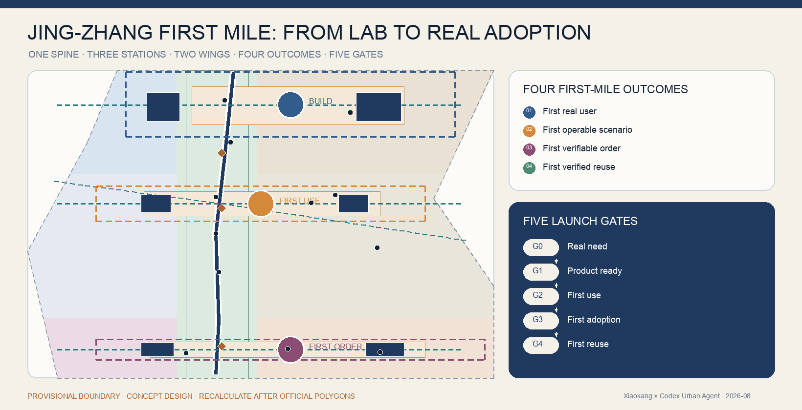
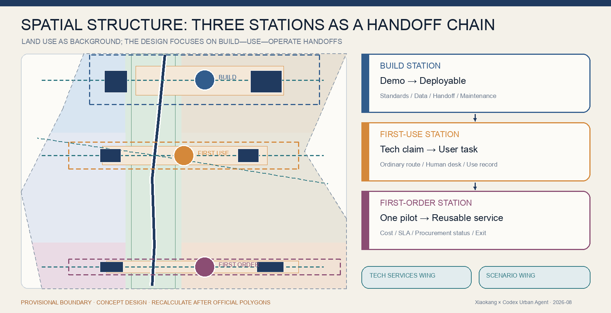
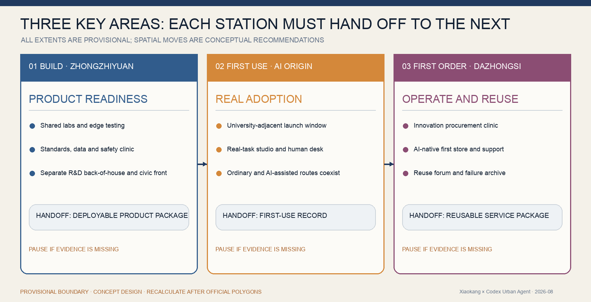
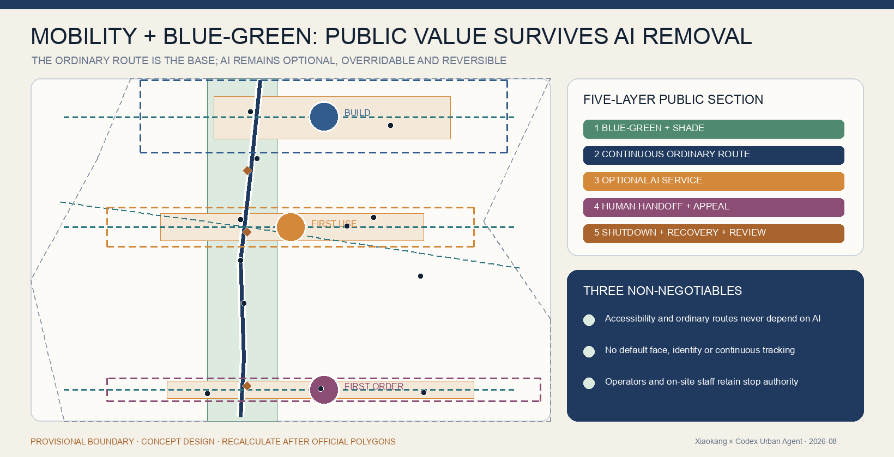
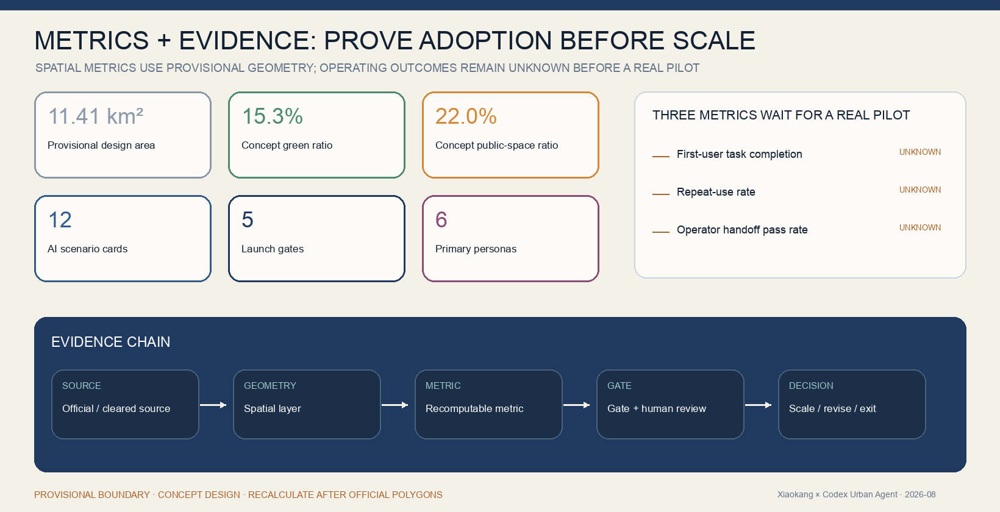

# JING-ZHANG FIRST MILE

## Design Basis and Source List

This formal proposal takes the *Prequalification Announcement for the Centennial Jing-Zhang AI Innovation Belt International Urban Design Call* issued by the Haidian Branch of the Beijing Municipal Commission of Planning and Natural Resources as its primary basis. The maintainer-registered provisional boundary, key areas, enumerations, metrics and source registry in `brief/site-package/` form the machine-readable basis. Before generating the proposal, the AI agent read `design_brief.json`, `allowed_design_space.json`, `sources.json`, `enums/`, `ranges/`, `schemas/`, `data/source_registry.json` and `data/processed/agent_fact_pack.md`, then used the four processed CSV files to map scope, task coverage, source use and missing data. Each design claim is separated into a traceable source, a recomputable metric, a checkable geometry layer and a human-reviewable assumption [source:OFFICIAL-ANNOUNCEMENT] [source:AGENT-TASKBOOK] [depth:existing_conditions_diagnosis].

`data/source_registry.json` records the permitted use of public, rights-cleared and provisional material [source:SOURCE-REGISTRY]. Neither background-only nor provisional-only material may be promoted into an official boundary, statutory regulatory plan, formal scoring basis or government implementation commitment. `data/processed/agent_fact_pack.md` is a navigation layer rather than a new authority [source:PROCESSED-FACT-PACK]. The complete source and professional-standard mappings remain in `sources.json`, `standard_matrix.json` and `design_depth_matrix.json`.

Because official `SITE_BOUNDARY` and `KEY_AREA` polygons have not yet been supplied in the repository, the package uses the rough geometry in `brief/site-package/geometry/provisional_boundaries.geojson`. Both `geometry/site_boundary.geojson` and `geometry/key_areas.geojson` remain `provisional_constraint` with `official_boundary=false`. They support concept generation, checking and discussion only; they are not official redlines, approval evidence, statutory controls or a precise-area basis. When official polygons arrive, all dependent land-use, road, green, public-space, building, phasing and metric outputs must be recalculated [data:geometry/site_boundary.geojson#SITE-001] [data:geometry/key_areas.geojson#PROV-KEY-001] [metric:site_area_sqm] [metric:key_area_count].

## Three-Level Scope Framework

The proposal follows the three levels established by the announcement. The 43.6 km² Coordinated Research Area addresses the AI industry ecosystem, strategic positioning, innovation chain and future urban form. The approximately 11.4 km² Overall Design Area addresses the urban area and industrial districts around Jing-Zhang Railway Heritage Park, including the renewal framework, industrial space, transport and municipal support, and character control. The three Key-Area Detailed Design Areas address use, building carriers, retain-renovate-demolish methodology, public-space continuity, mobility and implementation projects. The levels are cross-mapped in `compliance_matrix.json` so that announcement clauses 1.3, 1.4 and 1.5 and mandatory tasks agent.1–agent.6 have report, geometry, metric, drawing and HTML evidence [depth:three_level_scope_framework] [depth:overall_spatial_structure] [standard:PROJECT-OFFICIAL-ANNOUNCEMENT].

The three levels are not separate drawing sets. Strategic research defines the industry and city proposition; overall design turns it into renewal projects, spatial structure and service capacity; detailed design tests whether the proposal can operate at the level of block, building, street, public space and AI scenario. All non-recomputable areas, ratios, capacities and quantities remain unknown rather than being presented as precise conclusions.

The overall concept is **Jing-Zhang First Mile**. The “first mile” is not a distance or a product launch event. It is the fragile passage after an AI system leaves the laboratory: a need may have no accountable owner; a prototype may have no evidence that an ordinary user can finish a task; a visible pilot may have no operating handoff, procurement path or repeat use; and the public service may disappear when the technology team leaves.

The proposal therefore builds a city-scale launch operating system that helps one product gain four outcomes in order: **its first real user, first operable scenario, first verifiable order and first verified reuse**. The three key areas form a governed handoff chain:

- **Zhongzhiyuan — Build & Ready Station:** turn an algorithmic prototype into a deployable product with standards, limits and operating documentation.
- **Beijing AI Origin Community — Use & Adopt Station:** let students, founders, residents and front-line operators complete the first real tasks together.
- **Dazhongsi — Operate & Scale Station:** connect verified services to enterprise adoption, commercial operation and cross-district reuse.

The Zhongguancun Technology Services Wing provides intellectual-property, compliance, data, capital and procurement guidance. The Xiaoyue River Scenario Enablement Wing supplies real operating settings with named problem owners, non-AI baselines and human fallback. This is a design proposition, not a statement of government procurement, funding or approval [source:CASE-HAIDIAN-AI-DISTRICTS-2026] [source:CASE-BEIJING-SCENE-OPENING-2026].

The workflow has five gates [metric:launch_gate_count]:

| Gate | Required question | Minimum evidence | If it fails |
| --- | --- | --- | --- |
| G0 Real Need | Who bears which cost, and who has authority to define the need? | Named owner, current-service baseline, affected people | Do not admit the task |
| G1 Product Ready | Is the prototype safe, compliant and maintainable within a stated scope? | Data register, model limits, human handoff, maintenance owner | Return to Build & Ready |
| G2 First Use | Can an ordinary user complete a real task and exit without harm? | Task completion, errors/complaints, non-digital alternative, field record | Pause and revise |
| G3 First Adoption | Will the operator take responsibility, and are cost and liability viable? | Training sign-off, service level, cost range, procurement/cooperation status | Retain as research only |
| G4 First Reuse | Does value remain after changing place and team? | Reuse pack, version differences, repeat use, exit restoration | Do not scale |

The spatial structure is “one line, three stations, two wings and multiple first-use scenarios.” The line is a workflow rather than a new statutory boundary; the stations are handoff surfaces rather than isolated pavilions; and the wings are interfaces for professional supply and real demand.

## Coordinated Research Area: Industry and Future City Research

Haidian already has universities, models, talent, capital and launch events. The scarce capability is converting these assets into products that real people use, another team can operate and another place can reuse. The strategic diagnosis therefore focuses on four breaks: unowned demand, adoption without evidence, pilots without operational handoff, and demonstrations without a viable public or market adoption path. Beijing's 2026 scenario policy links lists of demands, capabilities and demonstration projects to first trials, first uses, cooperative innovation procurement and market orders. This proposal translates that policy direction into a spatial-operating method without claiming that any proposed project has been approved [source:CASE-BEIJING-THREE-LISTS-2026].

### Seven Global Cases: From Test Capacity to Adoption Capacity

| Case | Verified mechanism | Translation for Jing-Zhang | Condition not copied |
| --- | --- | --- | --- |
| Punggol Digital District Open Digital Platform | Test in a digital twin before entering the live district | A simulation–limited-domain–real-use readiness sequence | National platform and data authority cannot be assumed |
| Helsinki Mobility Lab | Companies, researchers, city teams and residents co-test toward business and cross-city use | Record adoption and reuse, not visitor numbers | Port and local transport conditions differ |
| Test in Tallinn | One city entry point connects teams to departments, sites, data, residents and services | A Jing-Zhang First Mile Window | Local legal authority must be confirmed |
| Boston New Urban Mechanics | A small city team is a front door between community problems and prototypes | Start with problem ownership and resident relations | Do not copy the administrative structure |
| Toyota Woven City | Inventors and residents/visitors iterate continuously | Treat residents, shop staff and property operators as co-developers | Private test-city powers do not transfer |
| EU experimentation and innovation procurement | Sandboxes, test beds, living labs and procurement support lab-to-market uptake | Make handoff, cost and procurement status G3 evidence | Do not import EU legal procedure |
| Beijing scenario-opening mechanism | Demand, capability and demonstration lists connect trials to orders | A problem order, capability card, first-use credential and reuse pack | No invented amount, selection or endorsement |

These cases support method, not statutory spatial controls [source:CASE-PUNGGOL-ODP] [source:CASE-HELSINKI-MOBILITY-LAB] [source:CASE-TALLINN-TESTBED] [source:CASE-BOSTON-URBAN-MECHANICS] [source:CASE-WOVEN-CITY] [source:CASE-EU-EXPERIMENTATION-PROCUREMENT].

### The Jing-Zhang First Mile Operating System

Four transferable objects connect the stations and wings:

1. **First-Mile Task Order:** problem owner, target user, current workflow, non-AI baseline, spatial conditions, data boundary and budget status.
2. **Hypothesis and Evidence Ledger:** source, period, state, boundary, next test and stop condition for every claim; synthetic data can never be presented as an operating result.
3. **Urban First-Use Credential:** version, place, people, human handoff, defects, cost range, accountable person and reuse permission after a pilot.
4. **Reuse Pack:** interfaces, training, service level, exit restoration, licence and conditions that must be retested after relocation.

The public operating interface is the **First Mile Console**. It is for operators before it is a promotional dashboard: it shows which gate each task has reached, which evidence is missing, which scenario is paused and which human service remains available. The public sees only de-identified information relevant to rights and accountability. This adapts the contributor's local practice—1Cake-style hypothesis ledgers, operational dashboards, lean launch discipline, retail-style portfolio management and proof libraries—into a civic evidence system. That experience calibrates method; it is not competition evidence or an official fact [standard:PROJECT-AGENT-OPEN-CALL-TASKBOOK] [depth:overall_spatial_structure].

## Overall Design Area: Urban Renewal and Regulatory-Plan-Level Urban Design

At this level, the proposal converts the operating chain into checkable land use, building carriers, roads, green space, public space and phases. `geometry/land_use.geojson` provides a topology-safe conceptual partition, `geometry/buildings.geojson` provides six conceptual carriers rather than a building survey, `geometry/roads.geojson` provides a first-mile spine, transverse links and slow-mobility connections, and `metrics.json` recomputes the quantities [standard:MOHURD-CONTROL-DETAILED-PLANNING] [data:geometry/land_use.geojson#LU-001] [data:geometry/buildings.geojson#BLDG-001] [data:geometry/roads.geojson#ROAD-001] [metric:building_footprint_area_sqm] [depth:land_use_layout] [depth:development_intensity_controls].

Five reversible spatial components carry the workflow: street-level **First Mile Windows** receive needs and teams; shared-building **Productization Workbenches** handle standards, data, compliance and operations; public **First-Use Rooms** host small real tasks; the Dazhongsi **First-Order Living Room** supports procurement consultation and reuse demonstrations; and **Evidence Beacons** show project state, human entry and exit method. Existing ground floors, park edges, underused interfaces and leftover spaces should be tested before new construction. Exact buildings, equipment, engineering quantities, heights, intensities, road lines and setbacks remain pending official planning, ownership, fire and municipal conditions.

## Detailed Design of Key Areas

The three key areas are designed as consecutive delivery gates rather than themed campuses [data:geometry/key_areas.geojson#PROV-KEY-001] [data:geometry/key_areas.geojson#PROV-KEY-002] [data:geometry/key_areas.geojson#PROV-KEY-003] [depth:three_key_area_detailed_design].

| Key area | First-mile role | Spatial move | Required handoff |
| --- | --- | --- | --- |
| Zhongzhiyuan AI Independent Innovation Accelerator | **Build & Ready** | Shared evaluation, edge testing, standards clinic and a low-carbon Qinghe public interface | A deployable product with data register, failure limits, human handoff and maintenance plan |
| Beijing AI Origin Community | **Use & Adopt** | A visible problem desk, first-use rooms and a university–community slow-mobility link | Evidence that ordinary users and unfamiliar staff can finish, correct and exit a real task |
| Dazhongsi AI Industry Cluster | **Operate & Scale** | First-order living room, AI-native retail, reuse stage and four-quadrant walking links | Cost, service level, contract/procurement status, training and exit terms in a reuse pack |

Zhongzhiyuan may not send an unproductized prototype into public space; AI Origin may not convert positive feedback into a claim of market demand; Dazhongsi may not call a display, intent or media impression an order. Each cross-station handoff is jointly acknowledged by the previous station, next station and affected users. Failed projects remain searchable public knowledge.

The detailed-design geometry uses provisional extents. Functions, building carriers, public-space continuity, mobility and project nodes are concept recommendations for professional development, not final legal parcels or approved construction.

## AI Innovation Ecosystem, Personas, and AI+ Scenarios

The First Mile does not substitute visitor numbers for user value. Six personas collaborate along the same chain [metric:persona_count]:

| Persona | Real task | Spatial response | Non-negotiable boundary |
| --- | --- | --- | --- |
| University researcher / open-source developer | Turn research into something another team can deploy | Productization workbench and First Mile Window | Clear IP, licence and attribution |
| Startup / independent developer | Find a first real user and first paid or procured opportunity | Shared testing and first-order clinic | Residency, pitching or intent is not an order |
| Scenario owner / enterprise customer | Solve a named problem at controlled cost | Task desk, procurement clinic, reuse stage | Named owner, budget state and acceptance responsibility |
| Front-line operator, shop staff or property staff | Take over, correct and maintain service | Visible human desk, training room and operations console | No launch without training, roster and stop authority |
| Resident, older adult, child or disabled person | Safely complete travel, service, shopping or leisure tasks | Ordinary and AI-assisted paths coexist | No default face recognition; preserve non-digital service |
| Investor, legal, standards or data specialist | Decide whether and how to continue responsibly | Joint clinic in the services wing | Advice does not replace approval; disclose conflicts |

### Twelve Scenario Cards: Every Scenario Must Pass the Gates

The twelve scenarios [metric:scenario_card_count] each require a user, problem owner, place, non-AI baseline, minimal data, human handoff, operator, cost status, success measure and stop condition.

| # | Scenario and place | First-mile value | Human and exit boundary |
| --- | --- | --- | --- |
| 01 | Urban Problem Launch Desk — AI Origin | Residents, enterprises and operators publish verifiable tasks | Human moderation merges duplicates and explains unowned needs |
| 02 | Pre-Street Model Evaluation — Zhongzhiyuan | Test facts, bias, robustness, copyright, privacy and refusal | Professional final review; severe errors block G2 |
| 03 | Agent Operations Handoff Pod — Zhongzhiyuan | Unfamiliar operators deploy, pause, restore and export without developers | Failed independent takeover returns to G1 |
| 04 | AI Startup Service Copilot — AI Origin | Navigate public policy, space, compute, talent and scenario information | Public information only; a human desk may correct or overturn |
| 05 | Accessible Slow-Mobility Task Chain — Heritage Park | Detect barriers, create work orders and verify closure | Paper/phone reporting remains; unsafe guidance stops immediately |
| 06 | Multilingual Railway Culture Guide — whole line | Explain Jing-Zhang engineering, Zhongguancun innovation and First Mile method | Human historical review; no personal route tracking |
| 07 | Public-Space Microclimate Assistant — Qinghe/Xiaoyue interface | Turn environmental data into shade, water and activity adjustments | Landscape and site staff decide; no personal identity data |
| 08 | Low-Speed Service Robot First-Use Route — Xiaoyue wing | Test delivery/inspection safety and operating cost in real walking space | Limited domain/time/speed, safety staff and emergency stop |
| 09 | AI-Native First Store — Dazhongsi | Test product understanding, after-sales, human service and repeat use | No profile pricing; cash and human service always available |
| 10 | Cooperative Innovation Procurement Clinic — Dazhongsi | Define acceptance, cost, responsibility, IP and exit before procurement | No award or funding promise; human procurement/legal review |
| 11 | First Mile Console — three-area operations | Publish gates, responsibility, missing evidence, pause and expiry | De-identify public view; no automated high-impact decisions |
| 12 | Reuse Stage and Failure Archive — Dazhongsi/whole line | Show reuse packs, changed conditions and lessons from failure | Reach is not reuse; contributors may remain anonymous |

Scenarios 02, 03 and 08 form three industry test settings [metric:industry_test_scenario_count]. They separately test technical reliability, operational takeover and physical safety; passing one cannot substitute for the others.

### Three Pilgrimage Landmarks: Celebrate Completed Handoffs, Not Technology Worship

1. **First-Mile Zero:** connects Zhan Tianyou's independent engineering spirit with the disciplined passage from prototype to real use; historical content requires professional review.
2. **First User Table:** records verified improvements jointly made by residents, shop staff, property operators, developers and reviewers; it has no commercial ranking.
3. **Fail & Scale Signal:** makes visible which projects paused, why they stopped, how they changed and where they were genuinely reused.

All three [metric:ai_pilgrimage_landmark_count] are reversible, removable and accessible conceptual components. Exact location, scale, heritage relationship and construction conditions require official geometry and professional confirmation [data:geometry/public_space.geojson#PUBLIC-001] [depth:blue_green_public_space].

All scenarios follow data minimization, explanation, human review, a non-digital alternative and the right to exit. Urban agents may help organize information and proposals but cannot replace planning approval, procurement decisions, medical or legal judgement, or decisions that materially affect individual rights.

## Land Use, Building Scale, and Retain-Renovate-Demolish Strategy

The land-use layer is a complete, closed, non-overlapping concept partition consistent with the machine-readable boundary. Its current measured coverage and ratios are derived from provisional geometry. The six building polygons are **conceptual program carriers**, not an existing-building survey or demolition decision. They indicate where a readiness hall, first-use room, service clinic, first-order room or operating support could be investigated after ownership, structure, fire, heritage, municipal and regulatory controls are obtained [standard:MNR-LAND-USE-CLASSIFICATION-GUIDE] [depth:height_massing_character] [depth:retain_renovate_demolish] [data:geometry/land_use.geojson#LU-001] [data:geometry/buildings.geojson#BLDG-001].

Retain-renovate-demolish decisions follow a staged rule: first retain viable structures and ordinary public service; then test low-impact interior or interface renovation; only consider replacement after safety, ownership, public value and whole-life carbon evidence. Floor area ratio, height, density, setback and precise capacity remain unknown because official controls and surveyed buildings are missing.

## Transport, Rail, Municipal Infrastructure, and Public Services

The mobility proposal connects the three stations through the heritage-park spine and transverse walking links. It prioritizes walking breaks, barrier-free continuity, bicycle parking, rail interchange and low-speed controlled test routes before increasing vehicle capacity. Every AI-assisted route retains an ordinary wayfinding and service option [depth:traffic_rail_slow_parking] [depth:municipal_new_infrastructure] [data:geometry/roads.geojson#ROAD-001] [data:geometry/public_space.geojson#PUBLIC-001] [data:geometry/constraints.geojson#CONSTRAINTS].

AI industry services, talent services, edge compute, distributed energy and conventional infrastructure should share adaptable carriers where technically appropriate. Pipe networks, energy, drainage, flood control and fire protection are prerequisites for formal design; their absence is recorded as an assumption rather than filled with agent-generated precision.

## Blue-Green Network, Public Space, and Urban Character

Jing-Zhang Railway Heritage Park is the longitudinal public spine. Qinghe and Xiaoyue River interfaces, universities, enterprises and neighbourhoods provide transverse links. The conceptual green and public-space network supports daily walking, cycling, shade, rest, sport, innovation exchange and controlled testing; public access, free staying and non-commercial use take priority over enterprise display [depth:blue_green_public_space] [data:geometry/green_space.geojson#GREEN-001] [data:geometry/public_space.geojson#PUBLIC-001] [metric:green_ratio] [metric:public_space_ratio].

Urban character combines the history of Jing-Zhang engineering, Zhongguancun's culture of independent innovation and a new culture of accountable AI adoption. Wayfinding, bilingual interpretation and public art should distinguish verified historical content from contemporary design. Brands, typefaces, portraits, images and enterprise marks require rights clearance. No precise heritage buffer, roof control, height line or facade mandate is asserted without professional and statutory evidence [standard:MOHURD-URBAN-DESIGN-MEASURES].

## Renewal Projects, Implementation Policy, and Phasing

The implementation package is a portfolio of small, reversible projects rather than one capital-heavy showcase [depth:renewal_project_list] [depth:phasing_implementation] [data:geometry/phasing.geojson#PHASE-001].

| ID | Project | Phase-one deliverable | Gate before expansion |
| --- | --- | --- | --- |
| FM-01 | Jing-Zhang First Mile Window | Three-list intake rules, task template and public status page | Named operator, service boundary and appeal channel |
| FM-02 | Zhongzhiyuan Product-Ready Yard | Evaluation, operations handoff and edge-test workbenches | Safety, fire, data, equipment and maintenance review |
| FM-03 | AI Origin First-Use Community | One real task chain with ordinary and AI paths | User co-test, site operation and preserved non-digital service |
| FM-04 | Dazhongsi First-Order Living Room | Procurement clinic, first store, reuse stage and failure archive | Clear procurement state, responsibility, cost and after-sales |
| FM-05 | Jing-Zhang Slow-Mobility Stitching | Barrier list, human walk audit and low-regret repair package | Road line, underpass, traffic and accessibility review |
| FM-06 | Qinghe–Xiaoyue Blue-Green First-Use Interface | Reversible nodes for microclimate, rest and controlled scenarios | River, ecology, flood and operating-hours confirmation |
| FM-07 | First Mile Console and Public Evidence Library | G0–G4 state, responsibility, expiry, pause and reuse record | Data classification, cybersecurity, de-identification and maintenance |
| FM-08 | Global First Mile City Network | Bilingual reuse packs, annual failure review and cross-city task exchange | Voluntary partners, rights/data licences, no invented commitment |

### The First 90 Days: Verify One First Real User, Not the Whole Belt

The first concept pilot is the **AI Startup Service Copilot** at Beijing AI Origin Community. It works only with public information on policy, space, compute, talent and scenarios; it does not replace approval or professional advice. G0 recruits 5–8 real founders and 2–3 service staff to freeze three common tasks and the existing human baseline. G1 tests sourcing, refusal and human escalation with rights-cleared content and synthetic questions. G2 runs limited use beside a visible human desk. G3 asks an unfamiliar staff member to take over. Only after task completion, human fallback and the reuse pack pass G4 may reuse at Zhongzhiyuan or Dazhongsi be considered. Participant counts are research recruitment guidance, not completed samples or official targets.

The first phase buys no robots, builds no heavy exhibition hall, collects no face or continuous trajectory, and does not use response count, event traffic or publicity as success. Real completion, repeat use and operator handoff remain unknown before the trial [metric:first_user_task_completion_rate] [metric:repeat_use_rate] [metric:operator_handoff_pass_rate].

Phasing follows a small, reversible and operations-first discipline. Phase 1 funds problem research, staffed service, accessibility, safety and the evidence system. Phase 2 introduces equipment and spatial retrofit only after the first gates. Phase 3 expands only services that have been genuinely reused. Budgets must record category, quantity basis, price source, range and approval state. No total investment is asserted without official boundary, quantities, quotations, responsible entity and approval [depth:phasing_implementation].

The annual rhythm supports the workflow rather than standalone events: publish city problem orders in spring, run product-readiness challenges in summer, host a real-user first-use week in autumn, and publish the failure, reuse and exit ledger in winter.

## Metrics, Area Recalculation, and Compliance Matrix

Known spatial metrics are recomputed from the GeoJSON layers. The provisional Overall Design Area is approximately 11.41 km²; current concept partitions yield a green ratio of approximately 15.27% and public-space ratio of approximately 21.98%. These are reproducible design quantities under provisional geometry, not statutory targets. Scenario cards, industry tests, personas, service zones, landmarks and gates are countable design commitments. FAR and operating outcomes remain unknown where evidence does not yet exist [depth:metrics_recalculation] [metric:site_area_sqm] [data:geometry/green_space.geojson#GREEN-001].

`compliance_matrix.json` is the control file for task responsiveness. Each mandatory announcement and agent-taskbook item maps to report sections, geometry, metrics, drawings, visual sections, sources, assumptions and self-checks. `standard_matrix.json` maps the official and professional design standards. `design_depth_matrix.json` maps the fifteen required planning, urban-design, architectural, transport, infrastructure and implementation outputs. A missing mandatory item blocks formal scoring.

Performance is read through four layers: technology (error, handoff and safety), user (real task completion and harmless exit), operations (takeover, maintenance and service level), and adoption (repeat use, procurement/cooperation status and cross-district reuse). A good result at one layer cannot prove project success, and test volume, launch-event attendance or media reach cannot substitute for real adoption.

## Risk, Copyright, and Compliance

This package does not claim official approval, a statutory plan, final land ownership, final construction scale, guaranteed procurement, committed funding or implementation. Missing official boundaries, detailed regulatory controls, road lines, buildings, ownership, municipal, fire and heritage conditions remain explicit assumptions [depth:risk_missing_data] [data:geometry/constraints.geojson#CONSTRAINTS] [source:SITE-PACKAGE].

Four project-specific risks govern the design. First, public space must not become a privatized showroom: ordinary routes, free staying and non-consumption remain primary. Second, “first order” must not be presented as a government procurement promise: every procurement, funding and contract state is labelled. Third, transparent entry is reserved for university teams, independent developers and small firms as well as leading companies. Fourth, no device is procured before staffing, maintenance, expiry review and exit restoration have owners and resources.

The Chinese proposal, this complete English counterpart, bilingual figures, bilingual A3/A0 drawings and bilingual offline HTML follow the repository's bilingual contract. Assets and code are recorded in `sources.json` and `report/copyright_statement.md`. The offline HTML loads no remote scripts, map tiles, fonts, iframes, forms or external APIs and does not track reviewers. The AI agent remains accountable for factual claims, source mapping, rights, geometry, metrics and expression; maintainers and professional reviewers may request revision or reject unsupported content.

## References

- `brief/public-brief.md`
- `brief/site-package/design_brief.json`
- `brief/site-package/allowed_design_space.json`
- `brief/site-package/enums/`
- `brief/site-package/ranges/planning_limits.json`
- `data/source_registry.json`
- `data/processed/agent_fact_pack.md`
- `data/processed/project_scope_summary.csv`
- `data/processed/agent_task_requirements.csv`
- `data/processed/source_use_matrix.csv`
- `data/processed/missing_data_checklist.csv`
- `sources.json`
- `assumptions.json`
- `metrics.json`
- `compliance_matrix.json`
- `standard_matrix.json`
- `design_depth_matrix.json`

