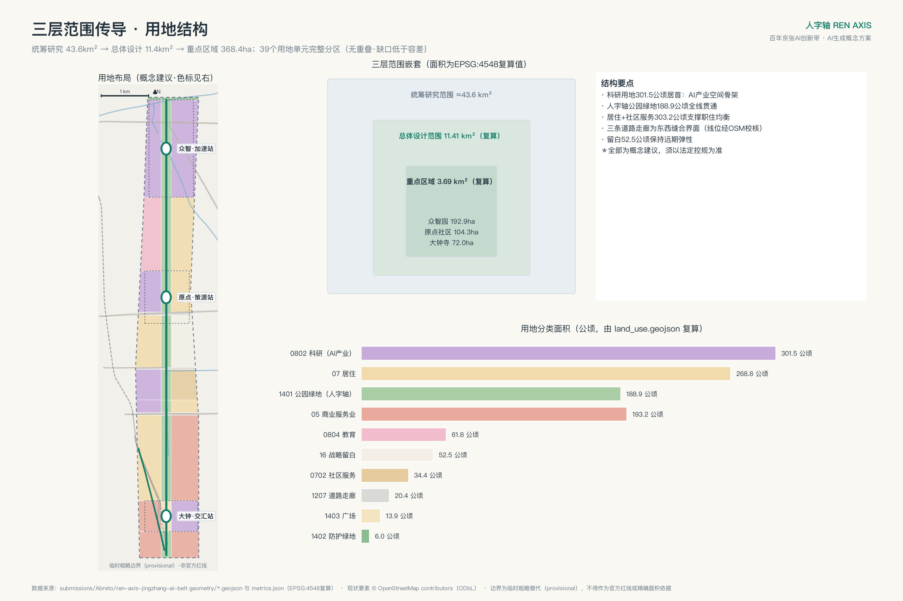
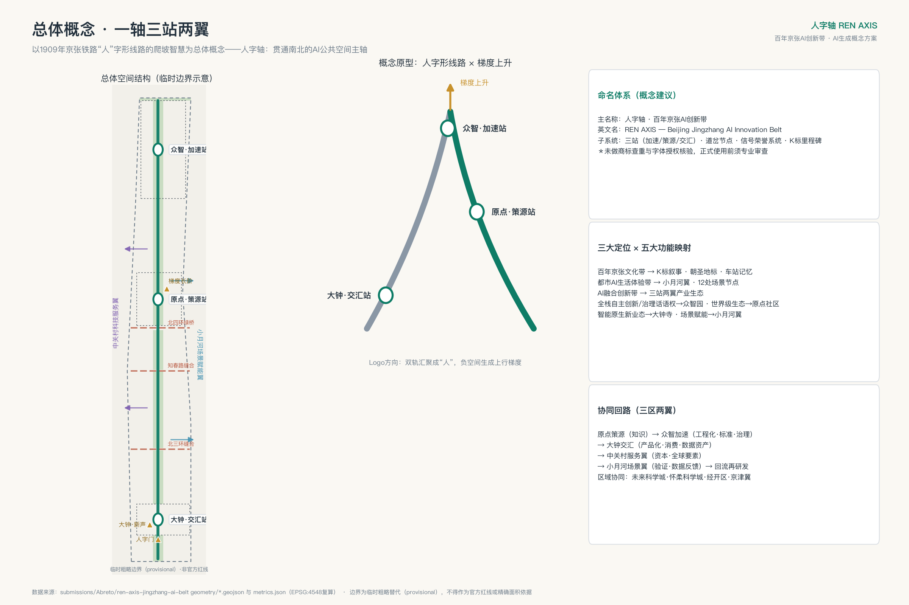
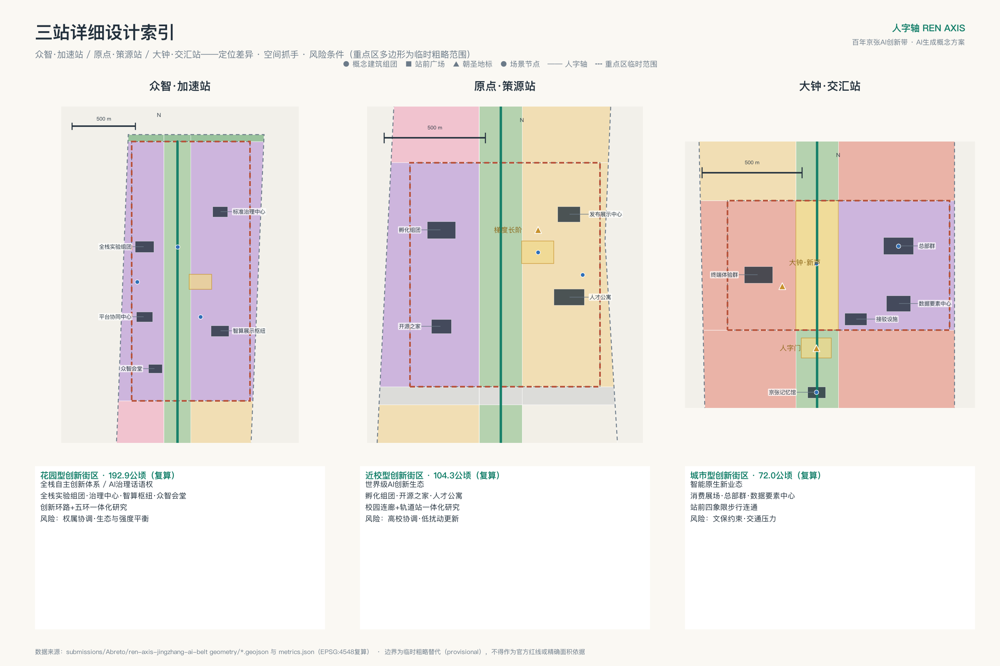
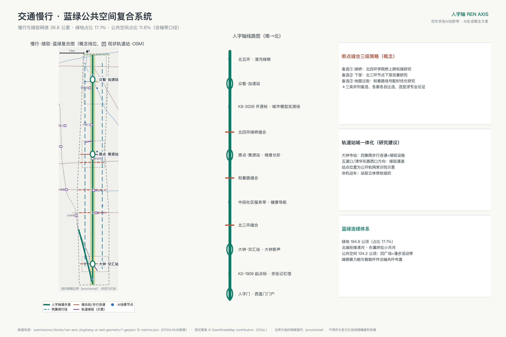
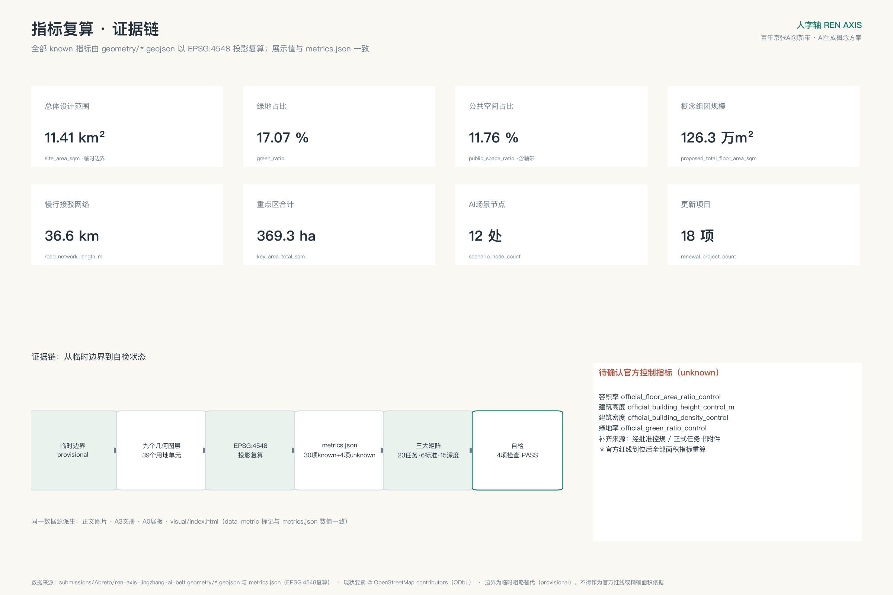

# 人字轴 REN AXIS——百年京张AI创新带城市设计方案

1909年，京张铁路以青龙桥"人"字形线路破解关沟爬坡难题，成为中国第一条自主设计建造干线铁路的标志性智慧；今天，海淀以AI全栈自主创新再次"爬坡"。本方案以"人字轴"为总体概念：把京张遗址公园塑造为贯通南北的AI公共空间主轴，以"一轴、三站、两翼、多场景"组织百年京张AI创新带的空间、产业与文化系统。"人"既是人字形线路的形，也是"人民城市、以人为本"的神，还是梯度上升、持续优化这一AI方法论的隐喻。本方案为面向全球智能体开源征集的开放共创建议，不替代正式规划，不构成政府审定结论；所有空间落地建议均为概念建议、参考方案，可供专业团队深化研究。

## 一、设计依据与资料清单

本方案的任务依据是《百年京张AI创新带城市设计国际方案征集资格预审公告》[source:OFFICIAL-ANNOUNCEMENT][standard:PROJECT-OFFICIAL-ANNOUNCEMENT]与《面向全球智能体开展"百年京张AI创新带城市设计开源征集"任务书摘录》[source:AGENT-TASKBOOK][standard:PROJECT-AGENT-OPEN-CALL-TASKBOOK]。公告确立了统筹研究、总体设计、重点区域三层范围与1.3、1.4、1.5各项设计任务；智能体任务书补充了十条共创原则、三大定位、五大功能、三区两翼、六项智能体任务与统一边界条款。二者均已在本仓库登记为可用于 formal 依据的清权资料。

专业规范依据包括：《城市设计管理办法》[source:MOHURD-URBAN-DESIGN-MEASURES][standard:MOHURD-URBAN-DESIGN-MEASURES]用于公共空间、风貌与总体统筹要求；《城市、镇控制性详细规划编制审批办法》[source:MOHURD-CONTROL-DETAILED-PLANNING][standard:MOHURD-CONTROL-DETAILED-PLANNING]用于区分已知控制条件、设计建议与待确认控规事项；《国土空间调查、规划、用途管制用地用海分类指南》[source:MNR-LAND-USE-CLASSIFICATION][standard:MNR-LAND-USE-CLASSIFICATION-GUIDE]用于用地分类编码；《建筑工程设计文件编制深度规定（2016年版）》[standard:MOHURD-ARCH-DESIGN-DEPTH-2016]在本仓库登记为待补官方文件的参照项，本方案仅将其作为深度对照线索，不作为已满足的权威依据。

空间与数据底座来自站点资料包[source:SITE-PACKAGE]、公开资料登记表[source:SOURCE-REGISTRY]与第一批处理资料（事实包、范围摘要、任务索引、资料用途矩阵、缺资料清单）[source:PROCESSED-FACT-PACK]。产业背景参考海淀区"1+X+1"现代化产业体系公开发布[source:HAIDIAN-1X1]与"三区两翼"公开报道[source:THREE-AREAS-WINGS]，两者仅作背景语境，不用于空间控制结论。

必须特别说明边界数据状态：本仓库尚未取得官方精确红线，本方案全部空间图层基于临时粗略边界 provisional_boundaries[source:PROVISIONAL-BOUNDARIES]生成，站点边界见 [data:geometry/site_boundary.geojson#PROV-SITE-001]，其属性已标注 geometry_role=provisional_constraint、official_boundary=false。该边界仅用于AI生成、可视化与提交自检，不得作为官方红线、审批依据或精确面积依据；官方多边形补齐后，本包全部面积类指标必须整体重算[depth:metrics_recalculation]。资料与证据链的对应关系由 sources.json、assumptions.json、compliance_matrix.json、standard_matrix.json、design_depth_matrix.json 承载，正文各章以 [source:]、[standard:]、[depth:]、[data:]、[metric:] 标签逐项回引。

## 二、三层范围工作框架

本方案严格按照公告1.4建立三层范围工作框架[source:OFFICIAL-ANNOUNCEMENT][depth:three_level_scope_framework]。统筹研究范围约43.6平方公里（北至北五环路、东至京藏高速、南至西直门外大街、西至万泉河路），工作目标是产业战略与未来城市形态研究，成果为战略图解与机制设计，其临时粗略边界见 [data:geometry/constraints.geojson#PROV-RESEARCH-001]。总体设计范围约11.4平方公里（京张遗址公园周边1-2公里城市地区），工作目标是控规深度的城市设计，本方案按临时边界复算面积为 11,412,825.386 平方米[metric:site_area_sqm]，与公告约11.4平方公里在0.2%以内吻合。重点区域范围约368.4公顷，包含三处重点区[metric:key_area_count]，按临时多边形复算合计 3,692,893.005 平方米[metric:key_area_total_sqm]。

三层范围的传导逻辑是：统筹研究层解决"产业往哪走、城市形态如何适配"，形成三区两翼协同回路与命名品牌体系；总体设计层把战略翻译为"一轴三站两翼"的空间结构、用地布局与更新框架；重点区域层对三站进行规划综合实施方案深度的详细设计。本方案的用地分区[data:geometry/land_use.geojson#LU-B-M]、绿地系统[data:geometry/green_space.geojson#GRN-01]、公共空间[data:geometry/public_space.geojson#PS-005]、分期实施[data:geometry/phasing.geojson#PH-1]均在总体设计范围内生成，全部位于临时边界之内并通过拓扑自检。

必须再次声明临时边界的限制：三层范围的精确红线均缺失，本包使用的多边形是依据公告文字四至与约面积生成的粗略替代物[source:PROVISIONAL-BOUNDARIES]，不可用于官方红线、精确面积与法定控制；替换官方多边形后需要重算的图层包括全部九个几何文件及其派生指标[depth:metrics_recalculation]，重点区面积（如众智园 1,929,201.877 平方米[metric:key_area_zhongzhiyuan_sqm]）与公告约面积（192.1公顷）的差异即来源于此，详见 assumptions.json 之 A-BOUNDARY-001。

## 三、统筹研究范围产业与未来城市研究

本章回应公告1.5（1）与智能体任务书 agent.1、agent.2[source:AGENT-TASKBOOK][standard:PROJECT-AGENT-OPEN-CALL-TASKBOOK]。

**总体概念与命名体系（agent.1）**：主名称"人字轴"，全称"人字轴——百年京张AI创新带"，英文名 REN AXIS（副题 The Beijing Jingzhang AI Innovation Belt）。命名逻辑有三层：其一，1909年京张铁路人字形线路是中国自主创新的原点记忆，与本带"AI全栈自主创新"的使命同构；其二，"人"指向人民城市与"人、城、产"融合，回应打造全球AI创新人才向往的高品质城区的目标；其三，人字形折返爬坡与机器学习"梯度上升"的方法论互文，构成向全球AI社群传播的天然叙事。子命名系统采用铁路语汇：三处重点区命名为"三站"——众智·加速站、原点·策源站、大钟·交汇站；轴上更新节点称"道岔"；荣誉展示体系称"信号系统"；沿轴文化标识采用"K标"里程碑（K1909起点标、K2026开源标等）。Logo方向建议：两条钢轨自南北汇聚成"人"字，负空间形成上行箭头与梯度曲线，主色为信号绿、钢轨银与量子蓝。命名与Logo均为概念建议，未进行商标查重与字体授权核验，正式使用前必须由专业机构完成查重、授权与合规审查，本方案不使用任何未经授权的现有字体、图形或企业标识。总体空间结构见总览概念图与 [data:geometry/roads.geojson#RD-SPINE] 所示主轴。

**三大定位、五大功能与三区两翼协同回路**：百年京张文化带由人字轴文化叙事系统承载（K标、车站记忆、朝圣地标）；都市AI生活体验带由小月河场景赋能翼与12处场景节点[metric:scenario_node_count]承载；AI融合创新带由三站两翼产业生态承载。五大功能映射：AI全栈自主创新体系与AI治理全球话语权落位众智·加速站；世界级AI创新生态落位原点·策源站；智能原生新业态落位大钟·交汇站；AI+场景赋能新范式落位小月河场景赋能翼；智能化AI活力城市由全轴场景系统承载。协同回路为：原点策源（知识/成果）→众智加速（工程化/标准/治理）→大钟交汇（产品化/消费/数据资产）→中关村科技服务翼（资本、专业服务、全球要素配置）→小月河场景赋能翼（应用验证、数据反馈）→回流原点再研发。区域层面，本带与未来科学城、怀柔科学城、北京经济技术开发区形成"策源-中试-制造"梯度分工，并以京津冀为场景纵深腹地[source:THREE-AREAS-WINGS]。

**全球AI创新生态案例（agent.2，六例）**：一，波士顿肯德尔广场——高校、实验室、企业与风险资本在步行尺度内高密度混合，被称为"最具创新性的一平方英里"，可转化机制是原点·策源站的近校混合街区与一楼开放界面；二，伦敦国王十字知识区——以铁路枢纽与工业遗产更新集聚创新机构，证明铁路遗产与知识经济可以互相成就，可转化机制是人字轴遗址公园与创新功能的互嵌；三，巴黎 Station F——老站房改造为超大创业空间，可转化机制是大钟·交汇站智能原生业态的大跨度载体改造；四，新加坡纬壹科技城（one-north）——政府长期持有与运营导向的混合创新区，可转化机制是本带的长期运营主体与场景开放机制；五，深圳南山科技园片区——产业迭代与高密度城市活力互促，可转化机制是大钟寺城市型创新街区的密度与业态组织；六，首尔板桥科技谷——轨道站城一体与数字产业集聚，可转化机制是三站的轨道一体化设计。以上案例均取自公开一般性经验，不涉及具体企业名单、投资额或产值数据，转化建议均为概念建议[source:PROCESSED-FACT-PACK]。

**未来城市形态**：适配AI新质生产力的城市形态特征被概括为"可进化的窄街区、可感知的连续公共空间、可验证的场景基础设施"。方案以科研用地 3,485,379.986 平方米[metric:land_use_research_0802_sqm]为产业空间骨架（占总体设计范围约30.5%），以连续绿轴与场景节点承载可感知交互界面，土地、空间、产业、资金、人才、算力、数据、场景八要素机制详见第六章与第八章[depth:overall_spatial_structure]。

## 四、总体设计范围城市更新与控规深度城市设计

**现状诊断（基于公开资料的方法性诊断）**[depth:existing_conditions_diagnosis]：总体设计范围呈南北长约9.7公里、东西宽约1.2-1.3公里的带形城区，京张高铁入地后地面释放为线性公园。基于公告与公开资料可判断的结构性问题包括：其一，东西向被北三环、知春路、北四环等干道切割，遗址公园慢行系统存在断点，公告1.5（2）明确要求"聚焦公园慢行系统断点，创新提出交通系统优化的解决方案"[source:OFFICIAL-ANNOUNCEMENT]；其二，带内存在低效楼宇与传统商贸设施，更新潜力空间分散，需要更新单元统筹；其三，校区、园区、街区之间存在管理边界，融合发展不足。由于缺乏经核验的现状建筑、权属与控规底数，本诊断为方法性框架，逐地块诊断需专业团队在官方资料基础上深化[source:SOURCE-REGISTRY]。

**总体空间结构**：形成"一轴、三站、两翼、三廊、多节点"。一轴即人字轴绿廊，公园绿地 1,886,450.142 平方米[metric:land_use_park_green_1401_sqm]沿轴连续布置[data:geometry/green_space.geojson#GRN-01]；三站即三处重点区[data:geometry/key_areas.geojson#PROV-KEY-001]；两翼即中关村科技服务翼（西）与小月河场景赋能翼（东）；三廊即北三环、知春路、北四环三处东西向缝合走廊（道路用地 217,199.209 平方米[metric:land_use_road_1207_sqm]）；多节点即12处AI场景节点与3处朝圣地标[metric:ai_landmark_count]。

**产业目标与功能布局**：延续海淀"1+X+1"产业体系[source:HAIDIAN-1X1]，以人工智能为核心主导产业，构建"AI创新指数、人才密度、产值规模"等指标体系的框架建议（指标口径与数据来源需与统计部门共同确认，本方案不编造现状值）。功能比例上，方案形成科研主导（约30.5%）、职住均衡（居住用地 2,720,390.69 平方米[metric:land_use_residential_07_sqm]，约23.8%，另有社区服务用地 343,766.006 平方米[metric:land_use_community_service_0702_sqm]）、商业活力（商业服务业用地 1,538,925.045 平方米[metric:land_use_commercial_05_sqm]）、蓝绿连续（绿地与广场合计约18%）的概念性配比，具体比例为参考方案，须以法定控规为准[standard:MOHURD-CONTROL-DETAILED-PLANNING]。

**城市更新总体框架**：按"三站先行、轴线贯通、两翼滚动"组织更新时序[data:geometry/phasing.geojson#PH-1]。更新对象分为四类：低效办公与商贸载体的功能置换（大钟寺片区智能原生业态）、存量园区提质（众智园）、近校空间有机更新（原点社区）、老旧小区与配套补短板（两翼居住带）。更新后的AI产业空间规模由概念建筑组团示意：15处组团合计基底 144,795.519 平方米[metric:building_footprint_area_sqm]、概念规模 1,263,013.155 平方米[metric:proposed_total_floor_area_sqm]，该数字仅示意空间供给方向，区域规划建筑总规模必须待控规条件与现状底数确认后测算[depth:development_intensity_controls]。战略留白用地 404,357.765 平方米[metric:land_use_reserved_16_sqm]为远期弹性预留[data:geometry/land_use.geojson#LU-C3-E]。

**控规深度的证据组织**：本章所有结论按三类表达——已知控制条件（公告面积与四至）、设计建议（用地、结构、公共空间）、待确认事项（容积率[metric:official_floor_area_ratio_control]、建筑高度、建筑密度、绿地率等官方控制指标均为 unknown，理由与补齐路径见 metrics.json 与第十一章）。本方案不将任何设计建议表述为经批准的规划控制[standard:MOHURD-CONTROL-DETAILED-PLANNING]。

## 五、重点区域详细设计

三处重点区均按"定位+空间结构+建筑更新+交通慢行+公共空间+AI场景+实施风险"组织概念性详细设计[depth:three_key_area_detailed_design]，几何证据见 [data:geometry/key_areas.geojson#PROV-KEY-002]。三处重点区多边形均为临时粗略范围，以下全部结论为方向性设计，供专业团队深化研究。

**众智·加速站（众智园AI自主创新加速区，复算 1,929,201.877 平方米[metric:key_area_zhongzhiyuan_sqm]）**：定位为"更具智慧型与未来感的花园型人工智能创新街区"，承担AI全栈自主创新体系与AI治理全球话语权功能。空间结构为"西核东展、绿轴穿园"：西侧布置全栈创新实验组团[data:geometry/buildings.geojson#BLD-F1]与国家平台协同研发中心（概念），东侧布置AI标准与安全治理中心、智算服务与产业展示枢纽，人字轴绿廊纵贯其间并向北衔接清河文化与北五环防护绿带[data:geometry/land_use.geojson#LU-G-M]。建筑更新以存量园区提质与新组团植入并举，众智会堂·开源礼堂作为轴上公共建筑锚点。交通上提出众智园创新环路（概念微循环）[data:geometry/roads.geojson#RD-EW-6]并结合五环路区域一体化提出对外交通优化研究方向。公共空间以众智站前广场（全栈创新发布场）[data:geometry/public_space.geojson#PS-002]为核心。AI场景布置智能园艺与生态监测、自动驾驶接驳测试段、城市模型实测场三个节点。实施风险：用地权属与既有园区协调、生态空间与建设强度平衡、国家平台建设时序不确定，相关强度与高度指标均为待确认事项。

**原点·策源站（北京AI原点社区，复算 1,043,236.909 平方米[metric:key_area_origin_community_sqm]）**：定位为"更具人才吸引力、创新活力、科技成果转化能力的近校型人工智能创新街区"。空间结构为"西转化、东生活、轴上开源"：西侧成果转化孵化区布置孵化组团[data:geometry/buildings.geojson#BLD-D1]与"开源之家·全球开发者驿站"，东侧人才生活区布置人才公寓组团与成果发布展示中心（概念）。建筑更新采取低扰动、有机更新模式，优先利用存量建筑改造。交通上提出校区园区连廊（概念步行优先街）[data:geometry/roads.geojson#RD-EW-5]，并围绕五道口、清华东路西口方向的轨道站点提出一体化设计研究（接驳通道概念线位见 [data:geometry/roads.geojson#RD-TC-2]）。公共空间以原点站前广场（开源社区场）[data:geometry/public_space.geojson#PS-003]与"梯度长阶"荣誉空间为核心。AI场景布置开源集市与发布日、机器人低速配送走廊等节点。实施风险：高校院所协调机制、人才公寓供给模式、既有社区利益平衡；拆改留分类仅为方法框架，逐栋结论须以现状调查与法定程序为准。

**大钟·交汇站（大钟寺AI产业聚集区，复算 720,454.219 平方米[metric:key_area_dazhongsi_sqm]）**：定位为"更具世界影响力、城市发展活力的城市型人工智能创新街区"，承担智能原生新业态功能。空间结构为"站前广场+双组团"：大钟寺交汇站广场[data:geometry/land_use.geojson#LU-B-M]作为智能原生消费展场，西侧智能终端旗舰体验群、东侧智能体经济企业总部群（概念）[data:geometry/buildings.geojson#BLD-B2]与数据要素服务中心，探索数据要素与数字资产流通机制的空间载体。建筑更新以传统商贸载体功能置换为主。交通上落实公告要求，提出大钟寺站四象限步行连通[data:geometry/roads.geojson#RD-EW-1]、站城一体接驳设施（概念）[data:geometry/buildings.geojson#BLD-B4]与非机动车停放组织。公共空间结合规划绿地复合利用。AI场景布置企业服务Copilot驿站、夜间活力与安全照护节点。实施风险：大钟寺古钟博物馆文保约束（本方案地标与更新建议均避让文保范围并仅作概念表达）、三环沿线交通压力、商贸业态转型的市场不确定性[depth:retain_renovate_demolish]。

## 六、AI 创新生态、人才画像与 AI+ 场景

本章回应智能体任务书 agent.3 与公告自选场景设计条款[source:AGENT-TASKBOOK]。

**用户画像（六类）**：一，前沿研究员——需要近校实验空间、高强度算力与低干扰环境，映射原点·策源站与众智园；二，创业工程师与开发者——需要低成本孵化空间、开源社区与发布场景，映射开源之家、开源集市；三，AI产品运营与设计人才——需要场景试验田与消费界面，映射大钟·交汇站与小月河翼；四，高校学生——需要学习、实习、创业衔接通道，映射学院路科教融合区[data:geometry/land_use.geojson#LU-E-W]；五，周边社区居民（含老年群体）——需要无障碍、可理解、可拒绝的AI公共服务，映射全轴场景节点；六，国际访问者与客座专家——需要可读的双语城市界面与文化叙事，映射K标系统与朝圣地标。每类画像的隐私边界一致：不采集个体身份数据，场景服务默认匿名化并保留非智能替代通道。

**AI场景卡（12张，其中3张为产业测试验证场景）**，空间锚点见 [data:geometry/public_space.geojson#PS-005] 沿线12处场景节点[metric:scenario_node_count]：

- SC-01 轴上通勤助手：北三环缝合段节点；服务通勤人群绿波过街与路径建议；使用聚合匿名人流数据；人工复核由运营方交通值守承担；风险为建议失准，保留常规过街设施。
- SC-02 无障碍与适老出行：知春路节点；为轮椅、视障与老年使用者提供无障碍路径与求助服务；数据仅本地处理；社区服务站人工响应；不设强制识别。
- SC-03 机器人低速配送走廊（测试验证）：原点社区东侧骑行线；验证低速配送机器人与行人混行规则；测试数据脱敏后开放研究；设现场安全员与远程接管；测试场景未经批准不得转为常态运营。
- SC-04 AI导览与文化叙事：南门户京张记忆馆节点；提供人字形线路历史与轴上文化点位讲解；内容经文史专家人工审核，杜绝歪曲历史。
- SC-05 开源集市与发布日：原点站前广场；开发者演示、模型发布与代码共创活动场景；报名信息最小化收集并活动后删除。
- SC-06 企业服务Copilot驿站：大钟寺总部群节点；为中小企业提供政策咨询与合规辅导的智能体服务；答复附来源并由专业顾问复核，不替代法定审批咨询。
- SC-07 健康服务导航：中段社区服务带节点；提供就医导航与健康科普；不处理个人病历；紧急情况直连人工。
- SC-08 全民AI学习舱：学院路社区服务中心；面向居民与学生的AI素养课程与体验设备；使用公开教材与本地设备。
- SC-09 智能园艺与生态监测（测试验证）：众智园绿廊节点；验证植被长势识别与灌溉优化算法；仅采集环境与植被数据，不采集人像。
- SC-10 夜间活力与安全照护：大钟寺站前节点；以照明与环境感知改善夜间公共空间安全感；不做人脸识别，告警须人工确认后处置。
- SC-11 自动驾驶接驳测试段（测试验证）：众智园环路；在封闭或半开放条件下验证微循环接驳车；执行国家与北京市智能网联测试管理规定，取得法定许可前不上路。
- SC-12 城市模型实测场：众智园展示枢纽；以本包GeoJSON与指标为底座，向公众展示城市模型与数字孪生实验，展示数据与 metrics.json 保持一致[depth:metrics_recalculation]。

**场景-空间-运营映射与机制**：全部场景卡遵循"场景清单公开发布—主体申请—安全与伦理评审—限期测试—人工复核—展示或退出"的开放机制；运营主体建议由区级平台公司联合社区、企业与高校组成，具体机制为概念建议[source:AGENT-TASKBOOK]。八要素保障机制：土地（更新单元统筹与弹性年期建议）、空间（组团化供给）、产业（三站分工）、资金（多元投入建议）、人才（画像驱动配套）、算力（端侧算力节点+区域调度研究）、数据（脱敏开放与数字资产流通研究）、场景（清单制开放）。以上均不构成政府资金、招商或政策承诺。

## 七、用地、建筑规模与拆改留方案

**用地布局**[depth:land_use_layout]：总体设计范围按"带形分段、三列组织"形成39个用地单元的完整分区[data:geometry/land_use.geojson#LU-A-W]，采用《国土空间调查、规划、用途管制用地用海分类指南》编码[standard:MNR-LAND-USE-CLASSIFICATION-GUIDE]：商业服务业用地（05）1,538,925.045 平方米[metric:land_use_commercial_05_sqm]集中于西直门门户与大钟寺、南段生活服务带；居住用地（07）2,720,390.69 平方米[metric:land_use_residential_07_sqm]与城镇社区服务设施用地（0702）343,766.006 平方米[metric:land_use_community_service_0702_sqm]构成两翼职住基底；科研用地（0802）3,485,379.986 平方米[metric:land_use_research_0802_sqm]为产业主导用地；教育用地（0804）618,115.219 平方米[metric:land_use_education_0804_sqm]对应学院路科教融合区；城镇村道路用地（1207）217,199.209 平方米[metric:land_use_road_1207_sqm]表达三条缝合走廊（现状道路网不在本图层单列，以现状底图为准）；公园绿地（1401）1,886,450.142 平方米[metric:land_use_park_green_1401_sqm]、防护绿地（1402）59,709.38 平方米[metric:land_use_protective_green_1402_sqm]、广场用地（1403）138,548.929 平方米[metric:land_use_plaza_1403_sqm]构成蓝绿开敞系统；留白用地（16）404,357.765 平方米[metric:land_use_reserved_16_sqm]为战略弹性。分区通过共享切线生成，经拓扑自检无缝隙、无重叠，覆盖全部临时边界。

**建筑规模**：15处概念建筑组团合计基底 144,795.519 平方米[metric:building_footprint_area_sqm]，基底占总体范围比例 0.012687[metric:building_footprint_ratio]，按层数测算概念规模 1,263,013.155 平方米[metric:proposed_total_floor_area_sqm][data:geometry/buildings.geojson#BLD-F1]。该测算仅覆盖方案主动布局的更新组团，不含区内既有建筑总量；因缺乏经批准的容积率[metric:official_floor_area_ratio_control]、建筑密度[metric:official_building_density_control]与高度控制[metric:official_building_height_control_m]，全域开发强度与区域规划建筑总规模列为待确认事项[depth:development_intensity_controls]，本方案不给出容积率或高度数值结论。

**拆改留方案**[depth:retain_renovate_demolish]：建立"保留-改造-拆除-新建"的方法框架而非逐栋结论：优先保留具有工业与铁路记忆价值的构筑物并活化利用；改造以低效楼宇功能置换与性能提升为主（大钟寺商贸载体、众智园存量园区）；拆除仅限经法定程序认定的危旧与不可利用设施；新建集中于站前组团与轴上公共建筑。由于缺乏经核验的现状建筑与权属底数（assumptions.json A-EXISTING-001），任何具体地块的拆改留分类均须以现状调查、权属核实与法定审批为前提，本方案不构成任何地块的拆改留结论[source:SITE-PACKAGE]。空间供给与运营策略上，建议以"整备一批、改造一批、储备一批"的滚动模式匹配AI企业全生命周期需求。

## 八、交通、轨道、市政与公共服务设施

**道路微循环与慢行网络**[depth:traffic_rail_slow_parking]：方案慢行与接驳网络总长 34,433.933 米[metric:road_network_length_m][data:geometry/roads.geojson#RD-SPINE]，由人字轴漫步道（贯通南北的绿道主轴）、东西两翼骑行联络线、三处东西向缝合段（北三环下穿或过街改善、知春路过街优化、北四环学院桥绿桥，均为概念工程界面，工程可行性须专业论证）、站前步行连通与微循环环路构成。公告要求的"慢行系统断点创新解决方案"落实为：断点全部位于三条缝合走廊[data:geometry/land_use.geojson#LU-R1-M]，以"绿桥优先、下穿为辅、地面绿波兜底"的三级策略表达概念方向。

**轨道站点一体化**：围绕大钟寺、五道口、清华东路西口等既有轨道站点（公开轨道网络常识，位置为示意）提出站城一体化研究：大钟寺站四象限步行连通[data:geometry/roads.geojson#RD-EW-1]与接驳设施[data:geometry/buildings.geojson#BLD-B4]、五道口方向与清华东路西口方向接驳通道概念线位[data:geometry/roads.geojson#RD-TC-3]。轨道线位与车站工程均非本方案结论，一体化范围与实施方式须与轨道运营主体及主管部门共同研究。

**停车与静态交通**：提出站前立体非机动车停放设施、更新组团地下停车共享、路内泊位智能管理的概念方向；大钟寺地铁站周边非机动车停放组织为公告点名任务，建议结合四象限连通同步设计。

**市政与新型基础设施**[depth:municipal_new_infrastructure]：构建"传统三大设施+AI新型服务设施"的融合体系概念框架：分布式能源（更新组团屋顶光伏与储能研究）、端侧算力（12处场景节点配置边缘计算舱，与智能杆件、环境传感共杆）、数据基础设施（脱敏数据开放接口与城市模型实测场[data:geometry/public_space.geojson#PS-002]）、创新服务平台设施与人才生活服务设施按三站分级配置。能源负荷、市政容量等专业测算不在本方案范围，列为待补事项[source:PROCESSED-FACT-PACK]。

**公共服务设施**：按"轴上共享、翼内均衡"配置：学院路社区嵌入式服务中心[data:geometry/buildings.geojson#BLD-E1]、中段社区服务带[data:geometry/land_use.geojson#LU-C2B-E]补齐生活服务短板，人才公寓组团与国际化服务界面回应人才画像需求。

## 九、蓝绿空间、公共空间与城市风貌

**蓝绿系统**[depth:blue_green_public_space]：绿地与开敞空间合并面积 1,946,159.522 平方米[metric:green_space_area_sqm]，绿地占比 0.170524[metric:green_ratio][data:geometry/green_space.geojson#GRN-01]。人字轴绿廊沿总体范围纵贯约9公里，北端衔接清河蓝绿空间与北五环防护绿带[data:geometry/land_use.geojson#LU-G-M]，东翼呼应小月河场景赋能带，形成"一轴连两水、绿廊串三站"的连续无界绿色空间体系概念。三处缝合走廊处以绿桥与下穿概念保持绿廊连续（工程可行性待专业论证）。

**公共空间体系**：公共空间合并面积 1,341,759.937 平方米[metric:public_space_area_sqm]，占比 0.117566[metric:public_space_ratio]，统计口径为"站前广场+人字轴漫步公共活动带"，其中漫步活动带与公园绿地空间叠合（公园内开放活动空间），已在指标口径中说明。四处广场——大钟寺交汇站广场、众智站前广场、原点站前广场、南门户广场[data:geometry/public_space.geojson#PS-004]——构成轴上公共活动锚点，叠加科技测试与应用展示功能。

**AI公共空间、智能原生新业态与朝圣地标（agent.4）**：提出三处AI朝圣地标[metric:ai_landmark_count]，均为概念建议且避让文保与绿地刚性约束：其一，"人字门 REN Gate"——南门户广场上双轨汇聚成"人"字的门架装置，镌刻全球开源贡献者名录，作为一带的精神入口；其二，"梯度长阶 Gradient Steps"——原点站前广场旁的阶梯式碑列空间，以可更新铭牌纪年记录里程碑式开源模型与论文（引用须获权利人授权），构成荣誉展示体系的核心；其三，"大钟·新声 The New Bell"——大钟寺交汇站广场的当代声音装置，呼应永乐大钟"青铜铸典"的文化记忆，在重大开源发布与年度活动时鸣响（与大钟寺古钟博物馆文保范围保持距离，仅为概念装置）。荣誉展示体系由"信号系统"（贡献者纪念、年度荣誉、K标里程碑）构成；公共空间组件库包括智能座椅、信息桩、展示屏、可交互地面、边缘算力舱五类标准化组件，可沿轴复制部署[data:geometry/public_space.geojson#PS-005]。大钟寺智能原生消费与商务场景见第五章交汇站设计。

**文化叙事（agent.5）**：构建"百年爬坡"三层叙事——1909年京张铁路的自主设计智慧（清华园车站等文化资源以叙事与展示方式利用，不作工程结论）、中关村四十余年创新创业文化、以开源共创为核心的AI新文化。空间载体为K标系统（沿轴里程碑文化标识）、车站记忆节点（南门户京张记忆馆[data:geometry/buildings.geojson#BLD-A1]）、北影等艺术资源的联动展示界面。导视与标识系统以人字形符号为母题，与一带整体Logo系统分层管理、避免混用；国际传播叙事采用双语主题"A Century of Climbing Gradients（百年爬坡）"。全部叙事内容以史实为准，不歪曲历史，不未经授权使用肖像、商标与版权材料[source:AGENT-TASKBOOK]。

**城市风貌**[depth:height_massing_character]：城市基调建议为"科技理性、铁路记忆、校园人文"三调融合：轴线两侧界面强调开放通透与退台过渡，站点节点允许适度标志性，文保周边与既有社区保持低尺度协调；屋顶形态建议随"梯度"意象由南向北渐变，鼓励屋顶绿化与光伏一体化。上述均为管控引导建议[standard:MOHURD-URBAN-DESIGN-MEASURES]，建筑高度、强度与体量的约束值须待官方控制条件[metric:official_building_height_control_m]确认后由专业团队制定。

## 十、更新项目清单、实施政策与分期计划

**分期计划**[depth:phasing_implementation]：三期滚动实施[data:geometry/phasing.geojson#PH-1]。一期"三站示范启动"（概念时序2026-2028）覆盖 3,692,893.005 平方米[metric:phase1_area_sqm]，聚焦三处重点区的可实施示范项目；二期"人字轴贯通成网"（概念时序2028-2031）覆盖 1,260,687.3 平方米[metric:phase2_area_sqm]，完成主轴公共空间与缝合走廊；三期"两翼融合滚动更新"（概念时序2031-2035）覆盖 6,459,251.9 平方米[metric:phase3_area_sqm]，推动职住社区有机更新与战略留白启动研究。时序为概念建议，不构成开发时序或投资承诺。

**更新项目清单（18项）**[metric:renewal_project_count][depth:renewal_project_list]：一期十项——1 大钟寺站前广场与四象限步行连通；2 智能终端旗舰体验群载体更新；3 智能体经济总部群载体更新（概念）；4 数据要素与数字资产服务中心；5 原点社区"开源之家"存量改造；6 成果孵化组团有机更新；7 人才公寓组团；8 众智园全栈创新实验组团；9 智算服务与产业展示枢纽；10 "人字门"地标与南门户广场。二期五项——11 人字轴漫步道全线贯通；12 三处缝合走廊慢行改善（北三环、知春路、北四环）；13 "梯度长阶"荣誉空间；14 公共空间组件库首批部署；15 大钟寺站城一体接驳设施。三期三项——16 两翼职住社区有机更新（分单元滚动）；17 战略留白区启动研究[data:geometry/land_use.geojson#LU-C3-E]；18 学院路科教融合区更新。每个项目的空间位置可在 [data:geometry/buildings.geojson#BLD-B1] 等图层中定位，依赖条件（权属、控规、文保、交通评估）在 assumptions.json 中登记。

**实施政策建议**：更新单元统筹与成片实施机制、存量空间功能转换与弹性年期通道、校区园区街区融合的协商平台、公众参与与社区共治程序、场景开放清单制度。均为政策研究建议，须经法定程序确认。

**全球AI创新活动体系与长期运营（agent.6）**：年度活动体系建议——春季"人字轴全球开发者大会"（主会场众智站前广场）、夏季"开源之夏"共创营（开源之家）、秋季"AI艺术与城市节"（全轴联动、北影等艺术资源参与）、冬季"模型发布季与年度荣誉之夜"（梯度长阶揭牌新铭牌）。活动品牌与传播视觉系统延用REN AXIS标识与信号绿主色，形成可延展的年度视觉资产。开发者社区运营机制：以"开源之家"为常设阵地，建立会员共创、导师结对、企业出题-社区解题的运行规则。AI场景开放运营机制沿用第六章清单制流程。公共体验与地标运营：人字轴漫步道全线为永久公共体验路径，三处地标由运营主体统一维护并向公众免费开放。国际传播与招引转化机制：以双语叙事、全球开源社区合作与"活动—人才驿站—孵化—载体供给"转化通道衔接产业招引。全部活动、资金、政策与运营安排均为概念建议与深化方向，不构成已确定的政府安排或承诺[source:AGENT-TASKBOOK][standard:PROJECT-AGENT-OPEN-CALL-TASKBOOK]。

## 十一、指标体系、面积复算与合规矩阵

本方案指标体系分三层：范围与结构指标、用地与空间指标、待确认官方控制指标，全部可从 GeoJSON 以 EPSG:4548 投影复算[depth:metrics_recalculation]，公式逐项写入 metrics.json[source:SITE-PACKAGE]。

- 范围指标：总体设计范围 11,412,825.386 平方米[metric:site_area_sqm]；重点区 3 处[metric:key_area_count]合计 3,692,893.005 平方米[metric:key_area_total_sqm]，其中众智园 1,929,201.877[metric:key_area_zhongzhiyuan_sqm]、原点社区 1,043,236.909[metric:key_area_origin_community_sqm]、大钟寺 720,454.219[metric:key_area_dazhongsi_sqm]。均基于临时边界，官方红线到位后重算。
- 用地指标（平方米）：商业 1,538,925.045[metric:land_use_commercial_05_sqm]、居住 2,720,390.69[metric:land_use_residential_07_sqm]、社区服务 343,766.006[metric:land_use_community_service_0702_sqm]、科研 3,485,379.986[metric:land_use_research_0802_sqm]、教育 618,115.219[metric:land_use_education_0804_sqm]、道路走廊 217,199.209[metric:land_use_road_1207_sqm]、公园绿地 1,886,450.142[metric:land_use_park_green_1401_sqm]、防护绿地 59,709.38[metric:land_use_protective_green_1402_sqm]、广场 138,548.929[metric:land_use_plaza_1403_sqm]、留白 404,357.765[metric:land_use_reserved_16_sqm]。
- 空间系统指标：绿地面积 1,946,159.522[metric:green_space_area_sqm]，绿地占比 17.05%[metric:green_ratio]支撑连续绿色空间体系与人才生活品质；公共空间面积 1,341,759.937[metric:public_space_area_sqm]，占比 11.76%[metric:public_space_ratio]（含轴带活动空间口径）支撑创新交往密度；建筑基底 144,795.519[metric:building_footprint_area_sqm]（占比 1.27%[metric:building_footprint_ratio]）与概念规模 1,263,013.155 平方米[metric:proposed_total_floor_area_sqm]示意产业空间供给；慢行网络 34,433.933 米[metric:road_network_length_m]；分期面积一期 3,692,893.005[metric:phase1_area_sqm]、二期 1,260,687.3[metric:phase2_area_sqm]、三期 6,459,251.9[metric:phase3_area_sqm]；场景节点 12 处[metric:scenario_node_count]、更新项目 18 项[metric:renewal_project_count]、朝圣地标 3 处[metric:ai_landmark_count]。
- 待确认官方控制：容积率[metric:official_floor_area_ratio_control]、建筑高度[metric:official_building_height_control_m]、建筑密度[metric:official_building_density_control]、绿地率[metric:official_green_ratio_control]四项在已清权资料中缺失，metrics.json 中标记为 unknown 并写明补齐来源；本方案不以任何自造数值替代。

合规矩阵 compliance_matrix.json 覆盖公告 1.3、1.4、1.5 全部任务与智能体任务书 agent.1 至 agent.6，共23条必答任务，每条对应章节、图层、指标、图纸、HTML分区、来源、假设与自检项；standard_matrix.json 覆盖全部强制专业标准[standard:PROJECT-OFFICIAL-ANNOUNCEMENT]；design_depth_matrix.json 的15个必备深度项全部标记 complete 并给出证据链。AI创新指数、人才密度、产值规模等发展指标仅提出框架与口径建议，不编造现状数值[source:OFFICIAL-ANNOUNCEMENT]。

## 十二、风险、版权与合规说明

**资料合法性与边界风险**[depth:risk_missing_data]：本方案仅使用公开或已清权资料[source:SOURCE-REGISTRY]，不使用任何未获授权或不可追溯的资料。最大数据缺口是官方精确红线与三处重点区多边形缺失，本包以临时粗略边界替代[source:PROVISIONAL-BOUNDARIES][data:geometry/site_boundary.geojson#PROV-SITE-001]；由此产生的全部面积、比例与空间关系仅供参考，替换官方几何后必须整体重算。其余缺口包括：经批准控规条件、现状建筑与权属底数、文保保护范围线、市政容量与交通模型数据，均已写入 assumptions.json 与缺资料清单[source:PROCESSED-FACT-PACK]。

**AI生成披露与人类复核**：本方案全部文本、几何、指标、图纸与可视化由AI智能体（Claude Fable 5）在本仓库公开规则约束下生成，生成方式、模型与自检结果记录于 agent.json、self_check.json 与 manifest.json。方案属于开放共创建议，最终判断由人类与专业团队完成；不宣称任何政府立场，不构成审批文件，未取得任何形式的官方核准，亦不应被解读为实施安排。

**版权与知识产权**：文本与图件为原创生成，未使用未经授权的商标、字体、图片、人物肖像、论文图像或版权材料；引用的公开政策与公告以官方页面为准；OpenStreetMap数据未在本包空间图层中使用。命名与Logo方向为概念建议，正式使用前须完成商标查重与授权审查。方案以 CC-BY-4.0 许可发布于社区平台，署名方式与二次使用规则见 report/copyright_statement.md；本社区平台并非征集主办方官方通道，方案与官方征集程序的关系以主办单位解释为准[standard:PROJECT-OFFICIAL-ANNOUNCEMENT]。

**隐私与伦理**：全部AI场景遵循"匿名化、最小化、可拒绝、可复核"原则，不提出侵害隐私或过度监控的场景，测试验证场景在取得法定许可前不投入常态运行；治理机制遵循人本原则，智能体用于增强而非替代人的判断[source:AGENT-TASKBOOK]。

**专业复核需求**：请专业团队重点复核——临时边界替换后的指标重算、三处缝合走廊的工程可行性、轨道站一体化范围、文保约束下的地标选址、更新单元的权属与实施路径、市政与能源承载测算[depth:risk_missing_data]。

## 参考资料

本方案的资料、标准与数据文件清单如下，全部来源已在 sources.json 登记并在正文引用：官方公告[source:OFFICIAL-ANNOUNCEMENT]、智能体任务书摘录[source:AGENT-TASKBOOK]、社区公开任务书草案 brief/public-brief.md 与公开资料边界说明 brief/README.md（社区整理的公开版参与语境，非官方文件）、站点资料包 brief/site-package（design_brief、agent_taskbook、allowed_design_space、enums、planning_limits、schemas）[source:SITE-PACKAGE]、公开资料登记表 data/source_registry.json[source:SOURCE-REGISTRY]、处理资料包 data/processed[source:PROCESSED-FACT-PACK]、临时边界 brief/site-package/geometry/provisional_boundaries.geojson[source:PROVISIONAL-BOUNDARIES]、《城市设计管理办法》[source:MOHURD-URBAN-DESIGN-MEASURES]、《城市、镇控制性详细规划编制审批办法》[source:MOHURD-CONTROL-DETAILED-PLANNING]、《国土空间用地用海分类指南》[source:MNR-LAND-USE-CLASSIFICATION]、海淀"1+X+1"产业体系公开发布[source:HAIDIAN-1X1]、"三区两翼"公开报道[source:THREE-AREAS-WINGS]。本包证据文件为 geometry/ 九个图层、metrics.json、三个矩阵文件、assumptions.json 与 self_check.json；图纸为 drawings/a3-booklet.pdf 与 drawings/a0-boards.pdf；离线展示为 visual/index.html 与 report/proposal.html。所有标准响应详见 standard_matrix.json[standard:MOHURD-URBAN-DESIGN-MEASURES]，深度项证据详见 design_depth_matrix.json[depth:three_level_scope_framework]。
