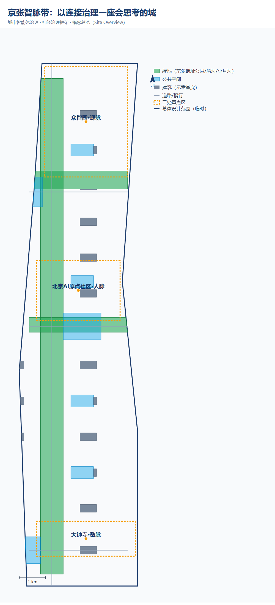

# 神经治理：一座城市智能体的治理手册

## 设计依据与资料清单

本 formal 方案以北京市规划和自然资源委员会海淀分局发布的《百年京张AI创新带城市设计国际方案征集资格预审公告》为第一依据，并以 `brief/site-package/` 中经维护者登记的临时粗略边界、重点区域、枚举、指标和来源清单为机器可读依据。AI agent 在生成方案前必须读取 `design_brief.json`、`allowed_design_space.json`、`sources.json`、`enums/`、`ranges/`、`schemas/`、`data/source_registry.json` 和 `data/processed/agent_fact_pack.md`，并用 `project_scope_summary.csv`、`agent_task_requirements.csv`、`source_use_matrix.csv`、`missing_data_checklist.csv` 建立任务、范围、资料用途和缺口清单。所有设计判断都要拆分为可追溯来源、可复算指标、可校验图层和可人工复核假设。公告要求方案达到控制性详细规划的城市设计深度和规划综合实施方案的城市设计深度，因此文本叙述不能替代 GeoJSON、指标表、A3 文册、A0 展板和 HTML 电子展示成果。

方案不是独立愿景文本，而是从公告、面向智能体任务书和场地资料出发组织成果；本节只把最关键依据放在判断旁边 [source:OFFICIAL-ANNOUNCEMENT] [source:AGENT-TASKBOOK] [depth:existing_conditions_diagnosis]。完整来源和标准覆盖分别保存在 `sources.json`、`standard_matrix.json` 与 `design_depth_matrix.json`，不在正文重复机器索引。

资料登记表的使用边界如下 [source:SOURCE-REGISTRY]：

- data/source_registry.json 登记公开、清权与临时资料的用途边界。
- 当前登记摘要：formal 可用资料 7 条，背景资料 1 条，provisional-only 资料 1 条。
- agent 不得把 background_only 或 provisional_only 资料升级为 official boundary、法定控规、正式评分依据或政府实施承诺。

`data/processed/agent_fact_pack.md` 是本方案的阅读导航层，不是新的权威来源 [source:PROCESSED-FACT-PACK]。它帮助 agent 把三层范围、三处重点区、公告任务、agent.1-agent.6、资料可用性和缺资料事项组织成可读方案；事实判断仍需回到已登记的原始材料 [source:OFFICIAL-ANNOUNCEMENT] [source:AGENT-TASKBOOK]，完整来源关系由 `sources.json` 保存。

本脚手架在官方 `SITE_BOUNDARY` 或三处 `KEY_AREA` 尚未取得时，使用 `brief/site-package/geometry/provisional_boundaries.geojson` 生成临时 formal 包。提交包中的 `geometry/site_boundary.geojson` 与 `geometry/key_areas.geojson` 均必须标注为 `provisional_constraint`、`official_boundary=false`，只能用于方案生成、自检、可视化和设计讨论，不能作为 official redline、审批依据、精确面积依据或法定控制结论。该组织方数据缺口本身不阻断内容评分；替换 official polygons 后，site boundary、key areas、land use、roads、green space、public space、buildings、phasing 和 metrics 均需重算。

本次脚手架生成的可评分状态为：**临时边界，保留精度警示并待正式数据发布后复算；不阻断内容评分**。因此，正文中的空间结构、场景、项目和指标均按“可讨论、可复核、可替换官方边界后重算”的原则写入；当官方边界和重点区 polygon 更新后，agent 必须重新运行脚手架、自检和图纸/HTML生成，不能只替换单个文件。

边界解释可回到总体范围图层和面积复算 [data:geometry/site_boundary.geojson#SITE-001] [metric:site_area_sqm]。三处重点区则由独立图层和数量指标核对 [data:geometry/key_areas.geojson#PROV-KEY-001] [metric:key_area_count]。这意味着读者可以从正文进入证据，但不必先读一串机器编号。

## 三层范围工作框架

方案按照公告确定的三个层次组织工作：统筹研究范围关注 43.6 平方公里的AI产业生态、战略定位、创新链和未来城市形态；总体设计范围关注 11.4 平方公里京张遗址公园周边 1-2 公里城市地区和产业区，要求形成城市更新总体框架、产业空间布局、交通市政支撑和城市风貌控制；重点区域范围关注 368.4 公顷三处详细设计地区，要求明确功能业态、建筑规模、拆改留分类、公共空间连通和交通组织。三层范围在 `compliance_matrix.json` 中逐条映射，保证公告 1.3、1.4、1.5 与 agent.1-agent.6 的必选任务都有章节、图层、指标、图纸和 HTML 证据。

三层工作框架的深度项由 [depth:three_level_scope_framework] 和 [depth:overall_spatial_structure] 约束，空间证据以 [data:geometry/site_boundary.geojson#SITE-001] 与 [data:geometry/key_areas.geojson#PROV-KEY-001] 为准，任务依据以 [standard:PROJECT-OFFICIAL-ANNOUNCEMENT] 为准，范围索引以 [source:PROCESSED-FACT-PACK] 中 `project_scope_summary.csv` 的三层范围表为导航。

三层工作不是互相割裂的图纸集合。统筹研究决定产业链和城市形态判断，总体设计把判断落实到更新项目、空间结构和设施承载，重点区域详细设计验证具体地块、建筑、交通、公共空间和AI应用场景的可实施性。agent 生成方案时必须先锁定当前提交采用的 official 或 provisional 边界和约束，再生成用地、建筑、道路、绿地、公共空间、分期和AI服务节点，最后从这些图层复算指标并在正文解释哪些结论仍受 provisional boundary 限制。任何无法从结构化数据复算的面积、比例、规模或项目数量，不得写入正式结论。

本方案建议的总体概念为「京张智脉带：以连接治理一座会思考的城」：以京张遗址公园为历史与公共空间主轴，以众智园、北京AI原点社区、大钟寺三处重点片区为创新锚点，以高校、企业、社区和轨道站点为日常网络，形成"一带三核、多点场景、蓝绿慢行复合环 [source:GREEN-DISTRICT-DESIGN]"的空间组织。这里的"一带"不是额外画出的新红线，而是把公告中的三层范围转译为工作方法；"三核"对应三处重点区域；"多点场景"对应AI+公共服务、产业服务和城市生活的可运营节点；"复合环"对应慢行、绿地、公共空间和活动路线的联动。"智脉"二字即"智慧神经"——本方案的核心命题是：未来城市是无数智能体构成的生态系统，其本体是智能体之间的关系（连接）而非实体；治理城市，就是治理智能体之间的连接与互动（详见下一节「城市智能体治理：以连接为神经」）。

| 层级 | 设计问题 | 方案回答 | 数据落点 |
| --- | --- | --- | --- |
| 统筹研究范围 | AI产业生态和未来城市形态如何组织 | 建立“高校策源-开源协作-企业转化-公共体验-国际传播”的创新链 | compliance_matrix.json、standard_matrix.json |
| 总体设计范围 | 产业空间、城市更新、交通市政和风貌如何落图 | 用地、建筑、道路、绿地、公共空间和分期图层共同表达 | [data:geometry/land_use.geojson#LU-001]、[data:geometry/roads.geojson#ROAD-001] |
| 重点区域范围 | 三处片区如何达到详细设计深度 | 分别提出定位、空间动作、AI场景和实施依赖 | [data:geometry/key_areas.geojson#PROV-KEY-001]、[data:geometry/key_areas.geojson#PROV-KEY-002]、[data:geometry/key_areas.geojson#PROV-KEY-003] |

## 城市智能体治理：以连接为神经

> 本方案的核心命题：未来城市不是"一个智能体"，而是无数智能体构成的生态系统；连接的本质，是智能体之间的互动。**连接即智能体之间的互动，治理即治理这些互动。**

### 治理总纲：多智能体 [source:GENERATIVE-AGENTS-2023]之城

未来城市，不会是一个单一的智能体。它会是**无数智能体构成的生态系统**——一辆车是智能体，一栋楼是智能体，一个垃圾桶也可能是智能体；它们各自感知、判断、行动，又通过连接彼此调用、协商、协作。

由此引出本方案的两个核心判断：

**判断一：连接的本质，是智能体之间的互动。** 连接不只是"设备感知数据的通道"，更是智能体与智能体之间的互动媒介——它承载调用（API/MCP）、协商、协作、信任建立与冲突解决。一座由智能体构成的城市的"智能"，不是某个中央大脑的智能，而是无数智能体通过连接互动**涌现**出来的集体智能。

**判断二：治理的对象，是这些互动。** 治理城市，不是治理一堆设备，而是治理多智能体之间的连接与互动——它们如何发现彼此、如何信任彼此、如何协作、如何被复核、如何解决冲突。

### 本体论根基：连接是关系，不是实体

"连接即神经"这句话，表面是类比，但它背后的判断是本体论的——**城市智能体的本体，不是"实体"，而是"智能体之间的关系（连接）"。**

楼、路、车、垃圾桶、算力中心，各自堆在那里，只是一堆实体，**不是智能体系统**。只有当它们各自成为能感知、能判断、能行动的智能体、并通过连接彼此互动——调用、协商、反馈、留痕——"城市的智能"才涌现出来。拆掉连接，剩下的不是"失去神经的智能体"，而是"一群互不相干的设备"。换言之：**城市的智能，不在任何一个智能体里，而在智能体之间的连接里。**

这个判断有一个可靠的参照——大脑的 connectome。一个人的"自我"，不在任何一个神经元里（单个神经元不思考），而在神经元之间的连接模式里。"我"不是一个位置，是一张连接的网络。城市同理：**一座由智能体构成的城市的"智能"，不在任何一个智能体、任何一栋楼里，而在它们之间的连接里。** 这与 Palantir 的 Ontology 是同一个洞见——本体（ontology）的核心，从来不是"对象"，而是"对象之间的关系"；让数据活起来的，是那条边，不是那个点。

由此，治理城市，就不能只治理"节点"（单个智能体、设备、建筑、部门），而必须治理**连接本身**——智能体之间怎么调用、怎么协商、怎么留痕、怎么建立信任、怎么解决冲突。这正是下文六道关口每一关都落到"连接的价值"的原因：不是连接重要，而是**连接就是治理的对象（本体）**。

### 神经的工程构成：能量神经与信息神经

"连接"不是玄学。城市智能体的神经，由两层具体的工程系统构成：

**能量神经**——城市智能体的"血管"：

- **建筑级直流母线 [source:AGENT-AGE-POWER-ALGORITHM]**：AI 建筑的能量主干，采用 800V 直流配电架构替代传统交流，配合液冷 [source:E800V-DC-DISTRIBUTION]，为高密度算力供给稳定能量（遵循"高压用于距离、负载附近渐进降压、液体冷却实现密度"的设计规则）；
- **算电协同 [source:IET-MICROGRID-MAS]**：算力调度与电力调度的协同——算力任务在哪里排队、哪里迁移，电力就按需跟进；AI 机架成为"受控直流微电网"的一环，实现从"电网到计算"全路径的可编程调度。**工程命题的诚实边界**：800V 直流母线、液冷、算电协同与确定性时延等均为方向性技术主张（来自行业公开讨论与产业实践，非本次方案首创），在缺乏正式控规、能源容量、负荷边界与工程地质资料的条件下，本方案一律将其标注为"待验证概念"，不作为确定性技术结论，须经专业能源与市政团队复核后方可进入实施 [source:AGENT-TASKBOOK][depth:overall_spatial_structure]。

**信息神经**——城市智能体的"神经元突触"：

- **东西向流量 [source:NOKIA-MBIT-INDEX]**：Agent 为完成南北向业务目标，自行通过 API/MCP 横向调用其他数据、其他 Agent 所产生的横向流量。与传统通信网络以"人访问服务"的南北向流量为主不同，Agent 时代的东西向流量不仅量更大，而且对时延有确定性要求——它是 Agent 协作的核心负荷，也是"连接"要真正解决的问题；
- **无线短距连接**：感知与交互的"末梢神经"，让城市的设备、场景与人实时相连。技术选型保持开放——星闪、蓝牙、WiFi、UWB、蜂窝等按场景组合，不绑定单一技术标准；本方案关注的不是某个品牌或协议，而是"确定性、低时延、高并发"这一组 Agent 时代连接必须具备的能力特征（星闪是当前较贴近该特征的优选之一，但不排斥其他技术）。

治理城市智能体，就是治理这两层神经：**能量怎么配（算电协同）、能量怎么传（直流母线）、信息怎么流（东西向流量）、末梢怎么感知（短距连接）**。下文六道关口治理框架，正是作用于这两层神经之上的机制。

治理一座会思考的城，不能靠口号，要靠一套能落地、能验算的机制。本方案从官方《智能体参与初始原则》（公开清权来源、人类最终判断、公共知识库沉淀等）提炼出六道关口，把"连接"作为贯穿六道关口的唯一载体——不是连接重要，而是连接就是治理的对象。

### 治理机制：六道关口（本方案从官方《智能体参与初始原则》提炼）

官方《智能体参与初始原则》要求：资料必须来自公开清权来源（第 2 条）、最终判断由人类和专业团队完成（第 7 条）、输出进入公共知识库（第 8 条）。本方案把这套原则，落成六个能落地、能验算的治理动作——每一关都对应一处可参观的空间，让"治理"看得见、算得清：

**第一关 · 算得出来（可复算）。** 所有 AI 给的判断，都要能重新算一遍来验算：用地面积、绿地率、公共空间占比这些核心数字，必须能从提交的图纸重新算出来、和页面标注一字不差。算不出来的，不算数。空间落点：可复算广场（众智园）。

**第二关 · 查得到源头（可追溯）。** 每个判断留下"依据→推理→结论→谁做的"，出问题能一路追到源头。治理不怕算得慢，就怕说不清是谁、凭什么拍的板。空间落点：溯源长廊（京张遗址公园）。

**第三关 · 听得进反馈（可学习）。** 阶段方案先让公众看、提意见，意见回流到下一轮迭代。治理不是"管住人"，是"越用越聪明"。空间落点：反馈花园（原点社区）。

**第四关 · 人说了算（人工否决）。** AI 只负责算，人负责拍板；能看什么、能算什么、能决定什么三级分开，越权即停。权力归谁，清清楚楚。空间落点：权限沙盒（众智园）。

**第五关 · 明说自己会错（风险透明）。** 每个结论都标上"把握多大、假设是什么、可能错在哪"，不藏着掖着。诚实的智能体，最该明说自己可能错在哪。空间落点：风险公示屏（三片区各一）。

**第六关 · 越用越懂（知识沉淀）。** 判断、反馈、复核、风险，统统沉淀进"城市治理知识库"，是可继承的公共资产。护城河不是某一次方案，是"越用越懂"的知识库。（产业实证：日本大阪制造企业 AI 质检——老师傅隐性知识经 LLM 结构化为知识库，RAG 检索辅助新人，准确率 96%→99.2%，知识库被产线调试跨环节复用 [source:AI-QC-KNOWLEDGE-BASE-CASE]）空间落点：治理图书馆（大钟寺）。

