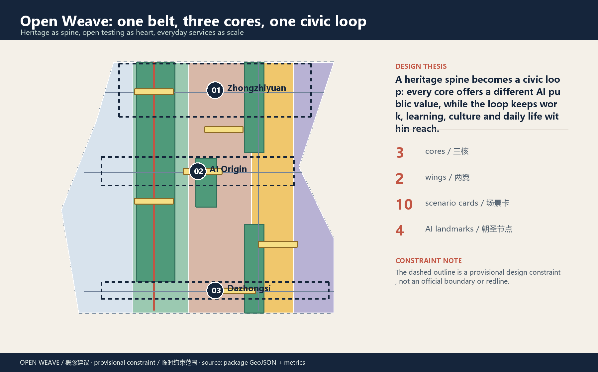
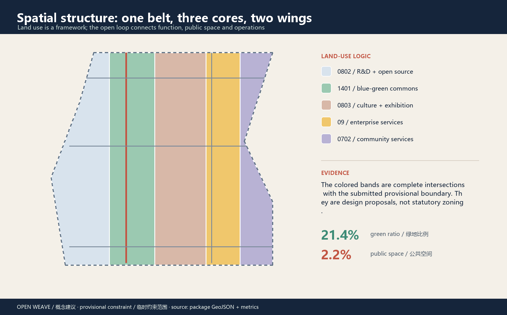
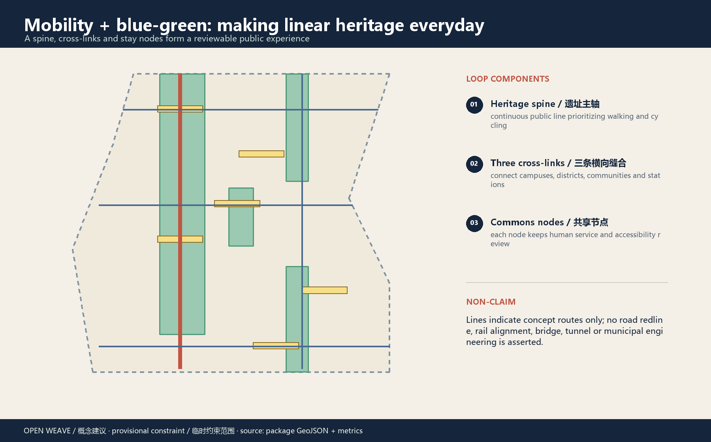
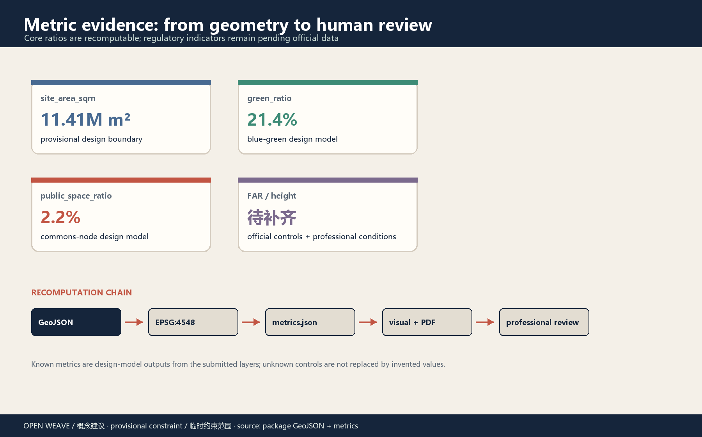

# Open Weave: Centennial Jing-Zhang AI Civic Loop

> One historic line, three innovation roles: turn AI from a back-end capability into a public loop that is usable, human-reviewable and operable over time.

## Design Basis and Source List

This proposal uses the official prequalification announcement as the controlling source for the project name, three scope levels and design tasks, and uses the agent taskbook to address naming, ecosystem cases, AI+ scenarios, public space, culture and long-term operation [source:OFFICIAL-ANNOUNCEMENT] [standard:PROJECT-AGENT-OPEN-CALL-TASKBOOK]. Spatial layers, metrics and presentation figures are derived from this package's GeoJSON and recalculation files so that conceptual prose is not mistaken for a planning redline.

The public package does not contain a precise official boundary, formal key-area polygons, regulatory controls, heritage-control geometry, cadastral parcels, road redlines, rail or municipal engineering data. This package therefore uses the maintainer-provided provisional constraint only for generation, visualization, self-check and public discussion; boundary, land use, buildings, blue-green, mobility, phasing and metrics must all be recalculated when official data arrives [source:BOUNDARY-SOURCE] [data:geometry/site_boundary.geojson#SITE-001]. No missing condition is presented as confirmed.

Rights are recorded in `sources.json` and the copyright statement: public or cleared sources are used for the announcement, standards and case mechanisms; no personal data, internal drawings, commercial basemaps, corporate logos, portraits or unlicensed images/fonts are used [source:SOURCE-REGISTRY].

## Three-Level Scope Framework

Open Weave uses one heritage public-space spine, three innovation cores, two wings, ten scenario cards and four contribution nodes. The coordinated research area is approximately 43.6 km² and frames the ecosystem, talent and future-city hypothesis; the overall design area is approximately 11.4 km² and frames spatial structure, renewal projects and mobility/blue-green strategy; the key-area scope is approximately 368.4 ha and tests three detailed design areas [source:OFFICIAL-ANNOUNCEMENT] [metric:site_area_sqm].

| Scope | Design judgment | Open Weave spatial answer |
| --- | --- | --- |
| Coordinated research area | Connect research, open source, enterprise services, public life and global communication | “source—co-create—transfer—experience—remember” innovation loop |
| Overall design area | Give the industry strategy visible public-space and daily-service carriers | Heritage spine + two cross-links + blue-green commons nodes |
| Key-area scope | Give the three areas distinct but complementary public values | Zhongzhiyuan for standards, AI Origin for near-campus transfer, Dazhongsi for urban exchange |

The provisional boundary is shown as a low-contrast dashed constraint. It carries no official area or engineering meaning. Land-use polygons are complete intersections with the same boundary, and metrics are recalculated in EPSG:4548 [data:geometry/land_use.geojson#LU-001] [depth:three_level_scope_framework].

## Coordinated Research Area: Industry and Future City Research

The coordinated research area should not become another closed campus. It should be an open innovation chain: universities and research teams provide problems and prototypes; Zhongzhiyuan provides standards, safety and full-stack testing; AI Origin provides near-campus transfer and everyday talent life; Dazhongsi provides enterprise experience, consumption and global exchange; the Zhongguancun technology-service wing supports IP, compliance, capital and enterprise services; the Xiaoyuehe scenario wing brings technology into health, education, mobility and daily services. This is compatible with the “three areas, two wings” narrative, but does not state any investment, policy or招商 commitment as decided [source:SRC-2026-BJ-KW-THREE-AREAS-WINGS] [source:SRC-2026-HAIDIAN-1X1].

### Six public case mechanisms

| Case | Transferable mechanism | Reference move for Jing-Zhang |
| --- | --- | --- |
| Station F | Co-locate work, founder services and events around a legible address | Create a transfer street and open service desk in AI Origin |
| Punggol Digital District | Mix campus, industry, public life and digital operations | Use the two wings to connect campuses, companies and communities |
| 22@Barcelona | Keep productive uses in urban renewal and organize an innovation network with public space | Shift renewal from isolated buildings to public interfaces and service chains |
| AI Singapore | Close the loop between talent, public challenges and translational projects | Connect open challenges, testing and public release |
| Oodi Helsinki | Make learning, making, culture and public service everyday infrastructure | Use story stops and learning courts as low-barrier third places |
| Seoul DMC | Amplify a technology district through media, industry and city experience | Build a walkable smart-device and content interface in Dazhongsi |

These are mechanism comparisons only. No case investment, scale or performance figure is imported into the Haidian proposal [source:CASE-STATION-F] [source:CASE-PUNGGOL-DIGITAL-DISTRICT].

### Naming and visual identity

The main name is “Open Weave”, with “Jingzhang Civic Loop” as the English spatial descriptor. The logo direction uses two parallel lines as the railway memory, three nodes for the three cores, and an intentionally open arc for knowledge and proposals that keep entering and iterating. Suggested colors are ink blue (trust and rail), signal red (action and contribution), river green (ecology and everyday life), and warm yellow (nodes and events). Existing corporate marks and unlicensed fonts are excluded. Identity is tied to spatial tasks rather than made as an isolated slogan [standard:PROJECT-AGENT-OPEN-CALL-TASKBOOK].

## Overall Design Area: Urban Renewal and Regulatory-Plan-Level Urban Design

The overall design area is organized by a heritage spine, commons nodes, cross-links and low-speed services. The Jingzhang Heritage Park is treated as a public-memory and slow-mobility spine; Zhongzhiyuan, AI Origin and Dazhongsi become three distinct innovation interfaces. R&D/open-source, cultural exhibition, enterprise services, community services and blue-green spaces alternate along the loop to keep work, learning, living and visiting within reach [data:geometry/land_use.geojson#LU-001] [depth:overall_spatial_structure].

No statutory FAR, height, density or setback value is proposed. The twelve building footprints are conceptual retain-review, retrofit-review and new-build prototype units for discussing interfaces, ground floors, shared halls and open testing; they are not parcel-level demolition or ownership conclusions [data:geometry/buildings.geojson#BLDG-001] [metric:building_footprint_area_sqm]. Official controls, ownership, fire safety, heritage and existing-condition surveys are prerequisites for professional parcel-level work.

## Detailed Design of Key Areas

### 01 Zhongzhiyuan AI Acceleration Area: standards commons

Zhongzhiyuan is proposed as a testable full-stack innovation interface. The Qinghe edge hosts open testing and low-carbon innovation display; the interior combines safety governance, standards, evaluation and public release; a contribution wall records public, reviewed and adopted knowledge. The spatial moves are “Qinghe innovation edge + standards commons + open-source plaza + green testing corridor”, not a closed technology campus [data:geometry/key_areas.geojson#PROV-KEY-001].

### 02 Beijing AI Origin Community: near-campus transfer street

AI Origin brings universities, start-ups, everyday life and public culture into one daily interface. A learning court hosts open classes and community events; a transfer street supports IP, enterprise services and public release; evenings remain safe, quiet and walkable. AI services use human-handover navigation, policy indexes and booking rather than personal profiling or hidden tracking [data:geometry/key_areas.geojson#PROV-KEY-002] [standard:BARRIER-FREE-ENVIRONMENT-LAW].

### 03 Dazhongsi AI Industry Cluster: urban smart-economy commons

Dazhongsi is proposed as a city-scale interface organized around station four-quadrant walking, enterprise services, content consumption and smart-device display. A global demo lounge serves developers, companies and visitors. Low-speed robotics is tested only in controlled, reversible and staffed settings; data and digital-asset displays require authorization, compliance and human explanation [data:geometry/key_areas.geojson#PROV-KEY-003] [depth:three_key_area_detailed_design].

## AI Innovation Ecosystem, Personas, and AI+ Scenarios

Six personas make “AI talent friendliness” spatial and operational: an open-source student needs learning and low-friction release; a research lead needs standards, compute and testing; an SME founder needs compliance, IP and customer scenarios; residents and older adults need human service, legible wayfinding and a non-tracked daily environment; commuters and visitors need continuous, understandable walking and station connections; operators and governance teams need auditable prompts, human review and exit mechanisms [standard:PROJECT-AGENT-OPEN-CALL-TASKBOOK].

### Ten AI scenario cards

| No. | Scenario | Space and users | Human boundary |
| --- | --- | --- | --- |
| 01 | Open-source discovery | Heritage contribution wall / developers, visitors | Index public content only; maintain sources by people |
| 02 | Safety governance sandbox (test) | Zhongzhiyuan / companies, standards teams | Produce review lists only; no automatic clearance |
| 03 | Edge-compute stop | Three cores / teams, public | Verify energy, network and safety first |
| 04 | AI walking guide | Heritage spine / students, older adults, visitors | Human and accessibility review before advice |
| 05 | Dazhongsi global demo lounge | Dazhongsi / companies, investors, developers | No investment promise or business decision replacement |
| 06 | Qinghe low-carbon innovation corridor | Zhongzhiyuan / research teams, residents | Use public environmental information and explain anomalies |
| 07 | Near-campus transfer street | AI Origin / universities, start-ups | Keep legal and IP human service access |
| 08 | Data commons lounge | Dazhongsi / companies, public | Show authorization and audit trail, never personal data |
| 09 | AI daily-service street | Community/retail edge / residents | Health, education and legal information is not professional service |
| 10 | Global AI week route | Whole belt / global visitors | Recheck safety, access and copyright for each event |

Cards 02, 04, 08 and 10 are candidates for industry or governance validation. Each begins with public rules, minimum data, human review, exit conditions and a retrospective; none is an approved operation or vendor requirement [source:AGENT-TASKBOOK] [standard:GENERATIVE-AI-INTERIM-MEASURES].

## Land Use, Building Scale, and Retain-Renovate-Demolish Strategy

Land use follows the numeric vocabulary supplied by the Ministry of Natural Resources. Five bands cover the provisional design boundary without overlap or unlabeled gaps; they are a design partition for comparing spatial relationships, not a statutory zoning or land-ownership conclusion [standard:MNR-LAND-USE-CLASSIFICATION-GUIDE] [data:geometry/land_use.geojson#LU-001].

Buildings use a three-step review: retain review for cultural value, structure, public interface and continued use; retrofit review for open ground floors, shared halls, energy and accessibility; new-build prototypes only after a public-service gap, scenario need and official controls are established. All parcel-level demolition, height, intensity, setback and total floor area remain pending official data [depth:retain_renovate_demolish].

## Transport, Rail, Municipal Infrastructure, and Public Services

Mobility is proposed as a heritage slow-mobility spine, three cross-links and station connections. The spine supports walking and cycling; cross-links connect campuses, districts, communities and stations; nodes provide legible wayfinding, bicycle parking, human information and accessible alternatives. Road centerlines only indicate conceptual service directions, not road redlines, rail alignments or bridge/tunnel engineering [data:geometry/roads.geojson#ROAD-001] [depth:traffic_rail_slow_parking].

Municipal and new-infrastructure elements are “pluggable service nodes”: edge compute, open-data display, environmental maintenance, energy and public-service prototypes start as light pilots, then deepen after capacity, safety and operations are known. Electricity, drainage, fire safety, utilities and flood conditions remain pending. Human desks, paper and phone alternatives remain part of public service [standard:BARRIER-FREE-ENVIRONMENT-LAW] [standard:ELDERLY-SMART-TECH-PLAN-2020-45].

## Blue-Green Network, Public Space, and Urban Character

The blue-green network is the proposal’s public operating system: the spine carries memory, shade, walking and events; the Qinghe edge supports low-carbon innovation; pocket gardens connect communities; commons nodes host learning, release, inquiry and contribution. Green and public-space ratios are recomputable from the submitted geometry but remain design-model outputs under the provisional boundary, not planning commitments [data:geometry/green_space.geojson#GREEN-001] [metric:green_ratio].

Character is expressed through three languages: the rhythm of railway components, the openness of Haidian campuses and the readability of AI systems. Wayfinding uses lines, nodes and contribution numbers; public elements prioritize durable, maintainable, low-glare materials. Public art does not copy Zhan Tianyou’s portrait, corporate marks or copyrighted images; it uses original linear motifs and public-history text to tell a continuous story of autonomous design, open collaboration and public contribution [standard:MOHURD-URBAN-DESIGN-MEASURES].

## Renewal Projects, Implementation Policy, and Phasing

Eight project packages can be taken forward by a professional team: JZ-01 heritage slow-mobility gap repair; JZ-02 Zhongzhiyuan Qinghe innovation edge; JZ-03 AI Origin near-campus transfer street; JZ-04 Dazhongsi station four-quadrant walking; JZ-05 AI public services and edge-compute nodes; JZ-06 open-source contribution wall and honor-display system; JZ-07 low-speed robotics and maintenance test; JZ-08 global AI week public route. Each requires official boundaries, rights, heritage, traffic, utilities, safety, accessibility and public participation review [depth:renewal_project_list].

Phasing is “public first, tests second, deeper renewal third”: Phase 1 discusses light public space, wayfinding, walking continuity and human service; Phase 2 pilots small scenarios after data, privacy, safety and professional review; Phase 3 considers ecosystem integration, building renewal and long-term operations. `phasing.geojson` is a reference sequence, not a government schedule, funding, approval or construction commitment [data:geometry/phasing.geojson#PHASE-001] [depth:phasing_implementation].

Four operating mechanisms are proposed: an open challenge and scenario-application channel; professional review plus public feedback; contribution records with revocable honor display; and annual retrospective with knowledge-base updates. Operators should record evidence, failure, exit and revision, not only successful demonstrations.

### Four AI pilgrimage landmarks / contribution nodes

1. **Centennial Jingzhang Open Gate**: a public identity threshold showing the historic line and current open-source work.
2. **Zhongzhiyuan Standards Beacon**: a readable testing process and contribution record instead of an exclusive vertical “tech landmark”.
3. **Origin Learning Court**: courses, open-source release, community service and everyday rest in one accessible commons.
4. **Dazhongsi Contribution Wall**: public knowledge recorded by version, contributor and review status; no permanent inscription form is promised.

These are conceptual public-space components and memory mechanisms. Location, material, heritage treatment and permanent display require professional and authority review [source:AGENT-TASKBOOK].

## Metrics, Area Recalculation, and Compliance Matrix

The three visible core metrics are provisional site area, green ratio and public-space ratio. They are recalculated from `site_boundary.geojson`, `green_space.geojson` and `public_space.geojson`, and the visual page marks them with `data-metric` values. Building footprint, slow-mobility length, the three key areas, scenario-card count, persona count and land-use areas are also recorded with source files, formulas, confidence and assumptions [metric:site_area_sqm] [metric:green_ratio] [metric:public_space_ratio].

Statutory FAR, height and density, road redlines, utility capacity, ownership and investment remain pending official data. The compliance matrix covers announcement requirements 1.3, 1.4 and 1.5 and agent.1–agent.6; the standard and design-depth matrices keep urban design, regulatory boundaries, land-use classification, blue-green, mobility, municipal, phasing, metrics and risk evidence separate [standard:MOHURD-CONTROL-DETAILED-PLANNING] [depth:metrics_recalculation].

## Risk, Copyright, and Compliance

| Risk | Current reading | Control action |
| --- | --- | --- |
| Provisional geometry mistaken for a redline | High | Mark provisional in figures, text, HTML, sources and assumptions; recalculate all layers when official data arrives |
| Privacy and over-monitoring in AI scenarios | High | Minimum data, authorized feedback, human review and exit; no identification or hidden tracking |
| Heritage and historical narrative drift | Medium-high | Do not draw unpublished protection lines or copy portraits; use heritage and history review |
| Safety and public acceptance of pilots | Medium-high | Low-speed, reversible, staffed pilots with staged retrospective |
| Operations and maintenance cost | Medium | Assign owners, maintenance cycles and stop conditions to every node |
| Digital divide in public services | Medium | Keep human desks, paper, phone and accessible alternatives |

This is an open co-creation proposal. It does not replace formal planning, constitute an official conclusion, promise investment or schedule, or establish engineering feasibility. Rights and provenance for brands, fonts, figures, cases and data are in `sources.json` and `report/copyright_statement.md`; the agent proposes and humans/professionals retain final judgment [standard:PROJECT-AGENT-OPEN-CALL-TASKBOOK] [depth:risk_missing_data].

## References

- [source:OFFICIAL-ANNOUNCEMENT] Haidian Branch, Beijing Municipal Commission of Planning and Natural Resources, Centennial Jing-Zhang AI Innovation Belt prequalification announcement.
- [source:AGENT-TASKBOOK] Agent-facing open-call taskbook excerpt.
- [source:SOURCE-REGISTRY] Repository public-source registry and use boundaries.
- [source:SRC-2017-MOHURD-URBAN-DESIGN-MEASURES] Measures for Urban Design Management.
- [source:SRC-MOHURD-CONTROL-DETAILED-PLANNING] Measures for the Preparation and Approval of Regulatory Detailed Plans.
- [source:SRC-2023-MNR-LAND-USE-CLASSIFICATION] Land-use Classification Guide.
- [source:CASE-STATION-F], [source:CASE-PUNGGOL-DIGITAL-DISTRICT], [source:CASE-22@BARCELONA] public case mechanisms.
- [source:CASE-AI-SINGAPORE], [source:CASE-OODI], [source:CASE-SANGAM-DMC] public case mechanisms.
- [source:BOUNDARY-SOURCE], [source:KEY-AREA-SOURCE] maintainer-provided provisional spatial constraints.
