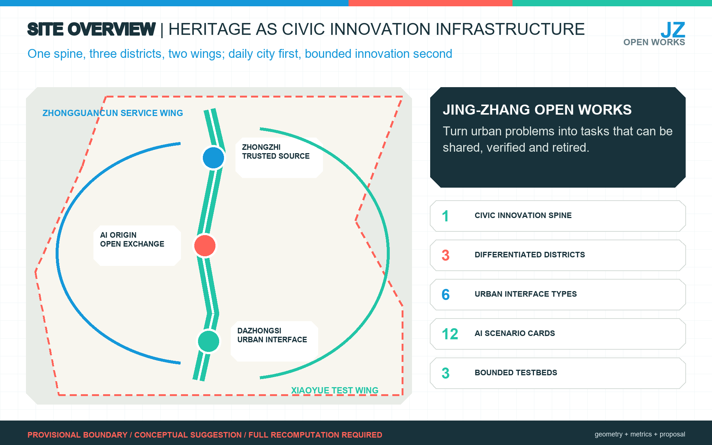
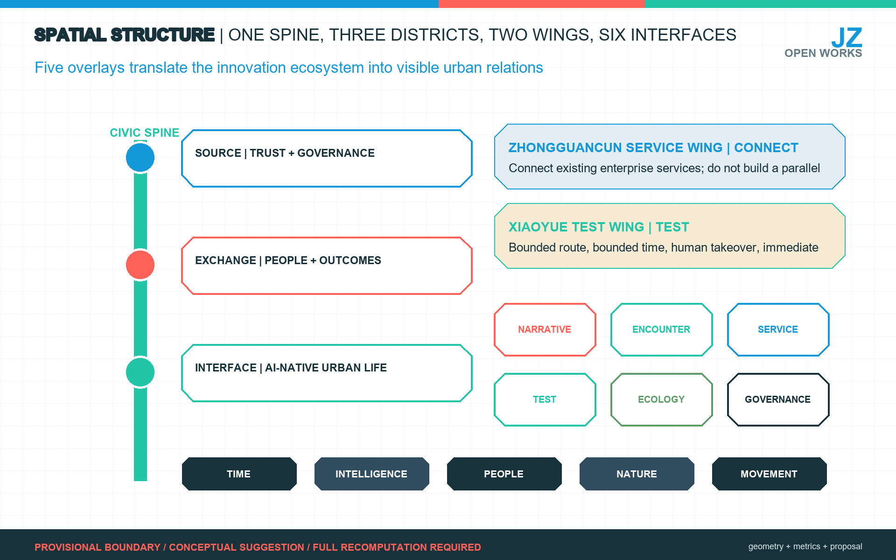
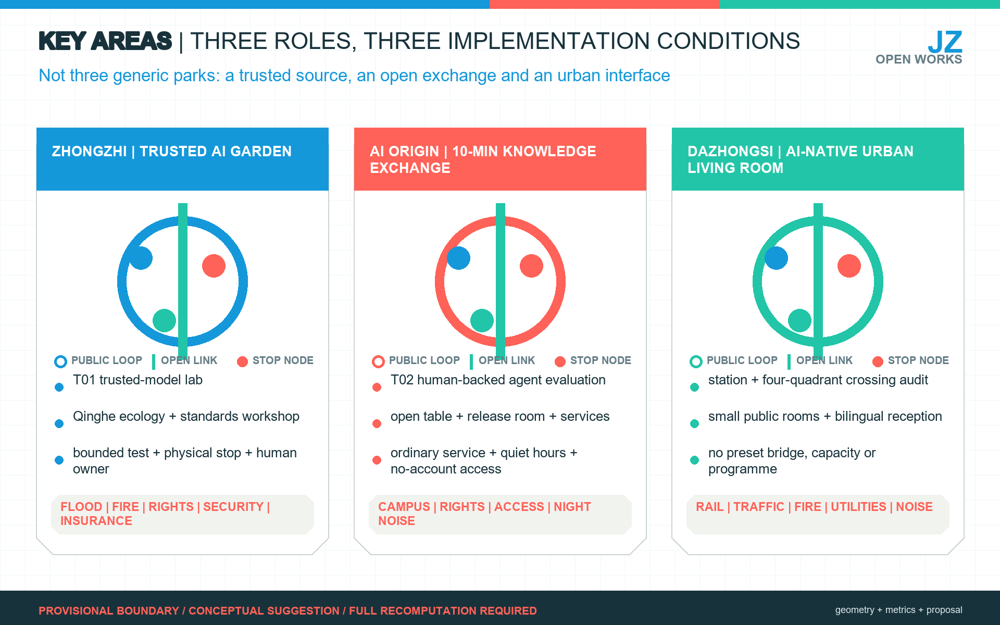
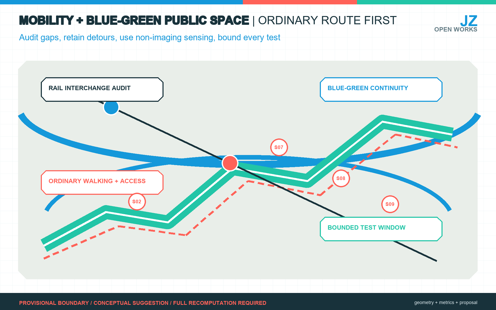
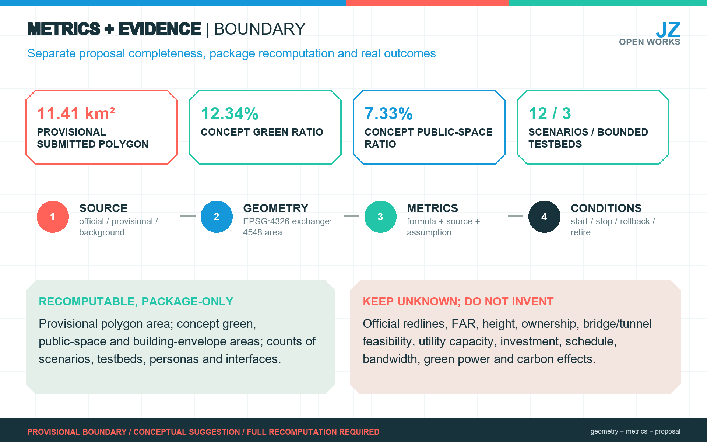

# Jing-Zhang Open Works

> **Core proposition:** Open Works does not line up devices as a technology show belt. It turns a century of railway heritage into civic innovation infrastructure. A public innovation spine connects Zhongzhi Garden, Beijing AI Origin Community and Dazhongsi; a Zhongguancun service wing and a Xiaoyue River test wing provide support. Every AI scenario must retain an ordinary equivalent service, a named human owner, minimum data, a stop rule and a public review. All spatial moves are conceptual suggestions for professional deepening after official boundaries, controls, ownership, transport, utilities, fire, heritage and operating responsibilities are available.

## Design Basis and Source List

The primary formal basis is the official competition announcement, supplemented by the repository site package, agent taskbook, standards, source registry and processed fact pack. The package distinguishes official public facts, background cases, repository-derived navigation and provisional geometry. No background or provisional item is upgraded into an official redline, planning control or public commitment. [source:OFFICIAL-ANNOUNCEMENT] [source:AGENT-TASKBOOK] [source:SOURCE-REGISTRY]

Existing-condition diagnosis remains an explicit design-depth requirement. [depth:existing_conditions_diagnosis]

The phase-one Jing-Zhang Railway Heritage Park is a real public-space base: the official report describes the opened section from Qinghuadong Road to Zhichun Road as about 2.5 km and 16.8 ha, with railway heritage retained or displayed. Public technology and culture events demonstrate that such programmes have an audience, but they do not prove stable year-round demand. [source:PARK-PHASE1] [source:PARK-EVENTS]

The repository currently provides rough provisional polygons rather than official precise boundaries. The submitted `site_boundary.geojson` and `key_areas.geojson` therefore remain `provisional_constraint`, `official_boundary=false`. They support generation, topology checks and discussion only. [source:BOUNDARY-SOURCE] [source:KEY-AREA-SOURCE]

Replacing them with official polygons requires recomputing land use, buildings, roads, green space, public space, phasing, figures and metrics. [data:geometry/site_boundary.geojson#SITE-001] [metric:site_area_sqm]

## Three-Level Scope Framework

The coordinated research area addresses the approximate 43.6 sq km innovation ecosystem and future-city strategy; the approximate 11.4 sq km overall design area addresses urban renewal, functional structure, mobility, infrastructure and character; the three key areas, announced at approximately 368.4 ha in total, test detailed spatial and operating propositions. The areas are connected as a decision chain, not treated as three unrelated drawings. [standard:PROJECT-OFFICIAL-ANNOUNCEMENT] [depth:three_level_scope_framework]

The key-area layer and count provide the package-level index. [data:geometry/key_areas.geojson#PROV-KEY-001] [metric:key_area_count]

The concept is **Jing-Zhang Open Works / JZ Works**. “Open Works” means both things made useful and a visible account of how the city works. The structure is **one spine, three districts, two wings and six interfaces**. The railway-park corridor is the civic innovation spine; Zhongzhi Garden is the source of trusted technology and governance, AI Origin Community the exchange for people and outcomes, and Dazhongsi the urban interface for AI-native enterprise. The Zhongguancun service wing connects existing enterprise services; the Xiaoyue River test wing hosts bounded validation. Narrative, encounter, service, test, ecology and governance interfaces translate the innovation chain into ordinary urban experience. [source:AGENT-TASKBOOK] [depth:overall_spatial_structure]

Five overlays guide design: **Time** for railway and network memory; **Intelligence** for universities, firms, compute, open source and services; **People** for residents, children, older people, researchers, founders and visitors; **Nature** for the park, Qinghe, Xiaoyue River and small green spaces; and **Movement** for walking, cycling, accessibility and rail interchange. They describe relationships, not statutory controls. [standard:MOHURD-URBAN-DESIGN-MEASURES]

## Coordinated Research Area: Industry and Future City Research

The research area builds an innovation chain of university research, open collaboration, enterprise conversion, public experience and international communication. It does not create a parallel platform. Beijing AI Origin Community is treated as an existing near-campus carrier; the Haidian large-model ecosystem service station is the service interface; AI North Latitude Community is a regional peer. [source:AI-ORIGIN] [source:MODEL-SERVICE-STATION] [source:AI-NORTH-LATITUDE]

Official information supports a Haidian-Zhangjiakou compute-collaboration direction, but this proposal claims no bandwidth, latency, green-electricity share or carbon result. [source:JZ-COMPUTE]

Haidian's urban-renewal policy supports innovation exchange, reuse of existing industrial space, open ground floors, accessibility, ageing-friendly design and AI-friendly public space. This alignment supports low-disturbance renewal, not automatic approval of any project. [source:URBAN-RENEWAL]

Six international cases yield mechanisms only. Kendall Square links public space, participation and policy; King's Cross puts industrial heritage into daily life; one-north/Kampong AI combines facilities, policy, community and test environments. [source:CASE-KENDALL] [source:CASE-KINGS-CROSS] [source:CASE-ONE-NORTH]

STATION F demonstrates concentrated services; MaRS demonstrates long-term curation; and Shenzhen's Dashahe shows campus-park-community coordination. [source:CASE-STATION-F] [source:CASE-MARS] [source:CASE-DASHAHE]

Jing-Zhang should therefore use a few strong nodes, distributed public interfaces and explicit operators rather than imitate density or create one giant incubator.

## Overall Design Area: Urban Renewal and Regulatory-Plan-Level Urban Design

The overall area uses a conceptual functional topology to connect trusted R&D and validation, the heritage park, innovation services, urban living rooms and community services. `land_use.geojson` is a complete non-overlapping concept partition for evidence and validation; it is not existing land-use survey or statutory zoning. `buildings.geojson` is a conceptual intervention envelope, not a surveyed building inventory or approved footprint. [data:geometry/land_use.geojson#LU-001] [data:geometry/buildings.geojson#BLDG-001] [depth:land_use_layout]

The design favours reuse, reversible ground-floor interfaces, ordinary routes and small public rooms before fixed landmark construction. FAR, total floor area, height, density, setbacks, road redlines and facility standards remain unknown until official controls and surveys are provided. The recomputed building-envelope area is internal to the submitted concept and cannot support demolition, investment or approval claims. [metric:building_footprint_area_sqm] [standard:MOHURD-CONTROL-DETAILED-PLANNING] [depth:development_intensity_controls]

## Detailed Design of Key Areas

**Zhongzhi Garden - Trusted AI Garden.** A low-disturbance loop combines Qinghe ecology, a standards workshop, model and data cards, a controlled test court, industry display and public exchange. T01 trusted-model validation sits here. Flood, fire, ownership, security, insurance and an operator are implementation conditions; the provisional rectangle is not a parcel plan. [data:geometry/key_areas.geojson#PROV-KEY-001]

**Beijing AI Origin Community - Ten-minute Knowledge Exchange Circle.** Campus, park and neighbourhood routes connect an open-source table, small release hall, IP and enterprise-service desk, everyday seating and quiet-hour management. T02 human-backed service-agent evaluation sits here. Accessibility, ordinary services, campus permissions, ownership and night noise come first. [data:geometry/key_areas.geojson#PROV-KEY-002]

**Dazhongsi - AI-native Urban Living Room.** Station walking, four-quadrant crossing audits, small public rooms, enterprise display and bilingual reception support everyday city life and short professional events. No bridge, tunnel, crossing, event capacity or building project is declared feasible without specialist studies. [data:geometry/key_areas.geojson#PROV-KEY-003] [source:ACCESS-BARRIER]

All three are conceptual suggestions and are checked under [depth:three_key_area_detailed_design].

## AI Innovation Ecosystem, Personas, and AI+ Scenarios

Six personas are design lenses, not a demographic survey:

| ID | Need | Spatial and service response | Boundary |
| --- | --- | --- | --- |
| P01 residents | commute, walk, quiet rest, repair | continuous ordinary route, paper/human repair channel | no commercial profiling; events cannot displace daily access |
| P02 children and carers | safe exploration, toilets, pause | cleared heritage stories, reversible interaction, continuous sightlines | no child face, voice or identifiable-track collection |
| P03 older and digitally excluded people | accessibility, readable guidance, human help | large print, seats, human window, account-free service | AI is never the only channel |
| P04 students and young researchers | open collaboration, release, low-cost trials | open-source table, bookable workplace, small release room | campus data, research and code require authorization |
| P05 founders and R&D teams | policy/compute/legal navigation, testing, clients | interface to existing services, bounded test sites, living room | no promise of funds, compute allocation or procurement |
| P06 international visitors | bilingual wayfinding, history, short meetings | ordinary bilingual guidance, public route, booked interpretation | no personal profiling; company claims are not public facts |

The twelve cards comprise seven low-risk prototypes and five conditional pilots:

| ID | Scenario and place | Minimum version | Human/data boundary and stop rule |
| --- | --- | --- | --- |
| S01 | bilingual heritage guide, park | QR and account-free page | cleared content and park editor; remove if errors cannot be corrected promptly |
| S02 | accessible-break audit, whole corridor | paper, hotline and web reporting | minimum location and accountable dispatch; stop if personal data or no owner |
| S03 | Open Works problem desk, Origin Community | public task cards with offline submission | publisher confirms scope and licence; withdraw ownerless or disputed tasks |
| S04 | existing enterprise-service navigator, service wing | route to the ecosystem service station | official directory and human consultant; pause when updates become unreliable |
| S05 | park event assistant, phase one | schedule, capacity, quiet periods, paper map | organiser and on-site controller; reduce or stop on crowding or complaints |
| S06 | open contribution and repair ledger, three areas | cleared code/data/repair record | contributor licence and maintainer review; hide disputed or expired items |
| S07 | low-tech microclimate notice, green nodes | calibrated non-imaging sensors and manual sign | maintenance owner; remove when calibration or maintenance fails |
| S08 | walking crowd and detour notice, stations | manual observation and non-identifying counts first | aggregate only; start after notice and ordinary route; stop on misleading output |
| S09 | low-speed robot bounded test, Xiaoyue wing | time-space enclosure, safety officer, physical stop | operator, insurance, right-of-way and takeover drill; any near miss stops the test |
| S10 | human-backed service-agent evaluation, Origin | de-identified tasks, transfer-to-human and appeal tests | institution owns final answer; freeze model on serious error |
| S11 | trusted model and governance lab, Zhongzhi | red team, model/data cards, rollback drill | cleared samples and independent review; no release without evidence chain |
| S12 | medical/elderly service navigation, partner institution | location, registration and policy explanation only | professional human review; no diagnosis, prescription or unattended service |

S01-S07 can be prototyped through existing public space, events and low-risk tools. S08-S12 require a professional institution, bounded environment, insurance where applicable, privacy impact review and human takeover. [source:ROBOT-SCENARIOS] [source:PIPL] [source:VIDEO-REGULATION]

Public-data authorization and professional medical/elderly-care responsibility remain separate prerequisites. [source:PUBLIC-DATA-RULES] [source:AI-MEDICAL] [source:AI-ELDERLY]

Three industry testbeds are therefore conditional: **T01 Trusted Model and AI Governance Lab** at Zhongzhi; **T02 Human-backed Public-Service Agent Evaluation Station** at AI Origin; and **T03 Low-speed Robotics and Non-imaging Sensing Test Garden** in the Xiaoyue wing. None is an unattended public decision or citywide robot loop. [metric:scenario_count] [metric:testbed_count] [metric:persona_count]

The interface taxonomy is likewise a proposal count, not an implemented facility count. [metric:interface_type_count]

## Land Use, Building Scale, and Retain-Renovate-Demolish Strategy

The package separates evidence from design. The four functional polygons test a complete topology, while building geometry tests a small intervention envelope. Both are low-confidence design hypotheses. [source:BOUNDARY-SOURCE] [source:KEY-AREA-SOURCE]

No existing building is classified for retention, renovation or demolition without a survey, ownership, structure, heritage, use and controls. [data:geometry/land_use.geojson#LU-001] [data:geometry/buildings.geojson#BLDG-001]

The professional sequence is: verify official polygons and current conditions; classify buildings and parcels; define ordinary public routes and infrastructure capacity; compare reuse, light retrofit and replacement; then set massing and intensity. Until then, FAR remains unknown and all design is reversible or indicative. [depth:retain_renovate_demolish] [depth:height_massing_character] [metric:floor_area_ratio]

## Transport, Rail, Municipal Infrastructure, and Public Services

The mobility priority is ordinary walking, cycling, accessibility and station interchange. Documented east-west barriers justify audits and alternatives, not a predetermined bridge or tunnel. `roads.geojson` is a conceptual connector inside the provisional boundary. Every crossing option must be tested against rail operations, road safety, utilities, fire, accessibility, ownership, cost and construction disturbance. [data:geometry/roads.geojson#ROAD-001] [source:ACCESS-BARRIER] [depth:traffic_rail_slow_parking]

Municipal and public-service work combines existing enterprise services, human public-service windows, communications and carefully bounded edge-compute prototypes. Distributed energy, drainage, flood safety, charging, fire, network security and maintenance require specialist inputs. Regional compute collaboration remains an interface direction until technical and commercial evidence is available. [data:geometry/constraints.geojson#CONSTRAINTS] [depth:municipal_new_infrastructure] [source:JZ-COMPUTE]

## Blue-Green Network, Public Space, and Urban Character

The heritage park is the daily public base, connected conceptually to Qinghe, Xiaoyue River, campuses, firms and neighbourhoods. Design attention goes to shade, seating, toilets, accessible gradients, ordinary lighting, quiet periods and small encounter rooms before technology objects. [data:geometry/green_space.geojson#GREEN-001] [data:geometry/public_space.geojson#PUBLIC-001]

The submitted green and public-space ratios are internal concept-layer measures, not statutory controls. [metric:green_ratio] [metric:public_space_ratio] [depth:blue_green_public_space]

The narrative is “four evolutions of connection”: rail connected the city, park paths reconnect communities, networks connected Zhongguancun to the world, and open source connects shared making. The identity uses original typography and simple track/network geometry: Chinese `京张开物`, English `Jing-Zhang Open Works`, short form `JZ Works`, community `Open Works Guild`.

Three permanent anchors and one annual temporary work form the pilgrimage system: L01 railway engineering and Qinghuayuan heritage; L02 a network-connection anchor whose date and archive require curatorial verification; L03 an Open-source Mile showing only cleared contributions and public repairs; and L04 an annual removable work subject to structure, fire and electrical review. The 1,435 mm gauge is a wayfinding module only, not a mystical number or planning control. [source:PARK-PHASE1]

## Renewal Projects, Implementation Policy, and Phasing

Seven work packages organise delivery: JZ-01 ordinary walking and accessibility audit; JZ-02 Zhongzhi Trusted AI Garden; JZ-03 Origin ten-minute knowledge exchange circle; JZ-04 Dazhongsi AI-native urban living room; JZ-05 three bounded testbeds; JZ-06 Open-source Mile and public route; JZ-07 Open Works Guild and JZ-PATCH desk. Each records location, beneficiaries, ordinary baseline, data and licence, human owner, prerequisites, acceptance, stop rule, maintenance and retirement. [data:geometry/phasing.geojson#PHASE-001] [depth:renewal_project_list]

**JZ-PATCH** is the delivery protocol: public question, fact check, small prototype, independent review, time-limited public window, then scale, repair or retire. Its eight mandatory fields are problem/beneficiary, spatial scope, ordinary baseline, data/licence, human owner, acceptance measure, stop/rollback, and maintenance/exit budget.

Five implementation stages prevent false certainty: Phase 0 obtains official geometry and existing-condition evidence; Phase 1 runs reversible S01-S07 prototypes; Phase 2 runs T01-T03 only in bounded professional settings; Phase 3 allows professionals to deepen public-space and building projects after evidence; Phase 4 considers regional compute and international collaboration. No investment or schedule is fabricated without quantities, ownership, design, prices, approvals and a delivery owner. [depth:phasing_implementation]

Open Works Guild is a proposed coordination layer, not a substitute for government, owners or licensed operators. Its annual rhythm is spring problem collection and accessibility audit, summer bounded scenario windows, autumn Open Works Assembly, and winter maintenance/retirement review. Visits are not counted as investment conversion.

## Metrics, Area Recalculation, and Compliance Matrix

Three metric classes are separated. Package-internal spatial metrics recompute the provisional polygon and submitted concept layers. Planning-control metrics such as FAR, height and road redlines remain unknown. Operating outcomes such as closure rate, human-transfer rate, complaints, near misses, maintenance cost and retirement rate require real logs and are not claimed here. [depth:metrics_recalculation] [metric:site_area_sqm] [metric:green_ratio]

Public-space ratio is interpreted under the same package-only boundary. [metric:public_space_ratio]

The content counts - twelve scenarios, three testbeds, six personas and six interface types - verify proposal completeness, not implementation success. The compliance matrix maps every announcement item and agent.1-agent.6 to narrative, geometry, metrics, drawings, visual display, sources, assumptions and checks. `standard_matrix.json` and `design_depth_matrix.json` preserve the professional evidence chain.

## Risk, Copyright, and Compliance

Key unresolved risks are official boundary and controls, existing-building and ownership data, transport and utility feasibility, heritage and fire requirements, operator and maintenance capacity, privacy and cyber security, insurance, accessibility, crowd/noise management and rights clearance. Missing data lowers the level of claim; it is never hidden by a polished drawing. [depth:risk_missing_data] [source:SITE-PACKAGE]

Personal information follows minimum necessity, purpose limitation, authorization, retention/deletion, human review and redress. Public-space AI may not continuously identify faces, emotion or individual trajectories merely for novelty. Medical, legal, elderly-care, planning, procurement and other high-impact tasks retain a human final decision. [source:PIPL] [source:VIDEO-REGULATION] [source:PUBLIC-DATA-RULES]

All core figures are original diagrams derived from package geometry and text; no remote basemap, third-party photograph, company mark or portrait is embedded. The HTML is static and offline. Fonts and build tools are recorded in the copyright statement. The proposal claims no official approval, statutory control, final ownership, final building scale, investment, schedule or guaranteed implementation.

## References

The human-readable text cites only the evidence needed near each claim. The complete machine index, access date, authority, usable scope and prohibited use are in `sources.json`. Geometry, formulas, assumptions and task coverage are in `geometry/*.geojson`, `metrics.json`, `assumptions.json`, `compliance_matrix.json`, `standard_matrix.json` and `design_depth_matrix.json`. [source:SITE-PACKAGE]
