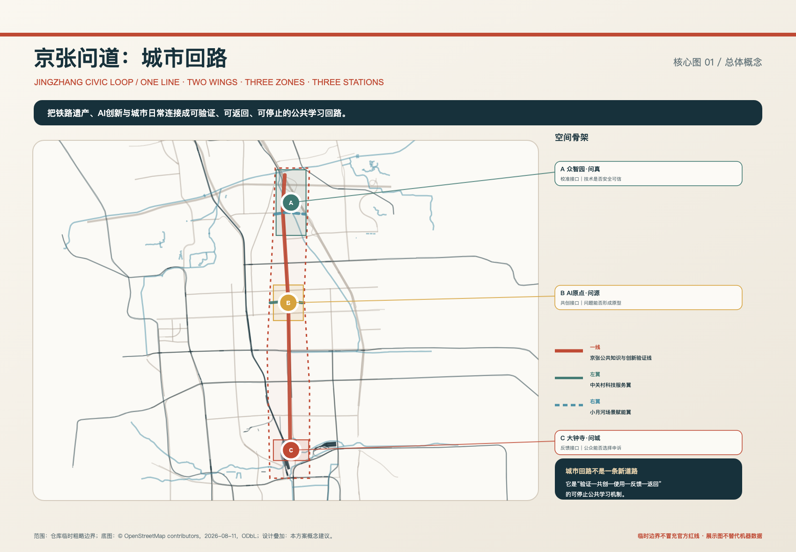
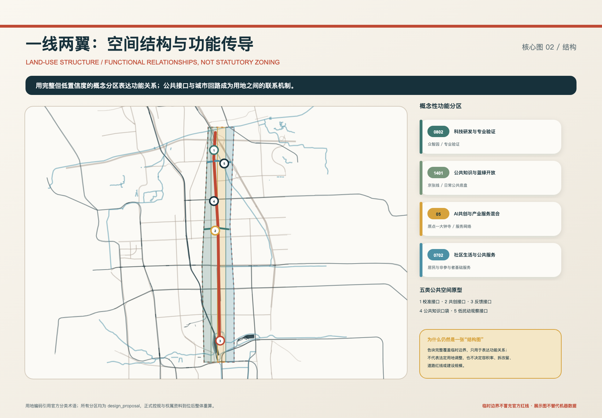
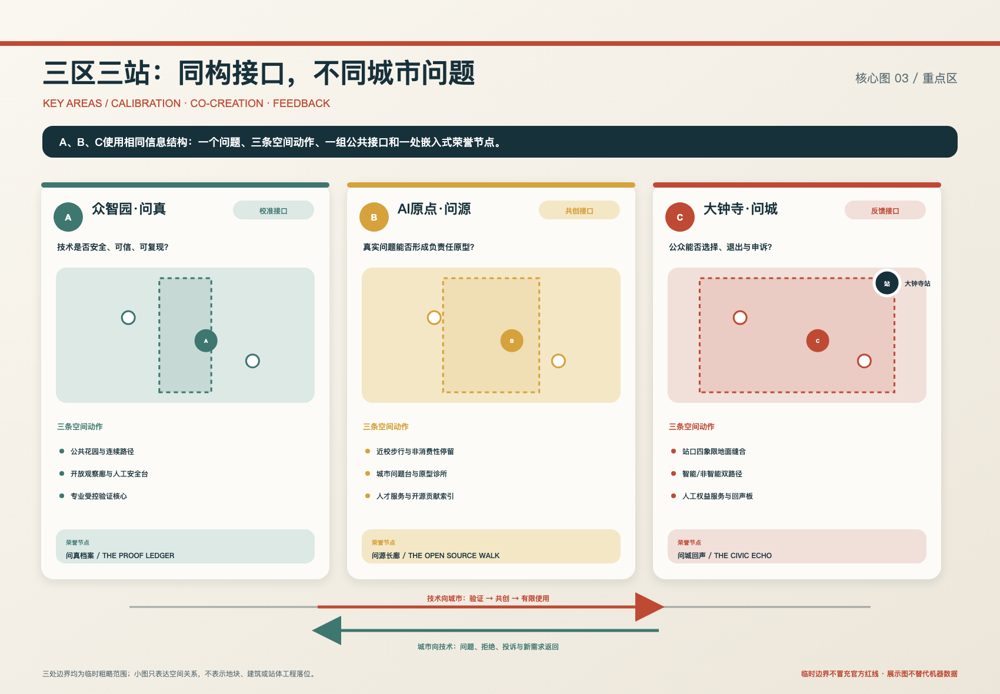
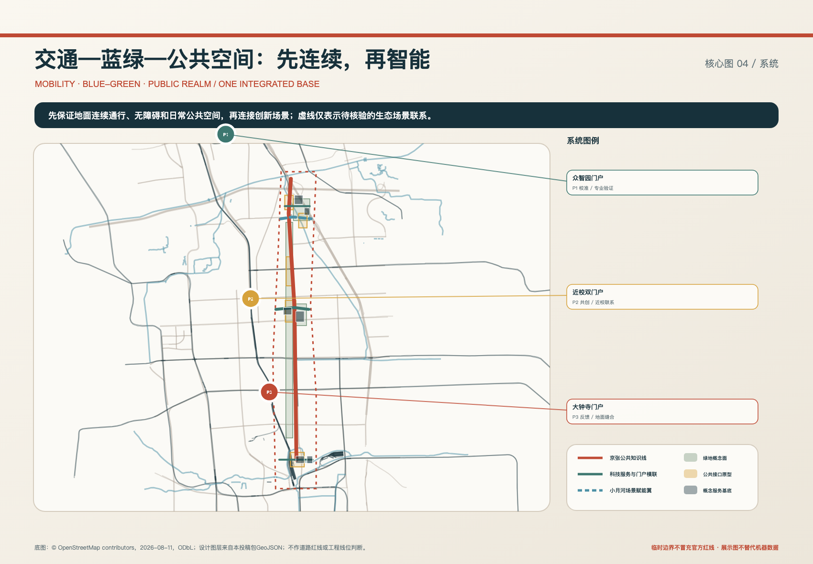
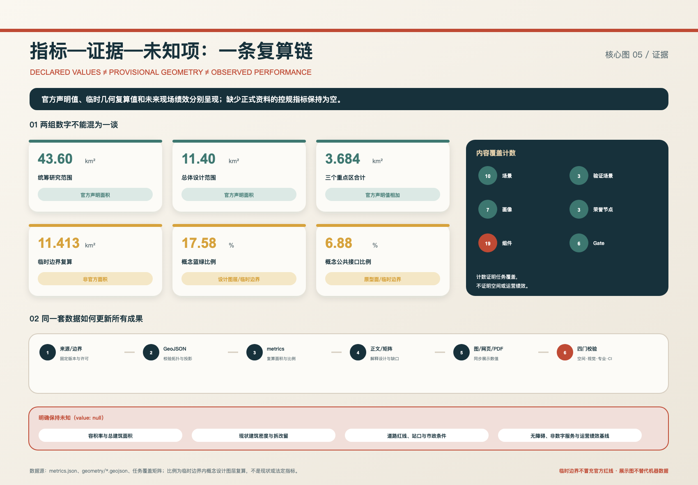

# 京张问道：城市回路

**JING-ZHANG · THE WAY FORWARD / THE JINGZHANG CIVIC LOOP**

**文化主张：百年轨道未止于抵达，智能之城始于回应。**

“问道”有三层含义：沿京张之“道”重新理解铁路遗产；向技术追问证据与边界；让城市居民有权向技术发问。英文 **The Way Forward** 既指沿铁路向前，也指一条经过城市检验、能够退回修正的创新路径。方案不把 AI 当作装饰或自动化终点，而把它放入一个“验证—共创—有限使用—反馈—返回”的公共学习回路。

## 设计依据与资料清单

方案以征集公告和面向智能体任务书为任务依据，分别确认三层工作范围、三处重点区、成果深度，以及命名、场景、画像、地标与长期运营等六项任务 [source:OFFICIAL-ANNOUNCEMENT] [source:AGENT-TASKBOOK]。场地包、来源登记表和处理资料用于核对哪些信息可进入正式论证，哪些只能作背景或临时生成 [source:SITE-PACKAGE] [source:SOURCE-REGISTRY] [source:PROCESSED-FACT-PACK]。

本地标准快照支撑城市设计、控规深度与用地分类的专业表达；它们不能替代本项目的法定规划条件 [source:URBAN-DESIGN-MEASURES] [source:CONTROL-DETAILED-PLANNING] [source:LAND-USE-CLASSIFICATION]。涉及生成式 AI 与无障碍服务时，方案仅在适用范围内引用法规，不把特定条款扩大为所有空间的一般法律结论 [source:GENERATIVE-AI-MEASURES] [source:BARRIER-FREE-LAW]。

当前总体设计边界和三个重点区均来自仓库的临时粗略 polygon，只用于生成、拓扑检查和设计讨论 [source:BOUNDARY-SOURCE] [source:KEY-AREA-SOURCE]。它们不是官方红线，矩形边也不是道路或地块边界；正式图形到位后，所有设计图层、面积和图纸必须整体重算。核心图中的道路、铁路、水系和站点仅采用低对比度 OSM 背景帮助定位，不支撑控制性结论 [source:OSM-BACKGROUND]。

上图将临时边界处理为低权重虚线，把一线、两翼与三站作为设计主角；地图内只保留短编号，长说明用引线放在留白区。总体范围的临时几何复算值为 11,412,825.386 平方米，但它只是入口校验值，不替代公告 11.4 平方公里的官方声明面积 [data:geometry/site_boundary.geojson#SITE-001] [metric:site_area_sqm]。

## 三层范围工作框架

三层范围不是三套互不相干的图。43.6 平方公里统筹研究范围回答“产业、人才和未来城市如何协同”；11.4 平方公里总体设计范围回答“更新、交通、蓝绿和公共服务如何形成结构”；368.4 公顷重点区域回答“空间接口如何被具体体验与实施检验” [metric:coordinated_research_area_declared_sqm] [metric:overall_design_area_declared_sqm] [metric:key_detailed_design_area_declared_sqm]。

方案将任务书中的“三区两翼”进一步组织为一套清晰层级 [standard:PROJECT-OFFICIAL-ANNOUNCEMENT] [depth:three_level_scope_framework]：

- **一线**是京张公共知识与创新验证线，是南北向公共骨架；
- **两翼**是跨区域的资源与场景网络：中关村科技服务翼、小月河场景赋能翼；
- **三区**是三处重点详细设计区；
- **三站**不是另三处用地，而是三区面向城市的公共接口：众智园校准、AI原点共创、大钟寺反馈；
- **城市回路**是三区之间项目能够前进、返回、暂停和退出的运行机制。

图中的四类功能分区完整覆盖临时总体边界，以统一坐标表达科研验证、蓝绿开放、产业服务和社区服务之间的关系 [data:geometry/land_use.geojson#LU-001] [depth:land_use_layout]。它们是概念性 `design_proposal`，不是法定用地调整；总体结构的价值在于让公共接口、服务网络和日常空间互相连接 [depth:overall_spatial_structure]。

## 统筹研究范围产业与未来城市研究

统筹研究层提出“问题—知识—验证—转化—使用—反馈—再验证”的 AI 创新生态。高校与社区提出真实问题，AI 原点组织原型与团队，众智园提供安全、具身和数据合规验证，大钟寺提供中立的真实使用反馈；中关村科技服务翼贯穿法务、知识产权、投融资、标准和人才服务，小月河翼仅承载通过生态审查的低扰动场景。该生态不是线性“研发—销售”，失败、拒绝和投诉都必须返回前序环节 [standard:PROJECT-AGENT-OPEN-CALL-TASKBOOK]。

未来城市形态由五类功能共同支撑：全栈自主创新、开放共创、城市验证、人才生活和全球交流。方案以 10 张场景卡、3 个产业验证场景、7 类画像、3 处荣誉展示节点、19 个公共空间组件和 6 道验证门形成可核对内容层 [metric:scenario_card_count] [metric:industry_validation_scenario_count] [metric:persona_count]。三个荣誉节点分别是“问真档案、问源长廊、问城回声”，它们嵌入三区接口，记录来源、失败、贡献和修正，而不是与一线两翼三区三站并列的第四套空间层级 [metric:honor_display_node_count]。

品牌识别采用“轨道红、证据青、河流蓝、共创金”四个主色；导视先显示地名、方向、距离、开放状态和非数字服务，再显示品牌与场景信息。文化叙事把京张工程史、中关村创新史与 AI 公共验证史连接为一条可纠错知识线，不以未经核验的故事或企业宣传替代史料。

## 总体设计范围城市更新与控规深度城市设计

总体设计采取“公共底盘先行、既有载体优先、可逆样板先试、证据触发扩展”的更新策略。现阶段没有可靠地块、权属、现状建筑、道路红线和市政条件，因此不做具体拆除、新建体量、地下连通或固定容积率承诺 [standard:MOHURD-CONTROL-DETAILED-PLANNING] [depth:development_intensity_controls]。

用地结构以四类概念分区表达功能协同；建筑图层只放置六个可逆服务原型基底，用来检验共享验证厅、观察廊、原型诊所、人才服务、人工权益服务和公共复盘所需的空间关系 [data:geometry/buildings.geojson#BLDG-001] [depth:retain_renovate_demolish]。其临时几何合计 346,178.609 平方米，不代表现状建筑基底或确定新建量 [metric:building_footprint_area_sqm]。

城市更新控制分三类：第一类是当前可提出的界面、通行、公共空间和可逆使用原则；第二类是待现场和建筑调查后确定的保留、改造、整治和撤除建议；第三类是必须等待官方资料的容积率、高度、密度、退线、道路、市政、消防和文保条件。建筑高度与体量遵循“保护遗产视线、控制首层压迫、形成可步行界面”的方法，但不写伪精确数字 [standard:MOHURD-ARCH-DESIGN-DEPTH-2016] [depth:height_massing_character]。

## 重点区域详细设计

三个重点区使用完全相同的信息结构：一个核心问题、三条空间动作、一组公共接口、一处荣誉节点和一套分期前置条件 [data:geometry/key_areas.geojson#PROV-KEY-001] [depth:three_key_area_detailed_design]。三区数量为 3，官方声明面积分别约为 192.1、104.3、72.0 公顷 [metric:key_area_count] [metric:zhongzhiyuan_area_declared_sqm] [metric:ai_origin_area_declared_sqm]。

### A 众智园·问真——校准接口

众智园回答“技术是否安全、可信、可复现”。空间由公共花园和连续路径、开放观察廊与人工安全台、专业受控核心三层组成。SC-05 模型安全靶场、SC-06 具身智能分级测试、SC-07 数据与合规沙箱在这里形成三个产业验证场景；公众可以观察验证方法，但不能被动进入测试。问真档案记录版本、失败、复现条件和停止原因。正式落位仍需五环、清河、建筑、权属和专业设施条件核验。

### B AI原点·问源——共创接口

AI 原点回答“真实问题能否形成负责任的原型”。空间由近校步行与非消费性停留、城市问题台与原型诊所、人才生活与开放工作网络组成。SC-08 原型诊所把居民、城市服务、高校与小团队连接起来，匹配不是自动审批，导师、居民代表和专业服务人员共同复核。问源长廊按问题、许可、贡献和复用关系展示成果，允许撤回署名，不按融资或流量排序 [data:geometry/key_areas.geojson#PROV-KEY-002]。

### C 大钟寺·问城——反馈接口

大钟寺回答“公众能否选择、退出与申诉”。空间先解决站口四象限的地面步行、过街、换乘、非机动车和无障碍，再设置智能/非智能两条完整路径、人工权益服务和中立体验。SC-09 智能终端与内容权益体验不默认采集跨品牌画像；退出不能降低基础服务。问城回声公开“原方案—公众意见—修正或停止决定”。大钟寺站标识在图层与图面中置顶，但不预设地下连通、天桥或站体改造 [data:geometry/key_areas.geojson#PROV-KEY-003] [metric:dazhongsi_area_declared_sqm]。

## AI 创新生态、人才画像与 AI+ 场景

七类设计画像分别是长期居民与照护家庭、学生与青年研究者、初创团队与独立开发者、成熟企业与产业伙伴、城市服务人员、无障碍与低数字素养使用者、游客与普通公众。它们不是人口统计，而是用来检查“到达—看见—选择—使用—退出—反馈—回看”是否完整的设计假设。任何一类人无法绕开测试、无法获得基础服务或无法找到人工责任，场景就不能称为公共可用。

十张场景卡形成“京张十问”：

| 编号 | 城市问题 | 首要空间 | 最低公共条件 |
|---|---|---|---|
| SC-01 问史 | 历史如何可追溯、可纠错 | 京张知识线 | 授权档案、人工编辑、撤回与勘误 |
| SC-02 问路 | 路线是否真实连续、无障碍 | 三类门户 | 现场核验、静态导视、人工问询 |
| SC-03 问境 | 生态与热舒适如何形成维护闭环 | 小月河翼 | 低扰动、专业确认、无个人追踪 |
| SC-04 问需 | 公共设施问题如何透明处理 | 全线服务点 | 人工受理、责任明确、不监控员工 |
| SC-05 问安 | 模型安全是否可复现 | 众智园封闭设施 | 数据隔离、专业签字、结果可复现 |
| SC-06 问界 | 具身测试边界能否看见和绕行 | 封闭—受控场 | 软边界、急停、人工接管、无设备通道 |
| SC-07 问责 | 数据授权、用途和责任是否完整 | 众智园—原点 | 最小数据、法律/业务人工判断 |
| SC-08 问新 | 小团队如何找到问题与首用条件 | AI原点 | 公平预约、成果保护、居民共同评议 |
| SC-09 问权 | 使用者能否理解、退出和申诉 | 大钟寺 | 主动加入、人工客服、非智能替代 |
| SC-10 问治 | 意见是否真正改变项目 | 三站与年度议事 | 匿名/撤回、少数意见、采纳理由 |

场景进入城市前经过 G0 公共问题、G1 数据与权利、G2 封闭测试、G3 受控公共测试、G4 有限常态使用、G5 年度复盘六道门；未通过时必须返回、缩小、暂停或退出 [metric:public_validation_gate_count]。19 个组件把规则转成空间：连续无障碍路径、人工服务、许可卡、软边界、安全台、退出复核、可逆试验格、问题台、证据版本轨、回声板、低扰动观察和维护标记等 [metric:public_space_component_count]。

## 用地、建筑规模与拆改留方案

四类概念用地使用 0802 科研、1401 公园绿地、05 商业服务业、0702 社区服务设施等分类语义，确保机器数据可读；具体用途比例不等于法定控规 [standard:MNR-LAND-USE-CLASSIFICATION-GUIDE]。六个建筑原型均标记为低置信度设计建议，优先研究既有空间适应性再利用或可逆装配，不以概念基底直接形成拆改留结论。

拆改留判断采用五步：核对权属与法定条件；调查结构、安全、使用和文化价值；比较非建筑与轻改造方案；评估全生命周期碳、维护和扰动；经专业和公众复核后才进入项目清单。总建筑面积、容积率和建筑密度保持“待正式数据补齐”，不以临时 346,178.609 平方米概念基底反推开发强度。

用地完整覆盖和共享边界由空间校验检查；开发强度、建筑高度、拆改留和工程可行性则分别保留为后续专业工作 [data:geometry/land_use.geojson#LU-004] [depth:development_intensity_controls] [depth:retain_renovate_demolish]。

## 交通、轨道、市政与公共服务设施

交通策略不是新增一条“AI道路”，而是先修补三类门户与京张公共知识线的地面连续性。P1 众智园门户连接公共花园、观察界面与专业设施；P2 五道口—清华东路西口近校双门户连接高校、原点和科技服务；P3 大钟寺门户先核验四象限地面路径。路线图层是现场审计议程，不是道路红线或工程线位 [data:geometry/roads.geojson#ROAD-001] [depth:traffic_rail_slow_parking]。

图中蓝色虚线只表示待蓝线和生态核验的小月河场景联系，并在图例中就近说明；所有门户长标签通过引线放在地图外。交通优先序为：连续步行与无障碍、清晰导视和人工服务、非机动车停放与接驳、必要的微循环优化，最后才讨论工程性立体连通。

新型基础设施采用“服务先于设备”：现场保留人工/离线渠道，端侧算力和感知设备只在明确用途、能源、网络安全、维护和退出责任后进入。市政、排水、防洪、消防、供电和通信容量尚未取得，相关节点均为候选接口 [data:geometry/constraints.geojson#CONSTRAINTS] [depth:municipal_new_infrastructure]。

## 蓝绿空间、公共空间与城市风貌

蓝绿空间遵循四层优先序：水安全与生境、日常公共生活、气候适应与维护、公共知识与有限 AI 增益。小月河翼先做人工和公开数据基线，再决定是否设置低光、低噪、可撤回的观察点。临时设计图层复算蓝绿面积约 2,005,963.247 平方米、比例 0.175764；这是概念图层/临时边界比值，不是现状或法定绿地率 [data:geometry/green_space.geojson#GREEN-001] [metric:green_space_area_sqm] [metric:green_ratio]。

五类公共空间原型是校准接口、共创接口、反馈接口、公共知识口袋和低扰动生态观察接口。原型面临时复算约 785,276.338 平方米、比例 0.068806，但不建立权属或永久开放结论 [data:geometry/public_space.geojson#PUBLIC-001] [metric:public_space_area_sqm] [metric:public_space_ratio]。

公共空间为什么强调“能否进入、能否退出、向谁申诉”？因为 AI 场景会改变公共空间的通行、感知、数据采集、服务入口和责任关系。城市设计不仅安排形态，也安排界面、可达性、开放时间、非参与者绕行、人工服务和风险边界；这些条件决定一个技术项目是在公共空间中服务人，还是让人被动成为测试对象 [standard:MOHURD-URBAN-DESIGN-MEASURES] [depth:blue_green_public_space]。

城市风貌不以大屏、机器人和炫技装置定义“AI感”。京张结构语言强调连续、节制、耐久与可读；新增构件优先低矮、可逆、可维护，历史材料的出处和不确定性可见，夜景遵循低扰动与分时控制。

## 更新项目清单、实施政策与分期计划

方案形成五个项目包：A 公共知识与基础服务、B 可信验证、C 原点共创、D 城市使用与权益、E 蓝绿生态观察。A 可从档案、无障碍审计、维护受理和公共评议启动；C 可用既有空间做预约制原型诊所；B 需专业设施和责任主体；D 先建立人工服务与权益规则；E 先做生态基线。

| 阶段 | 核心任务 | 通过条件 | 未通过时 |
|---|---|---|---|
| P0 证据准备 | 资料、场地、责任、人群和非AI基线 | 问题、数据、责任、退出均可说明 | 不立项或补资料 |
| P1 可逆样板 | 档案、封闭验证、原型诊所、人工权益服务 | 可撤回、有人负责、基础服务完整 | 修改或停止 |
| P2 受控连接 | 门户修补、受控测试、低扰动观察 | 无障碍、安全、生态、投诉均通过 | 退回 P1 |
| P3 网络化运营 | 复制有公共价值的协议与组件 | 连续两个复盘周期成立 | 缩小或退出 |

分期图层表达“条件触发区”而非年份或工期 [data:geometry/phasing.geojson#PHASE-001] [depth:phasing_implementation]。每个项目必须同时有问题所有者、场地/服务运营者、技术责任方、独立评估方、公共代表、申诉与年度审计方；责任不能全部交给技术供应商。

更新项目清单由公共知识底盘、三站可逆样板、门户与无障碍修补、受控验证设施、生态基线与年度运营六类组成 [depth:renewal_project_list]。政策建议包括共享设施公平预约、既有空间灵活使用、场景许可卡、数据最小化、少数意见保留、运维预算前置和失败知识归档。长期活动采用春季开放问题、夏季封闭验证、秋季公共答辩、冬季年度复盘，不以流量替代公共价值。

## 指标体系、面积复算与合规矩阵

指标分为三类：官方声明值、临时几何复算值、未来现场/运营绩效。官方声明的三重点区总面积为 3,684,000 平方米；临时边界复算值只用于空间一致性；无障碍完成率、非数字服务完成率、日常公共空间保有、适应性再利用比例和反馈闭环率须经调查或运营后才能产生 [metric:key_detailed_design_area_declared_sqm] [depth:metrics_recalculation]。

机器权威顺序为 GeoJSON → metrics → 三个矩阵与 manifest → 正文 → 图件/HTML/PDF。图件不能反向证明边界或面积。已知指标包含内容计数和临时图层复算；总建筑面积、容积率、现状建筑密度、道路面积率及运营绩效保持 `value: null`。正式边界到位后，边界、重点区、用地、道路、绿地、公共空间、建筑、分期及全部图纸一次性更新。

任务覆盖矩阵逐条响应公告 1.3、1.4、1.5 和 agent.1—agent.6；专业标准矩阵与设计深度矩阵分别核对规范依据和 15 个成果深度项。设计不是为了“通过 CI”，但 CI 负责防止双语缺失、哈希过期、图层错误和图文数值冲突。

## 风险、版权与合规说明

主要风险包括数据隐私、公共安全、公众权利、生态水安全、运维责任和空间法定条件。每类风险均设置触发信号、第一动作和退回位置：未授权采集先停采并隔离数据；近失事故先急停并恢复通行；退出或投诉失效先暂停公众体验；生态扰动先撤除设备；运营责任缺位时转人工/离线并冻结扩展；官方条件与假设冲突时停止精确落位 [depth:risk_missing_data]。

方案不声称获得政府批准、确定投资、确定建设规模或工程可行。`constraints.geojson` 刻意为空，因为缺少官方控制几何时，空集合优于编造。所有概念面积与比例必须随正式数据重算；三处 provisional 警告不阻断内容评审，但必须持续可见。

本方案图件由投稿者与 Codex 基于包内结构化数据和本地清权/公开背景生成。OSM 背景遵循 ODbL 署名；政府公开文本仅作引用；未使用新闻图片、未授权人物材料、远程字体或外部追踪。AI 场景的具体法律、数据、消防、交通、水务、生态、消费者权益和无障碍合规仍须由相应专业人员在项目级复核。

## 参考资料

- 北京市规划和自然资源委员会海淀分局：《百年京张AI创新带城市设计国际方案征集资格预审公告》。
- 面向全球智能体开展“百年京张AI创新带城市设计开源征集”的任务书摘录。
- 住房和城乡建设部：《城市设计管理办法》《城市、镇控制性详细规划编制审批办法》。
- 自然资源部：《国土空间调查、规划、用途管制用地用海分类指南》。
- 国家互联网信息办公室等：《生成式人工智能服务管理暂行办法》。
- 《中华人民共和国无障碍环境建设法》。
- open-city-ai/haidian 场地包、来源登记表、专业标准本地快照与临时边界。
- OpenStreetMap contributors，2026-08-11 本地背景快照，ODbL。

完整来源、许可、限制和获取日期见 `sources.json` [source:SOURCE-REGISTRY]；完整指标、公式和置信度见 `metrics.json` [metric:site_area_sqm]；完整任务、标准和深度覆盖见三类机器矩阵 [depth:metrics_recalculation]。
