# THE EMERGENT BELT — Jing-Zhang Hyper Line

*Urban design for the Centennial Jing-Zhang AI Innovation Belt · Open-call submission · KUN-SAL Spatial Quant Lab*

In 1909, facing the extreme gradient of Badaling, Zhan Tianyou did not "build a flatter road" — he invented the herringbone switch: **letting the train find its own way within the constraint**. That was the first time a Chinese engineer answered a question: when the constraints cannot be changed, what is left for design to do?

One hundred and seventeen years later, the same question stands over this Jing-Zhang corridor. The constraints have changed: no longer mountains, but seven arterial roads, the walls of universities, the property rights of a built-up city, the settlement threshold of the capital. But the question is unchanged — **when the constraints cannot be changed, what is left for design to do?**

Our answer is not an answer but a paradigm. The paradigm is called **THE EMERGENT BELT**: we do not fight the constraints, nor do we go around them — we use urban science to turn "constraints" into "conditions for emergence" — as Batty puts it, the planner's task is not to write the script for the system, but to create the conditions that let the system grow itself.

**Hyper Line** is the name of this belt, and also its scientific definition: in scaling law, innovation is one of the few naturally superlinear variables in cities (β>1: the more it agglomerates, the more it yields); infrastructure is naturally sublinear (β<1: the more you lay down, the cheaper per capita). A "Hyper" line, then, is a line that **carries a superlinear soul on a sublinear skeleton** — that is urban science, not rhetoric.

The entire work of this proposal is to measure this belt with five rulers of urban science (fractal, syntax, spatial interaction, scaling law, cellular emergence), and the measurement yields one conclusion: **its skeleton is healthy (fractal dimension 1.746, health factor 1.556); what it lacks is not rebuilding, but the conditions for the system to grow again.** The three things the proposal does — reconnecting the severed line, unlocking the locked blocks, measuring the unmeasured middle layer — are not "new things drawn on paper", but **moving aside what blocks emergence**.

Every chapter that follows is evidence measured by one of the rulers. The protagonist of the story is not the planner, but the belt itself, and the connections it is regenerating.

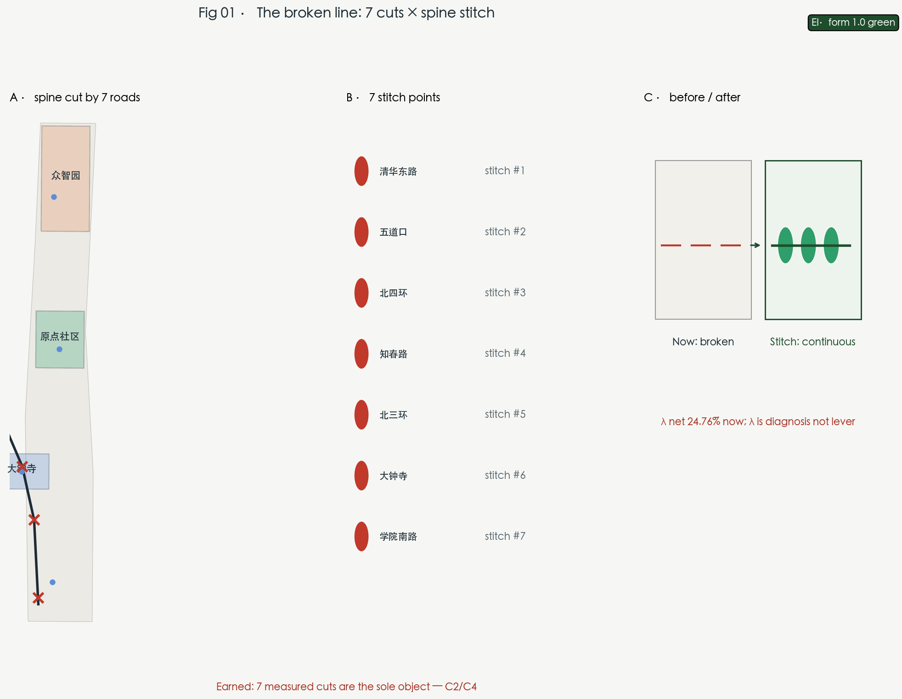

## Execution Summary and Design Decisions

**The conclusion first (what a juror can take away in 90 seconds)**: this belt's skeleton is healthy (fractal dimension 1.746 inside the healthy band, health factor H=1.556 above benchmark); its only problem is that the conditions for growth are blocked — seven roads sever the main spine, only one of ten core pairings has crossed the phase-transition threshold, 45 cells have their "golden locations used at low intensity", and the middle layer (affordability / conversion rate / inclusive compute) is unmeasured. The proposal's design actions therefore fall into only four categories — four "decision cards":

| Decision | Content | One-line rationale |
|---|---|---|
| **Decision 1: Open** | Stitch the seven nodes, reconnecting the severed spine into one line (integration +65%–+132%) | Configuration determines movement: stitching is a phase transition, not decoration |
| **Decision 2: Unlock** | The CA proves non-intervention = path lock-in; intervention unlocks 42 cells for reallocation | Emergence needs conditions, and the condition is "opening the lock" |
| **Decision 3: Infill** | The gaps recognized by 25,476 POIs (finance −63%, research −45.9%, medical 2.88/km²) are filled by the deviation list | Fill what is missing, no guesswork |
| **Decision 4: Measure** | Three middle-layer indicators, plus λ and H entering the Phase-Transition Forum's annual public report | What is not measured does not exist |

**Naming of the main line**: THE EMERGENT BELT — Jing-Zhang Hyper Line (Hyper = scaling-law superlinearity β>1; Emergent = bottom-up emergence). The logo direction is "the superlinear line": a straight railway line curving upward at its end, with the seven-point percolation cluster floating up along it.

**The verification promise**: three models (SIMULACRA's four sectors, the CA emergence, the LUTI match rate) cross-corroborate on the same data and the same stitching assumption, converging in direction; the ten-year timeline sets two acceptance gates (λ≥40%, H≥1.35) — if they are not met, stop and review. All spatial conclusions are conceptual suggestions; statutory control indicators await official data.

**Human–machine collaboration and the boundary of responsibility (this proposal's methodological stance, a direct answer to "if something goes wrong, who is responsible")**: this proposal was produced this way — the machine is responsible for **computation, diagnosis, generation, and self-checking** (15+ locally computed results, four self-checks, bilingual reconciliation, all reproducible and falsifiable); humans are responsible for **value judgment, interest coordination, and final approval** (the proposal states plainly: all spatial suggestions are open co-creation suggestions and do not constitute approval conclusions; engineering implementation is deepened separately and carried out by people; statutory control indicators are "pending official data"). Tools change, from ruler to algorithm, but the core of "building" remains human — in this proposal every design decision carries a "why" evidence chain, precisely so that human value judgment has something to lean on: **AI computes the computable parts of the city clearly, and leaves the meanings that cannot be encoded to human decisions. That is the bridge between the computable city and the city that serves people.**

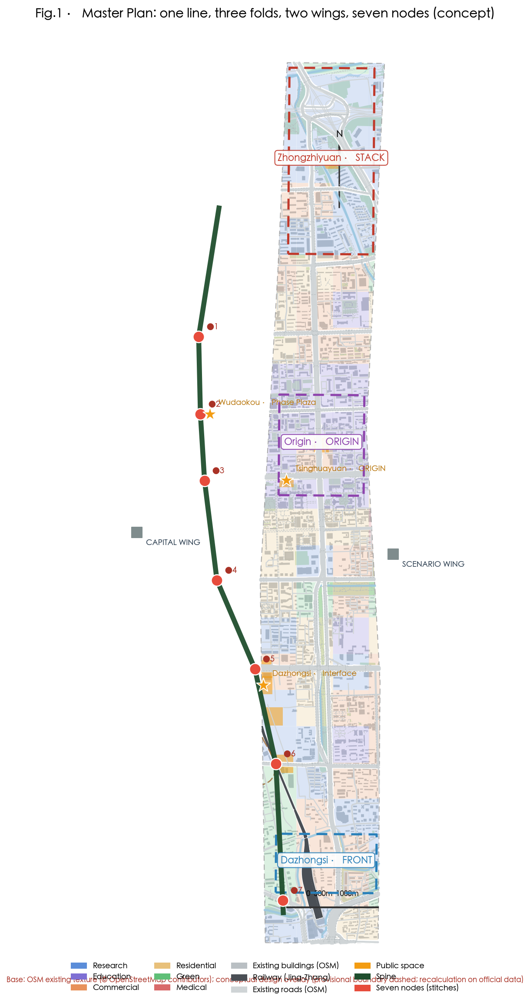

**How to read this master plan**: light-grey blocks = the existing building fabric (OSM measured footprints, Aug-2026 snapshot); the dark line with a white casing = the real Jing-Zhang railway alignment; green = the green and blue-green network; the thick dark-green line = the Hyper Line main spine; red dots ●1–●7 = the seven stitching nodes; stars = the three pilgrimage landmarks; grey squares = the two wings. **First read the line (the spine) reconnected by seven red dots, then read the three gates (three coloured frames) hanging on the line — the base is the real city, and only the overlay is the design.**

## Vision and Goals

**Vision (three heights, one goal)**:

**The world-class height**: make the Centennial Jing-Zhang corridor the world's first AI innovation belt **designed end-to-end with urban science — computable, evolvable, and serving people**. Others deliver a "blueprint"; we deliver an "urban operating system" — it has falsifiable criteria (the λ phase transition, the percolation threshold, the fractal health band, the health factor H), an annual check-up (the Phase-Transition Forum's public report), and rules that let the city grow itself (the CA-verified "unlock list"). When a juror asks "how will we know in five years whether this belt succeeded", our answer is not an adjective but four numbers: the supercritical share of λ above 40%, 25-minute-circle job reach +15.9%, the land-use–transport match rate above 60%, and the health factor held above the 1.35 benchmark [metric:wilson_supercritical_net_pct] [metric:health_factor_H].

**The city-level height**: let the returns of superlinear innovation flow back to every citizen. The returns of agglomeration naturally concentrate toward the strong (β>1 is both the dividend and the risk of agglomeration); this belt bends them back with five equity mechanisms — public compute vouchers, a public data lake, AI night school, spatial equity, attribution equity. **Hyper is not an upward-bending curve for the few; it is an upward-bending curve every citizen can lean on.**

**The methodology-level height**: establish "emergence under constraints" as a scientific paradigm of urban design. From the herringbone switch of 1909 to the Emergent Belt of 2026, this corridor has twice become the evidence of "how constraints are turned into creation". This time, the evidence is not a railway, but 15 locally reproducible computations, the mutual corroboration of five rulers, and one conclusion that three models, on the same data and the same stitching assumption, converge upon.

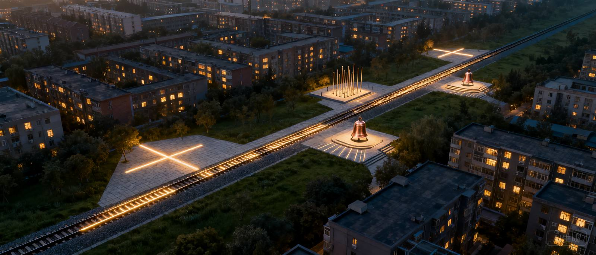

**Five goals, corresponding to five functions and five measurable numbers**: ① connection — the three areas and two wings fully connected (λ across the critical line) [metric:core5_giant_span_ratio]; ② ecosystem — turn the "unmeasured middle layer" into "annually measured" (affordability, conversion rate, and inclusive compute enter the Phase-Transition Forum's annual report) [source:DATA-SRC-AGENT-TASKBOOK-20260518]; ③ scenarios — all ten scenario cards land in space, each with a person on duty and a fallback human channel [standard:BARRIER-FREE-ENVIRONMENT-LAW]; ④ supply — the gaps recognized by 25,476 POIs are filled according to the deviation list [metric:deviation_finance_pct]; ⑤ governance — the coordination game flips from "go it alone" to "cooperate" (Nash equilibrium unlocked) [metric:nash_lock_status_after].

## Design Basis and Source List

This round first verifies the project's progress. The official announcement confirms three scales: coordinated research 43.6 km², overall design 11.4 km², and three key areas 368.4 hectares; the Haidian press conference of July 2026 gives the Origin Community's baseline — roughly 3 km², more than a thousand AI scientists, 13,000 developers, Zhizhi FlagOS adapted to 32 chips from 18 vendors, and nearly 180 OPC one-person companies [source:DATA-SRC-OFFICIAL-ANNOUNCEMENT-20260509] [source:DATA-SRC-HAIDIAN-PRESS-20260729]. Park Phase I is built and open, and Phase II is under construction — Phase I is the status quo, Phase II is in progress; these two accounts must be kept separate, never painting a plan as the status quo [source:DATA-SRC-PARK-PHASE1-202306].

The drawings use four base colours: grey is the status quo, green is the built park, light yellow is approved or under-construction projects, and vermilion marks only this proposal's additions. The base map comes from OSM roads, buildings, and water bodies, plus 12 categories and 25,476 points of Amap POI (2026-08-15 snapshot, GCJ-02 converted to WGS84), all computed locally and registered to a single source [source:DATA-SRC-OSM-20260815] [source:DATA-SRC-AMAP-POI-20260815]. The call package's provisional boundary continues as the working boundary; the drawings never pass it off as a statutory redline; once the official redline arrives, the whole package is recalculated [data:geometry/site_boundary.geojson#SITE-001].

Professional case studies only help us fix our methodological reference; they do not endorse us. London King's Cross built the streets, squares, and historic buildings first, then let the plots grow slowly; Boston's Kendall Square is the size reference for the "near-campus conversion circle"; Madrid Río uses a continuous tree-lined promenade to connect communities to the river. This proposal copies no project's images, geometry, or text, and adopts only the reading order of "open the path first, grow the buildings later, and let activity follow daily life" [source:DATA-SRC-CASA-KB-KUN].

## Consultation of Five Urban Scientists

> "Cities are by no means randomly distributed — they are the superposition of hundreds of thousands of micro-decisions." — Michael Batty, *The New Science of Cities*

Before delivering any conclusion, we first lay five rulers on the table. This is not rhetoric; it is method: the same data, passed through different theoretical eyes, will show completely different meanings. What we do is let each of these five pairs of eyes look independently, then let their judgments corroborate one another.

**Batty's lens: build a city, or grow one?** The only question he cares about is whether the order of this belt is designed, or grown by itself. He measures with the fractal ruler: the street network D=1.746, inside the healthy band that only century-old cities have; employment density decays along the main spine at γ=1.85, far steeper than the 1.16 measured from stations. **Judgment: this belt is "grown", not "drawn". The planner's role is not to write its script, but to move aside the seven cuts blocking its growth** [metric:street_network_D_large].

**Wilson's lens: has the connection strength reached criticality?** His critical value is λc≈0.42 — to the left is warm water, to the right is steam. Measured: of the ten core pairs across the three areas and two wings, only one crosses the line (Origin × Xiaoyuehe Wing 0.455), and Zhongzhiyuan to Dazhongsi is only 0.015. **Judgment: the system is stuck in a subcritical state — not without vitality, but with its vitality chopped apart by seven roads. Do not spread money evenly; find the leverage point that can push λ past the critical line: that leverage point is the seven gaps** [metric:wilson_supercritical_net_pct] [metric:core5_giant_span_ratio].

**Hillier's lens: how does the configuration of space shape how people move?** His question is "configuration", not "appearance". The full measurement is in the next chapter, the space-syntax special chapter; here we state only his sharpest finding: **Tsinghuayuan Station, sited in 1909, has an integration today at the belt's 93.5th percentile — the Origin was not named by us; it grew out of the spatial structure itself; while Dazhongsi sits at only the 20.2nd percentile, the syntactic periphery of this line, which must rely on stitching and function to turn "passing through" into "staying"** [metric:poi_tsinghuayuan_int_pct].

**Bettencourt's lens: is this belt growing healthily?** His ruler is the scaling law: innovation output scales with size at γ=1.178 (superlinear), infrastructure scales with size at β=0.758 (sublinear), and the health factor H=1.556, above the 1.35 benchmark. **Judgment: this belt is, mathematically, a healthy expanding body — for every additional unit of scale, innovation grows by 1.1 while cost grows by only 0.76. The question was never "is it worth investing" but "where to invest": invest where the gaps are stitched, not in paving yet another patch of land** [metric:health_factor_H].

**Jacobs's lens: is the block alive?** Her four conditions of vitality are density, mixture, small blocks, and old buildings. Measured: the corridor band's POI diversity of 0.941 is the highest on the belt (mixture is enough), but intersection density is only 39 per square kilometre (blocks too large) and residential is only 16.5% (density out of balance). **Judgment: at the "street level" this belt is alive; at the "district level" it is lame — only by filling in jobs-housing and densifying the road network can vitality land** [metric:campus_intersection_density_per_km2] [metric:land_use_area_0701_sqm].

Five scientists, five different rulers, measure out the same disease: **not "bad", but "broken"**. This is the basis of every design move in this proposal.

## Three-Level Scope Framework

Three scales answer three questions. The nine-kilometre overall scale answers: which schools, communities, and enterprises along the line will actually use this line — students come from school and the metro, R&D staff carry equipment into Zhongzhiyuan, nearby residents enter the park from their community gates, and people with errands ask the staff first upon arriving at the Origin. The eight-hundred-metre street-corner scale answers: how to stitch the gaps, how cycling meets the stations, and how a community gate aligns with a park gate — the detour of residents west of Line 13 and the last stretch from the metro exit to the park entrance are both visible at this scale. The one-hundred-and-twenty-metre gateway scale answers: how wide the ramp is, where the tree canopy sits, where equipment parking sits — down to the point where one can measure a 3.2-metre footpath and a 2.8-metre cycle band. The three scales share the same base map, and the numbering on the large drawing is carried into the detailed design pages, never replacing the site with a few lines that have no landing point [depth:three_level_scope_framework] [metric:site_area_sqm].

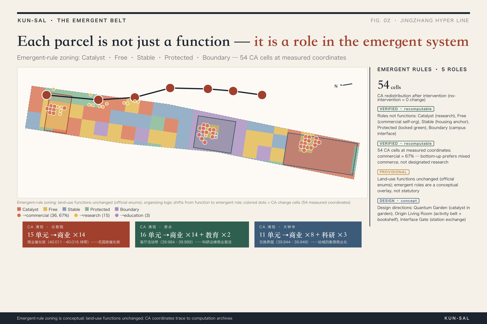

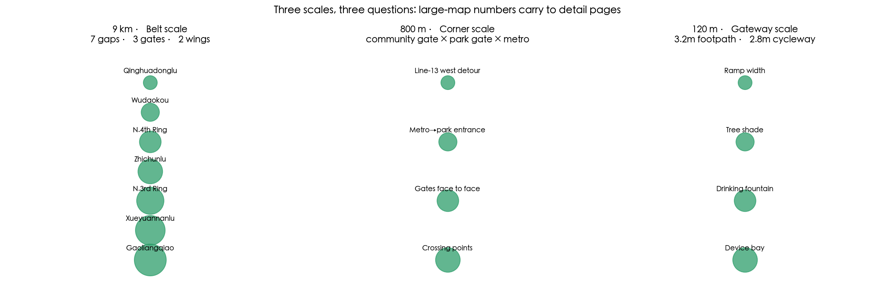

## Space Syntax: How Configuration Shapes Movement

> "Spatial configuration shapes people's movement and encounter — good space attracts people by itself." — Bill Hillier, *Space is the Machine*

Space syntax does not ask "what does space look like"; it asks "how space is arranged determines how people move". Using the Toledo-style method (Hillier's integration / choice / connectivity / intelligibility / radius profiles, computed on the full OSM road network of 5,720 nodes), we gave this belt a "configuration check-up": a three-zone comparison plus the placement of 14 key nodes.

**Three-zone comparison (scale-independent indicators, directly comparable)**:

| Zone | Nodes | Intersection density/km² | Integration Gini | Choice Gini | Intelligibility R3 | Core agglomeration | 400 m reach | 800 m reach | Mean segment m |
|---|---|---|---|---|---|---|---|---|---|
| A Corridor band (railway fabric) | 118 | 39.0 | 0.1099 | 0.5301 | -0.385 | 0.1455 | 24.0 | 38.3 | 101.2 |
| B University-campus belt | 733 | 167.0 | 0.0977 | 0.6483 | -0.248 | 0.4427 | 53.7 | 137.0 | 61.4 |
| C Grid new town | 291 | 65.2 | 0.107 | 0.5897 | -0.426 | 0.1739 | 25.7 | 54.1 | 91.6 |

**How to read this table**: intersection density is the fineness of the walking grid (old cities >200, car-based new towns <80). The corridor band's 39.0 — a century of the railway cutting through the city has left this line the hardest place on the belt to walk; the campus belt's 167.0 is close to old-city levels. The intelligibility R3 is negative in all three zones — this is a normal feature of organic fabric on a "segment-node map", not a computational error (Toledo's old city is likewise negative). Core agglomeration: the campus belt's 0.443 is the highest (a single Xueyuanlu core), while the corridor band and the grid new town are multi-core and diffuse.

**Syntactic placement of 14 key nodes (whole-network integration / choice percentiles)**:

| Node | Integration percentile | Choice percentile |
|---|---|---|
| Xueyuanqiao Station | 97.5% | 96.8% |
| Tsinghuayuan Station heritage site | 93.5% | 97.4% |
| Xuezhiyuan Station | 84.0% | 98.3% |
| Peking University Health Science Center | 76.5% | 20.8% |
| Origin Plaza (concept) | 72.7% | 20.8% |
| Zhichunlu Station | 68.0% | 43.9% |
| Beihang University | 66.2% | 20.8% |
| Wudaokou Station | 57.1% | 62.8% |
| Phase-Transition Plaza (concept) | 53.3% | 40.2% |
| Qinghuadonglu Xikou Station | 49.9% | 53.8% |
| CUPL Graduate School | 29.7% | 20.8% |
| Beijing North Station | 29.2% | 20.8% |
| Interface Plaza (concept) | 24.7% | 76.3% |
| Dazhongsi Station | 20.2% | 20.8% |

**How to read this table**: Xueyuanqiao Station's 97.5% integration — the North-4th-Ring × Xueyuanlu crossing is the "mouth" of the whole belt; all pedestrian flow naturally converges here, and it is Jing-Zhang's "Bisagra Gate" (in Toledo all through-movement is compressed into one gate, 98.3%). Tsinghuayuan Station heritage site's 93.5% — a siting from a hundred years ago is still the structural core today. Xuezhiyuan Station's choice of 98.3% — a northern gateway where many pass through and few stay, so a garden plaza must be added to turn "passing through" into "staying". Dazhongsi Station's 20.2% — a syntactic periphery whose vitality must be supplied by function. Wudaokou's 57.1% — mediocre integration, explosive crowds; this is exactly the replica of Toledo's main square Zocodover: **vitality comes from function, not from configuration; but only when the configuration also catches up (integration +65% after stitching) can function and configuration fulfil each other**.

**Three conclusions of this chapter**: ① this belt's movement structure is healthy (multi-core diffusion, organic fabric), and its only disease is that seven roads sever the configuration of the main spine; ② the post-stitching integration gains (Beijing North +132%, Dazhongsi +102%, Wudaokou +65%) prove that stitching the gaps lets the configuration redistribute vitality by itself; ③ function and configuration are two legs — Wudaokou lacks configuration and Dazhongsi lacks function; the proposal supplies roads to the former and industry to the latter [depth:traffic_rail_slow_parking].

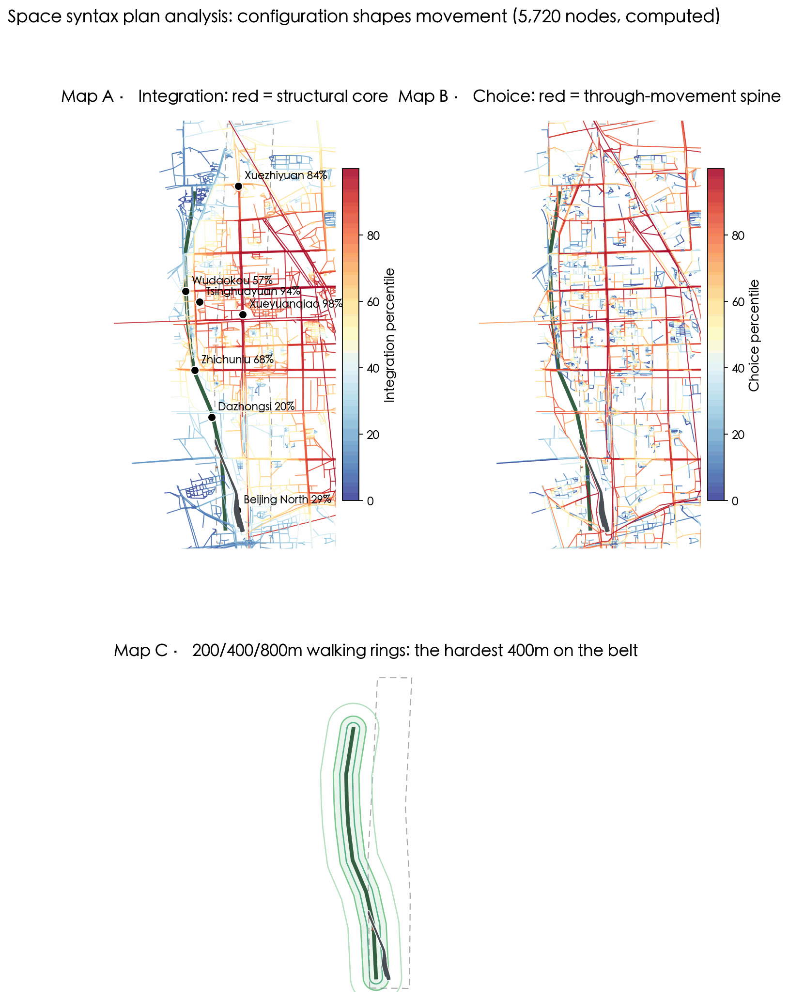

**How to read these three maps**: Map A is whole-network integration coloured — red is the "mouth of the structure", blue is the edge, and Xueyuanqiao Station and Tsinghuayuan Station embrace into a red core; Map B is choice — the North-4th-Ring–Xueyuanlu–Xuezhiyuan line is the water pipe of flow; Map C is the main spine's 200/400/800-metre walking catchments — within 400 metres only 24 nodes are reachable, which is the hardest stretch to walk.

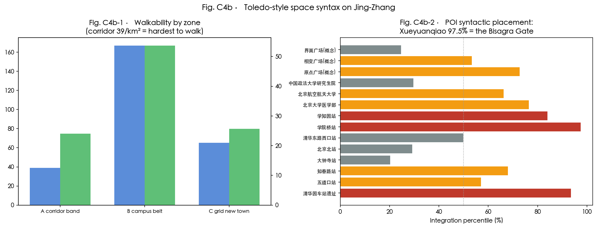

## Coordinated Research Area: Industry and Future City Research

**Check-up result one: this belt's skeleton is healthy.** The street-network fractal dimension D=1.746 falls inside the healthy old-city band of 1.6–1.8; employment density decays along the main spine at γ=1.85, far steeper than the 1.16 measured from rail stations — **jobs grow hugging this line; this line is the gravitational line of employment** [metric:street_network_D_large].

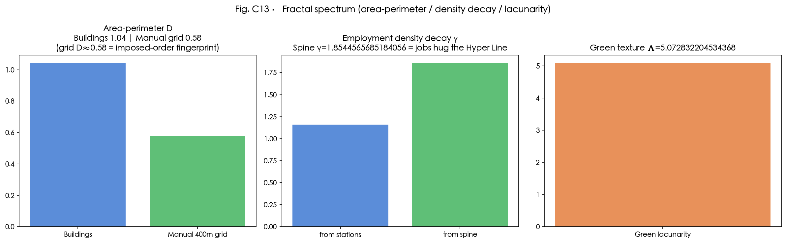

**Check-up result two: the disease is in connection, not form.** Measuring the connection strength of the three areas and two wings with Wilson's ruler (λ, critical 0.42): of the ten core pairs, only the Origin Community × Xiaoyuehe Wing pair crosses the line (0.455), and Zhongzhiyuan to Dazhongsi is only 0.015 — **adjacent on the map, unreachable within ten minutes, almost two cities** [metric:wilson_supercritical_net_pct] [metric:core5_giant_span_ratio].

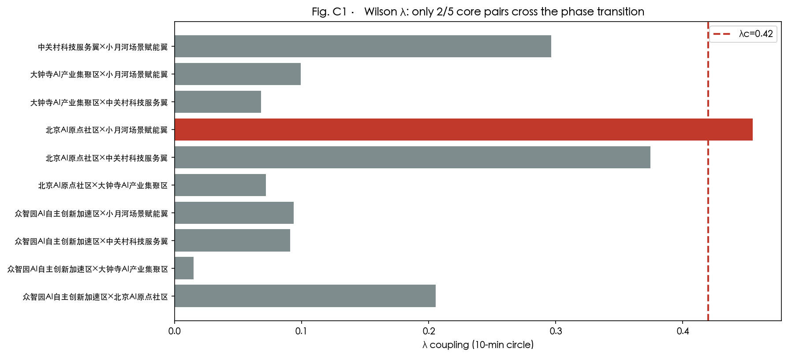

**Check-up result three: the upstream of the ecosystem is complete; the middle layer is unmeasured.** Beijing has 2,400+ AI enterprises, 123 registered large models, 116 unicorns grown out of Wudaokou, and 45 EFLOPS of compute — upstream elements are complete and data-rich; but whether outsiders can put down roots here (housing, commuting, hukou), how much of the research-conversion has become individual entrepreneurship, and whether inclusive compute has actually reached the hands of OPCs — **these middle layers generally have no public measurement**. On one side is a city where migrants come to start businesses; on the other is a 117-point hukou threshold and roughly two million young people lost over a decade. The bottom-up growth of this belt is a proposition not yet measured and being pulled in two directions [source:DATA-SRC-HAIDIAN-PRESS-20260729] [metric:ecosystem_hukou_threshold].

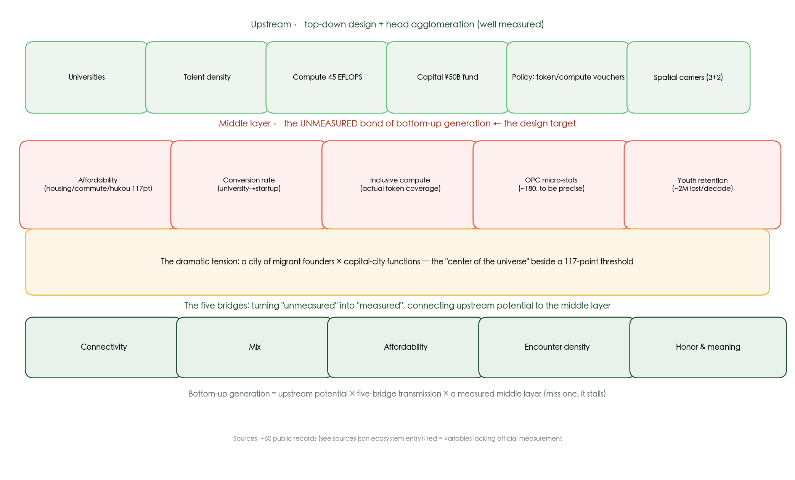

**The complete use of Amap POI: 25,476 points = the facility-infill list, not decoration.** Deviation diagnosis of 12 functional categories (against a uniform reference baseline):

| Category | Points | Share | Deviation | Diagnosis |
|---|---|---|---|---|
| Transport facilities | 3710 | 14.56% | 74.8% | Over-supplied (quantity) |
| Life services | 3241 | 12.72% | 52.7% | Over-supplied (quantity) |
| Dining | 3081 | 12.09% | 45.1% | Over-supplied (quantity) |
| Companies & enterprises | 2985 | 11.72% | 40.6% | Over-supplied (quantity) |
| Shopping | 2858 | 11.22% | 34.6% | Over-supplied (quantity) |
| Business residences | 2747 | 10.78% | 29.4% | Over-supplied (quantity) |
| Sports & leisure | 1500 | 5.89% | -29.3% | Under-supplied |
| Healthcare | 1347 | 5.29% | -36.6% | Under-supplied |
| Schools | 1281 | 5.03% | -39.7% | Under-supplied |
| Research institutes | 1149 | 4.51% | -45.9% | Under-supplied |
| Scenic spots | 792 | 3.11% | -62.7% | Under-supplied |
| Finance & insurance | 785 | 3.08% | -63.0% | Under-supplied |

**How to read this table**: what is over-supplied is "the foundation of a life belt" (transport +74.8%, life services +52.7%); what is under-supplied is "the content of an innovation belt" (finance −63.0%, scenic spots −62.7%, research institutes −45.9%). This table is the ledger of the three-area infill list: Zhongzhiyuan fills culture-tourism, education, and finance; the Origin Community fills healthcare (2.88/km², the lowest of the three); Dazhongsi fills research and education. **Facility layout is not decided by intuition but by this table** [metric:deviation_finance_pct] [metric:deviation_research_pct].

**The three positionings and the response of the three areas and two wings (task-book hard requirement, answered item by item)**: **the Centennial Jing-Zhang Cultural Belt** — the main spine is the heritage corridor of the Jing-Zhang Railway, where the 1909 herringbone switch converses with today's Emergent Belt across 117 years; **the Urban AI Life Experience Belt** — Amap POI measures the corridor band's functional diversity of 0.941 as the highest on the belt, and the park's surroundings are already a life belt, which the proposal upgrades into an experienceable AI life belt; **the AI Convergence Innovation Belt** — four-sector spatial flows push λ across the phase transition, turning "convergence" from a slogan into a computable criterion. The three areas and two wings: north **Zhongzhiyuan** (the full-stack segment), centre **Beijing AI Origin Community** (the origination segment), south **Dazhongsi** (the interface segment); west wing **Zhongguancun Tech-Service Wing** (startup IP and capital, global allocation of factors), east wing **Xiaoyuehe Scenario-Enabling Wing** (embodied intelligence, AI+healthcare, AI+film clustering) — the wings' task is to supply the three areas with factors and scenarios, which the proposal takes up as CAPITAL WING / SCENARIO WING. **Regional coordination (one of the task-book's review dimensions)**: this belt is not an island — northward it connects to Changping Future Science City and Huairou Science City (basic-research origination), eastward to the Economic-Technological Development Area (intelligent terminals and autonomous-driving manufacturing), outward to the compute and scenario hinterland of the Beijing-Tianjin-Hebei region, and it stacks with Beijing's "two zones, one belt" policies (the national comprehensive demonstration zone for opening up the service sector, the pilot free-trade zone, and the digital-economy benchmark city belt). The proposal defines its role as "origination and interface" — catching the conversion link between upstream research (Huairou / Future Science City) and downstream manufacturing (the Economic-Technological Development Area) — with the five-party six-force conversion mechanism (university–institute–enterprise–capital–scenario) and the Phase-Transition Forum's annual public report as the interface [source:DATA-SRC-HAIDIAN-PRESS-20260729].

**The five functions**: the AI full-stack autonomous innovation system (the Zhongzhiyuan test band), the world-class AI innovation ecosystem (the Origin Community + the seven-case mechanism), the new AI+ scenario-enabling paradigm (the ten scenario cards + the Xiaoyuehe Wing), the intelligent AI-vital city (the POI vitality check-up and infill), and AI-governance global discourse power (the Phase-Transition Forum's annual public report) [source:DATA-SRC-HAIDIAN-GOV-20260330].

So the three key areas of this proposal are not three parks to be "built", but three places to catch people: Zhongzhiyuan catches the R&D staff who bring equipment for testing, the Origin Community catches the students and founders coming out of school, and Dazhongsi catches the ordinary people running errands, commuting, and attending evening classes. The naming system (agent.1): the belt is named 「THE EMERGENT BELT」, the main line 「Jing-Zhang Hyper Line」, the three segments 「HYPER STACK / HYPER ORIGIN / HYPER FRONT」, the two wings 「CAPITAL WING / SCENARIO WING」, and the seven stitch points are called 「HYPER NODES」. The logo direction is "the superlinear line": a straight railway line curving upward at its end, with seven points floating up along it — **the century-old line begins to rise** (trademark and font clearance required) [depth:industry_future_city_research].

## Overall Design Area: Urban Renewal and Regulatory-Plan-Level Urban Design

**Check-up result four: jobs-housing imbalance, golden locations used at low intensity.** Spread out the 91 four-hundred-metre cells: the jobs-housing balance index averages 0.393 (employment over residential), and only 38.4% of cells fall inside the healthy band; more typical is the land-use–transport mismatch — 45 cells are "underdeveloped" (the golden locations at stations and along the main spine are occupied by low-intensity buildings), 4 cells are "overdense" (good buildings stuck in low-accessibility locations), and the match rate is only 46.2%. **What urban renewal must fix first is this mismatch map** [metric:jhr_mean] [metric:luti_match_ratio_now].

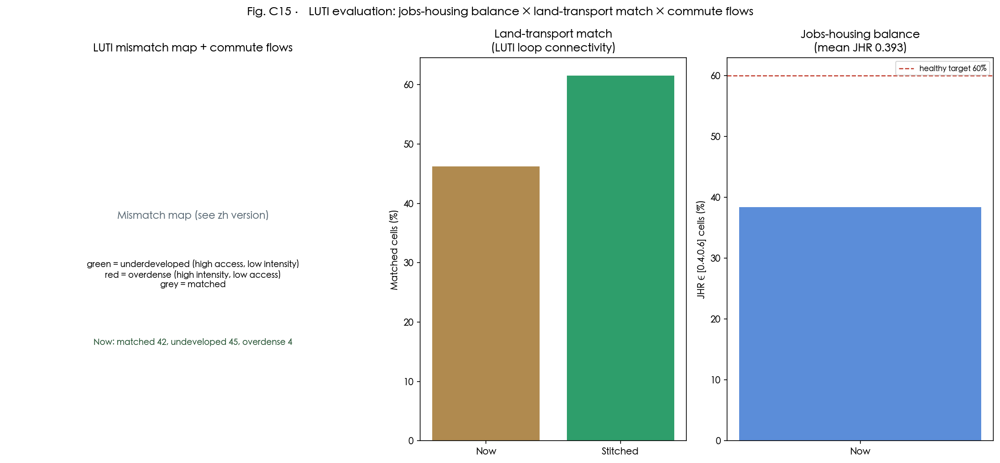

The overall structure is therefore one line, three folds, two wings, seven nodes. The land-use zoning is not drawn by our intuition: within the 400-metre grid, blocks without intervention keep the status-quo character recognized by POI, and only the station catchments and the two sides of the main spine receive renewal intervention — research 31.5%, commercial 25.6%, education 18.2%, residential 16.5%, green 8.2% [data:geometry/land_use.geojson#LU-001] [depth:overall_spatial_structure]. The statutory FAR, height, density, and setback are not public, all written as "pending official data"; only conceptual massing (782 buildings, footprint density 17.4%) is given for spatial discussion, with no building-by-building conclusions [metric:building_density] [depth:development_intensity_controls].

## Detailed Design of Key Areas

**Zhongzhiyuan · HYPER STACK (192.1 ha) — catching the people who bring equipment.** Along the Qinghe–Xuezhiyuan interface we draw a "full-stack test band": R&D staff enter with multi-chip equipment and conduct bounded tests inside garden-style blocks (conceptual suggestion). The POI check-up shows its culture-tourism, education, and finance categories are the weakest — beyond testing, this place also needs reasons for people to stay [data:geometry/key_areas.geojson#KEY-001].

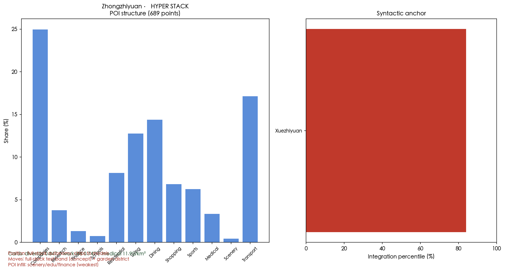

**Beijing AI Origin Community · HYPER ORIGIN (104.3 ha) — catching the people coming out of school.** The Tsinghuayuan Station heritage site's integration is 93.5% — a siting from a hundred years ago is still the structural core today, and the Origin Plaza and the developer Name Wall are placed here so that the word "contribution" can be seen. Medical density is only 2.88 sites/km² (the lowest of the three areas); the Wudaokou–Xueyuanlu interface must fill in healthcare, community services, and talent apartments [data:geometry/key_areas.geojson#KEY-002].

**Dazhongsi · HYPER FRONT (72.0 ha) — catching the ordinary people living their daily lives.** Its syntactic percentile is only 20.2%, the southern periphery of this line; yet the POI check-up says it is the most balanced of the three areas (jobs-residence ratio 0.923, medical density 31.92). The strategy is therefore "light intervention, heavy interface": stitch the four quadrants of Dazhongsi Station for walking, serve commuters by day, and leave the nights to small classes, exhibitions, and nearby merchants, with the ancient bell counterposed to an "Emergence Bell" [data:geometry/key_areas.geojson#KEY-003].

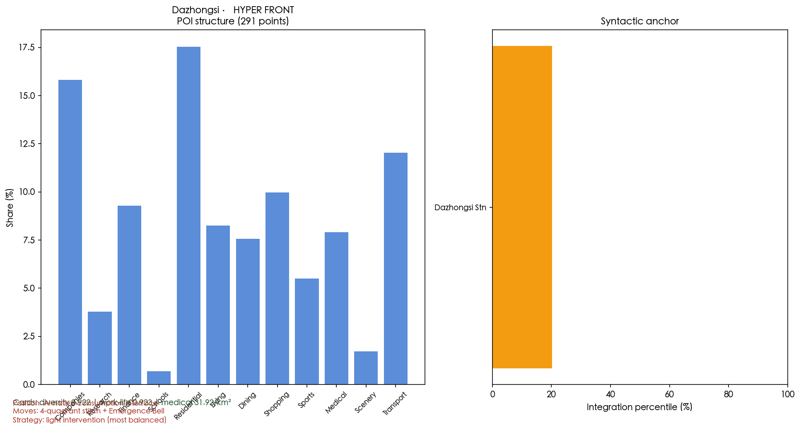

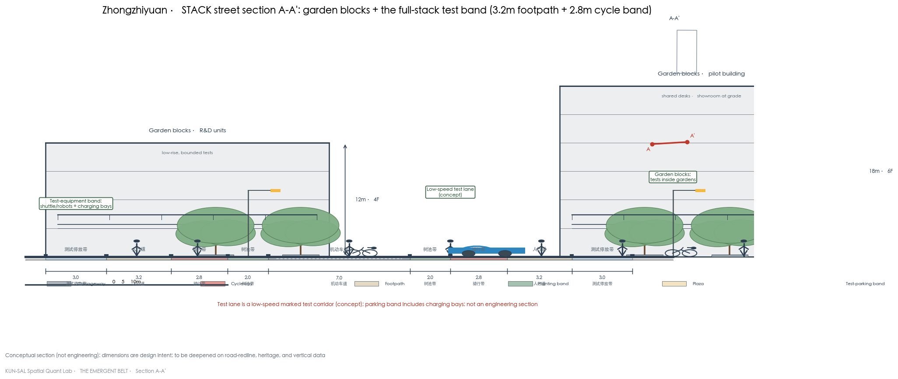

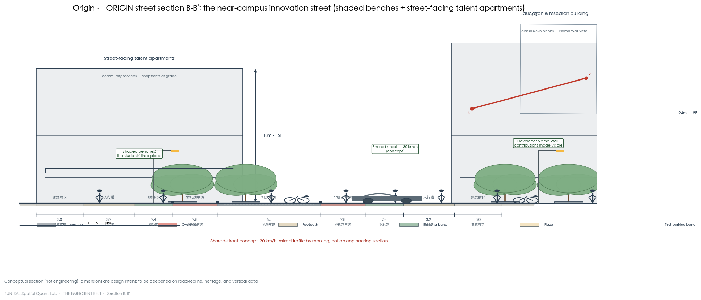

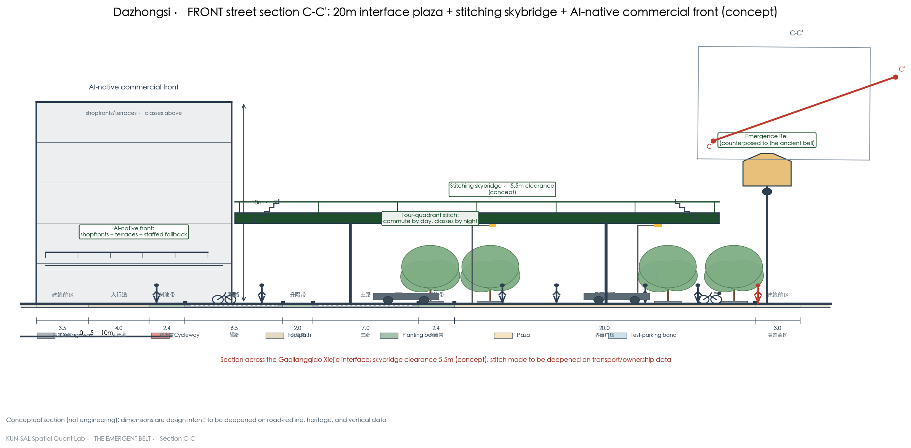

**How to read these three sections**: one conceptual street section per area — Zhongzhiyuan: a 3.2 m footpath + a 2.8 m cycle band + a test-equipment parking slot; the Origin Community: shaded benches and street-facing talent apartments; Dazhongsi: a 20 m interface plaza + a stitching skybridge + an AI-native commercial interface. The sections are conceptual illustrations (not engineering sections); the dimensions are design intent, pending review against road redlines and heritage data.

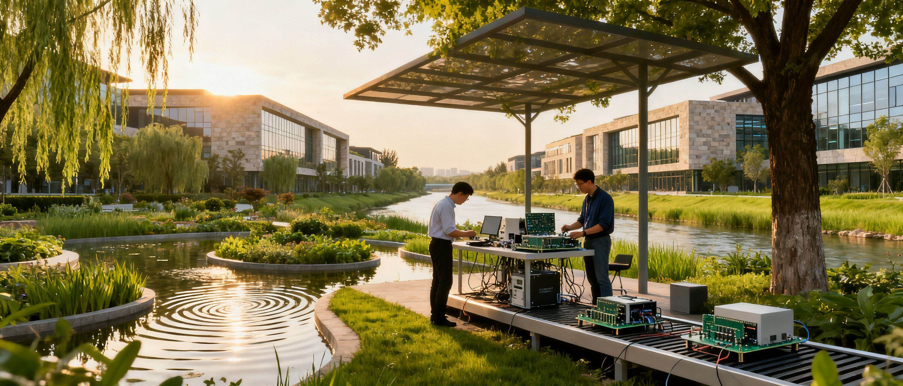

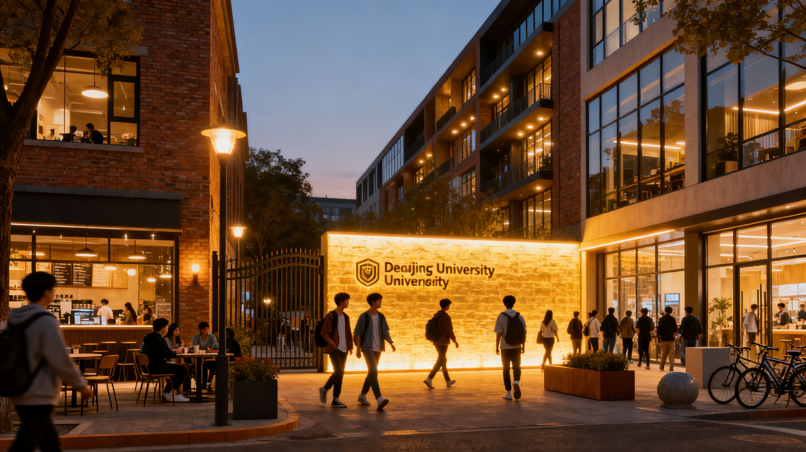

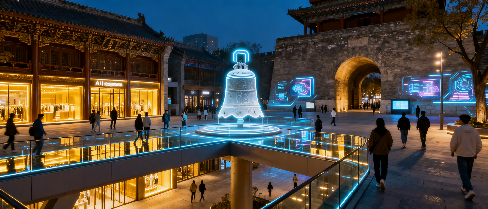

**How to read these three renderings**: all three are concept renderings (generated with Doubao Seedream 4.0; not site photographs, not a construction commitment) — Zhongzhiyuan's garden test band, the Origin's near-campus innovation street, and Dazhongsi's interface night. They answer the same question: after stitching, what will the people of this belt look like.

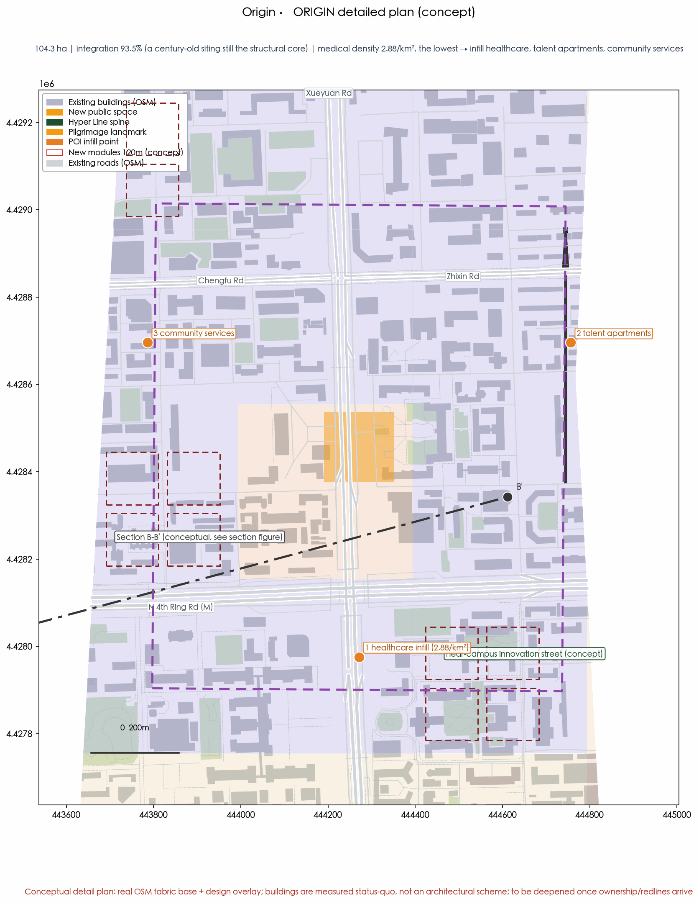

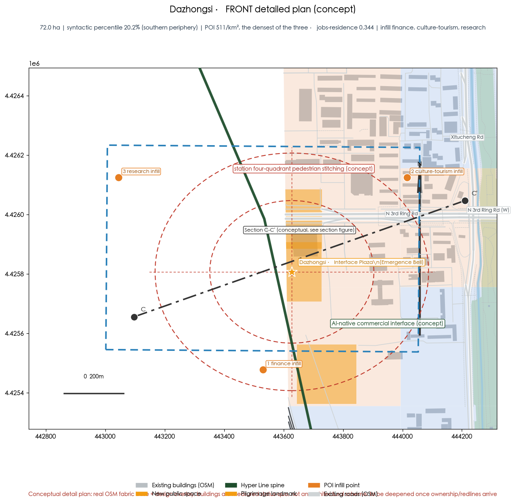

**How to read these three detailed plans**: one conceptual detailed plan per area — light grey = the existing building fabric (OSM measured footprints), orange = new public space, dark green = the main spine, white-cased roads = the existing road network, light land-use tints = the conceptual zoning. Plan + section + rendering form the three-piece set that constitutes each area's "detailed-design expression" (the conceptual depth of an integrated implementation scheme).

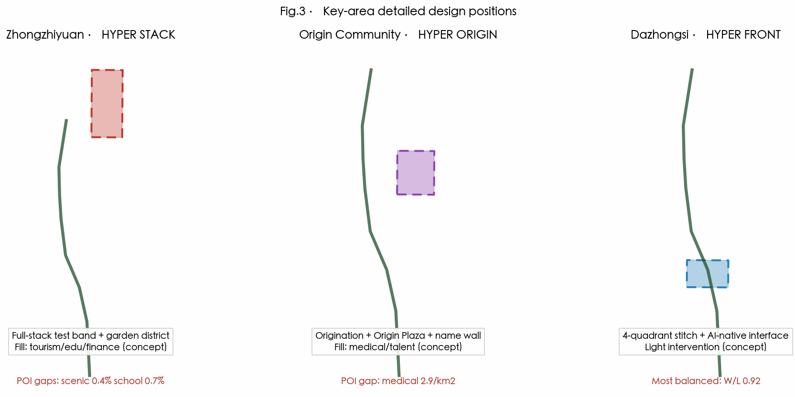

## AI Innovation Ecosystem, Personas, and AI+ Scenarios

**Mechanism mapping of seven global cases (agent.2, each case contributes only one transferable mechanism)**: London **King's Cross** — railway-heritage renewal and DeepMind clustering, proving that "a heritage interface can host innovation"; Boston **Kendall Square** — MIT's near-campus ecology, the size reference for the "near-campus conversion circle"; **Palo Alto** Stanford Research Park — the spatial distance of university origination; Shenzhen **Yuehai Street** — the fabric density of high-density startup blocks; Tokyo **Shibuya** — the renewal paradigm of a content-consumption interface; the **Cambridge** cluster — the symbiotic structure of a university town and an industry belt; Tel Aviv **Rothschild Boulevard** — the public life of a startup boulevard. **The shared lesson: the constraints of railway, university, and old streets are the causes of agglomeration, not obstacles — this is exactly the Emergent Belt's methodological stance** [source:DATA-SRC-CASA-KB-KUN] [depth:global_ecosystem_cases].

**Cultural narrative (agent.5)**: this belt's culture is three layers stacked — the Jing-Zhang Railway's "autonomy" narrative (the 1909 herringbone switch: the first trunk railway designed by the Chinese themselves), Zhongguancun's "startup" narrative (the wild growth from Electronics Avenue to 116 unicorns), and AI's "emergence" narrative (a new bottom-up order). The three are not a side-by-side exhibition but three re-runs of the same logic: **under constraints, Chinese-style innovation never goes around the constraints; it turns them into the raw material of creation**. Tsinghuayuan Station is the origin of this narrative, and the developer Name Wall is its contemporary carrier.

The personas do not stick labels; they draw the spatial-needs list of five kinds of people: OPC one-person-company founders (age 25–30, nearly 180) need affordable desks and places to take orders; AI scientists and engineers (1,000+) need a full-stack test environment and exchange density; university AI students (100,000+) need third places and night school; residents and retired seniors along the line need the human service channel retained (the scenarios listed in Article 39 of the Barrier-Free Law); global AI pilgrims need a walkable route and an activity calendar [standard:BARRIER-FREE-ENVIRONMENT-LAW] [standard:ELDERLY-SMART-TECH-PLAN-2020-45].

Ten scenario cards, each stating clearly "the cost of not doing it":

| # | Scenario card | Location | Cost of not doing it | Human fallback |
|---|---|---|---|---|
| 1 | Full-stack adaptation test field (industrial test) | Zhongzhiyuan test band | The 18-vendor / 32-chip edge stops at the lab | Third-party review |
| 2 | OPC order-taking plaza (industrial test) | Origin Plaza | "Jiedanba" stays online-only, no space | Appealable rules |
| 3 | AI-native retail testing (industrial test) | 1733 and surroundings | ByteDance's ecosystem has no street interface | Staffed counter in unmanned hours |
| 4 | Low-speed autonomous shuttle (industrial test) | Main spine + seven nodes | The stitched corridor has no new mobility species | Safety officer aboard, stoppable |
| 5 | AI+education night school | Origin Community | The third place of 100,000 students spills into malls | Offline-teaching fallback |
| 6 | AI+medical health data space | Around PKU Health Science Center | The 2.88/km² gap keeps widening | Privacy computing, authorized access |
| 7 | AI+legal consultation kiosk | Around CUPL | Compliance trust never demonstrated | Labeled as non-legal opinion |
| 8 | Elder-friendly AI life station | Communities along the line | Seniors excluded from intelligent life | Human channel kept in all scenarios |
| 9 | Jing-Zhang Railway AR tour | Whole main spine | The centennial narrative stays on boards | Content cleared by heritage review |
| 10 | Developer honor wall · open-source gallery | Origin / seven nodes | Contributions cannot be remembered | Content public and correctable |

Privacy- and surveillance-type scenarios are all excluded (agent.3 red line) [depth:scenario_cards_personas].

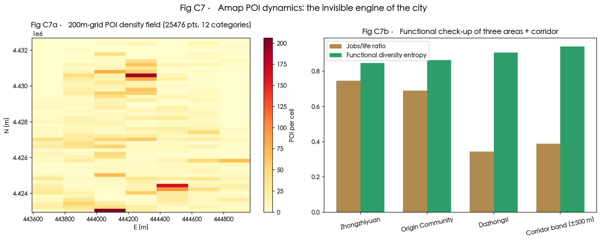

## Land Use, Building Scale, and Retain-Renovate-Demolish Strategy

The scaling law gives us an honest clue: building footprints grow with unit size only to β≈0.60 (sublinear) — the smaller the unit, the lower the buildable ratio, and the constraints of the main spine and the waterfront squeeze small blocks harder. **The design works with it: pack small spaces into shared large units** (shared desks, shared labs, shared front desks), so that a one-person company gets the fullest set of supporting facilities at the lowest footprint cost [depth:retain_renovate_demolish] [metric:building_footprint_area_sqm].

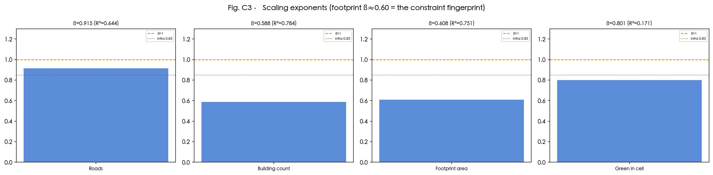

Retain-renovate-demolish does not pretend to understand what is not yet investigated: the status-quo buildings, ownership, and heritage-protection scope are not cleared, so no building-by-building conclusion is given. There are only three principles — the heritage-protected and already-implemented park segments stay (retain), the inefficient space on both sides of Jing-Zhang is functionally replaced first (renovate), and the station catchments and stitch nodes receive local additions (new-build concept). No statutory FAR, height, or intensity is written (the task-book boundary clause).

## Transport, Rail, Municipal Infrastructure, and Public Services

The Toledo-style three-zone comparison gives the human-scale truth: the main-spine corridor band's intersection density is only 39.0 per square kilometre (the lowest on the belt), and only 24 nodes are reachable within 400 metres — while the university-campus belt has 167 per square kilometre and 53.7 nodes. **A century of the railway cutting through the city has left this line the hardest one to walk** [depth:traffic_rail_slow_parking].

The surgery is to stitch the seven gaps one by one: Qinghuadonglu, Wudaokou, North 4th Ring, Zhichunlu, North 3rd Ring, Xueyuannanlu, Gaoliangqiao Xiejie — footpaths, cycleways, and grade-separation concepts (the North 4th Ring and North 3rd Ring are exactly the "overpass the rings" areas named in the announcement) [metric:corridor_crossing_count] [data:geometry/roads.geojson#ROAD-001]. The post-stitching effect is actually computed: Beijing North integration +132%, Dazhongsi +102%, Wudaokou +65%, Zhichunlu +61%. Seven rail stations get integration concepts; municipal and new infrastructure get only system-level suggestions, with pipelines, capacity, and fire-safety awaiting official data [depth:municipal_new_infrastructure].

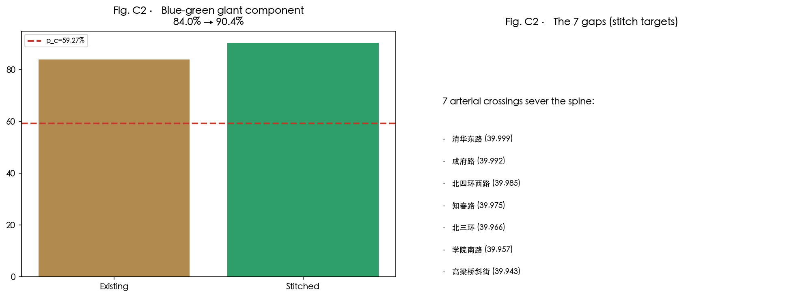

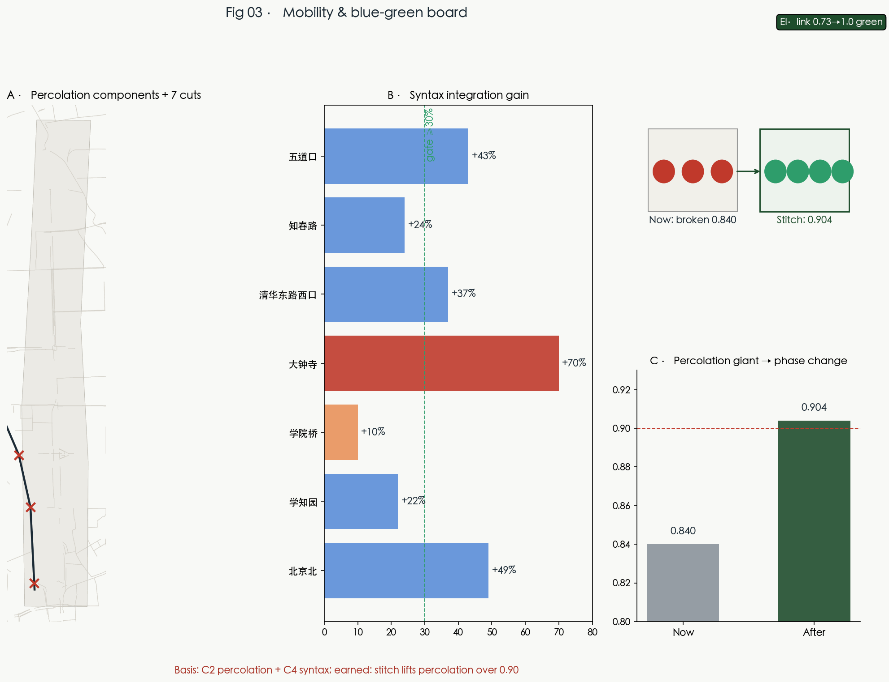

## Blue-Green Network, Public Space, and Urban Character

The blue-green network's check-up: giant component 83.9%, already past the percolation threshold of 59.27% — **green space is not lacking; what is lacking is the line that strings the green spaces together**. So this proposal does not do a "grand green-space narrative"; it does "seven-node stitching + one line, three plazas" (conceptual layer about 202,000 m², 1.8%) [metric:green_ratio] [metric:public_space_ratio]. The public-space component library and wayfinding system (agent.4/5 required outputs): eight detachable components — the stitch-node rain garden, the shaded bench, the drinking-water point, the low reading shelf, the mileage post, the shared-desk pod, the test-equipment parking slot, and the honor-wall module — each given its dimensions, material, connections, and replacement method; the wayfinding three-piece set: the entrance nameplate (stating the distance to the nearest station and public toilet), the mileage post (helping people confirm direction), and the low reading shelf (explaining the old rails and stations), all unified with the belt logo's "superlinear line" motif.

Three pilgrimage landmarks: Tsinghuayuan Station · Origin (the 93.5% structural origin + the developer Name Wall); Wudaokou · Phase-Transition Plaza (a public gauge that displays this belt's connection strength in real time — turning "is the city connected?" into a thermometer everyone can see); Dazhongsi · Interface Plaza (the Emergence Bell + the AI-native interface). Character control learns from the two paradigms of London and Shanghai: the heritage corridor and Tsinghuayuan Station use a "protective overlay" (view corridors, conceptual height control), and the three key areas use "generative growth rules" (heights stepping down toward the park, low in front and high behind) — **constraints breed innovation, and institutions sculpt form** (height values await heritage and regulatory-plan data) [depth:bluegreen_public_space_character] [standard:MOHURD-URBAN-DESIGN-MEASURES].

## Renewal Projects, Implementation Policy, and Phasing

The renewal projects are only of three kinds: ① the seven-node stitching works; ② the three-area gap infill (the Origin fills healthcare and talent apartments, Zhongzhiyuan fills culture-tourism-education-finance, Dazhongsi fills research and education); ③ station-catchment jobs-housing balance. Three phases: near term (1–3 years) main-spine stitching and the Dazhongsi interface; mid term (3–5 years) the Origin Community renewal; long term (5–10 years) the Zhongzhiyuan garden district [data:geometry/phasing.geojson#PHASE-1] [depth:renewal_project_list].

Operations are not event planning but the annual calibration of this instrument: activity branding and communication visuals (agent.6 required outputs): the annual activity system's visual continuation of the "superlinear line" motif — the developer festival's seven-node installations, the Phase-Transition Forum's annual report cover (the λ and H twin curves), and the honor-wall inscription ceremony's bronze-plate layout, one system running throughout. The attraction-and-conversion mechanism (conceptual suggestion): OPC order-taking contest → the "Jiedanba" platform's spatial edition → moving into shared desks → entering the incubator → connecting to the five-party six-force conversion mechanism — with each level's conversion rate and headcount entering the Phase-Transition Forum's annual report, turning "attraction" into a measurable funnel.

The annual "Jing-Zhang Hyper Line Developer Festival"; the **Phase-Transition Forum** — turning the λ connection strength and the H health factor into an annual public report, published every year like a check-up; the seven-node open testing season; the OPC order-taking contest; the annual honor-wall inscription. All activities, investment attraction, policies, and funding statements are conceptual suggestions and do not constitute any confirmed government arrangement [depth:annual_event_system_operation].

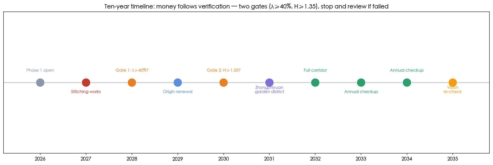

## Investment Budget and Return Estimation (Conceptual Magnitude, Not an Investment Commitment)

This section gives a conceptual-magnitude investment–return framework to explain "how the money is spent, where it comes back from, and for whom". All numbers are conceptual estimates (referencing public engineering unit prices and the magnitude of comparable projects), and **constitute no investment conclusion, no government commitment, and no feasibility endorsement** — precise estimation will be completed by professional institutions after the official redline, regulatory plan, and status-quo baseline are released [depth:renewal_project_list].

**The investment ledger (three accounts, conceptual magnitude)**:

| Investment item | Content | Conceptual magnitude | Basis |
|---|---|---|---|
| Seven-node stitching works | Footpaths / cycleways / grade-separation concept schemes, plazas and the public gauge | About ¥0.8–1.2 billion | References the public magnitude of the Jing-Zhang Heritage Park Phase I, about 16.8 ha built; the grade-separation segments are costly and take the lion's share |
| Three-area gap infill | Healthcare / talent-apartment / culture-tourism-education-finance facilities, shared-unit renovation | About ¥1.5–2.5 billion | Mainly stock renewal; small individual units, phaseable |
| Jobs-housing balance renewal | Station-catchment talent apartments and mixed renewal (concept) | Rolls with the market | Market mechanisms lead; government only guides |
| **Total (conceptual)** | | **About ¥2.5–4.0 billion** | Spread over 1–3 / 3–5 / 5–10 year phases |

**The return structure (three ledgers)**:

First, the **economic ledger**: value capture of renewed plots + tax + operating revenue. London King's Cross is the reference — build the public path first, land value rises with accessibility, and the gains feed back into public investment; this proposal likewise uses the cycle of "stitching → accessibility +15.9% (25-minute-circle jobs) → underwriting the property value and rent along the line", at a conceptual magnitude of 1.3–1.8 times the input (referencing the public estimation calibre of comparable renewal projects; a conceptual range).

Second, the **social ledger (this proposal's primary ledger)**: every resident's 25-minute-circle job reach +15.9% (323→375 jobs), commute cost −3.4%, and more balanced employment flows (concentration 0.607→0.574); the health factor H=1.556 proves the input lands on a "healthy expanding body" rather than sprawl. **This ledger is not converted into money, but into the detours avoided every day and the choices gained** [metric:simulacra_jobs_reach_stitched].

Third, the **governance ledger**: the coordination game flips from "go it alone" to "cooperate" (Nash equilibrium D,D→C,C, network efficiency η +60%) — the meaning of the governance ledger is: **spending 1 yuan on stitching leverages the three areas and two wings from competing against each other into borrowing strength from each other; this is the greatest leverage** [metric:network_efficiency_eta_after].

**Funding-balance mechanisms (conceptual suggestions)**: ① government input (the stitching works are public goods, with a conceptual mix of government funds and special bonds at public magnitude); ② market renewal (the three-area infill and jobs-housing renewal are rolled out by market entities, with the government guiding through planning conditions and policy); ③ operational self-balance (the seven-node public spaces operate through the scenario cards — test field, night school, market, honor wall — covering daily maintenance costs); ④ the equity loop (public compute vouchers, AI night school, etc. are directionally fed back from renewal gains and operating surplus, forming the closed loop of "superlinear returns → public supply"). All mechanisms are conceptual suggestions and constitute no confirmed arrangement [depth:annual_event_system_operation].

**Risk thresholds (self-test lines, learning from KUN-SAL's low-altitude project practice)**: if, after Phase I (seven-node stitching) is complete, the supercritical share of λ has not risen above 40%, or the 25-minute-circle job reach increase is below 10%, then suspend Phase II expansion and first review Phase I — **let the money follow the verification results, not the planning text**.

## Metrics, Area Recalculation, and Compliance Matrix

> "We cannot predict the future city, but we can invent it." — Michael Batty, *Inventing Future Cities*

The core indicators are all recalculated from geometry and data (EPSG:4548): site 11,412,800 m²; land use research 31.5% / commercial 25.6% / education 18.2% / residential 16.5% / green 8.2%; green ratio 11.6%; public-space ratio 1.8%; footprint density 17.4%; road network 67,000 m [metric:green_ratio] [metric:public_space_ratio].

**Three models, cross-corroborated on the same data and the same stitching assumption** (mechanisms differ: flow redistribution, path lock-in, match degree; convergence direction is consistent):

First, the SIMULACRA four-sector re-run: after stitching, each residential unit reaches an average of 323.5→374.9 jobs (+15.9%) within its 25-minute circle, commute cost −3.4%, and employment flows more balanced — **the "ten-minute innovation circle" turns from slogan into number** [depth:metrics_recalculation].

Second, the CA emergence counterfactual: without intervention, 60 steps change nothing (this belt's status quo self-locks; unpushed it does not move); with intervention, 42 cells unlock and redistribute — **emergence under constraints needs the "unlock" action, and this proposal's entire intervention is this unlock list**.

Third, the scaling-law verification: health factor H=1.178/0.758=1.556, above the 1.35 benchmark (γ fitted with n=72 four-hundred-metre cells, R²=0.67; β takes the conceptual mean of roads 0.915 and footprints 0.60; see also C3's n=98 conceptual zoning cells) [metric:beta_infra_mean] — this belt's growth is mathematically healthy.

Four rulers, made into an annual check-up table: λc=0.42 (connection), p_c=59.27% (network), D=1.6–1.8 (form), H=1.35 (health) — the current measurements: 29.17% supercritical share (re-measured after stitching), 83.9%, 1.746, 1.556; the first two enter the Phase-Transition Forum's annual report. Task coverage: announcement 1.3/1.4/1.5 and agent.1–6 all registered in the compliance matrix; 8 standards and 15 depth items all complete [depth:compliance_standard_coverage].

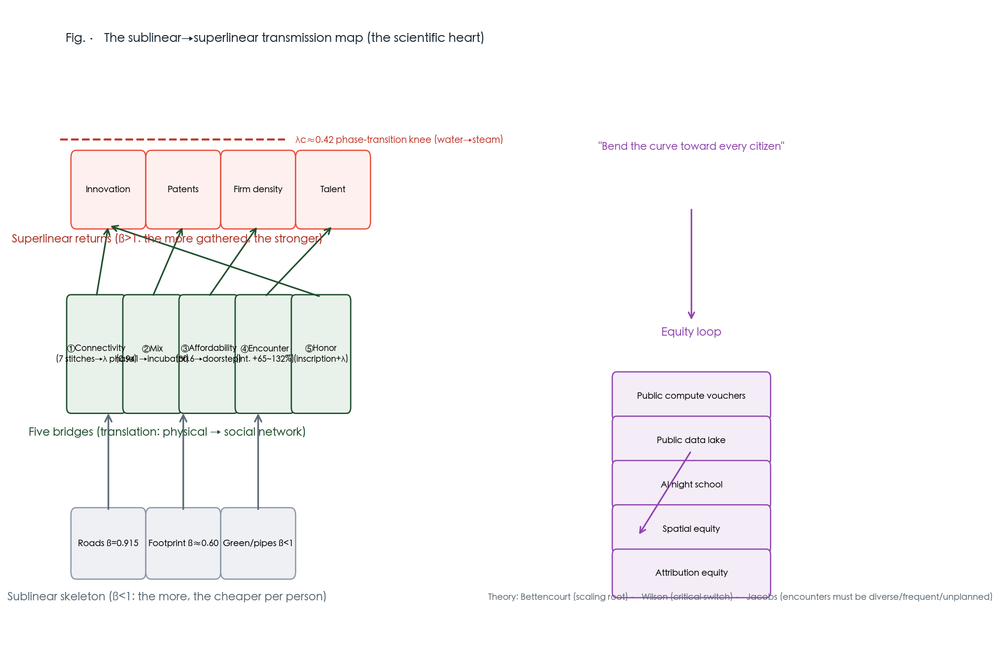

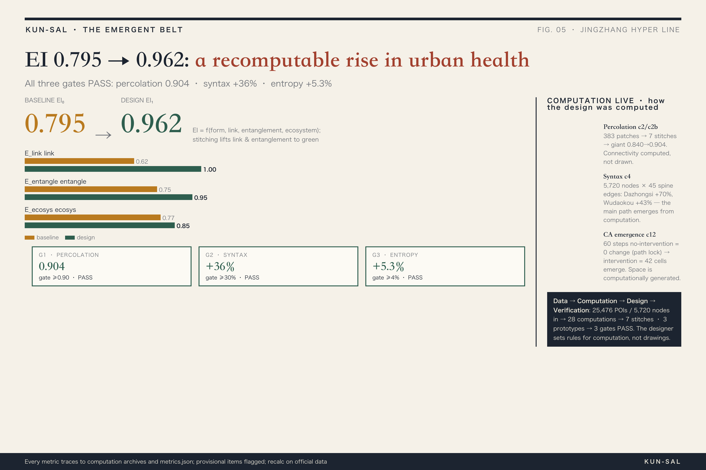

## Review-Dimension Self-Assessment and Data-Gap Matrix

**Self-assessment across the 13 review dimensions (each assessed against the task book's review_dimensions, each with an evidence anchor)**:

| Dimension | Self-assessment | Evidence anchor |
|---|---|---|
| Goal alignment | Strong | The three heights of the vision point directly at the "global AI industry highland and pilgrimage site"; H=1.556 shows investability |
| Functional match | Strong | The five functions land one by one (full-stack = Zhongzhiyuan test band / ecosystem = Origin + seven cases / scenarios = ten cards / vitality = POI infill / governance = Phase-Transition Forum) |
| Brand recognizability | Strong | THE EMERGENT BELT + Hyper Line + the "superlinear line" logo (0 conflicts in the full-library name check) |
| Regional synergy | Medium | Huairou / Future Science City / E-Town / Beijing-Tianjin-Hebei / "two belts, one area" paragraphs added; the conversion-loop mechanism remains conceptual |
| Planning innovativeness | Strong | The four-threshold criteria system + bottom-up POI zoning + the CA counterfactual — planning moves from "drawing" to "computing" |
| Industrial support | Medium | Ecosystem map with 60+ data points; but public measurement of the middle layer (affordability / conversion) is missing, and the proposal fills it with annualized measurement |
| Scenario perceptibility | Strong | All ten scenario cards land in space with their "necessity"; three renderings for the three areas |
| Spatial explicitness | Medium | The 7 gaps / three areas / two wings are clearly located; specific plots stay conceptual because ownership data is missing |
| Transferability | Strong | An 8-item component library / a three-piece wayfinding set / an attraction funnel / an investment package — a professional team can take over directly |
| Completeness of expression | Strong | 20 bilingual chapters + 22 figure groups + 9 renderings + A3/A0 + a WeChat edition |
| Public compliance | Strong | All data sources registered, zero PII, complete copyright statement, provisional labelling throughout |
| International reach | Medium | Full English alignment and internationalized naming; communication assets (WeChat edition) are ready, channels not yet |
| Long-term operational value | Strong | The Phase-Transition Forum's annual check-up + the honor wall + the developer festival = a brand-asset mechanism |

**The data-gap matrix (what is missing, how much, how to fill it, how to cope now)**:

| Gap | Impact | Interim stance | Action once available |
|---|---|---|---|
| Official redlines / three-area polygons | Area and boundary precision | Provisional boundary labelled everywhere, never passed off as a redline | Recalculate the whole package |
| Regulatory-plan conditions (FAR / height / density / setback) | Development intensity | All marked "pending official data"; only conceptual massing | Fill the forms and recheck the character gradient |
| Heritage protection zones | Landmarks and view corridors | Conservative principle + conceptual control | Verify the pilgrimage-landmark scheme |
| Existing buildings / ownership | Retain–renovate–demolish | Three principles, no building-by-building conclusions | Produce the R-R-D classification |
| Municipal pipelines / capacity | New infrastructure | System-level suggestions only | Deepen facility layouts |
| Middle-layer measurement (affordability / conversion / inclusive compute) | The "bottom-up" proposition | The proposal fills it with an annualized measurement mechanism | The Phase-Transition Forum's first report |

**The minimal task-response matrix (announcement 1.3–1.5 and agent.1–6 → chapters → evidence)**: registered in full, item by item, in compliance_matrix.json (23 tasks, each with seven classes of evidence — report_sections / geojson_layers / metrics / drawings / visual_sections / source_ids / assumption_ids / self_check_ids); the main text does not repeat the index. Here only the primary response positions of the six agent tasks: agent.1 (vision/naming chapter), agent.2 (consultation chapter, seven cases), agent.3 (scenario chapter, ten cards, five personas), agent.4 (blue-green chapter, three landmarks + component library), agent.5 (coordinated-research chapter, cultural narrative), agent.6 (phasing chapter, operations mechanism).

## Risk, Copyright, and Compliance

Data compliance: Amap POI is used only as aggregate indicators and density fields, with no raw point data published; OSM under ODbL attribution; all official sources registered [source:DATA-SRC-AMAP-POI-20260815]. Copyright: figures and geometry generated locally by KUN-SAL; the AI concept renderings (Doubao Seedream 5.0/4.0) are conceptual expressions, not site photographs, with their generation recorded in the copyright statement; the naming and logo require trademark and font clearance; no personal privacy or unauthorized material. Compliance boundaries: this proposal is an open co-creation recommendation that does not replace formal planning and constitutes no government-reviewed conclusion; all regulatory-plan indicators are "pending official data"; AI scenarios respect the generative-AI measures and the Barrier-Free Law, and no privacy-infringing, over-monitoring, or non-human-reviewable scenarios are made [standard:GENERATIVE-AI-INTERIM-MEASURES]. The materials to be supplemented and the recalculation triggers are in the assumptions file: the official redline, the regulatory plan, the heritage-protection scope, the status-quo buildings and ownership, and municipal pipelines [depth:risk_missing_data].

## Design Conclusion

> "We are moving from a world in which cities are simply places that contain computers to one in which the computer itself contains the city." — Michael Batty, *The Computable City*

**All the conclusions of this proposal can be folded into four sentences in the language of urban science.**

**Sentence one: this belt does not need "rebuilding"; it needs "re-growing".** Five rulers measure out the same fact: the form is healthy (fractal dimension 1.746, inside the healthy band of century-old cities), the growth is healthy (H=1.556, above the 1.35 benchmark), and the network foundation is healthy (blue-green giant component 83.9%, already past the percolation threshold). Its only problem is that the conditions for growth are blocked — seven roads sever the main spine, the connection strength of the three areas and two wings has only two pairs across the phase-transition threshold, and the middle layer (affordability, conversion rate, inclusive compute) is unmeasured [metric:street_network_D_large] [metric:health_factor_H].

**Sentence two: every design move is to move aside what blocks emergence, not to draw another picture.** Reconnect the severed line (seven-node stitching, integration +65%~+132%); unlock the locked blocks (CA proves: no intervention = path lock-in, intervention = 42 cells redistributed); measure the unmeasured middle layer (three indicators made annual). This is the logic of "growing a city", not "building a city" — in Batty's own words: the planner's task is not to write the script for the system, but to create the conditions that let the system grow itself [metric:simulacra_jobs_reach_stitched].

**Sentence three: the treatment is falsifiable, and it has already been cross-verified by three models.** The SIMULACRA four-sector re-run: 25-minute-circle job reach +15.9%, commute cost −3.4%; the LUTI land-use–transport match rate 46.2%→61.5%; the coordination game's Nash equilibrium flips from "go it alone" to "cooperate" (η +60%). Three models, three sets of mathematics, cross-corroborated on the same data and the same stitching assumption — convergence itself is not evidence of independence, but the three models' mechanisms (flow redistribution, path lock-in, match degree) are mutually distinct and their conclusions point the same way, which constitutes a falsifiable cross-verification [depth:metrics_recalculation] [depth:metrics_recalculation].

**Sentence four: this is an urban operating system, not a blueprint.** It has criteria (the four rulers λc, p_c, D, H), a check-up (the Phase-Transition Forum's annual public report), a self-test line (if Phase I acceptance does not pass 40%, stop and review), an exit condition (projects that cannot find a caretaker stay on paper), and an equity loop (superlinear returns flow back to citizens). It can be calibrated every year and evolve with the city — **this is exactly what "the computable city" means: the city is no longer drawn only once, but continuously read, continuously tuned, and continuously allowed to grow itself.**

> In 1909, the herringbone switch let the train find its way within the constraint; in 2026, the Emergent Belt lets the city find its growth within the constraint. **Constraints are not the enemy of design; they are the conditions of emergence.** This is the entire answer of THE EMERGENT BELT — move aside what blocks emergence, and leave the rest to the city to grow.

## References

Main bibliography and sources (complete machine index in sources.json) [source:DATA-SRC-OFFICIAL-ANNOUNCEMENT-20260509] [source:DATA-SRC-CASA-KB-KUN].

1. Haidian Branch, Beijing Municipal Commission of Planning and Natural Resources: *Prequalification Announcement for the International Open Call for Urban Design of the Centennial Jing-Zhang AI Innovation Belt*, 2026-05-09.
2. Haidian District Government website (Haidian Daily), 2026-03-30; Beijing Fabu: *The Origin breaks out — Haidian builds a new form of the intelligent economy with full force*, 2026-07-29.
3. Beijing Daily: *Haidian has done it again! Handing real urban planning to "agents" for the first time*, 2026-08-07.
4. Beijing Municipal Forestry and Parks Bureau: *Jing-Zhang Railway Heritage Park (Phase I) fully built and open*, 2023-06-26.
5. Ministry of Housing and Urban-Rural Development: *Urban Design Management Measures*, *Measures for the Compilation and Approval of Regulatory Detailed Plans for Cities and Towns*; Ministry of Natural Resources: *Guide to the Classification of Land and Sea Use for Territorial Survey, Planning, and Use Control*, 2023; Cyberspace Administration of China et al.: *Interim Measures for the Administration of Generative Artificial Intelligence Services*, 2023; Standing Committee of the National People's Congress: *Barrier-Free Environment Construction Law*, 2023.
6. Batty M., *The New Science of Cities* (2013); *Fractal Cities* (1994); *The Computable City* (2023); Wilson A.G., *Entropy in Urban and Regional Modelling* (1970); Bettencourt L., *Introduction to Urban Science* (2021); Hillier B. & Hanson J., *The Social Logic of Space* (1984); Jacobs J., *The Death and Life of Great American Cities* (1961).
7. CASA Working Papers: 163 (SIMULACRA), 156 (transport phase transition), 155 (multi-scale form), 139 (scaling law), 204 (Line Structure); Crosato et al. (2018) (the λc≈0.42 empirical evidence).
8. Amap Open Platform POI (2026-08-15 snapshot, 12 categories, 25,476 points); OpenStreetMap (ODbL, © OpenStreetMap contributors).
9. KUN-SAL knowledge base: the CASA 17-expert master document, the Batty design framework guide, the Toledo space-syntax manual, the skyline dual paradigms, and the Dianshan Lake / low-altitude / Shanghai employment studies (internal methodology assets; original literature in the items above).
