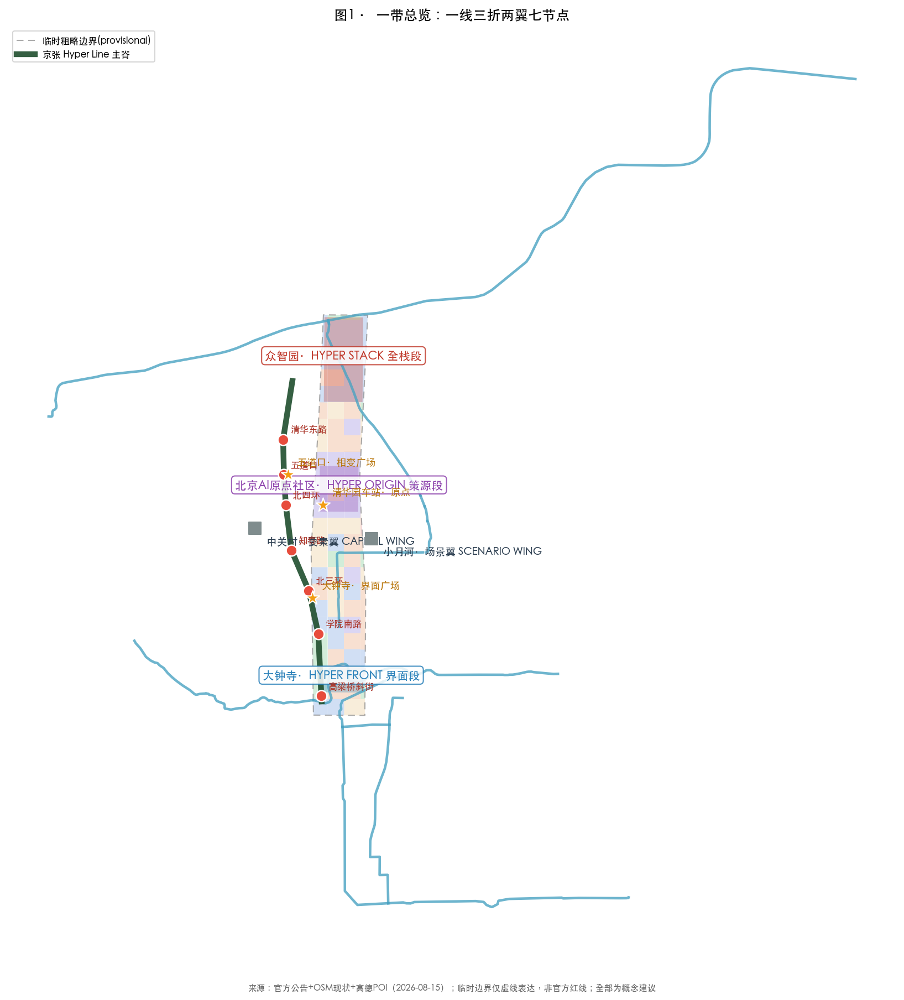
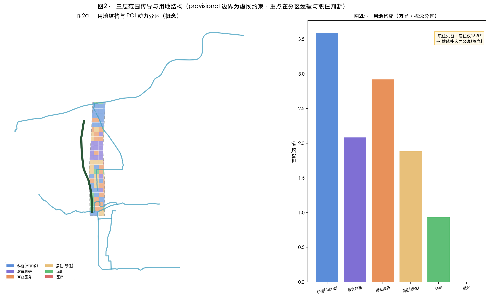
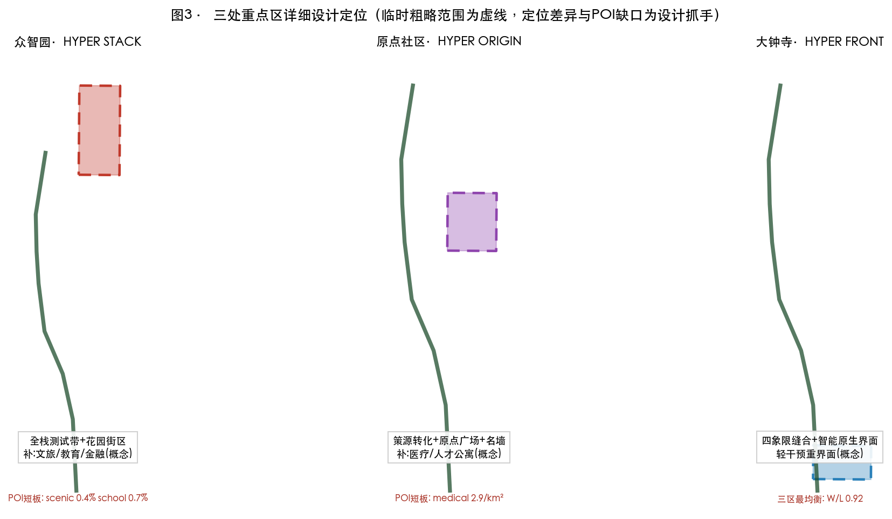
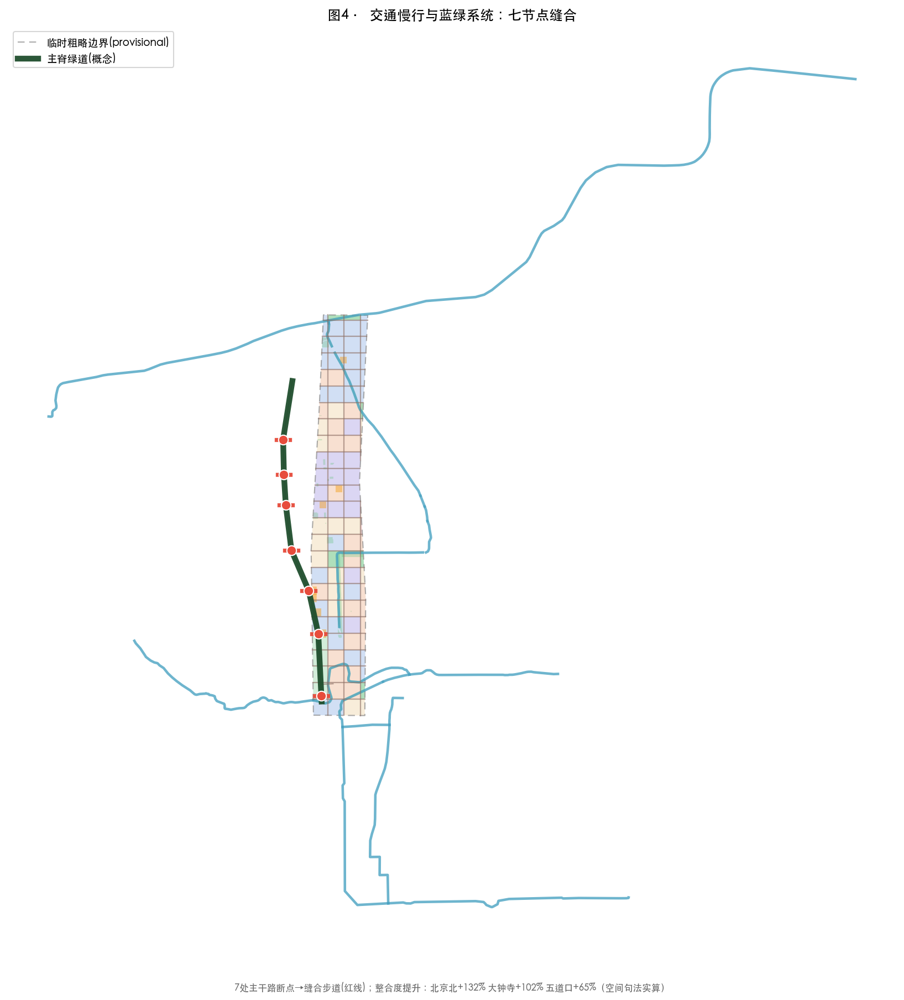
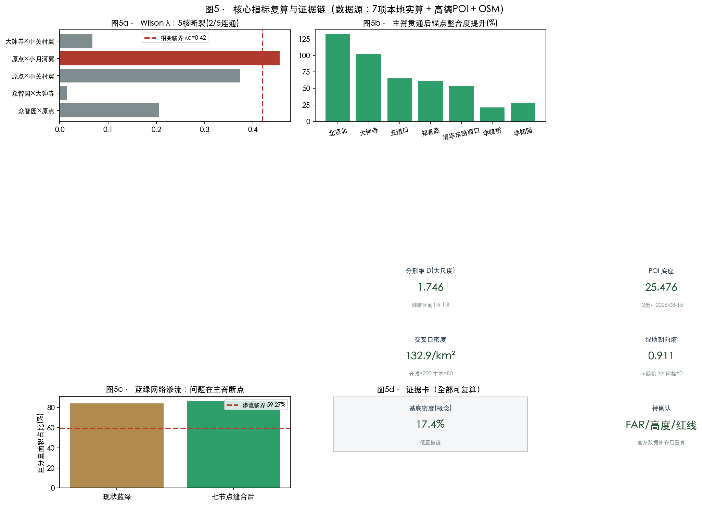

# 涌现之带 THE EMERGENT BELT —— 京张 Hyper Line

## 设计依据与资料清单

本方案的名字就是方法论：**涌现之带**取自城市科学中"自下而上、自组织、分形"的涌现原理，**Hyper** 取自标度律中超线性（β>1）集聚收益的科学事实——AI 创新是城市中少数天然超线性的变量。设计依据分三层：任务层引用官方资格预审公告与面向智能体任务书 [source:DATA-SRC-OFFICIAL-ANNOUNCEMENT-20260509] [source:DATA-SRC-AGENT-TASKBOOK-20260518]；事实层引用海淀区 2026 年 3 月开源征集发布与 7 月智能经济新闻发布会（原点社区 3 平方公里、一千余位 AI 科学家、1.3 万余名开发者、众智 FlagOS 适配 18 家厂商 32 款芯片等）[source:DATA-SRC-HAIDIAN-GOV-20260330] [source:DATA-SRC-HAIDIAN-PRESS-20260729]；数据层为本次本地实抓的高德 POI 12 类 25,476 点与 OSM 现状道路/铁路/绿地/水系/站点底图 [source:DATA-SRC-AMAP-POI-20260815] [source:DATA-SRC-OSM-20260815]。边界数据目前只有仓库维护的临时粗略 polygon，正式红线待官方发布后整包重算——本方案所有空间结论均以"概念建议"口径表述，法定管控指标一律写"待正式数据补齐" [data:geometry/site_boundary.geojson#SITE-001]。

## 三层范围工作框架

统筹研究范围约 43.6 平方公里、总体设计范围约 11.4 平方公里、重点区域约 368.4 公顷（众智园 192.1、北京AI原点社区 104.3、大钟寺 72.0 公顷），三层自上而下传导任务、自下而上反馈证据 [metric:site_area_sqm]。本方案在总体设计范围内工作：以京张遗址公园主脊为基准线，向北接北五环、向南至西直门外大街；三处重点区按"全栈段—策源段—界面段"分工承接五大功能。当前使用的是仓库临时粗略边界（provisional constraint），其面积在 EPSG:4548 下复算为 1141.28 万平方米、与公告约 1140 万平方米偏差 0.11%，仅用于生成、展示与自检，不得作为官方红线或精确面积依据；官方 polygon 发布后，site_boundary、三处重点区、用地分区、全部指标与图件将整包重算 [data:geometry/key_areas.geojson#KEY-001] [depth:three_level_scope_framework]。

## 统筹研究范围产业与未来城市研究

**核心命题：物理相邻不等于功能连通，一带目前是"断裂的链"。** 我们用 Wilson 空间交互模型标定三区两翼的连接强度 λ（λ_ij=exp(-d_ij/2500m)，2500 米为官方"十分钟创新圈"口径），对照相变临界 λc≈0.42：现状 5 核超临界连通分量只有 2/5——只有北京AI原点社区与小月河场景赋能翼越过临界（λ=0.455），众智园×原点社区 λ=0.205、原点社区×中关村翼 λ=0.374（接近临界未过）、众智园×大钟寺 λ=0.015（深度亚临界），中关村翼、众智园、大钟寺各自孤立 [metric:wilson_supercritical_net_pct] [metric:core5_giant_span_ratio]。这与我们此前的长三角四城、淀山湖研究同一命题：绑定性约束不在物理维度，而在制度与界面维度——京张一带的约束是 7 处干道对主脊的切割与高校/权属界面的封闭。产业方向上，一带应顺着超线性逻辑做**集聚加速**而非摊大饼：众智园承接全栈自主（FlagOS 生态），原点社区承接策源转化（OPC 一人公司近 180 家、清华专班落地企业近 60 家），大钟寺承接智能原生消费（1733 与蓝景丽家地块更新），两翼分别供给要素与场景 [source:DATA-SRC-HAIDIAN-PRESS-20260729] [source:DATA-SRC-BAIDU-NEWS-DAZHONGSI]。未来城市形态判断：AI 城市不是"装了传感器的老城"，而是**高频数据与低频空间双时钟并行的可计算城市**——POI/信令是秒-日尺度的高频脉搏，边界与控规是年-十年尺度的低频骨架，规划的作用是创造涌现条件而不是设计涌现结果 [standard:PROJECT-AGENT-OPEN-CALL-TASKBOOK] [depth:industry_future_city_research]。

命名体系与 Logo 方向（agent.1 任务）已定稿：带名"涌现之带 THE EMERGENT BELT"、主线"京张 Hyper Line"、三段"HYPER STACK 全栈段 / HYPER ORIGIN 策源段 / HYPER FRONT 界面段"、两翼"CAPITAL WING 要素翼 / SCENARIO WING 场景翼"、七处断点缝合节点命名为"涌现点 HYPER NODES"。Logo 方向为"超线性之线"：一条笔直的铁路线末端向上弯曲（β>1 的超线性曲线），七点渗流簇沿线上浮——百年的线开始上翘。命名全部为概念提案，正式使用前需商标与字体清权（见假设 A-NAMING-001）。

## 总体设计范围城市更新与控规深度城市设计

总体空间结构为"**一线三折两翼七节点**"：一线即京张 Hyper Line 主脊（遗址公园走廊），三折即三处重点区，两翼为中关村要素翼与小月河场景翼，七节点即 7 处断点缝合处。用地布局由 400 米网格分区 + 高德 POI 现状特征自下而上识别生成：**不干预的街区保留 POI 主导的现状特征，站域与走廊两侧做更新干预**——这是"网络优先、自组织预留"原则的落地 [depth:overall_spatial_structure] [data:geometry/land_use.geojson#LU-001]。分区结果：科研用地约 31.5%、商业服务约 25.6%、教育科研约 18.2%、居住约 16.5%、绿地约 8.2%（另有 POI 识别的医疗用地）——就业主导特征与高德 POI 供职比吻合，**职住失衡（居住仅 16.5%）是本方案明确的更新靶点之一**，更新项目将优先在站域 900 米内补充职住平衡与人才公寓 [metric:land_use_area_0701_sqm] [metric:land_use_area_0802_sqm]。开发强度层面，控规容积率、建筑高度、密度、退线等条件均未公开，本包全部写"待正式数据补齐"，只给出概念体量（782 栋、基底密度 17.4%，低置信度）用于空间讨论，不作为法定结论 [metric:building_density] [depth:development_intensity_controls]。

## 重点区域详细设计

**众智园·HYPER STACK 全栈段（约 192.1 公顷）**：定位"从芯片到模型的自主全栈街区"。空间策略：沿清河-学知园界面组织"全栈测试带"（FlagOS 多芯片适配的街区级开放测试环境为概念建议），花园式街区保留 POI 现状企业特征并补足文旅/教育/金融短板（众智园 POI 体检显示 scenic 仅 0.4%、school 0.7%、finance 1.3% 为三区最弱）[data:geometry/key_areas.geojson#KEY-001] [depth:three_key_area_detailed_design]。

**北京AI原点社区·HYPER ORIGIN 策源段（约 104.3 公顷）**：定位"全球 AI 策源与转化界面"。以原点大厦为锚，承接"十分钟创新圈"的官方口径；现状 POI 体检显示医疗密度仅 2.88 处/平方公里（三区最低），方案在五道口-学院路界面补医疗健康、社区服务与人才公寓，并围绕清华园车站遗址设"原点广场 + 开发者名墙"荣誉展示节点。需要说明：本段临时矩形边界与真实五道口核心（矩形西侧）存在口径错位，所有结论在官方 polygon 发布后重算 [data:geometry/key_areas.geojson#KEY-002]。

**大钟寺·HYPER FRONT 界面段（约 72.0 公顷）**：定位"智能原生消费与内容界面"。POI 体检显示大钟寺是三区中最均衡的（供职比 0.923、功能多样性 0.922、医疗密度 31.92 处/平方公里），方案采取"轻干预、重界面"策略：大钟寺站四象限步行缝合、1733 与蓝景丽家更新地块的智能原生业态引导、古钟博物馆-涌现之钟文化对位，全部为概念建议 [data:geometry/key_areas.geojson#KEY-003]。

## AI 创新生态、人才画像与 AI+ 场景

**全球案例（7 个，可转化机制）**：伦敦国王十字（铁路遗产更新 + Google DeepMind 集聚——与本带同构性最高的全球先例）、波士顿肯德尔广场（MIT 近校生态）、帕洛阿尔托斯坦福研究园（大学策源）、深圳粤海街道（高密度创业街区）、东京涩谷（内容消费界面）、剑桥集群（大学城-产业带）、特拉维夫罗斯柴尔德大道（创业大道）。共性启示：铁路/大学/老街的"约束"是创新集聚的成因而非障碍——这正是涌现之带的方法论立场 [source:DATA-SRC-CASA-KB-KUN] [depth:global_ecosystem_cases]。

**五类用户画像**：①OPC 一人公司创业者（25-30 岁，需要可负担工位+接单场景）；②AI 科学家与工程师（需要全栈测试环境与交流密度）；③高校 AI 青年学子（10 万余人，需要第三空间与夜校）；④沿线原住民与退休长者（需要保留人工服务通道与无障碍——按无障碍法第 39 条列举场景与老年人政策并行通道设计）；⑤全球 AI 朝圣者（需要可体验的路线、荣誉墙与活动日历）[standard:BARRIER-FREE-ENVIRONMENT-LAW] [standard:ELDERLY-SMART-TECH-PLAN-2020-45]。

**十张场景卡（场景-空间-运营映射，概念建议）**：
| # | 场景卡 | 落点 | 服务对象 | 人工复核边界 |
|---|---|---|---|---|
| 1 | 全栈适配测试场（产业测试验证） | 众智园测试带 | 科学家/工程师 | 测试结论由第三方复核 |
| 2 | OPC 接单广场（产业测试验证） | 原点广场 | 创业者 | 平台规则人工可申诉 |
| 3 | 智能原生零售测试（产业测试验证） | 大钟寺 1733 及周边 | 消费者/商户 | 无人时段保留人工柜台 |
| 4 | 低速自动驾驶接驳（产业测试验证） | 主脊+七节点 | 居民/访客 | 安全员随车、限速、可停 |
| 5 | AI+教育夜校（海淀夜校空间化） | 原点社区 | 学子/市民 | 线下授课兜底 |
| 6 | AI+医疗健康数据空间 | 北大医学部周边 | 患者/研究者 | 隐私计算、授权调用 |
| 7 | AI+法律咨询亭 | 政法大学研究生院周边 | 市民 | 结论标注非法律意见 |
| 8 | 银发友好 AI 生活站 | 沿线社区 | 长者 | 全场景保留人工通道 |
| 9 | 京张铁路 AR 导览（人字形叙事） | 主脊全线 | 朝圣者/游客 | 内容经文保审定 |
| 10 | 开发者荣誉墙·开源成果廊 | 原点广场/七节点 | 全球开发者 | 内容公开可纠错 |
每张场景卡均映射到空间图层、服务对象、运行数据边界、人工复核与运营主体；隐私与监控类场景一律排除（任务书 agent.3 红线）[depth:scenario_cards_personas]。

## 用地、建筑规模与拆改留方案

用地结构如前述为 POI 驱动 + 更新干预的概念分区。建筑层面：本包以 782 栋概念体量表达空间供给逻辑（科研段高密度研发基底、界面段商办混合、站域人才公寓），基底密度 17.4%，全部标注"概念体量示意、非建筑方案"。拆改留分类因缺现状建筑底数、权属与文保范围，**统一写待确认**：只给出三条方向性原则——文保与已实施公园段不动（保留）、京张两侧低效空间优先功能置换（改造）、站域与断点缝合处局部增量（新建概念），具体地块拆改留结论待官方现状调查与权属资料补齐后由专业团队深化 [depth:retain_renovate_demolish] [metric:building_footprint_area_sqm]。任务书边界条款已全文遵守：不给出容积率、建筑高度、建筑强度或具体地块拆改留的法定结论。

## 交通、轨道、市政与公共服务设施

交通策略由计算直接给出：7 处断点（清华东路、成府路/五道口、北四环西路、知春路、北三环、学院南路、高梁桥斜街）是主脊的慢行断点，方案以"七节点缝合"组织步道、骑行道与上跨/平交概念方案（其中北四环、北三环两处即公告点名的"上跨环路"区域）[metric:corridor_crossing_count] [data:geometry/roads.geojson#ROAD-001]。空间句法验证：主脊贯通后各锚点整合度显著上升（北京北 +132%、大钟寺 +102%、五道口 +65%、知春路 +61%）——缝合不是装饰，是把断裂链变成连通网络的相变动作 [depth:traffic_rail_slow_parking]。轨道接驳：围绕五道口、知春路、清华东路西口、学院桥、学知园、大钟寺、北京北 7 站做站点一体化概念方案；静态交通在七节点配非机动车停放。市政与新基建：分布式能源、端侧算力柜与三大传统设施融合仅做体系建议（管线、容量、消防条件待官方数据）；公共服务按 POI 缺口清单补位（众智园补文化教育金融、原点社区补医疗、大钟寺补科研教育）——设施布局由数据缺口驱动而非口号 [depth:municipal_new_infrastructure]。

## 蓝绿空间、公共空间与城市风貌

蓝绿系统体检：现状蓝绿网络巨分量面积占比 83.9%，已越过二维渗流临界 59.27%——宏观连通是好的，病根在主脊被切而非绿地不足；七节点缝合后升至 86.5% [metric:green_space_area_sqm]。公共空间以"一线七点三广场"组织：主脊 60 米概念绿带 + 七处涌现点广场 + 原点/相变/界面三处朝圣地标广场（公共空间概念图层约 20.2 万平方米、占比 1.8%，均为概念节点非工程方案）[metric:public_space_ratio]。三大朝圣地标：**清华园车站·原点**（1909 起点站遗址→AI 策源地标+开发者名墙）、**五道口·相变广场**（公共装置实时显示一带 λ 连接强度——把"城市有没有连起来"变成市民可见的仪表）、**大钟寺·界面广场**（涌现之钟+智能原生消费界面）。风貌控制采用天际线双范式：对遗址走廊与清华园车站实施"保护性覆盖层"（视廊与高度控制概念），对三处重点区实施"生成性生长规则"（高度梯度向公园跌落、前低后高），全部为概念引导，高度值待文保与控规数据补齐 [depth:bluegreen_public_space_character] [standard:MOHURD-URBAN-DESIGN-MEASURES]。

## 更新项目清单、实施政策与分期计划

更新项目按"七节点缝合 + 三区更新 + 职住补平衡"三类组织（概念清单，非权属或时序结论）：①主脊七节点缝合工程（步道/骑行/上跨概念方案）；②原点社区医疗与人才公寓补位、众智园文化教育金融补位、大钟寺科研教育补位（对应 POI 缺口）；③站域职住平衡更新。分期概念为三期：近期（1-3 年）主脊缝合与大钟寺界面、中期（3-5 年）原点社区更新、远期（5-10 年）众智园花园街区 [data:geometry/phasing.geojson#PHASE-1] [depth:renewal_project_list]。运营机制（agent.6）：年度"京张 Hyper Line 开发者节"、把 C1 的 λ 标定做成年度公共发布仪式（"相变论坛"——连接强度是城市体征，应当像体检一样每年公布）、七节点开放测试季、OPC 接单大赛、荣誉墙年度铭刻。所有活动、招商、政策与资金表述均为概念建议，不构成已确定政府安排 [depth:annual_event_system_operation]。

## 指标体系、面积复算与合规矩阵

核心指标全部由几何与数据复算（EPSG:4548）：site_area 1141.28 万㎡、科研 31.5%/商业 25.6%/教育 18.2%/居住 16.5%/绿地 8.2%、绿地率 11.6%、公共空间率 1.8%、基底密度 17.4%、路网长度 6.70 万米 [metric:green_ratio] [metric:public_space_ratio]。诊断指标：λ 超临界占比 29.17%、5 核连通 2/5、主脊断点 7 处、分形维 D=1.746（大尺度，健康区间 1.6-1.8）、交叉口密度 132.9/平方公里、POI 25,476 点 [metric:street_network_D_large] [metric:intersection_density_per_km2] [metric:poi_total_count]。标度律发现：建筑基底随单元规模的 β≈0.60（亚线性）——主脊与滨水约束对小街区挤压更强，说明"约束是形态的第一作者"，设计应当顺应而非对抗它 [depth:metrics_recalculation]。任务覆盖：公告 1.3/1.4/1.5 与 agent.1-6 全部在合规矩阵登记，专业标准与设计深度分别见标准矩阵与深度矩阵——正文不重复全部索引，但每个结论都能回指结构化证据 [depth:compliance_standard_coverage]。

## 风险、版权与合规说明

数据合规：高德 POI 经用户提供的开发者 Key 获取，仅用聚合指标与密度场、不公开原始点数据；OSM 数据按 ODbL 署名；官方公告/发布会/媒体报道均登记来源与限制 [source:DATA-SRC-AMAP-POI-20260815]。版权：全部图件与几何由 KUN-SAL 本地生成；命名与 Logo 为概念提案，正式使用前需商标与字体清权；不包含任何个人隐私、肖像或未授权素材（详见版权声明文件）。合规边界：本方案为开放共创建议，不替代正式规划、不构成政府审定结论；控规类指标全部"待正式数据补齐"，活动与政策均为概念建议；AI 场景遵守生成式 AI 管理办法的公开边界与无障碍法的列举场景要求，不设计隐私侵害、过度监控或无法人工复核的场景 [standard:GENERATIVE-AI-INTERIM-MEASURES]。待补资料清单与重算触发器见假设文件：官方红线、控规条件、文保范围、现状建筑与权属、市政管线 [depth:risk_missing_data]。

## 参考资料

主要书目与来源如下（完整机器索引见 sources.json）[source:DATA-SRC-OFFICIAL-ANNOUNCEMENT-20260509] [source:DATA-SRC-CASA-KB-KUN]。

1. 北京市规划和自然资源委员会海淀分局：《百年京张AI创新带城市设计国际方案征集资格预审公告》，2026-05-09（官方公告）。
2. 海淀区政府网站（海淀报）：《以"开源"方式邀请全球开发者参与 百年京张AI创新带面向全球征集方案》，2026-03-30。
3. 北京发布/海淀区政府：《原点出圈，海淀全力打造智能经济新形态》新闻发布会实录，2026-07-29。
4. 北京日报：《海淀又放大招了！首次将真实城市规划交给"智能体"》，2026-08-07。
5. 北京市园林绿化局：《京张铁路遗址公园（一期）全面建成开放》，2023-06-26。
6. 住房和城乡建设部：《城市设计管理办法》；《城市、镇控制性详细规划编制审批办法》。
7. 自然资源部：《国土空间调查、规划、用途管制用地用海分类指南》，2023。
8. 国家网信办等：《生成式人工智能服务管理暂行办法》，2023；全国人大常委会：《无障碍环境建设法》，2023。
9. Batty M., *The New Science of Cities* (2013)；*Fractal Cities* (1994)；Wilson A.G., *Entropy in Urban and Regional Modelling* (1970)；Bettencourt L., *Introduction to Urban Science* (2021)；Crosato et al. (2018)（λc≈0.42 实证）。
10. 高德地图开放平台 POI 数据（2026-08-15 快照，12 类 25,476 点）；OpenStreetMap 现状数据（ODbL，© OpenStreetMap contributors）。
11. KUN-SAL 知识库：CASA/Batty 17 位专家主文档、天际线双范式、低空经济与淀山湖项目数据纪律（内部方法论资产，原始文献见上述条目）。
