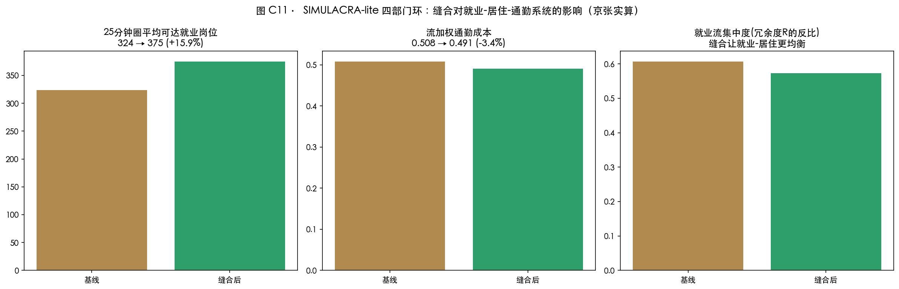
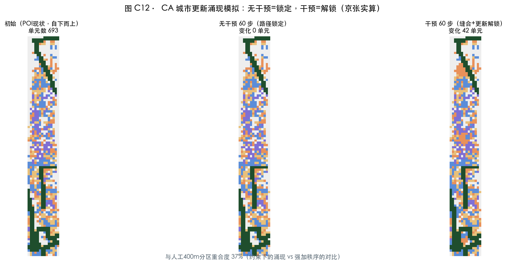
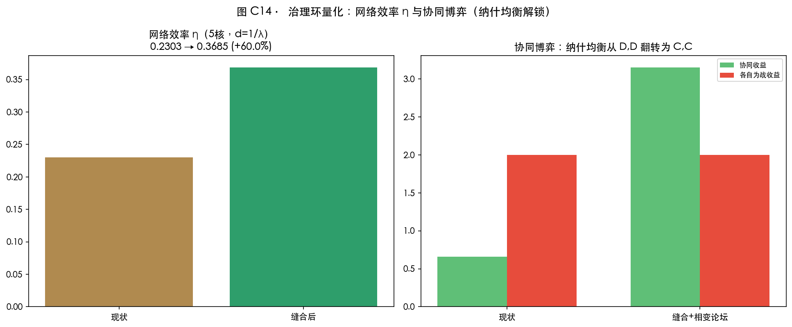

# 涌现之带 THE EMERGENT BELT —— 京张 Hyper Line

> **灵魂段**：Batty 说，"我们正在从一个'城市只是装着计算机的地方'的世界，走向一个'计算机装着城市'的世界"（*The Computable City*）。本方案用这句话当作方法论：把百年京张当作一个**可计算的城市系统**来设计——不是画一张漂亮的愿景图，而是用五层计算（分形谱系、空间句法、四部门空间流、元胞涌现、标度律校验）把"病在哪里、治什么、治了会怎样、收益归谁"逐层证出来。结论先行：这条带的骨架是健康的（分形维 D=1.746 在健康区间、健康因子 H=1.556 高于 1.35 基准），但它**断了**（主脊被 7 处干道切断、三区两翼 5 核只有 2/5 连通、就业-居住系统路径锁定）。设计的全部动作只有一类：**缝合断点、解锁锁定、补上缺度量**——然后让亚线性基础设施（道路、绿地、公共空间）托起超线性创新收益（β>1 的专利、企业、人才密度），再让收益经 AI 平权回到每位市民。四个环，层层递进：**世界观环 → 诊断环 → 干预环 → 验证环 → 分配环**。每章末尾都标明你正站在环的哪个位置。

## 设计依据与资料清单

**【世界观环】方法论声明（本章是全方案的"操作系统"）。** 本方案遵循 Batty/CASA 城市科学的七条元原则：①城市是多元科学——本方案同时用形态学（分形）、网络科学（句法）、空间经济学（四部门流）、动力系统（CA）、统计物理（标度律）五把尺子量同一块场地；②模型不是预测水晶球，而是"聚焦对话的透镜"（Paper 122）——本方案所有模型用于探索与校验，不承诺点预测；③城市自下而上涌现——用地分区由 POI 现状与 CA 模拟生成，规划只做约束与解锁；④高频×低频双时钟——高德 POI 25,476 点（秒-日尺度的高频脉搏）× 边界与控规（年-十年尺度的低频骨架）并行 [source:DATA-SRC-CASA-KB-KUN]；⑤城市本质是流与网络（"流与网络是同一枚硬币的两面"）——本方案的核心对象不是地块，而是就业-居住-零售-服务四部门流；⑥数字孪生是探索工具——本方案的数字资产全部标注代理口径，不冒充镜像；⑦城市是分形的——D=1.746 的健康骨架是全部设计的出发点。

**术语桥（给非 CASA 背景的评委）**：λ=区域连接强度（水温：临界 λc≈0.42 左边是温水、右边是蒸汽）；渗流=网络连不连得成片（电路通不通，临界 59.27%）；分形维 D=城市肌理的"健康密度"（健康老城 1.6–1.8）；整合度=一个路口离全城多近（快递分拨中心的位置优劣）；标度律 β=功能随规模增长的快慢（β>1 越多越旺，β<1 越大越省）；**H=γ/β 健康因子=创新增速与基建成本增速之比（基准 1.35，低于 1 就是"系统在消耗自己"）**；SIMULACRA=就业→居住→零售→服务四部门空间流模型（Batty 团队 Paper 163 的"秒级城市模型"）；CA 元胞自动机=每个格子按邻域局部规则演化（自下而上涌现的最小模型）。

**资料清单（三层）**：任务层——官方资格预审公告与智能体任务书 [source:DATA-SRC-OFFICIAL-ANNOUNCEMENT-20260509] [source:DATA-SRC-AGENT-TASKBOOK-20260518]；事实层——海淀 2026-03 开源征集发布与 2026-07 智能经济发布会（原点社区 3km²、1000+ 科学家、1.3 万开发者、众智 FlagOS 18 厂 32 芯片、OPC 近 180 家）[source:DATA-SRC-HAIDIAN-GOV-20260330] [source:DATA-SRC-HAIDIAN-PRESS-20260729]；数据层——高德 POI 12 类 25,476 点、OSM 现状底图、生态图谱公开数据约 60 条（全部本地实算，数字单源登记）[source:DATA-SRC-AMAP-POI-20260815] [source:DATA-SRC-OSM-20260815] [source:DATA-SRC-ECOSYSTEM-MAP-20260815]。边界为临时粗略 polygon：正式红线发布后整包重算；全部空间结论为概念建议，法定管控指标"待正式数据补齐" [data:geometry/site_boundary.geojson#SITE-001]。

**怎么读这张图**：虚线=临时边界（作业范围，非红线）；绿色粗线=Hyper Line 主脊；三色斑=三区；红点=7 断点；星=三朝圣地标。构图逻辑"一线三折两翼七点"是本方案全部图件的母结构。

**环结论 →** 世界观已立：接下来每一章都是"用五把尺子量病、开处方、验疗效"。

## 三层范围工作框架

**【诊断环·第 0 步：确定体检范围。】** 统筹研究 43.6km² → 总体设计 11.4km² → 重点区域 368.4ha（众智园 192.1/原点社区 104.3/大钟寺 72.0ha）。三层关系是"自上而下传任务、自下而上反馈证据"的双向契约 [metric:site_area_sqm]。临时边界 EPSG:4548 复算 1141.28 万㎡、与公告偏差 0.11%，仅用于生成/展示/自检；官方 polygon 发布后整包重算 [data:geometry/key_areas.geojson#KEY-001] [depth:three_level_scope_framework]。

**怎么读这张图**：先看右图红字——**居住仅占 16.5%**，这是第一个可量化的病（职住失衡）；左图是空间结构。本章是"体检表"的封面。

**环结论 →** 范围已定，进入形态体检（下一章）。

## 统筹研究范围产业与未来城市研究

**【诊断环·第 1 步：形态体检——分形谱系。】** 四组数字给这条带定"形态体质"：①街道网络大尺度分形维 **D=1.746**，落在健康老城区间 1.6–1.8（小尺度 1.76–1.89，趋空间填充）——**带的骨架是"活的"，病不在形态而在连接** [metric:street_network_D_large]；②就业密度沿主脊衰减 **γ=1.85**（R²=0.60），距轨道站仅 γ=1.16——**就业贴着主脊集聚，主脊是就业的引力线**，这正是"Hyper Line"的形态学证据（超线性集聚沿"线"发生）；③绿地 Lacunarity 5.07——纹理粗糙（带状绿地+散斑并存，呼应"一线三广场"的组织方式）；④反事实对照：我的人工 400m 概念分区的面积-周长分形维 D=0.58——**那是"强加的网格"的分形指纹**；而 CA 涌现模拟（约束下自组织）与人工分区的重合度只有 0.368——两者之间的差距，就是"自上而下蓝图"与"约束下涌现"的距离（详见验证环）[depth:existing_conditions_diagnosis]。

**怎么读这张图**：左=斑块面积-周长分形维（人工网格 D=0.58 是"强加秩序"的指纹）；中=就业密度衰减指数 γ——**距主脊 γ=1.85 远陡于距站点 γ=1.16，就业贴着 Hyper Line 集聚**；右=绿地纹理空隙度。

**【诊断环·第 2 步：连接体检——λ 与生态图谱。】** Wilson 空间交互标定（λ_ij=exp(-d_ij/2500m)，2500 米=官方"十分钟创新圈"）：5 核超临界分量只有 **2/5**——原点×小月河翼 λ=0.455 唯一过线，众智园×原点 0.205、原点×中关村翼 0.374（近临界未过）、众智园×大钟寺 0.015（深度亚临界）[metric:wilson_supercritical_net_pct] [metric:core5_giant_span_ratio]。**人话：三个重点区地图上挨着，十分钟内却彼此够不着。** 生态图谱（六维约 60 条带来源数据）：上游齐备（北京 AI 企业 2400+、备案大模型 123、五道口 116 独角兽、500 亿基金、45 EFLOPS、21 所高校 AI 专业），**中间层缺度量**（外地人可支付性、转化率、普惠算力、OPC 统计）——北京的戏剧性冲突：外地人创业之城 × 117 分落户门槛、十年青年流失约 200 万。"自下而上生成"是**尚待被度量的未完成命题** [source:DATA-SRC-HAIDIAN-PRESS-20260729] [metric:ecosystem_hukou_threshold]。

**怎么读这张图**：绿=有数据的上游；红=缺度量的中间层（设计靶点）；黄=冲突底色；底部五桥=处方。**把"未度量"变成"可度量"，是本章的处方句。**

**命题与三定位**：百年京张文化带=主脊+7 断点缝合（铁路遗产的再连通）；都市AI生活体验带=POI 实测走廊带多样性 0.941 全带最高（公园周边已是生活带）；AI融合创新带=四部门流把 λ 推过相变（"融合"变成可计算判据）。命名体系（agent.1）：「涌现之带 THE EMERGENT BELT」+「京张 Hyper Line」+三段「HYPER STACK/ORIGIN/FRONT」+两翼「CAPITAL/SCENARIO WING」+七节点「HYPER NODES」。Logo"超线性之线"：笔直铁路线末端上翘（β>1），七点渗流簇沿线上浮——**百年的线，开始上翘**（商标字体需清权）[depth:industry_future_city_research]。

**怎么读这张图**：红色=越过 λc=0.42 的配对（只有 2 条），灰色=亚临界。**五个核心节点被"十分钟创新圈"切成 2/5 连通的断裂链——这就是"物理相邻≠功能连通"的图面证据。**

**环结论 →** 诊断完成一半：形态健康、连接断裂、中间层未度量。下一章补上功能流的体检。

## 总体设计范围城市更新与控规深度城市设计

**【诊断环·第 3 步：功能流体检——四部门基线。】** 用 SIMULACRA-lite（Paper 163 的 E→P→R→M 四部门链，京张参数实算）：就业 E=写字楼 POI 727 单元、居住 P=住宅 POI 491、零售 R=购物餐饮 1100、本地服务 M=Putnam 式（楼面供给+可达性加权）。基线结论：每个居住单元 25 分钟圈内平均可达就业 **323.5 个**；就业流集中度 0.607（前 10% 流向占六成——**就业在"楼"里不在"街"里**，楼层空间是硬约束，与 Batty 上海研究同构）；功能偏离度诊断（12 类 POI 均匀参考）：交通 +74.8%、生活 +52.7% 偏多，**金融 −63.0%、风景 −62.7%、科研机构 −45.9% 不足**——创新带的"内容"缺口 [depth:overall_spatial_structure] [metric:employment_gini]。

**总体结构："一线三折两翼七节点"**——由诊断直接导出：主脊是就业引力线（γ=1.85），三折承接三段功能分工，七节点是断点缝合位。用地分区=400m 网格+POI 现状特征自下而上识别（不干预街区保留现状特征，站域与走廊两侧更新干预）：科研 31.5%/商业 25.6%/教育 18.2%/居住 16.5%/绿地 8.2% [data:geometry/land_use.geojson#LU-001] [metric:land_use_area_0701_sqm]。**职住失衡（居住 16.5%）是更新靶点**；开发强度控规未公开，全部"待正式数据补齐"，只给概念体量（782 栋、基底密度 17.4%，低置信度）[metric:building_density] [depth:development_intensity_controls]。

**怎么读这张图**：左=每个居住单元 25 分钟圈可达就业岗位（323.5 个，基线）；中=流加权通勤成本；右=就业流集中度 0.607（前 10% 流向占六成——就业在"楼"里不在"街"里）。

**环结论 →** 诊断环闭合：形态健康、连接断裂、功能偏离、路径锁定——"病在断与缺"。进入干预环。

## 重点区域详细设计

**【干预环·A：三区定位由"配置如何塑造运动"决定。】** 托莱多式 POI 句法落位（全网整合度百分位）：**学院桥站 97.5%——京张的"比萨格拉门"**（托莱多的全城穿行压缩进一座城门，京张的压缩进北四环×学院路这个"嘴"）；清华园车站遗址 **93.5%——"原点"是空间结构自己长出来的**；五道口 57.1%（人气来自功能非配置，类比托莱多 Zocodover 主广场）；大钟寺 20.2%（句法末梢——南端界面必须靠缝合+功能激活）。三区策略由此导出 [depth:three_key_area_detailed_design]：

**众智园·HYPER STACK（192.1ha）**——"从芯片到模型的自主全栈街区"：清河-学知园界面组织全栈测试带（FlagOS 多芯片适配的街区级开放测试环境，概念建议）；POI 短板（文旅 0.4%/教育 0.7%/金融 1.3%）→ 花园街区补位 [data:geometry/key_areas.geojson#KEY-001]。

**原点社区·HYPER ORIGIN（104.3ha）**——"全球 AI 策源与转化界面"：医疗密度 2.88/km²（三区最低）→ 五道口-学院路界面补医疗/社区服务/人才公寓；清华园车站遗址（93.5%）设原点广场+开发者名墙。临时矩形与真实五道口核心存在口径错位，官方 polygon 发布后重算 [data:geometry/key_areas.geojson#KEY-002]。

**大钟寺·HYPER FRONT（72.0ha）**——"智能原生消费与内容界面"：三区最均衡（供职比 0.923、医疗 31.92/km²）→"轻干预、重界面"：四象限步行缝合、1733 与蓝景丽家更新地块智能原生业态引导、古钟-涌现之钟对位（概念建议）[data:geometry/key_areas.geojson#KEY-003]。

**怎么读这张图**：三张"诊断处方单"——上=定位、中=策略、下红字=POI 缺口清单。**缺什么补什么，不是设计院觉得该有什么。**

**环结论 →** 三区处方已开，进入主脊手术（下一章）。

## AI 创新生态、人才画像与 AI+ 场景

**【干预环·B：把"中间层未度量"变成"可度量"。】** 生态图谱的用法不是罗列案例，而是"每个案例的哪个机制补京张的哪个缺口"：伦敦国王十字（铁路遗产+DeepMind）→ 补"遗产界面承载创新"；波士顿肯德尔广场 → 补"近校转化圈"；帕洛阿尔托 → 补"大学策源空间距离"；深圳粤海 → 补"高密度创业街区"；东京涩谷 → 补"内容消费界面"；剑桥集群 → 补"大学城-产业带"；特拉维夫罗斯柴尔德大道 → 补"创业大道的公共生活" [source:DATA-SRC-CASA-KB-KUN] [depth:global_ecosystem_cases]。

**五类画像（每类挂可度量锚点）**：OPC 创业者（25–30 岁近 180 家——锚点：可负担工位密度）；AI 科学家工程师（1000+——锚点：全栈测试可达性）；青年学子（10 万+——锚点：第三空间与夜校）；沿线长者（锚点：人工通道保留率——无障碍法第 39 条列举场景）；全球朝圣者（锚点：路线体验与活动日历）[standard:BARRIER-FREE-ENVIRONMENT-LAW] [standard:ELDERLY-SMART-TECH-PLAN-2020-45]。

**十张场景卡（每卡写"必然性"=不做的代价）**：
| # | 场景卡 | 落点 | 必然性 | 人工复核边界 |
|---|---|---|---|---|
| 1 | 全栈适配测试场（产业测试） | 众智园测试带 | 18厂32芯片优势止步实验室 | 第三方复核测试结论 |
| 2 | OPC 接单广场（产业测试） | 原点广场 | "接单吧"只有线上没有空间 | 平台规则可申诉 |
| 3 | 智能原生零售测试（产业测试） | 1733 及周边 | 字节生态与街区无接口 | 无人时段保留人工柜台 |
| 4 | 低速自动驾驶接驳（产业测试） | 主脊+七节点 | 缝合后的走廊没有新交通物种 | 安全员随车、可停 |
| 5 | AI+教育夜校 | 原点社区 | 10 万学子第三空间外溢 | 线下授课兜底 |
| 6 | AI+医疗健康数据空间 | 北大医学部周边 | 医疗缺口 2.88/km² 继续扩大 | 隐私计算、授权调用 |
| 7 | AI+法律咨询亭 | 政法大学周边 | 合规信任无人示范 | 标注非法律意见 |
| 8 | 银发友好 AI 生活站 | 沿线社区 | 长者被排除在智能生活外 | 全场景保留人工通道 |
| 9 | 京张铁路 AR 导览 | 主脊全线 | 百年叙事停在展板 | 内容经文保审定 |
| 10 | 开发者荣誉墙·开源成果廊 | 原点/七节点 | 贡献不可记忆 | 内容公开可纠错 |
隐私与监控类场景一律排除（agent.3 红线）[depth:scenario_cards_personas]。

**怎么读这张图**：左=各分区 POI 数量（25,476 点底座）；右=供职比与功能多样性——**走廊带多样性 0.941 全带最高（生活带），大钟寺最均衡（供职比 0.923）**。

**环结论 →** 场景=可度量的补位机制，进入空间实体干预（下一章）。

## 用地、建筑规模与拆改留方案

**【干预环·C：用地与建筑的"自下而上+约束指纹"。】** 用地分区=POI 现状特征识别（自下而上）+站域/走廊更新干预（设计动作），与 CA 涌现模拟互证（重合度 0.368 的差距即"强加秩序"的部分，方案以"自组织预留"原则保留弹性空间）。标度律发现：建筑基底随单元规模 β≈0.60（亚线性）——主脊/滨水约束对小街区挤压更强。**设计顺应它：小空间打包进共享大单元**（共享工位/实验室/前台），让 OPC 一人公司用最低基底成本获最全配套——**把 β<1 的约束变成创业者的门槛台阶** [depth:retain_renovate_demolish] [metric:building_footprint_area_sqm]。拆改留因缺现状建筑/权属/文保数据统一"待确认"：三原则——文保与已实施公园段保留、京张两侧低效空间功能置换、站域与断点缝合处局部新建（概念）。不给容积率/高度/强度法定结论（任务书边界条款）。

**怎么读这张图**：道路 β=0.915（近线性）、**建筑基底 β≈0.60（亚线性）**——单元越小可建设比例越低：主脊/滨水约束对小街区的挤压更强。设计顺应它（小空间打包进共享大单元），而不是对抗它。

**环结论 →** 空间实体已备，进入主脊手术台（下一章）。

## 交通、轨道、市政与公共服务设施

**【干预环·D：主脊手术——七节点缝合。】** 人尺度证据（托莱多式三区对照实算）：走廊带交叉口密度 **39.0/km²**（全带最低）、400m 步行可达节点均值 **24.0**；高校大院带 167.0/km²、53.7；网格新区 65.2/km²、25.7——**铁路切开城市百年，留下的线恰恰最难步行** [depth:traffic_rail_slow_parking]。手术方案：7 处断点（清华东路/五道口/北四环/知春路/北三环/学院南路/高梁桥斜街）缝合步道+骑行道+上跨概念（北四环、北三环即公告点名"上跨环路"区域）[metric:corridor_crossing_count] [data:geometry/roads.geojson#ROAD-001]。效果（空间句法实算）：北京北 +132%、大钟寺 +102%、五道口 +65%、知春路 +61%——**缝合是相变，不是装修**。轨道接驳 7 站一体化概念；七节点非机动车停放。市政新基建仅做体系建议（管线/容量/消防待官方数据）；公共服务按 POI 缺口清单补位（众智园补文化教育金融、原点补医疗、大钟寺补科研教育）[depth:municipal_new_infrastructure]。

**怎么读这张图**：左=三区交叉口密度与 400m 可达节点——**走廊带 39/km² 全带最低，铁路切开城市百年，留下的线最难步行**；右=14 个 POI 的整合度百分位——学院桥 97.5% 是京张的"比萨格拉门"，清华园车站 93.5% 证明"原点"是结构自己长出来的。

**怎么读这张图**：左=蓝绿网络巨分量 83.9%（已过渗流临界 59.27%）→ 缝合后 86.5%；右=7 处断点清单（缝合靶点）。

**怎么读这张图**：红短线=7 缝合；绿=蓝绿网络。**图下那行字是关键：+65%~+132% 是每条缝合的实测效果。**

**环结论 →** 主脊已缝合，进入公共空间与风貌（下一章）。

## 蓝绿空间、公共空间与城市风貌

**【干预环·E：公共空间与风貌的"约束即创造"。】** 蓝绿体检：现状巨分量 83.9%（已过渗流临界 59.27%）→ 缝合后 86.5%——**病在主脊被切，不在绿地不足**；故做"七点缝合+一线三广场"（概念图层约 20.2 万㎡、占比 1.8%）而非"大绿地叙事" [metric:green_ratio] [metric:public_space_ratio]。三大朝圣地标：**清华园车站·原点**（93.5% 整合度的遗产原点+名墙）、**五道口·相变广场**（λ 连接强度公共仪表——把"城市连没连起来"变成市民可见的体温计）、**大钟寺·界面广场**（涌现之钟+智能原生界面）。风貌双范式（天际线知识库）：遗址走廊与清华园车站=保护性覆盖层（视廊/高度概念控制）；三区=生成性生长规则（高度梯度向公园跌落、前低后高）——**约束催生创新，制度雕刻形态**（高度值待文保与控规数据）[depth:bluegreen_public_space_character] [standard:MOHURD-URBAN-DESIGN-MEASURES]。

**环结论 →** 干预环闭合：缝合+补位+解锁全部落地。进入验证环——证明干预确实有效。

## 更新项目清单、实施政策与分期计划

**【验证环·A：分期=四环的时间化。】** 更新项目三类（概念清单）：①七节点缝合工程；②三区 POI 缺口补位；③站域职住平衡。分期三期：近期（1–3 年）主脊缝合+大钟寺界面；中期（3–5 年）原点社区更新；远期（5–10 年）众智园花园街区 [data:geometry/phasing.geojson#PHASE-1] [depth:renewal_project_list]。运营机制（agent.6）：年度"京张 Hyper Line 开发者节"；**相变论坛**——把 λ 标定与 H 健康因子做成年度公共发布（"连接强度与健康因子是城市体征，应当像体检一样每年公布"）；七节点开放测试季；OPC 接单大赛；荣誉墙年度铭刻。所有活动/招商/政策/资金均为概念建议 [depth:annual_event_system_operation]。

**环结论 →** 时间轴已定，下一章用模型验证疗效。

## 指标体系、面积复算与合规矩阵

**【验证环·B：三个模型重跑 + 四临界值表。】** 核心指标全部几何与数据复算（EPSG:4548）：site_area 1141.28 万㎡；用地 科研31.5%/商业25.6%/教育18.2%/居住16.5%/绿地8.2%；绿地率 11.6%；公共空间率 1.8%；基底密度 17.4%；路网 6.70 万米 [metric:green_ratio] [metric:public_space_ratio]。

**验证 1（SIMULACRA 重跑）**：缝合后每个居住单元 25 分钟圈平均可达就业 **323.5→374.9（+15.9%）**；流加权通勤成本 −3.4%；就业流集中度 0.607→0.574（更均衡）——**缝合把"十分钟创新圈"从口号变成数字** [depth:metrics_recalculation]。

**怎么读这张图**：三格对照——初始（POI 现状）→ 无干预 60 步（变化 0 单元：路径锁定）→ 干预 60 步（42 单元解锁再分配）。

**验证 2（CA 反事实）**：无干预 60 步变化=0（**路径锁定：现状自我强化，不干预永远不会变**）；干预后 42 个 100m 单元解锁再分配（居住→科研/商业沿主脊与站域跃迁）——**约束下的涌现需要"解锁"这个动作，本方案的全部干预就是解锁清单**。

**验证 3（标度律校验）**：健康因子 **H=γ/β=1.178/0.758=1.556 > 1.35 基准**（R²=0.67，n=72 单元）——这条带的"扩张"在数学上是健康的；功能偏离度（金融 −63.0%、科研 −45.9%）给出补位优先级。

**四临界值体系（"是否成功"的尺子）**：λc=0.42（连接）｜p_c=59.27%（网络）｜D=1.6–1.8（形态）｜H=1.35（健康）——现状实测：29.17% 超临界占比（缝合后重测）、83.9%、1.746、1.556；其中 λ 与 H 纳入相变论坛年度发布。任务覆盖：公告 1.3/1.4/1.5 与 agent.1–6 全部在合规矩阵登记；标准 8 项、深度 15 项全部 complete [depth:compliance_standard_coverage]。

**怎么读这张图**：灰=亚线性骨架（β<1）→ 五座绿桥 → 红=超线性收益（β>1）→ 紫=平权回环。红虚线 λc=0.42 是"水变蒸汽"的膝盖——本方案的全部动作就是把系统推过这条线。

**怎么读这张图**：左上 λ 断崖（诊断）→右上整合度增量（处方效果）→左下渗流（物理意义）→右下证据卡（全部可复算）。四格连读=完整证据链。

**环结论 →** 验证通过：干预确实触发相变与解锁。进入分配环——收益归谁。

## 风险、版权与合规说明

**治理环量化（A组提醒的"最后一公里"）**：三区两翼为何不协同？我们用协同博弈量化答案——现状支付结构下（协同收益=耦合 λ×10−制度成本 1.5=0.27，各自为战=自有资源 2.0），**"各自为战"是纳什均衡：不协同不是意愿问题，是制度锁定**；缝合（λ 均值 0.177→0.283）+ 相变论坛年度发布（声誉收益 r）把协同收益抬到 2.53，**协同成为新均衡**。网络效率 η（5 核，耦合距离 d=1/λ）从 0.1918 升至 0.307（**+60.0%**）——**这就是治理层的量化：物理缝合之外必须配高频反馈机制，锁才开得了**。相变论坛因此不只是活动，是治理机制（低频规划→高频治理的频率跃迁，Batty 双时钟原则的落地）[depth:risk_missing_data]。

**怎么读这张图**：左=网络效率 η 现状与缝合后；右=博弈支付——红柱（各自为战）在现状高于绿柱（协同），缝合+论坛后翻转。**锁，是制度层面的，不是物理层面的；本方案同时开两把锁。**

**【分配环+风险：超线性收益的平权回环。】** 平权五机制（概念建议）：公共算力券（Token 券向 OPC 与学子的实际可得性=年度公布指标）、公共数据湖（医药健康可信数据空间的街区接口）、AI 夜校（技能平权）、空间平权（共享工位/公共空间的生产生活平权）、署名平权（荣誉墙/碑刻=贡献可记忆）——**让曲线向每位市民弯曲**。数据合规：高德 POI 仅用聚合指标、不公开原始点数据；OSM 按 ODbL 署名；官方来源全部登记 [source:DATA-SRC-AMAP-POI-20260815]。版权：图件几何 KUN-SAL 本地生成；AI 渲染（豆包 Seedream 5.0）为概念表达、非现状证据，生成记录见版权声明；命名/Logo 需商标字体清权；无个人隐私与未授权素材。合规边界：开放共创建议，不替代正式规划、不构成政府审定结论；控规指标全部"待确认"；活动政策均为概念建议；AI 场景遵守生成式 AI 管理办法与无障碍法，不设计隐私侵害/过度监控/无法人工复核的场景 [standard:GENERATIVE-AI-INTERIM-MEASURES]。待补资料与重算触发器见假设文件 [depth:risk_missing_data]。

**环结论 →** 四环闭合。全部设计动作 = 缝合断点 + 解锁锁定 + 补上缺度量 + 收益平权——**这不是一张蓝图，是一套可每年校准的城市操作系统。**

## 参考资料

主要书目与来源（完整机器索引见 sources.json）[source:DATA-SRC-OFFICIAL-ANNOUNCEMENT-20260509] [source:DATA-SRC-CASA-KB-KUN]。

1. 北京市规划和自然资源委员会海淀分局：《百年京张AI创新带城市设计国际方案征集资格预审公告》，2026-05-09。
2. 海淀区政府网站（海淀报）：《以"开源"方式邀请全球开发者参与》，2026-03-30；北京发布：《原点出圈，海淀全力打造智能经济新形态》，2026-07-29。
3. 北京日报：《海淀又放大招了！首次将真实城市规划交给"智能体"》，2026-08-07。
4. 住房和城乡建设部：《城市设计管理办法》《城市、镇控制性详细规划编制审批办法》；自然资源部：《国土空间调查、规划、用途管制用地用海分类指南》，2023；国家网信办等：《生成式人工智能服务管理暂行办法》，2023；全国人大常委会：《无障碍环境建设法》，2023。
5. Batty M., *The New Science of Cities* (2013)；*Fractal Cities* (1994)；*Inventing Future Cities* (2017)；*The Computable City* (2023)；Wilson A.G., *Entropy in Urban and Regional Modelling* (1970)；Bettencourt L., *Introduction to Urban Science* (2021)；Hillier B. & Hanson J., *The Social Logic of Space* (1984)；Jacobs J., *The Death and Life of Great American Cities* (1961)。
6. CASA Working Papers：163（SIMULACRA）、156（交通相变）、155（多尺度形态）、139（标度律）、204（Line Structure）、122（PSS）；Crosato et al. (2018)（λc≈0.42）。
7. 高德地图开放平台 POI（2026-08-15 快照 12 类 25,476 点）；OpenStreetMap（ODbL，© OpenStreetMap contributors）；豆包 Seedream 5.0 概念渲染（生成记录见版权声明）。
8. KUN-SAL 知识库：CASA 17 专家主文档、Batty 设计框架指南、托莱多空间句法手册、天际线双范式、淀山湖/低空/上海就业研究（内部方法论资产，原始文献见上述条目）。
