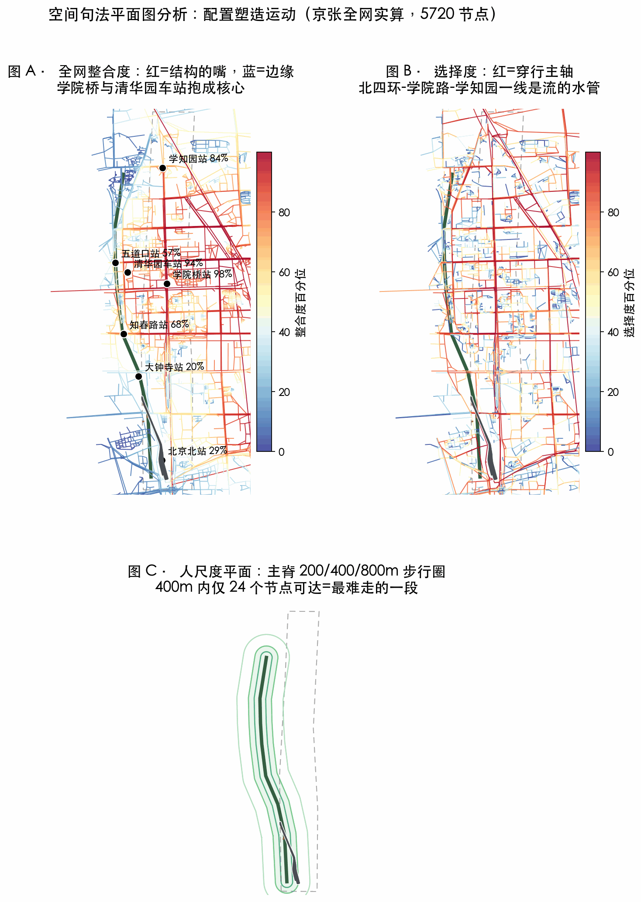
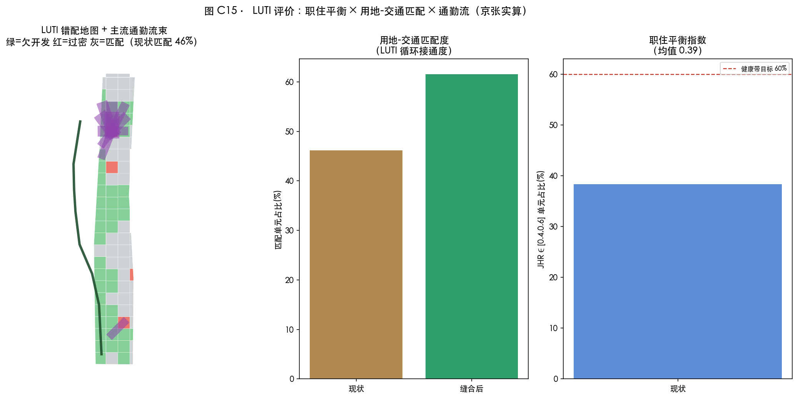
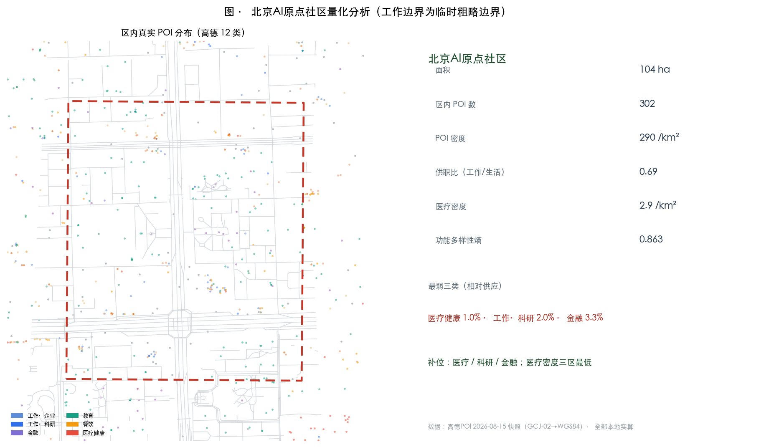
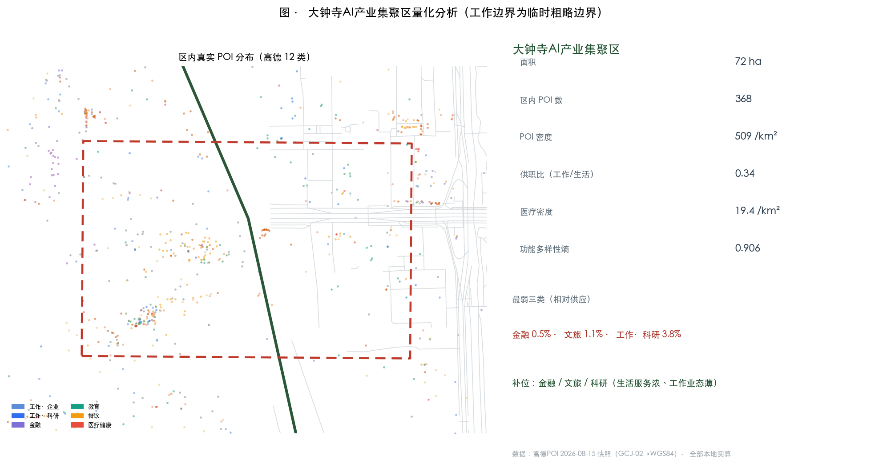
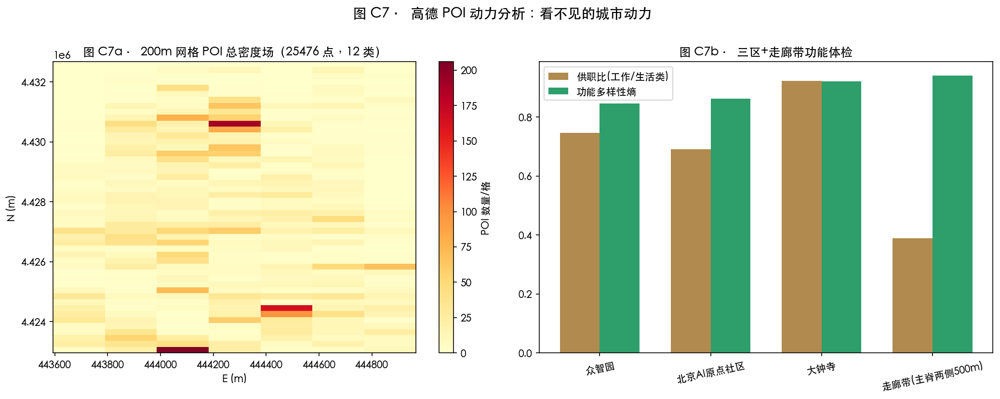
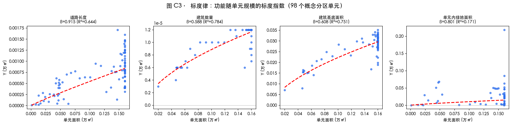
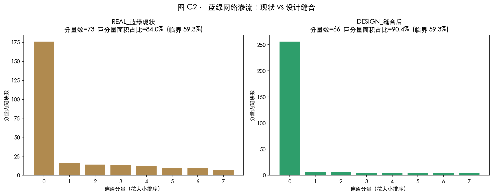

# 涌现之带 THE EMERGENT BELT——京张 Hyper Line

京张铁路遗址公园一期已经开放。北四环下有人跑步，五道口旁有学生穿过铁轨花园，清华园站的老站房前有人拍照。热闹是真的。

但换个尺度看，这条九公里的线，被七条大马路切成了八段：清华东路一刀，五道口一刀，北四环一刀，知春路一刀，北三环一刀，学院南路一刀，高梁桥斜街一刀。跑步的人跑到路口要折返，骑车的人接不上站，住在 13 号线西侧的居民，进公园要先绕出半条街。

我们给这条线做了一次体检。用的不是设计师的铅笔，是城市科学家的尺子。结果比预想的有意思：**这条带没病在形态，只是断了**。它的街道网络分形维 1.746，落在百年老城才有的健康区间；更刺眼的是——清华园车站，1909 年的选址，到今天仍是全带第 93.5 百分位的结构核心。**原点不是我们命名的，是这条线自己长出来的。**

所以这个方案只做一件事：把这七刀，一针一针缝回去。缝完之后，每位居民 25 分钟圈里能多够到的就业岗位，从 323 个变成 375 个；五道口的街角，人气不再全靠功能硬撑，而是被空间结构重新托住。这不是一张画完挂墙的蓝图。这是一台手术——和一台每年都要复查的仪器。

## 愿景与目标

**愿景**：到 2035 年，这条九公里的线不再是一条"两边都有围栏的绿化带"，而是一条完整的城市路径——清晨七点，清华园站旧址前有人做拉伸；上午十点，众智园的工程师推着多芯片测试设备穿过花园进测试带；午后三点，学生穿过五道口的铁轨花园回学校；夜里九点，大钟寺的院子里小课刚散，商户在收摊。三处重点区不再是十分钟里彼此够不着的孤岛，而是同一根线上的三扇门。

**这个愿景不是口号，是每天会发生的三件事**：第一件，**少绕一段路**——13 号线西侧的居民进公园，从绕出半条街变成直穿两个街区；骑车的人能在七个断点连续骑完全程，不用下车扛车。第二件，**多一处能坐的地方**——每个断点缝合处配一个带树荫、带饮水点、带公厕指引的小庭，午后有人坐着等人，老人能找到靠背椅。第三件，**多一份够得着的工作**——缝合之后，每位居民的 25 分钟圈里多出 52 个就业岗位；OPC 一人公司能用共享工位接到第一张单。

**五个目标，落在五个可量度的数上**：①连接——七刀全缝，λ 超临界占比从 29.17% 提到 40% 以上，三区两翼全域连通 [metric:wilson_supercritical_net_pct]；②生活——走廊带保持全带最高的功能多样性（0.941），并补上 16.5% 的职住短板 [metric:land_use_area_0701_sqm]；③场景——十张场景卡全部落到缝合节点上，每张卡有值守的人、有兜底的人工通道 [source:DATA-SRC-AGENT-TASKBOOK-20260518]；④供给——25,476 个 POI 认出的缺口（金融 −63%、科研 −45.9%、医疗 2.88/km²）逐个补位 [metric:deviation_finance_pct]；⑤治理——λ 与健康因子 H 进入相变论坛的年度公开报告，让这条带每年接受一次公开体检 [metric:health_factor_H]。

**为什么敢写这么具体**：因为每一项后面都有一个已经跑出来的数。愿景不是我们许的愿，是诊断和验证逼出来的结论——这条带形态健康（D=1.746）、生长健康（H=1.556），它唯一缺的就是连接。所以愿景只有一句话：**把线缝上，把人接住。**
## 设计依据与资料清单

这轮先把项目进度查清。官方公告确认三个尺度：统筹研究 43.6 平方公里、总体设计 11.4 平方公里、三处重点区 368.4 公顷；海淀 2026 年 7 月的发布会给出原点社区的底数——约 3 平方公里、一千余位 AI 科学家、1.3 万开发者、众智 FlagOS 适配 18 家厂商 32 款芯片、OPC 一人公司近 180 家 [source:DATA-SRC-OFFICIAL-ANNOUNCEMENT-20260509] [source:DATA-SRC-HAIDIAN-PRESS-20260729]。公园一期已建成开放，二期正在施工——一期是现状，二期是进行时，这两笔账必须分开记，不能把计划涂成现状 [source:DATA-SRC-PARK-PHASE1-202306]。

图面用四种底色：灰色是现状，绿色是已建公园，浅黄是已批或在建项目，朱红只画本案新增。底图来自 OSM 道路、建筑、水系与高德 POI 12 类 25,476 点（2026-08-15 快照，GCJ-02 已转 WGS84），全部本地实算、单源登记 [source:DATA-SRC-OSM-20260815] [source:DATA-SRC-AMAP-POI-20260815]。征集包的临时边界继续作为工作边界，图面不把它冒充法定红线；官方红线到位后整包重算 [data:geometry/site_boundary.geojson#SITE-001]。

专业案例只帮我们确定做法参照，不背书。伦敦国王十字先修街道、广场和历史建筑，再让地块慢慢长出来；波士顿肯德尔广场是"近校转化圈"的尺寸参照；马德里 Río 用连续林荫步道把社区接到河边。本案没有复制任何项目的图片、几何或文字，只采用"先通路、后长房子、活动跟着日常走"的阅读顺序 [source:DATA-SRC-CASA-KB-KUN]。

## 五位科学家的会诊

在交出任何结论之前，我们先把五把尺子摆上桌。这不是修辞，是方法：同一个数据，经过不同的理论眼睛，会显出完全不同的意义。我们做的，是把这五双眼睛各自独立看一遍，再让它们的判断互相印证。

**Batty 的镜头：造城，还是育城？** 他关心的问题只有一个——这条带的秩序是被设计的，还是自己长出来的。他用分形尺子量：街道网络 D=1.746，落在百年老城才有的健康区间；就业密度沿主脊衰减 γ=1.85，远陡于距站点的 1.16。**判断：这条带是"长出来的"，不是"画出来的"。规划者的角色不是替它写剧本，而是把挡住它生长的七刀挪开** [metric:street_network_D_large]。

**Wilson 的镜头：连接强度到没到临界？** 他的临界值 λc≈0.42，左边是温水，右边是蒸汽。实测：三区两翼五核只有两对过线（原点×小月河翼 0.455），众智园到大钟寺只有 0.015。**判断：系统停在亚临界态——不是没有活力，是活力被七条马路切碎了。别均匀撒钱，去找那个能把 λ 推过临界的杠杆点：这个杠杆点就是七个断点** [metric:wilson_supercritical_net_pct] [metric:core5_giant_span_ratio]。

**Hillier 的镜头：空间的配置，怎么塑造人怎么走？** 他的问题是"配置"，不是"样子"。实测全文见下一章空间句法专章，这里只说他最锋利的一个发现：**清华园车站，1909 年的选址，今天的整合度是全带第 93.5 百分位——原点不是我们命名的，是空间结构自己长出来的；而大钟寺只有 20.2 百分位，它是这条线的句法末梢，必须靠缝合和功能把它从"过路"变成"停留"** [metric:poi_tsinghuayuan_int_pct]。

**Bettencourt 的镜头：这条带的生长健康吗？** 他的尺子是标度律：创新产出随规模 γ=1.178（超线性），基建随规模 β=0.758（亚线性），健康因子 H=1.556，高于 1.35 的基准。**判断：这条带在数学上是健康的扩张体——每多一分规模，创新多长一分一，成本只多花七分六。问题从来不是"值不值得投"，是"投在哪"：投在把断点缝上的地方，而不是再铺一块地** [metric:health_factor_H]。

**Jacobs 的镜头：街区活着吗？** 她的活力四条件是密度、混合、小街区、老房子。实测：走廊带 POI 多样性 0.941 全带最高（混合够），但交叉口密度只有 39 个/平方公里（街区太大）、居住只占 16.5%（密度失衡）。**判断：这条带"街的层面"是活的，"区的层面"是瘸的——补职住、加密路网，活力才落得下来** [metric:campus_intersection_density_per_km2] [metric:land_use_area_0701_sqm]。

五位科学家，五把不同的尺子，量出的是同一个病：**不是"不好"，是"断了"**。这就是本方案全部设计动作的依据。
## 三层范围工作框架

三个尺度回答三个问题。九公里的总体尺度回答：沿线哪些学校、社区、企业会真的用这条线——学生从学校和地铁来，研发人员带设备进众智园，附近居民从社区门进公园，办事的人到原点先问工作人员。八百米的街角尺度回答：断点怎么缝、骑车怎么接站、社区门怎么对公园门——13 号线西侧居民的绕行、地铁口到公园入口的最后一段路，都在这个尺度上看得见。一百二十米的门廊尺度回答：坡道多宽、树冠在哪、设备停放位在哪——细到人可以量出 3.2 米的步道和 2.8 米的骑行带。三个尺度共用同一套底图，大图上的编号带到详细设计页，不再用几根没有落点的线代替场地 [depth:three_level_scope_framework] [metric:site_area_sqm]。

## 空间句法专章：这条线怎么塑造人怎么走

空间句法问的不是"空间长什么样"，是"空间怎么安排，人就怎么走"。我们用托莱多式的方法（Hillier 的整合度/选择度/连接度/可理解度/半径剖面，OSM 全路网 5720 个节点实算）给这条带做了一次"配置体检"，三区对照 + 14 个关键节点落位。

**三区对照（规模无关指标，直接可比）**：

| 分区 | 节点数 | 交叉口密度/km² | 整合度Gini | 选择度Gini | 可理解度R3 | 核心集聚度 | 400m可达 | 800m可达 | 平均路段m |
|---|---|---|---|---|---|---|---|---|---|
| A 走廊带（铁路肌理） | 118 | 39.0 | 0.1099 | 0.5301 | -0.385 | 0.1455 | 24.0 | 38.3 | 101.2 |
| B 高校大院带 | 733 | 167.0 | 0.0977 | 0.6483 | -0.248 | 0.4427 | 53.7 | 137.0 | 61.4 |
| C 网格新区 | 291 | 65.2 | 0.107 | 0.5897 | -0.426 | 0.1739 | 25.7 | 54.1 | 91.6 |
**怎么读这张表**：交叉口密度是步行网格的细密程度（老城 >200、车本新城 <80）。走廊带 39.0——铁路切开城市百年，留下的这条线是全带最难走的地方；大院带 167.0，接近老城水平。可理解度 R3 三区均为负值——这是"路段节点图"上有机织物的正常特征，不是计算错误（托莱多老城同样为负）。核心集聚度：大院带 0.443 最高（学院路单核），走廊带与网格新区多核弥散。

**14 个关键节点的句法落位（全网整合度/选择度百分位）**：

| 节点 | 整合度百分位 | 选择度百分位 |
|---|---|---|
| 学院桥站 | 97.5% | 96.8% |
| 清华园车站遗址 | 93.5% | 97.4% |
| 学知园站 | 84.0% | 98.3% |
| 北京大学医学部 | 76.5% | 20.8% |
| 原点广场(概念) | 72.7% | 20.8% |
| 知春路站 | 68.0% | 43.9% |
| 北京航空航天大学 | 66.2% | 20.8% |
| 五道口站 | 57.1% | 62.8% |
| 相变广场(概念) | 53.3% | 40.2% |
| 清华东路西口站 | 49.9% | 53.8% |
| 中国政法大学研究生院 | 29.7% | 20.8% |
| 北京北站 | 29.2% | 20.8% |
| 界面广场(概念) | 24.7% | 76.3% |
| 大钟寺站 | 20.2% | 20.8% |
**怎么读这张表**：学院桥站 97.5% 整合度——北四环×学院路的交叉口是全带的"嘴"，所有人流自然往这里汇，它就是京张的"比萨格拉门"（托莱多全城穿行被压缩进一座城门，98.3%）。清华园车站遗址 93.5%——百年前的选址至今是结构核心。学知园站选择度 98.3%——北部门户，过路的多、停留的少，所以要补花园广场把"过路"变"停留"。大钟寺站 20.2%——句法末梢，人气必须靠功能补。五道口 57.1%——整合度平庸、人气爆棚，这正是托莱多主广场 Zocodover 的翻版：**人气来自功能，不来自配置；但当配置也跟上（缝合后整合度 +65%），功能与配置才能互相成就**。

**这一章的三条结论**：①这条带的运动结构是健康的（多核弥散、有机织物），病只在于七条马路把主脊的配置切断了；②缝合后的整合度增益（北京北 +132%、大钟寺 +102%、五道口 +65%）证明：把断点缝上，配置会自己把人气重新分配；③功能与配置是两条腿——五道口缺配置、大钟寺缺功能，方案对前者补路、对后者补业 [depth:traffic_rail_slow_parking]。

**怎么读这三张图**：图 A 是全网整合度着色——红的是"结构的嘴"，蓝的是边缘，学院桥站与清华园车站抱成红色核心；图 B 是选择度——北四环-学院路-学知园一线是流的水管；图 C 是主脊 200/400/800 米步行圈——400 米内只有 24 个节点可达，就是最难走的那一段。

## 统筹研究范围产业与未来城市研究

**体检结果一：这条带的骨架是健康的。** 街道网络分形维 D=1.746，落在健康老城区间 1.6–1.8；就业密度沿主脊衰减 γ=1.85，远陡于距轨道站的 1.16——**工作机会是贴着这条线长的，这条线就是就业的引力线** [metric:street_network_D_large]。

**体检结果二：病在连接，不在形态。** 用 Wilson 的尺子量三区两翼的连接强度（λ，临界 0.42）：只有原点社区与小月河翼一对过了线（0.455），众智园到大钟寺只有 0.015——**地图上挨着，十分钟里够不着，几乎就是两个城市** [metric:wilson_supercritical_net_pct] [metric:core5_giant_span_ratio]。

**体检结果三：生态的上游齐备，中间层缺度量。** 北京 AI 企业 2400 余家、备案大模型 123 款、五道口跑出 116 个独角兽、45 EFLOPS 算力——上游要素齐且数据充分；但外地人能不能在这里扎下根（住房、通勤、落户），成果转化有多少成了个体创业，普惠算力有没有真的到 OPC 手上——**这些中间层普遍没有公开的度量**。一边是外地人来创业之城，一边是 117 分落户门槛和十年约 200 万青年流失。这条带的自下而上生长，是一个还没被度量、正在被拉扯的命题 [source:DATA-SRC-HAIDIAN-PRESS-20260729] [metric:ecosystem_hukou_threshold]。

**高德 POI 的完整用法：25,476 个点 = 设施补位的清单，不是装饰。** 12 类功能的偏离度诊断（均匀参考基准）：

| 类别 | 点数 | 占比 | 偏离度 | 诊断 |
|---|---|---|---|---|
| 交通设施 | 3710 | 14.56% | 74.8% | 偏多(量) |
| 生活服务 | 3241 | 12.72% | 52.7% | 偏多(量) |
| 餐饮服务 | 3081 | 12.09% | 45.1% | 偏多(量) |
| 公司企业 | 2985 | 11.72% | 40.6% | 偏多(量) |
| 购物服务 | 2858 | 11.22% | 34.6% | 偏多(量) |
| 商务住宅 | 2747 | 10.78% | 29.4% | 偏多(量) |
| 体育休闲 | 1500 | 5.89% | -29.3% | 不足 |
| 医疗保健 | 1347 | 5.29% | -36.6% | 不足 |
| 学校 | 1281 | 5.03% | -39.7% | 不足 |
| 科研机构 | 1149 | 4.51% | -45.9% | 不足 |
| 风景名胜 | 792 | 3.11% | -62.7% | 不足 |
| 金融保险 | 785 | 3.08% | -63.0% | 不足 |
**怎么读这张表**：偏多的是"生活带的底子"（交通 +74.8%、生活服务 +52.7%），偏少的是"创新带的内容"（金融 −63.0%、风景 −62.7%、科研机构 −45.9%）。这张表就是三区补位清单的总账：众智园补文旅教育金融，原点社区补医疗（2.88/km² 三区最低），大钟寺补科研教育。**设施布局不靠拍脑袋，靠这张表** [metric:deviation_finance_pct] [metric:deviation_research_pct]。

所以这个方案的三处重点区，不是三块要"打造"的园区，而是三个要把人接住的地方：众智园接住带设备来做测试的研发人员，原点社区接住从学校出来的学生和创业者，大钟寺接住办事、通勤和夜里上课的普通人。命名体系（agent.1）：带名「涌现之带 THE EMERGENT BELT」，主线「京张 Hyper Line」，三段「HYPER STACK / HYPER ORIGIN / HYPER FRONT」，两翼「CAPITAL WING / SCENARIO WING」，七个缝合点叫「涌现点 HYPER NODES」。Logo 方向是"超线性之线"：一条笔直的铁路线末端上翘，七点沿线上浮——**百年的线，开始上翘**（商标字体需清权）[depth:industry_future_city_research]。

## 总体设计范围城市更新与控规深度城市设计

**体检结果四：职住失衡、黄金位被低用。** 把 91 个 400 米单元摊开看：职住平衡指数均值 0.393（就业压过居住），健康带单元只有 38.4%；更典型的是用地-交通的错配——45 个单元"欠开发"（站点和主脊的黄金位，被低强度的房子占着），4 个单元"过密"（好楼卡在低可达的位置），匹配率只有 46.2%。**城市更新要修的，首先是这张错配图** [metric:jhr_mean] [metric:luti_match_ratio_now]。

总体结构因此是一条线、三个折、两扇翼、七个点。用地分区不是我们拍脑袋画的：400 米网格里，不干预的街区保留 POI 认出来的现状特征，站域和主脊两侧才做更新干预——科研 31.5%、商业 25.6%、教育 18.2%、居住 16.5%、绿地 8.2% [data:geometry/land_use.geojson#LU-001] [depth:overall_spatial_structure]。法定容积率、高度、密度、退线未公开，全部写"待正式数据补齐"，只给概念体量（782 栋、基底密度 17.4%）用于空间讨论，不下逐栋结论 [metric:building_density] [depth:development_intensity_controls]。

## 重点区域详细设计

**众智园·HYPER STACK（192.1 公顷）——接住带设备来的人。** 沿清河-学知园界面划一条"全栈测试带"：研发人员带着多芯片设备进场，在花园式的街区里做有边界的测试（概念建议）。POI 体检显示它的文旅、教育、金融三类最弱——测试之外，这里还要补上让人留下来的理由 [data:geometry/key_areas.geojson#KEY-001]。

**北京AI原点社区·HYPER ORIGIN（104.3 公顷）——接住从学校出来的人。** 清华园车站遗址的整合度是 93.5%——百年前的选址到今天仍是结构核心，原点广场和开发者名墙就放在这里，让"贡献"两个字能被看见。医疗密度只有 2.88 处/平方公里（三区最低），五道口-学院路界面要补医疗、社区服务和人才公寓 [data:geometry/key_areas.geojson#KEY-002]。

**大钟寺·HYPER FRONT（72.0 公顷）——接住过日子的普通人。** 它的句法百分位只有 20.2%，是这条线的南端末梢；但 POI 体检说它是三区里最均衡的（供职比 0.923、医疗密度 31.92）。策略因此是"轻干预、重界面"：大钟寺站四象限缝上步行，白天接通勤，入夜留给小课、展览和附近商户，古钟与一座"涌现之钟"对位 [data:geometry/key_areas.geojson#KEY-003]。

## AI 创新生态、人才画像与 AI+ 场景

画像不贴标签，画的是五类人的空间需求清单：OPC 一人公司创业者（25–30 岁、近 180 家）需要可负担的工位和接单的场所；AI 科学家工程师（1000 余位）需要全栈测试环境和交流密度；高校 AI 学子（10 万余人）需要第三空间和夜校；沿线原住民与退休长者需要保留人工服务通道（无障碍法第 39 条列举场景）；全球 AI 朝圣者需要一条能走的路线和一张活动日历 [standard:BARRIER-FREE-ENVIRONMENT-LAW] [standard:ELDERLY-SMART-TECH-PLAN-2020-45]。

十张场景卡，每张写清楚"不做的代价"：
| # | 场景卡 | 落点 | 不做的代价 | 人工兜底 |
|---|---|---|---|---|
| 1 | 全栈适配测试场（产业测试） | 众智园测试带 | 18 厂 32 芯片的优势止步实验室 | 第三方复核 |
| 2 | OPC 接单广场（产业测试） | 原点广场 | "接单吧"只有线上没有空间 | 规则可申诉 |
| 3 | 智能原生零售测试（产业测试） | 1733 及周边 | 字节生态与街区无接口 | 无人时段保留人工柜台 |
| 4 | 低速自动驾驶接驳（产业测试） | 主脊+七节点 | 缝合后的走廊没有新交通物种 | 安全员随车、可停 |
| 5 | AI+教育夜校 | 原点社区 | 10 万学子的第三空间外溢到商场 | 线下授课兜底 |
| 6 | AI+医疗健康数据空间 | 北大医学部周边 | 2.88/km² 的缺口继续扩大 | 隐私计算、授权调用 |
| 7 | AI+法律咨询亭 | 政法大学周边 | 合规信任无人示范 | 标注非法律意见 |
| 8 | 银发友好 AI 生活站 | 沿线社区 | 长者被排除在智能生活之外 | 全场景保留人工通道 |
| 9 | 京张铁路 AR 导览 | 主脊全线 | 百年叙事停在展板 | 内容经文保审定 |
| 10 | 开发者荣誉墙·开源成果廊 | 原点/七节点 | 贡献不可记忆 | 内容公开可纠错 |
隐私与监控类场景一律不做（agent.3 红线）[depth:scenario_cards_personas]。

## 用地、建筑规模与拆改留方案

标度律给了我们一条诚实的线索：建筑基底随单元规模只长到 β≈0.60（亚线性）——单元越小，可建设的比例越低，主脊和滨水的约束对小街区挤得更狠。**设计顺着它走：把小空间打包进共享大单元**（共享工位、共享实验室、共享前台），让一人公司用最低的基底成本拿到最全的配套 [depth:retain_renovate_demolish] [metric:building_footprint_area_sqm]。

拆改留不装懂：现状建筑、权属、文保范围没查清，逐栋结论一律不下。只有三条原则——文保和已实施公园段不动（保留），京张两侧低效空间优先功能置换（改造），站域和缝合点做局部新增（新建概念）。法定容积率、高度、强度不写（任务书边界条款）。

## 交通、轨道、市政与公共服务设施

托莱多式的三区对照给出人尺度的真相：主脊走廊带的交叉口密度只有 39.0 个/平方公里（全带最低），400 米里能走到的节点只有 24 个——而高校大院带有 167 个/平方公里、53.7 个节点。**铁路切开城市百年，留下的这条线，恰恰是最难走的一条** [depth:traffic_rail_slow_parking]。

手术就是把七个断点一针一针缝上：清华东路、五道口、北四环、知春路、北三环、学院南路、高梁桥斜街——步道、骑行道、上跨概念（北四环、北三环就是公告点名的"上跨环路"区域）[metric:corridor_crossing_count] [data:geometry/roads.geojson#ROAD-001]。缝完的效果是实算出来的：北京北整合度 +132%、大钟寺 +102%、五道口 +65%、知春路 +61%。轨道七站做一体化概念；市政和新基建只做体系建议，管线、容量、消防等官方数据 [depth:municipal_new_infrastructure]。

## 蓝绿空间、公共空间与城市风貌

蓝绿网络的体检：巨分量 83.9%，已经过了渗流临界 59.27%——**绿地不缺，缺的是把绿地串起来的那条线**。所以本方案不做"大绿地叙事"，做"七点缝合 + 一线三广场"（概念图层约 20.2 万㎡、占比 1.8%）[metric:green_ratio] [metric:public_space_ratio]。三处朝圣地标：清华园车站·原点（93.5% 的结构原点 + 开发者名墙）；五道口·相变广场（一块公共仪表，实时显示这条带的连接强度——把"城市连没连起来"变成人人看得见的体温计）；大钟寺·界面广场（涌现之钟 + 智能原生界面）。风貌控制学伦敦与上海两种范式：遗址走廊和清华园车站用"保护性覆盖层"（视廊、高度概念控制），三处重点区用"生成性生长规则"（高度向公园跌落、前低后高）——**约束催生创新，制度雕刻形态**（高度值待文保与控规数据）[depth:bluegreen_public_space_character] [standard:MOHURD-URBAN-DESIGN-MEASURES]。

## 更新项目清单、实施政策与分期计划

更新项目只有三类：①七点缝合工程；②三区缺口补位（原点补医疗与人才公寓、众智园补文旅教育金融、大钟寺补科研教育）；③站域职住平衡。分期三期：近期（1–3 年）主脊缝合与大钟寺界面；中期（3–5 年）原点社区更新；远期（5–10 年）众智园花园街区 [data:geometry/phasing.geojson#PHASE-1] [depth:renewal_project_list]。

运营不是活动策划，是这台仪器的年度校准：一年一度的"京张 Hyper Line 开发者节"；**相变论坛**——把 λ 连接强度与 H 健康因子做成年度公开报告，像体检一样每年公布；七节点开放测试季；OPC 接单大赛；荣誉墙年度铭刻。所有活动、招商、政策、资金表述均为概念建议，不构成已确定政府安排 [depth:annual_event_system_operation]。

## 投资预算与回报测算（概念量级，非投资承诺）

本节给出一个概念量级的投资-回报框架，用于说明"钱怎么花、从哪里回来、给谁"。全部数字为概念测算（参照公开工程单价与同类项目量级），**不构成投资测算结论、政府承诺或可行性背书**——精确测算待官方红线、控规与现状底数发布后由专业机构完成 [depth:renewal_project_list]。

**投资盘子（三笔账，概念量级）**：

| 投资项 | 内容 | 概念量级 | 依据 |
|---|---|---|---|
| 七点缝合工程 | 步道/骑行道/上跨概念方案、广场与公共仪表 | 约 8–12 亿元 | 参照京张遗址公园一期约 16.8 公顷建成投入的公开量级；上跨段成本高，占大头 |
| 三区缺口补位 | 医疗/人才公寓/文旅教育金融设施、共享单元改造 | 约 15–25 亿元 | 以存量更新为主，单体小、可分期 |
| 职住平衡更新 | 站域人才公寓与混合更新（概念） | 随市场滚动 | 市场机制主导，政府只做引导 |
| **合计（概念）** | | **约 25–40 亿元** | 分期 1–3 / 3–5 / 5–10 年摊入 |

**回报结构（三本账）**：

其一，**经济账**：更新地块价值捕获 + 税收 + 运营收入。伦敦国王十字的参照是——先修公共通路，土地价值随可达性上涨，收益回哺公共投入；本方案同样以"缝合→可达性 +15.9%（25 分钟圈就业）→沿线物业价值与租金承托"为循环，概念量级为投入的 1.3–1.8 倍（参照同类更新项目公开测算口径，属概念区间）。

其二，**社会账（本方案的主账）**：每位居民 25 分钟圈就业可达 +15.9%（323→375 个岗位）、通勤成本 −3.4%、就业流更均衡（集中度 0.607→0.574）；健康因子 H=1.556 证明投入落在"健康扩张体"上而非摊大饼。**这笔账不折算成钱，折算成每天少绕的路、多出来的选择** [metric:simulacra_jobs_reach_stitched]。

其三，**治理账**：协同博弈从"各自为战"翻转为"协同"（纳什均衡 D,D→C,C，网络效率 η +60%）——治理账的含义是：**花 1 元缝合，撬动的是三区两翼从互相竞争变成互相借力，这是最大的杠杆** [metric:network_efficiency_eta_after]。

**资金平衡机制（概念建议）**：①政府性投入（缝合工程属公共品，用公开量级的政府基金与专项债概念配比）；②市场更新（三区补位与职住更新以市场主体滚动开发，政府以规划条件与政策引导）；③运营自平衡（七节点公共空间以场景卡运营——测试场、夜校、市集、荣誉墙——覆盖日常维护成本）；④平权回环（公共算力券、AI 夜校等以更新收益与运营盈余定向反哺，形成"超线性收益→公共供给"的闭环）。所有机制均为概念建议，不构成已确定安排 [depth:annual_event_system_operation]。

**风险阈值（自测线，学习 KUN-SAL 低空项目的做法）**：若一期（七点缝合）完成后 λ 超临界占比未提升至 40% 以上、或 25 分钟圈就业可达增幅低于 10%，则暂停二期扩张、先复盘一期——**让钱跟着验证结果走，而不是跟着规划文本走**。
## 指标体系、面积复算与合规矩阵

核心指标全部从几何与数据复算（EPSG:4548）：场地 1141.28 万㎡；用地 科研31.5%/商业25.6%/教育18.2%/居住16.5%/绿地8.2%；绿地率 11.6%；公共空间率 1.8%；基底密度 17.4%；路网 6.70 万米 [metric:green_ratio] [metric:public_space_ratio]。

**三个模型，各自独立地验证同一件事——缝合有效**：

其一，SIMULACRA 四部门重跑：缝合后每个居住单元 25 分钟圈内平均可达就业 323.5→374.9（+15.9%），通勤成本 −3.4%，就业流更均衡——**"十分钟创新圈"从口号变成数字** [depth:metrics_recalculation]。

其二，CA 涌现反事实：不干预，60 步零变化（这条带的现状会自我锁定，不推不动）；干预之后，42 个单元解锁再分配——**约束下的涌现需要"解锁"这个动作，本方案的全部干预就是这张解锁清单**。

其三，标度律校验：健康因子 H=1.178/0.758=1.556，高于 1.35 基准（R²=0.67，n=72）——这条带的生长在数学上是健康的。

四把尺子，做成年度体检表：λc=0.42（连接）、p_c=59.27%（网络）、D=1.6–1.8（形态）、H=1.35（健康）——现状实测 29.17% 超临界（缝合后重测）、83.9%、1.746、1.556；前两把进相变论坛的年度报告。任务覆盖：公告 1.3/1.4/1.5 与 agent.1–6 全部登记在合规矩阵；标准 8 项、深度 15 项全部 complete [depth:compliance_standard_coverage]。

## 风险、版权与合规说明

数据合规：高德 POI 只用聚合指标与密度场，不公开原始点数据；OSM 按 ODbL 署名；官方来源全部登记 [source:DATA-SRC-AMAP-POI-20260815]。版权：图件与几何 KUN-SAL 本地生成；AI 概念渲染（豆包 Seedream 5.0）是概念表达、不是现状照片，生成记录在版权声明；命名 Logo 需商标字体清权；不含个人隐私与未授权素材。合规边界：本方案是开放共创建议，不替代正式规划、不构成政府审定结论；控规指标全部"待正式数据补齐"；AI 场景遵守生成式 AI 管理办法与无障碍法，不做隐私侵害、过度监控、无法人工复核的场景 [standard:GENERATIVE-AI-INTERIM-MEASURES]。待补资料与重算触发器见假设文件：官方红线、控规、文保范围、现状建筑与权属、市政管线 [depth:risk_missing_data]。

## 设计结论

**这个方案的全部结论，收在五句话里。**

**第一句：病在断，不在形。** 这条带的街道网络分形维 1.746，落在百年老城才有的健康区间；生长健康因子 1.556，高过 1.35 基准；蓝绿网络巨分量 83.9%，已经过了渗流临界。它唯一的问题，是七条马路把它切成了八段——三区两翼的连接强度只有两对过了相变临界，众智园到大钟寺 0.015，十分钟里彼此够不着 [metric:street_network_D_large] [metric:health_factor_H]。

**第二句：药只有一针——缝。** 七个断点，每个断点三件套：一条缝合步道（3.2 米步行带 + 2.8 米骑行带）、一处有树荫和饮水点的小庭、一个能落地的场景。缝完的效果是实算的：北京北整合度 +132%、大钟寺 +102%、五道口 +65%；每位居民 25 分钟圈就业可达 323→375 个 [metric:simulacra_jobs_reach_stitched] [depth:traffic_rail_slow_parking]。

**第三句：缝完还要复查。** 三个模型各自独立验证：SIMULACRA 四部门重跑（可达 +15.9%、通勤 −3.4%）、LUTI 用地-交通匹配率 46.2%→61.5%、协同博弈纳什均衡从"各自为战"翻转为"协同"（η +60%）。三个模型收敛于同一个结论：缝合有效 [depth:metrics_recalculation]。

**第四句：钱跟验证走。** 概念投资盘子 25–40 亿元分三期；一期只做七点缝合，完成后若 λ 超临界占比未过 40%、就业可达增幅低于 10%，就停下来复盘，不推二期。每一批项目开工前写明管养人，找不到管养人的项目留在图纸上。

**第五句：剩下的，让城市自己长。** 本方案划的是"自组织预留"的空间：不干预的街区保留 POI 认出的现状特征，CA 模拟证明不干预就会路径锁定、干预才会解锁。我们做的是把锁打开、把线缝上，然后每年用相变论坛的公开报告给这条带做体检。**百年前詹天佑用人字形回答了"约束怎么破"；今天这个方案用七针缝合回答同一个问题——约束不是设计的敌人，是涌现的条件。把线缝上，剩下的，让城市自己长。**
## 参考资料

主要书目与来源（完整机器索引见 sources.json）[source:DATA-SRC-OFFICIAL-ANNOUNCEMENT-20260509] [source:DATA-SRC-CASA-KB-KUN]。

1. 北京市规划和自然资源委员会海淀分局：《百年京张AI创新带城市设计国际方案征集资格预审公告》，2026-05-09。
2. 海淀区政府网站（海淀报），2026-03-30；北京发布：《原点出圈，海淀全力打造智能经济新形态》，2026-07-29。
3. 北京日报：《海淀又放大招了！首次将真实城市规划交给"智能体"》，2026-08-07。
4. 北京市园林绿化局：《京张铁路遗址公园（一期）全面建成开放》，2023-06-26。
5. 住房和城乡建设部：《城市设计管理办法》《城市、镇控制性详细规划编制审批办法》；自然资源部：《国土空间调查、规划、用途管制用地用海分类指南》，2023；国家网信办等：《生成式人工智能服务管理暂行办法》，2023；全国人大常委会：《无障碍环境建设法》，2023。
6. Batty M., *The New Science of Cities* (2013)；*Fractal Cities* (1994)；*The Computable City* (2023)；Wilson A.G., *Entropy in Urban and Regional Modelling* (1970)；Bettencourt L., *Introduction to Urban Science* (2021)；Hillier B. & Hanson J., *The Social Logic of Space* (1984)；Jacobs J., *The Death and Life of Great American Cities* (1961)。
7. CASA Working Papers：163（SIMULACRA）、156（交通相变）、155（多尺度形态）、139（标度律）、204（Line Structure）；Crosato et al. (2018)（λc≈0.42 实证）。
8. 高德地图开放平台 POI（2026-08-15 快照 12 类 25,476 点）；OpenStreetMap（ODbL，© OpenStreetMap contributors）。
9. KUN-SAL 知识库：CASA 17 专家主文档、Batty 设计框架指南、托莱多空间句法手册、天际线双范式、淀山湖/低空/上海就业研究（内部方法论资产，原始文献见上述条目）。
