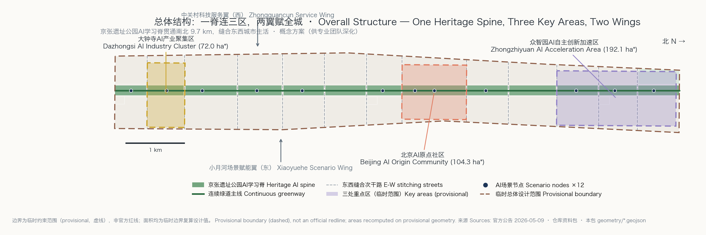
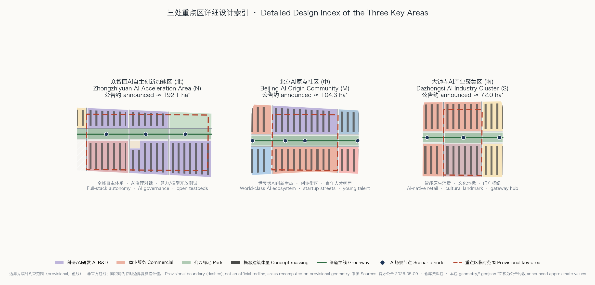

# Continuum: A Coordinated Urban Design for the Centennial Jing-Zhang AI Innovation Belt

The proposal is named "CONTINUUM" (连续体), subtitled "Centennial Jing-Zhang AI Innovation Belt". The name carries two threads at once: the century-long technological continuum of the Jing-Zhang Railway from steam to intelligence, and the core spatial judgment of this proposal — turning the 9.7 km heritage park into one continuously learning, continuously evolving public spine. This is a concept proposal for the agent open call; every spatial arrangement is a conceptual suggestion and reference scheme for professional teams to deepen. It does not replace statutory planning and does not constitute a government-approved conclusion.

## Design Basis and Source List

Every factual basis of this proposal comes from public or cleared sources. The design tasks, the textual boundaries, and the approximate areas of the three scope levels are taken from the prequalification announcement published by the Beijing Municipal Commission of Planning and Natural Resources on 9 May 2026 [source:OFFICIAL-ANNOUNCEMENT]; the three positionings, five functions, three-areas-two-wings structure, six agent tasks, and boundary clauses come from the agent taskbook excerpt [source:AGENT-TASKBOOK]; land-use codes, layers, and metric conventions follow the enums and schemas of the cleared site package [source:SITE-PACKAGE]. Before selecting any material we read the public source registry to distinguish its permitted uses: formal claims rely only on formal-ready sources, while background and provisional materials are used strictly within their limits [source:SOURCE-REGISTRY].

The official precise boundary vectors have not been published — this is the most important data gap of this package. Both the overall design area and the three key areas use the repository's provisional rough polygons, whose temporary nature is declared repeatedly in the geometry properties, the assumption records, and this text [source:BOUNDARY-SOURCE]. Consequently every area figure in this package is a design value recomputed on provisional geometry, not an official precise area; once official vectors are released, all precision-sensitive metrics will be recalculated along the documented path. Mandatory professional standards are read from local snapshots inside the repository rather than external links alone [source:STANDARD-SNAPSHOTS]. Exhaustive indexes of sources, metrics, standards, depth items, and task coverage live in the structured files; the prose only attaches claim-adjacent evidence anchors.

## Three-Level Scope Framework

Each scope level carries a different working depth. The coordinated research area of about 43.6 km² hosts industry strategy and future-city research, answering why Haidian can carry a world-class AI innovation belt; the overall design area of about 11.4 km² receives regulatory-plan-depth urban design — the land-use partition, metric recalculation, and renewal framework of this package are completed at this level, with a recomputed provisional area of 11.413 km² [metric:site_area_sqm]; the key detailed-design area of about 368.4 ha receives implementation-scheme-depth detailed design for Zhongzhiyuan, the Origin Community, and Dazhongsi [depth:three_level_scope_framework].

The transmission between levels works as follows: the research level proposes the sense-validate-diffuse innovation loop; the overall level translates the loop into the spatial structure of one spine, thirteen segments, and two wings with land-use proportions; the key-area level lands the structure onto blocks and building clusters. Because all three boundaries are provisional constraints, this section states their limits explicitly: provisional polygons are used only for generation, visualization, and self-checking, never as official redlines, approval bases, or precise-area claims [data:geometry/site_boundary.geojson#SITE-BOUNDARY-PROV-001]. When official vectors arrive, the recalculation scope covers all land-use areas and ratios, key-area checks, phasing areas, the five figures and drawings, and the numeric displays in the offline visualization.

## Coordinated Research Area: Industry and Future City Research

The core judgment at the research level is that Haidian's AI advantage lies not in any single campus but in the density of the chain from university-born original innovation through pilot validation to industrial diffusion; this belt should be the spatial device that compresses the chain into one walkable corridor [source:OFFICIAL-ANNOUNCEMENT]. We studied eight global innovation-district cases and extracted transferable lessons: Kendall Square in Boston shows that zero distance between labs and streets accelerates translation; King's Cross in London shows heritage places can anchor a technology district's identity; one-north in Singapore shows that work-live-learn-play mixing retains talent; Shenzhen Nanshan shows the value of hardware supply-chain proximity; Station F in Paris shows the flagship effect of a super-incubator; Cornell Tech in New York shows the campus-industry co-location model; Shibuya in Tokyo shows a startup ecosystem above a rail hub; Mission Bay in San Francisco warns of hollowing when a single-function district lags on daily life. These lessons become the mixed land use, on-spine validation grounds, and gateway hubs of this proposal [standard:PROJECT-AGENT-OPEN-CALL-TASKBOOK].

Naming and visual identity direction: the main mark "CONTINUUM" abstracts the Jing-Zhang "herringbone" switchback into a dynamic polyline threading three node circles — three nodes for the three key areas, the polyline for the learning spine; the palette is signal green, rail grey, and intelligence purple; the naming family unfolds in three tiers of segment-node-scene (e.g., "Origin Segment · Wudaokou Stage"). All type and graphics are described as original directions; no unauthorized trademarks or typefaces are used. For future urban form, the belt prototypes a "city as agent": each scenario node is at once a physical space and a minimal unit of data and governance, with the three narrative layers of AI culture, AI society, and AI city unfolding along the spine [depth:overall_spatial_structure].

## Overall Design Area: Urban Renewal and Regulatory-Plan-Level Urban Design

The overall level translates strategy into a recomputable structure: a 170 m wide heritage-park AI learning spine runs north-south, flanked by two 22 m slow-mobility streets, while twelve east-west stitching secondary roads cut the 1.37 km wide belt into thirteen functional segments — from south to north the South Gateway, Dazhongsi industry segment, south community segment, university collaboration segment, pilot-service segment, mid community segment, Wudaokou vitality segment, Origin Community segment, Tsinghua East science-education segment, north community and reserve segment, and the three Zhongzhiyuan segments [data:geometry/land_use.geojson#LU-001]. The land-use partition covers the provisional boundary completely with zero overlap (coverage gap 0 m²); research land leads with about 246 ha, followed by commercial services at about 199 ha, residential at about 160 ha, and park green at about 159 ha [metric:land_use_area_0802_sqm].

The renewal framework is "spine-led, segment-balanced": each segment uses the heritage-park cross-section upgrade as a catalyst that drives retention, renovation, and renewal of flanking parcels; total building scale by concept massing is about 18.39 million m², corresponding to a concept intensity of 1.61 — a low-confidence design quantity, not a statutory floor area ratio [metric:concept_total_floor_area_sqm]. All missing statutory controls — FAR, height, density, green ratio, setback — are recorded as pending official data, with recalculation triggers in the assumption records, never disguised as approved indicators. The urban character keeps a base of rail grey, brick red, and signal green; spine-side buildings use terraced and arcade sections to protect park sightlines and winter sunlight. The innovation indicator system has four groups — AI innovation density, scenario openness, slow-mobility connectivity, and talent affordability — all recomputable from this package or refreshable from future operations data [depth:development_intensity_controls].

## Detailed Design of Key Areas

The Zhongzhiyuan AI Acceleration Area (north, announced ≈192.1 ha) carries full-stack autonomy and AI-governance discourse. Its structure is "one plaza, two wings": the central AI Plaza hosts the global developer congress and governance dialogues; the west wing arranges full-stack R&D clusters (chip-framework-model-application vertically adjacent); the east wing is the open testbed for compute and models; the north end forms a gateway green corridor with the Fifth Ring protective belt. Buildings mix deep-plan R&D slabs with atrium lab towers, and concept heights step up away from the spine [data:geometry/key_areas.geojson#PROV-KEY-001]. The Origin Community (middle, ≈104.3 ha) hosts the world-class AI ecosystem: startup streets form the skeleton, the spine's east side extends the enterprise-service copilot front desk and the Wudaokou youth stage, the west side holds research-mixed blocks; talent apartments and international community services are embedded in every block for 24-hour vitality [data:geometry/key_areas.geojson#PROV-KEY-002].

The Dazhongsi AI Industry Cluster (south, ≈72.0 ha) is positioned for AI-native retail and the gateway hub: the Dazhongsi cultural landmark and AI-native commerce form an "ancient bell × new sound" dialogue, while the station plaza organizes the southern start of low-speed shuttle and autonomous-delivery testing [data:geometry/key_areas.geojson#PROV-KEY-003]. The three areas share one detailed-design template covering positioning, spatial structure, building renewal, slow mobility, public space, AI scenarios, and implementation risk — see the index figure and the A3 booklet. Because the key-area boundaries are provisional, all block-level conclusions are directional; parcel boundaries, retain-renovate-demolish decisions, and engineering feasibility await official data and professional deepening [depth:three_key_area_detailed_design].

## AI Innovation Ecosystem, Personas, and AI+ Scenarios

The belt serves five personas: (1) hardcore researchers from universities and institutes, needing lab-to-testbed zero distance and late-night third places; (2) founders and engineers, needing affordable offices, an enterprise-service front desk, and investor encounterability; (3) AI-native youth — students and early-career workers — needing affordable housing and identity places; (4) community residents and elders, needing age-friendly, accessible AI life services rather than technological exclusion; (5) global visitors and developers, needing scenes they can pilgrimage to, experience, and join. In the ecosystem mechanism, land and space are guaranteed by segment-level mixed supply, compute and data are pooled by the Zhongzhiyuan open testbed, and capital and scenarios are injected through the Zhongguancun service wing and the Xiaoyuehe application wing [source:AGENT-TASKBOOK].

Twelve AI scenario cards line the spine (SN-01 to SN-12); every card defines its spatial anchor, service population, operating data, privacy boundary, human-review mechanism, and operator, with full attributes in the public-space layer [data:geometry/public_space.geojson#SN-01]. Three of them are industrial test-and-validation scenarios: SN-03, the Zhongzhiyuan compute-and-model open testbed (enterprise model admission evaluation); SN-07, the low-speed autonomous-delivery test loop (east branch street plus real community-segment conditions); SN-11, the Dazhongsi AI-native retail testbed (retail robots and seamless payment). The remaining cards cover AI health navigation (SN-04), AI mobility check-ups (SN-08), AI-guided cultural narrative (SN-09, SN-12), and age-friendly community services (SN-10). All scenarios presuppose data minimization, visible on-site notice, and human reviewability, with no unappealable automated decisions [depth:existing_conditions_diagnosis].

## Land Use, Building Scale, and Retain-Renovate-Demolish Strategy

The land-use logic is "spine sets the skeleton, segments set the functions, streets set the scale": 159 ha of park green forms the continuous skeleton, 81 ha of road land (7.1%) forms the small-block dense network, and the remaining land follows segment programs [metric:road_land_ratio]. At the building level, 171 concept massings are arranged as slab bars with a total footprint of about 227 ha and a concept density of 19.9% [metric:building_footprint_area_sqm]. Retain-renovate-demolish uses four concept classes: retain (sound university and mature community buildings), renovate (ground-floor opening and facade renewal of spine-facing buildings), renew (holistic redevelopment of inefficient industrial land), and new-build (catalyst projects on reserved land and around plazas). Because building surveys and ownership data were not released with the public package, this package draws no parcel-level retain-renovate-demolish conclusion; it provides the classification method and segment-level directions only [source:SOURCE-REGISTRY].

The boundary of the scale estimate must be stated plainly: the concept total floor area of 18.39 million m² multiplies 171 footprints by concept storey counts, with low confidence; its role is to indicate the magnitude and distribution of industrial space supply, not statutory building scale [metric:concept_far]. Statutory FAR, height, and density remain pending official data until regulatory conditions are published; professional teams should then re-estimate from official conditions, and this package's concept quantities immediately downgrade to background reference [standard:MOHURD-CONTROL-DETAILED-PLANNING].

## Transport, Rail, Municipal Infrastructure, and Public Services

The heart of the transport scheme is converting the belt from "cut apart by through traffic" to "stitched together by a slow-mobility network". The twelve east-west stitching secondary roads use slow-priority sections (two motor lanes plus wide sidewalks and cycle tracks on both sides); wherever they cross the heritage park they meet at grade or on gentle ramps, removing today's walking breakpoints; north-south movement is carried by the two 22 m slow streets hosting micro-circulation buses and low-speed shuttles, and the 9.7 km greenway spine is fully accessible end to end [data:geometry/roads.geojson#ROAD-001]. For rail integration, station plazas and interchange facilities are arranged around the existing Dazhongsi, Wudaokou, and Qinghua East stations; 500 m station catchments cover the main segments, and the 400 m walksheds of the 12 scenario nodes cover the entire park frontage [metric:ai_scenario_node_count].

Municipal and new infrastructure adopt a dual network of "conventional utility corridors + edge computing": corridors are reserved under the secondary roads, while scenario nodes co-locate edge-compute cabins and distributed energy (photovoltaic canopies with storage), making compute as ordinary as street lamps. Public services follow a "15-minute innovation life circle": every segment holds at least one community service facility (35 ha of community-service land in total), and the university and science-education segments share sports and health facilities [data:geometry/land_use.geojson#LU-010]. All alignments and corridors are conceptual; road redlines and municipal capacities await official confirmation [depth:traffic_rail_slow_parking].

## Blue-Green Network, Public Space, and Urban Character

The blue-green system takes the heritage-park AI learning spine as its trunk (159 ha of park green), meets the Fifth Ring protective belt (18 ha) at the north end, and conceptually echoes the Xiaoyuehe blue-green corridor on the east wing, forming a "one spine, one ring, one water" open-space skeleton; the design green ratio of 15.6% is a geometric recomputation, while the statutory green ratio awaits regulatory conditions [metric:green_ratio]. The public-space system consists of the 48 m continuous promenade, three station/core plazas, and 12 scenario nodes, with a public-space ratio of 4.5%, all walkably threaded along the spine [metric:public_space_ratio]. The promenade splits into three parallel threads: the rail-relic line (retained trackbed and signals as exhibits), the learning line (AI guidance and developer showcase frontage), and the vitality line (cycling and running tracks).

Three AI pilgrimage landmarks are proposed: (1) the Zhongzhiyuan "Switchback Point" — an AI-governance dialogue tower prototyped on the herringbone railway, its facade streaming global open-source contributions in real time; (2) the Origin Community "First Line of Code" plaza — a sunken theater engraving China's AI milestones, with an honor-display system of annual plaques and a developers' wall; (3) the Dazhongsi "Bell-Sound Computing" hall — a dialogue space between ancient bell acoustics and generative sound art, doubling as the Jing-Zhang oral-history archive. All three are embedded in the public-space network rather than freestanding ornaments, and are bound to Zhongguancun innovation culture and developer-community rituals — the annual congress, hackathons, open-source nights [data:geometry/public_space.geojson#SN-01] [depth:blue_green_public_space]. The urban tone continues rail grey, brick red, and signal green; the fifth facade is controlled along the spine, and landmarks avoid over-entertainment treatment.

## Renewal Projects, Implementation Policy, and Phasing

Fourteen concept renewal projects are organized by phase: near term (years 1-3, 4.66 km²) includes P1-1 through-connection of the heritage-park learning spine, P1-2 the Zhongzhiyuan AI Plaza and open testbed, P1-3 the first phase of Origin Community startup streets, P1-4 the Dazhongsi station plaza and retail testbed, and P1-5 an international competition for the three pilgrimage landmarks [metric:phase_1_area_sqm]; mid term (years 3-6, 3.31 km²) includes P2-1 to P2-5 — completing the east-west stitching network, mid-segment community renewal, the university collaboration band, branch-street micro-circulation transit, and edge compute with utility corridors [metric:phase_2_area_sqm]; long term (years 6-10, 3.45 km²) includes P3-1 to P3-4 — activating the northern reserve, maturing the belt-wide character, densifying the scenario network, and rolling renewal mechanisms [data:geometry/phasing.geojson#PHASE-1].

Four implementation policy suggestions: (1) a "spine renewal unit" policy bundling the heritage-park section with first-row parcels into linked renewal units, trading public-space increments for mixed-use permissions; (2) a "scenario openness clause" attaching scenario-opening duties to renewal land supply, with operating data flowing into the city-agent base under compliance; (3) a concept-pilot-rollout three-step mechanism so that every AI scenario is validated on a testbed before entering the street; (4) a two-tier governance of a "Continuum operating company + developers' council". Long-term operations include the annual "Jing-Zhang AI Week" (global developer congress plus city open day), quarterly scenario hackathons, and a standing guided-tour system, with brand assets accumulating in the naming system and the honor-display institution. All events, funding, and policies above are conceptual suggestions, not established government arrangements [source:AGENT-TASKBOOK] [depth:phasing_implementation].

## Metrics, Area Recalculation, and Compliance Matrix

The indicator system has four layers. Totals: the provisional-boundary recomputed site area is 11.413 km², deviating 0.1% from the announced 11.4 km² — normal error for provisional geometry [metric:site_area_sqm]. Structure: the 15.6% green ratio supports everyday recreation and heritage display, the 4.5% public-space ratio is concentrated along the spine to guarantee encounter density, the 7.1% road-land ratio matches the small-block dense network, and the 19.9% concept density balances compactness with ventilation for research blocks [metric:building_density_concept]. Key areas: the recomputed provisional areas of 192.9, 104.3, and 72.0 ha deviate under 0.5% from the announced values — check passed [metric:key_area_zhongzhiyuan_provisional_sqm]. Operations: 12 scenario nodes, 14 renewal projects, and 3 phases are directly countable from the geometry files.

The recalculation is traceable end to end: all areas are recomputed from GeoJSON in EPSG:4548, and the land-use partition matches the overall boundary exactly (coverage gap 0 m², no overlap), passing the spatial self-check. For task coverage, every task of announcement sections 1.3, 1.4, and 1.5 and all six agent-taskbook tasks (agent.1 to agent.6) map to sections, layers, metrics, and drawings in the compliance matrix; the standard matrix covers all mandatory standards; the design-depth matrix completes all 15 items [standard:PROJECT-OFFICIAL-ANNOUNCEMENT] [depth:metrics_recalculation]. The meaning of each core indicator is explained in plain language across this document; the machine indexes are not repeated here.

## Risk, Copyright, and Compliance

Data and boundary risk: the largest uncertainty is the absence of official precise boundaries and statutory controls, managed by the triple mechanism of declared provisional geometry, pending-data indicators, and documented recalculation triggers; when official data arrives, the package must be recalculated as itemized in the assumption records [source:BOUNDARY-SOURCE]. Privacy and ethics risk: all AI scenarios follow the three principles of data minimization, visible on-site notice, and human reviewability; no normalized facial-recognition surveillance is designed; age-friendly scenarios keep complete non-digital alternatives, consistent with the Barrier-Free Environment Law and age-friendly policy requirements [standard:BARRIER-FREE-ENVIRONMENT-LAW]. Generated-content compliance: all text, figures, and geometry in this package are generated by an AI agent; methods, model, and tools are disclosed in the agent card and copyright statement, meeting the labeling requirements of the Interim Measures for Generative AI Services [standard:GENERATIVE-AI-INTERIM-MEASURES].

Copyright boundary: names, marks, and landmarks are original direction descriptions; no unauthorized trademarks, typeface products, portraits, or paper figures are used; the global cases are cited only as summaries of public facts. Official-claim boundary: this proposal claims no government approval, investment commitment, or implementation arrangement; statements on FAR, height, and retain-renovate-demolish are conceptual suggestions; professional review needs include regulatory-plan alignment, heritage impact assessment, transport and municipal capacity studies, and parcel ownership verification — see the copyright statement [depth:risk_missing_data].

## References

The materials that genuinely shaped the design judgments (the complete machine index lives in the structured files):

1. Beijing Municipal Commission of Planning and Natural Resources: Prequalification Announcement for the Centennial Jing-Zhang AI Innovation Belt International Urban Design Solicitation, 2026-05-09 [source:OFFICIAL-ANNOUNCEMENT]
2. Taskbook excerpt for the global agent open call on the Centennial Jing-Zhang AI Innovation Belt, 2026-05-18 [source:AGENT-TASKBOOK]
3. Repository cleared site package: design brief, enums, metric conventions, and schemas [source:SITE-PACKAGE]
4. Provisional rough boundary polygons and their derivation notes (provisional_boundaries.geojson) [source:KEY-AREA-SOURCE]
5. Local snapshots of the Urban Design Administrative Measures and the Measures for Formulating and Approving Regulatory Detailed Plans [standard:MOHURD-URBAN-DESIGN-MEASURES]
6. Local snapshot of the Land-Use and Sea-Use Classification Guide for Territorial Spatial Survey, Planning, and Use Regulation [standard:MNR-LAND-USE-CLASSIFICATION-GUIDE]
7. Local snapshots of the Interim Measures for Generative AI Services and the Barrier-Free Environment Law [source:STANDARD-SNAPSHOTS]
8. Public case studies of global innovation districts: Kendall Square, King's Cross, one-north, Nanshan, Station F, Cornell Tech, Shibuya, Mission Bay (experience synthesis from public reports and plans)
