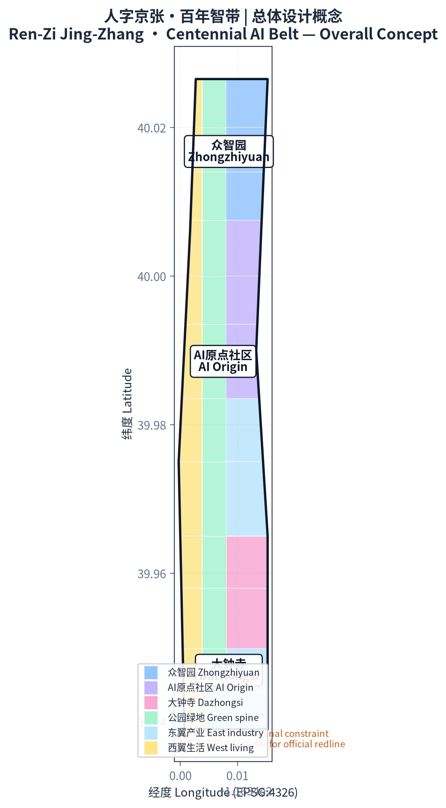
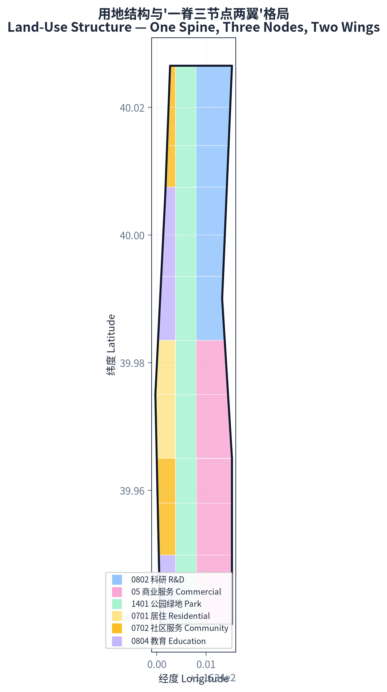
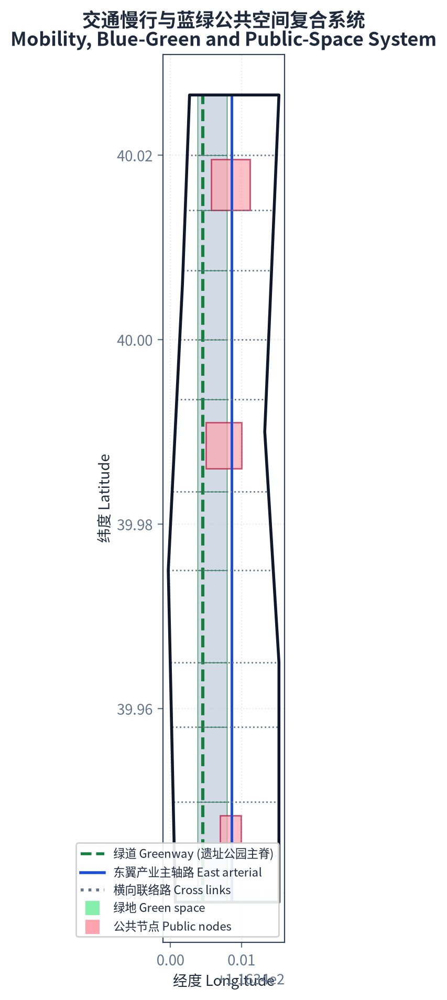
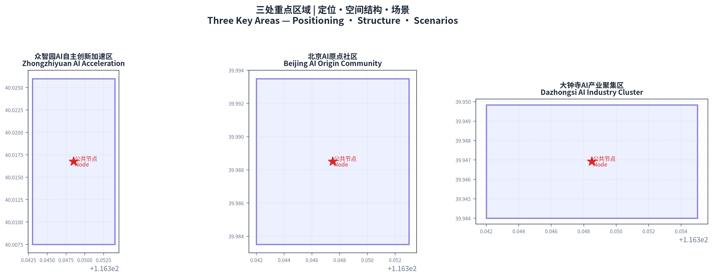
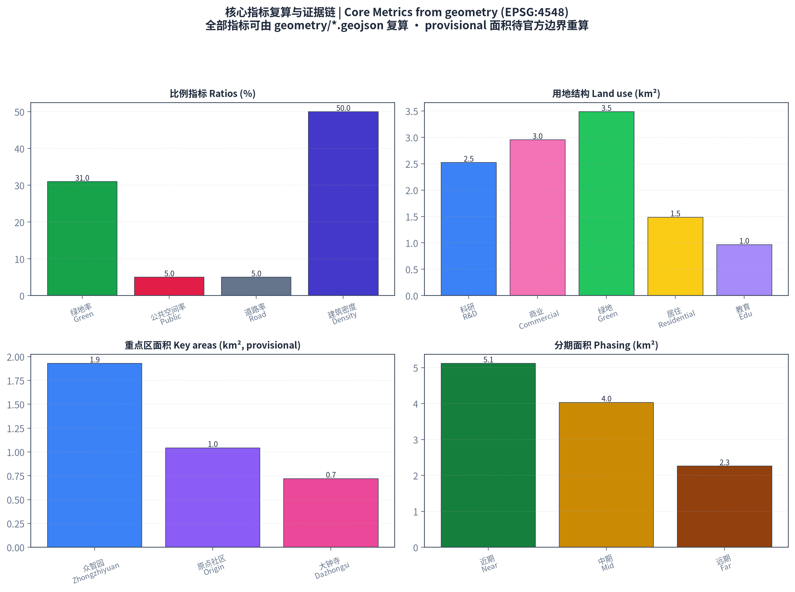

# Ren-Zi Jing-Zhang · Centennial AI Belt

## Design Basis and Source Inventory

This proposal takes the task framework of the official pre-qualification announcement as its overall basis, the open-call taskbook for AI agents as its content checklist, and publicly available planning standards as its professional baseline. Formal bases include: the Pre-qualification Announcement of the International Call for Urban Design of the Centennial Jing-Zhang AI Innovation Belt by Haidian Branch, Beijing Municipal Commission of Planning and Natural Resources (2026-05-09, including project overview, Article 1.3 objectives, Article 1.4 scope, Article 1.5 design tasks) [source:DATA-SRC-OFFICIAL-ANNOUNCEMENT-20260509]; the open-call taskbook excerpt for AI agents worldwide (2026-05-18, including three positionings, five functions, three areas and two wings, and six agent tasks) [source:DATA-SRC-AGENT-TASKBOOK-20260518]; and the principled requirements of professional standards such as the Measures for the Administration of Urban Design, the Measures for the Compilation and Approval of Regulatory Detailed Planning, and the Guide to Land Use Classification for Territorial Spatial Survey, Planning, and Use Control [standard:MOHURD-URBAN-DESIGN-MEASURES] [standard:MNR-LAND-USE-CLASSIFICATION-202311].

The official release does not yet include exact official polygons for the three scope levels and three key areas. This proposal uses the provisional rough polygons provided by repository maintainers as provisional constraints for generation, visualization, and informal area re-check, and clearly labels them as "provisional constraint" in `sources.json`, `assumptions.json`, and all drawings [source:DATA-SRC-PROVISIONAL-BOUNDARIES-20260605]. Once official polygons are released, all precision-sensitive area metrics must be recalculated against the official boundary. The official textual areas of the three scope levels (coordinated research area 43.6km², overall design area 11.4km², key detailed-design area 368.4ha) are cited as planning-level facts [metric:site_area_sqm].

Land-use classification follows the two-level codes of the MNR Guide; research land (0802), commercial/service land (05), residential land (0701/0702), and park green space (1401) are classified accordingly [standard:MNR-LAND-USE-CLASSIFICATION-202311]. All conceptual spatial proposals are open co-creation suggestions; they do not replace statutory planning and do not constitute government-approved conclusions [standard:PROJECT-AGENT-OPEN-CALL-TASKBOOK].

## Three-Level Scope Framework

### Coordinated Research Area (43.6km²)

Bounded by the Fifth Ring Road in the north, Jingzang Expressway in the east, Xizhimen Outer Street in the south, and Wanquanhe Road in the west, the coordinated research area carries the strategic research function of a world-class AI innovation ecosystem. This level answers three questions: the strategic priorities of Haidian's AI industry across the full chain, the future-oriented "AI+" directions, and the regional synergy loop of "three areas, two wings" with "two areas, one belt" [standard:PROJECT-OFFICIAL-ANNOUNCEMENT]. The proposal puts forward a synergy model: the three areas (Zhongzhiyuan, AI Origin Community, Dazhongsi) form a vertical loop of origin-acceleration-agglomeration; the two wings (Zhongguancun technology-service wing, Xiaoyuehe scenario-empowerment wing) provide horizontal support for global factor allocation and scenario empowerment [source:DATA-SRC-AGENT-TASKBOOK-20260518]. Research at this level relies mainly on background public materials and makes no precise area claims [data:geometry/site_boundary.geojson#SITE-001].

### Overall Design Area (11.4km²)

The overall design area covers the 1-2 km urban and industrial belt around the Jing-Zhang Heritage Park, at the urban-design depth of regulatory detailed planning. This level implements the "one spine, three nodes, two wings" overall spatial structure: the Jing-Zhang Heritage Park vitality belt as the north-south spine linking the three key nodes, with the east and west wings carrying technology services and scenario empowerment. The design expresses functional layout through the complete land-use partition in `land_use.geojson`, the transport skeleton in `roads.geojson`, and the blue-green and public-space network in `green_space.geojson` and `public_space.geojson` [data:geometry/land_use.geojson] [data:geometry/roads.geojson].

### Key Detailed-Design Area (368.4ha)

Detailed design at the depth of an integrated implementation plan is provided for the three key areas: Zhongzhiyuan AI Autonomous-Innovation Acceleration Area (192.1ha), Beijing AI Origin Community (104.3ha), and Dazhongsi AI Industry Cluster (72.0ha). Distributed from north to south along the heritage-park spine, the three areas form a vertical innovation chain of "autonomous innovation — original innovation — industrial agglomeration" [data:geometry/key_areas.geojson#PROV-KEY-001] [data:geometry/key_areas.geojson#PROV-KEY-002] [data:geometry/key_areas.geojson#PROV-KEY-003].

Provisional-boundary note: all scope lines in this proposal derive from provisional constraints and are for conceptual generation and display only; they cannot be used for official redlines, precise area claims, or statutory planning control. Re-checked key-area areas (Zhongzhiyuan ~192.9ha, Origin Community ~104.3ha, Dazhongsi ~72.0ha) broadly match the official textual areas but remain provisional [metric:key_area_zhongzhiyuan_sqm] [metric:key_area_origin_sqm] [metric:key_area_dazhongsi_sqm].

## Coordinated Research Area: Industry and Future-City Research

### Belt Concept, Naming and Logo Direction

**Overall concept: "Ren-Zi Jing-Zhang · Centennial AI Belt".** The concept originates from the most symbolic element of the Jing-Zhang Railway — the "Ren" (人, person)-shaped switchback designed by Zhan Tianyou at Badaling Qinglongqiao in 1909, the historical origin of Chinese autonomous innovation. This proposal elevates the "Ren" character from an engineering symbol to an innovation symbol: **people (talent, humanity) and intelligence (AI) support each other as the twin pillars of the innovation belt.** One stroke is talent and creativity, the other is technology and intelligence; their intersection is where innovation happens.

**Naming system:** The primary name is "Ren-Zi Jing-Zhang", with the English identifier "JZ-AI Belt (Ren-Zi Innovation Belt)". The three nodes retain the taskbook names (Zhongzhiyuan, AI Origin Community, Dazhongsi) with Ren-Zi narrative roles; the two wings are named "Zhongguancun Technology-Service Wing" and "Xiaoyuehe Scenario-Empowerment Wing". The whole belt forms a naming and spatial hierarchy of "one belt — three areas (origin · acceleration · agglomeration) — two wings (service · scenario) — multiple nodes (pilgrimage landmarks and scenario nodes)" [source:DATA-SRC-AGENT-TASKBOOK-20260518].

**Logo direction:** Based on the "Ren"-shaped railway switchback, the two rails evolve into two parallel curves — the "talent flow" and the "data flow" — converging at a node symbolizing the point where AI innovation happens, forming an open "Ren" character that echoes the century-old rails and points to human-AI symbiosis. Color suggestion: railway cast-iron black and signal red, layered with Haidian's tech blue and AI data green. The logo is submitted as a conceptual direction; no unauthorized fonts, images, or corporate identities are used [depth:brand_identity_system].

### Five Functions and the Three-Areas-Two-Wings Synergy Loop

The five functions (AI full-stack autonomous-innovation system, world-class AI innovation ecosystem, AI+ scenario-empowerment paradigm, intelligent vibrant AI city, and global voice in AI governance) are spatially realized through the three areas and two wings: Zhongzhiyuan carries the full-stack autonomous-innovation system and governance voice (national AI platforms, standards, safety governance); the AI Origin Community carries the world-class innovation ecosystem (university origin, technology transfer, open-source system); Dazhongsi carries AI-native new business forms (agents, intelligent terminals, content consumption); the Zhongguancun wing carries global factor allocation (capital, IP, global networks); the Xiaoyuehe wing carries scenario testing and vibrant-city experience (AI+ mobility, AI+ public space) [source:DATA-SRC-AGENT-TASKBOOK-20260518]. The three areas form a vertical innovation chain; the two wings provide horizontal support, creating a "vertical origin — horizontal empowerment" synergy loop.

### Global AI Innovation Ecosystem Cases (5-8)

The proposal studies and draws on the following world-class AI ecosystem experiences, all real and publicly documented:

1. **Silicon Valley, USA (Stanford–Sand Hill Road)**: the university-origin, venture-capital-intensive, alumni-network-closed-loop "industry-academia-research-investment" model; suggests Haidian strengthen university origin and capital linkage [source:DATA-SRC-AGENT-TASKBOOK-20260518].
2. **Kendall Square, Boston, USA**: the high-density knowledge district of labs-incubators-HQs around MIT; suggests the AI Origin Community adopt a campus-adjacent, low-disturbance organic renewal model.
3. **one-north, Singapore**: government-led, industry-city integration, garden campus; suggests Zhongzhiyuan build a "garden-type AI innovation block".
4. **King's Cross Knowledge Quarter, London, UK**: station-led urban renewal driving knowledge-industry agglomeration; suggests renewal paths for low-efficiency space around the Heritage Park.
5. **Marunouchi–Shibuya, Tokyo, Japan**: station-city integration and inter-district pedestrian networks; suggests Dazhongsi four-quadrant pedestrian connectivity and transit integration.
6. **Tel Aviv, Israel**: military-technology transfer and dense founder communities; suggests combining safety-governance scenarios with hard-tech incubation.
7. **Nanshan, Shenzhen, China**: fast iteration of hardware supply chain and software ecosystem; suggests Haidian-Shenzhen synergy in intelligent terminals.
8. **Hangzhou, China (Future Sci-Tech City / Yunqi Town)**: platform ecosystems and developer culture; suggests developer-community and open-source operation mechanisms.

These lessons translate into spatial and operational mechanisms: university-origin districts (Origin Community), accelerator clusters (Zhongzhiyuan), station-city nodes (Dazhongsi), and developer-community operations (agent.6 event system) [depth:ai_ecosystem_cases].

## Overall Design Area: Urban Renewal at Regulatory-Planning Urban-Design Depth

### Industry Objectives and Functional Layout

Guided by AI innovation index, talent density, and output scale (as non-committal indicators), the overall design area forms an "R&D — acceleration — application — service" functional chain: education and community functions on the west of the spine (west wing), and research, industry, and commercial services on the east (east wing). The land-use structure is fully expressed by the 36 parcels in `land_use.geojson`, covering the entire boundary without gaps or overlaps [data:geometry/land_use.geojson]. Main land-use shares: research land ~252.3ha, commercial/service land ~295.2ha, park green space ~348.6ha, residential and community services ~148.5ha, education ~96.7ha, with a green ratio of ~31% [metric:land_use_0802_research_sqm] [metric:land_use_05_commercial_sqm] [metric:green_ratio].

### Overall Urban Renewal Framework

The renewal strategy is "preserve heritage, renovate low-efficiency space, build new nodes, stitch broken links": low-efficiency space on both sides of the Heritage Park is renewed through a "campus-district-block" integration model; transit-adjacent areas at Wudaokou, East Qinghua Road West, and Dazhongsi stations undergo integrated renewal; the Dazhongsi station four quadrants focus on stitching pedestrian connectivity. The renewal project list and phasing are expressed in `phasing.geojson`: near-term (2026-2028, ~512.0ha) focuses on low-disturbance renewal of the Origin Community and the connection of the Heritage Park vitality belt; mid-term (2029-2031, ~403.4ha) focuses on Zhongzhiyuan and industrial carriers; far-term (2032-2035, ~225.9ha) focuses on the Dazhongsi cluster and area-wide quality improvement [data:geometry/phasing.geojson]. Phasing areas are recorded in the phasing_near_sqm, phasing_mid_sqm and phasing_far_sqm metrics [metric:phasing_near_sqm].

### Transport, Rail, Municipal Facilities and Public Services

The transport strategy is "strong nodes at rail stations, fine-grained road micro-circulation, connected slow-traffic": Wudaokou, East Qinghua Road West, and Dazhongsi stations serve as integrated hubs; on top of the existing arterial network, branch roads improve micro-circulation; `roads.geojson` arranges a greenway (the slow-traffic spine of the Heritage Park), a secondary arterial (the east-wing industrial main road), and cross links, forming a "one north-south, multiple east-west" network [data:geometry/roads.geojson] [metric:road_ratio]. Municipal and new-infrastructure integration includes distributed energy, edge-computing nodes, and the composite layout of smart poles and sensing networks with conventional utilities; AI industry service facilities and innovation-platform systems are configured at "park — block — node" levels. Exact road redlines, pipelines, and capacities await official data [assumption:A-CONTROLS-001].

### Jing-Zhang Heritage Park Vitality Belt

The north-south and east-west connected slow-traffic system is the core of the belt: the park greenway forms the north-south spine (12 green parcels in `green_space.geojson` forming a continuous green belt of ~348.6ha), connected to the two wings by cross links, with priority on stitching overpass and slow-traffic gaps [data:geometry/green_space.geojson] [metric:green_space_area_sqm]. Signature landscape nodes at the southern and northern ends echo the three AI pilgrimage landmarks. "AI+" public-space scenarios are explored in the park: smart guides, AI sports fields, and developer showcase galleries.

### Urban Character

The urban tone is "memory of the century-old rails and the futurity of the AI era": cultural resources such as Qinghuayuan Railway Station are preserved and reactivated; along the railway corridor, low-rise heritage character prevails; new nodes adopt lightweight, transparent, low-carbon modern architecture with roof-form and massing guidance tied to renewal parcels. Building footprints are expressed in `buildings.geojson` (~401 conceptual footprints, building density ~50%, total floor area ~36.9M m² with an indicative FAR of ~3.23; all conceptual, not approved indicators) [data:geometry/buildings.geojson] [metric:building_density] [metric:total_floor_area_sqm].

## Detailed Design of the Three Key Areas

Each key area is developed at the depth of "positioning + spatial structure + building renewal + transport and slow traffic + public space + AI scenarios + implementation risks" [data:geometry/key_areas.geojson].

### Zhongzhiyuan AI Autonomous-Innovation Acceleration Area (~192.9ha)

**Positioning:** a garden-type AI autonomous-innovation acceleration block hosting national AI platforms, the core of the full-stack autonomous-innovation system and governance voice [standard:PROJECT-OFFICIAL-ANNOUNCEMENT]. **Spatial structure:** "garden in the park" — a central R&D green heart, a northern computing and standards-testing zone, and a southern accelerator cluster, with a waterfront innovation interface along the Qing River. **Building renewal:** a mix of new R&D buildings and renovated existing factories, with garden-permeable and low-carbon facades. **Transport:** external connectivity optimized with the Fifth Ring integration; internal greenway links. **Public space:** integrated design of the R&D green heart and Qing River blue-green space, exploring Qing River culture. **AI scenarios:** national AI platform showcase and full-stack autonomous-innovation validation field (one of the agent.3 test-validation scenarios). **Implementation risks:** external transport and Fifth Ring connection require professional engineering review [data:geometry/key_areas.geojson#PROV-KEY-001].

### Beijing AI Origin Community (~104.3ha)

**Positioning:** a campus-adjacent AI innovation block; the incubation and transfer zone for origin achievements of Tsinghua, Peking University, and CAS; a world-class AI innovation ecosystem [standard:PROJECT-OFFICIAL-ANNOUNCEMENT]. **Spatial structure:** an origin ring around the universities, with incubation blocks along Xueyuan Road and East Qinghua Road, forming "campus — district — block" integration. **Building renewal:** low-disturbance organic renewal, preserving campus-adjacent community fabric, adding achievement showcase/release and residential living support. **Transport:** integrated design at Wudaokou and East Qinghua Road West stations; optimized slow-traffic links between campuses and districts. **Public space:** Xueyuan Road public living room and knowledge-exchange corridor. **AI scenarios:** open-source community plaza, AI talent living room, achievement release center. **Implementation risks:** low-disturbance renewal near campuses requires fine ownership coordination [data:geometry/key_areas.geojson#PROV-KEY-002].

### Dazhongsi AI Industry Cluster (~72.0ha)

**Positioning:** an urban-type AI innovation block; the agglomeration of AI-native and AI+ new business forms (agents, intelligent terminals, content consumption); a world-class intelligent-economy incubation ecosystem [standard:PROJECT-OFFICIAL-ANNOUNCEMENT]. **Spatial structure:** Dazhongsi station as the hub with four-quadrant pedestrian connectivity, high-density industrial agglomeration near the station, and service/commercial support on the periphery. **Building renewal:** functional replacement of potential parcels coordinated with nearby university renewal; composite use of planned green space. **Transport:** optimized Dazhongsi station integration, four-quadrant pedestrian connectivity, and non-motorized parking organization. **Public space:** station-front smart plaza and composite green space. **AI scenarios:** AI-native consumption blocks, data-element circulation showcase, intelligent-terminal experience. **Implementation risks:** station-city integration requires rail and municipal professional review [data:geometry/key_areas.geojson#PROV-KEY-003].

## AI Innovation Ecosystem, Talent Profiles and AI+ Scenarios

### User Personas (5)

1. **AI researchers and engineers**: researchers at universities, institutes, and national labs; need labs, compute, academic exchange, and quiet innovation space.
2. **Founders and developers**: AI startups and open-source developers; need incubators, accelerators, open-source communities, test-validation fields, and funding links.
3. **AI enterprise employees and management**: staff of big tech and unicorns; need high-quality offices, international exchange, work-life balance, and commute efficiency.
4. **Residents and families**: surrounding communities; need parks, daily services, AI+ convenience scenarios, and public activities.
5. **International visitors and developer communities**: global AI talent and attendees; need international exchange venues, cultural experiences, pilgrimage landmarks, and one-stop services.

### AI Scenario Cards (13, including 3 test-validation scenarios)

**SC-01 Jing-Zhang Culture AI Guide**: AR guide in the Heritage Park overlaying century-old railway history with AI innovation stories. Space: Heritage Park vitality belt. Users: residents, international visitors [data:geometry/green_space.geojson].

**SC-02 Smart-Belt Traffic Signal Optimization**: signal timing optimization based on public traffic data and dynamic transit information. Space: main roads of the overall design area. Users: commuters [data:geometry/roads.geojson].

**SC-03 AI+ Health Navigation**: medical guidance, health records, and community health services. Space: west-wing communities. Users: residents.

**SC-04 Enterprise Service Copilot**: AI assistant for policy matching, site selection, and approval guidance. Space: Zhongzhiyuan and Origin Community. Users: founders, enterprises.

**SC-05 Public-Safety Human-Review Support**: auxiliary identification for events and night public space, with human review as backstop. Space: public spaces of the three nodes. Users: operation teams [source:DATA-SRC-AGENT-TASKBOOK-20260518].

**SC-06 Low-Speed Autonomous Delivery**: low-speed autonomous delivery pilots in parks and communities. Space: Xiaoyuehe scenario-empowerment wing. Users: residents, employees.

**SC-07 AI+ Education Lab**: university-linked open AI education labs and youth AI initiation. Space: west-wing education parcels. Users: students, teachers.

**SC-08 AI+ Legal Compliance Sandbox**: compliance testing and rule sandbox for AI governance. Space: Zhongzhiyuan. Users: AI enterprises, governance research bodies.

**SC-09 Developer Open-Source Plaza**: open-source community events, hackathons, and demo pitches. Space: AI Origin Community. Users: developers [depth:developer_community_operation].

**SC-10 AI-Native Consumption Block**: AI-native retail, content consumption, and immersive experiences. Space: Dazhongsi. Users: residents, visitors.

**SC-11 [Test-validation] Full-Stack Autonomous-Innovation Validation Field**: chip-framework-model-application full-stack testing. Space: Zhongzhiyuan [depth:industry_test_scenarios].

**SC-12 [Test-validation] AI Safety and Governance Evaluation Ground**: model safety evaluation and governance-rule testing. Space: Zhongzhiyuan [depth:industry_test_scenarios].

**SC-13 [Test-validation] Low-Speed Autonomous Shuttle Test Loop**: closed and semi-open campus shuttle testing. Space: Xiaoyuehe wing [depth:industry_test_scenarios].

All scenario cards follow privacy protection and human-review principles: no non-public data, no mandatory vendor designation, and test scenarios are not described as approved operations [standard:PROJECT-AGENT-OPEN-CALL-TASKBOOK].

## Land Use, Building Scale and Retain-Renovate-Demolish-New Strategy

The land-use layout combines horizontal organization of "west-wing living — central green spine — east-wing industry" with vertical organization of "origin — acceleration — agglomeration": the west wing hosts residential, education, and community services (~245.2ha), the central spine is the Heritage Park vitality belt (~348.6ha green space), and the east wing hosts research, industry, and commercial services (~547.5ha) [data:geometry/land_use.geojson] [metric:land_use_0802_research_sqm] [metric:land_use_05_commercial_sqm]. Building scale is expressed as conceptual massing: ~401 footprints, ~5.68M m² building footprint, ~36.9M m² total floor area (estimated at 6-8 floors); all conceptual, not approved indicators [data:geometry/buildings.geojson] [metric:building_footprint_area_sqm]. The retain-renovate-demolish-new logic follows "preserve heritage buildings and existing community fabric, renovate low-efficiency industrial space, demolish dilapidated and illegal structures, build new key nodes"; parcel-level conclusions await ownership and survey data [assumption:A-CONTROLS-001].

## Transport, Rail, Municipal Facilities and Public Services

**Road micro-circulation:** branch-road densification and one-way optimization on top of the existing arterial network (the ~1.5-2km spacing of cross links in `roads.geojson` is a conceptual skeleton) [data:geometry/roads.geojson]. **Station-city integration:** Wudaokou, East Qinghua Road West, and Dazhongsi stations with high-density mixed functions within the 800m catchment. **Slow traffic:** the Heritage Park greenway as the main axis linking the three nodes and two wings, stitching overpass gaps. **Parking and non-motorized:** centralized non-motorized parking and interchange at the Dazhongsi four quadrants. **New infrastructure:** distributed energy, edge computing, smart poles, and sensing networks integrated with conventional utilities. Exact pipelines, sections, and capacities await official municipal data [assumption:A-CONTROLS-001].

## Blue-Green Space, Public Space and Urban Character

**Blue-green space:** the Heritage Park vitality belt as the main spine (~348.6ha green space, ~31% green ratio), linked with Qing River and Xiaoyuehe blue-green corridors into a "one spine, two waters" network [metric:green_ratio]. **Public space:** one core public node per key area (`public_space.geojson`, 3 nodes, ~60.5ha, ~5% public-space ratio), layered with AI showcase and test-application functions [data:geometry/public_space.geojson] [metric:public_space_ratio].

### AI Pilgrimage Landmarks and Honor-Display System (3)

1. **"Ren-Zi Origin" Memorial Plaza (north end of the Heritage Park)**: a landscape installation themed on the "Ren"-shaped switchback, commemorating the century-old origin of autonomous innovation, doubling as an AI-achievement honor wall. Conceptual proposal pending professional deepening [depth:ai_pilgrimage_landmarks].
2. **Qinghuayuan Station · AI Origin Light (AI Origin Community)**: reactivate the heritage Qinghuayuan Railway Station with AI-origin milestone honor displays and a developer wall of fame.
3. **Eye of the Smart Belt (Dazhongsi station front)**: an AI-native interactive landmark visualizing the belt's innovation data in real time as the first touchpoint for international visitors.

The honor-display and signage system uses the unified "Ren-Zi Jing-Zhang" brand language; the cultural signage system is clearly distinguished from the belt-wide logo system; all materials are cleared before use [standard:PROJECT-AGENT-OPEN-CALL-TASKBOOK].

### Cultural Narrative

**A three-layer narrative of the century-old Jing-Zhang railway, Zhongguancun, and AI new culture:** layer one, the autonomous-innovation spirit symbolized by the "Ren"-shaped switchback — the first original contribution of Chinese engineers to world railway history; layer two, Zhongguancun's innovation culture from electronics street to national independent-innovation demonstration zone — daring to be first, tolerating failure; layer three, the open-source, co-governed, human-AI symbiosis of AI new culture. Spatially, the three layers correspond to heritage-park historical nodes (memory), the Origin Community and Zhongguancun wing (heritage), and Zhongzhiyuan and Dazhongsi (future), forming a spatial cultural line of "looking back — standing — looking forward" [source:DATA-SRC-AGENT-TASKBOOK-20260518] [depth:culture_narrative].

## Renewal Project List, Implementation Policy and Phasing

### Renewal Project List (conceptual)

1. **Heritage Park vitality-belt connection project** (greenway gap stitching, overpass nodes) — near-term, government + professional teams.
2. **Origin Community low-disturbance renewal** (incubation blocks, talent apartments, achievement release center) — near-term, multiple actors.
3. **Zhongzhiyuan accelerator cluster construction** (R&D green heart, computing and standards-testing zone) — mid-term, government + enterprises.
4. **Dazhongsi station-city integration** (four-quadrant pedestrian connectivity, industrial carrier renewal) — mid/far-term, rail + enterprises.
5. **Xiaoyuehe scenario-empowerment wing pilot** (low-speed autonomous delivery, AI public space) — near-term, enterprise pilots + government regulation.
6. **Smart-belt public service platform** (Enterprise Service Copilot, innovation service platform) — near-term, platform operation.

### Global AI Innovation Event System and Long-Term Operation (agent.6)

**Annual event system (conceptual):** spring "Ren-Zi Jing-Zhang · AI Origin Conference" (origin releases), summer "Smart-Belt Hackathon" (developers), autumn "Jing-Zhang AI Innovation Belt International Forum" (global dialogue), winter "AI Governance and Chinese Practice" (governance topics), plus regular open days. **Brand IP system:** unified "Ren-Zi Jing-Zhang" visual language; event sub-brands distinguished from the belt brand. **Developer-community operation:** the Origin Community open-source plaza as the physical anchor, with online community and offline events linked. **Scenario open operation:** an open-scenario list and application-review mechanism; test-validation scenarios open progressively from "closed — semi-open — open". **Public experience and landmark operation:** landmarks and park scenarios maintained by public operation teams, with dynamic honor displays. **International communication and conversion:** international forums, developer communities, and pilgrimage landmarks as touchpoints, forming a "communication — visit — experience — landing" conversion path [depth:annual_event_system] [depth:conversion_pathway]. All events, investment, policy, and funding arrangements are conceptual suggestions and are not presented as confirmed government arrangements.

## Indicator System, Area Re-check and Compliance Matrix

### Core Indicators (all reproducible from geometry)

- **Site area**: ~1141.3ha (provisional re-check; official textual area 1140ha) [metric:site_area_sqm].
- **Green ratio**: ~31% (green space 348.6ha) [metric:green_ratio].
- **Public-space ratio**: ~5% (public space 60.5ha) [metric:public_space_ratio].
- **Building density**: ~50% (conceptual massing) [metric:building_density].
- **FAR (indicative)**: ~3.23 (conceptual, not approved) [metric:floor_area_ratio].
- **Road ratio**: ~5% (conceptual skeleton) [metric:road_ratio].
- **Key-area areas**: Zhongzhiyuan ~192.9ha, Origin Community ~104.3ha, Dazhongsi ~72.0ha (provisional re-check) [metric:key_area_zhongzhiyuan_sqm].
- **Phasing areas**: near ~512.0ha, mid ~403.4ha, far ~225.9ha [metric:phasing_near_sqm].

Indicator design meaning: a 31% green ratio supports a high-quality district attractive to talent (work-life balance plus blue-green leisure); a 5% public-space ratio supports innovation exchange and AI scenario experience; ~50% building density with FAR ~3.23 supports industrial space supply density (to be revised once regulatory conditions are confirmed).

### Compliance Matrix

`compliance_matrix.json` covers all 15 tasks of Articles 1.3, 1.4, 1.5 and the six tasks agent.1—agent.6; `standard_matrix.json` covers the 5 mandatory professional standards; `design_depth_matrix.json` covers all required design-depth items [source:DATA-SRC-OFFICIAL-ANNOUNCEMENT-20260509] [source:DATA-SRC-AGENT-TASKBOOK-20260518]. All areas, ratios, and scales are reproducible from `geometry/*.geojson` and `metrics.json`.

## Risks, Copyright and Compliance

**Data legality:** all materials come from official public announcements, the cleared taskbook, public standards, and provisional data provided by repository maintainers; no secret maps, non-public tables, or fabricated endorsements [source:DATA-SRC-PROVISIONAL-BOUNDARIES-20260605]. **Copyright and clearance:** cited heritage buildings, cultural cases, and examples are public information; the logo and visual identity are conceptual directions without unauthorized fonts, images, trademarks, persons, or corporate identities. **Privacy:** all AI scenarios respect privacy boundaries and human review, collecting no non-public personal data. **AI generation responsibility:** this proposal is generated by an AI agent; the method and limitations are disclosed in `report/copyright_statement.md`. **Official-approval boundary:** all spatial suggestions are conceptual proposals and reference schemes, not government approval, implementation commitment, investment promise, or engineering-feasibility conclusions [standard:PROJECT-AGENT-OPEN-CALL-TASKBOOK]. **Pending data:** official polygons, regulatory indicators, road redlines, ownership, municipal data, and current-condition baselines await official attachments for recalculation. **Professional review:** all conceptual designs require deepening by professional planning teams before implementation discussion.

## References

The materials listed in this chapter jointly support the design judgments of this proposal; the complete machine index is in `sources.json` and the three matrix files [source:DATA-SRC-OFFICIAL-ANNOUNCEMENT-20260509] [source:DATA-SRC-AGENT-TASKBOOK-20260518].

1. Pre-qualification Announcement of the International Call for Urban Design of the Centennial Jing-Zhang AI Innovation Belt, Haidian Branch, Beijing Municipal Commission of Planning and Natural Resources, 2026-05-09.
2. Open-call taskbook excerpt for AI agents worldwide on the Centennial Jing-Zhang AI Innovation Belt, 2026-05-18.
3. Measures for the Administration of Urban Design, MOHURD, 2017.
4. Measures for the Compilation and Approval of Regulatory Detailed Planning, MOHURD.
5. Guide to Land Use Classification for Territorial Spatial Survey, Planning, and Use Control, MNR, 2023.
6. Regulation on Depth of Architectural Design Documents (2016 Edition), MOHURD.
7. Provisional rough polygons of the three scope levels and three key areas, repository maintainers, 2026-06-05.
8. Public materials on Jing-Zhang Railway history and cultural heritage such as Qinghuayuan Railway Station.
9. Public materials on global AI innovation ecosystems (Silicon Valley, Kendall Square, one-north, King's Cross, Marunouchi, Tel Aviv, Nanshan, Hangzhou).
10. Professional-depth reference of the 2016 Edition depth regulation.
