# CENTENNIAL JINGZHANG AI INNOVATION BELT: URBAN RENEWAL AND DELIVERY PROPOSAL

This proposal organises spatial structure, key-district renewal, public-service improvements and near-term projects along the Jingzhang railway heritage corridor. The immediate management task is to verify formal boundaries, land and building tenure, rail safety, transport, underground utilities, fire conditions, capital funding and operating bodies before fixing project scope and sequence. The working program covers three key districts, six near-term projects and a rolling 0–24 month delivery window.

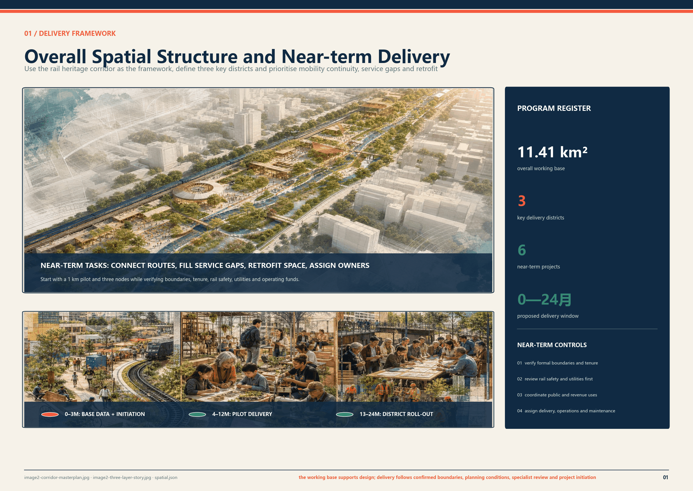

## Priority Delivery Issues

| Issue | Management response | Near-term task | Output |
|---|---|---|---|
| Formal boundaries, tenure and current conditions are incomplete | Use current layers as a working base only | Verify redlines, title, leases, active projects and building use | Shared base map, tenure register, building register |
| Walking and cycling links are discontinuous | Start with a 1 km segment where prerequisites can be resolved | Complete transport survey, rail-safety coordination, utility and tree survey | Pilot implementation plan and specialist briefs |
| Public amenities lack a combined delivery and operating owner | Link location, staffing, annual funding and maintenance in one package | Select three first nodes and confirm utility access and rosters | Site schedule, facility list and operating-duty register |
| Key districts require different renewal methods | Prepare a separate project list for each district | Review tenure, fire, passenger flow, industry demand and business conditions | Three project lists and prerequisite lists |
| Existing space can host services before major redevelopment | Prioritise ground-floor retrofit, time sharing and demountable facilities | Inventory available ground floors and underused plots | Retain-repair-retrofit register and shared-use terms |
| Public AI services lack consistent project administration | Require an owner, human route, data rule, stop authority and complaint channel | Prepare service briefs, joint-review forms and operating records | Twelve-service list and eight review conditions |

## Near-term Delivery Schedule

| Window | Main task | Proposed lead type | Coordination | Output |
|---|---|---|---|---|
| 0–3 months | Establish program coordination and complete core evidence | District renewal mechanism and implementation coordinator | Planning, development, construction, transport, subdistricts and rightsholders | Shared base, issue list, tenure register and project reserve |
| 2–6 months | Develop the 1 km pilot and three first nodes | Coordinator and design team | Rail, transport, fire, utilities, landscape, accessibility and operators | Implementation plans, opinions, cost and operating plans |
| 4–12 months | Start the pilot, service-node prototype and public-AI management system | Delivery, subdistrict and operating bodies | Contractors, supervision, rightsholders, communities and users | Construction documents, completion records and handover |
| 7–24 months | Roll out district projects by readiness | District implementation bodies | District departments, rightsholders, park or station operators | District project lists, annual capital plans and acceptance registers |
| Continuing | Inspect facilities, services, spending and public feedback | Operators and program coordinator | Subdistricts, evaluators and user representatives | Monthly work orders, quarterly reports and annual adjustment list |

## Design Basis and Source List

The submission addresses the three planning scales set by the open-call taskbook: a 43.6 km² coordinated research area, an approximately 11.4 km² overall design area, and the three key districts of Zhongzhiyuan, Beijing AI Origin Community and Dazhongsi. The public notice states the district names and approximate areas but does not publish official extents. The submitted `SITE_BOUNDARY` and `KEY_AREA` layers therefore serve as working geometry and are recorded as `official_boundary=false` and `geometry_role=provisional_constraint`.[source:OFFICIAL-ANNOUNCEMENT] [source:SITE-PACKAGE] [assumption:A-BOUNDARY-001]

The scheme uses four evidence statuses:

| Status | Definition | Typical content in this package | Use rule |
|---|---|---|---|
| Published fact | Directly stated by the notice, taskbook or an official public source | Three planning scales, district names and published areas | Preserve source ID and original unit |
| Recalculation | Computed from submitted spatial data or a registered public dataset | Working-base area, concept blue-green ratio and climate baseline | State formula, coordinate system and confidence |
| Proposed target | A comparison value for later specialist design | Clear widths, rest-point spacing and shade target | Mark as unbuilt; never present as existing performance |
| Unknown | Current evidence cannot support a professional conclusion | Official redlines, tenure, FAR, building-by-building condition and utility capacity | Keep unknown and register it as a precondition |

Methods were reviewed from Paris proximity planning, Vienna inclusive planning, Punggol institutional co-location, Smart Kalasatama agile pilots, Barcelona public-space restructuring, Kendall Square mixed use and Paris-Saclay integration of research and daily life. They inform facility reuse, complex trip chains, co-testing and public-realm organization. Beijing statutory planning and specialist review remain the basis for local controls.[source:CASE-VIENNA-GENDER] [source:CASE-PUNGGOL] [source:CASE-KALASATAMA]

## Public-Service Assurance Requirements

Public-space projects must secure continuous access, basic amenities and maintainable assets. Children, older people and disabled users must be able to reach services independently or with reasonable assistance. Drinking water, rest, wayfinding and consultation retain staffed or physical routes. Before opening, the delivery body publishes the operator, hours, fees, repair channel and emergency arrangement.

Public AI services follow a project register. Each application records users, location, owner, staffed route, necessary data, retention, fault switching, stop authority, complaint route and review date. The twelve proposed services have completed a scheme-stage rule review; actual owners must still confirm organisation, funding, technical and specialist conditions before implementation.[data:visual/assets/growth-runbook.json] [data:visual/assets/growth-tabletop-evidence.json]

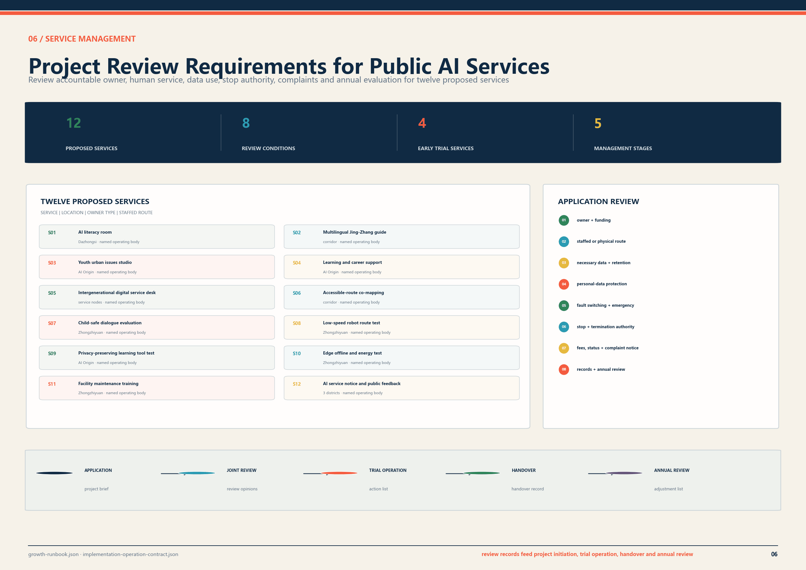

## Three-Level Scope Framework

| Scale | Main task | Scheme output | Condition for the next stage |
|---|---|---|---|
| 43.6 km² coordinated research area | Relate industrial coordination, talent services, transport and facility operations | Five cross-district tasks, a base-data list and annual work program | Lead types, supporting bodies, funding routes and annual outputs |
| Approx. 11.4 km² overall design area | Organize urban structure, mixed functions, walk-cycle links, blue-green space and renewal sequence | One spine, three districts, two interfaces, twelve service nodes and six concept zones | Official boundaries, regulatory controls and existing-condition surveys in one base map |
| 368.4 ha across three key districts | Define spatial designs and projects that can start | Zhongzhiyuan validation field, AI Origin shared ground floor and Dazhongsi station-city public-hall interface | Tenure, transport, fire, utilities, accessibility and operations agreements pass review |

The three scales respectively address regional interfaces, regulatory-plan-level urban design and project-oriented design of key districts. One spatial base, one metric vocabulary and one set of delivery gates maintain continuity between scales.[depth:three_level_scope_framework]

## Coordinated Research Area: Industry and Future City Research

Five regional interface types organize cooperation. Universities and open-source communities provide research questions and public methods. Companies and testing bodies undertake engineering verification. Communities and public-service bodies register daily service needs. Station and transport bodies check interchange and safety conditions. Landscape, utilities and maintenance bodies assess lifecycle input. Each interface records its input, output, owner, entry condition and exit condition.[data:visual/assets/regional-collaboration-ledger.json]

Annual coordination covers R&D and safety evaluation, campus-community training, technology-transfer services, station-city public services and blue-green operations. Each task records a lead type, supporting bodies, annual deliverables, funding and filed outputs. The district program should maintain a planning account, schedule account and funding account so that construction and long-term operations remain aligned.[depth:overall_spatial_structure]

Project initiation includes five baseline surveys: enterprises and employment, talent and family services, time-of-day commuting and interchange, existing buildings and leases, and blue-green and utility capacity. Responsible bodies update these datasets annually and use them to adjust service provision, project priorities and funding plans.[source:PROCESSED-FACT-PACK] [metric:osm_context_feature_count]

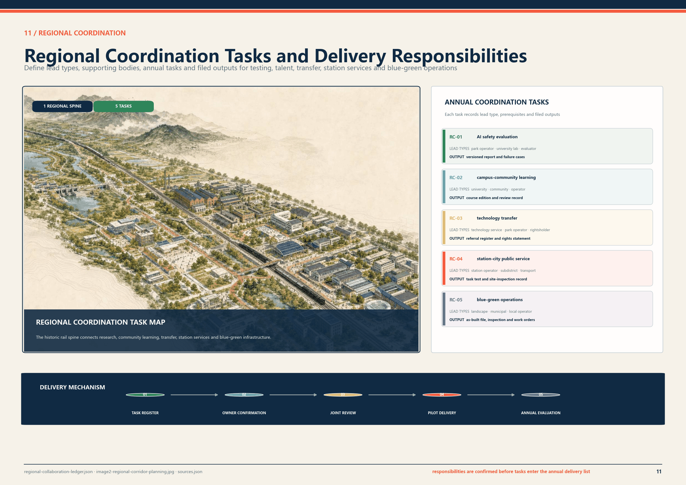

## Overall Design Area: Urban Renewal and Regulatory-Plan-Level Urban Design

The overall structure is “one spine, three districts, two collaborative interfaces and multiple supporting nodes.”

- The Jingzhang public-space corridor uses the railway heritage route to close gaps in walking, cycling, canopy, stormwater, public services and cultural information.
- The three key districts specialize in controlled validation, community-based innovation and station-city public service.
- East-west interfaces connect Zhongguancun technical services and Xiaoyue River application resources through accountable project interfaces.
- Twelve public-service nodes provide human assistance, rest, drinking water, charging, paper wayfinding, maintenance and service notices.

The working geometry recalculates to 11,412,825.386 m². This supports scheme-layer checks; the competent authority determines the official overall design extent.[data:geometry/site_boundary.geojson#SITE-001] [metric:site_area_sqm]

## Land Use, Building Scale, and Retain-Renovate-Demolish Strategy

Six renewal-unit types organise the working base: R&D and safety review; talent housing and daily amenities; education, training and technology transfer; rail culture and public services; digital services and commercial amenities; and blue-green space and utilities. Each records retrofit, new uses, facility additions and delivery conditions. Statutory use, development intensity and compatibility are confirmed through regulatory and renewal implementation planning.[data:geometry/land_use.geojson#LU-01] [standard:MNR-LAND-USE-CLASSIFICATION-GUIDE]

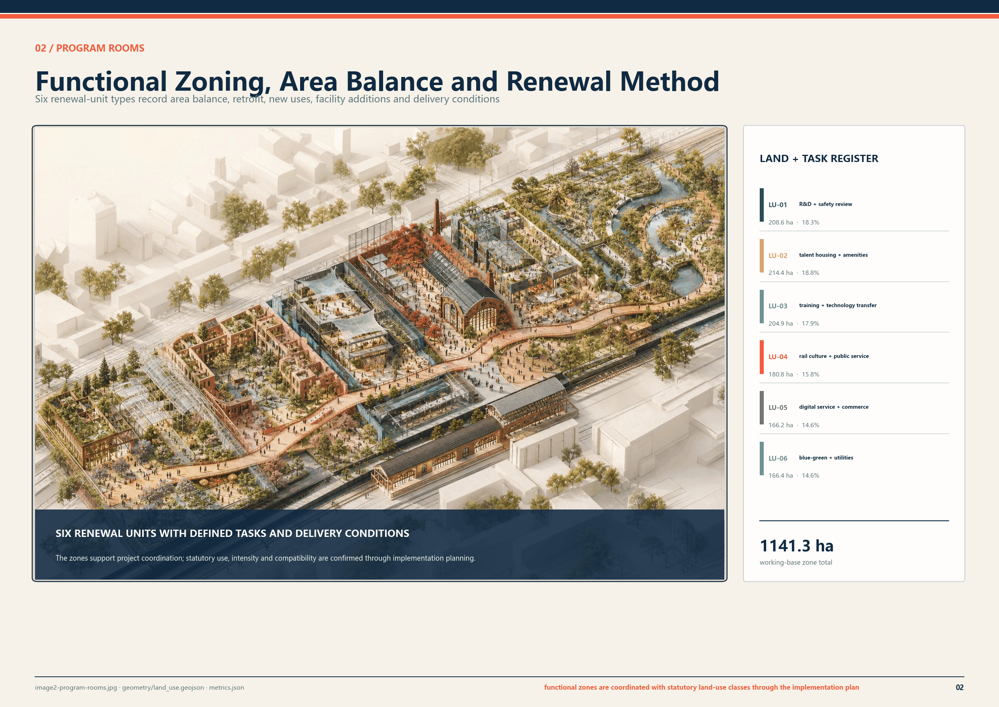

Building renewal follows survey, evaluation, classification and delivery. A building-by-building survey records tenure, use, floors, structure, fire safety, heritage value and operating condition. The later classification will identify retention, repair, adaptive reuse, partial renewal or necessary removal. The current building layer describes concept grain within the three districts and does not make building-level treatment decisions. Early work prioritizes light ground-floor adaptation, time-sharing of idle space, demountable facilities and public-frontage improvement.[data:geometry/buildings.geojson#BLDG-01-01] [depth:retain_renovate_demolish]

FAR, height, density, setbacks, parking provision and utility capacity remain unknown pending regulatory planning, the urban-renewal implementation scheme and specialist studies.[metric:floor_area_ratio] [assumption:A-CONTROLS-001]

## Detailed Design of Key Areas

All three districts use the same technical structure. Published and recalculated areas are shown together; each first move has a program budget; reuse proposals state their survey preconditions; opening and stop conditions are registered side by side.[depth:three_key_area_detailed_design] [data:geometry/key_areas.geojson]

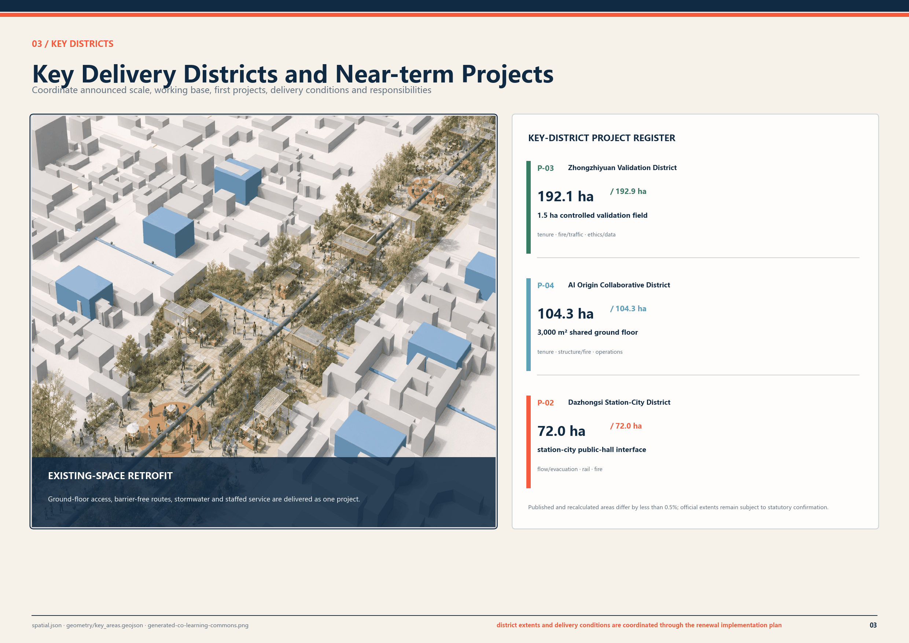

### 6.1 Zhongzhiyuan Innovation Validation District

The public notice gives approximately 192.1 ha; the working polygon recalculates to 192.92 ha. The district is assigned controlled testing, public review and facility-maintenance functions. A 1.5 ha first-stage validation field allocates 3,200 m² to controlled testing and safety buffer, 900 m² to public review and notice, 1,200 m² to maintenance training, 2,800 m² to rain garden and ecological buffer, and 6,900 m² to the 8-80 test loop, fire access and logistics.

The field uses reversible construction and retains existing circulation and basic public service. Candidate buildings are selected only after tenure, structural and fire checks. No removal proposal is made before the existing-condition survey. Opening requires a site permit, transport and fire review, ethics and data review, safety assessment and independent test admission. A major incident or two failed remedy rounds triggers a stop and independent review.

### 6.2 Beijing AI Origin Collaborative Innovation District

The public notice gives approximately 104.3 ha; the working polygon recalculates to 104.32 ha. The district supports learning, open release, talent services and family support. A 3,000 m² shared-ground-floor first stage assigns 900 m² to learning and assembly, 600 m² to open release and short-term display, 520 m² to human talent and family services, 680 m² to shared work and small prototypes, and 300 m² to support, accessibility and fire adjustment.

Time-sharing and light adaptation govern the shared ground floor. Tenure, lease, building safety, fire review and the operating agreement must be confirmed first. Published information includes opening hours, fees and human-service availability. If conditions for a permanent adaptation are absent, the project reverts to temporary activities and short-term sharing.

### 6.3 Dazhongsi Station-City Integration District

The public notice gives approximately 72.0 ha; the working polygon recalculates to 72.05 ha. The district supports interchange, city information, human service and public stay. The first study covers an approximately 2.4 ha station-city public-hall interface, improves four-way pedestrian access, adds two human-service points, multilingual physical wayfinding and 8-80 stay facilities, and links to the Innovation Spine pilot.

Delivery proceeds through passenger-flow and evacuation analysis, confirmation of rail-safety interfaces, tenure and commercial operating agreements, wayfinding and paving improvement, and service-node construction. If evacuation, passenger flow or rail safety does not pass review, wayfinding and human service may proceed while spatial expansion stops.

## Transport, Rail, Municipal Infrastructure, and Public Services

The transport design is checked against slower movement, limited wayfinding capacity and luggage-carrying situations. The Innovation Spine pilot proposes at least 3.0 m continuous clear walking width, at least 4.0 m two-way cycle width and no more than 150 m between effective rest points. These are scheme targets. Detailed design will adjust the combination to road redlines, rail safety, fire access, utilities and existing trees.[source:BEIJING-WALK-CYCLE-STANDARD] [metric:pilot_walk_clear_width_target_m] [metric:rest_point_spacing_target_max_m]

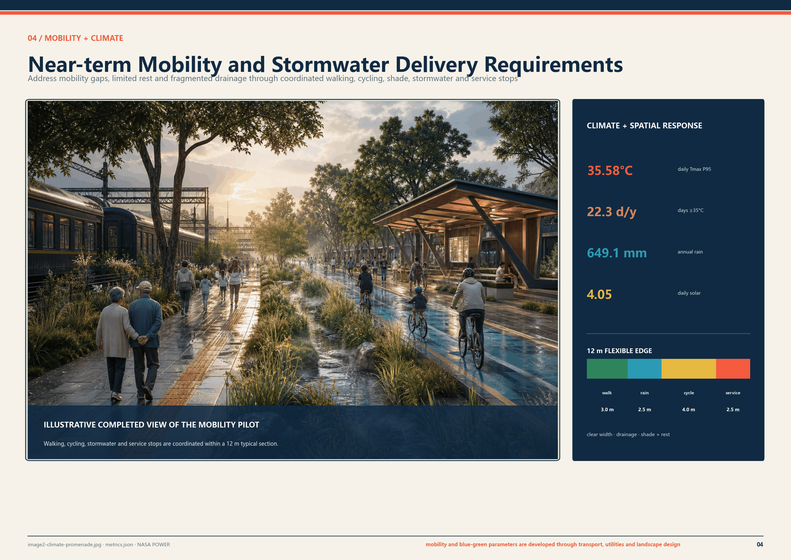

## Blue-Green Network, Public Space, and Urban Character

The blue-green public-space system provides shade, stormwater control, continuous rest and ecological education. NASA POWER daily data for 2015-2024 provides a concept-stage climate baseline: daily Tmax P95 is 35.58°C; the annual mean number of days at or above 35°C is approximately 22.3; annual precipitation is approximately 649.1 mm; and mean solar radiation is 4.05 kWh/m²/day. The scheme adds continuous shade, rain gardens, safe overflow, winter sun and wind shelter, and maintainable facilities. Field monitoring and specialist models will determine detailed water, thermal, wind and energy parameters.[source:NASA-POWER-2015-2024] [source:BEIJING-SPONGE-CITY] [depth:blue_green_public_space]

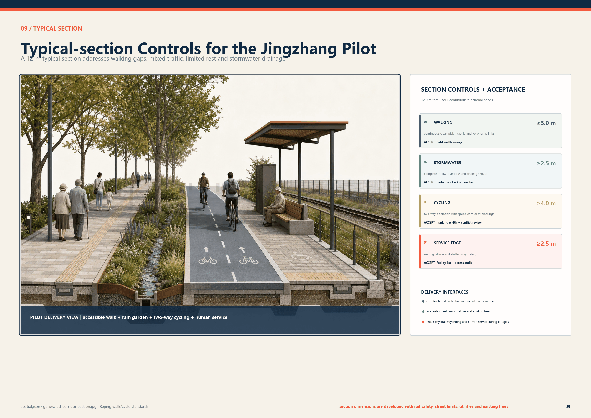

## Public-Service Node Standard

Each node is proposed at 250-400 m² and uses demountable components. A node includes 24-36 m² of human-service space, shaded stay, drinking water, charging, a paper map, service notices and a rain garden. Basic functions remain available while the network, power or digital service is unavailable. Construction requires underground-utility, fire, accessibility, connection, site-permit and maintenance-responsibility checks.

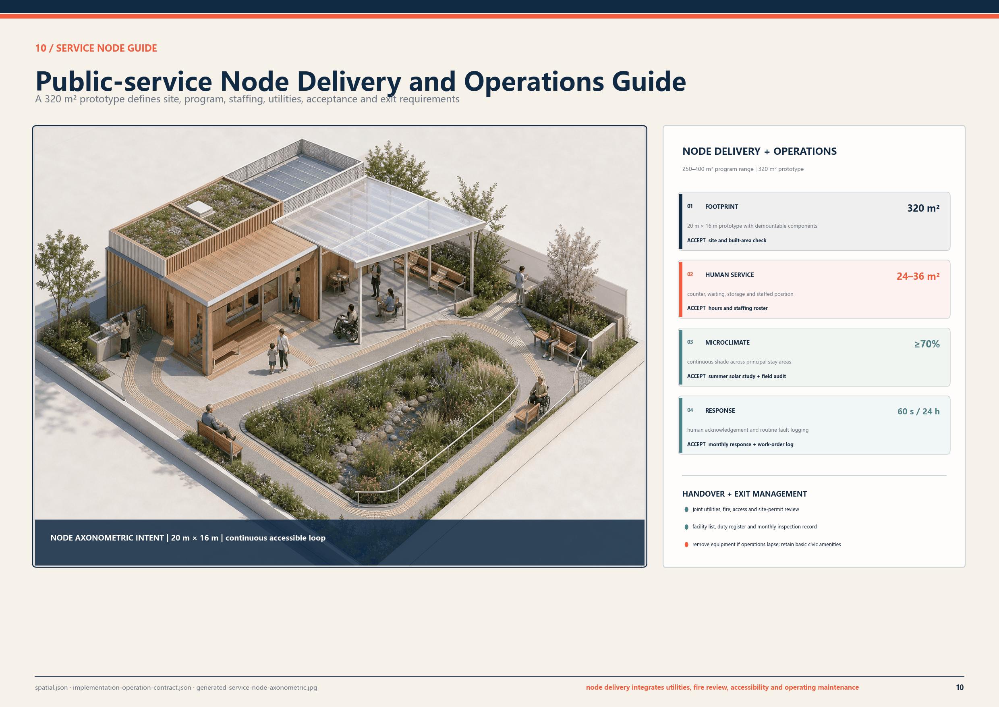

## AI Innovation Ecosystem, User Profiles, and AI+ Services

Each proposed service records users, location, owner type, staffed route, necessary data, stop authority, public notice and annual review. Four services enter near-term trial operation; the remainder proceed only when site, staffing, funding and specialist-review conditions are ready.

| ID | Service and location | Delivery and operating requirement | Staffed route and adjustment condition |
|---|---|---|---|
| S01 | AI literacy interaction at Dazhongsi | No face or identity collection | On-site educator and physical exhibit; stop if content risk remains open |
| S02 | Multilingual Jingzhang cultural guide | Voluntary language choice; no visitor profile | Human guide and paper map in parallel |
| S03 | Youth urban-issues studio at AI Origin | Anonymous issue cards | Teacher or community mentor reviews before publication |
| S04 | Learning and career assistance | Local, short-lived session; excluded from formal assessment | Teacher or adviser review; transfer to a person |
| S05 | Cross-generation digital service desk | Account-free service; minimum work-order data | Face-to-face support and paper process |
| S06 | Accessible-route co-mapping | Voluntary barrier point; aggregated publication only | Accessibility adviser review; contributor may withdraw |
| S07 | Child-safe dialogue-system evaluation | Synthetic data first | Guardian and ethics lead may stop immediately |
| S08 | Low-speed robot route test | Device operating data only; define time and test boundary | On-site safety operator; physical bypass remains open |
| S09 | Privacy-preserving learning-tool test | Voluntary sample; minimized input | Teacher review; separated from formal assessment |
| S10 | Edge-offline and energy test | Device performance data | Engineer sign-off; failed device leaves public space |
| S11 | Facility-maintenance training | De-identified work order | Professional review and public repair manual |
| S12 | Service notice and public feedback | Aggregated evidence; no individual ranking | Independent review, expiry date and published response |

Medical, legal, educational and public-safety output remains assistive and is reviewed by qualified professionals. The public service notice states purpose, users, data, accountable body, human route, fault status, complaint method and exit date.[source:PRINCIPLE-UNHABITAT] [data:visual/assets/growth-runbook.json]

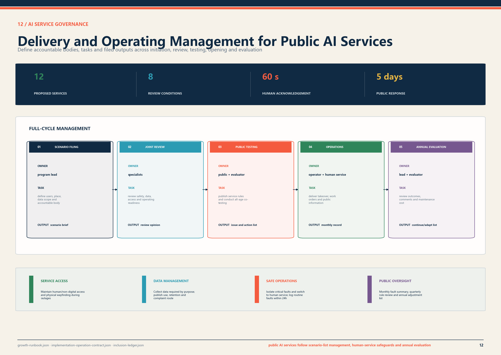

## Public-Interest and Inclusion Incidence

The project survey covers nine groups: children and families; older people and carers; disabled people; long-term residents; renters and small businesses; students and young talent; commuters and visitors; frontline workers; and nearby institutions. Before initiation, each project records access barriers, facility needs, construction effects, rent and business effects, staffed-service needs and participation comments in an issue-and-action register.

Participation includes scheme notice, site visits, priority-user walk-throughs, construction notice, comment registration and a published response. Projects affecting children, disabled people, renters or frontline maintenance staff require a focused walk-through during feasibility work, with adoption and non-adoption reasons filed in the project record.[data:visual/assets/inclusion-ledger.json] [data:visual/assets/user-cotest-plan.json]

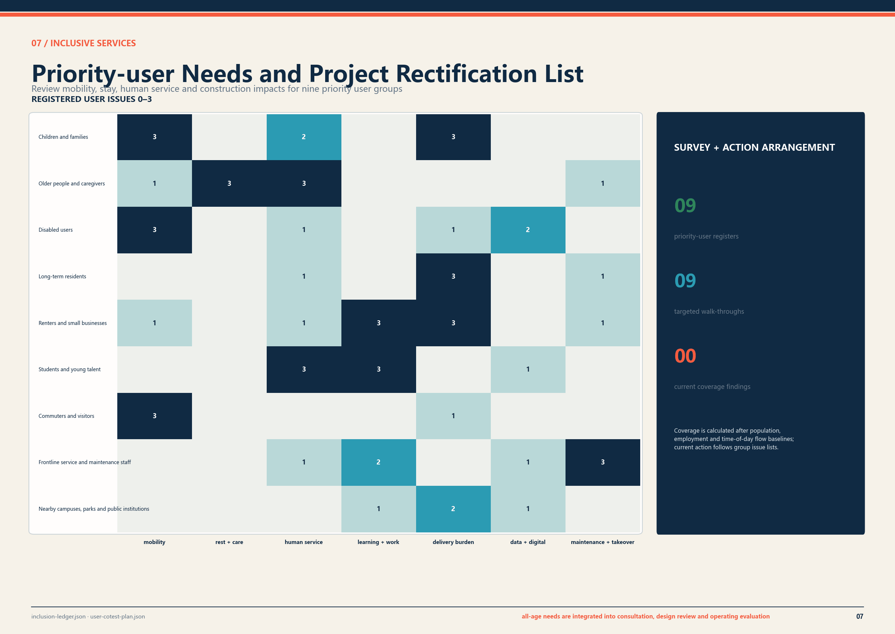

## Public-space Identity and Wayfinding

“京张共长线 / GROW WITH JINGZHANG” is the public communication name. Government initiation titles, statutory place names, approved construction-project names and operator names are displayed separately. The system has three levels: district gateways, directional wayfinding and service confirmation, covering routes, amenities, staffed-service locations, opening hours and repair contacts.

Public orange is reserved for service entry, warning and exit. Rail ink carries the primary structure, canopy green identifies blue-green commons, and evidence blue identifies data and recalculation. The scheme identity does not replace statutory place names, approved project names or operator names.

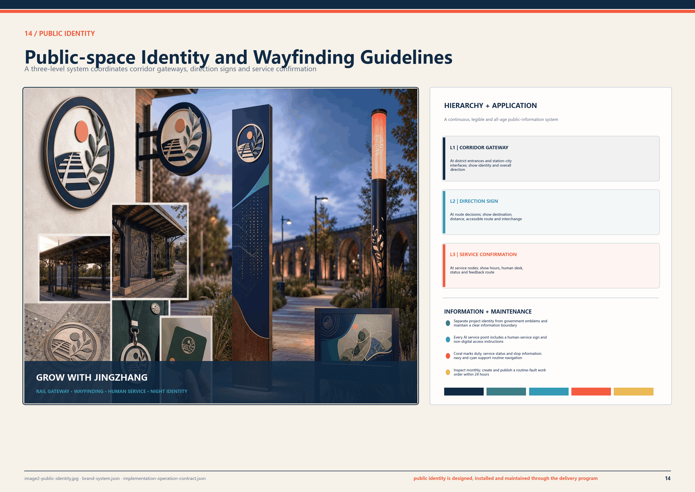

## Renewal Projects, Implementation Policy, and Phasing

The six packages are the Jingzhang mobility pilot, Dazhongsi station-city connection project, Zhongzhiyuan R&D test field, AI Origin shared ground floor, a public-service-node prototype and the public-AI service management system. Cost classes S, M and L support project-reserve comparison only: below CNY 5 million, CNY 5–20 million and CNY 20–50 million. Feasibility study, design estimate and fiscal review determine investment.

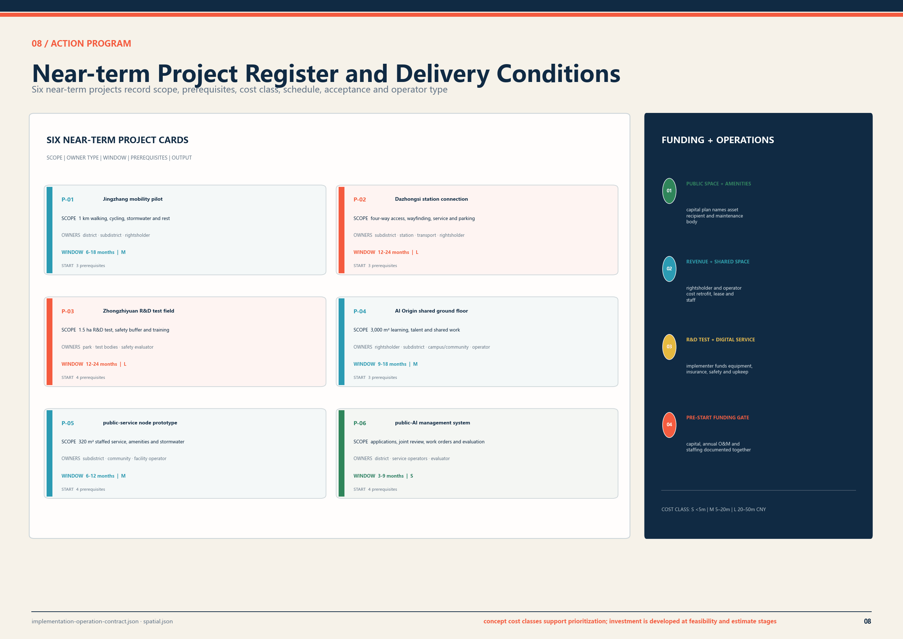

| Gate | Pass condition | Stop or return condition |
|---|---|---|
| G0 Evidence lock | Boundary, tenure, existing conditions, sources and gaps registered | Source, authorization or responsible body cannot be identified |
| G1 Feasibility and negotiation | Affected groups, maintenance owner, human route and burden treatment recorded | Major burden, operating budget or maintenance duty unresolved |
| G2 Specialist review | Transport, rail, fire, utilities, accessibility, data and scenario admission complete | Any statutory or safety interface fails |
| G3 Acceptance and opening | Engineering acceptance, staff training, emergency stop and degraded-mode drill complete | Human takeover, emergency capacity or public receipt absent |
| G4 Annual review | Public report covers performance, burden, faults, maintenance and feedback | Adjust, scale down or exit when thresholds are missed |

One technology supplier may not undertake implementation, acceptance and objection adjudication at the same time. Each package names responsible, accountable, consulted and informed parties, together with maintenance cycles and exit conditions.[data:visual/assets/implementation-operation-contract.json]

## Ninety-Day Pre-initiation Work Program

Days 0–15 complete boundary, tenure, current-building, user and responsible-body lists. Days 16–45 cover site surveys, option comparison, operating-cost review and specialist coordination. Days 46–75 test service procedures, fault switching, construction impacts and emergency response. Days 76–90 close actions and issue an implementation recommendation.

Participants include program, delivery and operating bodies; transport, rail, fire, utilities, landscape and accessibility specialists; rightsholders, communities and affected users. Meeting minutes, site issue sheets, specialist opinions, capital and operating estimates and action-closure records form the project-initiation evidence.[data:visual/assets/user-cotest-plan.json]

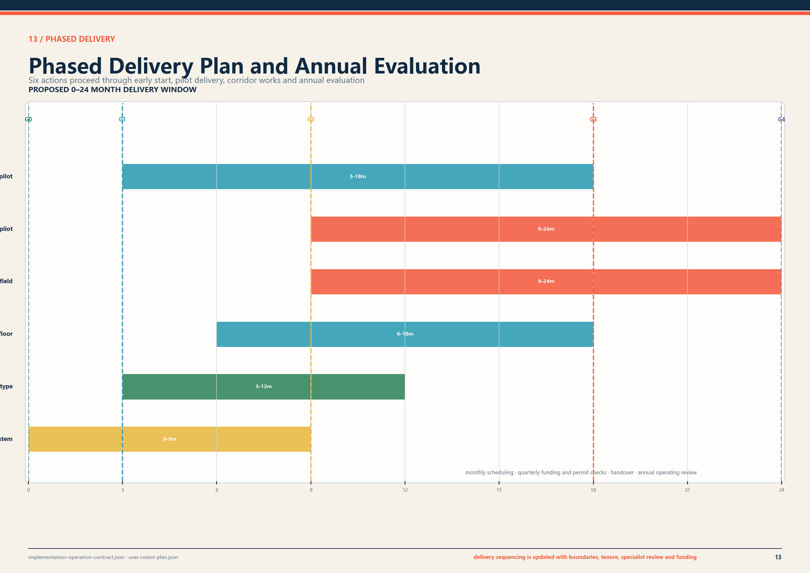

## Metrics, Area Recalculation, and Compliance Matrix

Metrics are divided into working-base recalculations, concept-scheme recalculations, proposed controls, operating targets and tabletop results. The figure records current status, measurement method and owner. Items that have not been surveyed or operated remain unknown.[metric:green_ratio] [metric:public_space_ratio] [depth:metrics_recalculation]

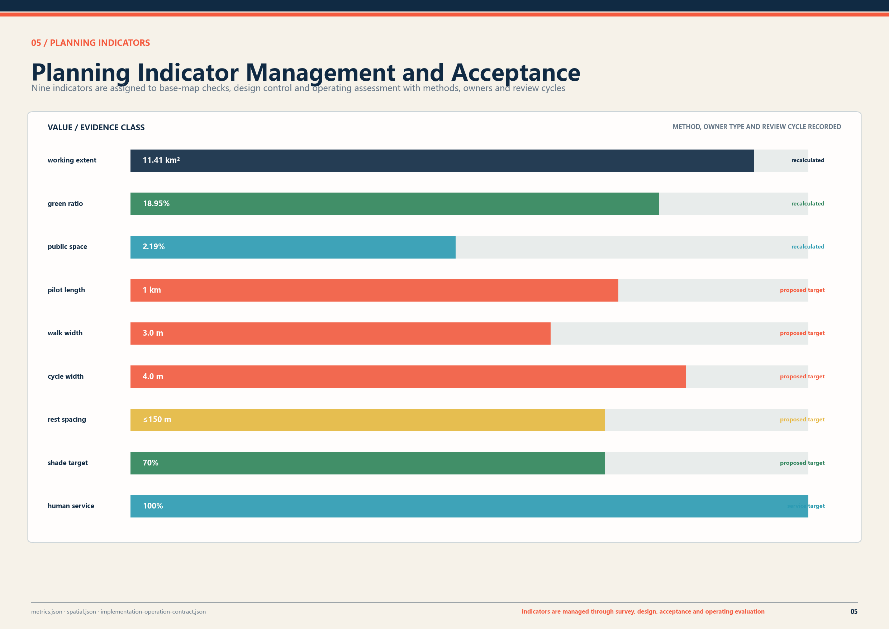

| Metric | Value or status | Attribute | Measurement and review |
|---|---:|---|---|
| Overall-design working base | 11.4128 km² | Recalculation | EPSG:4548 area; official value by competent authority |
| Concept blue-green ratio | 18.95% | Scheme recalculation | Union of layer areas divided by working-base area |
| Continuous clear walking width | ≥3.0 m | Proposed, unbuilt | Segment measurement at the narrowest point |
| Two-way cycle clear width | ≥4.0 m | Proposed, unbuilt | Drawing review and as-built measurement |
| Effective rest-point spacing | ≤150 m | Proposed, unbuilt | Measurement along the continuous accessible route |
| Shade at principal stay spaces | ≥70% | Proposed, unbuilt | Design-hour solar analysis and site spot check |
| Human service availability | 100% | Operating target, unbuilt | Monthly checks against published service hours |
| Protocol-valid services | 12/12 | Tabletop result | Check every service against eight admission rules |
| Negative tests rejected | 8/8 | Tabletop result | Inject defect and confirm expected rejection rule |

## Risk, Copyright, and Compliance

The risk ledger covers boundary and tenure, rail and transport, privacy and minors, accessibility, operations, climate and drainage, commercial displacement, and asset rights and claims. Each entry records trigger, mitigation, stop condition and later owner. Human routes, basic public amenities and objection channels remain available throughout delivery.[data:risk.json]

Figures, PDFs and webpages are generated locally from structured data. OpenStreetMap context follows ODbL 1.0 with contributor credit; NASA POWER supports concept climate analysis; Blender, Three.js and generated scenes support scheme communication. `sources.json`, `rights-clearance-ledger.json` and the copyright statement record source, transformation, licence condition and claim boundary.[source:OSM-CONTEXT-20260808] [source:NASA-POWER-2015-2024]

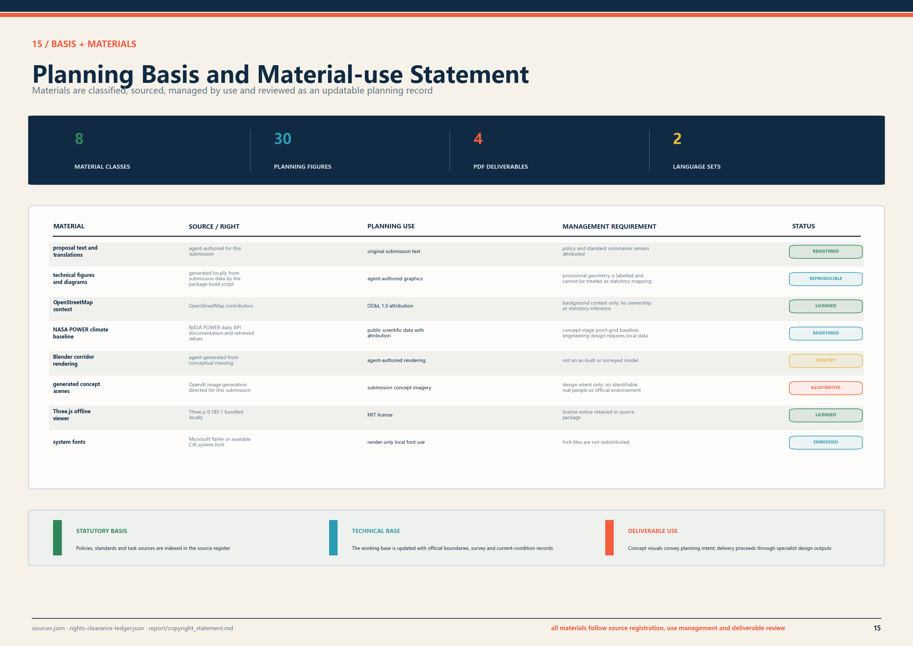

The next evidence package requires official overall and key-district boundaries, topographic survey, road and parcel redlines, building and tenure survey, heritage controls, utility alignments and capacity, fire and transport models, time-based station passenger flow, current accessibility barriers, detailed hydrology and soil data, and public-participation records. Once incorporated into the shared base map, the team will recalculate the land balance and metrics and prepare a scheme suitable for planning review, feasibility study and engineering design.

## References

The task basis consists of the open-call notice, agent taskbook, repository site package, source registry and processed fact navigation.[source:OFFICIAL-ANNOUNCEMENT] [source:AGENT-TASKBOOK] [source:SOURCE-REGISTRY]

Urban renewal, walking and cycling, accessibility and climate adaptation refer to the Beijing Urban Renewal Regulation, Beijing walk-cycle planning and design standards, the national Accessibility Environment Construction Law, and Beijing sponge-city and resilient-city standards. Qualified teams will confirm applicable clauses and parameters during project initiation and specialist design.[source:BEIJING-URBAN-RENEWAL-REGULATION] [source:ACCESSIBILITY-LAW-2023] [source:BEIJING-SPONGE-DESIGN-STANDARD]
