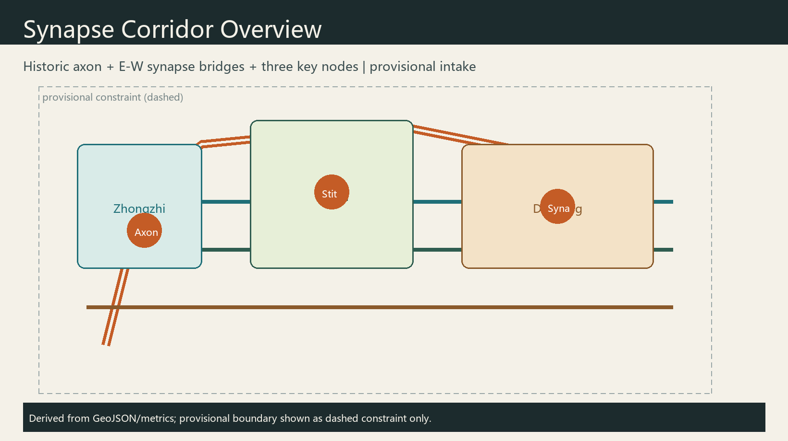
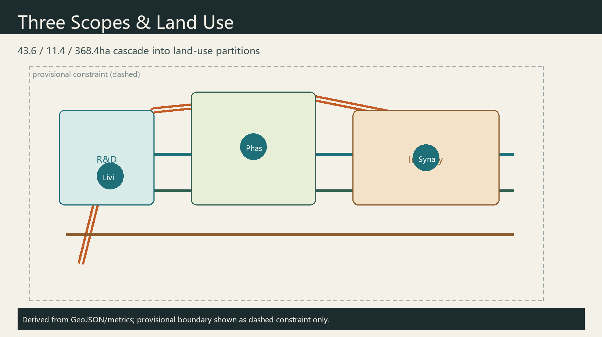
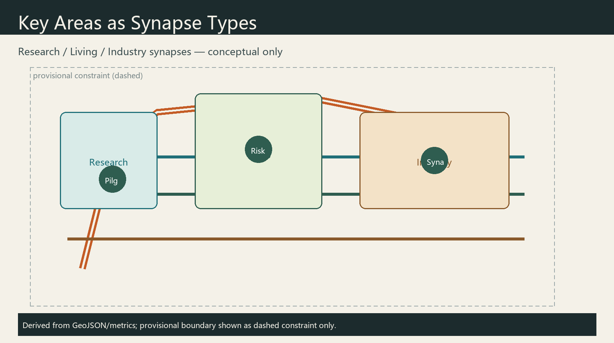
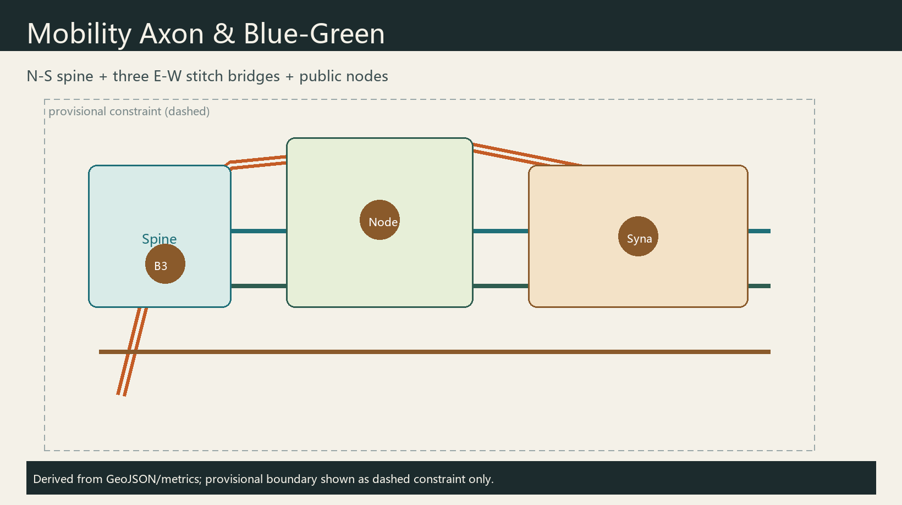
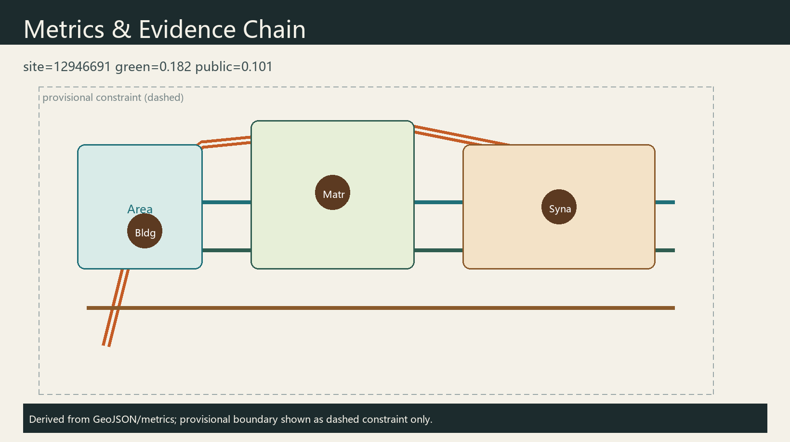

# Jing-Zhang Synapse Corridor: A Multi-Agent Co-Governed Centennial AI Innovation Belt

## Design Basis and Source List

This formal package uses the public prequalification announcement [source:OFFICIAL-ANNOUNCEMENT], the agent open-call taskbook [source:AGENT-TASKBOOK], the site package and source registry [source:SITE-PACKAGE] [source:SOURCE-REGISTRY], and the processed fact pack as navigation [source:PROCESSED-FACT-PACK]. Geometry starts from provisional_boundaries.geojson with `official_boundary=false`; it supports generation, visualization, and intake only. After official polygons arrive, layers and [metric:site_area_sqm] must be recalculated. Mandatory standards are read from local snapshots [standard:MNR-LAND-USE-CLASSIFICATION-GUIDE] [standard:MOHURD-URBAN-DESIGN-MEASURES]. Every spatial move is a **conceptual suggestion** for professional deepening.

## Three-Level Scope Framework

Coordinated research (43.6 km²) organizes ecosystem, branding, and culture. Overall design (11.4 km²) organizes renewal, land use, and blue-green mobility at regulatory-plan urban-design depth [depth:three_level_scope_framework]. Key areas (368.4 ha) host research, living, and industry synapses [data:geometry/key_areas.geojson#PROV-KEY-001]. Provisional limits are dashed constraints; ratios are directional only [metric:green_ratio].

## Coordinated Research Area: Industry and Future City Research

**Name**: Jing-Zhang Synapse Corridor. Metaphor: the railway is the historic axon; multi-agent collaboration forms contemporary synapses. **Logo direction**: a north–south spine plus three east–west arcs with hollow nodes as human-review interfaces; heritage brick gray + copper accent; no unauthorized trademarks.

Positioning, five functions, and three-areas-two-wings follow the taskbook [source:AGENT-TASKBOOK]. Global cases for transfer (not copy): Cambridge Silicon Fen; Zurich ETH/EPFL corridor; Toronto Vector; Paris Station F; Singapore One-North; Helsinki smart-district governance—near-campus interfaces, public sandboxes, open-source commons, and scenario open days.

## Overall Design Area: Urban Renewal and Regulatory-Plan-Level Urban Design

Spatial concept: one spine, three bridges, many nodes along the heritage corridor [data:geometry/roads.geojson#ROAD-001]. Land-use partitions cover the full boundary without gaps/overlaps [data:geometry/land_use.geojson#LU-001] [depth:land_use_layout]. Renewal prefers retention and adaptive reuse; FAR/height/demolition remain pending official controls [assumption:A-CONTROLS-001].

## Detailed Design of Key Areas

**Zhongzhiyuan — Research Synapse**: full-stack autonomy and governance display garden. **AI Origin Community — Living Synapse**: near-campus transfer and daily AI life. **Dazhongsi — Industry Synapse**: intelligent-native commerce and test loops. All are conceptual detailed designs [data:geometry/key_areas.geojson#PROV-KEY-001].

## AI Innovation Ecosystem, Personas, and AI+ Scenarios

**Personas (5)**: graduate developers; startup engineers; enterprise agent PMs; residents/elders; public auditors. **Testbeds (3)**: low-speed delivery sandbox; open model evaluation week; multi-agent ops rehearsal with mandatory human review. **Scenario cards (10)**: walkability diagnosis; open-source hall; transfer parlor; talent concierge; delivery corridor; safety gallery; data theatre; heritage guide agent; Xiaoyuehe open day; global AI week route—each with privacy minimization and human review [source:AGENT-TASKBOOK].

## Land Use, Building Scale, and Retain-Renovate-Demolish Strategy

Land-use partitions are topologically derived from the submitted site boundary so adjacent polygons share coordinates and the coverage has no gaps or overlaps [data:geometry/land_use.geojson#LU-001]. The green partition supports the Jing-Zhang axon commons; R&D and industry partitions serve Zhongzhiyuan and Dazhongsi synapses; living-support partitions serve the Origin community. Building footprints only illustrate two conceptual demonstrations—renovate at the research synapse and retain_adapt at the industry synapse—without parcel-level demolition conclusions [data:geometry/buildings.geojson#BLDG-001]. FAR, height, and total floor area remain unknown pending regulatory controls and ownership data [metric:floor_area_ratio]. Any intensity or retain/renovate/demolish language is a conceptual suggestion for professional deepening, not an approved statutory decision.

## Transport, Rail, Municipal Infrastructure, and Public Services

Mobility follows a one-spine, three-bridge concept: a north–south greenway along the heritage park and three east–west connectors serving Zhongzhiyuan, Origin, and Dazhongsi interfaces [data:geometry/roads.geojson#ROAD-001]. Road classes use greenway, branch, pedestrian, and cycleway codes to express slow-mobility intent rather than expressway or arterial redline changes. Station integration, micromobility, and low-speed delivery corridors are system suggestions with human-reviewable operating rules. Innovation-service platforms, talent services, and edge-compute stops are discussed as new infrastructure concepts fused with conventional utilities, without load, capacity, or bridge/tunnel feasibility conclusions. Missing official redlines and utility drawings remain pending confirmation [assumption:A-CONTROLS-001].

## Blue-Green Network, Public Space, and Urban Character

A continuous blue-green band along the axon aims to connect heritage park open space with street-corner commons for youth-friendly daily stays [data:geometry/green_space.geojson#GREEN-001]. Public-space features describe synapse plazas, developer publishing interfaces, and shared courts for mixed users [data:geometry/public_space.geojson#PUBLIC-001] [metric:public_space_ratio]. Character guidance uses heritage brick gray with copper synapse accents, separating belt-level logo marks from cultural signage and avoiding entertainment-first landmarks. Three pilgrimage nodes—the Axon stele, Origin signature wall, and Dazhongsi agent stage—are conceptual honor/display points, not approved construction projects, supported by a component library of publish booths, evaluation screens, slow-mobility lights, and accessible wayfinding.

## Renewal Projects, Implementation Policy, and Phasing

Phasing prioritizes the axon spine and Origin living synapse in the near term, then the Dazhongsi industry synapse and event system later [data:geometry/phasing.geojson#PHASE-001]. Suggested projects include walkability continuity, near-campus open-source halls, low-speed delivery loops, cultural wayfinding/landmark components, community compute stops, and accessibility upgrades. Each item lists location type, dependencies (regulatory plan, heritage, ownership, traffic safety), actor categories, and public participation, without inventing investment amounts or settled government schedules. Long-term operations propose an annual Synapse Week and contributor memorialization as conceptual mechanisms [source:AGENT-TASKBOOK].

## Metrics, Area Recalculation, and Compliance Matrix

Metrics recomputed in EPSG:4548 [metric:site_area_sqm] [metric:green_ratio] [metric:public_space_ratio] [metric:key_area_count]. Matrices cover announcement tasks and agent.1–agent.6 [depth:existing_conditions_diagnosis]. Provisional precision blocks statutory area claims, not conceptual discussion.

## Risk, Copyright, and Compliance

The package stays inside public/cleared materials and provisional geometry, excluding secret maps, non-public controls, and personal data [source:SOURCE-REGISTRY]. Copyright and generation methods are disclosed in `report/copyright_statement.md` and agent metadata; the offline visual loads no CDN, tiles, remote fonts, or tracking. Intensity, demolition, alignment, investment, and event claims are conceptual suggestions only [standard:PROJECT-AGENT-OPEN-CALL-TASKBOOK]. Privacy scenes require minimization, opt-out defaults, and human review. Final judgment remains with human maintainers and professional teams.

## References

Primary readable materials include the public announcement and agent taskbook [source:OFFICIAL-ANNOUNCEMENT], the site package with provisional boundary notes, the source registry, the processed fact pack, and local MOHURD/MNR standard snapshots [standard:MOHURD-URBAN-DESIGN-MEASURES]. Full machine indexes remain in sources.json and the matrices. When official polygons or cleared attachments arrive, geometry and metrics should be replaced and re-checked before any stronger spatial claim.

