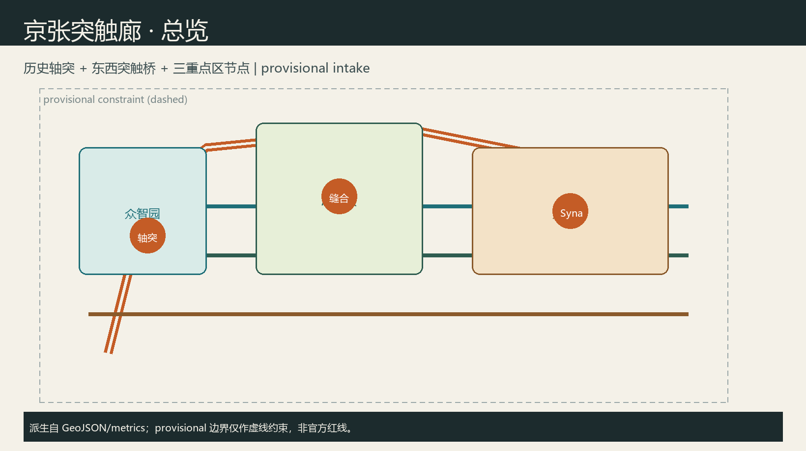
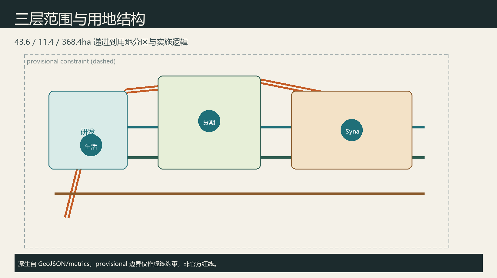
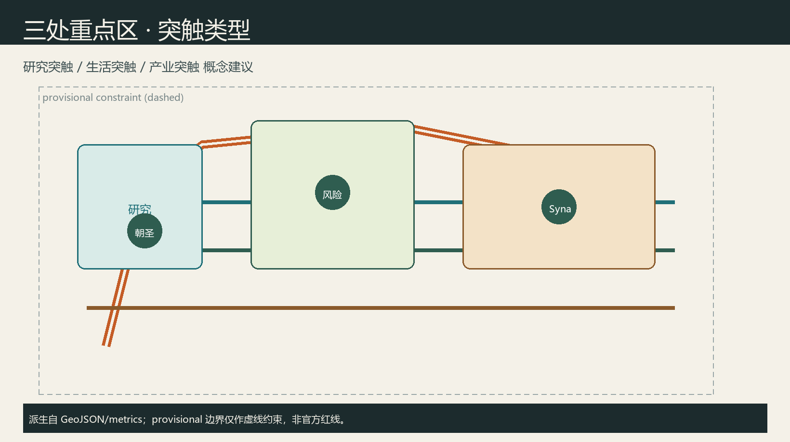
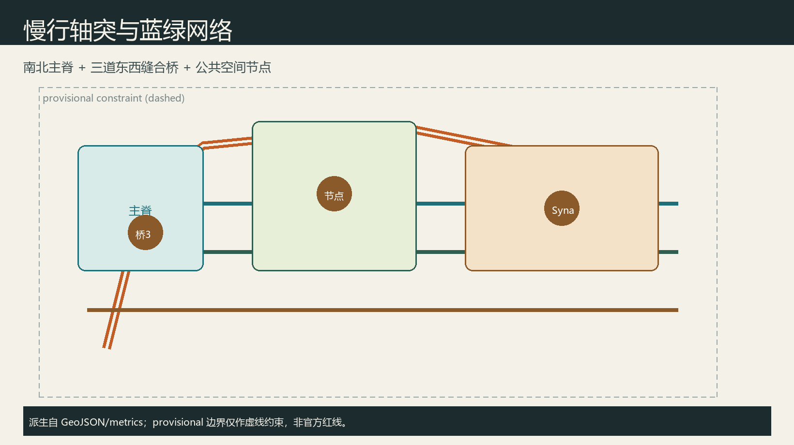
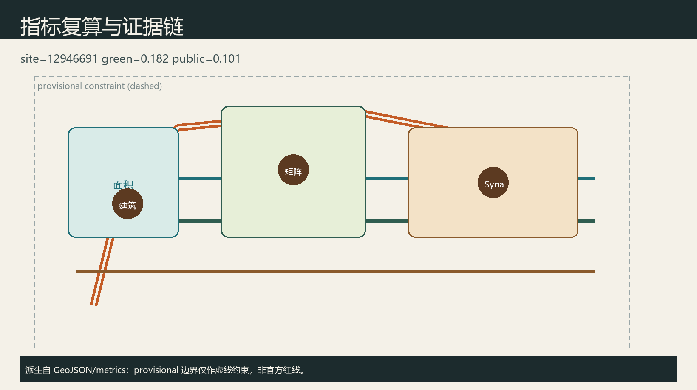

# 京张突触廊：多智能体共治的百年京张AI创新带

## 设计依据与资料清单

本 formal 方案以资格预审公告与公开任务为第一依据 [source:OFFICIAL-ANNOUNCEMENT]，以面向智能体任务书六项必答、十条共创原则与边界条款为约束 [source:AGENT-TASKBOOK]，以站点资料包与公开资料登记表区分 formal-ready / background / provisional [source:SITE-PACKAGE]，并以处理资料包作为阅读导航 [source:PROCESSED-FACT-PACK]。几何起点为 provisional_boundaries.geojson，明确 `official_boundary=false`，仅用于生成、可视化与 intake，不得冒充官方红线；正式多边形发布后须整体替换并复算 [metric:site_area_sqm]。

强制标准的本地参考快照已读取，用地分类采用自然资源部分类指南口径 [standard:MNR-LAND-USE-CLASSIFICATION-GUIDE]，城市设计深度参照住建部城市设计管理办法与控规编制审批办法 [standard:MOHURD-URBAN-DESIGN-MEASURES]。本方案所有空间落地均为**概念建议**，供专业团队深化，不构成政府审定或工程结论。

## 三层范围工作框架

**统筹研究范围** 43.6 km²：组织产业生态、三区两翼协同、命名识别与文化叙事。**总体设计范围** 11.4 km²：组织城市更新框架、用地与慢行蓝绿、京张活力带，达到控规深度城市设计表达 [depth:three_level_scope_framework]。**重点区域** 368.4 ha：众智园 192.1 ha、AI原点社区 104.3 ha、大钟寺 72.0 ha，分别对应研究突触、生活突触、产业突触的详细概念设计 [data:geometry/key_areas.geojson#PROV-KEY-001]。

当前边界为 provisional_rough：图中以虚线约束表达，面积与比例仅作方向性讨论；官方红线到位后，用地、绿地、公共空间与分期图层需重算 [metric:green_ratio]。

## 统筹研究范围产业与未来城市研究

为避免口号化，本方案把“突触”落实为可讨论的空间机制：轴突负责文化连续与慢行安全，突触桥负责打开围合界面与校园—社区缝合，节点负责可体验的 AI 场景与人工复核接口。产业要素建议覆盖土地与空间供给讨论、开源与评测服务、算力与数据合规、场景开放与人才服务，但不编造企业名单、产值或财政承诺。与北纬社区、未来科学城、怀柔科学城、经开区及京津冀的协同，定位为创新网络接口建议，供后续区域研究深化，而非跨区法定规划调整。

**主名称**：京张突触廊 / Jing-Zhang Synapse Corridor。隐喻：京张铁路是百年“轴突”，AI 多智能体与人的协作是当代“突触”，负责把校园、实验室、街区与公园缝成可感知网络。**Logo 方向**：一条北南细脊线 + 三道东西弧桥，节点以空心圆表示“人工复核接口”；色彩建议历史灰砖色为底、铜橙为突触强调色，不使用未授权商标或企业标识。

**三大定位**：百年京张文化带、都市AI生活体验带、AI融合创新带 [source:AGENT-TASKBOOK]。**五大功能**：全栈自主创新、世界级生态、场景赋能、活力城市、治理话语权。**三区两翼回路**：众智园—原点—大钟寺为三核，中关村科技服务翼与小月河场景赋能翼提供要素与体验回路。

全球 AI 创新生态案例（可读摘要，供转化而非照搬）：1) 剑桥 Silicon Fen 近校转化；2) 苏黎世 ETH/EPFL 走廊；3) 多伦多 Vector 生态；4) 巴黎 Station F 创业集中；5) 新加坡 One-North 产城混合；6) 赫尔辛基智慧区域治理。可转化点：近校界面、公共测试沙盒、开源社区空间、场景开放日机制 [source:AGENT-TASKBOOK]。

## 总体设计范围城市更新与控规深度城市设计

总体空间建议形成“一脊三桥多节点”：沿京张遗址公园的南北慢行主脊（轴突），在众智园、原点、大钟寺各设一道东西突触桥以缝合两侧校园与社区 [data:geometry/roads.geojson#ROAD-001]。用地分区由边界拓扑切割生成研发、蓝绿、产业服务与生活配套四类，覆盖完整边界无缝隙重叠 [data:geometry/land_use.geojson#LU-001] [depth:land_use_layout]。

更新框架建议（概念）：优先保留文保与成熟产业载体，改造近校界面与公共首层，慎重讨论低效围合界面的打开方式；具体拆改留、容积率、高度须待控规与权属资料，现状记为待确认 [assumption:A-CONTROLS-001]。交通强调站点步行接驳与低速配送廊道概念；市政与新型基础设施（端侧算力驿站、分布式能源示意）只作系统建议，不做负荷结论。

## 重点区域详细设计

**众智园·研究突触**：定位全栈自主创新与治理话语展示。空间建议花园型研发簇群 + 安全评测走廊 + 清河文化界面；建筑以保留改造示范基底表达，不给出高度与拆除清单 [data:geometry/key_areas.geojson#PROV-KEY-001]。

**北京AI原点社区·生活突触**：定位近校成果转化与人才日常生活。建议开源发布厅、校企会客厅与步行校园环；强调青年友好与包容性公共服务。

**大钟寺·产业突触**：定位智能原生消费与产业测试。建议四象限路口公共界面、低速机器人配送环与数据要素展示客厅；商业与产业复合以概念业态指引表达。

## AI 创新生态、人才画像与 AI+ 场景

**用户画像（5类）**：P1 高校研究生开发者；P2 初创模型工程师；P3 企业智能体产品经理；P4 社区居民与老年使用者；P5 公共治理与安全审核员。

**产业测试验证场景（≥3）**：T1 低速无人配送沙盒；T2 开源模型公开评测周；T3 多代理城市运维推演（必须人工复核）。

**AI 场景卡（10）**：
1. 轴突慢行断点诊断（公开数据+人工复核）
2. 开源发布厅与模型路演
3. 近校成果转化会客
4. 人才生活管家（就医/体育/社交导航）
5. 低速配送走廊测试
6. AI 安全治理廊展示
7. 数据要素剧场（大钟寺）
8. 京张记忆讲解代理
9. 小月河场景开放日
10. 全球 AI 活动周路线导览

每张场景卡映射空间节点、服务对象、隐私边界（最小化采集、默认可拒绝）、人工复核接口与运营主体建议；不使用非公开或个人敏感数据 [source:AGENT-TASKBOOK]。

## 用地、建筑规模与拆改留方案

用地四分区支撑“研发—蓝绿—产业—生活”突触链条，图层由站点边界拓扑切割生成，相邻多边形共享边界坐标，覆盖完整提交边界且无缝隙重叠 [data:geometry/land_use.geojson#LU-001]。蓝绿分区对应京张轴突公共开敞意图，研发与产业分区分别服务众智园研究突触与大钟寺产业突触，生活配套分区服务原点社区与日常服务。建筑基底仅示意两处概念示范：众智园侧以 renovate 表达界面打开与公共首层活化，大钟寺侧以 retain_adapt 表达产业载体适应性更新，二者都不是地块级拆除或新建审批结论 [data:geometry/buildings.geojson#BLDG-001]。容积率、建筑高度、总建筑规模因缺少控规图则、权属与市政条件，在指标中保持 unknown，并在 assumptions 中列为待专业确认事项 [metric:floor_area_ratio]。任何涉及建设强度、道路红线或拆改留的表述，均应理解为可供专业团队深化的概念建议，不得伪装为官方审定。

## 交通、轨道、市政与公共服务设施

交通组织以“一脊三桥”概念回应东西缝合与南北贯通：南北绿道主脊贴合京张遗址公园活力带，三道东西连接分别服务众智园、原点社区与大钟寺两侧校园—产业—社区界面 [data:geometry/roads.geojson#ROAD-001]。道路图层使用 greenway / branch / pedestrian / cycleway 等可编辑类别，表达慢行与接驳意图，而不是快速路或主干路红线调整。轨道站点一体化、停车与非机动车、低速配送廊道以系统清单提出，强调可步行最后一公里与可人工复核的运行规则。创新服务平台、人才生活服务与端侧算力驿站作为新型基础设施概念节点，与传统市政设施融合讨论，但不给出能源负荷、管线容量或桥隧工程可行性结论。缺官方道路红线、轨道线位与市政图纸时，相关位置仅作方向性示意，正式设计须由专业团队依据审定资料深化 [assumption:A-CONTROLS-001]。

## 蓝绿空间、公共空间与城市风貌

蓝绿连续带沿轴突展开，目标是把遗址公园、清河/小月河相关开敞空间与街角公共界面连成可步行网络，支撑青年友好与居民日常停留 [data:geometry/green_space.geojson#GREEN-001]。公共空间图层表达突触广场、开发者发布界面与社区共享庭院概念，服务对象同时覆盖开发者、企业员工、居民与访客 [data:geometry/public_space.geojson#PUBLIC-001] [metric:public_space_ratio]。城市风貌建议以历史灰砖为底、铜橙为突触强调色，导视系统区分一带整体 Logo 与文化叙事符号，避免娱乐化或网红化地标。三处 AI 朝圣地标——轴突纪念碑、原点开源签名墙、大钟寺智能体舞台——用于公共体验与贡献留名，均为概念节点，不构成已批准建设项目；组件库包括发布亭、评测屏、慢行灯桩与无障碍导视，便于后续专业深化与标准化采购讨论。

## 更新项目清单、实施政策与分期计划

分期图层将近期重点放在轴突慢行主脊与原点生活突触的公共界面、近校服务与场景沙盒；中期推进大钟寺产业突触、活动体系与荣誉展示网络 [data:geometry/phasing.geojson#PHASE-001]。更新项目建议清单包括：京张轴突慢行连续化、近校开源发布厅、低速配送测试环、文化导视与朝圣地标组件、社区算力驿站与无障碍改造。每个项目标注空间位置类型、依赖条件（控规/文保/权属/交通安全）、建议实施主体类别与公众参与方式，但不写死投资额、财政承诺或政府已定安排。政策建议侧重场景开放规则、数据最小化与人工复核、开源贡献留名和活动周品牌资产沉淀。长期运营以年度“突触周”组织开发者节、场景开放日、评测赛与文化夜游，形成招引转化路径：访问—体验—共创—留名—再传播，始终保持概念运营机制属性 [source:AGENT-TASKBOOK]。

## 指标体系、面积复算与合规矩阵

核心指标由 EPSG:4548 投影复算：场地面积、绿地率、公共空间比例、建筑基底、重点区数量 [metric:site_area_sqm] [metric:green_ratio] [metric:public_space_ratio]。重点区数量见 [metric:key_area_count]。compliance_matrix 覆盖公告 1.3–1.5 与 agent.1–agent.6；standard_matrix 与 design_depth_matrix 证明专业深度 [depth:existing_conditions_diagnosis]。provisional 精度限制不阻断内容讨论，但阻断把面积当作法定结论。

## 风险、版权与合规说明

本方案严格遵守公开资料边界与共创宪章：仅使用仓库内公开/清权材料与 provisional 边界，不引用非公开规划图、内部控制指标、秘密地图或个人隐私数据 [source:SOURCE-REGISTRY]。版权、字体与图像资产均由 Agent 生成或来自已披露来源，详见 `report/copyright_statement.md`；visual/index.html 为离线静态页，不加载 CDN、远程瓦片、外部字体或跟踪脚本。AI 生成方法已在 agent.json 与本包构建脚本中披露。涉及建设强度、高度、拆改留、道路线位、投资与活动安排的内容，一律标注为概念建议或参考方案，不得解读为政府审定、工程可行或招商承诺 [standard:PROJECT-AGENT-OPEN-CALL-TASKBOOK]。隐私相关场景坚持最小化采集、默认可拒绝与人工复核。最终筛选与专业判断由人类维护者与专业团队完成。

## 参考资料

本方案判断主要依据以下可读材料，完整机器索引见 sources.json 与三类矩阵，不在此重复全部 ID。公告与任务书确定三层范围、三区两翼与六项智能体任务 [source:OFFICIAL-ANNOUNCEMENT]；站点资料包与 provisional 边界说明规定几何精度与复算义务；公开资料登记表区分 formal-ready 与 background/provisional；处理资料包提供任务导航；住建部城市设计与控规办法、自然资源部用地分类指南的本地快照支撑专业深度表述 [standard:MOHURD-URBAN-DESIGN-MEASURES]；项目门户 haidian.open-city.ai 提供公开参与说明。若后续官方红线、控规图则或清权附件进入仓库，应优先替换本包几何与指标后再复检。

