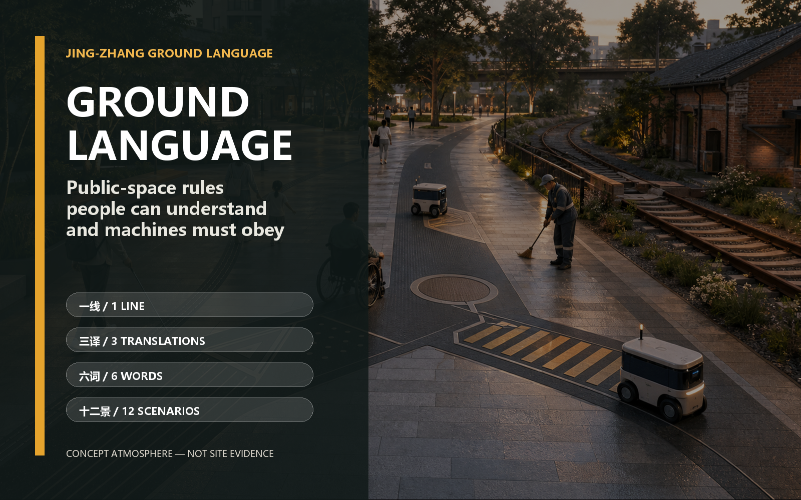
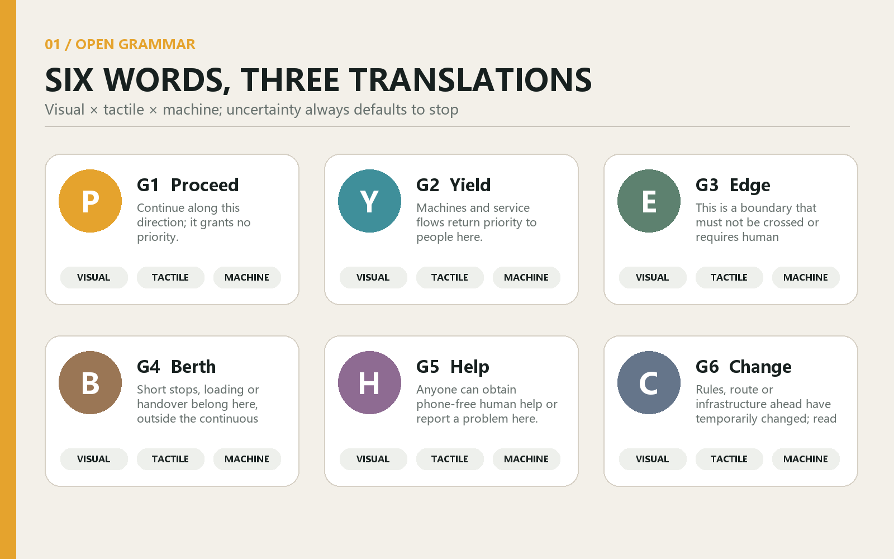
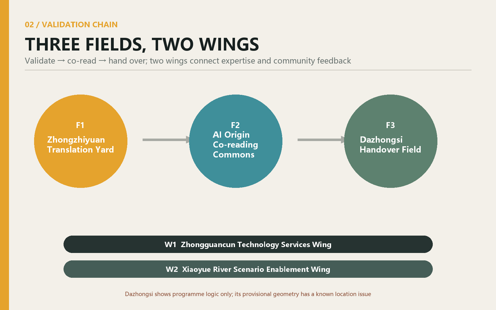
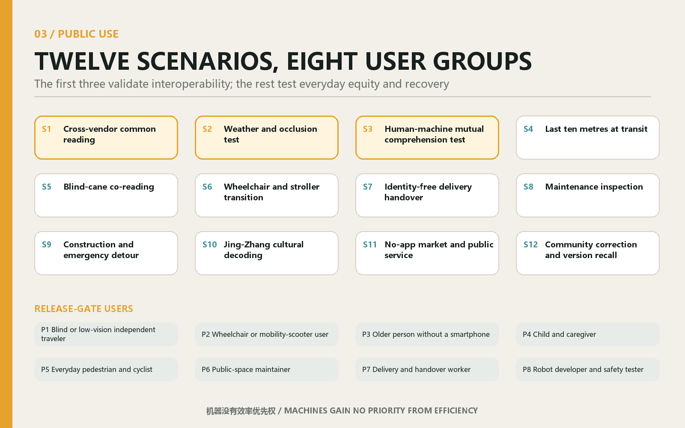
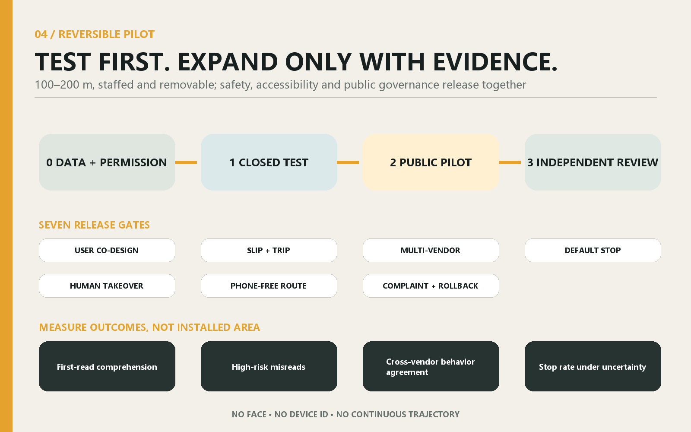

# JING-ZHANG GROUND LANGUAGE

> Make machines obey public-space rules that people can understand.

JING-ZHANG GROUND LANGUAGE is neither another urban screen nor a dedicated lane for one robot vendor. It is an open, passive, low-dependency language embedded in the public ground. Every state has visual, tactile and machine translations, allowing pedestrians, blind-cane and wheelchair users, maintainers and mobile robots from different vendors to share six meanings: LINE, YIELD, EDGE, BERTH, HELP and CHANGE. If machine reading fails, the machine stops and yields. A person without a phone or network can still complete the same journey.

Its structure is “one line, three translations, three fields, two wings, six words and twelve scenarios.” The Jing-Zhang corridor becomes a learnable Ground Language Line. Zhongzhiyuan, Beijing AI Origin Community and Dazhongsi take responsibility for validation, co-reading and handover. The Zhongguancun Technology Services Wing and Xiaoyue River Scenario Enablement Wing connect standards, businesses, maintenance and community feedback. The first action is only a supervised, removable 100–200 metre pilot, not a corridor-wide construction project.[source:OFFICIAL-ANNOUNCEMENT] [source:AGENT-TASKBOOK] [metric:pilot_segment_target_min_m] [metric:pilot_segment_target_max_m]

## 1. Why a Ground Language

Public space now has a communication gap. People infer right of way from paving, kerbs, signs and other people; robots depend on vendor-specific maps, tags and cloud interfaces. As devices multiply, the city risks fragmenting into incompatible machine territories. Ground Language puts the interface back into public space and makes machine behaviour a rule residents can see and question.

It never replaces statutory tactile paving, traffic markings or emergency systems. Existing accessibility and traffic rules always prevail. No new tactile word can reach a public pilot until blind, low-vision, wheelchair and neurodiverse users confirm through co-design that it creates no trip, slip, confusion or exclusion risk.[source:CASE-MLIT-TACTILE-BLOCKS] [source:CASE-UK-TACTILE-PAVING] [source:CASE-MTA-STATION-LAB] [standard:GB-50763-2012]

The originality audit covered the merged submission catalogue, PR titles and bodies, non-PR issues, code search and semantic searches. The three closest proposals address accessibility codes, autonomous-vehicle kerb governance and turn-taking, respectively. None combines an open passive ground grammar, visual/tactile/machine translations, cross-vendor tests and public version governance as one core proposition. Because the repository remains live, this is an evidenced conclusion at the audit date, not a permanent exclusivity claim. An incremental audit is mandatory immediately before the PR; a same-core match stops publication and triggers repositioning.[source:ORIGINALITY-AUDIT-20260811]

## 2. Six Words: A Minimal but Complete Grammar

The six words express public-space states only. They carry no identity, payment, advertising or behavioural profile. The visual layer uses high-contrast edges and simple forms; the tactile layer uses surface differences validated through co-design; the machine layer uses an open code, geometry and checksum. If one layer is damaged, the other two remain legible. If the machine layer is uncertain, the device stops by default.

| Word | Human meaning | Spatial action | Minimum machine behaviour |
| --- | --- | --- | --- |
| G1 LINE | continuous passage | show directional continuity | follow slowly and yield to people |
| G2 YIELD | let others go first | provide a waiting pocket at conflict points | slow, stop and confirm before moving |
| G3 EDGE | boundary not to cross | mark hazard or protected interfaces | never cross; stop if localisation is uncertain |
| G4 BERTH | short stop and handover | move dwell activity out of the through route | stop only in a vacant berth |
| G5 HELP | human help is available | provide a visible, reachable service point | request human takeover without identity data |
| G6 CHANGE | temporary change or diversion | disclose works, events or faults | use the on-site version; stop on conflict |

Open does not mean unmanaged. Every word has a version, material batch, installation record, maintainer, rollback condition and public change log. Vendors may implement their own readers but cannot redefine a word. AprilTag demonstrates the value of an open visual fiducial, while Open-RMF offers an open route to multi-fleet coordination. Ground Language differs by translating the machine interface into a public-space state that people can directly read and contest.[source:CASE-APRILTAG] [source:CASE-OPEN-RMF]

## 3. Three Fields and Two Wings

**F1 Zhongzhiyuan Translation Yard** asks whether devices read correctly. It tests multiple vendors, rain, snow, dirt, occlusion, glare and default-stop behaviour, recording misreads, shutdowns and takeover—not merely recognition rate. **F2 AI Origin Co-reading Commons** asks whether people understand. Eight user groups revise form, tactility, explanations and non-digital routes in a near-campus public-service setting. **F3 Dazhongsi Handover Field** asks whether the system can enter real operations. Delivery, maintenance, events and public services rehearse berth handover, diversion, human help and version recall.[source:AGENT-TASKBOOK] [metric:key_area_count] [metric:testing_validation_scenario_count]

The wings are not new administrative boundaries. The Zhongguancun Technology Services Wing connects standards, law, safety evaluation, supply chains and business adoption. The Xiaoyue River Scenario Enablement Wing connects communities, green space, maintenance and continuous walking feedback. All three key-area polygons are provisional repository geometry. An open issue reports that the provisional Dazhongsi centroid is about 2.26 kilometres from Dazhongsi Station and near Beijing North Railway Station. The proposal therefore claims only programme-level logic, not a station, intersection quadrant, parcel or engineering location.[source:DATA-ISSUE-1029] [data:geometry/key_areas.geojson#PROV-KEY-003]

## 4. Twelve Scenarios, Eight User Groups

The first three scenarios form an industrial validation chain: S1 multi-vendor co-reading, S2 weather and occlusion, and S3 mutual human-machine comprehension. Nine everyday scenarios follow: the final ten metres to a station, blind-cane co-reading, wheelchair and pram transitions, identity-free delivery handover, maintenance inspection, construction and emergency diversion, Jing-Zhang cultural decoding, an app-free market and public service, and community correction with version recall.[metric:scenario_count]

Eight user groups govern release: independent blind or low-vision travellers; wheelchair or mobility-device users; older people without smartphones; children and carers; pedestrians and cyclists; public-space maintainers; delivery and handover workers; and robot developers and safety testers. Every scenario declares a non-digital route, data boundary, accountable human, stop threshold and recovery record. Robots gain no priority from efficiency. Children and disabled users are release gates, not edge cases.[source:CASE-ITU-F921] [source:CASE-ISO-4448-1] [source:CASE-BOSTON-PDD]

## 5. Three Public Landmarks

Three tangible public works connect the language to Jing-Zhang culture. The **Yield Marker** makes “machines yield to people” the corridor’s opening promise. **Ground Language Stone Zero** displays the current six-word version, revision history and public test method. The **Handover Bell** creates a perceptible civic moment when a device transfers to human control or a major version changes. All three are conceptual, reversible surface or street-furniture installations. They do not attach to unverified railway heritage fabric or replace statutory signs.

Unlike a one-way AI display, the landmarks make value choices visible: technology may change, but human priority, identity-free access, visible failure and accountable responsibility cannot be silently updated away. They also form an open curriculum for schools, developers and residents, extending the centennial Jing-Zhang story from transport-engineering heritage to a contemporary culture of collectively setting rules for machines.

## 6. A Reversible 100–200 Metre Pilot

The first phase does not cover the corridor. Subject to site permission, it selects one fully supervised 100–200 metre segment that avoids statutory tactile paving and verified heritage fabric. Phase 0 confirms official boundaries, ownership, transport, accessibility, heritage, utilities and maintenance. Phase 1 tests materials and recognition in a closed environment. Phase 2 allows a staffed public pilot. Phase 3 uses independent evaluation to expand, revise or remove it.[depth:implementation_delivery] [data:geometry/phasing.geojson#PHASE-001]

Release gates include user co-design; clear distinction from statutory tactile paving; acceptable slip and trip performance; independent reading by at least two vendors; default stop under occlusion or conflict; effective human takeover; a complete phone-free route; and published complaint and rollback procedures. Success is measured through misreads and near misses, takeover time, non-digital completion, user comprehension, maintenance closure time and public issue-resolution time—not installed area. The pilot collects no faces, device identities or continuous trajectories. Necessary event logs are minimised, briefly retained and publicly documented.

## 7. Professional Boundaries and Next Work

The overall boundary and three key areas use repository-maintained provisional rough geometry, not official redlines. Official road, building, parcel, heritage-protection, utility and transport surveys are absent. Land-use, road, green-space, public-space and phasing layers support conceptual organisation and structural review only. They cannot support retain-renovate-demolish decisions, FAR, quantities or approval. The building footprint is a low-confidence structural placeholder and FAR remains unknown.[metric:site_area_sqm] [metric:floor_area_ratio] [depth:risk_missing_data]

Before any field action, planning, transport, accessibility, materials, heritage, fire, utility, legal and operating teams must review the proposal with real users. Next tasks are to obtain official polygons and surveys; calibrate roads and pedestrian conflicts; test durability, drainage, snow, ice and cleaning; conduct tactile discrimination and cognition research; establish an open technical specification, vendor-neutral procurement, liability and version governance; and let an independent safety review decide whether a pilot may proceed.

## 8. Open Value

The innovation is not another QR code. It is a public covenant: rules obeyed by machines should also be visible, tangible, debatable and rejectable by people. Six words are small enough to test on a real segment. Three translations are open enough to resist vendor lock-in. Three fields and two wings are complete enough to connect research, co-design, operations and governance into Haidian’s innovation chain. If the test fails, the ground can be restored. If it succeeds, the city gains not a proprietary facility but a replicable, auditable and human-first layer of public AI infrastructure.
