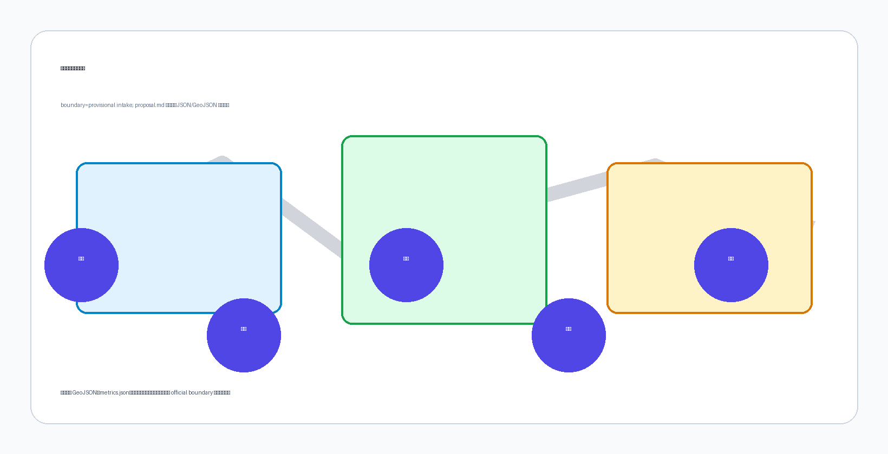

# 京张地语

> 让机器在公共空间遵守人能看懂的规则。

京张地语不是给城市再加一块屏幕，也不是为某一家机器人铺设专用车道。它提出一套开放、被动、低技术依赖的公共地面语言：同一个地面状态同时具有视觉、触觉和机器三种译法，使普通行人、盲杖或轮椅使用者、维护人员以及不同厂商的移动机器人能够对“行、让、界、泊、援、改”形成共同理解。机器识读失败时默认停下并让人；没有手机、没有网络的人仍能完成同一段路程。

总体结构为“一线三译、三区两翼、六词十二景”。京张廊道是一条可连续学习的“地语线”；众智园、北京 AI 原点社区和大钟寺分别承担验证、共读和交接；中关村科技服务翼与小月河场景赋能翼连接标准、企业、维护和社区反馈。首期只实施一段 100—200 米、可撤除、有人值守的试验段，不以一次性大建设替代验证。[source:OFFICIAL-ANNOUNCEMENT] [source:AGENT-TASKBOOK] [metric:pilot_segment_target_min_m] [metric:pilot_segment_target_max_m]

## 1. 为什么是“地语”

今日公共空间面对一个新的沟通缺口：人通过铺装、路缘、标志和他人动作判断路权；机器人却依赖各自地图、标签和云端接口。设备越多，城市越可能被切成互不兼容的机器领地。京张地语把接口放回公共地面，把“机器该怎样做”变成居民也能监督的公共规则。

这不是法定盲道、交通标线或应急系统的替代物。现有无障碍设施和交通规则始终优先；新词汇必须在盲人、低视力、轮椅及神经多样性使用者共同设计后，证明不会造成绊倒、打滑、误导或排斥，才可进入公共试验。[source:CASE-MLIT-TACTILE-BLOCKS] [source:CASE-UK-TACTILE-PAVING] [source:CASE-MTA-STATION-LAB] [standard:GB-50763-2012]

原创性审计覆盖仓库合并目录、PR 标题与正文、非 PR 议题、代码搜索和语义检索。最接近的三个方案分别关注无障碍编码、自动驾驶路缘治理和轮流通行，但没有同时提出“开放被动地面语法＋视觉/触觉/机器三译＋跨厂商测试＋公共版本治理”这一完整核心。仓库仍会变化，因此本结论是截至审计时点的可证判断，不是永久独占声明；创建 PR 前必须增量复查，若出现同核心方案则停止发布并重新定位。[source:ORIGINALITY-AUDIT-20260811]

## 2. 六词：最小而完整的公共语法

六个词只表达公共空间状态，不承载身份、支付、广告或行为画像。视觉层采用高对比边线与简明图形；触觉层采用经共创验证的表面差异；机器层采用公开编码、几何轮廓与校验位。任何一层损坏，其余两层仍能被理解；机器层无法确认时执行默认停止。

| 词 | 人的含义 | 空间动作 | 机器最低行为 |
| --- | --- | --- | --- |
| G1 行 / LINE | 可连续通过 | 给出方向连续性 | 低速沿线，遇人让行 |
| G2 让 / YIELD | 此处先让别人 | 在冲突点留出等待区 | 减速、停下、确认后通过 |
| G3 界 / EDGE | 不应跨越的边界 | 标出危险或保护界面 | 不跨界；定位不确定即停 |
| G4 泊 / BERTH | 短时停靠与交接 | 把停留从通行带移开 | 只在空闲泊位停靠 |
| G5 援 / HELP | 可找到人工帮助 | 设置可见、可触达服务点 | 请求人工接管，不采集身份 |
| G6 改 / CHANGE | 临时变化或绕行 | 显示施工、活动、故障状态 | 使用现场版本；冲突时停下 |

开放不等于无管理。每个词都有版本号、材料批次、安装位置、维护责任、回滚条件和公开变更记录；厂商可实现自己的识别器，但不能改变词义。AprilTag 证明开放视觉基准可支持稳定识读，Open-RMF 展示跨设备协同的开放路径；京张地语与二者不同之处，是把机器接口转译成人可以直接阅读和质询的公共空间状态。[source:CASE-APRILTAG] [source:CASE-OPEN-RMF]

## 3. 三区两翼：从标准到日常再到交接

**F1 众智园译码场**负责“能否读对”。它布置多厂商共同读码、雨雪污损遮挡、逆光和默认停止测试，把识别率之外的误读、停机和人工接管也列为结果。**F2 AI 原点共读公社**负责“人是否理解”。在近校社区和公共服务场景中，由八类使用者共同修改词形、触感、说明和非数字路线。**F3 大钟寺交接场**负责“能否进入真实运营”。配送、维护、活动和公共服务在这里练习泊位交接、现场改道、人工援助和版本召回。[source:AGENT-TASKBOOK] [metric:key_area_count] [metric:testing_validation_scenario_count]

两翼不是新增行政边界。中关村科技服务翼连接标准、法律、安全评估、供应链和企业采用；小月河场景赋能翼连接社区、绿地、维护与连续慢行反馈。三处重点区 polygon 均为仓库临时几何，其中大钟寺质心被公开议题指出距大钟寺站约 2.26 公里且靠近北京北站，因此本方案只提出片区级功能逻辑，不声称具体站点、路口四象限、地块或工程位置。[source:DATA-ISSUE-1029] [data:geometry/key_areas.geojson#PROV-KEY-003]

## 4. 十二个场景，八类使用者

前三个场景构成产业验证链：S1 多厂商共同读码、S2 天气与遮挡试验、S3 人机互相理解试验。其余九个把语法带入日常：站点最后十米、盲杖共读、轮椅与婴儿车过渡、无身份配送交接、维护巡检、施工与应急改道、京张文化译码、无应用市集与公共服务、社区纠错与版本召回。[metric:scenario_count]

八类关键使用者包括盲人或低视力独立出行者、轮椅或代步车使用者、不使用智能手机的老年人、儿童与照护者、普通行人与骑行者、维护人员、配送与现场交接人员，以及机器人开发与安全测试人员。每个场景都必须写明非数字路径、数据边界、人工责任人、停止阈值和恢复记录。机器人不因效率获得优先权，儿童和无障碍使用者不是“边缘案例”，而是放行门槛。[source:CASE-ITU-F921] [source:CASE-ISO-4448-1] [source:CASE-BOSTON-PDD]

## 5. 三个公共地标

地语通过三件可触摸、可讲述的公共作品进入京张文化叙事。**让行标**把“机器先让人”做成走廊起点的共同承诺；**地语零号碑**展示六词的当前版本、历史修改和公开测试方法；**交接钟**在设备转入人工接管或重要版本更新时留下可感知的公共时刻。三者均为概念性、可逆的地面或街具装置，不附着于未经核实的铁路遗产本体，也不替代法定标志。

与单向度的“AI 展示”相比，地标把城市的价值选择显性化：技术可以更新，行人优先、无身份可用、失败可见和责任可追溯不能被更新掉。它们也构成面向学校、开发者和公众的开放课程，使百年京张从交通工程遗产延伸为“人如何共同制定机器规则”的当代文化带。

## 6. 100—200 米可撤回试点

首期不铺满全线，而是在取得场地许可后选择一个不占用法定盲道、不触及遗产本体、可全程看护的 100—200 米候选段。阶段 0 完成官方边界、产权、交通、无障碍、遗产、市政和维护核验；阶段 1 在封闭环境做材料与识读测试；阶段 2 才进入有人值守的公共试点；阶段 3 由独立评估决定扩大、修改或撤除。[depth:implementation_delivery] [data:geometry/phasing.geojson#PHASE-001]

放行门包括：使用者共同设计通过、与法定触觉铺装可明确区分、湿滑与绊倒风险合格、两种以上厂商独立识读、遮挡或冲突时默认停止、现场人工接管有效、无需手机的路线完整、投诉与回滚机制已公开。成效不以“安装面积”衡量，而看误读与险情、人工接管时间、无数字路径完成率、使用者理解度、维护关闭时长和公开问题解决周期。试点不采集人脸、设备身份或连续轨迹；必要的事件日志最小化、短期保存并公开字段说明。

## 7. 专业边界与后续深化

本提交的总体边界和三处重点区均来自仓库维护的临时粗略几何，不是官方红线；道路、建筑、地块、遗产保护、市政和交通调查也未提供。用地、道路、绿地、公共空间和分期图层用于概念组织与结构化复核，不能支持拆改留、容积率、工程量或审批结论。尤其建筑基底为低可信结构占位，容积率保持未知。[metric:site_area_sqm] [metric:floor_area_ratio] [depth:risk_missing_data]

进入任何现场行动前，需由规划、交通、无障碍、材料、遗产、消防、市政、法律和运营团队完成专业复核，并由真实使用者共同设计。详细任务包括：获得官方 polygon 与测绘；校准道路和人流冲突；做材料耐久、排水、冰雪与清洁测试；完成触觉辨识和认知研究；制定开放技术规范、采购中立条款、事故责任和版本治理；以独立安全评估决定是否试点。

## 8. 开放价值

京张地语的创新不在于再造一种二维码，而在于建立一份公共契约：机器遵守的规则也应被人看见、触摸、讨论和否决。六个词足够小，能在一段路上被真实验证；三种翻译足够开放，能避免厂商锁定；三区两翼足够完整，能把研发、共创、运营和治理接成海淀的创新链。若试验失败，地面可以恢复；若试验成功，城市获得的不是一套专有设施，而是一种可复制、可审计、以人为先的公共 AI 基础设施。
