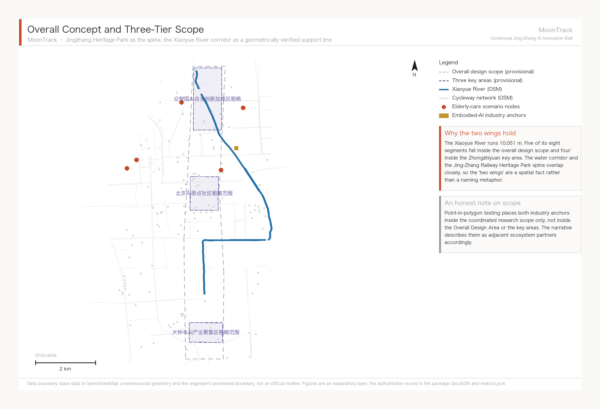
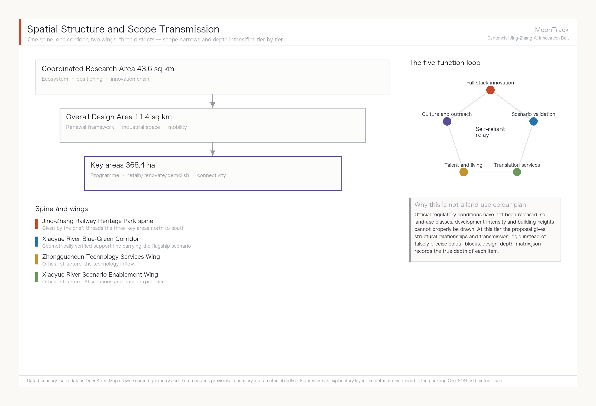
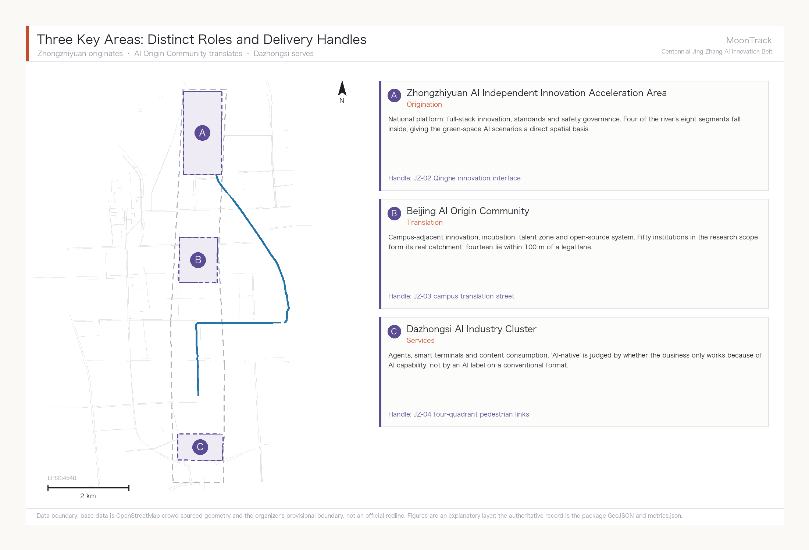
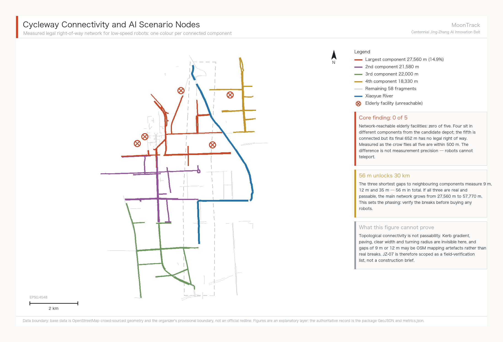
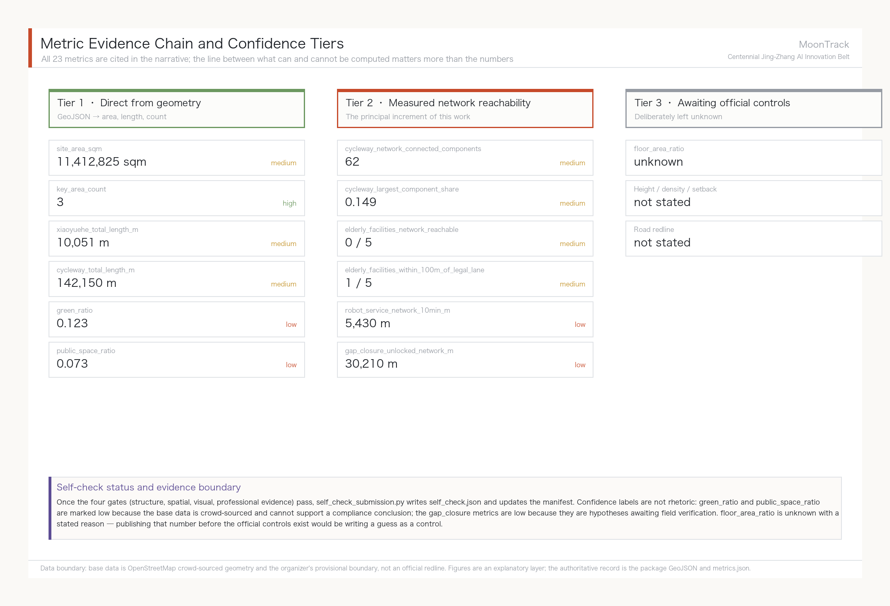

# MoonTrack — Overall Concept and Scenario Enablement Proposal for the Centennial Jing-Zhang AI Innovation Belt

## Design basis and source inventory

This formal proposal takes as its primary basis the Prequalification Announcement for the International Open Call for Urban Design of the Centennial Jing-Zhang AI Innovation Belt, issued by the Haidian Branch of the Beijing Municipal Commission of Planning and Natural Resources. Its machine-readable basis is the maintainer-registered provisional coarse boundary, key areas, enumerations, metrics and source inventory in `brief/site-package/`. Before generating a proposal an AI agent must read `design_brief.json`, `allowed_design_space.json`, `sources.json`, `enums/`, `ranges/`, `schemas/`, `data/source_registry.json` and `data/processed/agent_fact_pack.md`, and must build its task, scope, source-use and gap inventories from `project_scope_summary.csv`, `agent_task_requirements.csv`, `source_use_matrix.csv` and `missing_data_checklist.csv`. Every design judgement has to decompose into a traceable source, a recomputable metric, a checkable layer and a human-reviewable assumption. The announcement requires urban-design depth equivalent to Regulatory Detailed Planning and to an Integrated Planning Implementation Plan, so narrative text cannot substitute for GeoJSON, metric tables, the A3 booklet, the A0 boards and the HTML presentation.

This is not a free-standing vision document; it organises its outputs from the announcement, the agent taskbook and the site package. This section places only the most load-bearing basis next to the judgement [source:OFFICIAL-ANNOUNCEMENT] [source:AGENT-TASKBOOK] [depth:existing_conditions_diagnosis]. Full source and standard coverage live in `sources.json`, `standard_matrix.json` and `design_depth_matrix.json`; the machine index is not repeated in the narrative.

The use boundaries of the source registry are as follows [source:SOURCE-REGISTRY]:

- `data/source_registry.json` records the permitted use of public, rights-cleared and provisional material.
- Current registry summary: 7 formal-usable sources, 1 background source, 1 provisional-only source.
- An agent must not promote background_only or provisional_only material into an official boundary, a statutory regulatory control, a formal scoring basis or a government implementation commitment.

`data/processed/agent_fact_pack.md` is this proposal's reading-navigation layer, not a new authority [source:PROCESSED-FACT-PACK]. It helps an agent organise the three-tier scope, the three key areas, the announcement tasks, agent.1 to agent.6, source availability and outstanding data gaps into a readable proposal; factual judgements still return to the registered primary material [source:OFFICIAL-ANNOUNCEMENT] [source:AGENT-TASKBOOK], and the complete source relationships are held in `sources.json`.

Where the official `SITE_BOUNDARY` [source:BOUNDARY-SOURCE] or the three `KEY_AREA` polygons [source:KEY-AREA-SOURCE] are not yet available, this package builds a provisional formal package from `brief/site-package/geometry/provisional_boundaries.geojson`. Both `geometry/site_boundary.geojson` and `geometry/key_areas.geojson` in the submission are marked `provisional_constraint` with `official_boundary=false`. They may be used only for proposal generation, self-check, visualisation and design discussion — never as an official redline, an approval basis, a precise-area basis or a statutory control conclusion. This organizer-side data gap does not by itself block content scoring. Once official polygons are supplied, the site boundary, key areas, land use, roads, green space, public space, buildings, phasing and metrics must all be recomputed.

The scoreable status of this scaffold generation is therefore: **provisional boundary, precision warnings retained, recomputation pending release of official data; content scoring not blocked**. Spatial structure, scenarios, projects and metrics in the narrative are written on the principle that they are discussable, checkable, and recomputable once official boundaries replace the provisional ones. When official boundaries and key-area polygons are updated, the agent must re-run the scaffold, the self-check and the drawing and HTML generation rather than swapping a single file.

Boundary interpretation returns to the overall scope layer and its area recomputation [data:geometry/site_boundary.geojson#SITE-001] [metric:site_area_sqm]. The three key areas are cross-checked against an independent layer and a count metric [data:geometry/key_areas.geojson#PROV-KEY-001] [metric:key_area_count]. A reader can therefore enter the evidence from the narrative without first reading a string of machine identifiers.

## Three-tier working framework

The proposal organises its work along the three tiers set by the announcement. The Coordinated Research Area covers 43.6 sq km and addresses the AI industrial ecosystem, strategic positioning, the innovation chain and future urban form. The Overall Design Area covers 11.4 sq km of urban districts and industrial areas within one to two kilometres of the Jing-Zhang Railway Heritage Park, and calls for an urban-renewal framework, industrial spatial layout, mobility and municipal support, and Urban Character control. The Key-Area Detailed Design Area covers 368.4 ha across three detailed-design districts, and calls for defined programme, building scale, Demolish–Renovate–Retain classification, public-space connectivity and traffic organisation. All three tiers are mapped item by item in `compliance_matrix.json` so that announcement clauses 1.3, 1.4 and 1.5 and each mandatory agent.1–agent.6 task carry section, layer, metric, drawing and HTML evidence.

The depth items for the three-tier framework are governed by [depth:three_level_scope_framework] and [depth:overall_spatial_structure]. Spatial evidence rests on [data:geometry/site_boundary.geojson#SITE-001] and [data:geometry/key_areas.geojson#PROV-KEY-001], the task basis on [standard:PROJECT-OFFICIAL-ANNOUNCEMENT], and scope navigation on the three-tier table in `project_scope_summary.csv` [source:PROCESSED-FACT-PACK].

The three tiers are not three disconnected drawing sets. Coordinated research settles the industrial-chain and urban-form judgements; overall design lands those judgements in renewal projects, spatial structure and infrastructure capacity; key-area detailed design tests the deliverability of specific plots, buildings, traffic, public space and AI-Enabled Scenarios. When generating a proposal an agent must first fix which official or provisional boundaries and constraints the current submission adopts, then generate land use, buildings, roads, green space, public space, phasing and AI service nodes, and finally recompute metrics from those layers and explain in the narrative which conclusions remain limited by the provisional boundary. Any area, ratio, scale or project count that cannot be recomputed from structured data must not enter a formal conclusion.

The overall concept of this proposal is **"MoonTrack" (月轨)**. In 1905, when Zhan Tianyou took on the Beijing–Zhangjiakou railway, most foreign engineers held that the Chinese could not build it: no precedent, no outside help, and the continuous steep grade through the Guangou pass treated as the insurmountable obstacle. Four years later a zigzag switchback climbed that grade and the line opened as the first trunk railway that China designed, financed and built entirely on its own. A century later the official brief ranks five functions for this corridor, and the first is a full-stack self-reliant AI innovation system — which asks the same question: can we build it ourselves. The "track" in MoonTrack answers to that century-long spine of self-reliant innovation; the "moon" answers to the Xiaoyue River that actually runs through the site, and carries the association of a station platform (月台). One word holds two real elements of the place.

MoonTrack does not replace the official project name, the Centennial Jing-Zhang AI Innovation Belt. It is a concept-level sub-brand whose job is visual and communicative consistency across the officially named Three Zones and Two Wings: the Zhongzhiyuan AI Independent Innovation Acceleration Area, the Beijing AI Origin Community, the Dazhongsi AI Industry Cluster, the Zhongguancun Technology Services Wing and the Xiaoyue River Scenario Enablement Wing. Spatially the spine remains the Jing-Zhang Railway Heritage Park given by the brief, threading the three key areas from north to south; overlaid on it is one geometrically verified support line, the Xiaoyue River Blue-Green Corridor. Measurement shows that of the eight river segments making up the Xiaoyue River's 10,051 m [metric:xiaoyuehe_total_length_m], five fall inside the Overall Design Area [metric:xiaoyuehe_segments_in_design_scope] and four inside the Zhongzhiyuan key area [data:geometry/green_space.geojson#xiaoyuehe-seg-00]. The water corridor and the heritage-park spine overlap closely, so calling the Xiaoyue River and Zhongguancun wings the "two wings" of the spine has a spatial basis and is not merely a naming metaphor.

| Tier | Design question | Answer | Data anchor |
| --- | --- | --- | --- |
| Coordinated Research Area | How to organise the AI industrial ecosystem and future urban form | Establish an innovation chain of university origination, open-source collaboration, enterprise translation, public experience and international outreach | compliance_matrix.json, standard_matrix.json |
| Overall Design Area | How industrial space, urban renewal, mobility, utilities and character are drawn | Expressed jointly through the land-use, building, road, green-space, public-space and phasing layers | [data:geometry/land_use.geojson#LU-001], [data:geometry/roads.geojson#ROAD-001] |
| Key-Area Detailed Design Area | How the three districts reach detailed-design depth | Each given a role, spatial action, AI scenario and implementation dependency | [data:geometry/key_areas.geojson#PROV-KEY-001], [data:geometry/key_areas.geojson#PROV-KEY-002], [data:geometry/key_areas.geojson#PROV-KEY-003] |

### Integrated planning, spatial-industrial fusion and territorial planning innovation

Completing the ten scenario cards of agent.3 exposed a specific planning-technique problem worth stating on its own.

**The problem: AI scenario space has no matching category in the current land-use classification.** Under the Guidelines for Land and Sea Use Classification in Territorial Survey, Planning and Use Control [source:DATA-SRC-MNR-LAND-USE-CLASSIFICATION-202311], land use is divided exclusively by dominant purpose: one parcel, one category. But the robot delivery corridor along the Xiaoyue River is three things at once — green space in a blue-green corridor, a cycleway for riders, and industrial testing space for low-speed robots. The three uses coexist in the same strip and stagger by time of day: commuting peaks belong to cyclists, off-peak hours can carry testing. The current classification cannot express this compound state, and forcing it produces only two outcomes: classify it as green space and testing becomes non-compliant use, or classify it as industrial land and the continuity of the blue-green corridor is destroyed.

**Approach one: overlay a scenario use right rather than create a new land-use category.** We suggest exploring a time-bounded, revocable use permit layered on top of the existing classification. What is managed is the right of passage and operation for a class of activity, in a strip of space, during a period of time — not a change to the nature of the land. The advantage is that a failed pilot can simply be withdrawn, leaving no altered land designation behind. This is consistent with the institutional interface that already exists in the Beijing Interim Measures for Road Testing and Commercial Demonstration of Unmanned Delivery Vehicles, under which the pilot district government designates test road sections [source:beijing-delivery-robot-management-measures] — itself a time-bounded authorisation that does not alter the road's designation.

**Approach two: revocability as a planning principle for AI scenario space.** Conventional industrial-space planning locks in for the long term. AI technology iterates far faster than planning cycles, so lock-in is itself the risk. We suggest that such spaces define exit conditions and restoration requirements at the planning stage: if scenario validation fails or the technical path changes, the space returns to its prior state without stranded assets. Of the ten scenario cards in this proposal, all six robotics cards are designed to be revocable — they use existing cycleways and existing stopping points, and not one requires a new dedicated structure.

**Approach three: vertical organisation of spatial-industrial fusion.** The "upstairs and downstairs is upstream and downstream" arrangement at Shanghai's Zhangjiang AI Island [source:case-zhangjiang-ai-island] shows that an industrial chain on a dense site can stack vertically rather than spread horizontally. This has direct reference value for land-constrained key areas such as Zhongzhiyuan, and points the same way as the integrated-planning requirement to coordinate multiple functions within a single spatial unit.

All of the above are conceptual suggestions at the level of planning method, offered for study by professional teams and the natural-resources authority. They constitute no judgement on the use, indicators or approval status of any parcel. Land-use terminology follows the guidelines cited above; the actual land-use category of any parcel still rests with the official regulatory conditions.

## Coordinated Research Area: industry and future-city research

The core task in the Coordinated Research Area is to build a world-class AI innovation ecosystem. The proposal should survey Haidian's universities and institutes, leading enterprises, compute-algorithm-data factors, incubation platforms, listed companies, unicorns and technology-service resources, and propose a spatial framework coordinating the AI innovation chain, industrial chain, talent chain and urban-service chain.

The MoonTrack naming and visual-identity direction is what carries overall recognisability across the three official positionings — the Centennial Jing-Zhang Cultural Belt, the Urban AI Life Experience Belt and the AI Convergence Innovation Belt. The Urban AI Life Experience Belt carries the greatest weight here, because the flagship scenario (Xiaoyue River robotics plus accessibility and elderly-care services) is its concrete landing, matched to Haidian's real demographic structure of 671,000 residents aged 60 and over, 21.47% of the permanent population [source:haidian-2024-statistical-bulletin]. The other two positionings support rather than sit alongside it: the Centennial Jing-Zhang Cultural Belt rests on the specific engineering fact of the Guangou switchback, while the AI Convergence Innovation Belt shares its logical structure with the railway's self-reliant construction history. The visual direction is a water-and-track overprint — the organic curve of the Xiaoyue River laid over the straight grid of rails and AI networks, with a blue-green gradient resolving to moon-white — combined with an abstracted switchback motif. The naming grammar uses "Platform X" (月台X) as a second-level brand prefix, as in Platform Forum and Platform Developer Night, and does not rename the official Three Zones and Two Wings. The agent taskbook also requires a response on the five functions and the coordination of the Three Zones and Two Wings; this section must mark those requirements as coming from the agent open call rather than from statutory planning control [source:AGENT-TASKBOOK] [standard:PROJECT-AGENT-OPEN-CALL-TASKBOOK].

Coordinated research adds no falsely precise redlines. Through the coordination of Urban Character, public space and building layout required by [standard:MOHURD-URBAN-DESIGN-MEASURES], it returns to [data:geometry/land_use.geojson#LU-001], [data:geometry/public_space.geojson#PUBLIC-001] and [depth:overall_spatial_structure], showing that industrial strategy must eventually land in a visible, checkable spatial structure.

Future-urban-form research should answer how artificial intelligence changes work, life, socialising, learning, mobility and public services. The proposal should land AI mobility systems, continuous green space, innovation-service facilities and an international living and working atmosphere as locatable districts, nodes, corridors and scenarios, rather than describing a technology vision in general terms. The agent should write industrial strategy indicators, an AI innovation index, talent density, space-supply types and AI-plus vertical application priority areas into the metric system, marking which are official, which are design suggestions and which still await calibration against formal data. Where global AI innovation events, developer communities, Scenario Access or pilgrimage routes are proposed, they must be written as conceptual suggestions, reference schemes or material for professional teams to develop — never as settled government events or implementation arrangements.

### Global AI innovation ecosystem cases and transferable mechanisms

Cases were chosen for transferability, not fame. This corridor has two unavoidable given conditions: it is railway heritage land, and its university density is extremely high (50 universities and research institutes measured inside the Coordinated Research Area). So among the six cases below, the heaviest weights go to Station F in Paris and King's Cross in London — both are real precedents of **railway or industrial heritage converted into innovation clusters**. The resemblance is not one of atmosphere but of situation.

| Case | Key facts | Transferable mechanism for Jing-Zhang |
| --- | --- | --- |
| **Station F, Paris** | Converted from the 1920s Halle Freyssinet freight depot, listed as a French historic monument in 2012; opened July 2017; 51,000 sqm housing 1,000+ startups, with 600 units of founder housing; funded with roughly USD 295 million by private investor Xavier Niel [source:case-station-f] | Heritage buildings put to productive reuse rather than static display; **startup space and housing on the same site**, which answers directly to the talent-zone housing requirement of the AI Origin Community |
| **King's Cross / Knowledge Quarter, London** | Renewal of former railway goods yards; DeepMind's 2016 arrival triggered AI clustering; the district now includes UCL, the Francis Crick Institute and the British Library, with some 41,000 people living, working and studying there [source:case-kings-cross] | **Anchor institution first**: land one institution with drawing power and industry follows. This matches the Zhongzhiyuan strategy of attracting a national AI platform |
| **Kendall Square, Boston** | Public-private delivery between MIT and the City of Cambridge; six new buildings on MIT's own parking land, mixing R&D, housing and retail; roughly 250 graduate housing units plus 290 market units, over 100,000 sq ft of ground-floor commercial and nearly three acres of open space [source:case-kendall-square] | **University land assets converted into a mixed-use district**; a continuous active ground floor plus open space is the hard condition for district vitality, applicable to the campus-to-park stitching segments |
| **Mila, Montreal** | Quebec invested CAD 100 million in an AI cluster in 2017 and a further CAD 80 million over five years in 2018; federal funding of CAD 44 million flowed through CIFAR under the Pan-Canadian AI Strategy; the research campus opened in the former Mile-Ex industrial district in 2019 [source:case-mila-montreal] | **Provincial and federal funding stacked behind a single research institution** to form a talent anchor; the former-industrial siting logic resembles the stock space along the Xiaoyue River |
| **one-north / Kampong AI, Singapore** | A JTC-coordinated R&D and high-tech cluster planned around eight functional precincts; the new Kampong AI converts two existing buildings, offering 14,500 sqm of business space for around 70 companies, with another building providing 200+ residential units; completion 2028 with pilot operation from March 2026 [source:case-one-north] | **Government platform company as single developer, adaptive reuse of existing buildings, live-work mix**; the pilot-then-complete rhythm transfers directly to the Xiaoyue River scenario pilot |
| **Zhangjiang AI Island, Shanghai** | 66,000 sqm site with 100,000 sqm of above-ground floor area; tenants include IBM and Microsoft AI and IoT labs; by end-2022 the wider Zhangjiang Science City around the island had gathered over 600 AI companies; 2024 park revenue exceeded RMB 13.5 billion [source:case-zhangjiang-ai-island] | The densest domestic precedent of its kind; the **vertical chain organisation of "upstairs and downstairs is upstream and downstream"** suits dense Zhongzhiyuan plots |

Three mechanisms recur across all six cases, and this proposal organises its spatial decisions accordingly: heritage or existing buildings are put to productive reuse rather than static preservation; anchor institutions land before industry is courted, not the other way round; and startup space shares a site with housing, shortening both commutes and collaboration radii.

### The AI innovation ecosystem map and the division of labour across the Three Zones and Two Wings

The ecosystem map is organised in four stages — origination, translation, validation, services — each with a definite spatial landing and no attempt at even distribution:

- **Origination (Zhongzhiyuan AI Independent Innovation Acceleration Area)**: answering the official role of a full-stack self-reliant AI system and global voice in AI governance. Full-stack self-reliance means that the chain from chips through frameworks and models to applications has a corresponding home inside the belt. This proposal suggests using standard-setting, safety evaluation and red-team testing as a public interface that can be visited and observed (scenario card 07), so that self-reliant innovation becomes perceptible urban content rather than an industrial slogan.
- **Translation (Beijing AI Origin Community)**: answering the world-class AI innovation ecosystem. It draws on the 50 universities and research institutes measured inside the Coordinated Research Area [metric:universities_in_research_scope], of which 14 lie within 100 m of a cycleway [metric:universities_within_100m_of_legal_lane] [data:geometry/public_space.geojson]. Following Kendall Square's conversion of university land assets into a mixed-use district, the priority is to fill gaps in results publication, open-source collaboration and talent housing.
- **Validation (Xiaoyue River Scenario Enablement Wing)**: answering AI scenario enablement and an intelligent, vibrant AI city — the home of agent.3's ten scenario cards. Validation is the only stage in the whole ecosystem that generates real usage data, and it is where this proposal invests the most depth.
- **Services (Zhongguancun Technology Services Wing and Dazhongsi AI Industry Cluster)**: answering global factor allocation, Zhongguancun IP and capital enablement, and AI-native new formats. It carries capital, legal services, intellectual property, international roadshows and consumer conversion.

The four stages form a loop: technology from origination enters validation for real-scenario testing, usage data from validation feeds back to origination, and services convert validated results into industrial and consumer products. This loop is the concrete form of the technology flow in the MoonTrack concept.

### Factor guarantee mechanisms (land, space, industry, capital, talent, compute, data, scenarios)

All of the following are conceptual suggestions for further study by professional teams and government departments. None constitutes a settled policy arrangement or funding commitment:

| Factor | Suggested mechanism | Reference case |
| --- | --- | --- |
| Land and space | Prioritise reuse of existing and heritage buildings over large new land take; co-locate industrial space with talent housing | Station F, Kampong AI |
| Industry | Let anchor institutions drive clustering rather than leading with investment promotion | King's Cross, Mila |
| Capital | Explore stacked multi-level public funding for stable long-term support of a single anchor institution | Mila (provincial plus federal) |
| Talent | Fill the gap in founder housing units and daily amenities to shorten commuting radius | Station F (600 units), Kampong AI (200+ units) |
| Compute | Consider edge and distributed compute nodes co-located with public facilities; actual capacity awaits confirmation of formal municipal and energy conditions | Zhangjiang (vertical chain organisation) |
| Data | Scenario data must follow data minimisation and local-processing-first; personal data does not leave the scenario boundary (see the agent.3 privacy boundary) | — |
| Scenarios | Adopt a staged pilot-then-complete rhythm for Scenario Access, with human supervision maintained through the pilot | Kampong AI (pilot 2026, completion 2028) |

The full mapping of these mechanisms to spatial landings and industrial roles is held in `compliance_matrix.json`; this section keeps only the most direct basis [source:AGENT-TASKBOOK] [source:case-station-f] [depth:overall_spatial_structure].

## Overall Design Area: urban renewal and urban design at regulatory depth

The Overall Design Area must reach the urban-design depth of Regulatory Detailed Planning. The proposal must set out an overall urban-renewal spatial structure, identification of underused space, a renewal project list, implementation policy suggestions, industrial function proportions, spatial organisation models, total building scale and an integrated capacity assessment. `geometry/land_use.geojson` should cover the design boundary completely without overlaps, `geometry/buildings.geojson` should express renewed or retained building footprints, `geometry/roads.geojson` should express micro-circulation, walking and cycling and rail interchange relationships, and `metrics.json` should recompute core areas, ratios and layer counts.

This section follows [standard:MOHURD-CONTROL-DETAILED-PLANNING] in breaking regulatory-depth content into reviewable objects: [data:geometry/land_use.geojson#LU-001] expresses land-use structure, [data:geometry/buildings.geojson#BLDG-001] expresses building footprints, [data:geometry/roads.geojson#ROAD-001] expresses traffic organisation, [metric:building_footprint_area_sqm] is used to check footprint area, and [depth:land_use_layout] and [depth:development_intensity_controls] govern output depth.

Overall design must also support mobility, rail, utilities and supporting facilities. The proposal should set out spatial layouts and delivery paths around rail-station integration, road micro-circulation, cycle parking, parking supply, innovation-service platforms, talent living services, new infrastructure, distributed energy and edge compute. Where building height, Development Intensity, road redlines, setbacks and facility standards have no official control conditions yet, they must be written as pending confirmation of formal regulatory conditions, and agent estimates must never masquerade as approved indicators.

## Key-area detailed design

Key-area detailed design is mandatory. The Zhongzhiyuan AI Independent Innovation Acceleration Area should address the national AI platform, full-stack self-reliant innovation, standard-setting, safety governance, industrial display, external transport, Qinghe river culture, a low-carbon green innovation-exchange environment and green-space AI scenarios. The Beijing AI Origin Community should address campus-adjacent innovation, incubation and translation, the talent zone, the open-source system, brand events, Demolish–Renovate–Retain classification, results display and publication, residential and living amenities, campus-to-park walking and cycling links, and rail-station integration. The Dazhongsi AI Industry Cluster should address leading enterprises, agents, smart terminals, content consumption, data factors, digital assets, commercial services, compound use of planned green space, Dazhongsi station integration and four-quadrant pedestrian connectivity at the intersection.

All three key-area detailed designs must cite [data:geometry/key_areas.geojson#PROV-KEY-001], [data:geometry/key_areas.geojson#PROV-KEY-002] and [data:geometry/key_areas.geojson#PROV-KEY-003], and are checked by [depth:three_key_area_detailed_design] against Integrated Planning Implementation Plan depth. A description that merely promises to "build a demonstration zone" without functional, building, traffic, public-space and implementation-project evidence should be treated as incomplete.

The three key areas must appear in `geometry/key_areas.geojson`. Where the repository supplies official polygons they should be used as `official_constraint`; where official polygons are missing, `provisional_constraint` may be used temporarily, but the narrative, HTML, sources, assumptions and self-check must all state that it cannot serve as a basis for formal scoring or approval. `compliance_matrix.json` should cover announcement clauses 1.5.3.1, 1.5.3.2 and 1.5.3.3 separately. Design expression should include programme, building scale, building form, Demolish–Renovate–Retain classification, the public-space system, traffic organisation, walking and cycling connectivity and implementation projects. The HTML page should allow switching between the three key areas, and the A3 booklet and A0 boards should include at least a district master plan, a partial detail and a metric statement.

| Key area | Design role | Spatial action | AI industry and operating scenarios | Evidence |
| --- | --- | --- | --- | --- |
| Zhongzhiyuan AI Independent Innovation Acceleration Area | Garden-type full-stack self-reliant innovation district | Strengthen the Qinghe frontage, industrial display, low-carbon innovation exchange and external transport; use green space to carry open testing and standards-governance display | Self-reliant model testing, standard-setting workshops, safety-governance display, low-carbon compute experience | [data:geometry/key_areas.geojson#PROV-KEY-001], [depth:three_key_area_detailed_design] |
| Beijing AI Origin Community | Campus-adjacent translation and talent community | Stitch campus, park and district walking and cycling links; fill gaps in results publication, talent services, housing and open-source collaboration space | Open-source community, results publication, talent-zone services, campus-adjacent incubation | [data:geometry/key_areas.geojson#PROV-KEY-002], [source:AGENT-TASKBOOK] |
| Dazhongsi AI Industry Cluster | Urban intelligent-economy and international exchange district | Organise around Dazhongsi station integration, four-quadrant pedestrian links, commercial services and public-realm renewal near key enterprises | Agent and smart-terminal display, content consumption, data factors and international roadshows | [data:geometry/key_areas.geojson#PROV-KEY-003], [metric:key_area_count] |

## AI innovation ecosystem, user personas and AI-Enabled Scenarios

The flagship depth of this section is the Xiaoyue River Scenario Enablement Wing: low-speed delivery and inspection robots combined with accessibility and elderly-care services, with the remaining nodes covering the breadth of the belt. The spatial evidence for the first group of six cards rests on verified layers — the Xiaoyue River watercourse [data:geometry/green_space.geojson#xiaoyuehe-seg-00], the 42 cycleway segments within 300 m of the river [data:geometry/roads.geojson#cycleway-22771899] and elderly-care facility POIs [data:geometry/public_space.geojson#elderly-poi-00] — not indicative layers drawn from nothing. The agent taskbook requires at least ten AI scenario cards, at least three industrial Testing and Validation Scenarios and at least five user personas; the content below answers each in turn.

| User persona | Real basis | Core need | Spatial response |
| --- | --- | --- | --- |
| Older and solo-living residents | 671,000 Haidian residents aged 60+, 21.47% of the permanent population; the highest registered rate of residents aged 80+ in Beijing [source:haidian-2024-statistical-bulletin] | Medicine and meal delivery to the door, wander-alert calling, accessible travel | Elderly-service points along the Xiaoyue River, community depots |
| People with accessibility needs | Law on the Construction of a Barrier-Free Environment [source:DATA-SRC-BARRIER-FREE-ENVIRONMENT-LAW] | Unobstructed tactile paving and kerb ramps, bookable low-speed shuttle | Tactile-paving inspection along the Xiaoyue River path, accessible transfer points |
| Embodied-AI practitioners | Dongpan Innovation Center / Zhongguancun (Haidian) Embodied AI Innovation Industrial Park, inside the Coordinated Research Area, immediately east of the site [data:geometry/public_space.geojson#anchor-dongpan-innovation-center] | Test ground, regulatory sandbox, data-compliance toolchain | Zhongzhiyuan test sandbox linked to the industrial park |
| Students and researchers nearby | 50 universities and research institutes measured inside the Coordinated Research Area [data:geometry/public_space.geojson] | Low-cost delivery, open interfaces for research testing | Campus-to-Xiaoyue River stitching, parcel depots |
| Elderly-care facility operators | Real POIs including Xiude Nursing Home, Xucheng Nursing Home and Tsinghua Garden University for the Elderly [data:geometry/public_space.geojson] | Last-100-metre delivery handover, emergency-call integration, privacy boundary | Transfer points at facility entrances, no entry indoors |

Each card is filled in against the six elements required by `schema/scenario.schema.json`: users, context of use, data inputs, public value, risks and human-review mechanism. Anything touching technology readiness or a data gap is stated on the card itself rather than deferred to an appendix.

**Group one: Xiaoyue River Scenario Enablement Wing (flagship depth, six cards)**

**01 · Low-speed riverside inspection and delivery** (Testing and Validation Scenario)
Low-speed delivery robots run along the cycleway on the east bank of the Xiaoyue River, serving parcel collection and delivery for nearby communities and universities. The 15 km/h ceiling and the requirement to stay within cycleways are hard constraints from the Beijing Interim Measures for Road Testing and Commercial Demonstration of Unmanned Delivery Vehicles [source:beijing-delivery-robot-management-measures]; the pilot district government must separately designate the specific test sections.
- **Users**: nearby residents, university students and researchers
- **Data inputs**: cycleway alignments along the river [source:osm-cycleways-lines], watercourse alignment [source:osm-xiaoyuehe-river], distribution of nearby universities [source:osm-universities-nearby]
- **Public value**: reduces motor-vehicle use for short-distance delivery, relieves labour pressure during campus parcel peaks, and accumulates publishable data on operating protocols for low-speed robots in genuinely mixed traffic
- **Risks**: safety in mixed human-robot traffic; occupation of cycleways affecting riders; nothing can run until pilot sections are approved; reliability drops in severe weather
- **Human review**: pilot sections are designated by the pilot district government; remote human supervision stays online during operation; exceptions and incidents are taken over by staff

**02 · Last 100 metres of elderly medicine and meal delivery** (Testing and Validation Scenario)
Robots collect from a community depot and deliver to the entrance of facilities such as Xiude Nursing Home and Xucheng Nursing Home, where staff receive the item. The robot does not enter the building and the handover involves no contact with residents themselves.
- **Users**: older and solo-living residents, elderly-care facility operators
- **Data inputs**: elderly-care facility POIs [source:elderly-poi-osm]; 671,000 Haidian residents aged 60+, 21.47% [source:haidian-2024-statistical-bulletin]
- **Public value**: reduces the travel burden of parcel collection for older residents and adds a low-cost channel for community services against a background of compounding frailty and empty-nesting
- **Risks**: **this card does not work under current right of way.** Network measurement shows zero of five elderly-care facilities reachable along cycleways — four sit in a different connected component from the candidate depot, and the fifth has 652 m of terminal distance with no legal right of way (see "Measured cycleway network connectivity"). The precondition for this card is therefore prior completion of the JZ-07 gap verification and closure; until then it is a design target rather than a deliverable scenario. In addition, medicine delivery involves licensing and temperature-control requirements beyond this proposal's scope; acceptance of robots by older people is uncertain; and liability at the handover is undefined
- **Human review**: facility staff complete the final handover; the robot never interacts directly with residents; medicine delivery may only begin after the relevant licences are obtained; whether the right-of-way precondition is met is determined by traffic professionals on site, not declared by this proposal

**03 · Tactile-paving accessibility inspection**
Robots carrying low-cost sensors inspect tactile paving and kerb ramps along the watercourse alignment [data:geometry/green_space.geojson#xiaoyuehe-seg-00] for damage and obstruction, generating a repair list for human verification.
- **Users**: people with visual impairments and reduced mobility, street-level municipal maintenance departments
- **Data inputs**: watercourse alignment [source:osm-xiaoyuehe-river]; requirements of the Law on the Construction of a Barrier-Free Environment [source:DATA-SRC-BARRIER-FREE-ENVIRONMENT-LAW]
- **Public value**: shifts accessibility inspection from reactive reporting to active discovery, with publishable inspection records that let the public follow remediation progress
- **Risks**: **there is no dedicated GIS dataset for tactile paving and kerb ramps, an explicit data gap in this proposal**; inspection routes can currently only take the watercourse alignment as a spatial reference; sensor misreadings may generate invalid work orders
- **Human review**: repair lists must be verified on site by staff before work is dispatched; the robot issues no penalties and performs no forced clearance

**04 · Community goods transfer**
Transfer of goods and printed material around elderly facilities such as Tsinghua Garden University for the Elderly and senior activity centres [data:geometry/public_space.geojson#elderly-poi-00].
- **Users**: neighbourhood committees, organisers of senior activities, volunteers
- **Data inputs**: POIs for elderly facilities and activity venues [source:elderly-poi-osm]
- **Public value**: frees community volunteers from repetitive carrying so they can turn to the companionship and service work that actually needs people
- **Risks**: **goods only, no passenger shuttle** — the safety and liability questions in carrying people exceed the boundary of concept design and are left to professional assessment; liability for lost or damaged goods is undefined
- **Human review**: staff sign for goods at both ends; no unattended drop points

**05 · Multi-robot coordination testing at intersections** (Testing and Validation Scenario)
Test nodes at intersections of the Xiaoyue River and cycleways verify queueing and yielding logic for multiple robots at crossings shared with people and vehicles.
- **Users**: test teams from the embodied-AI industrial park, regulators
- **Data inputs**: cycleway network [source:osm-cycleways-lines]; Beijing embodied-AI industrial policy targets [source:beijing-embodied-ai-action-plan-2025-2027]
- **Public value**: puts multi-robot coordination, a shared industry problem, into a real urban setting, so that test protocols and failure cases become a public industry reference
- **Risks**: **the lowest technology readiness of the ten cards** — multi-robot yielding has published precedents in closed campuses, but there is no mature citable precedent for reliability at open, mixed-traffic intersections; disruption to normal circulation during testing must be assessed
- **Human review**: remote human supervision throughout; staged entry conditions, with no progression until safety indicators are met; **must not be described as being in service**

**06 · Community elderly AI call post**
A fixed terminal with voice interaction at senior activity centres and similar venues, providing emergency calling and wander-alert reminders.
- **Users**: older and solo-living residents, community emergency responders
- **Data inputs**: POIs for elderly facilities and activity venues [source:elderly-poi-osm]; State Council General Office Document No. 45 of 2020 implementation plan [source:DATA-SRC-ELDERLY-SMART-TECH-PLAN-2020-45]
- **Public value**: preserves a zero-learning-curve help channel for older people who do not use smartphones, answering the policy requirement that traditional service channels run in parallel with digital ones
- **Risks**: false alarms and missed alarms; reliance on the device delaying direct help-seeking; inadequate speech recognition for dialects and accents
- **Risk control and human review**: **data is processed locally only, with no personal movement traces uploaded**; call responses are always handled by human operators, and the terminal only assists and reminds, making no automated determinations

**Group two: other nodes across the belt (breadth, four cards)**

The four cards below cover the spatial breadth required by the taskbook. They are shallower than group one and follow the same six elements in condensed form.

| Card | Users / spatial host | Data inputs | Public value | Risks | Human review |
| --- | --- | --- | --- | --- | --- |
| **07 Zhongzhiyuan embodied-AI test sandbox** | Embodied-AI companies and research teams / Zhongzhiyuan | Dongpan Innovation Center [source:dongpan-innovation-center], Embodied AI Innovation Industrial Park [source:embodied-ai-industrial-park], municipal industrial policy [source:beijing-embodied-ai-action-plan-2025-2027] | Translates standard-setting, safety evaluation and red-team testing into a bookable public interface so residents can perceive self-reliant innovation | Test content involves commercial confidentiality, so openness must be tiered; the park's actual siting and willingness to open are unconfirmed | Scope and tiering of access decided jointly by the park operator and regulators |
| **08 AI Origin Community open-source release hall** | University staff and students, open-source communities, startups / Beijing AI Origin Community | Distribution of 50 universities and institutes in the research area [source:osm-universities-nearby] | Gives student teams and individual developers without publication channels a low-threshold venue for showing work and getting peer feedback | Operating cost and sustained activity are hard to guarantee; IP ownership of released content needs definition | Content review and IP statements are the operator's responsibility |
| **09 Dazhongsi international roadshow lounge** | Agent, smart-terminal and content-consumption companies / Dazhongsi AI Industry Cluster | The taskbook's definition of the district's AI-native new-format role [source:AGENT-TASKBOOK] | Provides a fixed venue for international exchange and business conversion, shortening the path for outside firms to understand the local ecosystem | International exchange is exposed to external conditions; business functions may crowd out public space | Public-space proportion and opening hours agreed jointly by planning and operations |
| **10 Jing-Zhang Railway Heritage Park AI wayfinding walk** | Public, visitors, nearby residents / Jing-Zhang Railway Heritage Park spine | Actual distribution of parks and green space [source:osm-parks-green-space] | Uses explainable wayfinding to identify walking and cycling breaks and accessibility needs, making the heritage park equally usable for wheelchair and pram users | Wayfinding installations may intrude on the heritage setting; identified breaks need site verification | **No facial or movement data collected**; break lists enter remediation only after human verification; installations within heritage boundaries require heritage-authority approval |

**Scenario–space–operations mapping**

| Card | Spatial layer | Suggested operator | Human-review point |
| --- | --- | --- | --- |
| 01 Low-speed riverside delivery | `geometry/roads.geojson` (segments within 300 m of the river) | Delivery operator authorised by the pilot district government | Designation of pilot sections, day-to-day operational supervision |
| 02 Elderly medicine and meal delivery | `geometry/public_space.geojson` | Elderly-care facility jointly with delivery operator | Handover received by facility staff, exceptions handled by people |
| 03 Tactile-paving inspection | `geometry/green_space.geojson` (watercourse alignment as reference; tactile paving itself still to be surveyed) | Street-level municipal maintenance | Repair list verified on site before dispatch |
| 04 Community goods transfer | `geometry/public_space.geojson` (elderly facility POIs) | Neighbourhood committee with volunteers | Passenger feasibility left to professional assessment; goods only for now |
| 05 Multi-robot intersection testing | Intersections of watercourse and cycleways | Embodied-AI industrial park test team | Remote human supervision during testing; no entry into service |
| 06 Community elderly AI call post | `geometry/public_space.geojson` | Community with emergency call centre | Call response still handled by human operators |

**Privacy and human-review boundary**: all scenarios observe three rules — no facial or personal movement data is collected; robots do not enter private homes or rooms inside elderly-care facilities; and every call or exception response is finally handled by a human operator or member of staff, with robots and terminals only assisting, reminding and relaying information rather than making automated decisions. Both the intersection coordination testing in card 05 and the riverside delivery in card 01 require remote human supervision throughout the pilot and must not be written up as commercial operation.

AI governance suggestions generated by an agent must observe data minimisation, public sourcing, explainability and human review. An Urban Agent may help identify walking and cycling breaks, public-space activity, facility maintenance needs, enterprise service demand and event safety risks, but it cannot replace planning approval, output unauthorised personal profiles, or claim official implementation commitments. Every AI scenario node should enter a structured layer or the compliance matrix so that reviewers can see its relationship to industry, space and public interest.

### Visual index

This section maps each of the six agent tasks to its figure, drawing and HTML evidence, so that reviewers can locate visual material by task, and so that the figure work has a content basis. All figures are derived from this package's GeoJSON, metrics and matrices; no remote images, un-cleared map screenshots or commercial base maps are used.

| Task | Primary figure | Drawing location | HTML page | Core judgement the figure must carry |
| --- | --- | --- | --- | --- |
| **agent.1** Overall concept and coordination | `assets/figures/site-overview.en.png` | A3 booklet master plan page / A0 board main area | `visual/index.en.html` concept and structure section | The three-tier nesting of the MoonTrack concept plus the heritage-park spine plus the Xiaoyue River and Zhongguancun wings; the spatial overlap of the river corridor and the spine must be readable at a glance |
| **agent.2** Innovation ecosystem | `assets/figures/land-use-structure.en.png` | A3 booklet industry and ecosystem page | `visual/index.en.html` ecosystem section | Spatial landing and closing loop of the four-stage origination–translation–validation–services ecosystem, with the transferable mechanisms of the six international cases set alongside as captions |
| **agent.3** AI scenario enablement | `assets/figures/mobility-bluegreen.en.png` | A3 booklet scenario page / A0 board scenario area | `visual/index.en.html` scenario cards section | The low-speed network formed by the 42 nearby cycleway segments along the Xiaoyue River (coloured by connected component, exposing 62 fragments) plus the distribution of the ten scenario cards plus elderly-care POIs; it must show that scenarios follow the real network rather than being scattered, and that the network is not currently connected |
| **agent.4** Public space and landmarks | `assets/figures/key-areas.en.png` | A3 booklet key-area page / A0 board district area | `visual/index.en.html` key-area switch view | Index of the three key areas plus siting of the three pilgrimage landmarks plus the public experience route; the switchback ramp component needs its own construction diagram |
| **agent.5** Cultural convergence narrative | `assets/figures/site-overview.en.png` (with cultural overlay) | A3 booklet culture page | `visual/index.en.html` narrative section | The timeline of the three-part narrative (1905 / 1980 / today) against its spatial anchors, and the geometric translation of the switchback motif |
| **agent.6** Events and operations | `assets/figures/metrics-evidence.en.png` | A3 booklet operations page | `visual/index.en.html` operations section | Frequency tiers of the four Platform X events plus the three-stage Scenario Access rhythm plus the observe–participate–test–settle conversion path |

The five figures share this package's `geometry/*.geojson` as their base, with colour following the MoonTrack visual direction (water-and-track overprint: a blue-green gradient resolving to moon-white, overlaid with the switchback motif). Every provisional boundary in a figure must be explicitly marked as a provisional constraint and must never appear as a solid red line, to avoid being read as an official redline [data:geometry/constraints.geojson#CONSTRAINTS].

## Land use, building scale and Demolish–Renovate–Retain

The Land-Use Plan should be expressed against public standards such as the territorial survey, planning and use-control classification, forming complete, closed, seamless land-use zones. The building scheme should distinguish retained, renovated, renewed, new-build and to-be-confirmed objects, and set out the suggested control level for footprint, function, scale, character, roof form, massing and height. Where existing building, ownership, regulatory and engineering conditions are missing, the proposal may only offer method and a calibration list; it must not invent Demolish–Renovate–Retain conclusions.

Land-use classification follows [standard:MNR-LAND-USE-CLASSIFICATION-GUIDE]. Building height, massing, frontage and character control are governed by [depth:height_massing_character], and Demolish–Renovate–Retain method by [depth:retain_renovate_demolish]. The main evidence for land use and buildings is [data:geometry/land_use.geojson#LU-001], [data:geometry/buildings.geojson#BLDG-001] and [metric:building_footprint_area_sqm].

Building scale and intensity indicators must agree with `metrics.json` and the layers. Where total building scale, Floor Area Ratio, building height, Building Coverage Ratio, green ratio, setbacks and building control lines lack official conditions, they should be listed as unknown or pending control in the metric system rather than given fixed numbers that manufacture false precision. The A3 booklet should carry the renewal project list and a metric-check table, the A0 boards should express the key spatial structure and key districts clearly, and the HTML page should allow linked inspection of metrics and layers.

## Mobility, rail, utilities and public service facilities

The mobility scheme should answer the announcement's requirements on rail-station integration, road micro-circulation, walking and cycling breaks, external transport, parking, cycle parking and green transport systems. Priority coverage includes the North Fifth Ring Road, the ring-crossing nodes of the Jing-Zhang Railway Heritage Park, Wudaokou, Qinghua East Road West Entrance, Dazhongsi station and connections around key enterprises. Road and slow-mobility layers should stay within the submitted boundary and cross-check against public space, green space, industrial nodes and key districts; where the submitted boundary is provisional, mobility conclusions can only be provisional design discussion.

Mobility and municipal depth are governed by [depth:traffic_rail_slow_parking] and [depth:municipal_new_infrastructure] respectively; layer evidence cites [data:geometry/roads.geojson#ROAD-001], [data:geometry/public_space.geojson#PUBLIC-001] and [data:geometry/constraints.geojson#CONSTRAINTS]. Where road redlines, utilities, fire and municipal conditions are missing, the gap should be recorded through assumptions rather than by writing strategy as approved conditions.

### Measured cycleway network connectivity

The right of way available to a low-speed robot is fixed by regulation. The Beijing Interim Measures for Road Testing and Commercial Demonstration of Unmanned Delivery Vehicles require such vehicles to be managed as non-motorised traffic, to travel within cycleways, and not to exceed 15 km/h [source:beijing-delivery-robot-management-measures]. So "can the robot get there" is not a figure of speech but a computable graph question: treat cycleways as the only permitted edges and ask whether the destination sits in the same connected component.

This proposal ran that computation over the 421 cycleway segments in the submitted layer [metric:cycleway_segments_total]. The method is to planarise the lines at intersections first (union of all segments), then snap endpoints into shared nodes within an 8 m tolerance to build a graph, in the EPSG:4548 projection specified by the brief, and then run connected components and Dijkstra shortest paths. The computation uses only `geometry/roads.geojson`, `geometry/green_space.geojson` and `geometry/public_space.geojson` from this package; every parameter (8 m tolerance, 15 km/h, depot selection rule) is stated, so a third party can reproduce it with any GIS toolchain. Intermediate results are submitted with the package as `visual/assets/network-analysis.json`.

The result is counter-intuitive. **These 141.7 km of cycleway are not one network but 62 mutually disconnected fragments.** The largest holds just 85 nodes and 27,560 m [metric:cycleway_largest_component_length_m], 14.9% of all nodes. The second, third and fourth largest measure 22.00, 21.58 and 18.33 km — four islands of comparable size, none connected to another.

The direct consequence for the flagship scenario is in the table below. Taking the node in the largest component closest to the watercourse (22 m from the river) as the candidate depot, shortest paths were computed to the five elderly-care facilities [metric:elderly_facilities_total]:

| Elderly-care facility | Straight-line distance to nearest cycleway | Network distance | Verdict |
| --- | --- | --- | --- |
| Tsinghua Garden University for the Elderly | 109 m | — | Different connected component |
| Building 11 (Xucheng Nursing Home) | 218 m | — | Different connected component |
| Senior activity centre and retiree office | 420 m | — | Different connected component |
| Xiude Nursing Home | 551 m | — | Different connected component |
| Senior activity centre | 652 m | 2,288 m (11.8 min) | Connected, but 652 m of terminal distance without legal right of way |

Measured as the crow flies, all five facilities are within 500 m and one is within 100 m, and the scenario looks feasible. Measured along the network, **the reachable count is zero**. Four are not on the same network at all, and the fifth, though connected, has no cycleway for its final 652 m. What scenario card 02 describes — delivery from a community depot to a facility entrance — cannot run even once under current right of way.

The 15 km/h ceiling compresses the service radius further. From that depot, ten minutes covers only 5.43 km of network and twenty minutes 19.87 km. The speed limit is not the bottleneck; the fragmentation is.

What is genuinely interesting is the cost of closing the gaps. Sorting the shortest voids between the largest component and the others, the top three measure 9 m, 12 m and 35 m:

| Length to close | Network unlocked |
| --- | --- |
| 9 m | 21.58 km |
| 12 m | 3.54 km |
| 35 m | 5.10 km |
| 467 m | 18.33 km |

**Fifty-six metres of connection in total could grow the main network from 27.56 km to 57.77 km, more than doubling it.** This is the weightiest conclusion this proposal offers on mobility depth, and it settles the phasing order directly: phase one is not building depots or buying robots but verifying and closing three breaks of a few dozen metres. It also bears out the revocability principle proposed under agent.1 — what is added is a connection in the existing Walking and Cycling Network, not a dedicated structure, and if the robots leave, cyclists and wheelchair users still benefit.

The boundaries of this analysis must be stated plainly; there are three layers of uncertainty. **First, the data source is OpenStreetMap [source:osm-cycleways-lines], not a municipal road register.** Voids of 9 m or 12 m are quite likely false breaks created by mapping segmentation, where the lane is continuous on the ground; conversely there may be false connections that are continuous on the map but severed on site by railings or grade changes. **Second, the 8 m snapping tolerance is a method choice.** A larger tolerance judges disconnected links connected; a smaller one judges connected links broken. **Third, this section is not engineering design.** Whether kerb gradient, paving, clear width and turning radius permit a robot to pass is entirely invisible here. The correct use of these three gaps is therefore as a field-verification list, not a construction brief: it tells professional teams which points to inspect first, rather than deciding for them how to fix anything. The associated risks are registered in `assumptions.json`.

Utilities and public service facilities should cover AI industrial service facilities, innovation-service platforms, talent living facilities, new infrastructure, distributed energy, edge compute and integration with conventional utilities. The proposal should state facility standards, spatial layout, service radii, operating models and phasing logic. Where pipeline, energy, drainage, flood-control and fire engineering material is missing, it should be listed as a precondition for formal development.

## Blue-Green Space, public space and Urban Character

The Blue-Green Space scheme should take the Jing-Zhang Railway Heritage Park vitality belt as its skeleton and coordinate the Qinghe river, the Xiaoyue River, and the travel needs of nearby universities, enterprises and communities, proposing a north–south and east–west system of paths, cycle routes and green space. It should identify walking and cycling breaks, ring-road crossing nodes and landscape nodes at the park's northern and southern ends, and propose compound-use strategies for parking, sport, innovation exchange, technology testing, application display and public services.

Blue-green public space is cross-checked by the design depth item together with the green-space and public-space layers [depth:blue_green_public_space] [data:geometry/green_space.geojson#GREEN-001] [data:geometry/public_space.geojson#PUBLIC-001]. The narrative explains the design meaning of the green-space and public-space ratios while the full recomputation lives in `metrics.json`; the coordination of Urban Character, public space and building control returns to the professional standard matrix [standard:MOHURD-URBAN-DESIGN-MEASURES].

The Urban Character scheme should combine Jing-Zhang railway history, Zhongguancun innovation culture and AI innovation culture, drawing on cultural resources such as Qinghuayuan station and the Beijing Film Academy to propose an urban keynote and guidance on building character, roof form, massing, frontage and public art. The agent should also propose wayfinding, cultural symbols, an international communication narrative, AI pilgrimage landmarks and a contribution wall or honours display system — but every brand, typeface, image, likeness and corporate mark must have a rights-cleared source. Character control must distinguish official control, design suggestion and pending condition, and must never give falsely precise control lines without heritage or regulatory basis.

### Three AI pilgrimage landmarks

Pilgrimage landmarks do not rest on new monuments. A convincing pilgrimage site either has the original object and a story, or has something genuinely happening on site. The three landmarks are chosen against those two tests and all rest on verified real objects:

**Landmark one · Qinghuayuan station (original-object type)**
Built in 1910 in a Sino-Western veranda style, brick and timber, occupying roughly 300 sqm. The plaque over the door carries Zhan Tianyou's own hand: "Qinghuayuan Station, winter of the second year of Xuantong, written by Zhan Tianyou", and the characters survive intact. Abandoned after Tsinghua's eastward expansion and the railway's relocation in the 1950s, it served for a time as part of railway staff quarters; it entered Beijing's first list of immovable revolutionary heritage in 2021, and restoration began in 2022 on a principle of fidelity to the existing state, leaving the demolished guest and office rooms unrebuilt. A section of old Jing-Zhang track has been restored in front of the station, with a new park of about 4,000 sqm at its door [source:landmark-qinghuayuan-station].

This station house is the only physical evidence still standing for the sentence "the Chinese built this railway themselves", and it is the material origin point of the MoonTrack concept. The suggested AI intervention is extremely restrained: explainable interpretation and accessible wayfinding added only within the existing park section, with no device or projection attached to the heritage fabric itself. Conservation measures must be separately approved by the heritage authority; this proposal makes no proposal for altering the heritage fabric.

**Landmark two · The Zhongguancun origin point (story type)**
On 23 October 1980, Chen Chunxian and colleagues cleared out a disused storeroom of about five square metres at the Institute of Physics of the Chinese Academy of Sciences and founded the Beijing Plasma Society Technology Development Service Department. That date is widely recognised as Zhongguancun's company birthday. The principles he brought back after visiting Route 128 in Boston and Silicon Valley in 1978 — no state appropriation, no state headcount, free association, self-raised funds, self-management, self-responsibility for profit and loss — were Zhongguancun's earliest institutional prototype. On 17 October 1984, Lenovo was founded in a porter's lodge at the Institute of Computing Technology, its entire assets two or three benches, one desk and RMB 200,000 in start-up funds [source:landmark-zhongguancun-origin].

Silicon Valley has the Hewlett-Packard garage; Zhongguancun has a storeroom at the Institute of Physics and a porter's lodge at the Institute of Computing Technology — the same start-from-the-smallest-space prototype, except that Zhongguancun's version has never been made visitable. We suggest a commemorative node on the theme of the smallest beginning. **The spatial boundary must be stated**: CAS institutions have measured POIs inside the Coordinated Research Area (the Zhongguancun campus of the University of Chinese Academy of Sciences, the Institute of Software, and others) [data:geometry/public_space.geojson], but those points lie in the Coordinated Research Area rather than the Overall Design Area. The exact location of that 1980 storeroom could not be verified by this proposal and would need joint research by professional teams and CAS before any siting. What is proposed here is a landmark type, not an address.

**Landmark three · The Xiaoyue River validation segment (in-operation type)**
The first two landmarks are about the past; the third is about what is happening now. For AI practitioners, seeing a system genuinely running is more compelling than any monument — this is also why DeepMind's arrival at King's Cross triggered clustering [source:case-kings-cross]. We suggest making agent.3's Xiaoyue River validation segment itself a publicly accessible landmark: observation points along the riverside path where the public can watch low-speed delivery and inspection robots at real work, with explainable panels stating what the robot is doing, how the data is handled and who supervises it. Open observation is not open data; the observation points collect no visitor information.

### Honours display system

Both the taskbook and the co-creation charter require that contributor names, proposal records and knowledge assets be preserved on a durable basis. The honours display system should cover three classes of contributor: the historical builders of the Jing-Zhang railway and Zhongguancun, current open-source and industry contributors, and the agent contributors to this open call. The carrier should be incrementally updatable — for instance a contribution wall of replaceable modules with an online index — rather than something cast once and impossible to extend. Every name, likeness, corporate mark and typeface in the display must be individually rights-cleared before implementation, and this proposal names no specific person or company in advance.

### Public space component library

The component library is a set of spatial components reusable across the belt, so that public space in different districts belongs experientially to one system. Five core components:

| Component | Function | Design basis |
| --- | --- | --- |
| **Switchback ramp** | A standardised ramp unit shared by accessible ramps and robot climbing segments | The Guangou switchback solved exactly the problem of a continuous steep grade; accessible ramps and low-speed robot climbing are bound by the same gradient constraint. The same geometric motif solves the same class of problem a century apart — this is where the proposal turns a historical motif into a working component rather than a decorative symbol |
| **Platform unit** | Robot transfer and parcel stop, doubling as a waiting and resting point for people | Echoes the "platform" naming grammar; answers the stopping needs of scenario cards 01, 02 and 04 |
| **Observation point** | Public viewing position and interpretive panel at the validation segment | Answers landmark three; collects no visitor information |
| **Contribution wall module** | An incrementally replaceable honours display unit | Answers the extensibility requirement of the honours display system |
| **Elderly rest unit** | Integrated seating, shade and emergency call | Answers the real structure of 671,000 Haidian residents aged 60+, 21.47% [source:haidian-2024-statistical-bulletin] |

Dimensions, materials, gradients and detailing for all five components must be developed by professional teams against current codes; this proposal defines only component type and function. Anything involving accessible gradients must comply with the Law on the Construction of a Barrier-Free Environment and related design codes [source:DATA-SRC-BARRIER-FREE-ENVIRONMENT-LAW], and specific values are not given here.

### East–west stitching and north–south continuity

The official phrasing of east–west stitching and north–south connection has a definite division of labour here. North–south is carried by the Jing-Zhang Railway Heritage Park spine, a skeleton that already exists. The difficulty east–west is crossing the breaks created by the rail corridor and arterial roads, and this proposal's handle is the Xiaoyue River corridor and its cycleway network: 42 cycleway segments [metric:cycleway_near_river_300m_segments] are measured within 300 m of the watercourse, totalling 23.04 km [data:geometry/roads.geojson#cycleway-22771899], and these form the existing basis for east–west low-speed connection. But those 23 km are not currently a connected network; see "Measured cycleway network connectivity". Specific break locations, crossing methods and engineering feasibility require site verification by traffic and municipal professionals, and this proposal offers no engineering scheme for crossing structures.

### Dazhongsi AI-native consumption and business scenarios

The Dazhongsi AI Industry Cluster answers the official role of AI-native new formats and is the service-translation stage of the four-stage ecosystem. We suggest focusing on display, negotiation and international roadshow functions for agent, smart-terminal and content-consumption companies (scenario card 09), using the rail accessibility of Dazhongsi station to organise business flows. The suggested test for AI-native is that the business only exists because of AI capability, rather than being a conventional format with an AI label. Four-quadrant pedestrian connectivity, commercial frontage organisation and station integration need professional development, and anything touching road redlines and utility corridors can only be a conceptual suggestion until official conditions are obtained.

## Convergence narrative: Jing-Zhang heritage, Zhongguancun culture and new AI culture

### A three-part narrative spine

The three cultures are not laid side by side. They are the same question recurring at three scales.

**Part one · Jing-Zhang: can a country build it itself.** In 1905, when Zhan Tianyou took over, the general view was that the Chinese could not build the railway. Four years later the switchback climbed the Guangou grade and the line became the first trunk railway China designed, financed and built entirely on its own. The physical evidence still stands — the plaque at Qinghuayuan station is in Zhan Tianyou's own hand [source:landmark-qinghuayuan-station].

**Part two · Zhongguancun: can an individual do it alone.** On 23 October 1980, Chen Chunxian cleared out a disused storeroom of about five square metres at the CAS Institute of Physics and started what became the country's earliest private technology company, on six principles: no state appropriation, no state headcount, free association, self-raised funds, self-management, self-responsibility for profit and loss. Four years later Lenovo opened in a porter's lodge at the Institute of Computing Technology with two or three benches and RMB 200,000 [source:landmark-zhongguancun-origin].

**Part three · New AI culture: can a group do it together.** The subject of the first two parts was the state and the individual; the subject of this one is the collaborative network — open-source communities, open scenarios, multi-agent coordination. This open call to agents worldwide is itself an instance of that culture: only agents may submit, participation runs through public pull requests, and results enter a public knowledge base for continued use [source:AGENT-TASKBOOK]. The narrative does not need to predict that this part will succeed. It is happening, and stating clearly what is happening is enough.

Strung together the three parts give one communicable sentence: **this corridor has answered the same question three times in a century — can we build it ourselves.**

### Spatial cultural system and expressive carriers

Landing the cultural narrative in space means avoiding a row of display boards along a path. Three classes of carrier divide the work. Original-object carriers are existing heritage such as Qinghuayuan station, given only minimal interpretive intervention. Place carriers are the node system formed by the three pilgrimage landmarks. Everyday carriers are the components of the public space library themselves — **the switchback ramp is the narrative carrier, and whoever walks up it needs to read no panel, because the geometry of the ramp is already restating the solution to that grade at Guangou**. This is how the proposal delivers culture through construction rather than slogans.

### Wayfinding, signage and symbol system direction

The symbolic motif is a geometric translation of the switchback, which together with MoonTrack's water-and-track overprint forms the visual base. Three principles for wayfinding:

- **Bilingual parity**: Chinese and English presented at the same level without hierarchy, serving the international communication goal; terminology follows the recommended renderings in the event glossary.
- **Explainability first**: wayfinding at AI installations must state what it is doing, how the data is handled and who supervises it, not merely name it. This serves the agent.3 privacy and human-review boundary directly.
- **Accessibility baseline**: wayfinding must meet accessibility requirements for people with visual and hearing impairments and reduced mobility [source:DATA-SRC-BARRIER-FREE-ENVIRONMENT-LAW], with specifications developed by professional teams against current codes.

Typefaces, graphics and all visual assets must be individually rights-cleared before implementation; this proposal specifies no commercial typeface or copyrighted image.

### International communication narrative

The core sentence for outward communication is the three-part summary. A suggested English rendering follows, offered as reference for the communication team rather than as final copy:

> **MoonTrack — where a corridor answered the same question three times in a century.**
> In 1905, foreign engineers doubted China could build this railway alone. Four years later, a zigzag switchback climbed the Guangou grade, and the Beijing–Zhangjiakou line opened as the first trunk railway China designed, financed, and built on its own. In 1980, a physicist cleared out a five-square-metre storeroom and started what became Zhongguancun. Today the question returns as artificial intelligence: can we build the full stack ourselves? The corridor's answer, again, is to just go and build it — this time in the open, with the work visible along the Xiaoyue River.

The communication narrative states only what has happened and what is under way, and promises no future results or government arrangements.

## Belt-wide global AI innovation event system and long-term operations

### Annual event system

Event branding uses the Platform X naming grammar, consistent with the overall concept, with four event types tiered by frequency:

| Event | Frequency | Content | Corresponding mechanism |
| --- | --- | --- | --- |
| **Platform Forum** | Annual | Flagship belt forum on international AI industry and urban governance | International outreach, attraction and conversion |
| **Platform Developer Night** | Monthly | Regular open-source community gathering for nearby universities and startups | Developer community operations |
| **Platform Open Day** | Quarterly | Public observation of the Xiaoyue River validation segment with explainable interpretation | Scenario Access operations |
| **Platform Archive** | Continuous | Continuous updating of contributor and proposal records, online and on site | Honours display system |

High-frequency low-cost events (Developer Night) carry community cohesion; low-frequency high-profile events (the Forum) carry international influence. All four are conceptual suggestions; timing, organisers and funding must be settled separately by the operating body, and this proposal constitutes no event commitment.

### Developer community operating mechanism

The community's real basis is the 50 universities and research institutes measured inside the Coordinated Research Area [data:geometry/public_space.geojson]; these people are the most immediate potential participants. Three suggested mechanisms: regular low-threshold in-person gatherings (Platform Developer Night); open interfaces to real scenarios so developers get a usable test environment rather than only a lecture; and a traceable, cumulative record of contributions (Platform Archive), answering the co-creation charter's requirement that contributor names and knowledge assets be durably preserved.

### AI Scenario Access operating mechanism

Scenario Access follows a staged rhythm, referencing Singapore's Kampong AI approach of piloting before completion (pilot from March 2026, completion 2028) [source:case-one-north]:

1. **Pilot**: a single scenario, a limited section, remote human supervision online throughout (scenario cards 01 and 02).
2. **Expansion**: on the basis of pilot validation, add scenario types and coverage, gradually opening access to third-party developers.
3. **Steady state**: a stable Scenario Access interface and operating protocol.

Entry conditions for each stage should rest on verifiable safety and operating indicators rather than on a calendar. All staging is a conceptual suggestion, and the authority to designate actual test sections rests with the pilot district government [source:beijing-delivery-robot-management-measures].

### Public experience and landmark operations

The three pilgrimage landmarks form a walkable public experience route: Qinghuayuan station (the physical evidence of the past) → the Jing-Zhang Railway Heritage Park spine (walking the historic corridor) → the Xiaoyue River validation segment (watching a system at work). What distinguishes this route is that it ends not at a monument but at a running system, and what visitors finally see is robots actually delivering things. The whole route must meet accessibility requirements, and sections touching heritage follow heritage-authority rules.

### International outreach and conversion mechanism

The conversion path is designed in four ascending stages: **observe → participate → test → settle**. International visitors and companies enter through the public experience route (observe), build contact through the Platform Forum and Developer Night (participate), obtain a real test environment through the Scenario Access mechanism (test), and finally choose a site within the Three Zones and Two Wings (settle). The third stage is the crux — being able to offer a genuinely usable test scenario is what distinguishes this from a pure investment-promotion model, and it is the mechanism repeatedly validated by the six international cases (anchor institution first, real scenarios attracting industry) [source:case-kings-cross] [source:case-mila-montreal].

The specific policy instruments, incentives and settlement procedures at each stage fall within government authority. This proposal offers only the structure of the path and makes no policy commitment or funding recommendation.

## Renewal project list, implementation policy and phasing

The implementation scheme should form a reviewable renewal project list stating location, type, function, responsible body, dependencies, implementation stage, risks and evaluation indicators. Policy suggestions should cover coordinated urban-renewal delivery, space supply, operating mechanisms, industrial services, public participation, data governance and property-rights coordination. `geometry/phasing.geojson` should express phasing extents, and `compliance_matrix.json` should link every task to phasing and drawings.

Project list and phasing depth are governed by [depth:renewal_project_list] and [depth:phasing_implementation], with phasing spatial evidence at [data:geometry/phasing.geojson#PHASE-001]. Without ownership, funding, delivery body and approval path, the proposal must write an item as an implementation risk rather than as a commitment to deliver.

| Project ID | Project | Type | Main dependencies | Evidence |
| --- | --- | --- | --- | --- |
| JZ-01 | Stitching walking and cycling breaks in the Jing-Zhang Railway Heritage Park | Public space / mobility | Road redlines, under-bridge space, traffic organisation review | [data:geometry/roads.geojson#ROAD-001] |
| JZ-02 | Zhongzhiyuan Qinghe innovation frontage | Blue-green space / industrial display | River blue line, ecological and flood-control conditions | [data:geometry/green_space.geojson#GREEN-001] |
| JZ-03 | AI Origin Community campus-adjacent translation street | Urban renewal / industrial services | Campus boundaries, ownership, ground-floor programme | [data:geometry/buildings.geojson#BLDG-001] |
| JZ-04 | Dazhongsi station four-quadrant pedestrian connectivity | Rail integration / walking and cycling | Rail station, road junctions, utility corridors | [data:geometry/public_space.geojson#PUBLIC-001] |
| JZ-05 | AI public service and edge compute nodes | New infrastructure / public services | Energy, compute, security and operating body | [data:geometry/constraints.geojson#CONSTRAINTS] |
| JZ-06 | Global AI week public route | Operations / brand | Public-space permits, event safety, rights clearance | [data:geometry/phasing.geojson#PHASE-001] |
| JZ-07 | Field verification and closure of three key network gaps | Mobility / walking and cycling | Verifying whether the breaks are real, road ownership, kerb and clear-width conditions | [data:geometry/roads.geojson#cycleway-22771899] |

JZ-07 is the smallest item on the list and the first. Measurement shows that 56 m of connection across three points could grow the usable low-speed robot network from 27.56 km to 57.77 km (see "Measured cycleway network connectivity"), a ratio of input to return that no other item on the list approaches. But it must begin with field verification: whether the three breaks are mapping artefacts, whether railings or grade changes intervene, and whether kerb gradient and clear width permit passage can only be judged on site. It proceeds to implementation only if verification confirms the breaks and conditions allow, and is struck from the list otherwise. Almost all of its cost is verification, not construction.

Phasing must be distinguished from the 100-day open-call design period: the open call sets a deadline for submitting work, while implementation phasing is the delivery path for urban renewal and construction. The proposal should set out near-term pilots, medium-term renewal and a long-term governance framework, marking which items can start with light installations, operating events and service platforms, and which must await confirmation of formal regulatory, municipal, traffic and ownership conditions. For the annual event system, developer community operations, Scenario Access open days, the public experience route and the international outreach mechanism, the narrative should state target audience, frequency, boundaries of responsibility, conversion path and risks, not merely promotional slogans.

## Metric system, area recomputation and compliance matrix

The metric system should cover at least the Overall Design Area area, key-area areas, green-space and public-space ratios, building footprint, renewal project count, AI scenario nodes, walking and cycling connectivity indicators, industrial space indicators, talent service indicators and self-check status. Every known metric must be recomputable from GeoJSON or a trusted source; every unknown metric must state a reason and the precondition for formal submission. The outputs of `scripts/spatial_review.py` and `scripts/visual_review.py` are important evidence for the formal self-check.

Metric recomputation follows the common design depth requirement [depth:metrics_recalculation]. Full values, formulas, source files, confidence levels and linked assumptions are held in `metrics.json`, 23 items in all. The design meaning of these metrics is explained below in confidence tiers, and **the tiering is itself part of the conclusion**: where this proposal can and cannot compute accurately matters more than the numbers.

**Tier one: spatial metrics recomputable directly from the submitted geometry.** The Overall Design Area area [metric:site_area_sqm] and key-area count [metric:key_area_count] come directly from the official provisional boundary and are the denominator for all spatial allocation. Green ratio [metric:green_ratio] and public-space ratio [metric:public_space_ratio] are recomputable but can only be marked low confidence — the base data is crowd-sourced OSM, where omissions and staleness cannot be ruled out [data:geometry/green_space.geojson#GREEN-001] — so they serve only to describe the relative pattern of the blue-green skeleton and **not as a compliance conclusion on green ratio**.

**Tier two: the measured walking-and-cycling and scenario-reachability metrics added by this proposal, the principal increment of this work.** Total cycleway length of 142,150 m [metric:cycleway_total_length_m] and 42 segments totalling 23,040 m within 300 m of the Xiaoyue River [metric:cycleway_near_river_300m_length_m] delimit the physical host of the flagship scenario. The metrics with real explanatory power are the network ones: 62 connected components [metric:cycleway_network_connected_components], a largest component of only 27,560 m at 14.9% of all nodes [metric:cycleway_largest_component_share], and zero elderly-care facilities network-reachable [metric:elderly_facilities_network_reachable]. Setting that against the straight-line measure [metric:elderly_facilities_within_100m_of_legal_lane] (one facility) gives this proposal's central evidential contrast: **by straight line the scenario works, by network it does not**, and the difference is not measurement precision but the fact that robots cannot teleport. A ten-minute service reach of only 5,430 m [metric:robot_service_network_10min_m] further shows that the bottleneck is fragmentation, not the 15 km/h ceiling.

The gap metrics [metric:gap_closure_length_m] and [metric:gap_closure_unlocked_network_m] deserve separate comment: both are marked low confidence and tied explicitly to assumption A-NET-002. They are hypotheses awaiting field verification rather than confirmed design conclusions — this is the proposal flagging its own least certain finding.

**Tier three: control indicators that need official regulatory backing, which this proposal does not supply.** Floor Area Ratio [metric:floor_area_ratio] is recorded as unknown with a stated reason: the public site package contains no approved FAR control and no official redline. Building height, Building Coverage Ratio, setbacks and road redlines are treated the same way and are given no values in `metrics.json`. This is deliberate — publishing such numbers before the official regulatory conditions exist would be writing a guess as a control condition.

The compliance matrix is the master file for task responsiveness. Every announcement task and agent taskbook task must map to a report section, layer, metric, drawing, HTML page, source, assumption and self-check item. A proposal that fails to cover announcement clauses 1.3, 1.4 or 1.5, or any mandatory agent.1–agent.6 task, must not enter formal professional scoring.

In formal development the agent should further divide metrics into three classes: spatial metrics recomputable directly from submitted geometry, such as boundary area, green ratio, public-space ratio, building footprint area and phasing area; control indicators requiring official regulatory or taskbook annex backing, such as Floor Area Ratio, building height, Building Coverage Ratio, setbacks, road redlines and facility standards; and performance indicators requiring continuous calibration against operating or industrial data, such as an AI innovation index, talent density, industrial service satisfaction, walking and cycling accessibility, event participation and scenario usage frequency. The three classes should enter `metrics.json`, `assumptions.json` and `compliance_matrix.json` respectively, so that an operating aspiration is never mistaken for an approved planning condition.

## Risk, copyright and compliance statement

**Bilingual delivery is required.** The main proposal file may be in Chinese or English, but a complete parallel translation must be provided through `proposal.en.md` or `proposal.zh.md`; the A3/A0 sheets, HTML and any text-bearing figures must also have corresponding language copies, and the recommended renderings in `docs/terminology-glossary.md` take priority. A v2 package missing any required translation, language mapping or valid file will be blocked by finalize and CI. Every image, drawing, icon, dataset and code asset must have its source, licence and authorisation status stated in `sources.json` or `report/copyright_statement.md`. HTML pages must not load remote scripts, remote map tiles, remote fonts, iframes, forms or external APIs, and must not track reviewer behaviour.

The risk and missing-data list is cross-checked by the risk depth item, the constraints layer and the site package [depth:risk_missing_data] [data:geometry/constraints.geojson#CONSTRAINTS] [source:SITE-PACKAGE]. The gaps listed in `missing_data_checklist.csv` — official boundary, key areas, regulatory planning, roads, plots, buildings, utilities, heritage protection and public services — must enter `assumptions.json`, the self-check and the narrative risk section. Any conclusion lacking official regulatory, road redline, ownership, municipal, fire or heritage conditions must be downgraded to a pending item; the full professional cross-check is held in the standard matrix.

This proposal claims no official approval, approved regulatory plan, final land ownership, final construction scale or guarantee of implementation. The AI agent is responsible for facts, sources, copyright, spatial data, metrics and expression; maintainers and professional reviewers may require revision or reject the submission on the basis of self-check results, spatial review and compliance matrix requirements.

## References

- brief/public-brief.md
- brief/site-package/design_brief.json
- brief/site-package/allowed_design_space.json
- brief/site-package/enums/
- brief/site-package/ranges/planning_limits.json
- data/processed/agent_fact_pack.md
- data/processed/project_scope_summary.csv
- data/processed/agent_task_requirements.csv
- data/processed/source_use_matrix.csv
- data/processed/missing_data_checklist.csv
- Full machine index: see `sources.json`, `metrics.json`, `compliance_matrix.json`, `standard_matrix.json` and `design_depth_matrix.json`
- The bibliographic entries in this section follow the site-package registry; full provenance and licensing are in the structured source inventory [source:SITE-PACKAGE]
