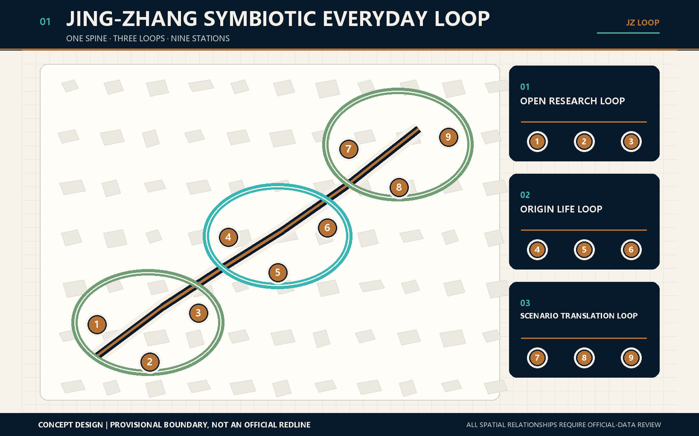
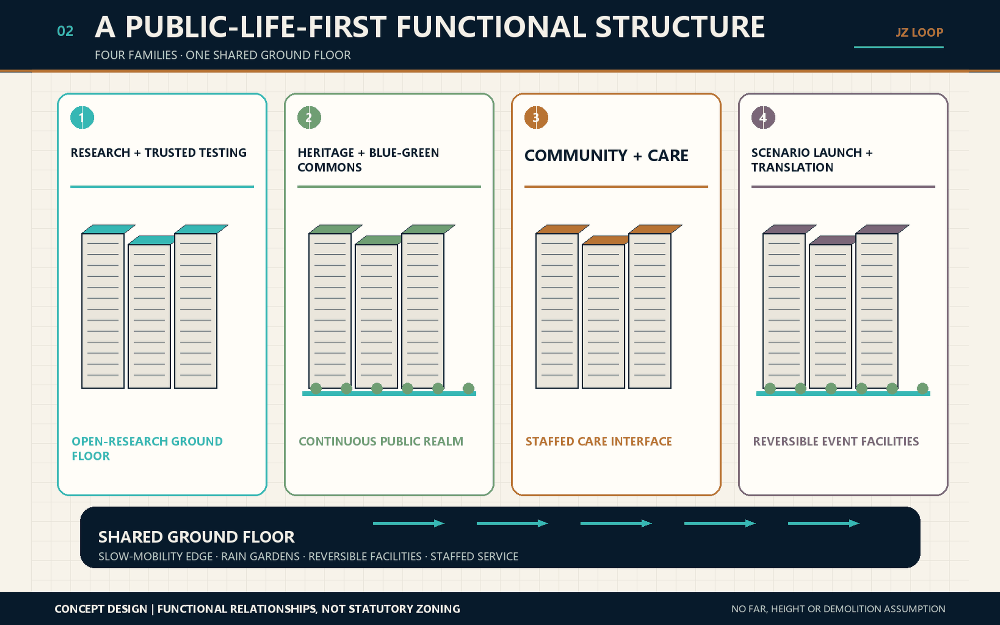
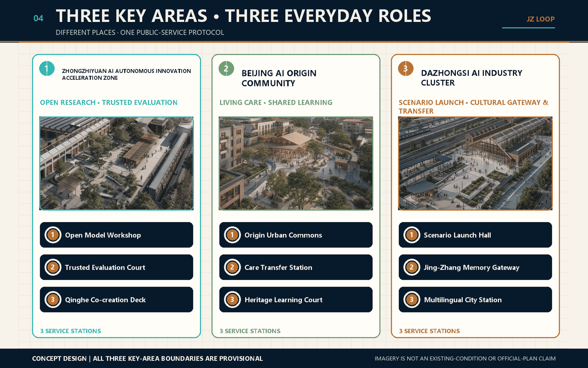
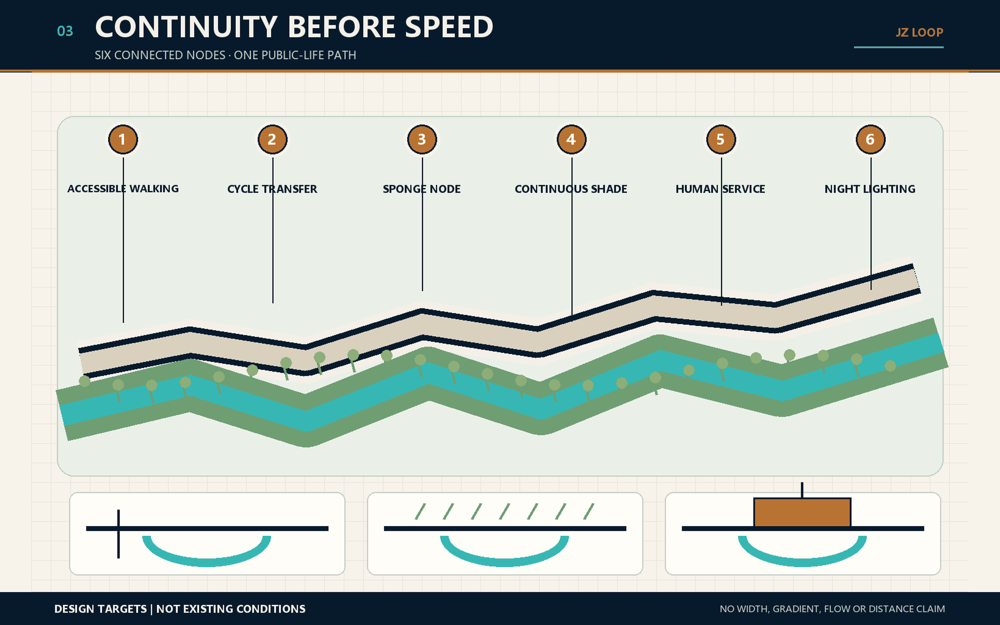
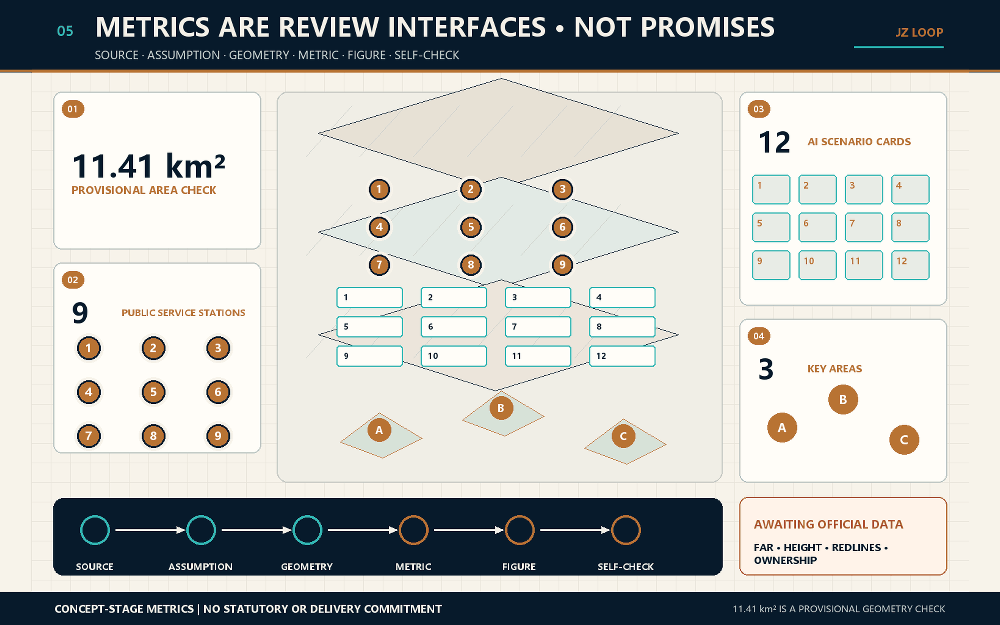

# Jing-Zhang Symbiotic Everyday Loop

## Design Basis and Source List

The proposal begins with public infrastructure, not a technology spectacle. AI earns a place here only when a person can reach a service more easily, understand why a recommendation appears, find a human when it fails, and continue using public space without surrendering unnecessary data. The taskbook establishes three position statements, five functions, three areas and two wings, and six Agent tasks; the official announcement establishes the written scope and approximate areas. Neither source proves that a proposed facility has been approved. [source:OFFICIAL-ANNOUNCEMENT] [source:AGENT-TASKBOOK]

Evidence is used at four levels. Formal sources support only the matters they explicitly document. Background sources explain context or precedents. Provisional geometry supports composition, offline recalculation and design discussion only. Proposal-generated data describes this entry. Verified official polygons, ownership, regulatory controls, road redlines, utility capacity, heritage controls and confirmed operators remain unavailable, so `assumptions.json` keeps them pending official or professional confirmation. [source:SOURCE-REGISTRY] [source:PROCESSED-FACT-PACK]

The narrative explains decisions; JSON and GeoJSON retain the exhaustive audit trail; five paired boards provide the fast review layer. External cases are paraphrased for their mechanisms and limits. Their photographs, maps, marks and visual identities are not copied. Every spatial move is a conceptual recommendation for professional development, not a planning, engineering, legal, procurement or data-protection determination. [standard:PROJECT-AGENT-OPEN-CALL-TASKBOOK] [depth:risk_missing_data]

## Three-Level Scope Framework

The three scopes form a chain that reduces uncertainty rather than three unrelated plans. The coordinated research area, approximately 43.6 square kilometres, frames talent, capital, compute, data and regional collaboration. The overall design area, approximately 11.4 square kilometres, frames the Jing-Zhang heritage spine, slow mobility, blue-green continuity and industry-community interfaces. The three key areas, approximately 368.4 hectares in total, test ground floors, nine service stations and reversible pilots. Published figures are official text values; submitted polygons remain provisional constraints. [source:OFFICIAL-ANNOUNCEMENT] [data:geometry/site_boundary.geojson] [metric:site_area_sqm]

“One spine, three loops and nine stations” translates the hierarchy into daily use. The heritage spine provides north-south continuity. Trusted Innovation, Community Life and Cultural Translation loops organise evaluation, care, learning and public release. Three stations sit in each key area. The Zhongguancun Technology Service Wing is a proposed interface for talent, capital and knowledge transfer; the Xiaoyuehe Scenario Enablement Wing is a proposed interface for real users, ecological space and public testing. Neither wing implies a confirmed operator. [standard:PROJECT-AGENT-OPEN-CALL-TASKBOOK] [depth:three_level_scope_framework]

Scale controls precision. The research layer proposes networks and institutions; the overall layer proposes connected spatial systems; the key-area layer specifies space types, minimum facilities and operating ledgers. Any statement requiring an exact boundary, FAR, height, underground engineering or property determination remains pending official data and professional survey.

## Coordinated Research Area: Industry and Future City Research

The industry strategy is an eight-factor ecosystem, not a speculative company list. Land supplies adaptable test settings; space supplies shared research and public interfaces; industry supplies genuine problems; finance supports staged validation; talent connects research with users; compute is allocated by task; data is purpose-limited and minimised; and scenarios test public value. These factors become an ecosystem only when admission, outcomes and exit are transparent. [source:BEIJING-THREE-AREAS-WINGS] [source:HAIDIAN-INDUSTRY]

Six official cases contribute different lessons. Punggol Digital District links a district operating platform with university, industry and a governed living lab. Mila couples a multi-university research community with bounded open science and technology transfer. STATION F uses programmes, rather than desk rental alone, as its admission and service structure. High Tech Campus Eindhoven combines shared laboratories, pilot production and active cluster management. Dubai AI Campus packages licensing, workspace, capital access and training. Testbed Helsinki connects public problems, short pilots, contractual IP and post-test evidence. [source:CASE-PUNGGOL-JTC] [source:CASE-MILA]

| Case | Transferable mechanism | Spatial carrier | Condition that cannot be copied |
|---|---|---|---|
| Punggol Digital District | District platform linking operations and experimentation | Mixed district, university, public ground plane and digital twin | Central land control, pervasive sensing and long public investment cannot be assumed [source:CASE-PUNGGOL-JTC] |
| Mila Montréal | Research community linking open science, industry and public purpose | Collaborative institute plus distributed universities | Academic reputation, national strategy and multi-university governance take decades [source:CASE-MILA] |
| STATION F | Layered programme admission with concentrated support | SHARE, CREATE and CHILL zones with housing support | Paris capital density, a huge heritage hall and private anchor capital are not portable [source:CASE-STATION-F] |
| High Tech Campus Eindhoven | Shared technical facilities and a scale-up ladder | Labs, cleanrooms, pilot production and social meeting spine | Brainport supply chains and compliant technical facilities cannot be replaced by coworking [source:CASE-HTCE] |
| Dubai AI Campus | Licence, legal setting, space, capital, cloud and training bundle | Coworking and R&D space beside finance and investors | A special jurisdiction, subsidised licences and visa instruments are location-specific [source:CASE-DUBAI-AI-CAMPUS] |
| Testbed Helsinki | Public-problem calls, reversible pilots, contractual IP and evidence | Streets, schools, buildings, data and resident settings | Procurement, ethics, privacy, insurance and safety cannot be bypassed [source:CASE-TESTBED-HELSINKI] |

The proposal translates mechanisms, not architectural images. Zhongzhiyuan hosts open development and trusted evaluation; AI Origin Community hosts talent life and public-service feedback; Dazhongsi hosts scenario release and cultural translation. The two wings connect inputs and real settings. The cases do not prove that Beijing already has equivalent governance, law, finance or engineering conditions.

## Overall Design Area: Urban Renewal and Regulatory-Plan-Level Urban Design

The Jing-Zhang heritage public spine is the armature for the overall plan. Three functional loops overlap walking, cycling, shade, stormwater and public-service networks. The proposal does not create another fenced campus. It repairs daily links severed by roads, walls and inactive ground floors, placing legible service interfaces between transit, neighbourhood entrances, research courtyards and heritage nodes. [data:geometry/land_use.geojson] [depth:overall_spatial_structure]

Land-use graphics retain verifiable classification codes. Proposed mixed programmes are expressed through attributes and operating descriptions rather than an invented “AI land-use” category. Building moves prioritise open ground floors, adaptation and reversible facilities. New massing is a capacity test only. FAR, height, density, setbacks and road redlines remain unknown because no official controls are available. [standard:MNR-LAND-USE-CLASSIFICATION-GUIDE] [standard:MOHURD-CONTROL-DETAILED-PLANNING]

Renewal follows “service first, space second, construction last.” A public problem and service route are tested before a reversible component is placed. Permanent construction is considered only after maintenance, accessibility, safety and public value are demonstrated. A failed digital layer can therefore be removed while the staffed service and ordinary public space remain available. [depth:land_use_layout] [depth:development_intensity_controls]

## Detailed Design of Key Areas

The three key areas take distinct roles so that the nine stations do not become repeated technology showrooms. Zhongzhiyuan is the northern validation district. ZZY-01 Open Model Workshop supports explainable demonstrations and reproduction; ZZY-02 Trusted Evaluation Court hosts bias, safety and accessibility review; ZZY-03 Qinghe Co-creation Deck connects ecological edges with public discussion. Courtyards, shared lab interfaces and reversible test platforms are proposed without assuming access to private interiors. [data:geometry/key_areas.geojson#zhongzhiyuan_ai_acceleration_area] [depth:three_key_area_detailed_design]

AI Origin Community is the lived middle. AOC-01 Origin Urban Commons hosts neighbourhood deliberation and talent support; AOC-02 Care Transfer Station preserves staffed service, low interfaces and non-digital routes; AOC-03 Heritage Learning Court joins railway memory, learning and intergenerational making. AI is judged here by continuity of care and informed choice, not novelty. [data:geometry/key_areas.geojson#beijing_ai_origin_community]

Dazhongsi is the southern translation district. DZS-01 Scenario Launch Hall releases services that have passed testing; DZS-02 Jing-Zhang Memory Gateway joins historical and contemporary innovation narratives; DZS-03 Multilingual City Station links transit arrival, visitor information and staffed help. The Open Model Workshop, Origin Urban Commons and Memory Gateway are conceptual landmarks. Recognition is based on verifiable public contribution, never unauthorised portraits, corporate logos or rankings. [data:geometry/key_areas.geojson#dazhongsi_ai_industry_cluster]

Each station ledger records space type, conceptual service radius, minimum facilities, proposed accountable roles, data boundaries, maintenance, relative cost level, process/outcome/equity measures and stop conditions. S/M/L denotes complexity, not investment. Locations, radii and equipment counts must change when official boundaries, ownership and field surveys become available.

## AI Innovation Ecosystem, Personas, and AI+ Scenarios

The six tasks form one delivery chain: agent.1 establishes a shared language through concept and identity; agent.2 turns cases and the eight-factor ecosystem into institutional interfaces; agent.3 places technology in user journeys through twelve scenario cards; agent.4 supplies carriers through nine stations, three landmarks and a component library; agent.5 makes the system public through cultural programming and multilingual wayfinding; and agent.6 turns testing, review, translation and exit into continuing operations. [standard:PROJECT-AGENT-OPEN-CALL-TASKBOOK]

Five core user groups are nearby residents and carers; researchers and developers; startup and SME teams; commuters and international visitors; and public-service and site-operation staff. Children, older people, disabled people and people without smartphones are priority checks across all groups. Twelve scenarios cover accessible routes, thermal comfort, multilingual culture, model reproduction, trusted evaluation, community care, heritage learning, event service, slow-mobility interchange, stormwater maintenance, public feedback and evidence-to-adoption. [metric:scenario_card_count]

Every scenario card identifies the user, conceptual location, necessary and prohibited inputs, limited model role, human review, minimum equipment, proposed operator, measures and rollback. PILOT-01 Accessible Route, PILOT-02 Thermal Comfort Public Space and PILOT-03 Multilingual Cultural Q&A share a protocol: baseline, small reversible deployment, human review, public feedback, review, then expand, revise or stop. A pilot record is not accessibility, engineering or legal certification.

AI becomes perceptible through clear choices, not ubiquitous screens. Stations combine printed alternatives, staffed help, low-height interfaces and removable sensor mounts. Purpose, evidence, update time and appeal routes remain visible. Repeated harmful error, missing human fallback or unusable exit stops the model while the basic service remains. [depth:municipal_new_infrastructure]

## Land Use, Building Scale, and Retain-Renovate-Demolish Strategy

Provisional polygons cannot establish parcel development rights. The land-use strategy therefore sets relationships only: the heritage spine stays publicly continuous; research, community and cultural-translation programmes overlap across the loops; stations favour public ground floors, courtyard edges, interchanges and existing service nodes. Exact categories and compatibility await official plans, ownership and surveys. [data:geometry/land_use.geojson] [standard:MNR-LAND-USE-CLASSIFICATION-GUIDE]

Buildings pass four gates. Retention requires structural safety and continuing use value. Renovation prioritises accessibility, energy, active ground floors and equipment. Adaptive reuse requires ownership, fire and operating review. Demolition or new build is discussed only after professional assessment and statutory procedure. `buildings.geojson` tests massing and relationships; it is neither an existing-condition survey nor a parcel-level demolition decision. [data:geometry/buildings.geojson] [depth:retain_renovate_demolish]

Character guidance favours a restrained industrial-heritage scale, sheltered edges, permeable ground floors and small public components. Height, daylight, fire, structure, underground space and energy load remain pending. Diagrammatic massing tests enclosure, walking continuity and programme capacity; it is not an approval drawing. [depth:height_massing_character]

## Transport, Rail, Municipal Infrastructure, and Public Services

Walking, cycling, public transport and staffed continuity come before autonomous-vehicle display. The heritage spine provides the north-south slow-mobility route, while cross-links are verified incrementally at existing crossings, stations and neighbourhood entrances. Nine stations combine rest, directions, water, charging, care and emergency contact. Proposed road centrelines do not represent approved alignments or redlines. [data:geometry/roads.geojson] [depth:traffic_rail_slow_parking]

Transit interchange focuses on the legibility of the final five hundred metres. Stable IDs, colour bands, tactile and high-contrast supplements, low-height information and staffed help work together. Accessible routes require field walks and professional review; an algorithm may explain candidates but cannot make a safety determination. Cycle-pedestrian conflict, night lighting, crossings and event peaks enter the pre-pilot risk register.

Municipal and digital infrastructure is lightweight, maintainable and permissioned by zone. Event power, networks, sensor interfaces and enclosures sit in reversible components. Edge aggregation is preferred. Facial recognition, unnecessary precise traces and undisclosed cross-context profiles are prohibited as conditions for basic service. Capacity, utilities, fire and energy need confirmation by accountable authorities and professionals. [depth:municipal_new_infrastructure]

Digitalisation does not remove human service. For medical, social-security, financial and utility-payment services specifically named in applicable law, staffed guidance and processing must be assessed case by case. The proposal also uses human fallback as a broader design principle without misrepresenting it as a universal statutory conclusion. [source:BARRIER-FREE-LAW]

## Blue-Green Network, Public Space, and Urban Character

The Qinghe, Xiaoyuehe, Jing-Zhang heritage line and neighbourhood greens are treated as climate and everyday-life infrastructure. Proposed moves add shade, rain gardens, inhabitable edges, ecological buffers and crossings. The recalculated concept green ratio of about 12.34% is an internal comparison from provisional geometry; it is not a statutory green target or precise official area. [data:geometry/green_space.geojson] [metric:green_ratio]

Public space has four levels: route, pocket, station and key-area courtyard. The conceptual footprint of nine stations is about 2.04% of the provisional site. This tests visibility, walkability and maintenance rather than setting a construction quantity. Components that conflict with green, heritage, transport or property controls must move, shrink or disappear. [data:geometry/public_space.geojson] [metric:public_space_ratio]

The identity system combines deep navy, warm copper and ivory with public-interest cyan, ecological green and risk brick. Cultural wayfinding has three layers: railway heritage, Zhongguancun innovation and public AI culture. Belt logo, local wayfinding and recognition displays remain related but distinct. The component library prioritises shade, seating, care, directions, staffed desks, low interaction, event power and removable sensor interfaces—without pseudo-futurism or unauthorised brands. [standard:MOHURD-URBAN-DESIGN-MEASURES] [depth:blue_green_public_space]

## Renewal Projects, Implementation Policy, and Phasing

Implementation begins with three low-risk pilots, not permanent buildings. Phase 1 aligns official data, field walks, baselines and ethics/data assessment. Phase 2 places printed wayfinding, temporary desks, shade and low-height interfaces for PILOT-01 to 03. Phase 3 uses a public review to remove, revise or expand them. Only services that sustain public value, human fallback and maintenance enter long-term spatial development. [data:geometry/phasing.geojson] [depth:phasing_implementation]

The twelve-month programme cycles through problem calls, co-definition, prototypes, field tests, public reviews and translation. The developer community is a working network with admission notes, contribution records, reproducible material, mentor time and exit rules—not an audience list. Scenario access uses an open application, data-boundary review, site matching, a test agreement and a final report. Activities, procurement, grants, sites and communications remain proposed mechanisms.

Four gates control translation: the public-interest gate checks necessity, fairness and non-digital alternatives; the professional gate checks planning, engineering, accessibility, safety and data protection; the operations gate checks responsibility, maintenance and cost; the evidence gate checks baselines, results and reproducibility. Passing does not guarantee procurement. Failure leads to redesign, non-digital fallback or closure. [depth:renewal_project_list]

The project register groups the nine stations, three pilots, three landmarks and spine components. Each record states entry conditions, proposed role, missing information, relative complexity, review points and exit. Without ownership, approvals, finance and engineering evidence, the proposal makes no construction schedule or investment commitment.

## Metrics, Area Recalculation, and Compliance Matrix

Metrics occupy three evidence classes. Recalculable internal measures include the provisional site at about 11.41 square kilometres, concept green and public-space ratios, and three key areas. Regulatory measures such as FAR, height, density, setbacks and facility standards wait for official controls. Operational measures—successful arrival, human-review rate, usable exit, equity gaps, maintenance response and public understanding—must be produced by pilots. One class cannot substitute for another. [metric:site_area_sqm] [metric:service_station_count]

Human-facing precision is deliberately lower than machine precision: “about 11.41 sq km (provisional geometry),” “about 12.34% concept green ratio,” and “about 2.04% conceptual station footprint.” Machine files retain reproducible values. When official polygons arrive, the builder must project them into the specified CRS and regenerate geometry, metrics, figures and checks. [metric:public_space_ratio] [depth:metrics_recalculation]

`compliance_matrix.json` covers the seventeen announcement requirements and agent.1–agent.6. `standard_matrix.json` distinguishes mandatory standards, background references and missing official material. `design_depth_matrix.json` links fifteen professional depth items to evidence and limitations. R-01 through R-22 map review repairs to narrative, ledgers and later board/web/PDF tasks; status changes only after the referenced content is generated and checked.

## Risk, Copyright, and Compliance

The greatest risk is false certainty. Site polygons, station positions, massing, operating roles, event calendars and pilots are therefore labelled conceptual. Official redlines, controls, property, utilities, heritage, fire, investment, procurement and accountable operators must exist before approval or construction decisions. [source:BOUNDARY-SOURCE] [depth:risk_missing_data]

Data governance uses purpose limitation, minimisation, short retention, zoned permission, human review and exit. Facial recognition is not a public-space admission condition. Basic navigation does not require unnecessary precise traces. Undisclosed cross-context profiling is prohibited. Before a pilot, the real accountable party must complete data-protection, cyber-security, ethics, accessibility and public-safety review; this proposal makes no case-specific legal determination.

Text, tables, conceptual geometry and code-rendered layers were produced by an AI agent from public or cleared material. External case websites were consulted only for factual mechanisms. No JTC, Mila, STATION F, HTCE, DIFC or Helsinki image, map, logo or page layout is reproduced. Website limits, image-2 provenance, fonts and build tools are recorded in `sources.json` and the copyright statement. [source:CASE-STATION-F] [source:CASE-DUBAI-AI-CAMPUS]

Chinese and English are editorial equivalents, not sentence-by-sentence substitution. They keep the same sections, factual status, IDs, metrics and figure positions while restructuring argument for each language. International communication must say “a concept proposal under review”; it may not imply selection, approval, investment or construction.

## References

Claim-adjacent markers keep the reading layer light. Full publisher, URL, access date, permitted use, prohibited use and reuse limits remain in `sources.json`. The controlling evidence is the official announcement, the cleared Agent taskbook summary, the public source registry and local professional-standard snapshots. Provisional boundaries support generation and recalculation only. [source:OFFICIAL-ANNOUNCEMENT] [source:SOURCE-REGISTRY]

The six official precedent entry points are JTC Punggol Digital District, Mila, STATION F, High Tech Campus Eindhoven, DIFC Dubai AI Campus and City of Helsinki Testbed Helsinki. They support mechanism comparison, not Beijing site facts, policy commitments or engineering feasibility. [source:CASE-HTCE] [source:CASE-TESTBED-HELSINKI]

The structured audit layer consists of `metrics.json`, `assumptions.json`, GeoJSON, the compliance/standard/design-depth matrices, and the station, scenario, annual-programme, case, rights and repair ledgers under `visual/assets/`.
