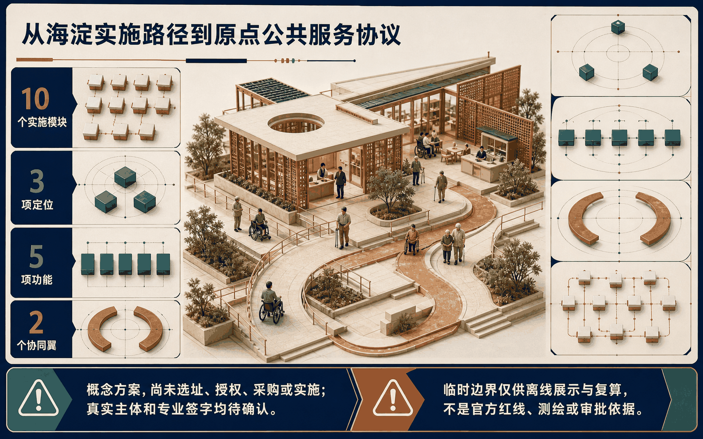
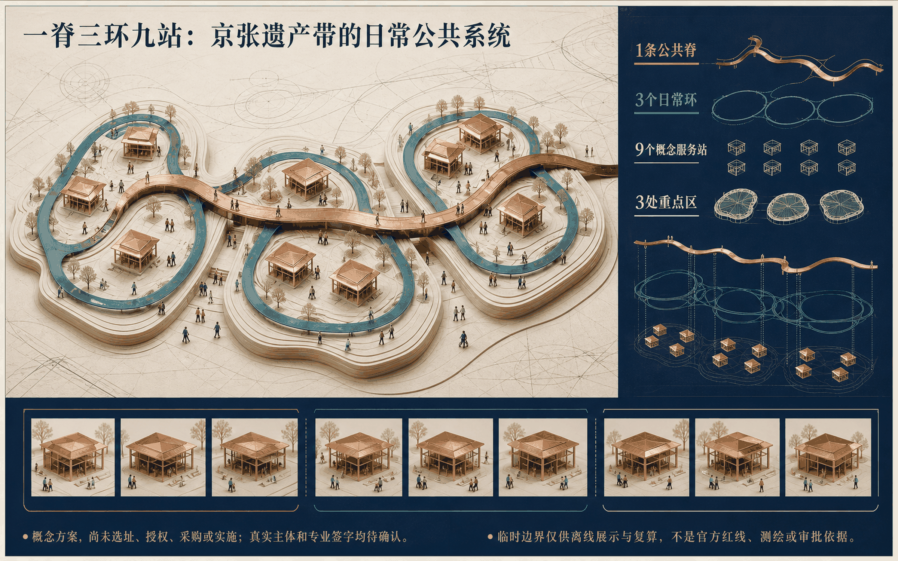
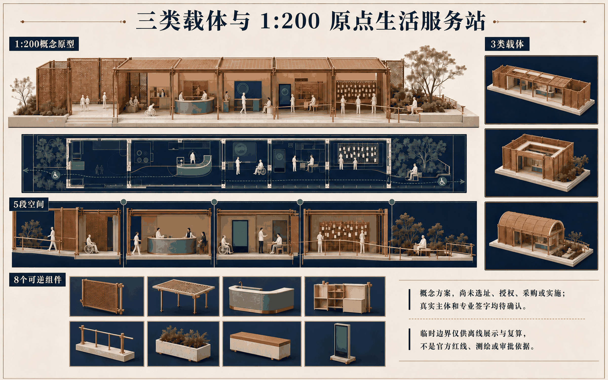
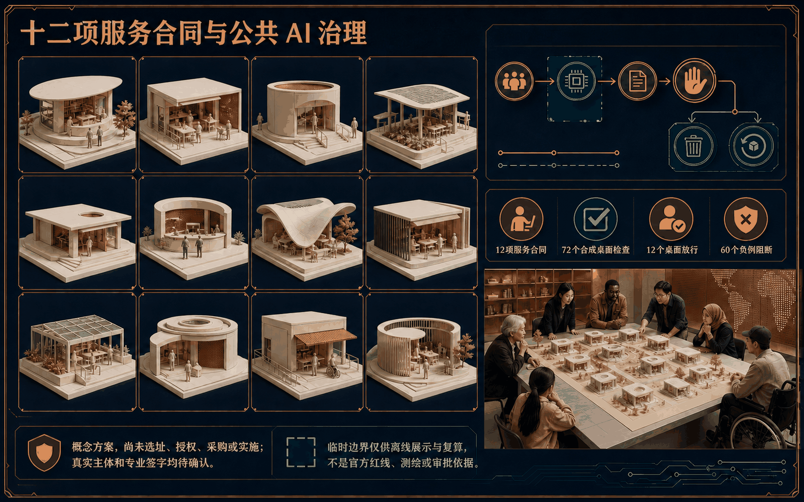
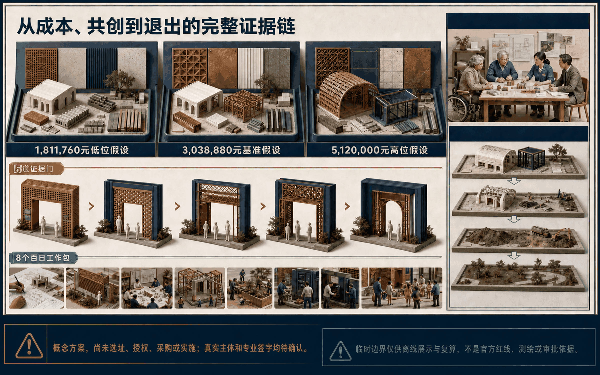

# 京张共生日常环｜原点公共服务协议

## 设计依据与资料清单

### 海淀现行实施指引

本方案以 2025 年 7 月 1 日（2025-07-01）施行、当前有效的《海淀区城市更新导则（2025年版）》与《海淀区城市更新实施指引（2025年版）》作为实施逻辑主轴。该文件把四区协同、人工智能创新街区、京张铁路遗产廊道、第三空间、无障碍慢行、项目生成和公众参与纳入海淀更新工作，并明确区住房城乡建设部门、街镇及相关专业部门的转介职责。这里的“转介”是待咨询的职责地图，不是已签署 RACI。 [source:HAIDIAN-URBAN-RENEWAL-2025] [standard:PROJECT-AGENT-OPEN-CALL-TASKBOOK]

“原点公共服务协议”是竞赛概念对上述路径的映射：它不是城市更新实施方案申报，不是正式选址、审批、投资决定或政府背书。官方公告和任务书界定三层范围、三大定位、五大功能、三区两翼及 agent.1—agent.6；临时几何只支持离线构图和复算。 [source:OFFICIAL-ANNOUNCEMENT] [data:geometry/site_boundary.geojson] [depth:risk_missing_data]

资料分为正式现行依据、背景比较、临时/仅生成材料和方案证据四级。正式来源只支撑其明示内容；缺少官方红线、权属、控规、消防、市政、文保、结构、运营主体和授权时，结论保持待补。 [source:SOURCE-REGISTRY] [metric:site_area_sqm]

## 三层范围工作框架

统筹研究层讨论四区协同、两翼联动和土地—空间—产业—资金—人才—算力—数据—场景八要素；总体设计层以京张遗产公共脊连接可信创新环、社区生活环与文化转化环；重点区层用三处重点区、九站和一个可逆原型回答空间与运营。总体范围统一写作“约 11.41 平方公里（临时几何复算）”，不制造测绘或审批精度。 [source:OFFICIAL-ANNOUNCEMENT] [depth:three_level_scope_framework] [metric:key_area_count]

一脊三环九站不是新增封闭园区，而是把创新资源接到可步行、可停留、可问路、可退出的公共生活网络。中关村科技服务翼和小月河场景赋能翼是建议协作接口；北纬社区、未来科学城、怀柔科学城、经开区与京津冀只在正式主体、权限和项目条件确认后进入协同。 [source:HAIDIAN-URBAN-RENEWAL-2025] [standard:PROJECT-AGENT-OPEN-CALL-TASKBOOK]

研究层只提出机制，总体层提出连续空间系统，重点区层提出载体类型、服务、责任角色、成本和停止门。任何涉及红线、开发权、拆除或工程量的判断均须回到官方数据和专业调查。 [depth:overall_spatial_structure]

## 统筹研究范围产业与未来城市研究

agent.2 用八要素生态图替代企业名录：每项资源都必须说明准入、公共价值、责任、评价和退出。agent.1 负责总体统筹与识别；agent.3 把场景写成服务合同；agent.4 提供九站、地标和组件；agent.5 组织文化导视；agent.6 建立年度开放、开发者社区与转化门。六项任务由同一证据链串联，而不是六份互不相干的愿景。 [standard:PROJECT-AGENT-OPEN-CALL-TASKBOOK] [depth:renewal_project_list]

六个官方案例只校准机制，不复制其图像、品牌或制度条件：Punggol Digital District 对应区级平台与大学—产业耦合；Mila 对应研究共同体和负责任 AI；STATION F 对应项目制准入与服务密度；High Tech Campus Eindhoven 对应共享技术设施阶梯；Dubai AI Campus 对应一站式企业服务；Testbed Helsinki 对应公共问题驱动的受控试验。 [source:CASE-PUNGGOL-JTC] [source:CASE-MILA]

| 案例 | 可借鉴机制 | 不可照搬条件 |
|---|---|---|
| Punggol | 区级数字平台与公共空间协同 | 不预设土地统筹和持续财政投入 [source:CASE-PUNGGOL-JTC] |
| Mila | 多机构研究、开放科学边界与责任治理 | 不预设北京机构承诺 [source:CASE-MILA] |
| STATION F | 项目准入、导师与企业服务组合 | 不复制品牌、资本密度和历史大单体 [source:CASE-STATION-F] |
| High Tech Campus Eindhoven | 实验室—中试—共享服务阶梯 | 不把共享办公等同工程设施 [source:CASE-HTCE] |
| Dubai AI Campus | 牌照、空间、资本和培训入口 | 不移植特殊法域、补贴或签证条件 [source:CASE-DUBAI-AI-CAMPUS] |
| Testbed Helsinki | 开放征集、合同化试验与试后证据 | 不绕过采购、伦理和数据保护 [source:CASE-TESTBED-HELSINKI] |

转译结果是“研究—服务—文化”三类接口：众智园强调开放研发和可信评测，AI 原点社区强调生活、照护与公众反馈，大钟寺强调遗产传播和成果首发；这不是对真实运营者、场地或资金的承诺。

## 总体设计范围城市更新与控规深度城市设计

海淀现行指引把项目生成置于实施前端，因此空间策略先定义公共问题与证据门，再讨论建设。京张遗产公共脊承担连续慢行与文化阅读，三环在轨道站点、社区入口、研发院落和遗产节点之间叠加服务，不创造“AI 用地”或替代法定分类。 [source:HAIDIAN-URBAN-RENEWAL-2025] [standard:MOHURD-CONTROL-DETAILED-PLANNING] [depth:overall_spatial_structure]

更新顺序是“人工服务基线—可逆空间测试—受控数字层—恢复验收”。FAR、高度、退线、道路红线、地下工程和拆改留结论保持 unknown；临时 `land_use.geojson` 仅用于方案关系测试。 [data:geometry/land_use.geojson] [standard:MNR-LAND-USE-CLASSIFICATION-GUIDE]

## 重点区域详细设计

### 载体决策：优选 M

原点生活服务站比较三种非选址载体：S 公共空间边缘约 120—180 m²，依赖最低但服务容量有限；M 线性共享首层约 180—280 m²，可连续组织街道、人工服务和安静花园，是竞赛优选；L 院落/园区界面约 280—450 m²，活动能力更强但权属、消防和运营依赖更高。所有面积是设计假设，不是实测。 [data:visual/assets/carrier-typologies.json#/carriers] [depth:three_key_area_detailed_design]

M 原型以 P01 普通通行、P02 人工服务厅、P03 自愿 AI 小间、P04 公开回执廊、P05 安静恢复园形成五个非强制时刻。连续无障碍绕行、人工/维护流线、独立断电断数、干式连接和恢复普通服务是设计接口；两处出口及具体净距仍待消防、结构和无障碍专业核验。 [data:visual/assets/origin-life-service-station.json#/spatial_moments] [standard:MOHURD-ARCH-DESIGN-DEPTH-2016]

CMP-01—CMP-08 覆盖遮荫、扶手座椅、照护等候、三层导视、人工服务台、低位交互、活动电源和可逆传感接口。每个组件都记录安装、日/月维护、数据边界、拆卸工具、再利用和表面恢复验收。 [data:visual/assets/origin-life-service-station.json#/components]

三处重点区各配置三个概念站点：众智园偏研发与可信评测，原点社区偏生活照护与遗产学习，大钟寺偏多语访客与文化转化。九个站点 ID 保持稳定，但位置、半径、面积和责任主体须在官方边界、权属与现场调查后重算。 [metric:service_station_count]

## AI 创新生态、人才画像与 AI+ 场景

### 十二项公共 AI 服务登记

SC-01—SC-12 每项都有公共问题、AI 必要性、同任务人工/非数字路线、允许与禁止输入、模型边界、版本与供应商依赖、人工权限、基线与公平指标、事故暂停、申诉纠错、采购审计和退出恢复。P01—P05 是共同空间旅程；任何服务都不得把人脸识别、强制精确追踪或跨场景画像作为基本公共服务条件。 [data:visual/assets/public-ai-register.json#/records] [source:UK-ATRS-2.1]

供应商状态统一为 `concept_not_procured`，接口必须可替换。物理退出包括停用智能服务、保留人工服务、导出/返还适用数据、验证删除并发布结项；恢复不了同任务人工路线时不得重新开放。 [source:AMSTERDAM-ALGORITHM-REGISTER] [depth:municipal_new_infrastructure]

72 个案例只是零网络桌面规则演练：12 个合格合同获准进入 `tabletop_only`，60 个缺责任、人工路线、数据上限、停止权限或恢复证据的负例被阻断。它不是用户测试、现场绩效、无障碍审查或算法有效性证明。 [data:simulation.json#/cases] [metric:synthetic_tabletop_check_count]

五类核心画像覆盖居民/照护者、研究开发者、初创与中小企业、通勤和国际访客、公共服务与场地人员；儿童、老年人、残障人士及无智能手机者作为贯穿性校验对象。真实反馈必须通过尚未开展的共创协议产生，不能由画像推断。 [data:visual/assets/co-design-and-equity.json#/persona_groups]

## 用地、建筑规模与拆改留方案

### M01—M10 十模块实施路径

官方实施方案路径被逐项映射：M01 项目基本信息、M02 前期评估、M03 功能定位、M04 规划方案、M05 建筑设计、M06 土地利用、M07 未登记建筑处置、M08 资金方案、M09 产业业态与运营、M10 建设时序。只有 M03、M05、M09、M10 达到 `complete_as_concept`；其余要求官方输入或授权。 [source:HAIDIAN-URBAN-RENEWAL-2025] [data:visual/assets/implementation-dossier.json#/modules]

| 模块 | 本稿交付 | 继续门槛 |
|---|---|---|
| M01—M02 | 项目身份、载体逻辑、调查和参与任务书 | 官方边界、实施主体、授权调查 |
| M03—M05 | 公共服务定位、S/M/L、M 型 1:200 概念原型 | 控规、道路红线、消防/结构/无障碍复核 |
| M06—M07 | 用地兼容与未登记建筑 no-build 门 | 权属、批准用途、登记状态 |
| M08—M10 | 成本带、运营合同、0—100 日和 3/12/36 月 | 资金授权、真实报价、运营主体、场地准入 |

建筑遵循保留、修缮、适配再用优先；没有产权、鉴定和法定程序，不提出拆除。体量仅用于检验公共空间围合、维护和容量，不是施工图或报批设计。 [data:geometry/buildings.geojson] [depth:retain_renovate_demolish]

## 交通、轨道、市政与公共服务设施

海淀指引支持无障碍慢行和第三空间，本方案据此把轨道到达后的连续路线、遮荫休息、低位/高对比/触觉导视、人工问询与九站连成一套公共服务基线。算法只能解释候选路径，不能替代现场安全判断；路线尚未完成共走或专业核验。 [source:HAIDIAN-URBAN-RENEWAL-2025] [depth:traffic_rail_slow_parking]

市政接口采用轻量、分区和可断开原则：活动电源、网络和传感面嵌入可逆组件，容量、管线、消防及能源仍待真实主管与专业团队确认。涉及法律列举的公共服务场景，人工办理边界依适用法律逐项判断；本方案把同任务人工服务作为更广的设计承诺，而不将其误称为普遍法律结论。 [source:BARRIER-FREE-LAW] [depth:municipal_new_infrastructure]

道路中心线、站点连接和“最后 500 米”都是待核验设计假设，不是交通定线或道路红线。 [data:geometry/roads.geojson]

## 蓝绿空间、公共空间与城市风貌

### 共创权利与三阶段协议

共创状态为 `planned_not_run`，`actual_sessions=[]`。三阶段依次为步行与障碍共查、十二场景桌面推演和公众决策评议；线下、电话和在线证据同等，无智能手机也能参与。招募、补偿、翻译、辅助材料、主持人和真实责任主体均待落实，没有参与人数、投票、引语或公众同意可供声称。 [source:UNHABITAT-PEOPLE-CENTRED-2025] [data:visual/assets/co-design-and-equity.json#/stages]

受影响使用者及其支持者对同任务人工服务、路线可达、申诉处理和不安全数据使用拥有 `modify_or_stop_before_release` 权。赞助方、供应商或主持人不能覆盖未解决的安全/权利停止；重开须公布纠正证据并重新复核。 [source:BARCELONA-DECIDIM] [depth:blue_green_public_space]

蓝绿系统把清河、小月河、遗产线和社区绿地视为热舒适、雨洪和日常停留基础设施。约 12.34% 概念绿地比及约 2.04% 九站概念占地比仅供内部比较；如与绿地、文保、交通或产权条件冲突，组件应移位、缩减或取消。 [data:geometry/green_space.geojson] [metric:green_ratio]

文化导视以铁路遗产、中关村创新和 AI 公共文化三层组织，不以企业 Logo 或榜单制造公共权威。 [standard:MOHURD-URBAN-DESIGN-MEASURES]

## 更新项目清单、实施政策与分期计划

### 成本、采购与退出

M 型 230 m² 中点假设的低/基准/高总额为 CNY 1,811,760 / 3,038,880 / 5,120,000。十二类费用逐行以数量×单价复算；仅恢复材料一项使用北京市官方 2026 年 7 月再生步道砖含税材料参考价 44—50 元/m²，其余 11 类都是规划假设而非报价。总额不是预算、招标控制价或投资承诺。 [data:visual/assets/cost-and-procurement.json#/totals_cny] [data:visual/assets/cost-and-procurement.json#/source_register]

采购条款覆盖公共价值、供应商披露、数据访问、互操作、安全事故、无障碍验收、审计、版本变更、服务连续、退出协助、数据返还/删除、组件撤除和表面恢复。试点通过也不自动触发采购；未解决的权利、人工服务或恢复问题直接阻断。 [depth:phasing_implementation]

### 0—100 日与 M03/M12/M36

0—100 日设置 D001-010 至 D096-100 十一个检查点，并由 G0 权利/场地、G1 人工等价、G2 受控放行、G3 停止恢复、G4 独立复核控制。M03 只允许在授权和证据齐备后形成可逆试点建议；M12 审查服务、权益与成本；M36 只有在场地、资金、运营和公平门全部通过后才讨论复制。任何阶段缺具名责任、人工兜底、撤除或删除证据，默认回滚。 [data:visual/assets/first-100-days.json#/programme] [metric:evidence_gate_count]

官方指引中的住房城乡建设部门、街镇、商务、发改、残联、城管、民政、水务、文旅、规划自然资源及权利人，被记录为待咨询的 named referral roles；它们没有作出承诺。 [source:HAIDIAN-URBAN-RENEWAL-2025] [data:visual/assets/raci-and-signoff.json#/referral_roles]

## 指标体系、面积复算与合规矩阵

指标分为临时几何复算、待官方条件、未来授权试验三类，不能跨级替换。面积写“约 11.41 平方公里（临时几何复算）”；FAR、高度和红线维持 unknown；成功抵达、公平差异、申诉、停止和恢复指标在真实授权测试前没有结果值。 [metric:site_area_sqm] [data:metrics.json]

`compliance_matrix.json` 保留任务书 23 项要求并覆盖 agent.1—agent.6；`standard_matrix.json` 保留 6 项标准；`design_depth_matrix.json` 保留 15 项专业深度；R-01—R-22 逐项指向当前证据及未完成的后续任务。矩阵中的 `complete_as_concept` 只表示概念交付完整，不代表实施条件齐备。 [standard:PROJECT-AGENT-OPEN-CALL-TASKBOOK] [depth:metrics_recalculation]

四份 PDF 的 34 页均已实测通过可检索文本检查：共提取 52,223 个字符，单页最少 647 个字符，高于每页 120 个字符的门槛；`accessibility-audit.json` 记录逐文件字符数、阅读顺序、元数据和像素一致性结果。这只是文本提取、阅读顺序、元数据与像素检查，不是法律或专业无障碍认证；语义 HTML 仍是主要结构化替代版本。 [data:visual/assets/accessibility-audit.json#/checks]

## 风险、版权与合规说明

最大风险是把概念证据写成现实事实。官方边界、权属、实施主体、运营者、公众参与、授权、采购、现场试验、工程可行性、无障碍认证和政府背书均未取得；任何后续页面、PDF 或传播文案必须保留这条边界。 [source:BOUNDARY-SOURCE] [depth:risk_missing_data]

12 项登记和 72 个合成案例只证明规则结构可执行，三阶段共创只是一套尚未运行的协议，成本只是一套敏感性模型。数据治理采用目的限定、最小必要、人工复核、申诉、暂停、删除和可恢复退出；真实部署前仍需授权主体完成适用法律、网络安全、伦理、无障碍、消防和公共安全审查。 [source:UK-ATRS-2.1]

中英文采用同一事实骨架但分别专业写作；标题、数值、M/SC/P/CMP/G 编号、来源状态、警示和图位等价。外部案例仅作事实与机制比较，不复制第三方图像、地图、商标或页面设计。 [source:CASE-DUBAI-AI-CAMPUS]

## 参考资料

主控来源为官方公告、任务书、海淀 2025 更新指引、现行专业标准以及 `sources.json` 中登记的一手机构页面。海淀指引支撑项目生成、十模块和转介路径，不支撑本项目已获选址、主体、资金或批准。 [source:HAIDIAN-URBAN-RENEWAL-2025] [source:OFFICIAL-ANNOUNCEMENT]

六个案例来源分别为 JTC、Mila、STATION F、High Tech Campus Eindhoven、DIFC 和 City of Helsinki；完整 URL、访问日期、允许/禁止用途见来源台账。 [source:CASE-HTCE] [source:CASE-TESTBED-HELSINKI]

结构化复核入口包括 `implementation-dossier.json`、`carrier-typologies.json`、`public-ai-register.json`、`cost-and-procurement.json`、`co-design-and-equity.json`、`first-100-days.json` 和 `accessibility-audit.json`。 [data:visual/assets/implementation-dossier.json]
