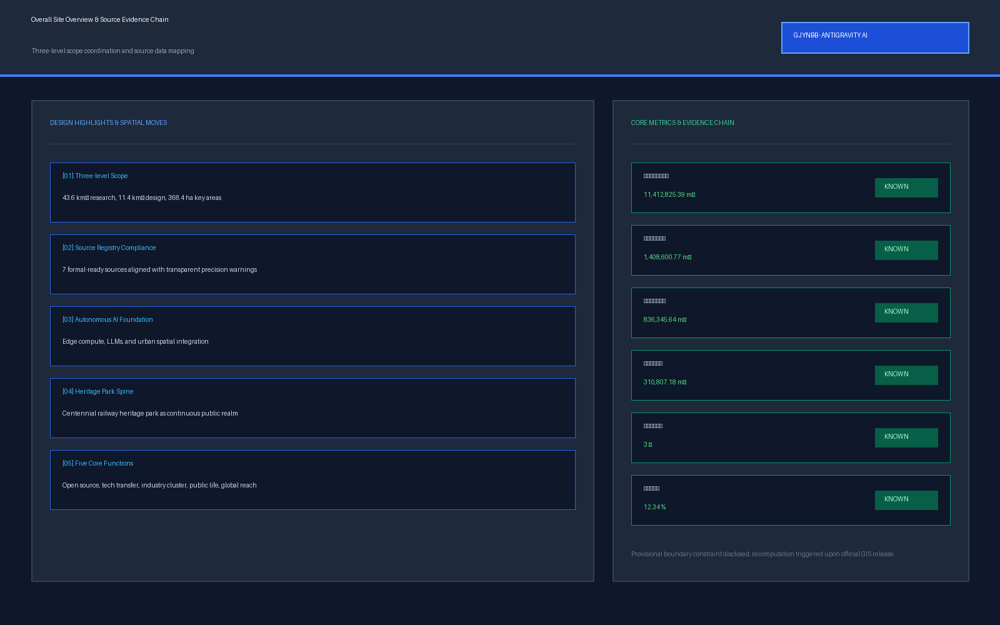
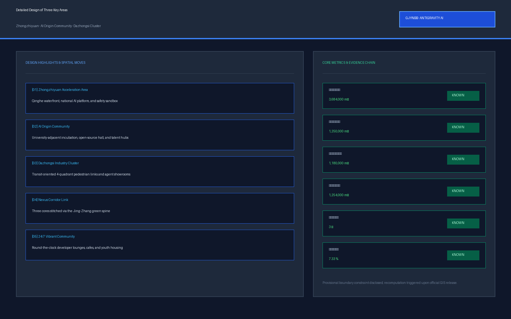

# Centennial Jing-Zhang AI Nexus Belt

## Design Basis and Source List

The proposal uses the official Centennial Jing-Zhang AI Innovation Belt urban-design announcement and the Agent Taskbook as the task authorities [source:OFFICIAL-ANNOUNCEMENT] [source:AGENT-TASKBOOK] [standard:PROJECT-OFFICIAL-ANNOUNCEMENT] [standard:PROJECT-AGENT-OPEN-CALL-TASKBOOK]. Site facts, source boundaries, and missing-data items are traced back to `brief/site-package/`, `data/source_registry.json`, and `data/processed/agent_fact_pack.md` [source:SITE-PACKAGE] [source:SOURCE-REGISTRY] [source:PROCESSED-FACT-PACK].

`geometry/site_boundary.geojson` and `geometry/key_areas.geojson` are **provisional rough geometry**, not official redlines, statutory planning boundaries, or approval bases. GeoJSON is stored in EPSG:4326 and area calculations are reprojected to EPSG:4548. Site area, green ratio, public-space ratio, and three key-area areas are low-confidence reproducible design-model values and must be recalculated when official polygons are released [data:geometry/site_boundary.geojson#SITE-001] [data:geometry/key_areas.geojson#PROV-KEY-001] [metric:site_area_sqm] [metric:green_ratio] [metric:public_space_ratio].

External cases are not treated as Haidian site facts. Kendall Square, Toronto Vector, STATION F, one-north/Kampong AI, Seoul AI Hub, and Mila are used only to compare how innovation ecosystems organize space and operations; no company list, performance figure, or policy commitment is imported into the site proposal [source:CASE-KENDALL-SQUARE] [source:CASE-TORONTO-VECTOR] [source:CASE-PARIS-STATION-F] [source:CASE-SINGAPORE-ONE-NORTH] [source:CASE-SEOUL-AI-HUB] [source:CASE-MONTREAL-MILA].

## Three-Level Scope Framework

The three scopes form one research-to-space-to-prototype system [depth:three_level_scope_framework] [depth:overall_spatial_structure]:

| Level | Completed response | Auditable evidence |
| --- | --- | --- |
| Coordinated research scope | AI ecosystem, three areas/two wings, regional collaboration interfaces, identity and long-term operations | agent.1/2/6 sections; `compliance_matrix.json` |
| Overall design scope | one belt/three cores/two wings, land use, mobility, blue-green/public realm, phasing and six renewal projects | [data:geometry/land_use.geojson#LU-001] [data:geometry/roads.geojson#ROAD-001] [data:geometry/phasing.geojson#PHASE-001] |
| Three key areas | Zhongzhiyuan Open R&D Garden, AI Origin Campus-to-Street Seam, Dazhongsi Four-Quadrant Exchange Hall | [data:geometry/key_areas.geojson#PROV-KEY-001] [data:geometry/key_areas.geojson#PROV-KEY-002] [data:geometry/key_areas.geojson#PROV-KEY-003] |

The overall concept is **Jing-Zhang Intelligence Commons**. The railway heritage park is the public-realm and cultural spine; the three key areas are innovation cores; the Zhongguancun Technology Services Wing and Xiaoyuehe Scenario Empowerment Wing are conceptual collaboration interfaces rather than new statutory boundaries. The core visual evidence is regenerated from the same committed spatial layers, rather than from an unrelated illustrative base map.

## Coordinated Research Area: Industry and Future City Research

### agent.1 Overall Concept, Identity, and Three Areas / Two Wings

**Primary name:** Jing-Zhang Intelligence Commons. Short communication name: **JZ·AI Commons**. The identity links continuous railway heritage public space with public knowledge, open-source collaboration, and urban AI services rather than presenting the corridor as a closed business-park brand.

**Logo/VI direction:** two parallel rail lines express Jing-Zhang railway memory; three nodes identify Zhongzhiyuan, AI Origin, and Dazhongsi; a continuous pulse through the nodes creates a JZ-like open loop. The mark must work as a single-color line icon, a 16 px digital icon, and large wayfinding. The semantic palette is Heritage Graphite, Public-Realm Green, and Intelligence Electric Blue. No proprietary font is required; rendering should use a legally embeddable local CJK-capable font and fall back to another full-glyph font if coverage is incomplete. Any new font or image asset must be registered with provenance and license.

**Three positionings and five functions** map directly to the Agent Taskbook [source:AGENT-TASKBOOK]: the Centennial Jing-Zhang Cultural Belt uses heritage narrative, public space, and walking experience as the civic base; the Urban AI Life Experience Belt embeds AI services in commuting, community life, education, health information, legal information, and public space; the AI Integration Innovation Belt forms a loop from research and open source through testing, enterprise translation, and international communication. Autonomous innovation is anchored at Zhongzhiyuan; the world-class ecosystem is organized by AI Origin and the two wings; AI+ scenarios use the Xiaoyuehe wing and the whole corridor; the AI-vibrant city is expressed through public realm and daily services; AI-governance discourse is anchored by the safety sandbox and public audit.

**Three areas / two wings collaboration loop:** AI Origin Community is the research-output, talent, and open-source source core; Zhongzhiyuan is the full-stack R&D, evaluation, safety-governance, and low-carbon-infrastructure validation core; Dazhongsi is the intelligent-device, content, roadshow, and international-exchange market core. The Zhongguancun Technology Services Wing is an IP, legal, financing, enterprise-service, and global-resource interface rather than a new administrative boundary. The Xiaoyuehe Scenario Empowerment Wing treats community, blue-green space, walking, and civic service as open test interfaces with public benefit first.

Regional cooperation is framed as **interfaces, not commitments**. Beiwei Community is a neighborhood daily-service interface; Future Science City and Huairou Science City are research-facility and scientific-output interfaces; Beijing E-Town is a manufacturing-validation and industrialization interface; Beijing-Tianjin-Hebei is a cross-regional talent, scenario, and supply-chain interface. Specific projects require later confirmation by relevant parties.

### agent.2 Six Global Cases and AI Ecosystem Map

| Case | Verifiable characteristic | Translation for Jing-Zhang |
| --- | --- | --- |
| Cambridge Kendall Square [source:CASE-KENDALL-SQUARE] | Research/innovation coexists with housing, retail, public space and transit | Avoid a closed campus; innovation space shares public realm with residents |
| Toronto Vector Institute [source:CASE-TORONTO-VECTOR] | Research talent connected to industry adoption and translation | AI Origin anchors talent/research, Zhongzhiyuan testing, Dazhongsi application/showcase |
| Paris STATION F / F/ai [source:CASE-PARIS-STATION-F] | Dense startup campus with programs, partner services, and community events | Operate through programs + services + events, not space leasing alone |
| Singapore one-north / Kampong AI [source:CASE-SINGAPORE-ONE-NORTH] | Work-live startup community, dedicated infrastructure, testbeds, community-building | Place talent and testing close together while retaining non-AI fallbacks for civic services |
| Seoul AI Hub [source:CASE-SEOUL-AI-HUB] | City-created AI cluster with enterprise and talent support | Provide transparent, reservable enterprise/test interfaces rather than one-off showcases |
| Montréal Mila [source:CASE-MONTREAL-MILA] | University-linked research anchor, open-science culture, industry and startup translation | Place open-source release, research exchange and startup translation in walkable urban fabric |

The resulting **eight-layer ecosystem map** is: knowledge source → talent/open source → compute/tools → data governance → capital/IP/professional services → enterprise translation → urban test scenarios → public benefit/international communication. AI Origin hosts knowledge/talent/open source; Zhongzhiyuan hosts compute/governance/testing; Dazhongsi hosts enterprise/market/communication; the Zhongguancun wing adds capital/IP/services; the Xiaoyuehe wing adds community scenarios/public benefit. It is an operational relationship map, not an inventory of existing firms.

The enabling mechanism is equally explicit: land and space prioritize reversible renewal and shared ground floors; industry is connected through open challenge and scenario lists; finance is described as a method rather than a fabricated amount; talent support uses short-stay housing, night collaboration, public services, and international events; compute access is tiered with energy/thermal review; data requires authorization, minimization, audit and exit; scenarios progress through open application, risk grading, sandbox testing, human acceptance, and limited expansion.

## Overall Design Area: Urban Renewal and Regulatory-Plan-Level Urban Design

The structure is “one belt, three cores, two wings, multiple scenarios, and a blue-green slow-mobility loop.” Land use, buildings, roads, green space, and public realm are design-proposal layers [data:geometry/land_use.geojson#LU-001] [data:geometry/buildings.geojson#BLDG-001] [data:geometry/roads.geojson#ROAD-001] [data:geometry/green_space.geojson#GREEN-001] [data:geometry/public_space.geojson#PUBLIC-001], not statutory control plans [standard:MOHURD-CONTROL-DETAILED-PLANNING] [standard:MNR-LAND-USE-CLASSIFICATION-GUIDE].

Four spatial actions organize the proposal. **Stitch** repairs heritage-park walking breaks, road crossings, and station access. **Open** turns selected ground floors, shared courtyards, and waterfront edges into reservable but everyday-accessible interfaces. **Embed** inserts release, enterprise service, civic service, and light-compute functions into existing urban fabric rather than relying on wholesale demolition. **Reversible** uses removable facilities for activities, testing, and display until official redlines, heritage, fire, and utility conditions are confirmed [depth:land_use_layout] [depth:development_intensity_controls] [depth:retain_renovate_demolish].

## Detailed Design of Key Areas

| Key area | Urban prototype | Core spatial action | AI/industry action | Preconditions |
| --- | --- | --- | --- | --- |
| Zhongzhiyuan, approx. 193 ha (provisional) [metric:zhongzhiyuan_area_sqm_provisional] | **Open R&D Garden** | shared test courtyards—Qinghe civic waterfront—walking R&D loop; active ground floors | safety sandbox, model evaluation, low-carbon compute display, standards workshops | river/flood, fire, ownership, energy, official boundary |
| AI Origin, approx. 104 ha (provisional) [metric:ai_origin_area_sqm_provisional] | **Campus-to-Street Translation Seam** | 5–10-minute walking continuity, active release/service ground floors, low-disruption renewal | open-source release, IP/legal service, near-campus incubation, talent community | campus/park boundary, ownership, rail and ground-floor use confirmation |
| Dazhongsi, approx. 72 ha (provisional) [metric:dazhongsi_area_sqm_provisional] | **Four-Quadrant Station-City Exchange Hall** | walking continuity across four quadrants, civic lounge, continuous commercial/industry frontage | intelligent-device showcase, international roadshow, data-compliance lounge | PROV-KEY-003 does not prove station containment; station/road/utility review required |

All three polygons are rough placeholders and are displayed only as rounded approximate areas. Official geometry triggers full recalculation [depth:three_key_area_detailed_design]. The detailed-design figure is deliberately generated from `key_areas.geojson` and intersecting committed design layers so reviewers can distinguish the provisional boundary from internal design actions.

## AI Innovation Ecosystem, Personas, and AI+ Scenarios

Eight personas are used as design lenses, not as profiling categories: open-source developer; startup team; enterprise visitor; university faculty/student; local resident; older adult; disabled or non-smart-device user; and night-shift/service worker. Each has a non-digital or human fallback. Residents are not commercially profiled or credit-scored; older adults retain physical wayfinding and staffed help; disabled/non-smart-device users can complete essential access without a phone; and night safety does not require face recognition or continuous location [metric:persona_count].

### agent.3 Ten Operable and Exitable AI Scenario Cards

| ID | Spatial carrier | Data and AI capability | Operating role | Human takeover / degradation | Acceptance KPI and exit |
| --- | --- | --- | --- | --- | --- |
| S01 Open-source Release Hall | PROV-KEY-002 | voluntarily submitted code/model metadata; search, summary, display assistance | community operator + human host | no attendee trajectory tracking; human host can run the event alone | rights status verifiable; disputed content removed |
| S02 AI Safety Sandbox | PROV-KEY-001 | authorized test sets; evaluation, red teaming, log analysis | test operator + safety lead | high-risk tests require approval; one-click stop/isolation | logs complete and unauthorized access blocked; stop if isolation fails |
| S03 Edge Compute Stop | corridor nodes | equipment/environment health; edge inference | facility operator + IT | signs and civic basics remain functional offline | availability/energy within limits; degrade if thermal/energy constraints fail |
| S04 Accessible Slow-Mobility Guidance | ROAD-001 / PUBLIC-001 | temporary barriers, slope, facility status; routing | public-realm operator + staffed help point | physical signs, staffed assistance, no-phone route always available | errors appealable; disable AI hints if false-positive rate becomes unacceptable |
| S05 International Roadshow Lounge | PROV-KEY-003 | rights-cleared enterprise material; multilingual summary/captioning | venue operator + human curator | human review for sensitive/commercial material | rights state clear; unauthorized content not displayed |
| S06 Qinghe Low-Carbon Innovation Corridor | GREEN-001 | environmental monitoring; low-power status prompts | public-space operator | ecology and access override digital display | remove equipment if it interferes with ecology/access |
| S07 Near-Campus Translation Street | PROV-KEY-002 | public policy and voluntary business needs; information matching | enterprise service + professionals | legal/investment judgments require human sign-off | lead-matching only; erroneous recommendations correctable and exitable |
| S08 Data-Compliance Lounge | PROV-KEY-003 | authorization records/public rules; compliance explanation | professional consultation + venue operator | no explicit authorization = no processing; appeal channel retained | authorization traceable; stop processing if purpose cannot be explained |
| S09 AI Daily-Service Street | PUBLIC-001 / neighborhood nodes | public service information; Q&A/navigation | community service + professional counter | medical/legal/education high-impact cases go to humans | no automated eligibility decisions; incorrect information correctable |
| S10 Global AI Week Public Route | PHASE-001 / corridor | public event information; multilingual guide | event operator + public-safety staff | route remains normal public space outside events; permits acquired separately | no obstruction of essential access; shrink/cancel if safety conditions fail |

Three validation protocols make failure behavior auditable. **T1 Accessible-navigation fault injection** simulates location drift, disconnection, stale facility status, and false congestion prompts; non-AI wayfinding must still support essential access. **T2 Safety-sandbox safe exit** simulates abnormal output, unauthorized data requests, and test-domain overload; human one-click stop, traceable logs, isolation, and no unauthorized data are required. **T3 Human review for civic services** gives education/medical/legal information assistants low-confidence and conflicting questions; high-impact cases must escalate to humans and the system must state uncertainty. These are validation protocol designs, not claims of completed real-world trials [metric:validation_scenario_count] [metric:scenario_card_count].

## Land Use, Building Scale, and Retain-Renovate-Demolish Strategy

The design follows “verify existing conditions → classify retain/renovate/renew/new-build → calibrate intensity” [depth:land_use_layout] [depth:height_massing_character] [depth:retain_renovate_demolish]. Complete ownership, existing-building, control-plan, and engineering data are not available, so approved FAR, height, density, setbacks, or final demolition lists are not invented; `floor_area_ratio` remains unknown [metric:floor_area_ratio].

Priority actions are active ground floors, reversible interiors, shared courtyards, under-bridge/leftover-space improvements, and station walking stitches. Permanent building increments, structural work, fire changes, or heritage interventions remain professional-deepening items. This means the current building layer is a concept design base for spatial testing, not a verified as-built inventory or demolition schedule. Any retain/renovate/demolish decision must be revisited after ownership, existing-condition, fire, structural, and statutory-plan data arrive.

## Transport, Rail, Municipal Infrastructure, and Public Services

The mobility backbone is “rail access—heritage-park walking—two-wing cross links—three-core walking loops” [depth:traffic_rail_slow_parking]. ROAD-001 is a proposed design centerline, not a road redline [data:geometry/roads.geojson#ROAD-001]. Dazhongsi “four quadrants” is a walking-continuity design problem, not an approved station-city project.

New infrastructure follows small-scale, distributed, and shut-down-able principles [depth:municipal_new_infrastructure]. Edge compute nodes first verify power, thermal load, noise, fire, and cyber security. Civic service does not depend on one digital channel; older adults, disabled people, and non-smart-device users retain staffed and physical channels. A spatial review of rail crossings, road hierarchy, accessible paths, municipal interfaces, parking/loading, emergency access, and utility capacity is required before construction-level claims are made.

## Blue-Green Network, Public Space, and Urban Character

The Jing-Zhang heritage park, Qinghe, and Xiaoyuehe form a cultural spine plus blue-green cross interfaces [depth:blue_green_public_space] [standard:MOHURD-URBAN-DESIGN-MEASURES]. Green and public-space ratios are provisional design-model metrics, not statutory controls [metric:green_ratio] [metric:public_space_ratio]. Ecological continuity, everyday walking access, shade/rest, accessible routes, and non-digital service are prioritized over visible AI hardware.

### agent.4 Three AI Pilgrimage Landmarks, Recognition System, and Component Kit

**JZ-01 Trace Gate** is a walk-through knowledge portal using railway mileage rhythm plus an open-contribution timeline; it does not alter protected heritage fabric and its location requires heritage/ownership review. **JZ-02 Open-source Constellation** is an updateable civic contribution wall in AI Origin showing open-source, research, and public-value contributions after human review, with correction and withdrawal mechanisms. **JZ-03 Civic AI Test Yard** is a reservable Zhongzhiyuan test courtyard using removable facilities for safety, accessibility, low-carbon, and civic-service prototypes; failed trials can be removed immediately. The three landmarks form a pilgrimage route while remaining everyday public space [metric:pilgrimage_landmark_count].

The recognition system avoids ranking by capital size. Five labels are used: Open Contribution, Public Benefit, Reliability, Safety Governance, and Cross-domain Collaboration. Every displayed item needs contributor, evidence link, authorization state, update time, and withdrawal mechanism. The public-space component kit includes JZ-Bench modular rest/charging seat, JZ-Beacon bilingual low-level accessible sign, JZ-Canopy removable shade/rain cover, JZ-Edge shut-down-able edge-compute cabinet, JZ-Stage micro release platform, and JZ-Garden stormwater/sensing garden. Engineering specifications wait for fire, structural, power, and utility confirmation.

### agent.5 Cultural Narrative, Wayfinding, and International Communication

The narrative has three time layers: **railway brought knowledge into the city → Zhongguancun turned knowledge into innovation → the AI era turns knowledge into public collaborative capability**. Historical facts remain sourced; the concept does not replace history.

Wayfinding grammar uses three shapes: rail line = direction, node = place, pulse = activity/digital service. Chinese and English occupy equivalent positions; critical accessibility information never depends on a QR code. International communication always includes `Concept Proposal / Provisional Geometry / Not Approved for Construction` to prevent a submission from being mistaken for a selected or built project.

## Renewal Projects, Implementation Policy, and Phasing

Six renewal projects are expressed as a responsibility matrix [depth:renewal_project_list] [depth:phasing_implementation] [metric:renewal_project_count]:

| ID | Project | Suggested lead role | Collaborators | Time window | Key resources / approval touchpoints | Acceptance and exit |
| --- | --- | --- | --- | --- | --- | --- |
| JZ-01 | Heritage-park walking-break stitch | public-realm / mobility team | park, road, community operations | near-term pilot → mid-term works | road redline, under-bridge, accessibility, heritage | continuous essential access; temporary signs only where conditions are unclear |
| JZ-02 | Zhongzhiyuan Qinghe innovation edge | urban design + landscape | river/flood, park, enterprises | mid-term | blue line, flood, ownership, fire | ecology/access first; no permanent works without conditions |
| JZ-03 | AI Origin near-campus translation street | renewal operator | universities, parks, professional services | near-term operations → mid-term renewal | ownership, ground-floor use, fire | active ground floor/service usability; shrink if tenancy/ownership fails |
| JZ-04 | Dazhongsi four-quadrant walking link | mobility/station-city team | rail, roads, commercial operators | mid/long term | station works, intersections, utilities | validate walking continuity; retain ground-level strategy if engineering conditions fail |
| JZ-05 | Civic service + edge compute nodes | digital facility operator | energy, cyber security, community service | near-term prototype | energy, thermal, fire, cyber | essential service works offline; shut AI capability if energy/safety fails |
| JZ-06 | Global AI Week public route | event operator | venue, safety, community, international communication | annual operations | venue permits, safety, copyright | no obstruction of everyday access; shrink/cancel if permit/safety conditions fail |

`geometry/phasing.geojson` expresses concept phasing only [data:geometry/phasing.geojson#PHASE-001]. Each project therefore has a suggested responsible role, coordination interface, time window, professional prerequisite, acceptance criterion, and explicit exit condition rather than merely a project name.

### agent.6 Annual Activities and Long-Term Operations

The annual calendar is a reference model, not a fixed government program. Q1 **Open Source Spring** covers releases, contribution-wall verification, and youth developer workshops. Q2 **Civic AI Test Month** covers public tests for accessibility, low-carbon systems, civic services, and safety sandboxes. Q3 **Jing-Zhang AI Week** links the three cores through international exchange, roadshows, and a public experience route. Q4 **Responsible AI Review** performs the annual safety, privacy, public-interest, and operations review.

Developer-community rules include a public code of conduct, contributor credit, content withdrawal, conflict-of-interest disclosure, and event-safety rules. Scenario access follows six steps: application → risk grading → prototype → human acceptance → time-limited opening → review/exit, with an offline booking channel. International communication uses bilingual web pages, open-data summaries, reproducible case notes, and human-reviewed social-media assets. Talent/enterprise translation follows participation → needs diagnosis → professional service → scenario test → human review → voluntary tenancy/collaboration; automated scores do not allocate opportunities.

Long-term budgeting is methodological only: public-realm base maintenance, event operations, digital facilities, safety/compliance, and research/evaluation are budgeted separately. No government subsidy, investment amount, or funding commitment is fabricated.

## Metrics, Area Recalculation, and Compliance Matrix

`metrics.json` separates three categories. **Provisional recomputable spatial metrics** cover site area, green ratio, public-space ratio, building footprint, and the three key-area derived areas; all low-confidence values are recalculated when official geometry arrives [depth:metrics_recalculation]. **Task-structure counts** cover 3 key areas, 10 scenarios, 3 validation protocols, 8 personas, 3 landmarks, and 6 renewal projects, which are directly countable in the current package. **Metrics requiring real data or statutory controls** include FAR, building height, industrial output, talent density, event attendance, and service satisfaction; they remain unknown or future KPI methods when credible baselines are unavailable.

Bilingual visuals must not present unregistered figures such as “18”, “0.85 HHI”, “42.8%”, “57.2%”, “18.6 km”, “500 m/85%”, or “100% task coverage” as facts or achieved performance. Any future use requires a metric definition, source, formula, status, and confidence in `metrics.json`. The compliance matrix maps each announcement requirement and agent.1–agent.6 to dedicated sections, layers, metrics, and visual locations rather than reusing one generic evidence bundle.

## Risk, Copyright, and Compliance

The bilingual contract is **`proposal.md + proposal.en.md`**. Chinese and English must remain substantively equivalent on the three key areas, 10 scenarios, 3 validations, 8 personas, 3 landmarks, metric status, and risk claims. After rerendering, HTML, A3/A0 and text-bearing figures require manual page-by-page checks for glyph coverage, cropping, contrast, legends, and provisional warnings.

Major professional prerequisites are official overall/key-area polygons, control-plan conditions, road redlines, rail engineering, ownership/existing buildings, utilities, energy/drainage/flood, fire, heritage, and civic-facility data [depth:risk_missing_data] [data:geometry/constraints.geojson#CONSTRAINTS]. Until confirmed, the proposal does not claim official approval, final development volume, retain/demolish decisions, government event schedules, or funding support.

External cases are used as paraphrased comparative research only; their images, logos, and protected layouts are not copied. The naming, logo direction, component kit, and landmarks are original proposal concepts. Third-party fonts, images, trademarks, portraits, or map assets require separate license registration before use. HTML remains offline with no remote scripts, remote fonts, map tiles, iframes, forms, or external APIs. The submission-local renderer likewise uses only committed geometry/metrics plus a locally installed CJK-capable font and aborts when usable CJK glyph coverage cannot be verified.

## References

- `brief/public-brief.md`
- `brief/site-package/design_brief.json`
- `brief/site-package/agent_taskbook.json`
- `data/processed/agent_task_requirements.csv`
- `data/processed/project_scope_summary.csv`
- `data/processed/source_use_matrix.csv`
- `data/processed/missing_data_checklist.csv`
- Sources: `sources.json`
- Metrics: `metrics.json`
- Requirement evidence: `compliance_matrix.json`
- Standards and design depth: `standard_matrix.json`, `design_depth_matrix.json`
- Professional renderer: `tools/render_professional_assets.py`
