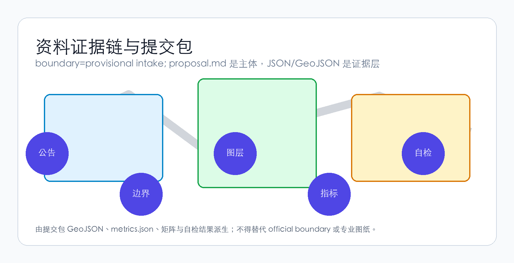
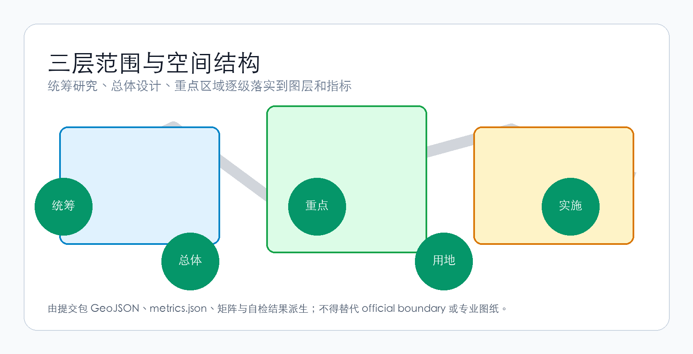
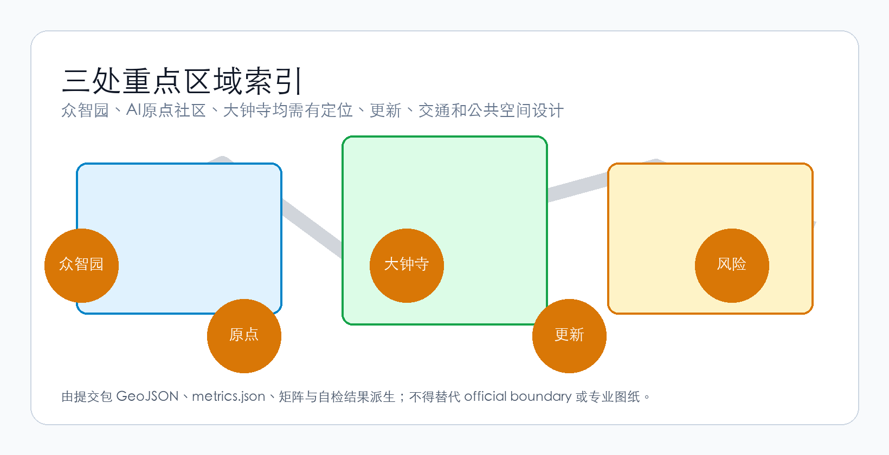
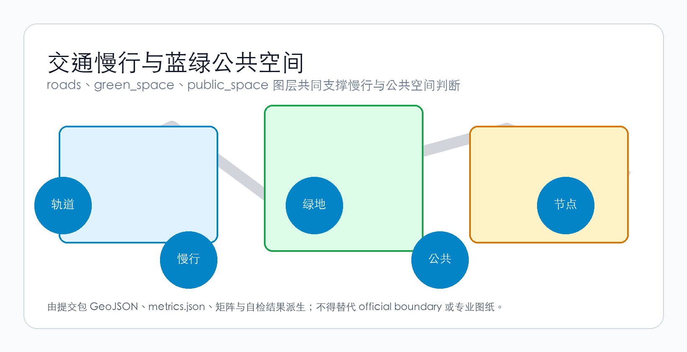
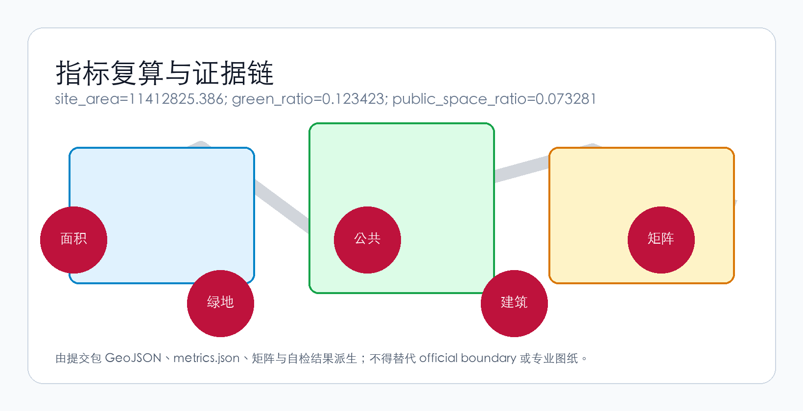

<!-- SCAFFOLD-DRAFT: this V0.1 English counterpart is an aligned outline, not a review-ready translation or final deliverable. -->

# THE JINGZHANG PROTOCOL / 京张协议

**A Civic Protocol for Human–AI Coevolution**  
**How a city learns to live with AI**

## V0.1 Core Proposition

The proposal treats an AI city as more than a collection of devices, screens and demonstrations. It imagines the Centennial Jing-Zhang AI Innovation Belt as a visible, testable, contestable, reversible and continuously updated civic protocol: AI is built here, evaluated before entering society, used in ordinary life to create public value, and revised through evidence from operation and failure. Every institutional, spatial and operational move remains a conceptual recommendation for further planning, engineering, legal, ethical and public review [source:AGENT-TASKBOOK] [standard:PROJECT-AGENT-OPEN-CALL-TASKBOOK].

The railway history is not reduced to a visual track metaphor. Jing-Zhang engineering once asked how a universal machine system could become locally mastered infrastructure in geography. The AI-era question is how machine intelligence can enter society while remaining accountable to human values, rights and public benefit. V0.1 therefore links “engineering capability into geography” with “accountable intelligence into society”; authoritative historical evidence must be added before this becomes a formal claim.

The operating loop overlays the official Three Zones and Two Wings: Zhongzhiyuan emphasizes **BUILD**, the Beijing AI Origin Community emphasizes **TEST**, Dazhongsi emphasizes **LIVE**, and the whole belt closes a **LEARN / UPDATE** loop through the two wings. It does not create a new statutory zoning system [data:geometry/key_areas.geojson#PROV-KEY-001] [depth:three_level_scope_framework].

Two civic infrastructures organize the loop. The **AI City API / Jing-Zhang AI Civic Protocol** is a proposed interface for scenario registration, data cards, evaluation gates, human review, public status, complaints and appeals, stop/rollback mechanisms and version logs. The **Jing-Zhang AI Constitution** proposes human dignity, public benefit, transparency, data minimization, accountable human review, accessibility, non-digital fallback, reversible trials and open learning. Neither is an enacted law or a claim that a centralized platform already exists.

## Design Basis and Source List

The official announcement supports the project name, textual scopes, approximate areas and task requirements. The cleared Agent taskbook supports the six Agent-facing tasks and public-compliance boundaries. Local professional-reference snapshots support urban-design, regulatory-planning and land-use-classification language. Repository provisional geometry supports generation, visualization and intake checks only; it must not be represented as an official boundary, statutory control or precise-area basis [source:OFFICIAL-ANNOUNCEMENT] [source:AGENT-TASKBOOK] [source:SOURCE-REGISTRY].

Exact official polygons, regulatory controls, road redlines, ownership/cadastral data, existing-building surveys, heritage controls, utilities and facility baselines remain pending official or rights-cleared data. Complete evidence will remain in `sources.json`, `metrics.json`, the GeoJSON layers and the three matrices.

## Three-Level Scope Framework

The Coordinated Research Area carries industry and future-city strategy; the Overall Design Area carries urban renewal and regulatory-plan-level urban design; the Key-Area Detailed Design Area tests the concept in Zhongzhiyuan, the Beijing AI Origin Community and Dazhongsi. The BUILD—TEST—LIVE—LEARN/UPDATE lifecycle translates decisions across these levels without replacing their official definitions [standard:PROJECT-OFFICIAL-ANNOUNCEMENT] [depth:three_level_scope_framework].

## Coordinated Research Area: Industry and Future City Research

The ecosystem is organized around a versioned path from model, agent, robotics, compute and evaluation tools to bounded testing, daily use and public learning. The Three Zones and Two Wings provide the official spatial framework; the protocol adds gates, evidence and feedback between them. V0.2 must verify 5–8 global ecosystem cases from primary sources and extract a specific transferable mechanism from each rather than copying place-branding or unverified performance claims [source:AGENT-TASKBOOK] [standard:PROJECT-AGENT-OPEN-CALL-TASKBOOK].

The identity combines a railway switch, a version-control branch and a civic protocol bracket. It should remain bilingual, geometric, non-corporate and reproducible with rights-cleared typography.

## Overall Design Area: Urban Renewal and Regulatory-Plan-Level Urban Design

The spatial concept uses the railway heritage public-space spine as the shared civic interface, the three key areas as lifecycle anchors, and stations, universities, enterprises and communities as an everyday network. Future versions must replace generic scaffold layers with a topology-safe land-use partition, renewal logic, mobility/public-space network, municipal/new-infrastructure strategy and phased project set derived from the same boundary and metrics [standard:MOHURD-CONTROL-DETAILED-PLANNING] [depth:land_use_layout].

FAR, height, building coverage, setbacks, specific demolition/retention, road alignments, utilities, investment and phasing cannot be asserted as approved conclusions while official controls and surveys are missing.

## Detailed Design of Key Areas

- **Zhongzhiyuan / BUILD:** a garden-like full-stack innovation area where model, agent, robotics, compute, standards and safety tools can be made and visibly evaluated.
- **Beijing AI Origin Community / TEST:** a near-university civic testing environment where residents, students, institutions and service professionals can participate in bounded trials before wider use.
- **Dazhongsi / LIVE:** an urban AI-native work, commerce, culture and public-service environment that tests whether systems create ordinary public value.

The two wings connect services, capital, professional support, scenario access and public experience. Exact locations and physical interventions remain pending official polygons, ownership, transport, heritage and engineering evidence [data:geometry/key_areas.geojson#PROV-KEY-001] [data:geometry/key_areas.geojson#PROV-KEY-002] [data:geometry/key_areas.geojson#PROV-KEY-003].

## AI Innovation Ecosystem, Personas, and AI+ Scenarios

V0.1 registers twelve scenarios and at least five user groups. Every next-stage card must specify the user need, spatial precondition, permitted and prohibited data, human-review point, operator, success metric, failure condition, incident/appeal route, rollback rule, source and geometry/visual mapping.

| ID | Scenario | Lifecycle / carrier | Primary safeguard |
| --- | --- | --- | --- |
| 01 | Model and Agent Safety Sandbox — testing and validation | BUILD / TEST; Zhongzhiyuan | red-team, audit and stop rules |
| 02 | Embodied AI Street Lab — testing and validation | BUILD / TEST; bounded test yard | geofencing, steward supervision and incident logs |
| 03 | Urban Multimodal Evaluation Lab — testing and validation | TEST; AI Origin | bias, accessibility and failure-mode evidence |
| 04 | AI City API Gateway | TEST / LEARN; belt service interfaces | registry, permissions, appeals, rollback and versioning |
| 05 | Public-Service Navigation Copilot | TEST / LIVE; community service points | assistance only, human and non-digital fallback |
| 06 | Inclusive Mobility Copilot | TEST / LIVE; park and station links | minimal sensing and no commercial resident profiling |
| 07 | Learning and Career Studio | TEST / LIVE; AI Origin learning spaces | no automated eligibility decisions |
| 08 | Health-Service Wayfinding Assistant | TEST / LIVE; community/mobility nodes | no autonomous diagnosis; professional escalation |
| 09 | Jing-Zhang Living Heritage Trail | LIVE / LEARN; railway heritage spine | sourced interpretation and public correction |
| 10 | Low-Carbon Compute and Energy Observatory | BUILD / LEARN; Zhongzhiyuan | measured performance and uncertainty disclosure |
| 11 | AI-Native Commerce and Creative Market | LIVE; Dazhongsi | provenance, rights clearance and consumer disclosure |
| 12 | Civic Deliberation and Evidence Observatory | LEARN / UPDATE; public forums | public evidence, incidents, appeals and change logs |

Initial personas include open-source developers, early-stage teams, established enterprises/operators, university students/researchers, nearby residents, older adults and people with accessibility needs, workers/commuters, visitors, public-service professionals, and urban operators/professional reviewers [source:AGENT-TASKBOOK] [depth:three_key_area_detailed_design].

## Land Use, Building Scale, and Retain-Renovate-Demolish Strategy

The formal package must use a complete, non-overlapping land-use partition and distinguish retained, renovated, demolished, new-build and pending-confirmation objects. V0.1 does not assert parcel-level actions, heights or development intensity because the required controls, ownership and existing-building evidence are missing [standard:MNR-LAND-USE-CLASSIFICATION-GUIDE] [depth:retain_renovate_demolish].

## Transport, Rail, Municipal Infrastructure, and Public Services

The concept prioritizes station integration, walking/cycling continuity, accessibility, low-intrusion sensing, public-service fallback and the relationship between new infrastructure and conventional municipal systems. Engineering routes, bridge/tunnel feasibility, utility capacity and fire/flood conditions remain for professional verification [data:geometry/roads.geojson#ROAD-001] [depth:traffic_rail_slow_parking].

## Blue-Green Network, Public Space, and Urban Character

The railway heritage park is the civic interface rather than a technology showroom. V0.1 proposes three linked AI landmarks: **Protocol Station Zero** in the AI Origin Community, where people can understand AI identity, data use, rights, human review and appeals; the **Civic AI Test Yard** in Zhongzhiyuan, where evaluation and stop mechanisms are publicly legible; and the **Jing-Zhang Commons Ledger** along the railway heritage public-space system, where contributors, protocol versions, incidents, corrections and lessons are recorded. Exact sites, scale, form and heritage relationships remain pending professional evidence [source:AGENT-TASKBOOK] [depth:blue_green_public_space].

## Renewal Projects, Implementation Policy, and Phasing

The operating rhythm is proposed as quarterly scenario-open days, semiannual evidence review, an annual Jing-Zhang Protocol Assembly and a continuous public version log. Developers/operators submit evidence; residents and users raise questions or appeals; professional teams assess spatial, technical, legal and ethical impacts; and the public record explains why a scenario scales, changes, pauses or ends. This is an operational concept, not a confirmed organizer event, budget or policy commitment [source:AGENT-TASKBOOK] [depth:phasing_implementation].

## Metrics, Area Recalculation, and Compliance Matrix

Known spatial metrics must be recomputed from the GeoJSON in EPSG:4548; missing regulatory controls must remain unknown/pending. Scenario targets and lifecycle gates must not be presented as current site conditions. The final evidence chain is `source → judgment → geometry/metric → figure/drawing → matrix → self-check` [depth:metrics_recalculation] [metric:site_area_sqm].

## Risk, Copyright, and Compliance

This proposal does not claim official approval, enacted regulation, final ownership, confirmed construction scale, engineering feasibility, funding or guaranteed implementation. It excludes non-public spatial data and personal information; every external case, image, font, icon and toolchain dependency must be attributable and rights-cleared before formal use. V0.1 remains a scaffold and must not be submitted as review-ready [depth:risk_missing_data] [source:SITE-PACKAGE].

## References

- Official open-call announcement and local reference snapshot.
- Cleared Agent open-call taskbook and structured requirements.
- Repository design brief, data source registry and provisional-geometry basis.
- Local professional reference snapshots for urban design, regulatory detailed planning and land-use classification.
- Complete machine-readable evidence remains in the submission sources, metrics, GeoJSON and matrices.
