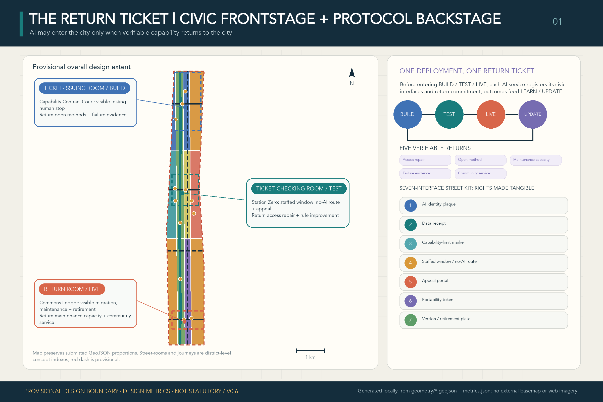
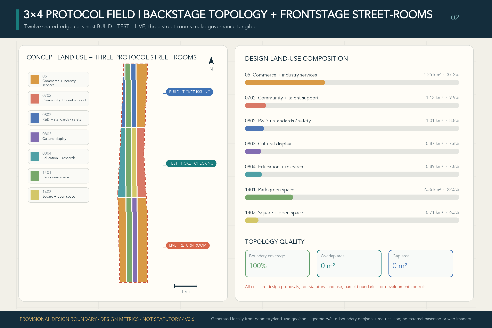
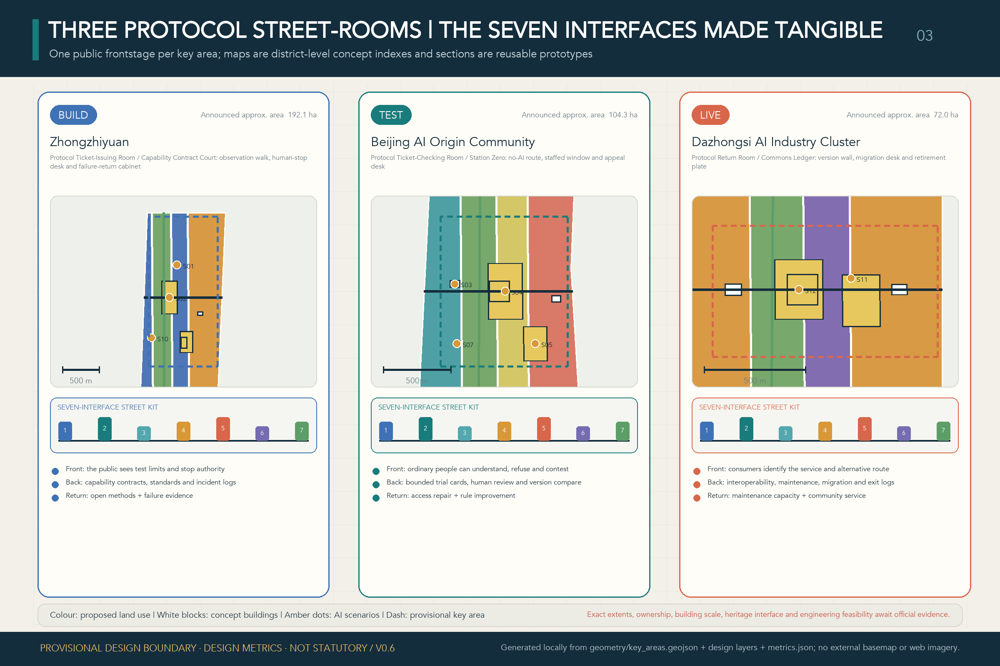
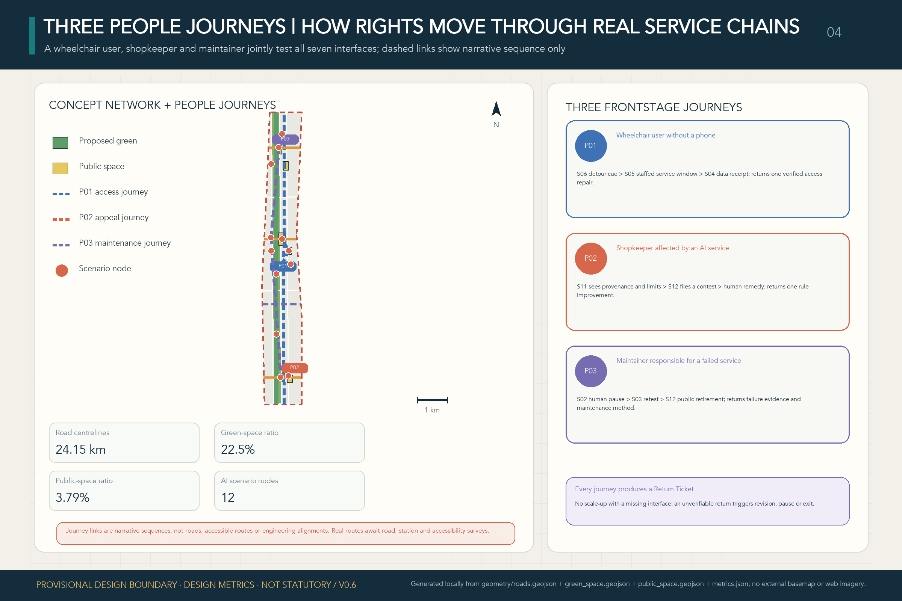
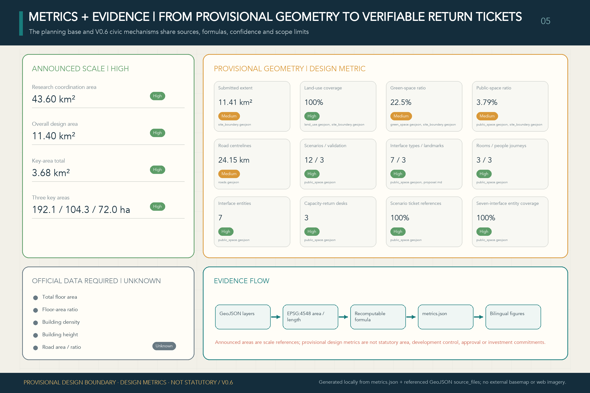

# THE JING-ZHANG PROTOCOL / 京张协议

**A Civic Protocol for Human–AI Coevolution**  
**Public frontstage: THE RETURN TICKET / 京张回程票**

**Backstage system: AI City API + Jing-Zhang AI Constitution**

## V0.6 Core Proposition

The proposal treats an AI city as more than a collection of devices, screens and demonstrations. The formal project name remains **THE JING-ZHANG PROTOCOL / 京张协议**, the backstage civic protocol system. What people meet in the street is **THE RETURN TICKET / 京张回程票**. Before any AI capability enters an everyday service, people should be able to see where it came from, why it uses data, what it can and cannot do, who takes over, how to appeal, whether records and components can move, and when it pauses or leaves. It is not an admission permit but a public receipt that can be kept, questioned and used to trigger return: **No return path, no civic departure.** Every institutional, spatial and operational move remains a conceptual recommendation for further planning, engineering, legal, ethical and public review [source:AGENT-TASKBOOK] [standard:PROJECT-AGENT-OPEN-CALL-TASKBOOK].

The railway history is not reduced to a visual track metaphor. China’s National Railway Administration describes the 1905–1909 Jing-Zhang Railway as the first state-owned trunk railway surveyed, designed, built and managed by Chinese people. Beijing’s railway heritage park restores parts of the former alignment, preserves Qinghuayuan Station and reconnects spaces once divided by the railway [source:HIST-JINGZHANG-RAILWAY] [source:HIST-JINGZHANG-PARK]. The proposal translates that history from “engineering capability into geography” to “accountable, interoperable intelligence into society.” The latter phrase is a design thesis, not a historical quotation.

The operating loop overlays the official Three Zones and Two Wings: Zhongzhiyuan emphasizes **BUILD**, the Beijing AI Origin Community emphasizes **TEST**, Dazhongsi emphasizes **LIVE**, and the whole belt closes a **LEARN / UPDATE** loop through the two wings. The Return Ticket travels along the existing Seven-Interface Civic Service Link, joining capability publication, bounded testing, everyday use, pause/retirement and rule revision into one public accountability route. It does not create a new statutory zoning system or replace the official three-level scope and Three Zones and Two Wings framework [data:geometry/key_areas.geojson#PROV-KEY-001] [data:geometry/roads.geojson#ROAD-INTERFACE-001] [depth:three_level_scope_framework].

The backstage system has two layers. The **AI City API / Jing-Zhang AI Civic Protocol** is a federated machine-and-operations interoperability contract, not a single central platform or a project-approval gate. The **Jing-Zhang AI Constitution** is a versioned civic compact revised through scenarios, participation, professional review and operational evidence. The former specifies how systems exchange the minimum necessary information; the latter specifies who may change rules, what rights people hold, and how evidence and appeals enter public memory. The Return Ticket renders both layers as a public receipt. Its seven minimum interfaces are: (1) identity/provenance; (2) data purpose/retention; (3) capability/limitations; (4) human authority/non-digital fallback; (5) appeal/redress; (6) interoperability/portability; and (7) versioning/pause/retirement/public memory [metric:protocol_interface_count]. None is an existing platform, statutory permit, enacted law or government approval process.

## Design Basis and Source List

The official announcement supports the project name, textual scopes, approximate areas and task requirements. The cleared Agent taskbook supports the six Agent-facing tasks and public-compliance boundaries. Local professional-reference snapshots support urban-design, regulatory-planning and land-use-classification language. Repository provisional geometry supports generation, visualization and intake checks only; it must not be represented as an official boundary, statutory control or precise-area basis [source:OFFICIAL-ANNOUNCEMENT] [source:AGENT-TASKBOOK] [source:SOURCE-REGISTRY]. On the provisional V0.3 base, V0.6 spatializes the Return Ticket as three nested street rooms, seven interface entities and three human journeys [metric:protocol_street_room_count] [metric:protocol_interface_entity_count] [metric:human_journey_count]. It also registers three capacity-return nodes; reference coverage from the twelve existing application scenarios is 1.0, and resolution coverage from the seven interface entities to valid rooms is 1.0 [metric:capacity_return_node_count] [metric:return_ticket_reference_coverage_ratio] [metric:protocol_interface_entity_coverage_ratio]. The new rooms and nodes do not rewrite the SITE/KEY shapes, 3×4 land-use topology or provisional V0.3 denominator. Nested rooms are counted once in the parent-public-space union, which remains 432,600 m² [metric:public_space_area_sqm]. Because exact official boundaries, controls and independent professional sign-off are unavailable, the complete V0.6 package remains an open-source concept using provisional constraints, not an approval deliverable.

Exact official polygons, regulatory controls, road redlines, ownership/cadastral data, existing-building surveys, heritage controls, utilities and facility baselines remain pending official or rights-cleared data. SITE-001 and the three KEY_AREA polygons are explicitly provisional and must trigger whole-package regeneration when official geometry arrives [data:geometry/site_boundary.geojson#SITE-001] [source:BOUNDARY-SOURCE] [source:KEY-AREA-SOURCE]. Complete evidence remains in `sources.json`, `metrics.json`, the GeoJSON layers and the three matrices.

## Three-Level Scope Framework

The Coordinated Research Area uses the official approximate **43.6 km²** figure but currently has no submitted polygon. The Overall Design Area uses the official approximate **11.4 km²** figure and provisional SITE-001, calculated at about 11.413 km² in EPSG:4548. The Key-Area Detailed Design Area uses the official approximate **368.4 ha** total and three rough provisional polygons [metric:announced_coordinated_research_area_sqm] [metric:announced_overall_design_area_sqm] [metric:announced_key_detailed_design_area_sqm]. These three levels cannot substitute for one another [depth:three_level_scope_framework].

The Jing-Zhang Protocol remains the backstage system and the Return Ticket its public frontstage. The railway heritage park forms the historic and public-space spine; Zhongzhiyuan, the Beijing AI Origin Community and Dazhongsi anchor BUILD, TEST and LIVE; universities, firms, communities and rail stations form the everyday network; and both wings return evidence to LEARN/UPDATE. V0.6 adds a protocol-entity layer along the existing Seven-Interface Civic Service Link, using nested rooms and concept index points to organize public action. It creates no fourth statutory zone or new redline and does not alter SITE/KEY shapes or the 3×4 land-use topology [data:geometry/roads.geojson#ROAD-INTERFACE-001] [data:geometry/public_space.geojson#ROOM-BUILD-001] [depth:three_level_scope_framework].

## Coordinated Research Area: Industry and Future City Research

The ecosystem is organized around a versioned path from model, agent, robotics, compute and evaluation tools to bounded testing, daily use and public learning. The Three Zones and Two Wings provide the official spatial framework; the protocol adds public interfaces, evidence and feedback between them [source:AGENT-TASKBOOK] [standard:PROJECT-AGENT-OPEN-CALL-TASKBOOK].

V0.3 retains six deliberately different case types rather than treating them as a like-for-like ranking [metric:global_case_group_count]:

| Case | Transferable mechanism | Translation and limit |
| --- | --- | --- |
| Singapore Punggol Digital District ODP | Integrated physical/digital district backbone, API access and test environment | Federated service interface between BUILD and TEST; platform efficiency does not establish civic legitimacy [source:CASE-PUNGGOL-ODP] |
| EU AI Testing and Experimentation Facilities | Lab-to-real integration, validation and end-user-defined scenarios, protocols and metrics | A staged testing ladder; testing is not regulatory approval [source:CASE-EU-TEF] |
| Helsinki and Amsterdam algorithm registers | Publicly readable information about city AI/algorithms and feedback/contact routes | System cards, accountable contacts and correction routes; disclosure alone is not audit or appeal [source:CASE-HELSINKI-AI-REGISTER] [source:CASE-AMSTERDAM-ALGORITHM-REGISTER] |
| Montréal Declaration for Responsible AI | Scenario-based citizen and expert co-construction of principles | A method for revising the civic compact; principles still need owners, cards and version logs [source:CASE-MONTREAL-DECLARATION] |
| NIST AI RMF | Continuous Govern—Map—Measure—Manage lifecycle, feedback and decommissioning | Continuous monitoring, review, pause and retirement; not a planning standard or legal approval [source:CASE-NIST-AI-RMF] |
| Toronto Quayside / Sidewalk Toronto | Open standards, data-minimization and public-interest governance were explicit project concerns before the partnership ended | Define public authority, interoperability, social licence and exit before technical lock-in; no claim that governance controversy alone caused withdrawal [source:CASE-SIDEWALK-QUAYSIDE] |

The resulting position is not another validation pipeline, common traffic-light display or abstract “city operating system.” It is **a federated AI City API interoperability layer + a versioned Jing-Zhang AI Constitution public-rights layer + the public-facing Return Ticket**. Different operators retain their own systems but provide the same seven minimum interfaces [metric:protocol_interface_count]. BUILD publishes capability contracts; TEST checks trial conditions; LIVE implements service-interface rights; and LEARN/UPDATE records continuation, modification, pause, retirement and rule revision. Passing a test is never represented as government approval.

### Frontstage Return Ticket and Backstage Two-Layer Protocol

The Return Ticket is not a pass issued to technology; it is a rights receipt left with the public. Its front explains the current capability in seven fields. Its back explains human takeover, non-digital fallback, appeal, data and component portability, pause and retirement. Its machine-readable part is exchanged through the AI City API; its public rules and amendment procedure are governed by the Jing-Zhang AI Constitution. A capability should move from testing into daily service only when its return path is as clear as its entry path [metric:protocol_interface_count] [source:AGENT-TASKBOOK] [standard:PROJECT-AGENT-OPEN-CALL-TASKBOOK].

V0.6 registers the seven minimum interfaces as seven resolvable prototype entities. Each has one lead street room and carries a rule for replicating the complete interface kit across all three rooms. Entity count is 7 and resolution coverage is 1.0 [metric:protocol_interface_entity_count] [metric:protocol_interface_entity_coverage_ratio].

| Entity | Minimum interface | AI City API machine contract | Jing-Zhang AI Constitution public right |
| --- | --- | --- | --- |
| I1 Identity and Provenance Station | identity / provenance | exchange deployment ID, accountable operator and provenance receipt | see responsibility and obtain an equivalent staffed or non-digital explanation [data:geometry/public_space.geojson#INTERFACE-I1] |
| I2 Data Purpose and Retention Station | data purpose / retention | declare purpose, minimum-data boundary, retention and deletion status | receive plain-language notice and use deletion or non-digital routes [data:geometry/public_space.geojson#INTERFACE-I2] |
| I3 Capability and Limitation Station | capability / limitations | exchange version, applicable tasks, known failures and prohibited uses | receive accountable human explanation and avoid use beyond declared limits [data:geometry/public_space.geojson#INTERFACE-I3] |
| I4 Human Authority and Non-AI Service Station | human authority / non-digital fallback | exchange takeover owner, stop status and fallback availability | complete equivalent service through a visible staffed point without mandatory AI or smartphone use [data:geometry/public_space.geojson#INTERFACE-I4] |
| I5 Appeal and Remedy Station | appeal / redress | exchange case reference, service clock, human decision and correction status | receive a trackable complaint, human decision and effective remedy [data:geometry/public_space.geojson#INTERFACE-I5] |
| I6 Interoperability and Portability Station | interoperability / portability | exchange export format, handover status and service-continuity fields | port necessary records, switch operators and avoid service lock-in [data:geometry/public_space.geojson#INTERFACE-I6] |
| I7 Version, Pause, Exit and Public Memory Station | version / pause / retirement / public memory | exchange current version, pause, retirement, change and return status | inspect a durable record of failures, changes, retirement and returned capacity [data:geometry/public_space.geojson#INTERFACE-I7] |

The identity combines a railway switch, a version-control branch and a civic protocol bracket. It should remain bilingual, geometric, non-corporate and reproducible with rights-cleared typography.

## Overall Design Area: Urban Renewal and Regulatory-Plan-Level Urban Design

V0.3 translates the protocol into a reproducible spatial matrix. North-to-south **BUILD, TEST and LIVE** lifecycle segments cross west-to-east **knowledge/R&D, public green spine, civic interface and everyday service** bands, producing twelve cells from shared cut lines. LEARN/UPDATE is a feedback network across all three segments, not a fourth statutory zone. The twelve polygons cover SITE-001 completely with no material gap, outside area or overlap; they are concept functions, not existing or statutory land use [data:geometry/land_use.geojson#LU-BUILD-01] [metric:land_use_coverage_ratio].

V0.6 does not designate a separate “Return Ticket land use.” It makes the ticket a traceable state within the existing **3×4 matrix**: a capability leaves the knowledge/R&D interface, is explained, tested and questioned across the green spine and civic interface, enters everyday service with human takeover and return still available, and sends operating evidence back to LEARN/UPDATE through the Seven-Interface Civic Service Link. The ticket is an accountability state in the network, not a new statutory land-use class or area-control metric [data:geometry/land_use.geojson#LU-BUILD-01] [data:geometry/roads.geojson#ROAD-INTERFACE-001] [depth:overall_spatial_structure].

Two longitudinal links—the **Jing-Zhang Protocol Public Green Spine** and **Seven-Interface Civic Service Link**—are crossed by BUILD, TEST, LIVE and LEARN/UPDATE links to make one connected ladder network. These are conceptual walking, cycling and service relationships, not road redlines or engineering alignments [data:geometry/roads.geojson#ROAD-SPINE-001] [data:geometry/roads.geojson#ROAD-INTERFACE-001] [metric:slow_mobility_length_m]. Three 1401 cells directly generate the green-space layer. Six public interfaces and six small program envelopes anchor the key areas; every envelope lies within its provisional key area and has zero conflict with 1401, 1403 or public-space polygons.

Against the provisional denominator, design green space is about **2.563 million m² / 22.459%**, six public interfaces about **432,600 m² / 3.7905%**, concept envelopes **27,775 m² / 0.2434%**, and the conceptual network about **24.15 km** [metric:green_ratio] [metric:public_space_ratio] [metric:concept_building_coverage_ratio]. These test design choices only. Total floor area, FAR, statutory building density, height, setbacks, road area and road ratio remain `unknown`; the completed deliverable is a control-status table, not a set of approved values [metric:floor_area_ratio] [metric:setback_m] [standard:MOHURD-CONTROL-DETAILED-PLANNING].

## Detailed Design of Key Areas

- **Zhongzhiyuan / BUILD:** Civic AI Test Yard, Capability Contract Court, Safety Evaluation Lab and Standards Hub support S01, S02 and S10. Public observation and controlled-test routes remain distinct; public trials require human stop authority, incident logging and declared capability limits [data:geometry/public_space.geojson#SCENARIO-S01] [metric:scenario_node_zhongzhiyuan_count].
- **Beijing AI Origin Community / TEST:** Protocol Station Zero, Community Service Interface Court, Learning Studio and Human Review/Appeal Point support S03, S04, S05 and S07 and provide professional referral for S08. A public trial card precedes service activation [data:geometry/public_space.geojson#SCENARIO-S04] [metric:scenario_node_ai_origin_count].
- **Dazhongsi / LIVE:** Jing-Zhang Commons Ledger, Dazhongsi Urban Living Room, Living Heritage Studio and AI-native commerce space support S11 and S12 and connect to S09. Wider service diffusion requires independent evaluation, consumer notice, appeals and retirement arrangements [data:geometry/public_space.geojson#SCENARIO-S12] [metric:scenario_node_dazhongsi_count].

The two wings connect services, capital, professional support, scenario access and public experience. Exact locations and physical interventions remain pending official polygons, ownership, transport, heritage and engineering evidence [data:geometry/key_areas.geojson#PROV-KEY-001] [data:geometry/key_areas.geojson#PROV-KEY-002] [data:geometry/key_areas.geojson#PROV-KEY-003].

### Three Protocol Street Rooms

V0.6 registers ticket issuing, ticket checking and return as three protocol-street-room polygons [metric:protocol_street_room_count]. Each room is nested in an existing parent public space; union accounting adds no public-space area, so area and ratio remain 432,600 m² and 3.7905% [metric:public_space_area_sqm] [metric:public_space_ratio]. They are concept evidence windows on the provisional rough base—not additional landmarks, buildings, official redlines, confirmed venues or implementation commitments. Boundaries, ownership, scale and operators remain pending survey and professional co-design [data:geometry/public_space.geojson#ROOM-BUILD-001] [data:geometry/public_space.geojson#ROOM-TEST-001] [data:geometry/public_space.geojson#ROOM-LIVE-001].

| Protocol street-room entity | Nested parent carrier / alias | Public action | Evidence boundary |
| --- | --- | --- | --- |
| **ROOM-BUILD-001: Protocol Ticket-Issuing Room / 协议制票室** (Zhongzhiyuan / BUILD) | `PUBLIC-BUILD-002` / Capability Contract Court | Renders provenance, data purpose, capability limits, responsible human and return conditions as a readable receipt | Issues no government permit; the nested concept polygon must be recalculated with official inputs [data:geometry/public_space.geojson#ROOM-BUILD-001] [data:geometry/public_space.geojson#PUBLIC-BUILD-002] [depth:three_key_area_detailed_design] |
| **ROOM-TEST-001: Protocol Ticket-Checking Room / 协议验票室** (AI Origin / TEST) | `PUBLIC-TEST-001` / Protocol Station Zero | Checks the ticket against bounded trials, human review, non-digital fallback and appeal readiness | Is not certification or regulatory approval; the nested concept polygon must be recalculated with official inputs [data:geometry/public_space.geojson#ROOM-TEST-001] [data:geometry/public_space.geojson#PUBLIC-TEST-001] [depth:three_key_area_detailed_design] |
| **ROOM-LIVE-001: Protocol Return Room / 协议回程室** (Dazhongsi / LIVE—LEARN) | `PUBLIC-LIVE-001` / Jing-Zhang Commons Ledger | Records continuation, modification, pause, retirement, service restoration and public-memory changes | Is not an existing institution or statutory process; the nested concept polygon must be recalculated with official inputs [data:geometry/public_space.geojson#ROOM-LIVE-001] [data:geometry/public_space.geojson#PUBLIC-LIVE-001] [depth:three_key_area_detailed_design] |

## AI Innovation Ecosystem, Personas, and AI+ Scenarios

V0.6 retains twelve `application_scenario` features in `public_space.geojson`; S01–S03 are industry validation cases [data:geometry/public_space.geojson#SCENARIO-S01] [metric:scenario_node_count] [metric:industry_validation_scenario_count]. Each application-scenario point carries a spatial carrier, host features, applicable key area, dependency package, personas, operator role, data boundary, human-review requirement, non-AI fallback, appeal route and `deployment_status=concept_only`. All 12/12 have human review, spatial assignment and phase assignment [metric:scenario_human_review_coverage_ratio] [metric:scenario_spatial_assignment_coverage_ratio] [metric:scenario_phase_assignment_coverage_ratio]. The 25 unique persona labels are testing roles, not demographic profiling or personal inference [metric:persona_count].

| ID | Scenario | Lifecycle / carrier | Primary safeguard |
| --- | --- | --- | --- |
| 01 | Model and Agent Safety Sandbox — testing and validation | BUILD / TEST; Zhongzhiyuan | red-team, audit and stop rules |
| 02 | Embodied AI Street Lab — testing and validation | BUILD / TEST; bounded test yard | geofencing, steward supervision and incident logs |
| 03 | Urban Multimodal Evaluation Lab — testing and validation | TEST; AI Origin | bias, accessibility and failure-mode evidence |
| 04 | AI City API Gateway | TEST / LEARN; belt service interfaces | registry, permissions, appeals, rollback and versioning |
| 05 | Public-Service Navigation Copilot | TEST / LIVE; community service points | assistance only, human and non-digital fallback |
| 06 | Inclusive Mobility Copilot | TEST / LIVE; park and station links | minimal sensing and no commercial resident profiling |
| 07 | Learning and Career Studio | TEST / LIVE; AI Origin learning spaces | no automated eligibility decisions |
| 08 | Health-Service Wayfinding Assistant | TEST / LIVE; community/mobility nodes | no autonomous diagnosis; professional escalation |
| 09 | Jing-Zhang Living Heritage Trail | LIVE / LEARN; railway heritage spine | sourced interpretation and public correction |
| 10 | Low-Carbon Compute and Energy Observatory | BUILD / LEARN; Zhongzhiyuan | measured performance and uncertainty disclosure |
| 11 | AI-Native Commerce and Creative Market | LIVE; Dazhongsi | provenance, rights clearance and consumer disclosure |
| 12 | Civic Deliberation and Evidence Observatory | LEARN / UPDATE; public forums | public evidence, incidents, appeals and change logs |

Initial personas include open-source developers, early-stage teams, established enterprises/operators, university students/researchers, nearby residents, older adults and people with accessibility needs, workers/commuters, visitors, public-service professionals, and urban operators/professional reviewers [source:AGENT-TASKBOOK] [depth:three_key_area_detailed_design].

### Three Representative Human Journeys

V0.6 registers three `human_journey_anchor` points from the existing persona set [metric:human_journey_count]. They are concept audit indices connecting scenarios, rooms, interfaces and return nodes—not surveyed accessible routes, road-access commitments or proof of current service availability [depth:three_key_area_detailed_design].

| Person | Outbound: using AI | Return: what the city must give back |
| --- | --- | --- |
| **P01 / JOURNEY-J01: wheelchair user without a smartphone** | Reads the Return Ticket at TEST/LIVE mobility and service nodes through print, audio, onsite staff or accessible signs, without being required to install an app or create an account | If guidance fails, the route is inaccessible or the system pauses, human accessibility assistance and a usable alternative route resume; appeal remains available without a digital account, and the TEST return node records the repair [data:geometry/public_space.geojson#JOURNEY-J01] [data:geometry/public_space.geojson#RETURN-TEST-001] [depth:three_key_area_detailed_design] |
| **P02 / JOURNEY-J02: small-shop operator / creator** | Sees content provenance, fees, capability limits, accountable contacts and dispute routes in AI-native commerce or creative services; may contest generated content, recommendations or transaction assistance | Human review pauses the affected automated content or decision and restores human sales, refund or creative-work handling; the LIVE return node preserves remedy and provenance records [data:geometry/public_space.geojson#JOURNEY-J02] [data:geometry/public_space.geojson#RETURN-LIVE-001] [depth:three_key_area_detailed_design] |
| **P03 / JOURNEY-J03: maintenance worker / frontline operator** | Checks authority, risk and non-AI fallback before each machine handoff, retaining the authority to refuse the handoff or pause automation | After a pause, restores conventional service and completes logging, retesting and review; if the capability still fails, retires it and uses the BUILD return node to send operating and failure evidence to the next Constitution version [data:geometry/public_space.geojson#JOURNEY-J03] [data:geometry/public_space.geojson#RETURN-BUILD-001] [depth:three_key_area_detailed_design] |

## Land Use, Building Scale, and Retain-Renovate-Demolish Strategy

The twelve land-use faces are a complete conceptual function partition, not existing or statutory land use. Six building polygons are explicitly `conceptual_envelope=true` and `adaptive_reuse_or_lightweight_infill_subject_to_survey`. They demonstrate carrier logic and land-use compatibility, not an existing-building record or a retain, renovate, demolish or new-build decision; all six remain pending survey-based classification [data:geometry/buildings.geojson#BLDG-BUILD-001] [metric:building_action_pending_count] [standard:MNR-LAND-USE-CLASSIFICATION-GUIDE].

## Transport, Rail, Municipal Infrastructure, and Public Services

The concept prioritizes station integration, walking/cycling continuity, accessibility, low-intrusion sensing, public-service fallback and the relationship between new and conventional infrastructure [data:geometry/roads.geojson#ROAD-SPINE-001] [data:geometry/public_space.geojson#SCENARIO-S06] [depth:traffic_rail_slow_parking]. `geometry/constraints.geojson` is intentionally empty because no verified, rights-cleared rail alignment, river/flood condition, road redline, station exit, ownership, utility/fire, heritage or tree dataset is available [data:geometry/constraints.geojson]. Station-city and river-interface language therefore remains a relationship to verify, not a confirmed alignment.

## Blue-Green Network, Public Space, and Urban Character

The railway heritage park is the civic interface rather than a technology showroom. The green-space layer is derived directly from the three 1401 cells, with zero geometry difference. V0.3 proposes three linked AI landmarks: **Protocol Station Zero** in the AI Origin Community, where people can understand AI identity, data use, rights, human review and appeals; the **Civic AI Test Yard** in Zhongzhiyuan, where evaluation and stop mechanisms are publicly legible; and the **Jing-Zhang Commons Ledger** at a concept interface in Dazhongsi, where contributors, protocol versions, incidents, corrections and lessons are recorded [metric:landmark_count]. Exact sites, scale, form and heritage relationships remain pending official and professional evidence [source:AGENT-TASKBOOK] [depth:blue_green_public_space].

## Renewal Projects, Implementation Policy, and Phasing

Six concept renewal projects are mapped to three evidence-gated packages rather than near/mid/long-term promises. **P1** establishes the public green spine, seven interfaces, human fallback and incident routes. **P2** advances western knowledge/R&D and professional validation only after ownership, building survey, safety and transport conditions are verified. **P3** expands eastern everyday services only after independent evaluation, appeal capacity, interoperability and retirement plans are demonstrated [data:geometry/phasing.geojson#PHASE-001] [data:geometry/phasing.geojson#PHASE-002] [data:geometry/phasing.geojson#PHASE-003]. The three polygons cover the provisional site with no material overlap [metric:phase_coverage_ratio].

### Civic Capability Return Mechanism

“Return” does not transfer city data or public authority to a technology provider. It safely hands service capability back to the public and urban operating system when a term ends, a material version changes, evidence fails, an appeal remains unresolved, an operator withdraws, or rights, data or engineering conditions no longer hold. V0.6 registers BUILD, TEST and LIVE capacity-return nodes, for a count of 3 [metric:capacity_return_node_count]. They respectively return open methods and failure evidence; app-free services and accessibility repair; and appeal, remedy and public memory [data:geometry/public_space.geojson#RETURN-BUILD-001] [data:geometry/public_space.geojson#RETURN-TEST-001] [data:geometry/public_space.geojson#RETURN-LIVE-001]. All twelve Return-Ticket-required application scenarios resolve back to the appropriate node, giving reference coverage of 1.0. This proves machine-reference closure, not delivered capability [metric:return_ticket_reference_coverage_ratio]. All three nodes are `concept_only` point indices, not existing institutions, operators or construction commitments.

The concept process spans all three dependency packages [data:geometry/phasing.geojson#PHASE-001] [data:geometry/phasing.geojson#PHASE-002] [data:geometry/phasing.geojson#PHASE-003]. Its implementation depth is governed by [depth:phasing_implementation]:

1. **Trigger and freeze:** stop affected automated functions rather than expand under uncertainty.
2. **Restore the baseline:** switch to human or non-digital service so the essential service continues.
3. **Port and hand over:** export or transfer the records, interfaces and portable components needed to sustain service, as declared in advance.
4. **Close data and space:** delete or archive data according to its declared purpose; propose removal or return of reversible equipment and restoration of public space.
5. **Leave public memory:** record the decision, reason, impact, responsible party and version change, with public access and appeal.
6. **Enter the next version:** send operating and failure evidence to LEARN/UPDATE as input to the next Jing-Zhang AI Constitution revision.

This is a design mechanism for further legal, data, operational, planning and engineering work. It is not current policy, a legal duty, a signed contract or a deployed process.

The operating rhythm is proposed as quarterly scenario-open days, semiannual evidence review, an annual Jing-Zhang Protocol Assembly and a continuous public version log. Developers/operators submit evidence; residents and users raise questions or appeals; professional teams assess spatial, technical, legal and ethical impacts; and the public record explains why a scenario scales, changes, pauses or ends. This is an operational concept, not a confirmed organizer event, budget or policy commitment [source:AGENT-TASKBOOK] [depth:phasing_implementation].

## Metrics, Area Recalculation, and Compliance Matrix

V0.6 separates official approximate scope figures, reproducible design geometry and missing statutory/engineering controls. Known spatial metrics are recalculated from GeoJSON in EPSG:4548; missing controls remain `unknown`, never zero or average. SITE-001 is about 11.413 km²; land-use and phase coverage remain 1.0 with no material overlap [depth:metrics_recalculation] [metric:site_area_sqm] [metric:land_use_coverage_ratio]. The application layer retains twelve scenarios, three industry validations, seven protocol classes, three landmarks and six renewal projects [metric:scenario_node_count] [metric:industry_validation_scenario_count] [metric:protocol_interface_count].

The V0.6 protocol-entity layer contains three nested street rooms, seven interface entities and three human journeys [metric:protocol_street_room_count] [metric:protocol_interface_entity_count] [metric:human_journey_count]. It also contains three capacity-return nodes, with application-scenario return-reference coverage of 1.0 and interface-entity-to-room resolution coverage of 1.0 [metric:capacity_return_node_count] [metric:return_ticket_reference_coverage_ratio] [metric:protocol_interface_entity_coverage_ratio]. Nested-room union accounting leaves public-space area and ratio unchanged; point features are concept indices, not confirmed siting [metric:public_space_area_sqm] [metric:public_space_ratio].

The evidence chain is `source → judgment → geometry/metric → figure/drawing → matrix → self-check`. Regulatory total floor area, FAR, building density, height, setbacks, road area and road ratio remain explicitly unknown until official controls, surveys and rights-cleared professional data are available [metric:total_floor_area_sqm] [metric:floor_area_ratio] [metric:setback_m].

## Risk, Copyright, and Compliance

This proposal does not claim official approval, enacted regulation, final ownership, confirmed construction scale, engineering feasibility, funding or guaranteed implementation. The complete V0.6 package now expresses the Return Ticket through paired narrative, three nested protocol street rooms, seven interface entities, three human journeys, three capacity-return nodes, six new metrics, evidence matrices and bilingual exhibits. These entities are `agent_generated_design`, `conceptual_not_statutory` and `official_siting=false`. Nested rooms do not increase unioned public-space area; interface, journey and return points are spatial responsibility indices, not government permits, confirmed physical facilities, statutory processes or deployed services. Missing official and professional inputs remain deepening prerequisites rather than invented facts. The V0.6 package is complete for review, but it will not be pushed or opened as a formal PR without the user’s final confirmation [depth:risk_missing_data] [source:SITE-PACKAGE] [data:geometry/constraints.geojson].

## References

- Official open-call announcement and local reference snapshot.
- Cleared Agent open-call taskbook and structured requirements.
- Repository design brief, data source registry and provisional-geometry basis.
- Local professional reference snapshots for urban design, regulatory detailed planning and land-use classification.
- Complete machine-readable evidence remains in the submission sources, metrics, GeoJSON and matrices.
