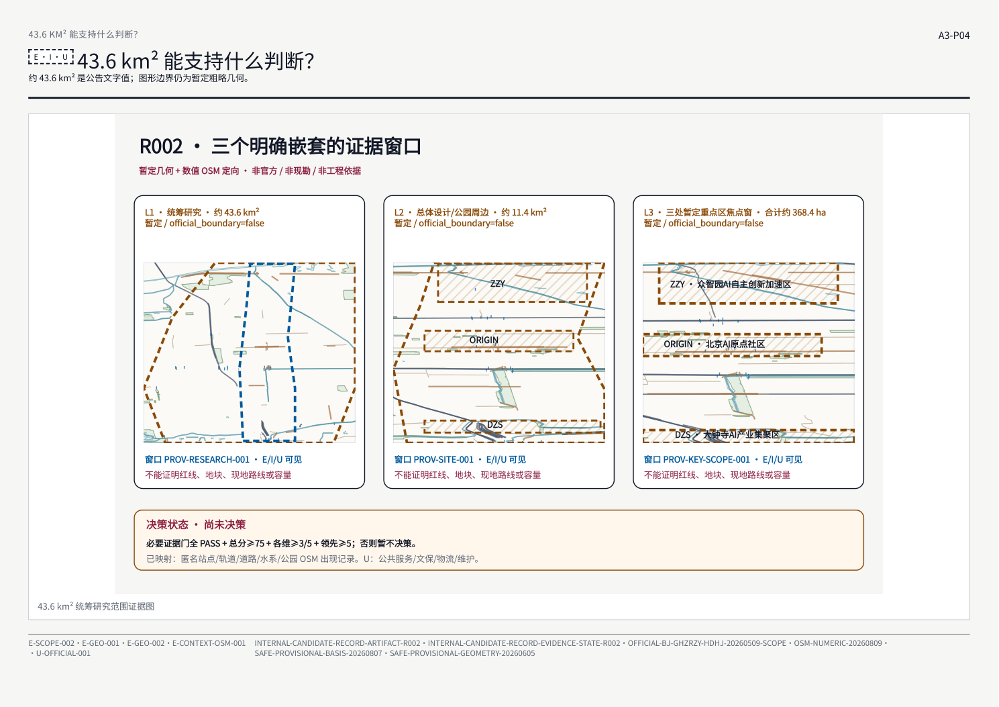
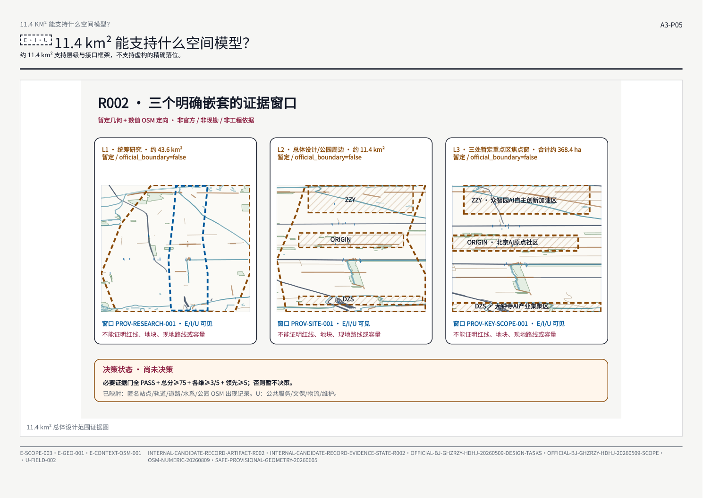
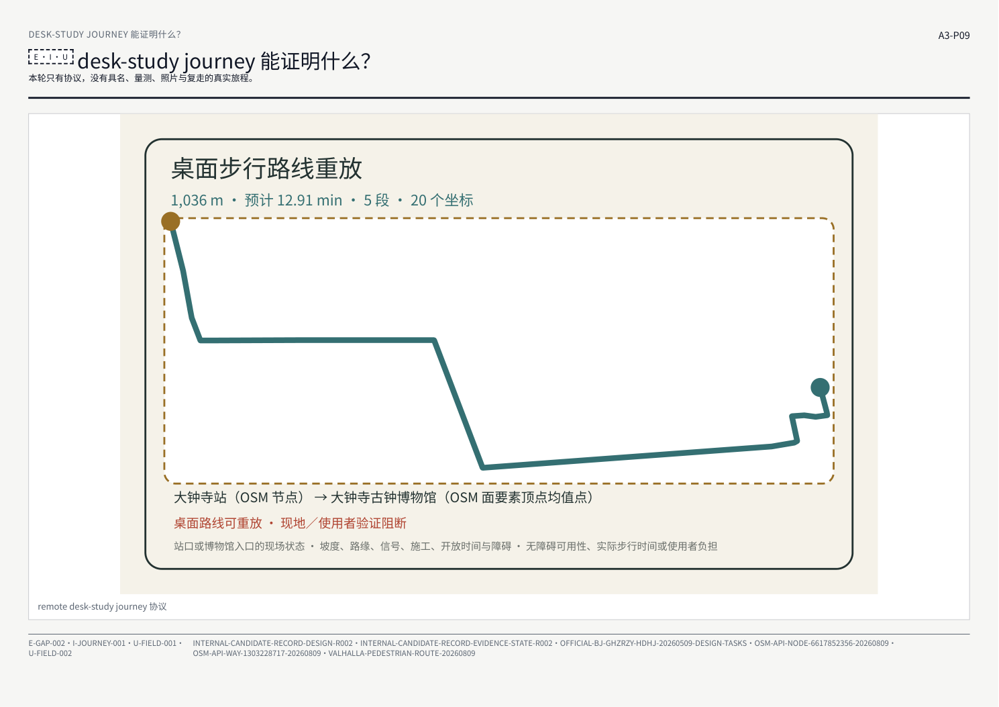
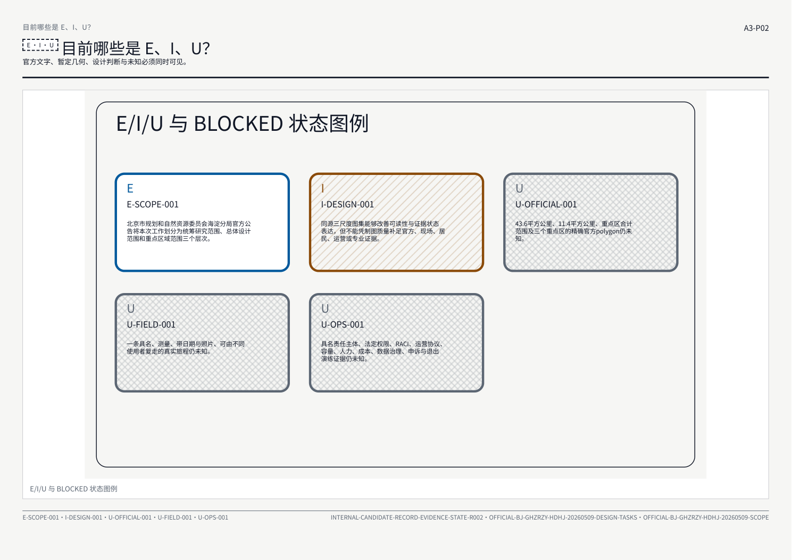

# JingZhang Open Way R006: Civic Continuity Protocol

**Civic Continuity Protocol / 城市连续服务协议**

> **Decision-ready. Implementation-gated. / 可决策，待实施门槛**
> Turn the century-old JingZhang line into an open civic spine for the AI era: connecting innovation, renewal and everyday life; augmented online, human-led when needed and serviceable offline.
> One open spine · three place roles · nine reversible tests · six evidence gates / 一条开放骨架 · 三个场所角色 · 九项可逆验证 · 六道证据门槛

**A New Way Forward. Always for People. / 一路向新，始终为人**

Evidence status (secondary risk information): `PROJECT_PARTY_INTAKE_CANDIDATE_NOT_SUBMITTED`; implementation remains subject to X1-X6. This file is generated from the `JZ-OPEN-WAY-R006` authoritative model.

## One spine, three roles, nine tests, six gates

Turn the century-old JingZhang line into an open civic spine for the AI era: connecting innovation, renewal and everyday life; augmented online, human-led when needed and serviceable offline.

- **Service continuity by design**: AI augments, people can take over, and the same public service continues when AI is off; the design is a service chain, not a technological single point of failure.
- **Evidence before investment, with a designed exit**: Every option carries burdens, exit conditions and evidence gates; an evidence-based STOP is successful de-risking.
- **One corridor, three complementary roles**: Validate safe innovation in the north, protect inclusive translation in the middle and deliver reversible renewal in the south; the zones form one public-value chain.

### North-middle-south place roles and conditional study pathways

| Zone | Role | Study sequence | Conditional study lead |
|---|---|---|---|
| Zhongzhiyuan AI Innovation Acceleration Area | Open Testbed: Validate safe innovation in bounded cells before considering distributed expansion. | N · Evidence baseline (ALT-ZZY-N) -> A · Controlled validation cell (ALT-ZZY-A) -> B · Distributed service nodes (ALT-ZZY-B) | **A · Controlled validation cell (ALT-ZZY-A)** |
|  |  | Establish the evidence baseline, then test a controlled cell; consider distributed nodes only after X1/X4/X5/X6 pass. |  |
| Beijing AI Origin Community | Open Translation Commons: Translate university innovation into quiet, shared, usable and reversible civic service. | N · Service-first study (ALT-ORIGIN-N) -> B · Quiet shared interface (ALT-ORIGIN-B) -> A · Dual-channel service (ALT-ORIGIN-A) | **B · Quiet shared interface (ALT-ORIGIN-B)** |
|  |  | Establish existing-service and resident-burden baselines, then test the quiet shared interface; dual-channel service remains the continuity standard. |  |
| Dazhongsi AI Industry Cluster | Open Urban Gateway: Protect existing businesses and daily continuity before advancing station-industry interfaces. | N · No preselected node (ALT-DZS-N) -> B · Existing fabric and small business (ALT-DZS-B) -> A · Station-industry interface (ALT-DZS-A) | **B · Existing fabric and small business (ALT-DZS-B)** |
|  |  | Verify existing fabric and merchant continuity before reversible renewal; station integration waits for real route, entrance and accessibility evidence. |  |

> Conditional preferred direction (I), not a site, investment or implementation approval. If any required gate fails, the programme remains in or returns to N-mode.

### Public-brief alignment

- **BRIEF-OBJ-01-INNOVATION-ECOSYSTEM · Build a world-class AI innovation ecosystem**: Form a north-middle-south innovation value chain through an Open Testbed, Translation Commons and Urban Gateway. · `I` · gates `X1/X3/X4/X5`
- **BRIEF-OBJ-02-FUTURE-URBAN-FORM · Create an urban form suited to AI-enabled productivity**: Use reversible cells, shared interfaces, continuous movement and an AI-off baseline as an evolvable urban-form protocol. · `I` · gates `X1/X2/X5/X6`
- **BRIEF-OBJ-03-TALENT-DISTRICT · Create a high-quality district attractive to global AI talent**: Define high-quality daily experience through human takeover, quiet sharing, accessible help and small-business continuity. · `I` · gates `X2/X3/X4/X6`

## Approximately 100-day Evidence-to-Decision commission

The requested decision is to commission an approximately 100-day Evidence-to-Decision stage, not construction: appoint a project-party lead, open the necessary data, site and compensated-participation channels, and conclude with a GO / REVISE / STOP dossier.

| Stage | Days | Work | Gates | Acceptance output |
|---|---:|---|---|---|
| STAGE-01 | 1-15 | Authority and baseline | X1/X4 | Data register, official-spatial access plan, named responsibility matrix and issue log |
| STAGE-02 | 16-40 | Field and real use | X2/X3 | Five-segment/six-checkpoint repeat walk, accessibility audit, benefit-burden and dissent register |
| STAGE-03 | 41-65 | Co-design and conditional shortlist | X1/X2/X3 | Like-for-like nine-option comparison, three conditional leads and non-adoption reasons |
| STAGE-04 | 66-85 | Cost, procurement and exit | X5 | Quantity basis, cost range, three-year TCO, open interfaces, exit and AI-off drill plan |
| STAGE-05 | 86-100 | Independent assurance and decision | X6 | Professional and accessibility review, disposition log and GO / REVISE / STOP dossier |

### Quantified delivery controls

- **100%** · Decision claims carry an evidence state, source and cross-format parity.
- **9/9** · Option maps either register to official CRS after X1 or remain visibly unregistered concepts.
- **5/5 + 6/6** · Before any daily-journey claim, five segments and six checkpoints require dates, measurements, photos and an independent repeat walk.
- **12/12** · Before a pilot, every governance activity has exactly one named accountable holder.
- **3/3** · Conditional leads carry equivalent AI-online, human-takeover and AI-off service paths.
- **0** · No irreversible works or digital procurement before X1, X3 and X5 pass.
- **6/6** · Every external gate concludes PASS or BLOCKED with an owner, date and evidence; UNKNOWN never auto-promotes.

## The system itself closes the loop

Turn the proposal from a one-off presentation into a loop that senses, compares, decides, acts, records and acquires evidence again; graphics are projections of this control logic.

### Project decision loop · `LOOP-PROJECT-EVIDENCE-DECISION`

N baseline -> gap-led evidence -> conditional study lead -> cost/exit/independent assurance -> six-gate review -> GO / REVISE / STOP.

- `L0-N-BASELINE` · **N baseline and zero irreversible action** · `SAFE_BASELINE`
- `L1-EVIDENCE` · **Acquire evidence against gaps** · `SENSE_AND_RECORD`
- `L2-CONDITIONAL-LEAD` · **Conditional study lead** · `COMPARE`
- `L3-ASSURE` · **Cost, exit and independent assurance** · `TEST`
- `L4-GATE-REVIEW` · **Six-gate evidence review** · `DECIDE`
- `L5-GO-NEXT` · **GO: enter project-party next-stage approval** · `TERMINAL_HANDOFF`
- `L6-REVISE` · **REVISE: return to evidence with a disposition log** · `FEEDBACK`
- `L7-STOP-N` · **STOP: cease and return to N while retaining evidence** · `SAFE_EXIT`

**Transitions**

- `T01` · `L0-N-BASELINE` -> `L1-EVIDENCE`: `commission_approved_and_t0_dependencies_recorded`
- `T02` · `L1-EVIDENCE` -> `L2-CONDITIONAL-LEAD`: `required_baseline_evidence_sufficient_for_comparison`
- `T03` · `L2-CONDITIONAL-LEAD` -> `L3-ASSURE`: `conditional_lead_recorded_with_burden_exit_and_non_adoption_reasons`
- `T04` · `L3-ASSURE` -> `L4-GATE-REVIEW`: `cost_exit_and_independent_assurance_evidence_recorded`
- `T05` · `L4-GATE-REVIEW` -> `L5-GO-NEXT`: `all_applicable_gates_pass_with_owner_date_and_evidence`
- `T06` · `L4-GATE-REVIEW` -> `L6-REVISE`: `defect_is_remediable_and_retest_is_authorised`
- `T07` · `L6-REVISE` -> `L1-EVIDENCE`: `disposition_log_defines_new_evidence_work`
- `T08` · `L4-GATE-REVIEW` -> `L7-STOP-N`: `failed_gate_or_public_burden_makes_progress_unsuitable`
- `T09` · `L7-STOP-N` -> `L0-N-BASELINE`: `evidence_preserved_and_no_deployment_confirmed`
- `T10` · `ANY_NONTERMINAL` -> `L0-N-BASELINE`: `hard_stop_or_service_continuity_invariant_failed`

- REVISE returns to evidence with a disposition log.
- STOP returns to N while retaining evidence.
- Control cycle: `SENSE -> COMPARE -> DECIDE -> ACT -> RECORD -> REPEAT`

**Invariants**

- `UNKNOWN_NEVER_AUTO_PROMOTES`
- `ONE_NAMED_ACCOUNTABLE_HOLDER_PER_ACTIVITY_BEFORE_PILOT`
- `AI_OFF_AND_HUMAN_TAKEOVER_REMAIN_AVAILABLE`
- `NO_IRREVERSIBLE_WORKS_BEFORE_REQUIRED_GATES_PASS`
- `GO_IS_A_HANDOFF_FOR_PROJECT_PARTY_APPROVAL_NOT_AUTOMATIC_IMPLEMENTATION`
- `EVERY_TRANSITION_CARRIES_OWNER_DATE_EVIDENCE_AND_DISPOSITION`

### Generation and verification loop · `LOOP-PRODUCTION-GENERATE-VERIFY`

Authoritative model -> render all surfaces -> machine validation -> all-page and six-width responsive review -> diagnose failures and revise -> isolated rebuild and seal.

- `G0-AUTHORITATIVE-MODEL`
- `G1-RENDER-ALL-SURFACES`
- `G2-MACHINE-VALIDATE`
- `G3-ALL-PAGE-AND-RESPONSIVE-REVIEW`
- `G4-DIAGNOSE-AND-REVISE`
- `G5-ISOLATED-REBUILD-AND-SEAL`

**Production transitions**

- `G0-AUTHORITATIVE-MODEL` -> `G1-RENDER-ALL-SURFACES`: `model_schema_and_source_closure_pass`
- `G1-RENDER-ALL-SURFACES` -> `G2-MACHINE-VALIDATE`: `all_required_outputs_exist`
- `G2-MACHINE-VALIDATE` -> `G3-ALL-PAGE-AND-RESPONSIVE-REVIEW`: `machine_gates_pass`
- `G2-MACHINE-VALIDATE` -> `G4-DIAGNOSE-AND-REVISE`: `any_machine_gate_fails`
- `G3-ALL-PAGE-AND-RESPONSIVE-REVIEW` -> `G4-DIAGNOSE-AND-REVISE`: `any_visual_or_semantic_issue_is_open`
- `G4-DIAGNOSE-AND-REVISE` -> `G0-AUTHORITATIVE-MODEL`: `revision_is_model_bearing`
- `G4-DIAGNOSE-AND-REVISE` -> `G1-RENDER-ALL-SURFACES`: `revision_is_projection_only`
- `G3-ALL-PAGE-AND-RESPONSIVE-REVIEW` -> `G5-ISOLATED-REBUILD-AND-SEAL`: `zero_open_issues`

**Seal conditions**

- `BYTE_INTEGRITY_PASS`
- `EXHAUSTIVE_ONE_BYTE_MUTATION_PASS`
- `GOVERNANCE_AND_PARITY_PASS`
- `PDF_ALL_PAGES_PASS`
- `WEB_3_SURFACES_X_6_WIDTHS_AND_NO_JS_PASS`
- `TWO_ISOLATED_BUILDS_BYTE_IDENTICAL`
- `ZERO_OPEN_VISUAL_OR_SEMANTIC_ISSUES`

`decision_loops=I` · claims: `I-SELF-LOOP-001, I-CIVIC-CONTINUITY-PROTOCOL, I-CONDITIONAL-PATH-001, I-DECISION-REQUEST-001, I-DELIVERY-CONTROLS-001` · sources: `SRC-R006-MODEL`

> **Programme and risk language**: Approximately 100 days is a proposed delivery period after stated dependencies are met; it does not imply that X1-X6 have passed. If evidence disproves an option, avoiding the wrong investment is value delivered.

> **Formal-submission boundary**: This package is the design-outcome volume. A qualified entrant must still complete the administrative, team, experience, insurance, conflict, terms, signature and other formal submission requirements.

`strategy_id=BID-R006-CIVIC-CONTINUITY` · status `I` · claims: `I-CIVIC-CONTINUITY-PROTOCOL, I-BRIEF-ALIGNMENT-001, I-CONDITIONAL-PATH-001, I-DECISION-REQUEST-001, I-PROGRAMME-100D-001, I-DELIVERY-CONTROLS-001, I-SELF-LOOP-001, U-BID-ADMIN-INPUT-001` · sources: `SRC-R006-MODEL, SRC-OFFICIAL-BRIEF-FACTS-20260509`
`brief_alignment=MIXED_E_I_BLOCKED` · claims: `E-BRIEF-100D-001, I-BRIEF-ALIGNMENT-001, I-PROGRAMME-100D-001` · sources: `SRC-OFFICIAL-BRIEF-FACTS-20260509, SRC-R006-MODEL`

## Public-service commitment

AI augments service when online; people can take over; when AI is off, the city remains walkable, usable and able to provide help.

## Three scales and evidence boundary

- `E` 43.6 km² · E-SCOPE-43 · `official_boundary=false`
- `E` 11.4 km² · E-SCOPE-11 · `official_boundary=false`
- `E` 368.4 ha · E-KEY-368 · `official_boundary=false`

- `E`: Fact or record supported by an available source
- `I`: Design inference or provisional concept proposal
- `U`: Unknown, unavailable or unverified
- `BLOCKED`: Missing evidence; must not be promoted to an implementation conclusion

## A/B/N decisions for the three focus zones

### Zhongzhiyuan AI Innovation Acceleration Area · 192.1 ha

#### A · Controlled validation cell · I / BLOCKED

- **Footprint [I]**: Bounded test cell with human/low-tech edge
- **Flow [I]**: Controlled in/out; human takeover
- **Public value [I]**: Auditable low-tech comparator, human takeover and AI-off testing.
- **Beneficiary [I]**: people affected by a bounded validation process · human service staff retaining takeover authority
- **Burdens [I]**: centralized data collection · digital exclusion · continuous human staffing and isolated environment
- **Exit [I]**: AI-off on any rights/data/safety event; preserve human service and close the intelligent layer.
- **Gate [BLOCKED]**: BLK-X1-OFFICIAL-SPATIAL · BLK-X4-OPERATING-AUTHORITY · BLK-X5-COST-EXIT · BLK-X6-INDEPENDENT-VALIDATION
- **Unknowns [U]**: Exact parcel, entrance, alignment, ownership, control and deployment geometry · Observed accessibility, demand, benefit, burden, dissent and distributional effect · Named authority, staffing, cost, procurement, exit performance and independent validation
- `official_boundary=false` · claims: `I-ALT-ZZY-A, U-SPATIAL-LOCATION, U-REAL-USE, U-IMPLEMENTATION` · sources: `SRC-R006-MODEL, SRC-R005-METRICS, SRC-R005-OSM-ZZY, SRC-R005-GEOMETRY, SRC-R005-ARCHIVE`

#### B · Distributed service nodes · I / BLOCKED

- **Footprint [I]**: Three removable service nodes; positions U
- **Flow [I]**: Node-by-node; isolate or withdraw
- **Public value [I]**: Withdrawable service nodes lower trial barriers for enterprises and small businesses.
- **Beneficiary [I]**: enterprises and small businesses facing high trial barriers · people requiring a non-digital entry during outages
- **Burdens [I]**: distributed accountability · vendor lock-in · unequal service distribution · multi-node maintenance and training
- **Exit [I]**: Retire nodes individually; export in open formats; preserve non-digital entry during outages.
- **Gate [BLOCKED]**: BLK-X1-OFFICIAL-SPATIAL · BLK-X2-FIELD-INTERFACES · BLK-X4-OPERATING-AUTHORITY · BLK-X5-COST-EXIT · BLK-X6-INDEPENDENT-VALIDATION
- **Unknowns [U]**: Exact parcel, entrance, alignment, ownership, control and deployment geometry · Observed accessibility, demand, benefit, burden, dissent and distributional effect · Named authority, staffing, cost, procurement, exit performance and independent validation
- `official_boundary=false` · claims: `I-ALT-ZZY-B, U-SPATIAL-LOCATION, U-REAL-USE, U-IMPLEMENTATION` · sources: `SRC-R006-MODEL, SRC-R005-METRICS, SRC-R005-OSM-ZZY, SRC-R005-GEOMETRY, SRC-R005-ARCHIVE`

#### N · Evidence baseline · I / BLOCKED

- **Footprint [I]**: No deployment; evidence register only
- **Flow [I]**: Existing flow unchanged; measure only
- **Public value [I]**: Avoid locking in costly facilities while ownership, demand and operating capacity are unknown.
- **Beneficiary [I]**: affected communities and public decision-makers avoiding premature lock-in
- **Burdens [I]**: delayed visible outcome
- **Exit [I]**: Do not deploy; maintain only evidence, comparison and governance preparation.
- **Gate [BLOCKED]**: BLK-X1-OFFICIAL-SPATIAL · BLK-X4-OPERATING-AUTHORITY
- **Unknowns [U]**: Exact parcel, entrance, alignment, ownership, control and deployment geometry · Observed accessibility, demand, benefit, burden, dissent and distributional effect · Named authority, staffing, cost, procurement, exit performance and independent validation
- `official_boundary=false` · claims: `I-ALT-ZZY-N, U-SPATIAL-LOCATION, U-REAL-USE, U-IMPLEMENTATION` · sources: `SRC-R006-MODEL, SRC-R005-METRICS, SRC-R005-OSM-ZZY, SRC-R005-GEOMETRY, SRC-R005-ARCHIVE`

### Beijing AI Origin Community · 104.3 ha

#### A · Dual-channel service · I / BLOCKED

- **Footprint [I]**: Human / low-tech / AI-off service lanes
- **Flow [I]**: Shared intake; human takeover at each lane
- **Public value [I]**: Provide AI-on, human-assisted and AI-off paths without requiring an app; humans retain final decisions.
- **Beneficiary [I]**: public-service users who cannot or do not use an app · people requiring human assistance
- **Burdens [I]**: service denial · sensitive data · digital exclusion · automation error · frontline staffing burden
- **Exit [I]**: Disable AI immediately while the same service continues through human and low-tech channels.
- **Gate [BLOCKED]**: BLK-X1-OFFICIAL-SPATIAL · BLK-X3-USER-BURDEN · BLK-X4-OPERATING-AUTHORITY · BLK-X5-COST-EXIT · BLK-X6-INDEPENDENT-VALIDATION
- **Unknowns [U]**: Exact parcel, entrance, alignment, ownership, control and deployment geometry · Observed accessibility, demand, benefit, burden, dissent and distributional effect · Named authority, staffing, cost, procurement, exit performance and independent validation
- `official_boundary=false` · claims: `I-ALT-ORIGIN-A, U-SPATIAL-LOCATION, U-REAL-USE, U-IMPLEMENTATION` · sources: `SRC-R006-MODEL, SRC-R005-METRICS, SRC-R005-OSM-ORIGIN, SRC-R005-GEOMETRY, SRC-R005-ARCHIVE`

#### B · Quiet shared interface · I / BLOCKED

- **Footprint [I]**: Reversible quiet-route band; path U
- **Flow [I]**: Two interfaces with an AI-off detour
- **Public value [I]**: Reduce sensory, comprehension and low-tech access burdens for daily users.
- **Beneficiary [I]**: daily users facing sensory, comprehension, or low-tech access burdens
- **Burdens [I]**: unverified obstacles or entrances may be drawn as real · space burden · rent or displacement pressure
- **Exit [I]**: Remove digital media; retain physical wayfinding only after field verification.
- **Gate [BLOCKED]**: BLK-X1-OFFICIAL-SPATIAL · BLK-X2-FIELD-INTERFACES · BLK-X3-USER-BURDEN · BLK-X5-COST-EXIT · BLK-X6-INDEPENDENT-VALIDATION
- **Unknowns [U]**: Exact parcel, entrance, alignment, ownership, control and deployment geometry · Observed accessibility, demand, benefit, burden, dissent and distributional effect · Named authority, staffing, cost, procurement, exit performance and independent validation
- `official_boundary=false` · claims: `I-ALT-ORIGIN-B, U-SPATIAL-LOCATION, U-REAL-USE, U-IMPLEMENTATION` · sources: `SRC-R006-MODEL, SRC-R005-METRICS, SRC-R005-OSM-ORIGIN, SRC-R005-GEOMETRY, SRC-R005-ARCHIVE`

#### N · Service-first study · I / BLOCKED

- **Footprint [I]**: No resident AI; study services first
- **Flow [I]**: Existing service flow; measure burdens only
- **Public value [I]**: Avoid substituting synthetic personas for resident authorization.
- **Beneficiary [I]**: residents whose authorization and burden evidence have not yet been obtained
- **Burdens [I]**: existing problems are not immediately improved
- **Exit [I]**: Do not launch resident-facing AI; conduct needs and burden research only.
- **Gate [BLOCKED]**: BLK-X3-USER-BURDEN
- **Unknowns [U]**: Exact parcel, entrance, alignment, ownership, control and deployment geometry · Observed accessibility, demand, benefit, burden, dissent and distributional effect · Named authority, staffing, cost, procurement, exit performance and independent validation
- `official_boundary=false` · claims: `I-ALT-ORIGIN-N, U-SPATIAL-LOCATION, U-REAL-USE, U-IMPLEMENTATION` · sources: `SRC-R006-MODEL, SRC-R005-METRICS, SRC-R005-OSM-ORIGIN, SRC-R005-GEOMETRY, SRC-R005-ARCHIVE`

### Dazhongsi AI Industry Cluster · 72.0 ha

#### A · Station-industry interface · I / BLOCKED

- **Footprint [I]**: Station-service spine; alignment U
- **Flow [I]**: Rail-interface to service-cell crossing
- **Public value [I]**: Organize commute, crossing, human service and industry destination as a daily journey to verify.
- **Beneficiary [I]**: commuters and people seeking a human-service route to a destination
- **Burdens [I]**: false route before station-exit and traffic evidence · accessibility and traffic conflict · monitoring and logistics spillover
- **Exit [I]**: Close AI guidance and sensing; preserve human enquiry and only verified static wayfinding.
- **Gate [BLOCKED]**: BLK-X1-OFFICIAL-SPATIAL · BLK-X2-FIELD-INTERFACES · BLK-X5-COST-EXIT · BLK-X6-INDEPENDENT-VALIDATION
- **Unknowns [U]**: Exact parcel, entrance, alignment, ownership, control and deployment geometry · Observed accessibility, demand, benefit, burden, dissent and distributional effect · Named authority, staffing, cost, procurement, exit performance and independent validation
- `official_boundary=false` · claims: `I-ALT-DZS-A, U-SPATIAL-LOCATION, U-REAL-USE, U-IMPLEMENTATION` · sources: `SRC-R006-MODEL, SRC-R005-METRICS, SRC-R005-OSM-DZS, SRC-R005-GEOMETRY, SRC-R005-ARCHIVE`

#### B · Existing fabric and small business · I / BLOCKED

- **Footprint [I]**: Six reversible stock cells; parcel IDs U
- **Flow [I]**: Continuity loop; independent cell exits
- **Public value [I]**: Use reversible adaptation and shared services to reduce new build and business interruption.
- **Beneficiary [I]**: existing small businesses and occupants exposed to renewal disruption
- **Burdens [I]**: unknown ownership and building safety · tenant, rent and compensation burdens
- **Exit [I]**: No irreversible works before formal approval; restore original operating processes when services withdraw.
- **Gate [BLOCKED]**: BLK-X1-OFFICIAL-SPATIAL · BLK-X3-USER-BURDEN · BLK-X5-COST-EXIT · BLK-X6-INDEPENDENT-VALIDATION
- **Unknowns [U]**: Exact parcel, entrance, alignment, ownership, control and deployment geometry · Observed accessibility, demand, benefit, burden, dissent and distributional effect · Named authority, staffing, cost, procurement, exit performance and independent validation
- `official_boundary=false` · claims: `I-ALT-DZS-B, U-SPATIAL-LOCATION, U-REAL-USE, U-IMPLEMENTATION` · sources: `SRC-R006-MODEL, SRC-R005-METRICS, SRC-R005-OSM-DZS, SRC-R005-GEOMETRY, SRC-R005-ARCHIVE`

#### N · No preselected node · I / BLOCKED

- **Footprint [I]**: No parcel or prestige node selected
- **Flow [I]**: Existing movement; build baseline only
- **Public value [I]**: Avoid locking in wrong investment and spatial narrative while location, traffic and business evidence are insufficient.
- **Beneficiary [I]**: affected businesses and the public avoiding premature parcel or investment lock-in
- **Burdens [I]**: lower visibility
- **Exit [I]**: Do not enter construction or procurement; build interface and existing-stock baselines only.
- **Gate [BLOCKED]**: BLK-X1-OFFICIAL-SPATIAL · BLK-X2-FIELD-INTERFACES
- **Unknowns [U]**: Exact parcel, entrance, alignment, ownership, control and deployment geometry · Observed accessibility, demand, benefit, burden, dissent and distributional effect · Named authority, staffing, cost, procurement, exit performance and independent validation
- `official_boundary=false` · claims: `I-ALT-DZS-N, U-SPATIAL-LOCATION, U-REAL-USE, U-IMPLEMENTATION` · sources: `SRC-R006-MODEL, SRC-R005-METRICS, SRC-R005-OSM-DZS, SRC-R005-GEOMETRY, SRC-R005-ARCHIVE`

## Single governance model

Model-generated statistics: 12 activities; 10 role classes; one A in every activity; 0 named holders. Every role remains U and X4 is blocked.

| ID | Activity | A | R | C | I |
|---|---|---|---|---|---|
| GOV-A01 | Authorise public-interest mandate | SP | SO | IP, AS | HD, DC, OP, VS, AC, EC |
| GOV-A02 | Define service scope, hours and capacity | SO | OP | HD, AS | SP, DC, IP, AC, EC, VS |
| GOV-A03 | Human final decision and takeover | HD | OP | SO, AC | SP, DC, IP, AS, EC, VS |
| GOV-A04 | Lawful data basis, access and retention | DC | SO | IP, AS, AC | SP, HD, OP, EC, VS |
| GOV-A05 | Frontline AI-off continuity | SO | OP | HD, AS, IP | SP, DC, AC, EC, VS |
| GOV-A06 | Vendor SLA and security | SO | VS | DC, AS, IP | SP, HD, OP, AC, EC |
| GOV-A07 | Accessibility, safety and privacy assurance | AS | OP, VS | HD, DC, IP, AC | SP, SO, EC |
| GOV-A08 | Independent pause and hard stop | IP | OP | HD, AS, AC | SP, SO, DC, VS, EC |
| GOV-A09 | Incident triage, AI-off and log preservation | HD | OP | IP, EC, DC | SP, SO, VS, AS, AC |
| GOV-A10 | Appeal, redress and compensation | AC | SO | HD, IP, AS | SP, DC, OP, VS, EC |
| GOV-A11 | Evidence custody, disclosure and audit | EC | DC | IP, AS, AC | SP, SO, HD, OP, VS |
| GOV-A12 | Exit, export, migration, deletion and non-AI recovery | SO | VS, OP | DC, HD, IP, AS | SP, AC, EC |

## Desk-study route protocol, not daily-journey evidence

The route contains 5 segments and 6 checkpoints; it has no field photos, measurements or repeat walk, and X2 is blocked.
Route-engine total 1036 m / 12.91 min; display-segment sum 1035 m / 12.92 min; rounding delta -1 m / +0.01 min.
- `SEG-1` CP-1 -> CP-2 · 81 m / 0.91 min · I · field_verified=false
- `SEG-2` CP-2 -> CP-3 · 297 m / 3.84 min · I · field_verified=false
- `SEG-3` CP-3 -> CP-4 · 247 m / 3.20 min · I · field_verified=false
- `SEG-4` CP-4 -> CP-5 · 181 m / 2.25 min · I · field_verified=false
- `SEG-5` CP-5 -> CP-6 · 229 m / 2.72 min · I · field_verified=false

- `CP-1` Origin reference (not a verified station exit) · MIXED_E_U · field_verified=false
- `CP-2` Five-segment desk-route reference · I · field_verified=false
- `CP-3` Crossing inspection type to verify in field · U · field_verified=false
- `CP-4` Accessibility and edge inspection type to verify in field · U · field_verified=false
- `CP-5` Service-node hypothesis (no geometry conclusion) · U · field_verified=false
- `CP-6` Destination reference (not a verified entrance) · MIXED_E_U · field_verified=false

## External gates

- **X1 · Official spatial authority · BLOCKED**: Official three-scale bounds, parcels, roads, heritage, ownership, CRS, version and licence
- **X2 · Field journey and surrounding interfaces · BLOCKED**: Named route, dated photos, segment measurements, slopes, crossings, obstacles and independent repeat walk
- **X3 · Real users and burden evidence · BLOCKED**: Accessible compensated participation, benefit-burden mapping, dissent and non-adoption reasons
- **X4 · Operating, data and legal authority · BLOCKED**: Named SP/SO/HD/DC/IP/AC, legal basis, service hours, incident SLA and appeal
- **X5 · Cost, procurement and exit proof · BLOCKED**: Quantity basis, cost range, three-year TCO, insurance, open interfaces and AI-off drill
- **X6 · Independent professional and accessibility validation · BLOCKED**: Discipline review, physical A0 two-metre test, PDF/UA evaluation and real assistive-technology testing

## Byte-closed source IDs

- `SRC-R005-ARCHIVE`
- `SRC-OFFICIAL-BRIEF-FACTS-20260509`
- `SRC-R005-METRICS`
- `SRC-R005-OSM-ZZY`
- `SRC-R005-OSM-ORIGIN`
- `SRC-R005-OSM-DZS`
- `SRC-R005-GEOMETRY`
- `SRC-R005-JOURNEY`
- `SRC-R006-MODEL`

## Use boundary

Formal review submission; not an official, statutory, engineering, investment, operating or implementation conclusion.

## Design Basis and Source List

The package separates official textual facts (`E`), design inferences (`I`), unknown or unavailable inputs (`U`), and blocked evidence gates. The official text supports names, approximate areas and task context; provisional geometry supports composition and repeatable QA only. It does not supply an official red line, survey, statutory control, engineering basis, field observation or implementation authority. The complete source scope, licence boundary, prohibited uses and supersession state are recorded in `sources.json`; unresolved dependencies are recorded in `assumptions.json`. [standard:PROJECT-OFFICIAL-ANNOUNCEMENT] [standard:PROJECT-AGENT-OPEN-CALL-TASKBOOK] [depth:existing_conditions_diagnosis] [depth:risk_missing_data]

Machine-audit references remain available in the structured package: [data:geometry/site_boundary.geojson#PROV-SITE-001] [data:geometry/key_areas.geojson#PROV-KEY-001] [data:geometry/land_use.geojson#LU-001] [data:geometry/buildings.geojson#BLDG-001] [data:geometry/roads.geojson#ROAD-001] [data:geometry/green_space.geojson#GREEN-001] [data:geometry/public_space.geojson#PUBLIC-001] [data:geometry/constraints.geojson#PROV-RESEARCH-001] [data:geometry/phasing.geojson#PHASE-001] [metric:site_area_sqm] [metric:green_ratio] [metric:public_space_ratio]. These references establish traceability, not approval or field truth.

## Copyright, AI Assistance and Review Boundary

The proposal was generated and refined with AI-assisted tools, then packaged for submission by 林漢杰 through the personal GitHub account `Golden-Koi`. Tool provenance does not imply legal personality, professional registration or independent verification. Third-party and official-source rights remain with their respective owners; the package grants no broader reuse right than the licence and copyright statement explicitly provide.
