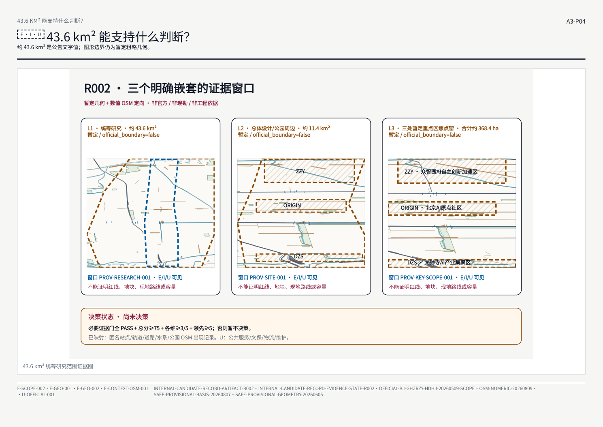
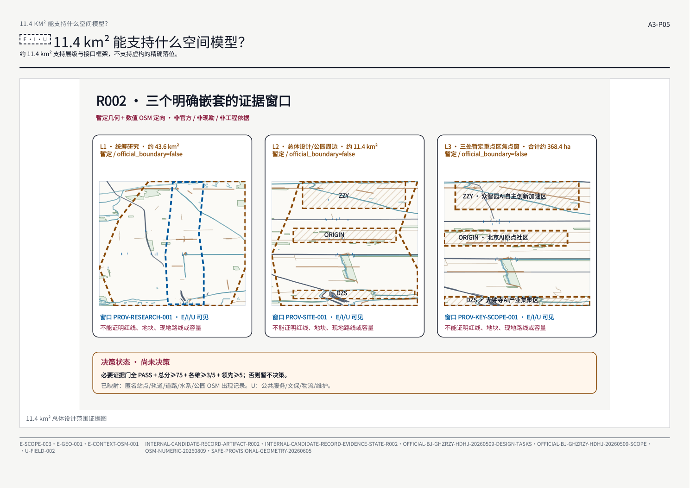
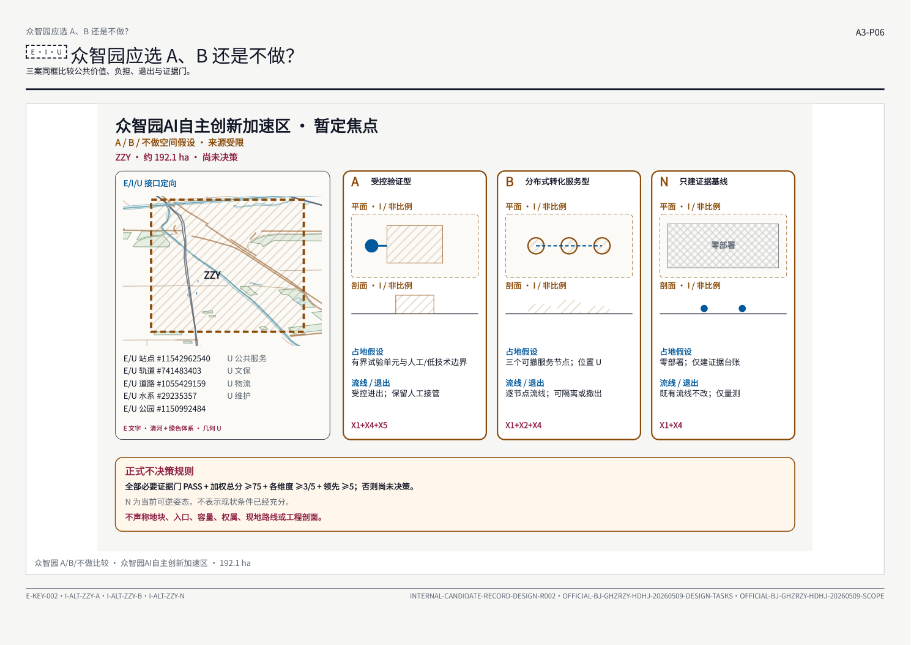
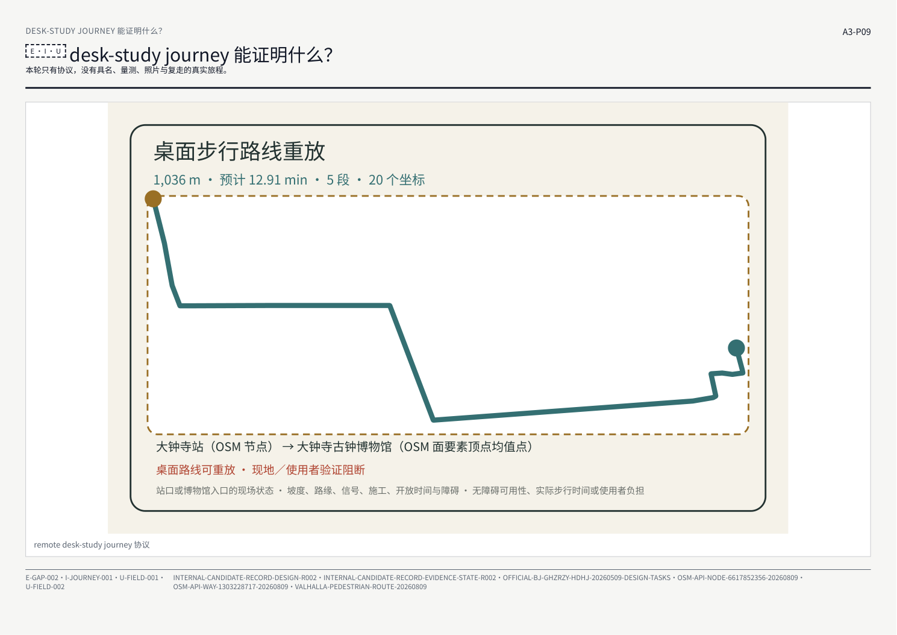

# 京张开放之路 R006

本文件由 R006 权威模型确定性投影，并与结构化几何、指标、来源、假设、专业矩阵、双语 A0／A3 图册及离线网页共同构成证据有界的正式评审响应。它不改变证据等级：所有 `E`、`I`、`U` 状态、暂定数值、阻断条件和 `official_boundary=false` 均继续有效；图面可用于讨论，不可替代官方底图、现地量测、工程设计或专业批准。

## 设计依据与资料清单

本轮依据仅限已经进入 r003 来源登记与主张台账的材料；来源表包含 12 项原有证据记录与 5 项本地标准参考快照：公告文字可以支持三层范围的名称、约数和任务语境，OSM 社群开放数据只支持桌面研究的周边要素定位，暂定几何只支持内部构图和可重复 QA，内部设计记录只支持解释设计意图。公告没有随本包提供可核实的官方 CAD、GIS、道路红线、地块权属或现勘数据，因此任何边界图都继续标记为非官方和粗略。来源之间不能循环自证，设计产物也不能反过来充当其事实来源。[standard:PROJECT-OFFICIAL-ANNOUNCEMENT] [standard:PROJECT-AGENT-OPEN-CALL-TASKBOOK] [depth:existing_conditions_diagnosis]

资料使用实行四层分离：官方文字事实为 E；由公开资料推导但尚未由官方或现地复核的内容为 I；缺失或不可核实的内容为 U；X1–X6 外部证据包保持 BLOCKED。已登记的三层面积约数是文本事实，几何复算值只用于 QA；所有展示都同时写出来源、精度、禁止用途和解锁条件。此处完成的是发布包装，不是资料补齐、合规确认或专业复核。[data:geometry/constraints.geojson#PROV-RESEARCH-001] [depth:risk_missing_data]

## 三层范围工作框架

三层框架继续采用约 43.6 平方公里统筹研究层、约 11.4 平方公里总体设计层，以及三处重点区域的工作层级。约数来自公告文字，图上的闭合折线来自暂定粗略几何，两者不能混同。统筹层用于讨论高校、企业、社区、公共服务、慢行与蓝绿网络之间的关系；总体层用于组织空间接口；重点层用于比较可逆方案。任何尺度都不支持逐街区定案、工程坐标放样或权属判断。[data:geometry/site_boundary.geojson#PROV-SITE-001] [data:geometry/key_areas.geojson#PROV-KEY-001] [depth:three_level_scope_framework]

三层图使用同一来源栈与状态符号：实线文字值不等于法定边界，虚线几何不等于道路红线，设计颜色不等于审定用地。官方边界、控规条件和现场接口到账后，九份几何、面积指标、所有图面和报告必须从权威输入统一重建；在此之前只可把当前成果称为证据有界正式评审包。图中 192.1、104.3、72.0 公顷是公告约数，不是本包测绘所得精确面积。[metric:site_area_sqm] [depth:metrics_recalculation]

## 统筹研究范围产业与未来城市研究

统筹层的作用是把公园周边与日常可达关系放在区域协同语境中讨论，而不是用一张概念图替代产业统计或招商承诺。当前可显示高校、车站、企业、社区、公共服务、道路慢行和蓝绿水系等开放数据要素，但不能据此断言真实客流、经营状态、创新产出或未来投资。设计判断以接口、连通、可逆试点和公共利益为语言，并把每项假设的失效条件公开。[standard:MOHURD-URBAN-DESIGN-MEASURES] [depth:overall_spatial_structure]

区域协同研究暂不设具名实施主体、预算、法定权限或绩效承诺。若后续取得官方统计、许可清晰的数据和专业复核，才能把当前关系图深化为产业与未来城市研究；若证据与当前假设冲突，应回滚设计而不是修饰证据。当前投影保留“不做”选项、低技术对照、AI-off、人工最终决定、数据最小化、申诉、退出和负结果公开，以避免技术愿景先于公共责任。[depth:municipal_new_infrastructure] [depth:risk_missing_data]

## 总体设计范围城市更新与控规深度城市设计

总体层以约 11.4 平方公里的暂定范围组织讨论，表达廊道、节点、公共空间和重点区接口，而不把概念分区写成控规成果。候选中的设计多边形来自内部方案，`source_type=agent_generated_design`，其合法枚举角色是 `design_proposal`；这一机械字段归一化不改变其非官方、未现勘、未工程验证的状态。现状、权属、文保、市政和道路条件仍须由 X1、X2 与 X6 解锁。[data:geometry/land_use.geojson#LU-001] [standard:MOHURD-CONTROL-DETAILED-PLANNING] [depth:land_use_layout]

城市更新讨论采用保留、改造、拆除和不做的可逆比较，但没有逐栋名录、结构鉴定、产权核验或成本依据，因此不能输出地块级结论。开发强度、建筑高度、退线、容量和市政负荷均不在当前证据包中；任何图上的形态只是讨论载体。专业团队接手时应先核对官方底图和现场事实，再决定哪些设计判断可保留，并留下变化台账。[data:geometry/buildings.geojson#BLDG-001] [depth:development_intensity_controls] [depth:retain_renovate_demolish]

## 重点区域详细设计

三处重点区分别以公告约 192.1、104.3 和 72.0 公顷为文本锚点，暂定多边形只用于在同一图上建立比较框架。每一区均并列 A、B 与不做三类路径，比较公共价值、负担、可逆性、退出条件和证据门；比较结果不是推荐落地，更不是审批结论。重点区之间通过对外旅程与周边接口联系，不作为三个孤岛展示。[data:geometry/key_areas.geojson#PROV-KEY-002] [depth:three_key_area_detailed_design]

当前没有具名起终点、距离、时间、高差、障碍、现场日期、照片和独立复走，故“真实旅程”只能保留为 desk-study 协议。每个重点区的方案都必须等待官方边界、现地接口、真实使用者、经营负担和专业复核；证据不足时“不做”仍是有效答案。后续若进行现勘，应逐段记录来源、参与者元数据、异议和未采纳理由，而不能把参与写成支持。[depth:traffic_rail_slow_parking] [depth:risk_missing_data]

## AI 创新生态、人才画像与 AI+ 场景

AI 场景在本轮仅是服务与治理假设，不是已部署系统。可讨论的方向包括信息引导、公共服务接入、无障碍辅助和日常旅程支持，但每一项都必须保留人工最终决定、低技术通道、AI-off、最少数据、明确申诉和供应商退出。没有真实使用者研究、法定依据、具名运营者和运行收据时，不得声称需求得到验证、效率得到提升或风险已经受控。[standard:PROJECT-AGENT-OPEN-CALL-TASKBOOK] [depth:municipal_new_infrastructure]

人才画像也只能作为待验证的研究问题，不能把抽象角色当成真实群体证据。通勤者、长者、残障者、居民、小商户、照护者和维护者应通过可访问且受补偿的参与进入后续研究，并保留不同意见。数据采集必须说明目的、最小字段、保存期限、删除、导出和人工替代；在 X3、X4、X5 未闭合前，场景图只用于内部评审。[depth:risk_missing_data]

## 用地、建筑规模与拆改留方案

候选中的用地、建筑和公共空间几何是设计建议，全部保持 `official_boundary=false`、未现勘、未工程验证。绿色比例 0.123423 与公共空间比例 0.073281 来自暂定几何的 QA 复算，只能用于检查数据管线是否一致，不能解释为审定指标、真实现状或绩效目标。建筑基底也没有权属、用途、层数、结构安全和存量价值核验。[metric:green_ratio] [metric:public_space_ratio] [data:geometry/green_space.geojson#GREEN-001]

拆改留策略因此只能给出程序：先获得官方底数与现场证据，再对保留、改造、拆除和不做进行公共利益与负担比较，最后由具名专业与法定主体决定。当前图面上的概念分区不会自动生成建设规模、容积率或成本。任何后续数字应记录计算口径、输入版本、误差和批准状态，并能从同一权威输入重新生成。[data:geometry/public_space.geojson#PUBLIC-001] [depth:height_massing_character] [depth:retain_renovate_demolish]

## 交通、轨道、市政与公共服务设施

交通与慢行图表达的是候选提出的连接意图，不是道路红线、交通组织、站口开放状态或可施工线路。当前道路要素使用 `agent_generated_design`，缺乏真实客流、过街信号、坡度、净宽、障碍、运营时段和事故数据。图中线路必须继续标注为概念建议，并与可验证的 desk-study 来源、现场解锁条件和不做方案同时出现。[data:geometry/roads.geojson#ROAD-001] [depth:traffic_rail_slow_parking]

市政、新型基础设施与公共服务同样没有容量、管线、接入、法定责任和三年总成本依据。设计只能提出需要核验的接口清单，不能承诺建设或运行。后续深化应逐项确认供能、通信、排水、消防、无障碍、维护、网络安全、数据治理与停机机制，并把具名责任者和服务时段写入运行合同；未完成前继续 BLOCKED。[standard:MOHURD-ARCH-DESIGN-DEPTH-2016] [depth:municipal_new_infrastructure]

## 蓝绿空间、公共空间与城市风貌

蓝绿与公共空间图表达连续性、接口和公共利益的设计方向，不证明水文、生态、土壤、树木、用地权属或维护条件。暂定绿色与公共空间多边形可用于视觉比较和比例 QA，但不得作为现状普查或法定绿线。后续需要官方专业底图、季节性现勘、生态与海绵评估、无障碍复核及养护责任，才能形成可执行的设计结论。[data:geometry/green_space.geojson#GREEN-001] [data:geometry/public_space.geojson#PUBLIC-001] [depth:blue_green_public_space]

城市风貌只保留文化连续、尺度友好、开放可达和材料可维护等原则，不给出未经证据支持的高度、立面或文保结论。任何地标、导视、照明或数字界面都须比较低技术方案和不做方案，检查眩光、能耗、维修、隐私与排斥风险。外部证据到位后，应以现场照片、视线、材料样本和专业意见更新，不以当前渲染反向证明合理性。[standard:MOHURD-URBAN-DESIGN-MEASURES] [depth:height_massing_character]

## 更新项目清单、实施政策与分期计划

当前分期几何是一项内部设计建议，只表示讨论次序，不表示立项、资金、许可、征收、采购或开工。更新项目清单仍缺数量基础、成本区间、FTE、三年总成本、保险、采购路径和退出实证；这些缺口由 X4 与 X5 保持可见。任何“先行”仅可指低风险、可逆、可停止的研究或验证，不得被包装为已批准实施。[data:geometry/phasing.geojson#PHASE-001] [depth:renewal_project_list] [depth:phasing_implementation]

实施政策的最小合同包括：具名最终责任、独立暂停、人工申诉、事故分级、资料导出与删除、供应商退出、AI-off 演练和负结果公开。当前角色与时限都是拟议，未有法定授权和运行收据。若后续证据无法满足公共利益、可负担性或可维护性，应缩小范围、回滚或不做；分期表不能用来掩盖未解决的前置条件。[depth:risk_missing_data]

## 指标体系、面积复算与合规矩阵

本轮只把三个已知状态指标纳入可重复检查：暂定场地面积复算值、绿色比例和公共空间比例。它们均明确标注为非官方、暂定和 QA 用途，单位与来源在 `metrics.json` 中登记；公告约数与几何复算值并列时必须说明口径差异。其余缺少输入的指标不得以零代替未知，也不得由图形美观反推数值。[metric:site_area_sqm] [metric:green_ratio] [metric:public_space_ratio] [depth:metrics_recalculation]

合规矩阵是“已作回应／仍有资料缺口”的索引，不是符合性证书。强制标准条目即使具有文本回应，也不能替代官方、工程或专业判断；设计深度条目的 `complete` 只表示必需章节、图纸与引用已在参与者可控制的提交响应中齐备；每项同时写明 `completion_scope=evidence_bounded_submission_response_only`、`independent_verification=false` 与外部证据状态。强制标准的 `addressed` 只表示已有可追踪文本响应，不表示合规、批准或专业核验；X1–X6 继续 BLOCKED。[standard:MNR-LAND-USE-CLASSIFICATION-GUIDE] [standard:MOHURD-ARCH-DESIGN-DEPTH-2016] [depth:risk_missing_data]

## 风险、版权与合规说明

主要风险不是版面，而是把内部脚手架误读为批准成果。所有范围、用地、道路、建筑、蓝绿、分期和场景都必须保留证据等级、来源和禁止用途；X1 官方空间、X2 现地接口、X3 使用者负担、X4 运行法律、X5 成本退出、X6 独立专业与可访问性验证仍为外部门。当前 PDF 结构与图形可被机器检查，但不主张 PDF/UA，也没有真实辅助技术或 A0 实印两米测试。[standard:MOHURD-CONTROL-DETAILED-PLANNING] [depth:risk_missing_data]

版权层面只分发本候选已清权或允许内部审查的派生图面，并保留来源登记；OSM 要素继续标为社群开放数据，官方摘录仅按登记的有限审查用途使用。任何未来公开发布都应重新核对许可、署名、隐私、人物和现场照片。机械发布投影不会扩大原材料的许可范围，也不会把内部来源登记转化为公开再许可。[depth:existing_conditions_diagnosis]

## 参考资料

机器审查交叉索引如下。它只保证文件内可追踪，不保证事实已经被外部主体确认：官方公告与任务书 [standard:PROJECT-OFFICIAL-ANNOUNCEMENT] [standard:PROJECT-AGENT-OPEN-CALL-TASKBOOK]；城市设计、控规、用地与设计深度参考 [standard:MOHURD-URBAN-DESIGN-MEASURES] [standard:MOHURD-CONTROL-DETAILED-PLANNING] [standard:MNR-LAND-USE-CLASSIFICATION-GUIDE] [standard:MOHURD-ARCH-DESIGN-DEPTH-2016]。来源标题、发布者、日期、许可、快照和禁止用途以 `sources.json` 为准。[depth:risk_missing_data]

九份可读几何均在本投影中保留：[data:geometry/site_boundary.geojson#PROV-SITE-001] [data:geometry/key_areas.geojson#PROV-KEY-001] [data:geometry/land_use.geojson#LU-001] [data:geometry/buildings.geojson#BLDG-001] [data:geometry/roads.geojson#ROAD-001] [data:geometry/green_space.geojson#GREEN-001] [data:geometry/public_space.geojson#PUBLIC-001] [data:geometry/constraints.geojson#PROV-RESEARCH-001] [data:geometry/phasing.geojson#PHASE-001]。设计深度索引包括 [depth:existing_conditions_diagnosis] [depth:three_level_scope_framework] [depth:overall_spatial_structure] [depth:land_use_layout] [depth:development_intensity_controls] [depth:height_massing_character] [depth:retain_renovate_demolish] [depth:traffic_rail_slow_parking] [depth:municipal_new_infrastructure] [depth:blue_green_public_space] [depth:three_key_area_detailed_design] [depth:renewal_project_list] [depth:phasing_implementation] [depth:metrics_recalculation] [depth:risk_missing_data]。
