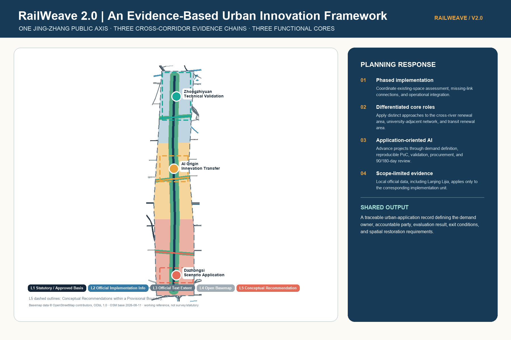
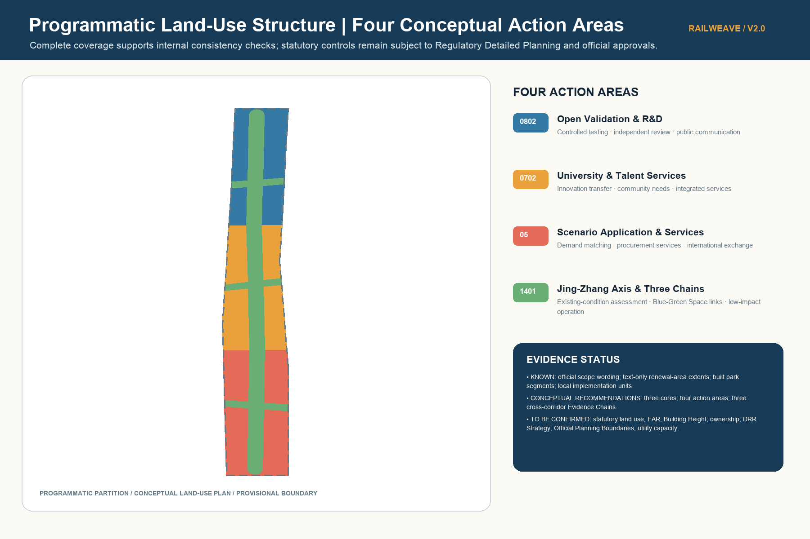
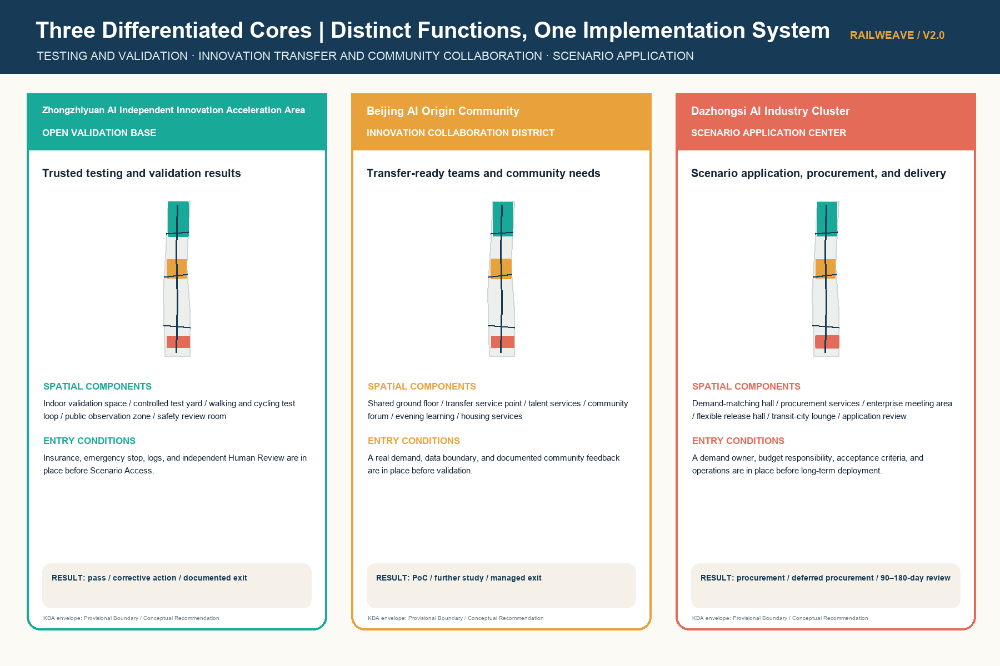
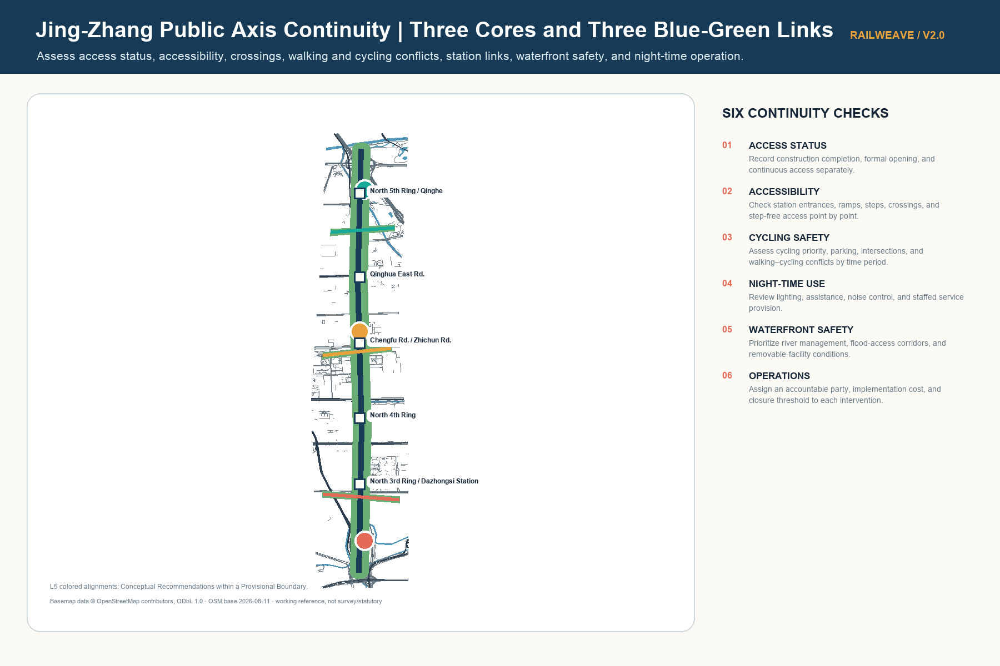
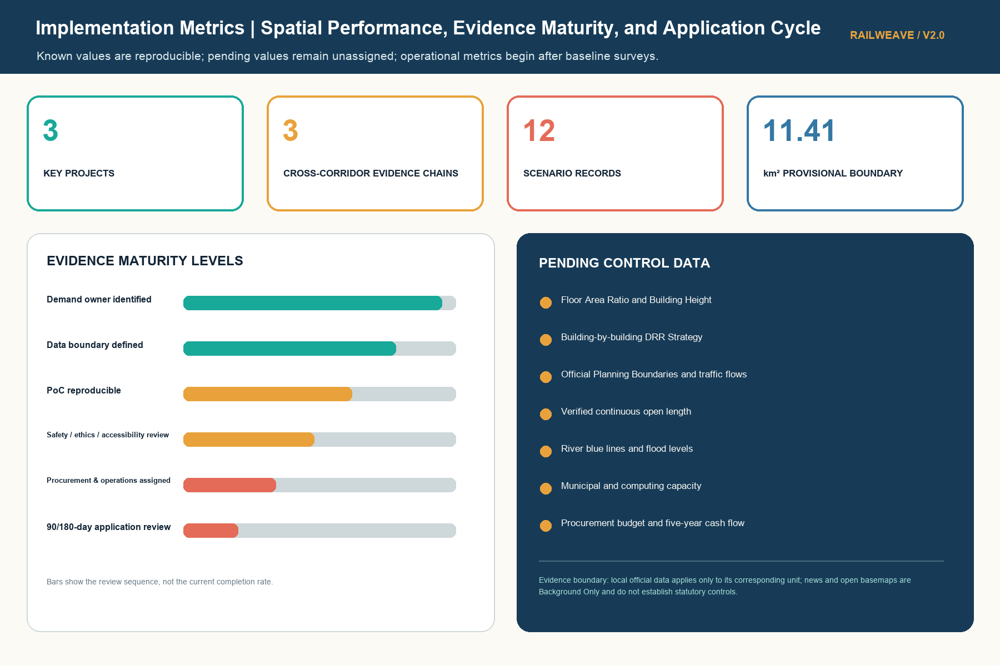

# RailWeave: Urban Renewal and Coordinated Transformation Plan for the Centennial Jing-Zhang AI Innovation Belt

“RailWeave Open City” takes the historical development of the Jing-Zhang Railway as its foundation and coordinates three fields of work: technological innovation, urban renewal, and public governance. Following the principles of improving existing assets, coordinating innovation, and proceeding prudently, the plan proposes an overall framework of “one axis, three corridors, three hubs, and three coordinated chains.” It connects the full process of identifying innovation needs, testing and validating technologies, and transforming applications into operational scenarios, with the aim of developing an open and shared Centennial Jing-Zhang AI Innovation Belt with clear responsibilities and controllable risks.

Available public information indicates that sections of the Jing-Zhang public-space system have been built and continue to advance.[source:PARK-PHASE1] [source:PARK-PHASE2]

Zhongzhiyuan and Dazhongsi are included in urban-renewal work, and AI Origin has formed a distributed network of innovation facilities and services.[source:ZHONGZHIYUAN-RENEWAL] [source:DAZHONGSI-RENEWAL] [source:AI-ORIGIN-2026]

Official GIS data, parcel and property-right information, a building survey from a consistent date, complete road boundaries, and river and rail-safety conditions are not yet available. The plan therefore distinguishes confirmed facts, planning assessments, and design recommendations. It establishes a project framework for spatial planning, operating mechanisms, data governance, responsible entities, funding arrangements, and exit and restoration procedures, providing a basis for subsequent professional development.[depth:existing_conditions_diagnosis]

At this stage, the plan is an Urban Design research outcome developed through Open Co-Creation. The Provisional Boundary of approximately 11.4 km² is used only to organize the plan and conduct technical checks. Functional-component symbols describe spatial interfaces and do not represent existing or proposed buildings. Structured self-check results do not replace statutory planning, site surveys, or engineering-feasibility studies. Original design content produced by the participant is licensed under CC BY 4.0; third-party material is cited in accordance with its licence terms and permitted scope.[source:SOURCE-REGISTRY]

## Design Basis and Source List

### Five Evidence Levels and Limits on Representation

Every chapter follows the same sequence: existing-condition basis, planning assessment, working recommendation, and conditions for further development. Combining sources does not change their evidence level. For example, consistency between an official written boundary description and OSM roads does not establish an Official Planning Boundary.

| Level | Definition | Permitted wording | Graphic convention | Typical use in this plan |
|---|---|---|---|---|
| **L1 Statutory or approved basis** | Approved, formally delineated, or formally reviewed material issued by an institution with direct authority | Use “approved,” “formally delineated,” or “review requirement” only within the parcel or section to which the document applies | Use a solid line only where formal coordinates or an official drawing are available | Written heritage-protection requirements for Qinghuayuan Station and local implementation material for Lanjing Lijia; neither may be extrapolated [source:QINGHUAYUAN-HERITAGE] [source:LANJING-IMPLEMENTATION] |
| **L2 Official project facts and phase status** | Engineering, renewal, or phase statistics published by government or a statutory operating entity | Use “official information as of [date] indicates,” retaining the date and project scope | Dash-dot nodes or implemented sections; does not replace a statutory boundary | Phase I of Jing-Zhang Railway Heritage Park, Phase II supporting works, and renewal notices for Zhongzhiyuan and Dazhongsi [source:PARK-PHASE1] [source:PARK-PHASE2] |
| **L3 Official written scope and indicative relationship** | Official approximate area, written boundary description, or scope semantics without measurable coordinates | Use “the research scale is approximately,” “the written boundary description is,” or “shown only as an index” | Broad dashed line, halo, or arrow; not a statutory boundary | Approximate scales of 43.6 km², 11.4 km², and 368.4 ha, and the approximately 3 km² AI Origin network [source:OFFICIAL-ANNOUNCEMENT] [source:AI-ORIGIN-2026] |
| **L4 Open-data working basemap** | Non-survey and non-statutory open data such as OSM | May identify candidate roads, buildings, waterways, POIs, and field-survey targets | Grey basemap with date, licence, and error limitations | OSM roads, waterways, stations, buildings, and POIs downloaded on 2026-08-11 [source:OSM-WORKING-DATA] |
| **L5 Design recommendations and provisional geometry** | Strategies, functional interfaces, conceptual alignments, and simulated values generated by this plan | Consistently use “recommended,” “conceptual,” and “subject to verification before implementation” | High-visibility proposal colour; `NOT FOR CONSTRUCTION` | One axis, three corridors, three hubs, three priority demonstration projects, provisional working areas, and conceptual connection corridors [source:BOUNDARY-SOURCE] [source:KEY-AREA-SOURCE] |

The empty `geometry/constraints.geojson` file indicates only that no formal constraint coordinates suitable for submission have been obtained. It does not indicate an absence of heritage, river, road, railway, rail-transit, or municipal constraints on site.[data:geometry/constraints.geojson#DATA-GAP-REGISTER] Formal sources, repository material, open basemaps, and participant-generated designs are recorded separately in `sources.json`, `assumptions.json`, and `data/source_registry.json`. The processed fact pack is used only to navigate the source material and is not an additional authoritative source.[source:PROCESSED-FACT-PACK] Task responses, professional standards, and design-depth limits are mapped in `compliance_matrix.json`, `standard_matrix.json`, and `design_depth_matrix.json`.[source:SITE-PACKAGE] [standard:PROJECT-OFFICIAL-ANNOUNCEMENT] [standard:MOHURD-URBAN-DESIGN-MEASURES]

### Existing Basis and Information to Be Supplemented

- **Available information**: The Open Call announcement defines the approximate scales of the three planning levels and the tasks for the three Key-Area Detailed Design Areas. Regulatory Detailed Plans for blocks including `HD00-1601`, together with some formally accepted matters, have been published.[source:OFFICIAL-ANNOUNCEMENT] [source:JINGZHANG-CONTROL-NOTICE]
- **Available information**: Phase I of Jing-Zhang Railway Heritage Park has been implemented, and the Phase II supporting project has been completed; continuous public access still requires field verification.[source:PARK-PHASE1] [source:PARK-PHASE2]
- **Available information**: Official written boundary descriptions are available for the Zhongzhiyuan and Dazhongsi renewal areas, and the coordinating entity for the Dazhongsi implementation unit has been announced. AI Origin is an approximately 3 km² distributed innovation network centred on Wudaokou and extending into surrounding areas.[source:ZHONGZHIYUAN-RENEWAL] [source:DAZHONGSI-RENEWAL] [source:AI-ORIGIN-2026]
- **Information to be supplemented**: official vector boundaries; parcel and property-right information; existing-building conditions; complete Regulatory Detailed Planning drawings; road boundaries; river blue lines; flood levels; rail-transit and railway safety-protection areas; municipal capacity; application-entity budgets; and five-year operating income and expenditure. Related indicators are not assigned values at this stage, and proposal diagrams do not substitute for baseline surveys.[depth:risk_missing_data]

## Three-Level Scope Framework

All three levels derive from official approximate scales and written descriptions and are classified as L3 evidence. Current geometries serve only as research indexes.[source:OFFICIAL-ANNOUNCEMENT]

| Level | Official task scale | Working objective | Deliverable depth | Limits on use |
|---|---|---|---|---|
| Coordinated Research Area | Approximately 43.6 km² | Study how Haidian’s concentrated AI innovation resources can be coordinated and transformed into applications | Map relationships among institutions, industry, talent, public services, and blue-green and transport systems | Not used to determine area-wide land use, building scale, or investment-promotion commitments |
| Overall Design Area | Approximately 11.4 km² | Assess construction and public access across the Jing-Zhang public-space system and improve network connections through three linked corridors: Qinghe, Xiaoyue River and universities, and Zhuanhe | Establish existing relationships, functional layout, continuity-improvement tasks, and interfaces with renewal projects | `SITE-001` is not an Official Planning Boundary; conceptual partitions do not replace Regulatory Detailed Planning deliverables |
| Key-Area Detailed Design Area | Three areas totalling approximately 368.4 ha | Propose differentiated priority projects in accordance with the documented basis and implementation conditions | Establish district-level validation interfaces at Zhongzhiyuan, networked innovation-service interfaces at AI Origin, and scenario-transformation interfaces within the Dazhongsi renewal area | Provisional working boundaries are not used to calculate statutory area, Development Intensity, or Demolish–Renovate–Retain decisions |

`SITE-001` is used only for submission-package topology checks, self-checks, and conceptual recalculation.[data:geometry/site_boundary.geojson#SITE-001]

`KEY-V2-001/002/003` are working indexes for the three Key-Area Detailed Design Areas, and the number of key areas is checked internally against the task requirements.[data:geometry/key_areas.geojson#KEY-V2-001] [data:geometry/key_areas.geojson#KEY-V2-002] [metric:key_area_count] The third index follows the same provisional-boundary rules as the first two.[data:geometry/key_areas.geojson#KEY-V2-003]

Once official vector boundary data are obtained, all outputs shall be recalculated in the following sequence to ensure a common boundary version: site boundary → key areas → existing layers → proposal layers → metrics → five principal figures → HTML/PDF.[depth:three_level_scope_framework] [depth:metrics_recalculation]

## Coordinated Research Area: Industry and Future City Research

### Overall Structure: One Axis, Three Corridors, Three Hubs, and Three Coordinated Chains

**One axis**: the Jing-Zhang Innovation and Coordinated Development Axis. Building on railway heritage, parkland, Walking and Cycling Network space, and public-service resources, the axis accommodates demand publication, display of test results, exchange on scenario applications, and public feedback. It forms the principal north–south public-space framework for innovation.

**Three corridors**: the Qinghe Linkage Corridor, the Xiaoyue River and University Collaboration Corridor, and the Zhuanhe Transit–Urban Integration Corridor. They strengthen lateral connections among waterfront spaces, universities and research institutes, rail-transit stations, communities, and innovation facilities.

**Three chains** cover the full project life cycle:

1. **Demand coordination chain**: Residents, public-service entities, enterprises, and research teams submit needs. Demand verification, user participation, data-boundary review, and proof of concept (PoC) convert them into testable project assignments.
2. **Testing and validation chain**: Version reproducibility, safety, energy use, accessibility, red-team testing, offline operation, and human takeover are assessed separately, resulting in a finding of “pass,” “restricted use,” “rectification,” or “stop.”
3. **Application-transformation chain**: Projects with an identified application entity and suitable implementation conditions proceed, in accordance with applicable law and procedure, to market research, procurement, deployment, operation, and 90/180-day follow-up evaluation. Projects that do not yet meet procurement conditions receive a written assessment.

**The three hubs** have differentiated functions. AI Origin coordinates innovation needs and proof of concept; Zhongzhiyuan undertakes professional testing and credible validation; Dazhongsi supports supply–demand matching, lawful procurement advice, operations and maintenance, and application evaluation. A common project identifier links work across the three areas. A project is regarded as entering implementation only after the demand, validation, and transformation stages are complete. Drawing on Beijing’s scenario-demand solicitation mechanism and Haidian District’s laboratories, large-model resources, and technology-trading base, the plan strengthens the testing, validation, and scenario-transformation stages between research outcomes and urban application.[source:BEIJING-SCENARIO-DEMAND] [source:HAIDIAN-STATS-2025]

### Lessons from International Operating Models

| Case | Transferable mechanism | Conditions for application | Limits on local transfer |
|---|---|---|---|
| Toronto Vector Institute | An independent non-profit institution connects research, talent, engineering support, and trustworthy application | Separate validation judgments from commercial services and provide multi-party governance | Its certification authority, Canadian funding, and university system are not directly applicable locally [source:CASE-VECTOR-TORONTO] |
| Montréal Mila | Open science, rigorous PoC, entrepreneurship support, and public-interest governance operate in parallel | Complete agreements govern problems, data, experimentation, and knowledge transfer | Open source does not mean unconditional disclosure of enterprise or personal data [source:CASE-MILA-MONTREAL] |
| Paris STATION F | Multiple specialist programmes share one campus and common services | Provide project routing, a public charter, and shared back-office services | Do not copy its scale, brand, investment figures, or French leasing system [source:CASE-STATION-F] |
| Helsinki Maria 01 | Pilot operations begin in a small area of existing space and expand gradually based on membership and use evidence | Confirm property rights, fire safety, leases, and opening hours first | Experience from a former hospital does not establish that buildings along the corridor can be directly converted [source:CASE-MARIA-01] |
| Toronto MaRS | Public-interest functions, spatial operations, application services, and investment connections form complementary business lines | Account separately for public-interest and commercial activities and involve identified application entities | Canadian charity, tax, and property systems are used only for comparison [source:CASE-MARS-TORONTO] |
| Barcelona 22@ | Innovation, housing, infrastructure, and social inclusion are managed together | Evaluate renewal returns and community benefit together | Do not copy its land-value capture, Floor Area Ratio, or affordable-housing system [source:CASE-22BARCELONA] |
| Copenhagen BLOXHUB | A limited set of annual problem agendas organizes members, applied research, and cross-sector cooperation | Publish projects, budgets, partners, and annual results | Membership and visit counts do not substitute for local public value [source:CASE-BLOXHUB] |

International cases support comparison of mechanisms and local applicability. They do not establish that site conditions, partnerships, investment arrangements, or investment-promotion outcomes have been secured.[source:AGENT-TASKBOOK] [standard:PROJECT-AGENT-OPEN-CALL-TASKBOOK]

### Plan Name and Visual Identity System

The principal name, “RailWeave,” refers to the history of the Jing-Zhang Railway, the progression of technological innovation, and the traceability of project responsibility. The mark uses parallel tracks that divide and converge at nodes, representing the comparison of alternatives and complete process records. Railway navy signifies historical continuity and institutional assurance; open teal signifies collaborative innovation; amber signifies Human Review and risk notification. The wayfinding system corresponds to evidence levels L1 through L5 and to the three project states of demand, validation, and transformation, with tactile and written coding suitable for all age groups. Corporate marks are not included in the principal public identity system. The plan mark, type, and wayfinding system are original works.[depth:overall_spatial_structure]

## Overall Design Area: Urban Renewal and Regulatory-Plan-Level Urban Design

### Coordinating Improvements to Existing Space and Network Connections

Official information available through 2026 indicates that Phase I of Jing-Zhang Railway Heritage Park has been completed and the Phase II supporting project has made staged progress. Completion of supporting works and continuous, accessible public use of the full corridor require separate verification.[source:PARK-PHASE1] [source:PARK-PHASE2] The Overall Design establishes a four-level working register: `built / supporting-works-completed / open-status-to-verify / gap-to-audit`. Field survey and continuity assessment focus on the North Fifth Ring Road, North Fourth Ring Road, Chengfu Road, Zhichun Road, Xueyuan South Road, North Third Ring Road, rail-transit stations, and river interfaces.

The spatial structure comprises “one axis, three corridors, and three hubs”:

- Jing-Zhang Axis: the common interface for existing parks, railway heritage, public services, and project status;
- Qinghe Linkage Corridor: connects renewal clusters across subdistricts, parks, and rivers, with priority verification of walking and cycling connections, waterfront safety, flood-control access, and the Fifth Ring Road interface;
- Xiaoyue River and University Collaboration Corridor: connects universities, distributed innovation facilities, communities, and rail-transit stations, improving ten-minute walking connections and ground-floor public services;
- Zhuanhe Transit–Urban Integration Corridor: connects rail-transit stations, renewal areas, communities, enterprises, and waterfront spaces, with priority improvements to accessible routes outside stations and interfaces with renewal projects.

`ROAD-V2-001` through `ROAD-V2-004` represent continuity-review and spatial-connection tasks. They are not evidence for roads, bridges, tunnels, greenways, or construction alignments.[data:geometry/roads.geojson#ROAD-V2-001] [data:geometry/roads.geojson#ROAD-V2-004] [metric:crosslink_count] Their internally recalculated length is an L5 working value used only to check the plan. It is not included in quantities, government construction schedules, or the statutory road network.[metric:road_length_m] [depth:traffic_rail_slow_parking]

### Urban Renewal and Functional Orientation

Information for the Overall Design Area is organized in four categories: existing-condition basis, open-data-assisted assessment, design recommendation, and matter for further development. The north prioritizes open validation and research collaboration; the central area strengthens university-adjacent innovation and talent services; and the south develops scenario application and mixed services. The Jing-Zhang Axis and three lateral corridors support public-space access and network connection.[data:geometry/land_use.geojson#LU-V2-001] [data:geometry/land_use.geojson#LU-V2-004]

`LU-V2-001` through `LU-V2-004` are L5 conceptual functional partitions. They describe the overall functional organization and do not constitute a statutory Land-Use Plan or land-use balance.[standard:MNR-LAND-USE-CLASSIFICATION-GUIDE] [depth:land_use_layout]

Available official material confirms the existence of relevant Regulatory Detailed Plans and some intersecting relationships, but complete road boundaries, land-use classifications, Floor Area Ratio, Building Height, Building Coverage Ratio, setbacks, and municipal capacity remain to be supplemented.[source:JINGZHANG-CONTROL-NOTICE] [standard:MOHURD-CONTROL-DETAILED-PLANNING] Urban Character principles include articulated massing, walkable ground floors, shared courtyards, low-reflectance materials, maintainable roofs, priority for historic fabric, and control of the scale of night-time media installations and dynamic lighting. Building massing, Demolish–Renovate–Retain decisions, and permanent structures shall be developed further after survey, property-right, structural and fire-safety, heritage, and Regulatory Detailed Planning conditions are obtained.[depth:height_massing_character]

## Detailed Design of Key Areas

The three Key-Area Detailed Design Areas use a common Public Interest and Inclusivity evaluation framework, with differentiated design depth determined by the documented basis and implementation conditions. Each project shall define public interest, data minimization, Human Review, reversibility, maintenance responsibility, incident response, and exit and restoration requirements. Spatial massing, Development Intensity, and the Demolish–Renovate–Retain Strategy shall be developed strictly from credible information for each area.[depth:three_key_area_detailed_design]

### Zhongzhiyuan: Open Validation Demonstration Park

**Existing basis and work priorities.** The official renewal notice provides a written boundary description for a renewal area involving Xueyuanlu, Qinghe, and Dongsheng, containing several park nodes and extending across the Qinghe and Xiaoyue rivers. `KEY-V2-001` is a working index and is not used as the boundary announced in that notice.[source:ZHONGZHIYUAN-RENEWAL] [data:geometry/key_areas.geojson#KEY-V2-001]

**Planning recommendations.** Develop an Open Validation Demonstration Park with spatial interfaces including a trustworthy testing and validation space, provisionally named the “Validation Lab,” a reconfigurable workshop, an enclosed testing ground, a controlled walking and cycling test loop, and a public observation and evaluation corridor. Establish a workflow for project admission, enclosed reproduction, itemized validation, limited testing, conclusion assessment, information disclosure, and transfer to application. Near-term work prioritizes indoor model testing, edge-device energy-use testing, offline fallback, and robotic testing in enclosed environments. Public parks shall not, in principle, serve as robotic road-testing sites without a dedicated assessment.

**Recommended implementation entities.** A relevant management and service platform of Zhongguancun Science City, or another lawfully determined implementation entity, may coordinate the project. Research institutions, open-source communities, evaluation bodies, and specialist laboratories may be engaged by agreement for technical operations. Safety, ethics, accessibility, and legal matters are subject to independent review. Site owners, property managers, insurers, and emergency-response entities shall fulfil on-site responsibilities, and a channel shall be established for user representatives to request suspension and review. Institutional names identify possible types of entity only and do not indicate participation or authorization.[source:CASE-VECTOR-TORONTO]

**Conditions for further development.** The precise boundary, parcels, property rights, existing buildings, road boundaries, river-management lines, development scale, Building Height, fire safety, municipal capacity, and testing qualifications remain to be verified. Specific building massing, bridge and tunnel alignments, and enterprise partnerships shall not be determined before the relevant information and review opinions are obtained.[depth:development_intensity_controls]

### AI Origin: Open and Collaborative Innovation District

**Existing basis and work priorities.** Official information describes AI Origin as an approximately 3 km² distributed innovation network centred on Wudaokou, integrating several facilities and extending into surrounding areas. It already has a foundation of enterprise services, talent services, and human–AI service windows.[source:AI-ORIGIN-2026] [source:AI-ORIGIN-TALENT-STATION] `KEY-V2-002` represents only a working area and is not a statutory boundary.[data:geometry/key_areas.geojson#KEY-V2-002]

**Planning recommendations.** Select a shared ground-floor space with clear property rights, fire-safety conditions, leasing arrangements, and opening hours, and establish an “Innovation Demand and Outcome Transformation Service Room.” Provide a demand-intake window, open-source reproduction workstations, an outcome-transformation service window, rooms for time-limited PoC projects, an integrated talent-service desk, and an evening exchange space. Residents, public-service staff, researchers, and enterprises use a common demand-registration form. Projects must have identified service users and lawful data sources. Following preliminary assessment, they proceed to testing and validation at Zhongzhiyuan, remain in the research reserve, or receive a termination assessment.

**Recommended implementation entities.** Community-based collaborative operations may draw on Dongsheng and the existing AI Origin operating network. Universities, research institutes, and incubators may provide professional guidance and outcome-transformation services under agreement. Human-resources, talent, housing, and enterprise-service authorities may provide authorized service interfaces within their respective mandates. Residents’ committees, property managers, young people, older people, persons with disabilities, and merchant representatives participate in consultation. Intelligent question-answering is limited primarily to explaining information and pre-filling forms; human officers handle exceptions, formal acceptance, and appeals.[source:AI-ORIGIN-TALENT-STATION]

**Conditions for further development.** Facility property rights, the specific ground-floor location, rent, night-time noise, fire safety, equitable access, intellectual property, and residents’ preferences remain to be confirmed. Connections between universities and parks and any specific building conversion require the consent of the relevant rights holders and professional assessment.[source:BEIJING-URBAN-RENEWAL]

### Dazhongsi: First-Use Scenario Transformation Centre

**Existing basis and work priorities.** An official written boundary description and a coordinating entity for the implementation unit are available for the Dazhongsi renewal area. Related renewal work emphasizes project-pipeline development, coordination of public-interest and commercial space, financial balance, and long-term operations. `KEY-V2-003` is only a working index.[source:DAZHONGSI-RENEWAL] [data:geometry/key_areas.geojson#KEY-V2-003] The approximately 5.03 ha area, approximately 96,500 m² of floor area, and traffic forecast for Lanjing Lijia apply only to the corresponding implementation unit and are not extrapolated to the entire area.[source:LANJING-IMPLEMENTATION] [source:LANJING-TRAFFIC]

**Planning recommendations.** Establish a First-Use Scenario Transformation Centre with a public demand hall, a procurement-compliance advisory window, a supply–demand meeting room, a multipurpose publication hall, a 90/180-day application-evaluation room, and an integrated service foyer oriented to the rail-transit station. Demand entities shall identify their current business process, responsible person, budget conditions, and risk limits. Mature products proceed through routine procurement in accordance with law; projects requiring validation use testing agreements; and projects with a substantiated need for technological innovation may examine an applicable collaborative innovation-procurement approach. Published information focuses on demand, validation findings, contract performance, actual use, and exit and restoration.

**Recommended implementation entities.** District authorities responsible for development and reform, science and technology innovation, government data, finance, and relevant sectors may coordinate institutions and demand within their respective mandates. A lawfully determined renewal entity is responsible for spatial development and whole-life financial balance. Government departments, public institutions, state-owned enterprises, or market entities may act as potential application entities. Procurement, legal, intellectual-property, data, and audit bodies jointly safeguard procedural compliance. Technology suppliers shall participate through applicable public procedures, and an early PoC relationship does not predetermine a subsequent procurement result.[source:BEIJING-SCENARIO-DEMAND] [source:BEIJING-URBAN-RENEWAL]

**Conditions for further development.** Application entities, funding sources, procurement authority, data authorization, transport capacity, accessibility outside the station, underground connections, and building conditions require further verification. The four quadrants around the rail-transit station and underground works alignments are subject to specialist study and approval outcomes.

## AI Innovation Ecosystem, Personas, and AI+ Scenarios

### Six Priority Service Groups and Their Use Processes

| Service group | Demand formation | Testing and validation | Scenario transformation | Data and human safeguards | Adjustment and exit mechanism |
|---|---|---|---|---|---|
| Early-career researchers | Select an identified need at AI Origin and undertake a PoC with frontline service users | Complete version, safety, and energy-use testing at Zhongzhiyuan | Engage with several potential application entities at Dazhongsi | Unauthorized research information and identity trails are not disclosed; a transformation officer and independent reviewer sign off | Projects without identified service users are not admitted; projects that cannot be reproduced remain in research |
| Start-up teams | Use outcome-transformation, talent, and housing-referral services without being tied to an investor | Disclose commercial data on a minimum-necessary basis and complete testing | Engage with the first application entities through market research and compliant procedures | Enterprise and personal-service data are authorized by category; application entities may not obtain unrelated data | Sales-oriented pilots end where no identified demand exists; projects do not proceed to procurement without operations and maintenance capacity |
| Community residents | Submit needs anonymously in person, by telephone, or online | Participate voluntarily in a limited-scope PoC and withdraw at any time | Review application-evaluation results and submit complaints and appeals in accordance with law | No facial profiling; non-digital channels and human services remain available | Refusal to participate does not affect ordinary services; a complaint triggers suspension and review |
| Public-service staff | Describe the current business process, common errors, and duties that cannot be delegated | Test false positives, false negatives, offline operation, and safe fallback | Participate as the demand entity in acceptance and 90/180-day application evaluation | Use de-identified samples; humans make the final decision, and algorithms do not replace statutory duties | Projects that materially increase human workload or fail to meet the minimum standard return for rectification |
| International visitors | Learn about public issues from rail transit and the principal axis without registration | View non-sensitive explanations of validation work | Participate in project exchanges; only subsequent project activity counts as an outcome | Bilingual, accessible, paper-based, and human alternatives are provided; identities are not tracked across nodes | Visitors may provide anonymous feedback and have contact information deleted |
| Operations, maintenance, and frontline workers | Review energy use, networks, cleaning, spare parts, and shifts before design | Rehearse power loss, emergency stops, and manual takeover | Sign off jointly on deployment, maintenance, and exit | No labour-performance profiling; two-person operation and safety training | Projects do not go live without maintenance resources; sites are restored and data deleted on exit |

### Twelve Scenario Modules and Project Processes

The twelve scenarios are coordinated through demand organization, testing and validation, and application transformation. Each scenario shall specify spatial prerequisites, responsible entities, pilot duration, data boundaries, Human Review, risk indicators, and stop conditions. Its specific location shall be determined only after a lawful site-use agreement is obtained.[metric:scenario_card_count]

| # | Scenario module / process | Spatial conditions and service users | Data, human oversight, and maintenance | Pilot duration, outcomes, and risk indicators | Admission limits and exit mechanism |
|---|---|---|---|---|---|
| S01 | **Model reproducibility validation** / P1 validation | Trustworthy testing and validation space at Zhongzhiyuan; researchers, enterprises, and application entities | Use public or authorized data and record the version hash; researchers reproduce results and an independent third party conducts spot checks; the testing party bears computing costs | Duration for each test batch is set by agreement; assess reproducibility, file completeness, leakage events, and non-reproducible cases | No admission without permission, a version record, and a responsible person; projects that fail validation return to research |
| S02 | **Edge-device energy use and offline resilience** / P1 evidence | Indoor controlled node; equipment teams and operations staff | Device-level energy and fault logs without collecting personal data; two-person operations review | Same batch as S01; energy per task, offline fallback, and human-takeover time | Stop if safe offline fallback is unavailable or the load is unknown |
| S03 | **Controlled embodied-intelligence testing** / P1 validation | Enclosed testing ground with fire-safety, insurance, and emergency-stop provisions; robotics teams and safety officers | Anonymous event logs with a limited retention period; safety officers retain emergency-stop authority throughout; the technical team bears loss and restoration responsibility | Conduct enclosed testing first, then consider limited opening; assess collisions, boundary incursions, and takeover success | No direct deployment in general public green space; any incident triggers immediate isolation and investigation |
| S04 | **Incident response, appeal, and exit exercise** / P1 validation | Incident-evaluation room and removable components; all project entities | Retain only necessary audit records; independent reviewers oversee notification, deletion, and restoration | Conduct an exercise before every launch; assess closure time, completion of deletion, and site restoration | Projects without exit funding or a responsible person may not go live; projects that fail the exercise return for rectification |
| S05 | **Shared-learning and career-development assistant** / P2 demand | Shared ground floor at AI Origin; young people, teachers, and mentors | Voluntary learning goals; teachers or mentors make final decisions; the operator maintains content | Time-limited PoC; completion rate, staff time saved, erroneous advice, and withdrawal rate | No automated evaluation or admissions or employment decisions; may be closed at any time |
| S06 | **All-ages accessible information service** / P2 demand | Continuous routes among station exits, the principal axis, and public-service facilities; older people, persons with disabilities, and visitors | Use edge or aggregated route-event data; retain human and paper wayfinding | Survey key routes first; assess completion of accessible routes, misdirection events, and requests for assistance | Do not collect faces or continuous identity trails; suspend and rectify the service if errors recur |
| S07 | **Human–AI collaborative public-service work orders** / P2 demand | Community or park service counter; residents and frontline staff | De-identified work orders; staff confirm classification and responses; the demand entity operates the service | Pilot a limited set of work-order types; resolution time, repeat complaints, and human workload | No automated enforcement or denial of service; stop if human workload increases |
| S08 | **Multilingual review of railway-heritage content** / P2 demand | Existing display or reversible media; the public and international visitors | Rights-cleared historical material; AI content is clearly labelled; curatorial and heritage review | Single-theme content period; correction time, accessible readability, and historical errors | Qinghuayuan Station content and equipment require heritage review; remove infringing material [source:QINGHUAYUAN-HERITAGE] |
| S09 | **Procurement and data-compliance advice** / P3 transformation | Dazhongsi demand hall; small and medium-sized enterprises, application entities, and technology teams | Enterprises submit only the minimum necessary information; procurement, legal, and data specialists review | Ongoing service with quarterly evaluation; rate of useful pathway advice and number of corrections | Does not replace statutory review or create a directed award; major disputes proceed to a dedicated human review |
| S10 | **Supply–demand matching for first-use scenarios** / P3 transformation | Supply–demand meeting room and public demand pool; demand entities and multiple technology teams | Publish non-sensitive demand; confidential data are governed by a separate agreement; supervise fairness | Each demand batch has a deadline and recorded conclusion; identified-demand-entity rate, contract-formation rate, and decisions not to procure | Projects without an identified application entity or budget conditions do not enter the pool; no supplier may be predetermined |
| S11 | **90/180-day application evaluation** / P3 transformation | Operational deployment site and application-evaluation room; application entities, service users, and operations staff | Collect business and maintenance indicators under the contract on a minimum-necessary basis; the application entity accepts the work and a user-appeal channel remains available | 90/180 days after deployment; assess active use, faults, human input, complaints, and continued use | Restore the original business process where sustained use or maintenance is absent, or risk exceeds the threshold |
| S12 | **Project-responsibility information register** / three-chain coordination | Three public nodes and a webpage; the public | Disclose authorized demand, findings, limitations, contracts, complaints, and corrections; maintained by designated staff | Continuous operation and quarterly archiving; record-completeness rate and appeal-closure rate | Do not disclose personal information or trade secrets; correct errors promptly and disclose project suspension and exit |

S01 through S04 are industrial Testing and Validation Scenarios and meet the requirement for at least three industrial validation scenarios. S08 is revised as multilingual review of railway-heritage content. In the absence of an identified medical demand entity and continuing responsibility for content, medical question-answering is not established as a separate scenario at this stage. Public-service automation shall retain human decisions, non-intelligent service channels, explanations, withdrawal, and appeal mechanisms.[source:AGENT-TASKBOOK] [standard:PROJECT-AGENT-OPEN-CALL-TASKBOOK]

## Land Use, Building Scale, and Retain-Renovate-Demolish Strategy

### Principles for Determining Land-Use and Building Indicators

`land_use.geojson` represents four conceptual functional partitions. It is used only to check consistency within the Provisional Boundary and does not constitute a statutory Land-Use Plan or Regulatory Detailed Planning indicator.[data:geometry/land_use.geojson#LU-V2-002] [depth:land_use_layout] The empty `buildings.geojson` layer indicates that no verified Building Footprint data are currently available; it does not indicate an absence of buildings on site. Functional components are represented through public-space action areas and project interfaces, and `building_footprint_area_sqm` remains to be verified.[data:geometry/buildings.geojson#NO-VERIFIED-BUILDING-FOOTPRINTS] [metric:building_footprint_area_sqm]

The existing-building inventory shall combine L4 open Building Footprints, remote-sensing time series, and field surveys, with features marked `existing-observed / to-verify`. Specific renewal categories require sequential verification of property rights and leases, heritage protection, legality of construction, structural and fire safety, current use and vacancy, carbon emissions, public services, effects on tenants and workers, alternative accommodation, funding arrangements, and subsequent operating conditions.[standard:MOHURD-ARCH-DESIGN-DEPTH-2016] [depth:retain_renovate_demolish]

The Demolish–Renovate–Retain decision tree is:

1. Buildings with heritage value or sound structures and uses: retain and maintain as a priority.
2. Buildings with inadequate spatial performance that can be repaired safely: adaptively reuse, beginning with limited sharing at defined times.
3. Conditions that impair public continuity but can be addressed through management: adjust hours, access, and wayfinding before considering demolition and construction.
4. Buildings for which demolition is necessary: complete assessments of safety, carbon, property rights, public interest, tenants, and alternatives.
5. Additions: prioritize lightweight, reversible, and demountable structures; do not proceed to medium-term construction without a viable five-year operating account.

Material for Lanjing Lijia applies only to the corresponding implementation unit. Drawings shall use a bold boundary and the note “valid within this frame; do not extrapolate.” The material shall not be used to calculate indicators for the Overall Design Area or other Key-Area Detailed Design Areas. Area-wide Floor Area Ratio, Building Height, and development scale cannot be determined at this stage.[source:LANJING-IMPLEMENTATION] [source:LANJING-TRAFFIC] [depth:development_intensity_controls]

## Transport, Rail, Municipal Infrastructure, and Public Services

The transport strategy focuses on network continuity and actual travel conditions. Records for rail-transit entrances and road intersections shall cover gradients, steps and lifts, crossing waits, barriers, under-bridge space, night lighting, winter maintenance, bicycle parking, walking–cycling conflicts, help points, and human services. The Jing-Zhang Axis and three lateral corridors first serve as continuity-review corridors. Continuous public access and the length of the accessible network will be calculated only after field verification.[metric:continuous_open_greenway_length_m] [depth:traffic_rail_slow_parking]

Operator information is used to verify station names, entrances, and facilities at Dazhongsi, Wudaokou, Qinghuadongluxikou, Liudaokou, Zhichunlu, Qinghe, and other stations. Routes outside stations require separate field surveys; the presence of a station does not establish interchange or accessibility outside the station. At Dazhongsi, the plan defines only a continuous-arrival objective linking the metro, demand hall, Jing-Zhang Axis, and Zhuanhe. It does not determine an underground passage or engineering alignments in the four quadrants.[source:DAZHONGSI-RENEWAL]

Municipal infrastructure uses a three-level interface of device, district, and area. Devices follow data-minimization principles and support offline operation and human takeover. District nodes record requirements for electricity, networks, charging, heat dissipation, recycling, and maintenance. The area level identifies needs for coordination with existing energy, communications, drainage, fire-safety, and emergency systems. Capacity data are not available; the plan therefore makes no commitment at this stage regarding computing, electricity, water supply and drainage, charging or battery exchange, or utility relocation capacity.[depth:municipal_new_infrastructure]

Public services follow the principles of digital assistance, retained human channels, and accessible provision. Services affecting individual rights shall provide in-person, telephone, or paper-based options and shall not require the installation of an application. AI is used primarily to explain information, pre-fill forms, retrieve information, and route requests. Statutory decisions, exceptions, remedies, and appeals remain the responsibility of staff. AI Origin has official experience with 17 talent services and a three-level officer-assistance system. This may inform a human–AI service interface but does not authorize unrestricted cross-departmental data flows.[source:AI-ORIGIN-TALENT-STATION]

## Blue-Green Network, Public Space, and Urban Character

The Blue-Green Space system is represented in three levels. L2 records built and engineering status for Jing-Zhang Railway Heritage Park, while L4 assists in identifying Qinghe, Xiaoyue River, Zhuanhe, and the open road network.[source:PARK-PHASE1] [source:PARK-PHASE2] [source:OSM-WORKING-DATA]

L5 proposes connections between the longitudinal axis and three lateral corridors.[data:geometry/green_space.geojson#GREEN-V2-001] River blue lines, management areas, flood levels, ecological banks, and maintenance access are not yet available. All waterfront activities, lighting, and installations are therefore reversible and subject to specialist water, flood-control, and maintenance review.[depth:blue_green_public_space]

Public Space expresses AI-governance requirements through disclosure across the full process. Each project shall disclose the entity that submitted the demand, the scope of data use, the reviewing entity, test findings, maintenance responsibility, evaluation period, and methods for appeal and exit. The night-time environment shall control glare, the scale of media installations, and dynamic lighting. Materials shall be repairable, replaceable, and low-reflectance, and shall be compatible with the railway-heritage setting.

### Three Public Innovation Display Nodes

1. **Zhongzhiyuan Validation-Outcomes Display Corridor**: Located within the Provisional action area for the priority project, this node uses reversible display structures to present findings of pass, restricted use, rectification, and stop. Public content is limited to non-sensitive information, while professional logs remain in a controlled environment. The node strengthens the connection between the Open Validation Demonstration Park and the Jing-Zhang Public-Space Axis and does not perform a statutory certification function.[data:geometry/public_space.geojson#PUBLIC-V2-001]
2. **AI Origin Collaborative Innovation Courtyard**: Displays community needs, research responses, PoC progress, differing views, and exit records in one place. Movable learning facilities and a paper demand wall ensure that people who do not use intelligent devices can participate on equal terms.[data:geometry/public_space.geojson#PUBLIC-V2-002]
3. **Dazhongsi Jing-Zhang Innovation Transformation Gateway**: Uses railway mileage and project identifiers to connect history and culture, scenario demands, testing and validation, contract implementation, and 90/180-day application evaluation, with priority given to outcomes from actual use. Its location, massing, and media format require further study against Transit-Station Integration, property-right, fire-safety, and heritage-protection requirements.[data:geometry/public_space.geojson#PUBLIC-V2-003]

All three nodes are L5 low-impact design recommendations. Their development scale and visual effect shall be controlled to avoid oversized landmark structures. The visual identity, type, people, images, and historical material require rights clearance. New structures, lighting, activities, and underground works near Qinghuayuan Station require prior verification of the heritage-protection area, construction-control zone, archaeology, and event-capacity requirements.[source:QINGHUAYUAN-HERITAGE]

## Renewal Projects, Implementation Policy, and Phasing

### Near-Term Work Package: “One Room, One Lab, One Pool, and Four Manuals”

- **One room**: Select a shared ground-floor space at AI Origin with clear property rights, fire-safety conditions, and opening hours, and provide demand intake, technical reproduction, outcome-transformation advice, and talent and housing referrals.
- **One lab**: Establish an indoor trustworthy testing and validation space at Zhongzhiyuan, prioritizing tests of versions, energy use, offline operation, and human takeover. High-risk public robotic testing requires a separate specialist assessment.
- **One pool**: Establish an online scenario-demand list and regular procurement-compliance advisory mechanism at Dazhongsi. Begin with demand aggregation and engagement with application entities, then determine the scale of physical publication space from actual demand.
- **Four manuals**: Prepare a Multi-Party Governance Charter, Project Admission and Tiered Testing Manual, Data and Personal Information Inventory, and Incident Response, Appeal, and Exit Manual.

### Phased Implementation Packages

| Phase | Core projects | Deliverables | Entry conditions | Adjustment and exit conditions |
|---|---|---|---|---|
| **0–6 months: institutional framework and baseline preparation** | One room, one lab, one pool, and four manuals; registers of sites, entities, and service users for the three hubs | Common project identifier; demand-registration, testing, procurement, and exit forms; indicator-baseline survey plan | Lawful site use, defined on-site responsibility, identified demand entity, lawful data use, and a human fallback mechanism | Projects without an identified demand entity, a data basis, or exit funding do not start [data:geometry/phasing.geojson#PHASE-V2-001] |
| **6–18 months: first three pilot projects** | Conduct 2–3 rounds of PoC; advance model, edge-device, and enclosed-environment robotics validation; organize the first low-risk scenario applications | Public test reports; at least one complete finding of lawful procurement or no procurement at present; quarterly risk and financial records | Reproducible PoC, independent review of key matters, and identified application entities and operations responsibilities | Suspend where incident response is incomplete, human workload materially increases, or budget and operations conditions are insufficient [data:geometry/phasing.geojson#PHASE-V2-002] |
| **18–36 months: evaluation, improvement, and orderly expansion** | Improve AI Origin’s multi-node service network; conduct limited open testing at Zhongzhiyuan; advance the physical scenario-transformation centre and international-exchange projects at Dazhongsi | Five-year project implementation register, professionally developed drawings, and results from two consecutive evaluation cycles | Property-right, planning, fire-safety, heritage, transport, and municipal conditions are in place, with operating income and expenditure and public consultation mechanisms substantially established | Defer expansion if actual use is insufficient, continuing funding is absent, risks exceed thresholds, or rights holders do not agree [data:geometry/phasing.geojson#PHASE-V2-003] |

The phases are prioritized by evidence maturity, reversibility, and public benefit. They are implementation recommendations and do not constitute a government construction schedule or administrative commitment.[depth:phasing_implementation]

### Project Implementation Register (Single Page)

Projects entering the 6–18-month package shall complete a single-page implementation register covering: project identifier; demand entity and service users; existing baseline and non-AI alternative; site owner and operating rights; property-management and fire-safety conditions; model and equipment versions; data sources, authorization, and retention periods; coordinating and technical entities; independent review and on-site responsibility; application entity and user oversight; procurement route; intellectual property; fair competition; capital expenditure (CAPEX); annual operating and maintenance expenditure (OPEX); confirmed income; five-year funding gap; and arrangements for maintenance, insurance, incident response, appeals, data deletion, equipment removal, and site restoration. Matters not yet determined are marked `unknown / to be verified`; zero values and aspirational statements do not substitute for evidence.[source:BEIJING-URBAN-RENEWAL] [source:HAIDIAN-RENEWAL-GUIDE] [depth:renewal_project_list]

### Annual Operating Arrangements

Demand solicitation, controlled testing, application of outcomes, and responsibility audits may be coordinated annually. Activities shall be organized only after implementation entities, funding, and project conditions are defined. Performance assessment focuses on subsequent engagement, completed validation, contracts, actual use, and problems resolved; visits and media exposure are not core outcome indicators. International exchange is based on bilingual project records and verifiable results. Enterprises assume contractual and maintenance responsibilities in accordance with law, and residents retain the rights to submit needs, express views, appeal, and exit a project.[source:CASE-BLOXHUB]

## Metrics, Area Recalculation, and Compliance Matrix

The indicator system has four categories: official baselines, open-data-assisted assessment, L5 plan indicators, and implementation performance. Every ratio reports its numerator and denominator, and suspended, terminated, and exited projects remain in the statistics.

| Indicator group | Indicator | Definition and status | Management use |
|---|---|---|---|
| Official baseline | Number of Key-Area Detailed Design Areas and scenario modules | Three Key-Area Detailed Design Areas and twelve scenario modules are known counts [metric:key_area_count] [metric:scenario_card_count] | Verify task coverage; does not confirm a boundary or constitute project approval |
| Open-data assessment | Length of continuously open accessible network | `field-verified step-free open network length`, currently to be verified [metric:continuous_open_greenway_length_m] | Evaluate the actual level of continuous public access across the Walking and Cycling Network |
| L5 scenario | Site, green space, Public Space, and conceptual alignments | Site and green space are recalculated from provisional geometry [metric:site_area_sqm] [metric:green_ratio]; Public Space and conceptual alignments are also identified as conceptual values [metric:public_space_ratio] [metric:road_length_m] | Check only the plan’s internal consistency; may not be presented alongside statutory area, green-space ratio, or quantities as equivalent values |
| L5 project | Number of priority projects and lateral corridors | Three priority projects and three lateral corridors are plan counts [metric:flagship_project_count] [metric:crosslink_count] | Check the completeness of the three core functional hubs and overall structure |
| Implementation performance | Valid-demand rate | Number of projects passing demand verification ÷ total submissions; set a target after the baseline survey | Avoid scenarios without identified service users and actual demand |
| Implementation performance | PoC reproducibility rate | Number successfully reproduced by a third party ÷ number submitted for testing | Assess the quality of evidence moving from AI Origin to Zhongzhiyuan |
| Implementation performance | Test-file completeness rate | Number of projects completing all mandatory fields ÷ number of projects with a finding | Completeness does not indicate technical approval but is a procedural threshold |
| Implementation performance | Human-takeover success rate | Number of takeover exercises completed within the required time ÷ total exercises | Quantify human-takeover and operations and maintenance capacity |
| Implementation performance | Appeal-closure rate | Number answered and recorded within charter time limits ÷ appeals due | Report “answered” and “resolved” separately |
| Implementation performance | Post-validation application rate | Number entering a lawful contract or deployment ÷ validated projects with an identified application entity | Record projects without an application entity separately; contract signature does not substitute for actual-use evaluation |
| Implementation performance | 90-day active-use rate | Deployments still in actual use after 90 days ÷ deployments that have reached 90 days | A signed but unused deployment counts as zero |
| Implementation performance | Five-year operating gap | Five-year OPEX + renewal and maintenance − confirmed income / purchased services / contributions | Exclude unconfirmed income; use the result to determine whether expansion should proceed |

Floor Area Ratio (FAR), Building Height, development scale, and municipal capacity remain to be verified. `building_footprint_area_sqm` does not use the v1 conceptual Building Footprint value.[metric:building_footprint_area_sqm] [depth:development_intensity_controls] Topology, data structures, and internal self-checks confirm only the structural completeness of the digital submission package and do not demonstrate practical implementability. Under the digital submission specification, `design_depth_matrix.status=complete` means that the item has received a complete and reviewable submission response. Its actual working depth, evidence ceiling, and information to be supplemented are recorded separately in `current_depth`, `evidence_ceiling`, and `blocking_inputs`.[depth:metrics_recalculation] [depth:risk_missing_data]

## Risk, Copyright, and Compliance

### Highest-Priority Publication Risks (P0)

1. **A Provisional Boundary is misread as a statutory boundary**: `SITE-001` and the three Key-Area Detailed Design Areas shall be prominently marked “research index; not an Official Planning Boundary.” Figures shall not be published until the legend and linework distinguish statutory boundaries, provisional working boundaries, and design recommendations.[source:BOUNDARY-SOURCE] [source:KEY-AREA-SOURCE]
2. **Conceptual functional components are misread as a building design**: One room, one lab, one pool, and the three display nodes are represented only as project interfaces and Provisional action areas. Building Footprints and development scale shall not be determined before building surveys and approval conditions are in place.
3. **Local implementation data are used beyond their scope**: Local area, scale, height, and traffic data for Lanjing Lijia shall be bounded by a bold line showing their scope of application and shall not be used to calculate indicators for the Dazhongsi area or the Overall Design Area.[source:LANJING-IMPLEMENTATION] [source:LANJING-TRAFFIC]
4. **Engineering completion is confused with public-access status**: Completion of the Phase II supporting project does not establish that the full approximately 9 km corridor is continuously open. Public access, barriers, and accessibility shall be recorded section by section.[source:PARK-PHASE2]
5. **Heritage, water, railway, and rail-transit safety conditions are absent**: Where formal coordinates are unavailable for Qinghuayuan Station, rivers, underground railways, Line 13, and roads, the plan does not determine permanent equipment, bridges and tunnels, crossings, or underground works.[source:QINGHUAYUAN-HERITAGE]
6. **Digital deliverable checks are confused with professional design depth**: Internal checks of JSON, topology, and rendering do not establish that the work has reached the depth of Regulatory Detailed Planning, an Integrated Planning Implementation Plan, or architectural design.[standard:MOHURD-CONTROL-DETAILED-PLANNING]
7. **Open-data accuracy and existing-condition verification are insufficient**: The open basemap is used only as a working basemap and field-survey index. Property rights, structure, fire safety, use, pedestrian volumes, and accessibility shall be determined through site surveys and professional verification.[source:OSM-WORKING-DATA]

### AI Governance, Personal Information Protection, and Public Responsibility

All public services shall retain human decisions and non-intelligent service channels and shall provide clear notice, withdrawal, and appeal mechanisms. Covert facial recognition, continuous identity tracking, and emotion or behaviour profiling without consent are prohibited, and algorithms shall not replace statutory duties. Public data and school, medical, and park data shall not be combined without authorization merely because they relate to the same innovation belt. Technology suppliers shall register versions, data, maintenance, incident-response, and exit responsibilities and shall participate through a fair procedure applicable under law.[source:BEIJING-SCENARIO-DEMAND]

### Copyright and Open Licensing

The main text, participant-generated GeoJSON, information design, HTML, and booklets are licensed under CC BY 4.0. `site-overview.png`, `mobility-bluegreen.png`, and versions embedded in HTML/PDF use an OSM-derived working basemap. The OSM data portions are `© OpenStreetMap contributors` and governed by ODbL 1.0; their inclusion in this compilation does not relicense them under CC BY 4.0. The project does not reproduce commercial map tiles, restricted news images, corporate marks, or third-party case-study drawings. Institutional names identify sources or possible types of entity only and do not indicate participation, authorization, endorsement, or commitment. The complete copyright statement is provided in `report/copyright_statement.md`.[source:SOURCE-REGISTRY] [source:OSM-WORKING-DATA]

## References

### L1 / L2 / L3 Official Tasks, Planning, Renewal, and Engineering Facts

- Open Call announcement for the Centennial Jing-Zhang AI Innovation Belt: defines the approximate scales, written scopes, and tasks for the three planning levels; official vector boundary data have not been obtained.[source:OFFICIAL-ANNOUNCEMENT]
- Notice concerning accepted matters in Regulatory Detailed Plans for blocks including `HD00-1601` along the Jing-Zhang corridor: supports only the existence of the plans and the published accepted matters.[source:JINGZHANG-CONTROL-NOTICE]
- Urban-renewal notices for Zhongzhiyuan and Dazhongsi: support written boundary descriptions, the renewal context, and announced entities; do not support parcel-level Demolish–Renovate–Retain decisions.[source:ZHONGZHIYUAN-RENEWAL] [source:DAZHONGSI-RENEWAL]
- Lanjing Lijia implementation and transport material: valid only within the corresponding local implementation unit.[source:LANJING-IMPLEMENTATION] [source:LANJING-TRAFFIC]
- Official information for Phases I and II of Jing-Zhang Railway Heritage Park: records construction and public-access status by section; Phase II material does not establish continuous public access to the entire corridor.[source:PARK-PHASE1] [source:PARK-PHASE2]
- Qinghuayuan Station heritage-protection requirements: the written requirements may be used, while formal coordinates still need to be obtained.[source:QINGHUAYUAN-HERITAGE]
- AI Origin Community and talent-service station: support the distributed-facility and human–AI service models; do not constitute spatial authorization.[source:AI-ORIGIN-2026] [source:AI-ORIGIN-TALENT-STATION]
- Haidian 2025 statistical bulletin and Beijing scenario-demand mechanism: support a district-level ecosystem baseline and the scenario mechanism; do not support extrapolation of enterprise numbers or budgets to the corridor.[source:HAIDIAN-STATS-2025] [source:BEIJING-SCENARIO-DEMAND]
- Beijing Urban Renewal Regulations and Haidian implementation guidance: support requirements for implementation entities, consultation with rights holders, funding, and operations.[source:BEIJING-URBAN-RENEWAL] [source:HAIDIAN-RENEWAL-GUIDE]

### L4 Open-Data Working Basemap

- OpenStreetMap candidate roads, walking and cycling routes, railways, waterways, buildings, stations, and POIs, dated 2026-08-11 and governed by ODbL. Figures load only filtered main roads, walking and cycling routes, operational railways, named rail-transit stations, and waterways. Candidate buildings and POIs are not loaded and do not enter formal GeoJSON or indicators.[source:OSM-WORKING-DATA]

### L5 Taskbook, Design Package, and Professional Standards

- `brief/site-package/`, the agent taskbook, and the Source Registry.[source:SITE-PACKAGE] [source:AGENT-TASKBOOK] [source:SOURCE-REGISTRY]
- The project announcement, Agent taskbook, and urban-design administration requirements establish the task and Urban Design basis.[standard:PROJECT-OFFICIAL-ANNOUNCEMENT] [standard:PROJECT-AGENT-OPEN-CALL-TASKBOOK] [standard:MOHURD-URBAN-DESIGN-MEASURES]
- Regulatory Detailed Planning, territorial spatial land-use classification, and architectural-design-depth standards define the limits of representation.[standard:MOHURD-CONTROL-DETAILED-PLANNING] [standard:MNR-LAND-USE-CLASSIFICATION-GUIDE] [standard:MOHURD-ARCH-DESIGN-DEPTH-2016]
- The Vector Institute, Mila, and Station F cases are used only to compare AI Innovation Ecosystem organization mechanisms.[source:CASE-VECTOR-TORONTO] [source:CASE-MILA-MONTREAL] [source:CASE-STATION-F]
- The Maria 01 and MaRS cases are used only to compare spatial operation and transformation-service mechanisms.[source:CASE-MARIA-01] [source:CASE-MARS-TORONTO]
- The 22@Barcelona and BLOXHUB cases are used only to compare innovation-district and public-value mechanisms.[source:CASE-22BARCELONA] [source:CASE-BLOXHUB]

Review of this plan focuses on distinguishing formal bases, official written scopes, open data, design recommendations, and information to be supplemented, and on establishing a corresponding update and recalculation process. All spatial recommendations are L5 design recommendations for plan research and subsequent development only (not a basis for construction / NOT FOR CONSTRUCTION). They do not replace statutory planning, government approval, engineering-feasibility studies, procurement outcomes, or investment commitments.[depth:risk_missing_data]
