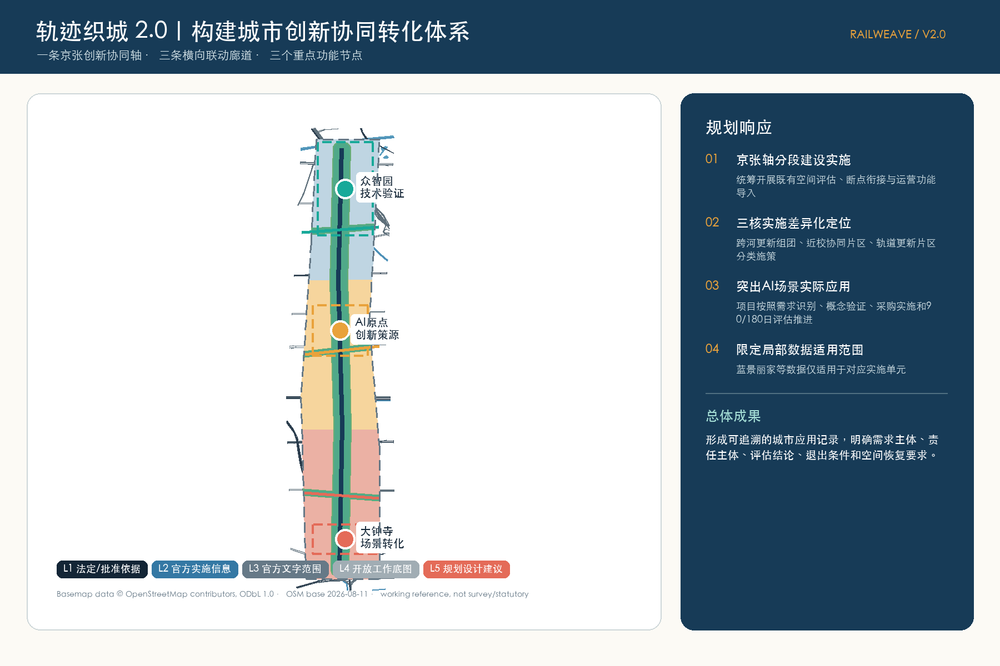
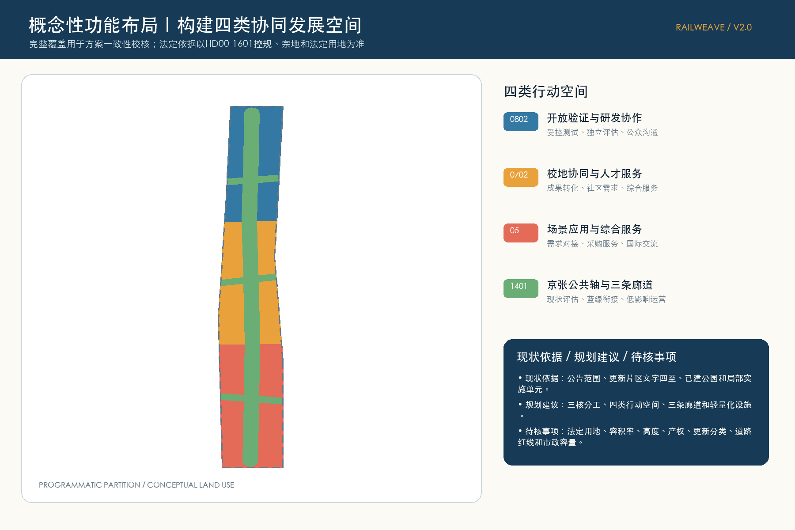
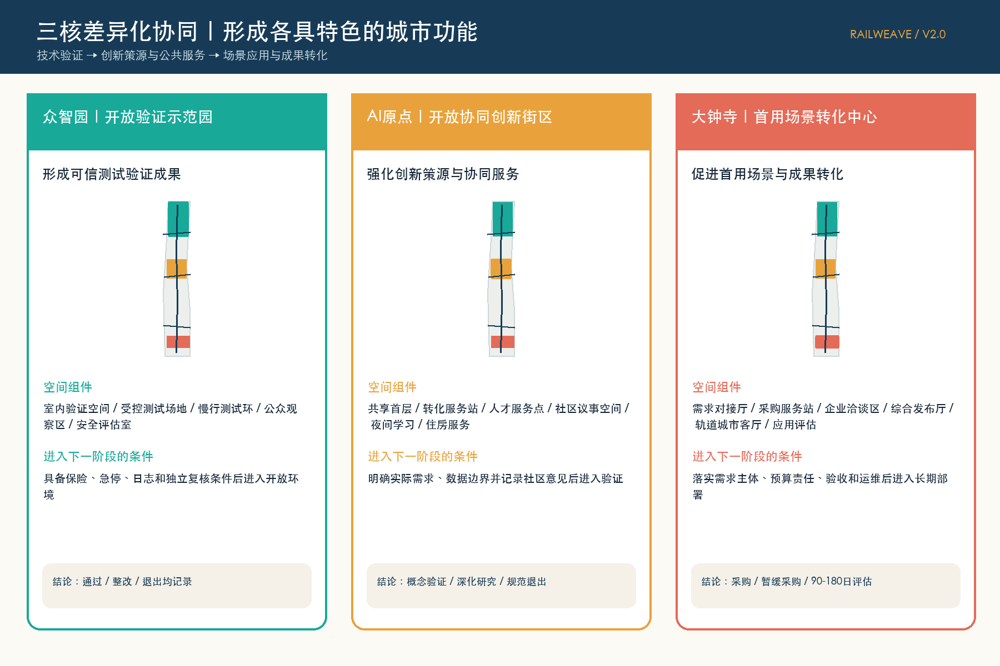
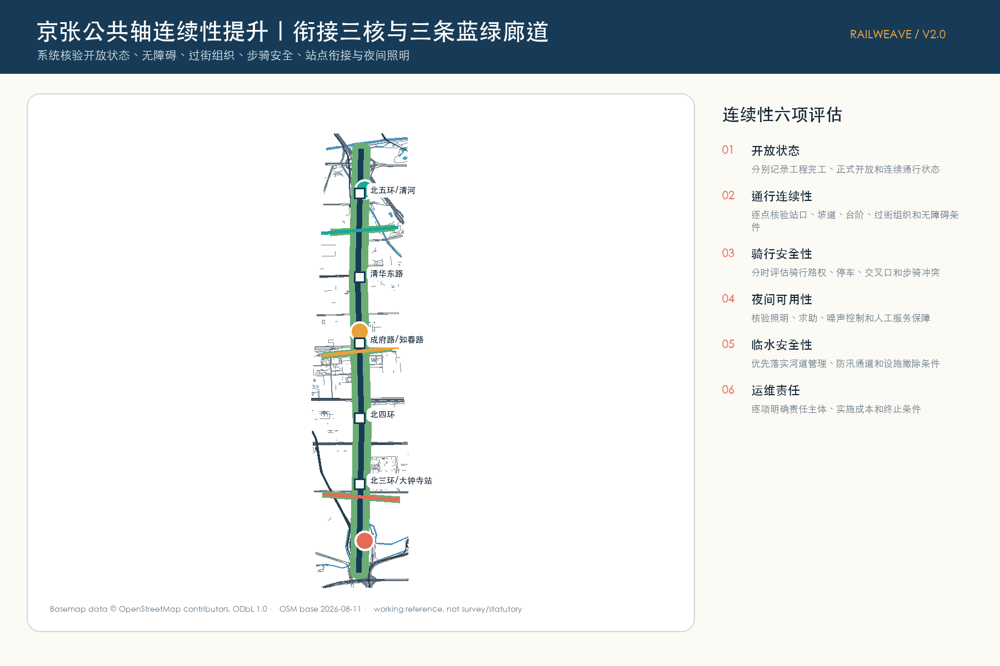
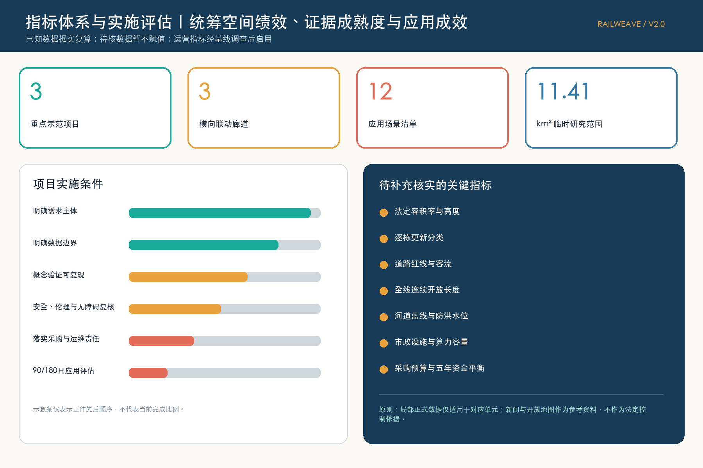

# 轨迹织城：百年京张 AI 创新带城市更新与协同转化方案

“轨迹织城 / RailWeave Open City”以京张铁路历史脉络为基础，统筹科技创新、城市更新和公共治理三类工作逻辑。方案坚持存量提质、创新协同、审慎实施，提出“一轴三廊三核、三链协同”的总体思路，推动创新需求提出、技术测试验证、场景应用转化全过程衔接，建设开放共享、责任清晰、安全可控的百年京张 AI 创新带。

根据现有公开资料，京张公共空间已具备分段建设和持续推进基础。[source:PARK-PHASE1] [source:PARK-PHASE2]

众智园、大钟寺已纳入城市更新工作，AI 原点已形成分布式创新载体和服务网络。[source:ZHONGZHIYUAN-RENEWAL] [source:DAZHONGSI-RENEWAL] [source:AI-ORIGIN-2026]

现阶段尚缺官方 GIS、宗地权属、统一时点建筑调查、完整道路红线以及河道、轨道安全条件等基础资料。本方案据此严格区分已确认事实、规划研判和设计建议，围绕空间布局、运营机制、数据治理、责任主体、资金安排和退出恢复建立可衔接后续专业深化的项目框架。[depth:existing_conditions_diagnosis]

本方案现阶段定位为开放共创的城市设计研究成果。约 11.4 平方公里临时工作边界仅用于方案组织和技术校核；功能组件符号仅表达空间接口，不代表现状或拟建建筑；结构化自检结果不替代法定规划、现场调查和工程可行性论证。参与者原创设计内容按 CC BY 4.0 开放，第三方资料按照许可条件和适用范围引用。[source:SOURCE-REGISTRY]

## 设计依据与资料清单

### 五级证据与表达上限

各章节统一按照“现状依据、规划研判、工作建议、深化条件”组织。不同来源资料叠加使用不改变其证据等级，例如官方文字四至与 OSM 道路关系相符，仍不得据此形成法定红线。

| 等级 | 定义 | 允许表达 | 图面规则 | 本方案典型 |
|---|---|---|---|---|
| **L1 正式法定或批准依据** | 经批复、正式划定或正式审核且机构具有直接职权 | 仅在文件适用地块/河段内使用“已批复、正式划定、审核要求” | 只有取得正式坐标或附图才画实线 | 清华园车站文字保护要求；蓝景丽家局部实施资料，均不得外推 [source:QINGHUAYUAN-HERITAGE] [source:LANJING-IMPLEMENTATION] |
| **L2 官方项目事实与阶段状态** | 政府或法定运营主体发布的工程、更新和阶段统计 | 使用“截至某日官方口径显示”，保留日期与项目范围 | 点划线节点或已实施区段，不代替法定界线 | 京张公园一期、二期配套项目；众智园/大钟寺更新公示 [source:PARK-PHASE1] [source:PARK-PHASE2] |
| **L3 官方文字范围与示意关系** | 官方约面积、文字四至或范围语义，无可量测坐标 | 使用“研究尺度约为、文字四至为、图中仅作索引” | 宽虚线、色晕和箭头；非法定边界 | 43.6 km²、11.4 km²、368.4 ha 约规模，原点约 3 km² 网络 [source:OFFICIAL-ANNOUNCEMENT] [source:AI-ORIGIN-2026] |
| **L4 开放数据工作底图** | OSM 等非测绘、非法定开放资料 | 可识别候选道路、建筑、水系、POI和踏勘对象 | 灰色底图，注明日期、许可和误差 | 2026-08-11 下载的 OSM 路网、水系、站点、建筑和 POI [source:OSM-WORKING-DATA] |
| **L5 设计建议与临时几何** | 本方案生成的策略、功能接口、概念线路和模拟值 | 统一使用“建议、概念性、待核验后实施” | 高辨识建议色；`NOT FOR CONSTRUCTION` | 一轴三廊三核、三项重点示范项目、临时工作范围与概念性联系廊道 [source:BOUNDARY-SOURCE] [source:KEY-AREA-SOURCE] |

目前 `geometry/constraints.geojson` 为空，只说明没有取得可提交的正式约束坐标，并不代表现场无文保、河道、道路、铁路、轨道或市政约束。[data:geometry/constraints.geojson#DATA-GAP-REGISTER] 正式来源、仓库资料、开放底图和参与者设计分别登记在 `sources.json`、`assumptions.json` 与 `data/source_registry.json`；加工事实包仅作为资料导航，不作为新增权威来源。[source:PROCESSED-FACT-PACK] 任务响应、专业标准和深度上限对应 `compliance_matrix.json`、`standard_matrix.json` 与 `design_depth_matrix.json`。[source:SITE-PACKAGE] [standard:PROJECT-OFFICIAL-ANNOUNCEMENT] [standard:MOHURD-URBAN-DESIGN-MEASURES]

### 现状基础与待补充资料

- **已掌握资料**：征集公告明确三层研究尺度和三处重点区域任务，`HD00-1601` 等街区控规及部分采信事项已公开。[source:OFFICIAL-ANNOUNCEMENT] [source:JINGZHANG-CONTROL-NOTICE]
- **已掌握资料**：京张公园一期已实施，二期配套项目已完成，连续开放状态尚需现场核实。[source:PARK-PHASE1] [source:PARK-PHASE2]
- **已掌握资料**：众智园、大钟寺更新片区已有官方文字四至，大钟寺实施单元统筹主体已有公示；AI 原点为以五道口为核心、向周边辐射的约 3 km² 分布式创新网络。[source:ZHONGZHIYUAN-RENEWAL] [source:DAZHONGSI-RENEWAL] [source:AI-ORIGIN-2026]
- **待补充资料**：官方矢量边界、宗地及产权、建筑现状、完整控规图纸、道路红线、河道蓝线、防洪水位、轨道及铁路安全保护区、市政容量、应用单位预算和五年运营收支。相关指标现阶段暂不赋值，不以方案示意替代基础调查。[depth:risk_missing_data]

## 三层范围工作框架

三层范围均来自官方约规模和文字语义，证据等级为 L3；当前图形只是研究索引。[source:OFFICIAL-ANNOUNCEMENT]

| 层次 | 官方任务尺度 | 工作目标 | 成果深度 | 使用边界 |
|---|---|---|---|---|
| 统筹研究范围 | 约 43.6 km² | 研究海淀高密度 AI 创新资源的协同组织和成果转化机制 | 形成机构、产业、人才、公共服务及蓝绿交通关系图谱 | 不用于确定全域用地、建筑规模或招商承诺 |
| 总体设计范围 | 约 11.4 km² | 评估京张公共空间建设和开放状况，依托清河、小月河与高校、转河三条联动廊道完善网络衔接 | 形成现状关系、功能布局、连续性提升任务和更新项目接口 | `SITE-001` 不作为法定红线，概念分区不替代控规成果 |
| 重点区域范围 | 三处合计约 368.4 ha | 结合资料基础和实施条件提出差异化重点项目 | 众智园形成片区级验证接口；AI 原点形成网络化创新服务接口；大钟寺形成更新片区场景转化接口 | 临时工作边界不用于计算法定面积、开发强度和拆改留 |

当前 `SITE-001` 仅用于提交包拓扑校核、自检和概念复算。[data:geometry/site_boundary.geojson#SITE-001]

`KEY-V2-001/002/003` 仅作为三处重点区域工作索引，三处重点区域数量按任务要求进行内部校核。[data:geometry/key_areas.geojson#KEY-V2-001] [data:geometry/key_areas.geojson#KEY-V2-002] [metric:key_area_count] 第三处索引与前两处采用同一临时边界规则。[data:geometry/key_areas.geojson#KEY-V2-003]

取得官方发布的矢量边界数据后，应按照 site boundary → key areas → existing layers → proposal layers → metrics → 五张主图 → HTML/PDF 的顺序整体重算，确保各类成果采用同一版本边界。[depth:three_level_scope_framework] [depth:metrics_recalculation]

## 统筹研究范围产业与未来城市研究

### 总体结构：一轴三廊三核、三链协同

**一轴**为京张创新协同发展轴。依托铁路遗产、公园绿地、慢行空间和公共服务资源，统筹设置需求发布、测试成果展示、场景应用交流和公众意见反馈等功能，形成贯通南北的创新公共空间骨架。

**三廊**分别为清河联动廊、小月河与高校协同廊和转河站城融合廊，重点加强滨水空间、高校院所、轨道站点、社区和创新载体之间的横向联系。

**三链**为项目全生命周期的三类实施链条：

1. **需求组织链**：居民、公共服务单位、企业和研究团队提出需求，经需求核实、用户参与、数据边界审查和概念验证（PoC），形成可测试的项目任务；
2. **测试验证链**：围绕版本复现、安全、能耗、无障碍、红队测试、断网运行和人工接管开展分项验证，形成“通过、限用、整改或停止”结论；
3. **应用转化链**：具备明确应用单位和实施条件的项目，依法依规进入市场调研、采购实施、部署运行和 90/180 天跟踪评估；暂不具备采购条件的，形成书面评估意见。

**三核**实行差异化功能分工：AI 原点承担创新需求组织和概念验证，众智园承担专业测试和可信验证，大钟寺承担场景供需对接、依法采购咨询、运行维护和应用评估。项目采用统一编号跨区域衔接，需求、验证和转化环节完整后方可认定进入实施阶段。依托北京市场景需求征集机制以及海淀区实验室、大模型和技术交易基础，重点补充从科研成果到城市应用之间的测试验证与场景转化环节。[source:BEIJING-SCENARIO-DEMAND] [source:HAIDIAN-STATS-2025]

### 国际案例的机制借鉴

| 案例 | 可借鉴机制 | 适用前提 | 本地转化边界 |
|---|---|---|---|
| Toronto Vector Institute | 独立非营利机构连接研究、人才、工程支持和可信应用 | 验证判断与商业服务分权，多方治理 | 其认证权限、加拿大资金和大学制度不属于本地直接适用条件 [source:CASE-VECTOR-TORONTO] |
| Montréal Mila | 开放科学、严谨 PoC、创业支持和公共利益治理并行 | 对问题、数据、实验和知识转移有完整协议 | 开源不等于企业/个人数据无条件公开 [source:CASE-MILA-MONTREAL] |
| Paris STATION F | 多个专业项目共享同一校园和基础服务 | 项目分流、公开章程和共享后台 | 不复制体量、品牌、投资数字或法国租赁制度 [source:CASE-STATION-F] |
| Helsinki Maria 01 | 从小范围存量空间试运营，以会员和使用证据逐步扩展 | 权属、消防、租赁和开放时段先明确 | 旧医院经验不能证明沿线建筑可直接改造 [source:CASE-MARIA-01] |
| Toronto MaRS | 公益任务、空间运营、应用服务和投资连接形成互补业务线 | 公益与商业分类核算，明确应用单位参与 | 加拿大慈善、税收和房地产制度仅作机制比较 [source:CASE-MARS-TORONTO] |
| Barcelona 22@ | 创新、居住、基础设施和社会融合同时管理 | 更新收益与社区受益共同评价 | 不复制土地增值回收、容积率和保障房制度 [source:CASE-22BARCELONA] |
| Copenhagen BLOXHUB | 用少数年度问题议程组织会员、应用研究和跨界合作 | 项目、预算、伙伴和年度结果公开 | 不用成员数与访问量替代本地公共价值 [source:CASE-BLOXHUB] |

国际案例用于开展机制比较和适用性分析，不作为地块条件、合作关系、投资安排或招商成果已经落实的依据。[source:AGENT-TASKBOOK] [standard:PROJECT-AGENT-OPEN-CALL-TASKBOOK]

### 方案名称与视觉识别系统

主名称“轨迹织城”体现京张铁路历史脉络、科技创新演进路径和项目责任追溯机制。标志采用平行轨迹在节点处分合的图形语言，表达多方案比选和全过程留痕。铁路深蓝体现历史传承和制度保障，开放青体现协同创新，琥珀体现人工复核和风险提示。导视系统对应 L1 至 L5 五级证据以及需求、验证、转化三类项目状态，并配置适用于全龄人群的触觉和文字编码。企业标志不纳入公共主标识体系，方案标志、字体和导视均采用原创内容。[depth:overall_spatial_structure]

## 总体设计范围城市更新与控规深度城市设计

### 统筹既有空间提质与网络衔接

根据截至 2026 年的官方信息，京张公园一期已建成，二期配套项目已取得阶段性进展；配套工程完成情况与全线连续开放、无障碍通行状况应分别核实。[source:PARK-PHASE1] [source:PARK-PHASE2] 总体设计建立 `built / supporting-works-completed / open-status-to-verify / gap-to-audit` 四级工作台账，重点对北五环、北四环、成府路、知春路、学院南路、北三环、轨道站点和河道接口开展现场踏勘与连续性评估。

空间结构形成“一轴三廊三核”：

- 京张纵轴：既有公园、铁路遗产、公共服务和项目状态的共同界面；
- 清河联动廊：连接跨街镇、跨园区和跨河更新组团，重点核实步骑衔接、滨水安全、防汛通道和五环接口；
- 小月河与高校协同廊：连接高校、分布式创新载体、社区与轨道站点，完善十分钟步行联系和首层公共服务；
- 转河站城融合廊：连接轨道站点、更新片区、社区、企业和滨水空间，重点加强站外无障碍衔接和更新项目接口。

`ROAD-V2-001` 至 `ROAD-V2-004` 用于表达连续性核查和空间联系任务，不作为道路、桥隧、绿道或施工线位依据。[data:geometry/roads.geojson#ROAD-V2-001] [data:geometry/roads.geojson#ROAD-V2-004] [metric:crosslink_count] 其内部复算长度属于 L5 工作值，仅用于方案校核，不计入工程量、政府建设时序或法定路网。[metric:road_length_m] [depth:traffic_rail_slow_parking]

### 城市更新与功能倾向

总体范围按照“现状依据、开放数据辅助研判、设计建议、深化事项”四类信息组织。北部重点布局开放验证与研发协作功能，中部重点完善近校协同创新与人才服务，南部重点发展场景应用与复合服务，京张轴线及三条横向廊道承担公共空间开放和网络衔接功能。[data:geometry/land_use.geojson#LU-V2-001] [data:geometry/land_use.geojson#LU-V2-004]

`LU-V2-001` 至 `LU-V2-004` 为 L5 概念性功能分区，仅用于表达总体功能组织，不构成法定用地调整或用地平衡方案。[standard:MNR-LAND-USE-CLASSIFICATION-GUIDE] [depth:land_use_layout]

现有官方资料可确认相关街区控规及部分交叉关系，但完整道路红线、用地性质、容积率、建筑高度、密度、退线和市政容量等指标仍待补充。[source:JINGZHANG-CONTROL-NOTICE] [standard:MOHURD-CONTROL-DETAILED-PLANNING] 城市风貌提出细分体量、首层步行友好、庭院共享、材料低反射、屋顶可维护、历史本体优先以及控制夜间媒体设施规模和动态光环境等原则。建筑体量、拆改留和永久构筑物方案应在取得测绘、权属、结构消防、文保和控规条件后进一步深化。[depth:height_massing_character]

## 重点区域详细设计

三处重点区域统一采用公共利益评价框架，并结合现状资料和实施条件确定差异化设计深度。项目应明确公共利益、数据最小化、人工复核、可逆性、维护责任以及事故处置和退出恢复要求；空间体量、开发强度和拆改留方案应严格依据各区域可采信资料深化。[depth:three_key_area_detailed_design]

### 众智园：开放验证示范园

**现状基础与工作重点。** 官方更新公示通过文字四至描述涉及学院路、清河、东升镇，包含多个园区节点并跨清河、小月河的更新片区。图中 `KEY-V2-001` 仅为工作索引，不作为公示红线使用。[source:ZHONGZHIYUAN-RENEWAL] [data:geometry/key_areas.geojson#KEY-V2-001]

**规划建议。** 重点建设开放验证示范园，设置可信测试验证空间（暂定名“验证舱”）、可重构工坊、封闭测试场、受控慢行测试环和公众观察评估廊等空间接口。建立项目准入、封闭复现、分项验证、限定试验、结论评估、信息公开和转入应用的工作流程。近期优先开展室内模型、端侧能耗、断网回退和封闭环境机器人测试；公共公园原则上不作为未经专项论证的机器人道路测试场地。

**实施主体建议。** 可由中关村科学城相关管理服务平台或依法确定的实施主体统筹，经协商引入科研机构、开源社区、评测机构和专业实验室承担技术运营。安全、伦理、无障碍和法律事项实行独立复核，场地业主、物业、保险和应急单位落实现场责任，并建立用户代表提出暂停和复核申请的渠道。文中机构名称仅用于说明主体类型，不代表其已经参与或授权。[source:CASE-VECTOR-TORONTO]

**深化条件。** 精确范围、宗地、产权、建筑现状、道路红线、河道管理线、建设规模、建筑高度、消防、市政容量和测试资质尚待核实。取得相关资料和审查意见前，不确定具体建筑体量、桥隧线位和企业合作安排。[depth:development_intensity_controls]

### AI 原点：开放协同创新街区

**现状基础与工作重点。** 根据官方信息，AI 原点是以五道口为核心、整合多个载体并向周边辐射的约 3 km² 分布式创新网络，已具备企业服务、人才服务和人机协同服务窗口等实践基础。[source:AI-ORIGIN-2026] [source:AI-ORIGIN-TALENT-STATION] `KEY-V2-002` 仅表达工作范围，不代表法定边界。[data:geometry/key_areas.geojson#KEY-V2-002]

**规划建议。** 选择一处权属、消防、租赁关系和开放时段明确的共享首层，建设“创新需求与成果转化服务室”，配置需求受理窗口、开源复现工位、成果转化服务窗口、限期概念验证项目室、人才综合服务台和夜间交流空间。居民、公共服务人员、科研人员和企业统一使用需求登记表。项目须具备明确服务对象和合法数据来源，完成初步研判后分别转入众智园测试验证、继续研究储备或形成终止评估意见。

**实施主体建议。** 可依托东升镇及现有 AI 原点运营网络开展社区协同运营，高校、科研院所和孵化机构通过协议提供专业辅导和成果转化服务，人社、人才、住房及企业服务部门依职责提供授权服务接口。居委会、物业、青年、老年人、残障人士和商户代表参与协商。智能问答主要承担信息解释和表单预填，例外事项、业务受理和申诉由人工专员负责。[source:AI-ORIGIN-TALENT-STATION]

**深化条件。** 载体产权、具体首层、租金、夜间噪声、消防、公平准入、知识产权和居民意愿尚待确认。高校及园区连通和具体建筑改造应在取得相关权利人同意及专业论证后确定。[source:BEIJING-URBAN-RENEWAL]

### 大钟寺：首用场景转化中心

**现状基础与工作重点。** 大钟寺更新片区已有官方文字四至和实施单元统筹主体，相关更新工作强调项目库建设、公益性与经营性空间统筹、资金平衡和长效运营；`KEY-V2-003` 仅为工作索引。[source:DAZHONGSI-RENEWAL] [data:geometry/key_areas.geojson#KEY-V2-003] 蓝景丽家约 5.03 ha、约 9.65 万 m²及交通预测仅适用于对应实施单元，不外推至整个片区。[source:LANJING-IMPLEMENTATION] [source:LANJING-TRAFFIC]

**规划建议。** 建设首用场景转化中心，设置公共需求发布厅、采购合规咨询窗口、供需对接室、综合发布厅、90/180 天应用评估室和面向轨道站点的综合服务前厅。需求单位应明确现行业务流程、责任人、预算条件和风险底线。成熟产品依法进入常规采购，仅需验证的项目采用测试协议，确有技术创新需求的项目再研究适用的合作创新采购方式。信息发布重点涵盖需求、验证结论、合同履行、实际使用和退出恢复情况。

**实施主体建议。** 区级发展改革、科技创新、政务数据、财政和行业主管部门可依职责开展制度与需求协调；依法确定的更新主体负责空间建设和全周期资金平衡；政府部门、公共机构、国有企业或市场主体作为潜在应用单位；采购、法务、知识产权、数据和审计机构共同保障程序规范。技术供应单位应通过依法适用的公开方式参与，前期概念验证不预设后续采购结果。[source:BEIJING-SCENARIO-DEMAND] [source:BEIJING-URBAN-RENEWAL]

**深化条件。** 应进一步核实应用单位、预算来源、采购权限、数据授权、交通容量、站外无障碍、地下连通和建筑条件。轨道站点四象限和地下工程线位以专项论证及审批成果为准。

## AI 创新生态、人才画像与 AI+ 场景

### 六类重点服务对象及使用流程

| 服务对象 | 需求形成 | 测试验证 | 场景转化 | 数据与人工保障 | 调整退出机制 |
|---|---|---|---|---|---|
| 青年研究者 | 在 AI 原点选择明确需求，与一线服务对象共同开展概念验证 | 在众智园完成版本、安全和能耗测试 | 在大钟寺对接多个潜在应用单位 | 未授权研究信息和身份轨迹不公开，由转化专员和独立复核人员签认 | 缺少明确服务对象的项目不予立项；不可复现的项目继续研究 |
| 初创团队 | 使用成果转化、人才和住房转介服务，不绑定投资机构 | 按最小必要原则披露商业数据并完成测试 | 经市场调研和合规程序对接首批应用单位 | 企业和个人服务数据分类授权，应用单位不得获取无关数据 | 缺少明确需求时终止销售型试点；运维条件不具备时不进入采购 |
| 社区居民 | 可通过线下、电话或网页匿名提出需求 | 自愿参与限定范围的概念验证，并可随时撤回 | 查看应用评估结果，依法提出投诉和申诉 | 不开展人脸画像；持续保留非数字渠道和人工服务 | 拒绝参与不影响正常服务；投诉触发暂停和复核程序 |
| 公共服务人员 | 描述现行业务流程、易错环节和不可替代职责 | 测试误报、漏报、断网和安全回退 | 作为需求单位参与验收和 90/180 天应用评估 | 使用脱敏样例，人工承担最终决定，不以算法替代法定职责 | 人工负担明显增加或未达到最低标准的项目退回整改 |
| 国际访客 | 从地铁和主脉了解公开问题，无需注册 | 参观非敏感验证解释 | 参加项目对接，只有后续项目才计成果 | 双语、无障碍、纸质/人工替代，不追踪跨点身份 | 可匿名反馈并删除联系信息 |
| 运维与一线工作者 | 在设计前审核能耗、网络、清洁、备件和班次 | 演练停电、急停和手动接管 | 对部署、维护和退出共同签字 | 不做劳动绩效画像，双人操作和安全培训 | 无维护资源不上线；退出时恢复场地和删除数据 |

### 十二类场景模块及项目流程

十二类场景按照需求组织、测试验证和应用转化三类流程进行统筹。每个场景均应明确空间前置条件、责任主体、试点期限、数据边界、人工复核、风险指标和停止条件，并在取得合法场地使用协议后确定具体位置。[metric:scenario_card_count]

| # | 场景模块 / 流程 | 空间条件与服务对象 | 数据、人工与维护 | 试点期限、成效与风险指标 | 准入限制与退出机制 |
|---|---|---|---|---|---|
| S01 | **模型复现验证** / P1验证 | 众智园可信测试验证空间；科研人员、企业、应用单位 | 采用公开或获授权数据并记录版本哈希；由研究人员复现、第三方独立抽查；测试方承担算力 | 单批次测试期限由协议确定；评价可复现率、档案完整率以及泄露和不可复现数量 | 缺少许可、版本或负责人时不予准入；验证未通过的项目退回研究 |
| S02 | **端侧能耗与断网韧性** / P1证据 | 室内可控节点；设备团队、运维 | 设备级能耗和故障日志，不采人；运维双人复核 | 与S01同批；单位任务能耗、断网回退、人工接管时间 | 断网无法安全回退或负荷不明即停止 |
| S03 | **具身智能受控测试** / P1验证 | 围合测试场，消防、保险和急停条件齐备；机器人团队和安全员 | 采用匿名事件日志并限定保存期限；安全员全程掌握急停权限；技术团队承担损耗和恢复责任 | 先开展封闭测试，再研究限定开放；评价碰撞、越界和接管成功率 | 一般公共绿地不直接部署；发生事故时立即封存并开展调查评估 |
| S04 | **事故处置、申诉与退出演练** / P1验证 | 事故评估室与可撤组件；全部项目主体 | 仅保留必要审计记录；由独立复核人员监督通知、删除和恢复 | 每次上线前组织演练；评价闭环时间、删除完成和空间恢复情况 | 缺少退出经费或责任人的项目不得上线；演练不合格的项目退回整改 |
| S05 | **共学与职业成长助手** / P2问题 | 原点共享首层；青年、教师、导师 | 自愿学习目标，教师/导师最终决定；运营方维护内容 | 限期PoC；完成率、人工节时、错误建议与退出率 | 不做自动评价、招生或就业决定；可随时关闭 |
| S06 | **全龄无障碍信息服务** / P2需求 | 站口、主轴和公共服务设施之间的连续路径；老年人、残障人士和访客 | 采用端侧或聚合路线事件数据；保留人工和纸质导览渠道 | 先行核查关键路径；评价无障碍路径完成率、误导和求助数量 | 不采集人脸或持续身份轨迹；错误频发时暂停服务并整改 |
| S07 | **人机协同公共工单** / P2问题 | 社区/园区服务前台；居民与一线人员 | 脱敏工单，人员确认分类与回复；需求单位承担运行 | 小范围工单类型试点；解决时间、重复投诉、人工负担 | 不自动执法/拒绝服务；人工负担上升则停止 |
| S08 | **铁路遗产多语内容审校** / P2问题 | 既有展示或可逆媒介；公众和国际访客 | 清权史料，AI内容显著标识；策展/文保审核 | 单主题内容期；更正时间、无障碍可读、史实错误 | 清华园车站相关内容/设备须文保核验；侵权即撤除 [source:QINGHUAYUAN-HERITAGE] |
| S09 | **采购与数据合规咨询** / P3转化 | 大钟寺需求发布厅；中小企业、应用单位、技术团队 | 企业按最小必要原则提交资料；采购、法务和数据专家复核 | 常态服务、季度评估；有效路径意见率、纠错数 | 不替代法定审查或形成定向中标；重大争议转入人工专项审查 |
| S10 | **首用场景供需对接** / P3转化 | 供需对接室和公开需求池；需求单位、多家技术团队 | 公开非敏感需求，保密数据另行签订协议；开展公平性监督 | 每批需求设定截止时间并形成结论；实名需求单位率、合同形成率和暂不采购结论 | 缺少明确应用单位或预算条件的项目不入池；不得预设供应单位 |
| S11 | **90/180 天应用评估** / P3转化 | 实际部署现场与应用评估室；应用单位、服务对象和运维人员 | 业务和维护指标按合同最小必要原则采集；由应用单位验收并保留用户申诉渠道 | 部署后 90/180 天；评价活跃使用、故障、人工投入、投诉和续用情况 | 缺少持续使用或维护条件，或风险超过阈值时，恢复原业务流程 |
| S12 | **项目责任信息台账** / 三链协同 | 三处公共节点和网页；社会公众 | 经授权公开需求、结论、限制、合同、投诉和更正；由专人维护 | 持续运行、季度归档；记录完整率、申诉闭环率 | 不公开个人信息和商业秘密；错误信息应及时更正，暂停和退出项目同步公开 |

S01 至 S04 为产业测试验证模块，满足不少于三项产业验证场景的任务要求。S08 调整为铁路遗产多语内容审校；在缺少明确医疗需求单位和持续内容责任的条件下，医疗问答暂不设置为独立场景。公共服务自动化应保留人工决定、非智能服务渠道以及解释、撤回和申诉机制。[source:AGENT-TASKBOOK] [standard:PROJECT-AGENT-OPEN-CALL-TASKBOOK]

## 用地、建筑规模与拆改留方案

### 用地与建筑指标确定原则

`land_use.geojson` 表达四类概念性功能分区，仅用于临时工作边界内的方案一致性校核，不构成法定用地布局或控规指标。[data:geometry/land_use.geojson#LU-V2-002] [depth:land_use_layout] `buildings.geojson` 为空图层，表示现阶段尚无经核验的建筑基底数据，不表示现场不存在建筑。功能组件通过公共空间行动范围和项目接口表达，`building_footprint_area_sqm` 暂列为待核实。[data:geometry/buildings.geojson#NO-VERIFIED-BUILDING-FOOTPRINTS] [metric:building_footprint_area_sqm]

现状建筑清单应综合 L4 开放建筑基底轮廓、遥感时相和现场调查建立，并标注 `existing-observed / to-verify`。具体更新分类应依次核实权属与租约、文物保护、建设合法性、结构与消防、现状使用与空置、碳排放、公共服务、租户和职工影响、替代安置、资金安排及后期运营条件。[standard:MOHURD-ARCH-DESIGN-DEPTH-2016] [depth:retain_renovate_demolish]

拆改留决策树为：

1. 有遗产价值或结构/使用良好：优先保留和维护；
2. 空间性能不足但安全可修复：适应性再利用，先小范围时段共享；
3. 影响公共连续性但可通过管理解决：先调时、开门和导向，不先拆建；
4. 确需拆除：完成安全、碳、权属、公共利益、租户和替代方案论证；
5. 新增：优先轻量、可逆、可拆卸，五年运营账未成立不进入中期建设。

蓝景丽家相关资料仅适用于对应实施单元，图面应以加粗边界注明“本框内有效，不外推”，不得用于总体设计范围或其他重点区域的指标推算。全域容积率（FAR）、建筑高度和建设规模现阶段暂不具备确定条件。[source:LANJING-IMPLEMENTATION] [source:LANJING-TRAFFIC] [depth:development_intensity_controls]

## 交通、轨道、市政与公共服务设施

交通策略以网络连续性和实际通行条件核查为重点。轨道站口和道路交叉口应记录坡度、台阶与电梯、过街等待、围挡、桥下空间、夜间照明、冬季维护、非机动车停放、步骑冲突、求助设施和人工服务等情况。京张纵轴与三条横向廊道先作为连续性核查走廊，完成现场核实后再测算连续开放和无障碍网络长度。[metric:continuous_open_greenway_length_m] [depth:traffic_rail_slow_parking]

大钟寺、五道口、清华东路西口、六道口、知春路、清河等站点以运营方信息核对站名、出入口和设施，站外路径另做现场调查；站点存在不等于换乘或站外无障碍。大钟寺仅提出地铁、需求厅、京张主轴与转河之间的连续到达目标，不确定地下连廊或四象限工程线位。[source:DAZHONGSI-RENEWAL]

市政基础设施采用端侧、街区、区域三级接口：端侧设备遵循数据最小化原则，具备断网运行和人工接管能力；街区节点登记电力、网络、充电、散热、回收和维护需求；区域层提出与现有能源、通信、排涝、消防和应急系统协同的需求清单。容量资料尚未取得，现阶段不对算力、电力、给排水、充换电或管线迁改能力作出承诺。[depth:municipal_new_infrastructure]

公共服务遵循数字化辅助、人工渠道保留和无障碍可达原则。涉及个人权益的服务应提供线下、电话或纸质办理方式，不强制要求下载应用程序。人工智能主要用于信息解释、表单预填、检索和分派，法定决定、例外处理、救济和申诉仍由工作人员承担。AI 原点已有 17 项人才服务和三级专员帮办实践，可作为人机协同服务接口，不作为跨部门数据自由流通的依据。[source:AI-ORIGIN-TALENT-STATION]

## 蓝绿空间、公共空间与城市风貌

蓝绿系统分三层表达：L2 反映京张公园已建及工程状态，L4 辅助识别清河、小月河、转河和开放路网。[source:PARK-PHASE1] [source:PARK-PHASE2] [source:OSM-WORKING-DATA]

L5 提出纵轴与三条横向廊道的衔接完善建议。[data:geometry/green_space.geojson#GREEN-V2-001] 河道蓝线、管理范围、洪水位、生态岸线和运维通道尚未取得，临水活动、照明和装置均采用可逆方式，并应通过水务、防洪和养护专项核验。[depth:blue_green_public_space]

公共空间通过全过程信息公示体现人工智能应用治理要求。各项目应公示需求提出主体、数据使用范围、复核主体、测试结论、维护责任、评估周期以及申诉和退出方式。夜间环境应控制眩光、媒体设施规模和动态光源强度，材料以可维修、可替换和低反射为原则，并与铁路遗产环境相协调。

### 三处公共创新展示节点

1. **众智园·验证成果展示廊**：位于重点项目临时行动范围内，通过可逆展架展示通过、限用、整改和停止等验证结论。公众展示内容仅限非敏感信息，专业日志在受控环境保存。节点加强开放验证示范园与京张公共空间主轴的联系，不承担法定认证职能。[data:geometry/public_space.geojson#PUBLIC-V2-001]
2. **AI 原点·协同创新庭院**：集中展示社区需求、研究回应、概念验证进度、不同意见和退出记录，配置可移动学习设施和纸质需求墙，保障不使用智能设备的公众同样可以参与。[data:geometry/public_space.geojson#PUBLIC-V2-002]
3. **大钟寺·京张创新转化门户**：以铁路里程和项目编号串联历史文化、场景需求、测试验证、合同实施和 90/180 天应用评估，突出实际使用成效。具体位置、体量和媒体形式应结合站城一体化、产权、消防和文物保护要求进一步论证。[data:geometry/public_space.geojson#PUBLIC-V2-003]

三处节点均属于 L5 低扰动设计建议，应控制建设体量和视觉影响，避免形成过度标志性构筑物；视觉标志、字体、人物、图片和史料须完成版权核验。清华园车站周边新增构筑物、灯光、活动和地下工程，应先核实文物保护范围、建设控制地带、考古和活动容量要求。[source:QINGHUAYUAN-HERITAGE]

## 更新项目清单、实施政策与分期计划

### 近期工作包：“一室、一舱、一池、四册”

- **一室**：在 AI 原点选择一处权属、消防和开放时段明确的共享首层，设置需求受理、技术复现、成果转化咨询和人才住房转介服务；
- **一舱**：在众智园设置一处室内可信测试验证空间，优先开展版本、能耗、断网运行和人工接管测试，高风险公共机器人测试须另行专项论证；
- **一池**：在大钟寺建立线上场景需求清单和定期采购合规咨询机制，先行开展需求归集和应用单位对接，再依据实际需求确定实体发布空间规模；
- **四册**：编制《多方治理章程》《项目准入与分级测试手册》《数据与个人信息清单》《事故处置、申诉与退出手册》。

### 分期项目包

| 阶段 | 核心项目 | 交付成果 | 进入条件 | 调整退出条件 |
|---|---|---|---|---|
| **0至6月：建章立制与基础准备** | 一室、一舱、一池、四册；三核场地、主体和服务对象台账 | 统一项目编号；需求登记、测试、采购和退出表单；指标基线调查计划 | 场地合法使用、现场责任明确、需求主体明确、数据使用合法并具备人工回退机制 | 缺少需求主体、数据依据或退出经费的项目暂不启动 [data:geometry/phasing.geojson#PHASE-V2-001] |
| **6至18月：首批三个试点项目** | 开展 2 至 3 期概念验证；推进模型、端侧和封闭环境机器人验证；组织首批低风险场景应用 | 公开测试报告；形成至少一个依法采购或暂不采购的完整结论；按季度记录风险和财务数据 | 概念验证可复现、关键事项完成独立复核、应用单位和运维责任明确 | 事故处置未闭环、人工负担明显增加或预算运维条件不足时暂停 [data:geometry/phasing.geojson#PHASE-V2-002] |
| **18至36月：评估完善与有序推广** | 完善 AI 原点多点服务网络；在众智园开展限定开放测试；推进大钟寺实体场景转化中心及国际交流项目 | 形成五年项目实施台账、专业深化图纸和连续两个评估周期结果 | 权属、规划、消防、文保、交通和市政条件齐备，运营收支及公众协商机制基本落实 | 实际使用不足、持续资金缺失、风险超过阈值或权利人未同意时暂缓扩建 [data:geometry/phasing.geojson#PHASE-V2-003] |

本分期按照证据成熟度、可逆性和公共收益综合排序，属于方案实施建议，不作为政府建设时序或行政承诺。[depth:phasing_implementation]

### 项目实施台账（单页）

进入 6 至 18 月项目包的项目应填写单页实施台账，内容包括项目编号、需求单位和服务对象、现状基线与非 AI 替代方案、场地业主及经营权、物业消防条件、模型设备版本、数据来源与权限及保存期限、统筹和技术主体、独立复核与现场责任、应用单位和用户监督、采购路径、知识产权、公平竞争、建设投资（CAPEX）、年度运营维护成本（OPEX）、已确认收入、五年资金缺口，以及维护、保险、事故处置、申诉、数据删除、设备拆除和空间恢复安排。暂不确定事项标注 `unknown / 待核验`，不以零值或愿景性表述替代依据。[source:BEIJING-URBAN-RENEWAL] [source:HAIDIAN-RENEWAL-GUIDE] [depth:renewal_project_list]

### 年度运营安排

可按年度统筹开展需求征集、受控测试、成果应用和责任审计等活动，具体安排应在实施主体、经费和项目条件明确后组织。活动绩效重点评估后续对接、验证完成、合同形成、实际使用和问题解决情况，参观人次和媒体曝光不作为核心成效指标。国际交流以双语项目档案和可复核结果为基础，企业依法承担合同与维护责任，居民依法享有提出需求、表达意见、申诉和退出项目的权利。[source:CASE-BLOXHUB]

## 指标体系、面积复算与合规矩阵

指标体系分为官方基线、开放数据辅助研判、L5 方案指标和实施绩效四类。所有比例指标同步报告分子与分母，暂停、终止和退出项目均纳入统计。

| 指标组 | 指标 | 定义与状态 | 管理用途 |
|---|---|---|---|
| 官方基线 | 重点区域数量、场景模块数量 | 三处重点区域和十二类场景模块为已知计数 [metric:key_area_count] [metric:scenario_card_count] | 用于核验任务覆盖情况，不作为边界确认或项目批准依据 |
| 开放诊断 | 连续开放无障碍长度 | `field-verified step-free open network length`，当前待核实 [metric:continuous_open_greenway_length_m] | 评价慢行网络实际连续开放水平 |
| L5情景 | site、绿地、公共空间和概念线 | site 与绿地由临时几何复算 [metric:site_area_sqm] [metric:green_ratio]；公共空间与概念线同步标注为概念值 [metric:public_space_ratio] [metric:road_length_m] | 只校验方案内部一致性，不能与法定面积/绿地率/工程量并列 |
| L5项目 | 重点项目与横向廊道数量 | 三项重点项目、三条横向廊道为方案计数 [metric:flagship_project_count] [metric:crosslink_count] | 校核三个核心功能节点和总体结构的完整性 |
| 实施绩效 | 有效需求率 | 通过需求核验项目数÷提交总数；完成基线调查后确定目标 | 避免设置缺少明确服务对象和实际需求的应用场景 |
| 实施绩效 | PoC可复现率 | 第三方复现成功数÷送测数 | 检验原点到众智园的证据质量 |
| 实施绩效 | 测试档案完整率 | 完成强制字段项目数÷已出结论项目数 | 完整不代表技术通过，但属于程序门槛 |
| 实施绩效 | 人工接管成功率 | 按时完成接管演练次数÷演练总数 | 量化人工接管和运营维护保障能力 |
| 实施绩效 | 申诉闭环率 | 章程时限内答复并记录结果数÷到期申诉数 | “已回复”和“已解决”分别报告 |
| 实施绩效 | 验证后应用率 | 进入合法合同或部署的项目数÷通过验证且有明确应用单位的项目数 | 缺少应用单位的项目单列，合同签署不替代实际使用评价 |
| 实施绩效 | 90天活跃使用率 | 满90天仍真实使用部署数÷已满90天部署数 | 签约未使用计为零 |
| 实施绩效 | 五年运营缺口 | 五年OPEX+更新维护−已确认收入/购买服务/出资 | 未确认收入不得纳入，决定是否扩建 |

容积率（FAR）、建筑高度、建设规模和市政容量现阶段均为待核实指标；`building_footprint_area_sqm` 不采用 v1 概念性建筑基底值。[metric:building_footprint_area_sqm] [depth:development_intensity_controls] 拓扑、数据结构和内部自检仅用于确认数字化提交包的结构完整性，不作为项目现实可实施性的证明。根据数字化提交规范，`design_depth_matrix.status=complete` 表示该事项已形成完整、可审查的投稿响应；各事项的实际工作深度、证据上限和待补充资料分别记录在 `current_depth`、`evidence_ceiling` 和 `blocking_inputs` 字段中。[depth:metrics_recalculation] [depth:risk_missing_data]

## 风险、版权与合规说明

### 最高优先级成果发布风险（P0）

1. **临时工作边界被误读为法定边界**：`SITE-001` 和三处重点区域应显著标注“研究索引，非法定红线”。未完成法定边界、临时工作边界和设计建议的图例及线型区分前，相关图件不纳入发布成果。[source:BOUNDARY-SOURCE] [source:KEY-AREA-SOURCE]
2. **概念性功能组件被误读为建筑方案**：一室、一舱、一池和三处展示节点仅以项目接口和临时行动范围表达。建筑调查和审批条件未落实前，不确定建筑基底或建设规模。
3. **局部实施数据超范围使用**：蓝景丽家局部面积、规模、高度和交通数据应通过加粗边界限定适用范围，不用于大钟寺片区或总体设计范围指标推算。[source:LANJING-IMPLEMENTATION] [source:LANJING-TRAFFIC]
4. **工程建设状态与开放使用状态混淆**：二期配套项目完成情况不作为约 9 km 全线连续开放的依据，应逐段记录开放、围挡和无障碍状态。[source:PARK-PHASE2]
5. **文物保护、水务、铁路和轨道安全条件缺失**：清华园车站、河道、地下铁路、13 号线和道路条件缺少正式坐标时，不确定永久设备、桥隧、跨线和地下工程方案。[source:QINGHUAYUAN-HERITAGE]
6. **数字化成果校验与专业设计深度混淆**：JSON、拓扑和渲染内部校核结果不代表已达到控规、综合实施方案或建筑设计深度。[standard:MOHURD-CONTROL-DETAILED-PLANNING]
7. **开放数据精度与现状核验不足**：开放底图仅用于工作底图和踏勘索引，产权、结构、消防、用途、客流和无障碍条件应通过现场调查和专业核验确定。[source:OSM-WORKING-DATA]

### 人工智能治理、个人信息保护与公共责任

所有公共服务应保留人工决定和非智能服务渠道，落实清晰告知、撤回和申诉机制。禁止开展无感人脸识别、持续身份轨迹采集、未经同意的情绪或行为画像，不得以算法替代法定职责。公共数据以及学校、医疗、园区数据不得因同属创新带而擅自合并使用。技术供应单位应登记版本、数据、维护、事故处置和退出责任，并通过依法适用的公平程序参与项目。[source:BEIJING-SCENARIO-DEMAND]

### 版权与开放

正文、参与者原创 GeoJSON、信息设计、HTML 与图册按 CC BY 4.0 开放。`site-overview.png`、`mobility-bluegreen.png` 及其在 HTML/PDF 中的嵌入版本已经使用 OSM 衍生工作底图；其中 OSM 数据部分为 `© OpenStreetMap contributors`，遵守 ODbL 1.0，不因汇编进入本成果而改授 CC BY 4.0。项目不复制商业地图瓦片、受限新闻图片、企业商标或第三方案例图纸。机构名称仅用于来源或潜在主体类型，不代表其参与、授权、背书或承诺。完整版权声明见 `report/copyright_statement.md`。[source:SOURCE-REGISTRY] [source:OSM-WORKING-DATA]

## 参考资料

### L1 / L2 / L3 官方任务、规划、更新与工程事实

- 百年京张 AI 创新带征集公告：明确三层约规模、文字范围与任务；尚未取得官方发布的矢量边界数据。[source:OFFICIAL-ANNOUNCEMENT]
- 京张沿线 `HD00-1601` 等街区控规采信通告：只支撑控规存在和公开采信事项。[source:JINGZHANG-CONTROL-NOTICE]
- 众智园、大钟寺城市更新公示：支撑文字四至、更新语境和已公示主体；不支撑宗地拆改。[source:ZHONGZHIYUAN-RENEWAL] [source:DAZHONGSI-RENEWAL]
- 蓝景丽家实施和交通资料：只在对应局部实施单元内有效。[source:LANJING-IMPLEMENTATION] [source:LANJING-TRAFFIC]
- 京张公园一期、二期官方信息：分段记录建设与开放状态；二期资料不作为全线连续开放的认定依据。[source:PARK-PHASE1] [source:PARK-PHASE2]
- 清华园车站保护要求：文字要求可用，正式坐标仍需索取。[source:QINGHUAYUAN-HERITAGE]
- AI 原点社区和人才服务站：支撑分布式载体与人机协同服务原型，不代表空间授权。[source:AI-ORIGIN-2026] [source:AI-ORIGIN-TALENT-STATION]
- 海淀 2025 统计公报与北京市场景需求：支撑区级生态基线和场景机制，不外推廊道企业数量或预算。[source:HAIDIAN-STATS-2025] [source:BEIJING-SCENARIO-DEMAND]
- 北京城市更新条例、海淀更新实施指引：支撑实施主体、权利人协商、资金和运营要求。[source:BEIJING-URBAN-RENEWAL] [source:HAIDIAN-RENEWAL-GUIDE]

### L4 开放工作底图

- OpenStreetMap 路网、步骑、轨道、水系、建筑、站点与 POI 候选，数据日期 2026-08-11；ODbL。成图只加载经过过滤的主路、步骑、运营铁路、具名轨道站和水系；建筑与 POI 候选不加载、不进入正式 GeoJSON 或指标。[source:OSM-WORKING-DATA]

### L5 任务书、设计包与专业标准

- `brief/site-package/`、面向智能体任务书与来源注册表。[source:SITE-PACKAGE] [source:AGENT-TASKBOOK] [source:SOURCE-REGISTRY]
- 项目公告、面向智能体任务书和城市设计管理要求构成任务及城市设计依据。[standard:PROJECT-OFFICIAL-ANNOUNCEMENT] [standard:PROJECT-AGENT-OPEN-CALL-TASKBOOK] [standard:MOHURD-URBAN-DESIGN-MEASURES]
- 控规、国土空间用地分类和建筑设计深度标准用于限定方案表达深度。[standard:MOHURD-CONTROL-DETAILED-PLANNING] [standard:MNR-LAND-USE-CLASSIFICATION-GUIDE] [standard:MOHURD-ARCH-DESIGN-DEPTH-2016]
- Vector Institute、Mila 与 Station F 案例仅用于创新生态组织机制比较。[source:CASE-VECTOR-TORONTO] [source:CASE-MILA-MONTREAL] [source:CASE-STATION-F]
- Maria 01 与 MaRS 案例仅用于空间运营和转化服务机制比较。[source:CASE-MARIA-01] [source:CASE-MARS-TORONTO]
- 22@Barcelona 与 BLOXHUB 案例仅用于创新城区和公共价值机制比较。[source:CASE-22BARCELONA] [source:CASE-BLOXHUB]

本方案成果的审查重点是明确区分正式依据、官方文字范围、开放数据、设计建议和待补充资料，并建立相应的更新复算机制。全部空间建议均属于 L5 设计建议，仅供方案研究和后续深化使用（非施工依据 / NOT FOR CONSTRUCTION），不替代法定规划、政府审定、工程可行性论证、采购结果或投资承诺。[depth:risk_missing_data]
