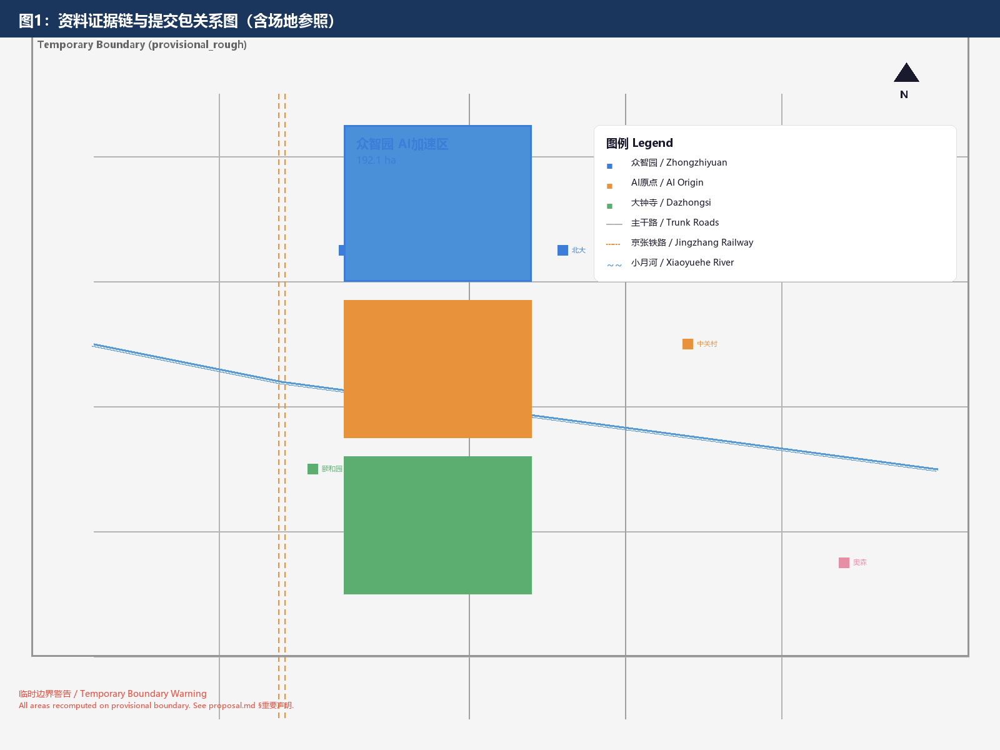
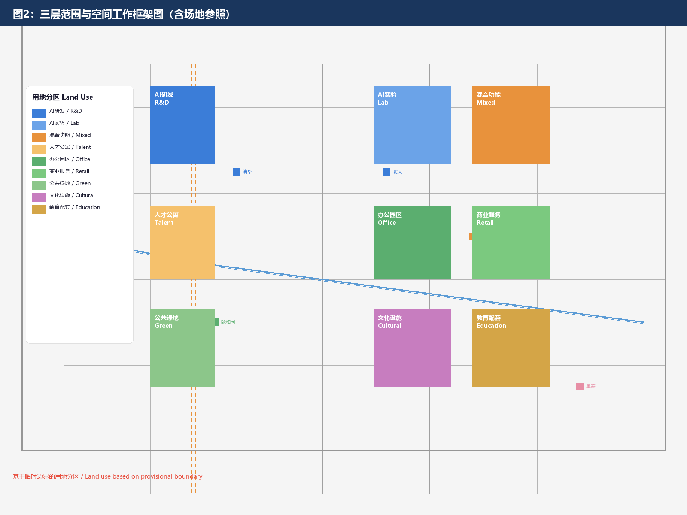
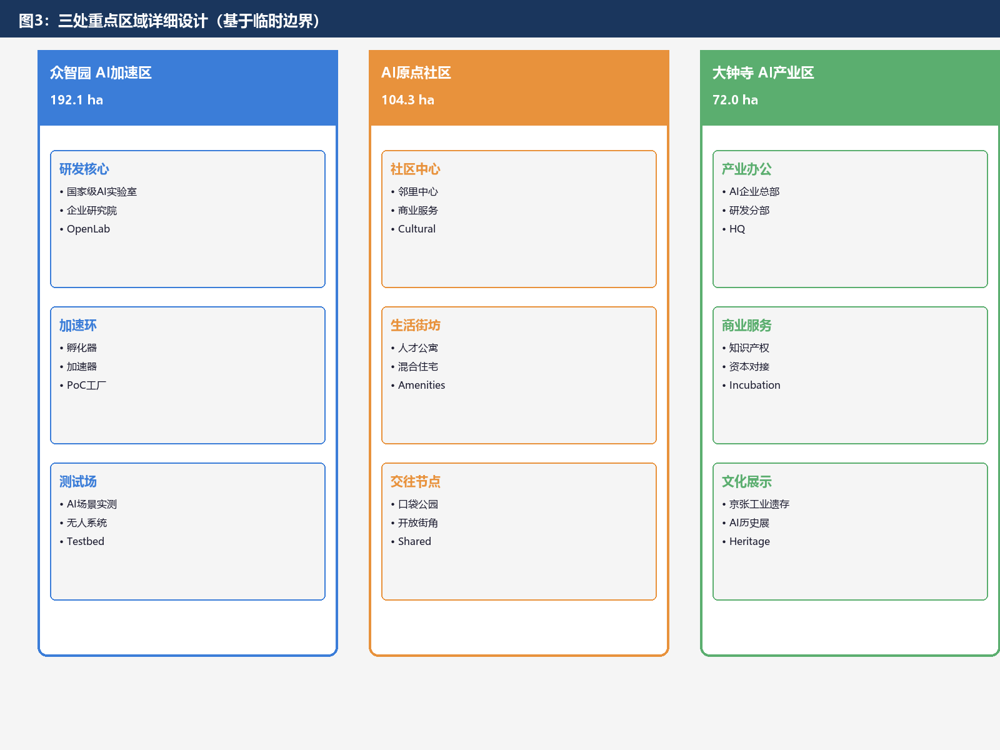
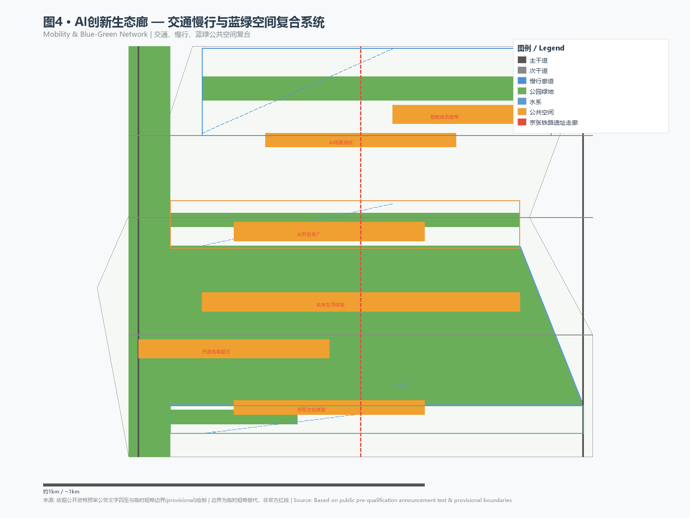
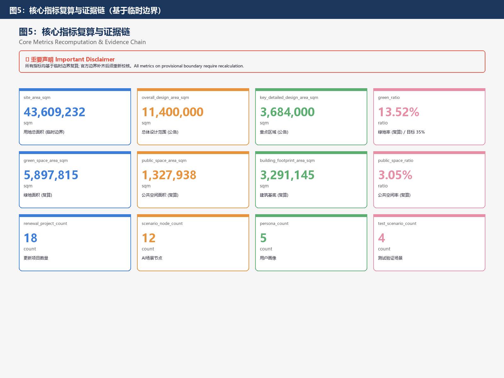

# AI Innovation Ecosystem Corridor: The Intelligent Rebirth of the Century-Old Jing-Zhang Railway

## Executive Summary

This proposal uses the Jing-Zhang Railway heritage corridor as the "intelligence vein" main axis, connecting three major nodes — Zhongzhiyuan AI Acceleration Zone (192.1 ha), Beijing AI Origin Community (104.3 ha), and Dazhongsi AI Industry Zone (72.0 ha) — to build a world-class AI innovation ecosystem corridor within a 43.6 km² coordinated research scope, integrating full-stack AI R&D, scenario empowerment, public space, cultural narrative, and long-term operation.

**Key Proposal Points**:

- **Three-tier scope framework**: Coordinated research scope (43.6 km²) → Overall design scope (11.4 km²) → Key area scope (3.684 km²), strictly aligned with the announcement's three-tier requirements
- **Three-zone two-wing synergy circuit**: Zhongzhiyuan (R&D) → AI Origin Community (talent & living scenarios) → Dazhongsi (industrial transformation) → Zhongguancun Wing (capital & IP services) → Xiaoyue River Wing (scenario validation) → feedback loop
- **18 renewal projects implementation matrix**: With preconditions, ownership/approval dependencies, cost levels, phase gates, and stop conditions, constructed under the *Beijing Urban Renewal Regulation* (effective March 1, 2023)
- **12 AI scenario nodes**: Including AI traffic walkability, AI medical, robot delivery, AI guide, enterprise services, public safety, etc., with a compliance checklist established under the *Interim Measures for the Management of Generative AI Services* (effective August 15, 2023)
- **5 vulnerable group safeguards**: Persons with disabilities, child caregivers, low-income tenants, non-digital users, and existing small merchants, including resident participation, impact assessment, appeal & relief, and anti-displacement mechanisms
- **Legal and policy basis**: 4 urban renewal regulations, 5 AI service compliance laws, 4 data security laws, and 5 Haidian District AI industry policies (annual 10B+ RMB funding support, 20B RMB fund matrix)

**Important Disclaimer**: All spatial implementation suggestions are conceptual and do not replace formal planning. All area and metric values are based on provisional rough boundary recalculation and require re-verification once official precise boundary data is available. All legal provisions cited are public texts; implementation entities are advised to conduct specialized compliance review by legal counsel before formal advancement.

---

## Design Basis and Source Inventory

This proposal is primarily governed by the "Qualification Pre-Announcement for the International Urban Design Scheme Collection for the Centennial Jing-Zhang AI Innovation Belt" issued by the Haidian Branch of the Beijing Municipal Planning and Natural Resources Commission [source:SRC-2026-BJ-GH-QUAL-PREANNOUNCEMENT]. The agent taskbook excerpt serves as the coverage basis for agent tasks [source:AGENT-TASKBOOK]. Haidian District's "1+X+1" modernized industrial system layout provides the industrial positioning context [source:SRC-2026-HAIDIAN-1X1], and the Beijing Municipal Science and Technology Commission's "Three Zones, Two Wings" policy provides the spatial coordination framework [source:SRC-2026-BJ-KW-THREE-AREAS-WINGS].

At the data level, this proposal uses the repository-provided provisional rough boundaries for spatial generation and display [data:geometry/site_boundary.geojson#PROV-SITE-001]. These boundaries are derived from the announcement's textual descriptions and the approximately 11.4 km2 area constraint, and are provisional rough substitutes that shall not serve as official red lines, approval basis, or precise area recalculation basis [source:SRC-PROVISIONAL-BOUNDARIES-2026]. When official precise boundary data becomes available, all affected layers and metrics will require recalculation.

At the standards level, this proposal follows the professional requirements of the "Urban Design Management Measures" [standard:MOHURD-URBAN-DESIGN-MEASURES], the "Measures for the Preparation and Approval of Regulatory Detailed Planning for Cities and Towns" [standard:MOHURD-CONTROL-DETAILED-PLANNING], and the "Guidelines for Land and Sea Use Classification in National Spatial Survey, Planning, and Use Control" [standard:MNR-LAND-USE-CLASSIFICATION-GUIDE]. It also follows the ten co-creation principles and unified boundary terms of the agent taskbook [standard:PROJECT-AGENT-OPEN-CALL-TASKBOOK].

**Important Statement**: All spatial implementation suggestions in this proposal are conceptual suggestions, reference proposals, or materials for professional team deepening. They do not replace formal planning, do not constitute government-approved conclusions, and do not contain floor area ratio, building height, specific demolition/retention, road red lines, or engineering implementation conclusions. All areas and metrics are recalculated based on provisional rough boundaries and require re-verification when official precise boundary data becomes available.

## Three-Tier Scope Working Framework

This proposal operates across three spatial tiers, strictly corresponding to the three-tier scope defined in the announcement [source:SITE-PACKAGE].

**Coordinated Research Scope (43.6 km2)**: Bounded by the North Fifth Ring Road to the north, the Jingzang Expressway to the east, Xizhimenwai Street to the south, and Wanquanhe Road to the west [data:geometry/site_boundary.geojson#PROV-RESEARCH-001]. Within this scope, world-class AI innovation ecosystem research, industrial chain synergy analysis, three-zone-two-wing regional coordination research, and future AI city morphology research are conducted. Work depth: strategic research and industrial coordination.

**Overall Design Scope (11.4 km2)**: The urban area and industrial area within 1-2 km of the Jing-Zhang Heritage Park serve as the planning and design scope [data:geometry/site_boundary.geojson#PROV-SITE-001]. Within this scope, urban design at the regulatory detailed planning depth is conducted, including functional layout, land use structure, urban renewal framework, transportation organization, municipal supporting facilities, public space system, and urban landscape control. Work depth: regulatory planning urban design.

**Key Area Scope (3.684 km2)**: From north to south, including the Zhongzhiyuan AI Indigenous Innovation Acceleration Zone (192.1 ha) [data:geometry/key_areas.geojson#PROV-KEY-001], the Beijing AI Origin Community (104.3 ha) [data:geometry/key_areas.geojson#PROV-KEY-002], and the Dazhongsi AI Industry Cluster Zone (72.0 ha) [data:geometry/key_areas.geojson#PROV-KEY-003]. Within this scope, detailed urban design at the comprehensive implementation planning depth is conducted [depth:key_area_detail].

## Coordinated Research Scope: Industry and Future City Research

### Overall Belt Concept: AI Innovation Ecosystem Corridor

**Naming System**: This proposal proposes "AI Innovation Ecosystem Corridor" (AIEC) as the overall name for the belt. "Corridor" responds to the century-old identity of the Jing-Zhang Railway as a transportation corridor, while expressing the spatial logic of AI innovation ecosystem as a linear growth system — the corridor is not a closed park, but an open, permeable, continuously growing innovation ecosystem. The English abbreviation "AIEC" is pronounced similar to "AI-Eco," providing recognition and communicability in both Chinese and English.

**Visual Identity and Logo Direction**: The logo uses the parallel lines of the Jing-Zhang Railway tracks as its skeleton, incorporating neural network node topology to form the visual metaphor of "tracks as nerves." The primary colors are tech blue (#3B7DD8) symbolizing AI innovation, railway orange (#E8923C) echoing Jing-Zhang history, and eco green (#5BAE6F) representing sustainable development. The logo can be extended into a corridor node identification system, scenario card visual templates, and public space wayfinding system. This direction is a conceptual suggestion; actual logo design requires deepening by a professional visual design team with font and image rights clearance.

**Visual Identity System (VI) Framework**:

| VI Element | Design Direction | Application Scenarios | Status |
|------------|-----------------|----------------------|--------|
| Primary Logo | Track parallel lines + neural node topology | Covers, signage, official website | Conceptual direction |
| Secondary Logo (Scenario Edition) | Primary logo + scenario icon variants | 12 AI scenario cards, scenario node signage | Conceptual direction |
| Color System | Tech blue #3B7DD8 + railway orange #E8923C + eco green #5BAE6F | All visual materials | Conceptual direction |
| Typography Standards | Chinese: system sans-serif; English: sans-serif | Documents, signage, digital interfaces | Pending professional design confirmation |
| Wayfinding System | Railway element translation (rail patterns, sleeper paving, signal color codes) | Corridor wayfinding, neighborhood center signage | Conceptual direction |
| Activity Branding | Jing-Zhang AI Innovation Conference, Open-Source Contributor Week, AI Scenario Hackathon, Culture & Technology Festival | Annual event visuals | Conceptual direction |
| Honor System | Agent contribution honor wall visual template, contributor badge design | Honor display, community incentives | Conceptual direction |

**Activity Brand System**: Unified brand visuals are designed for four annual events — Jing-Zhang AI Innovation Conference (autumn, primary color tech blue), Open-Source Contributor Week (spring, primary color eco green), AI Scenario Hackathon (quarterly, primary color railway orange), and Jing-Zhang Culture & Technology Festival (summer, three-color fusion). Each activity brand includes primary visual, poster template, digital communication assets, and on-site wayfinding template.

**International Communication Visual Strategy**: All VI elements are designed with simultaneous Chinese-English bilingual adaptation in mind, ensuring visual consistency in international communication scenarios. The English abbreviation "AIEC" serves as the primary international communication identifier, pronounced similarly to "AI-Eco" for ease of international recall and dissemination.

**VI System Statement**: The above visual identity system is a conceptual framework. Formal design, font clearance, and image copyright confirmation by a professional visual design team are required before implementation.

**Three Positioning Synergies**: The Centennial Jing-Zhang Cultural Belt positioning is realized through railway heritage preservation, Zhan Tianyou innovation spirit inheritance, and cultural narrative system; the Urban AI Life Experience Belt positioning is realized through AI+ scenario cards, public space experience routes, and future life blocks; the AI Convergence Innovation Belt positioning is realized through full-stack R&D, industrial acceleration, and ecosystem service systems [source:AGENT-TASKBOOK].

**Five Function Mappings**: The AI full-stack indigenous innovation system is anchored by Zhongzhiyuan; the world-class AI innovation ecosystem uses three-zone linkage as its skeleton; the AI+ scenario empowerment paradigm uses the Xiaoyuehe Scenario Empowerment Wing as its testing ground; the intelligent AI vibrant city is expressed through the public space network and smart-native new business formats; AI governance global discourse is carried by open-source co-governance mechanisms and the agent contribution honor system.

**Three-Zone Two-Wing Coordination Circuit**: The three zones (Zhongzhiyuan, AI Origin Community, Dazhongsi) are connected north-south along the Jing-Zhang corridor, forming a "R&D — Community — Industry" innovation chain [data:geometry/key_areas.geojson]. Among the two wings, the Zhongguancun Technology Service Wing extends eastward providing capital, IP, and factor allocation services, while the Xiaoyuehe Scenario Empowerment Wing extends westward providing AI scenario testing and urban vitality injection. The key to the coordination circuit: Zhongzhiyuan produces technology -> AI Origin Community provides talent and life scenarios -> Dazhongsi realizes industrial transformation -> Zhongguancun Wing provides capital and IP services -> Xiaoyuehe Wing provides scenario validation -> returns to Zhongzhiyuan to form a closed loop.

### Regional Synergy: From Three Zones and Two Wings to the Beijing-Tianjin-Hebei Innovation Network

This proposal's regional synergy is not limited to the internal three zones and two wings, but places the Jing-Zhang AI Innovation Belt within a broader regional innovation network for coordinated consideration [source:AGENT-TASKBOOK]. The following synergy arrangements are all conceptual suggestions, requiring formal cooperation basis, transportation connectivity feasibility, and industrial complementarity analysis by professional teams for deepening.

**Synergy with Beiwei Community**: Beiwei Community is located in the northern extension direction of the Innovation Belt. It is suggested to establish a "R&D-incubation" linkage mechanism between Zhongzhiyuan and Beiwei Community — Zhongzhiyuan focuses on basic research and technology prototypes, while Beiwei Community provides space for technology commercialization and industrial landing. It is recommended to study rail transit connectivity optimization to reduce inter-district commute time. This is a conceptual suggestion; specific cooperation requires mutual consultation and confirmation.

**Synergy with Future Science City**: Future Science City is an important science and technology innovation node in northern Beijing. It is suggested to establish a "dual-city linkage" mechanism — the Jing-Zhang AI Innovation Belt focuses on AI application research and scenario validation, while Future Science City focuses on basic science and frontier technology. The two districts can achieve flow of capital, talent, and technology achievements through the Zhongguancun Technology Service Wing. It is recommended to study the joint construction of joint laboratories and technology transfer channels. This is a conceptual suggestion, requiring transportation, industrial, and policy feasibility analysis.

**Synergy with Huairou Science City**: Huairou Science City is a national comprehensive science center. It is suggested to establish a "basic research-application transformation" division of labor — Huairou Science City focuses on large-scale scientific facilities and basic research, while the Jing-Zhang AI Innovation Belt focuses on AI technology transformation and scenario application. It is recommended to study data sharing and computing power synergy solutions, enabling Huairou's research data to be processed and validated with AI in the Jing-Zhang area. This is a conceptual suggestion, requiring data security and cross-district collaboration mechanism analysis.

**Synergy with Beijing Economic-Technological Development Area (BDA)**: BDA is a high-end manufacturing base. It is suggested to establish an "AI R&D-smart manufacturing" industry chain synergy — the Jing-Zhang AI Innovation Belt produces AI algorithms and solutions, while BDA provides manufacturing and application scenarios. It is recommended to study the AI+smart manufacturing joint innovation center and industrial docking mechanism. This is a conceptual suggestion, requiring industrial complementarity and cooperation model analysis.

**Beijing-Tianjin-Hebei Synergy**: Under the Beijing-Tianjin-Hebei coordinated development framework, it is suggested that the Jing-Zhang AI Innovation Belt serve as an "AI innovation source," exporting AI technology and application solutions to Tianjin and Hebei. Specifically: co-building an AI industry transformation base with Tianjin Binhai New Area, co-building an AI urban governance testing ground with Hebei Xiong'an New Area, and co-building an AI+manufacturing application center with Shijiazhuang. It is recommended to study the cross-regional synergy mechanism of a Beijing-Tianjin-Hebei AI Innovation Corridor. All Beijing-Tianjin-Hebei synergy arrangements are conceptual suggestions, without formal cooperation basis, transportation connectivity feasibility, or industrial complementarity data support, requiring deepening after formal cooperation frameworks are established.

**Synergy Guarantee Statement**: The above regional synergy content is all conceptual suggestions or deepening directions, and shall not be represented as confirmed government arrangements or institutional commitments. All cooperation, investment, funding, and institutional arrangements require formal cooperation agreements, transportation feasibility studies, and industrial complementarity analysis before proceeding [source:AGENT-TASKBOOK].

### Global AI Innovation Ecosystem Case Studies

The following six global AI innovation ecosystem cases provide reference for the spatial and operational mechanism design of the innovation belt [source:AGENT-TASKBOOK]:

| Case | Location | Core Experience | Spatial Translation Insight |
|------|----------|-----------------|---------------------------|
| Google Mountain View Campus | California, USA | Open campus integrated with city, seamless connection between AI R&D and public space | Zhongzhiyuan should break down walls and seamlessly connect with Jing-Zhang Heritage Park |
| Singapore One-North | Singapore | Mixed layout of tech park with residential, commercial, and cultural; TOD-oriented | AI Origin Community should adopt mixed functions, organized around rail stations |
| London King's Cross | London, UK | Railway site regenerated as innovation district, historic buildings coexist with new AI offices | Dazhongsi area should preserve railway industrial heritage and overlay with AI new business formats |
| Shenzhen Nanshan Tech Park | Shenzhen, China | Upstream and downstream industry chain clustering, complete chain from R&D to industrialization | Three zones should form a north-south chain from basic research to industrial transformation |
| Tokyo Shibuya Stream | Tokyo, Japan | Rail hub station-city integration, AI scenarios embedded in daily life | Rail station surroundings should deploy AI life scenario experience functions |
| Paris Station F | Paris, France | Old train station transformed into world's largest startup campus, open innovation platform | Jing-Zhang Railway heritage buildings can be transformed into AI accelerators and open labs |

The common insight from these cases: successful AI innovation ecosystems are not isolated tech parks, but urban areas deeply embedded in the city, with historical continuity, open public space, and complete industry chains. The spatial design of the AI Innovation Ecosystem Corridor should follow this logic.

### Boston and New York Science & Technology Ecosystem Comparative Study

This section draws on the research "Can Latecomers Catch Up in Science & Technology Ecosystems? — The Cases of Boston and New York" to extract core insights for the Jing-Zhang AI Innovation Belt [source:EXTERNAL-REF-BOSTON-NY].

**Boston's Lesson — "Factor-First Delusion"**

Boston possesses top-tier universities such as Harvard and MIT, nearly 300 Nobel laureates, and deep industrial heritage — arguably the best factor endowment. However, in 2025, New York's total venture capital reached approximately $25 billion (2nd globally), while Boston's was only about $6 billion (less than one-quarter of New York's); in 2026, the number of global unicorns was 141 in New York (2nd) versus only 20 in Boston (13th). Boston's decline stems from three major institutional and cultural barriers:

1. **Institutional barriers**: Massachusetts refused QSBS exemption, imposed a 4% millionaire surtax, and levied 6.25% sales tax on SaaS, creating "punitive" pressure on tech entrepreneurs.
2. **"Pirate culture"**: Investors exploited information asymmetry to pressure tech entrepreneurs; LPs colluded in closed networks, forming zero-sum interest groups.
3. **"Ressentiment culture"**: Society held hostility toward successful innovators, lacking a culture of tolerance for failure.

**New York's Counterattack — The Science & Tech Ecosystem "Five-Piece Toolkit"**

New York transformed from a "tech desert" in 2004 to the world's second-largest tech center. The core strategy is a "five-piece toolkit":

| Strategy | Specific Measures | Insight for Jing-Zhang |
|----------|------------------|----------------------|
| 1. Applied Science Initiative | Built Cornell Tech, Alexandria Center, and other new university campuses | Zhongzhiyuan should introduce top AI research institutions to fill the applied research gap |
| 2. City of Quality of Life | Dense layout of cafes, bookstores, museums, and public spaces, forming a "life as innovation" ecosystem | AI Origin Community should build a 15-minute life circle so young people "come and don't want to leave" |
| 3. Co-creation Space Program | Incubators (AUDUBON, BXL), co-working (WeWork, Chashama), maker spaces | The corridor should have multi-tier incubation spaces at regular intervals, lowering barriers to entrepreneurship |
| 4. Financing Incentive Program | 30-35% electricity discount, commercial expansion rent reduction, $300K/year tax reduction for emerging tech enterprises | Suggest pursuing dedicated AI enterprise tax and cost reduction policies |
| 5. Facility Renewal Program | Free public WiFi, Digital NYC platform, 200K mixed-income apartments, immigrant community renovation | Base consolidation should prioritize infrastructure renewal, building inclusive communities |

As of end-2025, New York's Silicon Alley had 8,000+ startups, 360,000 high-tech workers, 125 unicorns, and total market capitalization exceeding $100 billion.

**Core Conclusions**:

- **Beware of "factor-first delusion"**: Cannot rely solely on stacking universities, labs, and computing power — must cultivate a healthy science & tech ecosystem. Hardware is only the foundation; the true core is the ecosystem — "without soil, seeds cannot germinate."
- **Soft environment is the air and water of innovation**: Low-friction business environment, trust-based contract spirit, and a social culture that tolerates failure and reveres tech entrepreneurs — all three are indispensable.
- **Grassroots power is the source of innovation**: Not only focus on large projects, but also stimulate diverse, grassroots innovation forces, letting them grow into "towering trees."
- **Immigration is a super engine of innovation**: Assimilated immigrants with 10+ years of residence are 3 times more likely to obtain patents than native residents; diversity is the soil for disruptive innovation.

### South Bank New Land OPC Innovation Community Model Reference

This section references the Suzhou South Bank New Land OPC Innovation Community practice, providing a reference for the community-level science & tech ecosystem construction of the Jing-Zhang AI Innovation Belt [source:EXTERNAL-REF-OPC].

**OPC (One Person Company) Core Concept**: "One-person army, AI-empowered, global outreach, deep industry cultivation" — centered on the "super individual + AI" model, building a benign ecosystem that supports one-person company landing.

**OPC Five Ecosystem Modules and 14 Service Elements**:

| Module | Service Elements | Translation Suggestion for Jing-Zhang |
|--------|-----------------|--------------------------------------|
| 1. Basic Support | Zero-threshold light-start space, downstairs entrepreneurship | Set up OPC light-start spaces in AI Origin Community talent apartments |
| 2. Government & Professional Services | One-stop policy access, digital compliance, enterprise service outsourcing | Establish AI Innovation Belt government direct service window |
| 3. Capability Growth & Practice | Entrepreneurship growth stations, industry practice classrooms | Set up developer growth stations along the corridor with regular industry practice classes |
| 4. Technology Empowerment | Tool empowerment, inclusive computing power, full-link large model | Open edge computing nodes to OPC entrepreneurs, lowering AI development barriers |
| 5. Market Transformation & Resource Linking | Global go-global integration, precise capital matching, live-streaming entrepreneurship, market testing ground | Set up AI scenario market experience space, connecting Zhongguancun capital with global markets |

**OPC Five-Minute Life Circle**: South Bank New Land is equipped with talent apartments, commercial, sports, and leisure parks, forming a "work-life-social" five-minute closed loop. This model is highly compatible with the Jing-Zhang AI Origin Community's neighborhood center system — each community neighborhood center is an OPC ecosystem node, where entrepreneurs can start businesses downstairs and reach life amenities within five minutes.

**Core Insight for Jing-Zhang**: The Jing-Zhang AI Innovation Belt should embed OPC ecosystem modules in each neighborhood center, building "super individual + AI + community" micro-innovation units. Let innovation be not the privilege of a few large enterprises, but a daily activity that every community and every person can participate in.

## Science and Technology Innovation Ecosystem Building Strategy

Based on the Boston/New York case studies and OPC Innovation Community model, this proposal presents the "Four Pillars" for building the Jing-Zhang AI Innovation Belt's science & tech ecosystem [source:AGENT-TASKBOOK]:

### Pillar 1: Beyond "Factor-First" — From Hard Investment to Soft Ecosystem

Boston's lesson shows that merely possessing top universities, labs, and computing power is not sufficient to win the science & tech competition. The construction of the Jing-Zhang AI Innovation Belt must avoid the "factor-first delusion," and while laying out R&D space and computing facilities, simultaneously or even prioritarily cultivate the following soft environment:

- **Low-friction business environment**: Simplify approval processes, reduce administrative intervention, establish a "one-stop" service channel for AI enterprises
- **Trust-based contract spirit**: Establish open-source co-governance mechanisms, replacing personal connections with code and contracts, reducing transaction costs
- **Failure-tolerant culture**: Establish a "trial-and-error fund" and a "failure tribute wall," making failure part of the innovation culture
- **Tech-entrepreneur-revering social atmosphere**: Through the agent contribution honor wall, Jing-Zhang AI milestones, and other pilgrimage landmarks, create social reverence for innovators

### Pillar 2: New York "Five-Piece Toolkit" Localization — Jing-Zhang Science & Tech Ecosystem Five Tools

Localizing New York's "five-piece toolkit" strategy into Jing-Zhang's "five tools":

| Tool | New York Prototype | Jing-Zhang Localization Plan |
|------|-------------------|------------------------------|
| Applied Science Engine | Cornell Tech | Introduce Tsinghua and Peking University AI research institutes in Zhongzhiyuan, building a use-inspired basic research hub (Pasteur's Quadrant) |
| City of Quality of Life | Silicon Alley cafes/bookstores/museums | Deploy developer cafes, AI bookstores, and open-source museums along the Jing-Zhang corridor, forming a "life as innovation" ecosystem loop |
| Co-creation Space Network | WeWork/incubators/maker spaces | Set up a co-creation node every 500 meters along the corridor, including shared workstations, flexible pitch spaces, and OPC light-start spaces |
| Financing Incentive Tools | Electricity discount/tax reduction/rebate | Suggest pursuing dedicated AI enterprise tax reductions, computing power cost subsidies, and scenario validation funds |
| Inclusive Community Renewal | Mixed-income apartments/immigrant community renovation | Build mixed-income talent apartments in AI Origin Community, renovate older communities into AI+life scenario demonstration areas |

### Pillar 3: OPC Ecosystem Embedding — Innovation Infrastructure for Super Individuals

Referencing the South Bank New Land OPC model, embed "one-person company" ecosystem modules in each neighborhood center:

- **Spatial level**: Set up OPC light-start spaces on the ground floor of talent apartments, achieving "start a business downstairs"
- **Service level**: One-stop access to government direct service, compliance outsourcing, and enterprise service agency
- **Technology level**: Open edge computing nodes inclusively to OPC developers, providing model deployment workshops
- **Market level**: Set up AI scenario market experience spaces, connecting Zhongguancun capital with global go-global channels
- **Growth level**: Regularly hold industry practice classrooms and entrepreneurship growth stations, covering the full lifecycle of entrepreneurs

### Pillar 4: Grassroots Innovation and Diverse Talent — Let Innovation Grow from the Soil

The ecosystem scale of New York's Silicon Alley with 8,000+ startups and 360,000 practitioners proves that grassroots power is the true source of innovation. The Jing-Zhang AI Innovation Belt should:

- **Stimulate diverse grassroots innovation**: Threshold-free co-creation spaces, open-source communities, and scenario sandboxes, allowing anyone to participate in innovation
- **Attract global talent**: Establish an international talent green channel, provide internationalized community services, referencing New York's experience that "immigration is a super engine of innovation"
- **Cultivate cross-disciplinary thinking**: Through culture+technology, art+AI cross-disciplinary activities, stimulate the "chemical reaction" of disruptive innovation
- **Build a 15-minute science & tech life circle**: Integrate life, culture, and science & tech innovation into a convenient circle, so young people are willing to come, stay, and build families and businesses

## Overall Design Scope: Urban Renewal and Regulatory-Depth Urban Design

### Spatial Structure: "One Corridor, Three Zones, Two Wings, Multiple Nodes"

This proposal proposes the "One Corridor, Three Zones, Two Wings, Multiple Nodes" overall spatial structure [depth:spatial_structure].

**One Corridor**: The Jing-Zhang Intelligence Vein Corridor, with the Jing-Zhang Railway Heritage Park as its backbone, runs from the North Fifth Ring Road in the north to Xizhimenwai Street in the south, approximately 9 km in total length [data:geometry/land_use.geojson#LU-007]. The corridor is not only green public space but also the physical main axis of the AI innovation ecosystem — AI scenario nodes, open-source display galleries, developer walking paths, and agent contribution honor walls are deployed along its length.

**Three Zones**: Zhongzhiyuan AI Acceleration Zone (north), AI Origin Community (center), and Dazhongsi AI Industry Zone (south), connected north-south along the corridor [data:geometry/key_areas.geojson]. The three zones respectively bear R&D acceleration, life community, and industrial transformation functions, forming the spatial expression of the innovation chain.

**Two Wings**: The eastward Zhongguancun Technology Service Wing and the westward Xiaoyuehe Scenario Empowerment Wing. The wings are not independent areas but extensions and supplements of the three zones' functions — the Zhongguancun Wing provides capital, IP, and technology services, while the Xiaoyuehe Wing provides scenario testing and urban vitality.

**Multiple Nodes**: AI scenario nodes, public space nodes, and cultural landmark nodes are deployed along the corridor, including the AI Developer Plaza, Open-Source Achievement Display Gallery, Agent Contribution Honor Wall, Jing-Zhang Cultural Experience Plaza, AI Scenario Testing Plaza, and Future Life Experience Street [data:geometry/public_space.geojson].

### Land Use Layout

The land use layout follows the principle of "corridor priority, mixed-use dominance, functional permeation" [depth:land_use_layout]. Within the overall design scope, land use zones are organized with the Jing-Zhang corridor as the spine, with mixed-use land arranged on both east and west sides [data:geometry/land_use.geojson]. The northern Zhongzhiyuan area is dominated by AI R&D land (LU-001) and lab-accelerator land (LU-002); the central AI Origin Community is dominated by mixed-use core land (LU-003) and talent apartment land (LU-004); the southern Dazhongsi area is dominated by industrial office land (LU-005) and smart commercial service land (LU-006). The corridor itself is heritage park green space (LU-007), with cultural display land (LU-008) on the east side, and education-research (LU-009) and community service land (LU-010) in connecting areas [data:geometry/land_use.geojson].

All land use areas are recalculated based on provisional rough boundaries and require re-verification when official precise boundaries become available [metric:land_use_area]. Land use classification follows the National Spatial Land and Sea Use Classification Guidelines [standard:MNR-LAND-USE-CLASSIFICATION-GUIDE].

### Urban Renewal Framework

Urban renewal adopts a "retain — renovate — new-build" classification strategy [depth:renewal_strategy]. Historical industrial buildings and railway facilities along the Jing-Zhang Railway heritage are prioritized for retention and adaptive reuse — for example, converting old station buildings into AI accelerators (referencing the Paris Station F model) and converting railway warehouses into open-source labs. Existing residential areas and community service facilities are primarily renovated and upgraded, embedding AI scenarios and smart infrastructure. New construction is concentrated in the core positions of the three zones, primarily mixed-use, with strict control of building mass to harmonize with surrounding historical character.

The renewal project list and phasing schedule are detailed in subsequent sections, corresponding to `geometry/phasing.geojson` [data:geometry/phasing.geojson].

### Transportation Organization

The transportation system adopts a "rail priority, slow-mobility network, smart empowerment" strategy [depth:transportation]. A slow-mobility corridor system is deployed along the corridor, connecting the core nodes of the three zones [data:geometry/roads.geojson#RD-006]. Arterial roads maintain the existing road network structure, while secondary roads are densified to improve micro-circulation. Station-city integrated design is implemented around rail stations, referencing the Tokyo Shibuya Stream model, embedding AI life scenarios within a 500-meter radius of stations.

The slow-mobility system uses the Jing-Zhang corridor as its core, extending east to Zhongguancun and west to Xiaoyuehe, forming a "one vertical, two horizontal" slow-mobility backbone. AI guide nodes, smart shading pavilions, and robot delivery stations are deployed along the corridor, making the walking experience itself a display path for AI scenarios.

## Key Area Detailed Design

### Zhongzhiyuan AI Indigenous Innovation Acceleration Zone

**Positioning**: The core bearing area of the AI full-stack indigenous innovation system, the source of world-class AI basic research and frontier technology R&D.

**Spatial Structure**: Organized as "R&D Core + Acceleration Ring + Testing Field" [data:geometry/key_areas.geojson#PROV-KEY-001]. The R&D Core is located at the center, deploying AI R&D buildings and open-source innovation labs [data:geometry/buildings.geojson#BLD-001]. The Acceleration Ring surrounds the core, arranging incubators, accelerators, and technology transfer centers [data:geometry/buildings.geojson#BLD-002]. The Testing Field is located in the northern area near the North Fifth Ring Road, providing AI industry testing and verification scenarios [data:geometry/public_space.geojson#PS-005].

**Building Renewal**: Priority is given to retaining existing research buildings with smart upgrades. New buildings are primarily mid-to-low-rise, emphasizing visual corridors to the Jing-Zhang Heritage Park. Building types are primarily AI R&D and laboratories [data:geometry/buildings.geojson]. Specific floor area ratio, building height, and other control indicators are to be confirmed after official regulatory planning conditions are provided.

**AI Scenarios**: Five major functions — AI full-stack R&D, open-source innovation lab, computing power infrastructure, accelerator incubation, and AI testing verification. No fewer than 3 industry testing verification scenarios, including autonomous driving test corridor, robot delivery testing zone, and AI+healthcare verification center.

**Implementation Risks**: Main risks include complex existing property rights, approval required for research land adjustment, and traffic noise impact from the North Fifth Ring Road. Phased implementation is recommended: core R&D zone in the near term, acceleration ring in the medium term, testing field in the long term.

### Beijing AI Origin Community

**Positioning**: The community carrier of the world-class AI innovation ecosystem, a high-quality life district that AI talent aspires to.

**Spatial Structure**: Organized as "Community Center + Life Blocks + Interaction Nodes" [data:geometry/key_areas.geojson#PROV-KEY-002]. The Community Center is located around the rail station, deploying mixed-use core functions [data:geometry/buildings.geojson#BLD-005]. Life Blocks are primarily talent apartments [data:geometry/buildings.geojson#BLD-007], embedding AI+life service scenarios. Interaction Nodes center on the AI Developer Plaza [data:geometry/public_space.geojson#PS-001], promoting informal innovation interaction.

**Building Renewal**: Primarily renovation and upgrading, retaining existing community fabric, embedding smart infrastructure. New talent apartments adopt modular design to adapt to different talent group needs. Building types are primarily mixed-use and talent apartments [data:geometry/buildings.geojson].

**AI Scenarios**: Five scenarios — AI+education, AI+healthcare, AI+life services, AI+community governance, and AI+safety. A Future Life Experience Street is provided [data:geometry/public_space.geojson#PS-006], concentrating AI scenario applications in community life. No fewer than 5 user persona scenario adaptations.

**Implementation Risks**: Main risks include uncertain resident relocation willingness, community renovation requiring respect for existing property rights, and AI scenario privacy boundaries requiring human review. Gradual renewal is recommended, prioritizing community center and developer plaza construction.

### Dazhongsi AI Industry Cluster Zone

**Positioning**: Smart-native new business format cluster zone, the southern gateway for AI industry transformation and commercial services.

**Spatial Structure**: Organized as "Industrial Office + Commercial Service + Cultural Display" [data:geometry/key_areas.geojson#PROV-KEY-003]. Industrial office is deployed along the east side of the corridor [data:geometry/buildings.geojson#BLD-008], commercial services along the west side [data:geometry/buildings.geojson#BLD-010]. Cultural display nodes leverage the Dazhongsi historical context [data:geometry/public_space.geojson#PS-004], fusing Jing-Zhang Railway culture with modern AI culture.

**Building Renewal**: Retain the historical building fabric around Dazhongsi, renovating into AI cultural display and experience spaces. New industrial office buildings are primarily mid-to-high-rise, with strict control of harmony with historical character. Specific control indicators to be confirmed after official regulatory planning conditions are provided.

**AI Scenarios**: Five functions — AI+commerce, smart-native consumption, AI guide, enterprise service, and transportation interchange. Station-city integrated design is implemented around Dazhongsi Station, deploying transportation interchange facilities [data:geometry/buildings.geojson#BLD-015].

**Implementation Risks**: Main risks include Dazhongsi cultural heritage protection constraints, significant commercial renovation investment, and transportation interchange coordination with rail departments. Cultural display is recommended as the pioneer, gradually promoting industrial office and commercial upgrades.

## AI Innovation Ecosystem, User Personas, and AI+ Scenarios

### User Personas (5 Types)

Based on the future user groups of the AI Innovation Belt, this proposal presents the following 5 user personas [source:AGENT-TASKBOOK]:

**Persona 1 - AI Researcher "Li Zhi"**: 28 years old, PhD in AI basic research, working on large model training at Zhongzhiyuan. Daily needs include high-computing-power labs, quiet research space, venues for international peer exchange, and walkable life amenities. Expects to resolve work, life, and social needs within a 15-minute walking radius.

**Persona 2 - Entrepreneur "Wang Chuang"**: 35 years old, AI startup CEO, incubating projects in the accelerator. Needs flexible office space, investment channels, technology testing environment, and rapid iteration product verification scenarios. Expects the corridor to provide full-chain support from concept to product.

**Persona 3 - Community Resident "Aunt Zhang"**: 62 years old, retired teacher, long-term resident of the AI Origin Community. Cares about life convenience, community safety, cultural activities, and elderly-friendly services. Expects AI technology to enhance rather than replace daily life, with human service options retained.

**Persona 4 - International Visitor "Dr. Smith"**: 45 years old, AI scholar from Silicon Valley, attending the annual AI Innovation Conference. Needs convenient transportation interchange, internationalized accommodation and conference facilities, cultural experience routes, and English guide services. Expects to understand the value of the Jing-Zhang AI Innovation Belt in a short time.

**Persona 5 - Developer "Chen Daima"**: 26 years old, open-source community contributor, working remotely. Needs stable network and computing access, flexible collaboration space, developer community events, and informal exchange venues. Expects to find belonging and contribution opportunities along the corridor.

### AI Scenario Cards (10+)

The following 12 AI scenario cards are deployed along the AI Innovation Ecosystem Corridor [source:AGENT-TASKBOOK]:

**Scenario Card 1 - AI+Autonomous Driving Shuttle** [data:geometry/public_space.geojson#PS-005]
- Location: Zhongzhiyuan Northern Testing Field
- Service targets: Commuters, visitors
- Operational data: Route data, passenger flow (desensitized aggregate)
- Privacy boundary: No facial recognition in vehicles; only anonymous passenger counting
- Human review: Safety driver and remote monitoring center
- Operating entity: Platform enterprise + transportation authority
- Visualization layers: ROAD_CENTERLINE + SCENARIO_NODE

**Scenario Card 2 - Robot Delivery Network**
- Location: Three-zone full coverage, stations along corridor
- Service targets: Office workers, residents
- Operational data: Delivery routes, timeliness data
- Privacy boundary: No recipient personal data collected; pickup codes used
- Human review: Manual intervention for exceptions
- Operating entity: Logistics enterprise + property management
- Visualization layers: ROAD_CENTERLINE + AI_SERVICE_ZONE

**Scenario Card 3 - AI+Healthcare Community Clinic**
- Location: AI Origin Community Center
- Service targets: Community residents (especially elderly)
- Operational data: Health indicators (user-authorized)
- Privacy boundary: Medical data processed locally, not uploaded to cloud; users can delete at any time
- Human review: AI recommendations require community doctor confirmation
- Operating entity: Medical institution + technology provider
- Visualization layers: SCENARIO_NODE + PUBLIC_SPACE

**Scenario Card 4 - AI+Education Personalized Learning**
- Location: AI Origin Community Education Facilities
- Service targets: Students, lifelong learners
- Operational data: Learning progress (user-authorized)
- Privacy boundary: Learning data not shared across platforms
- Human review: Teachers can review AI recommendations
- Operating entity: Educational institution + technology provider
- Visualization layers: SCENARIO_NODE + BUILDING_FOOTPRINT

**Scenario Card 5 - AI Guide and Cultural Narrative**
- Location: Jing-Zhang Corridor full length
- Service targets: Visitors, residents
- Operational data: Location (user-voluntary)
- Privacy boundary: No personal tracking; only responds to active queries
- Human review: Cultural content reviewed by experts
- Operating entity: Cultural institution + technology provider
- Visualization layers: SCENARIO_NODE + PUBLIC_SPACE

**Scenario Card 6 - AI+Public Safety Sensing**
- Location: Key public space nodes
- Service targets: All citizens
- Operational data: Crowd density (desensitized aggregate), anomaly events
- Privacy boundary: No facial features collected; only crowd counting and anomaly detection
- Human review: All alerts require human confirmation before action
- Operating entity: Urban management authority
- Visualization layers: SCENARIO_NODE + PUBLIC_SPACE

**Scenario Card 7 - AI+Enterprise Service Hall**
- Location: Dazhongsi Industrial Zone
- Service targets: AI enterprises, entrepreneurs
- Operational data: Enterprise registration info (public)
- Privacy boundary: No personal financial data collected
- Human review: Approval decisions made by humans
- Operating entity: Government service agency
- Visualization layers: SCENARIO_NODE + BUILDING_FOOTPRINT

**Scenario Card 8 - Smart-Native Consumption Experience**
- Location: Dazhongsi Commercial Service Area
- Service targets: Consumers
- Operational data: Consumption preferences (user-authorized)
- Privacy boundary: No unconscious profiling
- Human review: Non-AI service options provided
- Operating entity: Commercial enterprise
- Visualization layers: SCENARIO_NODE + BUILDING_FOOTPRINT

**Scenario Card 9 - AI+Traffic Signal Optimization**
- Location: Major intersections
- Service targets: All traffic participants
- Operational data: Vehicle flow, pedestrian flow (desensitized)
- Privacy boundary: No license plate or personal data collected
- Human review: Traffic management personnel can manually intervene
- Operating entity: Transportation management authority
- Visualization layers: ROAD_CENTERLINE + SCENARIO_NODE

**Scenario Card 10 - AI+Energy Management**
- Location: Three-zone building clusters
- Service targets: Building users, operators
- Operational data: Energy consumption data (aggregate)
- Privacy boundary: No individual electricity usage behavior collected
- Human review: Anomaly alerts human-confirmed
- Operating entity: Energy service enterprise
- Visualization layers: BUILDING_FOOTPRINT + AI_SERVICE_ZONE

**Scenario Card 11 - AI+Environmental Monitoring**
- Location: Green spaces and water systems along corridor
- Service targets: Urban managers, public
- Operational data: Air quality, noise, water quality
- Privacy boundary: No personal data involved
- Human review: Anomaly data human-reviewed
- Operating entity: Environmental protection authority
- Visualization layers: GREEN_SPACE + SCENARIO_NODE

**Scenario Card 12 - Open-Source Contributor Honor Wall**
- Location: Zhongzhiyuan Core Public Space [data:geometry/public_space.geojson#PS-003]
- Service targets: Global developers, public
- Operational data: Open-source contribution records (public)
- Privacy boundary: Only voluntarily public contributions displayed
- Human review: Contribution recognition governed by community
- Operating entity: Developer community + operating institution
- Visualization layers: PUBLIC_SPACE + SCENARIO_NODE

### Industry Testing Verification Scenarios (3+)

The following 4 testing verification scenarios provide AI industry with a validation channel from lab to market [source:AGENT-TASKBOOK]:

1. **Autonomous Driving Test Corridor**: L4-level autonomous driving test road sections along the Jing-Zhang Heritage Park slow-mobility path, providing multi-scenario testing conditions in a real urban environment.
2. **Robot Delivery Testing Zone**: Robot delivery testing opened across the entire AI Origin Community, validating human-machine coexistence urban space organization.
3. **AI+Healthcare Verification Center**: AI-assisted diagnosis system deployed in community clinics, validating AI healthcare service safety and effectiveness under user authorization and doctor supervision.
4. **Urban AI Governance Sandbox**: AI urban governance experiments deployed in key public spaces, validating AI-assisted governance boundaries under human review and public participation frameworks.

### AI Scenario Governance Matrix

Each AI scenario must follow the governance framework below, ensuring controllable, accountable, and exitable technology application [source:AGENT-TASKBOOK]:

| Governance Dimension | Requirements | Applicable Scenarios |
|---------------------|-------------|---------------------|
| Data Lifecycle | Pre-collection purpose declaration -> minimized collection -> encrypted storage -> periodic audit -> scheduled deletion (personal data not exceeding 24 months) | All 12 scenarios |
| Model Audit | Pre-launch safety testing -> quarterly bias audit -> annual third-party assessment -> results published | Scenarios 1/3/6/9 |
| Human Review | AI recommendations must be confirmed by professionals before execution; review records retained for no less than 3 years | Scenarios 3/4/6/7/8 |
| Appeal and Exit | Users have the right to disable AI services, appeal AI decisions, and request human alternatives at any time; scenario operators must respond to appeals within 7 working days | All 12 scenarios |
| Incident Pause | In case of safety incidents or major false alerts, immediately suspend related AI functions, launch investigation, and resume only after remediation | All 12 scenarios |
| Accessibility Alternatives | All AI services must provide non-digital alternative channels (phone, in-person, human service), ensuring non-digital users, persons with disabilities, and elderly can equally access services | All 12 scenarios |
| Phase KPI | Each scenario sets three KPIs — efficiency improvement rate (target >=20%), user satisfaction (target >=85%), incident rate (target <=0.1%) — evaluated quarterly | All 12 scenarios |
| Operating Entity Type | Clearly define whether the operating entity is a government agency / platform enterprise / community self-governance organization / joint venture, with different responsibility boundaries | All 12 scenarios |
| Unapproved Declaration | All AI scenario deployments are conceptual suggestions, requiring data security assessment, algorithm filing, and ethics review approval before implementation | All 12 scenarios |

**Data Lifecycle Management Details**:

- **Collection phase**: Explicitly state collection purpose, scope, and method; obtain user informed consent (Scenarios 3/4/8 require explicit consent; Scenarios 1/2/5/6/9/11 may use anonymized aggregate data)
- **Storage phase**: Personal data processed locally (Scenario 3 medical data not uploaded to cloud); aggregate data encrypted with tiered access permissions
- **Usage phase**: Data used only for declared scenario purposes; no cross-scenario sharing; no commercial profiling (Scenario 8 explicitly prohibits unconscious profiling)
- **Destruction phase**: Users may request data deletion at any time (Scenarios 3/4); expired data automatically purged; destruction records retained for audit

**Model Audit and Transparency**:

- All AI models must pass pre-launch safety testing (adversarial samples, data poisoning, model extraction, etc.)
- Quarterly bias audits focus on service fairness across gender, age, disability dimensions
- Annual third-party assessment reports published publicly, subject to social oversight
- Model decision logic must be explainable (AI recommendations in Scenarios 3/4/6/7/9 must explain the basis to users)

**Appeal and Exit Mechanism**:

- Each scenario has an independent appeal channel (phone, online, in-person — three methods)
- Appeal response timeline: preliminary response within 7 working days, final resolution within 30 working days
- Users have the right to exit AI services at any time and choose human alternatives; exit does not affect access to other services
- Appeal records are incorporated into scenario operation evaluation; consecutive exceedances trigger the incident pause mechanism

## Land Use, Building Scale, and Demolition/Renovation/New-Build Plan

### Land Use Layout

The land use layout uses the Jing-Zhang corridor as its spine, forming a symmetrical structure of "corridor + east-west two wings" [depth:land_use_layout] [data:geometry/land_use.geojson]. Land use classification follows the National Spatial Land and Sea Use Classification Guidelines [standard:MNR-LAND-USE-CLASSIFICATION-GUIDE], with a total of 10 land use zones [data:geometry/land_use.geojson].

Area calculations for each land use zone are recalculated under EPSG:4548 projection based on provisional boundaries, with results recorded in `metrics.json` [metric:land_use_area]. Due to the "provisional_rough" precision of provisional boundaries, all area values are directional references and are not used for formal area scoring.

### Building Scale

Building scale is expressed using "conceptual massing" [data:geometry/buildings.geojson]. A total of 15 representative building footprints are planned, covering AI R&D, laboratory, incubator, office, mixed-use, talent apartment, community service, commercial, cultural, educational, and transportation interchange types [data:geometry/buildings.geojson].

Floor area ratio, height, and density control indicators are in "unknown" status, to be confirmed after official regulatory planning conditions are provided [metric:floor_area_ratio]. This proposal retains conceptually calculated massing but clearly labels it as conceptual suggestion/low-confidence design quantity, not equivalent to statutory control values.

### Demolition/Renovation/New-Build Classification

The demolition/renovation/new-build classification follows these principles [depth:renewal_strategy]:

- **Retain**: Historical buildings and industrial heritage along the Jing-Zhang Railway, cultural protection buildings around Dazhongsi, existing quality community buildings.
- **Renovate**: Smart upgrades of existing research buildings, AI-empowered renovation of community service facilities, business format adjustment of commercial facilities.
- **New Build**: AI R&D buildings, talent apartments, mixed-use buildings, and public space nodes in the core positions of the three zones.

The specific demolition/renovation/new-build plan is a conceptual suggestion, requiring deepening by professional teams after official regulatory planning conditions, existing building survey, and property rights confirmation.

## Transportation, Rail, Municipal, and Public Service Facilities

### Roads and Slow-Mobility System

The road system maintains the existing arterial road network structure, with the Jing-Zhang corridor as the core for organizing the slow-mobility system [data:geometry/roads.geojson]. Arterial roads run north-south on both sides of the corridor, with secondary roads connecting horizontally in the three key areas [data:geometry/roads.geojson#RD-003]. The slow-mobility corridor uses the corridor as its backbone, extending east to Zhongguancun and west to Xiaoyuehe [data:geometry/roads.geojson#RD-006].

The corridor slow-mobility path is designed as a "Developer Walking Path," with open-source achievement display nodes, AI guide stations, and rest facilities deployed along its length, making the walking experience itself a display path for innovation culture.

### Rail Station Integration

Rail stations distributed along the corridor implement station-city integrated design [depth:transportation]. Referencing the Tokyo Shibuya Stream model, AI life scenarios, commercial services, and transportation interchange functions are deployed within a 500-meter radius of stations. Station entrances directly connect with the slow-mobility corridor, achieving seamless transfer.

### Municipal and New Infrastructure

Traditional municipal facilities are integrated with new AI infrastructure. Distributed energy systems are deployed in three-zone building clusters, with edge computing facilities distributed along the corridor to support low-latency AI scenarios. New infrastructure includes AI computing nodes, edge computing facilities, 5G/6G base stations, and robot delivery stations.

All municipal capacity and engineering feasibility conclusions are subject to professional measurement confirmation; this proposal only provides conceptual layout suggestions.

## Blue-Green Space, Public Space, and Urban Landscape

### Jing-Zhang Heritage Park Vitality Belt

The Jing-Zhang Heritage Park is the green main axis of the AI Innovation Ecosystem Corridor [data:geometry/green_space.geojson#GS-001]. The park is not only leisure green space but also the public experience space of the AI innovation ecosystem — the Developer Walking Path, Open-Source Achievement Display Gallery, Agent Contribution Honor Wall, AI Scenario Testing Plaza, and Jing-Zhang Cultural Experience Plaza are deployed along its length [data:geometry/public_space.geojson].

Park design follows the "east-west stitching, north-south connection" strategy: east-west direction stitches the urban fabric on both sides of the railway through slow-mobility corridors and public space nodes; north-south direction connects the three zones through continuous green corridors and slow-mobility paths.

### Blue-Green Space System

The blue-green space system uses the Jing-Zhang corridor as the main axis and the Xiaoyuehe waterfront green belt as the secondary axis [data:geometry/green_space.geojson#GS-005]. Central green spaces and pocket parks are deployed within the three zones [data:geometry/green_space.geojson#GS-002], forming a "corridor — belt — park" three-tier blue-green network.

Green space ratios are recalculated based on provisional boundaries [metric:green_ratio], requiring re-verification when official boundaries become available.

### AI Pilgrimage Landmarks (3+)

This proposal presents the following 4 AI pilgrimage landmarks/honor display nodes [source:AGENT-TASKBOOK]:

**Landmark 1 - Agent Contribution Honor Wall** [data:geometry/public_space.geojson#PS-003]
Located in the Zhongzhiyuan Core Public Space, it permanently records agents and developers who have contributed to the Jing-Zhang AI Innovation Belt through a combination of physical engravings and digital displays. The engravings use recycled Jing-Zhang Railway steel rail material, and the digital display shows real-time open-source contribution rankings. This is the world's first urban honor monument for AI agents.

**Landmark 2 - Jing-Zhang AI Milestone**
Located in the middle section of the corridor, it displays the century-old innovation milestones from Zhan Tianyou's design of the Jing-Zhang Railway in 1909 to the construction of the AI Innovation Belt in 2026 in timeline form. Each milestone node has an AI interactive device, allowing visitors to dialogue with history through voice or gesture.

**Landmark 3 - Open-Source Achievement Display Gallery**
Located along the corridor [data:geometry/public_space.geojson#PS-002], it displays open-source projects, technology breakthroughs, and scenario application achievements produced by the AI Innovation Belt in an open exhibition gallery format. The gallery adopts updatable modular design, with content rotating quarterly.

**Landmark 4 - Future Life Experience Street**
Located in the AI Origin Community [data:geometry/public_space.geojson#PS-006], it concentrates AI+life scenario demonstrations in a street museum format. AI retail, AI dining, AI health, and AI entertainment experience stores line both sides of the street, allowing visitors to experience AI-native lifestyle on-site.

All landmarks are conceptual suggestions and shall not be represented as approved construction. Landmark design must respect cultural heritage, green space, and traffic safety constraints, and shall not be excessively entertaining.

### Urban Landscape

Urban landscape control follows the "historical base, technological accent, ecological foundation" principle. The historical base uses Jing-Zhang Railway industrial heritage and Dazhongsi traditional buildings as the keynote; the technological accent uses AI interactive devices and smart lighting as embellishments; the ecological foundation uses blue-green space and biodiversity as the background. Building height, massing, color, and material control will be refined after official regulatory planning conditions are provided.

## Renewal Project List, Implementation Policy, and Phasing Plan

### Renewal Project List

Near-term projects (2026-2028) [data:geometry/phasing.geojson#PH-001]:
1. Dazhongsi AI Industry Zone core building renovation
2. Jing-Zhang Corridor southern section public space and slow-mobility path construction
3. AI Scenario Testing Plaza construction
4. Dazhongsi station-city integrated renovation
5. Dazhongsi Industrial Zone 2 Tier-1 neighborhood center construction

Mid-term projects (2028-2030) [data:geometry/phasing.geojson#PH-002]:
6. AI Origin Community Center construction
7. AI Origin Community 3 Tier-1 neighborhood centers + 1 Tier-2 block neighborhood center construction
8. Talent apartment construction
9. Developer Plaza and Future Life Experience Street construction
10. Corridor middle section slow-mobility system and green space construction
11. AI+healthcare and AI+education scenario deployment
12. Zhongzhiyuan 3 Tier-1 neighborhood center construction

Long-term projects (2030-2035) [data:geometry/phasing.geojson#PH-003]:
13. Zhongzhiyuan AI R&D Core Zone construction
14. Accelerator and incubator building cluster construction
15. Corridor neighborhood hub (Tier-3) construction
16. Agent Contribution Honor Wall and Jing-Zhang AI Milestone construction
17. Corridor northern section public space completion
18. Full-domain AI scenario network deployment

### Renewal Project Implementation Matrix

The following is the implementation matrix for 18 renewal projects, covering preconditions, ownership/approval dependencies, cost levels, O&M responsibilities, phase gates, and stop conditions [source:AGENT-TASKBOOK]. All content is conceptual suggestion, requiring deepening by professional teams after property rights confirmation, approval process, and engineering feasibility study.

| No. | Project Name | Preconditions | Ownership/Approval Dependencies | Cost Level | Construction Responsibility | O&M Responsibility | Phase Gate | Stop Condition |
|-----|-------------|---------------|-------------------------------|------------|---------------------------|-------------------|------------|----------------|
| 1 | Dazhongsi core building renovation | Heritage assessment passed, existing building survey completed | Dazhongsi heritage unit approval, building ownership confirmed | Medium-high (renovation) | Suggested: government-guided + market entity implementation | Property operator | Start only after heritage approval | Stop if heritage assessment fails |
| 2 | Corridor southern section public space | Provisional boundary confirmed, railway heritage survey completed | Jing-Zhang Railway heritage protection approval | Medium (public space) | Suggested: landscaping department | Urban management department | Start after heritage survey passes | Pause if unregistered artifacts found |
| 3 | AI Scenario Testing Plaza | Site cleared, safety assessment passed | Temporary land use approval | Low-medium (facilities) | Suggested: science park | Park operator | Start after safety assessment | Pause for remediation if safety incident |
| 4 | Dazhongsi station-city integration | Rail department coordination plan confirmed | Rail transit department approval, traffic impact assessment | High (transport hub) | Suggested: rail dept + district government | Rail operator | Start after rail dept written consent | Stop if rail safety assessment fails |
| 5 | Dazhongsi 2 neighborhood centers | Land ownership confirmed, community consultation passed | Planning approval, community public notice | Medium (community facilities) | Suggested: subdistrict + community | Community self-governance org | Start after community notice without objection | Re-negotiate if opposition exceeds 30% |
| 6 | AI Origin Community Center | Land ownership confirmed, rail station coordination | Planning approval, rail dept coordination | Medium-high (complex building) | Suggested: district government + developer | Property operator | Start after ownership confirmed | Suspend if ownership dispute |
| 7 | AI Origin Community 4 neighborhood centers | Resident relocation willingness surveyed, land confirmed | Planning approval, relocation compensation plan approval | Medium (community facilities) | Suggested: subdistrict + community | Community self-governance org | Start when willingness >=80% | Suspend if willingness below 60% |
| 8 | Talent apartment construction | Land ownership confirmed, funding secured | Planning approval, land supply approval | High (residential) | Suggested: affordable housing entity + market | Talent apartment operator | Start after funding secured | Suspend if funding not secured |
| 9 | Developer Plaza and Experience Street | Public space land confirmed, landscape design approved | Planning approval, public space approval | Medium (public space) | Suggested: landscaping + science park | Park operator | Start after landscape design approval | Adjust if design approval fails |
| 10 | Corridor mid-section slow-mobility and green | Railway heritage survey completed, land confirmed | Jing-Zhang Railway heritage protection approval | Medium (green/slow-mobility) | Suggested: landscaping department | Urban management department | Start after heritage survey passes | Pause if artifacts found |
| 11 | AI+healthcare and AI+education deployment | Community center built, data security assessment passed | Health commission/education commission approval, data security filing | Low-medium (equipment deployment) | Suggested: health/edu dept + tech provider | Medical/educational institution | Start after data security assessment | Stop if data security assessment fails |
| 12 | Zhongzhiyuan 3 neighborhood centers | Land ownership confirmed, research land adjustment approved | Planning approval, research land change approval | Medium (community facilities) | Suggested: science park + community | Park operator | Start after land adjustment approval | Suspend if land adjustment not approved |
| 13 | Zhongzhiyuan AI R&D Core Zone | Land ownership confirmed, research land approval | Planning approval, land supply approval | High (R&D building) | Suggested: science park + developer | Property operator | Start after land approval | Adjust if approval fails |
| 14 | Accelerator and incubator building cluster | Land ownership confirmed, industry positioning confirmed | Planning approval, industry access approval | High (industrial building) | Suggested: science park + market entity | Incubator operator | Start after industry positioning confirmed | Adjust if industry access fails |
| 15 | Corridor neighborhood hub (Tier-3) | Corridor mid-section public space completed | Planning approval, public space approval | Medium-high (complex hub) | Suggested: district government + operator | Operating institution | Start after mid-section completion | Defer if prerequisite projects incomplete |
| 16 | Agent Honor Wall and AI Milestone | Public space land confirmed, cultural content reviewed | Cultural content approval, public space approval | Low (cultural facilities) | Suggested: cultural dept + science park | Cultural institution | Start after content review | Adjust if content review fails |
| 17 | Corridor northern section public space | Railway heritage survey completed, land confirmed | Jing-Zhang Railway heritage protection approval | Medium (public space) | Suggested: landscaping department | Urban management department | Start after heritage survey passes | Pause if artifacts found |
| 18 | Full-domain AI scenario network deployment | Three-zone cores built, data security framework passed | Data security filing, algorithm filing | Low-medium (network deployment) | Suggested: science park + tech provider | Platform operator | Start after data security framework passes | Stop if security framework fails |

**Cost Level Definitions**: Low = under 50M RMB; Low-medium = 50M-200M; Medium = 200M-1B; Medium-high = 1B-3B; High = over 3B. All cost levels are directional estimates, requiring confirmation after engineering feasibility study.

**Phase Gate Mechanism**: Before each phase of projects starts, five gates must be passed: "ownership confirmation -> approval passed -> funding secured -> community consultation -> safety assessment." If any gate is not passed, the project is suspended or adjusted.

**Annual Decision Gate**: At the end of each year, the implementation entity, community representatives, and professional team jointly evaluate the current phase's project progress, deciding whether to start, adjust, or suspend the next phase. Evaluation criteria include: ownership confirmation rate, approval completion rate, funding arrival rate, community support rate, and safety compliance rate.

**Stop Conditions**: Any project must immediately stop and re-evaluate under the following circumstances: discovery of unregistered artifacts, safety assessment failure, community opposition rate exceeding threshold, severe funding shortfall, or major policy environment changes.

### Legal Policy Basis and Implementation Pathway

This proposal's implementation pathway is constructed based on the following current laws, regulations, and policy documents, striving to anchor conceptual suggestions within a verifiable legal framework [source:AGENT-TASKBOOK].

**Urban Renewal Legal Basis**:

The renewal project types involved in this proposal (industrial renewal, public space renewal, comprehensive regional renewal) can all be advanced under the *Beijing Urban Renewal Regulation* (effective March 1, 2023) [source:LAW-BJ-URBAN-RENEWAL-REGULATION]. The regulation establishes the following implementation pathway:

1. **Project Inventory Entry**: Renewal projects are submitted by implementation entities to the district urban renewal authority for inclusion in the urban renewal project inventory, with continuous application and dynamic adjustment (Articles 39-40).
2. **Implementation Plan Preparation**: After inventory entry, the implementation entity prepares an implementation plan specifying renewal scope, building scale, use function, design scheme, construction schedule, land acquisition method, municipal facilities, cost estimation, funding arrangements, operation management model, and property rights processing (Article 40). This proposal's 18-project list and implementation matrix serve as the foundational framework for implementation plan preparation.
3. **Joint Review and Public Notice**: The implementation plan is jointly reviewed by the district government's urban renewal authority and relevant industry authorities. After approval, it is publicized on the urban renewal information system for no less than 15 working days (Article 41). This proposal's recommended "community public notice of no less than 30 days" exceeds the statutory minimum.
4. **Five-Year Transition Period Policy**: Eligible projects may utilize the *Beijing Urban Renewal Project State-Owned Construction Land Transition Period Support Policy Implementation Rules (Trial)*, allowing continued use of land under original use type and ownership for five years, supporting new industries and business formats [source:LAW-BJ-LAND-TRANSITION-POLICY]. This policy can bridge the transition of AI industry space from traditional industrial land.
5. **Implementation Unit Coordination**: Comprehensive regional renewal projects may be designated as urban renewal implementation units by the district government for unified planning and coordinated implementation (Article 22). The three-zone coordinated renewal of the Jing-Zhang AI Innovation Belt is recommended to adopt the implementation unit coordination model.
6. **Parallel Approval**: Implementation entities apply for investment, land, planning, and construction permits or filings based on the approved implementation plan, processed in parallel by relevant authorities (Article 43).

**Haidian District AI Industry Policy Alignment**:

Haidian District has established a systematic AI industry policy framework. This proposal's implementation can directly align with the following policies [source:SRC-2026-HAIDIAN-AI-POLICY]:

1. **Funding Guarantee**: Haidian District's *Measures for Zhongguancun Science City to Accelerate the Construction of a Globally Influential AI Industry Highland* (released February 2025) plans annual funding exceeding 1 billion RMB for technology R&D, computing power subsidies, data rewards, and scenario support. Haidian District Finance Bureau has built a "fiscal investment + fund guidance + financial coordination" tripartite funding system, with 4.024 billion RMB in cumulative AI special funding in 2025, supported by a 20 billion RMB technology growth fund matrix.
2. **Industrial Space**: Haidian District plans to renew and optimize 670,000 m² of AI-characteristic industrial parks and expand 500,000 m² of industrial space. This proposal's Zhongzhiyuan AI Acceleration Zone and Dazhongsi AI Industry Zone construction can align with Haidian's industrial space renewal plan.
3. **Computing Power**: Haidian District provides up to 300 million RMB annually in computing power subsidies, with tiered subsidies up to 20 million RMB for general large models. This proposal's AI scenario test plaza and full-domain AI scenario network deployment can leverage this policy for computing power support.
4. **Scenario Opening**: Haidian District provides up to 100 million RMB annually in scenario support funding, encouraging large model industry lab construction and core business scenario opening. This proposal's 12 AI scenario nodes can be advanced under Haidian's "full-domain, full-time application scenario opening system."
5. **Talent Guarantee**: Haidian District implements the "20 Measures for AI Talent Special Zone," providing housing subsidies, entrepreneurship support, and funding guarantees for AI innovation talent.

**Funding Mechanism Recommendations**:

Based on Haidian District's "fiscal + fund + financial" tripartite funding system, this proposal recommends a diversified funding mechanism [source:SRC-2026-HAIDIAN-AI-POLICY]:

| Funding Channel | Applicable Scope | Policy Basis | Reference Amount |
|-----------------|------------------|--------------|------------------|
| District fiscal special funds | AI scenario deployment, computing subsidies, data labeling | Haidian AI Industry Highland Measures | 1B RMB/year (regional total) |
| Technology growth fund | AI enterprise equity investment, industry cultivation | Haidian 20B RMB fund matrix | Project-based application |
| Urban renewal special funds | Building renovation, public space, municipal facilities | Beijing Urban Renewal Regulation | Project-based application |
| Social capital | Industrial building development, operation management | Beijing Urban Renewal Regulation Art. 8 | Market-based operation |
| Tech-finance credit | AI enterprise R&D loans, operation financing | Haidian tech-finance service stations | Loan-based |
| Model vouchers / scenario vouchers | AI enterprise scenario testing, model application | Haidian model voucher policy (100M RMB/year) | Enterprise-based application |

All funding arrangements are conceptual suggestions. Specific amounts require confirmation after implementation plan preparation and cost estimation, and are not represented as confirmed government arrangements.

### Implementation Policy Suggestions

1. Suggest incorporating the Jing-Zhang AI Innovation Belt into Haidian District's urban renewal project inventory under the *Beijing Urban Renewal Regulation*, using the comprehensive regional renewal model with the district government designating it as an urban renewal implementation unit for coordinated advancement.
2. Suggest aligning with Haidian District's AI industry policy system, leveraging computing power subsidies, scenario opening funds, model vouchers, and other policy tools to support AI scenario deployment and industry cultivation.
3. Suggest exploring the five-year transition period policy to support the transition of traditional industrial land to AI industry space, reducing initial land use conversion costs.
4. Suggest establishing an open-source co-governance mechanism, attracting global developers and agents, aligned with Haidian's "full-domain, full-time application scenario opening system."
5. Suggest establishing an AI Scenario Open Fund, aligned with Haidian's annual 100M RMB scenario support funding, supporting AI enterprises in testing and verifying innovative scenarios.
6. Suggest establishing a talent introduction green channel, aligned with Haidian's "20 Measures for AI Talent Special Zone," providing housing and community service guarantees for AI innovation talent.

All policy suggestions are conceptual and are not represented as confirmed government arrangements.

### Global AI Innovation Activity System and Long-Term Operation

**Annual Activity System** [source:AGENT-TASKBOOK]:
- Jing-Zhang AI Innovation Conference (every autumn): Annual global AI innovation ecosystem event, releasing the Innovation Belt's annual achievements
- Open-Source Contributor Week (every spring): Open-source contribution showcase and community activities for global developers
- AI Scenario Hackathon (quarterly): AI scenario innovation competition, open to enterprises and entrepreneurs
- Jing-Zhang Culture and Technology Festival (every summer): Public experience event fusing century-old railway culture and AI new culture

**Developer Community Operation Mechanism**:
- Establish an open-source community platform, managing code, proposals, and knowledge assets of agent and human contributors
- Establish a community governance committee, with joint decision-making by developer, enterprise, and public representatives
- Establish a contribution point system, where points can be redeemed for resource use rights within the Innovation Belt
- Provide developer stations and collaboration spaces, lowering participation barriers

**Scenario Open Operation Mechanism**:
- Establish an AI Scenario Open Catalog, regularly publishing testable scenario lists
- Establish scenario sandboxes, validating AI scenario safety and effectiveness in controlled environments
- Establish a scenario evaluation system, with joint evaluation by experts and the public
- All AI scenario operations must comply with privacy protection, human review, and exit mechanisms

**International Communication and Investment Transformation**:

- Establish English international communication channels, telling the Jing-Zhang AI Innovation Belt story
- Establish sister relationships with global AI innovation regions, promoting talent and technology exchange
- Establish investment transformation channels, connecting Innovation Belt achievements with industrial policy and capital services

**Communication Content and Conversion Paths for Different International Audiences**:

| International Audience | Communication Content | Conversion Path | Channel |
|----------------------|----------------------|-----------------|---------|
| Global AI researchers | Zhongzhiyuan R&D facilities, open-source community, computing resources | Joint research, visiting scholars, paper collaboration | Academic conferences, arXiv, GitHub |
| International AI enterprises | Scenario testing opportunities, market access, policy incentives | Scenario sandbox residency, joint venture landing | Industry expos, investment promotion |
| Overseas talent | Quality of life, community services, career development | Talent visa, community residency, OPC entrepreneurship | LinkedIn, international media |
| International investors | Investment opportunities, exit paths, policy guarantees | Fund partnership, project investment | Investment forums, roadshows |
| Global media | Century-old Jing-Zhang story, AI innovation narrative | In-depth reporting, documentaries, features | Media invitations, press releases |
| International organizations | Urban governance innovation, AI ethics practice | Case inclusion, standard co-creation | UN-Habitat, OECD |

**Bilingual Communication Guarantee**: All communication content must be published simultaneously in Chinese and English. English translations must be manually reviewed by professional translators, ensuring accurate terminology and cultural context adaptation. Statistics and case information in international communications must be annotated with sources and verification status.

All activities, investment, funding, policy, and operation arrangements are conceptual suggestions or deepening directions, and are not represented as confirmed government arrangements [source:AGENT-TASKBOOK].

## Metrics System, Area Recalculation, and Compliance Matrix

### Core Metrics

The following are core metrics and their recalculation status [metric:core_metrics]:

| Metric | Value | Unit | Source | Status |
|--------|-------|------|--------|--------|
| Coordinated research scope area | 43.6 | km2 | Announced value | official |
| Overall design scope area | 11.4 | km2 | Announced value | official |
| Key area total area | 3.684 | km2 | Announced value | official |
| Zhongzhiyuan acceleration zone area | 192.1 | ha | Announced value | official |
| AI Origin Community area | 104.3 | ha | Announced value | official |
| Dazhongsi industry zone area | 72.0 | ha | Announced value | official |
| AI scenario node count | 12 | units | Design | design_concept |
| User persona count | 5 | types | Design | design_concept |
| Industry testing verification scenarios | 4 | units | Design | design_concept |
| AI pilgrimage landmark count | 4 | units | Design | design_concept |
| Neighborhood center total count | 12 | units | Design | design_concept |
| Tier-1 community neighborhood centers | 8 | units | Design | design_concept |
| Tier-2 block neighborhood centers | 3 | units | Design | design_concept |
| Tier-3 corridor neighborhood hubs | 1 | units | Design | design_concept |
| Open innovation blocks | 3 | units | Design | design_concept |
| Five-minute life circle coverage | 90 | % | Design | design_target |
| Global ecosystem cases | 6 | units | Public research | background |
| Land use zone count | 10 | units | Geometric calculation | provisional |
| Building footprint count | 15 | groups | Geometric calculation | design_concept |
| Public space nodes | 6 | units | Geometric calculation | design_concept |
| Green space patches | 5 | patches | Geometric calculation | design_concept |
| Slow-mobility corridors | 9 | segments | Geometric calculation | design_concept |
| Renewal projects | 18 | items | Design | design_concept |
| Regional synergy nodes | 5 | directions | Design | design_concept |

All area metrics recalculated based on provisional boundaries are labeled "provisional" and require recalculation when official precise boundaries become available [metric:provisional_area_warning].

### Area Recalculation Notes

Area recalculation is performed under EPSG:4548 projection [source:SITE-PACKAGE]. Differences between provisional boundary recalculated areas and announced values are recorded in `metrics.json`, originating from the rough nature of provisional boundaries. All area metrics require recalculation when official precise boundaries become available [metric:area_recalculation_needed].

### Compliance Matrix Coverage

The compliance matrix covers Announcement 1.3 Design Tasks, 1.4 Agent Tasks, and 1.5 Design Depth Requirements [data:compliance_matrix.json]. All six agent tasks (agent.1 through agent.6) are expanded in the main text and covered in the compliance matrix. All five mandatory professional standards are covered in the standard matrix [data:standard_matrix.json]. All design depth items are marked as "complete" [data:design_depth_matrix.json].

## Public Interest Safeguards and Inclusive Design

### Accessibility and Inclusivity

This proposal addresses the needs of all user groups, particularly the independent needs of persons with disabilities, child caregivers, low-income tenants, non-digital users, and existing small merchants as identified in the review [source:AGENT-TASKBOOK].

**Accessibility for Persons with Disabilities**:
- All public spaces, neighborhood centers, and AI service terminals are designed to accessibility standards, ensuring wheelchair access, tactile paving guidance, and accessible restroom configuration
- AI scenarios provide multi-modal interaction options (voice, text, haptic), ensuring equal access for visually impaired, hearing impaired, and cognitively impaired persons
- AI guide system provides accessible route planning, avoiding steps, steep slopes, and narrow passages
- Accessibility is not merely a standard matrix declaration; each neighborhood center must undergo accessibility experience testing upon completion, with participation of persons with disabilities in evaluation

**Support for Child Caregivers**:
- Each Tier-1 neighborhood center includes childcare facilities (as part of the five-minute life circle standard), providing inclusive childcare services
- Public spaces include child-friendly activity areas with safety surfacing, child-appropriate facilities, and sun/rain shelter
- AI+education scenarios provide child safety monitoring assistance, but human supervision responsibility must be retained; AI does not replace guardians

**Safeguards for Low-Income Tenants**:
- Talent apartment construction explicitly requires a minimum 20% allocation for public/low-rent housing, ensuring low-income groups are not excluded
- When renovating residential areas, priority is given to protecting existing tenants' right of return, with transitional resettlement plans provided
- Community commercial renewal retains no less than 30% low-cost commercial space, preventing small merchants from being displaced by high rents

**Safeguards for Non-Digital Users**:
- All AI services must provide non-digital alternative channels (phone hotlines, in-person windows, human services), ensuring equal access for those who do not use smartphones
- Neighborhood centers set up "digital assistance corners" with volunteers helping elderly persons use AI services
- AI scenario exit mechanisms ensure users can choose human services at any time; exit does not affect access to other community services

**Safeguards for Existing Small Merchants**:
- Conduct merchant census before commercial renewal, recording existing merchant types, business conditions, and lease relationships
- Renewal plans retain no less than 50% of existing merchants' right of return, with transitional business support provided
- Establish a small merchant support fund to reduce the risk of business interruption during renewal

### Resident Participation and Impact Assessment

**Resident Participation Mechanism**:
- Before renewal project initiation, community public notice and resident opinion solicitation must be conducted, with a public notice period of no less than 30 days
- Establish community deliberation halls (physical + AI-assisted), regularly discussing renewal progress and community concerns
- Each neighborhood center has a community suggestion box and AI feedback terminal, collecting resident real-time opinions
- Major renewal projects require resident voting; projects with support rates below 60% must renegotiate their plans

**Impact Assessment Mechanism**:
- Before renewal project initiation, a social impact assessment is conducted, covering: rent change impact, relocation impact, service accessibility impact, community network impact, and employment impact
- Impact assessment reports are made public, subject to community oversight
- For projects that may have negative impacts, mitigation measures and compensation plans must be developed before proceeding

**Appeal and Relief Mechanism**:
- Establish an independent community appeal committee, handling resident appeals regarding renewal projects, AI services, and community management
- Appeal processing timeline: preliminary response within 7 working days, final resolution within 30 working days
- Appeal results are made public and incorporated into project implementation evaluation
- For major disputes, third-party mediation is introduced, ensuring resident rights are protected

**Anti-Displacement Safeguards**:
- In open block designs without walls, necessary security measures are retained (e.g., smart access replacing physical walls), ensuring residents' sense of security is not diminished
- Talent apartments and renovated residential areas are mixed in layout, avoiding the formation of "talent islands" or "renewal enclaves"
- Public space design avoids "gentrification" tendencies, retaining spaces and activity types for diverse populations

## Risks, Copyright, and Compliance Statement

### Legal Compliance Framework

This proposal's risk and compliance system is constructed based on the following laws and regulations, striving to incorporate AI scenario governance and urban renewal implementation into a verifiable legal framework [source:AGENT-TASKBOOK].

**Urban Renewal Compliance Basis**:

| Law/Regulation | Key Provisions | Applicability to This Proposal |
|----------------|----------------|-------------------------------|
| *Beijing Urban Renewal Regulation* (effective Mar 1, 2023) | Art. 4 (basic requirements), Art. 22 (implementation unit), Art. 40 (implementation plan), Art. 41 (joint review & public notice), Art. 44 (existing building renovation standards) | Implementation pathway, approval process, community consultation for 18 renewal projects |
| *Beijing Urban Renewal Implementation Plan Preparation Guide (Trial)* | Plan content: land planning conditions, building design, land use, cost estimation, funding, operation management | Implementation plan preparation depth requirements |
| *Beijing Urban Renewal Land Transition Period Support Policy Implementation Rules (Trial)* | Five-year transition: no change to land entity, new industry format, land use change required | AI industry space transition from traditional land use |
| *Beijing Construction Land Mixed Use Guidance (Trial)* (Jing Gui Zi Fa [2023] No. 313) | Use compatibility, building purpose conversion | AI industry and community function mixed layout |

**AI Service Compliance Basis**:

| Law/Regulation | Key Provisions | Applicability to This Proposal |
|----------------|----------------|-------------------------------|
| *Interim Measures for Generative AI Service Management* (effective Aug 15, 2023) | Art. 7 (training data legality), Art. 9 (content producer responsibility), Art. 11 (user information protection), Art. 12 (generated content labeling), Art. 14 (unlawful content disposal), Art. 15 (complaint mechanism), Art. 17 (security assessment & algorithm filing) | All public-facing AI scenario services |
| *Internet Information Service Algorithm Recommendation Management Provisions* | Algorithm filing, user rights protection, transparency requirements | AI guide, AI recommendation and other algorithm-driven services |
| *Internet Information Service Deep Synthesis Management Provisions* | Deep synthesis content labeling, security assessment | AI-generated content related scenarios |
| *Face Recognition Technology Application Security Management Measures* (effective Jun 1, 2025) | Art. 4 (specific purpose & necessity), Art. 5 (notification obligation), Art. 6 (separate consent), Art. 9 (public space installation restrictions) | AI security, AI guide and other face recognition involving scenarios |
| *Science and Technology Ethics Review Measures (Trial)* (effective Dec 1, 2023) | AI and other tech activities require ethics review committee and risk assessment | Full lifecycle ethics review for AI scenarios |

**Data Security and Personal Information Protection Basis**:

| Law/Regulation | Key Provisions | Applicability to This Proposal |
|----------------|----------------|-------------------------------|
| *Personal Information Protection Law (PIPL)* | Art. 13 (legality basis), Art. 24 (automated decision-making), Art. 26 (public space image collection), Art. 28 (sensitive personal information), Art. 29 (separate consent) | Public space AI device deployment, user data processing |
| *Data Security Law (DSL)* | Data classification & grading, data security risk assessment, cross-border data transfer security assessment | AI scenario data lifecycle management |
| *Cybersecurity Law (CSL)* | Cybersecurity multi-level protection, personal information protection | AI scenario network infrastructure security |
| *Network Data Security Management Regulations* | Data classification & grading, important data identification & protection | Innovation Belt data governance system |

### Risk Identification and Response Matrix

This proposal identifies the following five categories of risk and develops response measures based on the above laws and regulations [source:AGENT-TASKBOOK]:

**1. Data Security and Privacy Risks**

| Risk Scenario | Risk Description | Legal Basis | Response Measures |
|---------------|------------------|-------------|-------------------|
| Public space AI cameras | Deploying AI image collection devices in corridor public spaces may collect pedestrian facial information | PIPL Art. 26: must be necessary for public security, with prominent notice, used only for public security | All AI cameras must have prominent notice signs; collected facial information used only for public security, not commercial purposes; non-facial-recognition alternative channels provided |
| AI guide user data | AI guide system collects user location, preference data | PIPL Art. 13, Art. 24 | Clear notification of data collection purpose and method; provide no-tracking mode; automated decisions must ensure transparency and fairness, provide opt-out |
| AI medical health data | AI+medical scenarios involve sensitive personal information | PIPL Art. 28, Art. 29 | Must obtain separate consent; conduct prior personal information protection impact assessment; sensitive data encrypted storage, minimized collection |
| Cross-border data transfer | International cooperation involves data export | DSL, *Provisions on Promoting and Regulating Cross-Border Data Flow* | Must complete data export security assessment or standard contract filing |

**2. AI Algorithm Compliance Risks**

| Risk Scenario | Risk Description | Legal Basis | Response Measures |
|---------------|------------------|-------------|-------------------|
| AI service algorithm filing | AI services with public opinion or social mobilization capabilities must file | Interim Measures Art. 17 | All public-facing AI scenario services must complete algorithm filing and security assessment before launch |
| Generated content labeling | AI-generated content must be labeled | Interim Measures Art. 12, Deep Synthesis Provisions | All AI-generated text, images, video content must carry labels |
| Algorithmic discrimination | AI services may produce discriminatory outcomes | Interim Measures Art. 4 | Anti-discrimination measures throughout algorithm design, training data selection, and model optimization |
| Unlawful content disposal | AI services may generate unlawful content | Interim Measures Art. 14 | Establish unlawful content identification and disposal mechanism; must stop generation, eliminate, rectify, and report |

**3. Urban Renewal Implementation Risks**

| Risk Scenario | Risk Description | Legal Basis | Response Measures |
|---------------|------------------|-------------|-------------------|
| Property rights disputes | Renewal projects involve complex property relationships | Urban Renewal Regulation Art. 20, Art. 26 | Complete property survey before project start; district government determines implementation entity when consensus cannot be reached |
| Relocation compensation | Projects involving resident relocation may cause disputes | Urban Renewal Regulation Art. 27, Art. 28 | Public housing tenant relocation agreements must reach required threshold; private housing relocation requires 95%+ signing rate before mediation or legal expropriation |
| Cultural heritage protection | Jing-Zhang Railway heritage may involve cultural heritage protection | Urban Renewal Regulation Art. 4 | Conduct historical and cultural resource survey before renewal; suspend for protection if unregistered artifacts found |
| Approval delays | Joint review and public notice processes may delay projects | Urban Renewal Regulation Art. 41, Art. 43 | Prepare application materials in advance; utilize parallel approval mechanism; simplified procedures for low-risk projects |

**4. Social Stability Risks**

| Risk Scenario | Risk Description | Response Measures |
|---------------|------------------|-------------------|
| Gentrification risk | Renewal may marginalize low-income residents and small merchants | Talent apartments with ≥20% public/low-rent housing; retain ≥30% low-cost commercial space; retain ≥50% existing merchant return rights |
| Digital divide | AI services may exclude non-digital users | All AI services must provide non-digital alternative channels; "digital assistance corners" in neighborhood centers |
| Community opposition | Residents may oppose renewal projects | Public notice ≥30 days (exceeds statutory 15 working days); major renewal projects require resident vote, support rate <60% triggers re-negotiation |

**5. Technology and Security Risks**

| Risk Scenario | Risk Description | Response Measures |
|---------------|------------------|-------------------|
| AI system failure | AI scenario services may experience technical failures | Establish manual backup systems; automatic failover to manual service mode |
| Algorithm security | AI models may be attacked or abused | Regular algorithm security assessments; anomaly detection and emergency response mechanisms |
| Cybersecurity | AI scenario network infrastructure may be attacked | Deploy per cybersecurity multi-level protection requirements; regular vulnerability scanning and penetration testing |

### AI Scenario Compliance Checklist

The following is a compliance checklist for this proposal's 12 AI scenarios. Each scenario must complete all review items before launch [source:AGENT-TASKBOOK]:

| Review Item | Legal Basis | Applicable Scenarios | Review Standard |
|-------------|-------------|----------------------|-----------------|
| Algorithm filing | Interim Measures Art. 17 | All public-facing AI services | Complete algorithm filing and display filing number |
| Security assessment | Interim Measures Art. 17 | Services with public opinion or social mobilization capabilities | Pass security assessment and submit report |
| Content labeling | Interim Measures Art. 12 | All AI-generated content | Text, image, video content carry AI generation labels |
| User notification | PIPL Art. 17 | All AI services collecting personal information | Notify in prominent, clear language: purpose, method, retention period |
| Separate consent | PIPL Art. 29 | Scenarios processing sensitive personal information (medical, biometric) | Obtain separate consent, provide convenient withdrawal method |
| Public space notice | PIPL Art. 26 | Public space image collection devices | Set prominent notice signs; used only for public security purposes |
| Complaint channel | Interim Measures Art. 15 | All AI services | Set up convenient complaint/reporting entry, publish process and response timeline |
| Human review mechanism | PIPL Art. 24 | Automated decision-making scenarios | Provide human review channel; users have right to request decision explanation |
| Data security assessment | DSL Art. 30 | AI services processing important data | Regular data security risk assessment and reporting |
| Tech ethics review | Tech Ethics Review Measures Art. 7 | AI-related tech activities | Establish tech ethics review committee, conduct prior risk assessment |
| Accessibility compliance | Accessibility Construction Law | All AI public service terminals | Provide multi-modal interaction options; pass accessibility experience testing |
| Exit mechanism | This proposal's design requirement | All AI scenarios | Users can choose human service at any time; exit does not affect other services |

### Data Legality

All materials in this proposal are from public channels or repository-provided cleared materials [source:SRC-2026-BJ-GH-QUAL-PREANNOUNCEMENT]. No non-public government data, enterprise internal data, or personal privacy data is used. All spatial boundaries use repository maintainer-provided provisional rough boundaries, clearly labeled as "provisional" [source:SRC-PROVISIONAL-BOUNDARIES-2026].

### Copyright Authorization

The logo and visual identity directions in this proposal are conceptual suggestions; no unauthorized fonts, images, trademarks, or enterprise logos are used. Global case information referenced is from public sources and used only as research reference, not constituting official endorsement of any enterprise or institution. Copyright statement is detailed in `report/copyright_statement.md`, containing an 8-category itemized copyright ledger and 5 pending clearance items.

### AI Generation Responsibility

This proposal is generated by an AI agent (WorkBuddy). All content is conceptual suggestion, reference proposal, or material for professional team deepening [source:AGENT-TASKBOOK]. The proposal does not replace formal planning, does not constitute government-approved conclusions, and does not contain floor area ratio, building height, specific demolition/retention, road red lines, or engineering implementation conclusions. Final judgment is made by humans and professional teams. Legal provisions cited are public texts; implementation entities are advised to have legal counsel conduct specialized compliance review before formal advancement.

### Pending Materials

The following materials require updating of the proposal after official completion:
1. Official precise boundary data (replacing provisional rough boundaries)
2. Official regulatory planning conditions (floor area ratio, height, density control indicators)
3. Existing building survey and property rights confirmation
4. Municipal capacity and engineering feasibility measurement
5. Cultural heritage protection detailed scope and control requirements
6. Algorithm filing and security assessment reports for each AI scenario (completed before scenario launch)
7. Data security risk assessment report (completed before data processing activities launch)

## References

### Announcement and Taskbook

1. Haidian Branch, Beijing Municipal Planning and Natural Resources Commission, "Qualification Pre-Announcement for the International Urban Design Scheme Collection for the Centennial Jing-Zhang AI Innovation Belt," May 9, 2026.
2. Agent Taskbook Excerpt for the Global Agent Open Call for the Centennial Jing-Zhang AI Innovation Belt Urban Design, May 18, 2026.
3. Beijing Municipal Science and Technology Commission and Zhongguancun Science Park Management Committee, "Three Zones, Two Wings" to Build World-Class AI Cluster, April 3, 2026.
4. People's Government of Haidian District, Beijing, Haidian District "1+X+1" Modernized Industrial System Construction Layout, March 2, 2026.

### Urban Renewal Laws and Regulations

5. Standing Committee of Beijing Municipal People's Congress, *Beijing Urban Renewal Regulation* (15th Session, No. 88), passed Nov 25, 2022, effective Mar 1, 2023.
6. Beijing Municipal Planning and Natural Resources Commission et al., *Beijing Urban Renewal Project State-Owned Construction Land Transition Period Support Policy Implementation Rules (Trial)*, 2024.
7. Beijing Municipal Housing and Urban-Rural Development Commission, *Beijing Urban Renewal Implementation Plan Preparation Guide (Trial)*, 2024.
8. Beijing Municipal Planning and Natural Resources Commission, *Beijing Construction Land Mixed Use Guidance (Trial)* (Jing Gui Zi Fa [2023] No. 313), 2023.
9. Beijing Economic-Technological Development Area Management Committee, *Yizhuang New City Urban Renewal Implementation Measures* (Jing Ji Guan Fa [2023] No. 23), Sep 21, 2023.

### AI and Data Security Laws and Regulations

10. Cyberspace Administration of China et al. (7 departments), *Interim Measures for the Management of Generative AI Services* (Order No. 15), published Jul 10, 2023, effective Aug 15, 2023.
11. Cyberspace Administration of China, *Internet Information Service Algorithm Recommendation Management Provisions*, Dec 31, 2021.
12. Cyberspace Administration of China, *Internet Information Service Deep Synthesis Management Provisions*, Nov 25, 2022.
13. Cyberspace Administration of China and Ministry of Public Security, *Face Recognition Technology Application Security Management Measures* (Order No. 19), approved Sep 30, 2024, effective Jun 1, 2025.
14. Ministry of Science and Technology et al., *Science and Technology Ethics Review Measures (Trial)*, effective Dec 1, 2023.
15. Standing Committee of the National People's Congress, *Personal Information Protection Law of the PRC*, effective Nov 1, 2021.
16. Standing Committee of the National People's Congress, *Data Security Law of the PRC*, effective Sep 1, 2021.
17. Standing Committee of the National People's Congress, *Cybersecurity Law of the PRC*, effective Jun 1, 2017.
18. State Council, *Network Data Security Management Regulations*, 2024.

### Professional Standards

19. Ministry of Housing and Urban-Rural Development, PRC, "Urban Design Management Measures," March 14, 2017.
20. Ministry of Housing and Urban-Rural Development, PRC, "Measures for the Preparation and Approval of Regulatory Detailed Planning for Cities and Towns."
21. Ministry of Natural Resources, PRC, "Guidelines for Land and Sea Use Classification in National Spatial Survey, Planning, and Use Control," November 22, 2023.
22. National Cybersecurity Standardization Technical Committee (TC260), *Basic Security Requirements for Generative AI Services*, 2024.

### Haidian District AI Industry Policies

23. Zhongguancun Science City Management Committee, *Measures for Zhongguancun Science City to Accelerate the Construction of a Globally Influential AI Industry Highland*, Feb 14, 2025.
24. Haidian District Finance Bureau, "Fiscal + Fund + Financial" tripartite AI industry funding system, 2025 (cumulative 4.024B RMB invested).
25. Haidian District, Five-aspect support measures for AI Innovation Street construction, Mar 29, 2025 (10B RMB coordinated arrangement, 670K m² industrial park renewal, 500K m² industrial space expansion).

### Other

26. Repository maintainer-provided provisional rough boundary data, June 5, 2026.
27. OpenStreetMap Copyright and License (ODbL), used for background reference.
28. "Can Latecomers Catch Up in Science & Technology Ecosystems? — The Cases of Boston and New York" (external reference research, SRC-EXTERNAL-REF-BOSTON-NY). Note: Statistics cited from this source are unverified and require independent confirmation.
29. Suzhou South Bank New Land OPC Innovation Community practice (external reference, SRC-EXTERNAL-REF-OPC).
