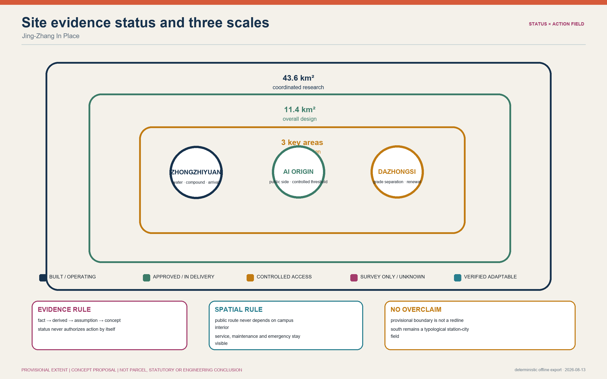
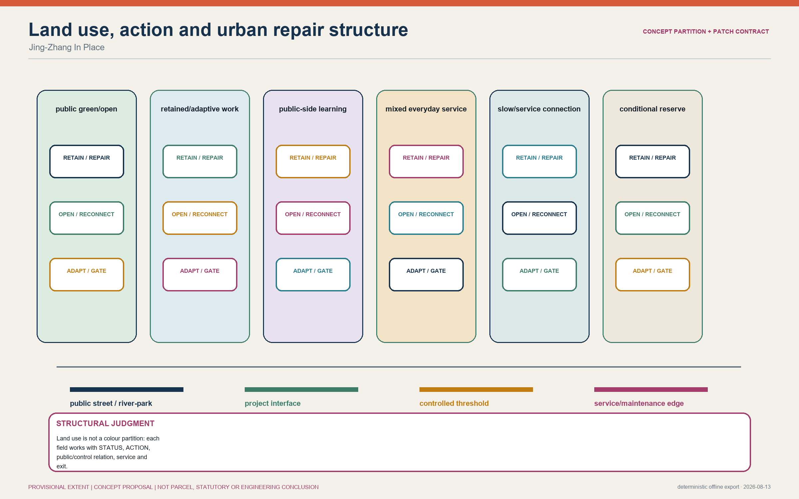
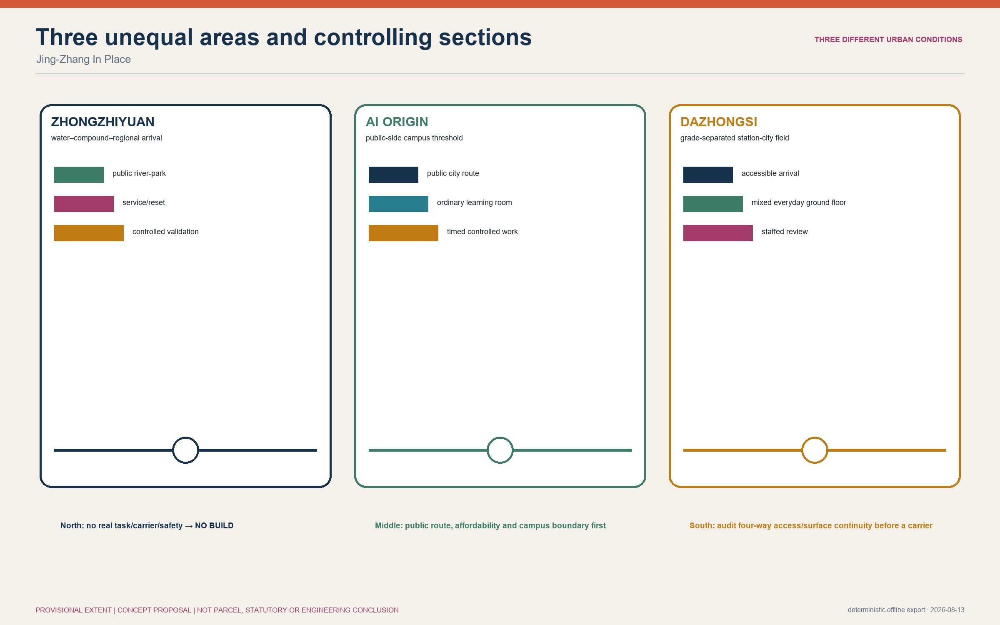
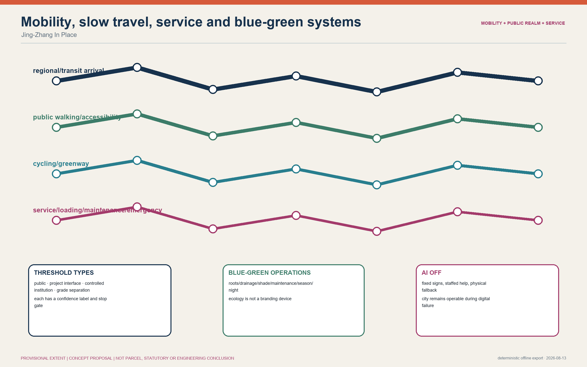
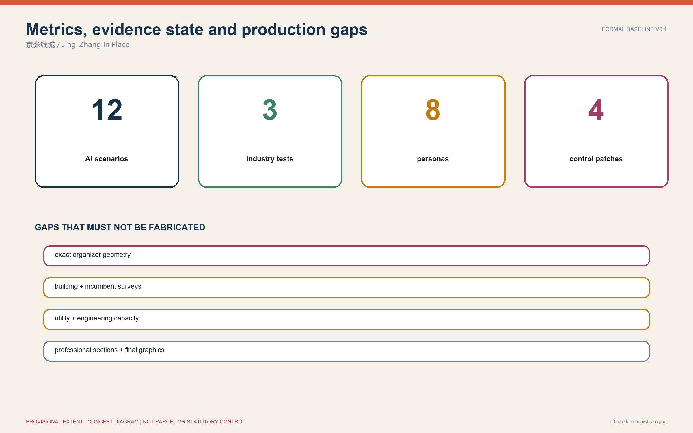

<!-- FORMAL-BASELINE-V0.1: semantic-parity production baseline; not ready for formal review. -->

# Jing-Zhang In Place / 京张续城

Jing-Zhang is not an empty line waiting to be filled with AI. An operating underground railway, parallel metro infrastructure, delivered and in-progress park works, controlled campuses, innovation premises, ordinary neighbourhoods and businesses, waterways and heritage form an existing city of unequal states, permissions and sections. The first design decision is: **keep these urban pieces working, then introduce AI only where a verified task has a real spatial consequence.**

The primary structure is a traceable `STATUS × ACTION PATCHWORK`, not a renamed axis and three cores:

```text
evidence status → current limit → conditional action → trigger and consent
→ spatial consequence → stop / exit
```

Demolition and replacement are not automatic actions. They require separate proof of structure, fire safety, heritage, rights, incumbent-user continuity, public interest and statutory process. The working name does not constitute the Owner's final winner decision.

## Design evidence and source basis

The official announcement and taskbook define scope [source:OFFICIAL-ANNOUNCEMENT] [source:AGENT-TASKBOOK]. Park, transit, water, renewal and institutional-access claims are used only within the limits of public primary sources [source:PARK-PHASE1] [source:PARK-PHASE2] [source:DAZHONGSI-RENEWAL] [source:CAMPUS-ACCESS]. Publisher, date, authority, reuse and limitations are recorded in `sources.json`; unresolved conditions are in `assumptions.json`.

The current `SITE_BOUNDARY` and three `KEY_AREA` polygons are rough provisional constraints from the organizer repository [source:BOUNDARY-SOURCE]. They are for concept generation, topology checks and visualization only, with `official_boundary=false`. They are not road redlines, parcels, ownership, statutory planning, approval or engineering precision. The provisional Dazhongsi rectangle also carries a contextual-location warning [assumption:A-GEOMETRY-002]. When exact organizer geometry is released, all nine GeoJSON layers, metrics and derived outputs must be rebuilt together.



Evidence is separated as `FACT`, `DERIVED`, `ASSUMPTION` and `CONCEPT`. An assumption never authorizes a physical intervention. Parcel rights, building condition, flows, statutory controls, municipal capacity and engineering feasibility remain unknown unless separately evidenced [assumption:A-CONTROLS-001] [assumption:A-BUILDING-001] [assumption:A-INFRA-001].

## Three-scale framework

| Scale | Controlling question | In Place response | Current evidence form |
| --- | --- | --- | --- |
| 43.6 km² strategic study | How do innovation, talent, firms, capital and city services relate? | Six asset/interface families, without enterprise-migration arrows | Official roles and public institutional facts; agreements unverified |
| 11.4 km² overall design | What is the drawable spatial structure? | Five statuses, five conditional actions, four connections and three public-space levels | Concept topology on a provisional extent |
| 368.4 ha key areas | How do three genuinely different urban designs emerge? | North water–compound–regional arrival; middle public-side campus threshold; south grade-separated station-city renewal | Provisional context windows, not parcel plans |



Every controlling patch must record `STATUS / SOURCE / CURRENT LIMIT / ACTION / TRIGGER / USERS / SECTION / RESPONSIBLE ROLE / STOP-GO / EXIT-REUSE`. Status does not grant action. An area-level reference to inefficient building types, for example, cannot label an individual building inefficient or removable.

## 43.6 km² innovation ecosystem and future city

The strategic area is not a one-way research-to-market pipeline. It contains six durable relationship types: controlled university/research edges; existing innovation premises; enterprise/professional/capital interfaces; regional and metro gateways; heritage/park/water projects; and ordinary community/talent life. Every type has a public side, controlled side, evidence ceiling and accountable-role requirement.

The ecosystem has multiple entry and exit points. Research can meet the city in public-side rooms outside controlled campuses. Teams can test reversible space in verified existing premises. Adoption, compliance, capital and professional services remain part of a mixed city instead of becoming a single southern destination. Campus-city integration does not mean removing access control: permanent city routes remain outside campuses [source:CAMPUS-ACCESS]. Compute and data are authorized, capacity-limited service dependencies, not an invented regional facility.

The three unequal arrivals are Qinghe's regional gateway, the Wudaokou/Qinghua-East controlled campus threshold, and Dazhongsi's metropolitan interchange threshold. Culture comes from successive working layers—historic station, operating underground railway, public park, contemporary transit and ordinary city—not from a rail-circuit or Urban OS metaphor. `Jing-Zhang In Place` is brand direction v0 and remains subject to public-language and collision testing.

## 11.4 km² urban design and renewal framework

Five statuses structure the plan: `BUILT_OPERATING`, `APPROVED_OR_IN_DELIVERY`, `CONTROLLED_ACCESS`, `SURVEY_ONLY_UNKNOWN`, and `VERIFIED_ADAPTABLE`. Five actions are conditional: retain, repair, open edge, subdivide/reconnect, and adapt/infill. `REPLACE` sits outside this palette and requires a separate statutory and public-interest gate.

Four connection families respond to real sectional differences: ordinary public street/park route; grade-separated/bridge/underpass threshold; controlled institutional threshold; and transit/water/heritage interface. Regional river/park space, area forecourts/courts and doorstep daily spaces form the public hierarchy. Deliveries, maintenance, waste and emergency access are a separate system to be surveyed, never hidden beneath a green diagram.

Four initial patches make the proposition operational:

| Patch | Status and limit | Action and trigger | Spatial/users consequence | Stop and reuse |
| --- | --- | --- | --- | --- |
| P-N1 north validation premise | `SURVEY_ONLY_UNKNOWN`; carrier, structure, power and rights unknown | reversible retrofit only after a verified physical test need and professional survey | controlled test, service/reset edge, public observation; workers and visitors protected | stop without eligible carrier or public-route separation; reuse as ordinary training/work |
| P-M1 Origin public-side room | `CONTROLLED_ACCESS`; no campus shortcut; carrier/lease unknown | consented street/park-side ordinary room with time-limited secure state | public room, controlled side and independent city route | stop on loss of public hours, affordability or neighbour safety; restore ordinary room |
| P-S1 Dazhongsi public ground floor | `SURVEY_ONLY_UNKNOWN`; building, exit and engineering unknown | audit one accessible carrier after four-quadrant route evidence | station-to-forecourt-to-ordinary-service-to-controlled-review sequence | stop if demolition or broken step-free route is required; reuse as ordinary service |
| P-C1 delivered-project interface | `BUILT_OPERATING` or `APPROVED_OR_IN_DELIVERY`; status verified item by item | coordinate first, add only a proved missing interface | park/water/city-route/maintenance section | stop on conflict with existing works; removable additions leave base system intact |

Current land-use and building layers are concept zones and prototypes, not current ownership or demolition maps. FAR, height, road redlines, parking, utilities, underground works and engineering sections remain pending official/professional confirmation.

## Three key areas



### Zhongzhiyuan: water–compound–regional-arrival mosaic

Qinghe's regional arrival, the Fifth Ring relationship, compounds and Qinghe/Xiaoyue water projects shape the north [source:QINGHE-HUB] [source:WATER-PROJECTS]. Ordinary river/park routes are separate from controlled tests, service/reset and emergency access. Public observation, worker refuge, toilets and weather shelter remain outside secure boundaries. Only a carrier that passes structure, fire, power, service and rights surveys can receive reversible validation fit-out. Existing works are coordinated before one removable 1:1 pilot.

### AI Origin: public-side campus threshold field

Wudaokou/Qinghua-East transit, the delivered heritage-park phase, controlled campuses and public innovation facilities make a fine-grain middle field [source:PARK-PHASE1] [source:CAMPUS-ACCESS] [source:AI-ORIGIN]. Permanent city routes stay outside gates. Small learning, project, community and talent-support spaces occupy verified street/park-side rooms and courts. An ordinary room becomes temporarily controlled only during an authorized data/project session. Existing and future transit conditions are designed separately.

### Dazhongsi: grade-separated station-city renewal field

The operating Lines 12×13 interchange, official four-quadrant task, underpass/bridge conditions, heritage context and mixed renewal fabric shape the south [source:OFFICIAL-ANNOUNCEMENT] [source:DAZHONGSI-RENEWAL]. Continuous step-free station-to-street routes, bicycle access and public ground floors come first. Adoption, professional and compliance rooms use verified premises only. Area-level renewal descriptions do not transfer to individual buildings, and the provisional key-area rectangle is never used as a parcel plan.

The non-repetition test is binding: north is organized by water/compound/region, middle by public/controlled campus–park thresholds, and south by grade-separated interchange/urban renewal. Repeating one court, lobby, AI room or cross-street module three times is a design failure.

## AI ecosystem, scenarios and personas

With AI off, public routes, mixed uses, renewal, blue-green systems, community/work rooms, toilets, rest and staffed services all work. AI matters in only a few explicit tasks: physical validation changes safety/service sections; controlled collaboration changes room state; adoption/compliance changes supervision, queue privacy and operating time. Planning, ordinary teaching, general business and public service return `NO NEW AI SPACE REQUIRED`.

Users include residents and businesses; children and carers; older and disabled people; students/researchers; start-ups and independent workers; enterprise/professional-service staff; maintenance/delivery workers; and visitors. Each is tested across weekday, evening, weekend, heat/rain, events, facility outage and digital outage.

The twelve structured scenarios are: S01 bounded equipment/model validation; S02 real-world robustness validation; S03 safety evaluation with human review; S04 time-limited controlled project room; S05 open learning/model explanation; S06 talent/community service coordination; S07 staffed adoption/compliance review; S08 accessible interchange assistance; S09 park maintenance and post-rain inspection; S10 accessibility-facility status notice; S11 event capacity and quiet-boundary management; and S12 source/version-aware renewal-option review. S01–S03 are the three industry test/validation scenarios. Each card includes location, users, state, TTL, minimum resources, spatial delta, human/offline mode, privacy, stop and exit. See `simulation.json`.

## Land use, buildings and renewal

Land-use categories express overall functional intent, not existing statutory use. Each candidate building requires a survey of use, structure, fire, heritage, accessibility, depth/daylight, services, rights/users, logistics/neighbours, relocation and reuse. Until verified it remains `SURVEY REQUIRED`, never inefficient, vacant, removable or adaptable.

The sequence is retain working systems; repair a demonstrated defect; open an edge only without compromising rights/security; subdivide/reconnect at a verified discontinuity; then adapt or infill. Reversible fit-out must return to ordinary learning, work, community or professional service after AI exit. Incumbent continuity, consultation/appeal, construction arrangements and benefit allocation are STOP/GO criteria; no rent or relocation number is invented.

## Mobility, rail, municipal and public services



Three gateways and four connection types organize mobility. The public network never depends on campus interiors or an app. Bicycle parking, waiting, loading, repair, waste and emergency routes require field/operations surveys before placement. Current lines are conceptual connections, not road redlines or capacity claims.

Municipal and new infrastructure follows `prove capacity, then build the minimum`. Power, heat, water, drainage, underground, communications and compute capacity are unknown [assumption:A-INFRA-001]. Existing eligible capacity is tested first. New equipment requires professional capacity, fire, energy, noise, maintenance and exit evidence. No unverified regional data centre, heat network or underground logistics system is proposed.

Ordinary public service includes toilets, water/rest, care referral, staffed accessibility help, affordable learning/work rooms, food and daily commerce. Fixed signs, phone/paper, staff and physical alternatives keep service available during digital outage.

## Blue-green, public realm and character

Park Phase 1 is publicly evidenced as open, while works complete and open status remain separate claims for later phases [source:PARK-PHASE1] [source:PARK-PHASE2]. Qinghe, Xiaoyuehe and the heritage park have different water, ecology, public-space and maintenance roles [source:WATER-PROJECTS]. The proposal does not draw a conflicting new blue-green axis.

The Living Systems Gate checks soil/root zones, drainage, canopy, shade/rain refuge, maintenance, noise/light and seasonal operation for every patch. Existing trees, drainage and waterside geometry are mapped only when public or professional evidence supports them. Character comes from the legibility of successive working layers and unequal sections, not uniform facades or AI screens.

## Projects, implementation and phasing

G0 aligns current projects and completes site/building/access/user surveys. G1 selects one consented, reversible 1:1 pilot in each area. G2 permits adaptive reuse after independent fire, structure, heritage, accessibility and operating review. G3 allows infill only against measured need. Replacement follows a separate statutory/public-interest process.

Initial packages are: a current-project interface register; three gateway accessibility audits; a north reversible validation pilot; a middle public-side ordinary/controlled room; and a south public-ground/adoption-room pilot. Each has accountable public, rights-holder, operator, professional, user-representative and AI/data roles. Roles are not commitments by named organizations. Every phase retains pause, removal and ordinary-reuse paths.

## Metrics, recomputation and compliance



Only the provisional geometry itself is precisely recomputable today; that is a consistency test, not statutory accuracy. Building footprint, green ratio, public-space ratio and FAR remain `unknown` or `baseline_only` until trustworthy existing/design layers exist. Early production metrics therefore focus on verifiable gates: patch contracts, source coverage, scenario/persona coverage, AI-off/manual alternatives, accessible routes, reversible exit and unresolved data gaps.

`compliance_matrix.json` maps announcement 1.3–1.5 and agent.1–agent.6. `standard_matrix.json` records mandatory standards. Incomplete professional-depth items in `design_depth_matrix.json` remain `in_progress` or `data_gap`; v0.1 is not misrepresented as complete.

## Risks, rights and compliance

The main risks are a generic renewal-colour map, three repeated modules, AI as an analysis/tenant label, provisional geometry read as statutory, displacement of incumbent users, or dependence on unknown rights/megaprojects/campus opening. Controls are patch contracts, unequal sections, Task-to-Space with NO-BUILD, explicit precision warnings, public-interest STOP gates and survey-first phasing.

Text, concept geometry and locally generated figures are produced with AI/Codex under the entrant's direction; public facts are listed in `sources.json`. The package uses no commercial map tiles, remote fonts, CDN, private data or uncleared media. The Owner selected the working direction, constraints and candidate decisions; AI/Codex supported research, generation, implementation and validation. No unverified professional credential, official endorsement or implementation commitment is claimed.

## References

The proposal uses stable source IDs. Full publisher, title, URL, dates, authority, coverage, limitations, reuse and design consequence are in `sources.json`. This is `FORMAL-BASELINE-V0.1`, not ready for review, and no official pull request exists.
