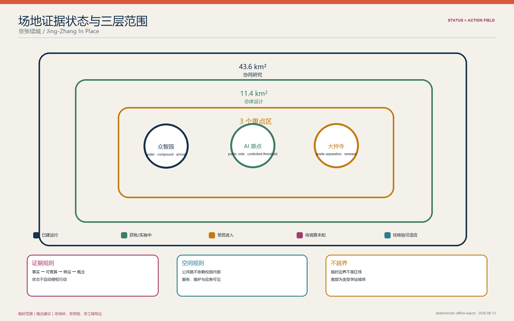
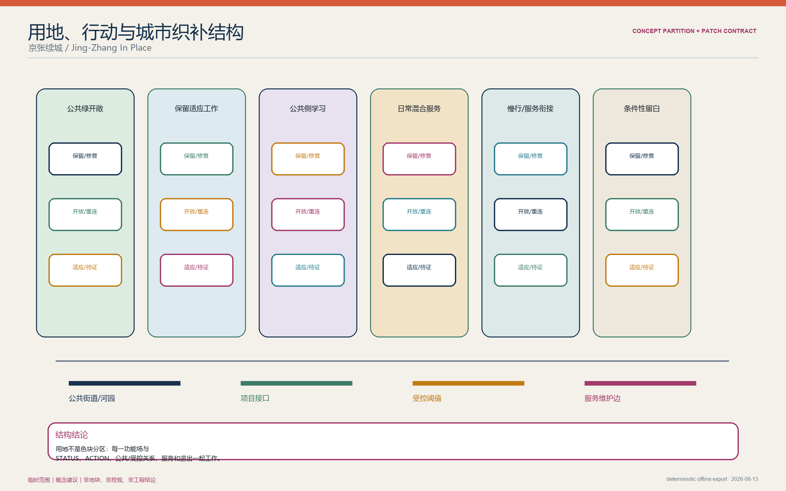
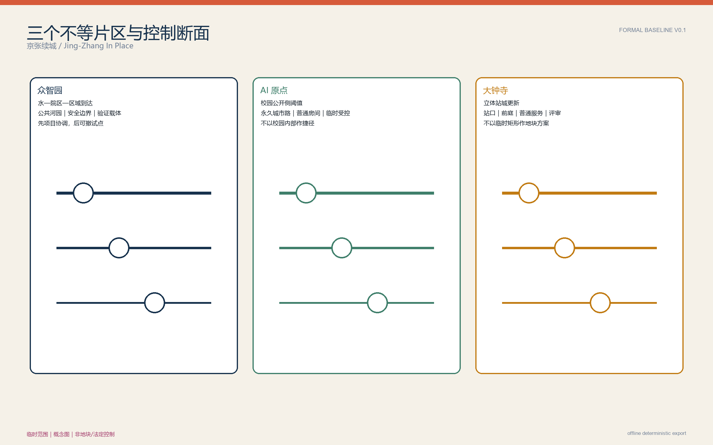
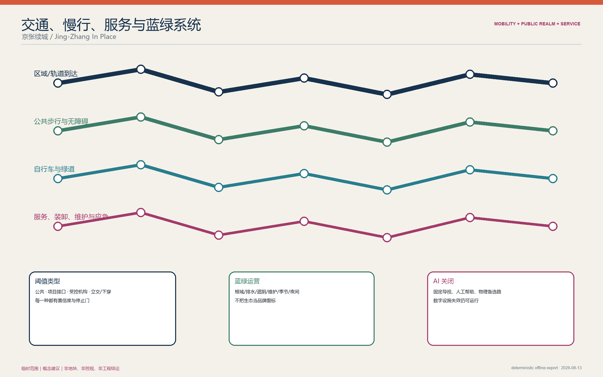
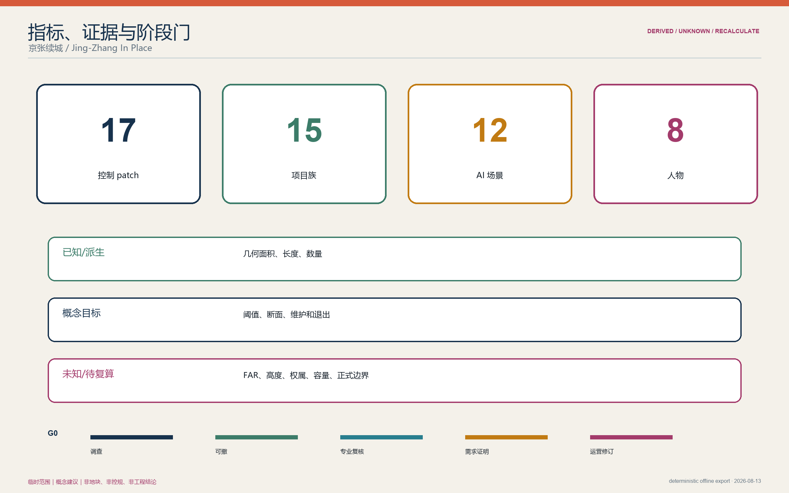

<!-- FORMAL-BASELINE-V0.1: structurally real production baseline; not ready for formal review. -->

# 京张续城 / Jing-Zhang In Place

京张不是一条等待 AI 填满的空白线。地下运行的铁路、并行轨道、已经开放或正在实施的公园工程、受控校园、创新载体、社区商业、河道与文保共同构成一座状态不等、权限不等、断面不等的既有城市。方案的第一判断是：**先让这些城市片段继续工作，再让 AI 在少数确有任务和空间后果的地方进入。**

总体结构是可核查的“状态—行动拼图”，不是一轴三核的再命名：

```text
现状证据状态 → 当前限制 → 条件更新行动 → 触发与同意 → 空间后果 → 停止/退出
```

拆除与替换不属于自动行动表。只有结构、消防、文保、权属、现有使用者、公共利益和法定程序分别证明后，才进入独立判断。本工作名不等于 Owner 最终 winner 决定。

## 设计依据与资料清单

任务边界以公告、官方设计任务书和面向智能体任务书为准 [source:OFFICIAL-ANNOUNCEMENT] [source:AGENT-TASKBOOK]。京张遗址公园的开放/工程状态只在一手来源支持的范围内使用 [source:PARK-PHASE1] [source:PARK-PHASE2]。大钟寺更新和校园开放状态另由各自来源约束 [source:DAZHONGSI-RENEWAL] [source:CAMPUS-ACCESS]。来源的发布者、日期、用途、限制和复用条件见 `sources.json`；不确定项见 `assumptions.json`。

当前 `SITE_BOUNDARY` 与三处 `KEY_AREA` 均来自组织方仓库的临时粗略约束 [source:BOUNDARY-SOURCE]。它们仅用于概念生成、拓扑检查和可视化，`official_boundary=false`，不得解释为道路红线、地块、产权、控规、审批或精确工程条件。尤其临时大钟寺矩形与公开语境锚点存在距离警示 [assumption:A-GEOMETRY-002]。官方精确图形一旦发布，九类 GeoJSON、指标和全部图件必须整套复算。



证据使用遵循四级边界：`FACT` 仅对应权威公开事实；`DERIVED` 可由注明输入复算；`ASSUMPTION` 不授权建设行动；`CONCEPT` 是设计建议。官方控规目前只可按已公开状态表述，具体地块权属、建筑条件、流量、市政容量和工程可行性均不推断 [assumption:A-CONTROLS-001] [assumption:A-BUILDING-001] [assumption:A-INFRA-001]。

## 三层范围工作框架

| 层级 | 控制问题 | 京张续城的回答 | 当前证据形态 |
| --- | --- | --- | --- |
| 43.6 km² 统筹研究 | 创新、人才、企业、资本、城市服务如何关联 | 六类资产与公开/受控接口，不画企业迁移箭头 | 官方角色与公开机构事实；关系待协议核验 |
| 11.4 km² 总体设计 | 如何形成可画且非任务书复述的结构 | 五种状态、五类条件行动、四类连接与三级公共空间叠合 | 临时范围上的概念拓扑 |
| 368.4 ha 三重点区 | 如何形成三个不同的小城市设计 | 北部水—院区—区域到达；中部校园公开侧；南部立体站城更新 | 临时 context window，非地块方案 |



每个控制 patch 必须记录：`STATUS / SOURCE / CURRENT LIMIT / ACTION / TRIGGER / USERS / SECTION / RESPONSIBLE ROLE / STOP-GO / EXIT-REUSE`。状态本身不授权行动；例如“更新单元内存在低效建筑类型”不能推出某栋建筑低效或可拆。

本三层框架逐级落实公告范围任务，并以临时总体边界和三个重点区对象维持机器可读关联 [source:OFFICIAL-ANNOUNCEMENT] [data:geometry/site_boundary.geojson#SITE-001] [metric:key_area_count]。

## 统筹研究范围产业与未来城市研究

43.6 km² 不是从科研到市场的单向流水线。方案识别六类可长期协作但不预设合作关系的城市资产：高校科研受控边界、现有创新载体、企业—专业—资本接口、区域与地铁门户、遗产—公园—水系工程、社区与人才日常生活。每类资产同时标注公开侧、受控侧、证据上限和责任角色。

产业生态以“多入口、可退出、保留普通用途”为原则：科研成果可以在校外公开侧房间交流；团队可以在经核验的既有载体中试用可逆空间；企业采用、合规、资本和专业服务进入普通混合街区，而不是被安排到唯一南部终点。高校—园区—街区融合不等于拆门禁，永久城市路径位于校园之外 [source:CAMPUS-ACCESS]。算力和数据被视为有授权、有容量上限的服务依赖，不虚构公共数据中心。

两翼提供城市问题、生活服务和产业协作语境，不建两条新轴。区域关系通过清河区域门户、五道口/清华东路西口受控校园阈值和大钟寺城市换乘阈值形成三种到达，而非重复“站点+创新客厅”。

文化叙事来自京张持续工作的百年层次：旧站、地下铁路、公共公园、当代轨道和日常城市同时存在。品牌 v0 使用“京张续城 / Jing-Zhang In Place”，避免铁路—电路、AI 轨道和城市 OS 图形；最终标识仍待公众可理解性与竞品相似度测试。

## 总体设计范围城市更新与控规深度城市设计

11.4 km² 的主图是 `STATUS × ACTION PATCHWORK`。五种状态为：`BUILT_OPERATING`（已建运行）、`APPROVED_OR_IN_DELIVERY`（获批或实施中）、`CONTROLLED_ACCESS`（受控进入）、`SURVEY_ONLY_UNKNOWN`（待调查未知）、`VERIFIED_ADAPTABLE`（经专业调查可适应）。五类行动为：保留、修复、开放边缘、细分/重连、适应性改造/填补。`REPLACE` 另走法定和公共利益程序。

四种连接分别是：普通公共街道/公园路径、立交/桥下/下穿阈值、受控机构阈值、轨道/水系/遗产接口。连接只在相应断面出现，不用一个横街模块复制全线。公共空间形成区域河园、片区前庭/院落、门前日常空间三级；装卸、维修、垃圾和应急是需调查的并行服务系统，不隐藏在绿地图里。

首批四个控制 patch 是设计合同而非现状地块断言：

| Patch | STATUS / SOURCE | CURRENT LIMIT | ACTION / TRIGGER | USERS / SECTION | RESPONSIBLE ROLE | STOP-GO / EXIT |
| --- | --- | --- | --- | --- | --- | --- |
| P-N1 北部验证载体 | `SURVEY_ONLY_UNKNOWN`; 仅有区域角色事实 | 载体、结构、电力、产权未知 | 专业调查后可逆改造；存在真实物理测试需求才 GO | 研发人员、维护者、访客；受控测试/服务复位/公共观察三段 | 产权人、运营者、消防/结构/安全专业方 | 无合格载体或侵占公共路即 STOP；设备退出后普通培训/工作复用 |
| P-M1 原点公开侧房间 | `CONTROLLED_ACCESS`; 校园开放需预约 | 不能依赖校园穿行，载体和租约未知 | 经同意的街道/公园侧普通房间；敏感项目时临时分区 | 居民、学生、团队；公共室/受控室/独立城市路 | 房屋权利人、社区/项目运营者、数据责任人 | 公共开放、可负担性或邻里影响恶化即 STOP；全室恢复普通用途 |
| P-S1 大钟寺公共首层 | `SURVEY_ONLY_UNKNOWN`; 更新类型为区域事实 | 具体建筑、站口和工程能力未知 | 审核一个可达公共首层；四象限路线审计通过才 GO | 通勤者、残障者、企业/居民；站口—前庭—普通服务—受控评审 | 更新协调方、交通/无障碍专业方、载体运营者 | 需拆迁或无连续无障碍路径即 STOP；评审设备撤出后普通服务复用 |
| P-C1 已实施工程接口 | `BUILT_OPERATING` 或 `APPROVED_OR_IN_DELIVERY` | 各段开放/性能须逐项核实 | 先协调再补缺；不重复建设 | 所有公众、维护者；公园/水系/城市路/施工维护边界 | 既有项目责任方与城市管理专业方 | 与既有工程冲突即 STOP；临时构件可撤、原系统继续运行 |

用地和建筑图层今晚只表达概念分区/原型，不能表达现状权属或可拆建筑。开发强度、高度、道路红线、停车、市政容量、地下空间和工程断面均标为待官方/专业确认。

总体结构的图层落点分别是概念功能分区、公共联系、公共侧界面和调查优先的阶段范围 [data:geometry/land_use.geojson#LU-001] [data:geometry/roads.geojson#ROAD-001] [depth:overall_spatial_structure]。

## 重点区域详细设计



### 众智园：水—院区—区域到达拼图

北部由清河区域门户、五环关系、院区和清河/小月河工程共同决定 [source:QINGHE-HUB] [source:WATER-PROJECTS]。空间组织是多个水/绿、院区和到达场，不是花园园区模板。普通河园路径与受控测试、设备服务、应急复位分开；公众观察、工作人员休息、厕所和遮阴避雨位于安全边界外。只有结构、消防、电力、服务和权属调查均通过的载体，才允许可逆验证改造。先对齐在建工程，再实施一个可撤的 1:1 载体试点。

### AI 原点：校园公开侧阈值场

中部由五道口/清华东路西口交通、遗址公园一期、受控校园与公开创新设施形成细颗粒场 [source:PARK-PHASE1] [source:CAMPUS-ACCESS] [source:AI-ORIGIN]。永久城市路径在校门外；小型学习、项目转化、社区/人才服务设置在经核验的街道/公园侧房间和院落。普通房间平时服务学习、工作与社区，只有受控数据项目发生时才进入有 TTL 的临时安全状态。现状站点与未来换乘分别设计，不假设最终站口。

### 大钟寺：立体站城更新场

南部由已运营的 12×13 号线换乘、官方四象限任务、立交/下穿/桥下、文保语境和混合更新肌理决定 [source:OFFICIAL-ANNOUNCEMENT] [source:DAZHONGSI-RENEWAL]。优先修复真实站口到普通街道的连续无障碍路径、自行车与首层公共界面；企业采用、专业服务和合规评审只进入经核验载体。区域性“老旧/低效”等描述不能贴到单栋建筑；临时矩形不能作为地块方案。

三处不重复检验：北部由水/院区/区域到达组织，中部由公开/受控校园—公园阈值组织，南部由立体换乘/混合更新组织。若后续图纸出现相同院落、门厅、AI 房间或横街模块 ×3，应判为设计退化。

## AI 创新生态、人才画像与 AI+ 场景

AI-off 时，公共路径、混合城市、更新、蓝绿、社区/工作房间、厕所休息和人工服务全部成立。AI matters 只通过少量明确任务改变空间或运行：物理验证改变安全/服务断面；受控协作改变房间状态；采用与合规评审改变监督、排队隐私和运营时段。规划、普通学习、一般商务和公共服务得出 `NO NEW AI SPACE REQUIRED`。

### 五类以上使用者

居民与商户、儿童/照护者、老年与残障使用者、学生/研究人员、初创与独立工作者、企业/专业服务人员、维护配送人员、访客均需通过工作日、夜间、周末、高温/降雨、活动、设施故障和数字系统故障。任何失败必须改变路线、房间、遮护、值守或分期，而非只写风险。

### 十二个场景卡

| ID | 场景 / 地点 | AI 的实质作用 | 普通城市与治理边界 |
| --- | --- | --- | --- |
| S01* | 北部有界模型/设备验证 | 会话授权、风险状态和设备复位改变受控测试/服务/观察断面 | 人工主管、急停、TTL；规划/模拟 `NO BUILD` |
| S02* | 北部真实环境鲁棒性验证 | 天气/照度/噪声边界决定测试时段与隔离 | 不占公共路径；无证据载体即不实施 |
| S03* | 北部安全评测与人工复核 | 记录版本、证据和停止权，改变复核房间运行 | 不声称官方认证；结果过期即阻断 |
| S04 | 原点临时受控项目房 | 敏感会话期间切换公共/受控分区 | 身份/数据授权到期即清除；一般协作 `NO BUILD` |
| S05 | 原点开源学习与模型解释 | 本地演示帮助公众理解模型限制 | 无个人轨迹；数字关闭后仍可授课 |
| S06 | 原点人才/社区服务协同 | 聚合需求辅助排班和房间共享 | 不做个体资格判定；人工柜台常开 |
| S07 | 大钟寺采用/合规评审室 | 版本化证据、测试结果与人工决策共同形成审查状态 | 不替代监管/法律意见；一般商务 `NO BUILD` |
| S08 | 大钟寺可达换乘帮助 | 在故障/拥挤时提供可解释路径建议 | 物理导视、人工帮助和无 app 路线优先 |
| S09 | 公园维护与雨后巡检 | 聚合工单辅助识别维护优先级 | 不监控个人；维护者可人工覆盖 |
| S10 | 无障碍设施状态公告 | 发布电梯/坡道/厕所可用性与时间戳 | 来源和 TTL 可见；离线告示和人员替代 |
| S11 | 活动容量与安静边界 | 帮助排期、噪光和退出管理 | 不做人脸识别；居民/管理者有停止权 |
| S12 | 证据状态变更审阅 | 比较有来源/版本的更新选项 | 只作规划辅助，不能自动拆建或开校园 |

`*` 为至少三项产业测试/验证场景。高深度 Task-to-Space 包分别记录任务、状态、TTL、最小资源、普通空间充足性、空间后果/NO-BUILD、人工/离线替代和退出复用。结构化卡片见 `simulation.json`。

该场景架构回应任务书对场景、产业测试和用户画像的数量/治理要求，同时用结构化计数而非宣传语言自检 [source:AGENT-TASKBOOK] [metric:ai_scenario_count] [metric:industry_validation_scenario_count]。

## 用地、建筑规模与拆改留方案

土地利用采用合法分类表达整体功能方向，但当前概念分区不是现状用地或法定调整。建筑调查矩阵包含用途、结构、消防、文保、无障碍、层深/采光、机电、产权/使用者、装卸/邻里、迁置与复用条件。未核实的建筑一律 `SURVEY REQUIRED`，不标低效、空置、可拆或可改。

更新顺序为：保留已工作系统；修复已证明缺陷；在不破坏安全/权利时开放边缘；按真实断点细分/重连；最后才是适应性改造或填补。可逆构件必须在 AI 退出后恢复普通学习、工作、社区或专业服务。填补仅修复已证明的空间/功能缺口。现有居民、商户和工作人员的连续使用、咨询申诉、施工安排和收益分配进入每个项目 STOP/GO 门；不虚构租金和搬迁数量。

土地分类和逐栋判断的边界分别受允许分类与调查缺口约束 [standard:MNR-LAND-USE-CLASSIFICATION-GUIDE] [data:geometry/buildings.geojson#BLDG-001] [assumption:A-BUILDING-001]。

## 交通、轨道、市政与公共服务设施



交通由三类门户与四类连接组成：清河区域换乘与最后一公里；五道口—清华东路西口公开侧校园交通；大钟寺四象限与立体交通。公共网络不依赖校园内部、不依赖 app。自行车停放、等候、装卸、维修、垃圾和应急必须经过现场和运营调查后落位；当前图只画概念连接，不画道路红线或容量。

市政与新型基础设施采用“先容量证明、再最小建设”。电力、供热、给排水、地下空间、通信和算力容量未知 [assumption:A-INFRA-001]；任何设备测试或数据协作首先使用现有合格资源。确需新增时，由专业单位提供容量、消防、能耗、噪声、维护和退出方案。本方案不提出区域数据中心、余热网络或地下物流等未证实巨构。

公共服务包含普通厕所、饮水/休息、照护转介、无障碍人工帮助、可负担学习/工作房间、食物与日常商业。数字系统故障时仍可通过固定导视、纸面/电话、值守人员和物理替代路线运行。

交通建议只在概念公共联系与官方/运营事实的证据上限内表达 [data:geometry/roads.geojson#ROAD-001] [source:QINGHE-HUB] [assumption:A-ACCESS-001]。

## 蓝绿空间、公共空间与城市风貌

京张遗址公园一期已开放，后续工程的“完工”和“开放”状态必须分开 [source:PARK-PHASE1] [source:PARK-PHASE2]。清河、小月河与公园承担不同水务、生态、公共空间和维护角色 [source:WATER-PROJECTS]；方案不得画一条冲突的新蓝绿轴。

Living Systems Gate 对每个 patch 检查土壤/根域、排水、树冠、遮阴避雨、维护、噪声/灯光和季节运营。树木、雨洪和水岸工程只有在公开资料或专业调查支持时落图；今晚的绿地/公共空间为概念响应，不是现状调查。风貌来自不同时代工作层次和不同断面的连续可读性，而非统一立面、铁路—电路符号或 AI 屏幕。

## 更新项目清单、实施政策与分期计划

实施分五门：G0 对齐当前项目并完成场地/建筑/通行/使用者调查；G1 在三片区各选择一个有同意、可撤回的 1:1 试点；G2 经独立消防、结构、文保、无障碍和运营复核后适应性改造；G3 仅以实测需求进行填补；替换另走法定与公共利益程序。

| 近期包 | 依赖 | GO 指标 | STOP / 回滚 |
| --- | --- | --- | --- |
| 项目接口登记册 | 已实施/在建工程公开资料与责任方核验 | 不重复、不冲突，状态有 as-of 日期 | 状态不明则仅记录，不设计叠加 |
| 三类门户通行审计 | 当前站口、道路、无障碍与运营现场资料 | 存在连续普通/无障碍路线 | 不假定新口或校园穿行，回到指示/维护修复 |
| 北部可逆验证试点 | 合格载体、真实任务、安全与服务条件 | 不伤公共路、有人负责、AI 退出可复用 | 任一条件失败即不建 |
| 中部公开侧房间 | 载体同意、公共开放和可负担性 | 普通用途时间不少于承诺且邻里无显著恶化 | 移除受控构件，恢复普通房间 |
| 南部公共首层/评审试点 | 真实站城路径、载体和运营审计 | 可达、人工服务、商业/居民连续 | 不以拆迁/站城巨构换取成立 |

责任角色包括公共管理/规划协调、产权与使用权主体、运营者、结构消防交通景观等专业方、社区/使用者代表、数据与 AI 责任人。责任角色不等于已承诺单位。每一阶段保留暂停、撤销和普通用途复用路径。

阶段图层只用于表达 G0/G1 的调查与可撤试点门，不是批准项目范围 [data:geometry/phasing.geojson#PHASE-001] [depth:phasing_implementation]。

## 指标体系、面积复算与合规矩阵



当前可精确复算的仅是临时边界和临时重点区几何本身；面积可用来检查数据一致性，不可升级为法定精度。建筑基底、绿地率、公共空间率和开发强度在缺少可信现状/设计细化时标为 `unknown` 或 `baseline_only`。生产指标优先采用可验证的非规模性门槛：控制 patch 数、来源覆盖、场景/人物覆盖、AI-off/人工替代、无障碍路线、可逆退出和未解决数据缺口。

`compliance_matrix.json` 映射公告 1.3—1.5 与 agent.1—agent.6；`standard_matrix.json` 明确 mandatory 标准；`design_depth_matrix.json` 的未完成项保持 `in_progress`/`data_gap`，不把 v0.1 误报为完整专业深度。

可复算的当前计数包括三个临时重点区、十二个场景和八类人物，但法定面积/强度仍受临时边界和调查缺口限制 [metric:key_area_count] [metric:ai_scenario_count] [assumption:A-GEOMETRY-001]。

## 风险、版权与合规说明

核心风险是：证据—行动图退化为普通“保留/修复/开放/改造”色块；三片区退化成同模块 ×3；AI 退化为分析工具或租户标签；临时图形被误读为法定边界；更新侵害居民/商户连续性；实施依赖未知产权、巨额基础设施或普遍开放校园。对应控制分别是 patch 合同、三种断面、Task-to-Space 与 NO-BUILD、全图精度警示、公共利益 STOP 门和 survey-first 分期。

所有文本、概念几何与本地生成图件由申报者指挥下的 AI/Codex 辅助生产；引用事实来自 `sources.json` 的公开来源。没有商业地图瓦片、远程字体、CDN、私有数据或未清权媒体进入包。Owner 负责候选方向、约束和决策；AI/Codex 承担研究、生成、工程实现和验证。未宣称未获证实的专业资质、官方背书或实施承诺。

风险状态与专业深度缺口在假设、来源和矩阵中交叉记录，任何工具 PASS 都不得覆盖这些人工判断 [assumption:A-CONTROLS-001] [source:SOURCE-REGISTRY] [depth:risk_missing_data]。

## 参考资料

正文只显示稳定 source id；完整标题、发布者、URL、日期、检索日期、权威性、空间范围、支持内容、不支持内容、复用条件和设计后果均在 `sources.json`。第一组是官方竞赛合同与仓库输入，用于界定三层范围、Agent 任务和临时几何；第二组是规划、更新法规与进度记录，用于约束“先调查、后行动”和非拆除优先；第三组是公园、水系、站点、校园与更新平台的一手资料，用于区分已建、实施、受控与未知状态。它们只支持相应空间尺度的判断，不支持地块权属、建筑条件、工程容量、机构承诺或政府审批。本基线的引用索引从 [source:OFFICIAL-ANNOUNCEMENT] 和 [source:BOUNDARY-SOURCE] 开始，所有未知项必须回接 `assumptions.json`；当任何来源状态或官方几何改变时，相关图层、指标、图件与文本必须一起更新。本基线仍为 `FORMAL-BASELINE-V0.1`，不是 ready-for-review，也未创建官方 PR。
