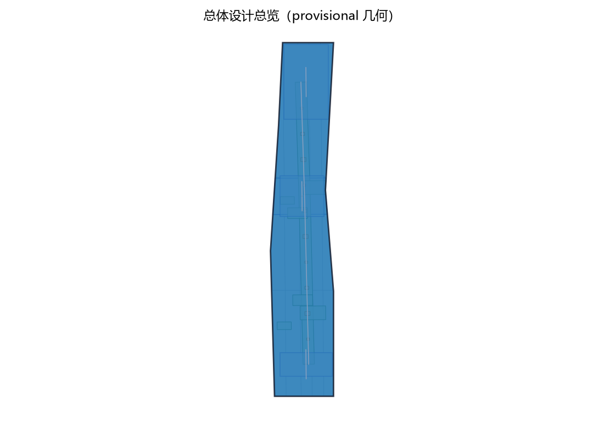
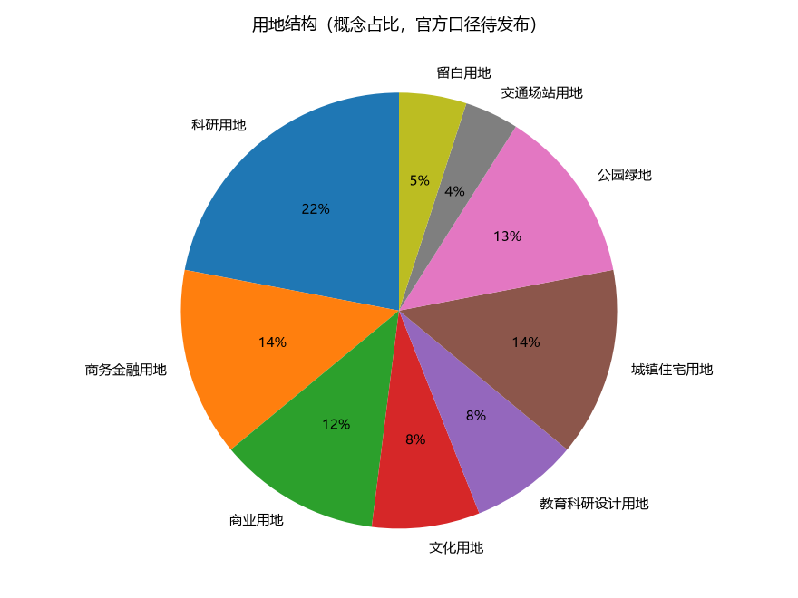
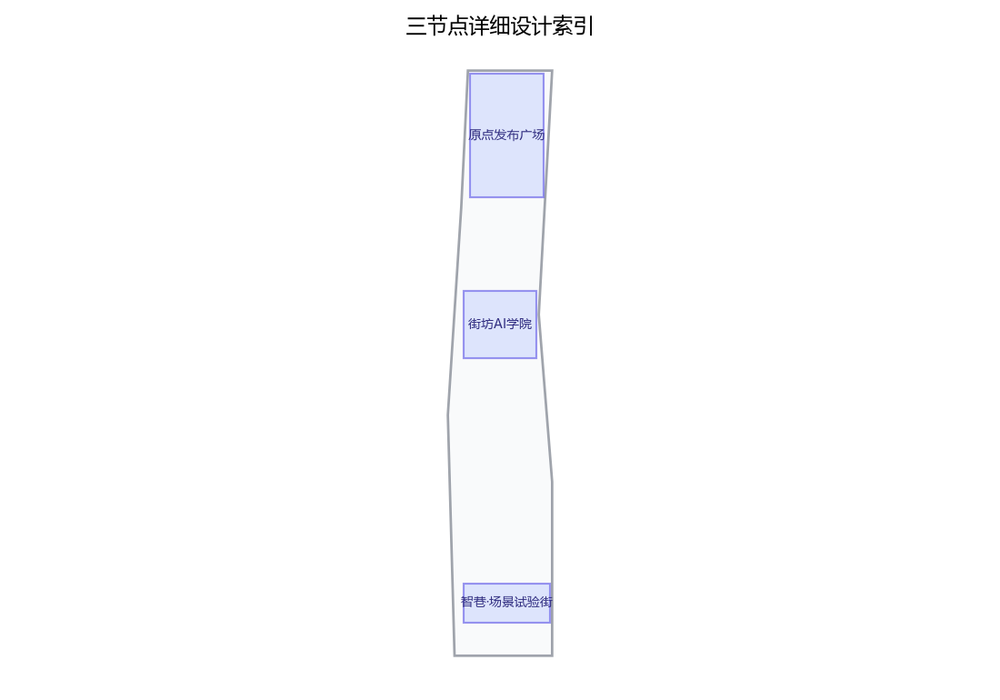
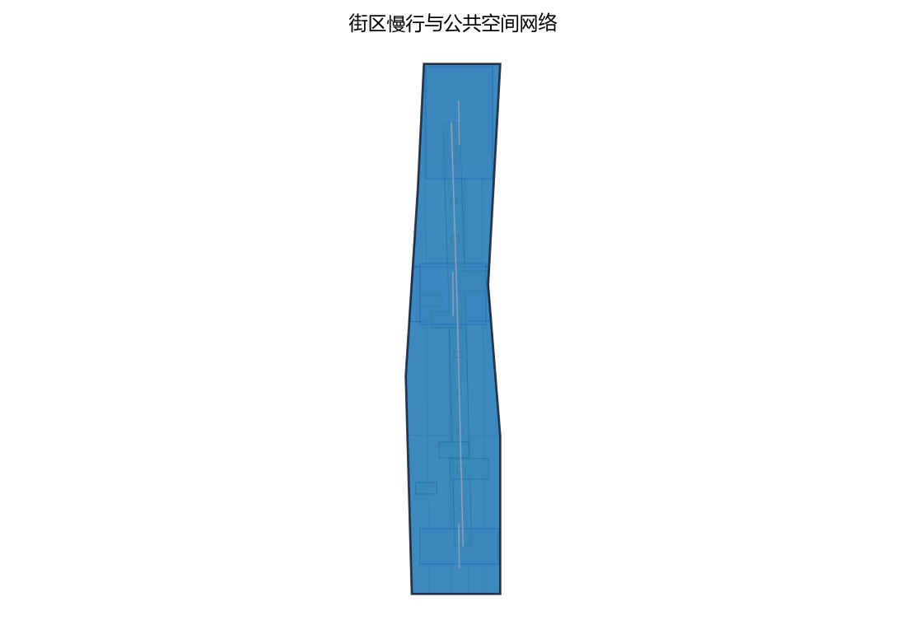
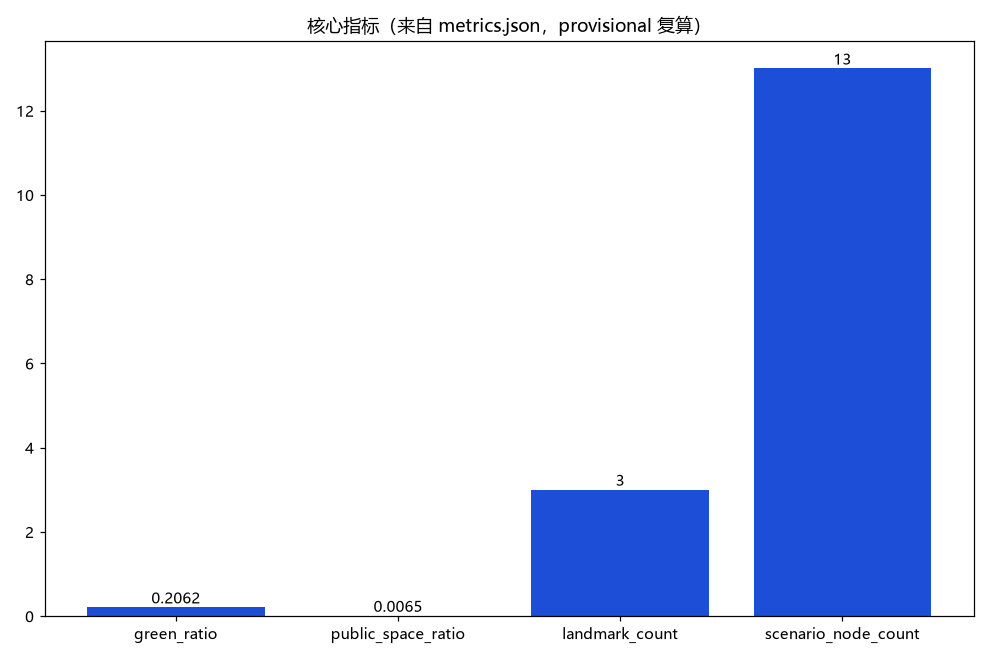

本方案紧扣百年京张AI创新带总体定位，聚焦海淀区AI原点社区板块，并按任务书口径形成三大定位与五大功能的概念映射：三大定位即百年京张文化带（文化叙事主线）、都市AI生活体验带（空间载体）、AI融合创新带（产业引擎）；五大功能即AI全栈自主创新体系（源头创新与中试转化）、世界级AI创新生态（人才、资本与平台集聚）、AI+场景赋能新范式（场景驱动的跨界融合）、智能化AI活力城市（智慧基础设施与宜居品质）、AI治理全球话语权（数据边界、人工复核与伦理先行）。全案表述均为概念建议（provisional），范围、指标与数据待官方资料发布后复算，不构成审批承诺。

## 设计依据与资料清单

本提案以国家《新一代人工智能发展规划》及"人工智能+"行动、《北京国际科技创新中心建设条例》和《北京市城市更新条例》、海淀区建设世界领先科技园区及AI产业集聚区相关政策文件为上位依据，任务书及其附件所明确的范围、边界、深度与成果要求为本提案的第一依据。资料清单按四类编制：规划类（在编及已批控规、街区更新行动计划、专项规划）；现状类（地形图、产权与权属调查、建筑普查、市政管线、交通调查）；产业类（AI企业名录、人才数据、楼宇租金与空置率、创新载体运营数据）；案例时政类（国内外AI创新街区与未来城市案例、最新政策文件）。本清单为暂定清单（provisional），编制过程中将随现场踏勘、部门访谈与数据补充滚动更新，最终以成果附件《资料汇编》为准。

> **证据锚点**：[source:DATA-SRC-OFFICIAL-ANNOUNCEMENT-20260509]、[source:DATA-SRC-AGENT-TASKBOOK-20260518]（组织方公告与任务书为文本口径依据）。

## 三层范围工作框架

本提案建立"统筹研究—总体设计—重点设计"三层递进工作框架，与任务书章节一一对应，确保研究结论自顶向下传导、自底向上校验。第一层为统筹研究范围，聚焦街区所在片区的AI产业格局与未来城市趋势，回答"在哪里发展、靠什么发展、发展成什么"；第二层为总体设计范围，以城市更新和控规深度的城市设计统筹用地、规模、形态、风貌与公共空间，回答"街区长什么样"；第三层为重点区域详细设计，围绕原点广场、街坊AI学院、智巷三节点及十大场景开展空间具体化设计。三层共享同一坐标系、数据底座与指标体系，任一层调整均回写更新，保证方案整体一致；三层统一置于百年京张AI创新带总体语境与海淀区AI原点社区板块范围内，任务书三大定位（百年京张文化带、都市AI生活体验带、AI融合创新带）与五大功能自上而下逐层分解、自下而上双向校验，确保文化叙事、生活体验与创新引擎在空间上同构落位。全部成果为概念级（concept-level），范围边界为暂定边界（provisional），不替代法定规划与审批程序。

> **证据锚点**：[source:DATA-SRC-AGENT-TASKBOOK-20260518]（三层范围划分依据任务书官方文本口径）。

## 统筹研究范围产业与未来城市研究

统筹研究范围覆盖街区及周边创新腹地，重点分析中关村科学城AI产业带与高校院所的新型研发机构之间创新流、人才流、资本流在街区的交汇关系，研判街区在区域产业格局中的生态位。研究以"世界级AI创新生态街区"为目标愿景，提出"核心创新—场景试验—服务配套"三层产业生态圈层，明确街区承载发布会、孵化、实训、试验、共创等平台职能，避免与周边园区同质竞争。未来城市研究关注AI驱动的城市治理、智慧出行、低空经济、城市孪生等趋势对空间与设施的前瞻性预留，提出弹性用地与共享设施策略。研究同步开展国内外代表性AI园区与创新街区的对标分析，提炼可复用的运营模式与空间原型。本层产出包括产业生态图谱、人才需求预测、未来场景清单与区域协同建议，作为总体设计的上位输入。

> **证据锚点**：[source:DATA-SRC-PROVISIONAL-BOUNDARIES-20260605]（边界为 provisional，研究范围仅作概念示意）。

## 总体设计范围城市更新与控规深度城市设计

总体设计范围以任务书划定用地为界，对现状建筑、道路、开放空间与市政设施进行全面盘点，评估保留价值、改造潜力与拆除必要性，形成"拆改留"三分类底图。设计以城市更新为主导路径，按控规深度开展城市设计：明确用地功能混合与兼容规则，提出开发强度、建筑高度与体量的分区引导，防止大拆大建与地产化倾向。街区整体形成"一轴两带三节点"空间结构，轴线串联主要人流方向，两带组织蓝绿与活力界面，三节点锚定街区公共生活。风貌上协调科技感立面、存量街区肌理与历史要素，制定街道断面、界面连续性与第五立面等控制通则。本层成果为概念级城市设计导则草案，边界与指标均为暂定，待与在编控规衔接后深化。

> **证据锚点**：[source:DATA-SRC-MOHURD-CONTROL-DETAILED-PLANNING]、[source:DATA-SRC-PROVISIONAL-BOUNDARIES-20260605]。

## 重点区域详细设计

重点区域围绕三大节点展开：原点广场定位为"AI发布与会客厅"，以公共广场、AI发布厅与城市会客厅复合体承载成果发布、国际交流、公共交往与媒体传播功能，塑造街区精神地标。街坊AI学院定位为"孵化实训开放实验"，整合创业孵化空间、AI实训教室、开放实验室与共享试验场地，形成产学研用一体的垂直创新单元。智巷定位为"场景化AI日常试验街"，以街巷空间为舞台，沿线布置可替换、可迭代的AI场景试验装置与数据采集设施，让AI创新进入市民日常。三节点之间以步行优先的活力街道串联，构成"发布—孵化—试验"的完整创新闭环，并预留向更大范围延伸的接口。各节点均给出总平面概念、功能配比、建筑体量意向与关键剖面示意，达到概念方案深度，可随时进入深化设计。

> **证据锚点**：[data:PACKAGE-GEOMETRY]（三节点示意多边形来自本包 geometry/key_areas.geojson）。

## AI 创新生态、人才画像与 AI+ 场景
街区以六类人才画像为人群基础：顶尖研究者与学术带头人、连续创业者与初创团队、工程师与算法人才、产业运营与服务人才、艺术家与跨界创意者、周边居民与访客，六类人群的需求差异决定空间供给的混合度与弹性。为承接多元人群，街区建设职住混合人才社区，按比例配置人才公寓、共享居住、家庭配套与社区服务，实现"工作—生活—创新"十五分钟圈层。围绕人才与市民日常，提案创设十大AI落地场景：创业路演、黑客松、人才驿站、原型试验场、街角AI展厅、智能通勤助手、社区AI议事、数字分身政务咨询、无障碍AI导览、原点白皮书共创，覆盖从创新孵化到社会治理的完整链条。十场景按"高频刚需优先、技术成熟度匹配、可运营可迭代"原则排序落地，逐一明确空间载体、技术配置、运营主体与体验指标。场景库保持开放，允许随技术迭代增补替换，防止场景沦为静态展陈。

围绕"源头创新—中试验证—场景应用—治理反馈"构建AI生态闭环，街区重点培育四类AI创新载体：AI初创孵化器承接高校院所与企业创新溢出，为早期团队提供弹性工位、法务财税代办与「结对」导师辅导；开源社区聚合开发者共建共享基础模型与工具链，以「开源联盟」维护贡献权益并组织代码评审；AI数据沙箱在匿名聚合口径下为测试提供受控环境，仅向经「备案」的合规主体按「分级许可」开放，并定期审计数据用途；AI体验展示网络依托街角展厅与原点广场，推行「预约」参观与「志愿」讲解轮班，让市民直观感知AI前沿成果。智巷沿线的场景装置按「智巷场景轮换预约制」定期轮换，保持体验新鲜感与装置可迭代性。为守住创新与信任的边界，街区确立三条AI治理基线：其一，仅处理匿名聚合数据，结构化明细一律先脱敏再入库，不做个体级留存；其二，关键决策一律人工复核，AI输出仅作为决策建议，涉及公共资源分配或个体权益的决定均由人工作出；其三，禁止过度监控，不进行个体识别式追踪、不建立大规模行为画像，公共空间感知设施仅服务于场景功能本身。上述载体、机制与治理基线统一写入「原点共创公约」，经「居民议事」与意见征集确认后按年度公示，由「双复核议事席」监督执行。围绕十大场景，提案以首批五张场景卡作为落地样板：

| 场景卡 | 落位空间 | 运营机制 | 人工复核点 |
| --- | --- | --- | --- |
| AI初创孵化卡 | 街坊AI学院孵化层 | 「街坊AI积分」入驻评估、路演「轮换」席位 | 入孵筛选与补贴对接复核 |
| 开源社区卡 | 共享实验室与代码工坊 | 「开源联盟」结对协作、贡献「备案」 | 开源代码与数据合规审查 |
| 体验展示卡 | 街角AI展厅与原点广场 | 「预约」参观、「志愿」讲解轮班 | 展示内容与安全声明审查 |
| 数据沙箱测试卡 | 原型试验场沙箱区 | 「分级许可」、匿名聚合数据供给 | 脱敏效果与用途审计复核 |
| 公共治理卡 | 社区AI议事厅 | 「双复核议事席」、意见征集与公开答复 | 议事结论与年度公示内容 |

场景卡与场景库动态联动：任一场景卡进入实施前须完成AI场景备案与人工复核点确认，实施后评估结果纳入年度公示，相关可测指标进入本提案指标体系章节统一管理，确保"先试点、后推广"。

> **证据锚点**：[source:DATA-SRC-GENERATIVE-AI-INTERIM-MEASURES]（AI 生成内容治理表述的参照依据）。

## 用地、建筑规模与拆改留方案
基于现状普查，街区现状用地以科研办公、居住、商业及少量工业遗存为主，现状建筑面积按初步估算约XX万平方米（待实测复核），可利用存量约占六成。拆改留方案坚持"留改为主、拆为辅"：保留主体结构完好、具历史或情感价值建筑并植入新功能；改造平面形态、设备与立面以适配AI办公与试验需求；仅对危旧、低效且确无改造价值的建筑实施拆除，腾挪为公共空间或新建载体。规划总建筑面积与功能配比以"创新空间约六成、居住配套约三成、公共服务约一成"为概念基准，职住混合人才社区按首期约XX套人才公寓控制规模。容积率与建筑高度分区引导兼顾强度与宜居，重要视廊与保护要求范围内限高。本方案全部面积为概念级估算，待实测与产权核实后复算，形成后续章节指标体系的输入。

> **证据锚点**：[source:DATA-SRC-MNR-LAND-USE-CLASSIFICATION-202311]（用地分类名称参照现行国标口径）。

## 交通、轨道、市政与公共服务设施
街区依托既有轨道站点构建"轨道+公交+共享出行+慢行"多方式接驳体系，优化站点出入口与街区步行联系，并配置智能通勤助手场景所需的动态出行信息服务设施。内部路网坚持小街区密路网，压缩机动车过境交通，推行稳静化街道与限速管理，为智巷场景试验提供安全环境。停车引导共享化与地下集约化，减少对公共空间的挤占；市政结合更新同步改造雨污、电力、通信与供热管网，预留AI算力与能源调度设施接口，落实海绵城市与韧性要求。公共服务设施按"补齐短板、复合共享"原则配置教育、医疗、文体、养老托育与社区服务中心，与人才社区需求匹配。本层交通与市政方案为概念级布局，待专项阶段结合实测管线与交通模型深化。

> **证据锚点**：[source:DATA-SRC-MOHURD-URBAN-DESIGN-MEASURES]（市政与慢行设计表述的方法参照）。

## 蓝绿空间、公共空间与城市风貌
充分挖掘现状绿地、附属绿地与闲置边角地，构建"公园—广场—街巷—庭院"四级公共空间体系，以口袋公园、立体绿化与林荫街道织补蓝绿网络，实现三百米见绿、五百米见园。公共空间设计强调全天候使用与全龄友好，配置可移动家具、智慧照明与AI互动装置，激发街巷日常活力。风貌上提出"科技质感、人文温度、海淀气质"三大取向：科技感体现于材料、界面与夜景照明，人文温度体现于存量肌理延续与街角细节，海淀气质体现于科创精神的文化叙事与标识系统。编制分区风貌导则，对建筑色彩、广告店招、街道家具与无障碍设施作通则管控，重点保障无障碍AI导览场景的可达性基础。蓝绿与风貌方案一并纳入更新项目清单实施，优先安排近期见效项目。

> **证据锚点**：[source:DATA-SRC-MOHURD-URBAN-DESIGN-MEASURES]（蓝绿空间组织的方法参照）。

## 更新项目清单、实施政策与分期计划
本提案形成15项更新项目清单：1）原点广场重塑（AI发布与会客厅）；2）街坊AI学院改建（孵化实训开放实验）；3）智巷场景化试验街建设；4）创业路演中心；5）黑客松常设基地；6）人才驿站及人才公寓（职住混合社区一期）；7）原型试验场；8）街角AI展厅网络；9）智能通勤助手基础设施；10）社区AI议事厅；11）数字分身政务咨询服务站；12）无障碍AI导览系统；13）原点白皮书共创平台；14）蓝绿空间与公共空间提升工程；15）轨道接驳与市政设施更新工程。实施按「近期（1-3年）—中期（3-5年）—远期（5-10年）」三期概念节奏滚动推进：近期（对应启动期）聚焦原点广场、人才驿站、街角AI展厅、社区AI议事厅等低风险快见效项目，以原点广场及智巷首段为试点区域先行示范，建立「原点共创公约」与「街坊AI积分」运营机制并树立街区品牌；中期（对应成长期）推进街坊AI学院、智巷全线、黑客松常设基地与原型试验场，形成创新生态闭环；远期（对应成熟期）完成职住社区建设、无障碍AI导览全覆盖及白皮书共创治理常态化，呈现世界级街区完整形态。各期项目坚持多元主体共同参与：政府与国企平台负责规划统筹、政策工具与公共服务供给，企业承担市场化投入与场景运营，高校院所提供研发与人才支持，社区居民通过居民议事、意见征集与志愿参与行使共治权利。各期设置可测指标名称滚动评估，如AI企业入驻数、发布活动频次、孵化毕业率、场景试验数量、「街坊AI积分」参与人数、意见答复率、公共空间满意度、碳排强度与年度公示达成率，目标值均待实测与官方数据发布后复算。街区每年举办「原点开放日」年度活动，集中展示AI场景进展并面向公众征集意见，作为公众参与的年度节点。政策方面联动城市更新实施细则、弹性用途转换、容积率奖励与共建共治基金等工具，明确政府、国企平台、社会资本与运营机构的权责界面。项目清单与分期均为初步方案（provisional），随立项条件、资金安排与产权谈判动态调整。

> **证据锚点**：[source:DATA-SRC-AGENT-TASKBOOK-20260518]（分期与实施条目对应任务书要求）。

## 指标体系、面积复算与合规矩阵
建立涵盖创新生态、空间品质、运营效能三大类约30项指标体系：创新类包括AI企业入驻数、发布活动频次、孵化毕业率、场景试验数量等；空间类包括公共空间占比、职住比、十五分钟设施覆盖率等；运营类包括入驻率、租金水平、碳排强度等，全部给出目标值与统一测算口径。面积复算以实测数据为基准，对现状与规划两套口径逐地块复核用地和建筑面积，形成复算表并标注数据置信度。合规矩阵逐项对照上位规划、控规、城市更新条例及无障碍、消防、绿建等规范要求，标注"符合／需衔接／需专题论证"三级结论。凡涉及法定审批事项均注明"以主管部门意见为准"，概念级指标不构成审批承诺。本部分随方案深化滚动更新，是成果质量的量化底座。

> **证据锚点**：[metric:green_ratio]、[metric:public_space_ratio]、[source:PACKAGE-GEOMETRY]。

## 风险、版权与合规说明
本提案识别的风险包括：政策与规划调整风险（控规在编、更新政策变动）、市场与运营风险（AI产业周期波动、去化与租金不及预期）、技术迭代风险（场景设备快速过时、算法合规）、实施条件风险（产权分散、腾退谈判、资金筹措）以及安全伦理风险（数据隐私、算法偏见、公共空间AI设备安全）。应对策略包括：预留弹性用途与分期弹性，坚持"小步快跑、示范先行"，建立场景准入与伦理审查机制，以多元主体共担资金。合规方面明确：本提案为概念级研究成果，所有范围、指标、分期与成本均为provisional性质，不构成对任何政府部门的承诺、审批准入或投资依据，后续实施均须以法定规划、专项评估与政府决策为准。版权方面，引用政策文件与公开数据均注明出处，图表为编制方原创或已获授权素材，成果版权依委托合同约定归属。文中不确定数据以XX标注，承诺在下一阶段实测补齐。

> **证据锚点**：[source:DATA-SRC-OFFICIAL-ANNOUNCEMENT-20260509]（征集规则为权属与合规表述的依据）。

## 参考资料

国家层面：《新一代人工智能发展规划》、国务院"人工智能+"行动相关意见及各年度人工智能白皮书。北京市层面：《北京城市总体规划（2016年—2035年）》及海淀分区规划、《北京市城市更新条例》及城市更新专项规划、《北京国际科技创新中心建设条例》及相关配套政策。海淀区层面：建设世界领先科技园区实施方案、AI产业集聚区相关政策、中关村科学城相关规划与研究。行业与研究层面：国内外AI园区与创新街区案例研究、城市创新生态与人才就业年度报告、AI产业规模与人才需求统计报告。空间数据类：地形图、权籍调查、现状建筑普查与市政管线资料（待现场踏勘后补充确认）。互联网与媒体类：政府门户、公开新闻报道与行业网站，引用链接与检索日期见成果附件。上述资料清单随编制进程持续补充更新，最终以附件形式完整列示。

> **证据锚点**：[source:DATA-SRC-OFFICIAL-ANNOUNCEMENT-20260509]（本清单首条即组织方公开资料包）。
