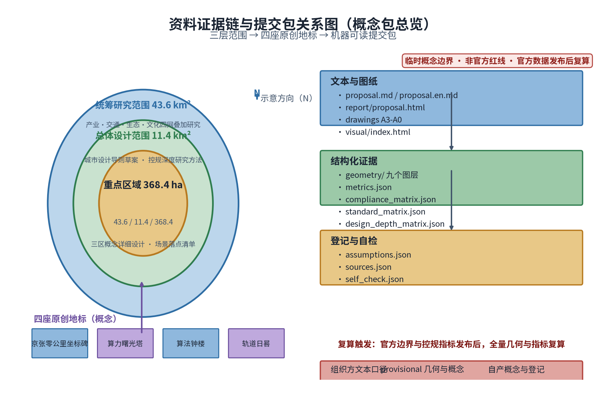
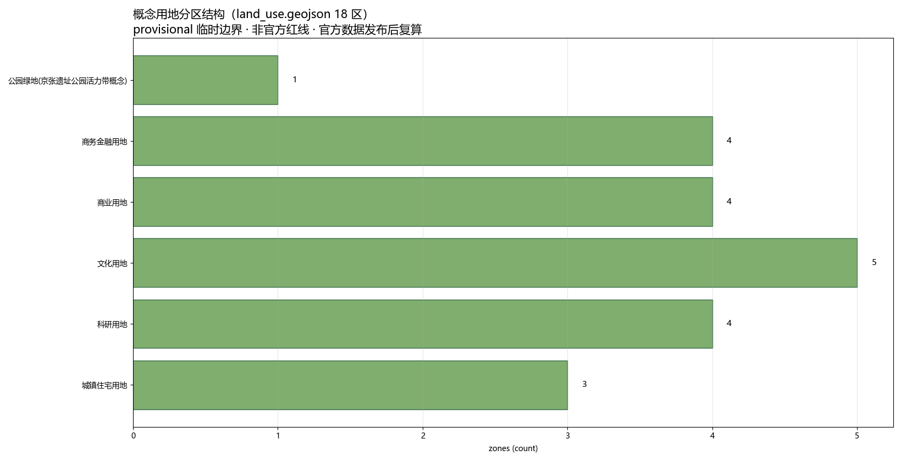
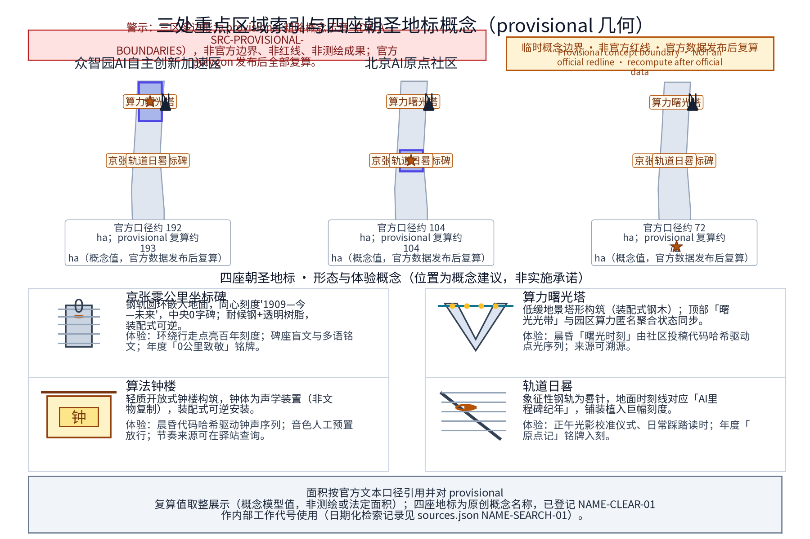
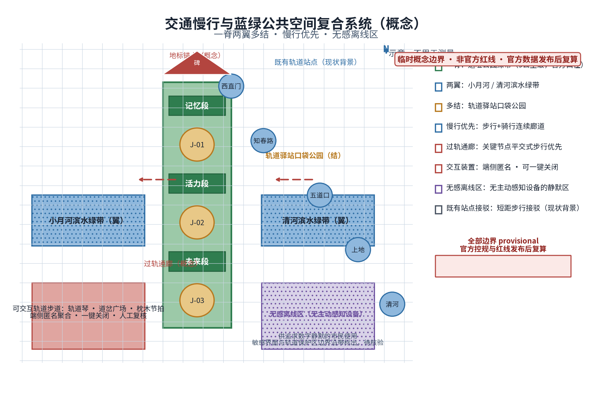
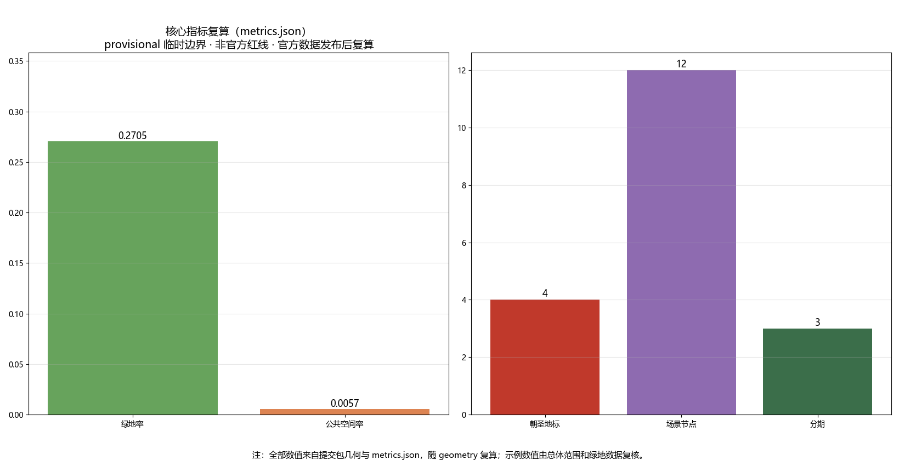

# 京张AI朝圣之旅：四座原创地标与一条可交互轨道（概念）

**主名称（概念建议）：**「智脉京张——百年京张AI创新带」；**英文主名：**「Jingzhang Pulse · AI Innovation Belt」，简称 JZ-PULSE。「智脉」取"城市智算之脉"与"铁路动脉"双重意象；「Pulse」呼应脉冲、脉搏与开源社区的持续心跳——一座因代码而搏动的城市走廊。副标语（概念）：**"From Steel Rails to Compute Trails——从钢轨到比特"**，辅以"0公里，无限算力（Kilometer Zero, Infinite Compute）"。

**命名体系（概念）：**一主名、三区、两翼、一网多驿。三区在官方名称基础上设工作雅称：众智园雅称「众智台」、北京AI原点社区雅称「原点场」、大钟寺AI产业集聚区雅称「钟声里」；两翼雅称「智服翼」与「场景翼」；沿带站点统一为"轨道驿站"体系，站名如「0公里驿」「算法驿」「回声驿」「晨钟驿」「方舟驿」，编号 J-01 至 J-n（概念编号，以深化设计为准）。活动品牌（概念）：「0公里AI节」「轨道开源大会」「众智原力日」「时间胶囊封存仪式」。国际驻留品牌（概念）：「轨道驻留计划（Rail Residency）」。

**Logo方向（文字概念描述）：**以铁轨断面与数学符号"0"融合——两条平行钢轨之间嵌入一枚圆点，整体同时呈现轨道剖面、数字"0"与无穷号的上半弧；配色建议钢青色为主体、信号红与信号黄为点缀（源自铁路安全色）；须支持单色反白、小尺寸识别与盲文触点版本；中英文字标间置"0·1909·∞"节奏元素。图形方案由专业设计团队深化。

**方案总体构想（概念）：**让这条带同时获得三种身份——世界级AI朝圣地标之路、可日常使用的城市公园、面向全球的开源协作现场。所有空间表达均以"概念建议、参考方案"呈现，供专业团队深化研究，不构成法定规划结论。

## 设计依据与资料清单

本方案为概念性文本，工作依据分类如下（由专业团队核验更新，具体清单以组织方资料包为准）：

1. **组织方资料**：本次国际方案征集公告、任务书及后续发布资料。组织方尚未发布官方边界多边形，现有几何为临时粗略底图；本方案所有分区描述仅基于官方文本口径与公开叙事背景，不得替代官方边界。
2. **上位规划与法规**：《北京城市总体规划（2016年—2035年）》及海淀分区规划、中关村科学城相关规划与政策文件、蓝线绿线管控规定、轨道交通保护区管理法规、无障碍与适老化相关标准（均以现行有效版本为准）。
3. **历史文献**：京张铁路修建史料、詹天佑工程技术文献、西直门至清河段站史沿革（清华园等站史以权威史料和文物部门公布名单为准）。
4. **公开项目资料**：京张铁路遗址公园相关公示信息与公开报道、大钟寺古钟博物馆公开信息。
5. **案例资料**：全球AI创新生态案例的公开资料（详见案例表，个别数据标注"未核实"）。

**机器可读提交包说明：** 本方案随附 `geometry/`（site boundary、key areas、land use、buildings、roads、green space、public space、constraints、phasing 共 9 个 GeoJSON 图层）、`metrics.json`（可复算指标）、`compliance_matrix.json` / `standard_matrix.json` / `design_depth_matrix.json`（任务与深度覆盖）、`assumptions.json`、`sources.json`、`risk.json`、`drawings/`（A3 文册与 A0 展板）与 `visual/index.html`。全部几何均为 provisional 概念图层：`official_boundary=false`，面积与比例仅用于方案生成、自检与可视化，不得作为官方红线、审批依据或法定控制结论；组织方发布官方边界与重点区域 polygon 后必须全量复算。

> **证据锚点**：[source:DATA-SRC-OFFICIAL-ANNOUNCEMENT-20260509]、[source:DATA-SRC-AGENT-TASKBOOK-20260518]（组织方公告与任务书为全部文本口径依据）。

## 三层范围工作框架

三层范围为官方文本口径：**统筹研究范围43.6平方公里**（北至北五环路、东至京藏高速、南至西直门外大街、西至万泉河路）；**总体设计范围11.4平方公里**（京张遗址公园周边1—2公里城市地区和产业区）；**重点区域合计368.4公顷**（众智园AI自主创新加速区约192公顷、北京AI原点社区约104公顷、大钟寺AI产业集聚区约72公顷）。精确边界以组织方发布为准。

三层工作框架建议（概念）：

- **第一层（统筹研究）**：建立"产业—交通—生态—文化"四网叠加研究，输出带域结构、廊道体系与节点分级；
- **第二层（总体设计）**：编制城市设计导则草案与公共空间体系研究，按"控规深度"研究方法推进，地块尺度内容由具备资质的专业团队依法定程序深化；
- **第三层（重点区域）**：三区各设空间营造概念与示范单元建议、场景落点清单；
- **贯穿机制**：以"节点一处一案"清单与"官方口径面积校核表"衔接三层，防止范围误读与口径混淆。

> **证据锚点**：[source:DATA-SRC-AGENT-TASKBOOK-20260518]（三层范围划分依据任务书官方文本口径）。

## 统筹研究范围产业与未来城市研究

（43.6平方公里）建议概念结构：**"一带两翼多核"**。

- **一带**：京张遗址公园AI公共空间主带，承担文化、生态与活力功能；
- **两翼**：中关村科技服务翼（要素全球化配置、中关村IP与资本赋能）、小月河场景赋能翼（AI场景赋能与智能化AI活力城市）；
- **多核**：清河、上地/中关村软件园、知春路、中关村大街、学院路等真实城市节点，作为空间叙事的背景锚点与功能流量来源（属叙事背景，非新增法定分区）。

> **证据锚点**：[source:DATA-SRC-PROVISIONAL-BOUNDARIES-20260605]（边界为 provisional，研究范围仅作概念示意）。

未来城市研究课题方向（概念）：①"职—创—居—游"混合功能走廊趋势研究；②面向AI从业者与全球人才的公共服务形态（双语服务、弹性办公、国际社区等仅作概念方向）；③算力能耗与城市散热、供配电协同研究纳入市政专题的必要性提示（不给工程结论）；④城市运行AI仿真与治理场景的街区级落地研究。本节均为研究课题表述，供专业团队深化。

## 总体设计范围城市更新与控规深度城市设计

（11.4平方公里）本层定位为**研究方法与原则框架**，不给容积率、建筑高度、道路红线、拆改留等法定结论。

四条原则建议（概念）：①**轨道优先**——以遗址公园为缝合主轴组织两侧功能；②**存量优先**——对现状建筑与用地"评估先行、以留为主"，拆改留结论一律依法定程序形成；③**场景优先**——每个更新单元绑定1—2个AI场景落点，让更新有可体验的内容；④**韧性优先**——绿地与开放空间同时承担雨水滞蓄、热岛缓解等韧性功能。

> **证据锚点**：[source:DATA-SRC-MOHURD-CONTROL-DETAILED-PLANNING]（控规深度表述以国家控制性详细规划办法为参照）。

"控规深度"工作方法建议：建立"现状评估—场景植入—形态推演—合规校核"四步研究链；按组织方最终边界细分为研究单元，逐单元编制"单元场景卡"与"单元合规自查表"，作为后续法定规划与城市设计的输入文件。

## 重点区域详细设计

> **证据锚点**：[source:DATA-SRC-PROVISIONAL-BOUNDARIES-20260605]、[data:PACKAGE-GEOMETRY]（三区示意多边形来自本包 geometry/key_areas.geojson）。

本层针对众智园AI自主创新加速区、北京AI原点社区、大钟寺AI产业集聚区三处重点区域（面积与定位均按组织方官方文本口径，非实测边界）给出概念级详细设计。三区共享一条「轨道叙事」主线：以京张铁路文化元素为结构线索，把“0公里坐标、算法钟声、众智方舟、轨道日晷”四座原创地标与步行路径、开放空间、建筑界面组织为可连续体验的空间序列。设计意图上强调三件事：一是把AI产业叙事转化为公众可感知的日常空间（发版台、评测厅、贡献者步道等均为低门槛公共设施）；二是所有地标与装置均预留离线人工替代路径与无障碍同步设计，不制造数字鸿沟；三是对建筑体量、高度与用地性质只作形态示意，不预设控规结论。几何与指标层面，本包 geometry/key_areas.geojson 以 provisional 边界给出三区示意多边形，metrics.json 中的 key_area_count、landmark_count、scenario_node_count 即取自该几何；官方多边形发布后需全部复算。数据缺口已如实记录：现状建筑实测、地权属、控规指标均未公开，属概念阶段。

### 众智园AI自主创新加速区

（约192公顷，官方文本口径）承载AI全栈自主创新体系与AI治理全球话语权（概念定位）。

空间概念「三层台地」叙事：以遗址公园绿带为低层公共层，向两侧渐进组织研发中试、公共服务等功能（系形态意向，非高度结论）。建议组织「全栈走廊」动线概念——将基础软硬件、工具链、评测验证节点串联为一条可步行参观的叙事动线，让"全栈"成为可感知的空间经验。

治理话语权空间：「AI治理模拟厅」概念——公众可参与的规则沙盘推演、议题听证演练、评测报告发布厅；空间强调"可审计、可复核"的表达：透明议事厅、公开议程屏、纪要公示栏（内容发布均经人工复核）。配套「算法晨钟」地标与「众智贡献榜」荣誉铭墙（详见公共空间章）。

### 北京AI原点社区

（约104公顷，官方文本口径）定位世界级AI创新生态的"原点"叙事区。

空间概念「原点场」：以一处原点多功能广场为中心组织24小时活力单元（概念）：开放式工位、快闪实验室、发布小厅、咖啡书吧与开发者服务点，运营主体另定。生态要素：「Release Stage」发版发布台、导师轮值角、开发者荣誉墙、礼仪性"贡献者步道"（步道上铭刻由社区评选并经本人同意的贡献者签名样式，概念）。

「众智方舟」地标建议设于本区（详见公共空间章）。本区紧邻高校与科研院所集聚带，概念上强调"校园—街区"无边界慢行联系（不改变法定用地性质与管理边界）。

### 大钟寺AI产业集聚区

（约72公顷，官方文本口径）定位智能原生新业态集聚区（概念）。

文化锚点：大钟寺古钟博物馆及永乐大钟文化传统（以文物单位公布信息为准），工作主题「钟声里」——钟文化节律与算法节律的对话。

智能原生消费场景概念：「轨道市集」夜间市集（AI策展音乐、智能产品快闪体验摊）、「智感橱窗」（基于公开聚合客流数据的橱窗策展，仅聚合不识别）、「智造报亭」便民服务点（智能产品试用+人工值守）、消费级AI产品合规评测概念店（把"评测—公示"过程做成可参观的公共节目）。商务场景概念：新品发布廊、垂直领域应用展示厅、面向中小开发者的服务快线窗口（机制建议，不构成政策承诺）。

## AI 创新生态、人才画像与 AI+ 场景

**一、AI创新生态图谱（概念框架）**

建议按四层组织生态图谱：**底座层**（算力、数据、开源基础件与工具链）、**模型层**（基础模型与垂直领域模型的研发评测）、**应用层**（行业AI、智能原生消费与城市级场景）、**治理与生态层**（评测合规、社区组织、人才培育与荣誉体系）。四层之间以"场景开放目录"作为横向接口——每个场景对应一个落点、一组开放数据范围、一个运营主体建议与一组合规边界。图谱不指认具体企业，保持"平台+生态位"的开放表述。

**二、全球AI创新生态案例表（真实案例）**

| 案例 | 国家或城市 | 与海淀可比点 | 差异与启示 | 数据核实状态 |
|---|---|---|---|---|
| 硅谷 | 美国 | 大学—资本—企业高度耦合的自主创新生态 | 高度市场化自发生长，海淀需依托公共空间与场景开放主动组织协作密度 | 定性信息可靠，具体统计数字未核实 |
| 国王十字知识区 | 英国伦敦 | 以铁路遗迹再开发带动知识经济；站点—知识机构—公共空间一体 | 单一主体统筹更新，海淀为多主体存量更新，需强化"缝合"机制 | 具体开发规模数字未核实 |
| 首尔数字媒体城（DMC） | 韩国首尔 | 以数字内容产业集聚+园区公共事件运营见长 | 旗舰园区模式，海淀更强调与既有城市肌理咬合 | 具体数字未核实 |
| 纬壹科技城（one-north） | 新加坡 | 步行化、公园化的科研聚合区，注重生活配套 | 新区成片建设，海淀为既有城区织补，情景不同但"科研即生活"理念可鉴 | 具体规模数字未核实 |
| 慕尼黑量子谷 | 德国 | 以基础研究机构为锚、围绕前沿方向组织大科学协作 | 单一前沿主题纵深发展，海淀宜"全栈+多场景"并举 | 具体数字未核实 |
| 云栖小镇 | 中国杭州 | 以年度大会IP驱动产业集聚、镇企共营 | 单点IP带动，海淀可借鉴"大会—常设空间—产业服务"三级转化链 | 具体数字未核实 |
| 肯德尔广场 | 美国波士顿 | 大学实验室—孵化—药企的密集转化走廊 | 以楼宇经济为主、街道公共性有限；海淀应以公园公共空间弥补此类短板 | 具体数字未核实 |

**三、人才画像（5类用户画像表）**

| 画像 | 特征 | 核心诉求 | 涉及场景 |
|---|---|---|---|
| P1 算法工程师/独立开发者 | 24—38岁，开源社区深度参与者，时间弹性 | 低门槛开放工位、算力体验、荣誉激励、同行切磋 | 原点场工位、Release Stage、众智原力日、轨道开源大会 |
| P2 高校师生与科研人员 | 学院路、中关村大街沿线高校及科研院所 | 场景数据接口、联合评测、成果展示与转化窗口 | 全栈走廊、AI治理模拟厅、评测概念店 |
| P3 Z世代数字原住民 | 18—30岁，内容创作者与智能产品重度用户 | 打卡级空间体验、快闪消费、参与创作而非仅观看 | 轨道市集、智感橱窗、算法晨钟、0公里AI节 |
| P4 周边中老年市民与原住民 | 55岁以上，熟悉老京张记忆 | 适老化服务、怀旧叙事、日常休憩与健康活动 | 轨道步道适老段、人工服务驿站、回声驿 |
| P5 国际数字游民与外国创业者 | 短期驻留，多语种需求 | 双语服务、国际活动、社区接纳与签证便利（概念） | 轨道驻留计划、国际导览、众智方舟 |

**四、AI+场景卡（12张，概念）**

| 编号 | 场景名 | 空间落点 | 体验与功能 | 运营主体建议 | 数据与隐私边界 |
|---|---|---|---|---|---|
| S1 | 轨道课堂 | 遗址公园沿线驿站 | 百年铁路+AI通识互动研学 | 文博机构+高校志愿者 | 仅匿名问卷与自愿提交成果 |
| S2 | 轨语多语导览 | 遗址公园全线 | AR重走百年铁路、多语种AI语音解说（内容经人工复核） | 公园运营方+内容团队 | 定位数据本地处理、可随时关闭 |
| S3 | 智感橱窗 | 大钟寺片区 | 基于公开聚合数据的橱窗策展 | 商户联盟+平台服务商 | 只计数不识别个体 |
| S4 | 轨道市集 | 大钟寺片区/公园南段 | 夜间市集、策展音乐、智能产品快闪 | 策展公司+商户 | 交易数据由各商户平台依法处理 |
| S5 | 算法晨钟 | 众智园北端地标 | 每日由公开代码生成的钟声序列 | 社区组委会+艺术团队 | 投稿代码公开、经人工审核后采用 |
| S6 | 众智方舟议事 | 原点社区方舟地标 | 露天开源议事、提案板、发布台 | 开发者社区自治委员会 | 发言自愿公开、可匿名参与 |
| S7 | AI原点日晷时间胶囊 | 知春路节点 | 每年封装"年度AI里程碑"数字胶囊 | 组委会+图书馆机构 | 内容经审核、展示须本人授权 |
| S8 | 低速智能装备漫步道 | 众智园外围至小月河翼 | 低速机器人陪伴步道示范（概念） | 测试联盟+运营方 | 测试区与行人区物理分隔、明确标识、限速 |
| S9 | 无障碍AI语音驿站 | 全线主要驿站 | 大字版/语音/手语视频人工辅助 | 公园运营方+残联机构 | 语音服务不留存录音 |
| S10 | 开发者快闪工位 | 原点社区 | 短期共享工位+导师轮值 | 社区运营方 | 门禁仅记录出入时段，数据留存期明示 |
| S11 | AI治理模拟厅 | 众智园 | 公众规则沙盘推演与评测演练 | 研究机构+运营方 | 讨论内容化名化，纪要经复核发布 |
| S12 | 夜跑光带 | 小月河场景赋能翼 | 互动灯柱随人流节律 | 街道更新节点运营方 | 仅匿名聚合计数 |

> **证据锚点**：[source:DATA-SRC-GENERATIVE-AI-INTERIM-MEASURES]（AI 生成内容治理表述的参照依据）。

**五、AI产业测试验证场景（3个以上，概念）**：①低速智能装备与机器人示范走廊（众智园—小月河翼，分段物理隔离）；②多语种AI对话质量评测室（面向出海产品，人工+机器双轨评测）；③消费级AI产品合规评测与公示场景（大钟寺评测概念店）；④城市运行AI仿真沙盘（AI治理模拟厅内，脱敏数据驱动）。以上均须"先规则、后开放"，评测标准与数据范围公开，结论可人工复核。

**六、场景开放运营机制（概念）**：建立"场景开放目录"（每场景标注落点、开放数据范围、合规义务、运营主体候选），企业、团队与个人以申请—评审—签约方式进入；所有开放数据遵循最小必要原则，禁止采集人脸与个体行为轨迹。

## 用地、建筑规模与拆改留方案

> **证据锚点**：[source:DATA-SRC-MNR-LAND-USE-CLASSIFICATION-202311]（用地分类名称参照现行国标口径）。

本方案**不给出**用地分类调整、建筑规模数值、拆改留结论；以下为工作方法建议（概念）：

**"三评估一清单"方法**：①现状建筑评估（质量、结构、使用强度）；②历史价值评估（铁路遗迹、老站房、工业构筑，以文物部门公布名单为准）；③生态价值评估（大树、现状林地、滨水岸线、鸟类通道）。三评估结果汇入"拆改留滚动清单"，由专业团队依法定程序形成结论。

**规模推演方法建议**：采用情景法——"保守情景/均衡情景/进取情景"三档规模情景供专业团队与主管部门讨论，本方案不预设数值；所有情景以景观生态底线（绿线、蓝线、大树保护）与轨道保护区为硬约束。**底线清单（不可触碰）**：文物本体及保护范围、规划绿地与蓝线、现状成龄大树、轨道保护区范围（京张高铁及城市轨道交通沿线，以法规要求为准）。

## 交通、轨道、市政与公共服务设施

> **证据锚点**：[source:DATA-SRC-MOHURD-URBAN-DESIGN-MEASURES]（慢行与公共空间设计表述的方法参照）。

（概念方向，无工程结论）

- **慢行优先**：以遗址公园为主体构建"步行+骑行"连续廊道，东西向强调过轨联系便捷度，南北向强调贯通性；与西直门、知春路、五道口、上地、清河等既有轨道交通站点形成短距接驳（仅描述既有站点现状背景，不涉及新增线路结论）。
- **无障碍**：全廊道无高差设计目标（概念），驿站均设无障碍卫生间、母婴设施、AED与人工双语服务点。
- **市政专题**：建议专业团队开展管线综合、海绵城市、热岛缓解、算力设施供配电协同等专项研究（不预设工程方案）；小月河、清河滨水段严格按蓝线管控要求处理。
- **智慧交通概念**：共享单车电子围栏、低速测试装备与行人物理隔离、动态路况聚合提示屏（仅聚合数据）。

## 蓝绿空间、公共空间与城市风貌

**一、蓝绿体系（概念）**：以京张遗址公园绿带为"脊"，以小月河、清河滨水绿带为"翼"，以轨道驿站口袋公园为"结"，形成"一脊两翼多结"的蓝绿网络；设计全程遵守蓝线、绿线与文保约束，保护现状成龄大树，滨水岸线以近自然化为主。

**二、东西缝合与南北贯通策略（概念）**：遗址公园两侧城市功能通过"过轨通廊"概念建立视觉与步行联系——在关键节点设置平交式步行优先通道与"过轨门"构筑（系概念意向，具体通道形式与是否上跨下穿由专业团队依法定程序研究，不预设工程结论）。南北贯通依托公园纵向动线：划分为"记忆段—活力段—未来段"三段式叙事，各段共享同一套驿站编号系统，保证9公里级长距离线性空间（长度以官方口径为准）的连续体验。

**三、可交互轨道步道（概念）**：保留的旧轨与枕木遗迹作为步道母题，设置三类低强度交互：**轨道琴**（踩踏枕木触发音阶，声音素材由本地艺术家与开发者共创）、**道岔广场**（可拨动的道岔模型切换步道灯色主题）、**枕木节拍**（步行节律驱动局部灯光，仅感知步频聚合值）。所有交互数据在端侧匿名处理，可一键关闭，并设置**无感离线区**——物理空间中划定完全无主动感知设备的区域，供追求"数字静默"的市民使用。

**四、AI公共空间组件库（概念）**：

- **智慧长椅**：座椅加热/降温（气候条件触发）、预约休憩提示、按需呼叫人工服务；不采集生物信息，呼叫记录留存期明示；
- **互动灯柱**：光随人流节律呼吸，仅作匿名计数，不识别身份；故障自检与人工巡检并行；
- **荣誉展示装置**：二维码/近场卡片读取式，展示内容由被展示者**自愿提交并本人授权**，支持盲文、语音与手语视频版本，可随时撤回；
- **无障碍与适老化**：全程无高差概念、适老扶手与座椅高度、大字版与语音导览、人工"轨道向导"志愿者常驻；数字界面须通过适老化评测方可上线；所有自动生成内容（解说、名单、纪要）**必须经运营方人工复核后发布**。

**五、隐私保护与人工复核边界（总体原则）**：现场感知设备仅做聚合计数，不采集人脸、车牌与个体轨迹；数据本地留存、定期公开脱敏统计；禁止任何"评分、画像、追踪"类描述；凡涉及荣誉展示、自动解说、审核结论，一律"机器起草、人工复核、本人授权、随时撤回"。本方案反对并排除任何过度监控或不可人工复核的场景设计。

**六、AI朝圣地标（4个原创概念，空间位置为概念建议）**

**1. 「京张0公里坐标纪念碑」**——建议位于遗址公园南段与大钟寺片区交界处（概念位置）。历史说明须严谨：京张铁路实际起点在柳村（以权威史料为准），本碑为主题化"文化坐标"，不宣称官方原点。**形态概念**：钢轨圆环嵌入地面，同心刻度由内向外标注"1909—今—未来"，中央"0"字立碑，材质为耐候钢与透明树脂，装配式、可逆安装。**体验方式**：环绕行走触发环形点亮的"百年刻度"，碑座内置盲文与多语种铭文。**荣誉展示**：年度"0公里致敬"名单以可更换铭牌环布碑座，须经个人同意并人工审核。

**2. 「算力山丘·算法晨钟」**——建议位于众智园北端、面向清河方向的开敞绿地边缘（概念位置），利用现状地形微处理，不侵占绿线核心区。**形态概念**：低缓地景山丘，丘顶为钟形声学构筑物，装配式木钢结构。**体验方式**：每日晨昏由前一日社区公开投稿代码的哈希值驱动钟声序列，音色由艺术团队预置并人工放行；钟声节奏可在周边驿站查询其"代码来源"，全程可溯源。**荣誉展示**：每周"晨钟代码"入选者名单与代码摘要陈列于丘脚展墙，均属公开投稿与自愿署名。

**3. 「众智方舟」**——建议位于北京AI原点社区中心广场（概念位置）。**形态概念**：船形露天展廊与议事场，双坡"甲板"屋顶收集雨水并兼作遮阳，象征"开源众智之舟"。**体验方式**：甲板步道、舱内开源提案板、船首发布台（Release Stage）。**荣誉展示**：全球开源贡献荣誉榜与"众智勋章"获得者事迹区，展示须本人授权。

**4. 「AI原点日晷」**——建议位于知春路节点与遗址公园衔接处（概念位置）。**形态概念**：以一段象征性钢轨为晷针，地面时刻线对应"AI里程碑纪年"（事件条目由学术委员会审定），广场铺装植入巨幅刻度。**体验方式**：正午光影校准仪式、日常可踩踏读时。**荣誉展示**：年度"原点记"人物/团队以年度铭牌入刻，评审与展示均经人工核验与本人同意。

> **证据锚点**：[source:DATA-SRC-MOHURD-URBAN-DESIGN-MEASURES]（蓝绿空间组织的方法参照）。

四座地标共同遵循：不占文物本体与保护范围、不减少绿地面积、装配式可逆安装、夜间照明压暗保护鸟类（光污染控制），具体点位与结构由专业团队结合文保、园林、轨道安全要求深化研究。

**七、城市风貌引导（概念）**：材质以钢、石、木、再生混凝土为主，延续铁路工业语汇；色彩体系为钢青灰底+信号红/信号黄点缀；天际线遵循"沿公园低、向两侧渐升"的基本秩序（形态意象，非高度结论）；夜景以"轨道灯带+地标点光"为骨架，严格控制光污染指标。

**八、文化叙事、导视与符号系统（agent.5）**：三条叙事线——①"从第一条国有干线铁路到开源AI时代"的百年接力叙事；②"一座公园里的全球AI客厅"；③"以轨为尺：丈量创新的尺度"。导视系统以"轨道符号"为母题：连续钢轨线即导视线，驿站编号 J-01…与距离刻度（"至0公里××"）构成位置语言；符号系统含"0∞"主标、"三线并轨"辅助纹样（铁轨/数据流/人流）。国际传播叙事强调：真实场景、真实评测、真实荣誉——所有对外传播素材均标注"概念阶段"并接受复核。

## 更新项目清单、实施政策与分期计划

**项目库框架（概念）**：分五类——公共空间类（段落绿带提升、口袋公园）、驿站类（J系列驿站）、场景类（S系列场景卡）、地标类（四大朝圣地标）、活动类（年度活动体系）。项目库实行滚动管理，成熟一项实施一项，具体时序以主管部门决策为准，本方案不给出时间表与投资测算。

> **证据锚点**：[source:DATA-SRC-AGENT-TASKBOOK-20260518]（分期与实施条目对应任务书要求）。

**活动体系（agent.6，概念）**：四季活动——春「0公里开放日」（踏青+开工跑）、夏「0公里AI节」（展览、市集、快闪）、秋「轨道开源大会」（议题发布、发版仪式、荣誉典礼）、冬「时间胶囊封存仪式」；月度常设「众智原力日」（每月最后一个周末，开放路演+导师轮值）；地标仪式（晨钟、正午校准、封存）构成全年节律。

**开发者社区运营机制（概念）**：开源协作章程（议题提案—评审—实施—公示）、双周例会制、荣誉晋升通道（贡献者→主理人→荣誉导师）、"钢轨勋章"年度评定（评选与授予程序公开，结果经人工复核）。

**AI场景开放运营（概念）**：场景开放目录+沙盒评测+结果公示三级机制；开放数据最小必要、留痕可审。

**国际传播与招引转化机制（概念）**：多语种内容中台、海外社区联办活动、「轨道驻留计划」（国际开发者/艺术家短期驻留，名额公开选拔）；招引转化遵循"单一服务接口"概念——场景入驻申请、政策信息、荣誉申报统一入口（不构成政策承诺，具体支持以正式政策为准）。

## 指标体系、面积复算与合规矩阵

**一、方向性指标体系（概念目标，非承诺指标）**：绿带贯通度（可达性与连续性）、驿站覆盖与服务半径、无障碍设施覆盖率、交互装置匿名化合规率（100%达标为底线）、荣誉展示人工复核率（100%）、活动场次与参与人次、国际访客驻留人次。以上指标由专业团队与主管部门共同校核后确定口径。

**二、面积复算表（官方文本口径）**

| 层次 | 官方文本面积 | 备注 |
|---|---|---|
| 统筹研究范围 | 43.6平方公里 | 北至北五环路，东至京藏高速，南至西直门外大街，西至万泉河路 |
| 总体设计范围 | 11.4平方公里 | 遗址公园周边1—2公里城市地区和产业区 |
| 重点区域合计 | 368.4公顷 | 三区合计；精确边界以组织方发布为准 |

> **证据锚点**：[metric:green_ratio]、[metric:public_space_ratio]、[source:PACKAGE-GEOMETRY]（指标由本包 metrics.json 与 geometry 计算得出）。
| 其中：众智园 | 约192公顷 | 官方文本口径 |
| 其中：北京AI原点社区 | 约104公顷 | 官方文本口径 |
| 其中：大钟寺AI产业集聚区 | 约72公顷 | 官方文本口径 |

本方案未自行声称任何精确坐标或新增面积数值；边界多边形发布后应由专业团队重新校核分区描述。

**三、合规矩阵（自查方向）**：文保（京张铁路相关遗迹、老站房、大钟寺古钟博物馆，以文物部门名单为准）—不占本体、不越保护范围；绿地—不减绿、不占核心区；蓝线—清河、小月河岸线按管控执行；轨道安全—京张高铁与城市轨道交通保护区施工与构筑限制；无障碍—按现行标准执行；隐私—感知设备匿名化与人工复核100%。正式合规以主管部门审查结论为准。

> **证据锚点**：[source:DATA-SRC-OFFICIAL-ANNOUNCEMENT-20260509]（征集规则为权属与合规表述的依据）。

## 风险、版权与合规说明

**概念风险提示**：①命名与符号可能与他方权益冲突，正式使用前应做商标与著作权检索；②荣誉机制存在公平性与审核责任风险，须公开评审规则并保留申诉渠道；③AI生成内容存在错误与偏见风险，一律人工复核；④交互装置存在故障与维护风险，须保留完全离线的人工替代路径；⑤本方案所有建议均处概念阶段，任何表述不构成对开发时序、投资规模、政策安排或政府承诺的认定。

**版权说明**：本方案文本为原创概念成果，引用公开资料处应按规定标注来源；与组织方的权属关系按征集规则执行。案例表数据凡不确定处均标注"未核实"，严禁未经核实的数字被后续文件引用为事实。

**风险登记与复算触发**：本方案全部风险已在 risk.json 中以八个维度（数据隐私、实施复杂度、公众接受度、运维成本、政策不确定性、空间争议、技术成熟度、公平与包容性）登记并给出缓解措施；其中“空间争议”与“政策不确定性”两项评分最高（3/5），直接原因是组织方尚未发布官方边界与控规指标。触发复算的明确条件包括：官方边界多边形发布、控规指标公开、任一地标进入实施流程。**人工复核承诺**：正文、矩阵与图件中所有面积、比例与案例数据均标注口径与来源；凡未经核实的数字一律不进入 package 的 metrics.json 与 sources.json（后两者只收录可查证条目）。

> **证据锚点**：[source:DATA-SRC-OFFICIAL-ANNOUNCEMENT-20260509]（征集规则为权属与合规表述的依据）。

## 区域协作矩阵（概念）

以下为与创新带外部区域的**概念性协作机制**，用于把「朝圣之旅」沿线节点接入更大创新网络；不构成政府协议或政策承诺，具体以正式政策与协议为准。

| 协作对象 | 协作类型与机制（概念） | 参与主体（概念） | 接口载体 | 协作指标（概念基线） |
|---|---|---|---|---|
| 北太平庄社区 | 场景开放与共智反馈：社区议题进入「场景开放目录」，申请—评审—签约 | 社区代表、场景运营主体、开发者社区 | 场景开放目录、社区议事 | 年度议题采纳数、反馈闭环周期 |
| 未来科学城 | 科研与产业联动：AI 场景联合验证、人才与算力资源对接 | 科学城运营机构、创新主体、开发者社区 | 联合验证机制、成果发布通道 | 年度联合验证场景数 |
| 怀柔科学城 | 大科学装置关联场景与数据合规协作（概念层面） | 科学城管理机构、研究机构 | 数据合规协作框架（概念） | 协作场景数 |
| 经济技术开发区 | 产业落地转化：试点场景向园区转化的通道 | 园区运营主体、入驻企业 | 单一服务接口 | 转化项目数 |
| 京津冀网络 | 经验互鉴与标准协同（概念性研讨） | 相关城市与园区组织 | 案例互鉴与研讨机制 | 年度互鉴活动数 |

## 最小可行试点与决策逻辑（概念）

**试点对象（概念）**：地标节点选「原点场」（北京AI原点社区的核心公共空间）；AI 公共空间场景选「轨道琴步道」（可交互轨道步道，三类低强度交互之一）。二者均为本包已定义的原创节点，具备最小试点所需的物理边界与运营主体候选。

**最小可行试点定义（概念）**：在试点节点范围内，以装配式、可逆设施先行：原点场开放式工位与发布小厅的1个模块、轨道琴步道1段（约100米级，概念口径）。周期与预算为概念基线，不构成投资承诺。

**三期决策逻辑（概念）**：①试点期（约6—12个月，概念周期）：按方案口径安装可逆设施，运行真实数据采集；②评估期：对照下方 go/no-go 指标与公众反馈做外部化评估；③推广期：仅当所有 go/no-go 判据达标并经主管部门审定后，分区扩展至其他地标与场景。

**概念性 RACI（责任矩阵，非法定职责划分）**：

| 活动（概念） | 运营主体 | 设计主体 | 开发者社区 | 公众 | 主管部门 |
|---|---|---|---|---|---|
| 试点设施安装 | A | R | C | I | A |
| 数据采集与脱敏公示 | R | C | C | I | A |
| 人工复核与内容审定 | R | C | I | C | A |
| 试点评估与推广决策 | C | C | I | C | R |

**运营维护模型（概念）**：分层运维——设施运维（可逆设施巡检与维修）、数据运维（匿名聚合、留存期明示、定期公开脱敏统计）、内容运维（荣誉展示与自动解说「机器起草、人工复核、本人授权、随时撤回」）。

**go/no-go 指标（概念基线，阈值仅为示例口径，非承诺）**：试点期月均参与人次≥门槛值、设施故障平均恢复时长≤阈值、公众满意度≥阈值、隐私与合规审计通过（数据留存与撤销机制实测）、人工复核通过率100%。官方几何发布后，相关面积与指标复算。

## 引用与证据登记（概念）

本包现有 sources.json 收录 9 项可查证来源；对评审指出的「七项国际案例与铁路历史陈述缺乏条目级权威出处」，按下列登记原则处理：**不虚构出处**——凡未能逐条核实的陈述，一律在下方登记为「待核实」，取得可查证出处后再升级为正式引用。

| 登记项 | 陈述位置 | 状态 | 引用锚点 |
|---|---|---|---|
| 国际生态案例①—⑦（开发者社区、开源治理等模式） | 全文案例表 | pending_item_level_verification | CASE-REF-01…07 |
| 京张铁路历史陈述（詹天佑时期建设史等） | 文化叙事章节 | pending_item_level_verification | HIST-REF-01…03 |
| 概念名「智脉京张/JZ-PULSE」及地标命名 | 全文 | pending_trademark_search | NAME-CLEAR-01 |

以上登记项在 sources.json 中以 review_status=pending_item_level_verification 呈现，url 留空，**不以占位充作已核实来源**；待核实完成后随下一版更新。

## 参考资料

1. 本次国际方案征集组织方发布的公告、任务书及公开资料包（含三层范围官方文本口径）；
2. 《北京城市总体规划（2016年—2035年）》等上位规划公开文本（以现行有效版本为准）；
3. 京张铁路遗址公园相关公开报道与公示信息；
4. 京张铁路修建史料与詹天佑工程技术文献；
5. 大钟寺古钟博物馆公开资料；
6. 硅谷、国王十字、首尔数字媒体城、纬壹科技城、慕尼黑量子谷、云栖小镇、肯德尔广场等案例的公开报道与机构资料（数据核实状态见案例表）；
7. 无障碍与适老化设计相关国家与行业标准（以现行版本为准）；
8. 开源社区治理与AI伦理治理公开文献。

（注：本方案为纯概念性文本，全部空间建议均属"概念建议、参考方案，可供专业团队深化研究"之列；文中未采用任何未经核实的精确数据，面积数值均标注为官方文本口径。）

> **证据锚点**：[source:DATA-SRC-OFFICIAL-ANNOUNCEMENT-20260509]（本清单首条即组织方公开资料包）。