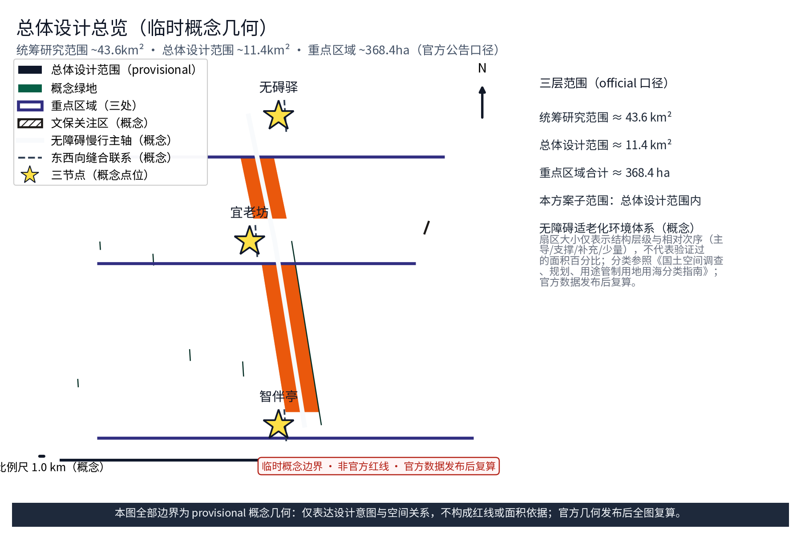
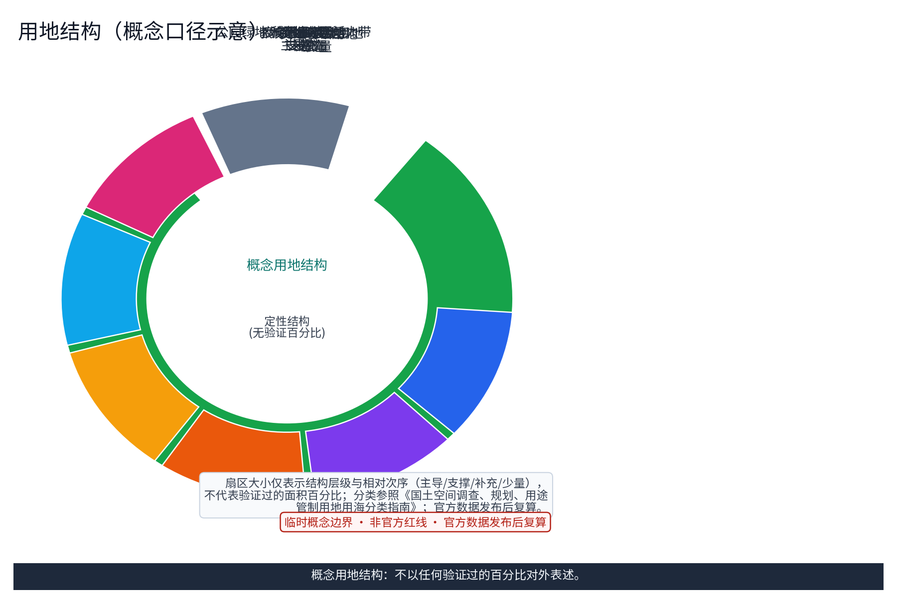
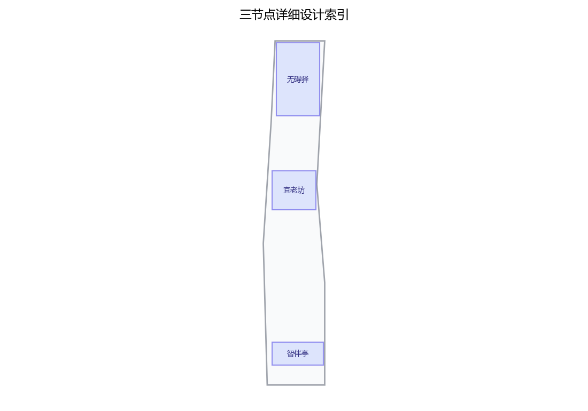
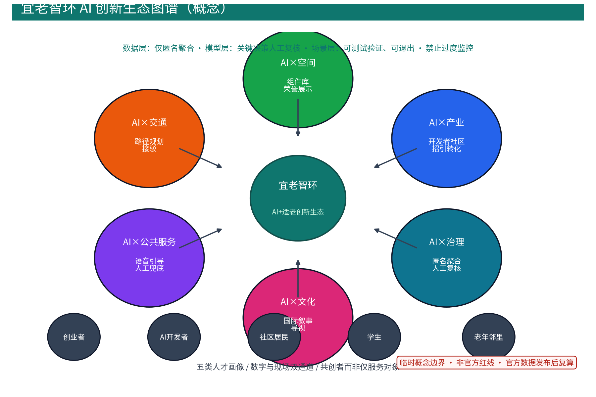
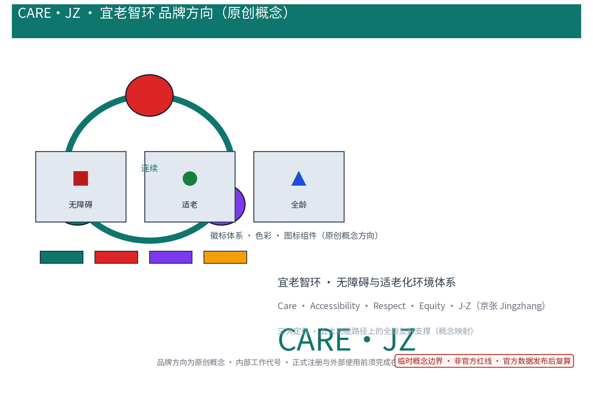
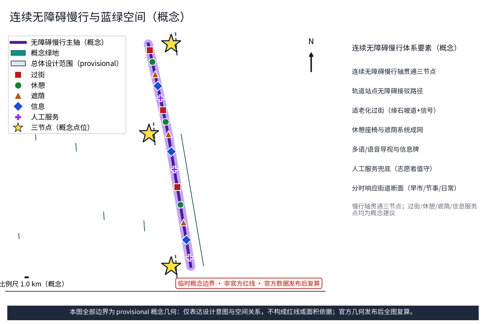
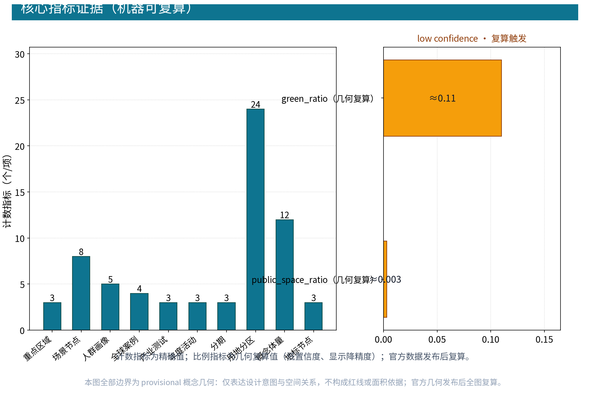

## 设计依据与资料清单
本方案依据《无障碍环境建设法》（2023年施行）、《老年人权益保障法》及民政、住建部门适老化改造与老年友好型社会建设政策口径展开；征集公告与任务书界定范围、三大定位、五大功能与六项任务要求；城市设计与控规编制办法提供深度方法参照。资料清单所列均为公开口径引用清单，本包实际使用的数据以 sources.json 收录为准，未获取项如实列入风险与缺失数据说明，绝不虚构官方数据。编制过程按「官方口径优先、专业标准参照、公开资料核验、未获取项如实登记」四步质量控制：范围、面积与边界一律以公告文本为准；专业方法与分类名称以国标及部门规章为参照；案例与背景资料仅采信可查证的公开来源；无法获取的法定条件（产权、控规、文保、市政容量）逐项列入风险清单，不推测、不补造。正式设计阶段须以官方发布文本校核更新；「宜老智环（CARE·JZ）」为参与方原创概念方向与内部工作代号，未经在先权利检索不对外注册或正式使用。

> **证据锚点**：[source:DATA-SRC-OFFICIAL-ANNOUNCEMENT]、[source:DATA-SRC-AGENT-TASKBOOK]（公告与任务书为文本口径依据）。

## 三层范围工作框架
按官方公告口径，三层范围自上而下为：统筹研究范围约 43.6 平方公里、总体设计范围约 11.4 平方公里、重点区域合计约 368.4 公顷。本方案明确位于总体设计范围之内，以无障碍与适老化环境体系为「智能化AI活力城市」定位下的公共支撑子题（概念映射），三层边界全部标注 provisional：统筹研究层判断沿线高校、科创片区、住区与产业协同关系；总体设计层以京张铁路遗址公园绿带为骨架开展控规深度概念设计；重点区域层以「无碍驿—宜老坊—智伴亭」三节点深化。三层工作按「自上而下传导、自下而上校核」组织：上层范围决定下层工作边界与指标口径，下层成果反向校验上层判断，指标与几何在层间保持可追溯，任何一层在官方数据发布后触发整体复算，避免以概念几何冒充正式范围。三层逐级传导、指标校核，不作出超出概念深度的实施结论；官方几何发布后整体复算。

> **证据锚点**：[source:DATA-SRC-AGENT-TASKBOOK]、[source:DATA-SRC-PROVISIONAL-BOUNDARIES]（三层划分与边界口径）。

## 统筹研究范围产业与未来城市研究
统筹研究把无障碍适老化环境置于「产业—人才—生活」链中研判：海淀区沿线高校与科创片区聚集 AI 开发者、创业者等青年人才，国际化住区与既有老年社区并存，呈现全龄混居特征。任务书三大定位（百年京张文化带、都市AI生活体验带、AI融合创新带）与五大功能（AI全栈自主创新体系、世界级AI创新生态、AI+场景赋能新范式、智能化AI活力城市、AI治理全球话语权）为统筹置景；本方案选取其中「智能化AI活力城市」的全龄友好与无障碍维度展开概念映射。跨区域协同按「三区两翼」框架细化为概念协同圈（研究假设），协同主体明确为：北纬社区等沿线街道与社区（需求方）、高校与科研机构（方法方）、园区运营方与企业（供给方）、公益组织与志愿者网络（服务方）；交换对象按「需求清单—匿名聚合数据—场景接口—评测方法—运维手册」五类界定；闭环机制按「需求征集—场景互认—试点备案—年度评估—复算公示」五步循环，任一环节未达标即暂停互认并限期整改，年度公示保障透明度。协同圈不预设行政与投资安排，与未来科学城、怀柔科学城、经开区及京津冀地区的双向学习与标准互认同样纳入该闭环。未来城市研究仅作方向性预判：老年邻里既是服务对象，也是社区数据与场景的共创者。

> **证据锚点**：[source:DATA-SRC-AGENT-TASKBOOK]（三大定位、五大功能、三区两翼的文本口径）。

## 总体设计范围城市更新与控规深度城市设计
总体设计以遗址公园绿带为骨架构建连续无障碍慢行网络，串联沿线各级公共空间，形成「绿带+节点」结构；更新以存量为主，设施以植入、改造方式落实，不预设用地增减、建筑规模与拆改留数值。空间设计落实「三区两翼」结构下的站点—社区—道路关系：轨道站点无障碍接驳路径、社区出入口与慢行断点逐一校核概念可达性。面向可逆改造组织公共空间组件库（坡道模块、座椅遮荫模块、标识信息模块、无障碍卫生间模块），随产权与结构条件复制叠加；组件库按「标准接口、独立命名、可替换、可追溯」管理，为后续专业团队提供可转化的实施语言，不预设单一施工工艺。控规层面仅作校核建议，对用地分类、绿地率、公共服务设施配置逐项比对符合性并标注复算触发，不提出容积率、高度等强制性调整意见；校核结论以「符合性等级+依据+复算触发」三要素登记，供正式控规编制时引用。

> **证据锚点**：[standard:MOHURD-CONTROL-DETAILED-PLANNING]、[source:DATA-SRC-PROVISIONAL-BOUNDARIES]。

## 重点区域详细设计
三节点选址均为概念点位，正式实施前须经规划、文保、消防与主管部门评估并重新落位：「无碍驿」为无障碍慢行与接驳服务节点，沿绿带主轴布置坡道系统、信息问询与休憩接驳；「宜老坊」为适老化社区更新示范单元，刻画坡道化、电梯加装条件研判、标识提升与出入口拓宽方向；「智伴亭」为AI辅助适老化公共信息服务站点，置于绿带与社区交集处，提供语音交互、预约值守与人工兜底。服务界面按「连续无障碍路径—过街—坡道—休憩—遮荫—信息与人工服务」六要素绘制概念平剖面，六要素在不同节点按功能侧重组合配置；每处节点以「可达性—安全性—舒适性—可识别性」四要素自检清单校核设计深度。老年邻里通过楼栋议事与需求访谈参与节点校准；三节点以无障碍慢行轴贯通，与轨道站点、街道断点、社区出入口建立概念关系；产权、结构、消防疏散与市政容量留待专项评估。

> **证据锚点**：[data:PACKAGE-GEOMETRY]（三节点示意多边形来自本包 geometry/key_areas.geojson）。

## AI 创新生态、人才画像与 AI+ 场景
五类人才画像：创业者、AI 开发者、社区居民、学生、老年邻里，分别标注空间活动特征与无障碍需求；老年邻里以共创者身份参与场景设计与年度评估，而非仅被照护。AI 生态按「数据—模型—场景」三层组织并形成生态图谱：数据层仅匿名聚合，模型层关键决策人工复核，场景层可测试验证、可退出；AI×产业、AI×空间、AI×交通、AI×公共服务、AI×文化、AI×治理六域全覆盖。配套开发者社区（开放场景沙盒、开源组件、年度联创赛与积分榜）与招引转化路径（场景测试—试点备案—联盟合作），场景开放遵循准入公示。每个场景配置模型评测、数据质量检查与运行监测，以误报率基准测试为验收底线；全部场景坚持匿名聚合、最小必要采集、人工复核与禁止过度监控。品牌方向文章案面向国际传播（中英双语导视与叙事文案，内部工作代号使用边界见风险节）。

**场景卡索引（概念）**：下列十张场景卡逐项列明用户、数据、空间、模型、运营方、人工兜底、隐私控制、阶段门、指标与停止条件，均为概念建议而非已批准服务：

| 场景卡 | 落点（空间载体） | 面向人群（用户） | 输入数据与模型 | 运营方与人工兜底 | 隐私控制 | 阶段门／指标／停止条件 |
|---|---|---|---|---|---|---|
| 「无碍径」无障碍接驳指引 | 「无碍驿」 | 老人、残障人士 | 匿名聚合路径数据；路径规划模型 | 站点运营方；志愿者值守、人工陪行 | 授权明示、可一键关闭 | 试点门：现场走测误报率达标；停止：连续误报 |
| 「宜老坊」适老改造示范 | 「宜老坊」 | 长者、居民 | 匿名改造需求；设施台账识别模型 | 社区运营方；楼栋议事、人工复核 | 匿名聚合，人工复核 | 阶段门：街坊参与率达标；停止：覆盖不足 |
| 「智伴台」AI语音信息引导 | 「智伴亭」 | 长者、弱势群体 | 端侧语音；问答模型 | 站点运营方；预约值守、人工兜底 | 端侧处理，禁止过度监控 | 月度门：满意度达标；停止：满意度不达标 |
| 「体检表」无障碍年度体检 | 全带节点 | 社区代表、从业者 | 聚合巡查记录；台账识别模型 | 街道统筹；社区代表复核 | 聚合统计，人工复核 | 年度门：整改闭环率达标；停止：台账失真 |
| 「伴行」无障碍信息问询 | 绿带服务点 | 游客、家庭 | 匿名问询统计；检索模型 | 志愿团队；志愿轮值、人工答复 | 仅聚合统计，不进行个体识别式追踪 | 季度门：响应时长达标；停止：需求迁移 |
| 「安心过街」过街辅助提示 | 适老化过街点 | 老人、儿童 | 端侧环境判断；信号交互模型 | 交通协同；时段运行、人工兜底 | 端侧处理，不留存影像 | 阶段门：误报率基准达标；停止：误报超标 |
| 「暖椅」休憩遮荫服务 | 休憩点 | 全龄 | 匿名使用统计；设施调度模型 | 社区运营方；认养公约、轮换管理 | 匿名使用统计 | 半年度门：使用率达标；停止：设施闲置 |
| 「掌上学堂」数字技能教学 | 社区中心 | 长者、银龄 | 报名聚合；课程匹配模型 | 志愿教师团队；现场助教兜底 | 报名信息最小采集 | 学期门：完课率达标；停止：报名不足 |
| 「代际共演」文化客厅活动 | 文化节点 | 家庭、代际群体 | 活动报名聚合；排期模型 | 文化运营方；社区议事、荣誉展示 | 仅活动报名聚合 | 活动门：参与人次达标；停止：安全评估不过 |
| 「守护清单」居家改造咨询 | 社区服务站 | 居家老人 | 咨询记录加密；清单匹配模型 | 专业社工；人工回访、分级服务 | 记录加密、限期删除 | 年度门：回访率达标；停止：隐私投诉 |

**产业测试验证方案（概念）**：三项测试验证场景以协议化管理，明确准入、退出、验证方法与停止条件，均不构成已批准服务：

| 测试验证场景 | 协议要素 | 准入与退出 | 验证方法与停止条件 |
|---|---|---|---|
| 「无碍径」路径规划模型测试 | 用户/数据/空间/模型/运营方/人工兜底 | 试点路段准入，连续误报即退出 | 现场走测对比、误报率与数据质量基准 |
| 「体检表」设施台账识别测试 | 用户/数据/空间/模型/运营方/人工兜底 | 街坊单元准入，覆盖不足即退出 | 抽样复核与误差分群，达标后扩展 |
| 「智伴台」语音应答服务测试 | 用户/数据/空间/模型/运营方/人工兜底 | 站点配额准入，满意度不达标即退出 | 月度评估与运行监测，人工复核兜底 |

**资金、算力与产业转化（概念）**：资金按多元投入定性分级（公共试点、企业共建、公益与运营收入等来源，不设金额）；算力以端侧处理与共享接口为主；产业转化沿「测试—备案—联盟—组件供给」链推进。**达标指标基准设定（概念）**：误报率以试点前双盲走测定基；参与率以试点前分楼栋分年龄调查定基；满意度以月度量表与回访均值定基；使用率以设施日志基线定基；响应时长以志愿试运行记录定基；均登记来源，官方发布后复算。

> **证据锚点**：[source:DATA-SRC-GENERATIVE-AI-INTERIM-MEASURES]（AI 内容治理表述参照）、[metric:persona_count]、[metric:industry_test_scenario_count]。

## 用地、建筑规模与拆改留方案
拆改留坚持留改拆并举、以留为主：保留遗址公园肌理与铁路历史遗存，存量建筑以功能置换与无障碍改造为主（坡道化、电梯加装条件研判、标识提升、出入口与通道拓宽梳理），拆除仅限经个案论证的局部疏通慢行零星建筑，全部为概念口径，官方数据发布后复算。本方案不预设用地增减、建筑规模数值与拆改留结论，改造遵循「轻介入、可叠加」原则，随产权与结构条件逐步实施；具体规模与处置方式留待专项评估确定。处置逻辑按「保留优先、功能置换、个案拆除」三级判定：先校核历史与结构价值，再评估功能适配与改造经济性，最后才考虑拆除，并逐项登记判定依据、不确定条件与复算触发，判定过程面向年度公示公开，全部处置建议均以概念口径表述。用地结构以定性层级表达（主导/支撑/补充/少量），不表述未经验证的百分比；口径与聚合规则在指标章节统一说明。

> **证据锚点**：[source:DATA-SRC-MNR-LAND-USE-CLASSIFICATION-202311]（用地分类名称参照现行国标口径）。

## 交通、轨道、市政与公共服务设施
坚持慢行优先：沿绿带构建连续无障碍慢行轴贯通三节点，街道断面按活动需求分时响应（早市、节事、日常模式）；轨道站点无障碍接驳路径、出入口坡道与适老化过街设施（缘石坡道、无障碍信号）作为总体概念提出；绿色出行优先、降低小汽车依赖、节事散场分时分区疏导。市政设施以集约共享为原则，提出与公共空间复合布设的方向性建议；公共服务配置无障碍与多语服务、适老信息引导、无障碍卫生间与人工服务兜底，AI 决策均设人工复核。交通组织按「到发链—过街链—停留链」三链校核：轨道到发、过街与停留休憩各环节逐一标注无障碍断点与改进方向，形成可追溯的断点清单，并纳入年度无障碍体检的复查范围，断点优先级结合客流与需求强度综合排序。本节仅表述设施体系与衔接逻辑，不预设管线容量、断面尺寸等工程数值，工程结论交由后续专项论证。

> **证据锚点**：[standard:MOHURD-URBAN-DESIGN-MEASURES]（市政与慢行设计表述的方法参照）。

## 蓝绿空间、公共空间与城市风貌
构建「绿带为轴、节点公园为珠」的蓝绿公共空间体系：以遗址公园绿带为骨架串联沿线口袋公园与社区绿地，形成连续生态与公共空间网络；提出适老化公园绿地概念——平缓园路、防滑铺装、休憩座椅与遮荫系统成网布局，间距与遮荫覆盖按适老需求校核。公共空间按「主轴线—节点—连接段」三级组织：主轴线保证连续性与通达性，节点保证功能复合与代际共享，连接段保证无障碍衔接，各级均纳入无障碍体检与年度公示范围，分级组织同时服务于景观辨识与维护责任划分。文化导视系统延续京张铁路工业记忆语汇并兼顾适老信息（大字号、多语、语音），社区荣誉展示与代际共创空间嵌入节点设计；风貌整体克制统一，新建与更新设施采用低调、耐久、辨识度高的语汇，使无障碍设施与标识成为可识别的城市符号而非临时附加物，避免符号堆砌与口号化包装。

> **证据锚点**：[standard:MOHURD-URBAN-DESIGN-MEASURES]（蓝绿空间组织与风貌导控的方法参照）。

## 更新项目清单、实施政策与分期计划
四类更新项目清单（无障碍体检与数字台账／慢行断点治理与过街完善／三节点示范／适老化公共服务与社区运营网络）均为概念清单，规模与投资估算仅为建议性定性分级（低/中/高），不构成政府或运营方承诺。分期推进：近期 1–3 年开展无障碍体检、建立台账并优先打通慢行断点；中期 3–5 年实施三节点示范与标识系统提升；远期 5–10 年形成全带适老化环境网络。实施矩阵明确牵头（政府统筹）与协作（部门、企业、高校、社区、志愿者、专业团队）角色、试点准入条件、阶段门与验收口径，并预设停止条件与退出机制：任一试点在阶段门评估不达标时暂停扩大、限期整改或撤收，社区公约与年度公示保障公众知情，矩阵随试点进展滚动更新。运营资源与维护成本按定性分级模型管理，不设金额数字，估算方法与复算触发如下表：

| 维护类别 | 成本分级（定性） | 估算方法 | 价格基期 | 包含范围 | 置信等级 | 复算触发 |
|---|---|---|---|---|---|---|
| 慢行与过街设施维护 | 低 | 同类项目区间类比法 | 公开参考价基期（2026） | 日常巡检、小型修补、无障碍标识更换 | 低（概念） | 官方定额或实施概算发布后 |
| 三节点设施运营 | 中 | 分项工作量类比法 | 同上 | 值班人力、能耗、信息终端运维 | 低（概念） | 试点预算批复后 |
| AI 场景与数据治理 | 中 | 端侧算力与共享接口折算 | 同上 | 模型评测、运行监测、审计 | 低（概念） | 试点备案后 |
| 年度活动与志愿网络 | 低 | 活动频次与规模类比 | 同上 | 场地、物料、志愿培训 | 低（概念） | 年度公示前 |

年度活动体系落实「年度公示与年度活动」要求：

| 年度活动品牌 | 频次 | 参与机制 | 主要目的 |
|---|---|---|---|
| 无障碍体验日 | 每年一次 | 志愿引导、预约体验 | 全带无障碍体检与公众反馈 |
| 适老生活市集 | 每年一次 | 商户轮换、积分激励 | 适老产品与服务对接 |
| 代际共融季 | 每年一次 | 社区议事、公约共建 | 全龄共创与成果展示 |

> **证据锚点**：[metric:phase_count]、[metric:annual_program_count]（分期与年度活动计数）。

## 指标体系、面积复算与合规矩阵
指标按「可复算计数指标 + 方向性指标」两类管理：计数类（重点区域、场景节点、人才画像、全球案例、产业测试、年度活动、分期、用地分区、概念体量、地标节点）来自 geometry 与正文，可在 metrics.json 复核；比例类指标公开口径与公式：green_ratio≈0.11 为概念绿地 polygon 面积除以总体设计范围面积（provisional 几何复算），public_space_ratio≈0.003 为概念公共空间面积除以总体设计范围面积，两者为「几何复算口径」，与结构图中「公园绿地结构性占比」的「分类示意口径」分母、分类与公式均不同，标识为低置信度并统一按官方数据发布后复算处理，显示一律降精度。方向性指标（无障碍慢行贯通率、适老化设施覆盖数、全龄友好公共空间比例、无障碍标识覆盖率、老年友好活动参与人次）不设数值，仅定义统计口径与复算触发条件。合规矩阵逐条对照《无障碍环境建设法》标注符合性等级；面积复算以官方文本口径为底，超出口径的推测数据一律不采用。

> **证据锚点**：[metric:green_ratio]、[metric:public_space_ratio]、[source:PACKAGE-GEOMETRY]。

## 风险、版权与合规说明
本方案为概念研究性设计，不构成行政审批依据，也不构成容积率、建筑高度、拆改留或工程可行性结论；组织方尚未发布可核验坐标系的三层范围与重点区域 polygon，全部几何为 provisional，仅用于概念展示与机器校验，官方数据发布后复算。风险按数据边界、法定控制缺位、无障碍改造时序、产权协调、设施维护、技术依赖与公众接受度如实登记于 risk.json；每个数据场景的字段级治理方向如下表（数据控制者、采集字段、保留期、删除机制、访问权限、审计与事故响应均为概念安排，正式运营前须依法定程序确定）：

| 数据场景 | 数据控制者（概念） | 采集字段 | 保留期与删除 | 访问权限 | 审计与事故响应 |
|---|---|---|---|---|---|
| 「无碍径」接驳指引 | 站点运营方（概念） | 匿名路径聚合、授权会话 | 会话即删；日间聚合保留不超季度 | 最小权限、专用账号 | 季度审计；事故即停用并公示 |
| 「智伴台」语音引导 | 站点运营方（概念） | 端侧语音交互记录 | 端侧处理、不留存云端 | 仅现场值班 | 月度审计；隐私投诉触发复核 |
| 「体检表」年度体检 | 街道统筹（概念） | 聚合巡查台账 | 台账年度归档后匿名化 | 委托授权机构 | 年度审计并公示结果 |
| 「守护清单」咨询 | 社区服务站（概念） | 加密咨询记录 | 服务完结后限期删除 | 社工与专业机构 | 年度审计；删除动作留痕 |

AI 治理三句式：仅匿名聚合、关键决策人工复核、禁止过度监控；居民意见通道（意见征询、试用反馈、楼栋议事）与年度公示、年度活动为运营机制方向。权利记录：字体采用可再分发且有许可记录的开源字体，图形、图标、Logo 与文案为参与方原创生成并逐资产登记于版权声明；知识型案例均附机构来源与获取时间；品牌在先权利：概念阶段未完成商标检索，「宜老智环」「CARE·JZ」仅作内部工作代号，未清权前不对外注册或外部使用。引用公开资料均注明出处，本方案不宣称获得非公开渠道资料，正式实施前须完成多部门联审、文物保护与安全评估。

> **证据锚点**：[source:DATA-SRC-OFFICIAL-ANNOUNCEMENT]、[source:DATA-SRC-BARRIER-FREE-ENVIRONMENT-LAW]。

## 参考资料
本清单均为公开引用，细目以正式引用版为准：①《无障碍环境建设法》（2023 年施行）；②《中华人民共和国老年人权益保障法》及适老化改造、老年友好型社会建设相关指导意见；③《城市设计管理办法》《城市、镇控制性详细规划编制审批办法》等专业方法参照；④征集公告、任务书及设计条件文本；⑤中关村创新文化与京张铁路历史文化公开资料（叙事口径参照）。案例对标六项（每项均附机构来源、发布与获取时间，详见 sources.json），仅作机制对标，不构成对本地实施的承诺；案例选取遵循「同主题、可查证、机制可迁移」三条标准，优先选取无障碍与适老领域的政府或专业机构公开实践，覆盖亚洲、欧洲与国内不同制度背景，以便比较通用设计、在地养老、轨道无台阶、适老街区与无障碍立法等机制差异：

| 案例 | 机构来源 | 机制要点（概念对标） | 来源 |
|---|---|---|---|
| 新加坡 Kampung Admiralty | HDB（建屋发展局） | 医养住垂直整合、通用设计全覆盖 | hdb.gov.sg 综合开发页 |
| 日本柏市丰四季台 | 柏市政府 | 长寿社会在地养老、产官学协定 | city.kashiwa.lg.jp 官网 |
| 伦敦无台阶通行计划 | Transport for London | 轨道全链无台阶、行程时间下降 | tfl.gov.uk 官网 |
| 哥本哈根适老街区行动 | 哥本哈根市政府 | 适老长椅、路灯与公共空间改造 | kk.dk 官网 |
| 北京无障碍行动方案 | 北京市人民政府办公厅 | 四领域专项行动、台账化整改 | beijing.gov.cn 官网 |
| 深圳无障碍城市条例 | 深圳市政府 | 全国首部无障碍城市立法 | sz.gov.cn 信息公开平台 |

国内对标另参考上海适老化改造与杭州全龄友好社区公开报道。所有案例仅作机制对标，不构成对本地实施的承诺；本包 sources.json 仅收录可查证条目。

> **证据锚点**：[source:DATA-SRC-OFFICIAL-ANNOUNCEMENT]（本清单首条即组织方公开资料包）。