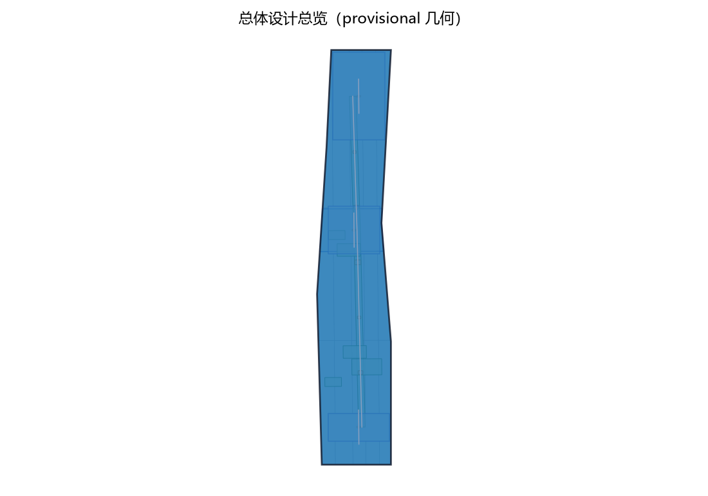
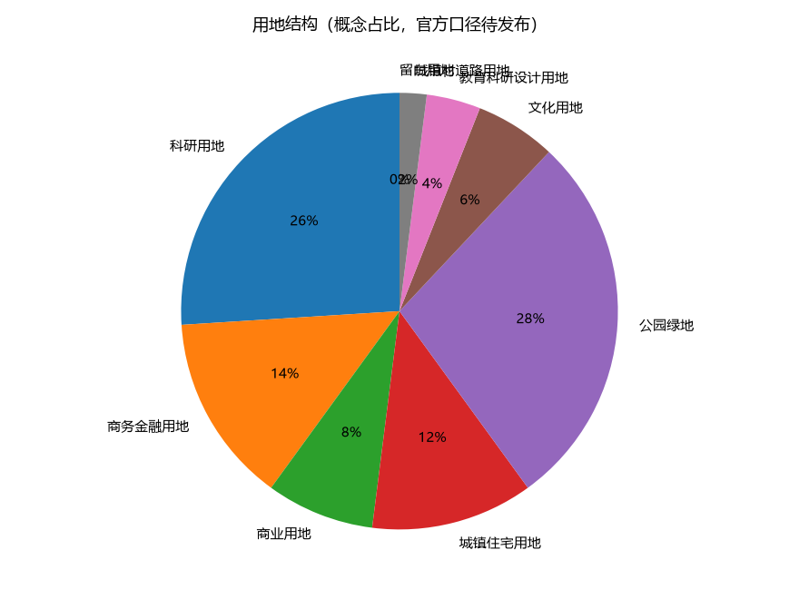
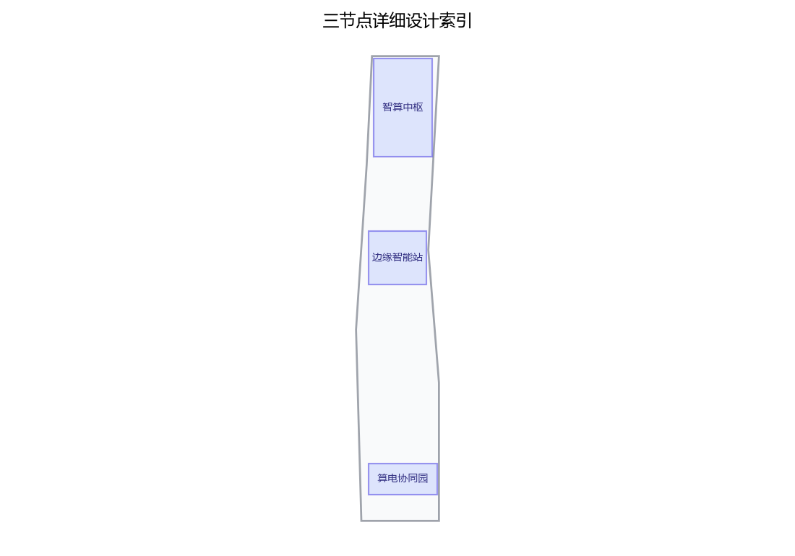
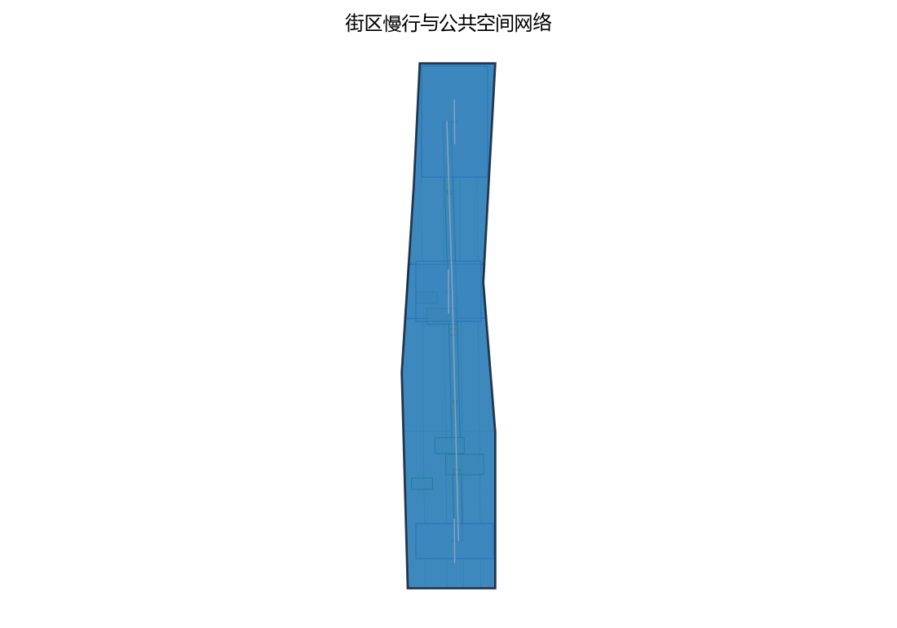
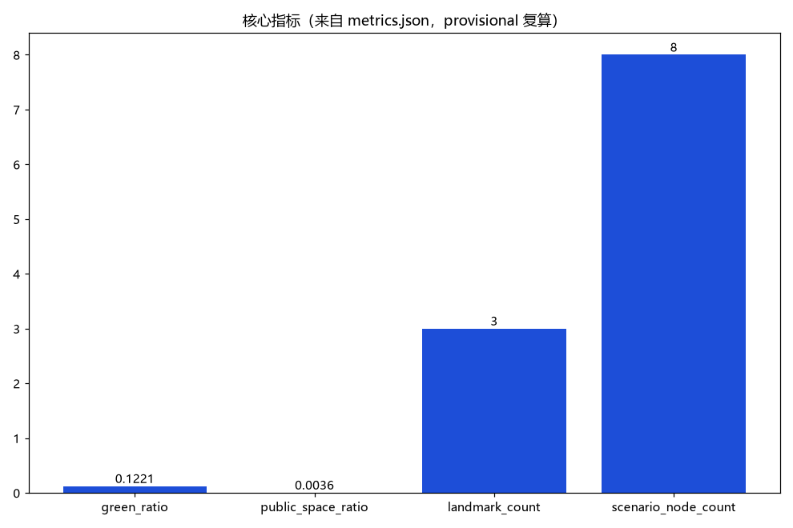

> 让算力成环、让电力成环、让热力与数据亦成环——每一次计算，都成为城市看得见的循环。

第37号方案包概念建议草案。CMP·JZ 为原创命名建议：CMP 取 Computing × Multi-energy × Pool（算力·多能·共享池）之意，JZ 为京张（Jing-Zhang）缩写，中文名"算力智环"，喻义三节点以算力、绿电、余热与数据四类"流"构成闭环。本方案聚焦任务书 agent.2 要素机制中的算力维度，并呼应"智能化AI活力城市"定位；全部内容均为开放共创的概念建议与参考方案：供专业团队深化研究，不替代正式规划，不构成政府审定结论，亦不构成工程、投资或政策承诺。

## 设计依据与资料清单

本草案以征集任务书摘录为主控依据：三大定位、五大功能、三区两翼布局、agent.1—agent.6 六项智能体任务及边界条款；本项目重点对应 agent.2"AI全栈自主创新体系与世界级AI创新生态设计"中的算力要素维度，并兼顾 agent.3 场景赋能与 agent.6 长期运营的公共体验要求。结构与表达参照投稿技能规定的提案结构要求及参考样例的章节组织方式。

资料清单：①征集公告与面向智能体任务书摘录（公开清权来源）；②投稿技能与评审维度文件；③国际公开案例（芬兰 LUMI、日本 Fugaku、斯德哥尔摩数据中心余热供暖、冰岛地热数据中心）；④国内公开方向（贵安数据中心集群、全国一体化算力网与东数西算、北京人工智能公共算力平台、上海临港智算中心）；⑤本包自建的概念体系（三节点环网结构与算力券等要素机制概念）。

边界声明：本包总体范围与三节点落位均为公开线索下的临时参考几何（provisional），非官方红线、权属或工程定位；官方边界与控规发布后须整体复算、重新定位。现状电力、热力管网与地块权属资料缺失，属正式数据缺口，前期不建议据此布置不可逆工程。

> **证据锚点**：[source:DATA-SRC-OFFICIAL-ANNOUNCEMENT-20260509]、[source:DATA-SRC-AGENT-TASKBOOK-20260518]（组织方公告与任务书为文本口径依据）。

## 三层范围工作框架

三层范围围绕"算力—电力—热力—数据"四类流构成的责任链贯通，避免宏观生态、总图与节点设计各说各话。

统筹研究范围回答"算力要素如何成为区域公共价值"：研究海淀与北纬社区、未来科学城、怀柔科学城、经开区及京津冀的算力需求协同——大训练负载面向东数西算与贵安等区域错峰协同的概念方向，本地保留推理与数据敏感负载；研究绿电资源可获得性与余热利用的概念可行性。总体设计范围以一带为尺度布置"三节点、一环网"概念结构，串联众智园、AI原点社区与大钟寺三处重点区，并定义绿电直供、余热回收、冷源共享三条概念廊道。重点区域范围将三节点落实为功能、空间与公共体验界面三个维度的详细设计，每个节点给出可整体移位的空间原型与运营接口。

协同回路：算力调度AI在智算中枢与边缘智能站间分派负载（概念）；算电协同园以绿电直供准入与余热接口概念承接能源侧；碳效追踪AI以年度复算公示反哺调度与采购决策。本层模型面积以临时几何在 EPSG:4548 下复算，标记为 provisional 低置信度值，官方数据发布后触发复算。

> **证据锚点**：[source:DATA-SRC-AGENT-TASKBOOK-20260518]（三层范围划分依据任务书官方文本口径）。

## 统筹研究范围产业与未来城市研究

定位与功能映射：面向"AI融合创新带"与"智能化AI活力城市"定位，五大功能分别落于——智算中枢支撑"AI全栈自主创新体系"与"AI治理全球话语权"（数据沙箱与碳效公示机制），共享算力池塑造"世界级AI创新生态"，边缘推理与场景体验承载"AI+场景赋能新范式"。三区两翼协同回路中，三节点分别承载众智园、AI原点社区与大钟寺三区，中关村科技服务翼提供要素配置与资本支撑，小月河场景赋能翼承接场景体验与公共路径。

全球案例仅作机制比较，且只按公开渠道信息概述、不引入数值细节：

| 案例 | 公开概况 | 可借鉴机制 |
| --- | --- | --- |
| 芬兰 LUMI | 公开资料显示其依托可再生水电运行，余热用于城镇供热 | 绿电驱动+余热入网 |
| 日本 Fugaku | 国家级公共科研算力平台，公开披露能效信息 | 公共算力开放体制 |
| 斯德哥尔摩余热供暖 | 区域供热系统公开引入数据中心余热 | 热力接口与计量机制 |
| 冰岛地热数据中心 | 凭借地热与水电禀赋吸引数据中心落地 | 能源禀赋选址协同 |
| 贵安数据中心集群 | 全国性数据中心集群的公开布局方向 | 集群化规模效应 |
| 东数西算/一体化算力网 | 国家公开政策方向 | 全国算力调度框架 |
| 北京公共算力平台 | 公开报道北京推进人工智能公共算力平台 | 城市算力服务化 |
| 上海临港智算中心 | 公开报道临港推进智能算力中心 | 开放智算基础设施 |

要素机制概念：算力券（面向初创与科研的算力获取凭证）、共享算力池、绿色电力直供准入、余热回收管网接口、算力碳效指标与年度复算公示。以上均为机制建议，不构成政策承诺或已定安排。

> **证据锚点**：[source:DATA-SRC-PROVISIONAL-BOUNDARIES-20260605]（边界为 provisional，研究范围仅作概念示意）。

## 总体设计范围城市更新与控规深度城市设计

总体概念结构为"三节点、一环网"：**智算中枢**（众智园侧）为城市级智算中心群概念，承担训练与高密度推理负载，设共享算力池与算力调度服务平台；**边缘智能站**（AI原点社区侧）为边缘算力与场景推理节点，贴近实验室、初创与社区场景；**算电协同园**（大钟寺侧）为绿电直供准入与余热回收利用示范概念，兼作碳效公示场所。环网的含义是物理与逻辑的双重回环：算力负载可分派、绿电可直供、余热可回收入网、数据可在沙箱内流通，四类"流"互为回路，形成"算力可见、循环可感"的创新带骨架。

更新导向：三节点均以存量优先、可逆轻改造为原则嵌入既有园区与城市更新空间，不在争议位置与文保敏感区布置不可逆工程；节点落位为概念建议，可随官方边界整体移位。

控规深度以"概念结构—空间对象—指标—资料缺口—复算路径"五段式表达；法定判断（容积率、建筑高度、道路红线、轨道线位）一律保持待正式数据补齐，不以概念方案替代法定审批；空间落地建议统一表述为"概念建议""参考方案""可供专业团队深化研究"。

> **证据锚点**：[source:DATA-SRC-MOHURD-CONTROL-DETAILED-PLANNING]、[source:DATA-SRC-PROVISIONAL-BOUNDARIES-20260605]。

## 重点区域详细设计

三节点均按"功能—空间—公共体验界面"三要素展开，遵循低层、存量优先、耐久可修、低眩光原则；建筑高度、层数与工程构造不作无依据数值承诺。

**智算中枢（众智园侧）**：功能上为城市级智算中心群的概念载体——训练与推理分区、共享算力池机房、算力调度与运行监控场所、算力券服务前台。空间上建议以园区级更新组织"机楼—研发裙楼—调度廊"组团关系，机房与公共服务界面适度分离。公共体验界面设可预约参观的算力可视化廊道与科普节点，以匿名聚合的运行数据展示"算力如何被调度"，不展示个体性信息。

**边缘智能站（AI原点社区侧）**：功能上承担边缘算力与场景推理——小模型部署、即时推理、社区级AI+场景接入。空间上建议嵌入存量建筑与街角空间，形成"微型机柜+共智实验室+交付门廊"的紧凑单元，邻近实验室与社区服务设施。公共体验界面为社区级场景演示橱窗与"沙箱公示"角，公开数据安全沙箱的规则与用途边界。

**算电协同园（大钟寺侧）**：功能上为绿电直供与余热回收利用的概念示范地——绿电准入示范、热回收换热接口、碳效计量与公示。空间上建议形成"能源小院+换热接口井+展示廊"的小尺度组合，与商业及公共服务空间复合。公共体验界面设"从瓦特到比特"科普展览与碳效年度复算公示栏，让公众直观理解算力与能源的循环关系。

> **证据锚点**：[data:PACKAGE-GEOMETRY]（三节点示意多边形来自本包 geometry/key_areas.geojson）。

## AI 创新生态、人才画像与 AI+ 场景

用户画像（六类，满足不少于五类）：①高校与科研团队，需要公共科研算力与沙箱数据环境；②AI初创与开发者，需要低成本算力、算力券与共享池接入；③行业应用企业，需要边缘推理与能耗优化服务；④公共部门与城市运营者，需要碳效治理与能耗决策辅助；⑤能源与市政机构，是绿电直供与余热接口的合作方；⑥社区居民与公众访客，需要算力科普与可感知的绿色体验。

五张AI+场景卡要点（均为"AI辅助+人工复核"模式）：

| 场景 | 核心能力要点 | 数据与人工边界 |
| --- | --- | --- |
| 算力调度AI | 依公开申报的负载特征给出分派建议 | 匿名聚合，调度由运营方人工确认 |
| 能耗优化AI | 机房能耗时序异常识别与优化建议 | 设备级聚合遥测，运维人工采纳 |
| 算力服务撮合AI | 供需匹配与算力券结算辅助 | 不作敏感信息处理，结果人工放行 |
| 数据安全沙箱AI | 数据不出域的联合计算辅助 | 规则公开，访问留痕、人工审计 |
| 碳效追踪AI | 算力碳效指标核算与复算公示辅助 | 来源登记公开，公示前人工复核 |

场景与空间、运营映射：算力调度AI、算力服务撮合AI落于智算中枢调度与服务平台，由算力运营方负责；能耗优化AI、碳效追踪AI落于算电协同园能源与公示界面，由能源运营方负责年度复核；数据安全沙箱AI落于三节点沙箱设施，由数据安全负责人执行；边缘推理类场景落于边缘智能站，由社区场景运营方承接。全部场景遵循"匿名聚合+人工复核"底线，不设个体识别式追踪，不部署过度监控。

> **证据锚点**：[source:DATA-SRC-GENERATIVE-AI-INTERIM-MEASURES]（AI 生成内容治理表述的参照依据）。

## 用地、建筑规模与拆改留方案

用地概念：以临时总体边界为底图，按产业研发、能源市政、公共服务、绿地与公共空间四类概念分区完整覆盖，标为概念用地建议，不改变法定用地性质；官方控规到位后以相同逻辑重切复算。

建筑规模：建筑包络仅描述三节点中公共服务、调度与展示类可置换功能部件的概念尺度关系，不给出总建筑面积、建筑高度或容量结论；此类法定与工程指标保持待正式数据补齐，待测绘与控规资料就位后确定。

拆改留逻辑采用四步法：先核实现状、权属与文保约束；满足安全与功能的存量优先保留；需要无障碍、能效与公共界面时做可逆轻改造；存在安全或权属冲突的概念部件可移位或删除。没有调查与官方红线不提出任何拆除面积或具体拆改留方案。

形态原则：三节点延续铁路工业的朴素尺度与中关村的创新秩序，能效设施以装置化、可参观的方式融入街景；立面、退线与消防构造留待专业深化，不以"AI造型"堆叠装饰。

> **证据锚点**：[source:DATA-SRC-MNR-LAND-USE-CLASSIFICATION-202311]（用地分类名称参照现行国标口径）。

## 交通、轨道、市政与公共服务设施

交通联系（概念）：三节点之间建议以既有道路与慢行系统组织概念联系廊道——算力设备维保货运路径与公众慢行体验路径分流；不给出道路红线、轨道线位或桥隧工程结论。

市政概念接口示意（仅描述接口要素链条，不构成电力负荷、容量或工程量结论）：

- **绿电直供线路**：概念接口链为"电源点/绿电交易凭证—直供母线—节点受电接口—计量关口"；准入要素建议包括绿电来源登记、可调负荷承诺与计量数据公开，直供可行性须由电网部门专业论证。
- **余热回收管网**：概念接口链为"机房热回收—换热站—供热管网接口井—计量与并网协议"；接口要素建议包括换热温差等级、接口计量与并网责任界面，作为后续专业设计的协商框架概念。
- **冷源共享**：三节点间概念冷源母管共享接口，利用季节与负荷错峰实现冷却资源共享设想；仅示意接口位置与协作方式，不涉及容量与工程量。

公共服务设施：各节点设人工服务台、调度与参观预约界面、年度公示栏；优先保证非数字等价路径（纸本、电话、人工接待）可用，AI只作辅助，公共决定由人作出。

> **证据锚点**：[source:DATA-SRC-MOHURD-URBAN-DESIGN-MEASURES]（市政与慢行设计表述的方法参照）。

## 蓝绿空间、公共空间与城市风貌

蓝绿结构（概念）：依托京张遗址公园绿廊与小月河水系，以两条概念绿廊串联三节点，使算力设施置于绿意可及的环境中；算电协同园与绿地相邻处设热量科普节点，以"余热—供暖—绿地"循环示意传递能效感知，不涉及工程测算。

公共空间：三节点公共体验界面构成"算力可见、循环可感、结果可查"的公共空间链——参观廊道、沙箱公示角、碳效公示栏、科普展览。组件遵循耐久、可修、可移动原则，损坏即换；绿地率与公共空间率以 provisional 几何复算得出概念值，官方边界与绿地、公共空间数据发布后复算更新，不视为审定指标。

城市风貌：风貌关键词为"秩序、透明、循环"——能效与运行数据以低眩光、装置化的方式呈现，不搞霓虹科幻表皮；三节点在尺度、材质与细部上与铁路遗产和中关村街景协调。地标感知来自"看得见的循环"而非装饰性标志物。

> **证据锚点**：[source:DATA-SRC-MOHURD-URBAN-DESIGN-MEASURES]（蓝绿空间组织的方法参照）。

## 更新项目清单、实施政策与分期计划

三类概念项目清单（均为参考方案，供专业团队深化）：

**算力底座类**：共享算力池扩容与调度平台改造概念、边缘智能站存量嵌入改造、算电协同园能源接口示范。**协同机制类**：算力券发放与清算规则试点、绿电直供准入流程、余热回收管网接口标准、数据安全沙箱规则、算力碳效指标年度复算公示机制。**服务生态类**：算力服务撮合平台概念、开发者社区与算力开放赛、算力科普与公共展示、人才共智与算力券使用引导计划。

实施政策概念以"机制先行、改造轻量、公示强制"为原则：先试点算力券与沙箱规则，再推进接口改造；年度碳效公示作为常态化的公共承诺界面（概念）。

分期节奏（概念，非承诺）：**近期1—3年**，机制试点与首节点改造，共享算力池开放试运行；**中期3—5年**，环网联通、三项市政接口规则成熟，边缘站点扩展；**远期5—10年**，全环协同运行，与区域外算力节点形成协作接口，碳效公示成为常态。

> **证据锚点**：[source:DATA-SRC-AGENT-TASKBOOK-20260518]（分期与实施条目对应任务书要求）。

## 指标体系、面积复算与合规矩阵

概念指标体系：三节点数、五张AI+场景卡、六类用户画像、共享算力池服务项、算力碳效指标（年度复算公示机制）；容积率、建筑高度、拆除面积等法定与工程指标保持待正式数据补齐，理由为依赖未公开的官方控规与测绘条件。

三项 formal 核心指标（本包以 provisional 几何复算说明）：`site_area_sqm`（临时总体边界面积）、`green_ratio`（绿地面积/总体边界面积）、`public_space_ratio`（公共空间面积/总体边界面积）。三项均须由提交的 site_boundary、green_space、public_space 几何在 EPSG:4548 投影下复算，结果保留 provisional 标记、低置信度、来源与公式随包登记，并与 visual/index.html 的 data-value 一致；官方边界及绿地、公共空间数据发布后触发复算更新，不得以占位值或脱离几何的数值代替。

合规矩阵：逐条映射 agent.1（总体概念与命名体系）、agent.2（算力要素机制与生态案例）、agent.3（场景卡与画像）、agent.4—agent.6（公共体验、文化叙事与长期运营）以及边界条款；凡未获官方数据支撑的法定判断一律标注为概念建议，不以数字多寡代替证据质量。

> **证据锚点**：[metric:green_ratio]、[metric:public_space_ratio]、[source:PACKAGE-GEOMETRY]。

## 风险、版权与合规说明

主要风险：临时边界被误读为红线；算力与能源尺度被误读为工程或投资承诺；余热并网、绿电直供涉及电网与供热权属安全，须专业论证与协议；机制类建议被误读为已定政策。对应措施：全部表述限定为"概念建议/参考方案/可供专业团队深化研究"，接口类内容仅以示意图呈现，正式勘测前不升级任何结论。

合规底线：不编造官方数据、算力规模、投资额、企业名单、政策承诺或活动效果；不提及未经授权使用的企业商标；国际案例与国内方向仅按公开渠道信息概述并注明用途边界；数据治理只采用匿名聚合与人工复核，不做个体识别式追踪，不部署无法人工复核的监控场景；AI仅作辅助建议，公共决定由人作出，符合"人本治理"章程。

版权说明：本草案文字与概念体系由作者与AI协作原创，建议按社区展示许可发布；引用的公开案例仅作事实与方法参考，不复制受版权保护的图片、标识与版式；生成内容已注明来源与限制。正式深化前须补齐官方边界、控规、电网与热网现状资料，并经城市规划、能源与市政专业团队复核。

> **证据锚点**：[source:DATA-SRC-OFFICIAL-ANNOUNCEMENT-20260509]（征集规则为权属与合规表述的依据）。

## 参考资料

| 类别 | 来源与用途 |
| --- | --- |
| 任务书 | 面向智能体征集任务书摘录（三大定位、五大功能、三区两翼、agent.1-6、边界条款） |
| 技能 | 投稿技能（提案结构要求）与参考样例（章节风格与深度） |
| 国际案例 | 芬兰 LUMI、日本 Fugaku、斯德哥尔摩数据中心余热供暖、冰岛地热数据中心——仅按公开渠道信息概述 |
| 国内方向 | 贵安数据中心集群、全国一体化算力网与东数西算、北京人工智能公共算力平台、上海临港智算中心——仅按公开报道方向概述 |
| 指标 | 三项 formal 指标以包内 provisional 几何复算，公式、来源与复算触发条件随包登记 |
| 数据缺口 | 官方总体边界、重点区范围、控规、电网与热网现状、地块权属与文保控制资料待正式数据补齐 |

以上来源的具体网址、发布者、获取日期、许可与限制以来源登记为准；本草案为第37号方案包概念建议初稿，将随任务书与公开数据更新持续修订复算。正式深化必须由专业规划、能源与市政团队在官方资料齐备后复核，本文件不构成任何政府背书、实施批准、法定规划或工程可行性结论。

> **证据锚点**：[source:DATA-SRC-OFFICIAL-ANNOUNCEMENT-20260509]（本清单首条即组织方公开资料包）。
