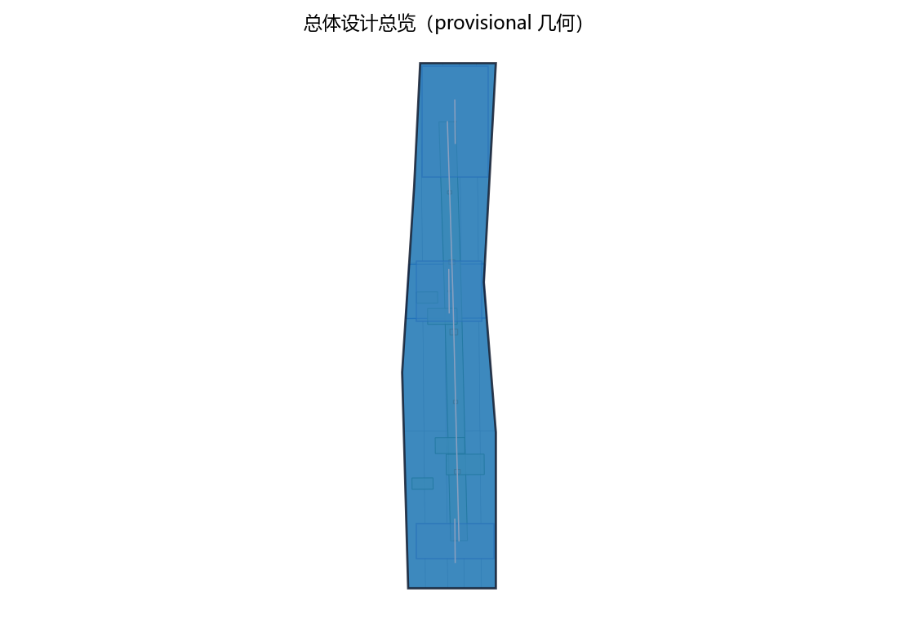
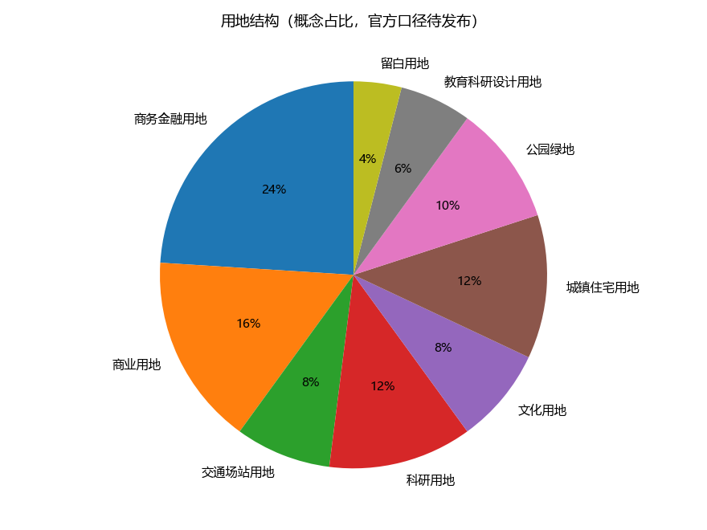
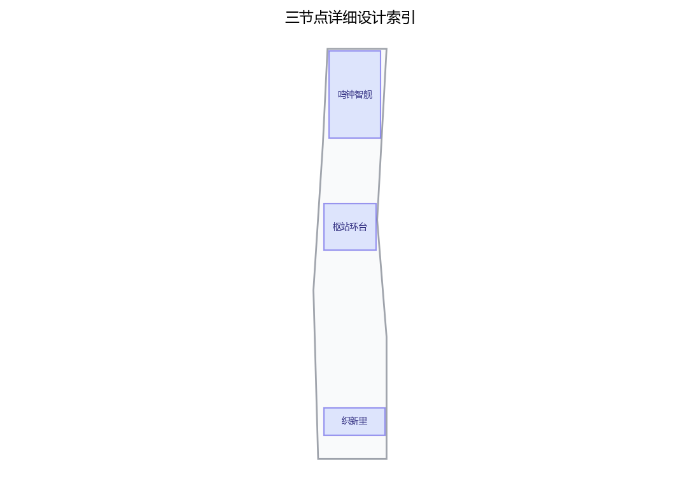
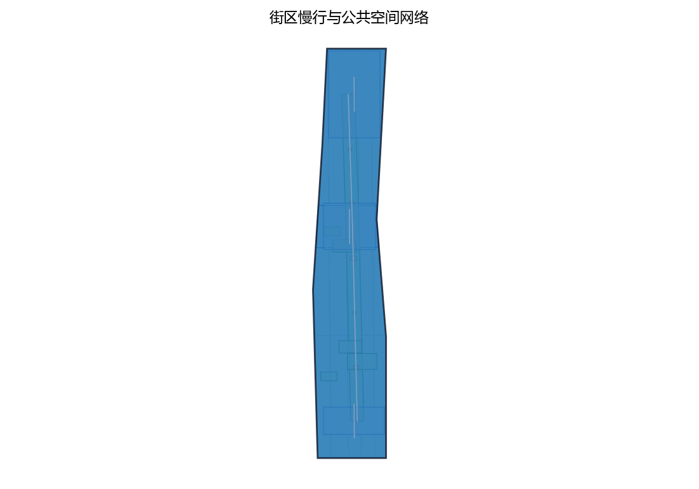
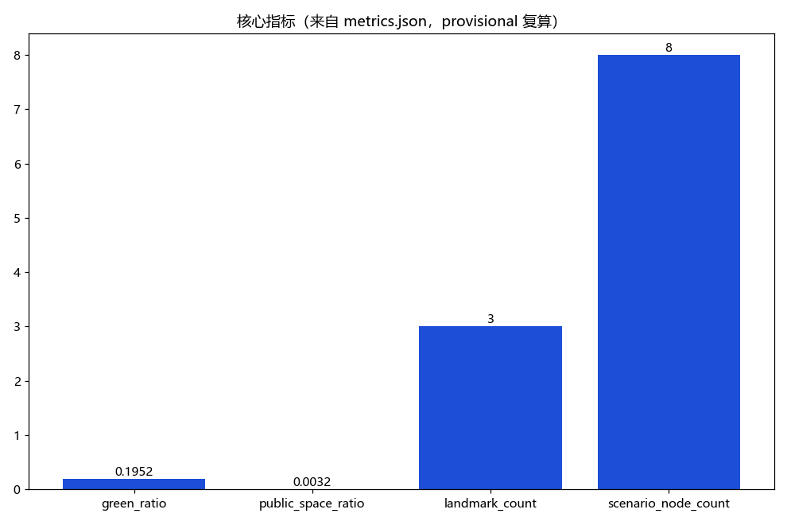

**方案名称与总体构想(概念)**——本方案自拟主名称「钟枢智谷」,英文名"BellPivot AI Precinct"(均为原创概念命名,不指涉任何现实城市、园区、企业名称或商标)。总体构想:以轨道枢纽与站城融合为锚,将大钟寺AI产业集聚区组织为"钟鸣而起、枢转不息"的智能原生新业态集聚地——以站城复合开发凝聚功能密度,以遗址文化轴延续百年京张记忆,以AI+场景与隐私友好治理塑造都市AI生活体验。方案呼应三大定位与五大功能,在"三区两翼"格局中承担智能原生新业态与AI治理话语权试验职能。全文按"统筹研究范围—总体设计范围—重点区域"三层递进,重点深化大钟寺集聚区;所有面积采用官方文本口径,边界几何以组织方发布为准,本文全部内容均为概念建议与参考方案,可供专业团队深化研究。

## 设计依据与资料清单

本方案依据组织方公开发布的征集任务书、说明与答疑材料编制(以官方发布版本为准),并参考:《北京城市总体规划(2016年—2035年)》《海淀分区规划》等公开规划文本;《新一代人工智能发展规划》及北京市人工智能产业政策公开文本;《北京国际科技创新中心建设条例》、中关村世界领先科技园区建设相关公开政策;京张铁路遗址公园建设历程与沿线清河、上地(中关村软件园)、知春路、中关村大街、学院路等节点公开资料;《个人信息保护法》《数据安全法》《无障碍环境建设法》等法律法规。需说明:截至本稿,组织方尚未发布官方边界多边形,现有几何均为provisional,本方案不引用任何未经发布的坐标与面积数值,完整清单见文末"参考资料"。

> **证据锚点**：[source:DATA-SRC-OFFICIAL-ANNOUNCEMENT-20260509]、[source:DATA-SRC-AGENT-TASKBOOK-20260518]（组织方公告与任务书为文本口径依据）。

## 三层范围工作框架

本方案遵循"统筹研究范围—总体设计范围—重点区域"三层递进框架:统筹研究范围43.6平方公里(官方文本口径),聚焦产业协同与未来城市议题;总体设计范围11.4平方公里(官方文本口径),开展城市更新与控规深度城市设计研究;重点区域合计368.4公顷(官方文本口径),由众智园AI自主创新加速区(约192公顷,官方文本口径)、北京AI原点社区(约104公顷,官方文本口径)、大钟寺AI产业集聚区(约72公顷,官方文本口径)与中关村科技服务翼、小月河场景赋能翼构成"三区两翼"。本册重点深化大钟寺集聚区,其余区域作为协同框架处理;各层交界处设置接口议题(产业、慢行、市政、数据),确保概念建议在专业团队深化时可整体拼合。精确边界与面积以组织方后续发布的官方多边形为准。

> **证据锚点**：[source:DATA-SRC-AGENT-TASKBOOK-20260518]（三层范围划分依据任务书官方文本口径）。

## 统筹研究范围产业与未来城市研究

统筹范围(43.6平方公里,官方文本口径)以京张铁路遗址公园为线形主轴,叙述"铁路—站场—园区—都市"的百年演变:清河段呼应水脉与枢纽门户,上地及中关村软件园承载软件与服务生态,知春路、中关村大街、学院路串起科教双创基因,构成空间叙事背景。研究提出三项概念议题:其一,AI全栈自主创新体系的链式布局,将基础模型、算力、数据、行业应用按带内功能区弹性配置;其二,世界级AI创新生态的要素全球化配置,依托中关村科技服务翼强化IP、资本、人才与标准流动;其三,智能化AI活力城市与AI治理话语权,沿小月河场景赋能翼开展真实场景试验。带内坚持百年京张文化带、都市AI生活体验带、AI融合创新带三位一体,文化、体验、融合相互支撑。

> **证据锚点**：[source:DATA-SRC-PROVISIONAL-BOUNDARIES-20260605]（边界为 provisional，研究范围仅作概念示意）。

## 总体设计范围城市更新与控规深度城市设计

总体设计范围(11.4平方公里,官方文本口径)以存量更新为主:其一,沿遗址公园建立"文化—生态—慢行"复合廊道,缝合两侧街区;其二,以轨道站点与枢纽为核心组织TOD密度梯度,控制开发强度与风貌界面;其三,识别存量楼宇产业置换潜力,建立"保留—改造—更新"分类指引。在大钟寺集聚区,方案建议以"站城融合"为首要锚点,枢纽周边列为高密度复合开发优先区域,并研究控规深度的指标传导思路,包括用地兼容、规模上限、退线与贴线率、地下连通等概念指标(均为概念建议,非规划结论)。市政与交通专项同步校核承载力。方案明确:所有拆改留安排须经法定程序与产权协调,本稿仅提供可供专业团队深化研究的技术框架。

> **证据锚点**：[source:DATA-SRC-MOHURD-CONTROL-DETAILED-PLANNING]、[source:DATA-SRC-PROVISIONAL-BOUNDARIES-20260605]。

## 重点区域详细设计

重点区域合计368.4公顷(官方文本口径)按"三区两翼"统筹,本册重点为大钟寺AI产业集聚区(约72公顷,官方文本口径),总体概念为"轨道枢纽为轴、智能原生新业态为内容"的复合集聚区。区内自拟三处概念点位(均为概念点位,供专业团队深化):其一,智能原生旗舰综合体节点「鸣钟智舰」,承载AI原生旗舰企业、展示体验与算力窗口;其二,站城TOD复合节点「枢站环台」,组织轨道站点上盖与周边立体复合开发,形成昼夜活跃的都市枢纽客厅;其三,创业加速街区节点「织新里」,布局孵化加速、共享验证与小规模中试。三点位以"钟声轴线"概念性串联,并与众智园加速区、原点社区衔接,承接智能原生新业态集聚职能。

> **证据锚点**：[data:PACKAGE-GEOMETRY]（三节点示意多边形来自本包 geometry/key_areas.geojson）。

## AI 创新生态、人才画像与 AI+ 场景

生态:以"AI全栈"为纲,配置基础模型、数据、算力与行业应用服务链,吸引AI原生企业与开源社区集聚。人才画像:建议聚焦四类人群——AI原生创业者与工程师、科研转化人员、场景运营与跨界产品人才、面向全龄的"AI生活体验者",配套弹性办公、短租公寓、托育与学习空间。AI+场景(概念建议):智能零售与无人商业街区,设置无人便利店、无人餐厅与即时履约点位;AI会展路演中心,承接新品发布、路演大赛与体验展;物流分拣与无人机配送点,结合檐口平台与屋顶起降点布置;无障碍伴随服务,以语音、视觉与具身辅助服务老年人及残障人士;客流感知仅用于空间管理与应急疏散。以上场景一律遵循:数据最小化采集、边缘处理、匿名聚合后方可用于公共管理,设置人工复核与处置边界,禁止原始个体识别与过度监控描述。

> **证据锚点**：[source:DATA-SRC-GENERATIVE-AI-INTERIM-MEASURES]（AI 生成内容治理表述的参照依据）。

## 用地、建筑规模与拆改留方案
拆改留坚持留改拆排序：保留结构完好建筑与遗址文化要素，改造低效商业与旧楼宇，仅作枢纽上盖与零星地块的插入式建设并严控增量；全部面积为概念口径，官方数据发布后复算。

(概念建议,非规划结论)在大钟寺集聚区约72公顷(官方文本口径)范围内,按"枢纽高密、沿线中密、界面低密"组织用地节奏:轨道站点周边及上盖为混合高密度开发,兼容商业、办公、会展与配套;遗址公园沿线控制高度与退线,保持界面通透;外围存量楼宇以改造置换为主。拆改留:坚持"留改为主、拆为辅、零新增大体量"原则,优先以存量楼宇产业置换、功能混合与垂直加建释放空间;确需拆除的建筑物须经专业鉴定并履行法定程序。建筑规模上限、容积率、高度等指标均以官方后续发布文本及法定控规为准,本稿仅给出概念区间思路,不自行声称任何精确数值。

> **证据锚点**：[source:DATA-SRC-MNR-LAND-USE-CLASSIFICATION-202311]（用地分类名称参照现行国标口径）。

## 交通、轨道、市政与公共服务设施
慢行组织以轨道枢纽为核心，立体慢行与地下连通，风雨连廊成网；市政结合更新预留智慧管线与算力节点接口；公共服务按「枢纽服务+社区服务」双圈配置，AI决策均设人工复核。

交通概念:依托轨道枢纽组织"轨道+慢行+微循环"出行链;设置接驳巴士环线与P+R设施,疏解过境交通;货运与无人机配送采用专用时段、专用航线与隔离起降区。立体慢行与地下连通:以二层连廊与地下通道串联枢纽、旗舰综合体与加速街区,实现人车分流与换乘疏解,地下空间结合设备管廊一体化预留。市政:结合更新同步实施雨水调蓄、再生水利用与电力增容,为算力设施预留冷却与供电冗余,通信管线预留边缘算力节点接入条件。公共服务:配置社区级AI图书馆、共享实验室、托育与长者服务中心,落实无障碍设施全覆盖。以上设施规模与路由均为概念建议,需专业团队深化研究并履行法定程序后实施。

> **证据锚点**：[source:DATA-SRC-MOHURD-URBAN-DESIGN-MEASURES]（市政与慢行设计表述的方法参照）。

## 蓝绿空间、公共空间与城市风貌
遗址文化轴+绿楔整合蓝绿空间，枢纽广场与公共开放空间形成「钟声轴线」节奏；设施以模块化、可逆设计嵌入站前空间，风貌导则以枢纽气质与智能原生界面克制表达。

大钟寺集聚区毗邻遗址公园与小月河翼,蓝绿本底良好。概念建议:以遗址公园为文化绿廊向街区渗透"口袋公园+街巷绿化";结合小月河水系布局生态旱溪与雨水花园,串联滨水慢行环。公共空间提出"五个一":一条钟声礼仪轴(概念性南北主轴线,呼应大钟寺历史意象)、一组枢纽广场、一条智能生活大街、一组屋面花园、一处社区农园。风貌控制:更新与新建建筑宜延续京张铁路工业遗产的红砖、钢构与铁轨记忆元素,融入轻盈的AI时代立面语言;夜间照明以功能与安全为主,管控广告与屏幕亮度,避免光污染;风貌导则条款均为概念建议,供专业团队深化研究并衔接法定城市设计。

> **证据锚点**：[source:DATA-SRC-MOHURD-URBAN-DESIGN-MEASURES]（蓝绿空间组织的方法参照）。

## 更新项目清单、实施政策与分期计划

概念项目清单(示例性):枢纽上盖复合开发、旗舰综合体、创业加速街区、存量楼宇置换试点、无人机配送点、智能生活大街、无障碍伴随服务点、AI会展路演中心等。分期(概念节奏):近期"锚点启动期",完成枢纽周边更新策划、旗舰综合体选址研究与无人商业、无障碍场景首批试点;中期"集聚成型期",推进存量置换、加速街区和路演会展常态化运营,形成智能原生企业集群;远期"生态成熟期",实现全域场景联通与站城一体运营。实施政策概念建议:用途兼容与弹性规划、租金联动与先租后买、场景开放清单、数据合规沙盒、分期许可。活动体系:京张AI开放周、钟声创客大赛、AI路演马拉松、无人商业体验季、无障碍科技日等年度活动。以上均为概念建议。

> **证据锚点**：[source:DATA-SRC-AGENT-TASKBOOK-20260518]（分期与实施条目对应任务书要求）。

## 指标体系、面积复算与合规矩阵

建议构建"文化—生态—产业—治理"四维概念指标体系:遗址公园可达性、慢行连通率、轨道与公交分担率、智能场景覆盖度、无障碍达标率、匿名数据利用率、绿视率等,均为概念指标,口径与测算由专业团队统一后深化。面积复算原则:本方案仅引用官方文本口径数值(统筹43.6平方公里、总体11.4平方公里、重点区域合计368.4公顷、大钟寺约72公顷),因官方边界多边形尚未发布,本稿不进行任何精确面积复算,亦不声称坐标与面积精度。合规矩阵:逐项对照土地、规划、文物、交通、市政、数据与无障碍等法规及征集要求,标注"概念建议/需法定程序/需专项评估"三类状态,确保全文不产生任何法定规划结论。

> **证据锚点**：[metric:green_ratio]、[metric:public_space_ratio]、[source:PACKAGE-GEOMETRY]。

## 风险、版权与合规说明

风险提示:产业与市场周期波动可能影响智能原生新业态集聚节奏;技术快速迭代可能导致场景预设过时;存量楼宇产权分散与租金博弈影响置换进度;边界与面积以组织方最终发布为准,现有provisional几何仅供讨论。合规说明:本方案为原创概念文本,主名称与三处概念点位名称均为自拟,未照搬现实城市、园区、企业名称或商标,不构成商标主张;涉及AI个人数据处理的内容遵循最小化采集、匿名聚合、人工复核原则,禁止任何过度监控描述;全部落地建议均属"概念建议、参考方案、可供专业团队深化研究"范畴,不构成法定规划结论或承诺。版权:文本与图表素材归投稿团队所有,公开引用均已注明;如采用AI辅助生成内容,已按规定标注并人工复核。

> **证据锚点**：[source:DATA-SRC-OFFICIAL-ANNOUNCEMENT-20260509]（征集规则为权属与合规表述的依据）。

## 参考资料

[1] 组织方《百年京张AI创新带城市设计国际方案征集》公开征集文件与答疑材料(以官方发布版本与 open-city-ai/haidian 开源征集说明为准)。[2] 《北京城市总体规划(2016年—2035年)》《海淀分区规划》公开文本。[3] 《新一代人工智能发展规划》及北京市人工智能创新策源地相关政策公开文本。[4] 《北京国际科技创新中心建设条例》、中关村世界领先科技园区建设相关公开政策。[5] 京张铁路遗址公园建设公开报道与现场资料(清河、上地/中关村软件园、知春路、中关村大街、学院路节点)。[6] 《中华人民共和国个人信息保护法》《中华人民共和国数据安全法》《中华人民共和国无障碍环境建设法》。[7] 本次征集组织方历次答疑与澄清记录。注:如引用内容与官方后续发布不一致,一律以官方为准。

> **证据锚点**：[source:DATA-SRC-OFFICIAL-ANNOUNCEMENT-20260509]（本清单首条即组织方公开资料包）。
