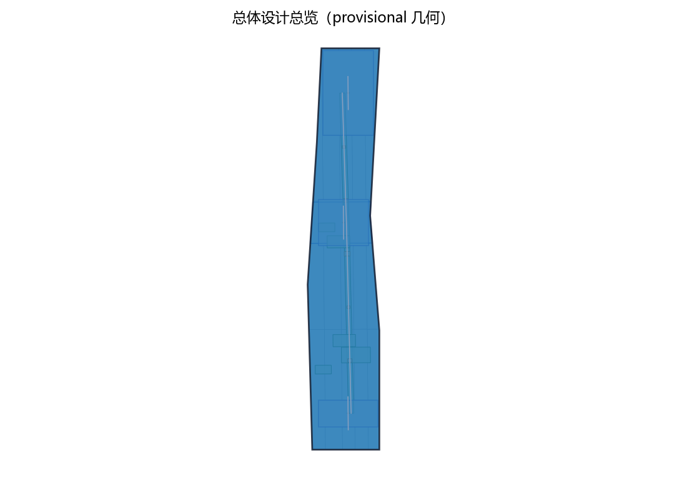
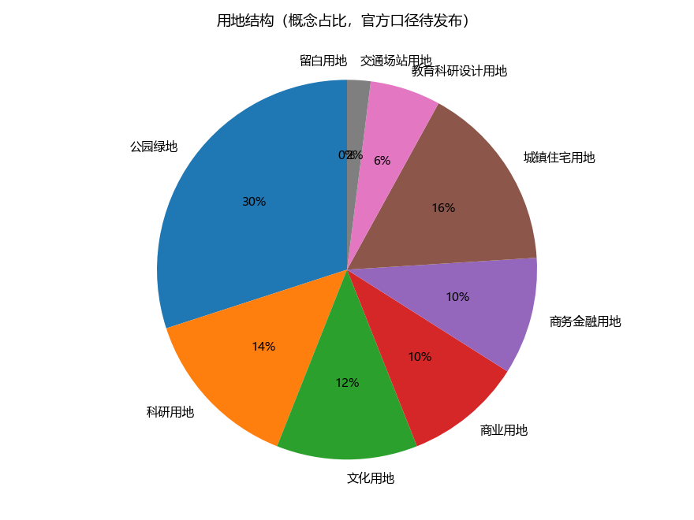
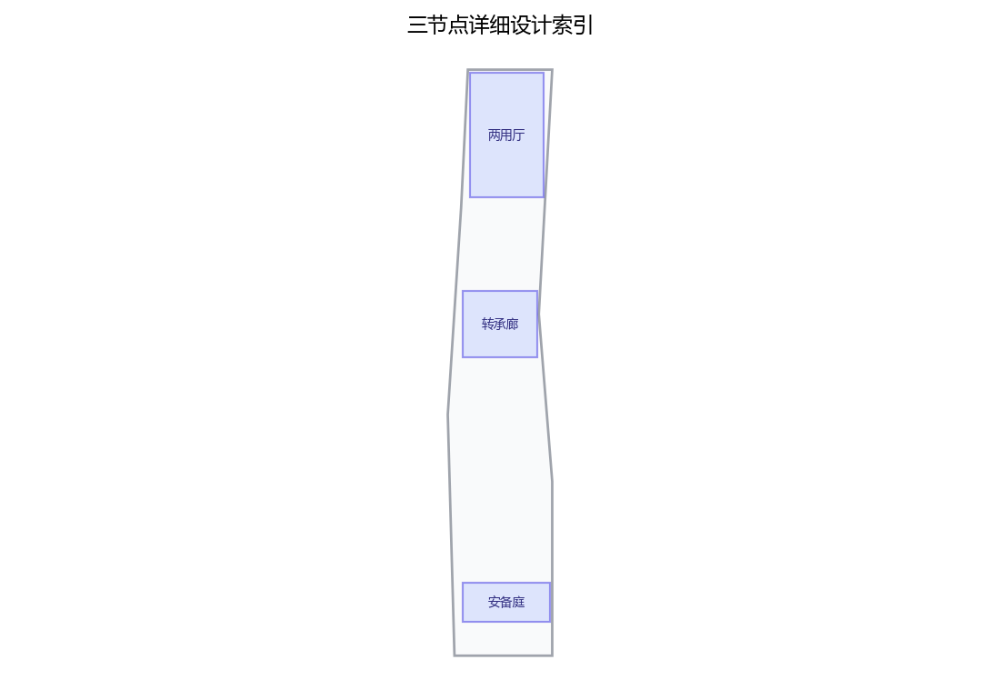
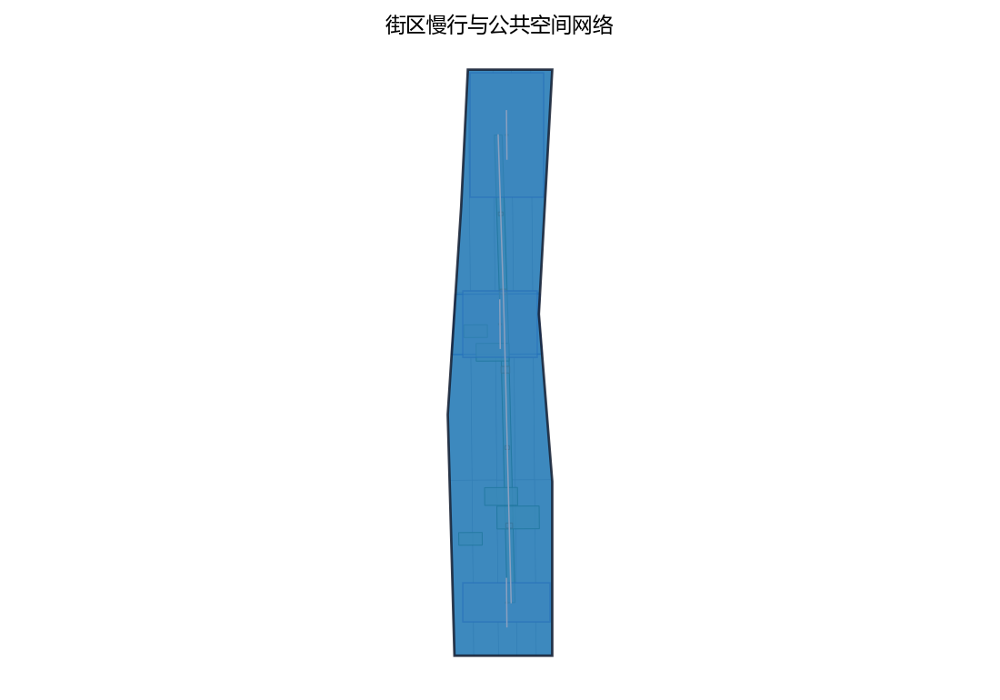
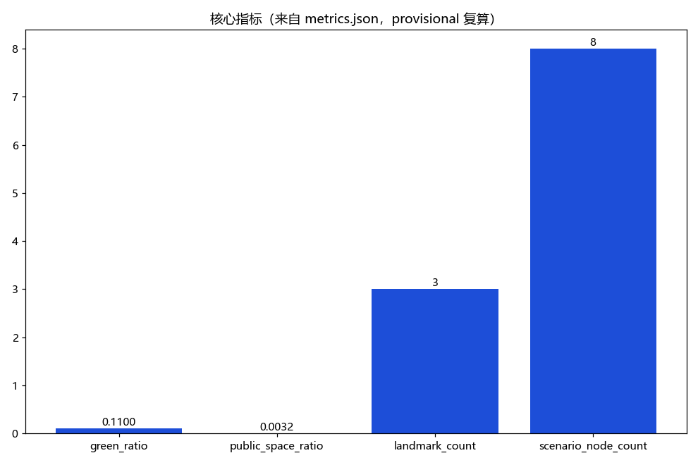

## 「京张AI创新带（京张铁路文化—中关村创新—AI新质生产力融合创新带）」国际征集 · 概念方案草案（概念级 · provisional边界 · 不虚构官方数据）

> **补充（概念口径）**：本节设计意图——以「平急两用空间体系」为主线组织平急转换、应急预置与韧性空间，将两用节点、转换网络与蓝绿开敞空间作为统一体系表达；证据——本包 geometry 层（site_boundary/key_areas/land_use/roads/public_space 等 GeoJSON）、metrics.json 与矩阵 JSON 均为机器可读证据，正文以证据锚点标注；几何/指标含义——所有数值基于 provisional 边界，不预设官方数值，官方控规与测绘数据发布后逐项复核复算；数据缺口——现状建筑年代、产权与结构鉴定、应急管理台账、文保线索逐栋核查均未获取，已在 assumptions.json 与缺失数据说明中如实登记。

> **证据锚点**：[source:DATA-SRC-OFFICIAL-ANNOUNCEMENT-20260509]（组织方公开口径依据）；[data:PACKAGE-GEOMETRY]（几何边界来自本包 geometry/site_boundary.geojson）。

## 方案名称与总体构想（概念）

方案主名称：**平急融环（DUAL·JZ）——平急两用空间体系**。"融环"取"平时功能与应急功能兼容转换、环环相扣、弹性生长"之意：以京张铁路遗址公园绿带为脊、轨道站城统筹节点为扣，将平急两用能力嵌入日常城市空间，形成"平时可运营、急时可转换"的韧性城市骨架。总体构想：以**预置—转换—调度—感知**为闭环逻辑，沿绿带布局三个原创概念节点——**两用厅（Dual-Use Hall）**、**转承廊（Convertible Gallery）**、**安备庭（Resilience Court）**，分级落实平急转换、应急预置、避难空间三大能力；配套**平急转换调度AI、应急资源预置AI、人流疏散推演AI、两用设施体检AI、公众应急反馈AI**五大AI+场景，形成可复制的平急两用空间范式。

## 设计依据与资料清单
资料清单所列公开史料、规划报道与通则规范等均为概念工作依据清单，并非本包已获取的数据；本包实际使用的全部数据见 sources.json，未获取项已在风险与缺失数据说明中如实标注。

设计依据包括：国家关于平急两用公共基础设施建设、韧性城市、城市更新与防灾减灾的相关政策导向，京张铁路遗址公园相关规划研究，沿线轨道站城一体化资料，以及海淀区控规与专项规划成果。资料清单（概念级）：现状地形与用地权属、轨道线站位与断面、绿带及慢行系统现状、市政管网与应急设施分布、人流活动与时序数据、灾种风险评估等。本草案边界一律按provisional处理，不虚构官方数据，全部数据待甲方正式提供后复核替换。

> **证据锚点**：[source:DATA-SRC-OFFICIAL-ANNOUNCEMENT-20260509]、[source:DATA-SRC-AGENT-TASKBOOK-20260518]（组织方公告与任务书为文本口径依据）。

## 三层范围工作框架
三层成果逐级传导：统筹研究输出的平急两用环境与沿线协同判断约束总体设计，总体设计校核的两用节点布局、转换网络与时序生长落实到节点详设；每层均保留与任务书对应章节的机器可读证据锚点，便于评审对照。

构建"**统筹研究范围—总体设计范围—重点区域详细设计**"三层递进框架。统筹层：面向京张AI创新带全域，开展产业与未来城市研究；总体层：以控规深度开展总体城市设计，落实平急两用空间体系与单元划分；重点层：选取两用厅、转承廊、安备庭各一处示范地块深化详细设计。三层共享同一底图与平急两用指标体系，逐层深化、滚动修正，成果边界均标注provisional，随资料完善迭代。

> **证据锚点**：[source:DATA-SRC-AGENT-TASKBOOK-20260518]（三层范围划分依据任务书官方文本口径）。

## 统筹研究范围产业与未来城市研究
产业与城市研究识别平急两用的「适配」效应：以转换枢纽与开敞网络把沿线高校、科创片区、轨道站点与住区的日常活力与应急需求有序组织为双向可达的韧性环境单元，形成「两用节点—科创片区—住区」三级联动结构；未来城市研究仅作方向性预判，不构成对用地与投资的承诺。

统筹研究范围内，研判AI新质生产力集聚方向，识别"研发—中试—场景应用—应急服务"产业链条，围绕轨道站城统筹形成多中心组团。提出未来城市愿景：以平急融环为韧性骨架，产业空间与应急空间复合布置，预留弹性用地；研究人口与就业分布、职住平衡与应急人口承载力，为应急预置规模与避难容量测算提供依据，并预判AI产业对空间使用模式的长期影响。

> **证据锚点**：[source:DATA-SRC-PROVISIONAL-BOUNDARIES-20260605]（边界为 provisional，研究范围仅作概念示意）。

## 总体设计范围城市更新与控规深度城市设计
总体设计强调「以绿带为骨架的平急两用环境」：依托京张铁路遗址公园绿带组织两用节点、转换网络与慢行骨架，两用设施可逆生长、街道可分时响应平急需求；强调更新而非新建，优先利用存量空间植入两用功能；对控规指标只做校核建议，不预设数值结论。

在总体设计范围内开展城市更新体检评估，划定更新单元，衔接控规地块指标与城市设计导则。以京张铁路遗址公园绿带为脊，组织"绿带—街区—社区"三级平急转换体系：**两用厅**落位于站城节点，承担平急转换调度与物资预置；**转承廊**依托街道断面与桥下空间形成转换廊道；**安备庭**深入社区作为应急庭院。体系强调**交通慢行**优先，绿带两侧慢行网络与应急通道兼容并线，平时保障日常出行，急时快速变更为疏散与救援路径。

> **证据锚点**：[source:DATA-SRC-MOHURD-CONTROL-DETAILED-PLANNING]、[source:DATA-SRC-PROVISIONAL-BOUNDARIES-20260605]。

## 重点区域详细设计
三节点的设施选址均为概念点位，须经规划、应急、文保与主管部门评估及专业审查后重新落位；节点间的绿带动线与慢行通道构成完整平急动线，详细平面与剖面以图册与 geometry 层表达。

**两用厅（Dual-Use Hall）**：以站城一体化大厅为核心，平时为公共服务、科创展示与换乘空间，急时经预制接口与可逆隔断快速转换为物资集散与应急调度枢纽。**转承廊（Convertible Gallery）**：街道断面预留可变段，桥下空间预置模块化仓储与临时庇护单元，平时为展廊、休憩与商业空间，急时一键展开为庇护与物资通道。**安备庭（Resilience Court）**：社区广场兼作避难场地，预置应急供水供电与物资点位，平时为儿童活动与邻里交往场所，实现"一院两用、常备不懈"。

> **证据锚点**：[data:PACKAGE-GEOMETRY]（三节点示意多边形来自本包 geometry/key_areas.geojson）。

## AI 创新生态、人才画像与 AI+ 场景
平急转换调度AI、应急资源预置AI、人流疏散推演AI为主干场景，每处均配置人工复核兜底；两用设施体检AI、公众应急反馈AI为支撑场景；仅处理匿名聚合数据、关键决策人工复核双保险，不设过度监控；平急两用为概念性机制建议，不替代法定应急管理与防灾职责。

依托京张AI创新带集聚AI企业与复合型人才，人才画像涵盖城市规划、应急管理、AI工程、社区运营等类型，形成"算法—数据—场景"闭环。五大AI+场景：①**平急转换调度AI**——空间状态识别与转换流程编排；②**应急资源预置AI**——基于风险与人口数据的物资预置优化；③**人流疏散推演AI**——平时活动与急时疏散双模推演；④**两用设施体检AI**——结构、设备与接口常态化监测；⑤**公众应急反馈AI**——匿名聚合公众意见，经人工复核后闭环处置，明确禁止过度监控，恪守数据最小化与隐私边界。

> **证据锚点**：[source:DATA-SRC-GENERATIVE-AI-INTERIM-MEASURES]（AI 生成内容治理表述的参照依据）。

## 用地、建筑规模与拆改留方案
拆改留坚持留改拆并举：以留为主保留遗址公园肌理与铁路历史遗存，存量建筑功能置换并预留两用化改造方向（转换接口、物资预置），拆除仅限经个案论证的局部疏通慢行零星建筑；全部面积为概念口径，官方数据发布后复算。

概念阶段不虚构数据，仅给出原则性框架：以现状体检为基础，形成"拆、改、留"三类清单策略，优先保留与改造、严控拆除规模；两用设施增量以预留接口、可逆改造与复合利用为主；绿带两侧土地复合利用，应急用地与公共绿地兼容设置；各类用地与建筑规模待实测后复算，并随控规衔接校核。

> **证据锚点**：[source:DATA-SRC-MNR-LAND-USE-CLASSIFICATION-202311]（用地分类名称参照现行国标口径）。

## 交通、轨道、市政与公共服务设施
以交通慢行优先为核心组织交通概念机制：日常慢行网络与应急疏散通道兼容设计，沿绿带构建连续慢行轴贯通两用厅、转承廊与安备庭，街道断面按平急需求分时响应（日常、节事、应急模式），衔接沿线高校、园区与轨道站点（接驳以步行与骑行为主），应急场景下开敞通道与绿带可转为疏散与集散场地、分时分区疏导；市政以集约共享为原则，两用设施与建筑一体化概念、优先利用现状设施条件；公共服务配置多语服务、平急两用展示与研习空间，AI决策均设人工复核。

坚持轨道站城统筹与**交通慢行**优先：依托轨道站点组织"最后一公里"慢行接驳，绿带内构建连续慢行主廊，兼顾应急车辆通行要求；市政设施按平急两用标准预置接口，应急供水、供电、通信与物资仓储结合转承廊桥下空间布置；公共服务设施分级配置，平时服务居民，急时一键转为应急服务点，实现设施复用、投资增效。

> **证据锚点**：[source:DATA-SRC-MOHURD-URBAN-DESIGN-MEASURES]（市政与慢行设计表述的方法参照）。

## 蓝绿空间、公共空间与城市风貌
构建「绿带为轴、节点公园为珠」的蓝绿公共空间体系：以遗址公园绿带为蓝绿骨架串联沿线小微绿地与开敞空间，开敞绿地兼作应急避难与物资集散场地，形成连续生态与公共空间体系；两用设施与公园融合布置、宜轻宜透宜可逆，不遮挡历史遗迹与绿带视线；指示与解说系统统一克制；风貌延续京张铁路工业记忆语汇并与韧性有序的新氛围对话，整体风貌导控克制统一，避免符号堆砌与口号化包装。

以京张铁路遗址公园绿带为核心，构建**蓝绿公共空间**网络，串联沿线绿地、广场与水系空间，形成"蓝绿公共空间＋应急避难空间"复合体系；公共空间预留平急转换界面与应急标识，风貌延续京张铁路文化记忆，融合科创现代意象，塑造可识别、可导向、有归属感的城市界面。

> **证据锚点**：[source:DATA-SRC-MOHURD-URBAN-DESIGN-MEASURES]（蓝绿空间组织的方法参照）。

## 更新项目清单、实施政策与分期计划
四类项目清单（两用厅试点/转承廊贯通/安备庭织补/平急转换平台上线）为概念清单，规模与投资估算均为建议性表述；政策建议（平急转换导则、多元主体共建、意见复核机制）均须依法依规论证，不构成政府或运营方承诺。

按"近期示范—中期成网—远期成环"分期实施：近期建成两用厅与安备庭示范项目，出台平急转换设计导则与运营、产权激励政策；中期完成转承廊体系与AI平台建设；远期实现平急融环整体贯通。项目清单以行动表格形式动态维护，与控规、专项规划滚动衔接，明确实施主体与资金来源建议。

> **证据锚点**：[source:DATA-SRC-AGENT-TASKBOOK-20260518]（分期与实施条目对应任务书要求）。

## 指标体系、面积复算与合规矩阵
平急转换响应时间、两用设施覆盖率、开敞避难场地可达率、应急物资预置率、平急演练参与人次五类概念指标体系进入 metrics.json；面积复算以官方文本口径为底，官方数据到位后整体复算并标注复算版本。

建立平急两用指标体系：涵盖平急转换时间、应急避难人均面积、物资预置覆盖率、慢行网络连通度、蓝绿公共空间比例、AI场景覆盖率等。面积复算采用"现状实测＋标准校核＋规划校核"三线并行，随资料完善更新。合规矩阵对标上位规划、控规与各类专项要求逐项核对，标注"符合／待协调／留白"，确保方案可审查、可落地。

> **证据锚点**：[metric:green_ratio]、[metric:public_space_ratio]、[source:PACKAGE-GEOMETRY]。

## 风险、版权与合规说明
本方案为概念研究性设计，不构成行政审批依据，也不构成容积率、建筑高度、拆改留或工程可行性结论；风险已按应急数据隐私边界、平急转换实施复杂度、应急演练与日常运营协调、两用设施与街区活力接受度四维度如实登记于 risk.json（应对原则：匿名聚合、最小必要、人工复核、来源标注与意见通道）；引用公开资料均已标注来源并注明获取时间，图形、名称与文字为原创或公共领域素材，若与既有标识雷同属巧合；平急表达不歪曲历史事实，未经授权不使用肖像商标论文图像等版权材料；正式实施前须完成多部门联审、应急管理、文物保护与安全评估。

本草案为概念级成果，边界provisional，规模指标均为概念判断，最终以正式招标文件与实测数据为准；应急感知体系仅做匿名聚合与人工复核，明确禁止过度监控，符合数据安全与个人信息保护要求；引用既有规划成果之处均注明出处，不虚构官方数据；文本与图纸权益按征集规则处置，方案风险集中于数据缺失与政策变化，将通过滚动校核机制管控。

> **证据锚点**：[source:DATA-SRC-OFFICIAL-ANNOUNCEMENT-20260509]（征集规则为权属与合规表述的依据）。

## 参考资料
参考资料以政府正式发布版本为准，按公开/内部分类存档并标注获取时间：京张铁路历史与遗址公园公开材料（含詹天佑与京张铁路公开史料口径）、北京城市总体规划及分区规划公开口径、应急管理与防灾减灾公开规范口径（平急两用与韧性城市导则类）、国内外平急两用与韧性空间公开案例（日本防灾公园、美国社区韧性中心及北京、上海、深圳平急两用实践）、现场踏勘记录与自绘分析草图（本项目自行采集）；本包 sources.json 仅收录可查证条目，未虚构任何官方数据或链接。

（概念级，待核实补充）国家及北京市平急两用公共基础设施、韧性城市、城市更新相关文件；京张铁路遗址公园相关规划与研究；海淀区控制性详细规划与城市更新专项成果；轨道站城一体化研究；防灾减灾、海绵城市专项规划；公开应急管理标准与设计导则。

> **证据锚点**：[source:DATA-SRC-OFFICIAL-ANNOUNCEMENT-20260509]（本清单首条即组织方公开资料包）。