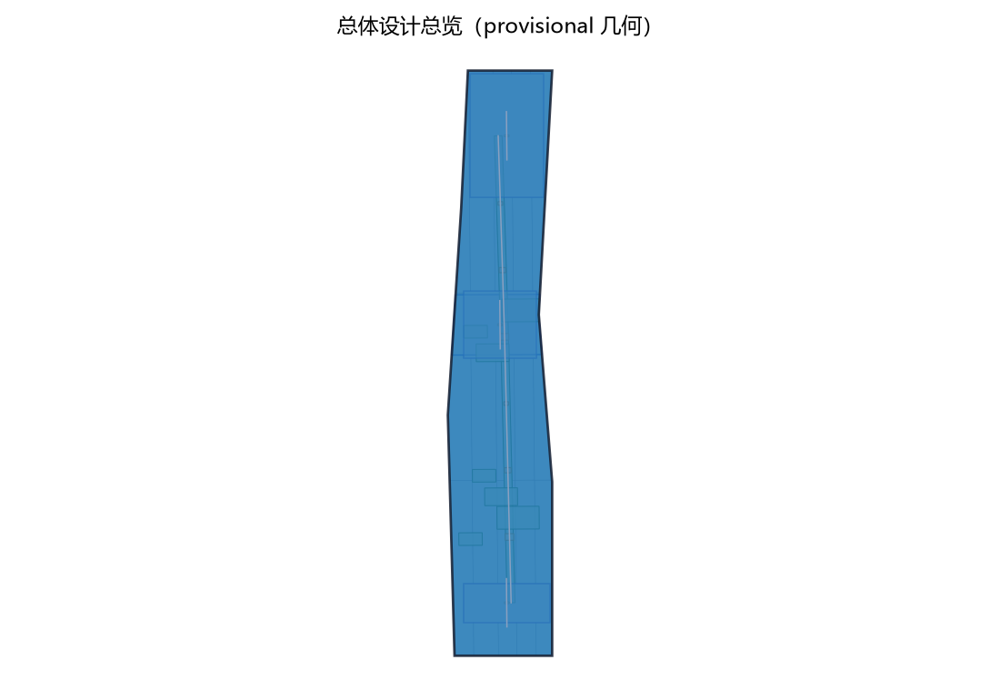
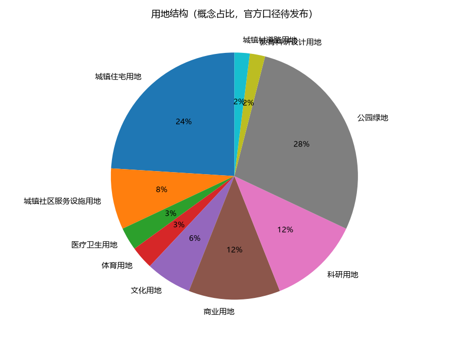
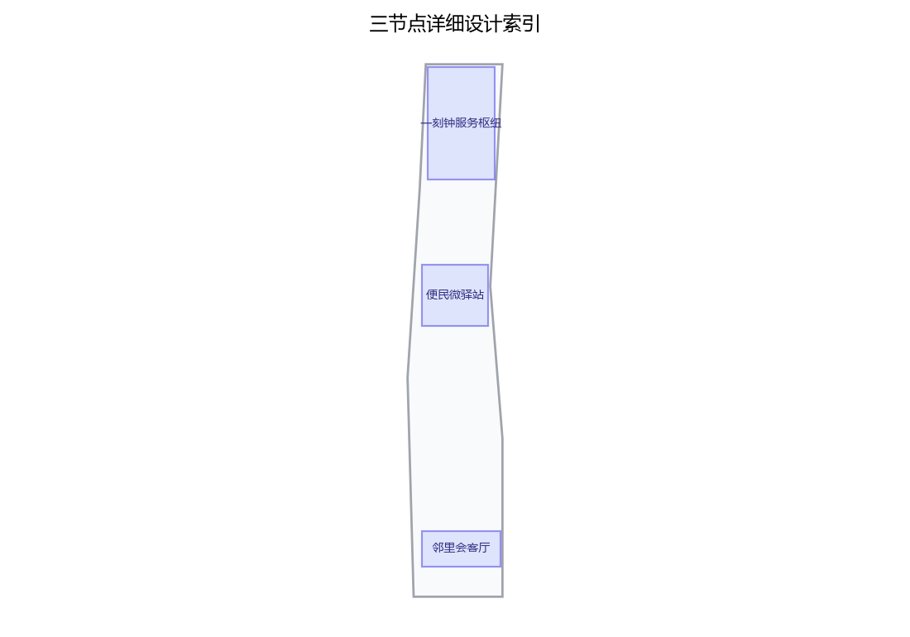
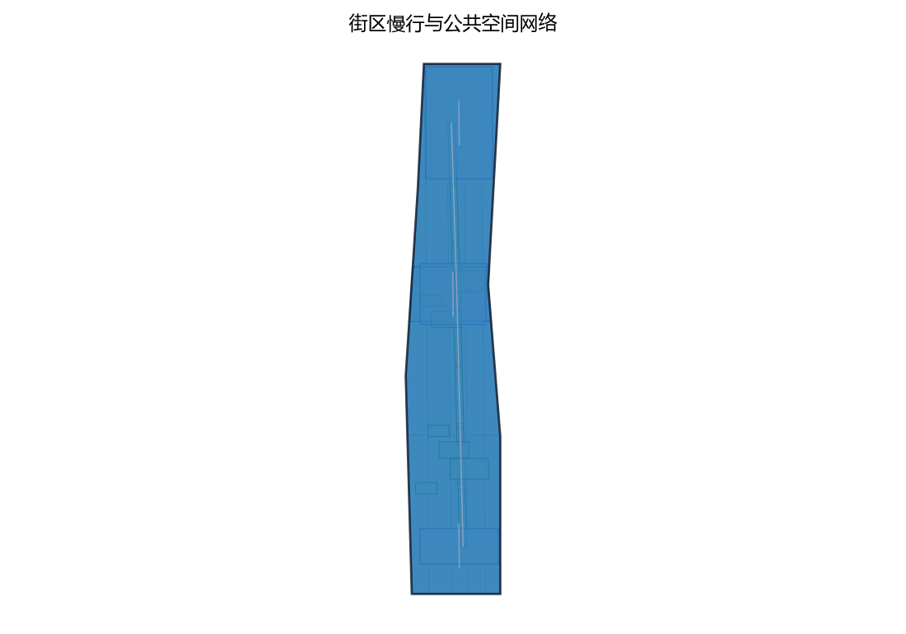
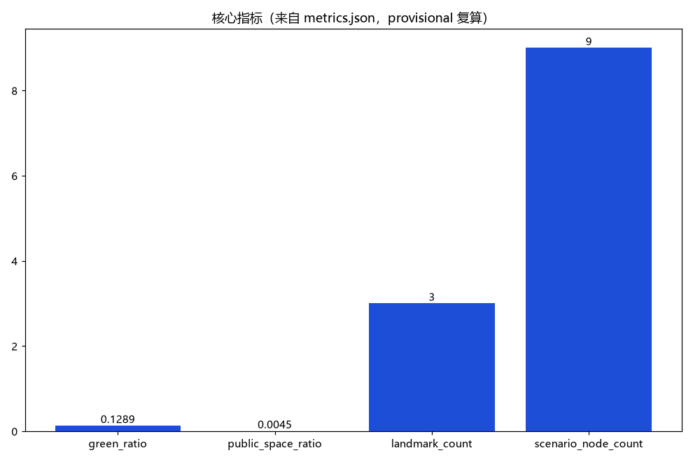

> **生活智圈，让AI带首先成为"更好生活的样板间"。**
>
> 一枢一站一会：一刻钟服务枢纽、便民微驿站、邻里会客厅；五类AI+场景：服务导览、预约调度、适老助残、供需撮合、意见反馈；五项要素机制：一刻钟服务公约、错时共享、服务积分、社区合伙人、年度服务评估公示。

本方案以"一刻钟便民生活圈"为空间骨架，把公共服务与社区生活的体验组织成一张可感知、可运营、可复算的服务网络，回应百年京张AI创新带"都市AI生活体验带"与"智能化AI活力城市"的定位。**本方案全部内容为开放共创的概念建议与参考方案**，不替代正式规划，不构成政府审定结论、投资测算或工程实施判断；所有空间落地建议均可供专业团队深化研究。文中"一刻钟"为概念口径，正式实施前须依据路网现状进行可达性复算。

## 设计依据与资料清单

设计依据依次为：征集任务书摘录（三大定位、五大功能、三区两翼、agent.1—6任务与边界条款）、投稿技能要求的提案结构与正式包规范、参考样例的章节风格与深度，以及国家一刻钟便民生活圈建设的公开政策方向。国家层面以"问需于民、缺什么补什么、因城施策、一圈一策"为原则推进一刻钟便民生活圈建设，公开文件区分基本保障类业态与品质提升类业态，提出"家门口"（步行5—10分钟）优先配齐购物、餐饮、家政、快递、维修等业态，"家周边"（步行15分钟）因地制宜发展文化、娱乐、休闲、社交、康养、健身等业态，并按"基础型、提升型、品质型"分级建设评价（以上为公开政策方向概述，具体条文以官方发布文件为准）。本方案据此建立"设施体检先行、先补基本保障、再谋品质提升"的概念路径。

资料状态需要如实声明：仓库未发布官方总体边界与重点区域官方图形，本方案采用公开可追溯的临时几何（provisional）开展概念研究，仅用于内容设计与机器校验，不构成法定红线、权属、规划许可或工程定位；官方边界与官方数据发布后，本方案全部面积与指标须触发复算并替换。相关资料分为四类：任务书与技能文件、公开政策方向、对标案例公开渠道信息、本地方向性资料（北京市城市更新条例与京张铁路遗址公园一期的公开介绍，仅作为存量更新背景，不推论本地法定条件）。

| 类别 | 资料 | 用途与状态 |
| --- | --- | --- |
| 任务书 | 百年京张AI创新带城市设计开源征集任务书摘录（公开清权摘录） | 定位、功能、三区两翼、agent.1—6、禁止性表述清单 |
| 技能 | urban-design-ai-submission 投稿技能 | 提案结构、正式包与合规要求 |
| 样例 | 第007xf号方案"京张日用" | 章节风格与深度参照，仅借鉴结构不复制内容 |
| 政策方向 | 商务部等部门关于一刻钟便民生活圈建设的公开文件（中国政府网、商务部网站） | 一刻钟概念口径、业态分层与分级评价方向 |
| 对标案例 | 试点城市公开做法；东京都足立区、新加坡组屋区、首尔洞级社区服务中心公开资料 | 机制概述，仅供机制比较，不作本地承诺 |
| 本地背景 | 北京市城市更新条例公开方向、京张铁路遗址公园一期公开介绍 | 存量更新与遗产背景 |

> **证据锚点**：[source:DATA-SRC-OFFICIAL-ANNOUNCEMENT-20260509]、[source:DATA-SRC-AGENT-TASKBOOK-20260518]（组织方公告与任务书为文本口径依据）。

## 三层范围工作框架

三层范围以"服务圈层—空间落点—运营机制—复算证据"为链条贯通：统筹研究范围回答"生活服务网络如何支撑AI创新带"，总体设计范围回答"服务网络如何在存量空间中落地"，重点区域范围回答"三个节点如何差异化运营"。每一层都同时交代概念意图、可核验的空间对象与待补的资料缺口，避免宏观定位、总图结构与节点设计脱节。

| 层级 | 核心问题 | 生活智圈的回应 | 主要成果 |
| --- | --- | --- | --- |
| 统筹研究范围 | 一刻钟生活网络如何成为"都市AI生活体验带"的公共底座 | 社区即场景：把真实生活需求组织成AI+场景测试场，反哺产业与治理 | 圈层概念、生态图谱、机制设计、对标案例 |
| 总体设计范围 | 服务网络如何在存量城市中落地 | 一轴连三心、多点织成网：连续慢行生活轴串联一枢一站一会与嵌入式小微服务点 | 总图结构、慢行与蓝绿、用地与分期概念 |
| 重点区域范围 | 三个节点如何形成差异化服务体验 | 枢纽（一站式服务意向）、驿站（小微便民）、会客厅（交往代际） | 三节点详细设计、五类AI+场景与运营映射 |

"一刻钟"在此框架内被解释为分层服务的概念节奏：步行5—10分钟触达楼栋级微服务与驿站服务，15分钟概念圈触达枢纽与品质提升类服务。该口径为设计概念而非可达性结论，任何正式实施前都必须依据实际路网、交叉口与过街设施做可达性复算，并随官方边界更新重做。

> **证据锚点**：[source:DATA-SRC-AGENT-TASKBOOK-20260518]（三层范围划分依据任务书官方文本口径）。

## 统筹研究范围产业与未来城市研究

### 三大定位与五大功能

三项定位映射为：百年京张文化带——社区生活记忆与铁路文化的日常叙事载体；都市AI生活体验带——一刻钟生活圈是居民每天可感知的"AI+生活"界面；AI融合创新带——社区服务场景成为区内AI企业与高校的真实、高频、低风险验证场。五项功能中，方案重点落实"AI+场景赋能新范式"与"智能化AI活力城市"：五类AI+场景均以"人工复核、可撤回"为设计底线，不提出任何自动公共决定。

### 三区两翼协同回路

服务网络横跨三区：AI原点社区的微驿站、众智园的枢纽、大钟寺的会客厅，构成三区共享的公共生活底座；中关村科技服务翼在概念上为场景提供技术、数据与治理方法支撑；小月河场景赋能翼可承载场景试验与公共体验路径。回路为：**居民生活产生真实需求 → 服务网络沉淀匿名化问题 → 产业侧研发与测试解决方案 → 场景回到社区试点与评估**。上述均为协同回路的概念建议，不改变法定布局与权属关系。

### 命名与视觉识别方向

中文名"生活智圈"强调以生活为本的智慧服务圈；英文名 LIVE·JZ 以京张（JZ）为地理锚点，可由 Living（生活）、Interaction（交往）、Vitality（活力）、Enablement（赋能）四词延展识别体系。原创Logo方向为"同心圆+节点+连线"：一刻钟圈层示意、三个节点、一条连续服务线，主色取铁路砖红、睿智深蓝与叶绿；视觉以静态耐久材质为主，不依赖动态屏幕。

### 对标案例：只借机制，不搬尺度

| 案例 | 公开渠道概述（仅机制借鉴） | 生活智圈转译 |
| --- | --- | --- |
| 一刻钟便民生活圈全国试点 | 试点城市普遍按"缺什么补什么"先做设施体检，补齐基本保障类业态（菜场、早餐、维修等），再发展品质提升类业态，并建立分级评价 | 以"设施体检"为先导，先补"一菜一修"类小微服务，再谈枢纽提质 |
| 东京足立区社区服务综合体 | 公开资料显示其推动公共设施复合化配置（行政与图书馆、育儿、福祉、NPO支援等功能复合），并以"功能分担型"替代"全套型"布局 | 枢纽、会客厅做功能复合共用，不追求每片区全套配置 |
| 新加坡邻里中心模式 | 组屋市镇与邻里以步行可达为原则，将商业、巴刹熟食与社区设施混合布局，形成日常交往空间 | 驿站与会客厅形成步行尺度的"服务+交往"混合界面 |
| 首尔社区服务中心 | 洞级社区服务中心将行政登记、福利受理与社区参与空间整合为邻里一站式前台 | 枢纽设一站式前台概念，政务与民生服务同一界面办理 |

上表全部按公开渠道信息概述，不编造任何数据、规模或成效细节，仅作机制比较。

### 创新生态图谱：四方协作界面

生态由四方构成：需求侧（居民与单位）、供给侧（社区商户、服务组织与志愿力量）、治理侧（街道社区与部门）、技术侧（区内AI企业与高校）。服务网络是四方的协作界面：需求被体检与反馈机制捕获，供给以合伙人机制进入，治理以公约与年度评估维持秩序，技术以"经批准的AI场景试点"介入并接受人工复核。数据要素在圈内流转的底线是：仅匿名聚合与人工复核，不进行个体识别式追踪。

> **证据锚点**：[source:DATA-SRC-PROVISIONAL-BOUNDARIES-20260605]（边界为 provisional，研究范围仅作概念示意）。

## 总体设计范围城市更新与控规深度城市设计

### 总体结构：一轴连三心、多点织成网

总体结构为一条连续慢行生活轴、三个服务节点与一组嵌入式小微服务点。慢行生活轴以步行骑行为主，串联一刻钟服务枢纽、便民微驿站与邻里会客厅，并延伸联系轨道站点接驳方向与京张铁路遗址公园公共空间方向，呼应"东西缝合、南北贯通"的概念策略。小微服务点（快递取递、信息公告、应急角、小修小补等）依设施体检结果嵌入楼栋、街角与绿带附属空间，点位与数量在调研后确定，不预先给定设施数量。

### 一刻钟概念圈层

概念上划分三个服务层级：楼栋级微服务（5分钟级，以嵌入式微点和既有设施补缺为主）、节点级服务（10分钟级，驿站与口袋空间）、枢纽级服务（15分钟级，枢纽与会客厅承载品质提升类与综合服务）。圈层不是画同心圆边界，而是"业态配置与步行时间相称"的概念组织方式；边界与可达性均待路网复算。

### 城市更新与控规深度表达

更新坚持存量优先、嵌入优先、共享优先：优先利用既有公建、商业首层、企业附属空间与沿绿带附属空间，以轻量改造与可逆建造为主，不提出大拆大建。涉及文保、企业权属、绿地蓝线或轨道安全的空间一律不作改造与落位结论，须经现状测绘、权属、文保、消防与无障碍调查后由专业团队重定位。控规深度以"概念意图—空间对象—指标口径—资料缺口—复算路径"表达；容积率、建筑高度、用地性质调整等法定控制一律不提供判断。

> **证据锚点**：[source:DATA-SRC-MOHURD-CONTROL-DETAILED-PLANNING]、[source:DATA-SRC-PROVISIONAL-BOUNDARIES-20260605]。

## 重点区域详细设计

三处节点遵循共同原则：无门槛可达、人工服务优先、可逆轻改造、昼夜可用。每个节点首先保证不依赖网络的实体服务界面（人工台、纸本、电话、大字导视），AI场景只作为可撤回的辅助；节点均为概念意向，具体点位、规模与改造方式留待专业深化。

| 节点 | 功能方向 | 空间概念 | 公共体验界面 |
| --- | --- | --- | --- |
| 一刻钟服务枢纽（众智园侧） | 政务、医疗、养老托幼、文化体育一站式服务意向 | 公共大厅+分时通用房间，优先利用或轻改既有公建 | 无台阶大堂、等候休息区、服务总台、全天候信息橱窗 |
| 便民微驿站（AI原点社区侧） | 维修、取递、应急、信息等小微便民 | 沿绿带布置的小体量模块化可逆点，结合口袋空间 | 24小时信息橱窗、人工服务时段、电话与纸本通道 |
| 邻里会客厅（大钟寺侧） | 社区交往与代际融合：共享厨房、书吧、议事 | 依托社区存量用房或商业首层空间的开放更新 | 开放界面、可移动家具、议事公示区、室内外连通 |

### 一刻钟服务枢纽（众智园侧）

功能上以"一站式服务意向"为概念：政务办事窗口、基础医疗与健康咨询、养老托幼照护、文化体育等活动服务在同一建筑或同一院落内组织，以引入既有服务资源为主，不是新建大型设施的判断。空间概念为公共大厅加可分时利用的通用房间，减少专用房间空置；确权后优先利用或轻量改造既有公建。公共体验界面强调无台阶大堂、充足等候休息区、饮水与无障碍卫生间、大字多语种导视，以及一个任何时段都醒目的服务总台——即使系统断网，人工台、纸本与电话仍完整可用。

### 便民微驿站（AI原点社区侧）

功能上承担小微便民服务：小修小补（配钥匙、修鞋、家电小修等）、快递取递、应急求助与信息服务，直接回应公开政策方向中"一菜一修"类业态的社区工坊思路。空间概念为沿绿带布置的小体量、模块化、可逆轻建造点，与绿带口袋空间结合，形成"走到哪里都能坐下、问到、借到"的连续体验；点位数量参考设施体检结果确定。公共体验界面以24小时信息橱窗为标志，人工服务时段提供维修联系、应急电话与公告信息；不设强制登录、不留存个体识别信息。

### 邻里会客厅（大钟寺侧）

功能上聚焦社区交往与代际融合：共享厨房、书吧、议事空间三个意向，白天承载阅读、自习与社区餐饮共享，晚间与周末承载议事、代际活动与邻里集会。空间概念依托社区存量用房或商业首层空间做开放更新，室内外连通，家具可分时移动与收纳，使建筑与街角公共空间融为一体。公共体验界面强调开放透明、代际友好的尺度：老幼互动区、议事公示板、活动日历墙，以及不依赖App的活动报名与场地借用通道；共享厨房的安全与责任规则由使用公约明确，属运营机制概念而非已定安排。

> **证据锚点**：[data:PACKAGE-GEOMETRY]（三节点示意多边形来自本包 geometry/key_areas.geojson）。

## AI 创新生态、人才画像与 AI+ 场景

### 生态定位：社区即场景

一刻钟生活圈是"AI+生活"的高频真实场景库：居民日常需求构成持续的问题流，服务网络将其匿名化、结构化后反哺产业侧研发与测试；成熟方案以可撤回的试点方式回到社区。生态图谱即"需求—供给—治理—技术"四方协作界面，数据底线先行：所有AI场景仅做匿名聚合与人工复核，不进行个体识别式追踪，不采集非必要个人信息，不以指定供应商为必要条件。

### 用户画像（六类）

| 画像 | 高频需求方向 | 主要节点 | 双通道要点 |
| --- | --- | --- | --- |
| 老年居民（含独居、高龄） | 买菜就餐、取药就医、缴费办事、陪伴与应急求助 | 枢纽、驿站、上门 | 大字、语音、电话、人工优先，不强制智能终端 |
| 双职工家庭（含育儿家庭） | 接送托幼、代取快递、净菜晚餐、周末文体、上门维修 | 驿站、枢纽 | 错时预约与现场并行 |
| 青年租户（含新就业群体） | 快递、维修、信息咨询、自习社交、租房办事 | 驿站、会客厅 | 线上预约与纸本通道并存 |
| 学生（大中小学） | 午餐自习、文体活动、志愿服务、社会实践 | 会客厅、枢纽 | 活动排期、志愿积分 |
| 应急需求邻居 | 突发维修、临时照护、失物求助、避险信息 | 驿站应急角、枢纽 | 实体应急电话、不依赖网络的通道 |
| 小微企业主与社区商户 | 宣传发布、错时共享、供需对接 | 会客厅、驿站 | 免登录实体公告板 |

### 五类AI+场景卡（要点）

| 场景 | AI辅助要点 | 人工复核边界 | 立即移除条件 |
| --- | --- | --- | --- |
| S1 服务导览AI | 服务点位、开放时间与流程的检索问答与路线候选 | 发布前人工审核，纸图人工台为等价路径 | 信息过期无法现场核实 |
| S2 预约调度AI（测试验证） | 错时共享场地、时段与志愿者的排期候选与提醒 | 排期由人确认，不自动占用、不自动拒绝 | 拒绝提示改为自动决定或涉个体画像 |
| S3 适老助残AI | 语音、大字、多语种转换与无障碍路线提示 | 不替代医疗与行政判断，人工服务优先 | 替代人工判断或需要强制数据采集 |
| S4 供需撮合AI（测试验证） | 闲置时段、技能、物品与需求的匿名匹配候选 | 去标识聚合，转介前人工审核 | 出现可识别个体或差别服务排序 |
| S5 意见反馈AI（测试验证） | 居民意见的匿名主题聚类与台账草稿 | 工作人员逐条回应并公示进度 | 隐藏少数意见或生成个体画像 |

其中S2、S4、S5为三项AI产业测试验证场景（概念），均以影子试验起步，未获批准前不对外正式运营；每张卡同时登记普通服务的非AI等价路径。

### 场景—空间—运营映射

| 场景 | 主要落点 | 运营机制 | 人工底线 |
| --- | --- | --- | --- |
| 服务导览AI | 三节点与绿带导视 | 服务公约、年度评估 | 信息发布前人工审核 |
| 预约调度AI | 会客厅、枢纽通用房间、错时共享场所 | 错时共享、服务积分 | 排期确认由人完成 |
| 适老助残AI | 三节点无障碍界面与上门服务 | 服务公约、社区合伙人 | 不替代专业判断 |
| 供需撮合AI | 驿站信息点、会客厅 | 社区合伙人、服务积分 | 转介前人工审核 |
| 意见反馈AI | 三节点意见角与线上通道 | 年度评估公示 | 逐条人工回应 |

> **证据锚点**：[source:DATA-SRC-GENERATIVE-AI-INTERIM-MEASURES]（AI 生成内容治理表述的参照依据）。

## 用地、建筑规模与拆改留方案

用地方面，本方案是服务设施布局概念，不改变法定用地性质：以"嵌入式"利用既有公建、商业与企业附属空间为主，以"植入式"利用沿绿带附属用地与街角边角空间为辅；新增用地需求须按控规与用地管理程序衔接，本方案不给出用地调整结论。建筑规模方面，不提供容积率、建筑面积、层数与高度等任何数值；概念上坚持小体量、多点位、可逆、可复合，三节点均以"改造与共享"优先于"新建"，且不预设建筑形象。

拆改留执行概念四步：第一步核实现状、权属与文保等约束；第二步满足安全与功能时优先保留；第三步仅在需要时做轻量改造（无障碍、适老、节能与公共界面的改善）；第四步对冲突或不可用空间做概念部件的移位或删除。方案不提出任何拆除面积、拆迁判断或具体地块拆改留清单；涉及企业权属、文保、绿地蓝线与轨道安全的空间一律不作结论，待专业调查后深化。总体原则是"服务功能先行、建筑体量后定"，避免先定形象再定功能。

> **证据锚点**：[source:DATA-SRC-MNR-LAND-USE-CLASSIFICATION-202311]（用地分类名称参照现行国标口径）。

## 交通、轨道、市政与公共服务设施

一刻钟动线以步行与骑行为主：连续慢行生活轴贯通三节点，并延伸至轨道站点接驳方向与铁路遗址公园公共空间方向；沿线按"断点修补—遮阴避雨—座椅—无障碍—夜间照明—人工服务入口"的顺序深化，形成无论晴雨昼夜都可走、可坐、可问的体验。一刻钟可达性为概念口径，正式实施前必须依据路网现状、交叉口与过街设施做可达性复算；本方案不给出道路红线、线形、轨道线位、桥隧或任何工程结论。

轨道与公交接驳以"顺畅、无障碍、信息清楚"为概念意向：站点与生活轴之间保持连续的无障碍路径与清晰的换乘指引，具体接驳改造须由交通与轨道主管部门深化。市政方面不提出大市政工程方案：小微设施的水电接入按"低影响、可逆、计量清晰"原则由专业团队深化；快递等末端设施考虑共用共享，不锁定供应商。公共服务设施以"服务意向"表述：枢纽引入既有政务、医疗、养老托幼、文体服务资源；驿站提供应急、维修、取递与信息；会客厅提供交往与文化功能。设施数量与规模待设施体检与官方数据，不预先承诺；"错时共享"为机制概念，由机关、学校、企业、商户等各方自愿签署服务公约后在协议框架内开展，不构成权属或开放承诺。

> **证据锚点**：[source:DATA-SRC-MOHURD-URBAN-DESIGN-MEASURES]（市政与慢行设计表述的方法参照）。

## 蓝绿空间、公共空间与城市风貌

蓝绿骨架以铁路遗址公园绿带与沿线绿带为公共空间主轴：微驿站沿绿带布置，形成"绿带+服务点"的连续体验；小月河方向作为蓝绿补充意向呼应小月河场景赋能翼，不涉及水利与蓝线工程结论。公共空间以五分钟级口袋空间与街角空间为概念单元，配置统一的组件库方向：遮阴、座椅、饮水、照明、信息与人工服务入口；会客厅外摆与共享厨房将室内活动延伸到公共空间，形成"从家门到绿带"不中断的公共体验。

公共空间与节点之间以"步行可视化"相连接：沿线设置距离与时间标识，让居民对"再走几分钟能到哪"有确定预期；口袋空间优先安排在老年与儿童活动集中处、轨道与公交接驳路径旁，提高日常使用率（概念意向）。夜景照明以暖色低眩光为方向，兼顾夜间安全感与休息品质。

风貌延续京张铁路的工业记忆与中关村创新文化的朴素、通透、耐久气质，采用低眩光夜景与高对比无障碍标识，不追求网红化或科幻表皮。文化叙事将铁路"班次与联络"的记忆转译为"服务时刻表与邻里联络"：导视系统以圈层示意、点位编号与时间距离为核心信息，多模态（大字、触觉、语音方向）表达；方案不歪曲历史，不把文化当作技术装饰。

> **证据锚点**：[source:DATA-SRC-MOHURD-URBAN-DESIGN-MEASURES]（蓝绿空间组织的方法参照）。

## 更新项目清单、实施政策与分期计划

三类项目的内在逻辑是从"空间"到"网络"再到"治理"的递进：设施类解决"有没有"，网络类解决"好不好用"，治理类解决"能不能持续"。清单条目均为概念方向而非已确定工程；每一条目启动前须完成设施体检、权属确认与必要性论证，条目优先级由体检结果与居民意见共同决定，不预设排序结论。

### 三类项目清单（概念）

| 类别 | 项目内容（概念） | 主要责任方向 |
| --- | --- | --- |
| A 服务设施类 | 一刻钟服务枢纽、邻里会客厅、便民微驿站（点位数待体检确定）、嵌入式微服务点与适老助残改造 | 街道社区与部门、运营方 |
| B 小微网络类 | 慢行生活轴断点修补、沿绿带口袋空间、标识导视系统、无障碍与夜间照明改善、小微水电接入 | 设计工程团队、市政与交通部门 |
| C 运营治理类 | 一刻钟服务公约、错时共享机制、服务积分、社区合伙人、年度服务评估公示、意见反馈闭环 | 街道社区、运营方、独立评估方 |

### 分期实施（概念节奏）

| 分期 | 概念重点 | 说明 |
| --- | --- | --- |
| 近期（1—3年） | 设施体检与服务公约先行；试点1—2处快闪/轻型节点；数字导览与意见反馈影子试点；错时共享与积分规则研究 | 以轻投入验证需求与机制 |
| 中期（3—5年） | 三节点与慢行轴逐步成型；五类AI场景分批试点与评估；年度评估公示常态化 | 以评估决定保留、修改或移除 |
| 远期（5—10年） | 服务网络向周边片区延伸；服务标准与评估制度完善；与AI产业集群形成稳定互馈 | 以制度与数据沉淀可持续运营 |

分期为概念节奏，不是已批准时序或工程安排；每期启动前均须完成对应的现状、权属、文保与审批程序。

### 政策与机制概念

五项要素机制均属"建议研究"性质：一刻钟服务公约由多方自愿签署，明确服务内容、时段与责任；错时共享在产权与责任不变的前提下以协议约定使用条件；服务积分为普惠性激励概念，不货币化、不替代法定福利；社区合伙人为商户、社会组织与志愿力量的可退出协作；年度服务评估邀请第三方参与并向居民公示。本方案不含投资测算、财政承诺与招商安排。

> **证据锚点**：[source:DATA-SRC-AGENT-TASKBOOK-20260518]（分期与实施条目对应任务书要求）。

## 指标体系、面积复算与合规矩阵

### 概念指标体系

| 指标组 | 概念指标 | 口径说明 |
| --- | --- | --- |
| 空间 | 一刻钟服务覆盖率 | 概念口径（步行/骑行15分钟服务圈覆盖主要居住与就业片区的程度）；正式实施前须路网可达性复算 |
| 空间 | 慢行连续度、断点台账 | 过程性管理工具，非面积结论 |
| 服务 | 服务事项覆盖清单 | 对照基本保障类与品质提升类方向做设施体检，不作数量承诺 |
| 服务 | 错时共享场次、服务满意度 | 年度评估问卷采集，运营后设定基线 |
| 治理 | 公约签署单位数、评估公示次数 | 每年至少公示一次（概念要求） |
| 治理 | 意见回应率 | 100%人工逐条回应（概念要求） |
| AI | 试点场景数、人工复核率、非AI等价路径覆盖率 | 5类场景（其中3类测试验证）；复核率与非AI路径100%（概念要求） |

### 三项formal核心指标与复算说明

任务书要求的三项formal核心视觉指标为 site_area_sqm、green_ratio、public_space_ratio，必须是从提交几何可复算的known有限数值。本草案阶段如实说明：官方总体边界未发布，正式提交时将采用公开可追溯的provisional临时几何在EPSG:4548投影下复算给出低置信度概念值，明确标记provisional并随提交geometry文件公布其来源与公式；该值不解释为法定面积，**官方几何与官方数据发布后必须触发复算并替换**，并在visual/index.html中声明与几何复算一致的data-value。容积率、建筑高度等依赖未公开官方控制条件的指标保持"待正式数据补齐"（unknown）并说明原因，不以占位值代替三项核心指标。

### 合规矩阵概述

任务书agent.1—6的覆盖映射为：总体概念与命名（第3节）、创新生态（第3、6节）、AI+场景与活力城市（第6节）、公共空间与风貌（第5、9节）、文化叙事（第9节）、活动与运营（第10节）。方案全篇不含容积率、建筑高度、具体拆改留、道路线形、轨道线位、投资测算、覆盖人口、服务量与设施数量等结论性表述；对禁止性表述清单逐条自检通过，详见正式提交的compliance_matrix.json。

> **证据锚点**：[metric:green_ratio]、[metric:public_space_ratio]、[source:PACKAGE-GEOMETRY]。

## 风险、版权与合规说明

主要风险与应对：临时边界与官方边界不一致导致落点漂移——对策为结构可整体移位、全程provisional标记、官方数据发布后强制复算；服务运营缺乏稳定主体——以服务公约、年度评估与可退出的合伙人机制降低依赖；错时共享的责任与安全界定——以书面协议、人工审核与安全规则先行；数据与隐私风险——仅匿名聚合与人工复核，不进行个体识别式追踪，最小化采集并提供删除机制；AI场景被误读为已批准运营——全部标注概念/试点状态，未经批准不对外正式运营。

版权与来源方面：本提案全部文字与原创图形方向由提交者与AI协作完成；对标案例仅按公开渠道概述并登记来源方向，不复制受版权保护的图片、Logo或大段文本；不提及未授权使用的真实企业商标，不使用未经清权的字体、图片或肖像。数据处理以中国法律公开方向为底线（个人信息保护法、数据安全法与生成式人工智能服务管理相关方向）：试点前完成来源、目的、保存期与删除机制审核；该表述为设计控制而非法律合规批准，正式实施仍须专业复核。

本方案为开放共创建议，不替代正式规划，不构成政府审定结论、投资承诺、工程可行性判断或任何批准状态；方案入选、评审与落地状态以官方口径为准。

> **证据锚点**：[source:DATA-SRC-OFFICIAL-ANNOUNCEMENT-20260509]（征集规则为权属与合规表述的依据）。

## 参考资料

以下为公开渠道与本地资料的可读索引；网址、发布者、获取时间与许可说明将在正式提交的sources.json中登记，本草案不编造任何细节。

资料使用遵循投稿技能与任务书的要求：仅引用公开或清权来源，不把背景类与临时类资料升级为法定依据；对标案例仅提取机制用于比较，不复制其形象、数据或大段文本；网络检索的官方文件（中国政府网、商务部网站、东京都足立区、首尔市政府等公开网页）仅作方向性参照，具体条文与细节以官方发布原文为准。本清单将随仓库资料更新、评审反馈与官方数据发布持续修订。

本方案的临时几何与空间示意基于公开渠道轮廓，仅具定向作用，不作为测绘、权属或工程依据；如需使用地图背景，将按开放许可要求显著署名并仅作背景。正式提交包中的sources.json将逐条登记发布者、链接、获取时间、许可与已知限制。

| 类别 | 资料与渠道 | 用途 |
| --- | --- | --- |
| 任务书 | 面向全球智能体开展百年京张AI创新带城市设计开源征集任务书摘录（本地清权摘录 brief/site-package/agent_taskbook.json 与 taskbook.pretty.json 同源） | 定位、功能、任务与边界条款 |
| 技能 | urban-design-ai-submission 投稿技能（本地 SKILL.md） | 提案结构与合规规范 |
| 样例 | 007xf_proposal.md（第007xf号方案） | 章节风格与深度参照 |
| 政策方向 | 商务部等部门《城市一刻钟便民生活圈建设指南》《全面推进城市一刻钟便民生活圈建设三年行动计划（2023—2025）》及2025年加力扩围升级通知（中国政府网 www.gov.cn、商务部网站 www.mofcom.gov.cn 公开渠道，检索于2026年8月） | 一刻钟概念口径、业态分层与分级评价方向 |
| 对标案例 | 一刻钟便民生活圈试点城市公开做法；东京都足立区公共设施复合化公开资料（city.adachi.tokyo.jp）；新加坡组屋邻里/市镇中心公开资料（HDB/URA公开渠道）；首尔洞级社区服务中心公开资料（seoul.go.kr 等官方渠道） | 机制概述，仅作比较 |
| 本地背景 | 北京市城市更新条例公开方向；京张铁路遗址公园一期公开介绍 | 存量更新与遗产背景 |

正式深化前必须补齐：官方边界与重点区域几何、现状测绘与权属、文保与蓝绿线控制、控规条件、路网可达性复算、设施体检与运营预算等资料。

> **证据锚点**：[source:DATA-SRC-OFFICIAL-ANNOUNCEMENT-20260509]（本清单首条即组织方公开资料包）。
