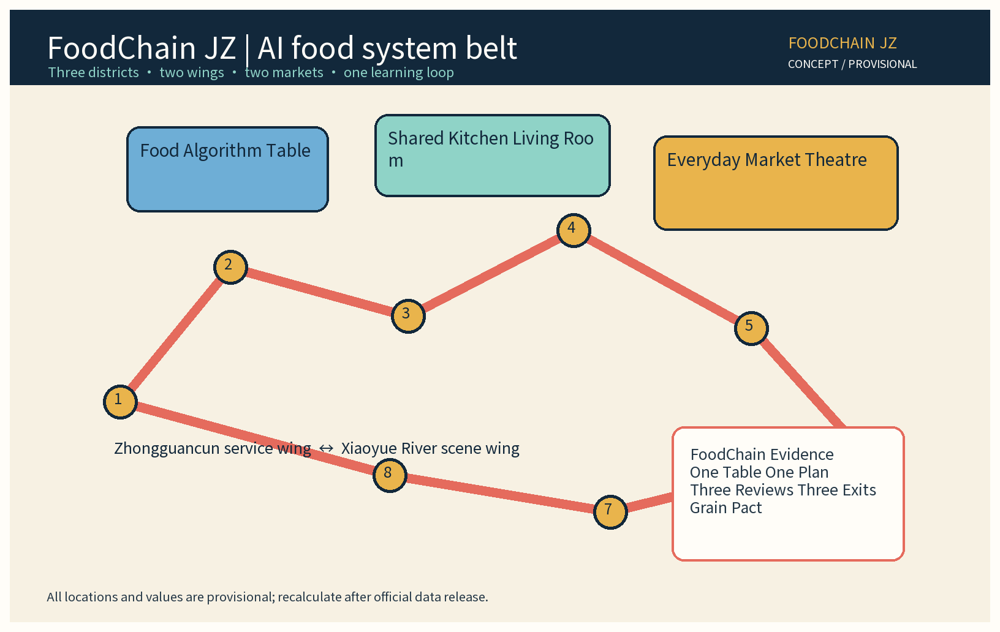
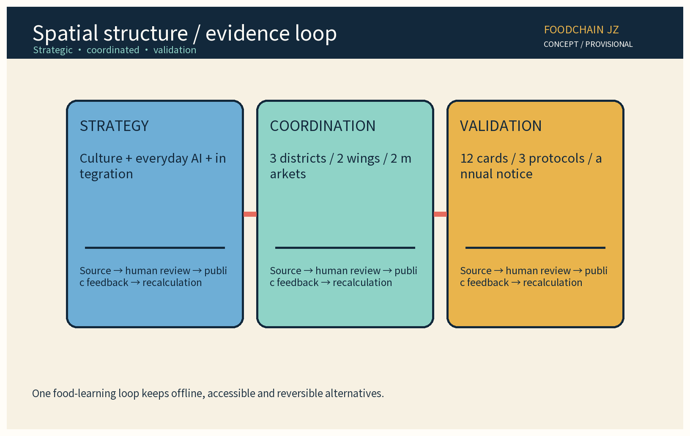
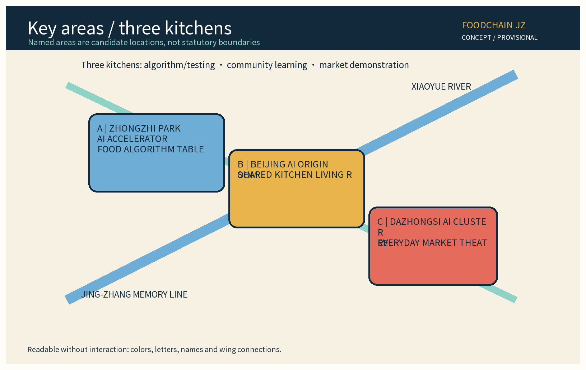
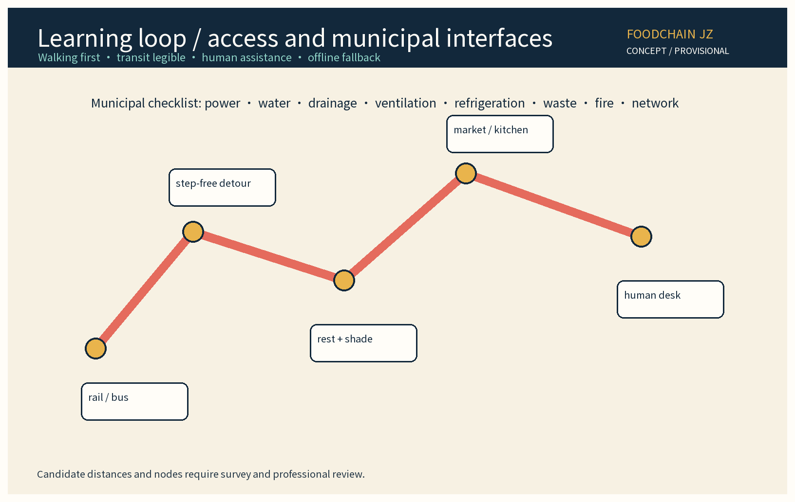
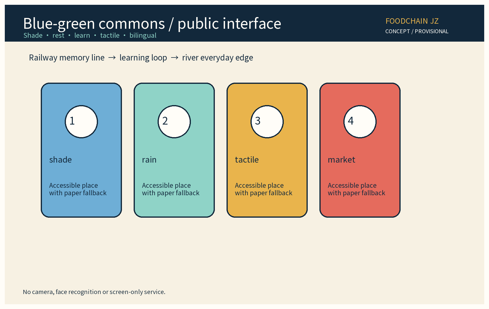
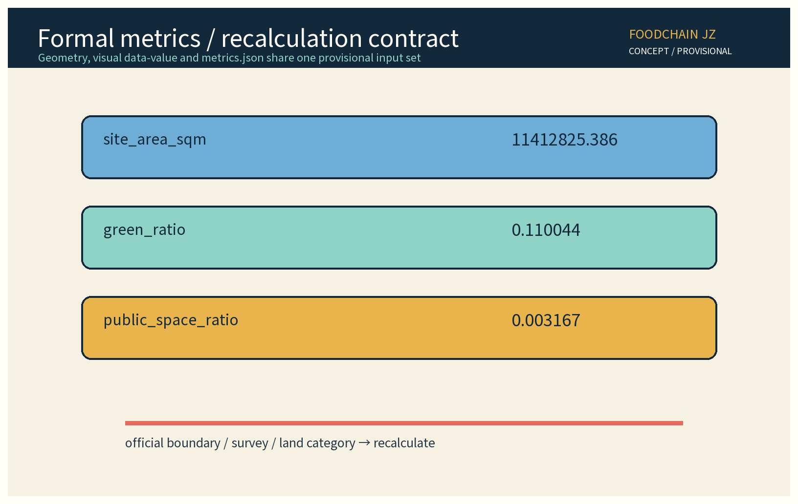

> Status: concept proposal only. This document is not a statutory plan, engineering design, approval, investment case or official commitment. All geometry, locations, quantities and phasing are provisional assumptions and must be recalculated after official data release. Names and mechanisms remain working labels until rights and public review are complete.

## Design Basis and Source List

The package uses public, traceable references and the project taskbook. The source register separates task inputs, planning-method references, governance references and case references. The public announcement and the supplied site-package taskbook control the required three positions, five functions, three districts, two wings and formal metric fields. [source:DATA-SRC-OFFICIAL-ANNOUNCEMENT-20260509] [source:DATA-SRC-AGENT-TASKBOOK-20260518] The Jing-Zhang story is treated as a public narrative background: railway time, movement and everyday provision are translated into a food-learning route without inventing heritage facts.

Six external cases are used only as references: Fab Labs, Station F, BLOCK71, Foodvalley, GROWNYC Greenmarket and the FAO urban-food agenda. Their publishers, URLs, retrieval dates, license notes and non-adoption boundaries are stored in `sources.json`. None implies an existing partnership, procurement, endorsement or official commitment. [source:CASE-FABLABS] [source:CASE-STATION-F] [source:CASE-BLOCK71]

Foodvalley, GROWNYC Greenmarket and the FAO Urban Food Agenda are also separately registered in `sources.json` with their publishers, URLs, retrieval dates and reference-only boundaries. [source:CASE-FOODVALLEY] [source:CASE-GROWNYC] [source:CASE-FAO-URBAN-FOOD]

Missing inputs include cadastral boundaries, current population, market operations, utility capacity, pedestrian counts, food-safety records, ownership and heritage-control lines. The proposal records these as research gaps instead of filling them with invented facts. A later professional team must verify land, fire, hygiene, transport, accessibility and conservation conditions. [source:DATA-SRC-PROVISIONAL-BOUNDARIES-20260605]

## Three-Level Scope Framework

The strategic level translates the three positions—Centennial Jing-Zhang Cultural Belt, Urban AI Everyday-Life Experience Belt and AI Integration Innovation Belt—into a food system that can be eaten, learned and checked. The coordination level organizes three districts, three kitchens, two wings, two markets and one learning loop. The validation level uses small, reversible test units: shared kitchens, source-index tables, market information, accessibility aids and cold-chain handover candidates. No level claims a completed construction outcome.

| Level | Spatial and operational task | Deliverable | Provisional limit |
|---|---|---|---|
| Strategic | Culture, everyday life and AI integration | Narrative and public-interest principles | Not a statutory policy |
| Coordinated | Three districts, two wings, two markets and three kitchens | Industry links and interfaces | Candidate locations only |
| Validation | Twelve scenarios, three protocols and annual review | Shadow tests, error log and exit rules | No safety, traffic or investment conclusion |

The food-learning loop starts at the community kitchen, passes the source index, market stalls, shared equipment and railway-memory interpretation, reaches the open innovation kitchen and returns resident feedback. It does not promise a new road. Walking, cycling, transit and step-free continuity require survey and professional review. [source:MOHURD-URBAN-DESIGN-MEASURES]

## Coordinated Research Area: Industry and Future City Research

The cultural belt becomes a food timeline: public stories of stations, storage, railway work and urban movement are presented through food-learning, without fabricating heritage details. The everyday-life belt becomes understandable tools: residents can read source notes, allergen prompts and activity times; merchants can review an explainable time-window suggestion. The AI innovation belt becomes a reversible path from model to market, where developers, food professionals, kitchen operators and residents test the same evidence protocol.

| Required function | Food-system translation | Mechanism |
|---|---|---|
| Full-stack AI self-innovation | Source notes, readable menus and equipment service | FoodChain evidence API plus a human ledger |
| World-class AI ecosystem | Food technology, markets, universities and reference cases | Rotating market and open-kitchen week |
| AI plus scenario enablement | Food literacy, market wayfinding and handover candidates | Twelve cards and three reviews/three exits |
| Intelligent and lively city | Daily meals, lessons and neighbor exchange | Co-created table policy, offline first |
| Global voice in AI governance | Explainable evidence and public review | Grain Pact, annual notice and bilingual brief |

The original mechanisms are FoodChain Evidence, One Table One Plan, Three Reviews Three Exits and the Grain Pact. FoodChain Evidence attaches a source, version, reviewer role and expiry date to each prompt; it is not a food-safety certification. One Table One Plan collects voluntary, anonymous preferences for a discussable menu. Three Reviews Three Exits requires source, professional and public review, with prompt withdrawal, model rollback and scenario exit. The Grain Pact states: anonymous aggregation only, human review for key decisions, and no excessive surveillance. No face, voice, plate, fine-grained route, individual order or sensitive health record enters the platform.

The Zhongguancun service wing connects universities, testing services and AI companies. The Xiaoyue River scene wing connects communities, merchants, schools and civic organizations. Regional and international references are used for open knowledge exchange only. Participation requires minimal data, clear intellectual-property terms, an accessibility plan, a safety responsibility and a dispute path. No institution is presented as a committed partner.

## Overall Design Area: Urban Renewal and Regulatory-Plan-Level Urban Design

The overall structure is three districts, three kitchens, two wings, two markets and one food-learning loop. The Food Algorithm Table sits in the Zhongzhi Park AI accelerator district; the Shared Kitchen Living Room sits in the Beijing AI Origin community; the Everyday Market Theatre sits in the Dazhongsi AI cluster. The three kitchens support algorithm and testing work, resident co-cooking and food learning, and merchant demonstration. The two wings supply technical services and community scenes; a civic market and an innovation-food market provide two rotating interfaces.

The working geometry includes a site boundary, roads, blue-green areas, buildings, parcels, key areas and scenario nodes. It is a candidate model and must not be read as a land-use decision. The proposal does not infer floor-area ratio, height, parking, fire separation, utility capacity or demolition quantity. Existing space is described as retain, compatible retrofit or light reversible insertion; property, structure and conservation review must precede any action. [source:MOHURD-CONTROL-DETAILED-PLANNING]

The loop is sequenced as: what can be learned today, source index, shared kitchen, shaded rest, tactile and low-level information, step-free detour, and public market feedback. Every node keeps paper, human assistance and a clear opt-out. Lighting, noise, cooking exhaust, waste and neighbor disturbance are tested in small rotations rather than declared solved at city scale.

## Detailed Design of Key Areas

The Food Algorithm Table combines an anonymous-data sandbox, readable-information bench, equipment-service corner and developer table. Version, error class and human-review state are visible. It handles only aggregated time windows, merchant-provided text and anonymous service tickets. It excludes face, plate, individual route and fine-grained health data. Reversible tables, displays and screens make withdrawal practical.

The Shared Kitchen Living Room combines an accessible kitchen, food-learning classroom, caregiver rest, child-visible safety boundaries, low work surfaces and a resident opinion wall. Courses follow learn, cook, tell a station story and leave feedback. Sign-up works online or in person. The operator publishes a monthly activity sheet and accessibility arrangement, and completes an annual public review. Paper cards, an attended phone or email channel and a face-to-face desk remain available.

The Everyday Market Theatre uses rotating stalls, a source index, a shared cold-chain handover log, clear wayfinding and a small demonstration stage. Participation is voluntary; original merchant prices and safety notices remain visible. A half-day shadow test precedes each rotation. Merchants, residents and professionals inspect misleading language, crowding, smells and accessibility. If an exit condition is reached, the prompt is withdrawn or the activity is reduced.

The three areas share a public-interest floor: do not expose individual contributions or purchases; do not let AI decide access, aid, stalls or penalties; show a human contact, appeal number, review window and paper alternative. The key-area drawing is readable without interaction.

## AI Innovation Ecosystem, Personas, and AI+ Scenarios

Seven service personas guide design: residents seeking useful information without tracking; young developers seeking low-risk data; food-tech founders seeking kitchens, testing and an exit; university researchers seeking citable aggregates; small merchants seeking affordable prompts; families and caregivers seeking rest, allergen text and offline service; and seniors, disabled people and visitors seeking bilingual, slow, step-free explanations and human help. These are service needs, not classifications of people.

Twelve scenario cards are defined below. Each has an input, an output, a named human review and a fallback.

| ID | Scenario card | Input, output, review and exit |
|---|---|---|
| S01 | Food-learning route | Anonymous time windows to route draft; operator review; paper map |
| S02 | Readable menu | Voluntary merchant text to large/bilingual/graphic version; human copy-edit; original text |
| S03 | Supply-time hint | Aggregated counts to time-window hint; merchant review; no stall change |
| S04 | Source index | Merchant source note to evidence card; source administrator review; hide if missing |
| S05 | Cold-chain handover | Anonymous batch and time window to candidate reminder; professional review; ledger |
| S06 | Shared equipment booking | Equipment state and voluntary request to draft window; kitchen review; queue |
| S07 | Food knowledge answer | Reviewed knowledge base to explanation; teacher sampling; fixed card |
| S08 | Allergen prompt | Merchant ingredients to visible label; merchant and professional review; original label |
| S09 | Stall wayfinding | Market plan and access rules to guide draft; on-site review; human guide |
| S10 | Equipment ticket | Anonymous equipment state to priority suggestion; technician confirmation; paper ticket |
| S11 | Food-learning activity | Voluntary age/access choice to activity list; human confirmation; no profiling |
| S12 | Annual evidence notice | Aggregate operations and appeals to chart; joint resident/pro review; withdraw unverified data |

Three industry protocols make the ecosystem testable. The Supply-Time Shadow Protocol compares an anonymous baseline over one rotation with interval suggestions, logs omission, delay, directional error and merchant objection, and stops after repeated unexplained misleading advice. The Food Information Readability Protocol compares original, large-print, bilingual and graphic versions and checks misleading words, missing allergens, translation, contrast and route; merchant, educator and disabled-user representatives review it, with the original as fallback. The Cold-Chain Handover Candidate Protocol uses anonymous batch IDs and time windows only; professionals check mismatch, delay and boundary conditions, and any safety doubt, over-collection or unresolved appeal exits the test.

The developer community holds a monthly open-kitchen code/data clinic, a quarterly One Table One Plan co-design and an annual FoodChain Evidence public day. Each year it publishes aggregate operations, error classes, appeals, accessibility improvements, activities and withdrawals. International communication uses bilingual case cards, an open-license note and a public failure brief, always marked as a concept proposal and not an official result.

## Land Use, Building Scale, and Retain-Renovate-Demolish Strategy

The package proposes relationships among candidate uses, not statutory land categories or development rights. Geometry separates public open space, mixed innovation, community service, market support, transport and municipal interfaces as conceptual classes. `site_area_sqm`, `green_ratio` and `public_space_ratio` are formal working metrics, not regulatory indicators. No floor-area ratio, height, density, parking, fire or engineering conclusion is supplied.

Retain means keeping legible railway-memory interfaces and usable public facilities. Renovate means adapting low-efficiency or vacant spaces for shared kitchens, classrooms, service desks and equipment corners after professional review. Light insertion means removable displays, tables, low-level guidance and shade seats. Any structural, gas, water, ventilation, refrigeration, fire, ownership, heritage or environmental action needs a separate professional review. “Kitchen” is a program concept, not an approved catering project.

Buildings and public services prioritize step-free access or an equivalent route, turning space, high contrast, tactile and bilingual information, quiet hours and human booking. Cost, delivery time and return are not forecast. If official data, ownership or safety conditions fail, the project can shrink, move or stop.

## Transport, Rail, Municipal Infrastructure, and Public Services

The learning loop connects existing transit, station approaches, community entrances, schools and markets without assuming a new rail station or road. The transport diagram prioritizes walking, cycle parking, legible transit and a vehicle-free civic edge. It marks accessible detours, rest points, weather alternatives and human help. Distances, network length and node coordinates are provisional and require survey, traffic, utility and fire review. [source:MOHURD-URBAN-DESIGN-MEASURES]

Municipal requirements are recorded as interfaces: power, water, drainage, ventilation, refrigeration, waste sorting, fire safety and network access. The AI layer needs offline operation, minimal logs, encryption, human permissions and deletion. Rainwater, energy, cooking exhaust, noise and waste are coordination topics, not claimed performance. Services include food classes, accessibility help, resident opinions, merchant training, equipment care and annual review.

## Blue-Green Network, Public Space, and Urban Character

The blue-green network links the railway memory line to the Xiaoyue River everyday edge as a place to stop, look and learn. The route uses shade, seats, cleanable permeable forecourts, seasonal food-learning planters and rain observation signs. It keeps side-by-side places for seniors, children, wheelchair users and caregivers. The green ratio is derived from working geometry and is not an ecological-performance claim.

Three low-tech and replaceable AI-themed elements support the loop: a bilingual Food Recipe Station, an Evidence Column showing aggregate and review status, and a Market Theatre Curtain that can be switched off. They do not record or identify passers-by and never replace paper, spoken or tactile service. Materials favor durable, repairable and reusable railway-like qualities. Naming, color and identity remain working concepts pending rights review.

International communication uses bilingual web pages, openly described drawings, downloadable protocols and a yearly failure list. External language must identify the proposal as conceptual, provisional and non-official, describing method and evidence status rather than scale or impact.

## Renewal Projects, Implementation Policy, and Phasing

| Project | Action | Lead and collaborators | Deliverable and exit |
|---|---|---|---|
| P01 Food Algorithm Table | Open interface, anonymous samples, human ledger | Service wing, university, developers | Version log; stop on scope breach |
| P02 Shared Kitchen Living Room | Food classes, accessible workstations, opinion wall | Community operator, civic groups, residents | Monthly activity; appeal can stop |
| P03 Everyday Market Theatre | Rotating stalls, source index, readable guide | Merchants, market operator, advisers | Half-day shadow test; exit on failure |
| P04 Two-Wing Coordination Desk | Testing, legal, founder and scene support | Both wings | Quarterly list; no unauthorized sharing |
| P05 FoodChain Evidence Day | Annual notice, cases and failure review | Joint team and resident observers | Annual report; public objection |

Three phases describe research tempo only. Phase 1 (0–12 months, provisional) verifies ownership, safety and accessibility, and runs resident co-design and paper shadow tests. Phase 2 (12–24 months, provisional) rotates the three protocols at voluntary sites. Phase 3 (after 24 months, provisional) decides to continue, shrink, move or exit based on the annual notice. Dates are not commitments and areas are not construction quantities.

The policy package is open interface, small test, exit protection and annual notice. Joining a test is never a condition for business access, aid, public service or space access. Residents can use an on-site wall, paper card, attended phone/email or web form; the operator provides a human receipt and review window. Developers and merchants can inspect versions, errors and rights before participation.

## Metrics, Area Recalculation, and Compliance Matrix

The formal core values are provisional and identical to the values in `metrics.json`, geometry and `visual/index.html`:

| Metric | Provisional value | Recalculation |
|---|---:|---|
| `site_area_sqm` | 11412825.386 | Sum of `geometry/site_boundary` areas |
| `green_ratio` | 0.110044 | `green_space_area_sqm / site_area_sqm` |
| `public_space_ratio` | 0.003167 | `public_space_area_sqm / site_area_sqm` |

Content coverage counts are `key_area_count=3`, `scenario_card_count=12`, `industry_test_scenario_count=3`, `global_case_count=6`, `persona_count=7`, `phase_count=3` and `annual_program_count=4`. Working areas are `green_space_area_sqm=1255908.493` and `public_space_area_sqm=36150`. They are not official statistics. Official boundaries, surveys, land categories and public-space definitions must replace and recalculate them.

The compliance matrix maps task requirements, public interest, data minimization, copyright, accessibility, transport, municipal interfaces, implementation and risk to sections, drawings and records. The design-depth matrix covers strategy, overall structure, three districts/two wings, key areas, ecosystem, scenario cards, industry protocols, personas, land use, transport, municipal, blue-green, renewal list, metric recalculation and operations. Formal spatial review reads geometry; visual review reads `data-value`; neither may present a provisional value as an established fact. [source:PROJECT-AGENT-OPEN-CALL-TASKBOOK] [source:MOHURD-CONTROL-DETAILED-PLANNING]

## Risk, Copyright, and Compliance

Risks include misleading food information, omitted allergens, kitchen safety, cold-chain misunderstanding, market crowding, inaccessible service, data overreach, resident objection, merchant burden, incorrect heritage narrative, font or image rights and platform shutdown. Controls include source levels, versions, professional sampling, resident review, paper fallback, human work orders, anonymous aggregation, minimal access, switch-off devices, public error logs and annual exit review. Any safety or rights doubt suspends the scenario while a responsible human process continues.

The governance sentence is: **anonymous aggregation only, human review for key decisions, and no excessive surveillance**. The platform must not collect or infer faces, voices, plates, fine routes, individual purchase profiles, minors' identities or medical/dietary sensitive information. AI must not decide merchant access, public-resource allocation, aid, penalty or demolition. Resident channels are the opinion wall, paper card, attended phone/email and web form. A monthly response summary, annual public notice, annual FoodChain Evidence day and annual resident co-design review are required.

Text, drawings and code are supplied under `COMMUNITY-DISPLAY-ONLY` for display and review. External cases are `reference_only`; URLs, licenses, retrieval dates and prohibited uses are in `sources.json`. The local Noto Sans CJK SC font is embedded in the four HTML surfaces under a lawful font file. Drawings are original concept graphics. Names and mechanisms are not trademark or rights claims. No privacy, classified material, fabricated source, official promise or statutory/engineering/approval/investment conclusion is included.

## References

- [source:DATA-SRC-OFFICIAL-ANNOUNCEMENT-20260509] Public project announcement, reference only.
- [source:DATA-SRC-AGENT-TASKBOOK-20260518] Supplied site-package taskbook and submission requirements.
- [source:MOHURD-URBAN-DESIGN-MEASURES] Public urban-design method reference.
- [source:MOHURD-CONTROL-DETAILED-PLANNING] Public regulatory-planning method reference.
- [source:DATA-SRC-GENERATIVE-AI-INTERIM-MEASURES] Public generative-AI governance reference.
- [source:DATA-SRC-BARRIER-FREE-ENVIRONMENT-LAW] Public accessibility and public-interest reference.
- [source:CASE-FABLABS] Fab Labs Foundation, open fabrication reference.
- [source:CASE-STATION-F] Station F, entrepreneurship-campus reference.
- [source:CASE-BLOCK71] BLOCK71, cross-institution incubation reference.
- [source:CASE-FOODVALLEY] Foodvalley, food-innovation ecosystem reference.
- [source:CASE-GROWNYC] GROWNYC Greenmarket, civic-market reference.
- [source:CASE-FAO-URBAN-FOOD] FAO urban-food agenda reference.
