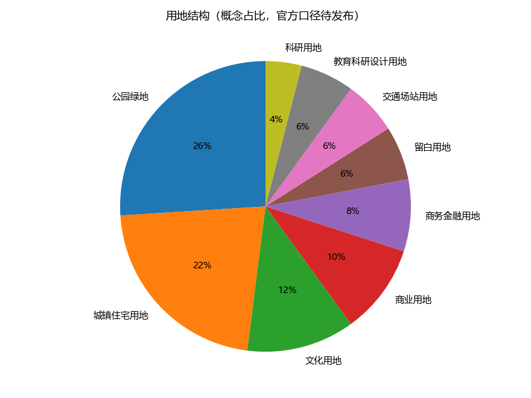
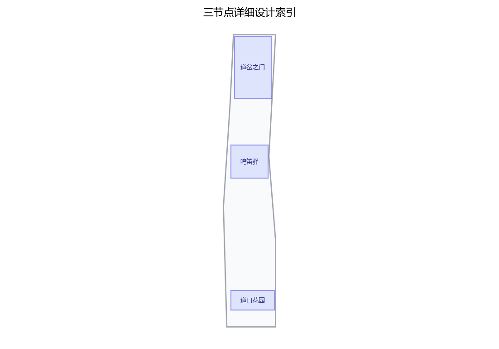
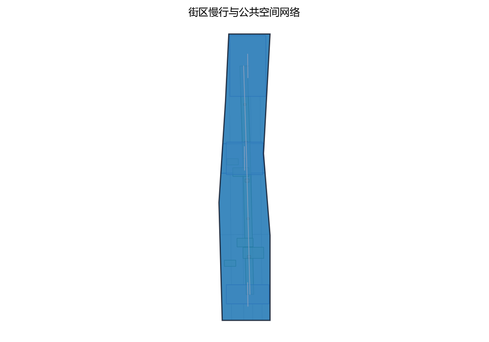
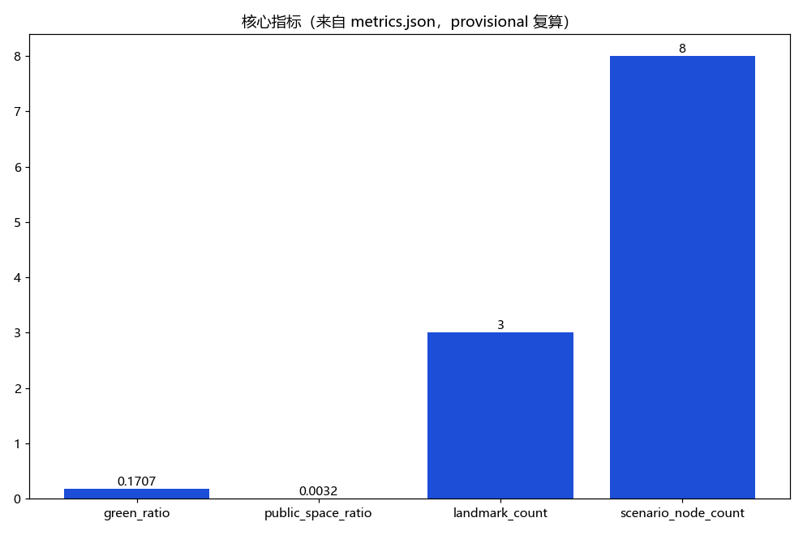

**方案名称与总体构想(概念)**

主名称「经纬京张 · 百年轨带」,英文名 Jingzhang WeaveLine · Century Track Belt。构想以京张铁路遗址公园为**经线**,承载百年记忆与慢行主轴;以东西向街区缝合通道为**纬线**,织入社区、校院与创新空间;以 AI 为新"梭",在经纬交汇处织出"百年京张文化带、都市AI生活体验带、AI融合创新带"三条叠加带。三大定位、五大功能与"三区两翼"均纳入经纬框架——经线通史、纬线织城、AI 缝智,一条经线上存百年记忆、万千纬线织 AI 新生活。全篇面积仅用官方文本口径,几何均为概念示意,不构成任何法定规划结论。

## 设计依据与资料清单

本方案依据:①征集公告与设计任务书(组织方发布);②open-city-ai/haidian 开源资料库;③官方文本口径面积——统筹研究范围43.6平方公里、总体设计范围11.4平方公里、重点区域合计368.4公顷,众智园AI自主创新加速区约192公顷、北京AI原点社区约104公顷、大钟寺AI产业集聚区约72公顷;④沿线真实节点清河、上地/中关村软件园、知春路、中关村大街、学院路,作为空间叙事锚点;⑤京张铁路1905年开工、1909年通车等公开史实。重要声明:组织方尚未发布官方边界多边形,现有几何均为 provisional,本方案不声称任何精确坐标,面积一律标注"官方文本口径"。

> **证据锚点**：[source:DATA-SRC-OFFICIAL-ANNOUNCEMENT-20260509]、[source:DATA-SRC-AGENT-TASKBOOK-20260518]（组织方公告与任务书为文本口径依据）。

## 三层范围工作框架
三层成果逐级传导：统筹研究输出的文化带职能与慢行网络判断约束总体设计，总体设计校核的断点连通、用地兼容与弹性指标再落实到节点详设；每层均保留与任务书对应章节的机器可读证据锚点，便于评审对照。

三层递进、同一主轴:统筹研究范围43.6平方公里回答"产业与未来城市"之问;总体设计范围11.4平方公里以城市更新与控规深度城市设计回答"如何织"之问;重点区域合计368.4公顷的"三区两翼"回答"何处落子"之问。三层共享"一轴多纬、AI为梭"框架:经线即遗址公园线性主轴,纬线即缝合通道,梭即 AI 场景与治理工具。工作组织为先研究、再设计、后深化的滚动机制,边界以官方多边形发布后校核。

> **证据锚点**：[source:DATA-SRC-AGENT-TASKBOOK-20260518]（三层范围划分依据任务书官方文本口径）。

## 统筹研究范围产业与未来城市研究
产业研究识别遗址公园沿线的文化带动能与三区两翼的协同机会，形成「经纬框架」的未来城市形态判断；未来城市研究仅作方向性预判，不构成对用地与投资的承诺。

统筹研究(概念建议,供专业团队深化):围绕"AI全栈自主创新体系"与"世界级AI创新生态",以清河、上地/中关村软件园一带为算力、算法与数据要素协同枢纽的想象区;以中关村大街为创新服务走廊,配置孵化、金融与知识产权服务;以学院路为人才源头,衔接高校院所与概念验证。未来城市研究聚焦职住平衡与15分钟生活圈、绿色慢行通勤、面向"AI治理全球话语权"的规则沙盒试验段。本层产出为研究框架与情景推演,不预设产业与用地结论。

> **证据锚点**：[source:DATA-SRC-PROVISIONAL-BOUNDARIES-20260605]（边界为 provisional，研究范围仅作概念示意）。

## 总体设计范围城市更新与控规深度城市设计
总体设计强调低干预更新与微更新：功能置换、界面提升与桥下空间改造，建立保留—改造—修复分类指引；对控规指标只做校核建议，不预设数值结论。

总体设计以遗址公园为经、东西向街道为纬:经线控制慢行贯通、文化叙事与低干预景观;纬线控制街区缝合、界面与桥下空间。更新坚持"留为主、改辅、拆极少",以现状质量与权属评估为前提。控规深度成果(概念建议)包括:用地混合与兼容清单、高度体量导则、街道断面库、慢行断点连通图则;成果提交专业团队深化,与在编控制性详细规划衔接校核,不替代、不预判任何法定规划结论。

> **证据锚点**：[source:DATA-SRC-MOHURD-CONTROL-DETAILED-PLANNING]、[source:DATA-SRC-PROVISIONAL-BOUNDARIES-20260605]。

## 重点区域详细设计
三节点的设施选址均为概念点位，须经文物与铁路部门评估及专业审查后重新落位；节点间的经纬框架构成完整空间叙事，详细平面与剖面以图册与 geometry 层表达。

三区两翼(官方文本口径):众智园AI自主创新加速区约192公顷、北京AI原点社区约104公顷、大钟寺AI产业集聚区约72公顷,中关村科技服务翼、小月河场景赋能翼。本方案提出三处原创概念点位(选址为概念建议,待官方边界发布后由专业团队深化):①「道岔之门」遗址文化门户(概念点位),建议近带域南端门户,设百年时刻线起点与 AR 时光站台;②「鸣笛驿」慢行活力驿站(概念点位),建议中人流交汇段,集合慢行服务、活动预约与车站音乐会舞台;③「道口花园」社区缝合节点(概念点位),建议居住密集段,以原道口意象缝合两侧社区。

> **证据锚点**：[data:PACKAGE-GEOMETRY]（三节点示意多边形来自本包 geometry/key_areas.geojson）。

## AI 创新生态、人才画像与 AI+ 场景

人才画像(概念):研究者与工程师、创业者与运营者、沿线居民与全龄使用者,构成"日间产业人流+晚间生活人流"复合画像。AI+ 场景(概念建议):①智慧导览与 AR 时光站台,复原1909年站台叙事,内容经史料专家复核;②无障碍伴随,视障与轮椅使用者授权共享位置后获得志愿者或服务终端同行,授权明示、随时退出;③客流感知,仅于边缘端匿名聚合为人数、密度、流向统计,用于驿站调度与活动限流;④共享单车与慢行服务驿站,集成调度、检修、打气充电;⑤活动预约,音乐会、漫步季分时限流。隐私边界:个人级数据不出本地,不部署常开式识别设备,不做行为画像;异常信息仅提示管理人员,人工复核处置,算法不自动执法。

> **证据锚点**：[source:DATA-SRC-GENERATIVE-AI-INTERIM-MEASURES]（AI 生成内容治理表述的参照依据）。

## 用地、建筑规模与拆改留方案
拆改留坚持留改拆排序：历史构筑物与质量较好建筑登记建档、能留尽留，仅针对危房及严重妨碍慢行贯通的极少数建筑逐栋论证拆除；全部面积为概念口径，官方数据发布后复算。

用地(概念建议):以存量更新为主,沿线用地向"文化+公共服务+创新办公+居住"混合兼容引导,不主张新增大规模开发。建筑规模:以现状建设量为基数,增量主要通过更新盘活与功能置换释放,具体数据须经实测与专项评估,本方案不提供估算数值。拆改留(概念建议):留——历史构筑物与质量较好建筑登记建档、能留尽留;改——功能与界面提升;拆——仅针对危房及严重妨碍慢行贯通的极少数建筑,逐栋论证。以上均属参考方案,可供专业团队深化研究。

> **证据锚点**：[source:DATA-SRC-MNR-LAND-USE-CLASSIFICATION-202311]（用地分类名称参照现行国标口径）。

## 交通、轨道、市政与公共服务设施
慢行组织以遗址公园为南北主轴，过街连桥、下穿与桥下空间利用贯通断点；市政结合海绵化线性绿带与雨水花园；公共服务以驿站网络集成卫生间、饮水、母婴、无障碍、AED 与共享单车，AI决策均设人工复核。

慢行:以遗址公园为南北慢行主轴,打通过街与断点,建议采用人行连桥、下穿与桥下空间利用,东西向纬线接驳两侧社区。轨道接驳(概念建议):强化与既有轨道站点清河站、上地站、知春路站等(均属公开信息)及京张高铁清河站的步行接驳。市政:海绵化线性绿带、雨水花园与韧性防灾通道。公共服务:驿站网络集成卫生间、饮水、母婴、无障碍、AED 与共享单车服务,按慢行可达性布局,服务半径属概念指标、待实测校核。均为参考方案。

> **证据锚点**：[source:DATA-SRC-MOHURD-URBAN-DESIGN-MEASURES]（市政与慢行设计表述的方法参照）。

## 蓝绿空间、公共空间与城市风貌
遗址公园绿链+社区花园绿纽+小月河绿网整合蓝绿空间，轨道记忆、轨枕铺装与百年时刻线塑造文脉；设施以模块化、可逆设计嵌入沿线，风貌以材料谱系与照明分级导则克制表达。

蓝绿空间:遗址公园为绿链主轴,两侧以社区花园与口袋公园为"绿纽",建议小月河翼结合滨水形成绿网。低干预景观与文化表达(概念建议):轨道记忆——登记保留轨道、道床、信号与站房残件;轨枕铺装——回收轨枕用于铺装、坐凳与花池边界;百年时刻线——自1905年至未来的年份刻度沿线铺陈。风貌:建立"钢轨、道砟、砖石、铸铁"材料谱系与色彩、照明分级导则,避免过度公园化与光污染。均为参考方案,可供专业团队深化研究。

> **证据锚点**：[source:DATA-SRC-MOHURD-URBAN-DESIGN-MEASURES]（蓝绿空间组织的方法参照）。

## 更新项目清单、实施政策与分期计划
三阶段项目清单（近期1-3年/中期3-5年/远期5-10年）为概念清单，规模与投资估算均为建议性表述；政策建议（微更新清单制、责任规划师与社区共治、更新基金）不构成政府或运营方承诺。

项目清单(概念建议):门户节点、三处驿站、示范段轨枕铺装与时刻线、桥下空间改造、口袋公园与社区花园、界面提升、断点连通、AR 导览与预约平台。分期节奏:近期(约1-3年)建成示范段与门户节点、3处驿站、2-3处断点连通,启动文化漫步季与车站音乐会;中期(约3-5年)全线慢行贯通、桥下空间与社区花园成网、智慧服务全覆盖;远期(约5-10年)全域缝合、活动体系常态化、AI 治理试验段运行。实施政策(概念建议):微更新清单制、责任规划师与社区共治、更新基金与社会资本参与机制。

> **证据锚点**：[source:DATA-SRC-AGENT-TASKBOOK-20260518]（分期与实施条目对应任务书要求）。

## 指标体系、面积复算与合规矩阵
目标—指标—校验三层概念指标体系进入 metrics.json；面积复算以本包 provisional 几何为底，官方数据到位后整体复算并标注复算版本。

指标体系(概念建议目标,非法定):慢行贯通率、驿站覆盖半径、轨枕与时刻线示范覆盖率、感知数据匿名率100%、活动预约线上率等,供实施校核。面积复算:43.6平方公里与11.4平方公里为官方文本口径;三区192+104+72=368公顷,与重点区域合计368.4公顷基本一致,微小差异源于文本取整,最终以官方边界多边形为准。合规矩阵:三大定位×五大功能×本方案章节逐项对应,明确几何为 provisional、不含法定规划结论。

> **证据锚点**：[metric:green_ratio]、[metric:public_space_ratio]、[source:PACKAGE-GEOMETRY]。

## 风险、版权与合规说明
本方案为概念研究性设计，不构成行政审批依据；正式实施前须完成文物与铁路部门评估、断点设施审批及安全评估。

风险:官方边界多边形未发布,所有几何与选址存在校核风险;面积口径差异以最终文本为准;更新牵涉权属、文保与轨道安全退界,须专项评估;客流感知若部署不当易引发隐私争议,故坚持匿名聚合与人工复核。版权:本方案为原创,主名称、英文名与三处概念点位名称及相关图件版权归作者所有,遵守 open-city-ai/haidian 开源协议与征集规则,公开史实已注明来源。合规:本方案仅为概念方案,不替代法定规划、不产生审批效力;感知与数据处理遵循个人信息保护法、数据安全法。

> **证据锚点**：[source:DATA-SRC-OFFICIAL-ANNOUNCEMENT-20260509]（征集规则为权属与合规表述的依据）。

## 参考资料
参考资料以政府正式发布版本为准；本包 sources.json 仅收录可查证条目，未虚构任何官方数据或链接。

①征集公告、设计任务书及官方文本口径数据(组织方发布);②open-city-ai/haidian 开源资料库;③京张铁路公开史料(1905年开工、1909年通车及詹天佑相关公开文献);④京张铁路遗址公园相关公开报道与活动信息;⑤北京市与海淀区公开规划文件(公开渠道可核验);⑥个人信息保护法、数据安全法等法律法规。边界多边形相关信息以组织方正式发布为准。

> **证据锚点**：[source:DATA-SRC-OFFICIAL-ANNOUNCEMENT-20260509]（本清单首条即组织方公开资料包）。
