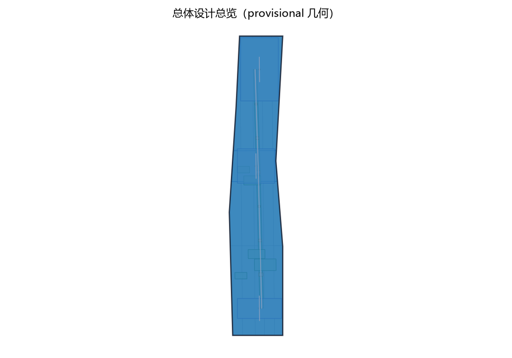
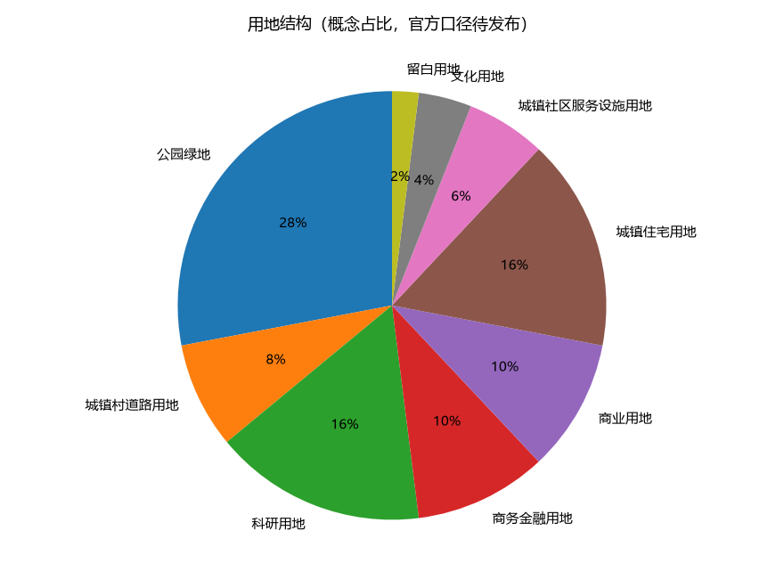
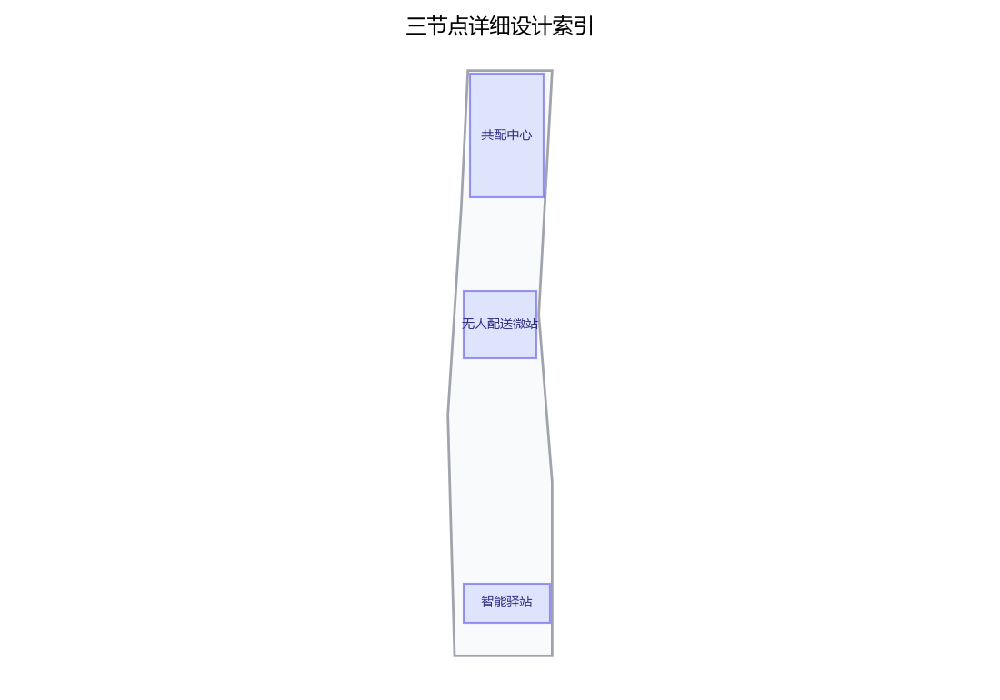
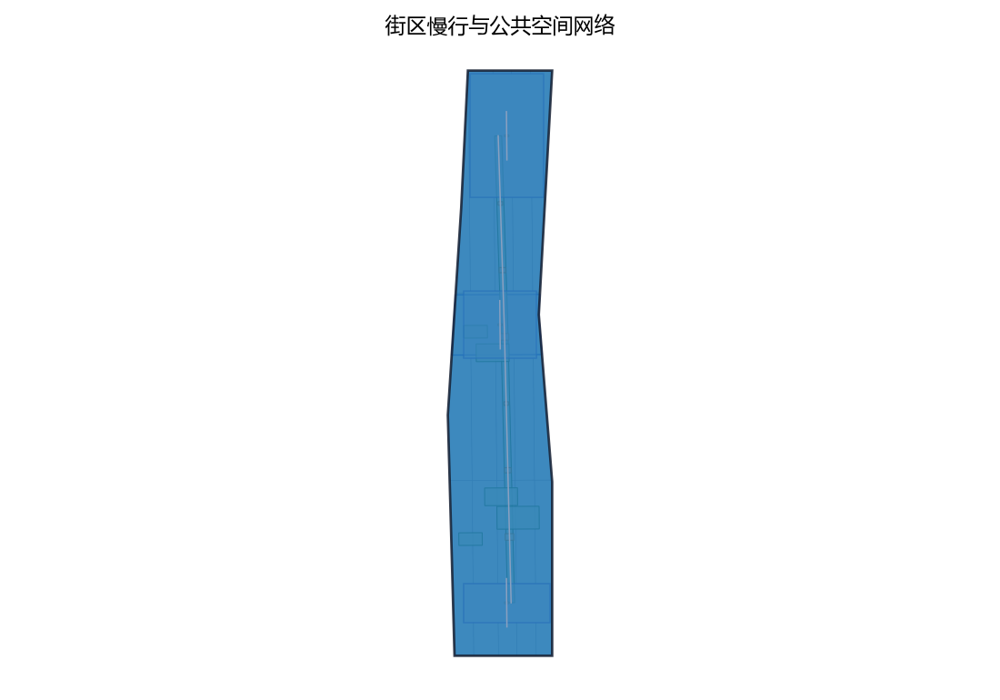
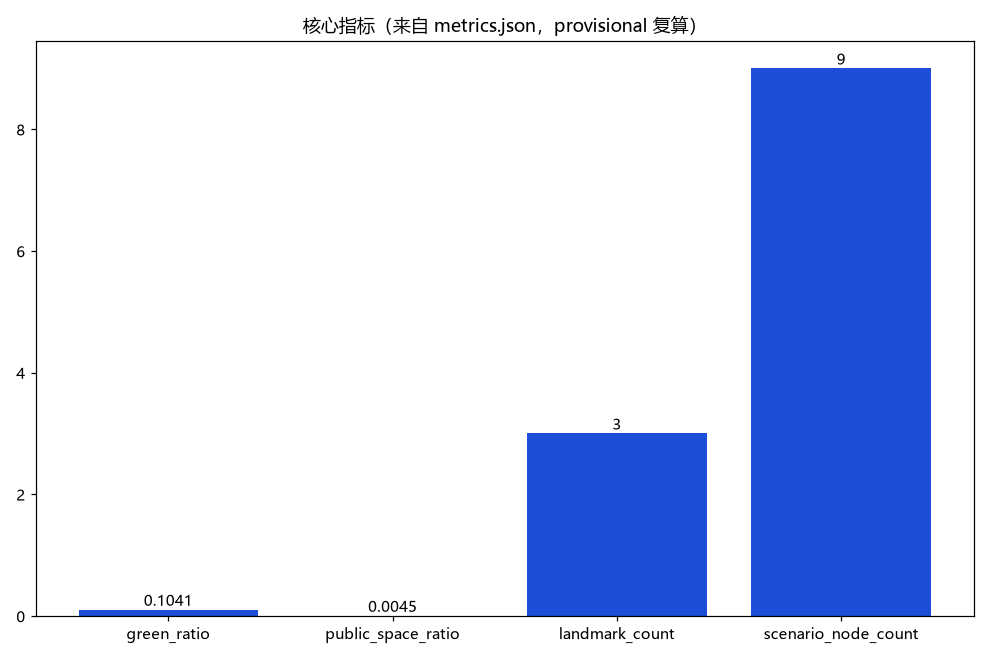

> 最后一程，交给公共路权、低速设备和永远在场的人工兜底。

本方案把物流"最后一公里"理解为城市的公共治理问题而非单一技术问题：以一座共配中心、一座无人配送微站和一座智能驿站织成一张低速、安静、可逆的末程服务网络，让 AI 做调度、路权、存取、撮合与安全评估的建议者，让人做最终判断者。全文为概念建议，不替代任何法定规划，不构成政府审定结论。

## 设计依据与资料清单

本草案依据四份必读材料撰写：面向智能体任务书摘录（三大定位、五大功能、三区两翼、agent.1—6 任务与禁止性结论边界，其中"仓库低速无人配送"为明确公开场景方向）、投稿技能（提案结构与机器可读投稿包要求）、参考样例（章节风格与证据组织）与任务书全文摘录（含禁止性表述清单）。方案同时衔接交通慢行、公共服务设施维度与智慧物流公开政策方向，但不对任何政策作已确定事项的表述。

当前公开资料未见官方总体边界与三处重点区几何；本草案三节点落位为公开线索下的概念示意，不构成法定红线、权属或规划许可。对标案例仅按公开渠道概述，不编造试点规模、车辆数量与配送量。企业公开案例仅作事实性概述，不使用其商标与版权素材。本草案所有空间表达均为"概念建议""参考方案"，可供专业团队深化研究；正式投稿时须补齐几何、来源、指标与合规矩阵文件。

> **证据锚点**：[source:DATA-SRC-OFFICIAL-ANNOUNCEMENT-20260509]、[source:DATA-SRC-AGENT-TASKBOOK-20260518]（组织方公告与任务书为文本口径依据）。

## 三层范围工作框架

三层范围以"问题—空间—运营—证据—退出"责任链贯通。统筹研究范围研究末端物流与低速无人配送产业如何转化为公共价值，回答"AI 配送带应该留下什么"：答案是公共路权治理、共配准入与可感知的场景体验，而非企业运力竞赛。总体设计范围把结论落实为"一中心二站一点"概念网络与低速路权、慢行一体化空间对象，回答"落在哪里、长什么样"。重点区域范围将三节点各做成一枚可验证、可退出的场景原型，回答"谁来运营、如何停止"。

每一层自检同一组问题：是否高估技术成熟度、是否侵占行人权益、是否把概念写成已批准事项。统筹层输出对标案例与要素机制概念；总图层输出空间结构、指标定义与合规说明；重点区层输出功能、空间与运营三份设计。任何一层的内容调整沿责任链回传并标注，避免宏观叙事、总图与节点设计各说各话。

> **证据锚点**：[source:DATA-SRC-AGENT-TASKBOOK-20260518]（三层范围划分依据任务书官方文本口径）。

## 统筹研究范围产业与未来城市研究

三大定位在本主题下的回答：百年京张文化带——把铁路"最后一程"的自主创新精神转译给物流"最后一公里"；都市AI生活体验带——末端配送成为每天可感知的AI公共服务；AI融合创新带——物流、城市规划与AI治理在一条动线上融合。五大功能对应：AI全栈自主创新体系承接配送调度与协同技术验证；世界级AI创新生态由共配准入机制组织；AI+场景赋能新范式落实为五类AI+场景；智能化AI活力城市体现为安静、高效、可逆的末端运行；AI治理全球话语权落在年度安全评估公示机制。识别系统方向：中文名"末程智环"，英文名 LAST·JZ，Logo 以铁轨意象与环形回路为母题，强调"最后一程的闭环与交接"。

对标案例仅按公开渠道概述，不编造细节：

| 案例方向 | 公开信息概述 | 可借鉴机制 | 不照搬 |
| --- | --- | --- | --- |
| 国内低速无人配送试点城市 | 公开信息显示多个城市在限定园区、试点路段开展快递无人车路测与运营测试，普遍要求限速、测试管理与人工接管 | 分级试点、限定场景先行 | 路权承诺与运力规模 |
| 末端无人配送公开实践 | 公开信息显示电商与即时配送平台披露的无人配送车与机器人测试，集中于"最后几百米"与固定交接点 | 交接点标准化、人机并行 | 单家企业的运营模式 |
| 新加坡无人配送试点 | 公开信息显示其在校区、邻区等低风险区域试点低速配送机器人，强调小型化与监督运行 | 小型化、封闭场景验证 | 全城网络假设 |
| 日本宅配机器人试点 | 公开信息显示其修订道路交通法规，为特定小型配送机器人提供人行道通行条件，多地试点宅配机器人 | 法规先行、人行道共处规则 | 直接复制其法规文本 |

未来城市研究结论：末程设施应可逆、低噪声、分时共享，与轨道接驳、慢行绿廊和社区服务联动，形成"配送不扰民、取件不折腾"的公共生活层。

> **证据锚点**：[source:DATA-SRC-PROVISIONAL-BOUNDARIES-20260605]（边界为 provisional，研究范围仅作概念示意）。

## 总体设计范围城市更新与控规深度城市设计

总体结构为沿南北主轴展开的"一中心二站一点"概念网络：共配中心（众智园侧，园区级共同配送与分拣）、无人配送微站（AI原点社区侧，车辆与机器人停放充电接驳）、智能驿站（大钟寺侧，社区末端取送与便民服务），由一条低速配送概念环线串联。环线不新画道路红线，仅表达低速、分时、共享的路权意向，与京张遗址公园绿廊、既有非机动车道协同；三节点均布置在临绿廊、近慢行主轴的位置，概念点位可在官方边界与权属调查后整体移位。

城市更新路径以存量优先与可逆轻量设施为原则：共配中心意向为存量仓储空间的改造利用方向，微站与驿站意向为模块化、可移动、可逆安装的轻量设施，不预设具体地块与建设规模。控规深度采用"问题—空间对象—指标—资料缺口—复算路径"表达：本草案只界定结构与导则方向，容积率、建筑高度、建筑强度等依赖官方控制条件的指标保持待定，不以概念方案替代控规审批。

> **证据锚点**：[source:DATA-SRC-MOHURD-CONTROL-DETAILED-PLANNING]、[source:DATA-SRC-PROVISIONAL-BOUNDARIES-20260605]。

## 重点区域详细设计

三节点分别从功能、空间与公共体验界面三方面描述，均为概念建议。

**共配中心（众智园侧）**：功能上承担园区级共同配送与分拣，组织多品牌共配、分时段装卸，意向配置新能源补给与可逆轻量设施。空间上由装卸区、分拣暂存区、停车充电区与管理服务区组成，装卸时段与园区通勤错峰。公共体验界面：沿街设置透明化运行信息屏（仅展示匿名聚合数据）与参观走廊，面向公众与开发者举办行业开放日，让"看不见的配送"成为可理解的城市设施。

**无人配送微站（AI原点社区侧）**：功能上服务低速无人配送车与机器人的停放、充电、接驳换装与调度，运行范围限定时速、限定区域。空间上由停放充电区、调度室、小型示范道与安全缓冲空间组成，前置非机动车与行人优先通道。公共体验界面：设置运行状态展示窗与低速安全科普角，以看得见的安静、低速与安全建立公众信任；任何试运行须取得相应路权许可后开展。

**智能驿站（大钟寺侧）**：功能上提供取件寄存、退换代寄与便民服务（饮水、休息、雨具、信息咨询）。空间上由智能柜组、人工服务台、休息区与可移动便民模块组成。公共体验界面：白昼人工服务与夜间自助双模式，大字标识、无障碍连续与不依赖App的取件路径；驿站前小广场兼作社区交往空间。

三节点的落位、规模与施工均须经现状调查、法定审批与专业设计后确定。

> **证据锚点**：[data:PACKAGE-GEOMETRY]（三节点示意多边形来自本包 geometry/key_areas.geojson）。

## AI 创新生态、人才画像与 AI+ 场景

生态八要素落点：土地与空间由末端设施设置导则组织，产业由共配准入吸引多元运力，资金与服务以配送服务积分和公开规则为概念机制（不给投资测算），人才面向驿站运营与骑手合伙人培训，算力支持调度与撮合的边缘计算意向，数据仅采纳匿名聚合口径，场景由五类AI+场景构成。中关村科技服务翼提供IP与资本对接意向，小月河场景赋能翼承接场景测试与公共体验路径。

用户画像（概念研究，非人口统计推断）：① 日常通勤者——希望顺路取件、不折返不等待；② 网购消费者——看重取件便利、隐私保护与退换顺畅；③ 驿站运营者——关注多品牌柜组管理、错拿率与人工负荷；④ 骑手合伙人——关心接单公平、人机协同规则与劳动保障；⑤ 老年邻居——需要人工服务、大字标识与非App路径；另设小微商户与青年开发者两类补充观察画像。

五类AI+场景卡要点：

| 场景卡 | AI能力（仅建议与记录） | 空间落点 | 人工兜底与停用条件 |
| --- | --- | --- | --- |
| 配送调度AI | 分时卸装与多品牌合并的调度建议，不直接控制车辆 | 共配中心 | 值班调度最终派单；无调度员不启用 |
| 路权管理AI | 低速分时路权与冲突预警建议，须经交通管理审批 | 微站与试点路段 | 未经审批与人工复核不上路 |
| 驿站存取AI | 取件码核验、寄存与退换登记 | 智能驿站 | 异常件人工处理，投诉可人工介入 |
| 运力撮合AI | 骑手与机器人运力的撮合推荐与积分记录 | 微站—驿站网络 | 撮合仅推荐，骑手自主接单 |
| 安全监测AI | 安全事件匿名聚合统计与年度公示 | 全网络 | 仅匿名聚合+人工复核，不做个体识别式追踪 |

场景与空间运营映射：调度AI与共配中心班表绑定，路权AI与试点路段许可绑定，存取AI与驿站班表绑定，撮合AI与骑手续约绑定，安全监测AI覆盖全网并向公众公示；任何场景未通过安全与隐私复核即停用。

> **证据锚点**：[source:DATA-SRC-GENERATIVE-AI-INTERIM-MEASURES]（AI 生成内容治理表述的参照依据）。

## 用地、建筑规模与拆改留方案

用地表达采用仓库允许的分类代码概念，三节点作为"服务功能元"叠加于既有用地之上，提升绿色出行与社区服务水平，不改变法定用地性质；官方控规与边界到位后按同一逻辑重切复算。建筑规模不给出结论：共配中心为可逆轻量设施意向（含存量空间改造利用方向），微站与驿站为模块化小构，具体面积、层数与基底待现状、权属、文保、消防与结构调查后由专业团队确定；容积率、建筑密度与高度保持待定状态，不以概念方案替代法定指标。

拆改留遵循"先核实、后保留、再轻改、冲突则移位或删除"的概念流程：能安全满足功能的存量建筑优先保留；无障碍、消防与功能适配所需时进行轻改造；与文保、安全或权属冲突时整件移位或删除。本草案不提出任何地块的拆除面积或具体拆改留清单。风貌控制以铁路遗产的朴素尺度、低眩光照明、耐久可换部件为方向，白天安静、夜间不扰人。

> **证据锚点**：[source:DATA-SRC-MNR-LAND-USE-CLASSIFICATION-202311]（用地分类名称参照现行国标口径）。

## 交通、轨道、市政与公共服务设施

核心概念为低速无人配送路权与非机动车道协同：在三节点之间形成限速低速、分时共享的路权意向，无人配送车与机器人在非机动车道和园区内部路低速通行，遵从优先让行行人、过街减速、交叉口观望的规则。路权与设施设置涉及交通与市容政策，全部为概念建议，正式实施前必须完成交通影响论证、安全评估与法定审批；本草案不给出运行容量、路幅宽度或工程量结论。

末端动线与慢行系统一体化：取送交接点布置在步行可达、绿荫覆盖、无障碍连续的位置，与京张遗址公园绿廊和轨道站慢行接驳衔接，不以隔离栏等人工屏障牺牲行人空间。公共服务设施以智能驿站为锚点，提供取件、寄存、退换、饮水、休息与咨询，均保留人工与电话等非数字路径。轨道方面仅表达大钟寺侧与轨道站慢行接驳的概念界面，不涉及轨道线位与工程结论。市政设施以可逆轻量组件为主，充电负荷、管线容量须专业测算，本草案不给结论。

> **证据锚点**：[source:DATA-SRC-MOHURD-URBAN-DESIGN-MEASURES]（市政与慢行设计表述的方法参照）。

## 蓝绿空间、公共空间与城市风貌

蓝绿空间以京张遗址公园绿廊为主轴，三节点均选在绿廊与慢行网络交汇处，借绿荫组织等候与交接空间；设施不侵占绿线、蓝线与文保控制线。概念绿地率与公共空间率基于 provisional 几何复算并标注低置信度，官方数据发布后触发复算，不以概念数值冒充审定指标。公共空间优先保证行人通行净宽、无障碍连续与夜间照明，装卸、充电等活动通过分时段管理让位公共生活。

城市风貌呈现"轻、静、可逆"的末程气质：低层小体量、低噪声、低眩光，参照铁轨遗产的朴素工业尺度，不设霓虹式科幻表皮。公共空间组件优先座椅、遮阴、饮水信息、大字导视与人工求助入口，设施断电断网仍可用。文化叙事把铁路"最后一程"转译为物流"最后一公里"，让百年京张的自主创新精神在今天的末端网络中延续，也把"交接、班次、安全公示"的铁路纪律转化为配送服务的公共规范。

> **证据锚点**：[source:DATA-SRC-MOHURD-URBAN-DESIGN-MEASURES]（蓝绿空间组织的方法参照）。

## 更新项目清单、实施政策与分期计划

三类项目清单（均为概念）：① 共配设施类——共配中心、分时段装卸制度、多品牌共配准入机制；② 微站网络类——无人配送微站、低速路权试点段、停车充电与接驳设施；③ 驿站服务类——智能驿站、取存退换服务、人工便民台。要素机制概念：共配准入与分时路权、末端设施设置导则、配送服务积分、骑手与机器人协同规范（含人工兜底）、年度安全评估公示。

分期为概念节奏，不构成实施承诺：近期（1—3年）先落一个微站与一个驿站的可逆试点，完成交通影响论证、安全评估与公众共测，建立人工运营基线；中期（3—5年）共配中心成型，分时路权依试点评估结果逐步扩展，积分制度与协同规范落地；远期（5—10年）三节点网络化，与绿廊动线、轨道慢行接驳贯通，年度安全评估公示形成常态。每个项目可独立停项：凡安全、运营、公众接受任何一项不满足，即停项并公开原因与复开条件。

> **证据锚点**：[source:DATA-SRC-AGENT-TASKBOOK-20260518]（分期与实施条目对应任务书要求）。

## 指标体系、面积复算与合规矩阵

概念指标体系分三层：空间类——三项 formal 核心指标；网络类——节点数量、试点路权段数量、驿站可达性等概念指标（待运营基线设定）；运行类——错拿率、投诉响应、安全事件数（运营后设定，本文不预设数值）。

三项 formal 核心视觉指标必须为可复算的有限数值：site_area_sqm 由 site_boundary 投影至 EPSG:4548 后计算面积；green_ratio = 面积(green_space) ÷ site_area_sqm；public_space_ratio = 面积(public_space) ÷ site_area_sqm；三项数值须与 visual/index.html 的 data-value 一致声明。官方几何缺失期间，provisional 几何可产出低置信度临时设计模型值，但必须保留 provisional 标记、来源、公式与"官方数据发布后触发复算"的条件；本草案不以 unknown、not_applicable 或脱离几何的占位值代替。容积率、建筑高度等依赖未公开官方控制条件的指标保持 unknown（value null）并说明原因。

合规矩阵逐条连接任务书六项任务、公告条款与正文证据；禁止性表述逐一核对：不给容积率、建筑高度、具体拆改留、道路红线、运力规模、配送量、车辆数量、投资测算与工程实施结论。

> **证据锚点**：[metric:green_ratio]、[metric:public_space_ratio]、[source:PACKAGE-GEOMETRY]。

## 风险、版权与合规说明

主要风险：临时边界被误读为法定红线；路权试点未获批即被宣传为投入运行；无人设备安全责任边界不清；骑手权益与转型安排不周；监测数据越界为个体追踪；企业案例被误解为商业背书。对应措施：全文空间表达标注"概念建议""参考方案"；路权与设施正式实施前完成交通影响论证与法定审批；安全监测仅匿名聚合加人工复核，不做个体识别式追踪；骑手与机器人协同以公开规范与人工兜底为前提；不把设想机制、活动与政策表述为已确定安排。

本草案为开放共创建议，不替代正式规划，不构成政府审定结论，也不构成投资、工程或安全认证。企业公开案例仅作事实性概述，不使用其商标、图片与版权材料；正文由作者与AI协作原创。涉及个人信息与数据安全的处理以中国法律为底线：不收集非必要个人信息，目的、来源、保存期在试点前获批，供应商或模型变更时工具退回或停用。正式实施前须经专业合规复核与主管部门审批。

> **证据锚点**：[source:DATA-SRC-OFFICIAL-ANNOUNCEMENT-20260509]（征集规则为权属与合规表述的依据）。

## 参考资料

必读材料：① 任务书摘录 brief_site-package_agent_taskbook.json；② 投稿技能 skills_urban-design-ai-submission_SKILL.md；③ 参考样例 007xf_proposal.md；④ 任务书全文摘录 taskbook.pretty.json（含禁止性表述清单）。

对标案例（仅按公开渠道概述，细节以正式投稿 sources.json 登记为准）：国内低速无人配送试点城市公开信息；末端无人配送公开实践；新加坡无人配送试点公开信息；日本宅配机器人公开试点信息。发布者、网址、获取日期与权利说明将在正式投稿时逐项登记。

数据与几何：官方总体边界与重点区几何一经发布，即触发本方案全部面积与指标复算；正式投稿包将生成 sources.json、metrics.json、compliance_matrix.json、standard_matrix.json 与设计深度矩阵等机器可读文件。

> **证据锚点**：[source:DATA-SRC-OFFICIAL-ANNOUNCEMENT-20260509]（本清单首条即组织方公开资料包）。
