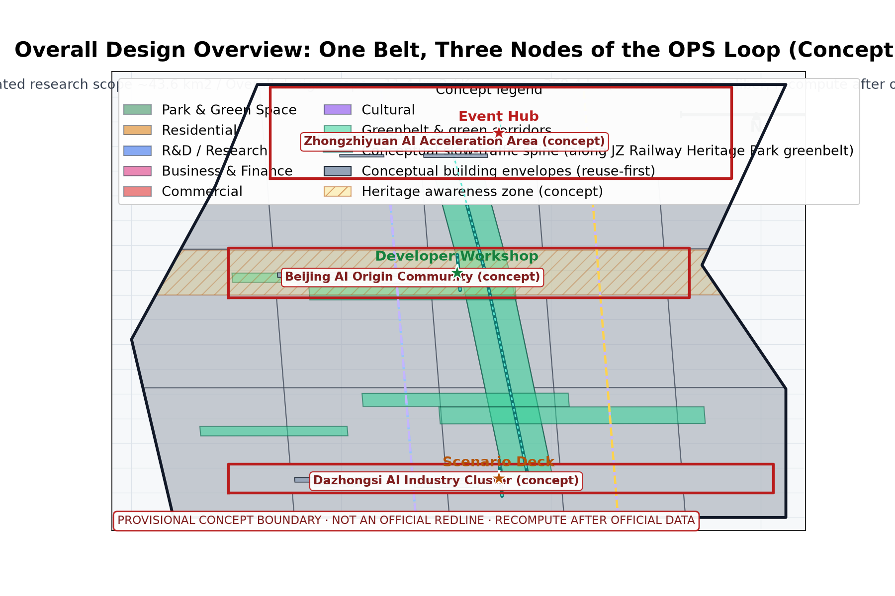
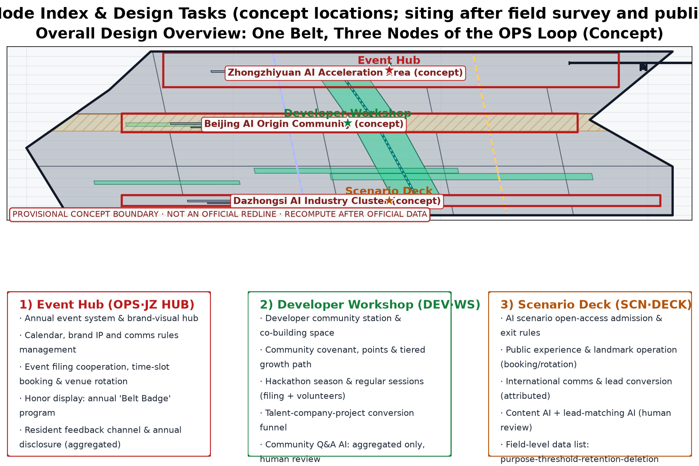
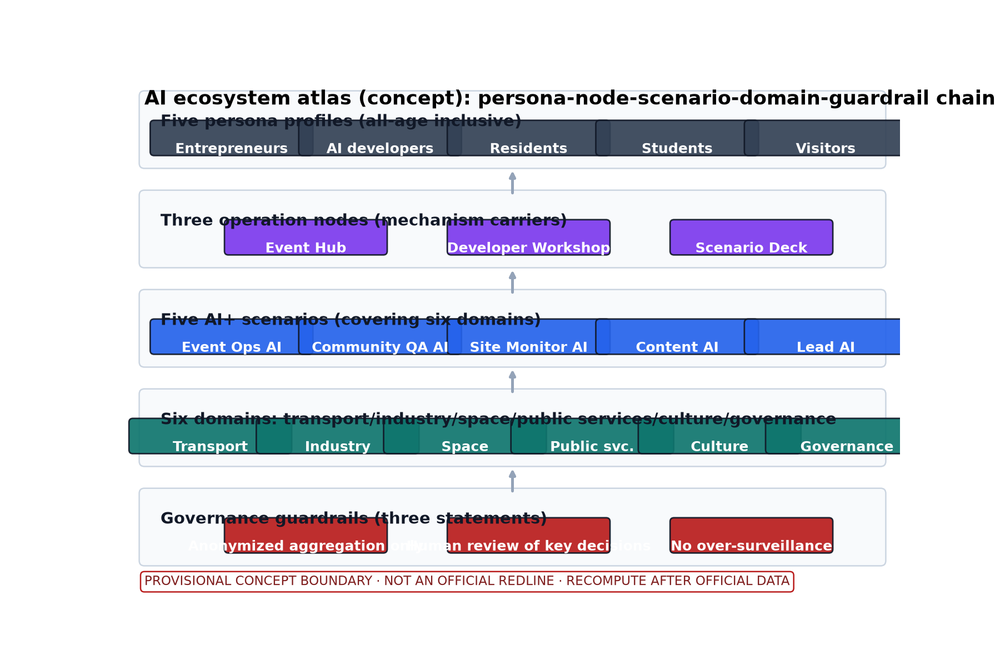
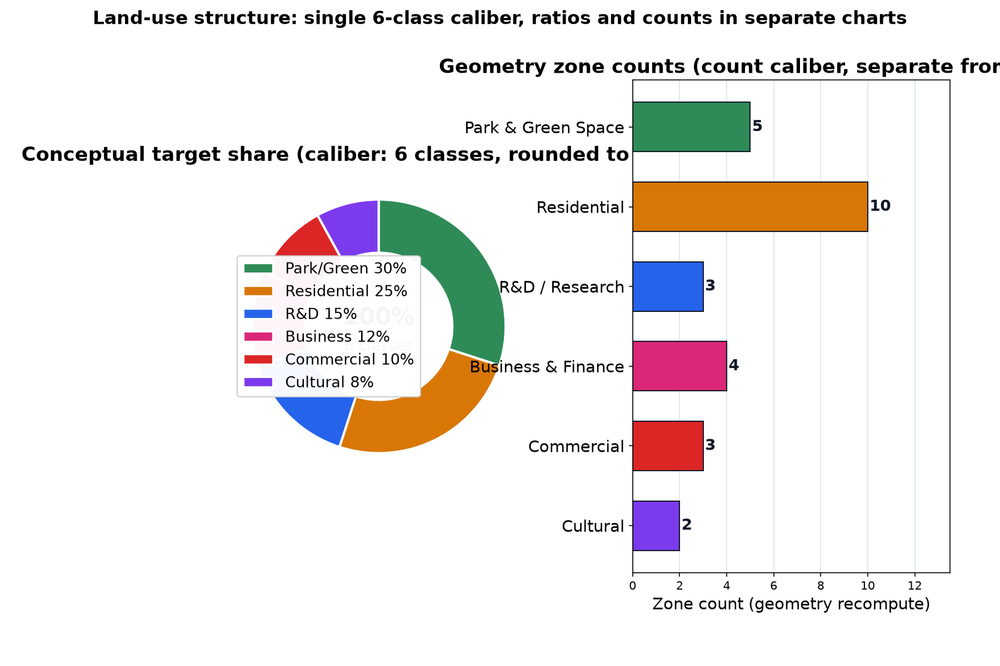
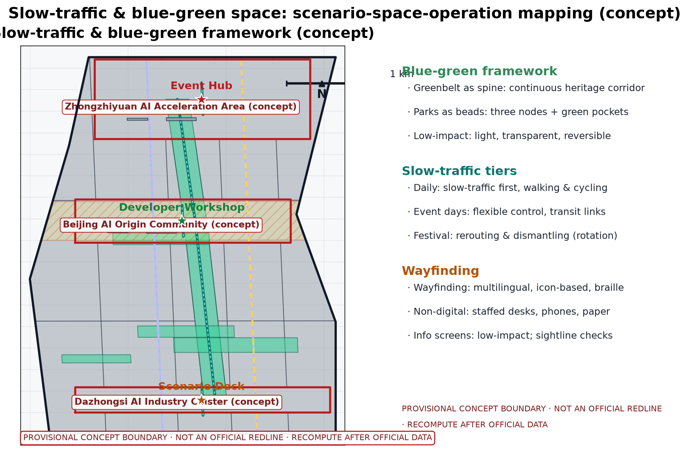
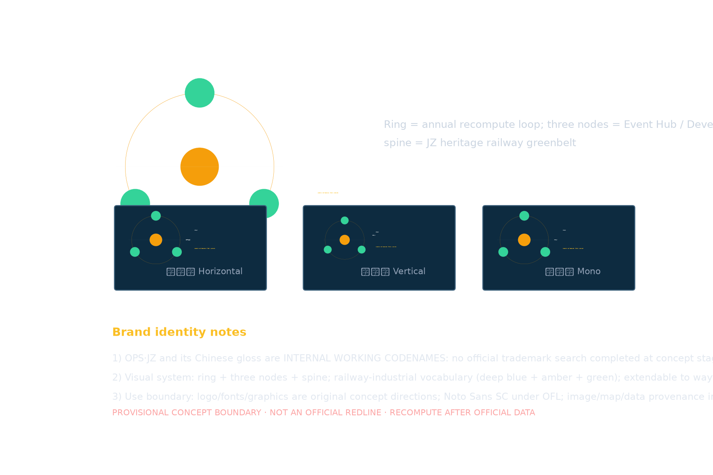
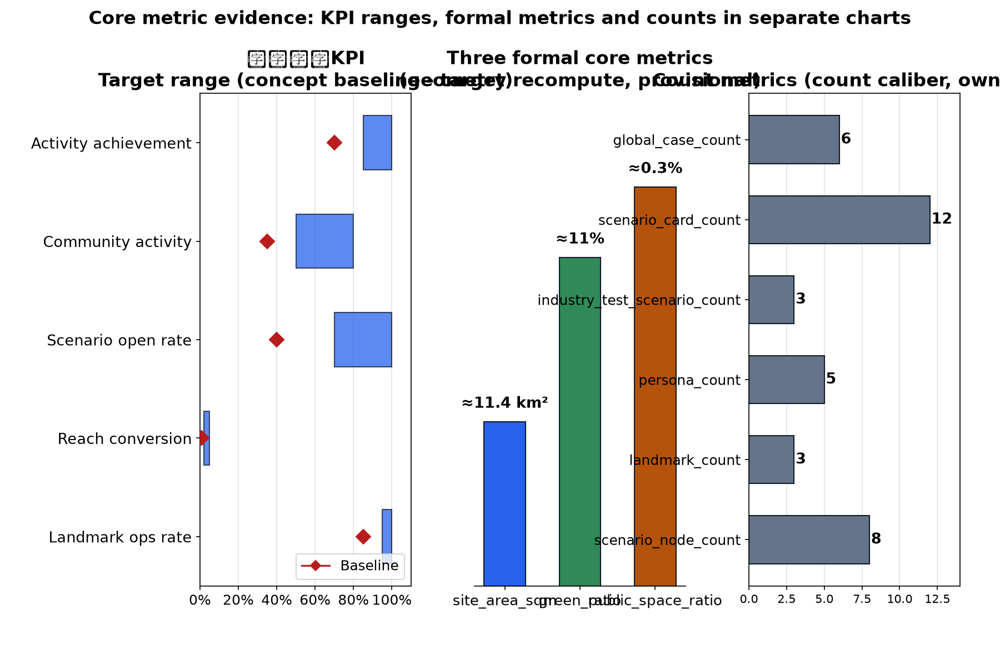

> This draft is a concept suggestion: event arrangements, brand content and operation mechanisms are conceptual descriptions and do not constitute confirmed arrangements; no FAR, building height, specific retain-renovate-demolish or engineering implementation conclusions; no fabricated data.

## Design Basis and Source List

The source list covers public historical materials, planning reports, general codes and open cases of domestic and international events and city operation; it is a working reference list, not data this package has acquired. All data actually used is listed in sources.json; items not obtained are honestly annotated in the assumptions and missing-data notes. This proposal is compiled from public calibers only: (1) the call-for-proposals announcement; (2) the taskbook, including agent.6 "Global AI Innovation Event Belt & Long-term Operation Design" (annual event system, event brand and communication visual system, developer community operation mechanism, AI scenario open-operation mechanism, public experience and city landmark operation, international communication and lead-conversion mechanism); (3) the public principle of retain-renovate-demolish along the Jingzhang Railway Heritage Park, giving priority to site texture and railway heritage; (4) open cases of domestic and international events and city operation (see Section 13, each registered in sources.json). No non-public documents are cited and no data is fabricated; international cases are reference calibers only, not data bases.

> **Evidence anchor**: [source:DATA-SRC-OFFICIAL-ANNOUNCEMENT], [source:DATA-SRC-AGENT-TASKBOOK].

## Three-Level Scope Framework

The "coordinated research - overall design - key areas" three-tier framework transmits results level by level: the coordinated research tier judges long-term operation synergies of industry and future city; the overall design tier organizes operation nodes and the slow-traffic framework around the greenbelt; the key-areas tier details three original concept nodes. Official announcement calibers (text basis): coordinated research scope about 43.6 km2, overall design scope about 11.4 km2, key areas about 368.4 ha. This package is a long-term operation concept within the overall design scope (located along the Jingzhang Railway Heritage Park in Haidian District); its three concept nodes fall within the key-areas caliber. All three-tier boundaries are provisional concept divisions that may adjust as the taskbook and base materials deepen; this package sets no land boundaries or implementation-scope conclusions; every boundary is to be recomputed after official data is published.

> **Evidence anchor**: [source:DATA-SRC-AGENT-TASKBOOK], [source:DATA-SRC-PROVISIONAL-BOUNDARIES].

## Coordinated Research Area: Industry and Future City Research

The industry and city research identifies the "fit" effect of long-term operation: universities supply talent, research content and event supply; sci-tech innovation areas supply AI scenarios and industrial demand; transit stations supply passenger distribution and accessibility; residential neighborhoods form the community-operation base and daily vitality source. This supports the "content - scenario - visitor flow - community" four-dimension coordinated operation network, forming a "operation node - innovation area - neighborhood" three-level linkage, around which the annual event system is organized. Regional synergy is proposed at concept level: cooperation intents, resource interfaces and annual touchpoints with Beiwai Community, Future Science City, Huairou Science City, Beijing Economic-Technological Development Area (E-Town) and the Beijing-Tianjin-Hebei region are listed as proposals and matters to be negotiated; no cooperation, investment attraction, funding or government commitments are fabricated. Future city research is directional only and constitutes no commitment on land use or investment; no visitor-flow or industry data is estimated.

> **Evidence anchor**: [source:DATA-SRC-AGENT-TASKBOOK], [source:DATA-SRC-PROVISIONAL-BOUNDARIES].

## Overall Design Area: Urban Renewal and Regulatory-Plan-Level Urban Design

The overall design emphasizes "a long-term operation environment with the greenbelt as the skeleton": operation nodes, the operation network framework and the slow-traffic system are organized along the Jingzhang Railway Heritage Park greenbelt, building a "zone - node - facility" three-level operation network; operation facilities can grow reversibly and streets can carry events and festivals on a time-shared basis. Renewal rather than new construction is emphasized; existing space is prioritized for operation functions. Greenbelt texture and railway heritage are preserved first and operation layout yields to heritage protection. Regulatory-plan depth is only a verification suggestion used to check the compatibility of operation facilities and the slow-traffic system; no FAR, height or other numeric conclusions are given and no numeric indicators are presupposed. This level also carries the spatial interface concept of the three-zone-two-wing synergy (see Section 3); everything is a concept suggestion.

> **Evidence anchor**: [source:DATA-SRC-MOHURD-CONTROL-DETAILED-PLANNING], [source:DATA-SRC-PROVISIONAL-BOUNDARIES].

## Detailed Design of Key Areas

Three original nodes are proposed (all concept locations, no specific parcels designated; final siting requires field survey, document verification, authority assessment and public input): (1) the Event Hub - the operation hub of the annual event system and the event brand & communication visual system, coordinating the event calendar, brand IP and visual rules; (2) the Developer Workshop - the developer community station carrying community mechanisms and daily co-building; (3) the Scenario Deck - an integrated operation platform for AI scenario opening, public experience and city landmark operation, international communication and lead conversion. Greenbelt movement lines and slow-traffic channels between nodes form a complete operation route. The three landmark directory entries (concept): Event Hub landmark (annual main venue and honor wall), Developer Workshop landmark (community co-building living room), Scenario Deck landmark (public experience and outcome exhibition), configured with the "Belt Badge" honor display system and a reversible public-space component library (activity stands, temporary galleries, time-shared furniture - demountable, movable, reusable).

> **Evidence anchor**: [data:PACKAGE-GEOMETRY], [source:DATA-SRC-PROVISIONAL-BOUNDARIES].

## AI Innovation Ecosystem, Personas, and AI+ Scenarios

Five persona profiles are defined: entrepreneurs, AI developers, community residents, students and visitors, with differentiated content and touchpoints; coverage extends to seniors, persons with disabilities, families and children, commuters and corridor workers, forming an all-age inclusive operation target. Five AI+ systems act as core and support systems, all following the three governance statements: anonymized aggregation only, human review of key decisions, and no over-surveillance (no individual-identifying tracking).

| System | Spatial carrier | AI capability | Data & privacy boundary | Operator |
|---|---|---|---|---|
| Event Ops AI | Event Hub and corridor event venues | Event scheduling, session and booking organization, transport/spatial dispatch suggestions | Anonymized aggregated visitor statistics, boundaries disclosed in advance, no individual-identifying tracking | Operation team and volunteers |
| Community QA AI | Developer Workshop and community interface | Public-service Q&A and community co-building information synthesis | Anonymized aggregated data only, human-review fallback | Developer community, universities and student volunteers |
| Site Monitor AI | Corridor slow-traffic axis and public-space sensing nodes | Public-space and transport status monitoring, anomaly alerts | Aggregate statistics and alerts only, no over-surveillance, human review | Operation and specialist teams |
| Content AI | Scenario Deck communication interface | Multilingual content and culture narrative generation | Human review and attribution of generated content, no factual distortion | Communication and visual specialist teams |
| Lead-Matching AI | Scenario Deck industry service interface | Industry factor matching and negotiation lead synthesis | Anonymized aggregation and human review, no individual profiling | Operation and industry-service specialist teams |

The AI innovation ecosystem atlas (concept) runs the full chain "persona - node - scenario - domain - guardrail": five persona profiles, three operation nodes, five AI+ scenarios, the six-domain mapping (transport/industry/space/public services/culture/governance), and the anonymization/human-review guardrail (see ecosystem-atlas figure). Technical protocols are proposed at concept level: model evaluation and benchmark testing, data quality verification, error stratification with false-alarm-rate control, runtime monitoring with human takeover plan; none constitute engineering conclusions.

Scenario cards are expanded per the taskbook requirement (12 cards, concept caliber, each with data-field boundary and human-review point):

| Scenario card | Target group | Spatial carrier | Data fields & privacy boundary | Operation mechanism & success standard |
|---|---|---|---|---|
| Event registration & booking | Residents, visitors, youth | Event Hub | Sessions, time slots, headcount (aggregated); no individual trajectory collection | Booking system + annual disclosure; punctuality rate >= 0.9 |
| Event-day slow-traffic guidance | Commuters, visitors | Slow-traffic axis & stations | Anonymized aggregated flow; no individual-identifying tracking | Time-shared flexible control; queuing alert <= 15 min |
| Developer co-building Q&A | AI developers, students | Developer Workshop | Questions and answers (de-identified); human-review fallback | Community covenant + points tiering; answer adoption >= 0.6 |
| Hackathon season review | AI developers, enterprises | Developer Workshop | Project materials (author-authorized); anonymous score aggregation | Filing + volunteer review; participant conversion >= 0.2 |
| Scenario open booking | Families, parents-children | Scenario Deck | Booking slots (aggregated); no child data collection | Booking + rotation; open rate >= 0.7 |
| Landmark operation monitoring | Operation team | Three landmarks | Facility status aggregate statistics; no image retention | Human-reviewed alerts; intactness >= 0.95 |
| Multilingual guide Q&A | Visitors | Three nodes | De-identified Q&A logs; deleted within 7 days | Human review; answer accuracy >= 0.85 |
| Content generation | International visitors, public | Scenario Deck | Generated content traceability; attribution | Human review before release; no factual errors |
| Lead synthesis | Enterprises, entrepreneurs | Scenario Deck | Public enterprise information only; no individual profiling | Human review; effective lead conversion >= 0.05 |
| Community feedback collection | Residents, vulnerable groups | Community interface | Anonymized opinion aggregation; monthly deletion | Deliberation + annual disclosure; resolution rate >= 0.8 |
| Event-noise handling | Residents, surrounding neighborhoods | Around Event Hub | Aggregated decibel statistics; no individual collection | Tiered alert + venue rotation; complaint response <= 24 h |
| Emergency & dismantling | All participants | Three nodes | Digitalized emergency plan; no identity information collection | Stop conditions trigger dismantling; drills >= 2/year |

Industry test scenarios (3, concept protocols; success standards are process suggestions, not commitment metrics):

| Test scenario | Verification content | Data & error requirements | Success standard |
|---|---|---|---|
| Event-day crowd simulation | Slow-traffic axis & station distribution model | Anonymized aggregate input; error stratification | Simulation vs. measured deviation <= 15% (concept target) |
| Community QA stress test | Concurrency and accuracy of Q&A AI | Benchmark set + data quality checks | Availability >= 0.99; false-alarm rate <= 5% |
| Content compliance review | Factuality and copyright attribution of generated content | Full manual review traceability | 100% pre-release review rate |

> **Evidence anchor**: [source:DATA-SRC-GENERATIVE-AI-INTERIM-MEASURES], [metric:persona_count], [metric:industry_test_scenario_count].

## Land Use, Building Scale, and Retain-Renovate-Demolish Strategy

The retain-renovate-demolish strategy combines all three with retention first: preserve the heritage park texture and railway relics, functionally repurpose existing buildings and reserve operation-oriented renovation directions (event space interfaces, display windows); demolition is limited to case-by-case small buildings that unblock the slow-traffic system. Operation facilities are light-touch, reversible and low-footprint; no large new volumes. Land use adopts a single recompute caliber (6 classes, names per the national land-use classification): park & green space 30%, residential 25%, R&D 15%, business & finance 12%, commercial 10%, cultural 8% - all conceptual target shares aggregated and recomputed from this package's geometry; the whole set is recomputed after official data is published; ratios and zone counts are shown in separate charts; provisional areas and ratios are shown at reasonable precision only. No land scale, floor area or retain-renovate-demolish quantities are presupposed; final conclusions await statutory procedures.

> **Evidence anchor**: [source:DATA-SRC-MNR-LAND-USE-CLASSIFICATION-202311], [data:PACKAGE-GEOMETRY].

## Transport, Rail, Municipal Infrastructure, and Public Services

The traffic concept puts slow traffic first: a continuous slow-traffic axis links the Event Hub, Developer Workshop and Scenario Deck; event-day crowd organization is integrated with the slow-traffic system and connects universities, parks and transit stations (distribution mainly by walking and cycling); event information screens and wayfinding are placed along slow-traffic spaces with low impact. Transit-station distribution is smooth and event shuttles rely on public transport and slow traffic rather than large-scale car distribution. Municipal facilities follow intensive sharing: integrated concept interfaces for event power supply, network, water/drainage and temporary facilities, prioritizing existing conditions, flexibly dispatched by event load. Public services include multilingual information, event reception and co-study spaces; barrier-free facilities, elderly-friendly services and child-friendly activity spaces are on the configuration list; all AI decisions include human review. All of the above are concept arrangements without presupposed engineering values.

> **Evidence anchor**: [source:DATA-SRC-MOHURD-URBAN-DESIGN-MEASURES], [source:DATA-SRC-BARRIER-FREE-ENVIRONMENT-LAW].

## Blue-Green Network, Public Space, and Urban Character

A "greenbelt as axis, node parks as beads" blue-green public-space system is proposed: the heritage park greenbelt forms the blue-green skeleton linking small green pockets and open spaces along the belt; event and operation facilities integrate with parks in a light, transparent, reversible way without blocking heritage views or greenbelt sightlines. No structure or temporary installation may block heritage sightline corridors; sightline verification is a precondition of event-installation permits. The cultural wayfinding system is configured multilingual, icon-based, with braille and low-level information, covering audiovisual-impaired users and people with low digital skills; event information and interpretation systems stay restrained and unified. The urban character continues the Jingzhang railway industrial vocabulary in dialogue with an ordered innovative atmosphere; overall guidance is restrained and unified, avoiding symbol stacking and slogan-like packaging. This section states concept-level principles only, with no specific design indicators or character values.

> **Evidence anchor**: [source:DATA-SRC-MOHURD-URBAN-DESIGN-MEASURES], [source:DATA-SRC-BARRIER-FREE-ENVIRONMENT-LAW].

## Renewal Projects, Implementation Policy, and Phasing

Four concept project lists (event system / community operation / scenario opening / communication conversion) are concept inventories; scale and investment estimates are qualitative tiers only (low/medium/high, with estimation method, price base period, coverage and recompute trigger in assumptions.json) and contain no precise amounts. Phasing: near term 1-3 years - pilot-area sample events and base mechanisms (event filing cooperation, community operation covenant, scenario admission rules) to validate the operation model; mid term 3-5 years - the three nodes built and the annual event system mature; long term 5-10 years - belt-wide long-term operation and brand-asset accumulation. The pilot scope is determined only after official boundaries are published together with authority opinions and public deliberation; this proposal presets no conclusion. Participants cover government (coordination, filing and approval), enterprises (scenarios and factors), universities (research and talent), residents and communities (deliberation and covenant co-building), operation and volunteer teams (daily execution), merchants (supporting services) and specialist teams (communication, design, engineering review). Lead and collaboration relationships are defined by a concept operation responsibility matrix (RACI), with stop conditions and exit mechanisms: scenarios that miss concept baselines after admission, or that trigger public-safety incidents, are suspended, dismantled and re-evaluated per procedures; event facilities are reversibly removed. The annual event system is organized on the following concept rhythm:

| Annual program | Tier & frequency | Mechanism points |
|---|---|---|
| Global AI Innovation Week | Annual flagship program | Filing cooperation + annual disclosure; main venue at the Event Hub |
| Developer Hackathon Season | Quarterly core node | Volunteers + points tiering; developer community growth path |
| Belt Open Public Days | Monthly public experience | Booking + venue rotation; family and child-friendly sessions |
| Festival and monthly regular events | Monthly/festival multi-frequency | Alliance co-building + deliberation; tiered rollout along the belt |

The event brand and communication visual system (concept): "Operation Intelligence Loop (OPS·JZ)" is the core brand direction - ring symbol + three nodes + spine form the Logo direction (see figure), with the "Belt Badge" honor system, component library and multilingual communication rules. OPS·JZ is treated as an internal working codename at the concept stage; it is not used externally or registered until an official trademark search is completed.

> **Evidence anchor**: [source:DATA-SRC-AGENT-TASKBOOK], [metric:annual_program_count].

## Metrics, Area Recalculation, and Compliance Matrix

Five operation KPIs (activity achievement, community activity, scenario open rate, reach conversion, landmark operation intactness) are in metrics.json as process indicators, not commitment indicators; definitions, formulas, baselines, target ranges, collection frequency and owners:

| KPI | Formula | Baseline | Target range | Frequency | Owner |
|---|---|---|---|---|---|
| Activity achievement | events delivered / planned | 0.70 | 0.85-1.00 | annual | operation lead |
| Community activity | monthly participation / registered members | 0.35 | 0.50-0.80 | monthly | community ops |
| Scenario open rate | opened scenarios / admitted total | 0.40 | 0.70-1.00 | quarterly | scenario ops |
| Reach conversion | intent leads / reach | 0.01 | 0.02-0.05 | quarterly | comms team |
| Landmark ops rate | intact facilities / landmark total | 0.85 | 0.95-1.00 | monthly | facility management |

The three formal core metrics (site_area_sqm, green_ratio, public_space_ratio) are recomputed from this package's geometry, with official text calibers as the base (overall design about 11.4 km2): this package's provisional geometry recomputes to about 11.41 km2, green ratio about 11%, public-space ratio about 0.3% - all provisional values shown at reasonable precision only; the whole set is recomputed and versioned after official data is published. The compliance matrix states red lines: no exaggerated event effects, no conceptual arrangements presented as confirmed decisions, slogans must carry operation mechanisms, no confirmed commitments on investment attraction, policies or funding; ratio and count indicators are shown in separate charts; every indicator carries source/formula/confidence level/use restriction/recompute trigger.

> **Evidence anchor**: [metric:green_ratio], [metric:public_space_ratio], [data:PACKAGE-GEOMETRY].

## Risk, Copyright, and Compliance

This proposal is concept research and does not constitute an administrative approval basis or FAR/height/retain-renovate-demolish/engineering-feasibility conclusions. Risks are registered across six dimensions in assumptions.json (event effect and participation fluctuation, brand and IP rights, AI-generated content copyright, scenario-opening data boundaries, lead-conversion uncertainty, unknown heritage/greenline control conditions), with response principles of anonymized aggregation, attribution, human review, feedback channels and statutory procedures. Data and privacy follow per-scenario field-level lists: each AI scenario lists data fields, purpose, aggregation threshold, retention and deletion period, human escalation path and incident response flow (see scenario cards in Section 6); data boundaries and retention/deletion rules are disclosed in advance; no individual-identifying tracking and no large-scale behavior profiling. Inclusion and public safety: barrier-free and elderly-friendly services, non-digital channels, resident co-creation and appeals mechanisms, event-noise governance (tiered alerts + venue rotation), emergency exit and stop conditions (see Section 10). Brand and rights: per-asset author/source/license/modification/attribution/display-and-embedding permissions and limits for the OPS·JZ name and Logo, fonts, images, maps, data, code and AI-generated content are in report/copyright_statement.md and sources.json; no official trademark search has been completed at the concept stage, so the name and marks are treated as internal working codenames restricted from external use and registration; "any resemblance is coincidental" is a statement, not a rights verification.

> **Evidence anchor**: [source:DATA-SRC-OFFICIAL-ANNOUNCEMENT], [source:DATA-SRC-GENERATIVE-AI-INTERIM-MEASURES].

## References

References follow the government-issued versions and are archived by public/internal category with access dates: public Jingzhang railway history and heritage park materials; Beijing master plan and district plan public calibers; Beijing urban renewal special plan, implementation opinions and supporting documents; taskbook agent.6 long-term-operation caliber and public collaboration rules; approved sources such as the Barrier-Free Environment Law (see sources.json); field-survey records and self-drawn analysis sketches (self-collected for this project). International and domestic benchmarks are reference calibers only, not data bases; per-case source, access date and reuse boundary are registered in sources.json (with "research hypothesis" demotion notes where unverifiable):

| Case | Type | Mechanism points | Benchmark & reverse validation | Localized innovation | Source |
|---|---|---|---|---|---|
| SXSW (USA) | Annual event & city brand | Annual festival + city brand linkage | Event-city communication linkage mechanism | Event Hub annual event system | [source:DATA-SRC-CASE-SXSW] |
| CES Las Vegas | Expo & industry attraction | Expo aggregates industry factors | Lead-conversion loop needs long-cycle validation | Scenario Deck Lead-Matching AI | [source:DATA-SRC-CASE-CES] |
| Web Summit Lisbon | Conference international comms | International comms tied to host city | City capacity needs supporting facilities | Multilingual comms & wayfinding | [source:DATA-SRC-CASE-WEBSUMMIT] |
| Setouchi Triennale (Japan) | Art festival long-term local operation | Local community long-term participation | Community will determines sustainability | Community covenant & deliberation | [source:DATA-SRC-CASE-SETOUCHI] |
| Beijing Zhongguancun Forum | Domestic flagship conference | Innovation factors & policy platform | Staggered synergy with official events | Annual calendar staggering | [source:DATA-SRC-CASE-ZGCFORUM] |
| Shanghai WAIC | Domestic AI expo | AI industry showcase & talent aggregation | Attention to safety and compliance expression | Three governance statements & human review | [source:DATA-SRC-CASE-WAIC] |

> **Evidence anchor**: [source:DATA-SRC-OFFICIAL-ANNOUNCEMENT], [metric:global_case_count].
