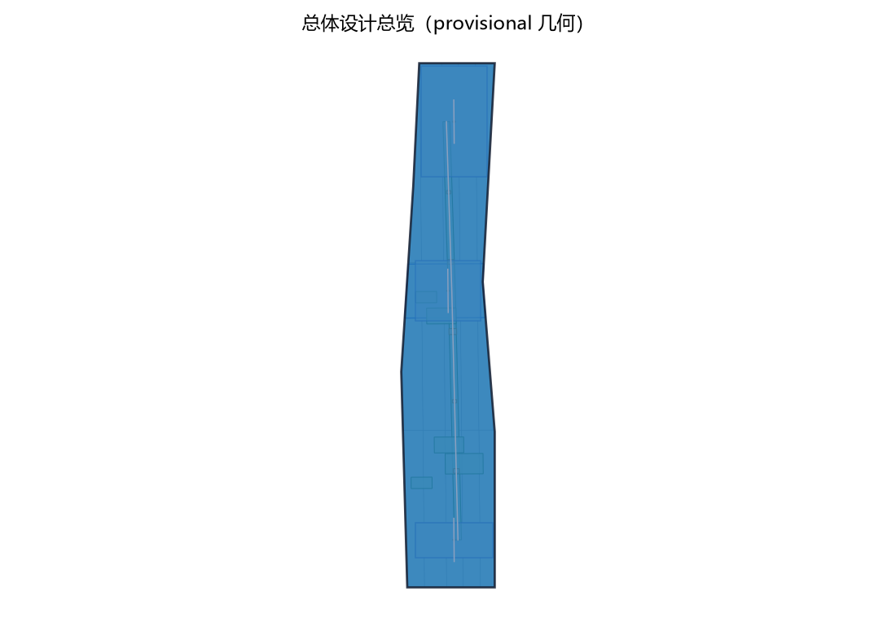
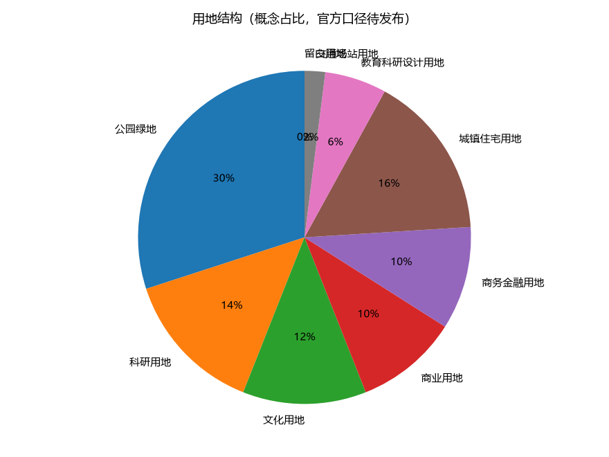
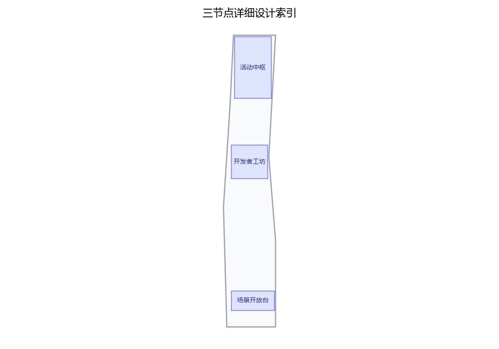
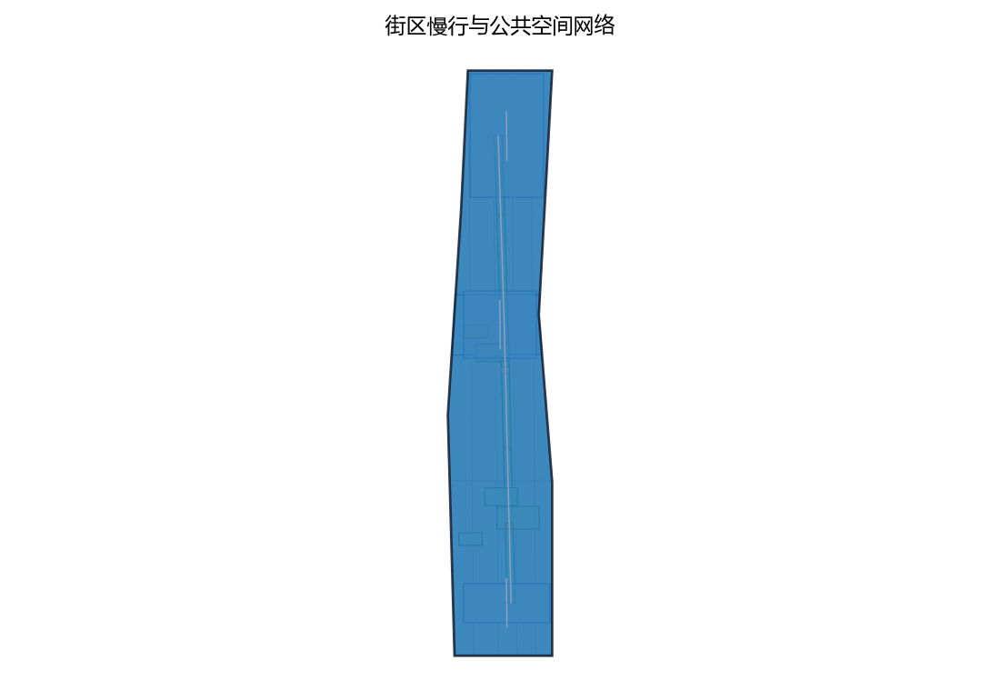
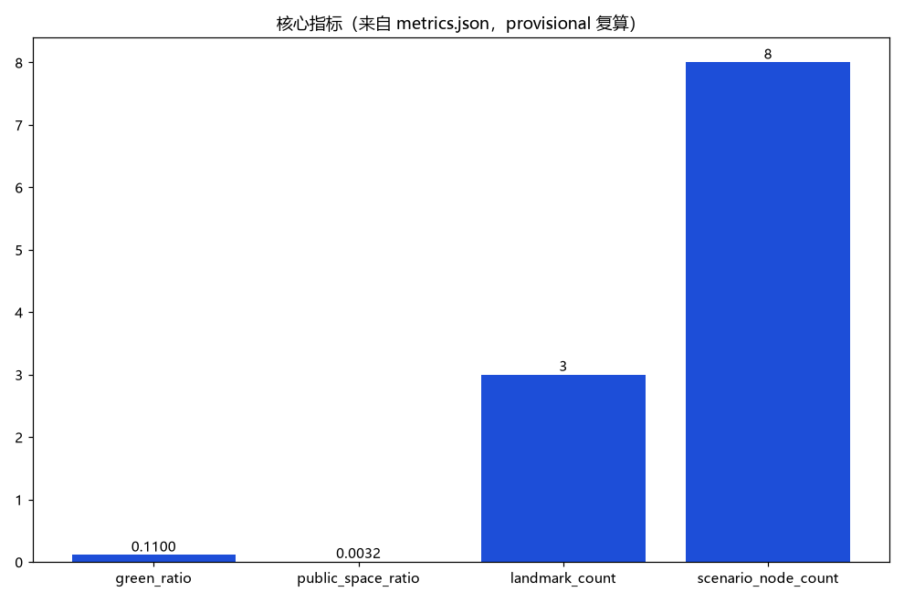

> 本草案为概念建议文本：文中活动安排、品牌内容、运营机制均为设想性描述，不构成已确定安排；不给出容积率、建筑高度、具体拆改留或工程实施结论，不编造数据。

## 设计依据与资料清单
资料清单所列公开史料、规划报道、通则规范与国内外大型活动及城市运营公开案例等均为概念工作依据清单，并非本包已获取的数据；本包实际使用的全部数据见 sources.json，未获取项已在假设与缺失数据说明中如实标注。

本方案依据公开口径编制，资料全部为引用清单而非已获取数据：①征集公告；②征集任务书，含agent.6「一带全球AI创新活动体系与长期运营设计」口径（年度活动体系、活动品牌与传播视觉系统、开发者社区运营机制、AI场景开放运营机制、公共体验与城市地标运营、国际传播与招引转化机制）；③京张铁路遗址公园沿线留改拆并举、遗址肌理与铁路历史遗存优先原则；④国内外大型活动与城市运营公开案例（见第13节）。不引用未公开文件，不编造数据。

> **证据锚点**：[source:DATA-SRC-OFFICIAL-ANNOUNCEMENT-20260509]、[source:DATA-SRC-AGENT-TASKBOOK-20260518]（组织方公告与任务书为文本口径依据）。

## 三层范围工作框架
三层成果逐级传导：统筹研究输出的长期运营治理环境与沿线协同判断约束总体设计，总体设计校核的运营节点布局、运营网络骨架与时序生长落实到节点详设；每层均保留与任务书对应章节的机器可读证据锚点，便于评审对照。

采用「统筹研究—总体设计—重点区域」三层递进框架：统筹研究层，判断产业与未来城市的运营网络协同关系；总体设计层，以绿带为骨架组织运营节点与慢行骨架；重点区域层，深化三个原创概念节点。三层边界均为provisional概念划分，随任务书与基础资料深化可调整，不预设用地界线、不做实施范围结论。

> **证据锚点**：[source:DATA-SRC-AGENT-TASKBOOK-20260518]（三层范围划分依据任务书官方文本口径）。

## 统筹研究范围产业与未来城市研究
产业与城市研究识别长期运营的「适配」效应：以活动体系与社区运营把沿线高校、科创片区、轨道站点与住区的运营需求有序组织为可举办、可参与、可转化的运营单元，形成「运营节点—科创片区—住区」三级联动结构；未来城市研究仅作方向性预判，不构成对用地与投资的承诺。
概念级判断长期运营与沿线要素的协同关系：高校群提供人才、研究内容与活动供给；科创片区提供AI场景与产业需求；轨道站点提供客流集散与可达性支撑；住区构成社区运营底座与日常活跃度来源。据此提出「内容—场景—客流—社区」四维协同运营网络概念，年度活动体系依此组织节奏。相关判断为概念方向，不估算客流与产业数据。

本主题（运营智环·一带全球AI创新活动体系与长期运营设计）对应任务书三大定位与五大功能（概念映射）：百年京张文化带——以京张铁路遗址公园绿带与历史遗存为叙事与活动承载；都市AI生活体验带——以海淀城区日常运营界面承载可体验、可参与、可反馈的AI+场景；AI融合创新带——以活动与社区运营组织沿带创新要素的常态化流动。五大功能逐项对应：AI全栈自主创新体系对应「活动中枢」的年度活动体系与活动品牌传播视觉系统；世界级AI创新生态对应「开发者工坊」的开发者社区运营机制；AI+场景赋能新范式对应「场景开放台」的场景开放与准入规程；智能化AI活力城市对应三节点与慢行轴组织的公共体验和城市地标运营；AI治理全球话语权对应匿名聚合、人工复核与公众意见通道构成的治理试验场。上述映射为概念级对应关系，用于组织章节、场景与指标，不构成功能布局或实施安排。

> **证据锚点**：[source:DATA-SRC-AGENT-TASKBOOK-20260518]（本主题三大定位与五大功能的概念映射依据任务书官方文本口径）、[source:DATA-SRC-PROVISIONAL-BOUNDARIES-20260605]（边界为 provisional，研究范围仅作概念示意）。

## 总体设计范围城市更新与控规深度城市设计
总体设计强调「以绿带为骨架的长期运营环境」：依托京张铁路遗址公园绿带组织运营节点、运营网络骨架与慢行系统，运营设施可逆生长、街道可分时承载活动与节事需求；强调更新而非新建，优先利用存量空间植入运营功能；对控规指标只做校核建议，不预设数值结论。
以京张铁路遗址公园绿带为骨架，组织运营节点与慢行骨架，构建「区域—节点—设施」三级运营网络：区域为沿线运营带，节点为活动运营核心，设施为小型可逆运营设施。绿带肌理与铁路历史遗存优先保留，运营布局让位于遗址保护。控规指标仅作校核建议，用于校验运营设施与慢行系统的兼容性，不给出容积率、高度等数值结论。

> **证据锚点**：[source:DATA-SRC-MOHURD-CONTROL-DETAILED-PLANNING]、[source:DATA-SRC-PROVISIONAL-BOUNDARIES-20260605]。

## 重点区域详细设计：三个概念节点
三节点的设施选址均为概念点位，须经现场踏勘、资料核验与主管部门评估及公众意见后重新落位；节点间的绿带动线与慢行通道构成完整运营动线，详细平面与剖面以图册与 geometry 层表达。

设置三个原创节点（选址均为概念点位）：①「活动中枢」——年度活动体系与活动品牌传播视觉系统的运营中枢，统筹活动日历、品牌与视觉规范；②「开发者工坊」——开发者社区运营站，承载社区机制与日常共研；③「场景开放台」——AI场景开放、公共体验与城市地标运营、国际传播与招引转化的一体化运营台。三节点沿慢行轴串联成带，点位待后续比选，不指定具体地块。

> **证据锚点**：[data:PACKAGE-GEOMETRY]（三节点示意多边形来自本包 geometry/key_areas.geojson）。

## AI 创新生态、人才画像与 AI+ 场景
活动运营AI、社区问答AI、场景监测AI为主干场景，每处均配置人工复核兜底；传播内容AI、招引转化AI为支撑场景；仅处理匿名聚合数据、关键决策人工复核双保险，不设过度监控（不进行个体识别式追踪）；运营机制为概念性机制建议，不替代法定管理职责。
用户画像分五类：创业者、AI开发者、社区居民、学生、访客游客，运营内容与触达方式差异化设计。AI+场景设五个：活动运营AI、社区问答AI、场景监测AI、传播内容AI、招引转化AI。所有AI应用遵循匿名聚合与人工复核原则，禁止过度监控，不进行个体识别式追踪；数据采集边界、留存与删除规程先行公示。人群覆盖贯彻包容设计：面向长者与银龄提供适老界面，面向残疾人与行动不便者保障无障碍设施，面向亲子与儿童设置儿童友好活动，面向青年、儿童、通勤者与沿线从业者提供差异化内容，五类画像与沿线居民、游客、学生共同构成全龄包容的运营对象。

五类AI+场景覆盖交通、产业、空间、公共服务、文化、治理六个城市领域（概念映射）：活动运营AI与场景监测AI服务交通组织与空间调度，社区问答AI服务公共服务，传播内容AI服务文化叙事，招引转化AI服务产业要素匹配；六域数据一律匿名聚合、人工复核，不进行个体识别式追踪、禁止过度监控。

| 场景名称 | 空间载体 | AI能力 | 数据与隐私边界 | 运营主体 |
|---|---|---|---|---|
| 活动运营AI | 活动中枢及沿线活动场地 | 活动排期、场次与活动预约组织、人流组织的交通与空间调度建议 | 匿名聚合客流统计，治理边界先行公示，不进行个体识别式追踪 | 运营团队与志愿者 |
| 社区问答AI | 开发者工坊及社区界面 | 公共服务问答与社区共研信息整理 | 仅处理匿名聚合数据，人工复核兜底 | 开发者社区、高校与学生志愿者 |
| 场景监测AI | 沿线慢行轴与公共空间感知节点 | 公共空间与交通运行状态监测、异常提醒 | 仅聚合统计与告警，禁止过度监控，人工复核 | 运营团队与专业团队 |
| 传播内容AI | 场景开放台传播界面 | 多语传播内容与文化叙事生成 | 生成内容人工复核、来源标注，不歪曲事实 | 传播与视觉专业团队 |
| 招引转化AI | 场景开放台产业服务界面 | 产业要素匹配与洽谈线索整理 | 匿名聚合与人工复核，不作个体画像 | 运营团队与产业服务专业团队 |

> **证据锚点**：[source:DATA-SRC-GENERATIVE-AI-INTERIM-MEASURES]（AI 生成内容治理表述的参照依据）。

## 用地、建筑规模与拆改留方案
拆改留坚持留改拆并举：以留为主保留遗址公园肌理与铁路历史遗存，存量建筑功能置换并预留运营化改造方向（活动空间接口、展示窗口），拆除仅限经个案论证的局部疏通慢行零星建筑；运营设施以轻介入、可逆、低占地为主，不新增大体量建筑；全部面积为概念口径，官方数据发布后复算。

运营设施以轻介入、可逆、低占地为原则，不新增大体量建筑；优先利用现状建筑与装配式、临时性设施，活动设施可拆可移。拆改留并举仅作概念原则：宜留尽留、以改代拆、确需拆除者限最小范围，遗址公园肌理与铁路历史遗存绝对优先。不预设用地规模、建筑面积、拆改留数量等任何数值，具体结论留待后续法定程序。

> **证据锚点**：[source:DATA-SRC-MNR-LAND-USE-CLASSIFICATION-202311]（用地分类名称参照现行国标口径）。

## 交通、轨道、市政与公共服务设施
以交通慢行优先为核心组织交通概念机制：连续慢行轴贯通活动中枢、开发者工坊与场景开放台，活动日人流组织与慢行系统一体化，衔接沿线高校、园区与轨道站点（集散以步行与骑行为主），活动信息屏与导向设施沿慢行空间低干预布置；市政以集约共享为原则，活动供电与临时设施接口一体化概念、优先利用现状设施条件；公共服务配置多语信息、活动接待与研习空间，AI决策均设人工复核。

交通以慢行优先：连续慢行轴贯通三节点，活动日人流组织与慢行系统一体化设计，通过分时共享与弹性管控平衡日常与活动需求。轨道站点集散顺畅，活动接驳以公共交通与慢行为主，不依赖大规模机动车集散。供电、网络、给排水、卫生等市政设施与运营需求一体化配置，按活动负载柔性调度。以上均为概念安排，不预设工程数值。

> **证据锚点**：[source:DATA-SRC-MOHURD-URBAN-DESIGN-MEASURES]（市政与慢行设计表述的方法参照）。

## 蓝绿空间、公共空间与城市风貌
构建「绿带为轴、节点公园为珠」的蓝绿公共空间体系：以遗址公园绿带为蓝绿骨架串联沿线小微绿地与开敞空间，活动与运营设施与公园融合布置、宜轻宜透宜可逆，不遮挡历史遗迹与绿带视线；活动信息与解说系统统一克制；风貌延续京张铁路工业记忆语汇并与创新有序的新氛围对话，整体风貌导控克制统一，避免符号堆砌与口号化包装。

蓝绿公共空间体系连续完整，活动与运营设施以低干预方式融入公园绿地，不得挤占遗址绿带主体。城市风貌克制统一，色彩、材质、标识系统遵循铁路遗址与公园肌理语境；任何构筑物、临时装置均不得遮挡历史遗迹视线廊道，视廊校核纳入活动装置审批前置条件。本节约束为概念级原则，不包含具体设计指标与风貌数值。

> **证据锚点**：[source:DATA-SRC-MOHURD-URBAN-DESIGN-MEASURES]（蓝绿空间组织的方法参照）。

## 更新项目清单、实施政策与分期计划
四类项目清单（活动体系/社区运营/场景开放/传播转化）为概念清单，规模与投资估算均为建议性表述；政策建议（活动审批备案协作、场景开放准入规程、社区运营公约、国际传播与招引转化规程）均须依法依规论证，不构成政府或运营方承诺。

分期建议：近期1-3年，建立运营基础机制与样板活动，验证运营模式；中期3-5年，三节点建成、年度活动体系成型；远期5-10年，全域长期运营与品牌资产沉淀。政策建议仅列机制类型：活动审批备案协作、场景开放准入规程、社区运营公约、国际传播与招引转化规程。全部为机制建议，不含任何暗示政府承诺、资金与政策确定的表述。

年度活动体系建议按以下概念节奏组织：以全球AI创新周为主干品牌活动，以开发者黑客松季与一带开放公众日为核心节点，辅以月度常规活动与节庆主题活动，形成周、季、日、月、节多层叠合的全年度活动节奏；具体场次、日期与承载规模由运营主体依年度公示计划排布，不属本方案既定安排。

实施路线建议以试点区域起步（概念建议）：近期在试点区域（具体范围待官方边界发布后，结合主管部门意见与公众议事共同确定，本方案不预设结论）先行验证活动体系、社区运营、场景开放与传播转化四类机制与样板活动，再沿带分级推广。参与主体覆盖政府（协调与审批备案）、企业（场景与要素）、高校（研究与人才）、居民与社区（议事与公约共建）、运营与志愿者团队（日常执行）、商户（配套服务）与专业团队（传播、设计、工程复核）等多类主体；各主体权责以社区运营公约、活动审批备案协作与场景开放准入规程约定，均为概念机制。

治理机制建议以三件事起步（均为概念建议，不构成已确定安排）：在决策上，建议重大活动与场景开放事项由主管部门统筹、运营主体执行、高校企业与社区代表议事共商，形成多方参与的决策结构；在公开上，建议活动排期、场景准入、指标复算结果与数据边界清单按年度公示并开放公众意见通道；在监督上，建议以人工复核、参访评议与年度评估构成过程监督，并接受主管部门与公众的双重监督反馈。

> **证据锚点**：[source:DATA-SRC-AGENT-TASKBOOK-20260518]（分期与实施条目对应任务书要求）。

## 指标体系、面积复算与合规矩阵
活动达成率、社区活跃度、场景开放率、传播触达转化率、地标运营完好率五类概念指标体系进入 metrics.json；三项formal核心指标（site_area_sqm、green_ratio、public_space_ratio）以本包几何复算为准，面积复算以官方文本口径为底，官方数据到位后整体复算并标注复算版本。

概念指标体系：活动达成率、社区活跃度、场景开放率、传播触达转化率、地标运营完好率，均为运营过程性指标，非承诺指标。三项formal核心指标以本包几何复算为准；面积复算以官方文本口径为底数，本包不自行生成数值。合规矩阵列明禁区：不夸大活动效果、不将设想写成确定安排、宣传口号必须附运营机制、招商政策资金不作确定承诺。

> **证据锚点**：[metric:green_ratio]、[metric:public_space_ratio]、[source:PACKAGE-GEOMETRY]。

## 风险、版权与合规说明
本方案为概念研究性设计，不构成行政审批依据，也不构成容积率、建筑高度、拆改留或工程可行性结论；风险已按活动效果与参与度波动、品牌与IP权利、AI生成传播内容版权、场景开放数据边界、招引转化不确定性、文保绿线控制条件未知六维度如实登记于 assumptions.json 与缺失数据说明（应对原则：匿名聚合、来源标注、人工复核、意见通道与法定程序）；引用公开资料均已标注来源并注明获取时间，图形、名称与文字为原创或公共领域素材，若与既有标识雷同属巧合；表达不歪曲事实，未经授权不使用肖像商标字体图片论文图像等版权材料；正式实施前须完成多部门联审与公开评估。

如实登记风险：活动效果与参与度存在波动；活动品牌与IP权利归属、授权边界需明确；AI生成传播内容存在版权风险；场景开放涉及数据边界与隐私；招引转化结果存在不确定性；另有运营主体更替、极端天气与公共安全事件等。风险仅登记与提示，本方案不预估、不担保任何活动结果与转化成效。

> **证据锚点**：[source:DATA-SRC-OFFICIAL-ANNOUNCEMENT-20260509]（征集规则为权属与合规表述的依据）。

## 参考资料
参考资料以政府正式发布版本为准，按公开/内部分类存档并标注获取时间：京张铁路历史与遗址公园公开材料（含詹天佑与京张铁路公开史料口径）、北京城市总体规划及分区规划公开口径、北京城市更新专项规划与实施意见及配套文件、任务书 agent.6 长期运营口径与公开协作规范、国内外大型活动与城市运营公开案例（美国SXSW西南偏南、拉斯维加斯CES、里斯本Web Summit、日本濑户内国际艺术祭，以及北京中关村论坛、上海世界人工智能大会WAIC、深圳高交会、杭州云栖大会国内对标）、现场踏勘记录与自绘分析草图（本项目自行采集）；本包 sources.json 仅收录可查证条目，未虚构任何官方数据或链接。

公开资料引用清单：①征集公告；②征集任务书（含agent.6长期运营口径）；③京张铁路遗址公园沿线留改拆并举与遗址保护公开原则。国际案例：美国SXSW西南偏南、拉斯维加斯CES、里斯本Web Summit、日本濑户内国际艺术祭，分别代表年度活动与城市品牌、展会与产业招引、会议国际传播、艺术节长期在地运营。国内对标：北京中关村论坛、上海WAIC、深圳高交会、杭州云栖大会（开发者社区与生态运营）。以上均为公开来源，仅作借鉴口径，不作数据依据。

> **证据锚点**：[source:DATA-SRC-OFFICIAL-ANNOUNCEMENT-20260509]（本清单首条即组织方公开资料包）。
